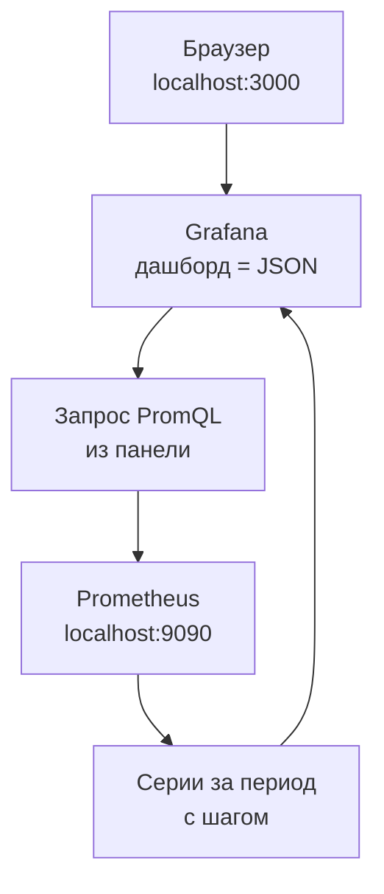
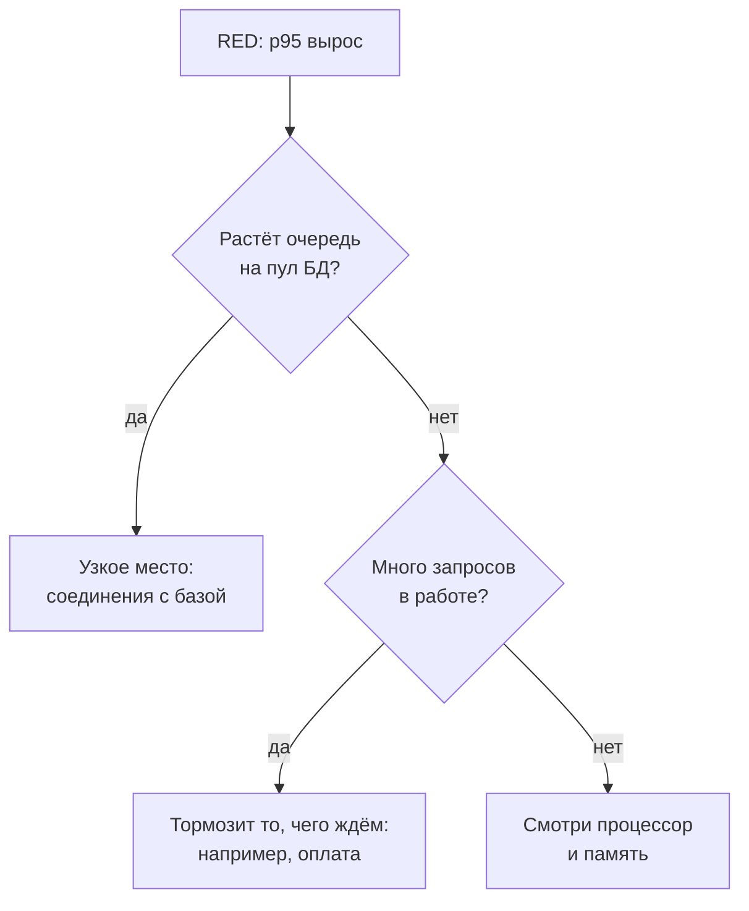

## Зачем это нужно

Я твой наставник на этом курсе, как опытный коллега за соседним столом. Расскажу, с чего началась эта тема у меня. В прошлом году на распродаже сайт магазина лёг, и никто не мог сказать почему. Один разработчик гонял `curl` в терминале, другой смотрел логи, третий уверял, что «база в порядке». Каждый видел свой кусочек, а пока они спорили, покупатели уходили. Теперь перед распродажей мы ставим приборы, и главный из них называется дашборд.

Запросы PromQL из [урока 7.2](02-promql.md) дают числа в терминале. Но во время нагрузочного теста ты не станешь каждые десять секунд перезапускать команды и сравнивать цифры в уме. Нужна **одна страница**, где рядом видно нагрузку, ошибки, задержку и загрузку ресурсов, и она сама обновляется. Такая страница называется **дашборд** (dashboard, «приборная панель»: в машине спидометр, температура и уровень топлива тоже собраны на одном щитке). Рисует дашборды **Grafana**: программа, которая берёт данные из Prometheus и других источников и строит по ним графики.

Дашборд ещё и доказательство. Фраза «стало медленно» ничего не значит. А график, где в 14:32 p95 ушёл вверх вместе с очередью на пул соединений, можно показать разработчику и спокойно спорить.

Шаг проекта: ты откроешь готовый эталонный дашборд «Магазин: обзор (эталон)» и разберёшь его панели. Потом соберёшь дашборд `lab-red` с переменной маршрута и сохранишь его JSON в `~/perf-lab/07-monitoring/dashboards/`, чтобы он жил в git, а не только в браузере. В конце загрузишь его скриптом обратно в Grafana.

## Что нужно знать

- Запросы RED (`sum by (route) (rate(...))`, доля 5xx, `histogram_quantile`): [урок 7.2](02-promql.md). Все панели этого урока это те самые запросы.
- Как стенд с профилем мониторинга запускается и что Prometheus собирает метрики каждые 5 секунд: [урок 7.1](01-metrics-prometheus.md).
- `curl` и `jq`: [урок 1.4](../01-linux/04-network-cli.md). Скрипты `promq.sh` и `traffic.sh` из урока 7.2 лежат в `~/perf-lab/scripts/`.
- Git и репозиторий `~/perf-lab`: тема 3.

## Картина целиком

Витрина магазина только показывает товары, которые лежат на складе. Grafana устроена так же: метрики хранит Prometheus, а Grafana берёт запрос, отправляет его в источник данных, получает числа и рисует. Сам дашборд лежит в Grafana как один файл JSON, а ты смотришь на результат в браузере.



На схеме: дашборд состоит из **панелей**, у каждой панели один или несколько **запросов**, у каждого запроса указан **источник данных**. Браузер открывает Grafana, а та по запросам идёт в Prometheus. Если Prometheus пуст или недоступен, дашборд останется пустым, хотя сама Grafana работает.

Строим мы его по двум методикам, которые отвечают на два вопроса. **RED** (Rate, Errors, Duration) смотрит на сервис глазами пользователя: сколько приходит, сколько ломается, как быстро отвечаем. **USE** смотрит на ресурсы (процессор, память, соединения с базой) глазами инженера. RED показывает, что болит, а USE подсказывает, почему.

## Теория

### Источник данных: откуда Grafana берёт числа

Дашборд пустой, хотя Prometheus в соседней вкладке отвечает. Первым делом проверь источник данных.

Grafana умеет рисовать данные из разных хранилищ: метрики из Prometheus, логи из Loki, трейсы из Tempo, оповещения из Alertmanager. Чтобы панель знала, куда отправить запрос, существует **источник данных** (data source): запись «название, тип, адрес, как подключаться». Источник отвечает на вопрос «откуда», а дашборд «что показывать».

В «Магазине» источники заводятся сами при старте. Это называется **provisioning** (авто-подготовка): Grafana при запуске читает файлы из каталога `provisioning/` и создаёт всё, что в них описано. В файле `project/shop/monitoring/grafana/provisioning/datasources/datasources.yml` четыре записи: `Prometheus` (`uid: prometheus`, адрес `http://prometheus:9090`, основной), `Loki` (`uid: loki`), `Tempo` (`uid: tempo`) и `Alertmanager` (`uid: alertmanager`).

Адрес `http://prometheus:9090` выглядит странно: не `localhost`. Но ты уже знаешь из [урока 5.3](../05-docker/03-compose-shop.md), что внутри Docker-сети контейнеры находят друг друга по имени сервиса. Браузер ходит на `localhost:3000` (порт опубликован на твою машину), а запросы в Prometheus делает сама Grafana изнутри сети. Потому и бывает, что Prometheus в браузере открывается, а панель не работает.

`uid` это стабильный идентификатор. На него ссылается каждая панель в JSON: `"datasource": {"uid": "prometheus"}`. Перенесёшь дашборд туда, где источник заведён с другим uid, и увидишь «datasource not found». Проверить связь можно в разделе подключений (**Connections**, **Data sources**): кнопка **Save & test** внизу страницы источника пишет «Successfully queried the Prometheus API». Меню меняется от версии к версии, ищи по смыслу. Рядом **Explore**: страница для разового запроса без дашборда.

> **Главное:** источник данных это «откуда», дашборд это «что показывать»; Grafana ходит в Prometheus по имени сервиса, а на источник панели ссылаются через `uid`.
{: .key}

Источник подключён. Теперь посмотрим, из чего состоит сам график.

### Панель и единицы измерения

Один график отвечает на один вопрос, а дашборд это набор таких ответов. Каждый ответ называется **панелью** (panel).

У панели есть тип. `Time series` рисует линии во времени и встречается чаще всего. `Stat` показывает одно крупное число, например «сколько запросов в работе прямо сейчас». 

В режиме редактирования сверху график, снизу вкладка запросов (Queries) с полем для PromQL, справа настройки (Standard options). В поле запроса ты вставляешь выражение из `red-queries.promql`, а подпись линии задаёт `{{route}}` (подставит метку `route`, иначе легенда покажет все метки).

А вот единицы трогать надо. Prometheus отдаёт сырые числа: секунды, доли от единицы, байты. Без единицы ты увидишь `0.0434`, и придётся гадать, что это. Выбери `Time / seconds (s)`, и Grafana покажет «43,4 ms». Для доли ошибок выбери `Misc / Percent (0.0-1.0)`: значение 0.025 станет «2,5%». Для запросов в секунду есть `Throughput / requests/sec (reqps)`, для памяти `Data / bytes (IEC)`.

> **Прикинь сам:** панель показывает `0.025`, а единица выбрана «Percent (0.0-1.0)». Что увидит читатель? А если выбрать «миллисекунды»?
{: .predict}

В первом случае «2,5%», и это верно: так и задумано. Во втором панель честно напишет «0,025 ms», хотя данные были в долях. Осторожно: единица не меняет данные, а только подписывает их. Выберешь не ту, и график будет красиво врать.

Возьмём панель «Доля HTTP 5xx» эталона (в своём `lab-red` ты назовёшь её Errors). Запрос из 7.2: `(sum(rate(...5xx...)) or vector(0)) / clamp_min(sum(rate(...)), 0.001)`. Если ошибок нет, такой серии нет, и без `or vector(0)` была бы «No data»: честный ноль не отличить от сломанного сбора. `clamp_min(..., 0.001)` не даёт знаменателю стать нулём. Единица `percentunit` показывает долю как проценты.

> **Главное:** панель это запрос плюс тип графика плюс единица; единица только подписывает числа и без неё график непонятен.
{: .key}

Панель готова, но что именно она показывает: последние минуты или последние сутки? От этого зависит, увидишь ли ты всплеск.

### Период, обновление и шаг

В правом верхнем углу дашборда два выпадающих списка. **Time range** (период): «последние 15 минут» (`now-15m`) значит, что правый край графика это сейчас, а левый на 15 минут назад. **Auto-refresh** (автообновление): как часто Grafana заново шлёт запросы, на эталонном дашборде «5s». Есть и третья величина, которую не видно: **шаг** (step), расстояние между точками. Grafana делит период на ширину графика.

Посчитаем. Допустим, график помещает около 1000 точек. Период 15 минут это 900 секунд: 900 / 1000 даёт 0,9 с. Но данные приходят раз в 5 секунд (интервал скрейпа), чаще точек не бывает, и шаг будет 5 секунд. Для «последних 24 часов» это 86 400 секунд: 86 400 / 1000 даёт около 90 секунд. Если в запросе осталось окно `[1m]`, каждая точка смотрит на минуту назад, то есть на 60 секунд из 90. Остальные 30 никто не считает, и всплеск, попавший в эту щель, на графике не появится.

> **Прикинь сам:** шаг графика 90 секунд, окно в запросе `[1m]`. Какая часть времени остаётся непросмотренной?
{: .predict}

Из каждых 90 секунд смотрим 60, значит потеряна треть. Поэтому в Grafana есть встроенная переменная `$__rate_interval`: её пишут в скобках вместо числа, `rate(http_requests_total[$__rate_interval])`, и Grafana сама подбирает окно по шагу. На периоде 15 минут окно получится около 20 секунд, на 24 часах оно вырастет вместе с шагом, и дыр не будет.

<details markdown="1">
<summary>Для любопытных: как Grafana считает окно</summary>

Окно равно большему из двух значений: «шаг графика плюс интервал скрейпа» или «четыре интервала скрейпа». Интервал скрейпа Grafana берёт из настройки источника (на стенде `timeInterval: 5s`, как в `prometheus.yml`). Для 15 минут: шаг 5 с плюс 5 с даёт 10 с, четыре интервала дают 20 с, берём 20 с. В панели, в том числе в своём `lab-red`, вставляй `$__rate_interval`, как в эталоне.

</details>

Перед тестом ставь период чуть больше теста: тест на 10 минут смотри на «последних 15». После теста зафиксируй период по часам начала и конца и поставь автообновление на паузу, иначе график уедет.

> **Главное:** период, обновление и шаг это три разные вещи; чтобы окно запроса не отставало от шага, в панели пишут `$__rate_interval`, а не число.
{: .key}

А у «Магазина» маршрутов несколько.

### Переменные: один дашборд для всех маршрутов

У «Магазина» около десяти маршрутов, и тебе нужно смотреть то все сразу, то только `/api/orders`. Десять копий дашборда делать не надо: хватит выпадающего списка вверху страницы. Он называется **переменной** (variable), и её значение подставляется в запросы.

В настройках дашборда (**Settings**, **Variables**) добавляется переменная типа **Query**: имя `route`, запрос `label_values(http_requests_total, route)`. Функция `label_values(метрика, метка)` есть только в Grafana: она спрашивает Prometheus обо всех значениях метки `route` и показывает их списком. Включи **Multi-value** (несколько значений сразу) и **Include All option** (пункт «All»). В запросе переменная пишется как `$route`:

```promql
sum by (route) (rate(http_requests_total{route=~"$route"}[$__rate_interval]))
```

Почему `=~`, а не `=`? При выборе нескольких значений Grafana подставляет их регулярным выражением: `(/api/products|/api/orders)`. Для пункта «All» подставляется то же самое, список всех текущих значений через `|`. Оператор `=` сравнил бы метку с этим текстом буква в букву и не нашёл бы ничего. Поэтому в запросах с переменной всегда пиши `=~`.

> **Прикинь сам:** выбраны два маршрута, а в панели `route="$route"`. Что нарисует график?
{: .predict}

Ничего: «No data», совпадений нет. Это ровно та поломка, которую ты проверишь в разделе «Сломай и почини». Осторожно: переменная меняет запрос, а не отображение. Если ты выбрал другой маршрут, а график не изменился, сначала проверь, написан ли `$route` в запросе этой панели.

> **Главное:** переменная это выпадающий список, чьё значение подставляется в запрос как `$route`; с ней в селекторе всегда `=~`.
{: .key}

Панели, период, переменные: инструменты у нас есть. Теперь решим, что именно на дашборд положить.

### RED: сервис глазами пользователя

Начинают с трёх вопросов покупателя: сколько народу в магазине, сколько уходит недовольными и как долго ждут у кассы. Для сервиса это Rate, Errors, Duration, запросы к ним ты знаешь из 7.2.

Первая панель, **R**ate: `sum by (route) (rate(http_requests_total[$__rate_interval]))`, линия на маршрут, единица `reqps`. Вторая, **E**rrors: доля 5xx с `or vector(0)`, одна линия, `percentunit`. Третья, **D**uration: `histogram_quantile(...)`, линии p50 и p95 (и p99 при желании), единица `s`.

Рисуй их рядом: нагрузка, ошибки, задержка. Так читается цепочка: «на 60-м запросе в секунду p95 начал расти, на 80-м пошли 5xx».

> **Главное:** RED отвечает «что болит»: нагрузка, ошибки, задержка, в таком порядке слева направо.
{: .key}

Но «p95 вырос» ещё не объясняет причину. За ней нужно идти к ресурсам.

### USE: ресурсы глазами инженера

Представь кассу в магазине. Кассир занят две трети времени: это загрузка. В очереди стоят пять человек: это насыщение. Двое ушли, не дождавшись: это ошибки. Метод **USE** (Utilization, Saturation, Errors; вспомни его из [урока 1.3](../01-linux/03-processes-resources.md)) проверяет эти три свойства у каждого ресурса: процессора, памяти, соединений с базой.

Важнее всего середина, **saturation** (насыщение): очередь сверх возможностей, то есть работа, которая ждёт. Касса на 100% без очереди справляется. А касса на 70% с растущей очередью уже беда. Осторожно, тут часто путают: «процессор 90%» это использование, а насыщение это очередь на процессор.

Самый наглядный ресурс «Магазина» это пул соединений с базой (из 7.1: набор готовых соединений, которые запросы берут по очереди). Его использование считаем как `shop_db_pool_size - shop_db_pool_available`, а насыщение показывает `shop_db_pool_waiting`: сколько запросов стоит в очереди за соединением. Когда эта линия оторвалась от нуля, пул насыщен, и p95 скоро вырастет.

<details markdown="1">
<summary>Для любопытных: все четыре ресурса «Магазина» и их метрики</summary>

Пул соединений с БД: использование `shop_db_pool_size - shop_db_pool_available`, насыщение `shop_db_pool_waiting` (метрики самого shop).

Процессор контейнера shop (cAdvisor): использование `sum(rate(container_cpu_usage_seconds_total{...}[$__rate_interval]))` в ядрах, насыщение `rate(container_cpu_cfs_throttled_periods_total[$__rate_interval])` (подробнее в 7.4).

Память shop (cAdvisor): использование `container_memory_working_set_bytes`, насыщение это рост до лимита.

Соединения PostgreSQL (postgres-exporter): использование `pg_stat_database_numbackends`, насыщение это ожидание блокировок.

Метрики cAdvisor и node-exporter разберём в уроке 7.4. Пока читай их на эталоне: «CPU контейнера shop», «Память контейнера shop», «Соединения PostgreSQL», «Пул БД».

</details>



Сначала RED говорит, что задержка выросла, потом ты по очереди проверяешь ресурсы. Поиграй с дашбордом ниже. Выбери сценарий и проведи мышью по графикам: перекрестие общее для всех панелей, и ты видишь, что происходило в одну и ту же секунду.

<div class="viz" data-viz="obs-dashboard" data-scenario="ok"></div>

Переключись на «Упёрлись в пул БД»: сначала RPS ложится на потолок, потом растут p95 и очередь, и только потом идут 5xx. Причина раньше следствий. В сценарии «Медленная оплата» ожидания пула нет, а запросов «в работе» много. Различать такие картины и значит читать дашборд.

> **Главное:** USE отвечает «почему»; самый важный сигнал это насыщение, то есть очередь, и в «Магазине» это `shop_db_pool_waiting`.
{: .key}

Мы знаем, какие панели нужны. Осталось научиться смотреть на них, когда тест уже идёт.

### Как читать дашборд во время теста

Перед стартом теста сделай три вещи. Открой дашборд на втором экране с периодом «последние 15 минут» и обновлением 5 секунд. Запиши **базовую линию** (baseline): показатели в спокойном состоянии, то есть RPS, p95 и долю 5xx из урока 7.2. И запиши время начала теста, чтобы потом зафиксировать период.

Во время теста смотри в таком порядке:

<div class="viz" data-viz="flow" data-steps='[{"title":"Errors: нули?","text":"Первая же полоса `5xx` важнее всего остального: тест, который ломает сервис, надо останавливать или фиксировать момент."},{"title":"Rate растёт по плану?","text":"Нагрузка должна подниматься как ты задал. Если RPS уткнулся в потолок при растущей нагрузке теста, сервис упёрся в предел."},{"title":"Duration: где p95?","text":"p50 и p95 растут вместе или только p95? Если только p95, у части запросов есть очередь, а не вся система медленная."},{"title":"Saturation: что в очереди?","text":"Очередь на пул БД, запросов в работе, процессор. Это ответ на вопрос «почему»."},{"title":"Зафиксируй момент","text":"Запомни время, когда p95 впервые вышел за порог, и нагрузку в этот момент. Это число идёт в отчёт."}]'></div>

Три картины требуют реакции сразу. Если p95 растёт, а RPS перестал расти, график загибается вверх, как хоккейная клюшка (подробно в теме 8). Предел достигнут, дальше нагружать бессмысленно. Если 5xx выросли, а процессор свободен, узкое место не в процессоре, а в том, что ждёт: пул, внешний сервис, блокировка. Если на графике хорошо, а клиент жалуется, проверь маршрут и окно `rate`.

Есть и ловушка: график запаздывает. Prometheus скрейпит раз в 5 секунд, `rate` усредняет окно (около 20 секунд на коротком периоде), поэтому всплеск виден через 10-20 секунд и размазан. Не удивляйся, что график отреагировал позже, чем ты нажал кнопку.

И граница: дашборд показывает усреднённые числа по всем запросам сразу. Какой именно запрос был медленным и что написано в логе, из него не узнать: для этого есть логи (урок 7.5).

> **Главное:** смотри ошибки, потом нагрузку и p95, потом очередь; запиши базовую линию до теста и момент первого выхода за порог во время него.
{: .key}

Смотреть на дашборд боковым зрением удобнее, если график сам подсказывает, где граница.

### Пороги, легенда и общее перекрестие

Во время теста ты смотришь на дашборд краем глаза. Если число по цвету не отличается от «нормы», ты не заметишь, что оно перешло границу. Для этого у панелей есть **пороги** (thresholds): значения, после которых линия, фон или число меняют цвет.

В настройках панели (Standard options, раздел **Thresholds**) задаётся базовый цвет (зелёный) и пары «от какого значения какой цвет». Для p95 «Магазина» разумно поставить жёлтый от 0,3 с и красный от 0,5 с. С **Show thresholds** на графике появится пунктирная линия.

Допустим, цель теста p95 не больше 500 мс, красный порог на 0,5 с. Тест ступенчатый, и p95 по ступеням такой: 0,08, 0,12, 0,25, 0,48, 0,95. Последняя точка пересекла пунктир, и это ответ на вопрос «на какой ступени мы нарушили цель». Осторожно: порог только раскрашивает график и ничего не отправляет: оповещения настраиваются отдельно ([урок 7.6](06-alerts-incidents.md)).

Клик по названию линии в легенде (списке линий под графиком) оставляет только её: так находится маленький `/api/orders` рядом с большим `/api/products`.

Самая полезная настройка дашборда это **общее перекрестие** (shared crosshair): **Settings**, поле **Graph tooltip**, значение **Shared crosshair**. Вертикальная линия при наведении мыши появляется на всех панелях в одно и то же время. Именно так работает виджет выше. Так причина и следствие связываются сами: «в 14:32:10 p95 ушёл вверх, а в ту же секунду очередь пула стала 6».

> **Главное:** пороги красят график без оповещений, а общее перекрестие связывает причину и следствие в одну секунду.
{: .key}

Дашборд готов, и его не хочется потерять вместе со стендом.

### Дашборд это JSON, а JSON живёт в git

Ты час собирал дашборд мышью, а потом выполнил `docker compose down -v`. Том удалился, и дашборд пропал. Поэтому его хранят файлом в репозитории: можно проревьюить, откатить и перенести на другой компьютер. Это называется «дашборды как код».

Внутри Grafana дашборд это один JSON-документ: заголовок, переменные и список панелей. У панели есть запросы и место на странице (`gridPos`: сетка из 24 колонок, поля `x`, `y`, `w`, `h`). Выгрузить его можно через интерфейс (**Export as JSON**) или через **HTTP API** Grafana (запросы по сети). Мы возьмём API: его легко записать в скрипт. На стенде анонимный вход получает роль Admin (полные права), поэтому токены и пароли не нужны. Выгрузка: `GET /api/dashboards/uid/<uid>` возвращает `{"dashboard": {...}, "meta": {...}}`. Загрузка: `POST /api/dashboards/db` с телом `{"dashboard": {...}, "overwrite": true}`.

Эталонный дашборд `shop-overview` описан файлом (это тот самый provisioning): Grafana перечитывает файл раз в 10 секунд, и он остаётся источником правды. Правку мышью стенд примет, но она не переживёт обновления файла. Поэтому свой дашборд мы создаём под другим `uid`, `lab-red`, и храним его JSON в `~/perf-lab`.

Осторожно: в выгруженном JSON есть числовое поле `id`, оно принадлежит конкретной базе Grafana. При загрузке в другую его надо обнулить (`id: null`), иначе будет конфликт. Людям и ссылкам служит `uid`, а не `id`.

> **Главное:** дашборд это JSON; храни его в git, выгружай и загружай через API, свой делай под другим `uid`, чем эталонный.
{: .key}

Вернёмся к распродаже. Будь у нас такой дашборд в прошлом году, спор из трёх мнений занял бы минуту: на экране сразу видно, где очередь. Пойдём его строить.

## Практика

Стенд с мониторингом должен быть запущен (урок 7.1), фоновый трафик из урока 7.2 идёт (`~/perf-lab/scripts/traffic.sh 1200 &`).

### 1. Открой эталонный дашборд

Открой `http://localhost:3000`. Вход не требуется: на стенде включён анонимный доступ с правами администратора (это допустимо только на локальном учебном стенде и недопустимо где-либо ещё; порт Grafana привязан к `127.0.0.1`). Если стенд в виртуалке Multipass, а браузер на Mac, сначала открой на Mac SSH-туннель из [урока 5.3](../05-docker/03-compose-shop.md) (раздел «Безопасность стенда»): тогда `localhost:3000` на Mac ведёт в Grafana виртуалки. Затем перейди в **Dashboards** и открой «Магазин: обзор (эталон)». Либо прямой адрес `http://localhost:3000/d/shop-overview`.

Проверь, что источник данных рабочий: открой раздел подключений, найди **Prometheus**, внизу страницы нажми **Save & test**. Ожидаемо: зелёное «Successfully queried the Prometheus API».

На дашборде 12 панелей. Найди и запиши в `~/perf-lab/07-monitoring/dashboard-notes.md`: какая панель отвечает за R, какая за E, какая за D, какие из них относятся к USE. Подсказка: у каждой панели есть меню (три точки, **Edit**), в нём виден её запрос PromQL.

**Как читать вывод:** график «RPS по маршруту» показывает по линии на маршрут, значения порядка десятков в секунду при твоём фоновом трафике. «Доля HTTP 5xx» должна быть на нуле. «Пул БД» показывает три линии: размер пула, доступные соединения, ожидающие (последние должны быть около нуля).

**Типичные ошибки:** «No data» на всех панелях означает, что Prometheus пуст или недоступен: проверь `~/perf-lab/scripts/promq.sh 'count(up)'`, затем Status / Targets в Prometheus. Пустая только панель «CPU контейнера shop»: на Mac с Docker Desktop метки cAdvisor могут отличаться, это допустимо, подробности в уроке 7.4.

### 2. Свой дашборд как файл

Создай каталог и файл JSON. Это дашборд `lab-red` с переменной маршрута и четырьмя панелями (Rate, Errors, Duration, запросы в работе):


```bash
mkdir -p ~/perf-lab/07-monitoring/dashboards ~/perf-lab/scripts
cat > ~/perf-lab/07-monitoring/dashboards/lab-red.json <<'EOF'
{
  "uid": "lab-red",
  "title": "Моя лаборатория: RED",
  "tags": ["lab"],
  "schemaVersion": 41,
  "refresh": "5s",
  "time": { "from": "now-15m", "to": "now" },
  "templating": {
    "list": [
      {
        "name": "route",
        "label": "Маршрут",
        "type": "query",
        "datasource": { "type": "prometheus", "uid": "prometheus" },
        "query": { "query": "label_values(http_requests_total, route)", "refId": "route" },
        "refresh": 2,
        "multi": true,
        "includeAll": true,
        "current": { "text": "All", "value": "$__all" }
      }
    ]
  },
  "panels": [
    {
      "id": 1, "type": "timeseries", "title": "Rate: запросов в секунду",
      "gridPos": { "x": 0, "y": 0, "w": 12, "h": 8 },
      "datasource": { "type": "prometheus", "uid": "prometheus" },
      "fieldConfig": { "defaults": { "unit": "reqps" }, "overrides": [] },
      "targets": [
        { "refId": "A", "legendFormat": "{{route}}",
          "expr": "sum by (route) (rate(http_requests_total{route=~\"$route\"}[$__rate_interval]))" }
      ]
    },
    {
      "id": 2, "type": "timeseries", "title": "Errors: доля 5xx",
      "gridPos": { "x": 12, "y": 0, "w": 12, "h": 8 },
      "datasource": { "type": "prometheus", "uid": "prometheus" },
      "fieldConfig": { "defaults": { "unit": "percentunit", "min": 0 }, "overrides": [] },
      "targets": [
        { "refId": "A", "legendFormat": "5xx",
          "expr": "(sum(rate(http_requests_total{route=~\"$route\",status=~\"5..\"}[$__rate_interval])) or vector(0)) / clamp_min(sum(rate(http_requests_total{route=~\"$route\"}[$__rate_interval])), 0.001)" }
      ]
    },
    {
      "id": 3, "type": "timeseries", "title": "Duration: p50 и p95",
      "gridPos": { "x": 0, "y": 8, "w": 12, "h": 8 },
      "datasource": { "type": "prometheus", "uid": "prometheus" },
      "fieldConfig": { "defaults": { "unit": "s", "min": 0 }, "overrides": [] },
      "targets": [
        { "refId": "A", "legendFormat": "p50",
          "expr": "histogram_quantile(0.5, sum by (le) (rate(http_request_duration_seconds_bucket{route=~\"$route\"}[$__rate_interval])))" },
        { "refId": "B", "legendFormat": "p95",
          "expr": "histogram_quantile(0.95, sum by (le) (rate(http_request_duration_seconds_bucket{route=~\"$route\"}[$__rate_interval])))" }
      ]
    },
    {
      "id": 4, "type": "timeseries", "title": "Запросы в работе",
      "gridPos": { "x": 12, "y": 8, "w": 12, "h": 8 },
      "datasource": { "type": "prometheus", "uid": "prometheus" },
      "fieldConfig": { "defaults": { "unit": "short", "min": 0 }, "overrides": [] },
      "targets": [
        { "refId": "A", "legendFormat": "в работе", "expr": "sum(http_requests_in_progress)" }
      ]
    }
  ]
}
EOF
```


Разбор: `cat > файл <<'EOF' ... EOF` записывает всё между строками `EOF` в файл, одинарные кавычки вокруг `EOF` запрещают оболочке подставлять `$route` и обратные кавычки. Проверь, что файл корректный JSON:

```bash
jq -e '.panels | length' ~/perf-lab/07-monitoring/dashboards/lab-red.json
```

```text
4
```

`jq -e` завершается с ошибкой, если JSON сломан или результат пустой. Если видишь `parse error`, найди строку, которую назвал `jq`: обычно это пропущенная запятая или кавычка.

Устройство файла: `templating.list` содержит переменную `route`, у каждой панели есть `datasource` с `uid: prometheus`, `fieldConfig.defaults.unit` задаёт единицу, `targets[].expr` это тот самый PromQL, `legendFormat` это подпись линии.

### 3. Скрипты: загрузка и выгрузка

Скрипт `~/perf-lab/scripts/dash-import.sh` загружает дашборд из файла:

```bash
#!/usr/bin/env bash
# dash-import.sh файл.json: создать или обновить дашборд в локальной Grafana
set -euo pipefail
jq '{dashboard: (.id = null), overwrite: true}' "$1" \
  | curl -s -X POST localhost:3000/api/dashboards/db \
      -H 'Content-Type: application/json' -d @- \
  | jq -r '"\(.status // .message)  http://localhost:3000\(.url // "")"'
```

Разбор: `jq '{dashboard: (.id = null), overwrite: true}'` упаковывает файл в тело запроса `{"dashboard": <файл с id=null>, "overwrite": true}`. Трубой `|` оно уходит в `curl`, где `-d @-` значит «тело запроса прочитай из стандартного ввода». Ответ Grafana разбирает последний `jq`: статус (`success`) и адрес дашборда. Если статус другой, печатается сообщение об ошибке.

Скрипт `~/perf-lab/scripts/dash-export.sh` делает обратное: выгружает дашборд по `uid`, убирая служебные поля:

```bash
#!/usr/bin/env bash
# dash-export.sh uid > файл.json: выгрузить дашборд из локальной Grafana
set -euo pipefail
curl -s "localhost:3000/api/dashboards/uid/$1" | jq '.dashboard | .id = null | del(.version)'
```

Загрузи свой дашборд:

```bash
chmod +x ~/perf-lab/scripts/dash-*.sh
~/perf-lab/scripts/dash-import.sh ~/perf-lab/07-monitoring/dashboards/lab-red.json
```

```text
success  http://localhost:3000/d/lab-red/moya-laboratoriya-red
```

Открой выданный адрес. Ты должен увидеть четыре панели с живыми данными и список **Маршрут** вверху.

**Типичные ошибки:**

- Правки эталона пропали или дашборд «откатился»: ты взял `uid` эталонного `shop-overview`, и Grafana вернула его из файла; у своего дашборда `uid` должен быть другой.
- `curl: (7) Failed to connect`: Grafana не запущена; проверь `docker compose --profile monitoring ps`.
- Панели пусты, в углу красный треугольник: наведи на него мышь, там текст ошибки запроса; чаще всего в запросе опечатка или datasource не `prometheus`.
- `jq: error ... Cannot index`: файл не JSON-объект дашборда; ты, возможно, скормил скрипту ответ API с обёрткой `dashboard/meta`. Тогда достань дашборд: `jq .dashboard`.

> Панель пустая или показывает странные числа? Скопируй запрос панели, единицы и интервал времени, спроси нейросеть, что может быть не так. Проверь по порядку из урока: тот же запрос в Prometheus, потом источник данных, потом единицы и подписи.
{: .ai}

### 4. Переменная и круг правки

Выбери в списке **Маршрут** только `/api/products` и посмотри, как перестроились панели: остался один маршрут. Выбери «All»: вернулись все. Теперь добавь панель мышью: в режиме редактирования дашборда (кнопка **Edit** вверху, затем **Add**, **Visualization**), выбери Prometheus, вставь запрос `topk(3, sum by (route) (rate(http_requests_total[$__rate_interval])))`, единицу `reqps`, заголовок «Топ-3 маршрута» и сохрани дашборд (**Save dashboard**). Затем выгрузи результат обратно в файл, чтобы он попал в git:

```bash
~/perf-lab/scripts/dash-export.sh lab-red > ~/perf-lab/07-monitoring/dashboards/lab-red.new.json \
  && mv ~/perf-lab/07-monitoring/dashboards/lab-red.new.json ~/perf-lab/07-monitoring/dashboards/lab-red.json
jq '.panels | length' ~/perf-lab/07-monitoring/dashboards/lab-red.json
```

```text
5
```

Выгрузка идёт во временный файл, а затем переименовывается: так не потеряешь рабочий JSON, если выгрузка упадёт посередине. Теперь панелей пять. Это правильный цикл: **правишь мышью, выгружаешь в файл, коммитишь**. Закоммить:

```bash
cd ~/perf-lab && git add scripts 07-monitoring && git commit -m "7.3: дашборд lab-red и скрипты импорта и экспорта" && git push
```

### 5. Прогон: читаем график под нагрузкой

Теперь увидь реальную картину. На панели «Duration» наблюдай p95, пока запускаешь **усиленный** трафик: в соседнем терминале запусти три копии скрипта с нулевой паузой.

```bash
for i in 1 2 3; do ~/perf-lab/scripts/traffic.sh 120 0 & done
```

Через 20-30 секунд на «Rate» линия вырастет, а на «Duration» поднимется p95. Отметь для отчёта: при каком RPS p95 впервые превысил 200 мс, и как изменились панели «Запросы в работе» и (на эталонном дашборде) «Пул БД». Запиши в `dashboard-notes.md` три-четыре строки: что выросло, что нет, какой ресурс первым выглядит насыщенным. Остановить фоновые копии досрочно можно командой `kill $(jobs -p)`.

Не нагружай ничего, кроме собственного стенда на своём компьютере.

## Сломай и почини

**Поломка 1.** Останови Prometheus и посмотри на дашборд:

```bash
cd ~/load-tester/project/shop && docker compose --profile monitoring stop prometheus
```

Подожди 10-15 секунд, обнови страницу дашборда. **Что видим:** на панелях «No data» или красные треугольники с ошибкой. При этом сама Grafana жива, а `shop` как работал, так и работает. Урок: пустой дашборд не значит «сервис упал», он значит «до метрик не достучались». Восстанови: `docker compose --profile monitoring start prometheus`. Данные за время остановки пропадут навсегда: Prometheus не скрейпил в этот период, и на графике останется провал.

**Поломка 2.** Открой свою панель Rate в режиме редактирования и поменяй в запросе `route=~"$route"` на `route="$route"`. Выбери в списке «All»: панель покажет «No data». Почему? Подсказка: какой текст подставляет Grafana вместо `$route` при выборе «All» и при выборе двух маршрутов?

<details markdown="1">
<summary>Разбор</summary>

При выборе «All» (или нескольких значений) Grafana подставляет регулярное выражение вроде `(/api/products|/api/orders)` (для «All» это список всех значений через `|`). Оператор `=` сравнивает значение метки с этим текстом буква в букву, совпадения нет, серий нет. Оператор `=~` трактует подставленное как регулярку, и всё работает. Чинится возвратом `=~`. Правило: **с переменными в Grafana в селекторах всегда `=~` и `!~`**. Ещё одна частая причина «No data» после правки: период слишком короткий для окна `rate` (например, окно `[1m]` и «последние 30 секунд»).

</details>

## ИИ в помощь

Нейросеть помогает набросать запрос панели и подобрать единицы, но интерфейс Grafana 13 меняется, и описание кликов у неё бывает устаревшим. Общие правила: [ИИ-помощник](../ai.md).

**Задача:** выбрать запрос и вид панели под вопрос.

```text
Grafana 13, источник Prometheus. Нужна панель «Задержка p95 по маршрутам» для сервиса магазина.
Метрика: http_request_duration_seconds (гистограмма, метки method, route).
Предложи запрос, тип панели, единицы (seconds или ms) и порог для линии. Объясни,
зачем здесь $__rate_interval и чем он лучше фиксированного [1m].
```
{: .wrap}

**Проверь ответ:** запусти запрос в Explore и сравни с дашбордом из урока. Типичные ошибки: названия полей меню, которых нет в текущей версии, перепутанные единицы (миллисекунды вместо секунд, график «в 1000 раз выше») и устаревший синтаксис JSON дашборда. JSON проверь импортом на тестовом дашборде, а не на рабочем.

**Задача:** правка JSON дашборда.

```text
Вот фрагмент JSON панели Grafana: <вставь фрагмент>. Добавь переменную route (query по label_values)
и подставь её в запрос панели. Объясни каждое изменённое поле.
```
{: .wrap}

**Проверь ответ:** импортируй результат и убедись, что переменная появилась и переключает панель. Типичная ошибка: нейросеть выдаёт неполный JSON без `uid` источника данных.

## Словарик урока

| Термин | Простыми словами |
|---|---|
| Grafana | Программа для рисования графиков и дашбордов по данным из Prometheus, Loki и других источников |
| Дашборд (dashboard) | Страница с набором панелей, обновляющаяся сама |
| Панель (panel) | Один график или число на дашборде с одним или несколькими запросами |
| Источник данных (data source) | Запись «откуда брать данные»: тип, адрес, uid |
| Provisioning | Авто-создание источников и дашбордов из файлов при старте Grafana |
| uid | Стабильный идентификатор дашборда или источника, по нему идут ссылки и API |
| Time series | Тип панели: линии во времени |
| Stat | Тип панели: одно крупное число |
| Единица (unit) | Подпись значения: секунды, проценты, запросы в секунду; не меняет данные |
| Переменная (variable) | Выпадающий список вверху дашборда, значение подставляется в запрос как `$имя` |
| Time range | Период, за который показан график |
| Auto-refresh | Как часто Grafana заново запрашивает данные |
| RED | Rate, Errors, Duration: сервис глазами пользователя |
| USE | Utilization, Saturation, Errors: ресурсы глазами инженера |
| Насыщение (saturation) | Очередь работы, не поместившейся в ресурс |
| Дашборды как код | Хранение дашбордов JSON-файлами в git |
| Базовая линия (baseline) | Показатели в спокойном состоянии для сравнения с тестом |

## Вопросы с собеседований

Раздел для повторения: ответь вслух, потом открой ответ. Вопросы `[на скорость]`: ответ за 30 секунд.



## Проверено на версиях

Grafana 13.2 (образ `grafana/grafana:13.2.3`), Prometheus 3.15, `jq` 1.7, стенд «Магазин» из `project/shop`. Названия пунктов меню Grafana меняются от версии к версии, смысл разделов остаётся. Октябрь 2026.

## Итог урока: ты умеешь

- [ ] Объяснить, как Grafana, Prometheus и дашборд связаны, и что значит «No data».
- [ ] Проверить источник данных и назвать его `uid`.
- [ ] Собрать панель Time series с запросом, легендой и правильной единицей.
- [ ] Добавить переменную `route` и использовать её в запросе через `=~`.
- [ ] Описать RED и USE и найти их панели на эталонном дашборде «Магазин: обзор (эталон)».
- [ ] Отличить utilization от saturation на примере пула соединений.
- [ ] Выгрузить и загрузить дашборд через API скриптами `dash-export.sh` и `dash-import.sh`, держать JSON в `~/perf-lab`.
- [ ] Читать дашборд во время теста: порядок просмотра, три сигнала тревоги, запаздывание графика.

Дальше: [урок 7.4. Экспортеры: хост, контейнеры и PostgreSQL](04-exporters.md), где ты разберёшь метрики процессора, памяти и базы, которые на дашборде USE пока читались «по смыслу».

**Глубже:** построение дашбордов, provisioning и переменные подробнее в [курсе DevOps](https://distinguished-sre.github.io/devops/08-observability/06-grafana-dashboards.html), если захочется заглянуть дальше нужного для тестов.
