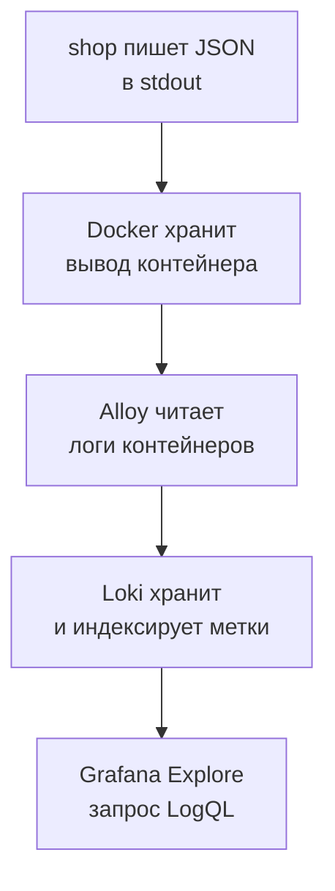
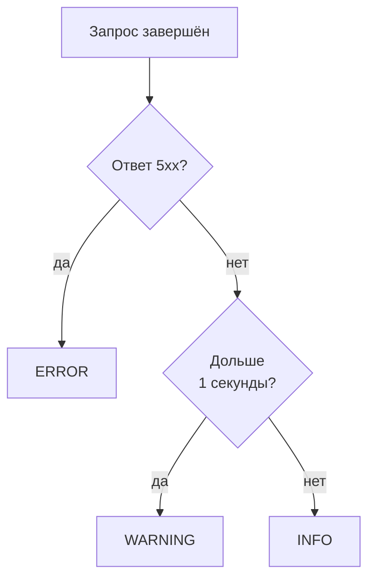
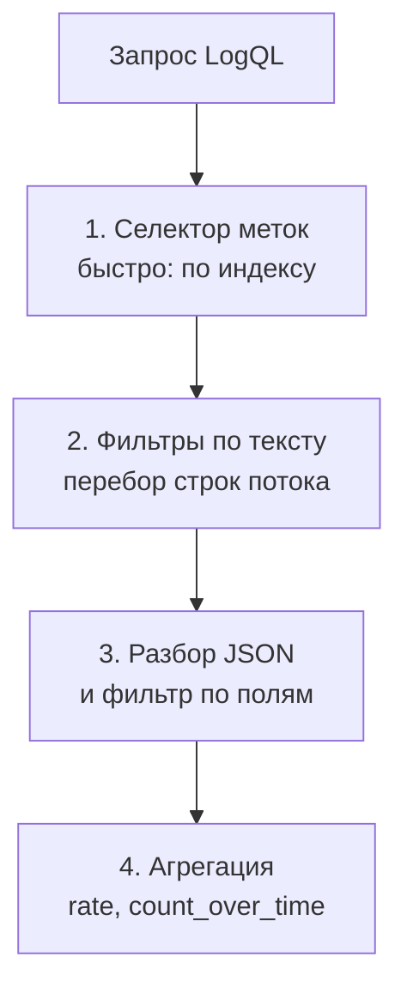

## Зачем это нужно

Я твой наставник, сижу рядом. История из прошлого года. На распродаже вырос красный столбик ошибок 502: 12 в секунду. Команда полчаса смотрела на него и гадала, что сломалось. Я бы тоже гадал: метрика (число, меняющееся во времени, [урок 7.1](01-metrics-prometheus.md)) умеет отвечать «сколько» и «как быстро», а «что именно случилось» не умеет. Она нарочно хранит одни числа, иначе собирать её было бы слишком дорого.

Ответ лежит в **логах**: журнале, куда сервис пишет по строке на каждое событие (с логами в консоли ты уже работал в [уроке 1.2](../01-linux/02-text-logs.md)). Маршрут, пользователь, текст ошибки, время внутри: всё это есть в строке. Метрики показывают, где болит, а логи объясняют, почему.

Сегодня ты научишься читать логи «Магазина» запросами, а не глазами: найдёшь ошибки за нужные две минуты, посчитаешь их по маршрутам и вытащишь один запрос по номеру. С этого начинается любой разбор.

Шаг проекта: в разделе Explore программы Grafana (там пишут разовые запросы без дашборда) ты подключишь Loki, хранилище логов стенда, и напишешь пять запросов на LogQL, языке запросов Loki. Потом найдёшь запрос по его номеру `request_id` и сохранишь запросы в `~/perf-lab/07-monitoring/logql.md`. Файл пригодится в [уроке 7.6](06-alerts-incidents.md) при разборе первого инцидента.

## Что нужно знать

- Метрики и Prometheus: [урок 7.1](01-metrics-prometheus.md). Здесь ты увидишь, чем логи отличаются от метрик и как их связывать.
- Запросы PromQL (`rate`, `sum by`): [урок 7.2](02-promql.md). LogQL построен по тому же принципу: селектор в фигурных скобках, а потом функции.
- Grafana, источники данных, Explore: [урок 7.3](03-grafana.md). Источник Loki уже подключён автоматически (`monitoring/grafana/provisioning/datasources/datasources.yml`, имя `Loki`).
- JSON и поля ответа: [урок 2.2](../02-web/02-rest-json-auth.md). Статусы 5xx и таймауты: [урок 2.1](../02-web/01-client-server-http.md).
- Фоновая нагрузка `orders_load.py` из [урока 7.4](04-exporters.md), чтобы в логах было что смотреть.

## Картина целиком

Возьми самолёт. Приборная панель (метрики) показывает высоту и скорость, и по ней сразу видно, что что-то не так. Бортовой самописец (логи) записывает каждое событие подряд: «12:03:41 отказал правый двигатель, давление масла упало». Панель слишком скупа, чтобы объяснить причину, а самописец слишком подробен, чтобы следить по нему в реальном времени. Нужны оба. Аналогия ломается в одном: логи сервиса читают живьём прямо во время теста, а не только после аварии.

Путь логов в нашем стенде такой:



Сервису не нужно знать ни про Loki, ни про Grafana. Он печатает строки в стандартный вывод (stdout), как любая программа в терминале ([урок 1.2](../01-linux/02-text-logs.md)). Остальное делают соседние контейнеры: Alloy (сборщик логов) забирает строки, Loki складывает, Grafana показывает. Каждое звено разберём по порядку.

## Теория

### Лог и метрика: чем они отличаются

Сработал алерт: с чего начать, с графика или с журнала? С графика, журнал вторым.

Метрика ([урок 7.1](01-metrics-prometheus.md)) сжимает миллионы запросов в одну линию, например `http_requests_total`. Хранить её дёшево: одно число вместо текста события. Лог это запись об одном событии: `{"route":"/api/orders","status":502,...}`.

Осторожно: одно другим не заменить. Ошибки по логам считать можно, но каждый запрос перечитывает тысячи строк. А подробности ошибки в метриках хранить нельзя: уникальные значения вроде `request_id` взорвут число рядов в Prometheus ([урок 7.1](01-metrics-prometheus.md)).

> **Главное:** метрика отвечает «сколько и когда» и стоит дёшево, лог отвечает «почему» и стоит дорого, поэтому идём от метрики к логу.
{: .key}

Раз лог хранит всё подряд, важное не должно тонуть в обычном. Для этого у строки есть уровень.

### Уровни логов

В журнале строки «пользователь зашёл» и «база недоступна». Как не пропустить вторую среди тысяч первых?

Уровень (level) это метка важности строки, как цвет на табло в аэропорту: «по расписанию» зелёный, «отменён» красный, и глаз сразу идёт на красное. Но уровень выбирает программист, а не система: ошибся он, и красное окажется зелёным.

В Python (модуль `logging`) уровней пять по возрастанию. `DEBUG` это подробности для разработчика, `INFO` нормальное событие, `WARNING` подозрительно, но работает. `ERROR` значит запрос не выполнен, `CRITICAL` сервис не может работать дальше.

В «Магазине» порог задаёт переменная `LOG_LEVEL` (по умолчанию `INFO`). Это минимальный уровень: при `WARNING` пропадают и `INFO`, то есть успешные запросы. Её мы сломаем в «Сломай и почини».

Уровень строки о запросе выбирает `middleware`, кусок кода сервиса, через который проходит каждый запрос (файл `shop/app/main.py`):



Уровень повышают только 5xx и медленность. Ответы 4xx (401, 404) остаются на `INFO`: это ошибка клиента, а не сбой сервиса.

> **Прикинь сам:** запрос `POST /api/login` занял 1,3 с и вернул 401. Какой уровень получит строка? А если он занял 0,2 с и вернул 401?
{: .predict}

В первом случае `WARNING`: ответ не 5xx, но длился больше секунды (сам код 401 уровень не повышает). Во втором `INFO`.

Осторожно: бесконечные `ERROR` на штатные ситуации (неверный пароль) приучают не смотреть на красное. Моё правило: на `ERROR` только то, ради чего готов разбудить человека.

> **Главное:** порог `LOG_LEVEL` решает, что попадёт в журнал, а «Магазин» ставит `ERROR` на 5xx и `WARNING` на запросы дольше секунды.
{: .key}

Как строка получает уровень, понятно. Теперь посмотрим на неё целиком.

### Структурированные логи: почему JSON

Раньше лог был текстом: `2026-10-03 12:03:41 ERROR payment failed for order 1042 (user 17)`. Ошибки пользователя 17 тут ищут регулярным выражением, и оно ломается при смене формулировки.

Поэтому «Магазин» пишет структурированный лог: событие как набор именованных полей, то есть JSON ([урок 2.2](../02-web/02-rest-json-auth.md)). «Пользователь 17» тогда поле `user_id: 17`, к которому обращаются по имени. Один запрос это одна строка (здесь разбита для чтения):

```json
{"ts": "2026-10-03T12:03:41.512390+00:00", "level": "ERROR", "msg": "Запрос завершён",
 "method": "POST", "route": "/api/orders", "path": "/api/orders", "status": 502,
 "duration_ms": 212.4, "request_id": "9f3c2b7a41d84c1e8b6a0d5e7f213a90",
 "trace_id": "5b8aa5a2d2c872e8321cf37308d69df2", "user_id": 17, "error": "payment failed"}
```

В 12:03:41 по UTC (мировому времени без часовых поясов, `ts`) пользователь 17 (`user_id`) отправил `POST /api/orders` (`method`, `route`). Сервис отвечал 212 мс (`duration_ms`) и вернул 502 (`status`) с причиной «payment failed» (`error`). Метрики сказали бы лишь «выросло число 502». Лог говорит, что заказ пользователя 17 не прошёл из-за оплаты. А 212 мс объясняются просто: сервис делает до четырёх обращений к оплате (`PAYMENT_RETRIES=3` плюс первая), и при быстром отказе все они укладываются в доли секунды.

Два поля легко перепутать. `route` это шаблон (`/api/products/{id}`), такой же, как метка `route` в метриках: по нему группируют. `path` это фактический адрес (`/api/products/4711`): по нему ищут конкретный запрос. Время в логе в UTC, Grafana покажет твой пояс: разница на часы не ошибка.

<details markdown="1">
<summary>Для любопытных: поля, которых нет в разборе выше, и причины в поле error</summary>

| Поле | Что значит |
|---|---|
| `ts` | время в формате ISO 8601, UTC (`+00:00`) |
| `msg` | текст события, у запросов всегда «Запрос завершён» |
| `duration_ms` | миллисекунды обработки внутри сервиса |
| `request_id` | уникальный номер запроса (32 символа) |
| `trace_id` | номер трейса (32 символа), по нему лог связывается с трейсом из [урока 7.7](07-traces.md); пока пропусти |
| `error` | причина сбоя, только у ответов 5xx |

Причины в `error` не случайны. 502 `payment failed`: оплата отказала или недоступна. 504 `payment timeout`: оплата не ответила за `PAYMENT_TIMEOUT`. 503 `database pool timeout`: в пуле не нашлось свободного соединения за `DB_POOL_TIMEOUT` секунд (по умолчанию 5).

</details>

> **Главное:** по полям JSON ищут и считают без регулярных выражений, `route` годится для группировки, `path` для точного адреса.
{: .key}

Одно поле строки мы пока лишь назвали: `request_id`. Оно решает самую частую задачу поддержки.

### Идентификатор запроса: нить через все системы

Пользователь пишет: «мой заказ не прошёл». В логах двадцать тысяч строк в минуту. По времени искать? Их десятки в секунду. По `user_id`? Запросов у него много. Нужен уникальный номер.

В «Магазине» это `request_id`. Сервис берёт заголовок `X-Request-ID` из входящего запроса, а если клиент его не прислал, сам придумывает 32 случайных символа. Номер попадает в строку лога и возвращается клиенту в заголовке ответа. Посмотри:

```bash
curl -si localhost:8000/api/categories | grep -i x-request-id
```

```text
x-request-id: 4d2f8e91b0a7c3d65e1f9a0b2c7d8e34
```

Разбор: `-s` убирает индикатор загрузки, `-i` печатает заголовки ответа, `grep -i` оставляет нужную строку и не различает регистр. Так работает поддержка: пользователь присылает номер, инженер находит строку и видит причину.

Если запрос идёт через цепочку сервисов, каждый передаёт номер дальше, и по нему собирается вся история запроса. Это сквозной идентификатор (correlation id).

> **Прикинь сам:** пользователь прислал скриншот ошибки, на котором нет номера. Что ты сделаешь с логами?
{: .predict}

Сузишь поиск по времени, `user_id`, `route` и `status`. Это хуже, чем по номеру, поэтому на работе номер показывают пользователю прямо в тексте ошибки.

> **Главное:** `request_id` лежит и в логе, и в заголовке ответа, и по нему находится ровно одна строка.
{: .key}

Строки пишутся, номера есть. Как они доезжают из контейнера до Loki? Этим занимается Alloy.

### Alloy: курьер, который доставляет логи

Логи лежат внутри контейнеров. Ходить по каждому командой `docker compose logs` долго, а при перезапуске контейнера логи могут пропасть. Нужен сборщик: программа, которая читает логи всех контейнеров и отправляет их в одно место.

Наш сборщик называется Grafana Alloy («Алой»). Его конфиг `config.alloy` это конвейер (pipeline): цепочка блоков, каждый берёт данные у предыдущего и передаёт дальше. Вот `monitoring/alloy/config.alloy` стенда:

```text
discovery.docker "containers"   найти контейнеры через Docker (каждые 5 с)
        │
discovery.relabel "containers"  оставить проект «shop», добавить метки service и container
        │
loki.source.docker "containers" читать логи этих контейнеров
        │
loki.process "shop"             для сервиса shop: вынуть из JSON поле level и сделать меткой
        │
loki.write "local"              отправить в Loki: http://loki:3100/loki/api/v1/push
```

Два места тут важнее остальных. Первое: метки `service` и `container`. `discovery.relabel` копирует имена из данных, которые Compose вешает на контейнеры: `service` (из `compose.yaml`: `shop`, `payment`, `postgres`, `redis`) и `container` (например, `shop-shop-1`). Правило `keep` оставляет только проект `shop`, чужие контейнеры в Loki не попадут.

Второе: метка `level`. Блок `loki.process` берёт строки сервиса `shop`, шаг `stage.json` вынимает из JSON поле `level`, а шаг `stage.labels` делает из него метку. Поэтому по уровню ищут мгновенно: `{service="shop", level="ERROR"}`. Остальные поля (`route`, `status`, `request_id`) Alloy метками сознательно не делает, причина в следующем разделе.

Если логи не доходят, открой `http://localhost:12345`: сломанные компоненты там красные.

> **Прикинь сам:** ты добавил в `docker compose` сервис `cache2`, а его логов в Loki нет. Что в конфиге могло помешать?
{: .predict}

Правило `keep` пропускает только контейнеры проекта Compose `shop`. Сервис, запущенный отдельно от проекта `shop`, фильтр не пройдёт: запускай его в том же проекте или расширь правило.

> **Главное:** Alloy находит контейнеры, добавляет метки `service` и `container`, делает меткой `level` у `shop` и отправляет всё в Loki.
{: .key}

Почему меткой стал только `level`, а не все поля? Ответ в устройстве Loki.

### Loki: хранилище, которое индексирует только метки

Обычные поисковые системы для логов (например, Elasticsearch) индексируют каждое слово каждой строки. Поиск быстрый, но индекс размером с данные дорог. Loki сделали дешёвым: он индексирует только метки (`service`, `container`, `level`), а строки хранит сжатыми кусками без индекса.

Это как библиотека. По меткам на корешках («история, 1990 год») книги находятся мгновенно, а чтобы узнать, где упомянут «Иван Грозный», листаешь каждую выбранную. Loki тоже перебирает текст, но параллельно и быстро.

Строки с одинаковым набором меток образуют поток (stream): `{container="shop-shop-1", level="INFO", service="shop"}` один поток, такой же с `level="ERROR"` другой. Запрос идёт по шагам:



Чем уже селектор на первом шаге, тем меньше строк перебирать дальше. Отсюда правило: сначала точные метки, потом дешёвый фильтр по тексту, и только потом разбор JSON.

Теперь кардинальность (число уникальных значений метки, [урок 7.1](01-metrics-prometheus.md)). Каждая комбинация меток создаёт новый поток. У `level` три значения, у `service` меньше десятка, это безопасно. У `request_id` их миллион, и миллион потоков раздует индекс. Поэтому `request_id` и `route` остаются внутри строки, их ищут фильтрами.

> **Прикинь сам:** у запросов 10 000 разных `path`, 3 уровня и 1 сервис. Сколько потоков получится, если сделать `path` меткой?
{: .predict}

До 30 000: каждый путь на каждом уровне даёт свой поток (10 000 раз по 3). А с метками `service` и `level` потоков три.

Осторожно: метку путают с полем JSON. `level` у нас и то и другое (в строке он остался). А `route` и `status` меток не имеют и доступны только после `| json`.

> **Главное:** Loki индексирует только метки, поэтому метки должны иметь мало значений, а идентификаторы остаются в тексте строки.
{: .key}

Метки выбирают поток. Чтобы отобрать строки внутри него, нужен язык запросов, LogQL.

### LogQL: выбрать и отфильтровать строки

LogQL (Log Query Language) намеренно похож на PromQL из [урока 7.2](02-promql.md): тот же селектор в фигурных скобках, те же `rate` и `sum by`. Запрос состоит из селектора потоков (какие потоки взять) и конвейера (что делать со строками, шаги через `|`). Пиши в Explore: источник Loki, режим Code, время «последние 15 минут».

```logql
{service="shop"}
```

Это все логи сервиса `shop`. Операторы те же, что в PromQL: `=`, `!=`, `=~`, `!~`. Условия через запятую работают как «и»: `{service="shop", level="ERROR"}`. Нужно одно точное условие `метка="значение"`: запрос `{service=~".*"}` Loki отклонит как слишком широкий.

Дальше фильтры по тексту. Оператор `|=` оставляет строки с текстом, `!=` выбрасывает их, `|~` и `!~` работают с регулярными выражениями. Фильтры можно цеплять:

```logql
{service="shop"} |= "payment" != "login"
```

Выбрали потоки, оставили строки со словом `payment`, выбросили те, где есть `login`. Регистр важен: без его учёта пишут `|~ "(?i)payment"`: приставка `(?i)` значит «не различать большие и маленькие буквы». Фильтр по тексту дешёвый, он просто ищет подстроку, поэтому его ставят первым.

> **Прикинь сам:** запрос `{service="shop"} |= "502"` найдёт строку, где `status` равен 200?
{: .predict}

Может: «502» бывает и в `"duration_ms": 1502.3`, и в `request_id`. Для точности строку разбирают на поля:

```logql
{service="shop"} | json | status >= 500
```

`| json` разбирает строку и делает каждое поле временной меткой. Не путай её с обычной: метки потока (`service`, `level`) постоянны и лежат в индексе Loki, а временная метка живёт только внутри запроса и в индекс не попадает. Следующий фильтр работает уже по полю: для чисел `=`, `!=`, `>`, `>=`, `<`, `<=`, для строк `=` и `=~`:

```logql
{service="shop"} | json | route="/api/orders" | duration_ms > 1000
```

Это «заказы дольше секунды». Он медленнее текстового фильтра, ведь JSON разбирается для каждой строки. Поэтому дешёвые фильтры ставят перед `| json`:

```logql
{service="shop", level="ERROR"} |= "payment" | json | route="/api/orders"
```

Метка и текстовый фильтр отсекают почти все строки до разбора JSON. Чтобы строку было легче читать, `line_format` переписывает её по шаблону:


```logql
{service="shop", level="ERROR"} | json | line_format "{{.route}} {{.status}} {{.error}} {{.duration_ms}}мс"
```


Результат: `/api/orders 502 payment failed 212.4мс`. Двойные скобки здесь часть синтаксиса шаблона, а не опечатка.

> **Главное:** порядок запроса: точные метки, дешёвый фильтр по тексту, `| json`, фильтр по полю; поиск по полю точнее поиска по подстроке.
{: .key}

На инциденте нужны и числа: сколько ошибок и где.

### LogQL: из строк в числа

Допустим, в метриках нет нужной метки, а ошибки надо посчитать по маршрутам. Оберни селектор в функцию по диапазону, и строки станут графиком, как метрики.

```logql
sum(count_over_time({service="shop"} | json | status >= 500 [1m]))
```

Читаем изнутри наружу. Селектор с фильтрами выбирает строки с 5xx, `[1m]` задаёт окно в минуту, `count_over_time` считает строки в каждом окне, `sum` складывает по потокам. Получается график «ошибок за минуту». Со скоростью в секунду и по маршрутам:

```logql
sum by (route) (rate({service="shop"} | json | status >= 500 [1m]))
```

`rate` делит число строк на длину окна: 12 ошибок за минуту это 12 / 60 = 0,2 в секунду. `by (route)` строит по линии на маршрут. Для числовых полей есть `unwrap`: он берёт значение поля как число, и по нему считают статистику. Например, `quantile_over_time` даёт процентиль за окно, как `histogram_quantile` в [7.2](02-promql.md):

```logql
quantile_over_time(0.95, {service="shop"} | json | route="/api/orders" | unwrap duration_ms [1m]) by (route)
```

Это p95 времени ответа заказов по логам.

> **Главное:** `count_over_time` и `rate` превращают строки в график, `unwrap` берёт числа из полей, а для долгих графиков и алертов метрики Prometheus дешевле.
{: .key}

Искать и считать строки мы умеем. Остаётся самое ценное: соединить метрику с логом.

### От метрики к логу: как связывать

На графике виден всплеск. Метрика и лог живут в разных системах, и связывают их три общих признака: время, метки и `request_id`. Время: всплеск между 12:03 и 12:07, значит то же окно ставишь на логах (пояс везде один). Метки: у метрики есть `route`, у лога поле `route` после `| json`. И `request_id` находит одну строку.

Вернёмся к распродаже. Алерт `ShopHighErrorRate` сработал в 12:05. Ты открываешь график `sum by (route) (rate(http_requests_total{status=~"5.."}[1m]))` и видишь, что все 5xx идут с `/api/orders`. Переходишь в логи на 12:03-12:08: `{service="shop", level="ERROR"} | json | route="/api/orders"`. Во всех строках `error: "payment failed"`. Столбик, на который команда смотрела полчаса, объяснился за пять минут. В Explore это удобно на одном экране: режим Split делит окно на два, слева Prometheus, справа Loki, время общее.

Потренируйся на данных, похожих на реальные:

<div class="viz" data-viz="obs-log-query" data-preset="errors"></div>

Фильтры справа складываются в текст запроса, график считает подошедшие строки по десятисекундным окнам, серый фон это весь поток. Добавляй фильтры по одному и смотри, как сужается выборка. А вот та же поломка с двух сторон:

<div class="viz" data-viz="chart" data-type="line" data-x="12:00,12:02,12:04,12:06,12:08,12:10" data-series='[{"name":"5xx по метрике, 1/с","values":[0,0,9,11,10,0],"unit":" /с"},{"name":"ERROR-строк в логах, 1/с","values":[0,0,9,11,10,0],"unit":" /с"}]' data-x-label="Время (UTC)" data-y-label="Запросов в секунду" data-unit=" /с" data-explain="Две независимые системы показывают одно и то же: окно между 12:04 и 12:08, где идут ошибки. Метрика даёт число, лог даёт ту же цифру и текст причины каждой ошибки. Совпадение графиков это способ проверить, что ты смотришь на одну и ту же поломку."></div>

Линии совпадают: сколько 5xx насчитали метрики, столько же ERROR записали логи. Значит, найдя строки, ты нашёл те запросы, которые видел на дашборде.

> **Главное:** метрику с логом связывают по времени, по меткам вроде `route` и по `request_id`: метрика отвечает, где и когда, лог отвечает, почему.
{: .key}

В практике ты пройдёшь этот путь руками.

## Практика

Работаем на своём стенде. Нужен профиль мониторинга: `docker compose --profile monitoring up -d --wait`.

### 1. Убедись, что логи дошли до Loki

Сначала нагрузка, чтобы в логах было что смотреть (скрипт из урока 7.4, фоновый режим покупок, 3 минуты):

```bash
cd ~/load-tester/project/shop
source ~/perf-lab/.venv/bin/activate
python ~/perf-lab/07-monitoring/orders_load.py orders 3 180 &
sleep 20
curl -s 'localhost:3100/loki/api/v1/label/service/values' | jq -c .
```

Разбор: символ `&` в конце запускает скрипт в фоне, терминал остаётся твоим; `sleep 20` ждёт 20 секунд, чтобы логи успели дойти; Loki на порту 3100 опубликован, и его API отвечает на `label/service/values`: «какие значения имеет метка `service`». `jq -c .` печатает ответ в одну строку.

```text
{"status":"success","data":["alloy","grafana","loki","node-exporter","payment","postgres","prometheus","redis","shop"]}
```

**Как читать вывод:** `status: success` значит, API отвечает. Список значений это сервисы проекта `shop`, чьи логи Alloy уже прислал. Должен быть `shop`: без него следующие запросы вернут пустоту. Состав списка у тебя может отличаться от примера.

**Типичные ошибки:**

- `curl: (7) Failed to connect`: Loki не запущен. `docker compose --profile monitoring up -d --wait loki alloy`.
- `"data": []` или нет значения `shop`: Alloy ещё не дошёл до контейнеров. Подожди полминуты, проверь `http://localhost:12345` (красный компонент покажет причину).

### 2. Пять запросов в Explore

Открой `http://localhost:3000/explore`, источник данных **Loki**, переключатель Builder/Code поставь на **Code**, диапазон **Last 15 minutes**. По очереди выполни и сохрани результат (в файл `~/perf-lab/07-monitoring/logql.md` перепиши запросы и пару строк наблюдений):

```logql
{service="shop"}
```


```logql
{service="shop"} | json | route="/api/orders" | line_format `{{.method}} {{.path}} {{.status}} {{.duration_ms}}мс`
```


```logql
{service="shop"} | json | duration_ms > 100
```

```logql
sum by (route) (count_over_time({service="shop"} | json [1m]))
```

```logql
quantile_over_time(0.95, {service="shop"} | json | route="/api/orders" | unwrap duration_ms [1m]) by (route)
```

Во втором запросе `line_format` переписывает строку в читаемый вид; в Explore его шаблон можно писать и в обратных кавычках, как здесь.

Ожидаемый вид первого результата (строки в панели Logs, поля свёрнуты):

```text
12:41:07.318  {"ts": "2026-10-03T12:41:07.318044+00:00", "level": "INFO", "msg": "Запрос завершён", "method": "POST", "route": "/api/orders", "path": "/api/orders", "status": 201, "duration_ms": 71.62, "request_id": "e1b4...", "trace_id": "9c1d...", "user_id": 2}
```

И для второго:

```text
POST /api/orders 201 71.62мс
```

**Как читать вывод:**

- Первый запрос возвращает все строки подряд, свежие сверху. Раскрой строку (щёлкни по ней): Grafana покажет метки (`service`, `container`, `level`) и разобранные поля.
- Второй показывает только заказы и в удобном виде: по одной короткой строке. В колонке слева стоит время.
- Третий оставляет всё, что дольше 100 мс: дорогие запросы вроде входа (bcrypt) и заказов.
- Четвёртый и пятый возвращают **график**: у четвёртого по линии на маршрут (скорость запросов по логам), у пятого один ряд для `/api/orders` с p95 времени заказа в миллисекундах.

**Типичные ошибки:**

- `parse error ... unexpected IDENTIFIER`: забыл `|` между шагами или не закрыл кавычки в `line_format`.
- `queries require at least one regexp or equality matcher that does not have an empty-compatible value`: селектор без непустого условия. Начинай с `{service="shop"}`.
- Пустой результат при правильном запросе: проверь диапазон времени (он сверху справа) и что нагрузка идёт: `docker compose --profile monitoring logs --tail=3 shop`.
- `| json` добавляет к результату ошибку `JSONParserErr`: в потоке `shop` попалась не-JSON строка (например, стартовое сообщение uvicorn). Фильтр `| __error__ = ""` уберёт такие строки.

> LogQL-запрос ничего не находит? Скопируй запрос и пример реальной строки лога, спроси нейросеть, где расходятся. Проверь по шагам из урока: сначала только селектор потока, потом по одному добавляй фильтры, пока строки не пропадут.
{: .ai}

### 3. Найди запрос по `request_id`

Сделаем запрос с **известным** номером. Ты придумываешь номер сам и передаёшь его заголовком, сервис его запомнит:

```bash
curl -s -o /dev/null -w '%{http_code}\n' -H 'X-Request-ID: lesson-7-5-demo' localhost:8000/api/categories
```

Разбор: `-o /dev/null` выбрасывает тело, `-w '%{http_code}\n'` печатает только код ответа, `-H '...'` добавляет заголовок с твоим номером. Ответ: `200`. Теперь найди этот запрос в логе. Сначала дешёвый текстовый фильтр:

```logql
{service="shop"} |= "lesson-7-5-demo"
```

```text
{"ts": "2026-10-03T12:44:52.117201+00:00", "level": "INFO", "msg": "Запрос завершён", "method": "GET", "route": "/api/categories", "path": "/api/categories", "status": 200, "duration_ms": 6.84, "request_id": "lesson-7-5-demo", "trace_id": "d2f0a8c4b1e94f3a8c7b6a5d4e3f2a1b"}
```

**Как читать вывод:** ровно одна строка с твоим идентификатором. Даже если в логах миллионы запросов, текстовый поиск по уникальной строке находит её быстро, а селектор `service="shop"` сузил выбор до одного сервиса. Точный вариант: `{service="shop"} | json | request_id="lesson-7-5-demo"`.

Теперь настоящий сценарий: клиент получил от сервера номер в ответе и пришёл с жалобой.

```bash
curl -si -X POST localhost:8000/api/login -H 'Content-Type: application/json' \
  -d '{"email":"user0001@shop.lab","password":"wrong"}' | grep -iE '^(HTTP|x-request-id)'
```

```text
HTTP/1.1 401 Unauthorized
x-request-id: 7c0e5b1d9a3f48e2b6d1a4c8f0e92b35
```

Скопируй свой `x-request-id` и найди запрос: `{service="shop"} |= "<номер>"`. В строке будет `status: 401`, `route: /api/login`, уровень `INFO`, и подтверждение, что 401 для сервиса не сбой.

### 4. Метрика и лог на одном окне

Во втором окне запусти нагрузку заказов с ошибками оплаты (подробно причины разберём в уроке 7.6; здесь важна только связка метрики и лога). Включим сбои оплаты на 40%:

```bash
curl -s -X POST localhost:8001/admin/config -H 'Content-Type: application/json' -d '{"fail_rate": 0.4}'
python ~/perf-lab/07-monitoring/orders_load.py orders 3 90 &
```

Через минуту в Explore нажми **Split** и в левом окне выбери источник Prometheus, в правом Loki:

```promql
sum by (route) (rate(http_requests_total{status=~"5.."}[1m]))
```

```logql
sum by (route) (rate({service="shop"} | json | status >= 500 [1m]))
```

```text
{route="/api/orders"}   0.31
{route="/api/orders"}   0.31
```

**Как читать вывод:** обе системы видят один маршрут и почти одинаковую скорость. Расхождение в сотых допустимо: окна и момент скрейпа не совпадают до секунды. Теперь выбери в логах строки ошибок:


```logql
{service="shop", level="ERROR"} | json | line_format `{{.status}} {{.error}} {{.duration_ms}}мс user={{.user_id}}`
```


```text
502 payment failed 109.3мс user=2
502 payment failed 63.8мс user=1
```

Причина видна в каждой строке: `payment failed`. Верни оплату в норму, чтобы не мешала дальше, и дождись конца нагрузки:

```bash
curl -s -X POST localhost:8001/admin/config -H 'Content-Type: application/json' -d '{"fail_rate": 0.0}'
wait
```

`wait` останавливает терминал, пока фоновая нагрузка не закончится.

**Типичные ошибки:** метрика есть, а ошибок в логах нет: проверь `LOG_LEVEL` (раздел ниже) и что Alloy работает. Логи есть, а метрик нет: окно запроса короче окна скрейпа или не тот `route`.

### 5. Допиши файл с запросами

В `~/perf-lab/07-monitoring/logql.md` оформи каждый запрос так: **цель**, **запрос**, **что видно**. Минимум: ошибки по маршрутам, медленные запросы, поиск по `request_id`, p95 по логам. Это твой набор для следующего урока.

```bash
cd ~/perf-lab && git add 07-monitoring && git commit -m "7.5: запросы LogQL" && git push
```

## Сломай и почини

**Поломка: логи пропали.** Понизим подробность логов «Магазина» так, как это иногда делают, чтобы «не засорять» журнал:

```bash
cd ~/load-tester/project/shop
LOG_LEVEL=ERROR docker compose --profile monitoring up -d shop
```

Разбор: переменная окружения перед командой действует только на неё, Compose подставит `LOG_LEVEL=ERROR` в контейнер `shop` (вспомни `${LOG_LEVEL:-INFO}` в `compose.yaml`) и пересоздаст его. Дождись готовности (`curl -s localhost:8000/readyz`), сделай несколько запросов (`curl -s localhost:8000/api/categories > /dev/null`) и выполни в Explore `{service="shop"} | json | route="/api/categories"`.

**Задача:** выясни без подсказок, почему запросов нет в Loki, хотя сервис отвечает. Какие запросы ты **всё-таки** увидишь в логах, и что это значит для разбора инцидента?

<div class="viz" data-viz="flow" data-steps='[{"title":"Убедись, что сервис работает","text":"`curl -s localhost:8000/api/categories` возвращает JSON: проблема не в сервисе."},{"title":"Проверь доставку","text":"`http://localhost:12345`: все компоненты Alloy зелёные? Свежие логи других сервисов в Loki есть?"},{"title":"Посмотри лог контейнера напрямую","text":"`docker compose --profile monitoring logs --tail=5 shop`: если и там пусто, лог не пишется."},{"title":"Проверь уровень","text":"`docker compose --profile monitoring exec shop env | grep LOG_LEVEL` показывает порог."},{"title":"Верни как было","text":"`docker compose --profile monitoring up -d shop` без переменной вернёт `INFO`."}]'></div>

<details markdown="1">
<summary>Что должно получиться</summary>

`LOG_LEVEL=ERROR` оставляет в логе только строки уровня `ERROR` и выше. Успешные запросы пишутся на уровне `INFO`, и они пропали: в Loki не дойдёт то, чего нет в самом контейнере (смотри шаг 3: `docker compose logs` тоже пуст). Видны останутся только ответы 5xx. Вывод для инцидентов: понижать подробность в бою опасно, ты теряешь нормальный фон, с которым сравнивают поломку («а раньше так было?»), а также медленные запросы (`WARNING`). Починка: `docker compose --profile monitoring up -d shop` без переменной (вернётся `INFO` по умолчанию из `.env` или `compose.yaml`).

</details>

## ИИ в помощь

Нейросеть помогает составить запрос LogQL и разобрать длинную JSON-строку лога, но язык у неё часто смешивается с PromQL или с синтаксисом других систем. Общие правила: [ИИ-помощник](../ai.md).

**Задача:** составить запрос LogQL по полям JSON-лога.

```text
Loki 3.7, логи сервиса магазина в JSON с полями level, request_id, trace_id, route, status, duration_ms.
Вот одна реальная строка: <вставь строку лога>. Составь запрос LogQL: все строки
с level=ERROR (так пишет стенд) за последние 15 минут для маршрута /api/orders. И второй: сколько ошибок в минуту
(метрика из логов). Объясни, зачем в запросе | json и чем селектор потока отличается от фильтра строки.
```
{: .wrap}

**Проверь ответ:** выполни запрос в Explore (Grafana, источник Loki) и убедись, что строки находятся. Типичные ошибки: синтаксис PromQL в селекторе, фильтр строки до `| json` для поля, которое ещё не распаковано, и метки, которых нет у потока (проверь список на вкладке меток).

Логи могут содержать персональные данные и токены. В чат отправляй только маскированные строки: замени email на `user@example.com`, токены на `<токен>`, внутренние адреса на `<хост>`. Рабочие логи в публичную нейросеть не вставляй без разрешения.

## Словарик урока

| Термин | Простыми словами |
|---|---|
| Лог (log) | Журнал: запись о каждом событии в сервисе |
| Уровень лога (level) | Метка важности строки: DEBUG, INFO, WARNING, ERROR, CRITICAL |
| Структурированный лог | Лог в виде набора именованных полей (JSON), а не свободного текста |
| `request_id` | Уникальный номер запроса: по нему находят одну строку среди миллионов |
| Сквозной идентификатор (correlation id) | Тот же номер, который передают через все сервисы цепочки |
| stdout | Стандартный вывод программы: куда она «печатает» |
| Alloy | Сборщик логов, метрик и трейсов от Grafana; читает, обрабатывает, отправляет |
| Pipeline (конвейер) | Цепочка шагов обработки: каждый берёт данные у предыдущего |
| Loki | Хранилище логов, индексирует только метки, строки хранит сжатыми кусками |
| Метка (label) в Loki | Пара «имя=значение», по которой быстро выбирают потоки: `service="shop"` |
| Поток (stream) | Все строки с одним набором меток |
| Кардинальность | Число уникальных значений метки: слишком большое ломает хранилище |
| LogQL | Язык запросов Loki: селектор + конвейер фильтров и функций |
| Селектор потоков | Часть запроса в фигурных скобках: какие потоки выбрать |
| `\|= "текст"` | Фильтр: строка содержит текст |
| `\| json` | Шаг конвейера: разобрать строку как JSON и сделать поля временными метками |
| `line_format` | Шаг конвейера: переписать вывод строки по шаблону |
| `count_over_time`, `rate` | Функции: превратить строки логов в число за окно и в скорость |
| `unwrap` | Развернуть числовое поле лога, чтобы считать по нему статистику |
| Explore | Режим Grafana для разовых запросов без дашборда |

## Вопросы с собеседований

Раздел для повторения: ответь вслух, потом открой ответ.

### 1. [junior] [часто] Чем логи отличаются от метрик, и когда нужны оба?

<details markdown="1">
<summary>Ответ</summary>

Метрика это число во времени: дёшево хранить, удобно для графиков и алертов, но без подробностей. Лог это запись об одном событии с деталями: дорого хранить, зато видна причина. Метрика отвечает «что и когда сломалось», лог «почему». На инциденте идут от алерта по метрике к логам того же времени и сервиса.

**Что хотят услышать:** разная цена и разная задача; порядок работы «метрика, потом лог».

**Красный флаг:** «логи можно не хранить, есть метрики» или наоборот.

</details>

### 2. [junior] [часто] Какие бывают уровни логов и как выбирать?

<details markdown="1">
<summary>Ответ</summary>

DEBUG, INFO, WARNING, ERROR, CRITICAL. DEBUG для разработки, INFO для нормального хода событий, WARNING для подозрительного, но не сломавшего, ERROR для сбоя, который нужно заметить. Порог настраивается: при `WARNING` строки `INFO` не пишутся. `ERROR` только для событий, ради которых стоило бы разбудить человека.

**Что хотят услышать:** примеры из практики, понимание порога, риск шума.

**Красный флаг:** все события на `ERROR` или всё на `INFO`.

</details>

### 3. [junior] [часто] Зачем нужен `request_id`?

<details markdown="1">
<summary>Ответ</summary>

Это уникальный номер запроса. Он попадает в лог и возвращается клиенту в заголовке. По нему можно найти единственную строку среди миллионов, а в цепочке сервисов собрать всю историю запроса: каждый сервис передаёт тот же номер дальше.

**Что хотят услышать:** уникальность, заголовок `X-Request-ID`, поиск в логах, сквозная передача.

**Красный флаг:** предлагает искать по времени и пользователю там, где можно использовать номер.

</details>

### 4. [junior] Зачем писать логи в JSON?

<details markdown="1">
<summary>Ответ</summary>

Поля именованы, и по ним можно искать и считать без регулярных выражений: `status >= 500`, `route="/api/orders"`. Формулировка сообщения может меняться, а поля остаются. Многострочные данные (исключения) лежат внутри одного поля и не рвут строку.

**Что хотят услышать:** поиск по полям, устойчивость к смене текста.

**Красный флаг:** «JSON красиво выглядит».

</details>

### 5. [middle] [часто] Чем Loki отличается от Elasticsearch?

<details markdown="1">
<summary>Ответ</summary>

Elasticsearch индексирует каждое слово каждой строки: поиск быстрый, но индекс большой и дорогой. Loki индексирует только метки (`service`, `level`), строки хранит сжатыми кусками без индекса и перебирает их при фильтрации. Он дешевле на хранение и проще в эксплуатации, но поиск по тексту медленнее на больших объёмах.

**Что хотят услышать:** «индекс по меткам, не по тексту», вывод про кардинальность меток.

**Красный флаг:** «Loki это аналог Prometheus для логов» без пояснения про метки.

</details>

### 6. [middle] [часто] Почему нельзя делать `request_id` меткой в Loki?

<details markdown="1">
<summary>Ответ</summary>

Каждое уникальное значение метки создаёт новый поток, а поток это единица индекса и хранения. Миллион запросов дал бы миллион потоков: индекс раздувается, запись и запросы замедляются. Метками делают значения с небольшим числом вариантов (сервис, уровень, окружение), а идентификаторы оставляют внутри строки и ищут фильтрами.

**Что хотят услышать:** кардинальность, потоки, где искать идентификаторы.

**Красный флаг:** «метка быстрее, значит сделаем всё метками».

</details>

### 7. [middle] Как найти в логах все ответы 5xx за последние 10 минут по маршруту `/api/orders`?

<details markdown="1">
<summary>Ответ</summary>

`{service="shop", level="ERROR"} | json | route="/api/orders" | status >= 500` с окном времени 10 минут. Метки сужают выборку по индексу, `| json` разбирает поля, дальше фильтры по маршруту и статусу. Для числа: `sum(count_over_time(... [10m]))`.

**Что хотят услышать:** порядок «метки, дешёвые фильтры, json, фильтры по полям».

**Красный флаг:** `|= "500"` для статуса.

</details>

### 8. [middle] Как превратить логи в график ошибок по маршрутам?

<details markdown="1">
<summary>Ответ</summary>

`sum by (route) (rate({service="shop"} | json | status >= 500 [1m]))`. Селектор с фильтрами даёт строки, `[1m]` задаёт окно, `rate` считает скорость в секунду, `sum by (route)` группирует. Для долгосрочных графиков и алертов лучше метрики Prometheus: они дешевле.

**Что хотят услышать:** `count_over_time` и `rate`, группировка, оговорка про цену.

**Красный флаг:** считать так все долгосрочные метрики.

</details>

### 9. [middle] Метрика показывает всплеск ошибок. Как перейти к причине?

<details markdown="1">
<summary>Ответ</summary>

Взять окно времени всплеска и маршрут (метку) из метрики, открыть логи того же сервиса, отфильтровать `level="ERROR"` и по `route`, прочитать поле `error`. Если ошибок много, сгруппировать по причине (`sum by (error) (count_over_time(... | json [5m]))`). Для одной жалобы использовать `request_id`.

**Что хотят услышать:** общие признаки времени, метки и идентификатора; работа с группировкой.

**Красный флаг:** листает логи глазами без фильтров.

</details>

### 10. [middle] Что делает Alloy в стенде?

<details markdown="1">
<summary>Ответ</summary>

Находит контейнеры проекта через Docker, добавляет метки `service` и `container`, читает их логи, для `shop` вынимает `level` из JSON и делает его меткой, отправляет всё в Loki. Это pipeline из компонентов, каждый передаёт данные следующему.

**Что хотят услышать:** discovery, relabel, process, write; почему `level` метка, а остальные поля нет.

**Красный флаг:** считает, что Alloy хранит логи.

</details>

### 11. [middle] Логи сервиса перестали приходить в Loki, а сервис работает. Что проверишь?

<details markdown="1">
<summary>Ответ</summary>

По цепочке: пишет ли сервис (`docker compose logs shop`, уровень `LOG_LEVEL`), живёт ли Alloy (страница `:12345`, красные компоненты), принимает ли Loki (`/ready`, логи Loki), правильный ли диапазон времени и селектор в запросе. Двигаться от источника к потребителю и на каждом шаге проверять данные.

**Что хотят услышать:** проверка по звеньям, а не наугад.

**Красный флаг:** сразу перезапускает всё.

</details>

### 12. [junior] [на скорость] Что делает `|= "payment"`?

<details markdown="1">
<summary>Ответ</summary>

Оставляет только строки лога, в тексте которых есть «payment».

</details>

### 13. [junior] [на скорость] Какой оператор разбирает строку как JSON в LogQL?

<details markdown="1">
<summary>Ответ</summary>

`| json`. После него поля доступны как метки: `| status >= 500`.

</details>

### 14. [junior] [на скорость] Какое поле связывает запрос клиента и строку в логе?

<details markdown="1">
<summary>Ответ</summary>

`request_id`, он же заголовок `X-Request-ID` в ответе.

</details>

## Проверено на версиях

Ubuntu 24.04, Docker Compose v2, стенд «Магазин» из `project/shop`, Loki 3.7.8, Alloy 1.20.1, Grafana 13.2.3, Prometheus 3.15. Набор меток в Loki (например, появление `service_name`) и внешний вид Explore могут немного отличаться: запросы урока опираются на метки `service` и `level`, заданные в `config.alloy`. Октябрь 2026.

## Итог урока: ты умеешь

- [ ] Объяснить, чем лог отличается от метрики, и назвать порядок «метрика, потом лог».
- [ ] Прочитать JSON-строку лога «Магазина» по полям и сказать, какой уровень получит запрос.
- [ ] Объяснить, зачем нужен `request_id`, и найти по нему запрос в Loki.
- [ ] Описать путь лога: stdout, Docker, Alloy, Loki, Grafana; объяснить, какие метки задаёт Alloy.
- [ ] Объяснить, почему Loki индексирует только метки и почему `request_id` не метка.
- [ ] Написать запросы LogQL: селектор, `|=`, `| json`, фильтр по полю, `line_format`.
- [ ] Получить график из логов через `count_over_time` и `rate` и сравнить его с метрикой.
- [ ] Связать всплеск на метриках с причиной в логах по времени, маршруту и идентификатору.
- [ ] Вести файл `~/perf-lab/07-monitoring/logql.md`.

Дальше: [урок 7.6. Алерты и первый инцидент](06-alerts-incidents.md): алерт разбудит тебя раньше, чем пожалуется пользователь, а метрики и логи подскажут причину.

**Глубже:** сбор логов и Loki в [курсе DevOps](https://distinguished-sre.github.io/devops/08-observability/07-logs-loki-alloy.html).
