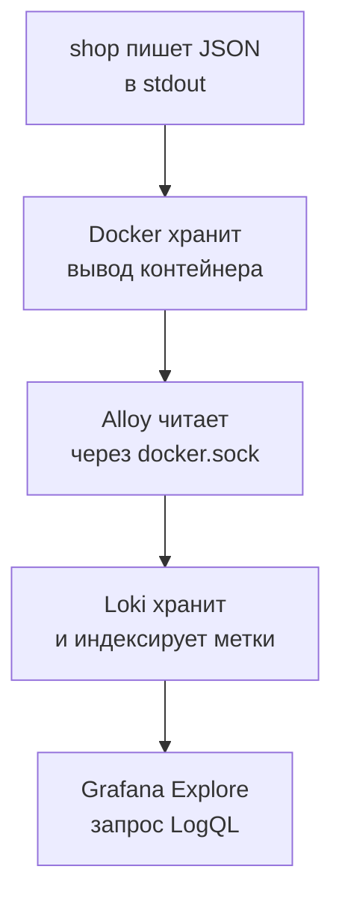
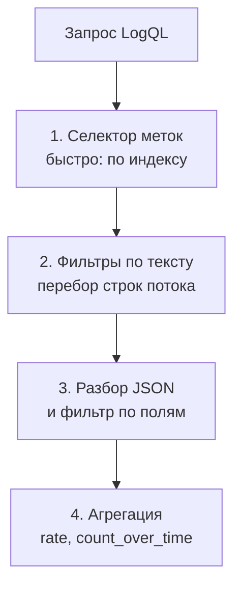

## Зачем это нужно

Метрики отвечают на вопросы «сколько» и «как быстро»: 12 ошибок в секунду, p95 равен 900 мс. Но когда на графике вырос красный столбик ошибок 502, главный вопрос другой: **что именно случилось** с этими запросами? Какой маршрут, какой пользователь, какой текст ошибки, сколько времени запрос провёл внутри? У метрики этих подробностей нет: она нарочно хранит только числа, иначе её было бы слишком дорого собирать. Подробности остаются в **логах**: журнале, в который сервис записывает по строке на каждое событие.

В этом уроке ты научишься читать логи «Магазина» не глазами по файлу, а запросами: быстро найти ошибки за нужные две минуты, посчитать их по маршрутам, найти один конкретный запрос по номеру. Это половина работы любого разбора инцидента: метрики показывают, **где** болит, логи объясняют, **почему**.

Шаг проекта: ты подключаешь Grafana Explore к Loki (хранилищу логов стенда), пишешь пять запросов LogQL, находишь в логах запрос с известным `request_id` и закрепляешь запросы в файле `~/perf-lab/07-monitoring/logql.md`. Этот файл пригодится тебе в [уроке 7.6](06-alerts-incidents.md) при разборе первого инцидента.

## Что нужно знать

- Метрики и Prometheus: [урок 7.1](01-metrics-prometheus.md). Здесь ты увидишь, чем логи отличаются от метрик и как их связывать.
- Запросы PromQL (`rate`, `sum by`): [урок 7.2](02-promql.md). LogQL построен по тому же принципу: селектор в фигурных скобках, а потом функции.
- Grafana, источники данных, Explore: [урок 7.3](03-grafana.md). Источник Loki уже подключён автоматически (`monitoring/grafana/provisioning/datasources/datasources.yml`, имя `Loki`).
- JSON и поля ответа: [урок 2.2](../02-web/02-rest-json-auth.md). Статусы 5xx и таймауты: [урок 2.1](../02-web/01-client-server-http.md).
- Фоновая нагрузка `orders_load.py` из [урока 7.4](04-exporters.md), чтобы в логах было что смотреть.

## Картина целиком

Бортовой самописец самолёта и приборная панель. Панель (метрики) показывает текущую высоту и скорость и позволяет быстро заметить, что что-то пошло не так. Самописец (логи) записывает каждое событие подряд: «12:03:41 отказал правый двигатель, давление масла упало». Панель слишком кратка, чтобы объяснить причину, а самописец слишком подробен, чтобы по нему следить в реальном времени. Нужны оба. Аналогия ломается в том, что логи сервиса можно и нужно читать **живьём**, прямо во время теста, а не только после аварии.

Путь логов в нашем стенде такой:



На схеме: сервису не нужно знать ни про Loki, ни про Grafana. Он просто печатает строки в стандартный вывод (stdout), как любая программа в терминале. Всё остальное делают соседние контейнеры: Alloy забирает строки, Loki складывает, Grafana показывает.

Дальше урок разбирает каждый кусок: **что писать** (уровни и структура), **как собирать** (Alloy), **как хранить** (Loki и метки), **как спрашивать** (LogQL) и **как связать** метрику и лог.

## Теория

### Лог, метрика и трейс: три разных вида данных

**Зачем это существует.** Наблюдаемость (observability) строится на трёх видах данных, у каждого своя цена и своя сила.

| | Метрика | Лог | Трейс |
|---|---|---|---|
| Что это | число, меняющееся во времени | запись об одном событии | путь одного запроса через сервисы |
| Пример | `http_requests_total` | `{"route":"/api/orders","status":502,...}` | запрос прошёл shop → payment за 2,1 с |
| Отвечает на | «сколько, как быстро?» | «что именно случилось?» | «где потрачено время между сервисами?» |
| Цена хранения | низкая (числа сжимаются) | высокая (много текста) | высокая |
| В нашем курсе | уроки 7.1-7.4 | этот урок | не рассматриваем |

Метрика хороша для тревоги и графиков: миллионы запросов превращаются в одну линию. Лог хорош для разбора: одно событие и все его подробности. Типичный порядок работы на инциденте: алерт по метрике, график показал, **когда** и **что**, лог показал, **почему**.

**Что путают.** Лог и метрика не взаимозаменяемы. Считать число ошибок по логам можно (мы это сделаем), но дорого и медленно: каждый запрос читает тысячи строк. Хранить подробности ошибки в метриках нельзя вовсе: у каждой уникальной комбинации меток Prometheus создаёт отдельный ряд, и уникальные значения (например, `request_id`) его просто убьют (так называемый взрыв кардинальности, урок 7.1).

### Уровни логов

**Зачем это существует.** События бывают разной важности: «пользователь зашёл» и «база недоступна» не должны выглядеть одинаково. **Уровень** (level, severity) это метка важности строки. Он позволяет в нормальном режиме показывать только важное, а при поиске проблем включать всё.

**Аналогия.** Светофор и табло в аэропорту: большинство рейсов «по расписанию» (зелёный), некоторые «задерживаются» (жёлтый), некоторые «отменены» (красный). Глаз сразу идёт на красное. Аналогия ломается в том, что уровней в логах больше трёх и выбирает их программист, а не система: если он ошибся, красное окажется зелёным.

**Как это устроено.** В стандартном Python (модуль `logging`) пять уровней по возрастанию важности:

| Уровень | Когда использовать | Пример |
|---|---|---|
| `DEBUG` | подробности для разработчика, в бою выключено | значения переменных внутри функции |
| `INFO` | нормальное событие | запрос завершён с кодом 200 |
| `WARNING` | что-то подозрительное, но работает | запрос выполнился дольше секунды |
| `ERROR` | сбой, запрос не выполнен | ответ 502, исключение |
| `CRITICAL` | сервис не может работать дальше | потеряна база при старте |

Порог задаётся настройкой: в «Магазине» это переменная `LOG_LEVEL` (по умолчанию `INFO`). Она задаёт **минимальный** уровень: при `INFO` строки `DEBUG` не пишутся вовсе, при `WARNING` не пишутся ещё и `INFO`, то есть успешные запросы исчезают из логов. Запомни это: именно так в «Сломай и почини» ты потеряешь логи.

**Как «Магазин» выбирает уровень запроса** (`middleware` в `shop/app/main.py`): каждый завершённый запрос получает одну строку, и её уровень такой:

- ответ **5xx** (500, 502, 503, 504): `ERROR`;
- иначе, если запрос длился **больше секунды**: `WARNING`;
- иначе: `INFO`.

То есть 4xx (например, 401 при неверном пароле или 404) в логах остаются на уровне `INFO`: это ошибка клиента, а не сбой сервиса. Медленный, но успешный запрос получает `WARNING`: он ничего не сломал, но на него стоит взглянуть.

**Что путают.** Уровень `ERROR` не значит «баг в коде»: это любое событие, которое оператору нужно заметить. И обратно: бесконечные `ERROR` на штатные ситуации (пользователь ввёл неверный пароль) приучают инженеров не смотреть на красное. Правило: на уровне `ERROR` только то, ради чего готов разбудить человека.

> **Проверь понимание:** запрос `POST /api/login` занял 1,3 с и вернул 200. Какой уровень получит строка в логе «Магазина»? А если он занял 1,3 с и вернул 401?

<details markdown="1">
<summary>Ответ</summary>

В обоих случаях `WARNING`: ответ не 5xx, а длительность больше секунды. Код 4xx сам по себе уровень не повышает, повышает только 5xx и медленность. Если бы запрос занял 0,2 с и вернул 401, уровень был бы `INFO`.

</details>

### Структурированные логи: почему JSON

**Зачем это существует.** Раньше лог был просто текстом: `2026-10-03 12:03:41 ERROR payment failed for order 1042 (user 17)`. Человеку удобно, машине нет: чтобы найти все ошибки по пользователю 17, нужно писать регулярное выражение, и оно сломается, как только кто-то поменяет формулировку. **Структурированный** лог записывает событие как набор именованных полей: JSON-объект. Тогда «пользователь 17» это не часть фразы, а поле `user_id: 17`, к которому можно обратиться по имени.

**Как выглядит строка лога «Магазина».** Один запрос это одна строка в одну линию. Вот реальный вид (для читаемости разбита на несколько строк, в журнале это одна строка):

```json
{"ts": "2026-10-03T12:03:41.512390+00:00", "level": "ERROR", "msg": "Запрос завершён",
 "method": "POST", "route": "/api/orders", "path": "/api/orders", "status": 502,
 "duration_ms": 212.4, "request_id": "9f3c2b7a41d84c1e8b6a0d5e7f213a90",
 "trace_id": "5b8aa5a2d2c872e8321cf37308d69df2", "user_id": 17, "error": "payment failed"}
```

Разбор каждого поля (формирует их `JsonFormatter` в `logging_setup.py` и `middleware` в `main.py`):

| Поле | Что значит |
|---|---|
| `ts` | время события в формате ISO 8601, часовой пояс UTC (`+00:00`) |
| `level` | уровень: `INFO`, `WARNING` или `ERROR` |
| `msg` | текст события, у запросов всегда «Запрос завершён» |
| `method` | HTTP-метод (`GET`, `POST`) |
| `route` | **шаблон** маршрута: `/api/products/{id}`, не конкретный адрес. Такое же значение у метки `route` в метриках |
| `path` | фактический адрес запроса: `/api/products/4711` |
| `status` | HTTP-код ответа |
| `duration_ms` | сколько миллисекунд обработка заняла внутри сервиса |
| `request_id` | уникальный номер запроса (32 символа), объясняем ниже |
| `trace_id` | номер трейса запроса (32 символа): по нему лог связывается с трейсом, разберём в [уроке 7.7](07-traces.md); сейчас пропусти |
| `user_id` | номер пользователя, если запрос был авторизован |
| `error` | причина сбоя, **только** у ответов 5xx (например, `payment failed`, `payment timeout`, `database pool timeout`) |

Причины в поле `error` не случайны: 502 `payment failed` значит, что оплата отказала (или недоступна), 504 `payment timeout` значит, что оплата не ответила за `PAYMENT_TIMEOUT`, 503 `database pool timeout` значит, что в пуле не нашлось свободного соединения за `DB_POOL_TIMEOUT` секунд (5 по умолчанию).

**Разобранный пример.** Строка выше читается так: в 12:03:41 по UTC пользователь 17 отправил `POST /api/orders`, сервис отвечал 212 мс и вернул 502 с причиной «payment failed». Из метрик ты бы узнал только «выросло число 502 на маршруте `/api/orders`». Из лога ты узнаёшь, **что у пользователя 17 заказ не прошёл из-за оплаты за 0,2 с**, и что за 212 мс сервис успел сделать несколько попыток (мы знаем, что `PAYMENT_RETRIES=3`: сервис делает до четырёх обращений, и при быстром отказе все они укладываются в доли секунды).

**Что путают.**

- `route` и `path`: по `route` удобно группировать (он один на тысячи товаров), по `path` удобно искать конкретный адрес. Для графиков всегда `route`.
- Время в логе в UTC, Grafana показывает его в твоём часовом поясе: не удивляйся разнице на несколько часов, это не ошибка.
- Многострочные логи: сообщение об исключении (traceback) занимает много строк, и в обычном текстовом логе оно разваливается на куски. В JSON весь traceback лежит внутри одного поля (`error` в форматтере), строка остаётся целой.

### Идентификатор запроса: нить через все системы

**Зачем это существует.** Допустим, в логах двадцать тысяч строк в минуту. Пользователь жалуется: «мой заказ не прошёл». Как найти именно его запрос? По времени? Их десятки в ту же секунду. По `user_id`? Он делал много запросов. Нужен **уникальный номер** каждого запроса, который можно сообщить, записать в тикет и найти одной командой.

**Как это работает в «Магазине».** Сервис берёт заголовок `X-Request-ID` из входящего запроса. Если клиент его не прислал, сервис сам генерирует случайные 32 символа (`secrets.token_hex(16)`). Затем он:

1. кладёт номер в поле `request_id` строки лога;
2. возвращает его клиенту в заголовке ответа `X-Request-ID`.

```bash
curl -si localhost:8000/api/categories | grep -i x-request-id
```

```text
x-request-id: 4d2f8e91b0a7c3d65e1f9a0b2c7d8e34
```

Разбор: `-s` убирает индикатор загрузки, `-i` печатает заголовки ответа, `grep -i` оставляет строку с нужным заголовком (`-i` не различает регистр букв). Теперь тот же идентификатор можно найти в логе. Ровно так работает поддержка: пользователь присылает номер, инженер находит его строку и видит причину.

Если запрос идёт через цепочку сервисов (браузер, балансировщик, `shop`, `payment`), каждый сервис передаёт номер дальше, и по одному номеру собирается вся цепочка. Это идея **сквозного идентификатора** (correlation id): та самая нить, за которую вытягивают всю историю запроса.

> **Проверь понимание:** пользователь прислал скриншот ошибки, на котором нет номера запроса. Что ты можешь сделать с логами, чтобы всё-таки его найти?

<details markdown="1">
<summary>Ответ</summary>

Сузить поиск по другим полям: время (минуты, когда он ошибся), `user_id` (если известен), `route` и `status`. Например, `{service="shop"} | json | user_id = 17 | status >= 500`. Это работает хуже, чем поиск по номеру, поэтому на работе номер запроса показывают пользователю прямо в тексте ошибки.

</details>

### Alloy: курьер, который доставляет логи

**Зачем это существует.** Логи лежат внутри каждого контейнера (Docker копит вывод в своих файлах). Если смотреть руками, придётся ходить командой `docker compose logs` по каждому сервису и склеивать результаты, а при перезапуске контейнера логи могут пропасть. Нужен **сборщик** (agent): программа, которая читает логи всех контейнеров и отправляет в одно место. Наш сборщик называется **Grafana Alloy** (Алой). Он умеет собирать логи, метрики и трейсы, и настраивается своим конфигом `config.alloy`.

**Как это устроено.** Конфиг Alloy состоит из блоков-компонентов, каждый берёт данные от предыдущего и передаёт дальше (цепочка называется pipeline, «конвейер»). Реальный `monitoring/alloy/config.alloy` стенда:

```text
discovery.docker "containers"   найти контейнеры через Docker (каждые 5 с)
        │
discovery.relabel "containers"  оставить проект «shop», добавить метки service и container
        │
loki.source.docker "containers" читать логи этих контейнеров
        │
loki.process "shop"             для сервиса shop: вынуть из JSON поле level и сделать меткой
        │
loki.write "local"              отправить в Loki: http://loki:3100/loki/api/v1/push
```

Разберём два места, где происходит «магия».

**Метки service и container.** Блок `discovery.relabel` смотрит на метаданные, которые Docker Compose вешает на контейнеры, и копирует из них имена. В результате у каждой строки лога появляются метки `service` (имя сервиса из `compose.yaml`: `shop`, `payment`, `postgres`, `redis`, ...) и `container` (имя контейнера: `shop-shop-1`). Правило `keep` оставляет только контейнеры проекта `shop`: чужие контейнеры на твоей машине в Loki не попадут.

**Метка level.** Блок `loki.process` работает только со строками сервиса `shop` (`selector = "{service=\"shop\"}"`). Первая его стадия `stage.json` разбирает JSON строки и вынимает поле `level`, вторая `stage.labels` превращает значение в **метку** потока. Благодаря этому по уровню можно искать мгновенно: `{service="shop", level="ERROR"}`.

Остальные поля JSON (`route`, `status`, `request_id`, ...) Alloy **сознательно не превращает в метки**, и причина важна, поэтому она в следующем разделе.

Интерфейс Alloy доступен на `http://localhost:12345`: там видно граф компонентов и ошибки (красные компоненты). Если логи не доходят до Loki, сначала открой эту страницу.

> **Проверь понимание:** ты добавил в `docker compose` новый сервис `cache2`, но его логов в Loki нет. Что в `config.alloy` могло этому помешать?

<details markdown="1">
<summary>Ответ</summary>

Правило `keep` в `discovery.relabel` оставляет только контейнеры проекта Compose `shop`. Если новый сервис запущен вне проекта (другим `docker compose -p ...` или командой `docker run`), он фильтр не пройдёт. Исправление: запускать сервис в том же проекте или расширить правило.

</details>

### Loki: хранилище, которое индексирует только метки

**Зачем это существует.** Обычные поисковые системы для логов (например, Elasticsearch) индексируют **каждое слово** каждой строки. Это быстрый поиск, но индекс получается размером с сами данные, и он дорогой: диск, память, процессор. Loki сделали «дешёвым»: он индексирует только небольшой набор **меток** (`service`, `container`, `level`), а сами строки хранит сжатыми кусками без индекса. Когда ты ищешь слово внутри строк, Loki сначала по меткам выбирает нужные потоки и время, а потом **просто пробегает** по выбранным кускам и фильтрует.

**Аналогия.** Библиотека. У каждой книги на корешке стоят метки: отдел, стеллаж, год (индекс). Найти «все книги отдела истории за 1990 год» мгновенно. Но чтобы найти, в какой из них упомянут «Иван Грозный», придётся листать каждую выбранную книгу. Loki работает так же: метки дают быстрый выбор, фильтры по тексту идут перебором. Аналогия ломается тем, что Loki перебирает быстро (параллельно, в сжатых кусках) и миллионы строк за секунды, поэтому на малых и средних объёмах это почти незаметно.

**Как это устроено.** Строки с одинаковым набором меток образуют **поток** (stream). Например, `{container="shop-shop-1", level="INFO", service="shop"}` это один поток, а такой же с `level="ERROR"` другой. Каждая запись это пара «время в наносекундах + текст строки».



Чем **уже** селектор в первом шаге, тем меньше строк придётся перебирать на втором и третьем. Поэтому правило хорошего запроса: сначала как можно точнее метки, потом самый дешёвый фильтр по тексту (`|=`), и только потом разбор JSON.

**Кардинальность меток.** Здесь та же логика, что и у Prometheus. Каждая уникальная комбинация меток создаёт новый поток, а потоков не должно быть тысячи. Метка с ограниченным числом значений (`level`: 3, `service`: 6) безопасна. Метка с неограниченным набором значений (`request_id`, `user_id`, `path`) создаст по потоку на каждое значение: Loki раздуется и замедлится. Поэтому `request_id` и `route` остаются **внутри текста строки**, а искать по ним мы будем фильтрами и разбором JSON.

> Если у тебя в Loki вместо `service` или рядом с ним появилась метка `service_name`, это нормально: свежие версии Loki умеют добавлять её сами (обнаружение сервисов). В запросах этого урока используем `service`, она точно есть, потому что задана в конфиге Alloy.

**Что путают.**

- Метка и поле внутри JSON. `level` в нашей схеме **и метка, и поле** (Alloy вынул его и сделал меткой, но в строке оно осталось). Для `route` и `status` меток нет: они доступны только после `| json`.
- «Loki быстрый, значит можно не думать о метках». Запрос с `{service=~".+"}` по неделе логов будет медленным.
- Время хранения. Loki в стенде учебный: логи копятся в томе `loki` и живут, пока ты их не снесёшь (`down -v`).

### LogQL: язык запросов Loki

**Зачем это существует.** Чтобы найти нужные строки среди миллионов, нужен язык запросов. **LogQL** (Log Query Language) намеренно сделан похожим на PromQL: тот же селектор в фигурных скобках, те же `rate`, `sum by`. Если ты прошёл урок 7.2, то основу уже знаешь. Запрос состоит из двух частей: **селектор потоков** (какие потоки) и **конвейер** (что делать со строками, через вертикальную черту `|`).

Запросы пишутся в Grafana: меню Explore, источник данных Loki, режим Code (код). Диапазон времени в правом верхнем углу ограничь последними 15 минутами.

#### 1. Селектор потоков

```logql
{service="shop"}
```

Все логи сервиса `shop` за выбранное время. Операторы те же, что в PromQL: `=` равно, `!=` не равно, `=~` соответствует регулярному выражению, `!~` не соответствует. Требования Loki: хотя бы одно условие должно быть **не пустым** `=`-совпадением (запрос `{service=~".*"}` Loki отклонит: он слишком широкий). Несколько условий через запятую работают как «и»:

```logql
{service="shop", level="ERROR"}
```

#### 2. Фильтры по тексту

После селектора идут фильтры строк. Они работают как поиск текста внутри строки:

| Оператор | Что делает | Пример |
|---|---|---|
| `\|=` | строка **содержит** текст | `\|= "payment"` |
| `!=` | строка **не содержит** | `!= "healthz"` |
| `\|~` | строка подходит под регулярное выражение | `\|~ "50[234]"` |
| `!~` | не подходит под регулярное выражение | `!~ "api/(login\|cart)"` |

```logql
{service="shop"} |= "payment"
```

Строки сервиса `shop`, где есть слово «payment» (в нашем случае это поле `error`). Такой фильтр дешёвый, его ставят **первым**. Фильтры можно цеплять друг за другом:

```logql
{service="shop"} |= "payment" != "login"
```

**Разбор:** сначала выбираем потоки по метке, потом оставляем строки со словом `payment`, потом выбрасываем те, где есть `login`. Регистр букв важен: `|= "Payment"` не найдёт `payment`. Чтобы не различать регистр, пишут `|~ "(?i)payment"`.

#### 3. Разбор JSON и фильтр по полям

Поиск по тексту грубый. `|= "502"` найдёт и статус 502, и `duration_ms: 502.3`, и любой `user_id` со «502». Для точного поиска строку разбирают в поля:

```logql
{service="shop"} | json | status >= 500
```

`| json` разбирает строку как JSON и превращает каждое поле в **временную метку** этой строки: `route`, `status`, `duration_ms`, `user_id`, `request_id`. Следующий за ним фильтр `status >= 500` работает уже по числовому полю. Операторы: `=`, `!=`, `>`, `>=`, `<`, `<=` для чисел, `=` и `=~` для строк:

```logql
{service="shop"} | json | route="/api/orders" | duration_ms > 1000
```

«Заказы, которые заняли больше секунды». Каждый `|` это новый шаг конвейера. Это самый частый вид запроса, и он **медленнее**, чем фильтр текстом, так как JSON разбирается для каждой строки. Поэтому выгодно ставить перед `| json` дешёвые фильтры:

```logql
{service="shop", level="ERROR"} |= "payment" | json | route="/api/orders"
```

Метка `level="ERROR"` и текстовый фильтр отсекают почти все строки ещё до разбора JSON.

**Красивый вывод.** Строки JSON плохо читаются глазами. Шаг `line_format` переписывает строку по шаблону из полей:


```logql
{service="shop", level="ERROR"} | json | line_format "{{.route}} {{.status}} {{.error}} {{.duration_ms}}мс"
```


Результат: `/api/orders 502 payment failed 212.4мс`. Двойные фигурные скобки это шаблон Go (язык, на котором написан Loki), а не опечатка.

#### 4. Метрики из логов: `count_over_time` и `rate`

Оберни селектор с фильтрами в **функцию по диапазону** (с окном в квадратных скобках), и логи превратятся в график, как метрики:

```logql
sum(count_over_time({service="shop"} | json | status >= 500 [1m]))
```

Читаем изнутри наружу: `{service="shop"} | json | status >= 500` выбирает строки с 5xx, `[1m]` задаёт окно в минуту, `count_over_time` считает, сколько таких строк попало в каждое окно, `sum` складывает по потокам. Результат: «сколько ошибок за последнюю минуту», график во времени.

Вариант со скоростью (в секунду) и группировкой по маршруту:

```logql
sum by (route) (rate({service="shop"} | json | status >= 500 [1m]))
```

`rate` делит число строк на длину окна: 12 ошибок за минуту дают 0,2 в секунду. `by (route)` строит по линии на маршрут. Так логи отвечают на вопрос метрик «**где** растут ошибки», даже если в метриках нужной метки нет.

Для числовых полей есть `unwrap`: он «разворачивает» значение поля в число, чтобы по нему считать статистику:

```logql
quantile_over_time(0.95, {service="shop"} | json | route="/api/orders" | unwrap duration_ms [1m])
```

95-й процентиль времени ответа заказов, посчитанный по логам.

> **Проверь понимание:** чем запрос `{service="shop"} |= "502"` хуже запроса `{service="shop"} | json | status = 502`?

<details markdown="1">
<summary>Ответ</summary>

Первый ищет подстроку «502» где угодно в строке: он найдёт и `"status": 502`, и `"duration_ms": 1502.3`, и часть `request_id`. Он быстрый, но неточный. Второй проверяет именно поле `status`, точный, но медленнее (разбирает JSON каждой строки). Хорошая практика: сначала дешёвый фильтр (`|= "502"`), потом точная проверка (`| json | status = 502`).

</details>

### От метрики к логу: как связывать

**Зачем это существует.** На графике метрик виден всплеск. Дальше нужно перейти к причине. Метрика и лог живут в разных системах, и связывать их надо **по общим признакам**: тому же сервису и тому же времени.

**Как это делается.** Три общих признака:

1. **Время.** Всплеск на графике между 12:03 и 12:07: ставишь это окно на логах. В Grafana Explore диапазон задаётся сверху, а на дашборде можно выделить участок мышью, и он станет окном просмотра. Часовой пояс везде один (проверь, что Grafana показывает тот же, что и ты).
2. **Метки.** У метрик Prometheus есть `route`, у логов поле `route` (после `| json`). Если всплеск 5xx на маршруте `/api/orders`, то запрос по логам `| json | route="/api/orders" | status >= 500`.
3. **Сквозной идентификатор.** Если у тебя есть `request_id` (из ответа клиенту, из тикета), он находит одну строку.

Сквозной пример: алерт `ShopHighErrorRate` сработал в 12:05. Ты открываешь график `sum by (route) (rate(http_requests_total{status=~"5.."}[1m]))` и видишь, что все 5xx идут с маршрута `/api/orders`. Переходишь в логи на 12:03-12:08 с запросом `{service="shop", level="ERROR"} | json | route="/api/orders"`: во всех строках `error: "payment failed"`. Метрика ответила, где и когда; лог, почему.

В Grafana эти два шага можно делать на одном экране: режим Explore умеет **Split** (разделить окно на два): слева Prometheus, справа Loki, время общее.

Посмотри, как это работает на данных, похожих на реальные:

<div class="viz" data-viz="obs-log-query" data-preset="errors"></div>

Смотри на виджет: фильтры справа складываются в текст запроса, график показывает число подошедших строк по десятисекундным окнам, а серый фон весь поток. Попробуй сначала оставить всё, потом ограничить уровнем, потом добавить фильтр по полю: поймёшь, как каждый шаг сужает выборку.

Чтобы связать метрику и график логов, посмотри на ту же поломку «с двух сторон»:

<div class="viz" data-viz="chart" data-type="line" data-x="12:00,12:02,12:04,12:06,12:08,12:10" data-series='[{"name":"5xx по метрике, 1/с","values":[0,0,9,11,10,0],"unit":" /с"},{"name":"ERROR-строк в логах, 1/с","values":[0,0,9,11,10,0],"unit":" /с"}]' data-x-label="Время (UTC)" data-y-label="Запросов в секунду" data-unit=" /с" data-explain="Две независимые системы показывают одно и то же: окно между 12:04 и 12:08, где идут ошибки. Метрика даёт число, лог даёт ту же цифру и текст причины каждой ошибки. Совпадение графиков это способ проверить, что ты смотришь на одну и ту же поломку."></div>

На графике линии совпадают: сколько 5xx насчитали метрики, столько же ERROR записали логи. Значит, найдя строки в логе, ты нашёл те самые запросы, которые видел на дашборде.

## Практика

Работаем на своём стенде. Нужен профиль мониторинга: `docker compose --profile monitoring up -d --wait`.

### 1. Убедись, что логи дошли до Loki

Сначала нагрузка, чтобы в логах было что смотреть (скрипт из урока 7.4, фоновый режим покупок, 3 минуты):

```bash
cd ~/load-tester/project/shop
source ~/perf-lab/.venv/bin/activate
python ~/perf-lab/07-monitoring/orders_load.py orders 3 180 &
sleep 20
curl -s 'localhost:3100/loki/api/v1/label/service/values' | jq -c .
```

Разбор: символ `&` в конце запускает скрипт в фоне, терминал остаётся твоим; `sleep 20` ждёт 20 секунд, чтобы логи успели дойти; Loki на порту 3100 опубликован, и его API отвечает на `label/service/values`: «какие значения имеет метка `service`». `jq -c .` печатает ответ в одну строку.

```text
{"status":"success","data":["alloy","grafana","loki","node-exporter","payment","postgres","prometheus","redis","shop"]}
```

**Как читать вывод:** `status: success` значит, API отвечает. Список значений это сервисы проекта `shop`, чьи логи Alloy уже прислал. Должен быть `shop`: без него следующие запросы вернут пустоту. Состав списка у тебя может отличаться от примера.

**Типичные ошибки:**

- `curl: (7) Failed to connect`: Loki не запущен. `docker compose --profile monitoring up -d --wait loki alloy`.
- `"data": []` или нет значения `shop`: Alloy ещё не дошёл до контейнеров. Подожди полминуты, проверь `http://localhost:12345` (красный компонент покажет причину).

### 2. Пять запросов в Explore

Открой `http://localhost:3000/explore`, источник данных **Loki**, переключатель Builder/Code поставь на **Code**, диапазон **Last 15 minutes**. По очереди выполни и сохрани результат (в файл `~/perf-lab/07-monitoring/logql.md` перепиши запросы и пару строк наблюдений):

```logql
{service="shop"}
```


```logql
{service="shop"} | json | route="/api/orders" | line_format `{{.method}} {{.path}} {{.status}} {{.duration_ms}}мс`
```


```logql
{service="shop"} | json | duration_ms > 100
```

```logql
sum by (route) (count_over_time({service="shop"} | json [1m]))
```

```logql
quantile_over_time(0.95, {service="shop"} | json | route="/api/orders" | unwrap duration_ms [1m])
```

Раздели вторую и последнюю строку: во втором запросе `line_format` читаемо переписывает строку; в Explore (Code) его можно писать и с обратными кавычками, как здесь.

Ожидаемый вид первого результата (строки в панели Logs, поля свёрнуты):

```text
12:41:07.318  {"ts": "2026-10-03T12:41:07.318044+00:00", "level": "INFO", "msg": "Запрос завершён", "method": "POST", "route": "/api/orders", "path": "/api/orders", "status": 201, "duration_ms": 71.62, "request_id": "e1b4...", "trace_id": "9c1d...", "user_id": 2}
```

И для второго:

```text
POST /api/orders 201 71.62мс
```

**Как читать вывод:**

- Первый запрос возвращает все строки подряд, свежие сверху. Раскрой строку (щёлкни по ней): Grafana покажет метки (`service`, `container`, `level`) и разобранные поля.
- Второй показывает только заказы и в удобном виде: по одной короткой строке. В колонке слева стоит время.
- Третий оставляет всё, что дольше 100 мс: дорогие запросы вроде входа (bcrypt) и заказов.
- Четвёртый и пятый возвращают **график**: у четвёртого по линии на маршрут (скорость запросов по логам), у пятого один ряд с p95 времени заказа в миллисекундах.

**Типичные ошибки:**

- `parse error ... unexpected IDENTIFIER`: забыл `|` между шагами или не закрыл кавычки в `line_format`.
- `queries require at least one regexp or equality matcher that does not have an empty-compatible value`: селектор без непустого условия. Начинай с `{service="shop"}`.
- Пустой результат при правильном запросе: проверь диапазон времени (он сверху справа) и что нагрузка идёт: `docker compose --profile monitoring logs --tail=3 shop`.
- `| json` добавляет к результату ошибку `JSONParserErr`: в потоке `shop` попалась не-JSON строка (например, стартовое сообщение uvicorn). Фильтр `| __error__ = ""` уберёт такие строки.

> LogQL-запрос ничего не находит? Скопируй запрос и пример реальной строки лога, спроси нейросеть, где расходятся. Проверь по шагам из урока: сначала только селектор потока, потом по одному добавляй фильтры, пока строки не пропадут.
{: .ai}

### 3. Найди запрос по `request_id`

Сделаем запрос с **известным** номером. Ты придумываешь номер сам и передаёшь его заголовком, сервис его запомнит:

```bash
curl -s -o /dev/null -w '%{http_code}\n' -H 'X-Request-ID: lesson-7-5-demo' localhost:8000/api/categories
```

Разбор: `-o /dev/null` выбрасывает тело, `-w '%{http_code}\n'` печатает только код ответа, `-H '...'` добавляет заголовок с твоим номером. Ответ: `200`. Теперь найди этот запрос в логе. Сначала дешёвый текстовый фильтр:

```logql
{service="shop"} |= "lesson-7-5-demo"
```

```text
{"ts": "2026-10-03T12:44:52.117201+00:00", "level": "INFO", "msg": "Запрос завершён", "method": "GET", "route": "/api/categories", "path": "/api/categories", "status": 200, "duration_ms": 6.84, "request_id": "lesson-7-5-demo", "trace_id": "d2f0a8c4b1e94f3a8c7b6a5d4e3f2a1b"}
```

**Как читать вывод:** ровно одна строка с твоим идентификатором. Даже если в логах миллионы запросов, текстовый поиск по уникальной строке находит её быстро, а селектор `service="shop"` сузил выбор до одного сервиса. Точный вариант: `{service="shop"} | json | request_id="lesson-7-5-demo"`.

Теперь настоящий сценарий: клиент получил от сервера номер в ответе и пришёл с жалобой.

```bash
curl -si -X POST localhost:8000/api/login -H 'Content-Type: application/json' \
  -d '{"email":"user0001@shop.lab","password":"wrong"}' | grep -iE '^(HTTP|x-request-id)'
```

```text
HTTP/1.1 401 Unauthorized
x-request-id: 7c0e5b1d9a3f48e2b6d1a4c8f0e92b35
```

Скопируй свой `x-request-id` и найди запрос: `{service="shop"} |= "<номер>"`. В строке будет `status: 401`, `route: /api/login`, уровень `INFO`, и подтверждение, что 401 для сервиса не сбой.

### 4. Метрика и лог на одном окне

Во втором окне запусти нагрузку заказов с ошибками оплаты (подробно причины разберём в уроке 7.6; здесь важна только связка метрики и лога). Включим сбои оплаты на 40%:

```bash
curl -s -X POST localhost:8001/admin/config -H 'Content-Type: application/json' -d '{"fail_rate": 0.4}'
python ~/perf-lab/07-monitoring/orders_load.py orders 3 90 &
```

Через минуту в Explore нажми **Split** и в левом окне выбери источник Prometheus, в правом Loki:

```promql
sum by (route) (rate(http_requests_total{status=~"5.."}[1m]))
```

```logql
sum by (route) (rate({service="shop"} | json | status >= 500 [1m]))
```

```text
{route="/api/orders"}   0.31
{route="/api/orders"}   0.31
```

**Как читать вывод:** обе системы видят один маршрут и почти одинаковую скорость. Расхождение в сотых допустимо: окна и момент скрейпа не совпадают до секунды. Теперь выбери в логах строки ошибок:


```logql
{service="shop", level="ERROR"} | json | line_format `{{.status}} {{.error}} {{.duration_ms}}мс user={{.user_id}}`
```


```text
502 payment failed 109.3мс user=2
502 payment failed 63.8мс user=1
```

Причина видна в каждой строке: `payment failed`. Верни оплату в норму, чтобы не мешала дальше, и дождись конца нагрузки:

```bash
curl -s -X POST localhost:8001/admin/config -H 'Content-Type: application/json' -d '{"fail_rate": 0.0}'
wait
```

`wait` останавливает терминал, пока фоновая нагрузка не закончится.

**Типичные ошибки:** метрика есть, а ошибок в логах нет: проверь `LOG_LEVEL` (раздел ниже) и что Alloy работает. Логи есть, а метрик нет: окно запроса короче окна скрейпа или не тот `route`.

### 5. Допиши файл с запросами

В `~/perf-lab/07-monitoring/logql.md` оформи каждый запрос так: **цель**, **запрос**, **что видно**. Минимум: ошибки по маршрутам, медленные запросы, поиск по `request_id`, p95 по логам. Это твой набор для следующего урока.

```bash
cd ~/perf-lab && git add 07-monitoring && git commit -m "7.5: запросы LogQL" && git push
```

## Сломай и почини

**Поломка: логи пропали.** Понизим подробность логов «Магазина» так, как это иногда делают, чтобы «не засорять» журнал:

```bash
cd ~/load-tester/project/shop
LOG_LEVEL=ERROR docker compose --profile monitoring up -d shop
```

Разбор: переменная окружения перед командой действует только на неё, Compose подставит `LOG_LEVEL=ERROR` в контейнер `shop` (вспомни `${LOG_LEVEL:-INFO}` в `compose.yaml`) и пересоздаст его. Дождись готовности (`curl -s localhost:8000/readyz`), сделай несколько запросов (`curl -s localhost:8000/api/categories > /dev/null`) и выполни в Explore `{service="shop"} | json | route="/api/categories"`.

**Задача:** выясни без подсказок, почему запросов нет в Loki, хотя сервис отвечает. Какие запросы ты **всё-таки** увидишь в логах, и что это значит для разбора инцидента?

<div class="viz" data-viz="flow" data-steps='[{"title":"Убедись, что сервис работает","text":"`curl -s localhost:8000/api/categories` возвращает JSON: проблема не в сервисе."},{"title":"Проверь доставку","text":"`http://localhost:12345`: все компоненты Alloy зелёные? Свежие логи других сервисов в Loki есть?"},{"title":"Посмотри лог контейнера напрямую","text":"`docker compose --profile monitoring logs --tail=5 shop`: если и там пусто, лог не пишется."},{"title":"Проверь уровень","text":"`docker compose --profile monitoring exec shop env | grep LOG_LEVEL` показывает порог."},{"title":"Верни как было","text":"`docker compose --profile monitoring up -d shop` без переменной вернёт `INFO`."}]'></div>

<details markdown="1">
<summary>Что должно получиться</summary>

`LOG_LEVEL=ERROR` оставляет в логе только строки уровня `ERROR` и выше. Успешные запросы пишутся на уровне `INFO`, и они пропали: в Loki не дойдёт то, чего нет в самом контейнере (смотри шаг 3: `docker compose logs` тоже пуст). Видны останутся только ответы 5xx. Вывод для инцидентов: понижать подробность в бою опасно, ты теряешь нормальный фон, с которым сравнивают поломку («а раньше так было?»), а также медленные запросы (`WARNING`). Починка: `docker compose --profile monitoring up -d shop` без переменной (вернётся `INFO` по умолчанию из `.env` или `compose.yaml`).

</details>

## ИИ в помощь

Нейросеть помогает составить запрос LogQL и разобрать длинную JSON-строку лога, но язык у неё часто смешивается с PromQL или с синтаксисом других систем. Общие правила: [ИИ-помощник](../ai.md).

**Задача:** составить запрос LogQL по полям JSON-лога.

```text
Loki 3.7, логи сервиса магазина в JSON с полями level, request_id, trace_id, route, status, duration_ms.
Вот одна реальная строка: <вставь строку лога>. Составь запрос LogQL: все строки
с level=ERROR (так пишет стенд) за последние 15 минут для маршрута /api/orders. И второй: сколько ошибок в минуту
(метрика из логов). Объясни, зачем в запросе | json и чем селектор потока отличается от фильтра строки.
```
{: .wrap}

**Проверь ответ:** выполни запрос в Explore (Grafana, источник Loki) и убедись, что строки находятся. Типичные ошибки: синтаксис PromQL в селекторе, фильтр строки до `| json` для поля, которое ещё не распаковано, и метки, которых нет у потока (проверь список на вкладке меток).

Логи могут содержать персональные данные и токены. В чат отправляй только маскированные строки: замени email на `user@example.com`, токены на `<токен>`, внутренние адреса на `<хост>`. Рабочие логи в публичную нейросеть не вставляй без разрешения.

## Словарик урока

| Термин | Простыми словами |
|---|---|
| Лог (log) | Журнал: запись о каждом событии в сервисе |
| Уровень лога (level) | Метка важности строки: DEBUG, INFO, WARNING, ERROR, CRITICAL |
| Структурированный лог | Лог в виде набора именованных полей (JSON), а не свободного текста |
| `request_id` | Уникальный номер запроса: по нему находят одну строку среди миллионов |
| Сквозной идентификатор (correlation id) | Тот же номер, который передают через все сервисы цепочки |
| stdout | Стандартный вывод программы: куда она «печатает» |
| Alloy | Сборщик логов, метрик и трейсов от Grafana; читает, обрабатывает, отправляет |
| Pipeline (конвейер) | Цепочка шагов обработки: каждый берёт данные у предыдущего |
| Loki | Хранилище логов, индексирует только метки, строки хранит сжатыми кусками |
| Метка (label) в Loki | Пара «имя=значение», по которой быстро выбирают потоки: `service="shop"` |
| Поток (stream) | Все строки с одним набором меток |
| Кардинальность | Число уникальных значений метки: слишком большое ломает хранилище |
| LogQL | Язык запросов Loki: селектор + конвейер фильтров и функций |
| Селектор потоков | Часть запроса в фигурных скобках: какие потоки выбрать |
| `\|= "текст"` | Фильтр: строка содержит текст |
| `\| json` | Шаг конвейера: разобрать строку как JSON и сделать поля временными метками |
| `line_format` | Шаг конвейера: переписать вывод строки по шаблону |
| `count_over_time`, `rate` | Функции: превратить строки логов в число за окно и в скорость |
| `unwrap` | Развернуть числовое поле лога, чтобы считать по нему статистику |
| Explore | Режим Grafana для разовых запросов без дашборда |

## Вопросы с собеседований

Раздел для повторения: ответь вслух, потом открой ответ.

### 1. [junior] [часто] Чем логи отличаются от метрик, и когда нужны оба?

<details markdown="1">
<summary>Ответ</summary>

Метрика это число во времени: дёшево хранить, удобно для графиков и алертов, но без подробностей. Лог это запись об одном событии с деталями: дорого хранить, зато видна причина. Метрика отвечает «что и когда сломалось», лог «почему». На инциденте идут от алерта по метрике к логам того же времени и сервиса.

**Что хотят услышать:** разная цена и разная задача; порядок работы «метрика, потом лог».

**Красный флаг:** «логи можно не хранить, есть метрики» или наоборот.

</details>

### 2. [junior] [часто] Какие бывают уровни логов и как выбирать?

<details markdown="1">
<summary>Ответ</summary>

DEBUG, INFO, WARNING, ERROR, CRITICAL. DEBUG для разработки, INFO для нормального хода событий, WARNING для подозрительного, но не сломавшего, ERROR для сбоя, который нужно заметить. Порог настраивается: при `WARNING` строки `INFO` не пишутся. `ERROR` только для событий, ради которых стоило бы разбудить человека.

**Что хотят услышать:** примеры из практики, понимание порога, риск шума.

**Красный флаг:** все события на `ERROR` или всё на `INFO`.

</details>

### 3. [junior] [часто] Зачем нужен `request_id`?

<details markdown="1">
<summary>Ответ</summary>

Это уникальный номер запроса. Он попадает в лог и возвращается клиенту в заголовке. По нему можно найти единственную строку среди миллионов, а в цепочке сервисов собрать всю историю запроса: каждый сервис передаёт тот же номер дальше.

**Что хотят услышать:** уникальность, заголовок `X-Request-ID`, поиск в логах, сквозная передача.

**Красный флаг:** предлагает искать по времени и пользователю там, где можно использовать номер.

</details>

### 4. [junior] Зачем писать логи в JSON?

<details markdown="1">
<summary>Ответ</summary>

Поля именованы, и по ним можно искать и считать без регулярных выражений: `status >= 500`, `route="/api/orders"`. Формулировка сообщения может меняться, а поля остаются. Многострочные данные (исключения) лежат внутри одного поля и не рвут строку.

**Что хотят услышать:** поиск по полям, устойчивость к смене текста.

**Красный флаг:** «JSON красиво выглядит».

</details>

### 5. [middle] [часто] Чем Loki отличается от Elasticsearch?

<details markdown="1">
<summary>Ответ</summary>

Elasticsearch индексирует каждое слово каждой строки: поиск быстрый, но индекс большой и дорогой. Loki индексирует только метки (`service`, `level`), строки хранит сжатыми кусками без индекса и перебирает их при фильтрации. Он дешевле на хранение и проще в эксплуатации, но поиск по тексту медленнее на больших объёмах.

**Что хотят услышать:** «индекс по меткам, не по тексту», вывод про кардинальность меток.

**Красный флаг:** «Loki это аналог Prometheus для логов» без пояснения про метки.

</details>

### 6. [middle] [часто] Почему нельзя делать `request_id` меткой в Loki?

<details markdown="1">
<summary>Ответ</summary>

Каждое уникальное значение метки создаёт новый поток, а поток это единица индекса и хранения. Миллион запросов дал бы миллион потоков: индекс раздувается, запись и запросы замедляются. Метками делают значения с небольшим числом вариантов (сервис, уровень, окружение), а идентификаторы оставляют внутри строки и ищут фильтрами.

**Что хотят услышать:** кардинальность, потоки, где искать идентификаторы.

**Красный флаг:** «метка быстрее, значит сделаем всё метками».

</details>

### 7. [middle] Как найти в логах все ответы 5xx за последние 10 минут по маршруту `/api/orders`?

<details markdown="1">
<summary>Ответ</summary>

`{service="shop", level="ERROR"} | json | route="/api/orders" | status >= 500` с окном времени 10 минут. Метки сужают выборку по индексу, `| json` разбирает поля, дальше фильтры по маршруту и статусу. Для числа: `sum(count_over_time(... [10m]))`.

**Что хотят услышать:** порядок «метки, дешёвые фильтры, json, фильтры по полям».

**Красный флаг:** `|= "500"` для статуса.

</details>

### 8. [middle] Как превратить логи в график ошибок по маршрутам?

<details markdown="1">
<summary>Ответ</summary>

`sum by (route) (rate({service="shop"} | json | status >= 500 [1m]))`. Селектор с фильтрами даёт строки, `[1m]` задаёт окно, `rate` считает скорость в секунду, `sum by (route)` группирует. Для долгосрочных графиков и алертов лучше метрики Prometheus: они дешевле.

**Что хотят услышать:** `count_over_time` и `rate`, группировка, оговорка про цену.

**Красный флаг:** считать так все долгосрочные метрики.

</details>

### 9. [middle] Метрика показывает всплеск ошибок. Как перейти к причине?

<details markdown="1">
<summary>Ответ</summary>

Взять окно времени всплеска и маршрут (метку) из метрики, открыть логи того же сервиса, отфильтровать `level="ERROR"` и по `route`, прочитать поле `error`. Если ошибок много, сгруппировать по причине (`sum by (error) (count_over_time(... | json [5m]))`). Для одной жалобы использовать `request_id`.

**Что хотят услышать:** общие признаки времени, метки и идентификатора; работа с группировкой.

**Красный флаг:** листает логи глазами без фильтров.

</details>

### 10. [middle] Что делает Alloy в стенде?

<details markdown="1">
<summary>Ответ</summary>

Находит контейнеры проекта через Docker, добавляет метки `service` и `container`, читает их логи, для `shop` вынимает `level` из JSON и делает его меткой, отправляет всё в Loki. Это pipeline из компонентов, каждый передаёт данные следующему.

**Что хотят услышать:** discovery, relabel, process, write; почему `level` метка, а остальные поля нет.

**Красный флаг:** считает, что Alloy хранит логи.

</details>

### 11. [middle] Логи сервиса перестали приходить в Loki, а сервис работает. Что проверишь?

<details markdown="1">
<summary>Ответ</summary>

По цепочке: пишет ли сервис (`docker compose logs shop`, уровень `LOG_LEVEL`), живёт ли Alloy (страница `:12345`, красные компоненты), принимает ли Loki (`/ready`, логи Loki), правильный ли диапазон времени и селектор в запросе. Двигаться от источника к потребителю и на каждом шаге проверять данные.

**Что хотят услышать:** проверка по звеньям, а не наугад.

**Красный флаг:** сразу перезапускает всё.

</details>

### 12. [junior] [на скорость] Что делает `|= "payment"`?

<details markdown="1">
<summary>Ответ</summary>

Оставляет только строки лога, в тексте которых есть «payment».

</details>

### 13. [junior] [на скорость] Какой оператор разбирает строку как JSON в LogQL?

<details markdown="1">
<summary>Ответ</summary>

`| json`. После него поля доступны как метки: `| status >= 500`.

</details>

### 14. [junior] [на скорость] Какое поле связывает запрос клиента и строку в логе?

<details markdown="1">
<summary>Ответ</summary>

`request_id`, он же заголовок `X-Request-ID` в ответе.

</details>

## Проверено на версиях

Ubuntu 24.04, Docker Compose v2, стенд «Магазин» из `project/shop`, Loki 3.7.8, Alloy 1.20.1, Grafana 13.2.3, Prometheus 3.15. Набор меток в Loki (например, появление `service_name`) и внешний вид Explore могут немного отличаться: запросы урока опираются на метки `service` и `level`, заданные в `config.alloy`. Октябрь 2026.

## Итог урока: ты умеешь

- [ ] Объяснить, чем лог отличается от метрики, и назвать порядок «метрика, потом лог».
- [ ] Прочитать JSON-строку лога «Магазина» по полям и сказать, какой уровень получит запрос.
- [ ] Объяснить, зачем нужен `request_id`, и найти по нему запрос в Loki.
- [ ] Описать путь лога: stdout, Docker, Alloy, Loki, Grafana; объяснить, какие метки задаёт Alloy.
- [ ] Объяснить, почему Loki индексирует только метки и почему `request_id` не метка.
- [ ] Написать запросы LogQL: селектор, `|=`, `| json`, фильтр по полю, `line_format`.
- [ ] Получить график из логов через `count_over_time` и `rate` и сравнить его с метрикой.
- [ ] Связать всплеск на метриках с причиной в логах по времени, маршруту и идентификатору.
- [ ] Вести файл `~/perf-lab/07-monitoring/logql.md`.

Дальше: [урок 7.6. Алерты и первый инцидент](06-alerts-incidents.md): алерт разбудит тебя раньше, чем пожалуется пользователь, а метрики и логи подскажут причину.

**Глубже:** сбор логов и Loki в [курсе DevOps](https://distinguished-sre.github.io/devops/08-observability/07-logs-loki-alloy.html).
