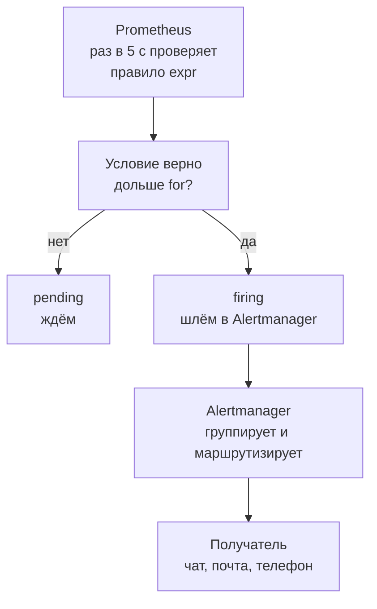
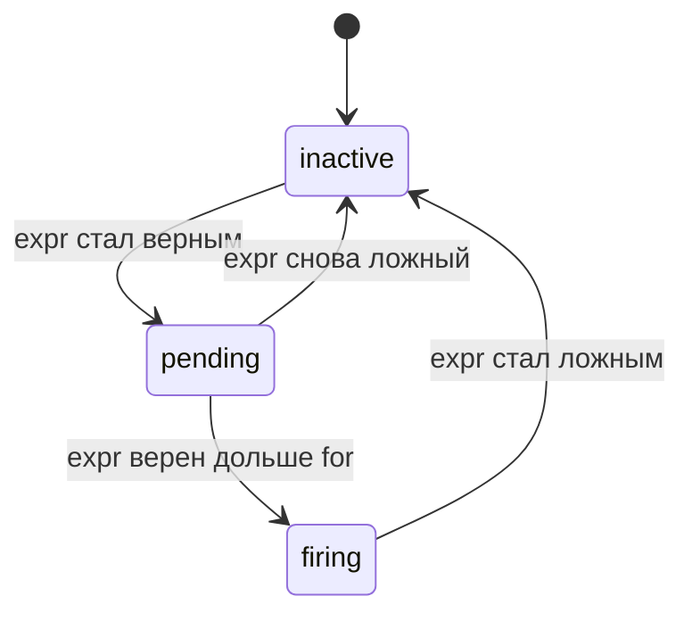
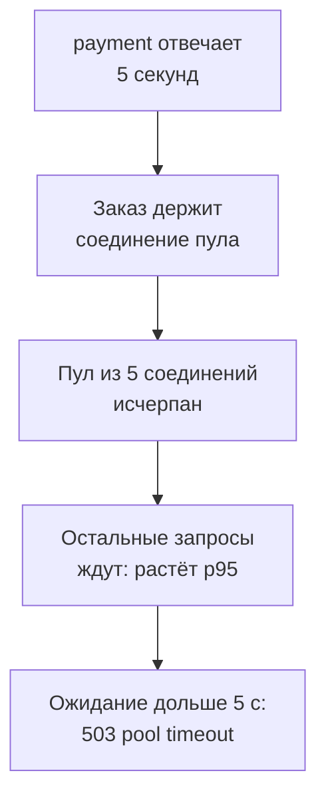

## Зачем это нужно

Дашборды из [урока 7.3](03-grafana.md) работают только пока ты на них смотришь. Ночью, в обед и в выходные никто не смотрит, а сервис ломается как раз тогда. Нужен механизм, который сам следит за метриками и **зовёт человека**, когда с системой что-то не так: **алерт** (alert, «тревога»). Хороший алерт будит тебя раньше, чем пожалуется пользователь; плохой будит зря, и через неделю ты перестаёшь на него реагировать, а настоящий сбой пропускаешь.

Для нагрузочника алерты полезны дважды. Во-первых, они сами показывают, **когда во время теста сервис перешёл границу «нормально»**: если алерт сработал на 340-й секунде теста, это факт для отчёта. Во-вторых, ты можешь проверить сам алерт: сработает ли он вообще, если сервис сломать, и как быстро. Алерт, который ни разу не проверяли, может молчать из-за опечатки, и ты узнаешь об этом только во время настоящей поломки.

Шаг проекта: ты разберёшь правила алертов стенда, проведёшь свой **первый инцидент** (оплата начинает отвечать по 5 секунд, «Магазин» ломается), пройдёшь его от алерта до причины по метрикам и логам и запишешь в файлы `~/perf-lab/07-monitoring/incident-01.md` (хронология, причина) и `runbook-payment.md` (что делать в следующий раз).

## Что нужно знать

- Prometheus, метрики и `up`: [урок 7.1](01-metrics-prometheus.md); `rate`, `histogram_quantile`, `for`-подобные окна: [урок 7.2](02-promql.md).
- Дашборды RED и USE, график как инструмент диагностики: [урок 7.3](03-grafana.md).
- Ресурсы и метод USE, пул соединений как ресурс: [урок 7.4](04-exporters.md). Логи и поиск причин в Loki: [урок 7.5](05-logs-loki.md).
- Пул соединений и оплата внутри заказа: README стенда, раздел «Заложенные узкие места» (подробно они разбираются в теме 11).
- Скрипт `~/perf-lab/07-monitoring/orders_load.py` из урока 7.4.

## Картина целиком

Охранная сигнализация в квартире. Датчики (Prometheus с правилами) постоянно проверяют условия: открыта ли дверь, есть ли движение. Когда условие выполняется, датчик не звонит тебе сам: он отправляет сигнал на пульт (Alertmanager). Пульт решает: сколько датчиков сработало, нужно ли звонить, кому звонить, не надоел ли он уже одним и тем же сигналом, не включил ли ты режим «я дома» (тишину). Аналогия ломается в том, что у сигнализации датчик либо молчит, либо кричит, а у алерта есть промежуточное состояние ожидания (pending), о нём ниже.



На схеме видно разделение: решение «тревога» принимает Prometheus, а решение «кому и как сообщить» Alertmanager. Они разделены намеренно: ты можешь менять правила рассылки, не трогая условия, и наоборот. В нашем стенде получателя нет (стенд учебный, без внешних интеграций), результат видно в интерфейсе Alertmanager.

## Теория

### Правило алерта: из чего оно состоит

**Зачем это существует.** Нужно записать условие «плохо» так, чтобы машина могла его проверять постоянно. Для этого запрос PromQL превращают в **правило** (alerting rule): если запрос вернул хотя бы один ряд, значит, условие выполняется.

**Как это устроено.** Правила лежат в YAML-файле (`monitoring/prometheus/rules/alerts.yml`), сгруппированные по `groups`. Возьмём реальное правило стенда:

```yaml
- alert: ShopHighErrorRate
  expr: sum(rate(http_requests_total{status=~"5.."}[1m])) / sum(rate(http_requests_total[1m])) > 0.05
  for: 2m
  labels: {severity: critical}
  annotations:
    summary: Много ошибок магазина
    description: Доля HTTP 5xx превышает 5 процентов две минуты.
```

Поле за полем:

- `alert`: имя алерта (оно же метка `alertname`). Имя должно говорить о симптоме: «много ошибок магазина», а не «проверка 7».
- `expr`: условие. Здесь доля 5xx среди всех запросов за минуту: `sum(rate(5xx)) / sum(rate(все))`, и `> 0.05` оставляет результат, только когда доля больше 5%. Если запросов нет, делитель равен 0: либо рядов нет совсем (результат пуст), либо получается `0 / 0`, то есть `NaN` (не число), а `NaN > 0.05` ложно. В обоих случаях алерт молчит. Для этого правила тишина при нулевом трафике опасна: упавший фронт тоже даёт ноль запросов. Как закрыть эту дыру, смотри ниже, в разделе про хорошие и плохие алерты.
- `for`: **выдержка**. Условие должно держаться непрерывно 2 минуты, прежде чем алерт станет боевым. Подробнее в следующем разделе.
- `labels`: метки, которые добавятся к алерту. Здесь `severity: critical` (важность). По меткам Alertmanager маршрутизирует.
- `annotations`: подписи для человека: что случилось, что делать, ссылка на инструкцию (`runbook_url`, см. ниже). Они не участвуют в маршрутизации. В правилах стенда `runbook_url` указывает на урок курса, где разобрана эта ситуация (в бою тут ссылка на страницу вашей вики). В боевых правилах ссылка обязательна.

Окно `[1m]` в правилах стенда годится, потому что скрейп идёт раз в 5 секунд и в окне 12 точек. На боевых системах со скрейпом 15-30 секунд берут `[2m]`-`[5m]`, иначе алерт будет дрожать от одной пропущенной точки (урок 7.2).

Prometheus вычисляет все правила раз в `evaluation_interval` (в нашем `prometheus.yml` это 5 секунд, на боевых системах обычно 15-60 с).

**Семь правил стенда** (пять основных и два «страховочных», о них ниже) сведены в таблицу, потому что на них построен урок:

| Алерт | Условие | for | Важность | Что за ним стоит |
|---|---|---|---|---|
| `ShopDown` | `up{job="shop"} == 0` | 1m | critical | Prometheus не может скрейпить «Магазин» |
| `ShopHighErrorRate` | доля 5xx > 5% | 2m | critical | пользователи получают ошибки |
| `ShopHighLatencyP95` | p95 > 1 с | 5m | warning | пользователи ждут слишком долго |
| `ShopDbPoolExhausted` | `shop_db_pool_waiting > 0` | 1m | warning | запросы стоят в очереди за соединением |
| `HostHighCpu` | CPU хоста > 90% | 2m | warning | хост перегружен |
| `ExporterDown` | `up == 0` у `payment`, `node`, `cadvisor`, `postgres`, `alertmanager`, `alloy` | 1m | warning | пропал источник метрик |
| `ShopNoTraffic` | трафик был за 30 минут, а за 5 минут запросов нет | 10m | info | запросы прекратились |

Из пяти основных алертов четыре смотрят на **симптомы для пользователя** (недоступен, ошибки, медленно, очередь), и только один на ресурс (процессор хоста). Ещё четыре алерта на **сгорание бюджета ошибок** лежат в отдельном файле `slo.yml`: о них в конце раздела про хорошие алерты и в [уроке 8.4](../08-perf-theory/04-load-profile-slo.md). Об этом принципе подробнее ниже.

**Что путают.** Алерт и метрика: алерт это не новые данные, а правило над существующими метриками. Prometheus также создаёт для каждого активного алерта служебную метрику `ALERTS{alertname, alertstate}`, её можно выводить на график.

> **Проверь понимание:** что вернёт выражение `shop_db_pool_waiting > 0`, когда никто не ждёт соединение (значение 0)? А когда ждут трое?

<details markdown="1">
<summary>Ответ</summary>

Когда значение 0, сравнение `0 > 0` ложно, и Prometheus **не возвращает ряд вообще** (пустой результат): условие не выполнено, алерт неактивен. Когда ждут трое, возвращается ряд со значением 3: условие выполнено, алерт переходит в `pending`. Так работают все сравнения в алертах: фильтр оставляет только «плохие» ряды.

</details>

### Состояния алерта и выдержка `for`

**Зачем это существует.** Метрики шумные. Один неудачный скрейп, секундный всплеск ошибок при деплое, короткая пауза сборки мусора: любое такое событие на секунду нарушит условие. Если бы алерт срабатывал немедленно, тебя будили бы десятки раз в сутки по пустякам. Выдержка `for` говорит: «тревога, только если плохо держится дольше N».

**Аналогия.** Датчик дыма на кухне. Тост дымнул одну секунду: звать пожарных не нужно. Если дым держится полминуты, это уже пожар. Эти полминуты и есть `for`. Аналогия ломается на цене: у датчика задержка в секунды, а у алерта она прямо удлиняет простой. При `for: 5m` ты узнаешь о поломке не раньше, чем через 5 минут после её начала.

**Как это устроено.** У алерта три состояния:



- **inactive** (неактивен): условие ложно, всё в порядке.
- **pending** (ожидание): условие уже верно, но выдержка `for` ещё не прошла. Наружу ничего не отправляется. Если условие снова стало ложным, алерт возвращается в inactive и отсчёт `for` **начинается заново**.
- **firing** (сработал): условие держалось дольше `for`. С этого момента Prometheus отправляет алерт в Alertmanager (и повторяет отправку, пока условие верно).

Если у правила `for` нет, оно работает как `for: 0s`: после первого вычисления сразу `firing`.

**Разобранный пример с числами.** Порог 5%, `for: 2m`. Доля ошибок ведёт себя так:

| Время | Доля 5xx | Состояние | Почему |
|---|---|---|---|
| 12:00:00 | 0,8% | inactive | ниже порога |
| 12:01:40 | 22% | pending | порог пробит (всплеск при деплое) |
| 12:02:20 | 1,1% | inactive | всплеск за 40 секунд кончился, `for` сброшен |
| 12:04:10 | 31% | pending | настоящая поломка, отсчёт с 12:04:10 |
| 12:06:10 | 33% | firing | условие держится 2 минуты |
| 12:08:00 | 35% | firing | продолжается, повторяем отправку |

Короткий всплеск в 12:01 алерта не создал: выдержка отфильтровала его. Настоящая поломка в 12:04 разбудила тебя в 12:06:10, то есть с задержкой в `for`. Эта задержка и есть цена защиты от ложных тревог.

Теперь поиграй сам: подвигай порог и выдержку и посмотри, когда алерт сработает и какие «провалы» он переживёт.

<div class="viz" data-viz="obs-alert-life" data-threshold="5" data-for="120"></div>

Смотри на график: линия это доля ошибок, горизонтальная пунктирная черта порог, а полоса внизу цвет состояния. Короткий всплеск первой половины графика алерт не поднимает (при `for` 120 с), а вторая поломка поднимает; нажми «провал» и убедись, что короткое падение вниз перезапускает отсчёт.

**Что путают.** Прошёл `for`, но алерт не пришёл: возможно, Alertmanager его сгруппировал и ждёт `group_wait`. Условие вернулось к норме на секунду посреди `for`: отсчёт обнуляется, и алерт может так никогда и не стать `firing`, хотя сервис «почти сломан». Для «мигающих» метрик это ловушка, поэтому для долгих окон иногда вместо голого значения используют агрегаты за окно (`avg_over_time`, `max_over_time`).

> **Проверь понимание:** при `for: 5m` у алерта p95 > 1 с график показывает: p95 больше секунды четыре минуты, ниже порога десять секунд, снова больше секунды шесть минут. В какой момент алерт станет `firing` и почему?

<details markdown="1">
<summary>Ответ</summary>

Только через 5 минут после того, как p95 снова превысил порог (то есть на 5-й минуте второго участка). Десятисекундная пауза обнулила отсчёт: четыре минуты первого участка не засчитываются. Алерт, конечно, бывает `pending` в течение обоих участков, но `firing` он станет только когда непрерывно выдержит все 5 минут.

</details>

### Alertmanager: маршруты, группировка, тишина

**Зачем это существует.** Допустим, сломалась база, и из-за этого сработало десять алертов (ошибки, медленно, пул, недоступность каждого из десяти сервисов). Если каждый придёт отдельным сообщением, получится лавина, в которой тонет суть. Alertmanager принимает алерты от Prometheus и решает, **как их доставить**: объединить в одно сообщение, отправить нужной команде, не повторять слишком часто, временно заглушить.

**Как он настроен в стенде.** Конфиг `monitoring/alertmanager/alertmanager.yml`:

```yaml
route:
  receiver: classroom
  group_by: [alertname]
  group_wait: 10s
  group_interval: 1m
  repeat_interval: 1h
receivers:
  - name: classroom
```

Разбор:

- **route** (маршрут): дерево правил «куда отправлять». Здесь только корень: всё идёт получателю `classroom`.
- **receivers**: получатели (чат, почта, телефон). Получатель `classroom` пустой: у него нет интеграций, поэтому алерты видны только в интерфейсе `http://localhost:9093`. На работе здесь бы стояли Telegram, Mattermost, почта, или система дежурств.
- **group_by: [alertname]**: алерты с одним значением метки `alertname` склеиваются в одну группу. Десять экземпляров `ShopHighErrorRate` (скажем, по десяти маршрутам) придут как **одно** сообщение со списком.
- **group_wait: 10s**: после появления **первого** алерта новой группы Alertmanager ждёт 10 секунд: вдруг сразу подтянутся его «соседи», и тогда в первое сообщение попадёт всё сразу. Это задержка между `firing` и первой отправкой.
- **group_interval: 1m**: если в **уже отправленной** группе появился новый алерт или какой-то из них закрылся, Alertmanager отправит обновление не раньше чем через минуту после прошлой отправки.
- **repeat_interval: 1h**: если ничего не изменилось, повторять напоминание об уже известной проблеме не чаще раза в час. Без этого сообщения о той же поломке сыпались бы каждые 5 секунд.

**Маршрутизация по меткам** (в стенде её нет, но вот типичный вид на работе):

```yaml
route:
  receiver: team-chat
  group_by: [alertname]
  routes:
    - matchers: ['severity="critical"']
      receiver: on-call-phone
    - matchers: ['alertname=~"Host.*"']
      receiver: infra-chat
```

Критические алерты идут на телефон дежурного, алерты хоста в чат инфраструктуры, остальные в общий чат. Выбор делают по **меткам** алерта (поэтому метка `severity` в правилах не декоративная).

**Тишина (silence).** Если ты знаешь, что сервис будет ломаться (плановые работы, нагрузочный тест!), создай тишину: правило «не отправлять алерты с такими-то метками в такой-то период». Алерты при этом **продолжают срабатывать** и видны в интерфейсе, просто уведомления не уходят. Создаётся в UI Alertmanager (кнопка Silence), с обязательным сроком и комментарием «почему». Тишина без срока и без комментария это бомба: через месяц никто не вспомнит, почему алерт молчит.

**Подавление (inhibition).** Правило «если сработал алерт A, не слать B»: например, если упал весь хост, не нужны отдельные алерты на каждый его сервис. В стенде его нет, но на работе оно сильно режет шум.

**Что путают.** `for` и `group_wait`: первый задерживает превращение в `firing` (решает Prometheus), второй задерживает **отправку** уже сработавшего алерта (решает Alertmanager). Итоговая задержка между началом поломки и сообщением: примерно «момент, когда условие стало верным» + `for` + `group_wait`. В нашем стенде для `ShopHighErrorRate` это 2 минуты + 10 секунд + до 5 секунд на шаг вычисления.

> **Проверь понимание:** у тебя 20 алертов `ShopHighLatencyP95` по разным маршрутам загорелись одновременно. Сколько сообщений придёт с настройкой `group_by: [alertname]`, а сколько с `group_by: [alertname, route]`?

<details markdown="1">
<summary>Ответ</summary>

С `[alertname]` придёт одно сообщение, в нём список из 20 алертов. С `[alertname, route]` каждая пара (имя, маршрут) станет отдельной группой, то есть 20 сообщений. Чем меньше меток в `group_by`, тем меньше сообщений, но тем меньше деталей в заголовке.

</details>

### Какие алерты хорошие, а какие плохие

**Зачем это важно.** Самая частая беда мониторинга: алертов слишком много, они шумят, и дежурные привыкают игнорировать (усталость от алертов, alert fatigue). Правило звучит так: **каждый алерт должен требовать действия человека**. Если можно ничего не делать, это не алерт, а запись для дашборда.

Принципы хорошего алерта:

1. **Симптом, а не причина.** Алерт «доля ошибок > 5%» (симптом: пользователям плохо) полезнее, чем «CPU > 70%» (возможная причина: может, это просто хорошо загруженный сервис). Причины ищут потом по дашборду и логам. Исключение: ресурс, который при исчерпании гарантированно приведёт к беде (диск заполнится через 4 часа).
2. **Срочность соответствует важности.** `critical` разбудит ночью человека; `warning` подождёт до утра. Не делай всё критическим.
3. **У алерта есть `for` и разумный порог.** Порог берут из SLO или из наблюдений за здоровой системой, а не «потому что круглое число».
4. **Понятная подпись и инструкция.** В `annotations` объясни, что произошло, и дай ссылку на runbook (см. ниже).
5. **Алерт проверен.** Ты видел его срабатывание на настоящей поломке (мы сделаем это в практике).

Таблица «плохо и хорошо»:

| Плохо | Почему | Лучше |
|---|---|---|
| `node_load1 > 4` | зависит от числа ядер, не говорит о пользователях | доля ошибок или латентность |
| `up == 0` без `for` | один пропущенный скрейп разбудит | `up == 0` с `for: 1m` |
| «CPU > 80%» с `for: 0s` | любая пиковая секунда срабатывает | `for` в минутах и порог 90% (у `HostHighCpu` в стенде 2m) |
| один алерт «что-то не так» | непонятно, что делать | отдельные алерты со своими подписями |
| все алерты `critical` | через неделю их никто не читает | critical только для ухода пользователей |
| алерт без runbook | ночью дежурный гуглит | ссылка на инструкцию в `annotations` |

**Что путают.** Желание «мониторить всё»: на каждую метрику не нужен алерт. Метрик сотни, алертов должно быть десятки. Всё остальное это панели на дашборде для разбора.

**Слепое пятно, которое мы нашли в уроке 7.4:** набор стенда не проверяет `up` экспортёров. Если упадёт `cadvisor` или `node-exporter`, ты ослепнешь молча. Нужно правило вида (оно есть в стенде, группа `shop-meta`):


```yaml
- alert: ExporterDown
  expr: up{job=~"payment|node|cadvisor|postgres|alertmanager|alloy"} == 0
  for: 1m
  labels: {severity: warning}
  annotations:
    summary: "Цель {{ $labels.job }} недоступна"
    description: "Prometheus не может скрейпить {{ $labels.instance }} больше минуты: метрики этого источника не обновляются."
    runbook_url: https://distinguished-sre.github.io/load-tester/07-observability/04-exporters.html
```


Самого магазина в списке нет: его сторожит `ShopDown`. Самого Prometheus тоже нет: упавший Prometheus алерт не пришлёт, за ним следит внешняя проверка. Правило проверишь в практике (шаг 7).

У `up == 0` есть своё слепое пятно: если цель убрали из конфигурации Prometheus или переименовали `job`, серия `up` просто исчезает, и условие `== 0` молчит. Для критичных целей добавляют проверку на пропажу самой метрики: `absent(up{job="cadvisor"})` возвращает ряд со значением 1, когда ни одной серии с такими метками нет.

**Слепое пятно номер два: пропал трафик.** `ShopHighErrorRate` смотрит на долю ошибок. Если балансировщик перед магазином отвалился, пользователи не могут зайти, запросов 0, ошибок 0, и алерт молчит (см. про `NaN` выше). Нужен второй алерт на сам факт тишины:

```yaml
# боевой вариант
- alert: ShopNoTraffic
  expr: sum(rate(http_requests_total[5m])) == 0 or absent(http_requests_total)
  for: 5m
  labels: {severity: critical}
```

`== 0` ловит случай, когда серии есть, но счётчики не растут; `absent(...)` случай, когда метрика пропала целиком (сервис не отдаёт метрики или Prometheus его не видит). В учебном стенде без нагрузки трафика и так нет, поэтому боевой вариант шумел бы постоянно. Версия в `alerts.yml` стенда мягче: `sum(rate(http_requests_total[5m])) == 0 and sum(increase(http_requests_total[30m])) > 0` (трафик был полчаса назад, а сейчас его нет), `for: 10m` и важность `info`. Она молчит в стенде, куда никто не ходил, и срабатывает через 15 минут после конца нагрузочного теста: это ожидаемо, не пугайся. Ветки `absent(...)` в учебной версии нет, потому что без истории трафика её нельзя отличить от «стенд только что поднят». На боевом сервисе, куда ходят пользователи круглые сутки, ставят боевой вариант. Для сервисов с ночными паузами порог времени делают длиннее или не ставят алерт на ночь.

**Алерты на сгорание бюджета ошибок.** Пять основных алертов смотрят на порог «сейчас». Для SLO на месяц нужен другой взгляд: не «плохо ли сейчас», а «как быстро мы тратим бюджет». Такие правила (multiwindow multi-burn-rate: скорость сгорания 14,4 на окнах 1 час и 5 минут, скорость 6 на окнах 6 часов и 30 минут) лежат в `monitoring/prometheus/rules/slo.yml` вместе с recording rules, на которых они построены (`sli:http_error_ratio:rate5m` и другие). Смысл правил и расчёт на числах разобраны в [уроке 8.4](../08-perf-theory/04-load-profile-slo.md), здесь важна разница: они срабатывают не от всплеска, а от устойчивой потери бюджета, и поэтому в `critical` попадают реже, чем `ShopHighErrorRate`.

В `annotations` двойные фигурные скобки подставляют значения: `{{ $labels.job }}` это значение метки `job` у сработавшего ряда, а `{{ $value }}` значение выражения. Это шаблоны Go (язык Prometheus), и в Jekyll-уроке они защищены тегом raw; в твоём YAML-файле они пишутся как есть.

### Runbook: инструкция на случай тревоги

**Зачем это существует.** В три часа ночи ты не хочешь соображать, а хочешь выполнять шаги. **Runbook** («книга запуска», дословно инструкция оператора) это короткий документ на один алерт: что он значит, как быстро оценить масштаб, что проверить, как починить и куда эскалировать. Он снимает с дежурного нагрузку «придумывать» и делает реакцию одинаковой у любого человека.

Хороший runbook умещается на один экран и содержит:

1. **Что значит алерт** (одной фразой, на языке пользователя).
2. **Как оценить масштаб**: ссылка на дашборд или готовый запрос (кого затронуло, насколько).
3. **Диагностика по шагам**: «если A, то B».
4. **Как починить** (команды целиком, а не «перезапусти сервис»).
5. **Как убедиться, что починил** (какая метрика вернулась в норму).
6. **Кому эскалировать**, если не помогло.

Ссылку на runbook кладут в `annotations` правила (`runbook_url`), и тогда она прямо в уведомлении. Runbook проверяют так же, как код: после каждого инцидента, где он не помог, его правят.

### Первый инцидент: оплата стала медленной

**Сценарий.** Внешняя оплата (сервис `payment`) начинает отвечать по 5 секунд вместо 50 миллисекунд. Это самая частая беда в реальных системах: внешняя зависимость ухудшилась, а твой сервис остался «живым» и сам становится жертвой. В «Магазине» намеренно заложена цепочка (README, раздел узких мест): оплата выполняется **внутри транзакции**, то есть заказ держит соединение с базой, пока ждёт оплату. Соединений в пуле всего 5 (`DB_POOL_MAX`). Дальше работает арифметика:

- каждый заказ занимает соединение на ~5 с (`delay_ms = 5000` с разбросом ±20%);
- пул из 5 соединений обслуживает не больше 5 заказов одновременно, то есть около одного заказа в секунду;
- остальные запросы (в том числе **каталог**, которому оплата вообще не нужна) ждут соединение из пула; если не дождались за `DB_POOL_TIMEOUT = 5` секунд, получают 503 «database pool timeout».

Цепочка, по которой поломка внешнего сервиса превращается в поломку всего магазина:



Смотри на цепочку: причина одна (медленная оплата), а последствия видны далеко от неё: даже просмотр каталога не может получить соединение. Метрики показывают **последствия**, поэтому разбор инцидента это движение от последствия к причине.

**Включение поломки.** Оплату можно перенастраивать на лету через административный адрес `payment` (порт 8001 опубликован на твою машину):

```bash
curl -s -X POST localhost:8001/admin/config -H 'Content-Type: application/json' -d '{"delay_ms": 5000}'
```

Разбор: `POST /admin/config` меняет задержку оплаты без перезапуска; тело `{"delay_ms": 5000}` задаёт среднюю задержку в миллисекундах (поле `fail_rate` доля отказов, она остаётся прежней). Ответ покажет текущую конфигурацию: `{"delay_ms":5000.0,"fail_rate":0.0}`. Вернуть обратно: `{"delay_ms": 50}`.

**Ожидаемая хронология** (с нагрузкой 8 «покупателей» из `orders_load.py`; точные секунды у тебя будут отличаться):

| Время от старта | Что происходит | Откуда видно |
|---|---|---|
| 0:00 | включена оплата 5 с, идёт нагрузка | запись в твоём журнале |
| 0:10-0:20 | `shop_db_pool_waiting` > 0, p95 растёт | дашборд, `ShopDbPoolExhausted` в `pending` |
| 0:20-0:40 | первые 503 pool timeout | `http_requests_total{status="503"}`, логи `ERROR` |
| ~1:10 | `ShopDbPoolExhausted` в `firing` (прошла 1 минута) | UI Prometheus `/alerts` |
| ~2:30 | `ShopHighErrorRate` в `firing`, если доля 5xx > 5% | `/alerts` и Alertmanager |
| ~5:30 | `ShopHighLatencyP95` в `firing`, если p95 > 1 с держится 5 минут | `/alerts` |

Порядок срабатывания важен: первым срабатывает самый чувствительный и быстрый алерт, который говорит о **механизме** (очередь в пуле), потом алерт о пользователях (ошибки), позже (из-за долгого `for`) алерт о латентности. Все они указывают на одну причину.

**Расследование: по шагам.** Метод тот же, что в уроках 7.4 и 7.5.

1. **Подтвердить симптом (RED).** Ошибки есть? Какие маршруты? `sum by (route, status) (rate(http_requests_total{status=~"5.."}[1m]))`: 503 появились на разных маршрутах, в том числе на каталоге. Значит, виновата не логика заказа, а что-то общее.
2. **USE по ресурсам.** CPU хоста и контейнеров низкий (никто не считает), память стабильна, **пул** насыщен: `shop_db_pool_available = 0`, `shop_db_pool_waiting` растёт. Узкое место в пуле.
3. **Кто держит соединения?** `pg_stat_database_numbackends` на потолке (5 пула + 1 экспортёра при одном воркере, это значение `WEB_CONCURRENCY` по умолчанию: пул создаётся на каждый воркер). Что делают эти соединения: заказы, в которых оплата. Подтверждение в метриках оплаты: `histogram_quantile(0.95, sum by (le) (rate(shop_payment_duration_seconds_bucket[1m])))` показывает около 5-6 секунд (до инцидента 0,06). Это **причина**.
4. **Логи.** `{service="shop", level="ERROR"} | json | line_format ...`: строки с `status: 503, error: "database pool timeout"` и `duration_ms` около 5000 (равно `DB_POOL_TIMEOUT`). Такое значение выдаёт, что запрос ждал пула, а не работал.
5. **Хронология.** Минуты начала, срабатывания каждого алерта, момент починки.
6. **Починка.** Вернуть оплату: `{"delay_ms": 50}`; через 30-60 секунд `shop_db_pool_waiting` падает в ноль, 503 прекращаются, алерты возвращаются в `inactive`. Долгосрочное исправление (вынести оплату за пределы транзакции, поставить таймауты, сделать повторы с паузой) это тема 11.

Хронология и вывод записываются в `incident-01.md`. Шаблон есть в практике.

**Что путают.**

- Первый алерт и причина. Первым сработает «следствие»: очередь, ошибки. Причина (оплата) нигде не в алертах: на неё алерта нет. Это нормально: симптом-алерты находят, диагностика объясняет.
- Починка симптома вместо причины: поднять `DB_POOL_MAX` до 50 «помогло» бы лишь на время, пока оплата простаивает на 50 соединениях, а базе придётся держать 50 открытых соединений с висящими транзакциями.

> **Проверь понимание:** `shop_db_pool_waiting = 3`, а CPU хоста 8%, CPU `shop` 12%. Метрики оплаты (`shop_payment_duration_seconds`) в норме (60 мс). Что бы ты проверил следующим?

<details markdown="1">
<summary>Ответ</summary>

Раз оплата быстрая, держит соединение что-то другое: долгие SQL-запросы (проверь `pg_stat_statements` и `pg_stat_activity`), блокировки (`pg_locks_count`, `pg_stat_database_deadlocks`), «утёкшие» соединения, которые приложение не вернуло в пул (`shop_db_pool_size - shop_db_pool_available` без трафика). В инциденте с оплатой та же картина метрик пула, но разные причины: поэтому всегда проверяй, **что** держит ресурс.

</details>

## Практика

Для всех шагов стенд поднят с профилем мониторинга: `docker compose --profile monitoring up -d --wait`. Нагружаем только свой стенд.

### 1. Посмотри правила и их состояние

В браузере `http://localhost:9090/alerts` (раздел Alerts в Prometheus). Должны быть видны одиннадцать алертов со статусом `inactive` (пять основных, `ExporterDown`, `ShopNoTraffic` и четыре на сгорание бюджета). Через консоль:

```bash
curl -s localhost:9090/api/v1/rules | jq -r '.data.groups[].rules[] | select(.type == "alerting") | [.name, .state, .duration] | @tsv'
```

Разбор: `/api/v1/rules` отдаёт JSON со всеми правилами; `jq -r` печатает без кавычек; выражение `.data.groups[].rules[]` проходит по всем правилам всех групп; `select(.type == "alerting")` оставляет только алерты (в этом же списке лежат recording rules из `slo.yml`, у них нет состояния); `[.name, .state, .duration] | @tsv` собирает три поля в строку с табуляциями.

```text
ShopDown	inactive	60
ShopHighErrorRate	inactive	120
ShopHighLatencyP95	inactive	300
ShopDbPoolExhausted	inactive	60
HostHighCpu	inactive	120
ExporterDown	inactive	60
ShopNoTraffic	inactive	600
ShopErrorBudgetBurnFast	inactive	120
ShopErrorBudgetBurnSlow	inactive	900
ShopLatencyBudgetBurnFast	inactive	120
ShopLatencyBudgetBurnSlow	inactive	900
```

**Как читать вывод:** колонки имя, состояние, выдержка `for` в секундах (60, 120, 300, 600, 900 это `1m`, `2m`, `5m`, `10m`, `15m`). Все `inactive`: стенд здоров. Если у тебя `pending` или `firing`, стенд кто-то нагружает или он болен, найди причину до продолжения.

Также открой `http://localhost:9093`: интерфейс Alertmanager. Он пока пуст (раздел Alerts без записей), и это нормально.

**Типичные ошибки:** `curl: (7) Failed to connect`: Prometheus не запущен; `jq: error: Cannot iterate over null`: адрес API набран неверно.

### 2. Проверь «здоровое» состояние

Запусти умеренную нагрузку на две минуты и убедись, что алерты молчат:

```bash
source ~/perf-lab/.venv/bin/activate
python ~/perf-lab/07-monitoring/orders_load.py orders 3 120 &
sleep 100
curl -s localhost:9090/api/v1/rules | jq -r '.data.groups[].rules[] | select(.type == "alerting") | [.name, .state] | @tsv'
wait
```

Все одиннадцать должны остаться `inactive`: это **базовая линия**. Если срабатывает что-то при умеренной нагрузке, алерт слишком чувствителен (или у тебя слишком слабый хост).

### 3. Подготовь журнал и запусти инцидент

Создай заготовку и запомни время начала (в UTC, как в логах):

```bash
mkdir -p ~/perf-lab/07-monitoring
date -u +%H:%M:%S
python ~/perf-lab/07-monitoring/orders_load.py orders 8 420 0.5 &
sleep 15
curl -s -X POST localhost:8001/admin/config -H 'Content-Type: application/json' -d '{"delay_ms": 5000}'
date -u +%H:%M:%S
```

Разбор: первая команда `date -u` печатает текущее время в UTC (запиши его как время начала нагрузки); скрипт запускается на 7 минут с 8 пользователями и паузой 0,5 с; через 15 секунд оплата замедляется до 5 секунд; вторая `date -u` фиксирует **момент поломки**. Запиши оба времени.

Следи за страницей `http://localhost:9090/alerts` (обновляй) и раз в 30 секунд выполняй запросы:

```promql
shop_db_pool_waiting
```

```promql
sum by (status) (rate(http_requests_total[1m]))
```

```promql
histogram_quantile(0.95, sum by (le) (rate(http_request_duration_seconds_bucket[1m])))
```

```text
{}               5
{status="200"}   2.4
{status="503"}   4.1
{}               5.0
```

**Как читать вывод:** очередь в пуле пять (все пять ждут), 503 идут быстрее, чем успешные ответы, p95 уткнулся в 5 секунд (это тот самый `DB_POOL_TIMEOUT`: дольше пул не ждёт). Числа примерные.

В момент, когда на странице `/alerts` загорится первый алерт, запиши время. Также в `http://localhost:9093` (Alertmanager) появится группа алертов, примерно через 10 секунд после `firing` (это `group_wait`). Раскрой её: видны метки (`alertname`, `severity`) и подписи (`summary`, `description`).

> Сначала проверь причину инцидента сам: метрики, логи, алгоритм из урока. Только потом опиши нейросети симптомы и сравни её гипотезы со своей. Каждую проверь запросом в Prometheus или Loki, а не принимай на веру.
{: .ai}

### 4. Найди причину по метрикам и логам

Пока инцидент идёт, пройди расследование по шагам из теории:

```promql
sum by (route, status) (rate(http_requests_total{status=~"5.."}[1m]))
```

```promql
shop_db_pool_available
```

```promql
histogram_quantile(0.95, sum by (le) (rate(shop_payment_duration_seconds_bucket[1m])))
```

```promql
pg_stat_database_numbackends{datname="shop"}
```

```text
{route="/api/products", status="503"}   0.8
{route="/api/orders", status="503"}     1.2
{}                                     0
{}                                     5.7
{datname="shop"}                       6
```

**Как читать вывод:** 503 идут и на каталоге (`/api/products`), и на заказах: проблема общая. `shop_db_pool_available = 0`: свободных соединений нет. P95 оплаты 5,7 секунды: вот **причина** (в норме около 0,06 с). `numbackends = 6`: пять соединений пула и одно экспортёра, потолок (при `WEB_CONCURRENCY=2` будет 11).

Логи подтверждают то же самое, откройте Explore, источник Loki:


```logql
{service="shop", level="ERROR"} | json | line_format `{{.route}} {{.status}} {{.error}} {{.duration_ms}}мс`
```


```text
/api/products 503 database pool timeout 5004.3мс
/api/orders 503 database pool timeout 5003.7мс
```

Время ответа около 5000 мс равно `DB_POOL_TIMEOUT`: запрос не работал, а ждал соединения. Агрегат по причинам: `sum by (error) (count_over_time({service="shop", level="ERROR"} | json [1m]))`.

### 5. Почини и зафиксируй время

```bash
curl -s -X POST localhost:8001/admin/config -H 'Content-Type: application/json' -d '{"delay_ms": 50}'
date -u +%H:%M:%S
wait
```

Запиши время починки. Подожди 1-2 минуты и проверь: `shop_db_pool_waiting` вернулся к 0, 503 нет, на `/alerts` алерты снова `inactive` (на `firing` алерт сам вернётся в `inactive` после первого вычисления, где условие ложно), а в Alertmanager они пропали или помечены как закрытые.

### 6. Запиши инцидент и runbook

Файл `~/perf-lab/07-monitoring/incident-01.md`:

```markdown
# Инцидент 01: оплата отвечает 5 секунд

**Дата:** ____  **Продолжительность:** ____ (от ____ до ____ UTC)
**Влияние:** какие маршруты, какие статусы, доля ошибок на пике ____ %

## Хронология (UTC)

| Время | Событие |
|---|---|
| ____ | нагрузка запущена (8 пользователей) |
| ____ | оплата замедлена до 5 с (`/admin/config`) |
| ____ | `ShopDbPoolExhausted` pending |
| ____ | `ShopDbPoolExhausted` firing |
| ____ | `ShopHighErrorRate` firing |
| ____ | оплата возвращена к 50 мс |
| ____ | алерты в inactive |

## Причина (двумя фразами и двумя метриками)

## Что видно в логах (запрос + строка)

## Что сработало хорошо, что плохо (алерты: вовремя? лишние? не хватило?)

## Что исправить (алерт, runbook, настройка)
```

Файл `~/perf-lab/07-monitoring/runbook-payment.md`:

```markdown
# Runbook: ShopDbPoolExhausted / ShopHighErrorRate при медленной оплате

**Что значит:** пул соединений «Магазина» исчерпан, пользователи получают 503 или ждут.
**Масштаб:** `sum by (route, status) (rate(http_requests_total{status=~"5.."}[1m]))`
**Диагностика:**
1. `shop_db_pool_waiting` > 0 и `shop_db_pool_available` = 0? Если нет, это не пул.
2. p95 оплаты: `histogram_quantile(0.95, sum by (le) (rate(shop_payment_duration_seconds_bucket[1m])))`. Выросло? Значит, виновата оплата.
3. Если оплата в норме: `pg_stat_statements`, блокировки, утечка соединений.
**Починка:** ____
**Проверка:** ____
**Эскалация:** ____
```

Заполни все `____`.

### 7. Проверь алерт на экспортёры

Правило `ExporterDown` из теории уже есть в стенде: оно в группе `shop-meta` файла `monitoring/prometheus/rules/alerts.yml`. Проверь, что оно живое. Сначала синтаксис правил (утилита `promtool` лежит в образе Prometheus, отдельно её ставить не надо):

```bash
cd ~/load-tester/project/shop
docker run --rm -v "$PWD/monitoring/prometheus/rules:/r:ro" --entrypoint promtool prom/prometheus:v3.15.0 check rules /r/alerts.yml /r/slo.yml
```

Разбор: `promtool check rules` проверяет файлы правил; `--rm` удаляет временный контейнер; `-v ...:/r:ro` подключает папку с правилами только для чтения; два файла в конце: алерты и правила SLO (о них урок [8.4](../08-perf-theory/04-load-profile-slo.md)).

```text
Checking /r/alerts.yml
  SUCCESS: 7 rules found

Checking /r/slo.yml
  SUCCESS: 12 rules found
```

Теперь останови `cadvisor`, подожди 1,5 минуты и выполни запрос из шага 1 (`/api/v1/rules`) или открой `/alerts`: `ExporterDown` должен быть `firing` для `job="cadvisor"`. Запусти его снова (`docker compose --profile monitoring start cadvisor`), через минуту алерт погаснет.

```bash
docker compose --profile monitoring stop cadvisor
sleep 90
curl -s localhost:9090/api/v1/alerts | jq -r '.data.alerts[] | [.labels.alertname, .labels.job, .state] | @tsv'
docker compose --profile monitoring start cadvisor
```

```text
ExporterDown	cadvisor	firing
```

**Как читать вывод:** колонки имя алерта, цель, состояние. Если вместо `firing` стоит `pending`, не прошла минута `for`: подожди ещё немного. Пустой вывод значит, что алерт не сработал: проверь, что `cadvisor` действительно остановлен (`docker compose --profile monitoring ps`).

Открой в Alertmanager (`http://localhost:9093`) этот же алерт и посмотри, что в нём лежит в аннотации `runbook_url`: это ссылка на урок курса, а в боевой системе здесь стоит страница вашей вики.

**Типичные ошибки:**

- `SUCCESS` не появился, вместо него `yaml: line 61: did not find expected key`: сломаны отступы (в своей правке правил; соседние правила начинаются с `- alert:` на 6 пробелов).
- `ExporterDown` не появился в `/alerts`: Prometheus не перечитал правила. Для своих правок используй `docker compose --profile monitoring kill -s HUP prometheus` (сигнал «перечитай конфиг»: адреса `/-/reload` без флага `--web.enable-lifecycle` у стенда нет).
- `command not found: promtool`: запускай через `docker run ... --entrypoint promtool`, как показано.

```bash
cd ~/perf-lab && git add 07-monitoring && git commit -m "7.6: инцидент 01, runbook" && git push
```

## Сломай и почини

**Поломка: молчащий алерт.** Ты написал алерт, но он не сработал, хотя сервис сломан. Такое бывает постоянно. Смоделируем: поменяем в **своей копии** правила имя метрики на неверное (`shop_db_pool_waitng`, опечатка) и убедимся, что инцидент пройдёт мимо.

```bash
cd ~/load-tester/project/shop
cp monitoring/prometheus/rules/alerts.yml ~/perf-lab/07-monitoring/alerts.yml.orig
sed -i.bak 's/shop_db_pool_waiting > 0/shop_db_pool_waitng > 0/' monitoring/prometheus/rules/alerts.yml
rm monitoring/prometheus/rules/alerts.yml.bak
docker compose --profile monitoring kill -s HUP prometheus
```

Повтори инцидент (шаг 3 практики, он занимает 3-4 минуты). `ShopHighErrorRate` сработает, а `ShopDbPoolExhausted` нет.

**Задача:** выясни, почему `ShopDbPoolExhausted` молчит, не читая файл правил (сначала): какой запрос в Prometheus докажет, что метрики с таким именем нет? И что в этом инциденте отличает «алерт молчит, потому что всё хорошо» от «алерт молчит, потому что сломан сам»?

<div class="viz" data-viz="flow" data-steps='[{"title":"Убедись, что условие верно","text":"Выполни выражение алерта как обычный запрос в Prometheus. Пусто, хотя пул явно забит?"},{"title":"Проверь имя метрики","text":"`count({__name__=~\"shop_db_pool.*\"}) by (__name__)`: есть ли метрика, на которую смотрит выражение?"},{"title":"Сравни с источником","text":"`curl -s localhost:8000/metrics | grep pool`: что реально отдаёт сервис?"},{"title":"Исправь и проверь","text":"Верни правильное имя, `kill -s HUP`, повтори выражение: теперь есть значения."},{"title":"Страхуйся","text":"Добавь проверку правил (`promtool check rules`) и тестовый прогон в процесс."}]'></div>

<details markdown="1">
<summary>Что должно получиться</summary>

Выражение `shop_db_pool_waitng > 0` не возвращает ничего никогда: метрики с таким именем нет, а пустой результат для алерта значит «всё хорошо». Это коварнее всего: ошибка в имени метрики не вызывает ни ошибки, ни предупреждения. Доказательство: `count({__name__=~"shop_db_pool.*"}) by (__name__)` покажет три настоящие метрики (`shop_db_pool_size`, `_available`, `_waiting`), а `shop_db_pool_waitng` в списке нет. Защита: проверять правило на настоящей поломке (как в этом уроке) и заводить привычку «каждый алерт хоть раз видел горящим». Починка: `git checkout -- monitoring/prometheus/rules/alerts.yml` и `kill -s HUP prometheus`.

</details>

## ИИ в помощь

Нейросеть помогает набросать правило алерта и оформить хронологию инцидента, но причины она предполагает, а не знает: данные видишь только ты. Общие правила: [ИИ-помощник](../ai.md).

**Задача:** составить правило алерта по описанию.

```text
Prometheus 3 и Alertmanager. Нужно правило: если доля ответов 5xx по метрике http_requests_total
(метки method, route, status) выше 5% в течение 2 минут, severity critical. Напиши правило
в формате YAML с annotations (summary, runbook_url). Объясни, что делает for, и что
будет с алертом, если трафика нет совсем.
```
{: .wrap}

**Проверь ответ:** проверь синтаксис командой `promtool check rules` (она есть в образе Prometheus) и сравни с `ShopHighErrorRate` из стенда. Типичные ошибки: деление без учёта пустого трафика (NaN), `for` в неверном месте, метка `status` без регулярного выражения `5..`, устаревший формат Alertmanager.

**Задача:** оформить черновик постмортема.

```text
Вот мои заметки по инциденту: <вставь хронологию в UTC и причину двумя фразами с метриками>.
Оформи в структуру: хронология, причина, что видно в логах, что сработало хорошо и плохо,
что исправить. Ничего не добавляй от себя: если данных не хватает, напиши «нужны данные».
```
{: .wrap}

**Проверь ответ:** каждое время и число сверь со своими заметками и Grafana. Типичная ошибка: нейросеть красиво достраивает причину и выдумывает цифры. Всё, чего нет в твоих заметках, вычеркни.

## Словарик урока

| Термин | Простыми словами |
|---|---|
| Алерт (alert) | Автоматическая тревога: правило над метриками, зовущее человека |
| Правило алерта | Запись в YAML: имя, условие `expr`, выдержка `for`, метки, подписи |
| `expr` | Запрос PromQL: если вернул хотя бы один ряд, условие выполнено |
| `for` | Выдержка: условие должно держаться столько времени, прежде чем алерт сработает |
| inactive | Алерт не активен: условие ложно |
| pending | Условие уже верно, но выдержка `for` ещё не прошла |
| firing | Алерт сработал: Prometheus отправляет его в Alertmanager |
| `evaluation_interval` | Как часто Prometheus проверяет правила (в стенде 5 секунд) |
| Alertmanager | Пульт тревог: группирует, маршрутизирует, заглушает, не даёт спамить |
| Маршрут (route) | Правило «какие алерты куда отправлять» по меткам |
| Получатель (receiver) | Куда уходит уведомление: чат, почта, телефон |
| `group_by` | Метки, по которым алерты склеиваются в одно сообщение |
| `group_wait` | Пауза после первого алерта группы перед первой отправкой |
| `group_interval` | Минимальный интервал между обновлениями уже отправленной группы |
| `repeat_interval` | Как часто напоминать об уже известной проблеме |
| Тишина (silence) | Временный запрет уведомлений по меткам, алерты продолжают срабатывать |
| Подавление (inhibition) | Правило «если сработал A, не слать B» |
| Усталость от алертов | Когда тревог слишком много, и дежурные перестают реагировать |
| Runbook | Короткая инструкция на один алерт: что значит, как проверить, как чинить |
| Инцидент | Событие, при котором сервис работает хуже нормы и пользователи это чувствуют |
| Хронология (timeline) | Список событий инцидента с точным временем |
| `promtool` | Утилита Prometheus: проверяет файлы правил и конфигурации |

## Вопросы с собеседований

Раздел для повторения: ответь вслух, потом открой ответ.

### 1. [junior] [часто] В чём разница между Prometheus и Alertmanager в алертинге?

<details markdown="1">
<summary>Ответ</summary>

Prometheus вычисляет правила и решает, что условие нарушено (алерт `firing`). Alertmanager получает такие алерты и решает, как доставить: группирует, маршрутизирует по меткам, не повторяет слишком часто, учитывает тишину и подавление, отправляет получателю.

**Что хотят услышать:** разделение ответственности: условие и доставка.

**Красный флаг:** «Prometheus сам рассылает письма».

</details>

### 2. [junior] [часто] Для чего нужен `for` в правиле алерта?

<details markdown="1">
<summary>Ответ</summary>

Условие должно держаться непрерывно указанное время, прежде чем алерт станет `firing`. Это отсекает короткие всплески и ложные срабатывания. Цена: задержка обнаружения, равная `for`. Если условие хоть раз стало ложным, отсчёт начинается заново.

**Что хотят услышать:** фильтр шума, цена в виде задержки, сброс отсчёта, состояние `pending`.

**Красный флаг:** считает, что `for` это «задержка отправки».

</details>

### 3. [junior] [часто] Какие три состояния у алерта?

<details markdown="1">
<summary>Ответ</summary>

`inactive` (условие ложно), `pending` (условие верно, ждём выдержку `for`), `firing` (выдержка прошла, алерт отправляется в Alertmanager).

**Что хотят услышать:** переходы между ними, возврат из `pending` в `inactive`.

**Красный флаг:** путает `pending` и `firing`.

</details>

### 4. [junior] Что такое runbook и зачем он?

<details markdown="1">
<summary>Ответ</summary>

Инструкция на один алерт: что значит, как оценить масштаб, шаги диагностики, как чинить, как убедиться, что починено, кому эскалировать. Ночью дежурный выполняет шаги, а не придумывает их. Ссылку кладут в `annotations` правила.

**Что хотят услышать:** краткость, конкретные команды, правка после каждого инцидента.

**Красный флаг:** «все всё знают в голове».

</details>

### 5. [middle] [часто] Какой алерт хороший, а какой плохой?

<details markdown="1">
<summary>Ответ</summary>

Хороший: описывает симптом, ощутимый пользователем (ошибки, медленно, недоступно), требует конкретного действия, имеет разумный порог и `for`, адекватную важность и ссылку на runbook, и проверен на настоящей поломке. Плохой: срабатывает на причины без вреда («CPU 70%»), мигает, не требует действий или всегда `critical`.

**Что хотят услышать:** симптом против причины, действие, усталость от алертов.

**Красный флаг:** «алертов должно быть как можно больше».

</details>

### 6. [middle] [часто] Что делают `group_wait`, `group_interval`, `repeat_interval`?

<details markdown="1">
<summary>Ответ</summary>

`group_wait` пауза перед первой отправкой новой группы (чтобы собрать соседей в одно сообщение). `group_interval` минимальная пауза между обновлениями группы, когда в ней что-то изменилось. `repeat_interval` как часто напоминать, если ничего не изменилось.

**Что хотят услышать:** примеры значений и компромисс «задержка против шума».

**Красный флаг:** путает `for` и `group_wait`.

</details>

### 7. [middle] Зачем нужна тишина (silence) и чем она опасна?

<details markdown="1">
<summary>Ответ</summary>

Тишина глушит уведомления по меткам на период, когда известно о проблеме или идут плановые работы (в том числе нагрузочный тест). Алерты при этом срабатывают и видны в интерфейсе. Опасна без срока и комментария: через месяц никто не знает, почему алерт молчит, и реальная проблема проходит незамеченной.

**Что хотят услышать:** срок, комментарий, автор, периодический просмотр списка тишин.

**Красный флаг:** отключает алерт, комментируя правило.

</details>

### 8. [middle] Как проверить, что новый алерт работает?

<details markdown="1">
<summary>Ответ</summary>

Проверить синтаксис (`promtool check rules`), выполнить `expr` как обычный запрос и убедиться, что на здоровой системе он пуст, а на сломанной возвращает ряд; воспроизвести настоящую поломку и дождаться `firing`; проверить, что уведомление дошло и подпись понятна. Сам алерт тоже можно сломать: опечатка в имени метрики даёт пустой результат без ошибок.

**Что хотят услышать:** проверка на настоящей поломке, а не «синтаксис проходит».

**Красный флаг:** считает достаточным, что файл загрузился.

</details>

### 9. [middle] Сервис ломается из-за внешней зависимости. Какие алерты нужны, а какие нет?

<details markdown="1">
<summary>Ответ</summary>

Нужны симптомные алерты на сервис (доля ошибок, латентность, недоступность) и алерт на сам внешний вызов (рост ошибок или длительности обращений к зависимости), чтобы быстро указать на причину. Не нужны отдельные алерты на каждое косвенное следствие (очередь, потоки, каждый маршрут): они усилят шум в момент проблемы.

**Что хотят услышать:** симптом и причина-зависимость; борьба с лавиной тревог.

**Красный флаг:** алерт на каждую метрику.

</details>

### 10. [middle] Как расследовать инцидент «ошибки растут» в нашем стенде?

<details markdown="1">
<summary>Ответ</summary>

RED: какие маршруты и статусы. USE: какой ресурс насыщен (CPU, память, пул, соединения БД). Найти, что держит ресурс: метрики оплаты, `pg_stat_*`. Подтвердить по логам (`level="ERROR"`, поле `error`, `duration_ms`). Записать хронологию. Починить причину и проверить по метрикам, что вернулось в норму.

**Что хотят услышать:** последовательность от симптома к причине, подтверждение логами, хронология.

**Красный флаг:** перезапускает сервис «на удачу».

</details>

### 11. [middle] Почему медленная оплата ломает каталог, которому оплата не нужна?

<details markdown="1">
<summary>Ответ</summary>

Оплата выполняется внутри транзакции: заказ держит соединение пула, пока ждёт ответа. Пул маленький (5 соединений), общий для всех запросов. Заказы занимают все соединения, остальные запросы ждут свободного и по таймауту получают 503. Общий ресурс связывает независимые части системы.

**Что хотят услышать:** общий пул, удержание ресурса на время сетевого вызова, и исправление (не держать соединение на время оплаты).

**Красный флаг:** «каталог сломался сам по себе».

</details>

### 12. [junior] [на скорость] Алерт на `up == 0` срабатывает при недоступном сервисе. Что ещё нужно, чтобы не ослепнуть?

<details markdown="1">
<summary>Ответ</summary>

Тот же `up == 0` для `job` экспортёров (node, cadvisor, postgres): иначе при их падении метрики пропадут молча (в стенде это `ExporterDown`). И алерт на пропавший трафик (`absent(...)`, в стенде `ShopNoTraffic`): при нулевых запросах доля ошибок даёт `NaN`, и алерт на неё молчит.

</details>

## Проверено на версиях

Ubuntu 24.04, Docker Compose v2, стенд «Магазин» из `project/shop`, Prometheus 3.15, Alertmanager 0.34.1, Grafana 13.2.3, Loki 3.7.8. Тайминги инцидента (когда сработает каждый алерт) зависят от мощности твоей машины и числа пользователей скрипта: порядок и механизм остаются теми же. Октябрь 2026.

## Итог урока: ты умеешь

- [ ] Прочитать правило алерта: `expr`, `for`, метки, подписи; назвать пять основных правил стенда, `ExporterDown` и `ShopNoTraffic` и что стоит за каждым.
- [ ] Объяснить состояния inactive, pending, firing и что делает `for` (включая сброс отсчёта).
- [ ] Объяснить, что делают `group_by`, `group_wait`, `group_interval`, `repeat_interval`, тишина, маршруты.
- [ ] Отличить хороший алерт от плохого и объяснить, почему симптом лучше причины.
- [ ] Написать правило алерта, проверить через `promtool` и перечитать конфигурацию Prometheus.
- [ ] Провести инцидент с медленной оплатой от алерта до причины по метрикам и логам и записать хронологию.
- [ ] Объяснить цепочку «медленная оплата, занятый пул, 503 даже на каталоге».
- [ ] Составить runbook и проверить, что алерт реально срабатывает, а не молчит из-за опечатки.

Дальше: [урок 7.7. Трейсы: путь одного запроса](07-traces.md): метрики и логи ты уже связал, теперь добавишь третий сигнал и научишься находить медленный участок одного запроса.

**Глубже:** Alertmanager, маршрутизация и тишины в [курсе DevOps](https://distinguished-sre.github.io/devops/08-observability/05-alertmanager.html).
