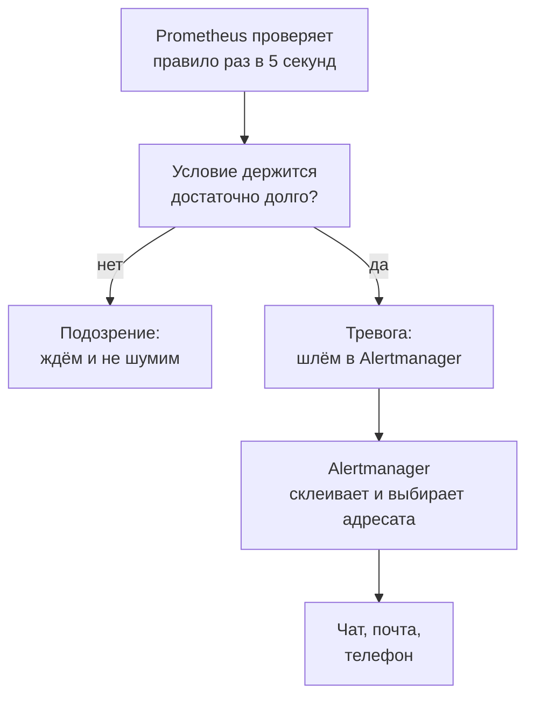
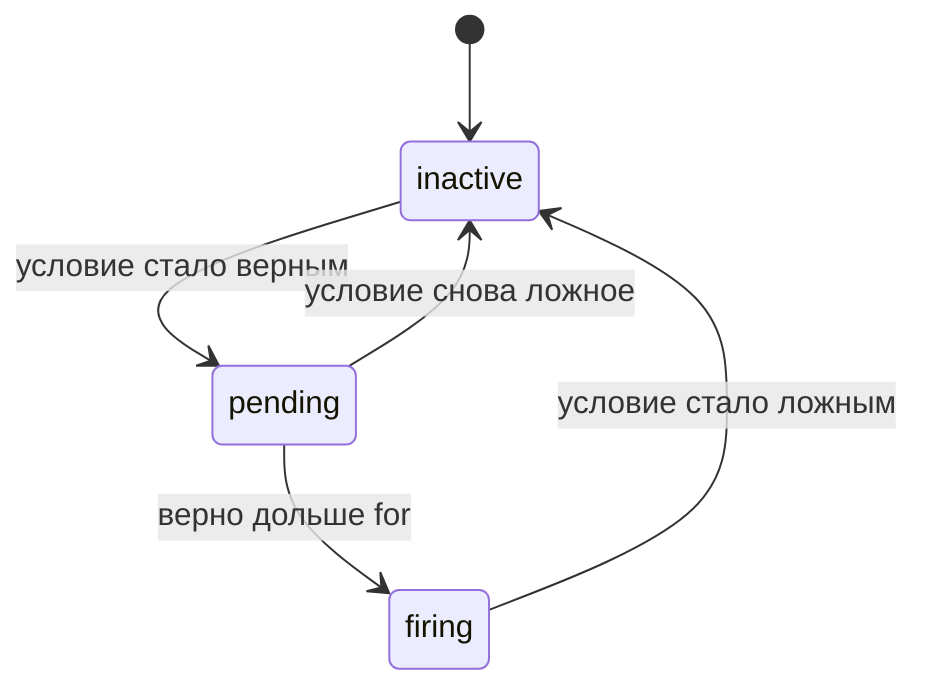
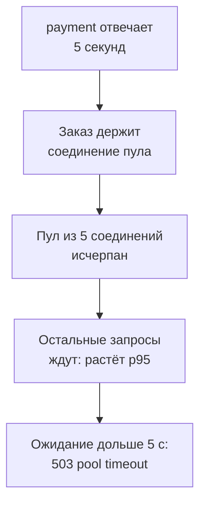

## Зачем это нужно

Я опытный коллега, который сидит с тобой рядом, и начну с истории. Давно я написал алерт на нехватку места на диске. Пять месяцев он тихо стоял в настройках, потом диск заполнился, сервис встал, а телефон молчал: в имени метрики была опечатка, и правило не могло сработать никогда. С тех пор я не верю тревоге, которую не видел горящей.

Вернёмся к магазину. В прошлом году он упал на распродаже, и никто не знал почему. Приборы мы уже ставим: дашборды из [урока 7.3](03-grafana.md) есть. Но дашборд работает, пока ты на него смотришь, а ночью не смотрит никто. Нужен механизм, который сам следит за метриками и **зовёт человека**: **алерт** (alert, «тревога»): правило над метриками, которое само включается, когда с системой что-то не так.

Хороший алерт будит тебя раньше, чем пожалуется покупатель. Плохой будит зря, и через неделю ты перестаёшь реагировать. Нагрузочнику алерт полезен дважды: загоревшись на 340-й секунде теста, он даёт готовый факт для отчёта, а сам алерт можно проверить на поломке.

Шаг проекта: ты разберёшь правила алертов стенда, проведёшь свой **первый инцидент** (событие, когда сервис работает хуже нормы, а покупатели это чувствуют): оплата отвечает по 5 секунд. Ты найдёшь причину по метрикам и логам и запишешь в `~/perf-lab/07-monitoring/incident-01.md` хронологию (события с точным временем) и причину, а в `runbook-payment.md` инструкцию на следующий раз.

## Что нужно знать

- Prometheus, метрики и `up`: [урок 7.1](01-metrics-prometheus.md); `rate`, `histogram_quantile`, `for`-подобные окна: [урок 7.2](02-promql.md).
- Дашборды RED и USE, график как инструмент диагностики: [урок 7.3](03-grafana.md).
- Ресурсы и метод USE, пул соединений как ресурс: [урок 7.4](04-exporters.md). Логи и поиск причин в Loki: [урок 7.5](05-logs-loki.md).
- Пул соединений и оплата внутри заказа: README стенда, раздел «Заложенные узкие места» (подробно они разбираются в теме 11).
- Скрипт `~/perf-lab/07-monitoring/orders_load.py` из урока 7.4.

## Картина целиком

Охранная сигнализация в квартире. Датчики постоянно проверяют условия: открыта ли дверь, есть ли движение. Датчик не звонит тебе сам, он шлёт сигнал на пульт. Пульт решает, звонить ли, кому, как часто, и не включён ли у тебя режим «я дома». В нашем магазине датчики это Prometheus с правилами, а пульт это Alertmanager: отдельная программа, которая рассылает тревоги. У алерта, в отличие от датчика, есть промежуточное состояние «подозрение».



На схеме видно, что решений два, и принимают их разные программы. «Плохо ли сейчас» решает Prometheus, «кому и как сообщить» решает Alertmanager. Адресата (чат, почту) в учебном стенде нет, результат виден в интерфейсе Alertmanager.

## Теория

### Правило алерта: как объяснить машине, что такое «плохо»

Менеджер скажет «если сайт ломается, дай знать». Машине нужно условие, которое проверяется цифрой. Им служит запрос PromQL, а запрос вместе с настройками оформляют как **правило** (alerting rule): если он вернул хотя бы один ряд, условие выполнено.

Правила лежат в YAML-файле (текстовый файл настроек) `monitoring/prometheus/rules/alerts.yml`, сгруппированные по `groups`. Возьмём настоящее правило стенда:

```yaml
- alert: ShopHighErrorRate
  expr: sum(rate(http_requests_total{status=~"5.."}[1m])) / sum(rate(http_requests_total[1m])) > 0.05
  for: 2m
  labels: {severity: critical}
  annotations:
    summary: Много ошибок магазина
    description: Доля HTTP 5xx превышает 5 процентов две минуты.
```

`alert` это имя (оно же метка `alertname`), и оно называет симптом: «много ошибок магазина», а не «проверка 7». `expr` это условие: доля ответов 5xx среди всех за минуту, а `> 0.05` оставляет результат, только когда ошибок больше 5%. Окно `[1m]` годится: скрейп раз в 5 секунд даёт в нём 12 точек ([урок 7.2](02-promql.md)). `for` это выдержка, о ней следующий раздел. `labels` добавляют метки, например `severity: critical` («важность»), и по ним Alertmanager выбирает адресата. `annotations` это подписи для человека, в них кладут `runbook_url`, ссылку на инструкцию. Prometheus проверяет правила раз в 5 секунд (настройка `evaluation_interval`).

А что будет, если запросов нет совсем? Рядов нет вовсе (пустой результат) или счётчики стоят и выходит `0 / 0`, то есть `NaN` («не число»), а `NaN > 0.05` ложно. Алерт молчит, хотя упавший сайт тоже даёт ноль запросов. Как закрыть дыру, скажу ниже, в слепых пятнах хороших алертов.

Всего в стенде семь правил: пять основных и два страховочных. Начну с трёх. `ShopDown` (`up{job="shop"} == 0`, 1 минута, critical): Prometheus не может снять метрики с магазина. `ShopHighErrorRate` (выше 5% ошибок, 2 минуты, critical): покупатели получают сбои. `ShopDbPoolExhausted` (`shop_db_pool_waiting > 0`, 1 минута, warning): запросы стоят в очереди за соединением с базой. Ещё два основных: `ShopHighLatencyP95` (p95 больше 1 с, 5 минут) и `HostHighCpu` (процессор хоста выше 90%, 2 минуты). Страховочные: `ExporterDown` (пропал источник метрик, 1 минута) и `ShopNoTraffic` (трафик пропал, 10 минут). Четыре из пяти основных смотрят на симптомы для покупателя и лишь одно на ресурс, к этому принципу вернёмся. Ещё четыре правила на «сгорание бюджета ошибок» (запаса ошибок, который допускает цель по качеству, SLO) лежат в `slo.yml`, их разбирает [урок 8.4](../08-perf-theory/04-load-profile-slo.md).

> **Прикинь сам:** что вернёт выражение `shop_db_pool_waiting > 0`, когда никто не ждёт соединение (значение 0)? А когда ждут трое?
{: .predict}

Когда значение 0, сравнение `0 > 0` ложно, и Prometheus **не возвращает ряд вообще**: алерт неактивен. Когда ждут трое, приходит ряд со значением 3, и алерт идёт дальше. Все сравнения в алертах работают так: оставляют только «плохие» ряды.

> **Главное:** правило алерта это запрос PromQL с порогом, выдержкой, метками и подписями; пустой результат значит «всё хорошо», а ряд значит «плохо».
{: .key}

Но если порог пробит на секунду, звать человека рано. Как отличить всплеск от поломки?

### Состояния алерта и выдержка `for`

Тост дымнул секунду: пожарных звать не нужно. Дым держится полминуты: это уже пожар. Эти полминуты и есть выдержка (`for`). Метрики шумные: один неудачный скрейп нарушит условие на секунду, и без выдержки тебя будили бы десятки раз в сутки.

Выдержка делит жизнь алерта на три состояния.



`inactive` («неактивен»): условие ложно. `pending` («ожидание»): условие верно, но выдержка не прошла, наружу ничего не уходит. Если условие снова ложно, алерт возвращается в `inactive`, и отсчёт `for` **начинается заново**. `firing` («сработал»): условие продержалось дольше `for`, и Prometheus шлёт алерт в Alertmanager, пока условие верно.

Порог 5%, `for: 2m`. В 12:01:40 доля ошибок прыгает до 22% при выкладке новой версии (деплое), алерт `pending`. В 12:02:20 она падает до 1,1%: всплеск прошёл за 40 секунд, алерт в `inactive`, отсчёт сброшен, никто не проснулся. В 12:04:10 доля 31%, это настоящая поломка, снова `pending`. В 12:06:10 условие держится две минуты, алерт `firing`. Тебя разбудили спустя `for` после начала поломки: это цена защиты от лишних тревог.

Теперь поиграй сам: подвигай порог и выдержку и посмотри, когда алерт сработает и какие провалы он переживёт.

<div class="viz" data-viz="obs-alert-life" data-threshold="5" data-for="120"></div>

Линия это доля ошибок, пунктир порог, полоса внизу цвет состояния. Короткий всплеск слева алерт не поднимает, вторая поломка поднимает. Нажми «провал»: короткое падение вниз перезапускает отсчёт.

> **Прикинь сам:** у алерта p95 > 1 с стоит `for: 5m`. График показывает: p95 выше секунды четыре минуты, ниже порога десять секунд, снова выше секунды шесть минут. Когда алерт станет `firing`?
{: .predict}

Через 5 минут после того, как p95 снова превысил порог: десятисекундная пауза обнулила отсчёт, и четыре минуты первого участка не засчитываются.

Осторожно: у «мигающей» метрики одна секунда нормы посреди `for` обнуляет отсчёт, и алерт может никогда не стать `firing`, хотя сервис почти сломан.

> **Главное:** `for` фильтрует всплески и стоит тебе задержки обнаружения, равной `for`; стоит условию хоть раз стать ложным, отсчёт начинается заново.
{: .key}

Алерт стал `firing`, но до тебя ещё не дошёл: сначала его получит пульт.

### Alertmanager: группы, маршруты и тишина

Сломалась база, и разом сработали десять алертов. Десять сообщений подряд утопят суть. Alertmanager принимает алерты от Prometheus и решает, как их доставить: склеить, отправить нужной команде, не повторять слишком часто или заглушить.

В стенде он настроен так (`monitoring/alertmanager/alertmanager.yml`):

```yaml
route:
  receiver: classroom
  group_by: [alertname]
  group_wait: 10s
  group_interval: 1m
  repeat_interval: 1h
receivers:
  - name: classroom
```

`route` («маршрут») это дерево правил «куда отправлять», у нас только корень: всё идёт получателю (`receiver`) `classroom`. Интеграций у него нет, поэтому алерты видны только в интерфейсе `http://localhost:9093`.

Четыре параметра задают ритм сообщений. `group_by: [alertname]` склеивает алерты с одним `alertname` в одно сообщение: десять экземпляров `ShopHighErrorRate` придут списком. `group_wait: 10s` держит первое сообщение 10 секунд: вдруг подтянутся соседи. `group_interval: 1m` ограничивает обновления уже отправленной группы: новый алерт или закрытие уйдут не раньше чем через минуту после прошлой отправки. `repeat_interval: 1h` не даёт напоминать о той же проблеме чаще раза в час, иначе сообщения сыпались бы каждые 5 секунд.

На работе маршрутов больше, и выбирают их по меткам. Поэтому `severity` в правилах не украшение:

```yaml
route:
  receiver: team-chat
  group_by: [alertname]
  routes:
    - matchers: ['severity="critical"']
      receiver: on-call-phone
    - matchers: ['alertname=~"Host.*"']
      receiver: infra-chat
```

Критические алерты идут на телефон дежурного (человека, который в свою смену отвечает на тревоги), алерты хоста в чат инфраструктуры, остальные в общий чат.

Теперь тишина (silence). Ты знаешь, что сервис будет ломаться: плановые работы или твой нагрузочный тест. В интерфейсе Alertmanager (кнопка Silence) создаёшь правило «не слать уведомления с такими метками в такой период». Алерты **продолжают срабатывать** и видны, не уходят только уведомления. Срок и комментарий «почему» обязательны: тишина без них бомба, через месяц никто не вспомнит, почему алерт молчит. Есть и подавление (inhibition): «если сработал A, не слать B». Упал целый хост, и отдельные алерты на каждый его сервис только шумят. В стенде подавления нет.

> **Прикинь сам:** 20 алертов `ShopHighLatencyP95` по разным маршрутам загорелись одновременно. Сколько сообщений придёт при `group_by: [alertname]` и сколько при `group_by: [alertname, route]`?
{: .predict}

С одним ключом все 20 алертов лежат в одной группе: одно сообщение со списком. С двумя каждая пара «имя, маршрут» становится отдельной группой: 20 сообщений. Чем меньше меток в `group_by`, тем меньше сообщений, но тем меньше деталей в заголовке.

Осторожно: `for` и `group_wait` путают. Первый задерживает превращение в `firing` (решает Prometheus), второй задерживает отправку уже сработавшего алерта (решает Alertmanager). Итого от начала поломки до сообщения: `for` плюс `group_wait` плюс до 5 секунд на проверку, для `ShopHighErrorRate` около 2:15.

> **Главное:** Prometheus решает, что плохо, Alertmanager решает, кому и как сказать; тишина глушит только уведомления, а не сами алерты.
{: .key}

Как алерт доходит до человека, ясно. А какой алерт вообще стоит писать?

### Хорошие и плохие алерты

Самая частая беда мониторинга: алертов слишком много, они шумят, и дежурные перестают на них реагировать (так называемая усталость от алертов). Правило одно: **каждый алерт требует действия человека**. Если можно ничего не делать, это панель на дашборде, а не алерт.

Первый принцип: **симптом, а не причина**. «Доля ошибок больше 5%» говорит, что покупателям плохо. «Процессор выше 70%» говорит лишь, что сервис хорошо загружен. Причины ищут потом по дашборду и логам. Второй: **срочность равна важности**. `critical` будит ночью, `warning` подождёт до утра, а если всё `critical`, через неделю никто ничего не читает. Третий: порог взят из наблюдений за здоровой системой, есть `for` и ссылка на runbook, а сам алерт проверен на настоящей поломке.

Теперь два слепых пятна. Первое мы заметили в [уроке 7.4](04-exporters.md): упадёт `cadvisor` или `node-exporter`, и ты ослепнешь молча. Для этого в стенде есть правило `ExporterDown` (группа `shop-meta`):


```yaml
- alert: ExporterDown
  expr: up{job=~"payment|node|cadvisor|postgres|alertmanager|alloy"} == 0
  for: 1m
  labels: {severity: warning}
  annotations:
    summary: "Цель {{ $labels.job }} недоступна"
    description: "Prometheus не может скрейпить {{ $labels.instance }} больше минуты: метрики этого источника не обновляются."
    runbook_url: https://distinguished-sre.github.io/load-tester/07-observability/04-exporters.html
```


Двойные скобки в `annotations` подставляют значения: `{{ $labels.job }}` это значение метки `job` у сработавшего ряда (шаблон языка Go, в YAML он пишется как есть). Магазина в списке нет, его сторожит `ShopDown`. Самого Prometheus тоже: упавший, он алерт не пришлёт. Правило проверишь в практике (шаг 7).

Второе пятно: **пропал трафик**. Если отвалился балансировщик (он раздаёт запросы по серверам), покупатели не заходят, запросов 0, ошибок 0, и `ShopHighErrorRate` молчит. Нужен алерт на саму тишину: `ShopNoTraffic`. В стенде он мягкий: трафик был за последние 30 минут, а за 5 минут запросов нет, выдержка 10 минут, важность `info`. Он молчит на стенде, куда никто не ходил, и загорается через 15 минут после конца твоего теста: это ожидаемо.

<details markdown="1">
<summary>Для любопытных: боевой вариант ShopNoTraffic и пропавшая метрика</summary>

На боевом сервисе ставят вариант строже:

```yaml
- alert: ShopNoTraffic
  expr: sum(rate(http_requests_total[5m])) == 0 or absent(http_requests_total)
  for: 5m
  labels: {severity: critical}
```

`== 0` ловит случай, когда счётчики не растут. `absent(...)` вернёт ряд со значением 1, когда метрики нет совсем. У `up == 0` свой изъян: если цель убрали из конфигурации, серия `up` исчезает, и условие молчит. Для критичных целей добавляют `absent(up{job="cadvisor"})`.

</details>

> **Главное:** хороший алерт говорит о симптоме, требует действия и проверен на настоящей поломке; алерту на пропажу самих метрик и трафика место в наборе обязательно.
{: .key}

Алерт разбудил дежурного. Что ему делать в три часа ночи, когда соображать не хочется?

### Runbook: инструкция на случай тревоги

В три часа ночи ты хочешь не думать, а выполнять шаги. **Runbook** («книга запуска», инструкция оператора) это короткий документ на один алерт. 

Хороший runbook умещается на экран и отвечает на шесть вопросов. Что значит алерт, одной фразой. Как оценить масштаб: готовый запрос. Что проверить, по схеме «если A, то B». Как чинить: команды целиком, а не «перезапусти сервис». Как убедиться, что починил. Кому передать дальше, если не помогло. Ссылку кладут в `runbook_url`, и она приходит прямо в уведомлении.

> **Главное:** runbook делает реакцию одинаковой у любого дежурного: он выполняет шаги, а не придумывает их.
{: .key}

Теперь соберём всё вместе и сломаем магазин сами.

### Первый инцидент: оплата стала медленной

Оплата (сервис `payment`) начинает отвечать по 5 секунд вместо 50 миллисекунд. В жизни так бывает часто: сторонний сервис ухудшился, а твой стал жертвой. В «Магазине» это заложено намеренно (README, раздел узких мест). Оплата идёт **внутри транзакции**: заказ держит соединение с базой, пока ждёт оплату. Соединений в пуле всего 5 (`DB_POOL_MAX`).

> **Прикинь сам:** каждый заказ занимает соединение на 5 секунд, соединений 5. Сколько заказов в секунду выдержит магазин?
{: .predict}

За 5 секунд освобождаются все 5 соединений, то есть одно в секунду: около одного заказа в секунду (разброс задержки ±20%, цифра приблизительная). Остальные запросы, даже **каталог**, которому оплата не нужна, ждут соединения. Не дождались за `DB_POOL_TIMEOUT = 5` секунд: получили 503 «database pool timeout». Цепочка такая:



Причина одна, а последствия видны далеко от неё: даже каталог не получает соединения.

Оплату можно перенастроить на лету через административный адрес `payment` (порт 8001 опубликован на твою машину):

```bash
curl -s -X POST localhost:8001/admin/config -H 'Content-Type: application/json' -d '{"delay_ms": 5000}'
```

`POST /admin/config` меняет задержку без перезапуска, тело `{"delay_ms": 5000}` задаёт её в миллисекундах (доля отказов `fail_rate` остаётся прежней). Ответ: `{"delay_ms":5000.0,"fail_rate":0.0}`. Вернуть обратно: `{"delay_ms": 50}`.

Что ты увидишь при нагрузке 8 «покупателей» из `orders_load.py` (время считай от включения медленной оплаты, секунды у тебя будут другие). Через 10-20 секунд `shop_db_pool_waiting` станет больше нуля, p95 пойдёт вверх, `ShopDbPoolExhausted` будет в `pending`. Через 20-40 секунд появятся первые 503 (`http_requests_total{status="503"}`) и строки `ERROR` в логах. К 1:10 `ShopDbPoolExhausted` станет `firing`, к 2:30 загорится `ShopHighErrorRate` (если доля 5xx выше 5%), к 5:30 `ShopHighLatencyP95` (если p95 держится выше секунды все 5 минут). Первым срабатывает алерт о **механизме** (очередь в пуле), потом о покупателях, позже, из-за долгого `for`, о задержке.

Теперь работаем детективами: идём от следствия к причине, как в уроках 7.4 и 7.5.

Сначала подтверди симптом (RED): `sum by (route, status) (rate(http_requests_total{status=~"5.."}[1m]))`. 503 есть на разных маршрутах, включая каталог, значит, виновата не логика заказа, а что-то общее. Дальше по USE осмотри ресурсы: процессор и память в норме, а **пул** насыщен: `shop_db_pool_available = 0`, `shop_db_pool_waiting` растёт. Третий шаг: кто держит соединения? `pg_stat_database_numbackends` стоит на потолке: 5 соединений пула и 1 экспортёра (он сам ходит в базу за метриками). Так при одном воркере: `WEB_CONCURRENCY` по умолчанию, пул создаётся на каждый воркер. Соединения держат заказы, ждущие оплату, и это подтверждает запрос `histogram_quantile(0.95, sum by (le) (rate(shop_payment_duration_seconds_bucket[1m])))`: выше 5 секунд вместо 0,06 (гистограмма считает корзинами, верхняя от 5 до 10 секунд, цифра грубая). Вот **причина**.

Четвёртый шаг: логи. Запрос `{service="shop", level="ERROR"} | json | line_format ...` покажет строки `status: 503, error: "database pool timeout"` с `duration_ms` около 5000, то есть равным `DB_POOL_TIMEOUT`. Значит, запрос ждал пула, а не работал. Пятый: запиши хронологию (начало, срабатывание алертов, починка). Шестой: почини. Верни оплату, и через 30-60 секунд `shop_db_pool_waiting` упадёт до нуля, 503 прекратятся, алерты вернутся в `inactive`. Настоящее исправление (оплата вне транзакции, таймауты) это тема 11.

Осторожно, тут два заблуждения. Первый алерт не причина: он покажет следствие, а на оплату алерта нет, и это нормально. И не чини симптом: `DB_POOL_MAX` до 50 помог бы лишь на время, оплата простаивала бы на 50 соединениях, а база держала бы 50 висящих транзакций.

> **Проверь понимание:** `shop_db_pool_waiting = 3`, CPU хоста 8%, CPU `shop` 12%, метрики оплаты в норме (60 мс). Что ты проверишь следующим?

<details markdown="1">
<summary>Ответ</summary>

Раз оплата быстрая, соединение держит что-то другое: долгие SQL-запросы (`pg_stat_statements`, `pg_stat_activity`), блокировки (`pg_locks_count`) или «утёкшие» соединения (`shop_db_pool_size - shop_db_pool_available` без трафика). Всегда проверяй, **что** держит ресурс.

</details>

> **Главное:** алерты находят симптом, а причину ты ищешь по цепочке «симптом, насыщенный ресурс, кто его держит, логи»; чинить нужно причину, а не симптом.
{: .key}

К распродаже у нас есть тревога, которая приходит вовремя, инструкция для ночного дежурного и путь от алерта до причины. Пройдём его руками.

## Практика

Для всех шагов стенд поднят с профилем мониторинга: `docker compose --profile monitoring up -d --wait`. Нагружаем только свой стенд.

### 1. Посмотри правила и их состояние

В браузере `http://localhost:9090/alerts` (раздел Alerts в Prometheus). Должны быть видны одиннадцать алертов со статусом `inactive` (пять основных, `ExporterDown`, `ShopNoTraffic` и четыре на сгорание бюджета). Через консоль:

```bash
curl -s localhost:9090/api/v1/rules | jq -r '.data.groups[].rules[] | select(.type == "alerting") | [.name, .state, .duration] | @tsv'
```

Разбор: `/api/v1/rules` отдаёт JSON со всеми правилами; `jq -r` печатает без кавычек; выражение `.data.groups[].rules[]` проходит по всем правилам всех групп; `select(.type == "alerting")` оставляет только алерты (в этом же списке лежат recording rules из `slo.yml`, у них нет состояния); `[.name, .state, .duration] | @tsv` собирает три поля в строку с табуляциями.

```text
ShopDown	inactive	60
ShopHighErrorRate	inactive	120
ShopHighLatencyP95	inactive	300
ShopDbPoolExhausted	inactive	60
HostHighCpu	inactive	120
ExporterDown	inactive	60
ShopNoTraffic	inactive	600
ShopErrorBudgetBurnFast	inactive	120
ShopErrorBudgetBurnSlow	inactive	900
ShopLatencyBudgetBurnFast	inactive	120
ShopLatencyBudgetBurnSlow	inactive	900
```

**Как читать вывод:** колонки имя, состояние, выдержка `for` в секундах (60, 120, 300, 600, 900 это `1m`, `2m`, `5m`, `10m`, `15m`). Все `inactive`: стенд здоров. Если у тебя `pending` или `firing`, стенд кто-то нагружает или он болен, найди причину до продолжения.

Также открой `http://localhost:9093`: интерфейс Alertmanager. Он пока пуст (раздел Alerts без записей), и это нормально.

**Типичные ошибки:** `curl: (7) Failed to connect`: Prometheus не запущен; `jq: error: Cannot iterate over null`: адрес API набран неверно.

### 2. Проверь «здоровое» состояние

Запусти умеренную нагрузку на две минуты и убедись, что алерты молчат:

```bash
source ~/perf-lab/.venv/bin/activate
python ~/perf-lab/07-monitoring/orders_load.py orders 3 120 &
sleep 100
curl -s localhost:9090/api/v1/rules | jq -r '.data.groups[].rules[] | select(.type == "alerting") | [.name, .state] | @tsv'
wait
```

Все одиннадцать должны остаться `inactive`: это **базовая линия**. Если срабатывает что-то при умеренной нагрузке, алерт слишком чувствителен (или у тебя слишком слабый хост).

### 3. Подготовь журнал и запусти инцидент

Создай заготовку и запомни время начала (в UTC, как в логах):

```bash
mkdir -p ~/perf-lab/07-monitoring
date -u +%H:%M:%S
python ~/perf-lab/07-monitoring/orders_load.py orders 8 420 0.5 &
sleep 15
curl -s -X POST localhost:8001/admin/config -H 'Content-Type: application/json' -d '{"delay_ms": 5000}'
date -u +%H:%M:%S
```

Разбор: первая команда `date -u` печатает текущее время в UTC (запиши его как время начала нагрузки); скрипт запускается на 7 минут с 8 пользователями и паузой 0,5 с; через 15 секунд оплата замедляется до 5 секунд; вторая `date -u` фиксирует **момент поломки**. Запиши оба времени.

Следи за страницей `http://localhost:9090/alerts` (обновляй) и раз в 30 секунд выполняй запросы:

```promql
shop_db_pool_waiting
```

```promql
sum by (status) (rate(http_requests_total[1m]))
```

```promql
histogram_quantile(0.95, sum by (le) (rate(http_request_duration_seconds_bucket[1m])))
```

```text
{}               3
{status="200"}   1.4
{status="503"}   1.3
{}               9.5
```

**Как читать вывод:** очередь в пуле три (пять соединений заняты, трое ждут), 503 около одной в секунду (каждый запрос перед ошибкой ждёт 5 секунд таймаута), p95 выше 5 секунд (корзина гистограммы от 5 до 10, поэтому цифра грубая, точное время смотри в логах). Числа примерные.

В момент, когда на странице `/alerts` загорится первый алерт, запиши время. Также в `http://localhost:9093` (Alertmanager) появится группа алертов, примерно через 10 секунд после `firing` (это `group_wait`). Раскрой её: видны метки (`alertname`, `severity`) и подписи (`summary`, `description`).

> Сначала проверь причину инцидента сам: метрики, логи, алгоритм из урока. Только потом опиши нейросети симптомы и сравни её гипотезы со своей. Каждую проверь запросом в Prometheus или Loki, а не принимай на веру.
{: .ai}

### 4. Найди причину по метрикам и логам

Пока инцидент идёт, пройди расследование по шагам из теории:

```promql
sum by (route, status) (rate(http_requests_total{status=~"5.."}[1m]))
```

```promql
shop_db_pool_available
```

```promql
histogram_quantile(0.95, sum by (le) (rate(shop_payment_duration_seconds_bucket[1m])))
```

```promql
pg_stat_database_numbackends{datname="shop"}
```

```text
{route="/api/products", status="503"}   0.5
{route="/api/orders", status="503"}     0.8
{}                                     0
{}                                     9.5
{datname="shop"}                       6
```

**Как читать вывод:** 503 идут и на каталоге (`/api/products`), и на заказах: проблема общая. `shop_db_pool_available = 0`: свободных соединений нет. P95 оплаты около 9,5 секунды (корзина от 5 до 10, цифра грубая): вот **причина** (в норме около 0,06 с). `numbackends = 6`: пять соединений пула и одно экспортёра, потолок (при `WEB_CONCURRENCY=2` будет 11).

Логи подтверждают то же самое, откройте Explore, источник Loki:


```logql
{service="shop", level="ERROR"} | json | line_format `{{.route}} {{.status}} {{.error}} {{.duration_ms}}мс`
```


```text
/api/products 503 database pool timeout 5004.3мс
/api/orders 503 database pool timeout 5003.7мс
```

Время ответа около 5000 мс равно `DB_POOL_TIMEOUT`: запрос не работал, а ждал соединения. Агрегат по причинам: `sum by (error) (count_over_time({service="shop", level="ERROR"} | json [1m]))`.

### 5. Почини и зафиксируй время

```bash
curl -s -X POST localhost:8001/admin/config -H 'Content-Type: application/json' -d '{"delay_ms": 50}'
date -u +%H:%M:%S
wait
```

Запиши время починки. Подожди 1-2 минуты и проверь: `shop_db_pool_waiting` вернулся к 0, 503 нет, на `/alerts` алерты снова `inactive` (на `firing` алерт сам вернётся в `inactive` после первого вычисления, где условие ложно), а в Alertmanager они пропали или помечены как закрытые.

### 6. Запиши инцидент и runbook

Файл `~/perf-lab/07-monitoring/incident-01.md`:

```markdown
# Инцидент 01: оплата отвечает 5 секунд

**Дата:** ____  **Продолжительность:** ____ (от ____ до ____ UTC)
**Влияние:** какие маршруты, какие статусы, доля ошибок на пике ____ %

## Хронология (UTC)

| Время | Событие |
|---|---|
| ____ | нагрузка запущена (8 пользователей) |
| ____ | оплата замедлена до 5 с (`/admin/config`) |
| ____ | `ShopDbPoolExhausted` pending |
| ____ | `ShopDbPoolExhausted` firing |
| ____ | `ShopHighErrorRate` firing |
| ____ | оплата возвращена к 50 мс |
| ____ | алерты в inactive |

## Причина (двумя фразами и двумя метриками)

## Что видно в логах (запрос + строка)

## Что сработало хорошо, что плохо (алерты: вовремя? лишние? не хватило?)

## Что исправить (алерт, runbook, настройка)
```

Файл `~/perf-lab/07-monitoring/runbook-payment.md`:

```markdown
# Runbook: ShopDbPoolExhausted / ShopHighErrorRate при медленной оплате

**Что значит:** пул соединений «Магазина» исчерпан, пользователи получают 503 или ждут.
**Масштаб:** `sum by (route, status) (rate(http_requests_total{status=~"5.."}[1m]))`
**Диагностика:**
1. `shop_db_pool_waiting` > 0 и `shop_db_pool_available` = 0? Если нет, это не пул.
2. p95 оплаты: `histogram_quantile(0.95, sum by (le) (rate(shop_payment_duration_seconds_bucket[1m])))`. Выросло? Значит, виновата оплата.
3. Если оплата в норме: `pg_stat_statements`, блокировки, утечка соединений.
**Починка:** ____
**Проверка:** ____
**Эскалация:** ____
```

Заполни все `____`.

### 7. Проверь алерт на экспортёры

Правило `ExporterDown` из теории уже есть в стенде: оно в группе `shop-meta` файла `monitoring/prometheus/rules/alerts.yml`. Проверь, что оно живое. Сначала синтаксис правил (утилита `promtool` лежит в образе Prometheus, отдельно её ставить не надо):

```bash
cd ~/load-tester/project/shop
docker run --rm -v "$PWD/monitoring/prometheus/rules:/r:ro" --entrypoint promtool prom/prometheus:v3.15.0 check rules /r/alerts.yml /r/slo.yml
```

Разбор: `promtool check rules` проверяет файлы правил; `--rm` удаляет временный контейнер; `-v ...:/r:ro` подключает папку с правилами только для чтения; два файла в конце: алерты и правила SLO (о них урок [8.4](../08-perf-theory/04-load-profile-slo.md)).

```text
Checking /r/alerts.yml
  SUCCESS: 7 rules found

Checking /r/slo.yml
  SUCCESS: 12 rules found
```

Теперь останови `cadvisor`, подожди 1,5 минуты и выполни запрос из шага 1 (`/api/v1/rules`) или открой `/alerts`: `ExporterDown` должен быть `firing` для `job="cadvisor"`. Запусти его снова (`docker compose --profile monitoring start cadvisor`), через минуту алерт погаснет.

```bash
docker compose --profile monitoring stop cadvisor
sleep 90
curl -s localhost:9090/api/v1/alerts | jq -r '.data.alerts[] | [.labels.alertname, .labels.job, .state] | @tsv'
docker compose --profile monitoring start cadvisor
```

```text
ExporterDown	cadvisor	firing
```

**Как читать вывод:** колонки имя алерта, цель, состояние. Если вместо `firing` стоит `pending`, не прошла минута `for`: подожди ещё немного. Пустой вывод значит, что алерт не сработал: проверь, что `cadvisor` действительно остановлен (`docker compose --profile monitoring ps`).

Открой в Alertmanager (`http://localhost:9093`) этот же алерт и посмотри, что в нём лежит в аннотации `runbook_url`: это ссылка на урок курса, а в боевой системе здесь стоит страница вашей вики.

**Типичные ошибки:**

- `SUCCESS` не появился, вместо него `yaml: line 61: did not find expected key`: сломаны отступы (в своей правке правил; соседние правила начинаются с `- alert:` на 6 пробелов).
- `ExporterDown` не появился в `/alerts`: Prometheus не перечитал правила. Для своих правок используй `docker compose --profile monitoring kill -s HUP prometheus` (сигнал «перечитай конфиг»: адреса `/-/reload` без флага `--web.enable-lifecycle` у стенда нет).
- `command not found: promtool`: запускай через `docker run ... --entrypoint promtool`, как показано.

```bash
cd ~/perf-lab && git add 07-monitoring && git commit -m "7.6: инцидент 01, runbook" && git push
```

## Сломай и почини

**Поломка: молчащий алерт.** Ты написал алерт, но он не сработал, хотя сервис сломан. Такое бывает постоянно. Смоделируем: поменяем в **своей копии** правила имя метрики на неверное (`shop_db_pool_waitng`, опечатка) и убедимся, что инцидент пройдёт мимо.

```bash
cd ~/load-tester/project/shop
cp monitoring/prometheus/rules/alerts.yml ~/perf-lab/07-monitoring/alerts.yml.orig
sed -i.bak 's/shop_db_pool_waiting > 0/shop_db_pool_waitng > 0/' monitoring/prometheus/rules/alerts.yml
rm monitoring/prometheus/rules/alerts.yml.bak
docker compose --profile monitoring kill -s HUP prometheus
```

Повтори инцидент (шаг 3 практики, он занимает 3-4 минуты). `ShopHighErrorRate` сработает, а `ShopDbPoolExhausted` нет.

**Задача:** выясни, почему `ShopDbPoolExhausted` молчит, не читая файл правил (сначала): какой запрос в Prometheus докажет, что метрики с таким именем нет? И что в этом инциденте отличает «алерт молчит, потому что всё хорошо» от «алерт молчит, потому что сломан сам»?

<div class="viz" data-viz="flow" data-steps='[{"title":"Убедись, что условие верно","text":"Выполни выражение алерта как обычный запрос в Prometheus. Пусто, хотя пул явно забит?"},{"title":"Проверь имя метрики","text":"`count({__name__=~\"shop_db_pool.*\"}) by (__name__)`: есть ли метрика, на которую смотрит выражение?"},{"title":"Сравни с источником","text":"`curl -s localhost:8000/metrics | grep pool`: что реально отдаёт сервис?"},{"title":"Исправь и проверь","text":"Верни правильное имя, `kill -s HUP`, повтори выражение: теперь есть значения."},{"title":"Страхуйся","text":"Добавь проверку правил (`promtool check rules`) и тестовый прогон в процесс."}]'></div>

<details markdown="1">
<summary>Что должно получиться</summary>

Выражение `shop_db_pool_waitng > 0` не возвращает ничего никогда: метрики с таким именем нет, а пустой результат для алерта значит «всё хорошо». Это коварнее всего: ошибка в имени метрики не вызывает ни ошибки, ни предупреждения. Доказательство: `count({__name__=~"shop_db_pool.*"}) by (__name__)` покажет три настоящие метрики (`shop_db_pool_size`, `_available`, `_waiting`), а `shop_db_pool_waitng` в списке нет. Защита: проверять правило на настоящей поломке (как в этом уроке) и заводить привычку «каждый алерт хоть раз видел горящим». Починка: `git checkout -- monitoring/prometheus/rules/alerts.yml` и `kill -s HUP prometheus`.

</details>

## ИИ в помощь

Нейросеть помогает набросать правило алерта и оформить хронологию инцидента, но причины она предполагает, а не знает: данные видишь только ты. Общие правила: [ИИ-помощник](../ai.md).

**Задача:** составить правило алерта по описанию.

```text
Prometheus 3 и Alertmanager. Нужно правило: если доля ответов 5xx по метрике http_requests_total
(метки method, route, status) выше 5% в течение 2 минут, severity critical. Напиши правило
в формате YAML с annotations (summary, runbook_url). Объясни, что делает for, и что
будет с алертом, если трафика нет совсем.
```
{: .wrap}

**Проверь ответ:** проверь синтаксис командой `promtool check rules` (она есть в образе Prometheus) и сравни с `ShopHighErrorRate` из стенда. Типичные ошибки: деление без учёта пустого трафика (NaN), `for` в неверном месте, метка `status` без регулярного выражения `5..`, устаревший формат Alertmanager.

**Задача:** оформить черновик постмортема.

```text
Вот мои заметки по инциденту: <вставь хронологию в UTC и причину двумя фразами с метриками>.
Оформи в структуру: хронология, причина, что видно в логах, что сработало хорошо и плохо,
что исправить. Ничего не добавляй от себя: если данных не хватает, напиши «нужны данные».
```
{: .wrap}

**Проверь ответ:** каждое время и число сверь со своими заметками и Grafana. Типичная ошибка: нейросеть красиво достраивает причину и выдумывает цифры. Всё, чего нет в твоих заметках, вычеркни.

## Словарик урока

| Термин | Простыми словами |
|---|---|
| Алерт (alert) | Автоматическая тревога: правило над метриками, зовущее человека |
| Правило алерта | Запись в YAML: имя, условие `expr`, выдержка `for`, метки, подписи |
| `expr` | Запрос PromQL: если вернул хотя бы один ряд, условие выполнено |
| `for` | Выдержка: условие должно держаться столько времени, прежде чем алерт сработает |
| inactive | Алерт не активен: условие ложно |
| pending | Условие уже верно, но выдержка `for` ещё не прошла |
| firing | Алерт сработал: Prometheus отправляет его в Alertmanager |
| `evaluation_interval` | Как часто Prometheus проверяет правила (в стенде 5 секунд) |
| Alertmanager | Пульт тревог: группирует, маршрутизирует, заглушает, не даёт спамить |
| Маршрут (route) | Правило «какие алерты куда отправлять» по меткам |
| Получатель (receiver) | Куда уходит уведомление: чат, почта, телефон |
| `group_by` | Метки, по которым алерты склеиваются в одно сообщение |
| `group_wait` | Пауза после первого алерта группы перед первой отправкой |
| `group_interval` | Минимальный интервал между обновлениями уже отправленной группы |
| `repeat_interval` | Как часто напоминать об уже известной проблеме |
| Тишина (silence) | Временный запрет уведомлений по меткам, алерты продолжают срабатывать |
| Подавление (inhibition) | Правило «если сработал A, не слать B» |
| Усталость от алертов | Когда тревог слишком много, и дежурные перестают реагировать |
| Runbook | Короткая инструкция на один алерт: что значит, как проверить, как чинить |
| Инцидент | Событие, при котором сервис работает хуже нормы и пользователи это чувствуют |
| Хронология (timeline) | Список событий инцидента с точным временем |
| `promtool` | Утилита Prometheus: проверяет файлы правил и конфигурации |

## Вопросы с собеседований

Раздел для повторения: ответь вслух, потом открой ответ.

### 1. [junior] [часто] В чём разница между Prometheus и Alertmanager в алертинге?

<details markdown="1">
<summary>Ответ</summary>

Prometheus вычисляет правила и решает, что условие нарушено (алерт `firing`). Alertmanager получает такие алерты и решает, как доставить: группирует, маршрутизирует по меткам, не повторяет слишком часто, учитывает тишину и подавление, отправляет получателю.

**Что хотят услышать:** разделение ответственности: условие и доставка.

**Красный флаг:** «Prometheus сам рассылает письма».

</details>

### 2. [junior] [часто] Для чего нужен `for` в правиле алерта?

<details markdown="1">
<summary>Ответ</summary>

Условие должно держаться непрерывно указанное время, прежде чем алерт станет `firing`. Это отсекает короткие всплески и ложные срабатывания. Цена: задержка обнаружения, равная `for`. Если условие хоть раз стало ложным, отсчёт начинается заново.

**Что хотят услышать:** фильтр шума, цена в виде задержки, сброс отсчёта, состояние `pending`.

**Красный флаг:** считает, что `for` это «задержка отправки».

</details>

### 3. [junior] [часто] Какие три состояния у алерта?

<details markdown="1">
<summary>Ответ</summary>

`inactive` (условие ложно), `pending` (условие верно, ждём выдержку `for`), `firing` (выдержка прошла, алерт отправляется в Alertmanager).

**Что хотят услышать:** переходы между ними, возврат из `pending` в `inactive`.

**Красный флаг:** путает `pending` и `firing`.

</details>

### 4. [junior] Что такое runbook и зачем он?

<details markdown="1">
<summary>Ответ</summary>

Инструкция на один алерт: что значит, как оценить масштаб, шаги диагностики, как чинить, как убедиться, что починено, кому эскалировать. Ночью дежурный выполняет шаги, а не придумывает их. Ссылку кладут в `annotations` правила.

**Что хотят услышать:** краткость, конкретные команды, правка после каждого инцидента.

**Красный флаг:** «все всё знают в голове».

</details>

### 5. [middle] [часто] Какой алерт хороший, а какой плохой?

<details markdown="1">
<summary>Ответ</summary>

Хороший: описывает симптом, ощутимый пользователем (ошибки, медленно, недоступно), требует конкретного действия, имеет разумный порог и `for`, адекватную важность и ссылку на runbook, и проверен на настоящей поломке. Плохой: срабатывает на причины без вреда («CPU 70%»), мигает, не требует действий или всегда `critical`.

**Что хотят услышать:** симптом против причины, действие, усталость от алертов.

**Красный флаг:** «алертов должно быть как можно больше».

</details>

### 6. [middle] [часто] Что делают `group_wait`, `group_interval`, `repeat_interval`?

<details markdown="1">
<summary>Ответ</summary>

`group_wait` пауза перед первой отправкой новой группы (чтобы собрать соседей в одно сообщение). `group_interval` минимальная пауза между обновлениями группы, когда в ней что-то изменилось. `repeat_interval` как часто напоминать, если ничего не изменилось.

**Что хотят услышать:** примеры значений и компромисс «задержка против шума».

**Красный флаг:** путает `for` и `group_wait`.

</details>

### 7. [middle] Зачем нужна тишина (silence) и чем она опасна?

<details markdown="1">
<summary>Ответ</summary>

Тишина глушит уведомления по меткам на период, когда известно о проблеме или идут плановые работы (в том числе нагрузочный тест). Алерты при этом срабатывают и видны в интерфейсе. Опасна без срока и комментария: через месяц никто не знает, почему алерт молчит, и реальная проблема проходит незамеченной.

**Что хотят услышать:** срок, комментарий, автор, периодический просмотр списка тишин.

**Красный флаг:** отключает алерт, комментируя правило.

</details>

### 8. [middle] Как проверить, что новый алерт работает?

<details markdown="1">
<summary>Ответ</summary>

Проверить синтаксис (`promtool check rules`), выполнить `expr` как обычный запрос и убедиться, что на здоровой системе он пуст, а на сломанной возвращает ряд; воспроизвести настоящую поломку и дождаться `firing`; проверить, что уведомление дошло и подпись понятна. Сам алерт тоже можно сломать: опечатка в имени метрики даёт пустой результат без ошибок.

**Что хотят услышать:** проверка на настоящей поломке, а не «синтаксис проходит».

**Красный флаг:** считает достаточным, что файл загрузился.

</details>

### 9. [middle] Сервис ломается из-за внешней зависимости. Какие алерты нужны, а какие нет?

<details markdown="1">
<summary>Ответ</summary>

Нужны симптомные алерты на сервис (доля ошибок, латентность, недоступность) и алерт на сам внешний вызов (рост ошибок или длительности обращений к зависимости), чтобы быстро указать на причину. Не нужны отдельные алерты на каждое косвенное следствие (очередь, потоки, каждый маршрут): они усилят шум в момент проблемы.

**Что хотят услышать:** симптом и причина-зависимость; борьба с лавиной тревог.

**Красный флаг:** алерт на каждую метрику.

</details>

### 10. [middle] Как расследовать инцидент «ошибки растут» в нашем стенде?

<details markdown="1">
<summary>Ответ</summary>

RED: какие маршруты и статусы. USE: какой ресурс насыщен (CPU, память, пул, соединения БД). Найти, что держит ресурс: метрики оплаты, `pg_stat_*`. Подтвердить по логам (`level="ERROR"`, поле `error`, `duration_ms`). Записать хронологию. Починить причину и проверить по метрикам, что вернулось в норму.

**Что хотят услышать:** последовательность от симптома к причине, подтверждение логами, хронология.

**Красный флаг:** перезапускает сервис «на удачу».

</details>

### 11. [middle] Почему медленная оплата ломает каталог, которому оплата не нужна?

<details markdown="1">
<summary>Ответ</summary>

Оплата выполняется внутри транзакции: заказ держит соединение пула, пока ждёт ответа. Пул маленький (5 соединений), общий для всех запросов. Заказы занимают все соединения, остальные запросы ждут свободного и по таймауту получают 503. Общий ресурс связывает независимые части системы.

**Что хотят услышать:** общий пул, удержание ресурса на время сетевого вызова, и исправление (не держать соединение на время оплаты).

**Красный флаг:** «каталог сломался сам по себе».

</details>

### 12. [junior] [на скорость] Алерт на `up == 0` срабатывает при недоступном сервисе. Что ещё нужно, чтобы не ослепнуть?

<details markdown="1">
<summary>Ответ</summary>

Тот же `up == 0` для `job` экспортёров (node, cadvisor, postgres): иначе при их падении метрики пропадут молча (в стенде это `ExporterDown`). И алерт на пропавший трафик (`absent(...)`, в стенде `ShopNoTraffic`): при нулевых запросах доля ошибок даёт `NaN`, и алерт на неё молчит.

</details>

## Проверено на версиях

Ubuntu 24.04, Docker Compose v2, стенд «Магазин» из `project/shop`, Prometheus 3.15, Alertmanager 0.34.1, Grafana 13.2.3, Loki 3.7.8. Тайминги инцидента (когда сработает каждый алерт) зависят от мощности твоей машины и числа пользователей скрипта: порядок и механизм остаются теми же. Октябрь 2026.

## Итог урока: ты умеешь

- [ ] Прочитать правило алерта: `expr`, `for`, метки, подписи; назвать пять основных правил стенда, `ExporterDown` и `ShopNoTraffic` и что стоит за каждым.
- [ ] Объяснить состояния inactive, pending, firing и что делает `for` (включая сброс отсчёта).
- [ ] Объяснить, что делают `group_by`, `group_wait`, `group_interval`, `repeat_interval`, тишина, маршруты.
- [ ] Отличить хороший алерт от плохого и объяснить, почему симптом лучше причины.
- [ ] Написать правило алерта, проверить через `promtool` и перечитать конфигурацию Prometheus.
- [ ] Провести инцидент с медленной оплатой от алерта до причины по метрикам и логам и записать хронологию.
- [ ] Объяснить цепочку «медленная оплата, занятый пул, 503 даже на каталоге».
- [ ] Составить runbook и проверить, что алерт реально срабатывает, а не молчит из-за опечатки.

Дальше: [урок 7.7. Трейсы: путь одного запроса](07-traces.md): метрики и логи ты уже связал, теперь добавишь третий сигнал и научишься находить медленный участок одного запроса.

**Глубже:** Alertmanager, маршрутизация и тишины в [курсе DevOps](https://distinguished-sre.github.io/devops/08-observability/05-alertmanager.html).
