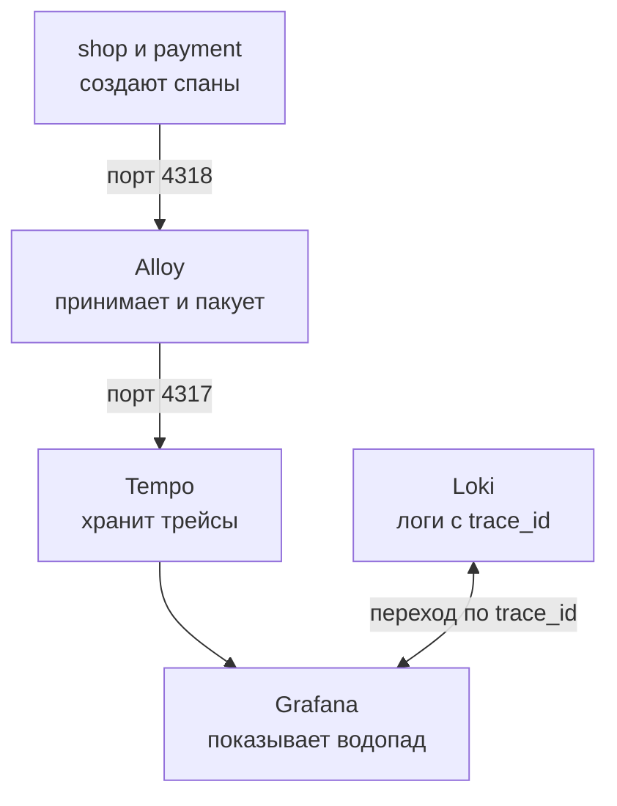
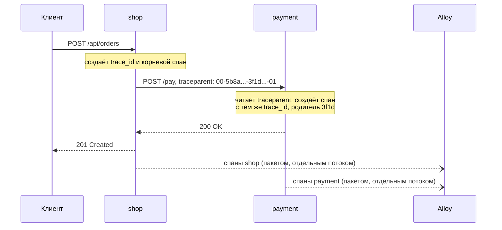

## Зачем это нужно

Я давно работаю с нагрузкой и покажу тебе приём, который выручает чаще других. Представь: прошлогодняя распродажа, магазин упал, и команда неделю собирала картину по кусочкам. Один человек смотрел логи оплаты, второй логи магазина, третий графики базы. Каждый честно говорил: «у меня всё быстро». А покупатель ждал пять секунд. Я сам однажды потратил вечер, сверяя часы разных серверов, и нашёл виновника случайно. Больше так не делаю.

В [уроке 7.6](06-alerts-incidents.md) ты разбирал медленную оплату: вывод «виновата оплата» ты сделал **сам**, сопоставив цифры с кодом. На работе сервисов больше, и все связи в голове не удержать. Нужен инструмент, который для **одного запроса** показывает, кто его принял, кого вызвал и где он потерял время. Он называется **распределённая трассировка** (distributed tracing). Метрика отвечает «сколько», лог отвечает «что случилось», а трейс (trace, запись пути одного запроса) отвечает «**где** потерялось время». Тестировщику он нужен, чтобы за минуту увидеть: 95% времени медленного запроса ушло в один `SELECT` или в один вызов соседа.

Шаг проекта: ты делаешь заказ на стенде (трейсы там включены сразу). Находишь его в Grafana Explore и прыгаешь из лога в трейс и обратно, затем воспроизводишь медленную оплату и N+1 (десятки одинаковых запросов в базу вместо одного) и находишь их глазами. Результат записываешь в `~/perf-lab/07-monitoring/traces.md`.

## Что нужно знать

- Логи, `request_id` и Loki: [урок 7.5](05-logs-loki.md). Здесь `request_id` получит старшего брата `trace_id`.
- Grafana и источники данных: [урок 7.3](03-grafana.md). Tempo подключён к Grafana автоматически, как Loki.
- Alloy как «курьер» телеметрии: [урок 7.5](05-logs-loki.md). Теперь он везёт ещё и трейсы.
- Инцидент с медленной оплатой и цепочкой «оплата, занятый пул, 503»: [урок 7.6](06-alerts-incidents.md), подробности в [уроке 11.5](../11-bottlenecks/05-cache-dependencies.md).
- Заголовки HTTP: [урок 2.1](../02-web/01-client-server-http.md). Заголовок это строка вида `Имя: значение`, которую клиент или сервер добавляет к запросу.
- Работающий стенд с профилем `monitoring` и фоновая нагрузка `orders_load.py` из [урока 7.4](04-exporters.md).

## Картина целиком

Посылка с трек-номером. Пока она едет через сортировочный центр, самолёт и курьера, на каждом этапе в систему пишется строка: «принята в 10:03, ушла в 10:41». Все строки связаны одним номером, поэтому видно весь маршрут и этап, где посылка простояла двое суток. Аналогия ломается в одном: у посылки этапы идут по очереди, а у запроса они вложены. Сервис принял запрос и, пока держит его, ходит в базу и к соседу.

Номер запроса называется `trace_id`, а запись об одном этапе (приняли запрос, выполнили `SELECT`, позвали оплату) называется **спаном**. На стенде путь записей такой:



Сервисы сами создают спаны и отправляют их Alloy (тому самому курьеру из урока 7.5). Alloy передаёт их Tempo, хранилищу трейсов, а Grafana рисует трейс. Лог в Loki и трейс в Tempo связаны одним `trace_id`, поэтому из одного можно перейти в другое.

## Теория

### Трейс и спан

Заказ шёл две секунды. `shop` говорит: «я ждал оплату две секунды». `payment` говорит: «я думал две секунды». Это одно событие или два? Без общего номера не понять: у каждого сервиса свои часы и свои записи.

Запись об одном куске работы называется **спаном** (span, «пролёт»). В ней лежат имя, время начала, длительность, номер трейса, родитель и атрибуты (пары «ключ: значение», например адрес запроса или текст SQL). Все спаны одного запроса вместе образуют **трейс** (trace): дерево, где корневой спан (его создаёт первый сервис на пути) содержит остальные. Это как оглавление книги: глава состоит из параграфов, а те из абзацев. Аналогия ломается тем, что спаны одного уровня могут идти одновременно, а страницы нет.

Вот что Tempo показывает для заказа на стенде. Корень `POST /api/orders` это весь запрос глазами пользователя. Внутри него shop делает команды Redis (`GET`, `HGETALL`, `DEL`: сессия, корзина, очистка корзины). Затем берёт соединение из пула (`db.pool.getconn`), выполняет SQL (`SELECT`, `INSERT`, `UPDATE`) и зовёт оплату спаном `POST`, свой на каждую попытку. На стороне payment этому вызову отвечает `POST /pay`. Спан `db.pool.getconn` наш собственный: в `db.py` взятие соединения обёрнуто в спан вручную. Иначе ожидание в пуле нигде не видно, а при нагрузке оно превращается в 503.

> **Прикинь сам:** корень длится 94 мс, SQL и Redis вместе 30 мс, оплата 58 мс. Сколько времени ушло на самого shop?
{: .predict}

Вычитаем детей: 94 - 30 - 58 = 6 мс. Это **собственное время** (self time) корня: Python-код между вызовами. Если у длинного спана почти нет детей, время потеряно в нём самом. Если у него длинный ребёнок, смотри на ребёнка.

Осторожно: самый длинный спан обычно корень, и он длинный просто потому, что содержит всех. Виноватого ищи по собственному времени.

> **Главное:** трейс это дерево спанов одного запроса, а виноват тот спан, у которого много собственного времени.
{: .key}

Как это выглядит на экране? Для этого трейсы рисуют особым способом.

### Водопад: как выглядит трейс

Дерево на экране рисуют **водопадом** (waterfall): строка на спан, горизонтальная ось это время от начала запроса, длина полосы это длительность, отступ показывает вложенность. Попробуй сам.

<div class="viz" data-viz="trace-waterfall" data-scenario="order"></div>

Начни со сценария «Заказ: всё хорошо»: корневая полоса охватывает остальные, SQL идёт друг за другом, оплата стоит одним блоком. Затем переключи на «Медленную оплату»: одна полоса заняла почти всю ширину. Остальные сценарии пригодятся в практике.

> **Проверь понимание:** корень 2046 мс, `POST /pay` 2004 мс. Чем заняты оставшиеся 42 мс? Можно ли сказать, что shop «тормозит»?
>
> <details markdown="1"><summary>Ответ</summary>
> SQL, Redis и сам код shop (около 30 мс SQL и Redis видны слева, остальное его собственный код). Нет: shop работает как обычно. Время теряется в `POST /pay`, а shop ждёт оплату, держа соединение с базой. В метриках пришлось бы сопоставлять несколько графиков, а водопад показывает это сразу.
> </details>

> **Главное:** в водопаде виновника видно глазами: ищи самую широкую полосу без длинных детей.
{: .key}

Откуда спаны разных сервисов знают, что они из одного запроса?

### Контекст и traceparent

shop и payment два разных процесса, общей памяти у них нет. Если shop просто вызовет payment, тот начнёт **новый** трейс, и связь потеряется. Значит, номер нужно передать вместе с запросом.

Пара «`trace_id` и `span_id` текущего спана», которую сервис кладёт в исходящий запрос, называется **контекстом** (context). Для HTTP он едет в заголовке `traceparent` (его формат описан в стандарте W3C Trace Context, это общий договор разных систем). Заголовок это строка вида `Имя: значение` (урок 2.1):

```text
traceparent: 00-5b8aa5a2d2c872e8321cf37308d69df2-3f1d9c0a7b6e4d28-01
             |  |                                |                |
             |  trace_id (32 символа 0-9 и a-f)                span_id          флаги (01: записывать)
             версия
```

Это как передать коллеге папку со словами «дело 5b8a, мы на этапе 3f1d, продолжай»: он ведёт свой этап и помечает «родитель: 3f1d». Аналогия ломается тем, что общей папки нет: каждый шлёт свои записи сам, а склеивает их Tempo по `trace_id`.



Спаны уходят в Alloy **после** ответа и отдельным потоком, поэтому трейс не задерживает запрос.

> **Прикинь сам:** самописный клиент вызывает payment и не кладёт `traceparent`. Что ты увидишь в Tempo?
{: .predict}

Два отдельных трейса вместо одного: payment не знает родителя и начинает свой. Поэтому первый вопрос при «трейс обрывается»: кто не передал заголовок. На стенде его кладут библиотеки: `httpx` на исходящих вызовах shop и `fastapi` на приёме в payment.

> **Главное:** `traceparent` несёт `trace_id` от сервиса к сервису, и без него цепочка рвётся на отдельные трейсы.
{: .key}

Кто создаёт все эти спаны, если мы не писали код под каждый?

### OpenTelemetry и OTLP

Раньше у каждого поставщика трассировки были свои библиотеки и формат. Сменить систему значило переписать код всех сервисов. Теперь есть единый открытый стандарт **OpenTelemetry** (OTel): библиотеки (SDK, набор готового кода, который подключают к программе) для создания спанов и формат передачи **OTLP** (OpenTelemetry Protocol). Код пишет в OTel, а куда это попадёт, решает настройка.

В shop и payment стоит этот SDK, а спаны отправляет его «экспортёр» (кусок кода, который шлёт данные наружу) по HTTP на адрес из `OTEL_EXPORTER_OTLP_ENDPOINT` (по умолчанию `http://alloy:4318`). Спаны `SELECT` и `HGETALL` создают готовые «обёртки» вокруг библиотек, их называют **инструментациями** (instrumentation): `fastapi`, `httpx`, `psycopg` и `redis`. Мы не писали для них ни строчки.

Включают и выключают трейсы через `.env`: `TRACING_ENABLED=1` по умолчанию, `0` отключает их полностью (список переменных в `project/shop/README.md`). Спаны уходят пакетами раз в секунду. Если Alloy недоступен, экспорт тихо падает по таймауту в отдельном потоке: заказы не замедляются и ошибок в лог не пишется.

> **Главное:** телеметрия не должна ломать то, что наблюдает: SDK работает в фоне, а недоступный Alloy сервису не страшен.
{: .key}

Куда именно уходят пакеты и зачем по дороге Alloy?

### Alloy и Tempo: путь спанов

Alloy получает спаны, пакует и передаёт дальше. В `monitoring/alloy/config.alloy` это три звена цепочки: приём на порту 4318, пакетирование и отправка на `tempo:4317`. Выход одного звена указан входом другого, как в логах.

**Tempo** это хранилище трейсов от Grafana. Как и Loki, он не строит дорогой указатель по тексту записей, поэтому очень дёшев. Версия 2.10 закреплена в `compose.yaml`, данные лежат в томе `tempo` 24 часа. Порт 3200 открыт для Grafana и для тебя.

Почему не слать из сервисов сразу в Tempo? Сервисам не нужно знать адрес хранилища, а в Alloy позже можно добавить фильтры и копию трейсов в другую систему, не трогая код.

> **Главное:** сервисы шлют спаны в Alloy, Alloy в Tempo, и менять хранилище можно без правки сервисов.
{: .key}

Осталось решить, все ли трейсы хранить.

### Сэмплирование: сколько трейсов хранить

Тысяча запросов в секунду по 15 спанов даёт 15 000 записей каждую секунду: нагрузка на процессор сервиса, сеть и диск Tempo. Поэтому в боевых системах хранят только долю трейсов. Выбор «какую долю» называется **сэмплированием** (sampling). Это как проверять на фабрике каждую сотую упаковку: дёшево, но редкую поломку можно пропустить.

Режим `parentbased` решает так: первый сервис на пути берёт или не берёт трейс по `trace_id`, остальные следуют флагу из `traceparent` (последняя цифра `01`). Иначе shop сохранил бы свой кусок, а payment нет, и трейс вышел бы рваным. На стенде хранится всё: `OTEL_TRACES_SAMPLER=parentbased_always_on`. Для высокого RPS ставят `parentbased_traceidratio` и `OTEL_TRACES_SAMPLER_ARG=0.1`: 10% трейсов. Чтобы не терять редкое, в Alloy делают «хвостовое» сэмплирование (tail sampling): решают, брать ли трейс, когда он уже закончился, и сохраняют все с ошибками или длиннее секунды. Обычное решение принимают в начале, вслепую.

> **Прикинь сам:** в метриках p95 заказов 1,2 с, а в Tempo при 10% видно только три медленных трейса. Метрики врут?
{: .predict}

Нет. Счётчики Prometheus считаются по всем запросам, а трейсы это выборка. Осторожно: трейсы стоят процессора самого стенда и искажают замер. Включённые трейсы при поиске предела отметь в отчёте.

> **Главное:** сэмплирование уменьшает число трейсов, но не метрик, и в отчёте нужно писать, были ли трейсы включены.
{: .key}

Как теперь найти нужный трейс среди сотен?

### Поиск трейса: Explore и TraceQL

В [Grafana Explore](03-grafana.md) выбери источник **Tempo**. Искать можно двумя способами: по номеру (вставь `trace_id` из лога или ответа, откроется водопад) или запросом на языке **TraceQL**. Он похож на LogQL и PromQL: в фигурных скобках условия на спан, справа от `|` функции.

```text
{ resource.service.name = "payment" }
{ name = "POST /api/orders" && duration > 1s }
{ resource.service.name = "shop" && status = error }
{ span.db.system = "postgresql" } | count() > 10
```

Разберём. `resource.service.name` это имя сервиса (из `OTEL_SERVICE_NAME`: `shop` или `payment`), `name` имя спана, `duration` длительность, `status = error` спаны с ошибкой. `span.db.system` это атрибут, который инструментация ставит всем SQL-спанам. Четвёртая строка ищет трейсы, где SQL-спанов больше десяти: это ловушка на N+1, ведь число запросов на один HTTP-запрос не должно расти. Результат это список трейсов с корневым именем, длительностью и временем; по клику откроется водопад, а в раскрытом спане видны атрибуты.

> **Главное:** TraceQL ищет спаны по имени, сервису, длительности и атрибутам, а открывается результат тем же водопадом.
{: .key}

А как связать найденный трейс с логом того же запроса?

### Лог и трейс: переход по trace_id

Теперь рядом с `request_id` в JSON-логе shop лежит `trace_id`:

```json
{"ts": "2026-10-03T12:03:41.512390+00:00", "level": "ERROR", "msg": "Запрос завершён",
 "method": "POST", "route": "/api/orders", "path": "/api/orders", "status": 502,
 "duration_ms": 212.4, "request_id": "9f3c2b7a41d84c1e8b6a0d5e7f213a90",
 "trace_id": "5b8aa5a2d2c872e8321cf37308d69df2", "user_id": 17, "error": "payment failed"}
```

`request_id` это номер **одного обращения к shop** (его можно задать заголовком `X-Request-ID`, как в уроке 7.5). `trace_id` это номер **всего пути** через все сервисы: он один у shop и payment, а `request_id` у каждого свой.

В Grafana настроены два перехода (provisioning в `datasources.yml`). Из лога в трейс: в Explore по Loki раскрой строку, у `trace_id` есть кнопка **Открыть трейс**. Её делает «derived field» (производное поле): Grafana находит в строке значение по шаблону и превращает его в ссылку. Из трейса в логи: в раскрытом спане кнопка открывает запрос Loki `{service="shop"} |= "<trace_id>"` с окном плюс-минус минута.

Рабочий порядок на инциденте: алерт или график (что случилось), трейс самого медленного запроса (где), лог этого запроса (почему).

> **Проверь понимание:** `trace_id` есть в логах `/api/*`, а у `/healthz` его нет. Почему?
>
> <details markdown="1"><summary>Ответ</summary>
> Служебные адреса `/healthz`, `/readyz` и `/metrics` исключены из трассировки: Prometheus дёргает `/metrics` каждые 5 секунд, и трейсы-пустышки засорили бы Tempo. Нет спана, нет и `trace_id`. Пропавший трейс проверки здоровья не поломка.
> </details>

> **Главное:** общий `trace_id` связывает лог и трейс в обе стороны: трейс показывает где, лог объясняет почему.
{: .key}

Теперь соберём всё и посмотрим на три узнаваемые картины.

### Как трейсы помогают найти узкое место

Эти картины ты уже встречал в метриках, теперь увидишь их в трейсах. **Одна длинная полоса**: один спан занимает почти всё время, например `POST /pay` 2 с. Чинить нужно именно его. **Лесенка одинаковых коротких спанов**: десятки `SELECT` подряд это N+1 (урок 11.3). Каждый запрос быстр, в списке медленных запросов базы их нет (каждый быстрый), а в трейсе лесенка видна сразу. **Повторы подряд**: несколько одинаковых красных `POST` к payment это ретраи без паузы (урок 11.5). В метриках это выглядело как «RPS оплаты втрое больше RPS заказов», а в трейсе одного заказа видны все четыре попытки.

<div class="viz" data-viz="trace-waterfall" data-scenario="retries"></div>

Здесь четыре красные попытки по 56 мс. Переключи на «N+1: список заказов» и нажми «Свернуть повторы»: двадцать полос сложатся в одну с подписью `SELECT x20`, как это делает Grafana в большом трейсе.

> **Главное:** по форме водопада (одна полоса, лесенка, повторы) видно, какое узкое место искать, и дальше остаётся открыть нужный спан.
{: .key}

Так в этом году на распродаже мы уже не будем гадать, кто виноват: откроем трейс и увидим.

## Практика

Стенд поднят с профилем `monitoring` ([урок 7.4](04-exporters.md)), в `~/perf-lab` активировано окружение, фоновая нагрузка не нужна: запросов вручную достаточно.

### 1. Убедись, что трейсы текут

```bash
cd ~/load-tester/project/shop
docker compose --profile monitoring ps tempo alloy
curl -s localhost:3200/ready
```

Разбор: `ps tempo alloy` показывает состояние двух сервисов, `curl ... /ready` обращается к порту 3200 Tempo и спрашивает «готов принимать данные».

Ожидаемый вывод:

```text
NAME             IMAGE                    COMMAND   SERVICE   STATUS          PORTS
shop-alloy-1     grafana/alloy:v1.20.1    ...       alloy     Up 2 minutes    0.0.0.0:12345->12345/tcp
shop-tempo-1     grafana/tempo:2.10.8     ...       tempo     Up 2 minutes    0.0.0.0:3200->3200/tcp
ready
```

**Как читать вывод:** оба сервиса в статусе `Up`, Tempo отвечает `ready`. Сразу после запуска Tempo может отвечать `Ingester not ready: waiting for 15s after being ready`: подожди 15 секунд.

**Типичные ошибки:** `curl: (7) Failed to connect to localhost port 3200` значит, что стенд поднят без профиля `monitoring`: запусти `docker compose --profile monitoring up -d`.

### 2. Сделай заказ и найди его `trace_id`

```bash
TOKEN=$(curl -s localhost:8000/api/login -H 'Content-Type: application/json' \
  -d '{"email":"user0001@shop.lab","password":"password"}' | jq -r .token)
curl -s localhost:8000/api/cart/items -H "Authorization: Bearer $TOKEN" \
  -H 'Content-Type: application/json' -d '{"product_id": 7, "qty": 1}'
curl -s -X POST localhost:8000/api/orders -H "Authorization: Bearer $TOKEN"
docker compose logs shop --no-log-prefix | grep '"/api/orders"' | tail -1 | jq '{status, duration_ms, request_id, trace_id}'
```

Разбор: первая команда входит и сохраняет токен в переменную, вторая кладёт товар 7 в корзину, третья оформляет заказ. Последняя берёт из логов shop последнюю строку про `/api/orders` и показывает из неё четыре поля. `$(...)` подставляет результат команды, `jq -r .token` достаёт значение без кавычек.

Ожидаемый вывод последней команды:

```json
{
  "status": 201,
  "duration_ms": 92.41,
  "request_id": "8d2f61c0a59e4b73a1f0c4e2b6d37a15",
  "trace_id": "0e7b3c9a4d1f4a2b8c5e6f7a8b9c0d1e"
}
```

**Как читать вывод:** `status` 201 это заказ создан. `trace_id` это 32 символа: скопируй его, он понадобится дальше. `duration_ms` примерно 90 мс похоже на «здоровый» заказ из первого виджета.

**Типичные ошибки:** `jq: error ... Cannot index string` значит, что токен не получен (`echo $TOKEN` пуст): проверь, что стенд работает и email верный. Пустой вывод последней команды значит, что строки ещё не вышли: подожди секунду и повтори.

### 3. Открой трейс в Grafana

Открой `http://localhost:3000/explore`, источник **Tempo**, режим запроса по номеру трейса, вставь `trace_id` из шага 2 и выполни. Если трейс «не найден», подожди 10–15 секунд: Tempo сначала держит данные в памяти и отдаёт их с небольшой задержкой.

Ты должен увидеть водопад: корневой `POST /api/orders` длиной около 90 мс, под ним спаны `GET`, `HGETALL`, `db.pool.getconn`, четыре `SELECT`/`INSERT`/`UPDATE` (для корзины из одного товара), затем `POST` и вложенный в него `POST /pay` из сервиса payment, в конце `DEL`. Найди ответы на вопросы и запиши в `traces.md`:

1. Сколько спанов в трейсе и в скольких сервисах?
2. Какой спан самый длинный, и какую долю корня он занимает?
3. Сколько времени заказ ждал соединения из пула (`db.pool.getconn`)?
4. Какой атрибут у `POST /pay` показывает адрес вызова?

**Как читать вывод:** корневой спан длиннее суммы детей, потому что в нём ещё время самого кода. Длинная полоса оплаты (около 50 мс) это норма: заглушка отвечает за 50 мс в среднем.

### 4. Из лога в трейс и обратно

В Explore выбери источник **Loki** и выполни запрос из урока 7.5:

```text
{service="shop"} | json | route = "/api/orders"
```

Разбор: селектор по метке `service`, затем `| json` разбирает строку, `route = ...` фильтрует по полю. Раскрой любую строку: у поля `trace_id` будет кнопка **Открыть трейс**. Нажми её, откроется водопад. В водопаде раскрой любой спан и нажми кнопку перехода к логам: вернёшься к строкам лога этого запроса.

**Типичные ошибки:** у `trace_id` нет кнопки, потому что строка старая (до включения трейсов): выбери свежую.

> Запрос TraceQL не находит трейсы? Скопируй запрос и список имён и атрибутов спанов из реального трейса, спроси нейросеть, где расхождение. Проверь, что имена атрибутов совпадают с теми, что показывает Grafana в карточке спана.
{: .ai}

### 5. Найди запрос TraceQL

Переключись в Tempo на запрос TraceQL (вкладка рядом с поиском) и выполни:

```text
{ resource.service.name = "payment" }
```

Затем с нагрузкой. Запусти фон на 2 минуты и сравни:

```bash
python ~/perf-lab/07-monitoring/orders_load.py orders 3 120 &
sleep 30
```

Выполни `{ name = "POST /api/orders" && duration > 150ms }` и выбери самый длинный трейс из списка. Сравни его с типичным: куда ушла разница?

**Как читать вывод:** список отсортирован по времени, у каждого трейса видны корневое имя и длительность. Если список пуст, снизь порог (`duration > 100ms`): на здоровом стенде медленных заказов мало.

### 6. Допиши файл

В `~/perf-lab/07-monitoring/traces.md` запиши: `trace_id` твоего заказа, четыре ответа из шага 3, два TraceQL-запроса и в одной строке, чем трейс полезнее лога для вопроса «где потерялось время».

## Сломай и почини

**Поломка 1: медленная оплата.** Сначала положи товар в корзину (шаг 2, вторая команда), иначе заказ вернёт «400 cart is empty». Затем сделай оплату медленной (на лету, как в [уроке 11.5](../11-bottlenecks/05-cache-dependencies.md)):

```bash
curl -s -X POST localhost:8001/admin/config -H 'Content-Type: application/json' -d '{"delay_ms": 2000}'
curl -s -X POST localhost:8000/api/orders -H "Authorization: Bearer $TOKEN" -o /dev/null -w '%{time_total}\n'
```

Найди трейс: `{ name = "POST /pay" && duration > 1s }`. Ответь: **какой спан** длиннее всех и в каком он сервисе? Почему при этом соседние `SELECT`/`UPDATE` в начале трейса тоже «заняты»? Диагноз: оплата 2 секунды внутри транзакции, соединение пула и блокировки строк товаров держатся всё это время.

**Починка:** `curl -s -X POST localhost:8001/admin/config -H 'Content-Type: application/json' -d '{"delay_ms": 50}'`. Повтори заказ: трейс снова «здоровый».

**Поломка 2: N+1.** По умолчанию баг уже включён: проверь, что в `.env` стенда стоит `BUG_N_PLUS_ONE=1` (если нет, поставь и пересоздай shop командой `docker compose --profile monitoring up -d shop`). Выполни `curl -s localhost:8000/api/orders -H "Authorization: Bearer $TOKEN" -o /dev/null`, затем найди трейс запросом `{ span.db.system = "postgresql" } | count() > 10`. Посчитай лесенку одинаковых `SELECT`: при 20 заказах их 21 (один за списком заказов и по одному на каждый заказ). Поставь `BUG_N_PLUS_ONE=0`, пересоздай shop той же командой и сравни: SQL-спанов должно остаться два (список заказов и один общий запрос позиций). В конце верни `BUG_N_PLUS_ONE=1` и пересоздай shop: темы 11.x ждут баг включённым.

**Поломка 3: выключенные трейсы.** Поставь `TRACING_ENABLED=0`, пересоздай shop и payment. Заказ работает, а поиск трейса по новому `trace_id` не находит ничего, и в логе поля `trace_id` нет. Вернуть: `TRACING_ENABLED=1` и пересоздание. Вывод: трейсы включаются снаружи и не меняют бизнес-логику.

## ИИ в помощь

Нейросеть помогает прочитать длинный трейс и составить запрос TraceQL, но язык молодой, и она нередко подставляет синтаксис других систем. Общие правила: [ИИ-помощник](../ai.md).

**Задача:** найти в трейсе узкое место.

```text
Вот список спанов одного медленного запроса POST /api/orders (сервис, имя спана, длительность):
<вставь спаны из Grafana Tempo>. Общее время <число> мс. Объясни, какой спан главный
по времени, чем длительность спана отличается от «собственного» времени (self time), и в какой
сервис или в какую базу смотреть дальше. Что нужно проверить, чтобы подтвердить гипотезу?
```
{: .wrap}

**Проверь ответ:** сопоставь с трейсом в Grafana: спан `db.pool.getconn` и спаны сервиса `payment`. Типичная ошибка: нейросеть называет виновником самый длинный спан, хотя это родитель, внутри которого ждут дочерние.

**Задача:** составить запрос TraceQL.

```text
Tempo 2.10, TraceQL. Составь запрос: трейсы сервиса shop со статусом ошибки, где есть спан
сервиса payment длительностью больше 500 мс. Объясни каждое условие в фигурных скобках.
```
{: .wrap}

**Проверь ответ:** выполни в Explore (источник Tempo). Типичные ошибки: синтаксис из SQL (`WHERE`), атрибуты без префикса `resource.` или `span.`, длительность без единицы (`500` вместо `500ms`).

## Словарик урока

| Термин | Простыми словами |
|---|---|
| Трейс (trace) | Все спаны одного запроса по всем сервисам, дерево с одним корнем |
| Спан (span) | Запись об одном куске работы: имя, начало, длительность, атрибуты |
| `trace_id` | 32-символьный номер трейса, общий для всех его спанов и строк лога |
| `span_id` | 16-символьный номер одного спана |
| Корневой спан | Первый спан трейса, у него нет родителя; обычно весь запрос |
| Контекст (context) | Пара `trace_id` и `span_id`, которую сервис передаёт дальше |
| `traceparent` | HTTP-заголовок, в котором контекст едет от сервиса к сервису (стандарт W3C) |
| Атрибут | Пара «ключ: значение» на спане: адрес, SQL, код ответа |
| Водопад (waterfall) | Картинка трейса: строка на спан, длина полосы это длительность |
| Собственное время (self time) | Длительность спана без времени его детей |
| OpenTelemetry (OTel) | Открытый стандарт: библиотеки создания телеметрии и формат передачи |
| OTLP | Протокол передачи телеметрии OpenTelemetry (HTTP на 4318, gRPC на 4317) |
| Инструментация | Готовая обёртка вокруг библиотеки, которая сама создаёт спаны |
| Сэмплирование (sampling) | Сохранение только части трейсов, чтобы снизить стоимость |
| `parentbased` | Режим, где сервис следует решению первого сервиса из `traceparent` |
| Tempo | Хранилище трейсов Grafana, ищет по `trace_id` и атрибутам |
| TraceQL | Язык запросов Tempo: условия на спаны в `{ }` и функции после `|` |
| Derived field | Поле лога, которое Grafana превращает в ссылку (у нас `trace_id` ведёт в Tempo) |

## Вопросы с собеседований

Раздел для повторения: ответь вслух, потом открой ответ.

### 1. [junior] [часто] Что такое трейс и чем он отличается от лога и метрики?

<details markdown="1">
<summary>Ответ</summary>

Метрика это число во времени (сколько и как быстро), лог это запись события (что случилось), трейс это путь одного запроса по сервисам со временем на каждом этапе (где потерялось время). Трейс состоит из спанов, связанных родителем и общим `trace_id`.

**Что хотят услышать:** три вида данных и вопрос, на который отвечает каждый; метрика для обнаружения, трейс и лог для диагностики.

**Красный флаг:** «трейс это просто подробный лог».
</details>

### 2. [junior] [часто] Что такое спан?

<details markdown="1">
<summary>Ответ</summary>

Запись об одном куске работы: имя, время начала и длительность, `trace_id`, родитель и атрибуты. Спаны образуют дерево: серверный спан запроса, под ним SQL, вызов соседнего сервиса.

**Что хотят услышать:** вложенность, длительность, атрибуты, привязка к трейсу.

**Красный флаг:** путают спан с сервисом или со строкой лога.
</details>

### 3. [junior] [часто] Как контекст передаётся между сервисами?

<details markdown="1">
<summary>Ответ</summary>

В HTTP-заголовке `traceparent` (стандарт W3C): версия, `trace_id`, `span_id` вызывающего спана и флаги. Принимающий сервис создаёт свой спан с тем же `trace_id` и родителем из заголовка. Если библиотека вызова не кладёт заголовок (самописный клиент, очередь без метаданных), цепочка рвётся на два трейса.

**Что хотят услышать:** название заголовка, что в нём лежит, где он теряется.

**Красный флаг:** «сервисы договариваются через общую базу».
</details>

### 4. [middle] [часто] Вырос p95 заказов: как найти причину по трейсам?

<details markdown="1">
<summary>Ответ</summary>

Найти медленные трейсы за период (TraceQL: `{ name = "POST /api/orders" && duration > 1s }`), открыть один или несколько и посмотреть на самую длинную полосу и её собственное время. Если это спан соседнего сервиса, идти туда, если лесенка одинаковых SQL, то N+1, если много `db.pool.getconn`, то нехватка соединений. Затем лог по `trace_id`, чтобы получить причину (текст ошибки, параметры).

**Что хотят услышать:** порядок «метрики, трейс, лог», умение читать собственное время.

**Красный флаг:** открывают только один трейс и делают вывод без сравнения с нормальным.
</details>

### 5. [middle] [часто] Зачем нужно сэмплирование и что такое parentbased?

<details markdown="1">
<summary>Ответ</summary>

Трейс каждого запроса дорог по CPU, сети и месту, поэтому хранят долю. `parentbased` означает: решение принимает первый сервис по `trace_id`, остальные следуют флагу в `traceparent`, чтобы трейс не получился рваным. Хвостовое сэмплирование (после завершения трейса) позволяет сохранять все ошибки и медленные запросы, но требует коллектора, который держит трейс в памяти.

**Что хотят услышать:** стоимость, целостность трейса, голова против хвоста.

**Красный флаг:** считают, что сэмплирование искажает метрики.
</details>

### 6. [middle] Что такое OpenTelemetry и OTLP?

<details markdown="1">
<summary>Ответ</summary>

OpenTelemetry это открытый стандарт и набор SDK для создания трейсов, метрик и логов. OTLP это протокол их передачи (gRPC на 4317, HTTP на 4318). Смысл: код сервиса не привязан к конкретному хранилищу, смена бэкенда это правка конфигурации коллектора.

**Что хотят услышать:** независимость от поставщика, SDK и протокол как разные вещи.

**Красный флаг:** «OpenTelemetry это такая база данных».
</details>

### 7. [middle] Зачем между сервисом и Tempo стоит Alloy?

<details markdown="1">
<summary>Ответ</summary>

Сервису не нужно знать адрес хранилища и переживать его недоступность: он шлёт в ближайший коллектор. В коллекторе можно пакетировать, фильтровать, делать хвостовое сэмплирование, добавлять атрибуты и отправлять копию в другую систему, не меняя сервисы.

**Что хотят услышать:** развязка, единая точка управления.

**Красный флаг:** «просто так принято», без объяснения выгоды.
</details>

### 8. [middle] Как связать лог и трейс?

<details markdown="1">
<summary>Ответ</summary>

Писать `trace_id` в каждую строку лога запроса. В Grafana настроить derived field на Loki (ссылка из лога в Tempo) и переход из спана в логи по `trace_id` (запрос к Loki). Без `trace_id` в логе связь придётся делать по времени и догадкам.

**Что хотят услышать:** общий идентификатор в обоих хранилищах и настроенные переходы.

**Красный флаг:** «ищем по времени».
</details>

### 9. [middle] Как в трейсе выглядит N+1?

<details markdown="1">
<summary>Ответ</summary>

Под одним серверным спаном десятки одинаковых коротких SQL-спанов друг за другом (по одному на каждую строку списка). Каждый запрос быстрый, но их число растёт с размером списка. В TraceQL: `{ span.db.system = "postgresql" } | count() > 10`. Лечение: один запрос с `IN`/`ANY` или `JOIN`.

**Что хотят услышать:** «лесенка», зависимость от размера данных, способ лечения.

**Красный флаг:** искать медленный запрос в журнале PostgreSQL: каждый из них быстрый.
</details>

### 10. [middle] Трейсы замедляют сервис? Как уменьшить влияние?

<details markdown="1">
<summary>Ответ</summary>

Да, немного: создание спанов, сериализация и сеть стоят CPU. Снижают сэмплированием, исключением служебных адресов (`/healthz`, `/metrics`), пакетной отправкой в отдельном потоке и таймаутом экспорта, чтобы недоступный коллектор не задерживал запросы. Для нагрузочного теста важно зафиксировать, были ли включены трейсы и с какой долей.

**Что хотят услышать:** цена есть, меры снижения, влияние на измерение.

**Красный флаг:** «бесплатно».
</details>

### 11. [middle] Трейс обрывается на втором сервисе. Что проверишь?

<details markdown="1">
<summary>Ответ</summary>

Доходит ли `traceparent` (клиентская библиотека, прокси или балансировщик могут отбрасывать заголовок), есть ли инструментация на принимающей стороне, не режет ли трейс разное сэмплирование, дошли ли спаны второго сервиса до коллектора. Идти по цепочке: заголовок, SDK второго сервиса, экспорт, хранилище.

**Что хотят услышать:** последовательная проверка вместо угадывания.

**Красный флаг:** «перезапустить Tempo».
</details>

### 12. [junior] [на скорость] Сколько символов в `trace_id` и из чего он состоит?

<details markdown="1">
<summary>Ответ</summary>

32 шестнадцатеричных символа (128 бит).
</details>

### 13. [junior] [на скорость] Как называется заголовок передачи контекста?

<details markdown="1">
<summary>Ответ</summary>

`traceparent`.
</details>

### 14. [junior] [на скорость] Чем `trace_id` отличается от `request_id`?

<details markdown="1">
<summary>Ответ</summary>

`request_id` это номер обращения к одному сервису, `trace_id` это номер всего пути запроса через все сервисы.
</details>

## Проверено на версиях

OpenTelemetry Python SDK 1.45, инструментации 0.66b0 (fastapi, httpx, psycopg, redis), Grafana Alloy 1.20, Grafana Tempo 2.10, Grafana 13.2, Loki 3.7. Версии закреплены в `project/shop/compose.yaml` и `requirements.txt`. Имена спанов в таблице получены инструментацией этих версий; в новых версиях имена атрибутов (например, код ответа) могут меняться, поэтому в запросах TraceQL урока использованы устойчивые поля: `name`, `duration`, `status`, `resource.service.name`, `span.db.system`.

## Итог урока: ты умеешь

- [ ] Объяснить, чем трейс отличается от метрики и лога и на какой вопрос отвечает.
- [ ] Назвать, что такое спан, корневой спан, `trace_id` и собственное время спана.
- [ ] Объяснить, как `traceparent` связывает shop и payment в один трейс и где цепочка может оборваться.
- [ ] Рассказать путь спанов: SDK, Alloy (4318), Tempo (4317), Grafana.
- [ ] Объяснить сэмплирование и режим `parentbased`, назвать цену трейсов для замеров.
- [ ] Найти трейс в Grafana по `trace_id` и запросом TraceQL.
- [ ] Перейти из лога в трейс и из спана в логи.
- [ ] Узнать в водопаде медленную оплату, повторы без паузы и N+1.

Дальше: [тема 8. Теория производительности](../08-perf-theory/index.md): ты умеешь видеть систему, теперь научишься объяснять, почему она ведёт себя так под нагрузкой.
