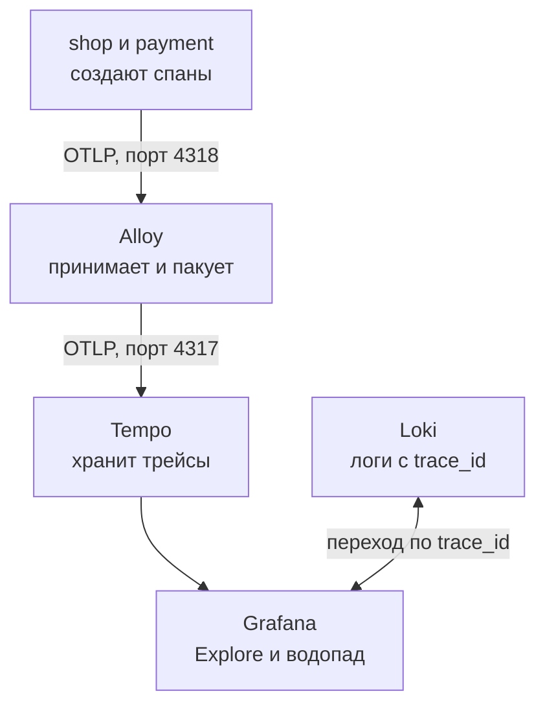
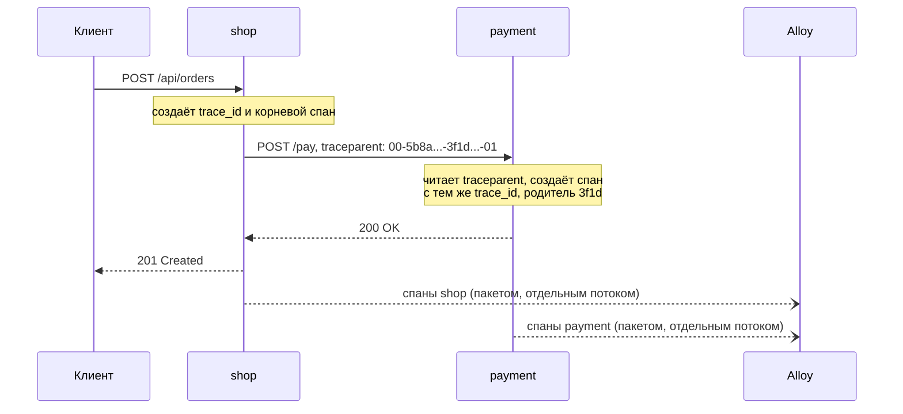

## Зачем это нужно

В [уроке 7.6](06-alerts-incidents.md) ты разбирал инцидент с медленной оплатой: метрики показали, что вырос p95 заказов, логи показали ошибки 502 и текст «payment failed». Вывод «виновата оплата» ты сделал **сам**, сопоставив цифры с кодом и знанием о стенде. На работе системы больше: заказ может пройти через десять сервисов, и ни один человек не держит в голове все связи. Нужен инструмент, который для **одного конкретного запроса** показывает: кто его принял, кого вызвал, сколько времени провёл у каждого и где споткнулся.

Такой инструмент называется **распределённая трассировка** (distributed tracing). Метрика отвечает «сколько», лог отвечает «что случилось», а трейс отвечает «**где** запрос потерял время». Для нагрузочного тестировщика это главный инструмент поиска узкого места: p95 вырос, а трейс самого медленного запроса за минуту показывает, что 95% его времени ушло в один `SELECT` или в один вызов соседнего сервиса.

Шаг проекта: ты включаешь трейсы на стенде (они включены по умолчанию), делаешь заказ, находишь его трейс в Grafana Explore, переходишь из лога в трейс и обратно, затем воспроизводишь медленную оплату и N+1 и находишь их глазами в водопаде спанов. Результат записываешь в `~/perf-lab/07-monitoring/traces.md`.

## Что нужно знать

- Логи, `request_id` и Loki: [урок 7.5](05-logs-loki.md). Здесь `request_id` получит старшего брата `trace_id`.
- Grafana и источники данных: [урок 7.3](03-grafana.md). Tempo подключён к Grafana автоматически, как Loki.
- Alloy как «курьер» телеметрии: [урок 7.5](05-logs-loki.md). Теперь он везёт ещё и трейсы.
- Инцидент с медленной оплатой и цепочкой «оплата, занятый пул, 503»: [урок 7.6](06-alerts-incidents.md), подробности в [уроке 11.5](../11-bottlenecks/05-cache-dependencies.md).
- Заголовки HTTP: [урок 2.1](../02-web/01-client-server-http.md). Заголовок это строка вида `Имя: значение`, которую клиент или сервер добавляет к запросу.
- Работающий стенд с профилем `monitoring` и фоновая нагрузка `orders_load.py` из [урока 7.4](04-exporters.md).

## Картина целиком

Посылка с трек-номером. Ты отправляешь посылку, и пока она едет через сортировочный центр, самолёт и курьера, на каждом этапе в систему записывается строка: «принята там-то в 10:03, ушла в 10:41». Все строки связаны одним трек-номером, поэтому по нему видно весь маршрут и этап, на котором посылка простояла двое суток. Аналогия ломается в одном: у посылки этапы идут по очереди, а у запроса внутри сервиса многое вложено одно в другое (сервис принял запрос и, пока держит его, ходит в базу и в соседний сервис).

Трек-номер запроса называется `trace_id`, а каждый этап (приняли запрос, выполнили `SELECT`, позвали оплату) это **спан**. Путь данных на стенде такой:



Сервисы сами создают спаны и отправляют их в Alloy, тот передаёт Tempo, Grafana показывает трейс как водопад. Лог в Loki и трейс в Tempo связаны одним значением `trace_id`, и из одного можно перейти в другое.

## Теория

### Трейс и спан

**Зачем существует.** Без трейсов каждый сервис знает только про себя. `shop` видит: «оплата отвечала 2 секунды». `payment` видит: «запрос пришёл, я думал 2 секунды». Чтобы понять, что это **одно и то же** событие, и что вся история началась с запроса пользователя, нужно связать записи из разных сервисов. Руками это делают по времени и догадкам, а у каждого сервиса свои часы.

**Спан** (span, «пролёт») это запись об одном куске работы: имя, время начала, длительность, к какому трейсу относится, кто его родитель и набор атрибутов (пары «ключ: значение», например адрес запроса или текст SQL). **Трейс** (trace) это дерево спанов одного запроса: корневой спан (его создаёт первый сервис на пути) и вложенные в него. Аналогия с оглавлением книги: глава (корневой спан) состоит из параграфов, а те из абзацев. Оглавление показывает, где сколько страниц. Аналогия ломается тем, что спаны одного уровня могут идти параллельно, а страницы нет.

Что видит Tempo для заказа на стенде (имена те, что создаёт инструментация):

| Спан | Сервис | Что это |
|---|---|---|
| `POST /api/orders` | shop | корневой: весь запрос, как его видит пользователь |
| `GET`, `HGETALL`, `DEL` | shop (Redis) | команды Redis: сессия, корзина, очистка корзины |
| `db.pool.getconn` | shop | ожидание соединения из пула PostgreSQL |
| `SELECT`, `INSERT`, `UPDATE` | shop (PostgreSQL) | SQL-запросы заказа |
| `POST` | shop (httpx) | исходящий вызов оплаты, на каждую попытку свой спан |
| `POST /pay` | payment | серверная сторона оплаты |

Спан `db.pool.getconn` это не библиотечный, а наш собственный: в `db.py` взятие соединения обёрнуто в спан вручную. Ожидание в пуле иначе не видно ни в одном запросе, а именно оно превращается в 503 при нагрузке (урок 11.3).

**Как читать длительности.** У каждого спана есть **своё время** (self time): его длительность минус время его детей. У корневого `POST /api/orders` при 94 мс всего и 30 мс на SQL и Redis, 58 мс на оплату своего времени останется совсем немного: в нём живёт только сам Python-код между вызовами. Когда в трейсе длинный спан, у которого почти нет детей, время тратится в нём самом (вычисления, ожидание блокировки), а когда у длинного спана длинный ребёнок, смотри на ребёнка.

### Водопад: как выглядит трейс

Трейс рисуют **водопадом** (waterfall): строка на спан, горизонтальная ось это время от начала запроса, длина полосы это длительность, отступ показывает вложенность. Попробуй сам.

<div class="viz" data-viz="trace-waterfall" data-scenario="order"></div>

Сначала посмотри на сценарий «Заказ: всё хорошо»: корневая полоса охватывает все остальные, SQL идёт друг за другом, а оплата стоит одним блоком из двух спанов (`POST` в shop и `POST /pay` в payment чуть короче, потому что часть времени уходит на сеть). Затем переключи на «Медленную оплату»: одна полоса стала почти во всю ширину. Сценарии «Оплата падает» и «N+1» пригодятся тебе в практике.

> **Проверь понимание:** в трейсе заказа корневой спан 2046 мс, `POST /pay` 2004 мс. Чем занят оставшийся 41 мс? Можно ли сказать, что shop «тормозит»?
>
> <details markdown="1"><summary>Ответ</summary>
> Это SQL, Redis и сам Python-код shop (около 30 мс видны на полосках слева). Нет: shop работает так же быстро, как обычно. Время теряется в `POST /pay`, то есть в оплате, и shop только ждёт её, держа соединение с базой. По водопаду это видно сразу, в метриках пришлось бы сопоставлять несколько графиков.
> </details>

### Контекст и traceparent: как спаны разных сервисов попадают в один трейс

**Зачем существует.** Спаны создаются в разных процессах, у них нет общей памяти. Если shop просто вызовет payment, спан в payment создастся как **новый** трейс, и связи не будет. Нужно передать «трек-номер» вместе с запросом.

**Контекст** (context) это пара «`trace_id` и `span_id` текущего спана», которую сервис кладёт в **исходящий** запрос. Для HTTP это заголовок `traceparent` (стандарт W3C Trace Context):

```text
traceparent: 00-5b8aa5a2d2c872e8321cf37308d69df2-3f1d9c0a7b6e4d28-01
             |  |                                |                |
             |  trace_id (32 hex)                span_id          флаги (01: записывать)
             версия
```

Аналогия: ты передаёшь коллеге папку с делом и говоришь «это дело номер 5b8a, мы на этапе 3f1d, продолжай». Он открывает свой этап, помечая «родитель: 3f1d». Аналогия ломается там, что в трейсе у соседей нет «общей папки»: каждый шлёт свои записи самостоятельно, а собирает их Tempo по `trace_id`.

Как это идёт по шагам на нашем заказе:



Видно, что спаны уходят в Alloy **после** ответа и отдельным потоком: трейс не задерживает запрос. Alloy складывает всё вместе, а связывает спаны не он, а Tempo: по общему `trace_id` и ссылкам на родителя.

**Что путают.** Контекст передаётся автоматически только там, где его кладёт в запрос библиотека. На стенде это делает инструментация `httpx` (исходящие вызовы shop) и `fastapi` (приём в payment). Если сервис вызывает другой через самописный сокет или очередь без заголовка, цепочка рвётся: на выходе два отдельных трейса вместо одного. Поэтому первый вопрос при «трейс обрывается» это «кто не передал заголовок».

### OpenTelemetry и OTLP

**Зачем существует.** Раньше каждый поставщик трейсинга (Zipkin, Jaeger, коммерческие системы) имел свои библиотеки и свой формат. Поменять систему значило переписывать код сервисов. **OpenTelemetry** (OTel) это единый открытый стандарт: библиотеки (SDK) для создания спанов и метрик в приложениях и формат передачи **OTLP** (OpenTelemetry Protocol). Код сервиса пишет в OTel, а куда это попадёт, решает настройка.

На стенде в `shop` и `payment` стоят:

- **SDK** `opentelemetry-sdk` и экспортёр `opentelemetry-exporter-otlp-proto-http`: создают спаны и отправляют их по OTLP через HTTP на адрес из `OTEL_EXPORTER_OTLP_ENDPOINT` (по умолчанию `http://alloy:4318`).
- **Инструментации** (instrumentation): готовые обёртки вокруг популярных библиотек. Они сами создают спаны, пока ты не написал ни строчки: `fastapi` (входящие запросы), `httpx` (исходящие), `psycopg` (SQL), `redis` (команды Redis). Именно они дают спаны `SELECT` и `HGETALL` из таблицы выше.

Разбор настроек стенда, меняются через `.env` (список в `project/shop/README.md`):

| Переменная | По умолчанию | Что делает |
|---|---|---|
| `TRACING_ENABLED` | `1` | `0` выключает трейсы полностью, SDK не создаётся |
| `OTEL_EXPORTER_OTLP_ENDPOINT` | `http://alloy:4318` | куда слать спаны |
| `OTEL_TRACES_SAMPLER` | `parentbased_always_on` | сколько трейсов сохранять (ниже) |
| `OTEL_TRACES_SAMPLER_ARG` | `1.0` | доля сохраняемых трейсов для сэмплера по доле |

Спаны уходят **пакетами** (batch): SDK копит их и отправляет раз в секунду. Если Alloy недоступен (профиль `monitoring` не запущен), экспорт тихо падает по таймауту в отдельном потоке: заказы не замедляются и ошибок в лог не пишется. Это важное свойство любой телеметрии: **она не должна ломать то, что наблюдает**.

### Сэмплирование: сколько трейсов хранить

**Зачем существует.** Трейс каждого запроса при тысяче запросов в секунду это тысяча деревьев по 15 спанов каждую секунду: нагрузка на CPU сервиса, сеть и диск Tempo. Поэтому в боевых системах хранят только часть трейсов. Выбор «какую часть» называется **сэмплированием** (sampling).

Аналогия: на фабрике не вскрывают каждую упаковку, а проверяют каждую сотую. Аналогия ломается тем, что поломка может быть редкой, и случайная проверка её пропустит. Поэтому делают не только случайный выбор, но и «хвостовой» (tail sampling): сохранять **все** трейсы с ошибками или длиннее 1 секунды. Он живёт в коллекторе (Alloy или OTel Collector), потому что решение можно принять только когда трейс закончился. На стенде его нет, мы храним всё: `parentbased_always_on`.

Что означает `parentbased`: решение принимает первый сервис на пути (по `trace_id`: «ровно 10% трейсов»), остальные **следуют** флагу из `traceparent` (последняя цифра `01`: записывать). Иначе shop сохранил бы свой кусок, а payment нет, и трейс был бы рваным. Для высокого RPS в тестах ставят `parentbased_traceidratio` с `OTEL_TRACES_SAMPLER_ARG=0.1`: 10% трейсов.

**Что путают.** Сэмплирование не влияет на метрики: счётчики и гистограммы Prometheus считаются по всем запросам. Если p95 в метриках 1,2 с, а в Tempo при сэмплировании 10% видно только 3 медленных трейса, это не противоречие, а выборка. И для нагрузочного теста это важно: трейсы стоят CPU самого стенда, а значит искажают измерение. Не включай трейсы с ресурсоёмкими настройками во время замера пределов, не сказав об этом в отчёте.

### Alloy и Tempo: путь спанов

На стенде Alloy (тот же курьер, что возит логи) получает спаны по OTLP, пакует их и передаёт Tempo. Конфиг `monitoring/alloy/config.alloy` содержит три связанных блока: `otelcol.receiver.otlp` (приёмник на порту 4318), `otelcol.processor.batch` (пакетирование), `otelcol.exporter.otlp "tempo"` (отправка на `tempo:4317`). Блоки соединены друг с другом так же, как в логах: выход одного указан входом другого.

**Tempo** (Grafana Tempo) это хранилище трейсов. Как и Loki, он ничего не индексирует по содержимому, а ищет по `trace_id` и по небольшому набору атрибутов, поэтому очень дёшев. Версия закреплена в `compose.yaml` (2.10), данные лежат на диске в томе `tempo` 24 часа. Порт 3200 открыт: Grafana ходит туда за трейсами, а ты можешь обратиться напрямую.

Зачем между сервисом и Tempo стоит Alloy, если можно слать сразу? Сервисам не нужно знать адрес хранилища (они знают только «куда-то в коллектор»), а в Alloy можно позже добавить фильтры, хвостовое сэмплирование и вторую копию трейсов в другую систему, не трогая сервисы.

### Поиск трейса в Grafana: Explore и TraceQL

В [Grafana Explore](03-grafana.md) выбери источник **Tempo**. Есть два способа искать:

1. **По номеру.** Если у тебя есть `trace_id` (из лога, из ответа), вставь его в запрос: откроется водопад.
2. **Запросом TraceQL.** Язык запросов Tempo, по форме близок к LogQL и PromQL: в фигурных скобках условия на спан, а справа от `|` можно добавлять функции.

Примеры, которые подходят стенду:

```text
{ resource.service.name = "payment" }
{ name = "POST /api/orders" && duration > 1s }
{ resource.service.name = "shop" && status = error }
{ span.db.system = "postgresql" } | count() > 10
```

Разбор. `resource.service.name` это имя сервиса (из `OTEL_SERVICE_NAME`: `shop` или `payment`). `name` это имя спана, `duration` его длительность, `status = error` выбирает спаны с ошибкой. `span.db.system` это атрибут, который инструментация ставит всем SQL-спанам. Четвёртая строка читается так: «найди трейсы, где **больше десяти** SQL-спанов»: это ловушка на N+1, поскольку число запросов на один HTTP-запрос не должно расти.

Результат TraceQL это список трейсов с корневым именем, длительностью и временем. Нажми на трейс, откроется водопад. Спан можно раскрыть: справа видны атрибуты (адрес, SQL, код ответа, `service.name`), а у спана с ошибкой причина.

### Лог и трейс: переход по `trace_id`

В JSON-логе shop теперь рядом с `request_id` лежит `trace_id`, разберём как они различаются:

```json
{"ts": "2026-10-03T12:03:41.512390+00:00", "level": "ERROR", "msg": "Запрос завершён",
 "method": "POST", "route": "/api/orders", "path": "/api/orders", "status": 502,
 "duration_ms": 212.4, "request_id": "9f3c2b7a41d84c1e8b6a0d5e7f213a90",
 "trace_id": "5b8aa5a2d2c872e8321cf37308d69df2", "user_id": 17, "error": "payment failed"}
```

`request_id` это номер **одного обращения к shop** (его можно задать самому через заголовок `X-Request-ID`, мы так делали в уроке 7.5). `trace_id` это номер **всего пути** по всем сервисам: он один у shop и payment, а `request_id` у каждого сервиса свой. Пока сервис один, они почти равноценны, а для цепочки сервисов главнее `trace_id`.

В Grafana для связи настроены два перехода (provisioning в `datasources.yml`):

- **Лог, затем трейс.** В Explore по Loki раскрой строку лога: у поля `trace_id` есть кнопка **Tempo**, она открывает водопад этого запроса. Это «derived field» (производное поле): Grafana разбирает строку регулярным выражением и превращает значение в ссылку.
- **Трейс, затем логи.** В водопаде у спана есть кнопка перехода к логам (в раскрытом спане): она открывает запрос Loki `{service="shop"} |= "<trace_id>"` с окном ±1 минута.

Логи объясняют, **почему** (текст ошибки, пользователь, значения), трейс показывает, **где** (какой участок). Рабочий порядок на инциденте: алерт или график (метрики), затем трейс самого медленного запроса (где), затем лог этого же запроса (почему).

> **Проверь понимание:** `trace_id` в логе есть только у запросов к `/api/*`, а у `/healthz` нет. Почему и важно ли это?
>
> <details markdown="1"><summary>Ответ</summary>
> Служебные адреса `/healthz`, `/readyz` и `/metrics` намеренно исключены из трассировки: Prometheus дёргает `/metrics` каждые 15 секунд, и трейсы-пустышки засорили бы Tempo и съели бы место. Раз спана нет, нет и `trace_id`. Важно знать это, когда ищешь «пропавший трейс» для проверки здоровья: его нет не из-за поломки.
> </details>

### Как трейсы помогают найти узкое место

Три типичные картины, ты уже знаешь их по метрикам, теперь увидишь в трейсах:

- **Одна длинная полоса.** Один спан занимает почти всё время запроса: медленная оплата (`POST /pay` 2 с), медленный запрос в базу. Чинить нужно именно его.
- **Лесенка одинаковых коротких спанов.** Десятки одинаковых `SELECT` один за другим: N+1 (урок 11.3). Каждый запрос быстрый, в журнале медленных запросов их нет, и в метриках PostgreSQL они не видны, а в трейсе лесенка бросается в глаза.
- **Повторы подряд.** Несколько одинаковых `POST` к payment с красной меткой: ретраи без паузы (урок 11.5). В метриках это выглядело как «RPS оплаты втрое больше RPS заказов», а в трейсе одного заказа видны все четыре попытки.

<div class="viz" data-viz="trace-waterfall" data-scenario="retries"></div>

Здесь видно лесенку из четырёх попыток: все красные, каждая около 56 мс. Попробуй переключить на «N+1: список заказов» и нажать «Свернуть повторы»: 20 одинаковых полос сложатся в одну с подписью `SELECT x20`. Так Grafana показывает «сжатые» спаны в большом трейсе.

## Практика

Стенд поднят с профилем `monitoring` ([урок 7.4](04-exporters.md)), в `~/perf-lab` активировано окружение, фоновая нагрузка не нужна: запросов вручную достаточно.

### 1. Убедись, что трейсы текут

```bash
cd ~/load-tester/project/shop
docker compose --profile monitoring ps tempo alloy
curl -s localhost:3200/ready
```

Разбор: `ps tempo alloy` показывает состояние двух сервисов, `curl ... /ready` обращается к порту 3200 Tempo и спрашивает «готов принимать данные».

Ожидаемый вывод:

```text
NAME             IMAGE                    COMMAND   SERVICE   STATUS          PORTS
shop-alloy-1     grafana/alloy:v1.20.1    ...       alloy     Up 2 minutes    0.0.0.0:12345->12345/tcp
shop-tempo-1     grafana/tempo:2.10.8     ...       tempo     Up 2 minutes    0.0.0.0:3200->3200/tcp
ready
```

**Как читать вывод:** оба сервиса в статусе `Up`, Tempo отвечает `ready`. Сразу после запуска Tempo может отвечать `Ingester not ready: waiting for 15s after being ready`: подожди 15 секунд.

**Типичные ошибки:** `curl: (7) Failed to connect to localhost port 3200` значит, что стенд поднят без профиля `monitoring`: запусти `docker compose --profile monitoring up -d`.

### 2. Сделай заказ и найди его `trace_id`

```bash
TOKEN=$(curl -s localhost:8000/api/login -H 'Content-Type: application/json' \
  -d '{"email":"user0001@shop.lab","password":"password"}' | jq -r .token)
curl -s localhost:8000/api/cart/items -H "Authorization: Bearer $TOKEN" \
  -H 'Content-Type: application/json' -d '{"product_id": 7, "qty": 1}'
curl -s -X POST localhost:8000/api/orders -H "Authorization: Bearer $TOKEN"
docker compose logs shop --no-log-prefix | grep '"/api/orders"' | tail -1 | jq '{status, duration_ms, request_id, trace_id}'
```

Разбор: первая команда входит и сохраняет токен в переменную, вторая кладёт товар 7 в корзину, третья оформляет заказ. Последняя берёт из логов shop последнюю строку про `/api/orders` и показывает из неё четыре поля. `$(...)` подставляет результат команды, `jq -r .token` достаёт значение без кавычек.

Ожидаемый вывод последней команды:

```json
{
  "status": 201,
  "duration_ms": 92.41,
  "request_id": "8d2f61c0a59e4b73a1f0c4e2b6d37a15",
  "trace_id": "0e7b3c9a4d1f4a2b8c5e6f7a8b9c0d1e"
}
```

**Как читать вывод:** `status` 201 это заказ создан. `trace_id` это 32 символа: скопируй его, он понадобится дальше. `duration_ms` примерно 90 мс похоже на «здоровый» заказ из первого виджета.

**Типичные ошибки:** `jq: error ... Cannot index string` значит, что токен не получен (`echo $TOKEN` пуст): проверь, что стенд работает и email верный. Пустой вывод последней команды значит, что строки ещё не вышли: подожди секунду и повтори.

### 3. Открой трейс в Grafana

Открой `http://localhost:3000/explore`, источник **Tempo**, режим запроса по номеру трейса, вставь `trace_id` из шага 2 и выполни. Если трейс «не найден», подожди 10–15 секунд: Tempo сначала держит данные в памяти и отдаёт их с небольшой задержкой.

Ты должен увидеть водопад: корневой `POST /api/orders` длиной около 90 мс, под ним спаны `GET`, `HGETALL`, `db.pool.getconn`, четыре `SELECT`/`INSERT`/`UPDATE`, затем `POST` и вложенный в него `POST /pay` из сервиса payment, в конце `DEL`. Найди ответы на вопросы и запиши в `traces.md`:

1. Сколько спанов в трейсе и в скольких сервисах?
2. Какой спан самый длинный, и какую долю корня он занимает?
3. Сколько времени заказ ждал соединения из пула (`db.pool.getconn`)?
4. Какой атрибут у `POST /pay` показывает адрес вызова?

**Как читать вывод:** корневой спан длиннее суммы детей, потому что в нём ещё время самого кода. Длинная полоса оплаты (около 50 мс) это норма: заглушка отвечает за 50 мс в среднем.

### 4. Из лога в трейс и обратно

В Explore выбери источник **Loki** и выполни запрос из урока 7.5:

```text
{service="shop"} | json | route = "/api/orders"
```

Разбор: селектор по метке `service`, затем `| json` разбирает строку, `route = ...` фильтрует по полю. Раскрой любую строку: у поля `trace_id` будет кнопка **Tempo**. Нажми её, откроется водопад. В водопаде раскрой любой спан и нажми кнопку перехода к логам: вернёшься к строкам лога этого запроса.

**Типичные ошибки:** у `trace_id` нет кнопки, потому что строка старая (до включения трейсов): выбери свежую.

> Запрос TraceQL не находит трейсы? Скопируй запрос и список имён и атрибутов спанов из реального трейса, спроси нейросеть, где расхождение. Проверь, что имена атрибутов совпадают с теми, что показывает Grafana в карточке спана.
{: .ai}

### 5. Найди запрос TraceQL

Переключись в Tempo на запрос TraceQL (вкладка рядом с поиском) и выполни:

```text
{ resource.service.name = "payment" }
```

Затем с нагрузкой. Запусти фон на 2 минуты и сравни:

```bash
python ~/perf-lab/07-monitoring/orders_load.py orders 3 120 &
sleep 30
```

Выполни `{ name = "POST /api/orders" && duration > 150ms }` и выбери самый длинный трейс из списка. Сравни его с типичным: куда ушла разница?

**Как читать вывод:** список отсортирован по времени, у каждого трейса видны корневое имя и длительность. Если список пуст, снизь порог (`duration > 100ms`): на здоровом стенде медленных заказов мало.

### 6. Допиши файл

В `~/perf-lab/07-monitoring/traces.md` запиши: `trace_id` твоего заказа, четыре ответа из шага 3, два TraceQL-запроса и в одной строке, чем трейс полезнее лога для вопроса «где потерялось время».

## Сломай и почини

**Поломка 1: медленная оплата.** Сделай оплату медленной (на лету, как в [уроке 11.5](../11-bottlenecks/05-cache-dependencies.md)):

```bash
curl -s -X POST localhost:8001/admin/config -H 'Content-Type: application/json' -d '{"delay_ms": 2000}'
curl -s -X POST localhost:8000/api/orders -H "Authorization: Bearer $TOKEN" -o /dev/null -w '%{time_total}\n'
```

Перед повтором положи товар в корзину (шаг 2.2), иначе ответ «400 cart is empty». Найди трейс: `{ name = "POST /pay" && duration > 1s }`. Ответь: **какой спан** длиннее всех и в каком он сервисе? Почему при этом соседние `SELECT`/`UPDATE` в начале трейса тоже «заняты»? Диагноз: оплата 2 секунды внутри транзакции, соединение пула и блокировки строк товаров держатся всё это время.

**Починка:** `curl -s -X POST localhost:8001/admin/config -H 'Content-Type: application/json' -d '{"delay_ms": 50}'`. Повтори заказ: трейс снова «здоровый».

**Поломка 2: N+1.** В `.env` стенда поставь `BUG_N_PLUS_ONE=1` и пересоздай shop (`docker compose --profile monitoring up -d shop`). Выполни `curl -s localhost:8000/api/orders -H "Authorization: Bearer $TOKEN" -o /dev/null`, затем найди трейс запросом `{ span.db.system = "postgresql" } | count() > 10`. Посчитай лесенку одинаковых `SELECT`: при 20 заказах их 21 (один за списком заказов и по одному на каждый заказ). Верни `BUG_N_PLUS_ONE=0`, пересоздай shop той же командой и сравни: SQL-спанов должно остаться два (список заказов и один общий запрос позиций).

**Поломка 3: выключенные трейсы.** Поставь `TRACING_ENABLED=0`, пересоздай shop и payment. Заказ работает, а поиск трейса по новому `trace_id` не находит ничего, и в логе поля `trace_id` нет. Вернуть: `TRACING_ENABLED=1` и пересоздание. Вывод: трейсы включаются снаружи и не меняют бизнес-логику.

## ИИ в помощь

Нейросеть помогает прочитать длинный трейс и составить запрос TraceQL, но язык молодой, и она нередко подставляет синтаксис других систем. Общие правила: [ИИ-помощник](../ai.md).

**Задача:** найти в трейсе узкое место.

```text
Вот список спанов одного медленного запроса POST /api/orders (сервис, имя спана, длительность):
<вставь спаны из Grafana Tempo>. Общее время <число> мс. Объясни, какой спан главный
по времени, чем длительность спана отличается от «собственного» времени (self time), и в какой
сервис или в какую базу смотреть дальше. Что нужно проверить, чтобы подтвердить гипотезу?
```
{: .wrap}

**Проверь ответ:** сопоставь с трейсом в Grafana: спан `db.pool.getconn` и спаны сервиса `payment`. Типичная ошибка: нейросеть называет виновником самый длинный спан, хотя это родитель, внутри которого ждут дочерние.

**Задача:** составить запрос TraceQL.

```text
Tempo 2.10, TraceQL. Составь запрос: трейсы сервиса shop со статусом ошибки, где есть спан
сервиса payment длительностью больше 500 мс. Объясни каждое условие в фигурных скобках.
```
{: .wrap}

**Проверь ответ:** выполни в Explore (источник Tempo). Типичные ошибки: синтаксис из SQL (`WHERE`), атрибуты без префикса `resource.` или `span.`, длительность без единицы (`500` вместо `500ms`).

## Словарик урока

| Термин | Простыми словами |
|---|---|
| Трейс (trace) | Все спаны одного запроса по всем сервисам, дерево с одним корнем |
| Спан (span) | Запись об одном куске работы: имя, начало, длительность, атрибуты |
| `trace_id` | 32-символьный номер трейса, общий для всех его спанов и строк лога |
| `span_id` | 16-символьный номер одного спана |
| Корневой спан | Первый спан трейса, у него нет родителя; обычно весь запрос |
| Контекст (context) | Пара `trace_id` и `span_id`, которую сервис передаёт дальше |
| `traceparent` | HTTP-заголовок, в котором контекст едет от сервиса к сервису (стандарт W3C) |
| Атрибут | Пара «ключ: значение» на спане: адрес, SQL, код ответа |
| Водопад (waterfall) | Картинка трейса: строка на спан, длина полосы это длительность |
| Собственное время (self time) | Длительность спана без времени его детей |
| OpenTelemetry (OTel) | Открытый стандарт: библиотеки создания телеметрии и формат передачи |
| OTLP | Протокол передачи телеметрии OpenTelemetry (HTTP на 4318, gRPC на 4317) |
| Инструментация | Готовая обёртка вокруг библиотеки, которая сама создаёт спаны |
| Сэмплирование (sampling) | Сохранение только части трейсов, чтобы снизить стоимость |
| `parentbased` | Режим, где сервис следует решению первого сервиса из `traceparent` |
| Tempo | Хранилище трейсов Grafana, ищет по `trace_id` и атрибутам |
| TraceQL | Язык запросов Tempo: условия на спаны в `{ }` и функции после `|` |
| Derived field | Поле лога, которое Grafana превращает в ссылку (у нас `trace_id` ведёт в Tempo) |

## Вопросы с собеседований

Раздел для повторения: ответь вслух, потом открой ответ.

### 1. [junior] [часто] Что такое трейс и чем он отличается от лога и метрики?

<details markdown="1">
<summary>Ответ</summary>

Метрика это число во времени (сколько и как быстро), лог это запись события (что случилось), трейс это путь одного запроса по сервисам со временем на каждом этапе (где потерялось время). Трейс состоит из спанов, связанных родителем и общим `trace_id`.

**Что хотят услышать:** три вида данных и вопрос, на который отвечает каждый; метрика для обнаружения, трейс и лог для диагностики.

**Красный флаг:** «трейс это просто подробный лог».
</details>

### 2. [junior] [часто] Что такое спан?

<details markdown="1">
<summary>Ответ</summary>

Запись об одном куске работы: имя, время начала и длительность, `trace_id`, родитель и атрибуты. Спаны образуют дерево: серверный спан запроса, под ним SQL, вызов соседнего сервиса.

**Что хотят услышать:** вложенность, длительность, атрибуты, привязка к трейсу.

**Красный флаг:** путают спан с сервисом или со строкой лога.
</details>

### 3. [junior] [часто] Как контекст передаётся между сервисами?

<details markdown="1">
<summary>Ответ</summary>

В HTTP-заголовке `traceparent` (стандарт W3C): версия, `trace_id`, `span_id` вызывающего спана и флаги. Принимающий сервис создаёт свой спан с тем же `trace_id` и родителем из заголовка. Если библиотека вызова не кладёт заголовок (самописный клиент, очередь без метаданных), цепочка рвётся на два трейса.

**Что хотят услышать:** название заголовка, что в нём лежит, где он теряется.

**Красный флаг:** «сервисы договариваются через общую базу».
</details>

### 4. [middle] [часто] Вырос p95 заказов: как найти причину по трейсам?

<details markdown="1">
<summary>Ответ</summary>

Найти медленные трейсы за период (TraceQL: `{ name = "POST /api/orders" && duration > 1s }`), открыть один или несколько и посмотреть на самую длинную полосу и её собственное время. Если это спан соседнего сервиса, идти туда, если лесенка одинаковых SQL, то N+1, если много `db.pool.getconn`, то нехватка соединений. Затем лог по `trace_id`, чтобы получить причину (текст ошибки, параметры).

**Что хотят услышать:** порядок «метрики, трейс, лог», умение читать собственное время.

**Красный флаг:** открывают только один трейс и делают вывод без сравнения с нормальным.
</details>

### 5. [middle] [часто] Зачем нужно сэмплирование и что такое parentbased?

<details markdown="1">
<summary>Ответ</summary>

Трейс каждого запроса дорог по CPU, сети и месту, поэтому хранят долю. `parentbased` означает: решение принимает первый сервис по `trace_id`, остальные следуют флагу в `traceparent`, чтобы трейс не получился рваным. Хвостовое сэмплирование (после завершения трейса) позволяет сохранять все ошибки и медленные запросы, но требует коллектора, который держит трейс в памяти.

**Что хотят услышать:** стоимость, целостность трейса, голова против хвоста.

**Красный флаг:** считают, что сэмплирование искажает метрики.
</details>

### 6. [middle] Что такое OpenTelemetry и OTLP?

<details markdown="1">
<summary>Ответ</summary>

OpenTelemetry это открытый стандарт и набор SDK для создания трейсов, метрик и логов. OTLP это протокол их передачи (gRPC на 4317, HTTP на 4318). Смысл: код сервиса не привязан к конкретному хранилищу, смена бэкенда это правка конфигурации коллектора.

**Что хотят услышать:** независимость от поставщика, SDK и протокол как разные вещи.

**Красный флаг:** «OpenTelemetry это такая база данных».
</details>

### 7. [middle] Зачем между сервисом и Tempo стоит Alloy?

<details markdown="1">
<summary>Ответ</summary>

Сервису не нужно знать адрес хранилища и переживать его недоступность: он шлёт в ближайший коллектор. В коллекторе можно пакетировать, фильтровать, делать хвостовое сэмплирование, добавлять атрибуты и отправлять копию в другую систему, не меняя сервисы.

**Что хотят услышать:** развязка, единая точка управления.

**Красный флаг:** «просто так принято», без объяснения выгоды.
</details>

### 8. [middle] Как связать лог и трейс?

<details markdown="1">
<summary>Ответ</summary>

Писать `trace_id` в каждую строку лога запроса. В Grafana настроить derived field на Loki (ссылка из лога в Tempo) и переход из спана в логи по `trace_id` (запрос к Loki). Без `trace_id` в логе связь придётся делать по времени и догадкам.

**Что хотят услышать:** общий идентификатор в обоих хранилищах и настроенные переходы.

**Красный флаг:** «ищем по времени».
</details>

### 9. [middle] Как в трейсе выглядит N+1?

<details markdown="1">
<summary>Ответ</summary>

Под одним серверным спаном десятки одинаковых коротких SQL-спанов друг за другом (по одному на каждую строку списка). Каждый запрос быстрый, но их число растёт с размером списка. В TraceQL: `{ span.db.system = "postgresql" } | count() > 10`. Лечение: один запрос с `IN`/`ANY` или `JOIN`.

**Что хотят услышать:** «лесенка», зависимость от размера данных, способ лечения.

**Красный флаг:** искать медленный запрос в журнале PostgreSQL: каждый из них быстрый.
</details>

### 10. [middle] Трейсы замедляют сервис? Как уменьшить влияние?

<details markdown="1">
<summary>Ответ</summary>

Да, немного: создание спанов, сериализация и сеть стоят CPU. Снижают сэмплированием, исключением служебных адресов (`/healthz`, `/metrics`), пакетной отправкой в отдельном потоке и таймаутом экспорта, чтобы недоступный коллектор не задерживал запросы. Для нагрузочного теста важно зафиксировать, были ли включены трейсы и с какой долей.

**Что хотят услышать:** цена есть, меры снижения, влияние на измерение.

**Красный флаг:** «бесплатно».
</details>

### 11. [middle] Трейс обрывается на втором сервисе. Что проверишь?

<details markdown="1">
<summary>Ответ</summary>

Доходит ли `traceparent` (клиентская библиотека, прокси или балансировщик могут отбрасывать заголовок), есть ли инструментация на принимающей стороне, не режет ли трейс разное сэмплирование, дошли ли спаны второго сервиса до коллектора. Идти по цепочке: заголовок, SDK второго сервиса, экспорт, хранилище.

**Что хотят услышать:** последовательная проверка вместо угадывания.

**Красный флаг:** «перезапустить Tempo».
</details>

### 12. [junior] [на скорость] Сколько символов в `trace_id` и из чего он состоит?

<details markdown="1">
<summary>Ответ</summary>

32 шестнадцатеричных символа (128 бит).
</details>

### 13. [junior] [на скорость] Как называется заголовок передачи контекста?

<details markdown="1">
<summary>Ответ</summary>

`traceparent`.
</details>

### 14. [junior] [на скорость] Чем `trace_id` отличается от `request_id`?

<details markdown="1">
<summary>Ответ</summary>

`request_id` это номер обращения к одному сервису, `trace_id` это номер всего пути запроса через все сервисы.
</details>

## Проверено на версиях

OpenTelemetry Python SDK 1.45, инструментации 0.66b0 (fastapi, httpx, psycopg, redis), Grafana Alloy 1.20, Grafana Tempo 2.10, Grafana 13.2, Loki 3.7. Версии закреплены в `project/shop/compose.yaml` и `requirements.txt`. Имена спанов в таблице получены инструментацией этих версий; в новых версиях имена атрибутов (например, код ответа) могут меняться, поэтому в запросах TraceQL урока использованы устойчивые поля: `name`, `duration`, `status`, `resource.service.name`, `span.db.system`.

## Итог урока: ты умеешь

- [ ] Объяснить, чем трейс отличается от метрики и лога и на какой вопрос отвечает.
- [ ] Назвать, что такое спан, корневой спан, `trace_id` и собственное время спана.
- [ ] Объяснить, как `traceparent` связывает shop и payment в один трейс и где цепочка может оборваться.
- [ ] Рассказать путь спанов: SDK, Alloy (4318), Tempo (4317), Grafana.
- [ ] Объяснить сэмплирование и режим `parentbased`, назвать цену трейсов для замеров.
- [ ] Найти трейс в Grafana по `trace_id` и запросом TraceQL.
- [ ] Перейти из лога в трейс и из спана в логи.
- [ ] Узнать в водопаде медленную оплату, повторы без паузы и N+1.

Дальше: [тема 8. Теория производительности](../08-perf-theory/index.md): ты умеешь видеть систему, теперь научишься объяснять, почему она ведёт себя так под нагрузкой.
