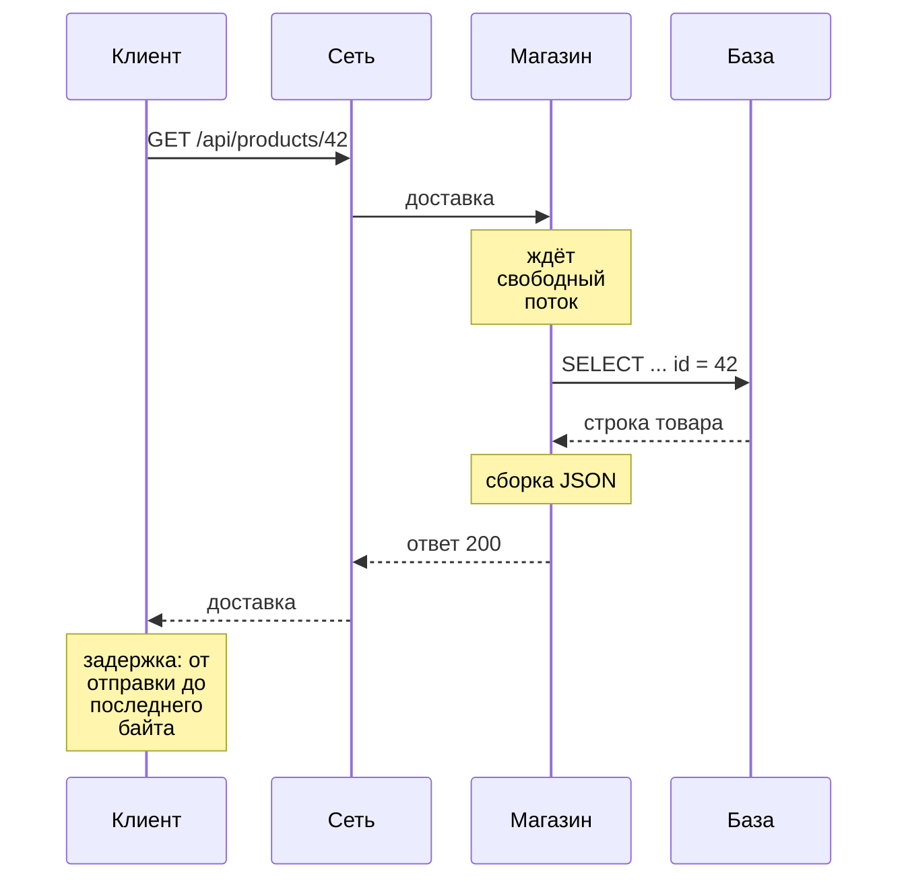
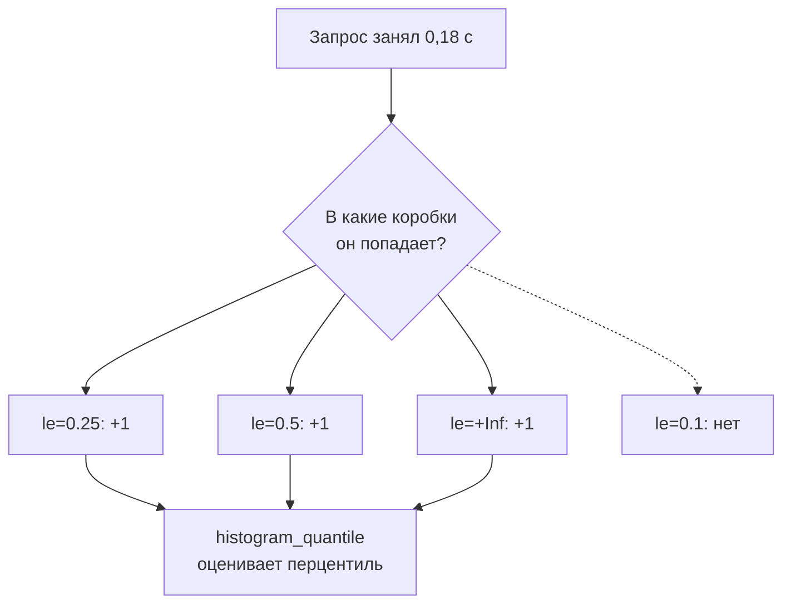

## Зачем это нужно

Я много лет проверяю сервисы под нагрузкой и сейчас покажу, с чего это начинается. Представь первый рабочий день в интернет-магазине. До распродажи две недели, в прошлом году сайт на ней упал. Руководитель спрашивает: «Магазин выдержит?» Ответ «вроде быстро работает» не годится: его нельзя проверить и с ним нельзя спорить. Нужны числа.

Нагрузочное тестирование (load testing) проверяет, как сервис ведёт себя, когда запросов много. Весь его язык держится на трёх числах: сколько ждёт пользователь (**задержка**), сколько запросов сервис успевает обработать (**пропускная способность**) и какая доля запросов закончилась ошибкой. Если их путать, отчёт получится красивым и бесполезным.

Самая частая ошибка новичка: посчитать среднее время ответа, увидеть «80 мс, отлично» и не заметить, что каждый сотый покупатель ждёт четыре секунды и уходит. Поэтому на работе говорят **перцентилями**: «p95 равно 300 мс» значит, что 95 запросов из 100 уложились в 300 миллисекунд.

Шаг проекта: ты напишешь мини-генератор нагрузки на Python (`~/perf-lab/08-theory/measure.py`: она шлёт запросы и записывает время каждого). Ты измеришь «Магазин» в покое и под растущей нагрузкой и сверишь числа с Prometheus. Результат станет **базовой линией** (baseline): числами «как сейчас», с которыми сравнивают всё дальнейшее.

## Что нужно знать

- Терминал, `curl` и чтение HTTP-ответа: [урок 1.4](../01-linux/04-network-cli.md) и [урок 2.1](../02-web/01-client-server-http.md).
- Python: функции, циклы, списки, `requests` и виртуальное окружение `~/perf-lab/.venv`: [уроки темы 4](../04-python/index.md), особенно [4.5](../04-python/05-venv-requests.md).
- Стенд «Магазин»: как он поднимается, [урок 5.3](../05-docker/03-compose-shop.md); профиль мониторинга с Prometheus и Grafana, [урок 7.1](../07-observability/01-metrics-prometheus.md).
- PromQL: `rate`, `sum by`, `histogram_quantile` на уровне «запускал и видел график»: [урок 7.2](../07-observability/02-promql.md). Здесь мы наконец разберём, что именно считает `histogram_quantile`.

## Картина целиком

Представь кассу в магазине. Задержка это сколько конкретный покупатель простоял от входа в очередь до чека. Пропускная способность это сколько покупателей касса пропускает за час. Числа разные: касса может обслуживать 60 человек в час и при этом держать каждого по 20 минут, если очередь длинная. А перцентиль отвечает на вопрос «сколько ждали почти все»: «95% простояли не дольше четырёх минут».

У сервиса то же самое. Один запрос проходит путь, и на каждом участке уходит время:



Здесь видно, что задержка складывается из кусочков. Ожидание и работа базы растут под нагрузкой, сеть на одной машине почти не меняется. Нагрузочник ищет, какой кусок вырос. Пока нагрузка мала, пропускная способность растёт вместе с ней, а задержка стоит. У предела запросы встают в очередь, и задержка уходит вверх «клюшкой». Первыми страдают редкие медленные запросы, поэтому p99 (медленнее него только каждый сотый запрос) растёт раньше и сильнее среднего.

## Теория

### Задержка: сколько ждёт один запрос

Пользователь не видит ни загрузку процессора, ни число соединений с базой. Он видит одно: сколько секунд крутится колёсико после нажатия кнопки. Это и есть **задержка** (latency): время от отправки запроса до полного ответа. Она как доставка пиццы, от звонка до звонка в дверь: внутри готовка, курьер и дорога, а клиенту важна сумма.

Меряют её в **миллисекундах** (мс, ms): 1 с = 1000 мс. Моргание длится около 100-150 мс, а запрос к «Магазину» на твоём компьютере обычно несколько миллисекунд. Почти всё это время уходит на работу сервера: запрос ждёт свободного работника, потом код ходит в базу и собирает ответ.

<div class="viz" data-viz="request-path" data-net="1" data-app="4" data-db="6"></div>

Здесь видно, как конверт едет к базе и обратно, а цветная полоса показывает, куда ушло время. По умолчанию ответ приходит за 12 мс: сеть 2 (по 1 мс туда и обратно), магазин 4, база 6. Подвинь ползунок «База ищет товар» и смотри, как растёт её доля.

Теперь настоящие числа. `curl` умеет показывать время этапов: флаг `-w` (write-out) печатает после запроса строку по шаблону, где `%{time_connect}` и подобные подставляются секундами:

```bash
curl -s -o /dev/null \
  -w 'dns=%{time_namelookup} connect=%{time_connect} ttfb=%{time_starttransfer} total=%{time_total}\n' \
  http://localhost:8000/api/products/42
```

```text
dns=0.000021 connect=0.000187 ttfb=0.007912 total=0.007961
```

Имя `localhost` найдено за 0,02 мс, соединение открыто на 0,19 мс, первый байт ответа пришёл на 7,9 мс, весь ответ на 7,96 мс. Поле `ttfb` (time to first byte, время до первого байта) показывает, сколько клиент ждал начала ответа. Значит, из 8 мс около 7,7 это работа сервера. Осторожно: все числа **накопительные**, они отсчитываются от начала запроса, а не измеряют отдельные этапы. Сложишь их и получишь чушь.

> **Проверь понимание:** `curl -w` показал `connect=0.000200 ttfb=0.250000 total=0.251000`. Сколько времени сервер думал над ответом?

<details markdown="1">
<summary>Ответ</summary>

Примерно 250 мс: от открытия соединения (0,2 мс) до первого байта (250 мс). Передача ответа заняла ещё 1 мс. Числа накопительные, поэтому вычитаем соседние, а не складываем.

</details>

<details markdown="1">
<summary>Для любопытных: что ещё входит в задержку</summary>

До работы сервера запрос проходит ещё DNS (превращение имени в IP-адрес, [урок 1.4](../01-linux/04-network-cli.md)) и установку TCP-соединения: три служебных пакета «привет, привет, договорились». Если соединение уже открыто и используется повторно (keep-alive), этого шага нет. Для HTTPS добавляется договорённость о шифровании (TLS); у нашего стенда обычный HTTP. «Задержку» и «время ответа» (response time) обычно считают синонимами; строгие авторы называют задержкой только ожидание до начала обработки. В отчёте уточни, что именно меряли.

</details>

> **Главное:** задержка это время от отправки запроса до полного ответа, и под нагрузкой растёт работа и ожидание на сервере, а не сеть.
{: .key}

Мы знаем, сколько ждёт один запрос. Но один запрос не покажет, выдержит ли магазин толпу.

### Пропускная способность: сколько запросов успевает сервис

Сервис, который отвечает за 10 мс одному пользователю, может лечь от сотни. Значит, нужно второе число: сколько работы сервис делает за секунду. Это **пропускная способность** (throughput), её меряют в **RPS** (requests per second, запросов в секунду).

Возьми пункт оплаты на трассе. Задержка это сколько едет одна машина, пропускная способность это сколько машин проезжает пункт за минуту. Расширь трассу с двух полос до четырёх: каждая машина быстрее не поедет, но машин в минуту станет вдвое больше. У сервиса «полосы» (потоки, то есть рабочие руки программы, которые делят между собой запросы; ядра; соединения с базой) делят общие ресурсы, поэтому выигрыш обычно меньше.

Теперь разница, которую новички теряют: нагрузка, которую подали (offered load), и пропускная способность, которую получили. Если генератор шлёт 300 RPS, а сервис успевает 200, то 100 запросов в секунду копятся в очереди или падают с ошибкой. Получить больше, чем сервис физически успевает, нельзя, сколько ни подавай.

Разберём тест. Генератор за 60 секунд отправил 12 000 запросов: 11 940 вернулись с кодом 200, 60 с кодом 503 (сервис перегружен и не может ответить).

> **Прикинь сам:** сколько запросов в секунду подали, сколько успешных получили и какая доля запросов ошибки?
{: .predict}

Подали 12 000 ÷ 60 = 200 RPS. Успешных 11 940 ÷ 60 = 199 RPS. Ошибок 60 ÷ 12 000 = 0,005, то есть 0,5%. Поэтому честно писать «200 RPS при 0,5% ошибок»: без доли ошибок число RPS ничего не значит.

Осторожно: RPS не равно числу пользователей. Сто пользователей, которые думают по 5 секунд между кликами, дают около 20 RPS, а не 100. Как пересчитывать одно в другое, расскажет [урок 8.4](04-load-profile-slo.md). Если в требованиях стоит TPS (транзакций в секунду), уточни, что считали транзакцией: «оформить заказ» это несколько запросов сразу.

> **Главное:** пропускная способность это сколько запросов сервис успел обработать за секунду, и называть её честно можно только вместе с долей ошибок.
{: .key}

Два числа на руках. Теперь самый частый способ неправильно описать задержку.

### Почему среднее врёт

Тысячу измерений хочется описать одним числом, и первое, что приходит в голову, это среднее. С задержками оно подводит.

Я однажды принёс руководителю отчёт «среднее 38 мс, всё отлично». Через день пришли жалобы: часть покупателей ждёт по секунде. Горстка запросов шла в десять раз дольше остальных, а среднее этого не показало. С тех пор я одно среднее не приношу.

В бар заходит миллиардер, и средний доход посетителей становится миллионным, хотя ни у кого, кроме одного, денег не прибавилось. Среднее описывает «никого». С задержками так же: большинство запросов быстрые, а редкие очень медленные. Они попали на сборку мусора (Python освобождает ненужную память, и запросы ждут), на медленный диск или в очередь за тяжёлым соседом. Эти редкие медленные запросы называют **длинным хвостом** (long tail), и он есть всегда.

Двадцать измерений задержки в миллисекундах, по возрастанию:

```text
12 13 13 14 14 15 15 15 16 16 17 17 18 19 20 22 25 31 48 410
```

Сумма 770, среднее 770 ÷ 20 = **38,5 мс**. Но 18 запросов из 20 быстрее этого числа. Среднее больше, чем у девяти запросов из десяти, и не описывает ни быстрых, ни медленных: весь «вес» ему дал один запрос на 410 мс.

> **Прикинь сам:** убери запрос на 410 мс. Каким станет среднее?
{: .predict}

Сумма 770 - 410 = 360 мс, запросов 19, среднее около 18,9 мс. Один выброс увеличивал среднее вдвое.

Осторожно: среднее не «посередине». Посередине стоит **медиана**, значение ровно в середине списка. И если среднее не изменилось, это не значит, что ничего не изменилось: пусть 99 запросов ускорились на 5 мс, а один замедлился на 500 мс. Среднее почти не сдвинется, а у каждого сотого покупателя всё стало плохо.

> **Главное:** среднее задержки прячет хвост из редких медленных запросов, поэтому по нему нельзя судить, как живётся пользователям.
{: .key}

Если среднее не годится, нужен способ сказать «почти все быстрее X» и отдельно «насколько плохо самым невезучим».

### Перцентили: p50, p95, p99

Построй класс по росту. Рост ученика ровно посередине шеренги это медиана. Рост того, кто стоит на 90% длины шеренги, это 90-й перцентиль: ниже него 90% класса. В классе из 30 человек «99-й перцентиль» просто самый высокий, поэтому для перцентилей нужно много измерений.

**Перцентиль** (percentile) p95 это значение, не больше которого 95% измерений; говорят «пэ девяносто пять». Считать проще всего методом ближайшего ранга. Отсортируй значения по возрастанию, найди ранг `⌈p ÷ 100 × n⌉` (`n` число измерений, `⌈ ⌉` значит «округли вверх») и возьми значение на этом месте, считая с единицы.

Применим к тем же двадцати измерениям:

```text
место:  1  2  3  4  5  6  7  8  9 10 11 12 13 14 15 16 17 18 19  20
мс:    12 13 13 14 14 15 15 15 16 16 17 17 18 19 20 22 25 31 48 410
```

Для p50 ранг ⌈0,50 × 20⌉ = 10, на десятом месте **16 мс**. Для p90 ранг 18: **31 мс**. Для p95 ранг 19: **48 мс**. Для p99 ранг ⌈0,99 × 20⌉ = ⌈19,8⌉ = 20: **410 мс**, то есть максимум.

> **Прикинь сам:** в выборке 1000 измерений. На каком месте стоит p99 и сколько запросов медленнее него?
{: .predict}

Ранг ⌈0,99 × 1000⌉ = 990, медленнее него 10 запросов. На двадцати измерениях p99 совпал с максимумом, потому что «каждый сотый» среди двадцати ещё не появился. Поэтому для p99 нужны хотя бы тысячи измерений, для p95 сотни.

Запомни, как читать главные: p50 это типичный запрос, p95 «почти все» (медленнее только каждый двадцатый), p99 хвост (медленнее каждый сотый). «Всего 1%» звучит безобидно. Но если на странице 30 запросов к API, хвост заденет каждый четвёртый показ страницы: 1 - 0,99 в тридцатой степени даёт около 26%. Ещё есть max, самый медленный запрос: он ловит зависания, но шумный.

Посмотри на то же глазами. Здесь 100 запросов, часть тормозит:

<div class="viz" data-viz="percentiles" data-slow="5" data-slow-ms="1500"></div>

Запросы выстраиваются по росту, и на них отмечены p50, p95, p99 и линия среднего. По умолчанию тормозят 5 запросов из 100 по 1 500 мс. Тогда p50 около 45 мс, p95 около 80-90, p99 около 1,5-1,8 с, среднее около 120 мс (запросы каждый раз новые, цифры гуляют). Пока медленных мало, p50 и p95 почти стоят, а p99 взлетает.

Осторожно, три ловушки. Перцентили нельзя усреднять: p95 сервера А 100 мс и сервера Б 300 мс не дают общего 200, его считают по объединённым измерениям. «p99 = 2 с» значит, что 99% запросов идут **не дольше** двух секунд, а не ровно две. И «95% запросов» это доля, а «p95» это значение времени.

> **Главное:** p50 показывает типичный запрос, p95 почти всех, p99 хвост, и перцентили нельзя усреднять между серверами.
{: .key}

Но если перцентили не складываются, как их считает Prometheus для тысяч запросов в минуту?

### Как Prometheus считает перцентили: гистограммы

Хранить время каждого запроса слишком дорого. Нужен компактный способ, который ещё и складывается между копиями сервиса. Военкомат не записывает рост каждого призывника, а раскладывает по коробкам: «до 160 см», «до 170», «до 180». Точный рост потерян, но «90% ниже 180 см» сказать можно, а коробки двух военкоматов легко сложить. У Prometheus коробки накопительные: в «до 170» лежат и все из «до 160».

Метрика `http_request_duration_seconds` из [урока 7.1](../07-observability/01-metrics-prometheus.md) состоит из счётчиков. `http_request_duration_seconds_bucket{le="0.05"}` считает запросы не дольше 0,05 с (`le` значит less or equal, «меньше или равно»), `_sum` складывает все длительности, `_count` считает запросы. Один запрос прибавляет единицу ко всем коробкам, чья граница не меньше его длительности:



Запрос в 0,18 с попал во все коробки от `le="0.25"` и выше, в `le="0.1"` не попал. Функция `histogram_quantile(0.95, ...)` находит коробку, где накопленная доля переходит 95%, и угадывает значение внутри, считая запросы там распределёнными равномерно. Поэтому это **оценка** с точностью не лучше ширины коробки. Если p95 лежит в коробке от 0,25 до 0,5 с, Prometheus может показать 0,4 при настоящих 0,3.

p95 по каждому маршруту за последнюю минуту:

```promql
histogram_quantile(0.95,
  sum by (le, route) (rate(http_request_duration_seconds_bucket[1m]))
)
```

Читай изнутри наружу. `rate(...[1m])` превращает накопительные счётчики в «сколько в секунду попадало в каждую коробку». `sum by (le, route)` складывает коробки всех копий сервиса, сохраняя границу `le` и маршрут. Осторожно: без `le` в `sum by` результат пустой или `NaN` (not a number, «не число»; он появляется и когда за окно не было ни одного запроса). Среднее считают как `_sum` ÷ `_count`, это сделаешь в практике.

<details markdown="1">
<summary>Для любопытных: коробки «Магазина»</summary>

Границы коробок у «Магазина» в секундах: 0.005, 0.01, 0.025, 0.05, 0.1, 0.25, 0.3, 0.5, 1, 2.5, 5, 10 и `+Inf` (все запросы). Если p99 попал в коробку от 0,5 до 1 с, график покажет, например, 0,8 с, даже если все медленные запросы шли около 0,55. Точнее ширины коробки гистограмма не скажет. Верхняя граница 10 с: если запрос медленнее, `histogram_quantile` всё равно вернёт 10. Поэтому p99 «10 с» читай как «не меньше 10 с», особенно при ответах 503 по таймауту 5 с или медленной оплате.

</details>

> **Главное:** Prometheus хранит счётчики коробок и оценивает перцентиль по ним, поэтому точность оценки ограничена шириной коробки.
{: .key}

Теперь p95 из Grafana читать умеем. Но почему генератор нагрузки и Prometheus показывают для одного запроса разные числа?

### Где меряют: у клиента и у сервера

Время доставки пиццы по часам кухни (до «отдали курьеру») и по часам клиента (до звонка в дверь) разное: кухня скажет «12 минут», клиент ждал 45. С сервисом так же. Метрики «Магазина» меряет промежуточный слой (middleware) внутри приложения: секундомер включается, когда запрос дошёл до кода, и выключается, когда ответ отдан. Генератор нагрузки (программа, которая шлёт запросы, как твой `measure.py`) меряет от отправки до получения.


Метрика сервиса видит лишь блок «Код сервиса», а генератор весь путь сверху вниз. Когда сервер перегружен, запросы копятся в очереди **до** кода, и сервер этого ожидания не видит: его метрика может быть «в норме», пока клиенты ждут секунды.

Пример. Генератор говорит p95 = 900 мс, а Grafana для того же маршрута и времени показывает 120.

> **Прикинь сам:** где могли потеряться 780 мс?
{: .predict}

Не в коробках гистограммы: они ошибаются на десятки миллисекунд, а не на сотни. Скорее всего, время ушло до начала работы кода (очередь соединений, занятые потоки) или в самом генераторе, которому не хватило процессора. Посмотри загрузку процессора машины генератора и метрику `http_requests_in_progress` (сколько запросов сейчас в работе).

Осторожно: не объявляй одну сторону «истиной». Обе правы про свой кусок пути. Генератор на той же машине отнимает у сервиса процессор: на учебном стенде с этим приходится жить, но в отчёте об этом пишут.

> **Главное:** метрика сервиса видит только работу кода, а генератор весь путь, поэтому под нагрузкой смотрят оба источника.
{: .key}

Числа разобрали. Теперь главный вопрос теста: как задержка и нагрузка меняются вместе?

### Связь задержки и нагрузки: «хоккейная клюшка»

Вопрос «сколько выдержит магазин» не про одно число, а про то, как они меняются вместе. Форма у почти всех сервисов одинаковая, и её надо узнавать с первого взгляда.

Кафе с одним бариста, который делает кофе за минуту. Пока клиент приходит раз в три минуты, очереди почти нет. Раз в полторы: иногда двое подряд, и второй ждёт. Раз в 1,1 минуты очередь почти не рассасывается. Раз в минуту и чаще она растёт без конца.

У сервиса то же. Далеко от предела (ёмкости, capacity) запрос обрабатывается сразу. Чем ближе предел, тем чаще запрос застаёт ресурсы занятыми и встаёт в очередь. Ожидание растёт резко: при загрузке 50% очередь маленькая, при 90% заметная, при 95% огромная. На графике «нагрузка → задержка» получается пологая ручка и загнутый вверх крюк, **хоккейная клюшка**.

<div class="viz" data-viz="hockey-stick" data-capacity="200" data-base="20" data-load="60" data-unit="RPS"></div>

Точка на кривой это текущая нагрузка: сейчас 60 RPS из 200 (30% предела), запрос идёт 28,6 мс, из них 20 работы и 8,6 ожидания. До 70% предела кривая плоская, в 70-90% каждый шаг добавляет всё больше, за 90% она уходит вверх. Почему так, посчитаем в [уроке 8.2](02-queues-littles-law.md). Пока запомни: **не держи сервис у предела**. Целятся в загрузку 60-70% от проверенного максимума, чтобы случайный всплеск не загнал всех в очередь.

У «Магазина» есть дорогой маршрут `POST /api/login`: пароль проверяется алгоритмом bcrypt, медленным специально, чтобы украденную базу паролей было долго перебирать. Один логин занимает процессор около 0,2-0,3 с, а процессор у сервиса один (`cpus: "1.0"` в `compose.yaml`).

> **Прикинь сам:** сколько логинов в секунду выдержит один процессор, если на логин уходит 0,25 с?
{: .predict}

1 ÷ 0,25 = **4 логина в секунду**. При 2 в секунду задержка около 0,25-0,3 с, при 3,5 заметно больше, при 5 очередь растёт бесконечно, и задержка увеличивается каждую секунду теста. Это ты проверишь руками ниже. Осторожно: «держит 4 RPS» не значит «при 4 RPS всё хорошо». На пределе очередь нестабильна, задержки огромные и скачут. «Держит» пишут для нагрузки, при которой задержка ещё в цели, а это меньше предела.

> **Главное:** задержка почти не растёт, пока до предела далеко, и взлетает у него, поэтому рабочую нагрузку держат заметно ниже предела.
{: .key}

Остаётся третье число: без него и задержка, и пропускная способность умеют врать в лучшую сторону.

### Ошибки: третье число

Перегруженный сервис часто отвечает **быстрыми ошибками**: «503, занят» за 2 мс. Они попадают в статистику, тянут среднее и перцентили вниз и добавляют RPS. На графике выглядит лучше, чем до перегрузки, а пользователь получает ошибку.

До перегрузки: 150 RPS, p95 = 180 мс, ошибок 0%. Под перегрузкой: 260 RPS, p95 = 40 мс, ошибок 45%.

> **Прикинь сам:** сервис «стал лучше»?
{: .predict}

Если смотреть только на RPS и p95, да. На деле почти половина запросов теперь ошибки за 2 мс. Поэтому задержку считают отдельно для успешных ответов или хотя бы смотрят долю ошибок рядом. Цель формулируют тройкой: «200 RPS, p95 меньше 300 мс, ошибок меньше 1%» (подробно в [уроке 8.4](04-load-profile-slo.md)). Осторожно: ошибка это не только код 5xx. Если клиент не дождался и оборвал запрос (таймаут), сервер может этого не увидеть, а пользователь видит. Генератор должен считать таймауты ошибками.

> **Главное:** задержку, пропускную способность и долю ошибок называют только вместе, иначе перегруженный сервис выглядит здоровее, чем есть.
{: .key}

Вернёмся к вопросу руководителя. Теперь на него можно ответить числами: «200 RPS, p95 до 300 мс, ошибок меньше 1%». Осталось научиться получать эти числа самому.

## Практика

Все файлы урока складывай в `~/perf-lab/08-theory/`. Нагрузку даём только на свой стенд на своей машине: нагружать чужие сайты нельзя, даже «чуть-чуть», для их владельцев это неотличимо от атаки.

### 1. Подними стенд и проверь, что он живой

```bash
cd ~/load-tester/project/shop
docker compose --profile monitoring up -d --wait
curl -s localhost:8000/readyz
```

```text
{"status":"ready"}
```

Если `--wait` закончился ошибкой или ответ не `ready`, посмотри [урок 5.3](../05-docker/03-compose-shop.md), раздел «Типичные ошибки». Стенд должен работать с настройками по умолчанию из `.env.example`: если ты менял `.env` в прошлых уроках, верни его командой `cp .env.example .env` и перезапусти `docker compose up -d`.

### 2. Разложи задержку по этапам

Сделай файл с шаблоном для `curl`, чтобы не набирать длинную строку каждый раз:

```bash
mkdir -p ~/perf-lab/08-theory && cd ~/perf-lab/08-theory
cat > curl-time.txt <<'EOF'
dns=%{time_namelookup} connect=%{time_connect} ttfb=%{time_starttransfer} total=%{time_total} code=%{http_code}\n
EOF
```

`cat > файл <<'EOF' ... EOF` записывает строки между маркерами в файл, кавычки вокруг `EOF` запрещают оболочке подставлять что-либо внутри ([урок 1.5](../01-linux/05-bash-scripts.md)). `curl -w @файл` берёт шаблон из файла.

```bash
for i in 1 2 3 4 5; do curl -s -o /dev/null -w @curl-time.txt localhost:8000/api/products/$i; done
curl -s -o /dev/null -w @curl-time.txt -H 'Content-Type: application/json' \
  -d '{"email":"user0001@shop.lab","password":"password"}' localhost:8000/api/login
```

```text
dns=0.000019 connect=0.000165 ttfb=0.009871 total=0.009922 code=200
dns=0.000017 connect=0.000151 ttfb=0.004102 total=0.004140 code=200
...
dns=0.000018 connect=0.000160 ttfb=0.243511 total=0.243570 code=200
```

**Как читать вывод:** у карточки товара почти всё время это `ttfb`: сервер сходил в базу и собрал JSON, несколько миллисекунд. Первый запрос часто медленнее остальных: прогреваются кэши базы и соединения. У логина `ttfb` в десятки раз больше: это bcrypt. `dns` и `connect` на одной машине доли миллисекунды, их можно не учитывать. Числа у тебя будут свои: они зависят от процессора.

**Типичные ошибки:**

- `code=000` и нули везде: сервис не отвечает. Проверь `docker compose ps` в каталоге стенда.
- `code=422` у логина: ошибка в JSON (лишняя кавычка или пробел в адресе). Сравни символ в символ.

### 3. Мини-генератор нагрузки

Задача: отправить много запросов, собрать задержку каждого и посчитать среднее, p50, p95, p99 и пропускную способность. Потоки (threads) позволяют одной программе делать несколько дел одновременно: каждый поток здесь изображает одного пользователя, который шлёт запросы подряд без пауз. `ThreadPoolExecutor` из стандартной библиотеки запускает функцию в нескольких потоках и собирает результаты, `time.perf_counter()` это точный секундомер для замера коротких интервалов.

```bash
cd ~/perf-lab && source .venv/bin/activate
```

Создай `~/perf-lab/08-theory/measure.py`:

```python
"""Мини-генератор нагрузки: несколько потоков шлют запросы и меряют задержку.

Запуск:  python measure.py catalog 1 300     # 1 поток, 300 запросов карточки товара
         python measure.py login 4 40        # 4 потока, 40 логинов
"""
import math
import random
import sys
import time
from concurrent.futures import ThreadPoolExecutor

import requests

BASE = "http://localhost:8000"


def one_request(session, mode):
    """Делает один запрос и возвращает (длительность в секундах, код ответа)."""
    start = time.perf_counter()
    try:
        if mode == "catalog":
            product_id = random.randint(1, 10000)
            response = session.get(f"{BASE}/api/products/{product_id}", timeout=30)
        else:
            n = random.randint(1, 1000)
            body = {"email": f"user{n:04d}@shop.lab", "password": "password"}
            response = session.post(f"{BASE}/api/login", json=body, timeout=30)
        code = response.status_code
    except requests.RequestException:
        code = 0  # таймаут или обрыв соединения: тоже ошибка, и её время тоже считаем
    return time.perf_counter() - start, code


def user(mode, count):
    """Один «пользователь»: count запросов подряд, своё соединение (Session)."""
    session = requests.Session()
    return [one_request(session, mode) for _ in range(count)]


def percentile(sorted_values, p):
    """Перцентиль методом ближайшего ранга: значение, не больше которого p% выборки."""
    rank = math.ceil(p / 100 * len(sorted_values))
    return sorted_values[max(rank, 1) - 1]


def main():
    mode, users, total = sys.argv[1], int(sys.argv[2]), int(sys.argv[3])
    started = time.perf_counter()
    # делим запросы между потоками поровну, остаток отдаём первым потокам
    counts = [total // users + (1 if i < total % users else 0) for i in range(users)]
    with ThreadPoolExecutor(max_workers=users) as pool:
        futures = [pool.submit(user, mode, count) for count in counts]
        results = [item for f in futures for item in f.result()]
    elapsed = time.perf_counter() - started

    ms = sorted(seconds * 1000 for seconds, _ in results)
    errors = sum(1 for _, code in results if code == 0 or code >= 400)
    print(f"{mode}: потоков={users} запросов={len(ms)} за {elapsed:.1f} с, "
          f"{len(ms) / elapsed:.1f} RPS, ошибок {errors}")
    print(f"  среднее={sum(ms) / len(ms):.0f} мс  p50={percentile(ms, 50):.0f}  "
          f"p95={percentile(ms, 95):.0f}  p99={percentile(ms, 99):.0f}  max={ms[-1]:.0f}")


if __name__ == "__main__":
    main()
```

Разбор того, что новое:

- `sys.argv` это список слов командной строки: `sys.argv[0]` имя скрипта, дальше аргументы. `int(...)` превращает текст `"300"` в число.
- `requests.Session()` держит соединение открытым между запросами (keep-alive), как это делает браузер. Без него каждый запрос заново открывал бы TCP-соединение.
- `counts` делит запросы между потоками: `//` это деление нацело, `%` остаток от деления. Для `301` запроса на 4 потока получится `[76, 75, 75, 75]`.
- `pool.submit(user, mode, count)` запускает функцию `user` в отдельном потоке и сразу возвращает «квитанцию» (future), по которой потом забирают результат через `f.result()`.
- Секундомер запускается до `try`, поэтому в задержку попадает и время до таймаута: ошибки не «ускоряют» статистику.

Запусти один поток, затем сравни среднее и перцентили:

```bash
cd ~/perf-lab/08-theory
python measure.py catalog 1 300
```

```text
catalog: потоков=1 запросов=300 за 1.6 с, 187.2 RPS, ошибок 0
  среднее=5 мс  p50=4  p95=8  p99=19  max=41
```

**Как читать вывод:** первая строка про пропускную способность: 300 запросов одним потоком за 1,6 с, около 190 RPS. С одним потоком RPS это просто 1000 / среднее: поток не начинает новый запрос, пока не закончил старый. Вторая строка про задержку: типичный запрос (p50) 4 мс, но p99 в 4–5 раз больше, а максимум ещё больше. Это и есть хвост. Твои числа будут другими, важна форма: p99 заметно больше p50, а среднее чуть выше медианы.

**Типичные ошибки:**

- `ModuleNotFoundError: No module named 'requests'`: не активировано окружение. `source ~/perf-lab/.venv/bin/activate`.
- `IndexError: list index out of range` на `sys.argv[1]`: забыл аргументы. Нужно три: режим, потоки, запросов. Запросов должно быть не меньше, чем потоков.
- Скрипт висит, а потом все запросы с ошибками и `max` около 30000: сервис не отвечает, каждый запрос ждал таймаут 30 с. Останови скрипт `Ctrl+C`. Потоки доделывают начатые запросы, поэтому если выход не случился за пару секунд, нажми `Ctrl+\`: это принудительное завершение. Потом проверь стенд.

> Твоё среднее и p95 не сходятся с цифрами Prometheus? Скопируй свои числа и запрос, спроси нейросеть, какие причины бывают у расхождения. Проверь по таблице из урока, а формулу перцентиля пересчитай на маленьком списке вручную.
{: .ai}

### 4. Сверь свои числа с Prometheus

Открой Prometheus `http://localhost:9090` (или Explore в Grafana `http://localhost:3000`) и сразу после запуска выполни:

```promql
histogram_quantile(0.95,
  sum by (le, route) (rate(http_request_duration_seconds_bucket{route="/api/products/{id}"}[1m]))
)
```

Затем поменяй `0.95` на `0.5` и `0.99`. Сравни с выводом `measure.py`.

**Как читать вывод:** значения Prometheus будут в секундах (0.0045 это 4,5 мс) и не совпадут с твоими точно. Причин три, и все из теории: Prometheus интерполирует внутри коробок (у коробки `le="0.005"` ширина 5 мс, у `le="0.025"` уже 15 мс), считает только время внутри сервиса (без клиента и очереди на входе) и усредняет по окну в минуту, куда могли попасть и другие запросы. Расхождение в пределах ширины коробки это норма.

**Типичные ошибки:** пустой результат значит, что за последнюю минуту запросов не было (запусти скрипт ещё раз) или опечатка в `route`. Посмотри точные значения меткой: `count by (route) (http_requests_total)`.

### 5. Найди предел: логин под растущей нагрузкой

Теперь самое интересное. Логин нагружает процессор, а процессор у «Магазина» один. Запусти серию с 1, 2, 4 и 8 потоками:

```bash
for users in 1 2 4 8; do python measure.py login $users $((users * 10)); done
```

`$((users * 10))` это арифметика в bash: 10 запросов на каждый поток, чтобы тест не тянулся долго.

```text
login: потоков=1 запросов=10 за 2.6 с, 3.8 RPS, ошибок 0
  среднее=262 мс  p50=258  p95=301  p99=301  max=301
login: потоков=2 запросов=20 за 5.1 с, 3.9 RPS, ошибок 0
  среднее=508 мс  p50=505  p95=560  p99=560  max=560
login: потоков=4 запросов=40 за 10.2 с, 3.9 RPS, ошибок 0
  среднее=1012 мс  p50=1010  p95=1104  p99=1104  max=1104
login: потоков=8 запросов=80 за 20.5 с, 3.9 RPS, ошибок 0
  среднее=2031 мс  p50=2025  p95=2180  p99=2180  max=2180
```

**Как читать вывод:** пропускная способность упёрлась в предел с самого начала, около 4 логинов в секунду, и больше не растёт, сколько потоков ни добавляй. Зато задержка растёт ровно пропорционально числу потоков: вдвое больше желающих, вдвое дольше ждать. Это насыщение (saturation): ресурс (процессор) занят на 100%, лишние запросы стоят в очереди. Обрати внимание: p99 здесь равен максимуму, потому что запросов всего десятки. Предел у тебя может быть 3 или 6 RPS, в зависимости от процессора: важна форма.

Вот как это выглядит на графике (числа из вывода выше):

<div class="viz" data-viz="chart" data-type="line" data-x="1,2,4,8" data-x-label="Потоков (одновременных пользователей)" data-y-label="RPS / секунды" data-explain="Пропускная способность не растёт с числом потоков, а задержка растёт прямо пропорционально." data-series='[{"name":"Пропускная способность, RPS","values":[3.8,3.9,3.9,3.9]},{"name":"Задержка p50, с","values":[0.26,0.51,1.01,2.03]}]'></div>

Что здесь видно: линия пропускной способности горизонтальная, линия задержки растёт прямо. Наведи на точку, чтобы увидеть значения, а клик по легенде скрывает линию. Как только ресурс занят полностью, дополнительная нагрузка превращается только в ожидание.

Посмотри это в Grafana на дашборде «Магазин: обзор (эталон)»: панель CPU контейнера `shop` во время серии держится у 100% от выданного одного ядра, а p95 маршрута `/api/login` растёт ступеньками.

**Типичные ошибки:** если пропускная способность растёт до 8 потоков почти линейно, значит, у сервиса больше одного процессора. Проверь `docker compose config | grep -A2 cpus` и что ты не менял лимиты в [уроке 5.4](../05-docker/04-limits-stats.md).

### 6. Запиши базовую линию

Создай `~/perf-lab/08-theory/baseline.md` и перенеси туда свои числа:

```markdown
# Базовая линия «Магазина», настройки по умолчанию

Дата: ...  Машина: ... (процессор, ядер, память)  Генератор: measure.py на той же машине

| Маршрут | Потоков | RPS | p50, мс | p95, мс | p99, мс | Ошибок |
|---|---|---|---|---|---|---|
| GET /api/products/{id} | 1 | | | | | |
| POST /api/login | 1 | | | | | |
| POST /api/login | 8 | | | | | |

Предел логина: около ... RPS. Узкое место: процессор (bcrypt), один процессор у контейнера.
```

Закоммить и отправь:

```bash
cd ~/perf-lab && git add 08-theory && git commit -m "8.1: мини-генератор и базовая линия" && git push
```

Строки «Машина» и «Генератор» обязательны в любом отчёте: числа без условий измерения нельзя сравнить ни с чем.

## Сломай и почини

**Поломка.** Медленная оплата. Заглушка оплаты умеет менять задержку на лету: попроси её отвечать за 2 секунды вместо 50 мс.

```bash
curl -s -X POST localhost:8001/admin/config -H 'Content-Type: application/json' -d '{"delay_ms": 2000}'
```

Теперь сделай немного покупок. Скрипт `buy.py` логинится, кладёт товар в корзину и оформляет заказ, 20 раз подряд:

```python
"""20 покупок подряд: корзина + заказ. Задержку заказа печатаем сразу."""
import time

import requests

BASE = "http://localhost:8000"
session = requests.Session()
login = session.post(f"{BASE}/api/login",
                     json={"email": "user0002@shop.lab", "password": "password"}, timeout=30)
login.raise_for_status()
session.headers["Authorization"] = f"Bearer {login.json()['token']}"

for i in range(20):
    cart = session.post(f"{BASE}/api/cart/items", json={"product_id": 100 + i, "qty": 1}, timeout=30)
    cart.raise_for_status()  # корзина не заполнилась: дальше мерить нечего, падаем с ошибкой
    start = time.perf_counter()
    order = session.post(f"{BASE}/api/orders", timeout=30)
    print(f"заказ {i + 1}: код {order.status_code}, {(time.perf_counter() - start) * 1000:.0f} мс")
```

В соседнем терминале одновременно запусти фон, как от обычных покупателей, которые смотрят каталог:

```bash
python measure.py catalog 2 6000
```

**Задача.** Ты видишь только графики, как дежурный, которому позвонили «заказы тормозят». Найди виновника по метрикам, не глядя на то, что ты сломал. Порядок рассуждения:

<div class="viz" data-viz="flow" data-steps='[{"title":"Найди медленный маршрут","text":"p95 по `route`: какой выбивается."},{"title":"Среднее или хвост","text":"Сравни среднее и p95 этого маршрута за одно и то же время: тормозит всё или только хвост."},{"title":"Занят или ждёт","text":"Сервис занят сам (CPU) или чего-то ждёт?"},{"title":"Чего ждёт","text":"Базы, пула соединений или оплаты?"},{"title":"Проверь гипотезу","text":"Посмотри метрику той зависимости, которую подозреваешь."},{"title":"Почини и сверь","text":"Убедись по тем же графикам, что стало лучше."}]'></div>

Подсказки по шагам в PromQL:

```promql
# 1. p95 по маршрутам: какой выбивается
histogram_quantile(0.95, sum by (le, route) (rate(http_request_duration_seconds_bucket[1m])))

# 2. среднее по каждому маршруту: сравни со своим p95 из шага 1
sum by (route) (rate(http_request_duration_seconds_sum[1m])) / sum by (route) (rate(http_request_duration_seconds_count[1m]))

# 4. сколько ждёт оплата
histogram_quantile(0.95, sum by (le) (rate(shop_payment_duration_seconds_bucket[1m])))
```

<details markdown="1">
<summary>Разбор</summary>

1. p95 маршрута `/api/orders` около 2 с, остальные маршруты в норме.
2. Среднее по всем запросам почти не изменилось: заказов мало на фоне тысяч запросов каталога. Если бы дежурный смотрел только на среднее, он бы ничего не увидел. Это та самая ловушка из теории.
3. CPU `shop` не у предела: сервис не считает, а ждёт.
4. p95 `shop_payment_duration_seconds` около 2 с, и он почти совпадает с задержкой заказа. Время заказа целиком уходит на оплату.
5. Гипотеза подтверждена: медленная внешняя зависимость.

Почини:

```bash
curl -s -X POST localhost:8001/admin/config -H 'Content-Type: application/json' -d '{"delay_ms": 50}'
```

Запусти `buy.py` ещё раз: заказы снова быстрые, и через минуту p95 `/api/orders` на графике вернётся вниз. В реальной работе починить оплату ты не можешь, это чужой сервис, но ты принёс доказательство: график p95 заказа рядом с графиком оплаты. С таким графиком идут к команде оплаты. Как одна медленная зависимость может положить весь «Магазин», а не только заказы, узнаешь в [уроке 11.5](../11-bottlenecks/05-cache-dependencies.md).

</details>

## ИИ в помощь

Нейросеть хорошо объясняет разницу между средним и перцентилем на числах, но формулы пропускной способности и перцентилей она нередко приводит с ошибками. Общие правила: [ИИ-помощник](../ai.md).

**Задача:** понять, почему среднее скрывает проблему.

```text
Я измерил 100 запросов: 95 по 20 мс и 5 по 2000 мс. Посчитай среднее, p50, p95 и p99
и покажи вычисления шаг за шагом. Объясни простыми словами, какое число покажет проблему
и почему среднее её прячет. Как перцентиль считается по отсортированному списку?
```
{: .wrap}

**Проверь ответ:** посчитай сам: среднее около 118 мс, p50 равен 20 мс, p95 по методу «95-й элемент списка» равен 20 мс, а p99 равен 2000 мс. Если с нейросетью получились разные p95, спроси, каким методом она выбирала элемент списка. Типичная ошибка: смешивать p95 как «95-й элемент» и «значение, ниже которого 95% запросов» без пояснения метода. Запусти свой мини-генератор из практики и сравни.

**Задача:** разобрать расхождение в измерениях.

```text
Мой генератор показал p95 = <число> мс, а Prometheus по histogram_quantile(0.95, ...) показал <число> мс
для того же интервала. Какие причины расхождения бывают (бакеты гистограммы, окно, точка измерения:
клиент или сервер, ожидание в очереди)? Как проверить каждую?
```
{: .wrap}

**Проверь ответ:** проверь каждую причину на своих данных. Типичная ошибка: нейросеть перечисляет причины общим списком и не говорит, что `histogram_quantile` даёт оценку внутри бакета, а не точное число.

## Словарик урока

| Термин | Простыми словами |
|---|---|
| Задержка (latency) | Сколько ждёт один запрос: от отправки до получения ответа |
| Время ответа (response time) | Обычно синоним задержки; строго: всё время целиком, вместе с ожиданием |
| TTFB (time to first byte) | Время до первого байта ответа: в него входит работа сервера |
| Пропускная способность (throughput) | Сколько запросов сервис обрабатывает за секунду |
| RPS, TPS | Запросов в секунду; бизнес-транзакций в секунду |
| Поданная нагрузка (offered load) | Сколько запросов в секунду шлёт генератор, независимо от того, успевает ли сервис |
| Доля ошибок (error rate) | Ошибочные ответы (и таймауты) делить на все запросы |
| Среднее (mean) | Сумма, делённая на количество; прячет хвост |
| Медиана, p50 (median) | Значение посередине: половина быстрее, половина медленнее |
| Перцентиль, p95, p99 (percentile) | Значение, не больше которого 95% (99%) измерений |
| Длинный хвост (long tail) | Редкие запросы, которые в разы медленнее обычных |
| Гистограмма (histogram) | Счётчики «сколько попало в каждую коробку по времени»; так Prometheus хранит задержки |
| Ёмкость, предел (capacity) | Максимальная пропускная способность, дальше растёт только очередь |
| Насыщение (saturation) | Ресурс занят полностью, лишние запросы ждут |
| Базовая линия (baseline) | Числа «как сейчас», с которыми сравнивают всё дальше |

## Вопросы с собеседований

Раздел для повторения: ответь вслух, потом открой ответ. Короткие вопросы тренируй на скорость: ответ за 30 секунд.



## Проверено на версиях

Ubuntu 24.04, Python 3.12, requests 2.34.2, стенд «Магазин» из `project/shop` (Python 3.14, FastAPI 0.142, PostgreSQL 18.6), Prometheus 3.15, Grafana 13.2. Октябрь 2026.

## Итог урока: ты умеешь

- [ ] Объяснить разницу между задержкой, пропускной способностью и долей ошибок и назвать единицы измерения.
- [ ] Разложить время запроса на этапы через `curl -w`.
- [ ] Посчитать среднее, медиану, p95 и p99 руками и объяснить, почему среднее врёт.
- [ ] Посчитать перцентили по гистограмме в Prometheus и объяснить, почему они расходятся с генератором.
- [ ] Найти предел сервиса по насыщению: пропускная способность стоит, задержка растёт.
- [ ] Записать базовую линию с условиями измерения.
- [ ] По метрикам найти медленную зависимость, не глядя на причину.

Дальше: [урок 8.2. Очереди и закон Литтла](02-queues-littles-law.md), где ты посчитаешь хоккейную клюшку, а не только увидишь её.
