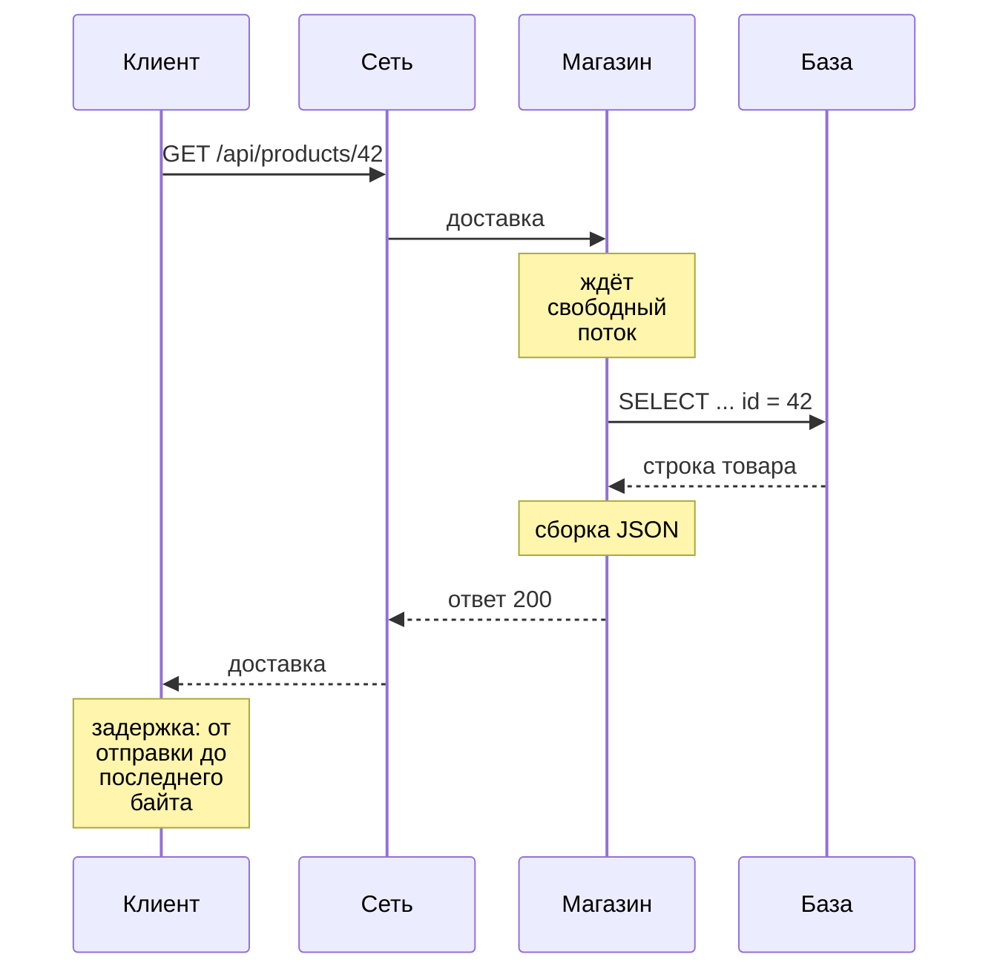
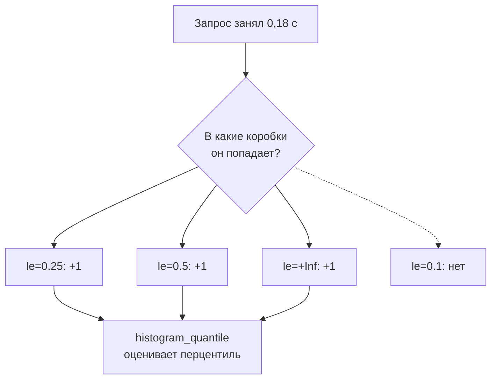
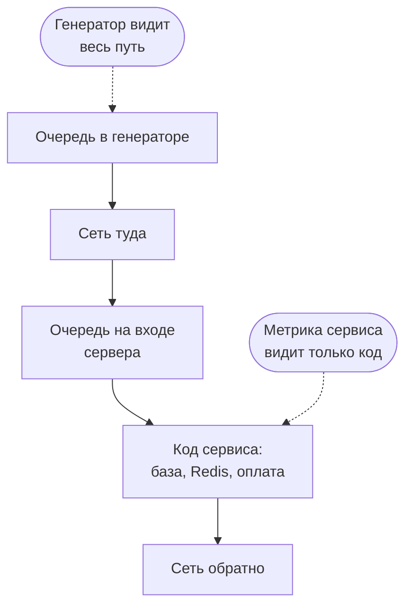

## Зачем это нужно

Представь первый день на работе нагрузочником. Руководитель спрашивает: «Магазин выдержит распродажу?» Ответить «вроде работает быстро» нельзя: это не число, его нельзя проверить, с ним нельзя спорить. Нагрузочное тестирование (load testing) это проверка, как сервис ведёт себя, когда к нему приходит много запросов одновременно, и весь его язык построен на трёх величинах: **сколько ждёт пользователь** (задержка), **сколько запросов сервис успевает обработать** (пропускная способность) и **какая доля запросов закончилась ошибкой**. Если ты путаешь эти величины или меряешь их неправильно, любой отчёт будет красивым и бесполезным.

Самая частая ошибка новичка: посчитать **среднее** время ответа, увидеть «80 мс, отлично» и пропустить, что каждый сотый покупатель ждёт 4 секунды и уходит. Чтобы такого не было, на работе говорят **перцентилями**: «p95 равно 300 мс» (95 запросов из 100 уложились в 300 мс), «p99 вырос в три раза». Этот урок объясняет, что это значит, как это посчитать руками и в Prometheus и почему среднее врёт.

Шаг проекта: ты пишешь свой мини-генератор нагрузки на Python (`~/perf-lab/08-theory/measure.py`), меряешь «Магазин» в спокойном состоянии и под растущей нагрузкой, сверяешь свои числа с Prometheus и записываешь **базовую линию** (baseline): числа «как сейчас», с которыми будешь сравнивать всё дальше. В следующих уроках темы из этих чисел вырастет методика испытаний «Магазина».

## Что нужно знать

- Терминал, `curl` и чтение HTTP-ответа: [урок 1.4](../01-linux/04-network-cli.md) и [урок 2.1](../02-web/01-client-server-http.md).
- Python: функции, циклы, списки, `requests` и виртуальное окружение `~/perf-lab/.venv`: [уроки темы 4](../04-python/index.md), особенно [4.5](../04-python/05-venv-requests.md).
- Стенд «Магазин»: как он поднимается, [урок 5.3](../05-docker/03-compose-shop.md); профиль мониторинга с Prometheus и Grafana, [урок 7.1](../07-observability/01-metrics-prometheus.md).
- PromQL: `rate`, `sum by`, `histogram_quantile` на уровне «запускал и видел график»: [урок 7.2](../07-observability/02-promql.md). Здесь мы наконец разберём, что именно считает `histogram_quantile`.

## Картина целиком

Представь кассу в магазине. **Задержка** это сколько времени конкретный покупатель простоял от входа в очередь до выхода с чеком. **Пропускная способность** это сколько покупателей касса пропускает за час. Это разные числа: касса может обслуживать 60 человек в час, и при этом каждый будет стоять 20 минут, если очередь длинная. А **перцентиль** отвечает на вопрос «сколько ждали почти все»: «95% покупателей простояли не дольше 4 минут».

С сервисом то же самое. Один запрос проходит путь, и на каждом участке тратится время:



Что здесь видно: задержка складывается из кусочков. Часть из них (ожидание в очереди, работа базы) растёт под нагрузкой, часть (сеть на одной машине) почти не меняется. Нагрузочник ищет, **какой кусок вырос**.

Три числа связаны между собой, и в этом уроке ты увидишь связь своими глазами:

- пока нагрузка небольшая, пропускная способность растёт вместе с нагрузкой, а задержка почти не меняется;
- у сервиса есть предел: дальше он не успевает, запросы встают в очередь, и задержка растёт резко, «клюшкой»;
- у предела первыми страдают **редкие медленные** запросы: p99 растёт раньше и сильнее, чем среднее.

## Теория

### Задержка: сколько ждёт один запрос

**Зачем это существует.** Пользователь не видит «загрузку процессора» или «число соединений с базой». Он видит одно: сколько секунд крутится колёсико после нажатия кнопки. Задержка (latency) это ровно это число, переведённое на язык сервиса, поэтому с неё начинается любой разговор о производительности.

**Аналогия.** Задержка как время доставки пиццы: от звонка до звонка в дверь. Внутри неё готовка, ожидание курьера, дорога. Клиенту всё равно, из чего она сложилась, ему важна сумма. Аналогия ломается в масштабе: пиццу ждут 40 минут, а запрос к сервису обычно миллисекунды. **Миллисекунда** (мс, ms) это тысячная доля секунды: 1 с = 1000 мс. Моргание глаза длится около 100–150 мс.

**Как это устроено.** Задержку меряют от момента, когда клиент отправил запрос, до момента, когда получил ответ целиком. Внутри неё (по шагам, в реальном порядке):

1. **DNS**: превратить имя сервера в IP-адрес ([урок 1.4](../01-linux/04-network-cli.md)). Для `localhost` почти 0.
2. **Установка TCP-соединения**: три служебных пакета «привет, привет, договорились». Если соединение уже открыто и переиспользуется (keep-alive), этого шага нет.
3. **TLS** для HTTPS: договориться о шифровании. У нашего стенда HTTP без шифрования, шага нет.
4. **Ожидание и обработка на сервере**: запрос ждёт свободный поток, потом код ходит в базу, в Redis, в оплату, собирает ответ.
5. **Передача ответа**: для маленького JSON доли миллисекунды.

Время до первого байта ответа называют **TTFB** (time to first byte): в нём шаги 1–4. Для API почти вся задержка сидит в шаге 4, и именно он растёт под нагрузкой.

<div class="viz" data-viz="request-path" data-net="1" data-app="4" data-db="6"></div>

Что здесь видно: конверт едет от тебя к базе и обратно, секундомер копит время, а цветная полоса внизу показывает, куда оно ушло. По умолчанию ответ приходит за 12 мс: сеть 2 мс туда и обратно, магазин думает 4 мс, база ищет 6 мс. Стенд стоит на твоём компьютере, поэтому сеть почти ничего не стоит. Подвинь ползунок «База ищет товар» и посмотри, как растёт её доля в полосе.

**Разобранный пример.** `curl` умеет показывать время каждого этапа. Флаг `-w` (write-out) печатает после запроса строку по шаблону, где `%{time_connect}` и подобные подставляются числами в секундах от начала запроса:

```bash
curl -s -o /dev/null \
  -w 'dns=%{time_namelookup} connect=%{time_connect} ttfb=%{time_starttransfer} total=%{time_total}\n' \
  http://localhost:8000/api/products/42
```

```text
dns=0.000021 connect=0.000187 ttfb=0.007912 total=0.007961
```

Читаем: имя `localhost` найдено за 0,02 мс, соединение открыто к 0,19 мс от старта, первый байт ответа пришёл на 7,9 мс, весь ответ на 7,96 мс. Значит, из ~8 мс почти всё (7,7 мс) это работа сервера. Все числа **накопительные**, от начала запроса, а не длительность отдельного этапа: это важно, иначе сложишь их и получишь чушь.

**Что путают.**

- «Задержка» и «время ответа» (response time) в работе обычно синонимы. Строгие авторы различают: задержка это ожидание до начала обработки, время ответа это всё целиком. Если в отчёте или на собеседовании важна точность, уточни, что именно меряли.
- Задержку, которую видит клиент, и задержку, которую меряет сам сервис. Это разные числа, к ним вернёмся в разделе «Где меряют».

> **Проверь понимание:** `curl -w` показал `connect=0.000200 ttfb=0.250000 total=0.251000`. Сколько времени сервер думал над ответом?

<details markdown="1">
<summary>Ответ</summary>

Примерно 250 мс: от открытия соединения (0,2 мс) до первого байта (250 мс). Передача ответа заняла ещё 1 мс (251 − 250). Числа накопительные, поэтому вычитаем соседние, а не складываем.

</details>

### Пропускная способность: сколько запросов успевает сервис

**Зачем это существует.** Задержка одного запроса ничего не говорит о том, выдержит ли сервис толпу. Сервис, который отвечает за 10 мс одному пользователю, может лечь от сотни. Пропускная способность (throughput) отвечает на вопрос «сколько работы сервис делает за единицу времени».

**Аналогия.** Трасса: задержка это сколько едет одна машина из точки А в точку Б, пропускная способность это сколько машин проезжает пункт оплаты за минуту. Расширь трассу с двух полос до четырёх: каждая машина не поедет быстрее, но машин в минуту пройдёт вдвое больше. Аналогия ломается тем, что у сервиса «полосы» (потоки, ядра процессора, соединения с базой) делят общие ресурсы и мешают друг другу.

**Как это устроено.** Пропускную способность меряют в **RPS** (requests per second, запросов в секунду). Ещё встречаются:

- **TPS** (transactions per second): «транзакций» в секунду. Транзакцией тут называют бизнес-действие, например «оформить заказ», которое может состоять из нескольких запросов. Всегда уточняй, что считали транзакцией.
- **Запросов в минуту** (RPM): то же, что RPS × 60, часто в бизнес-требованиях («5000 заказов в час»).

Важная разница: **нагрузка, которую подали** (offered load), и **пропускная способность, которую получили**. Если генератор шлёт 300 RPS, а сервис успевает 200, то 100 запросов в секунду копятся в очереди или падают с ошибкой. Пропускная способность не может быть больше, чем сервис физически успевает, сколько бы ты ни подавал.

**Разобранный пример.** Генератор за 60 секунд отправил 12 000 запросов, 11 940 вернулись с кодом 200, 60 с кодом 503 (сервис перегружен, не может ответить).

- Поданная нагрузка: 12 000 / 60 = 200 RPS.
- Успешная пропускная способность: 11 940 / 60 = 199 RPS.
- Доля ошибок (error rate): 60 / 12 000 = 0,5%.

Если в отчёте написано «сервис держит 200 RPS», а 0,5% запросов это ошибки, честнее написать «200 RPS при 0,5% ошибок». Без доли ошибок число RPS ничего не значит.

**Что путают.**

- RPS и **число пользователей**. 100 пользователей, каждый из которых думает 5 секунд между кликами, дают около 20 RPS, а не 100. Как пересчитывать одно в другое, разберём в [уроке 8.4](04-load-profile-slo.md).
- Пропускную способность (сколько сервис обрабатывает) и **полосу пропускания** сети (bandwidth, сколько мегабит в секунду пролезает по каналу). Англоязычные слова похожи, смысл разный.

> **Проверь понимание:** за 2 минуты сервис вернул 9 000 ответов 200 и 600 ответов 500. Посчитай RPS успешных и долю ошибок.

<details markdown="1">
<summary>Ответ</summary>

Всего 9 600 запросов за 120 с, это 80 RPS поданной нагрузки. Успешных 9 000 / 120 = 75 RPS. Доля ошибок 600 / 9 600 = 6,25%. Это очень много: обычная цель меньше 1%, а часто меньше 0,1%.

</details>

### Почему среднее врёт

**Зачем это существует.** Хочется описать тысячу измерений одним числом, и первое, что приходит в голову, это среднее. Но у задержек особое распределение: большинство запросов быстрые, а немногие очень медленные. Такие «хвосты» среднее прячет.

**Аналогия.** В бар заходит миллиардер, и средний доход посетителей становится миллионным, хотя ни у кого, кроме одного, денег не прибавилось. Среднее описывает «никого»: ни типичного посетителя, ни миллиардера. Задержки устроены так же: один запрос, застрявший на 4 секунды, задирает среднее, а типичный запрос по-прежнему быстрый.

**Как это устроено.** Среднее (mean, average) это сумма всех значений, делённая на их количество. Оно чувствительно к редким большим значениям, а у задержек почти всегда есть **длинный хвост** (long tail): редкие запросы в десятки раз медленнее обычных. Откуда хвост: запрос попал на сборку мусора (Python сам освобождает ненужную память, и пока он это делает, запросы могут ждать десятки миллисекунд), на медленный диск, на блокировку в базе, в очередь за соседним тяжёлым запросом. Таких событий мало, но они есть всегда.

**Разобранный пример.** Двадцать измерений задержки, уже отсортированные по возрастанию, в мс:

```text
12 13 13 14 14 15 15 15 16 16 17 17 18 19 20 22 25 31 48 410
```

Сумма 770 мс, среднее 770 / 20 = **38,5 мс**. А теперь посмотри: 18 запросов из 20 (90%) быстрее 38,5 мс. Среднее больше, чем у девяти запросов из десяти, и меньше, чем у двух. Оно не описывает ни быстрых, ни медленных. Весь «вес» ему дал один запрос на 410 мс.

**Что путают.** Думают, что среднее «примерно посередине». Посередине **медиана**, о ней следующий раздел. Ещё думают, что если среднее не изменилось, то ничего не изменилось. Пример: 99 запросов ускорились на 5 мс, а один замедлился на 500 мс. Среднее почти не сдвинулось, а у каждого сотого пользователя всё стало плохо.

> **Проверь понимание:** в выборке выше убери запрос на 410 мс. Каким станет среднее?

<details markdown="1">
<summary>Ответ</summary>

Сумма 770 − 410 = 360 мс, запросов 19, среднее 360 / 19 ≈ 18,9 мс. Один выброс увеличивал среднее вдвое.

</details>

### Перцентили: p50, p95, p99

**Зачем это существует.** Нужен способ сказать «почти все запросы быстрее X» и отдельно «а вот насколько плохо самым невезучим». Это и делают перцентили.

**Аналогия.** Рост учеников в классе: построй всех по росту. Медиана это рост ученика ровно посередине шеренги. 90-й перцентиль это рост того, кто стоит на 90% длины шеренги: ниже его 90% класса. Аналогия ломается в одном: в классе 30 человек, и «99-й перцентиль» там это просто самый высокий. Для перцентилей нужно много измерений.

**Как это устроено.** **Перцентиль** (percentile) p95 это значение, не больше которого 95% измерений. Говорят «пэ девяносто пять». Чтобы посчитать его **методом ближайшего ранга** (nearest rank):

1. Отсортируй все значения по возрастанию.
2. Посчитай ранг: `ранг = ⌈p / 100 × n⌉`, где `n` число значений, а `⌈ ⌉` округление вверх.
3. p-й перцентиль это значение на месте с этим рангом (места считаем с единицы).

Главные перцентили:

- **p50, медиана** (median): «типичный» запрос. Половина быстрее, половина медленнее.
- **p95**: «почти все». Медленнее только каждый двадцатый.
- **p99**: «хвост». Медленнее каждый сотый. Если на странице 30 запросов к API, то при плохом p99 каждый четвёртый показ страницы задевает хвост (вероятность 1 − 0,99³⁰ ≈ 26%), поэтому p99 важен, хотя «всего 1%».
- **max**: самый медленный запрос. Полезен, чтобы заметить зависания, но шумный: один случайный выброс.

**Разобранный пример.** Та же выборка из 20 значений:

```text
место:  1  2  3  4  5  6  7  8  9 10 11 12 13 14 15 16 17 18 19  20
мс:    12 13 13 14 14 15 15 15 16 16 17 17 18 19 20 22 25 31 48 410
```

- p50: ранг ⌈0,50 × 20⌉ = 10, значение на месте 10: **16 мс**.
- p90: ранг ⌈0,90 × 20⌉ = 18: **31 мс**.
- p95: ранг ⌈0,95 × 20⌉ = 19: **48 мс**.
- p99: ранг ⌈0,99 × 20⌉ = ⌈19,8⌉ = 20: **410 мс**, то есть максимум.

Сравни с средним 38,5 мс: оно между p90 и p95 и ничего не говорит ни о типичном запросе (16 мс), ни о хвосте (410 мс). А p99 на 20 измерениях совпал с максимумом, потому что «каждый сотый» среди двадцати ещё не появился. Правило на практике: для p99 нужны **хотя бы тысячи** измерений, для p95 сотни.

Посмотри на то же самое глазами. Здесь 100 запросов, часть из них тормозит:

<div class="viz" data-viz="percentiles" data-slow="5" data-slow-ms="1500"></div>

Что здесь видно: запросы появляются по порядку, потом выстраиваются по росту, и на них отмечены p50, p95 и p99 и линия среднего. По умолчанию тормозят 5 запросов из 100 по 1 500 мс: p50 около 45 мс, p95 около 80–90 мс, p99 около 1,5–1,8 с, среднее около 120 мс (сто запросов каждый раз новые, поэтому цифры слегка гуляют). Пока медленных мало, p50 и p95 почти не двигаются, а p99 сразу взлетает. Среднее оказывается «где-то между» и не совпадает ни с типичным запросом, ни с хвостом. Меняй число тормозящих и их длительность.

**Что путают.**

- **Перцентили нельзя усреднять и складывать.** p95 сервера А 100 мс и p95 сервера Б 300 мс не дают «p95 по обоим 200 мс». Правильный p95 по двум серверам считают по объединённым измерениям, а их уже нет. Поэтому Prometheus хранит не перцентили, а гистограммы, которые складывать можно (следующий раздел).
- «p99 = 2 с, значит, 99% запросов идут 2 с». Нет: 99% запросов идут **не дольше** 2 с, большинство гораздо быстрее.
- Процент и перцентиль. «95% запросов» это доля, «p95» это значение времени.

> **Проверь понимание:** в выборке 1000 измерений. На каком месте по возрастанию стоит p99 и сколько запросов медленнее него?

<details markdown="1">
<summary>Ответ</summary>

Ранг ⌈0,99 × 1000⌉ = 990: значение на 990-м месте. Медленнее него 10 запросов (с 991-го по 1000-й).

</details>

### Как Prometheus считает перцентили: гистограммы

**Зачем это существует.** «Магазин» обрабатывает тысячи запросов в минуту. Хранить время каждого запроса и сортировать при каждом обновлении графика слишком дорого. Нужен компактный способ, который ещё и складывается между копиями сервиса.

**Аналогия.** Вместо того чтобы записывать рост каждого призывника, военкомат раскладывает их по коробкам: «до 160 см», «до 170», «до 180», «до 190». Точный рост потерян, но сказать «90% ниже 180 см» можно, и коробки с двух военкоматов легко сложить. Аналогия ломается тем, что у Prometheus коробки **накопительные**: в коробке «до 170» лежат и все из «до 160».

**Как это устроено.** Метрика-гистограмма (histogram) `http_request_duration_seconds` из [урока 7.1](../07-observability/01-metrics-prometheus.md) это набор счётчиков:

- `http_request_duration_seconds_bucket{le="0.05"}`: сколько запросов заняли не больше 0,05 с. `le` значит less or equal, «меньше или равно». У «Магазина» границы 0.005, 0.01, 0.025, 0.05, 0.1, 0.25, 0.5, 1, 2.5, 5, 10 и `+Inf` (все запросы);
- `http_request_duration_seconds_sum`: сумма длительностей всех запросов;
- `http_request_duration_seconds_count`: число запросов.

Функция `histogram_quantile(0.95, ...)` находит коробку, где накопленная доля переходит через 95%, и **угадывает** значение внутри неё, считая, что запросы распределены в коробке равномерно (линейная интерполяция). Поэтому результат это **оценка**: точность не лучше ширины коробки. Если p95 попал в коробку от 0,25 до 0,5 с, Prometheus может сказать 0,4 с, когда на самом деле было 0,3.



Что здесь видно: каждый запрос увеличивает на единицу все коробки, граница которых не меньше его длительности. По этим счётчикам и восстанавливается картина распределения.

**Разобранный пример.** p95 задержки «Магазина» по каждому маршруту за последнюю минуту:

```promql
histogram_quantile(0.95,
  sum by (le, route) (rate(http_request_duration_seconds_bucket[1m]))
)
```

Читаем изнутри наружу: `rate(...[1m])` превращает накопительные счётчики в «сколько в секунду попадало в каждую коробку за минуту»; `sum by (le, route)` складывает коробки всех копий сервиса, сохраняя границу `le` (без неё функция не сможет работать) и маршрут; `histogram_quantile(0.95, ...)` оценивает p95 для каждого маршрута.

А среднее считается из суммы и количества:

```promql
sum by (route) (rate(http_request_duration_seconds_sum[1m]))
/
sum by (route) (rate(http_request_duration_seconds_count[1m]))
```

**Что путают.**

- Забывают `le` в `sum by`: результат пустой или `NaN`. `NaN` (not a number, «не число») появляется, когда за окно не было ни одного запроса или коробок нет.
- Считают, что `histogram_quantile` точен. Это оценка: внутри коробки функция рисует значение по прямой между границами. Если p99 попал в коробку от 0,5 до 1 с, график покажет, например, 0,8 с, даже если на деле все медленные запросы шли около 0,55 с. Точнее, чем ширина коробки, гистограмма не скажет.

> **Проверь понимание:** почему Prometheus хранит гистограмму, а не готовый p95 для каждой копии сервиса?

<details markdown="1">
<summary>Ответ</summary>

Готовые перцентили нельзя сложить или усреднить между копиями, а счётчики коробок можно: сложил коробки всех копий и посчитал p95 по общей картине. Плюс гистограмма это несколько чисел вместо тысяч измерений.

</details>

### Где меряют: у клиента и у сервера

**Зачем это существует.** Генератор нагрузки и Prometheus почти никогда не показывают одинаковые числа. Если не понимать почему, то при первом же расхождении начнёшь искать ошибку, которой нет, или пропустишь настоящую.

**Аналогия.** Время доставки пиццы по часам кухни (от «заказ принят» до «отдали курьеру») и по часам клиента (от звонка до звонка в дверь). Кухня честно отчитывается «12 минут», клиент честно ждал 45: в разницу попали очередь на телефоне, дорога и пробки.

**Как это устроено.** Метрики «Магазина» меряет промежуточный слой (middleware) внутри приложения: секундомер запускается, когда запрос уже принят сервером и дошёл до кода, и останавливается, когда ответ отдан. Генератор меряет от отправки до получения. Разница:



Что здесь видно: метрика сервиса это только один кусок пути (блок «Код сервиса»), а генератор видит весь путь сверху вниз. Когда сервер перегружен, запросы копятся в очереди **до** кода, и сервер этого ожидания не видит: его метрика может показывать «всё нормально», пока клиенты ждут секунды. Поэтому под нагрузкой всегда смотрят оба источника.

**Разобранный пример.** Генератор говорит p95 = 900 мс, Grafana по `histogram_quantile` показывает p95 = 120 мс для того же маршрута за то же время. Вычитать перцентили друг из друга нельзя (p95 у клиента и у сервера могут относиться к разным запросам), но разрыв в разы точно не объясняется ни погрешностью коробок, ни кодом: значительная часть времени тратится **до** того, как сервер начал считать запрос (очередь соединений, занятые потоки), или в самом генераторе (ему не хватило процессора). Следующий шаг: проверить загрузку процессора машины генератора и число запросов в работе `http_requests_in_progress`.

**Что путают.** Считают генератор «истиной», а метрики сервера «враньём» или наоборот. Оба правы про свой кусок. Ещё забывают, что генератор, запущенный на той же машине, что и сервис, отнимает у него процессор: на учебном стенде с этим приходится жить, но в отчёте об этом пишут.

> **Проверь понимание:** метрики «Магазина» показывают p95 = 50 мс, а пользователи жалуются на 3 секунды. Назови два места, где могло потеряться время.

<details markdown="1">
<summary>Ответ</summary>

Очередь на входе сервера до начала обработки (сервер её не меряет) и путь по сети или через промежуточные узлы (балансировщик, прокси). На учебном стенде ещё сам генератор, если ему не хватает процессора.

</details>

### Связь задержки и нагрузки: «хоккейная клюшка»

**Зачем это существует.** Главный вопрос нагрузочного тестирования «сколько выдержит» не про одну задержку и не про одну пропускную способность, а про то, как они меняются вместе. Форма этой связи почти у всех сервисов одинаковая, и её надо узнавать с первого взгляда.

**Аналогия.** Кафе с одним бариста, который делает кофе за минуту. Пока приходит человек раз в три минуты, ждать почти не приходится. Когда приходят раз в полторы минуты, иногда двое приходят подряд, и второй ждёт. Когда раз в 1,1 минуты, очередь почти не рассасывается, и каждый новый ждёт всё дольше. При «раз в минуту» и чаще очередь растёт без конца.

**Как это устроено.** Пока нагрузка далеко от предела (ёмкости, capacity), у сервиса есть свободные ресурсы, и запрос обрабатывается сразу. Задержка почти равна чистому времени работы. По мере приближения к пределу всё чаще запрос приходит, когда ресурсы заняты, и встаёт в очередь. Ожидание в очереди растёт не равномерно, а резко: при загрузке 50% очередь маленькая, при 90% уже заметная, при 95% огромная. На графике «нагрузка → задержка» получается пологая ручка и резко загнутый вверх крюк: **хоккейная клюшка**.

<div class="viz" data-viz="hockey-stick" data-capacity="200" data-base="20" data-load="60" data-unit="RPS"></div>

Что здесь видно: точка на кривой это текущая нагрузка. Сейчас ползунок стоит на 60 RPS из 200 (30% предела): запрос идёт 28,6 мс, из них 20 мс работы и 8,6 мс ожидания. В зелёной зоне (до 70% предела) кривая почти плоская, в жёлтой (70–90%) каждый шаг нагрузки добавляет всё больше задержки, а в красной (за 90%) она уходит вверх. Подвигай нагрузку к пределу и смотри на запас до него в рамке под ползунком.

Почему кривая такая и как её посчитать, разберём через очереди и закон Литтла в [уроке 8.2](02-queues-littles-law.md). Сейчас запомни следствие: **не держи сервис у предела**. В работе целятся в загрузку 60–70% от проверенного максимума, чтобы случайный всплеск не загнал всех в очередь.

**Разобранный пример.** У «Магазина» есть дорогой маршрут `POST /api/login`: пароль проверяется алгоритмом bcrypt, который специально сделан медленным (чтобы украденную базу паролей было долго перебирать). Один логин занимает у процессора около 0,2–0,3 с. Сервису выдан один процессор (`cpus: "1.0"` в `compose.yaml`), значит, предел около 1 / 0,25 = **4 логина в секунду**. При 2 логинах в секунду задержка около 0,25–0,3 с, при 3,5 уже заметно больше, при 5 очередь растёт бесконечно, и задержка увеличивается каждую секунду теста. Ниже ты это проверишь руками.

**Что путают.** Думают, что «сервис держит 4 RPS» значит «при 4 RPS всё хорошо». На пределе очередь нестабильна: задержки огромные и скачут. «Держит» в отчёте пишут для нагрузки, при которой задержка ещё укладывается в цель, это всегда меньше предела.

> **Проверь понимание:** сервис обрабатывает запрос за 10 мс на одном ядре, ядер 2. Примерно какой у него предел RPS и при какой нагрузке ты бы назвал его «безопасной»?

<details markdown="1">
<summary>Ответ</summary>

Одно ядро успевает 1 / 0,01 = 100 запросов в секунду, два ядра около 200 RPS. Безопасная нагрузка около 60–70% предела, то есть 120–140 RPS. Это оценка: реальный предел покажет тест.

</details>

### Ошибки: третье число

**Зачем это существует.** Без доли ошибок задержка и пропускная способность могут врать в лучшую сторону.

**Как это устроено.** Перегруженный сервис часто отвечает **быстрыми ошибками**: «503, занят» за 2 мс. Такие ответы попадают в статистику, тянут среднее и перцентили вниз и увеличивают RPS. На графике всё выглядит лучше, чем было до перегрузки, а пользователь получает ошибку. Поэтому:

- задержку считают **отдельно для успешных** и для ошибочных ответов, или хотя бы смотрят долю ошибок рядом;
- цель формулируют тройкой: «200 RPS, p95 < 300 мс, ошибок < 1%» (подробно в [уроке 8.4](04-load-profile-slo.md)).

**Разобранный пример.** До перегрузки: 150 RPS, p95 = 180 мс, ошибок 0%. Под перегрузкой: 260 RPS, p95 = 40 мс, ошибок 45%. Если смотреть только на RPS и p95, сервис «стал лучше». На деле почти половина запросов теперь ошибки за 2 мс.

**Что путают.** Считают ошибкой только код 5xx. Таймаут на стороне клиента (клиент не дождался и оборвал запрос) сервер вообще может не увидеть, а пользователь его видит. Генератор нагрузки должен считать таймауты ошибками.

## Практика

Все файлы урока складывай в `~/perf-lab/08-theory/`. Нагрузку даём только на свой стенд на своей машине: нагружать чужие сайты нельзя, даже «чуть-чуть», для их владельцев это неотличимо от атаки.

### 1. Подними стенд и проверь, что он живой

```bash
cd ~/load-tester/project/shop
docker compose --profile monitoring up -d --wait
curl -s localhost:8000/readyz
```

```text
{"status":"ready"}
```

Если `--wait` закончился ошибкой или ответ не `ready`, посмотри [урок 5.3](../05-docker/03-compose-shop.md), раздел «Типичные ошибки». Стенд должен работать с настройками по умолчанию из `.env.example`: если ты менял `.env` в прошлых уроках, верни его командой `cp .env.example .env` и перезапусти `docker compose up -d`.

### 2. Разложи задержку по этапам

Сделай файл с шаблоном для `curl`, чтобы не набирать длинную строку каждый раз:

```bash
mkdir -p ~/perf-lab/08-theory && cd ~/perf-lab/08-theory
cat > curl-time.txt <<'EOF'
dns=%{time_namelookup} connect=%{time_connect} ttfb=%{time_starttransfer} total=%{time_total} code=%{http_code}\n
EOF
```

`cat > файл <<'EOF' ... EOF` записывает строки между маркерами в файл, кавычки вокруг `EOF` запрещают оболочке подставлять что-либо внутри ([урок 1.5](../01-linux/05-bash-scripts.md)). `curl -w @файл` берёт шаблон из файла.

```bash
for i in 1 2 3 4 5; do curl -s -o /dev/null -w @curl-time.txt localhost:8000/api/products/$i; done
curl -s -o /dev/null -w @curl-time.txt -H 'Content-Type: application/json' \
  -d '{"email":"user0001@shop.lab","password":"password"}' localhost:8000/api/login
```

```text
dns=0.000019 connect=0.000165 ttfb=0.009871 total=0.009922 code=200
dns=0.000017 connect=0.000151 ttfb=0.004102 total=0.004140 code=200
...
dns=0.000018 connect=0.000160 ttfb=0.243511 total=0.243570 code=200
```

**Как читать вывод:** у карточки товара почти всё время это `ttfb`: сервер сходил в базу и собрал JSON, несколько миллисекунд. Первый запрос часто медленнее остальных: прогреваются кэши базы и соединения. У логина `ttfb` в десятки раз больше: это bcrypt. `dns` и `connect` на одной машине доли миллисекунды, их можно не учитывать. Числа у тебя будут свои: они зависят от процессора.

**Типичные ошибки:**

- `code=000` и нули везде: сервис не отвечает. Проверь `docker compose ps` в каталоге стенда.
- `code=422` у логина: ошибка в JSON (лишняя кавычка или пробел в адресе). Сравни символ в символ.

### 3. Мини-генератор нагрузки

Задача: отправить много запросов, собрать задержку каждого и посчитать среднее, p50, p95, p99 и пропускную способность. Потоки (threads) позволяют одной программе делать несколько дел одновременно: каждый поток здесь изображает одного пользователя, который шлёт запросы подряд без пауз. `ThreadPoolExecutor` из стандартной библиотеки запускает функцию в нескольких потоках и собирает результаты, `time.perf_counter()` это точный секундомер для замера коротких интервалов.

```bash
cd ~/perf-lab && source .venv/bin/activate
```

Создай `~/perf-lab/08-theory/measure.py`:

```python
"""Мини-генератор нагрузки: несколько потоков шлют запросы и меряют задержку.

Запуск:  python measure.py catalog 1 300     # 1 поток, 300 запросов карточки товара
         python measure.py login 4 40        # 4 потока, 40 логинов
"""
import math
import random
import sys
import time
from concurrent.futures import ThreadPoolExecutor

import requests

BASE = "http://localhost:8000"


def one_request(session, mode):
    """Делает один запрос и возвращает (длительность в секундах, код ответа)."""
    start = time.perf_counter()
    try:
        if mode == "catalog":
            product_id = random.randint(1, 10000)
            response = session.get(f"{BASE}/api/products/{product_id}", timeout=30)
        else:
            n = random.randint(1, 1000)
            body = {"email": f"user{n:04d}@shop.lab", "password": "password"}
            response = session.post(f"{BASE}/api/login", json=body, timeout=30)
        code = response.status_code
    except requests.RequestException:
        code = 0  # таймаут или обрыв соединения: тоже ошибка, и её время тоже считаем
    return time.perf_counter() - start, code


def user(mode, count):
    """Один «пользователь»: count запросов подряд, своё соединение (Session)."""
    session = requests.Session()
    return [one_request(session, mode) for _ in range(count)]


def percentile(sorted_values, p):
    """Перцентиль методом ближайшего ранга: значение, не больше которого p% выборки."""
    rank = math.ceil(p / 100 * len(sorted_values))
    return sorted_values[max(rank, 1) - 1]


def main():
    mode, users, total = sys.argv[1], int(sys.argv[2]), int(sys.argv[3])
    started = time.perf_counter()
    # делим запросы между потоками поровну, остаток отдаём первым потокам
    counts = [total // users + (1 if i < total % users else 0) for i in range(users)]
    with ThreadPoolExecutor(max_workers=users) as pool:
        futures = [pool.submit(user, mode, count) for count in counts]
        results = [item for f in futures for item in f.result()]
    elapsed = time.perf_counter() - started

    ms = sorted(seconds * 1000 for seconds, _ in results)
    errors = sum(1 for _, code in results if code == 0 or code >= 400)
    print(f"{mode}: потоков={users} запросов={len(ms)} за {elapsed:.1f} с, "
          f"{len(ms) / elapsed:.1f} RPS, ошибок {errors}")
    print(f"  среднее={sum(ms) / len(ms):.0f} мс  p50={percentile(ms, 50):.0f}  "
          f"p95={percentile(ms, 95):.0f}  p99={percentile(ms, 99):.0f}  max={ms[-1]:.0f}")


if __name__ == "__main__":
    main()
```

Разбор того, что новое:

- `sys.argv` это список слов командной строки: `sys.argv[0]` имя скрипта, дальше аргументы. `int(...)` превращает текст `"300"` в число.
- `requests.Session()` держит соединение открытым между запросами (keep-alive), как это делает браузер. Без него каждый запрос заново открывал бы TCP-соединение.
- `counts` делит запросы между потоками: `//` это деление нацело, `%` остаток от деления. Для `301` запроса на 4 потока получится `[76, 75, 75, 75]`.
- `pool.submit(user, mode, count)` запускает функцию `user` в отдельном потоке и сразу возвращает «квитанцию» (future), по которой потом забирают результат через `f.result()`.
- Секундомер запускается до `try`, поэтому в задержку попадает и время до таймаута: ошибки не «ускоряют» статистику.

Запусти один поток, затем сравни среднее и перцентили:

```bash
cd ~/perf-lab/08-theory
python measure.py catalog 1 300
```

```text
catalog: потоков=1 запросов=300 за 1.6 с, 187.2 RPS, ошибок 0
  среднее=5 мс  p50=4  p95=8  p99=19  max=41
```

**Как читать вывод:** первая строка про пропускную способность: 300 запросов одним потоком за 1,6 с, около 190 RPS. С одним потоком RPS это просто 1000 / среднее: поток не начинает новый запрос, пока не закончил старый. Вторая строка про задержку: типичный запрос (p50) 4 мс, но p99 в 4–5 раз больше, а максимум ещё больше. Это и есть хвост. Твои числа будут другими, важна форма: p99 заметно больше p50, а среднее чуть выше медианы.

**Типичные ошибки:**

- `ModuleNotFoundError: No module named 'requests'`: не активировано окружение. `source ~/perf-lab/.venv/bin/activate`.
- `IndexError: list index out of range` на `sys.argv[1]`: забыл аргументы. Нужно три: режим, потоки, запросов. Запросов должно быть не меньше, чем потоков.
- Скрипт висит, а потом все запросы с ошибками и `max` около 30000: сервис не отвечает, каждый запрос ждал таймаут 30 с. Останови скрипт `Ctrl+C`. Потоки доделывают начатые запросы, поэтому если выход не случился за пару секунд, нажми `Ctrl+\`: это принудительное завершение. Потом проверь стенд.

> Твоё среднее и p95 не сходятся с цифрами Prometheus? Скопируй свои числа и запрос, спроси нейросеть, какие причины бывают у расхождения. Проверь по таблице из урока, а формулу перцентиля пересчитай на маленьком списке вручную.
{: .ai}

### 4. Сверь свои числа с Prometheus

Открой Prometheus `http://localhost:9090` (или Explore в Grafana `http://localhost:3000`) и сразу после запуска выполни:

```promql
histogram_quantile(0.95,
  sum by (le, route) (rate(http_request_duration_seconds_bucket{route="/api/products/{id}"}[1m]))
)
```

Затем поменяй `0.95` на `0.5` и `0.99`. Сравни с выводом `measure.py`.

**Как читать вывод:** значения Prometheus будут в секундах (0.0045 это 4,5 мс) и не совпадут с твоими точно. Причин три, и все из теории: Prometheus интерполирует внутри коробок (у коробки `le="0.005"` ширина 5 мс, у `le="0.025"` уже 15 мс), считает только время внутри сервиса (без клиента и очереди на входе) и усредняет по окну в минуту, куда могли попасть и другие запросы. Расхождение в пределах ширины коробки это норма.

**Типичные ошибки:** пустой результат значит, что за последнюю минуту запросов не было (запусти скрипт ещё раз) или опечатка в `route`. Посмотри точные значения меткой: `count by (route) (http_requests_total)`.

### 5. Найди предел: логин под растущей нагрузкой

Теперь самое интересное. Логин нагружает процессор, а процессор у «Магазина» один. Запусти серию с 1, 2, 4 и 8 потоками:

```bash
for users in 1 2 4 8; do python measure.py login $users $((users * 10)); done
```

`$((users * 10))` это арифметика в bash: 10 запросов на каждый поток, чтобы тест не тянулся долго.

```text
login: потоков=1 запросов=10 за 2.6 с, 3.8 RPS, ошибок 0
  среднее=262 мс  p50=258  p95=301  p99=301  max=301
login: потоков=2 запросов=20 за 5.1 с, 3.9 RPS, ошибок 0
  среднее=508 мс  p50=505  p95=560  p99=560  max=560
login: потоков=4 запросов=40 за 10.2 с, 3.9 RPS, ошибок 0
  среднее=1012 мс  p50=1010  p95=1104  p99=1104  max=1104
login: потоков=8 запросов=80 за 20.5 с, 3.9 RPS, ошибок 0
  среднее=2031 мс  p50=2025  p95=2180  p99=2180  max=2180
```

**Как читать вывод:** пропускная способность упёрлась в предел с самого начала, около 4 логинов в секунду, и больше не растёт, сколько потоков ни добавляй. Зато задержка растёт ровно пропорционально числу потоков: вдвое больше желающих, вдвое дольше ждать. Это насыщение (saturation): ресурс (процессор) занят на 100%, лишние запросы стоят в очереди. Обрати внимание: p99 здесь равен максимуму, потому что запросов всего десятки. Предел у тебя может быть 3 или 6 RPS, в зависимости от процессора: важна форма.

Вот как это выглядит на графике (числа из вывода выше):

<div class="viz" data-viz="chart" data-type="line" data-x="1,2,4,8" data-x-label="Потоков (одновременных пользователей)" data-y-label="RPS / секунды" data-explain="Пропускная способность не растёт с числом потоков, а задержка растёт прямо пропорционально." data-series='[{"name":"Пропускная способность, RPS","values":[3.8,3.9,3.9,3.9]},{"name":"Задержка p50, с","values":[0.26,0.51,1.01,2.03]}]'></div>

Что здесь видно: линия пропускной способности горизонтальная, линия задержки растёт прямо. Наведи на точку, чтобы увидеть значения, а клик по легенде скрывает линию. Как только ресурс занят полностью, дополнительная нагрузка превращается только в ожидание.

Посмотри это в Grafana на дашборде «Магазин: обзор (эталон)»: панель CPU контейнера `shop` во время серии держится у 100% от выданного одного ядра, а p95 маршрута `/api/login` растёт ступеньками.

**Типичные ошибки:** если пропускная способность растёт до 8 потоков почти линейно, значит, у сервиса больше одного процессора. Проверь `docker compose config | grep -A2 cpus` и что ты не менял лимиты в [уроке 5.4](../05-docker/04-limits-stats.md).

### 6. Запиши базовую линию

Создай `~/perf-lab/08-theory/baseline.md` и перенеси туда свои числа:

```markdown
# Базовая линия «Магазина», настройки по умолчанию

Дата: ...  Машина: ... (процессор, ядер, память)  Генератор: measure.py на той же машине

| Маршрут | Потоков | RPS | p50, мс | p95, мс | p99, мс | Ошибок |
|---|---|---|---|---|---|---|
| GET /api/products/{id} | 1 | | | | | |
| POST /api/login | 1 | | | | | |
| POST /api/login | 8 | | | | | |

Предел логина: около ... RPS. Узкое место: процессор (bcrypt), один процессор у контейнера.
```

Закоммить и отправь:

```bash
cd ~/perf-lab && git add 08-theory && git commit -m "8.1: мини-генератор и базовая линия" && git push
```

Строки «Машина» и «Генератор» обязательны в любом отчёте: числа без условий измерения нельзя сравнить ни с чем.

## Сломай и почини

**Поломка.** Медленная оплата. Заглушка оплаты умеет менять задержку на лету: попроси её отвечать за 2 секунды вместо 50 мс.

```bash
curl -s -X POST localhost:8001/admin/config -H 'Content-Type: application/json' -d '{"delay_ms": 2000}'
```

Теперь сделай немного покупок. Скрипт `buy.py` логинится, кладёт товар в корзину и оформляет заказ, 20 раз подряд:

```python
"""20 покупок подряд: корзина + заказ. Задержку заказа печатаем сразу."""
import time

import requests

BASE = "http://localhost:8000"
session = requests.Session()
login = session.post(f"{BASE}/api/login",
                     json={"email": "user0002@shop.lab", "password": "password"}, timeout=30)
login.raise_for_status()
session.headers["Authorization"] = f"Bearer {login.json()['token']}"

for i in range(20):
    cart = session.post(f"{BASE}/api/cart/items", json={"product_id": 100 + i, "qty": 1}, timeout=30)
    cart.raise_for_status()  # корзина не заполнилась: дальше мерить нечего, падаем с ошибкой
    start = time.perf_counter()
    order = session.post(f"{BASE}/api/orders", timeout=30)
    print(f"заказ {i + 1}: код {order.status_code}, {(time.perf_counter() - start) * 1000:.0f} мс")
```

В соседнем терминале одновременно запусти фон, как от обычных покупателей, которые смотрят каталог:

```bash
python measure.py catalog 2 6000
```

**Задача.** Ты видишь только графики, как дежурный, которому позвонили «заказы тормозят». Найди виновника по метрикам, не глядя на то, что ты сломал. Порядок рассуждения:

<div class="viz" data-viz="flow" data-steps='[{"title":"Найди медленный маршрут","text":"p95 по `route`: какой выбивается."},{"title":"Среднее или хвост","text":"Сравни среднее и p95 этого маршрута за одно и то же время: тормозит всё или только хвост."},{"title":"Занят или ждёт","text":"Сервис занят сам (CPU) или чего-то ждёт?"},{"title":"Чего ждёт","text":"Базы, пула соединений или оплаты?"},{"title":"Проверь гипотезу","text":"Посмотри метрику той зависимости, которую подозреваешь."},{"title":"Почини и сверь","text":"Убедись по тем же графикам, что стало лучше."}]'></div>

Подсказки по шагам в PromQL:

```promql
# 1. p95 по маршрутам: какой выбивается
histogram_quantile(0.95, sum by (le, route) (rate(http_request_duration_seconds_bucket[1m])))

# 2. среднее по каждому маршруту: сравни со своим p95 из шага 1
sum by (route) (rate(http_request_duration_seconds_sum[1m])) / sum by (route) (rate(http_request_duration_seconds_count[1m]))

# 4. сколько ждёт оплата
histogram_quantile(0.95, sum by (le) (rate(shop_payment_duration_seconds_bucket[1m])))
```

<details markdown="1">
<summary>Разбор</summary>

1. p95 маршрута `/api/orders` около 2 с, остальные маршруты в норме.
2. Среднее по всем запросам почти не изменилось: заказов мало на фоне тысяч запросов каталога. Если бы дежурный смотрел только на среднее, он бы ничего не увидел. Это та самая ловушка из теории.
3. CPU `shop` не у предела: сервис не считает, а ждёт.
4. p95 `shop_payment_duration_seconds` около 2 с, и он почти совпадает с задержкой заказа. Время заказа целиком уходит на оплату.
5. Гипотеза подтверждена: медленная внешняя зависимость.

Почини:

```bash
curl -s -X POST localhost:8001/admin/config -H 'Content-Type: application/json' -d '{"delay_ms": 50}'
```

Запусти `buy.py` ещё раз: заказы снова быстрые, и через минуту p95 `/api/orders` на графике вернётся вниз. В реальной работе починить оплату ты не можешь, это чужой сервис, но ты принёс доказательство: график p95 заказа рядом с графиком оплаты. С таким графиком идут к команде оплаты. Как одна медленная зависимость может положить весь «Магазин», а не только заказы, узнаешь в [уроке 11.5](../11-bottlenecks/05-cache-dependencies.md).

</details>

## ИИ в помощь

Нейросеть хорошо объясняет разницу между средним и перцентилем на числах, но формулы пропускной способности и перцентилей она нередко приводит с ошибками. Общие правила: [ИИ-помощник](../ai.md).

**Задача:** понять, почему среднее скрывает проблему.

```text
Я измерил 100 запросов: 95 по 20 мс и 5 по 2000 мс. Посчитай среднее, p50, p95 и p99
и покажи вычисления шаг за шагом. Объясни простыми словами, какое число покажет проблему
и почему среднее её прячет. Как перцентиль считается по отсортированному списку?
```
{: .wrap}

**Проверь ответ:** посчитай сам: среднее около 118 мс, p50 равен 20 мс, p95 по методу «95-й элемент списка» равен 20 мс, а p99 равен 2000 мс. Если с нейросетью получились разные p95, спроси, каким методом она выбирала элемент списка. Типичная ошибка: смешивать p95 как «95-й элемент» и «значение, ниже которого 95% запросов» без пояснения метода. Запусти свой мини-генератор из практики и сравни.

**Задача:** разобрать расхождение в измерениях.

```text
Мой генератор показал p95 = <число> мс, а Prometheus по histogram_quantile(0.95, ...) показал <число> мс
для того же интервала. Какие причины расхождения бывают (бакеты гистограммы, окно, точка измерения:
клиент или сервер, ожидание в очереди)? Как проверить каждую?
```
{: .wrap}

**Проверь ответ:** проверь каждую причину на своих данных. Типичная ошибка: нейросеть перечисляет причины общим списком и не говорит, что `histogram_quantile` даёт оценку внутри бакета, а не точное число.

## Словарик урока

| Термин | Простыми словами |
|---|---|
| Задержка (latency) | Сколько ждёт один запрос: от отправки до получения ответа |
| Время ответа (response time) | Обычно синоним задержки; строго: всё время целиком, вместе с ожиданием |
| TTFB (time to first byte) | Время до первого байта ответа: в него входит работа сервера |
| Пропускная способность (throughput) | Сколько запросов сервис обрабатывает за секунду |
| RPS, TPS | Запросов в секунду; бизнес-транзакций в секунду |
| Поданная нагрузка (offered load) | Сколько запросов в секунду шлёт генератор, независимо от того, успевает ли сервис |
| Доля ошибок (error rate) | Ошибочные ответы (и таймауты) делить на все запросы |
| Среднее (mean) | Сумма, делённая на количество; прячет хвост |
| Медиана, p50 (median) | Значение посередине: половина быстрее, половина медленнее |
| Перцентиль, p95, p99 (percentile) | Значение, не больше которого 95% (99%) измерений |
| Длинный хвост (long tail) | Редкие запросы, которые в разы медленнее обычных |
| Гистограмма (histogram) | Счётчики «сколько попало в каждую коробку по времени»; так Prometheus хранит задержки |
| Ёмкость, предел (capacity) | Максимальная пропускная способность, дальше растёт только очередь |
| Насыщение (saturation) | Ресурс занят полностью, лишние запросы ждут |
| Базовая линия (baseline) | Числа «как сейчас», с которыми сравнивают всё дальше |

## Вопросы с собеседований

Раздел для повторения: ответь вслух, потом открой ответ. Короткие вопросы тренируй на скорость: ответ за 30 секунд.

### 1. [junior] [часто] Чем задержка отличается от пропускной способности?

<details markdown="1">
<summary>Ответ</summary>

Задержка это сколько ждёт один запрос, меряется в миллисекундах. Пропускная способность это сколько запросов сервис обрабатывает за единицу времени, меряется в RPS. Они связаны, но независимы: можно обрабатывать много запросов и при этом долго, если запросов в работе много одновременно. Под нагрузкой у предела пропускная способность перестаёт расти, а задержка растёт резко.

**Что хотят услышать:** две разные величины, единицы измерения, как они ведут себя у предела.

**Красный флаг:** «пропускная способность это скорость ответа».

</details>

### 2. [junior] [часто] Почему в нагрузочном тестировании смотрят перцентили, а не среднее?

<details markdown="1">
<summary>Ответ</summary>

У задержек длинный хвост: большинство запросов быстрые, а редкие очень медленные. Среднее этот хвост прячет: оно может не измениться, когда каждый сотый запрос стал в десять раз медленнее. Перцентили показывают и типичный запрос (p50), и почти всех (p95), и хвост (p99). Плюс среднее описывает «никого»: оно бывает больше, чем у 90% запросов.

**Что хотят услышать:** длинный хвост, пример с выбросом, что такое p95 и p99.

**Красный флаг:** «среднее достаточно, если запросов много».

</details>

### 3. [junior] [часто] Что значит «p95 = 300 мс»?

<details markdown="1">
<summary>Ответ</summary>

95% запросов выполнились не дольше 300 мс, а 5% (каждый двадцатый) дольше. Это не значит, что запросы идут 300 мс: большинство гораздо быстрее.

**Что хотят услышать:** «не дольше», доля медленнее, что такое не среднее.

**Красный флаг:** «95% запросов идут 300 мс».

</details>

### 4. [junior] Как посчитать p90 по десяти измерениям руками?

<details markdown="1">
<summary>Ответ</summary>

Отсортировать по возрастанию, ранг ⌈0,9 × 10⌉ = 9, взять значение на девятом месте. Сразу оговориться, что на десяти измерениях перцентиль очень неточен: одно измерение меняет результат.

**Что хотят услышать:** сортировка, ранг, оговорка о малой выборке.

**Красный флаг:** считать перцентиль как «90% от среднего» или «90% от максимума».

</details>

### 5. [junior] Можно ли усреднить p95 двух серверов, чтобы получить общий p95?

<details markdown="1">
<summary>Ответ</summary>

Нет. Перцентили не складываются и не усредняются: общий p95 считают по объединённым измерениям. Поэтому Prometheus хранит гистограмму (счётчики по коробкам), коробки двух серверов можно сложить и уже по сумме посчитать `histogram_quantile`.

**Что хотят услышать:** «нельзя», почему, решение через гистограммы и `sum by (le)`.

**Красный флаг:** «да, если нагрузка одинаковая».

</details>

### 6. [junior] Что такое RPS и чем 100 RPS отличаются от 100 пользователей?

<details markdown="1">
<summary>Ответ</summary>

RPS это запросов в секунду. Пользователь не шлёт запросы непрерывно: он читает страницу, думает. 100 пользователей, которые делают запрос раз в 5 секунд, дают около 20 RPS. Поэтому в требованиях всегда уточняют, о чём речь, и пересчитывают одно в другое через время на действие и паузу.

**Что хотят услышать:** пользователи и запросы не одно и то же, есть «время на раздумье».

**Красный флаг:** «100 пользователей это 100 RPS».

</details>

### 7. [junior] Из чего складывается время ответа, которое видит клиент?

<details markdown="1">
<summary>Ответ</summary>

DNS, установка TCP-соединения, TLS для HTTPS, ожидание в очереди на сервере, обработка (код, база, кэш, внешние сервисы), передача ответа. Время до первого байта (TTFB) включает всё, кроме передачи. Для API под нагрузкой обычно растут очередь и обработка.

**Что хотят услышать:** этапы по порядку, что растёт под нагрузкой, как посмотреть (`curl -w`).

**Красный флаг:** «время работы кода, остальное неважно».

</details>

### 8. [junior] Как меняется задержка, когда нагрузка подходит к пределу сервиса?

<details markdown="1">
<summary>Ответ</summary>

Сначала почти не меняется, потом резко растёт: запросы всё чаще встают в очередь, и ожидание растёт нелинейно («хоккейная клюшка»). Пропускная способность при этом перестаёт расти. Поэтому сервис не держат у предела, целятся в 60–70% проверенного максимума.

**Что хотят услышать:** нелинейность, очередь, насыщение ресурса, запас.

**Красный флаг:** «задержка растёт пропорционально нагрузке всегда».

</details>

### 9. [middle] Генератор показывает p95 = 900 мс, а Grafana p95 = 120 мс для того же маршрута. Почему?

<details markdown="1">
<summary>Ответ</summary>

Меряют разное. Метрика сервиса считает время внутри кода, а генератор ещё и очередь на входе сервера, сеть и собственные задержки (если генератору не хватает процессора, он сам опаздывает). Плюс `histogram_quantile` это оценка по коробкам гистограммы, она может отличаться на ширину коробки. Большой разрыв под нагрузкой обычно значит очередь до сервера или перегруженный генератор: смотрю процессор генератора и `http_requests_in_progress`.

**Что хотят услышать:** где ставится секундомер, очередь до кода, точность гистограмм, как проверить.

**Красный флаг:** «одна из систем врёт, надо выбрать правильную».

</details>

### 10. [middle] Под нагрузкой p95 упал, а RPS вырос. Это хорошо?

<details markdown="1">
<summary>Ответ</summary>

Не обязательно. Первым делом смотрю долю ошибок: перегруженный сервис часто отвечает быстрыми ошибками (503 за пару миллисекунд), они уменьшают задержку и увеличивают RPS. Задержку надо смотреть отдельно для успешных ответов и всегда рядом с долей ошибок.

**Что хотят услышать:** быстрые ошибки, тройка RPS + задержка + ошибки.

**Красный флаг:** «да, сервис стал быстрее».

</details>

### 11. [middle] Сколько измерений нужно, чтобы p99 что-то значил?

<details markdown="1">
<summary>Ответ</summary>

Хотя бы тысячи. На 100 измерениях p99 это одно значение, практически максимум, и он скачет от запуска к запуску. Поэтому тест длится минуты, а не секунды, и результаты сравнивают по нескольким прогонам.

**Что хотят услышать:** p99 на малой выборке это максимум, нужна длительность теста и повторы.

**Красный флаг:** «достаточно 100 запросов».

</details>

## Проверено на версиях

Ubuntu 24.04, Python 3.12, requests 2.34.2, стенд «Магазин» из `project/shop` (Python 3.14, FastAPI 0.142, PostgreSQL 18.6), Prometheus 3.15, Grafana 13.2. Октябрь 2026.

## Итог урока: ты умеешь

- [ ] Объяснить разницу между задержкой, пропускной способностью и долей ошибок и назвать единицы измерения.
- [ ] Разложить время запроса на этапы через `curl -w`.
- [ ] Посчитать среднее, медиану, p95 и p99 руками и объяснить, почему среднее врёт.
- [ ] Посчитать перцентили по гистограмме в Prometheus и объяснить, почему они расходятся с генератором.
- [ ] Найти предел сервиса по насыщению: пропускная способность стоит, задержка растёт.
- [ ] Записать базовую линию с условиями измерения.
- [ ] По метрикам найти медленную зависимость, не глядя на причину.

Дальше: [урок 8.2. Очереди и закон Литтла](02-queues-littles-law.md), где ты посчитаешь хоккейную клюшку, а не только увидишь её.
