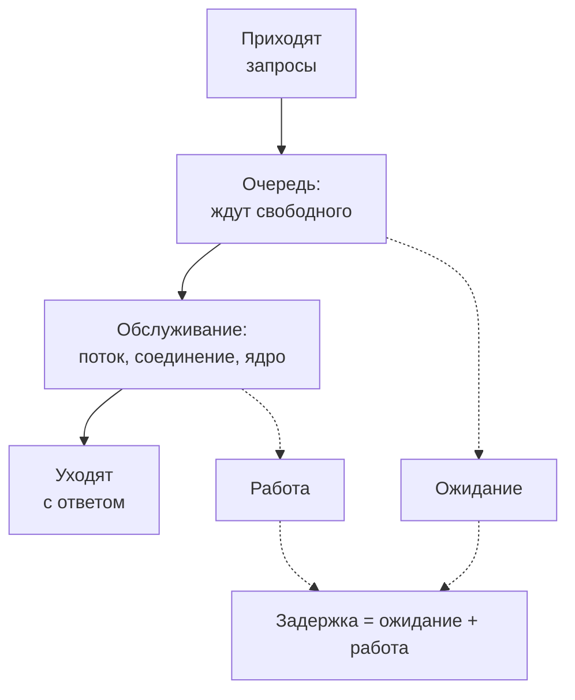
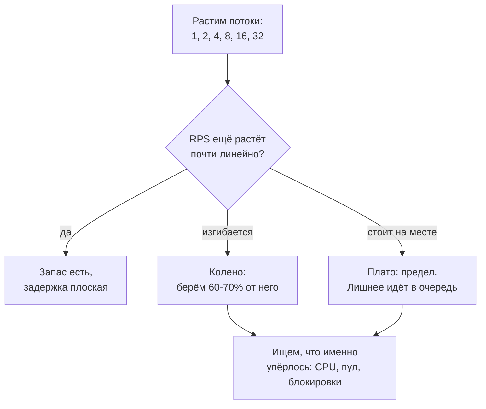
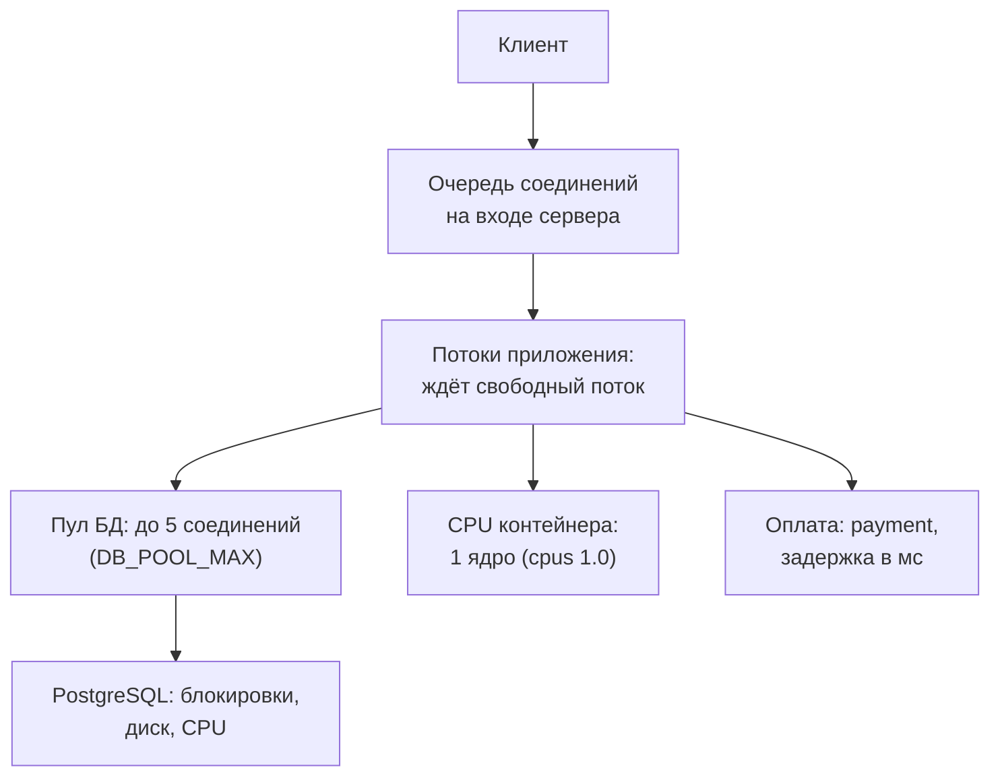

## Зачем это нужно

В [уроке 8.1](01-latency-throughput.md) ты увидел «хоккейную клюшку»: пока нагрузка небольшая, задержка почти не растёт, а у предела уходит вверх. Тогда мы только констатировали факт. Но на работе тебя будут спрашивать другое: «Почему сервис, который вчера на 70% нагрузки работал нормально, на 90% стал непригоден?», «Сколько соединений с базой нужно?», «Почему после короткого сбоя всё не восстанавливается само за минуту?». Ответ на все три один: **в системе есть очередь**, а очередь устроена по своим законам, которые не зависят от того, что внутри, база или касса в магазине.

Этот урок даёт два инструмента. Первый: понимание, **почему очередь растёт резко**, а не плавно, и как по загрузке прикинуть, во сколько раз вырастет ожидание. Второй: **закон Литтла**, простое соотношение между тремя величинами (сколько запросов внутри, сколько их приходит в секунду, сколько каждый там проводит), которое позволяет посчитать размер пула соединений или число потоков за минуту на бумаге. Никакой высшей математики: хватит умножения и деления.

Шаг проекта: ты напишешь `~/perf-lab/08-theory/sweep.py`, ступенчатый прогон, который растит число потоков и печатает таблицу «потоков, RPS, задержка», найдёшь по ней **колено** («Магазин» перестаёт ускоряться) и проверишь закон Литтла по метрикам Prometheus. Число, которое ты получишь, станет главным в методике испытаний в [уроке 8.4](04-load-profile-slo.md): с него начинается разговор «какую нагрузку мы вообще планируем».

## Что нужно знать

- Задержка, пропускная способность, перцентили и «хоккейная клюшка» на уровне [урока 8.1](01-latency-throughput.md). Файлы `measure.py` и `baseline.md` из него понадобятся.
- Пул соединений с базой как идея: [урок 2.3](../02-web/03-backend-anatomy.md). Здесь мы наконец посчитаем, какого он должен быть размера.
- Лимиты CPU у контейнеров стенда: [урок 5.4](../05-docker/04-limits-stats.md). У `shop` выдан один процессор, это важно для понимания, где у нас колено.
- PromQL `rate` и `sum`: [урок 7.2](../07-observability/02-promql.md).

## Картина целиком

Возьми кассу в продуктовом магазине. Покупатели приходят в случайные моменты, встают в очередь, дождавшись, подходят к кассе, их пробивают, они уходят. Это вся модель, и в ней всего три участника: **приход** (кто и как часто приходит), **очередь** (где ждут) и **обслуживание** (кто и как долго работает с покупателем). Тот же скелет у любой системы, в которой есть ограниченный ресурс:



Что здесь видно: задержка, которую ты меряешь, это сумма двух частей. «Работа» зависит от кода и базы и почти не меняется с нагрузкой. «Ожидание» зависит только от того, сколько народа стоит перед тобой, и именно оно взрывается у предела. Весь урок про то, как ведёт себя эта вторая часть.

- очередь появляется **даже тогда, когда ресурс в среднем не перегружен**, потому что запросы приходят неровно;
- чем ближе загрузка к 100%, тем быстрее растёт очередь: вторая половина шкалы загрузки стоит дороже первой в десятки раз;
- «сколько запросов сейчас внутри» всегда равно «сколько приходит в секунду» умножить на «сколько каждый проводит внутри» (закон Литтла), и по этой формуле считают всё, от пулов до серверов.

## Теория

### Очередь: из чего состоит и какие величины в ней есть

**Зачем это существует.** Ресурсы всегда ограничены: у кассы один кассир, у сервера один процессор на «Магазин», у пула пять соединений с базой. Если приходит больше желающих, чем ресурс может обслужить прямо сейчас, остаётся один выход: подождать. Очередь это не поломка, а способ, которым система проживает неравномерность. Вопрос только в том, насколько она длинная.

**Аналогия.** Та же касса с одним кассиром: покупатель пробивается за 2 минуты, приходят в случайные моменты. Из этой простой картины вытекает всё остальное. Аналогия ломается тем, что покупатели иногда уходят, видя длинную очередь, а запросы к серверу обычно ждут терпеливо (пока их не оборвёт таймаут клиента).

**Как это устроено.** Введём пять слов, которыми дальше пользуемся:

- **Скорость прихода** (arrival rate): сколько запросов приходит в секунду. Это то, что генератор нагрузки подаёт, то есть поданная нагрузка из урока 8.1. Для кафе: 20 человек в час.
- **Время обслуживания** (service time): сколько ресурс **работает** над одним запросом, без ожидания. Для кафе: 2 минуты на заказ. Для `GET /api/products/{id}` это около 5 мс, для логина около 250 мс.
- **Время ожидания** (waiting time, queue time): сколько запрос простоял в очереди.
- **Время в системе** (response time): ожидание плюс обслуживание. Это и есть задержка, которую видит клиент.
- **Загрузка** (utilization): какую долю времени ресурс занят. Если касса занята 40 минут из 60, загрузка 67%.

Загрузку считают одной строкой: **загрузка = скорость прихода × время обслуживания ÷ число обслуживающих**.

**Разобранный пример.** Кафе: один бариста, заказ 2 минуты, приходит 20 человек в час (один раз в 3 минуты в среднем).

- Скорость прихода: 20 в час = 1/3 человека в минуту.
- Загрузка: 1/3 × 2 мин ÷ 1 бариста = 0,67, то есть 67%. Бариста занят две трети времени, свободен треть.

Для сервера: у `shop` один процессор, логин занимает его на 250 мс. Если приходит 2 логина в секунду, загрузка 2 × 0,25 ÷ 1 = 0,5, то есть 50%. При 4 логинах в секунду загрузка 100%, это предел, который ты нашёл в 8.1. Предел можно было вычислить заранее: **максимальная пропускная способность = число обслуживающих ÷ время обслуживания** (1 ÷ 0,25 = 4 в секунду).

**Что путают.** Загрузку (долю времени, когда ресурс занят) и «нагрузку» (сколько запросов подали). Загрузка 67% при нагрузке 20 человек в час: это разные числа, одно получается из другого умножением на время обслуживания. Ещё путают «время обслуживания» и «задержку»: первое без очереди, второе с ней.

> **Проверь понимание:** касса пробивает покупателя за 1,5 минуты, приходит 30 человек в час. Какая у кассы загрузка и сколько человек в час она максимум может пропустить?

<details markdown="1">
<summary>Ответ</summary>

30 человек в час это 0,5 человека в минуту. Загрузка 0,5 × 1,5 = 0,75, то есть 75%. Максимум: 1 ÷ 1,5 минуты = 0,67 человека в минуту, то есть 40 человек в час. Запас до предела небольшой.

</details>

### Почему очередь растёт резко, а не плавно

**Зачем это существует.** Интуиция подсказывает: если касса занята на 90%, то ждать придётся «чуть-чуть дольше, чем на 80%». Интуиция ошибается, и если ты не понимаешь почему, ты будешь согласовывать «давайте нагрузим до 90% и посмотрим» и удивляться результату.

**Аналогия.** Всё та же касса. При загрузке 30% кассир почти всегда свободен. При 80% один покупатель с долгой оплатой уже собирает за собой хвост. При 95% достаточно одной заминки, и очередь рассасывается долго, хотя «в среднем» кассир не перегружен. Аналогия ломается тем, что у настоящей кассы можно позвать второго кассира, а у сервиса число ядер и воркеров фиксировано.

**Как это устроено.** Причина резкости в двух фактах:

1. **Запросы приходят неровно.** Даже если в среднем приходит один запрос в секунду, бывает, что за секунду придёт три, а потом две секунды тишины. Люди не синхронизируются.
2. **Потерянное время не вернуть.** Пока касса простаивала, потому что очередь была пустой, это время пропало. Когда потом приходит пачка, наверстать простой нельзя, и очередь копится. Чем меньше у ресурса «запаса простоя», тем медленнее такая очередь рассасывается.

Для одного обслуживающего и случайного прихода (самый простой случай) есть грубая оценка: **время в системе = время обслуживания ÷ (1 − загрузка)**. Выводить её мы не будем, достаточно её посмотреть:

| Загрузка | Время в системе, в долях времени обслуживания | Бариста с заказом 2 мин |
|---|---|---|
| 50% | 2 | 4 мин (2 ожидание + 2 работа) |
| 70% | 3,3 | 6,7 мин |
| 80% | 5 | 10 мин |
| 90% | 10 | 20 мин |
| 95% | 20 | 40 мин |
| 99% | 100 | 200 мин |

Читаем: при загрузке 50% запрос проводит в системе вдвое дольше, чем работает над ним ресурс (половина времени это ожидание). Когда загрузка выросла с 80% до 90%, нагрузка выросла на 12,5%, а время в системе удвоилось. Между 95% и 99% нагрузка выросла на 4%, а задержка в пять раз. Эту формулу рисует виджет «хоккейная клюшка» из 8.1: «работа» это базовая задержка, а остальное ожидание.

Посмотри сам: здесь одна касса, покупатели приходят в среднем 4 в минуту, обслуживание около 12 секунд (загрузка 80%). Зелёные кружки ждут недолго, жёлтые уже заметно, красные долго.

<div class="viz" data-viz="queue" data-servers="1" data-rate="4" data-service="12"></div>

Что здесь видно: кассир обслуживает по очереди, перед ним выстраивается очередь, а график под ней показывает, сколько людей ждёт. Очередь не стоит на месте: она то пропадает, то вырастает до нескольких человек, хотя среднее число приходящих не меняется. Подними приход выше 5 в минуту: касса перестанет справляться (загрузка 100% и больше), и очередь начнёт расти без конца.

**Добавь вторую кассу** (ползунок «Кассы») и посмотри, как тает очередь при той же нагрузке: загрузка падает вдвое, до 40%, и мы уходим в пологую часть клюшки. На сервере это значит: чтобы вернуть запас, достаточно добавить ресурса (ядро, воркер, копию сервиса).

**Разобранный пример.** Сервис отвечает за 20 мс, нагрузка постепенно растёт. Сколько будет стоить каждые 10% загрузки?

- При 50% ожидаемое время в системе 20 / (1 − 0,5) = 40 мс.
- При 80% 20 / 0,2 = 100 мс.
- При 90% 20 / 0,1 = 200 мс.
- При 95% 20 / 0,05 = 400 мс.

Если цель «p95 не больше 300 мс», то уже при 90% «в среднем» 200 мс, а хвост (p95) будет в разы хуже среднего: перцентили растут быстрее. Поэтому рабочую нагрузку выбирают далеко от предела: 60–70%.

**Что путают.** Что «пока загрузка меньше 100%, очереди нет». Очередь есть всегда, когда приходят неравномерно: она просто маленькая, пока загрузка низкая. И что «после пика очередь исчезнет сразу, как только нагрузка упала». Нет: очередь рассасывается ровно с той скоростью, с какой у ресурса есть запас. Если запас 10%, то очередь из 100 запросов будет уходить минуты.

> **Проверь понимание:** сервис отвечает за 50 мс. Во сколько раз ожидание в очереди при загрузке 90% больше, чем при 50%? Ожидание это время в системе минус время обслуживания.

<details markdown="1">
<summary>Ответ</summary>

При 50% время в системе 50 / 0,5 = 100 мс, ожидание 100 − 50 = 50 мс. При 90% время в системе 50 / 0,1 = 500 мс, ожидание 450 мс. Ожидание выросло в 9 раз при росте загрузки в 1,8 раза.

</details>

### Закон Литтла: сколько внутри

**Зачем это существует.** Возникает много вопросов вида «сколько нужно»: сколько соединений в пуле, сколько потоков, сколько одновременных пользователей изображает генератор, сколько запросов будет «висеть в воздухе». Закон Литтла (Little's law) отвечает на них одной формулой и работает для любой системы, где что-то приходит, проводит время внутри и уходит: от очереди в магазин до серверов.

**Аналогия.** Ванна: из крана каждую минуту льётся 10 литров воды, каждый литр проводит в ванне 5 минут (пока не вытечет через слив), значит, в ванне в любой момент около 50 литров. Не нужно знать устройство слива: достаточно знать, как быстро вода притекает и сколько времени каждый литр в ванне находится. Аналогия ломается тем, что вода течёт равномерно, а запросы приходят пачками.

**Как это устроено.** Закон Литтла, по-русски и без греческих букв:

**сколько внутри = сколько приходит в секунду × сколько времени каждый проводит внутри**

Ещё раз по словам: в среднем внутри системы одновременно находится столько запросов, сколько их приходит за время, равное одному «визиту». Формула верна всегда, пока система в **устойчивом** состоянии: за долгое время сколько зашло, столько и вышло, ничего не копится навсегда. Это не приближение и не модель.

Три важные оговорки:

1. **Единицы одни и те же.** Если «приходит в секунду», то время тоже в секундах: 25 мс это 0,025 с.
2. **«Внутри» это всё**, и очередь, и обслуживание, и «пауза на раздумье», если она входит в границу системы. Границу ты выбираешь сам: это может быть весь «Магазин», только очередь, только пул соединений.
3. **Это среднее.** Закон ничего не говорит о всплесках и о перцентилях.

Живая демонстрация: здесь кафе, куда приходит 6 человек в минуту, и каждый сидит в среднем минуту. Внутри, по формуле, должно быть 6 ÷ 60 × 60 = 6 человек в среднем.

<div class="viz" data-viz="perf-little" data-rate="6" data-time="60" data-place="кафе"></div>

Что здесь видно: сверху зал, точки это люди, жёлтые скоро уйдут. Внизу график «сколько внутри». Сначала зал пустой, потом заполняется и колеблется вокруг жёлтой линии «по формуле». Люди приходят неровно, поэтому число то выше, то ниже, но в среднем держится у линии. Подвигай ползунки: удвой скорость прихода и убедись, что внутри будет вдвое больше; потом удвой время пребывания.

**Разобранные примеры.**

- **Касса.** Приходит 1 человек в 3 минуты (1/3 в минуту), проводит в системе 6 минут (по формуле выше при загрузке 67%: 2 ÷ (1 − 0,67) = 6). Внутри 1/3 × 6 = 2 человека: 0,67 у кассы (она занята две трети времени) и 1,33 в очереди.
- **«Магазин»: сколько запросов в работе.** Приходит 200 запросов в секунду, каждый проводит в сервисе 25 мс. Внутри 200 × 0,025 = **5 запросов одновременно**. Это то, что показывает метрика `http_requests_in_progress`. Если ты вдруг видишь там 40, а задержка 25 мс, то приход должен быть 1600 в секунду. Если приход 200 и в работе 40, значит, время в системе выросло до 40 / 200 = 0,2 с: запросы простаивают в очереди.
- **Пул соединений.** Приходит 50 запросов в секунду, каждый держит соединение с базой 40 мс. Одновременно занято 50 × 0,04 = **2 соединения**. Пул из 5 хватает с запасом (загрузка пула 40%). Этот расчёт делает виджет «пул» из [урока 2.3](../02-web/03-backend-anatomy.md): «в среднем нужно столько-то соединений».
- **Оформление заказа.** В «Магазине» заказ держит соединение пула **всё время оплаты**, потому что оплата вызывается внутри транзакции (антипаттерн, ты столкнёшься с ним в [уроке 11.5](../11-bottlenecks/05-cache-dependencies.md)). Заказ работает ~30 мс, оплата 50 мс: соединение занято 0,08 с. При 2 заказах в секунду нужно 0,16 соединения, мелочь. Если оплата стала отвечать за 1 секунду, то нужно 2 × 1,03 = 2,06 соединения. А при 5 заказах в секунду уже 5,15, больше размера пула (5): пул кончился, очередь растёт. Мы проверим это руками в разделе «Сломай и почини».

**Закрытая модель и пользователи.** У закона есть полезное следствие для нагрузочников. Если у тебя N виртуальных пользователей, каждый из которых шлёт запрос, ждёт ответа, думает и повторяет, то «внутри» это все N пользователей, а время «визита» это ответ плюс раздумье. Тогда **RPS = N ÷ (время ответа + время раздумья)**. 100 пользователей, ответ 0,2 с, раздумье 5 с: RPS = 100 ÷ 5,2 = 19,2. Именно поэтому «100 пользователей» это не «100 RPS», и именно так в [уроке 8.4](04-load-profile-slo.md) мы будем переводить пользователей в запросы.

**Что путают.**

- Применяют закон к пикам: «вчера в среднем было 5 запросов внутри, значит, больше 5 не бывает». Закон про среднее. Пик в 10 раз выше среднего вполне возможен.
- Забывают единицы: умножают 200 RPS на 25 (мс) и получают 5000.
- Считают, что закон «объясняет» причину. Он только связывает три величины: если выросло время внутри при том же приходе, внутри станет больше, но почему выросло время, надо искать отдельно.

> **Проверь понимание:** сервис получает 80 запросов в секунду. В Grafana `http_requests_in_progress` в среднем равно 16. Сколько в среднем времени запрос проводит внутри сервиса?

<details markdown="1">
<summary>Ответ</summary>

Время = внутри ÷ приход = 16 ÷ 80 = 0,2 с, то есть 200 мс. Закон работает в обе стороны: зная любые две величины, находишь третью.

</details>

### Колено: где кончается «всё хорошо»

**Зачем это существует.** В 8.1 ты нашёл предел логина по плоской линии RPS. Для остальных маршрутов он не так очевиден: нагрузка растёт, RPS ещё немного растёт, задержка ещё немного растёт. Нужно правило, по которому ты назовёшь одну точку «колено» и скажешь: «вот здесь».

**Аналогия.** Кассир работает на максимуме: быстрее пробивать он не может, сколько бы людей ни пришло. Колено это момент, когда «слать больше запросов» перестаёт давать больше ответов.

**Как это устроено.** Нагрузку растят ступенями (мы делаем это числом потоков), на каждой ступени замеряют RPS и задержку. Получаются два графика одной формы:

- **RPS** сначала растёт почти линейно (каждый новый поток добавляет работы), потом изгибается и выходит на **плато**: сервис работает на пределе, больше обработать физически не может.
- **Задержка** сначала почти плоская (запросы не мешают друг другу), потом начинает расти и дальше растёт пропорционально числу потоков. Лишние потоки превращаются в ожидание, а по закону Литтла у закрытой модели «внутри» всегда ровно столько, сколько потоков, и если RPS не растёт, то растёт время: время = потоки ÷ RPS.

**Колено** это ступень, где RPS достигает примерно 90% от максимума плато, а задержка только начинает заметно расти. Рядом с ним сервис ещё «в форме», дальше бесполезно. Рабочую нагрузку (ту, на которой ты сертифицируешь сервис) выбирают на **60–70% колена**.



Что здесь видно: колено это решение «стоп, здесь начинается нелинейность»; плато говорит, что дальше смысла нет; после обоих следующий вопрос не «ещё нагрузки», а «что упёрлось».

**Разобранный пример.** Ты прогоняешь 1, 2, 4, 8, 16 потоков. Получилось: 190, 330, 480, 540, 550 RPS. Максимум 550, 90% от него это 495. Ближе всего 480 (4 потока) и 540 (8 потоков): колено где-то между 4 и 8 потоками, на 500 RPS. Рабочая нагрузка: 0,6–0,7 × 500 ≈ 300–350 RPS.

**Что путают.** Колено и «максимум, который мы выдержали». Максимум (плато) это предел, на нём задержка уже плохая. Колено это место, где ещё можно жить. И колено в потоках и колено в RPS: потоки это то, что ты крутишь (вход), RPS это то, что получаешь (выход), в отчёте называют RPS.

> **Проверь понимание:** прогон 1, 2, 4, 8 потоков дал 100, 190, 200, 200 RPS. Где колено и что говорит про сервис плато?

<details markdown="1">
<summary>Ответ</summary>

Максимум 200, 90% от него 180: ближе всего 190 на 2 потоках, колено около 2 потоков. Плато с 4 потоков говорит, что сервис упёрся в какой-то ресурс (у него предел 200 RPS), а дальше потоки только ждут. Рабочая нагрузка около 120–140 RPS.

</details>

### Открытая и закрытая модели нагрузки

**Зачем это существует.** Когда ты пишешь `python measure.py catalog 8 ...`, ты задаёшь модель мира: 8 пользователей, каждый шлёт запрос, получает ответ, шлёт следующий. Но настоящие покупатели ведут себя иначе. Если сервер замедлился, новые люди всё равно продолжают приходить на сайт: они не знают, что у кого-то запрос ещё не вернулся. Разница между этими двумя картинами ломает выводы о перегрузке, поэтому её надо знать до того, как возьмёшься за Locust и k6.

**Аналогия.** **Закрытая** модель это столовая для сотрудников завода: обедать приходят 50 человек, и пока ты стоишь в очереди, ты не можешь прийти ещё раз. Число людей «в системе» ограничено сверху. **Открытая** модель это вокзальный фастфуд: поток прохожих на улице не зависит от того, длинная ли очередь у кассы, прохожие всё равно идут. Аналогия ломается там, где прохожий видит длинную очередь и уходит; у сервиса такое тоже бывает (пользователь закрывает вкладку), но это уже вторичный эффект.

**Как это устроено.**

- **Закрытая модель** (closed model): фиксированное число пользователей (N), каждый после ответа выдерживает паузу и шлёт следующий запрос. Скорость прихода **подстраивается** под скорость ответа: чем медленнее сервер, тем меньше запросов в секунду. Сервер не может быть завален: максимум N запросов внутри.
- **Открытая модель** (open model): запросы приходят с заданной скоростью (например, 8 в секунду), **независимо** от того, ответил ли сервер на прошлые. Если сервер замедлился, запросы копятся: очередь растёт без границ.

Какая модель честнее? Для публичных сайтов реальный поток ближе к **открытой** (люди из интернета не знают друг о друге). Для внутренних систем с ограниченным числом пользователей (кассы в магазине, операторы колл-центра) ближе к закрытой. На практике: `measure.py` из 8.1 и пользователи Locust с паузой `wait_time` это закрытая модель; сценарий k6 с `constant-arrival-rate` (он есть в `project/shop/examples/k6/shop.js`) это открытая. Как в них выбирать, разберём в темах 9 и 10, здесь важно понять разницу.

Посмотри на эксперимент. Один сервер, запрос занимает в среднем 100 мс. Красная линия: открытая модель, 8 запросов в секунду. Синяя: закрытая модель, 10 пользователей, подобранных так, чтобы в начале шло тоже около 8 запросов в секунду. На 20-й секунде сервер замедляется в 3 раза (запрос теперь 300 мс) на 20 секунд.

<div class="viz" data-viz="perf-open-closed" data-rate="8" data-users="10" data-slow="3"></div>

Что здесь видно: до замедления модели ведут себя похоже. В зоне замедления сервер успевает 3,3 запроса в секунду вместо 10: в открытой модели приходит по-прежнему 8, и **очередь растёт линейно** (красная линия уходит вверх, время ответа растёт до десятков секунд). В закрытой модели все 10 пользователей быстро оказываются в очереди и **новые запросы не приходят**, пока старые не обслужены: очередь упирается в потолок 10, а ответ растёт лишь в несколько раз (до 3 секунд). После снятия замедления открытая модель **не восстанавливается сразу**: накопленная очередь из десятков запросов уходит медленно, потому что запас у сервера небольшой. Закрытая приходит в норму быстро.

**Разобранный пример (что из этого следует для тестов).** Допустим, ты тестируешь сервис закрытой моделью (потоками). Сервер на пределе, ответ стал 2 секунды вместо 0,1. Генератор делает по запросу в 2 секунды на поток, нагрузка **автоматически упала** в 20 раз. Отчёт покажет: «p95 = 2 с, RPS 50». Выглядит не катастрофой, но реальные пользователи продолжали бы приходить с прежней скоростью (допустим, 500 в секунду), и очередь была бы бесконечной. Эту ловушку называют **координированным пропуском** (coordinated omission): генератор, сам того не желая, «скоординировался» с медленным сервером и перестал замечать проблему, потому что не отправил запросы, которые должен был. Правило: чтобы проверить, **выдержит ли** сервис заданную скорость прихода, нужна открытая модель; чтобы найти предел и колено, годится закрытая (так делаем мы сейчас).

**Что путают.** «Закрытая плохая, открытая хорошая». Нет: у каждой свой смысл. Закрытая безопасна для сервера и проста (потоки). Открытая точнее воспроизводит интернет, но может его положить: для неё обязательны ограничения (максимум пользователей, остановка при ошибках). Ещё путают число потоков с числом реальных пользователей: потоки без пауз шлют запросы подряд, это намного больше нагрузки, чем у человека.

> **Проверь понимание:** сервер за 5 минут теста замедлился в 10 раз. Какая модель покажет, что очередь накопилась без конца: закрытая из 20 потоков или открытая со скоростью 100 запросов в секунду?

<details markdown="1">
<summary>Ответ</summary>

Открытая: она продолжает приходить со скоростью 100 в секунду, пока сервер успевает, скажем, 10, и очередь растёт на 90 запросов каждую секунду. Закрытая не превысит 20 запросов внутри и покажет рост задержки, но не катастрофу.

</details>

### Где в «Магазине» прячутся очереди

**Зачем это существует.** Закон Литтла и формула клюшки одинаково работают для кассы и для процессора. Но чтобы применить их, надо знать, где именно у твоего сервиса очереди. Это ограничения: «где что-то делит несколько запросов».

**Как это устроено.** Запрос к «Магазину» по пути проходит несколько ограниченных ресурсов, и перед каждым может быть очередь:



Что здесь видно: у запроса минимум шесть «касс», и любая может стать узким местом. Какая именно, показывают метрики, потому что каждая очередь оставляет след:

| Где очередь | Признак в метриках «Магазина» |
|---|---|
| Процессор `shop` | CPU контейнера около 100% от выданного ядра; RPS стоит, задержка растёт |
| Потоки приложения | `http_requests_in_progress` растёт, при этом CPU не 100% |
| Пул соединений БД | `shop_db_pool_waiting` больше нуля, растёт `shop_db_connection_wait_seconds` |
| База данных | долгие запросы в `pg_stat_statements`, блокировки; пул занят, а CPU `shop` низкий |
| Оплата | `shop_payment_duration_seconds` вырос; заказы медленные, остальное нормально |

Правило поиска: **очередь стоит перед самым медленным ресурсом, и перед ним же растёт счётчик «ждут»**. В теме 11 мы пройдёмся по каждой из этих строк.

**Что путают.** Считают, что очередь это только «в Kafka» или «в RabbitMQ». Очередью называют любое ожидание ресурса: процесса, потока, соединения, блокировки, диска. Большинство очередей в вебе неявные, их нет на схеме архитектуры, и найти их можно только по метрикам.

> **Проверь понимание:** задержка растёт, RPS стоит, CPU контейнера `shop` 30%, `shop_db_pool_waiting` равно 4. Где очередь?

<details markdown="1">
<summary>Ответ</summary>

В пуле соединений с базой: запросы ждут свободного соединения (в очереди 4), а CPU не занят, потому что они спят в ожидании. Лечение не «больше процессора», а расчёт пула по закону Литтла и сокращение времени, которое запрос держит соединение.

</details>

## Практика

Файлы урока складывай в `~/perf-lab/08-theory/`. Нагрузку даём только на свой стенд.

### 1. Подготовка

```bash
cd ~/load-tester/project/shop
docker compose --profile monitoring up -d --wait
curl -s localhost:8000/readyz
cd ~/perf-lab/08-theory && source ~/perf-lab/.venv/bin/activate && ls
```

```text
{"status":"ready"}
baseline.md  curl-time.txt  measure.py
```

Если стенд запущен с изменёнными настройками, верни стандартные: `cd ~/load-tester/project/shop && cp .env.example .env && docker compose up -d`, и задержку оплаты: `curl -s -X POST localhost:8001/admin/config -H 'Content-Type: application/json' -d '{"delay_ms": 50}'`.

### 2. Ступенчатый прогон: sweep.py

Задача: на каждой ступени (число потоков) гнать нагрузку фиксированное время и печатать строку таблицы. `measure.py` делал фиксированное **число** запросов, а нам удобнее фиксированное **время**: на каждой ступени одинаково по длительности. Поэтому напишем новый файл и возьмём из `measure.py` готовые функции `one_request` и `percentile`: `from measure import ...` подключает функции из соседнего файла, у которого `main()` защищён строкой `if __name__ == "__main__"` и поэтому не запустится.

Создай `~/perf-lab/08-theory/sweep.py`:

```python
"""Ступенчатый прогон: растим число потоков, на каждой ступени гоним нагрузку N секунд.

Запуск:  python sweep.py catalog 1,2,4,8,16,32 10
         python sweep.py login 1,2,4,8 10
"""
import csv
import os
import sys
import time
from concurrent.futures import ThreadPoolExecutor

import requests

from measure import one_request, percentile


def worker(mode, seconds):
    """Один «пользователь»: шлёт запросы подряд, пока не истечёт время."""
    session = requests.Session()
    end = time.perf_counter() + seconds
    results = []
    while time.perf_counter() < end:
        results.append(one_request(session, mode))
    return results


def main():
    mode, steps, seconds = sys.argv[1], [int(x) for x in sys.argv[2].split(",")], float(sys.argv[3])
    rows = []
    print(f"{'потоков':>8} {'RPS':>7} {'среднее':>8} {'p50':>6} {'p95':>6} {'ошибок':>7} {'RPS×среднее':>12}")
    for users in steps:
        started = time.perf_counter()
        with ThreadPoolExecutor(max_workers=users) as pool:
            futures = [pool.submit(worker, mode, seconds) for _ in range(users)]
            results = [item for f in futures for item in f.result()]
        elapsed = time.perf_counter() - started
        ms = sorted(sec * 1000 for sec, _ in results)
        errors = sum(1 for _, code in results if code == 0 or code >= 400)
        rps = len(ms) / elapsed
        mean = sum(ms) / len(ms)
        row = [users, round(rps, 1), round(mean, 1), round(percentile(ms, 50), 1), round(percentile(ms, 95), 1), errors]
        print(f"{users:>8} {rps:>7.1f} {mean:>8.1f} {row[3]:>6.1f} {row[4]:>6.1f} {errors:>7} {rps * mean / 1000:>12.1f}")
        rows.append(row)
        time.sleep(3)  # пауза, чтобы очередь рассосалась и следующая ступень началась с чистого листа
    path = os.path.expanduser(f"~/perf-lab/results/sweep-{mode}.csv")
    with open(path, "w", newline="") as f:
        writer = csv.writer(f)
        writer.writerow(["threads", "rps", "mean_ms", "p50_ms", "p95_ms", "errors"])
        writer.writerows(rows)
    print(f"Сохранено: {path}")


if __name__ == "__main__":
    main()
```

Разбор нового:

- `worker` крутит цикл `while`, пока `time.perf_counter()` не перешёл заданное время `end`: так каждая ступень длится одинаково, независимо от скорости сервиса.
- `[int(x) for x in sys.argv[2].split(",")]` превращает строку `"1,2,4,8"` в список чисел: `split(",")` режет по запятым, `int` превращает каждую часть в число.
- Последняя колонка `RPS×среднее` это закон Литтла: RPS умножить на среднюю задержку в секундах (мс делим на 1000). Это число «запросов внутри».
- `time.sleep(3)` между ступенями нужен, чтобы остатки очереди от предыдущей ступени не испортили следующую.
- `csv.writer` записывает таблицу в файл `~/perf-lab/results/sweep-<режим>.csv` (каталог `results` создан в [уроке 1.1](../01-linux/01-workstation-terminal.md)): позже эти данные пригодятся для графиков и отчёта.

**Типичные ошибки:**

- `ModuleNotFoundError: No module named 'measure'`: запустил не из каталога `~/perf-lab/08-theory`. Python ищет `measure.py` рядом с запускаемым файлом и в текущем каталоге.
- `FileNotFoundError` на `results/sweep-...csv`: нет каталога `~/perf-lab/results`. Создай: `mkdir -p ~/perf-lab/results`.

### 3. Найди колено на каталоге

Карточка товара самый лёгкий маршрут, она покажет «чистое» колено. 6 ступеней по 10 секунд, это минута с небольшим:

```bash
python sweep.py catalog 1,2,4,8,16,32 10
```

```text
 потоков     RPS  среднее    p50    p95  ошибок  RPS×среднее
       1   187.0      5.3    4.0    8.1       0          1.0
       2   330.2      6.1    5.0   10.2       0          2.0
       4   480.5      8.3    7.0   14.0       0          4.0
       8   540.1     14.8   13.0   31.0       0          8.0
      16   550.3     29.1   27.0   61.0       0         16.0
      32   545.4     58.7   55.0  118.0       0         32.0
Сохранено: /home/student/perf-lab/results/sweep-catalog.csv
```

**Как читать вывод:** твои числа будут другими, форма та же. Смотри по колонкам. **RPS**: растёт 187, 330, 480, потом изгибается (540) и встаёт на плато около 550. Максимум 550, 90% от него 495, значит, колено между 4 и 8 потоками. **p50 и p95**: до 4 потоков растут медленно (p50 с 4 до 7 мс, p95 с 8 до 14 мс, то есть в 1,5–2 раза), после колена растут вдвое с каждым удвоением потоков: потоки добавляют только ожидание. **Последняя колонка** почти равна числу потоков: закон Литтла в закрытой модели, «внутри» ровно столько запросов, сколько потоков. А вот **среднее ≈ потоки ÷ RPS**: 32 потока ÷ 545 RPS = 58 мс. Рабочая нагрузка: 60–70% от 500, то есть примерно **300–350 RPS**.

Посмотри те же числа на графиках:

<div class="viz" data-viz="chart" data-type="line" data-x="1,2,4,8,16,32" data-x-label="Потоков" data-y-label="RPS" data-explain="Пропускная способность растёт линейно, изгибается между 4 и 8 потоками и выходит на плато около 550 RPS: это колено и предел." data-series='[{"name":"Пропускная способность, RPS","values":[187,330,480,540,550,545]}]'></div>

<div class="viz" data-viz="chart" data-type="line" data-x="1,2,4,8,16,32" data-x-label="Потоков" data-y-label="p95, мс" data-unit="мс" data-explain="Задержка плоская до колена, после него растёт пропорционально числу потоков: лишние запросы ждут." data-series='[{"name":"Задержка p95, мс","values":[8.1,10.2,14,31,61,118]}]'></div>

Что здесь видно: график RPS загибается и ложится на плато, график p95 зеркально загибается вверх. Колено это та же точка на обоих: пока RPS растёт, задержка стоит, потом всё наоборот. Наведи мышь на любую точку, чтобы увидеть значения.

**Типичные ошибки:**

- RPS растёт до самого конца без плато: генератор слишком слабый или у сервиса много ресурсов. Добавь ступеней (`1,2,4,8,16,32,64`). Но на 64 потоках Python-генератор сам упирается в процессор: **GIL** (global interpreter lock) это правило Python, по которому код исполняется только в одном потоке за раз, поэтому много потоков не дают больше расчётов в самом генераторе. Если загрузка процессора генератора 100%, измеряешь уже его.
- Много ошибок (колонка `ошибок`) на больших ступенях: сервис или его пул не выдерживает 32 одновременных запроса. Это тоже находка, запиши, на какой ступени они начались. Подробнее в [уроке 11.3](../11-bottlenecks/03-database.md).
- На плато растёт `ошибок` и падает RPS: «Магазин» не просто упёрся, а начал разваливаться (перегрузка). Колено у тебя то, что до этого.

> **Важное про генератор.** Python-потоки делят один интерпретатор, и при очень высоких RPS (сотни в секунду) сам `measure.py` становится узким местом: он занимает процессор целиком и не успевает отправлять. Если на плато `htop` показывает 100% на процессе `python`, а не на `shop`, колено твоё, но это колено **генератора**. Решение: следить за `docker stats` и `htop` во время прогона, и если упёрся генератор, это надо отметить в отчёте. Как обойти ограничение, узнаешь в [уроке 9.5](../09-locust/05-distributed-generator.md).

### 4. Проверь закон Литтла по метрикам

Закон Литтла на стороне сервера. Запусти один прогон для устойчивого состояния и **пока он идёт** выполни три запроса PromQL в Prometheus `http://localhost:9090`:

```bash
python sweep.py catalog 16 40
```

```promql
# W: среднее время запроса внутри сервиса, секунд (сумма времени делить на число запросов)
sum(rate(http_request_duration_seconds_sum{route="/api/products/{id}"}[30s]))
/
sum(rate(http_request_duration_seconds_count{route="/api/products/{id}"}[30s]))

# приход: сколько запросов в секунду
sum(rate(http_requests_total{route="/api/products/{id}"}[30s]))

# внутри: сколько запросов в работе в среднем
avg_over_time(http_requests_in_progress[30s])
```

Ожидаемо (числа примерные):

```text
W      0.027      (27 мс)
приход 549        (запросов в секунду)
внутри 15.2
```

**Как читать вывод:** 549 × 0,027 = 14,8: это почти то, что показывает `http_requests_in_progress` (15,2). Закон Литтла сошёлся: приход × время внутри = внутри. Небольшое расхождение нормально: Prometheus опрашивает метрики раз в 5 секунд, и «внутри» это моментальный снимок, а не усреднение. У клиента (генератора) то же время получится чуть больше (29 мс, а не 27): к нему добавились сеть и очередь на входе, которые сервер не видит ([урок 8.1](01-latency-throughput.md), раздел «Где меряют»).

Важный вывод: **если эти три числа перестали сходиться, где-то ошибка в измерениях**, а не «закон не работает». Либо ты смотришь на разные маршруты и окна, либо система не в устойчивом состоянии (нагрузка меняется), либо метрика считает не то, что ты думаешь.

**Типичные ошибки:**

- Пустой результат: нагрузка уже закончилась. Запрос надо выполнять, пока `sweep.py` идёт, или взять окно `[5m]` и смотреть, пока он ещё в окне.
- Расхождение вдвое и больше: окна `[30s]` разные в трёх запросах или неточно указан `route`. Проверь метки: `count by (route) (http_requests_total)`.

### 5. Логин: предел сразу

Сравни: у каталога есть длинная «ручка» до колена, у логина её нет.

```bash
python sweep.py login 1,2,4,8 10
```

```text
 потоков     RPS  среднее    p50    p95  ошибок  RPS×среднее
       1     3.8    262.4  258.0  301.0       0          1.0
       2     3.9    512.8  510.0  560.0       0          2.0
       4     3.9   1026.3 1020.0 1104.0       0          4.0
       8     3.9   2051.2 2040.0 2180.0       0          8.0
Сохранено: /home/student/perf-lab/results/sweep-login.csv
```

**Как читать вывод:** колено у логина на **первом же потоке**: один бесконечно «нажимающий» пользователь уже занимает процессор целиком (bcrypt считает 250 мс чистой работы). Любой следующий поток только ждёт: RPS не растёт, задержка растёт ровно пропорционально числу потоков. Предел можно было посчитать заранее: 1 ядро ÷ 0,26 с = 3,8 RPS. Рабочая нагрузка логина: 60–70% от 3,8, это **2,5 RPS**. Эта цифра понадобится в [уроке 8.4](04-load-profile-slo.md): если в пиковый час покупатели логинятся чаще, чем 2,5 раза в секунду, «Магазин» нужно ускорять (в теме 11).

### 6. Запиши в baseline.md

Допиши в конец `~/perf-lab/08-theory/baseline.md`:

```markdown
## Колено и рабочая нагрузка (8.2)

Дата: ...  Машина: ...  Генератор: sweep.py на той же машине, ступени по 10 с

| Маршрут | Колено, RPS | Плато (предел), RPS | Рабочая нагрузка (60-70% колена) | Узкое место |
|---|---|---|---|---|
| GET /api/products/{id} | ... | ... | ... | CPU shop или генератора (проверить htop) |
| POST /api/login | 3.8 | 3.9 | 2.5 | CPU (bcrypt), 1 ядро |

Закон Литтла проверен: приход × время = внутри (14.8 против 15.2 по http_requests_in_progress).
```

Закоммить и отправь:

```bash
cd ~/perf-lab && git add 08-theory results && git commit -m "8.2: sweep.py, колено каталога и логина" && git push
```

## Сломай и почини

**Поломка.** Оплата стала отвечать за секунду. Ты хорошо знаешь из 8.1, что заказ тормозит. Теперь нужно **предсказать**, что именно произойдёт с пулом соединений, и проверить прогноз. По закону Литтла: заказ держит соединение с базой всё время оплаты, около 30 мс своей работы + задержка оплаты. Пул `DB_POOL_MAX=5`.

Прогноз на бумаге, при `delay_ms` = 1000: каждый заказ держит соединение около 1,03 с, значит, пул из 5 соединений пропустит не больше 5 ÷ 1,03 ≈ **4,9 заказа в секунду**. Если покупателей 10 (закрытая модель), то по закону Литтла ответ на заказ 10 ÷ 4,9 ≈ **2 секунды**.

Создай `~/perf-lab/08-theory/orders_load.py`: N покупателей оформляют заказы подряд.

```python
"""N покупателей подряд кладут товар в корзину и оформляют заказ.
Запуск: python orders_load.py 10 20     (покупателей, секунд)
"""
import random
import sys
import time
from concurrent.futures import ThreadPoolExecutor

import requests

from measure import BASE, percentile


def buyer(n, seconds):
    session = requests.Session()
    login = session.post(f"{BASE}/api/login",
                         json={"email": f"user{n:04d}@shop.lab", "password": "password"}, timeout=30)
    login.raise_for_status()
    session.headers["Authorization"] = f"Bearer {login.json()['token']}"
    end = time.perf_counter() + seconds
    times, errors = [], 0
    while time.perf_counter() < end:
        added = session.post(f"{BASE}/api/cart/items",
                             json={"product_id": random.randint(1, 10000), "qty": 1}, timeout=30)
        if added.status_code != 201:
            errors += 1
            continue
        started = time.perf_counter()
        order = session.post(f"{BASE}/api/orders", timeout=60)
        times.append((time.perf_counter() - started) * 1000)
        errors += order.status_code != 201
    return times, errors


def main():
    users, seconds = int(sys.argv[1]), float(sys.argv[2])
    started = time.perf_counter()
    with ThreadPoolExecutor(max_workers=users) as pool:
        results = [f.result() for f in [pool.submit(buyer, n + 1, seconds) for n in range(users)]]
    elapsed = time.perf_counter() - started
    ms = sorted(t for times, _ in results for t in times)
    errors = sum(e for _, e in results)
    print(f"заказов {len(ms)} за {elapsed:.0f} с = {len(ms) / elapsed:.1f} в секунду, ошибок {errors}")
    print(f"  среднее={sum(ms) / len(ms):.0f} мс  p50={percentile(ms, 50):.0f}  p95={percentile(ms, 95):.0f}")


if __name__ == "__main__":
    main()
```

Что здесь нового: `errors += order.status_code != 201` прибавляет 1, если заказ не создался (сравнение в Python даёт `True`, а это 1). `from measure import BASE, percentile` берёт адрес стенда и перцентиль из прошлого файла.

**Шаг 1. Норма.** Сначала замерь, как должно быть:

```bash
python orders_load.py 10 20
```

```text
заказов 1380 за 20 с = 69.0 в секунду, ошибок 0
  среднее=140 мс  p50=135  p95=220
```

Здесь 10 покупателей делают ~69 заказов в секунду (в учебном стенде это возможно: оплата-заглушка отвечает за 50 мс). Каждый заказ около 140 мс (в этом числе и очередь за единственным ядром).

**Шаг 2. Ломаем.** Оплата 1 секунда:

```bash
curl -s -X POST localhost:8001/admin/config -H 'Content-Type: application/json' -d '{"delay_ms": 1000}'
```

В соседнем терминале запусти каталог: он заказов не делает, но тоже ходит в базу через **тот же пул из пяти соединений**:

```bash
python measure.py catalog 2 3000
```

В первом снова `python orders_load.py 10 20`.

```text
заказов 98 за 20 с = 4.9 в секунду, ошибок 0
  среднее=2040 мс  p50=2030  p95=2090
```

и у каталога:

```text
catalog: потоков=2 запросов=3000 за 38.2 с, 78.5 RPS, ошибок 0
  среднее=25 мс  p50=14  p95=130  p99=620  max=1030
```

**Задача.** Объясни числа, не заглядывая в разбор: почему заказов именно около 5 в секунду, почему ответ на заказ около 2 секунд и почему каталог, который с оплатой не связан, тоже замедлился (в норме p99 был 19 мс). Подсказка: где у заказа очередь и что делит с каталогом.

<details markdown="1">
<summary>Разбор</summary>

1. **Пропускная способность по Литтлу.** Заказ держит соединение ~1,03 с (оплата внутри транзакции), в пуле 5 соединений: 5 ÷ 1,03 = 4,9 заказа в секунду. Получилось 4,9: сходится с прогнозом. Сколько бы покупателей ни пришло, быстрее нельзя.
2. **Ответ.** Покупателей 10 (закрытая модель), заказов 4,9 в секунду, значит, внутри 10 = 4,9 × время, время = 2 секунды. Из них 1 с оплата, остальное ожидание свободного соединения (в очереди пяти ждут ещё пятеро).
3. **Каталог.** Он берёт соединение из **того же пула**. Все пять соединений почти всё время заняты заказами, каталогу приходится стоять в той же очереди: p99 вырос до 620 мс, хотя сам запрос быстрый. Проверь в Prometheus: `shop_db_pool_waiting` держится около 5, а `histogram_quantile(0.95, sum by (le) (rate(shop_db_connection_wait_seconds_bucket[1m])))` показывает сотни миллисекунд. CPU `shop` при этом низкий: процессор не работает, потому что все спят в ожидании.

Это классическая картина: **медленная зависимость + ограниченный пул = очередь, которая тормозит чужие маршруты**. Закон Литтла предсказал её на бумаге до запуска.

Почини. Первый путь: вернуть оплату в норму.

```bash
curl -s -X POST localhost:8001/admin/config -H 'Content-Type: application/json' -d '{"delay_ms": 50}'
```

Теперь соединение занято 0,08 с, и пул держит 5 ÷ 0,08 = 62 заказа в секунду. Второй путь (в тесте не делаем): увеличить `DB_POOL_MAX`, но каждое соединение стоит базе памяти и процессов, и тогда ты просто сдвигаешь предел. Третий, правильный путь: не держать соединение во время вызова оплаты, это сокращает время «внутри» пула. Как это делать, узнаешь в [уроке 11.3](../11-bottlenecks/03-database.md) и [11.5](../11-bottlenecks/05-cache-dependencies.md).

</details>

## Словарик урока

| Термин | Простыми словами |
|---|---|
| Очередь (queue) | Где запросы ждут, когда ресурс занят: поток, соединение, ядро, блокировка |
| Скорость прихода (arrival rate) | Сколько запросов приходит в секунду |
| Время обслуживания (service time) | Сколько ресурс работает над запросом, без ожидания |
| Время ожидания (waiting time) | Сколько запрос простоял в очереди |
| Время в системе (response time) | Ожидание плюс обслуживание: то, что видит клиент |
| Загрузка (utilization) | Доля времени, когда ресурс занят: приход × время обслуживания ÷ число ресурсов |
| Закон Литтла (Little's law) | Сколько внутри = сколько приходит в секунду × сколько каждый проводит внутри |
| Устойчивое состояние (steady state) | Сколько зашло, столько вышло, ничего не копится бесконечно |
| Колено (knee) | Ступень нагрузки, где RPS достигает ~90% максимума, а задержка начинает расти |
| Плато (plateau) | Участок, где RPS больше не растёт: предел ресурса |
| Закрытая модель (closed model) | Фиксированное число пользователей, каждый ждёт ответа и только потом шлёт новый запрос |
| Открытая модель (open model) | Запросы приходят с заданной скоростью, не дожидаясь ответов |
| Координированный пропуск (coordinated omission) | Ошибка генератора: он замедляется вместе с сервером и не замечает перегрузки |
| Пауза на раздумье (think time) | Время, которое пользователь тратит между запросами |

## Вопросы с собеседований

Раздел для повторения: ответь вслух, потом открой ответ. Короткие вопросы с пометкой `[на скорость]` тренируй на время: ответ за 30 секунд.

### 1. [junior] [часто] Что такое закон Литтла и зачем он нужен?

<details markdown="1">
<summary>Ответ</summary>

В устойчивой системе среднее число запросов внутри равно скорости их прихода, умноженной на среднее время, которое каждый проводит внутри. Пример: 200 запросов в секунду по 25 мс дают 5 запросов одновременно. Нужен, чтобы считать размеры пулов и числа потоков, переводить пользователей в RPS и проверять метрики на согласованность.

**Что хотят услышать:** формулу своими словами, пример с числами, единицы, слово «в среднем».

**Красный флаг:** «закон про то, что чем больше нагрузка, тем больше задержка».

</details>

### 2. [junior] [часто] Почему задержка растёт резко у предела, а не плавно?

<details markdown="1">
<summary>Ответ</summary>

Запросы приходят неравномерно, а простой ресурса нельзя «накопить». Чем выше загрузка, тем меньше запаса, чтобы рассосать случайные пачки. Для простой очереди время в системе примерно равно времени обслуживания, делённому на (1 − загрузка): при 50% это вдвое больше, при 90% в десять, при 99% в сто. Поэтому рабочую нагрузку держат на 60–70% предела.

**Что хотят услышать:** случайность прихода, нелинейность, цифры, запас.

**Красный флаг:** «потому что процессор перегревается».

</details>

### 3. [junior] [часто] Чем закрытая модель нагрузки отличается от открытой?

<details markdown="1">
<summary>Ответ</summary>

В закрытой фиксированное число пользователей, каждый шлёт следующий запрос только после ответа на прошлый, поэтому при замедлении сервера нагрузка падает сама. В открытой запросы приходят с заданной скоростью независимо от ответов, поэтому при замедлении очередь растёт без границ. Интернет-трафик ближе к открытой модели. Потоки с паузами (Locust) это закрытая модель, `constant-arrival-rate` в k6 открытая.

**Что хотят услышать:** где какая модель, последствия для перегрузки, пример инструмента.

**Красный флаг:** «открытая это когда без паролей».

</details>

### 4. [junior] Как посчитать загрузку ресурса?

<details markdown="1">
<summary>Ответ</summary>

Скорость прихода умножить на время обслуживания и поделить на число обслуживающих. Один процессор, 2 логина в секунду по 0,25 с: 2 × 0,25 ÷ 1 = 50%. Максимальная пропускная способность: число обслуживающих делить на время обслуживания, здесь 1 ÷ 0,25 = 4 в секунду.

**Что хотят услышать:** формула, пример, предел как обратное к времени.

**Красный флаг:** «загрузка это число запросов».

</details>

### 5. [junior] Что такое колено на графике нагрузки и как его найти?

<details markdown="1">
<summary>Ответ</summary>

Колено это точка, где пропускная способность перестаёт расти линейно с нагрузкой, а задержка начинает расти. Находят ступенчатым прогоном: растят число потоков, смотрят RPS и p95, колено там, где RPS достиг примерно 90% от плато. Рабочую нагрузку выбирают на 60–70% колена.

**Что хотят услышать:** ступени, плато, запас, оба графика.

**Красный флаг:** «колено это максимум RPS».

</details>

### 6. [middle] Сколько соединений нужно пулу при 50 RPS и времени запроса к базе 40 мс?

<details markdown="1">
<summary>Ответ</summary>

По закону Литтла 50 × 0,04 = 2 соединения в среднем. Брать пул ровно 2 нельзя: запросы приходят неравномерно, нужен запас, обычно в 2–3 раза больше среднего, и ещё учитывают, что другие маршруты тоже берут соединения. Для таких чисел хватит 5–6.

**Что хотят услышать:** расчёт, запас на неравномерность, оговорка про среднее.

**Красный флаг:** «пул побольше, всегда лучше»: большой пул нагружает базу.

</details>

### 7. [middle] Задержка выросла, RPS стоит, CPU контейнера 30%. Где искать причину?

<details markdown="1">
<summary>Ответ</summary>

Раз процессор не занят, запросы чего-то ждут: свободное соединение пула, блокировку в базе, ответ внешнего сервиса. Смотрю `shop_db_pool_waiting`, `shop_db_connection_wait_seconds`, метрики зависимостей (оплата), долгие запросы в базе. Очередь стоит перед самым медленным ресурсом.

**Что хотят услышать:** «ожидание, а не работа», конкретные метрики, гипотезу и способ проверки.

**Красный флаг:** «надо добавить процессоров».

</details>

### 8. [middle] Почему генератор с фиксированным числом потоков может скрыть перегрузку?

<details markdown="1">
<summary>Ответ</summary>

Каждый поток не шлёт новый запрос, пока не получил ответ на прошлый. Когда сервер замедляется, нагрузка падает сама, и отчёт показывает умеренную задержку, хотя реальные пользователи продолжали бы приходить с прежней скоростью. Это называют координированным пропуском. Чтобы проверить, выдержит ли сервис заданную скорость прихода, нужна открытая модель.

**Что хотят услышать:** названный эффект, объяснение «самоограничения», решение через arrival-rate.

**Красный флаг:** «потоки всегда честнее, они ближе к пользователям».

</details>

### 9. [middle] 100 пользователей, ответ 0,2 с, пауза 5 с. Сколько RPS?

<details markdown="1">
<summary>Ответ</summary>

По Литтлу пользователей = RPS × (ответ + пауза). RPS = 100 ÷ 5,2 ≈ 19. Это ровно то, о чём путаница «100 пользователей = 100 RPS»: пользователь большую часть времени думает.

**Что хотят услышать:** формулу, подстановку, вывод.

**Красный флаг:** «100 RPS».

</details>

### 10. [middle] Метрики расходятся: приход 500 RPS, время внутри 40 мс, а в работе в среднем 40 запросов. Что это значит?

<details markdown="1">
<summary>Ответ</summary>

По закону Литтла должно быть 500 × 0,04 = 20. Если внутри 40, значит, либо реальное время внутри 80 мс (метрика времени не учитывает очередь на входе), либо метрики за разные окна, либо система не в устойчивом состоянии (нагрузка растёт). Проверяю окна и меток, затем смотрю очередь перед сервисом.

**Что хотят услышать:** расчёт, список причин, шаги проверки.

**Красный флаг:** «закон Литтла тут не работает».

</details>

### 11. [junior] [на скорость] Сколько в среднем внутри, если приходит 10 запросов в секунду и каждый проводит 0,3 с?

<details markdown="1">
<summary>Ответ</summary>

10 × 0,3 = 3 запроса.

</details>

### 12. [junior] [на скорость] Какая максимальная пропускная способность у одного ядра при обслуживании 20 мс на запрос?

<details markdown="1">
<summary>Ответ</summary>

1 ÷ 0,02 = 50 запросов в секунду. Рабочая нагрузка около 30–35 RPS.

</details>

### 13. [junior] [на скорость] На какой загрузке держат рабочую нагрузку и почему?

<details markdown="1">
<summary>Ответ</summary>

60–70% от предела: выше очередь растёт нелинейно, и любой всплеск превращается в долгое ожидание.

</details>

### 14. [junior] [на скорость] Чем закрытая модель отличается от открытой одной фразой?

<details markdown="1">
<summary>Ответ</summary>

Закрытая ждёт ответа перед новым запросом, открытая шлёт по расписанию, не дожидаясь.

</details>

## Проверено на версиях

Ubuntu 24.04, Python 3.12, requests 2.34.2, стенд «Магазин» из `project/shop` (Python 3.14, PostgreSQL 18.6), Prometheus 3.15, Grafana 13.2. Октябрь 2026.

## Итог урока: ты умеешь

- [ ] Назвать составные части очереди (приход, ожидание, обслуживание) и посчитать загрузку ресурса.
- [ ] Объяснить, почему ожидание растёт резко у предела, и оценить его по загрузке.
- [ ] Применить закон Литтла: найти число запросов внутри, время или скорость прихода по двум известным.
- [ ] Прикинуть размер пула соединений и объяснить, почему нужен запас.
- [ ] Прогнать ступенчатый тест, найти колено и выбрать рабочую нагрузку на 60–70% колена.
- [ ] Различить открытую и закрытую модели и объяснить, как закрытая скрывает перегрузку.
- [ ] Найти по метрикам, перед каким ресурсом стоит очередь.

Дальше: [урок 8.3. Виды нагрузочных тестов](03-test-types.md): какой тест запускать, чтобы получить какой ответ.
