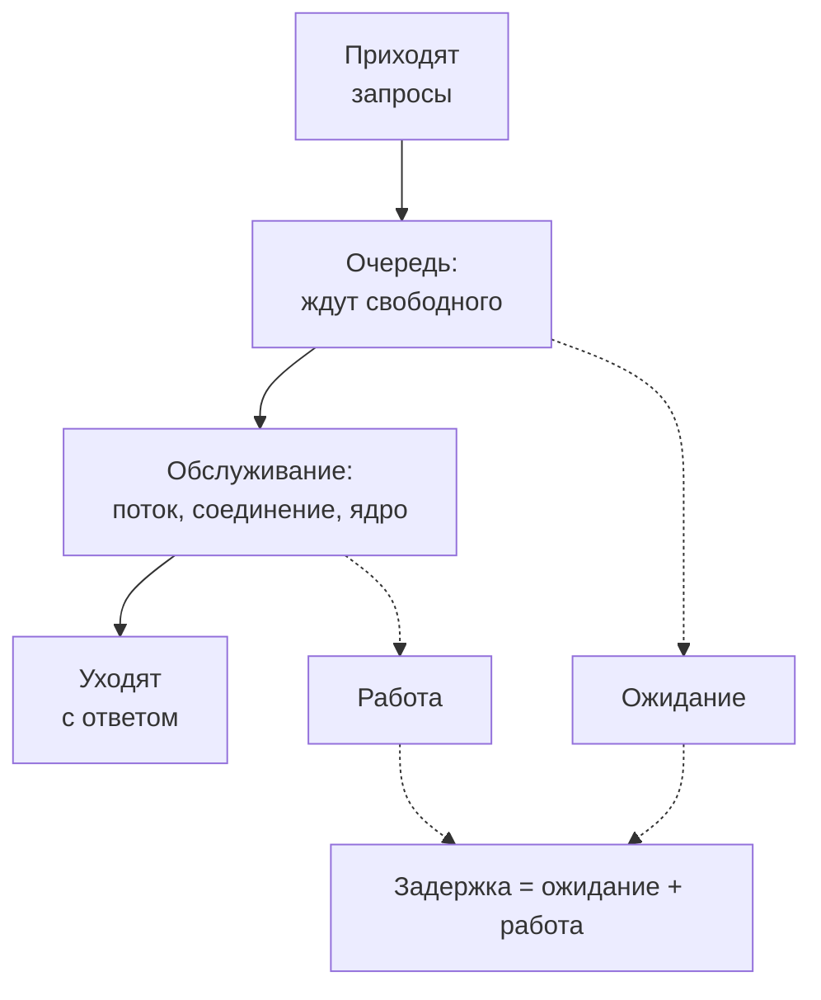
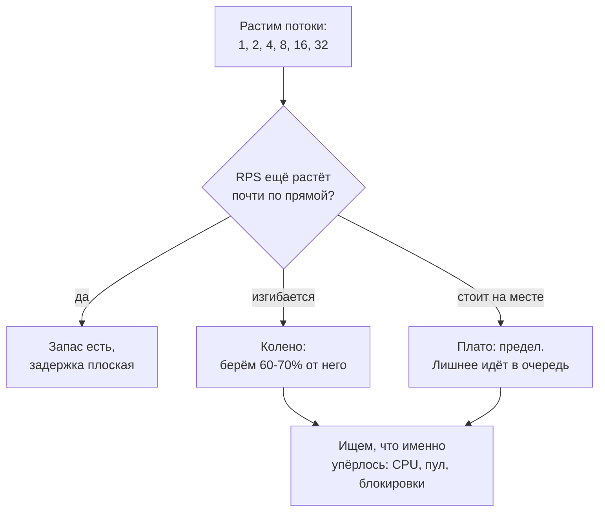
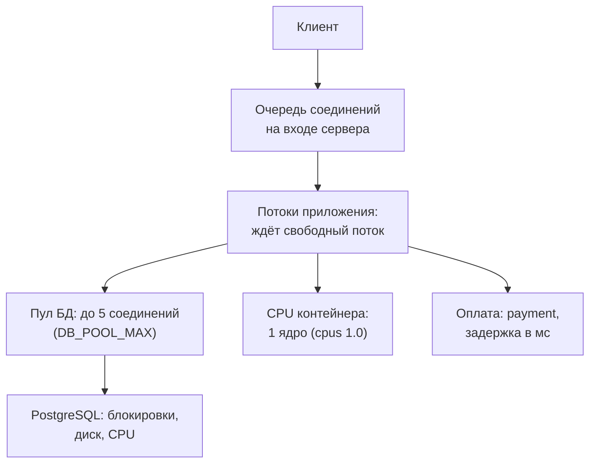

## Зачем это нужно

Я много лет гоняю нагрузку на сервисы и сейчас покажу, как это считают. Начнём с твоей первой рабочей проблемы. Менеджер подходит с вопросом, на который нельзя ответить «ну, вроде нормально»: «В прошлом году на распродаже сайт встал. А за час до этого жил спокойно при почти такой же нагрузке. Что случилось? И если сейчас всё хорошо на 70%, что будет на 90%?»

В [уроке 8.1](01-latency-throughput.md) ты видел «хоккейную клюшку»: пока нагрузка небольшая, задержка почти не растёт, а у предела уходит вверх. Теперь выясним, откуда она берётся. Везде, где ресурс ограничен, есть **очередь**: место, где запросы ждут, пока освободится кассир, процессор или соединение с базой. Очереди подчиняются одним и тем же законам, будь то касса в магазине или база данных.

Из этих законов получаются два инструмента. Первый: по загрузке (доле времени, когда ресурс занят) прикинуть, во сколько раз вырастет ожидание. Второй: **закон Литтла**, формула из трёх чисел: сколько запросов внутри системы, сколько их приходит и сколько времени каждый там проводит. По ней размер пула соединений считают за минуту на бумаге.

Шаг проекта: ты напишешь `~/perf-lab/08-theory/sweep.py`, ступенчатый прогон. Это тест, где нагрузку поднимают ступеньками (1 поток, 2, 4, 8…) и на каждой ступени меряют RPS и задержку. Поток здесь это виртуальный пользователь: кусочек тестовой программы, который шлёт запрос, ждёт ответ и повторяет. По таблице ты найдёшь **колено**: точку, где RPS почти перестаёт расти и выходит на **плато**, ровную «полку», выше которой сервис не поднимется. Число с колена пригодится для плана испытаний в [уроке 8.4](04-load-profile-slo.md).

## Что нужно знать

- Задержка, пропускная способность, перцентили и «хоккейная клюшка» на уровне [урока 8.1](01-latency-throughput.md). Файлы `measure.py` и `baseline.md` из него понадобятся.
- Пул соединений с базой как идея: [урок 2.3](../02-web/03-backend-anatomy.md). Здесь мы наконец посчитаем, какого он должен быть размера.
- Лимиты CPU у контейнеров стенда: [урок 5.4](../05-docker/04-limits-stats.md). У `shop` выдан один процессор, это важно для понимания, где у нас колено.
- PromQL `rate` и `sum`: [урок 7.2](../07-observability/02-promql.md).

## Картина целиком

Возьми кассу в продуктовом магазине. Покупатели приходят в случайные моменты и встают в очередь. Дождавшись, подходят к кассе, их пробивают, они уходят. В этой модели три участника: **приход** (кто и как часто приходит), **очередь** (где ждут) и **обслуживание** (кто и сколько работает с покупателем). Тот же скелет у любой системы с ограниченным ресурсом.



Что здесь видно: задержка состоит из двух частей. «Работа» зависит от кода и базы и почти не меняется с нагрузкой. «Ожидание» зависит от того, сколько народа стоит перед тобой, и именно оно взрывается у предела. Три мысли, которые мы разберём:

- очередь есть, даже когда ресурс в среднем не перегружен, потому что запросы приходят неровно;
- у предела задержка растёт непропорционально: небольшая прибавка нагрузки даёт многократный рост ожидания;
- «сколько внутри» равно «сколько приходит в секунду» умножить на «сколько каждый проводит внутри» (закон Литтла).

## Теория

### Очередь и загрузка: насколько занят ресурс

Бариста варит кофе две минуты, и за час к нему приходит двадцать человек. Занят ли он весь час? Нет, но очередь у него всё равно будет. Я сам сначала не верил.

Сначала слова. Покупатель какое-то время стоит в очереди: это **время ожидания**. Потом бариста две минуты возится только с ним: это **время обслуживания**. Вместе они дают **время в системе**, то есть то, что чувствует человек. У сервиса это задержка из урока 8.1. Для запроса «открыть карточку товара» (`GET /api/products/{id}`) время обслуживания около 5 мс, для «войти в аккаунт» (`POST /api/login`) около 250 мс. Эти цифры замерены на стенде, в практике увидишь их сам.

> **Прикинь сам:** бариста варит кофе 2 минуты, за час приходят 20 человек. Сколько минут из часа он занят?
{: .predict}

Двадцать раз по 2 минуты: 40 минут из 60, то есть две трети часа, 0,67. Долю времени, когда ресурс занят, называют **загрузкой**: бариста загружен на 67%. Её легко спутать с **нагрузкой**, а это разные вещи. Нагрузка это сколько запросов подали (20 человек в час, или «поданная нагрузка» из 8.1: сколько запросов в секунду шлёт тестовая программа вроде твоего `measure.py`). Загрузка это то, во что нагрузка превращается внутри ресурса: доля занятого времени, от 0 до 100%.

Правило словами: загрузка равна «сколько приходит, умножить на сколько длится каждый». Если обслуживающих несколько, делим на их число. Короткая запись: **загрузка = скорость прихода × время обслуживания ÷ число обслуживающих**. Единицы должны совпадать: люди в минуту на минуты на человека.

Теперь сервер. У `shop` один процессор, логин занимает его на 250 мс. Приходят 2 логина в секунду: 2 × 0,25 даёт полсекунды работы на каждую секунду, загрузка 50%. При 4 логинах в секунду выходит секунда работы за секунду, загрузка 100%. Это предел логина из 8.1, и его можно вычислить заранее. **Максимум в секунду = число обслуживающих ÷ время обслуживания**: 1 ÷ 0,25 = 4.

> **Главное:** загрузка это доля времени, когда ресурс занят: приход × время обслуживания ÷ число обслуживающих. Нагрузка это сколько запросов подали.
{: .key}

Считать загрузку мы научились. Но почему при 90% всё вдруг встаёт, а при 70% нет?

### Почему очередь растёт резко, а не плавно

Многие думают: на 90% ждать чуть дольше, чем на 80%. Посмотрим, что получается на самом деле.

Я однажды согласовал тест «до 90% загрузки, там же всего на двадцать пунктов выше, чем сейчас». Первые ступени шли красиво. На 90% график ушёл вверх, показывая секунды, а коллега спросил, не сломал ли я стенд. Я ничего не ломал: просто думал, что ожидание растёт вместе с загрузкой по прямой. С тех пор я не прошу «чуть-чуть побольше».

Откуда резкость? Запросы приходят неровно: в среднем один в секунду, но бывает три подряд, а потом две секунды тишины. А простой нельзя отложить про запас: пока касса стояла пустой, это время пропало. Поэтому, когда приходит пачка, наверстать нечем. Свободное время кассира это скорость, с которой он разгребает накопившееся. Чем его меньше, тем дольше разгребать: если свободна половина времени, очередь рассасывается вдвое дольше, если десятая часть, то в десять раз.

Отсюда простая оценка: время в системе равно времени обслуживания, делённому на долю свободного времени. У баристы с заказом 2 минуты при загрузке 50% свободно 0,5: 2 ÷ 0,5 = 4 минуты (2 ждал и 2 работал). При 80% свободно 0,2: 2 ÷ 0,2 = 10 минут. При 95% свободно 0,05: 2 ÷ 0,05 = 40 минут. Короткая запись: **время в системе = время обслуживания ÷ (1 − загрузка)**, где «1 − загрузка» и есть доля свободного времени. Формула для одной кассы и случайного прихода: у реальных систем цифры чуть другие, форма та же.

<div class="viz" data-viz="chart" data-type="line" data-x="30,50,70,80,90,95" data-x-label="Загрузка, %" data-y-label="Время в системе, мин" data-unit="мин" data-explain="Время в системе у бариста с заказом 2 минуты: до 50% время вдвое больше обслуживания, до 70% в 3,3 раза, дальше всё круче." data-series='[{"name":"Время в системе, мин","values":[2.9,4,6.7,10,20,40]}]'></div>

Что здесь видно: с 80% до 90% нагрузка выросла на 12,5%, а время удвоилось. Между 95% и 99% нагрузка выросла на 4%, а время в пять раз: при 99% это уже 200 минут. Это та самая «клюшка» из 8.1.

Теперь живая очередь: одна касса, 4 покупателя в минуту, обслуживание около 12 секунд (загрузка 80%).

<div class="viz" data-viz="queue" data-servers="1" data-rate="4" data-service="12"></div>

Что здесь видно: очередь то исчезает, то вырастает, хотя среднее число приходящих не меняется. Подними приход выше 5 в минуту: касса не справится, и очередь начнёт расти без конца. Добавь вторую кассу ползунком «Кассы»: загрузка упадёт до 40%, очередь растает. У сервиса так же: запас возвращают добавлением ядра, воркера или копии.

> **Проверь понимание:** сервис отвечает за 50 мс. Во сколько раз ожидание в очереди при загрузке 90% больше, чем при 50%? Ожидание это время в системе минус время обслуживания.

<details markdown="1">
<summary>Ответ</summary>

При 50% время в системе 50 ÷ 0,5 = 100 мс, ожидание 100 − 50 = 50 мс. При 90% время в системе 50 ÷ 0,1 = 500 мс, ожидание 450 мс. Ожидание выросло в 9 раз при росте загрузки в 1,8 раза.

</details>

> **Главное:** время в системе равно времени обслуживания, делённому на долю свободного времени, и у предела эта доля почти нулевая.
{: .key}

Мы знаем, как растёт очередь. Теперь нужен способ считать, сколько запросов в ней стоит.

### Закон Литтла: сколько запросов внутри

Сколько соединений дать пулу? Гадать не нужно: это считается за минуту, и сейчас я покажу как.

Представь ванну. Из крана каждую минуту льётся 10 литров, каждый литр проводит в ванне 5 минут, пока не уйдёт в слив. Сколько воды в ванне? За 5 минут натекает 5 × 10 = 50 литров, столько и будет внутри.

Правило словами: внутри системы одновременно находится столько запросов, сколько их приходит за время одного «визита». Короткая запись: **сколько внутри = сколько приходит в секунду × сколько времени каждый проводит внутри**. Это закон Литтла (Little's law). В учебниках и на собеседованиях его пишут как L = λ × W (внутри = приход × время), так что узнай его в таком виде.

Закон верен, пока система не копит очередь без конца: за долгое время сколько зашло, столько и вышло. Три оговорки. Единицы одни и те же: если приход в секунду, то 25 мс пишем как 0,025 с. «Внутри» это и очередь, и обслуживание, а границу системы выбираешь ты: весь «Магазин», только очередь или только пул. И закон про среднее: про всплески он молчит.

<div class="viz" data-viz="perf-little" data-rate="6" data-time="60" data-place="кафе"></div>

Что здесь видно: в кафе приходит 6 человек в минуту, каждый сидит около минуты, значит, внутри в среднем 6 × 1 = 6. Точки это люди, внизу график «сколько внутри». Он колеблется вокруг жёлтой линии «по формуле»: люди приходят неровно, но в среднем число держится у линии. Удвой приход и убедись, что внутри вдвое больше.

> **Прикинь сам:** сервис получает 80 запросов в секунду. В Grafana `http_requests_in_progress` в среднем равно 16. Сколько в среднем времени запрос проводит внутри?
{: .predict}

Закон работает в обе стороны. Внутри = приход × время, значит, время = внутри ÷ приход = 16 ÷ 80 = 0,2 с, то есть 200 мс. Зная любые две величины, находишь третью.

Два примера на «Магазине». Приходит 200 запросов в секунду, каждый проводит в сервисе 25 мс. Внутри 200 × 0,025 = 5 запросов одновременно: столько покажет `http_requests_in_progress`. Теперь пул. Приходит 50 запросов в секунду, каждый держит соединение с базой 40 мс. Занято в среднем 50 × 0,04 = 2 соединения. Но ставят не 2, а в 2–3 раза больше, то есть 5–6: приход неровный, и пачка запросов должна найти свободные соединения. Такой расчёт делает виджет «пул» из [урока 2.3](../02-web/03-backend-anatomy.md). А что будет, если запрос станет держать соединение дольше, ты посчитаешь в «Сломай и почини».

Осторожно: закон про среднее, а пик может быть в 10 раз выше. Если числа не сходятся, ищи ошибку в замерах: у меня они однажды разошлись вдвое, потому что я смотрел на разные маршруты.

> **Главное:** в устойчивой системе внутри = приход × время внутри; это среднее, и любую из трёх величин находят по двум другим.
{: .key}

Литтл работает для любой системы. Но нагрузку мы будем подавать вполне определённо, и от выбора способа зависит, увидим ли мы перегрузку.

### Открытая и закрытая модели нагрузки

Однажды я показал красивый отчёт: p95 две секунды, RPS 50, вроде не катастрофа. Коллега спросил: «А сколько запросов вы не отправили?» Вопрос оказался точным, и сейчас станет ясно почему.

Когда ты запускаешь `python measure.py catalog 8 ...`, число 8 это число потоков, то есть виртуальных пользователей: каждый шлёт запрос, получает ответ и только потом шлёт следующий. Настоящие покупатели ведут себя иначе: если сервер замедлился, новые люди всё равно приходят на сайт, они не знают, что чей-то запрос ещё не вернулся.

Закрытая модель похожа на столовую для сотрудников завода: обедать пришли 50 человек, и пока ты стоишь в очереди, прийти ещё раз не можешь. Внутри всегда не больше N запросов, а чем медленнее сервер, тем меньше запросов в секунду. Открытая модель похожа на вокзальный фастфуд: поток прохожих не зависит от очереди. Запросы приходят с заданной скоростью независимо от ответов, и при замедлении очередь растёт без границ.

Посчитаем это законом Литтла: внутри N пользователей, каждый «визит» длится ответ плюс **раздумье** (think time: сколько человек читает страницу до клика). Получается **RPS = N ÷ (время ответа + время раздумья)**. При 100 пользователях, ответе 0,2 с и раздумье 5 с выходит 100 ÷ 5,2 = 19,2 RPS. Поэтому «100 пользователей» не равно «100 RPS»: так в [уроке 8.4](04-load-profile-slo.md) мы будем переводить пользователей в запросы.

Теперь эксперимент. Один сервер, запрос занимает 100 мс. Красная линия: открытая модель, 8 запросов в секунду. Синяя: закрытая, 10 пользователей с раздумьем около 1,15 с. Проверим по Литтлу: 10 ÷ (0,1 + 1,15) = 8, то есть в начале обе линии дают те же 8 запросов в секунду. На 20-й секунде сервер замедляется втрое (запрос теперь 300 мс) на 20 секунд.

<div class="viz" data-viz="perf-open-closed" data-rate="8" data-users="10" data-slow="3"></div>

Что здесь видно: при замедлении сервер успевает 3,3 запроса в секунду вместо 10. В открытой модели по-прежнему приходит 8, очередь растёт ровно вверх, а ответ доходит до десятков секунд. В закрытой все 10 пользователей застряли в очереди, новые запросы не приходят, и ответ растёт лишь до 3 секунд. После замедления открытая модель восстанавливается долго, закрытая быстро.

Что из этого следует для тестов. Сервер на пределе, ответ стал 2 секунды вместо 0,1, а ты тестируешь 100 потоками. Раньше каждый поток слал 1 ÷ 0,1 = 10 запросов в секунду, всего 1000. Теперь каждый шлёт по запросу в 2 секунды, всего 50: нагрузка сама упала в 20 раз. Отчёт покажет «p95 2 с, RPS 50», будто ничего страшного. Но реальные пользователи приходили бы с прежней скоростью (скажем, 1000 в секунду), и очередь была бы бесконечной. Эту ловушку называют **координированным пропуском** (coordinated omission): тестовая программа замедлилась вместе с сервером и не отправила запросы, которые должна была, поэтому проблему не видно.

Значит, закрытая модель никуда не годится? Годится, но для другого. Когда ты ищешь предел, ты сам растишь число потоков и смотришь, где RPS перестаёт расти, и замедление программы здесь как раз сигнал. А проверять заданную скорость прихода («выдержим ли мы 1000 в секунду») так нельзя: для этого нужна открытая модель. Поэтому колено мы ищем потоками, а проверять план будем иначе.

<details markdown="1">
<summary>Для любопытных: какие инструменты какую модель дают</summary>

Названия ниже это инструменты из тем 9 и 10, сейчас запоминать их не нужно. `measure.py` из 8.1 и пользователи Locust (инструмент нагрузочных тестов) с паузой `wait_time` это закрытая модель. Сценарий k6 с `constant-arrival-rate` (он лежит в `project/shop/examples/k6/shop.js`) это открытая.

</details>

> **Проверь понимание:** сервер за 5 минут теста замедлился в 10 раз. Какая модель покажет, что очередь накопилась без конца: закрытая из 20 потоков или открытая со скоростью 100 запросов в секунду?

<details markdown="1">
<summary>Ответ</summary>

Открытая: она продолжает приходить со скоростью 100 в секунду, пока сервер успевает, скажем, 10, и очередь растёт на 90 запросов каждую секунду. Закрытая не превысит 20 запросов внутри и покажет рост задержки, но не катастрофу.

</details>

> **Главное:** закрытая модель ждёт ответа и сама сбавляет нагрузку, открытая шлёт по расписанию; перегрузку честно видит только открытая, а предел удобно искать закрытой.
{: .key}

Мы знаем, какой моделью искать предел. Найдём его.

### Колено: где кончается «всё хорошо»

Менеджеру нужна одна цифра: «до скольких запросов в секунду всё в порядке». Как выбрать её из таблицы с десятком строк?

Нагрузку растят ступенями: 1 поток, 2, 4, 8 и так далее. На каждой ступени замеряют RPS и задержку. RPS сначала растёт почти по прямой, потому что каждый новый поток добавляет работы. Потом график изгибается и выходит на плато, ровную полку: сервис упёрся в предел и больше обработать не может. Задержка сначала почти плоская, а после изгиба растёт вместе с числом потоков. Причина в Литтле: «внутри» всегда ровно столько запросов, сколько потоков, поэтому время = потоки ÷ RPS, и когда RPS встал, время растёт вместе с потоками.

Колено это точка на кривой RPS, где она достигает 90% от плато. Скажу честно: девяносто это договорённость практиков, а не закон природы. Но она не с потолка, и вот почему. Возьмём прогон 1, 2, 4, 8 и 16 потоков с результатом 190, 330, 480, 540 и 550 RPS. С 4 до 16 потоков RPS вырос всего на 15%, с 480 до 550. А время ответа по Литтлу выросло с 4 ÷ 480 = 8,3 мс до 16 ÷ 550 = 29 мс. Последние проценты RPS обходятся почти всей прибавкой задержки, поэтому колено ставят там, где они ещё не начались.



Что здесь видно: плато говорит, что дальше смысла нет, а колено говорит, где остановиться. После обоих следующий вопрос не «ещё нагрузки», а «что упёрлось» (блокировки это ожидание: запрос ждёт, пока другой отпустит строку в таблице).

В нашем прогоне плато 550, девяносто процентов от него 495. Кривая переходит эту отметку между 4 потоками (480) и 8 потоками (540): колено около 500 RPS. Рабочую нагрузку берут на 60–70% от колена: 0,6–0,7 × 500, то есть 300–350 RPS. Запас в 30–40% съедает всплеск: если трафик вырастет в 1,5 раза, с 300 он дойдёт до 450, с 350 до 525, то есть едва выше колена. Это тоже договорённость практиков.

> **Прикинь сам:** прогон 1, 2, 4, 8 потоков дал 100, 190, 200, 200 RPS. Где колено и какая рабочая нагрузка?
{: .predict}

Плато 200, девяносто процентов от него 180. Кривая переходит отметку между 1 потоком (100) и 2 потоками (190), ближе ко второму: колено около 2 потоков и около 180 RPS. Полка видна уже с 2 потоков: 190 и 200 почти одно и то же. Рабочая нагрузка: 0,6–0,7 × 180, то есть около 110–125 RPS.

Колено не максимум: на плато задержка уже плохая, а на колене ещё можно жить. И в отчёте колено называют по RPS, а не по потокам: потоки ты крутишь, RPS получаешь.

> **Главное:** колено это точка, где RPS достигает 90% плато; рабочую нагрузку берут на 60–70% от неё, чтобы остался запас на всплеск.
{: .key}

Колено нашли. Но где именно в «Магазине» упёрлись, подскажут очереди.

### Где в «Магазине» прячутся очереди

Формулы есть, а где у «Магазина» касса? Очередь стоит перед каждым ограниченным ресурсом.



Что здесь видно: «касс» минимум шесть, и любая может стать узким местом. Какая, показывают метрики: каждая очередь оставляет след.

| Где очередь | Признак в метриках «Магазина» |
|---|---|
| Процессор `shop` | CPU контейнера около 100% от выданного ядра; RPS стоит, задержка растёт |
| Потоки приложения | `http_requests_in_progress` растёт, при этом CPU не 100% |
| Пул соединений БД | `shop_db_pool_waiting` больше нуля, растёт `shop_db_connection_wait_seconds` |
| База данных | долгие запросы в `pg_stat_statements`, ожидание блокировок; пул занят, а CPU `shop` низкий |
| Оплата | `shop_payment_duration_seconds` вырос; заказы медленные, остальное нормально |

Правило поиска: очередь стоит перед самым медленным ресурсом, и перед ним же растёт счётчик «ждут». Большинство очередей неявные, их видно только по метрикам. В теме 11 пройдёмся по каждой строке.

> **Проверь понимание:** задержка растёт, RPS стоит, CPU контейнера `shop` 30%, `shop_db_pool_waiting` равно 4. Где очередь?

<details markdown="1">
<summary>Ответ</summary>

В пуле соединений с базой: запросы ждут свободного соединения (в очереди 4), а CPU не занят, потому что они спят в ожидании. Лечение не «больше процессора», а расчёт пула по закону Литтла и сокращение времени, которое запрос держит соединение.

</details>

> **Главное:** очередь стоит перед самым медленным ресурсом, и её выдаёт счётчик «ждут» именно этого ресурса.
{: .key}

Вернёмся к менеджеру. На «выдержим распродажу?» у тебя теперь есть ответ: «Найдём колено ступенчатым прогоном и возьмём 60–70% от него как рабочую нагрузку. До 90% загрузки не доводим: там ожидание растёт не прибавкой, а в разы. А где упрёмся, покажут метрики очередей».

## Практика

Файлы урока складывай в `~/perf-lab/08-theory/`. Нагрузку даём только на свой стенд.

### 1. Подготовка

```bash
cd ~/load-tester/project/shop
docker compose --profile monitoring up -d --wait
curl -s localhost:8000/readyz
cd ~/perf-lab/08-theory && source ~/perf-lab/.venv/bin/activate && ls
```

```text
{"status":"ready"}
baseline.md  curl-time.txt  measure.py
```

Если стенд запущен с изменёнными настройками, верни стандартные: `cd ~/load-tester/project/shop && cp .env.example .env && docker compose up -d`, и задержку оплаты: `curl -s -X POST localhost:8001/admin/config -H 'Content-Type: application/json' -d '{"delay_ms": 50}'`.

### 2. Ступенчатый прогон: sweep.py

Задача: на каждой ступени (число потоков) гнать нагрузку фиксированное время и печатать строку таблицы. `measure.py` делал фиксированное **число** запросов, а нам удобнее фиксированное **время**: на каждой ступени одинаково по длительности. Поэтому напишем новый файл и возьмём из `measure.py` готовые функции `one_request` и `percentile`: `from measure import ...` подключает функции из соседнего файла, у которого `main()` защищён строкой `if __name__ == "__main__"` и поэтому не запустится.

Создай `~/perf-lab/08-theory/sweep.py`:

```python
"""Ступенчатый прогон: растим число потоков, на каждой ступени гоним нагрузку N секунд.

Запуск:  python sweep.py catalog 1,2,4,8,16,32 10
         python sweep.py login 1,2,4,8 10
"""
import csv
import os
import sys
import time
from concurrent.futures import ThreadPoolExecutor

import requests

from measure import one_request, percentile


def worker(mode, seconds):
    """Один «пользователь»: шлёт запросы подряд, пока не истечёт время."""
    session = requests.Session()
    end = time.perf_counter() + seconds
    results = []
    while time.perf_counter() < end:
        results.append(one_request(session, mode))
    return results


def main():
    mode, steps, seconds = sys.argv[1], [int(x) for x in sys.argv[2].split(",")], float(sys.argv[3])
    rows = []
    print(f"{'потоков':>8} {'RPS':>7} {'среднее':>8} {'p50':>6} {'p95':>6} {'ошибок':>7} {'RPS×среднее':>12}")
    for users in steps:
        started = time.perf_counter()
        with ThreadPoolExecutor(max_workers=users) as pool:
            futures = [pool.submit(worker, mode, seconds) for _ in range(users)]
            results = [item for f in futures for item in f.result()]
        elapsed = time.perf_counter() - started
        ms = sorted(sec * 1000 for sec, _ in results)
        errors = sum(1 for _, code in results if code == 0 or code >= 400)
        rps = len(ms) / elapsed
        mean = sum(ms) / len(ms)
        row = [users, round(rps, 1), round(mean, 1), round(percentile(ms, 50), 1), round(percentile(ms, 95), 1), errors]
        print(f"{users:>8} {rps:>7.1f} {mean:>8.1f} {row[3]:>6.1f} {row[4]:>6.1f} {errors:>7} {rps * mean / 1000:>12.1f}")
        rows.append(row)
        time.sleep(3)  # пауза, чтобы очередь рассосалась и следующая ступень началась с чистого листа
    path = os.path.expanduser(f"~/perf-lab/results/sweep-{mode}.csv")
    with open(path, "w", newline="") as f:
        writer = csv.writer(f)
        writer.writerow(["threads", "rps", "mean_ms", "p50_ms", "p95_ms", "errors"])
        writer.writerows(rows)
    print(f"Сохранено: {path}")


if __name__ == "__main__":
    main()
```

Разбор нового:

- `worker` крутит цикл `while`, пока `time.perf_counter()` не перешёл заданное время `end`: так каждая ступень длится одинаково, независимо от скорости сервиса.
- `[int(x) for x in sys.argv[2].split(",")]` превращает строку `"1,2,4,8"` в список чисел: `split(",")` режет по запятым, `int` превращает каждую часть в число.
- Последняя колонка `RPS×среднее` это закон Литтла: RPS умножить на среднюю задержку в секундах (мс делим на 1000). Это число «запросов внутри».
- `time.sleep(3)` между ступенями нужен, чтобы остатки очереди от предыдущей ступени не испортили следующую.
- `csv.writer` записывает таблицу в файл `~/perf-lab/results/sweep-<режим>.csv` (каталог `results` создан в [уроке 1.1](../01-linux/01-workstation-terminal.md)): позже эти данные пригодятся для графиков и отчёта.

**Типичные ошибки:**

- `ModuleNotFoundError: No module named 'measure'`: запустил не из каталога `~/perf-lab/08-theory`. Python ищет `measure.py` рядом с запускаемым файлом и в текущем каталоге.
- `FileNotFoundError` на `results/sweep-...csv`: нет каталога `~/perf-lab/results`. Создай: `mkdir -p ~/perf-lab/results`.

### 3. Найди колено на каталоге

Карточка товара самый лёгкий маршрут, она покажет «чистое» колено. 6 ступеней по 10 секунд, это минута с небольшим:

```bash
python sweep.py catalog 1,2,4,8,16,32 10
```

```text
 потоков     RPS  среднее    p50    p95  ошибок  RPS×среднее
       1   187.0      5.3    4.0    8.1       0          1.0
       2   330.2      6.1    5.0   10.2       0          2.0
       4   480.5      8.3    7.0   14.0       0          4.0
       8   540.1     14.8   13.0   31.0       0          8.0
      16   550.3     29.1   27.0   61.0       0         16.0
      32   545.4     58.7   55.0  118.0       0         32.0
Сохранено: /home/student/perf-lab/results/sweep-catalog.csv
```

**Как читать вывод:** твои числа будут другими, форма та же. Смотри по колонкам. **RPS**: растёт 187, 330, 480, потом изгибается (540) и встаёт на плато около 550. Максимум 550, 90% от него 495, значит, колено между 4 и 8 потоками. **p50 и p95**: до 4 потоков растут медленно (p50 с 4 до 7 мс, p95 с 8 до 14 мс, то есть в 1,5–2 раза), после колена растут вдвое с каждым удвоением потоков: потоки добавляют только ожидание. **Последняя колонка** почти равна числу потоков: закон Литтла в закрытой модели, «внутри» ровно столько запросов, сколько потоков. А вот **среднее ≈ потоки ÷ RPS**: 32 потока ÷ 545 RPS = 58 мс. Рабочая нагрузка: 60–70% от 500, то есть примерно **300–350 RPS**.

Посмотри те же числа на графиках:

<div class="viz" data-viz="chart" data-type="line" data-x="1,2,4,8,16,32" data-x-label="Потоков" data-y-label="RPS" data-explain="Пропускная способность растёт линейно, изгибается между 4 и 8 потоками и выходит на плато около 550 RPS: это колено и предел." data-series='[{"name":"Пропускная способность, RPS","values":[187,330,480,540,550,545]}]'></div>

<div class="viz" data-viz="chart" data-type="line" data-x="1,2,4,8,16,32" data-x-label="Потоков" data-y-label="p95, мс" data-unit="мс" data-explain="Задержка плоская до колена, после него растёт пропорционально числу потоков: лишние запросы ждут." data-series='[{"name":"Задержка p95, мс","values":[8.1,10.2,14,31,61,118]}]'></div>

Что здесь видно: график RPS загибается и ложится на плато, график p95 зеркально загибается вверх. Колено это та же точка на обоих: пока RPS растёт, задержка стоит, потом всё наоборот. Наведи мышь на любую точку, чтобы увидеть значения.

**Типичные ошибки:**

- RPS растёт до самого конца без плато: генератор слишком слабый или у сервиса много ресурсов. Добавь ступеней (`1,2,4,8,16,32,64`). Но на 64 потоках Python-генератор сам упирается в процессор: **GIL** (global interpreter lock) это правило Python, по которому код исполняется только в одном потоке за раз, поэтому много потоков не дают больше расчётов в самом генераторе. Если загрузка процессора генератора 100%, измеряешь уже его.
- Много ошибок (колонка `ошибок`) на больших ступенях: сервис или его пул не выдерживает 32 одновременных запроса. Это тоже находка, запиши, на какой ступени они начались. Подробнее в [уроке 11.3](../11-bottlenecks/03-database.md).
- На плато растёт `ошибок` и падает RPS: «Магазин» не просто упёрся, а начал разваливаться (перегрузка). Колено у тебя то, что до этого.

> **Важное про генератор.** Python-потоки делят один интерпретатор, и при очень высоких RPS (сотни в секунду) сам `measure.py` становится узким местом: он занимает процессор целиком и не успевает отправлять. Если на плато `htop` показывает 100% на процессе `python`, а не на `shop`, колено твоё, но это колено **генератора**. Решение: следить за `docker stats` и `htop` во время прогона, и если упёрся генератор, это надо отметить в отчёте. Как обойти ограничение, узнаешь в [уроке 9.5](../09-locust/05-distributed-generator.md).

> Закон Литтла не сходится с твоими числами? Запиши `L`, `λ` и `W` с единицами и попроси нейросеть проверить арифметику. Единицы пересчитай сам: чаще всего ошибка в секундах и миллисекундах.
{: .ai}

### 4. Проверь закон Литтла по метрикам

Закон Литтла на стороне сервера. Запусти один прогон для устойчивого состояния и **пока он идёт** выполни три запроса PromQL в Prometheus `http://localhost:9090`:

```bash
python sweep.py catalog 16 40
```

```promql
# W: среднее время запроса внутри сервиса, секунд (сумма времени делить на число запросов)
sum(rate(http_request_duration_seconds_sum{route="/api/products/{id}"}[30s]))
/
sum(rate(http_request_duration_seconds_count{route="/api/products/{id}"}[30s]))

# приход: сколько запросов в секунду
sum(rate(http_requests_total{route="/api/products/{id}"}[30s]))

# внутри: сколько запросов в работе в среднем
avg_over_time(http_requests_in_progress[30s])
```

Ожидаемо (числа примерные):

```text
W      0.027      (27 мс)
приход 549        (запросов в секунду)
внутри 15.2
```

**Как читать вывод:** 549 × 0,027 = 14,8: это почти то, что показывает `http_requests_in_progress` (15,2). Закон Литтла сошёлся: приход × время внутри = внутри. Небольшое расхождение нормально: Prometheus опрашивает метрики раз в 5 секунд, и «внутри» это моментальный снимок, а не усреднение. У клиента (генератора) то же время получится чуть больше (29 мс, а не 27): к нему добавились сеть и очередь на входе, которые сервер не видит ([урок 8.1](01-latency-throughput.md), раздел «Где меряют»).

Важный вывод: **если эти три числа перестали сходиться, где-то ошибка в измерениях**, а не «закон не работает». Либо ты смотришь на разные маршруты и окна, либо система не в устойчивом состоянии (нагрузка меняется), либо метрика считает не то, что ты думаешь.

**Типичные ошибки:**

- Пустой результат: нагрузка уже закончилась. Запрос надо выполнять, пока `sweep.py` идёт, или взять окно `[5m]` и смотреть, пока он ещё в окне.
- Расхождение вдвое и больше: окна `[30s]` разные в трёх запросах или неточно указан `route`. Проверь метки: `count by (route) (http_requests_total)`.

### 5. Логин: предел сразу

Сравни: у каталога есть длинная «ручка» до колена, у логина её нет.

```bash
python sweep.py login 1,2,4,8 10
```

```text
 потоков     RPS  среднее    p50    p95  ошибок  RPS×среднее
       1     3.8    262.4  258.0  301.0       0          1.0
       2     3.9    512.8  510.0  560.0       0          2.0
       4     3.9   1026.3 1020.0 1104.0       0          4.0
       8     3.9   2051.2 2040.0 2180.0       0          8.0
Сохранено: /home/student/perf-lab/results/sweep-login.csv
```

**Как читать вывод:** колено у логина на **первом же потоке**: один бесконечно «нажимающий» пользователь уже занимает процессор целиком (bcrypt считает 250 мс чистой работы). Любой следующий поток только ждёт: RPS не растёт, задержка растёт ровно пропорционально числу потоков. Предел можно было посчитать заранее: 1 ядро ÷ 0,26 с = 3,8 RPS. Рабочая нагрузка логина: 60–70% от 3,8, это **2,5 RPS**. Эта цифра понадобится в [уроке 8.4](04-load-profile-slo.md): если в пиковый час покупатели логинятся чаще, чем 2,5 раза в секунду, «Магазин» нужно ускорять (в теме 11).

### 6. Запиши в baseline.md

Допиши в конец `~/perf-lab/08-theory/baseline.md`:

```markdown
## Колено и рабочая нагрузка (8.2)

Дата: ...  Машина: ...  Генератор: sweep.py на той же машине, ступени по 10 с

| Маршрут | Колено, RPS | Плато (предел), RPS | Рабочая нагрузка (60-70% колена) | Узкое место |
|---|---|---|---|---|
| GET /api/products/{id} | ... | ... | ... | CPU shop или генератора (проверить htop) |
| POST /api/login | 3.8 | 3.9 | 2.5 | CPU (bcrypt), 1 ядро |

Закон Литтла проверен: приход × время = внутри (14.8 против 15.2 по http_requests_in_progress).
```

Закоммить и отправь:

```bash
cd ~/perf-lab && git add 08-theory results && git commit -m "8.2: sweep.py, колено каталога и логина" && git push
```

## Сломай и почини

**Поломка.** Оплата стала отвечать за секунду. Ты хорошо знаешь из 8.1, что заказ тормозит. Теперь нужно **предсказать**, что именно произойдёт с пулом соединений, и проверить прогноз. По закону Литтла: заказ держит соединение с базой всё время оплаты, около 30 мс своей работы + задержка оплаты. Пул `DB_POOL_MAX=5`.

Прогноз на бумаге, при `delay_ms` = 1000: каждый заказ держит соединение около 1,03 с, значит, пул из 5 соединений пропустит не больше 5 ÷ 1,03 ≈ **4,9 заказа в секунду**. Если покупателей 10 (закрытая модель), то по закону Литтла ответ на заказ 10 ÷ 4,9 ≈ **2 секунды**.

Создай `~/perf-lab/08-theory/orders_load.py`: N покупателей оформляют заказы подряд.

```python
"""N покупателей подряд кладут товар в корзину и оформляют заказ.
Запуск: python orders_load.py 10 20     (покупателей, секунд)
"""
import random
import sys
import time
from concurrent.futures import ThreadPoolExecutor

import requests

from measure import BASE, percentile


def buyer(n, seconds):
    session = requests.Session()
    login = session.post(f"{BASE}/api/login",
                         json={"email": f"user{n:04d}@shop.lab", "password": "password"}, timeout=30)
    login.raise_for_status()
    session.headers["Authorization"] = f"Bearer {login.json()['token']}"
    end = time.perf_counter() + seconds
    times, errors = [], 0
    while time.perf_counter() < end:
        added = session.post(f"{BASE}/api/cart/items",
                             json={"product_id": random.randint(1, 10000), "qty": 1}, timeout=30)
        if added.status_code != 201:
            errors += 1
            continue
        started = time.perf_counter()
        order = session.post(f"{BASE}/api/orders", timeout=60)
        times.append((time.perf_counter() - started) * 1000)
        errors += order.status_code != 201
    return times, errors


def main():
    users, seconds = int(sys.argv[1]), float(sys.argv[2])
    started = time.perf_counter()
    with ThreadPoolExecutor(max_workers=users) as pool:
        results = [f.result() for f in [pool.submit(buyer, n + 1, seconds) for n in range(users)]]
    elapsed = time.perf_counter() - started
    ms = sorted(t for times, _ in results for t in times)
    errors = sum(e for _, e in results)
    print(f"заказов {len(ms)} за {elapsed:.0f} с = {len(ms) / elapsed:.1f} в секунду, ошибок {errors}")
    print(f"  среднее={sum(ms) / len(ms):.0f} мс  p50={percentile(ms, 50):.0f}  p95={percentile(ms, 95):.0f}")


if __name__ == "__main__":
    main()
```

Что здесь нового: `errors += order.status_code != 201` прибавляет 1, если заказ не создался (сравнение в Python даёт `True`, а это 1). `from measure import BASE, percentile` берёт адрес стенда и перцентиль из прошлого файла.

**Шаг 1. Норма.** Сначала замерь, как должно быть:

```bash
python orders_load.py 10 20
```

```text
заказов 1380 за 20 с = 69.0 в секунду, ошибок 0
  среднее=140 мс  p50=135  p95=220
```

Здесь 10 покупателей делают ~69 заказов в секунду (в учебном стенде это возможно: оплата-заглушка отвечает за 50 мс). Каждый заказ около 140 мс (в этом числе и очередь за единственным ядром).

**Шаг 2. Ломаем.** Оплата 1 секунда:

```bash
curl -s -X POST localhost:8001/admin/config -H 'Content-Type: application/json' -d '{"delay_ms": 1000}'
```

В соседнем терминале запусти каталог: он заказов не делает, но тоже ходит в базу через **тот же пул из пяти соединений**:

```bash
python measure.py catalog 2 3000
```

В первом снова `python orders_load.py 10 20`.

```text
заказов 98 за 20 с = 4.9 в секунду, ошибок 0
  среднее=2040 мс  p50=2030  p95=2090
```

и у каталога:

```text
catalog: потоков=2 запросов=3000 за 38.2 с, 78.5 RPS, ошибок 0
  среднее=25 мс  p50=14  p95=130  p99=620  max=1030
```

**Задача.** Объясни числа, не заглядывая в разбор: почему заказов именно около 5 в секунду, почему ответ на заказ около 2 секунд и почему каталог, который с оплатой не связан, тоже замедлился (в норме p99 был 19 мс). Подсказка: где у заказа очередь и что делит с каталогом.

<details markdown="1">
<summary>Разбор</summary>

1. **Пропускная способность по Литтлу.** Заказ держит соединение ~1,03 с (оплата внутри транзакции), в пуле 5 соединений: 5 ÷ 1,03 = 4,9 заказа в секунду. Получилось 4,9: сходится с прогнозом. Сколько бы покупателей ни пришло, быстрее нельзя.
2. **Ответ.** Покупателей 10 (закрытая модель), заказов 4,9 в секунду, значит, внутри 10 = 4,9 × время, время = 2 секунды. Из них 1 с оплата, остальное ожидание свободного соединения (в очереди пяти ждут ещё пятеро).
3. **Каталог.** Он берёт соединение из **того же пула**. Все пять соединений почти всё время заняты заказами, каталогу приходится стоять в той же очереди: p99 вырос до 620 мс, хотя сам запрос быстрый. Проверь в Prometheus: `shop_db_pool_waiting` держится около 5, а `histogram_quantile(0.95, sum by (le) (rate(shop_db_connection_wait_seconds_bucket[1m])))` показывает сотни миллисекунд. CPU `shop` при этом низкий: процессор не работает, потому что все спят в ожидании.

Это классическая картина: **медленная зависимость + ограниченный пул = очередь, которая тормозит чужие маршруты**. Закон Литтла предсказал её на бумаге до запуска.

Почини. Первый путь: вернуть оплату в норму.

```bash
curl -s -X POST localhost:8001/admin/config -H 'Content-Type: application/json' -d '{"delay_ms": 50}'
```

Теперь соединение занято 0,08 с, и пул держит 5 ÷ 0,08 = 62 заказа в секунду. Второй путь (в тесте не делаем): увеличить `DB_POOL_MAX`, но каждое соединение стоит базе памяти и процессов, и тогда ты просто сдвигаешь предел. Третий, правильный путь: не держать соединение во время вызова оплаты, это сокращает время «внутри» пула. Как это делать, узнаешь в [уроке 11.3](../11-bottlenecks/03-database.md) и [11.5](../11-bottlenecks/05-cache-dependencies.md).

</details>

## ИИ в помощь

Нейросеть неплохо проверяет арифметику закона Литтла и объясняет, откуда берётся «колено» на графике, но числа в рассуждениях у неё нередко плывут. Общие правила: [ИИ-помощник](../ai.md).

**Задача:** проверить расчёт по закону Литтла.

```text
Закон Литтла: L = λ × W. На стенде мои данные: поток запросов λ = <число> запросов в секунду,
среднее время в системе W = <число> мс, число одновременных запросов L по метрике
http_requests_in_progress = <число>. Проверь, сходится ли, переведи единицы явно
и покажи каждое действие. Если не сходится, назови причины, которые можно проверить.
```
{: .wrap}

**Проверь ответ:** пересчитай на калькуляторе, особенно перевод миллисекунд в секунды. Типичные ошибки: забытый перевод единиц, подстановка максимума вместо среднего и вывод «закон нарушен», хотя для устойчивой системы он выполняется всегда.

**Задача:** найти колено на своих данных.

```text
Вот таблица ступенчатого прогона: <вставь строки: пользователи, RPS, p95>.
Где колено (после какой ступени p95 растёт непропорционально)? Предложи рабочую нагрузку
с запасом и объясни, почему не на самом колене. Покажи рассуждение по числам.
```
{: .wrap}

**Проверь ответ:** найди колено глазами на графике из своего `sweep.py` и сравни. Типичная ошибка: нейросеть выбирает точку максимального RPS как «рабочую», хотя там задержка уже взлетела.

## Словарик урока

| Термин | Простыми словами |
|---|---|
| Очередь (queue) | Где запросы ждут, когда ресурс занят: поток, соединение, ядро, блокировка |
| Скорость прихода (arrival rate) | Сколько запросов приходит в секунду |
| Время обслуживания (service time) | Сколько ресурс работает над запросом, без ожидания |
| Время ожидания (waiting time) | Сколько запрос простоял в очереди |
| Время в системе (response time) | Ожидание плюс обслуживание: то, что видит клиент |
| Загрузка (utilization) | Доля времени, когда ресурс занят: приход × время обслуживания ÷ число ресурсов |
| Закон Литтла (Little's law) | Сколько внутри = сколько приходит в секунду × сколько каждый проводит внутри |
| Устойчивое состояние (steady state) | Сколько зашло, столько вышло, ничего не копится бесконечно |
| Колено (knee) | Ступень нагрузки, где RPS достигает ~90% максимума, а задержка начинает расти |
| Плато (plateau) | Участок, где RPS больше не растёт: предел ресурса |
| Закрытая модель (closed model) | Фиксированное число пользователей, каждый ждёт ответа и только потом шлёт новый запрос |
| Открытая модель (open model) | Запросы приходят с заданной скоростью, не дожидаясь ответов |
| Координированный пропуск (coordinated omission) | Ошибка генератора: он замедляется вместе с сервером и не замечает перегрузки |
| Пауза на раздумье (think time) | Время, которое пользователь тратит между запросами |

## Вопросы с собеседований

Раздел для повторения: ответь вслух, потом открой ответ. Короткие вопросы с пометкой `[на скорость]` тренируй на время: ответ за 30 секунд.



## Проверено на версиях

Ubuntu 24.04, Python 3.12, requests 2.34.2, стенд «Магазин» из `project/shop` (Python 3.14, PostgreSQL 18.6), Prometheus 3.15, Grafana 13.2. Октябрь 2026.

## Итог урока: ты умеешь

- [ ] Назвать составные части очереди (приход, ожидание, обслуживание) и посчитать загрузку ресурса.
- [ ] Объяснить, почему ожидание растёт резко у предела, и оценить его по загрузке.
- [ ] Применить закон Литтла: найти число запросов внутри, время или скорость прихода по двум известным.
- [ ] Прикинуть размер пула соединений и объяснить, почему нужен запас.
- [ ] Прогнать ступенчатый тест, найти колено и выбрать рабочую нагрузку на 60–70% колена.
- [ ] Различить открытую и закрытую модели и объяснить, как закрытая скрывает перегрузку.
- [ ] Найти по метрикам, перед каким ресурсом стоит очередь.

Дальше: [урок 8.3. Виды нагрузочных тестов](03-test-types.md): какой тест запускать, чтобы получить какой ответ.
