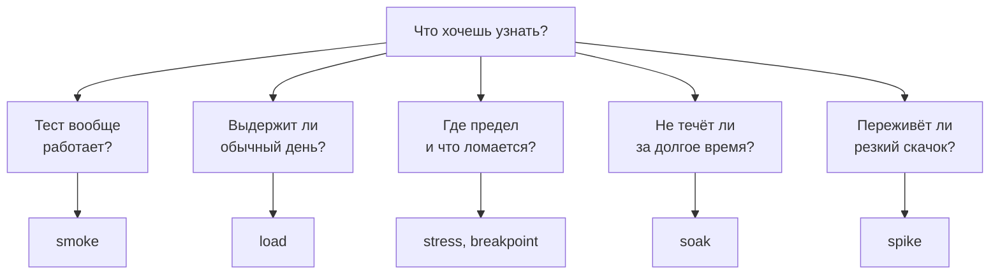
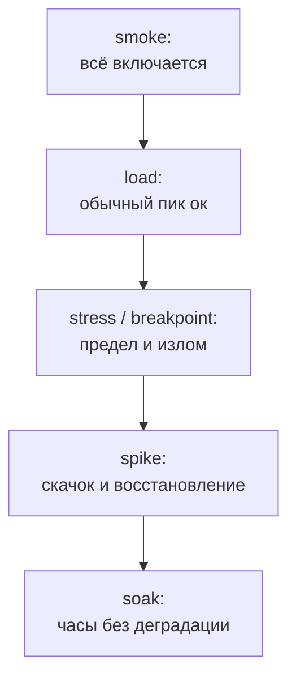

## Зачем это нужно

Новичок, которому сказали «нагрузи сервис», обычно делает одно: берёт инструмент, ставит побольше пользователей и смотрит, что будет. Через десять минут у него на руках график, который ни на что не отвечает. Сервис «выдержал 500 RPS»: и что? Хватит ли этого на распродажу? Не потечёт ли память к вечеру? Переживёт ли он рассылку, после которой за минуту придёт втрое больше людей? Каждый из этих вопросов требует **своего теста**, со своей формой нагрузки, длительностью и критерием успеха. Отсюда и появились названия: smoke, load, stress, soak, spike, breakpoint. Это не мода, а список вопросов, которые стоит задать системе.

В этом уроке ты научишься выбирать тип теста под вопрос: объяснишь, зачем нужен каждый, как выглядит его нагрузка во времени, сколько он длится и на что смотреть. На практике напишешь небольшой генератор `shape.py`, который гонит нагрузку **по профилю** (заданной скорости прихода, открытая модель из [урока 8.2](02-queues-littles-law.md)), и прогонишь на «Магазине» smoke, load, spike, breakpoint и мини-версию soak.

Шаг проекта: в `~/perf-lab/08-theory/` появляется `shape.py` и в `baseline.md` таблица «план испытаний»: какие тесты, зачем и с какими числами ты будешь гонять «Магазин» в следующих темах. Locust ([тема 9](../09-locust/01-first-locustfile.md)) и k6 ([тема 10](../10-k6/01-js-first-script.md)) сделают то же самое профессиональнее, но смысл тестов от инструмента не зависит, поэтому сначала смысл.

## Что нужно знать

- Задержка, p95, ошибки и baseline: [урок 8.1](01-latency-throughput.md).
- Колено, рабочая нагрузка 60–70% колена, открытая и закрытая модели: [урок 8.2](02-queues-littles-law.md). Числа колена из твоего `baseline.md` понадобятся при настройке профилей.
- Память контейнера и `docker stats`: [урок 5.4](../05-docker/04-limits-stats.md).

## Картина целиком

Представь, что ты принимаешь новый мост. Сначала дёргаешь за перила и пускаешь одного пешехода: держится ли вообще (это **smoke**, «дымовой» тест: включили, дыма нет). Потом выпускаешь обычный дневной поток машин и смотришь, нормально ли (**load**). Потом ставишь всё больше грузовиков, чтобы узнать, при каком весе мост начнёт сдавать и как именно (**stress** и **breakpoint**). Потом оставляешь обычный поток на неделю: не появятся ли трещины от усталости металла (**soak**). И наконец проверяешь, что будет, если разом хлынет толпа после футбольного матча и как быстро мост придёт в себя (**spike**). Аналогия ломается тем, что мост не восстанавливается сам, а сервис при снятии нагрузки обычно возвращается к норме, и скорость возвращения это отдельный результат теста.

Вся логика выбора умещается в одну схему: от вопроса к типу.



Что здесь видно: от вопроса идёт стрелка к типу теста, и тип выбирается **по вопросу, а не по настроению**. Если вопроса нет, тест не нужен: получишь красивый график без вывода.

## Теория

### Тест это вопрос с критерием ответа

**Зачем это существует.** Нагрузочный тест стоит времени и ресурсов: надо поднять среду, написать сценарий, прогнать, разобрать. Если у него нет вопроса, результат нечем оценить: 300 RPS, p95 150 мс, это хорошо или плохо? Поэтому до запуска записываются два предложения: **что хотим узнать** и **при каком результате считаем ответ положительным**. Второе называют **критерием успеха** (pass/fail criteria): например, «p95 каталога не больше 300 мс и ошибок меньше 1% при 300 RPS». Подробно о критериях и SLO мы поговорим в [уроке 8.4](04-load-profile-slo.md), здесь нужна сама привычка.

**Аналогия.** Медосмотр: «проверим всё» не бывает, врач выбирает анализы под вопрос. Аналогия ломается тем, что у врача есть нормы на всё, а у твоего сервиса нормы появятся только после того, как вы их договорите.

**Как это устроено.** У любого нагрузочного теста пять характеристик, по ним мы и опишем каждый тип:

1. **Цель**: на какой вопрос отвечает.
2. **Форма нагрузки**: как меняется скорость прихода (RPS) или число пользователей по времени.
3. **Длительность**: сколько минут или часов.
4. **Что смотреть**: какие метрики покажут ответ.
5. **Критерий**: что считается успехом.

Форму удобно рисовать: по горизонтали время, по вертикали нагрузка. Вот все пять классических форм рядом: переключай и смотри, чем они различаются.

<div class="viz" data-viz="load-profiles"></div>

Что здесь видно: у **smoke** нагрузка крошечная и короткая, у **load** ровная «полка» обычного дня, у **stress** лестница вверх, у **soak** тоже ровная полка, но растянутая на часы, у **spike** резкий пик на фоне спокойствия. Полка load и полка soak по высоте одинаковы, различие во времени: soak длится в десятки раз дольше.

**Что путают.** Названия: «стресс-тест» часто называют любой нагрузочный тест. Это неверно, и на собеседовании это сразу видно. Стресс-тест это именно «выше нормы, до отказа». Обычная ожидаемая нагрузка называется load.

> **Проверь понимание:** коллега просит «нагрузить сервис на 1000 RPS на 10 минут, посмотреть». Какие два вопроса ты задашь, прежде чем начинать?

<details markdown="1">
<summary>Ответ</summary>

«Что именно мы хотим узнать (выдержит ли обычный день, где предел, не течёт ли)?» и «Что считаем успехом: какие p95 и доля ошибок?» Без ответов непонятно ни форма нагрузки, ни длительность, ни то, хорошо ли получилось.

</details>

### Smoke: «включается ли оно вообще»

**Зачем это существует.** Большой тест дорог: час подготовки, час прогона. Обидно потратить его и узнать, что в сценарии опечатка в адресе, токен просрочен, а метрики никуда не пишутся. Smoke-тест (от «дымовой тест»: включил прибор, дыма нет, значит, можно работать дальше) отвечает на единственный вопрос: **работает ли сам тест и отвечает ли сервис**.

**Аналогия.** Перед стартом ракеты проверяют, что проводки подключены, а не что ракета долетит. Аналогия ломается тем, что ракету потом не вернуть, а smoke-тест повторяют по десять раз на дню.

**Как это устроено.**

- **Форма:** 1–5 пользователей или 1–2 запроса в секунду, никакого разгона.
- **Длительность:** 1–5 минут.
- **Что смотреть:** ошибки (их быть не должно), что запросы вообще доходят и успешны, что метрики на дашборде появились, что в логах нет исключений. Задержку **не оцениваем**: при двух запросах в секунду она ничего не говорит о боевой нагрузке.
- **Критерий:** 0 ошибок, все проверки зелёные.

Smoke ставят **перед любым другим тестом** и после каждого изменения сценария. Его же включают в автоматическую проверку после выкладки: быстрый тест по полному пути «вход, каталог, корзина, заказ» показывает, что релиз не сломал основное.

**Разобранный пример.** Smoke «Магазина»: 2 запроса в секунду по карточке товара 30 секунд. Ожидание: 60 запросов, 0 ошибок, p95 около 10 мс (на пустом стенде). Если вдруг p95 равен 2 секундам, это не «плохая производительность», это сигнал, что что-то не так со стендом или сценарием, и до load-теста надо разобраться.

**Что путают.** Smoke с «нагрузочным тестом на минимальной нагрузке»: цель другая. И «smoke прошёл, значит, сервис выдержит нагрузку»: ничего подобного, он ничего не говорит про нагрузку.

### Load: «выдержит ли обычный день»

**Зачем это существует.** Это основной тест. Он отвечает на вопрос бизнеса: «в обычный пиковый час сервис укладывается в цели?» Если нет, смысла проверять что-то экзотическое нет.

**Аналогия.** Проверка нового автобуса на маршруте: обычная загрузка в час пик, реальные остановки, реальное расписание.

**Как это устроено.**

- **Форма:** плавный **разгон** до целевой нагрузки (чтобы не бить по холодному кэшу и не путать разгон с пределом), затем **ровная полка**, затем **спад**. Целевая нагрузка это реальный пиковый час (как её посчитать, в [уроке 8.4](04-load-profile-slo.md)), для проверки рабочей зоны 60–70% колена из [урока 8.2](02-queues-littles-law.md).
- **Длительность:** разгон 2–5 минут, полка не меньше 10–15 минут (чтобы в метриках набралось хотя бы 100 точек: Prometheus опрашивает «Магазин» раз в 5 секунд, за 10 минут будет 120 точек), спад 1–2 минуты. Первые минуты полки (**прогрев**, warm-up) в расчёт критериев можно не брать: кэши, пулы и JIT ещё «холодные».
- **Что смотреть:** четыре вещи: RPS (дошли ли до цели), p95 и p99, доля ошибок, насыщение ресурсов (CPU, память, пул соединений). Все четыре на **полке**, а не на разгоне.
- **Критерий:** например, «p95 не больше 300 мс, ошибок меньше 1%, CPU не выше 70%, и RPS на полке не ниже цели».

**Разобранный пример.** Цель load «Магазина»: 300 RPS каталога (рабочая нагрузка из 8.2). План: 2 минуты разгон со 100 до 300, 10 минут полка, 1 минута спад. Результат: на полке RPS 299, p95 14 мс, ошибок 0, CPU `shop` 62%. Критерий выполнен. Если бы p95 оказалось 400 мс, мы бы не говорили «сервис плохой», а искали, где очередь (по таблице из 8.2).

**Что путают.** Нагрузку «как у нас сейчас» (среднее за сутки) и «как в пик»: тестировать надо пик, среднего не бывает ни у кого в пятницу вечером. И то, что load это «проверка, что всё ломается»: нет, он должен проходить. Ломать будет следующий тест.

### Stress: «где и как ломается»

**Зачем это существует.** Однажды нагрузка превысит обычную: распродажа, реклама, сбой у соседа. Заранее надо знать две вещи: **до какого значения** система держится и **как она ломается**: плавно (задержка растёт, ошибок нет) или резко (всё вдруг в ошибках, потом не поднимается). Второе важнее: деградацию можно пережить, обвал нет.

**Аналогия.** Нагружаем полку книгами, пока не прогнётся. Интересует не только вес, но и «хрустнула сразу или сначала погнулась».

**Как это устроено.**

- **Форма:** лестница. Нагрузка растёт ступенями выше обычной: 100%, 150%, 200% рабочей нагрузки и дальше. На каждой ступени держим несколько минут, чтобы система устоялась.
- **Длительность:** 20–40 минут: 5–8 ступеней по 3–5 минут.
- **Что смотреть:** на какой ступени p95 впервые вышел за критерий; на какой появились ошибки и какие (таймауты, 5xx, 429); что вырастет первым (CPU, пул, очередь); **что происходит при возврате** на обычную нагрузку: восстановилась ли система сама.
- **Критерий:** не «выдержал», а «найден предел, назван ресурс-виновник, деградация мягкая, восстановление после снятия нагрузки есть».

**Разобранный пример.** Рабочая нагрузка 300 RPS каталога, ступени 300, 450, 600, 750. На 450 p95 60 мс (подросло, но терпимо), на 600 p95 4 секунды и первые таймауты, на 750 сплошные ошибки. После возврата к 300 p95 вернулся к 14 мс за 2 минуты. Вывод: предел около 500, ломается плавно через очередь (задержка растёт перед ошибками), восстанавливается сам. Такой результат можно показать руководителю: он отвечает на вопрос «а если вдвое больше?»

**Что путают.** Смысл: стресс-тест не должен «пройти», он обязан найти границу. И ещё: если сломалось, это успех теста, а не его провал. Провал это когда ты не выяснил, **что** сломалось.

### Breakpoint: «где именно точка, где всё ломается»

**Зачем это существует.** Stress отвечает «что будет выше нормы». Иногда нужен точный предел: «до какого RPS работает и при каком перестаёт», чтобы вписать его в план ёмкости ([урок 12.3](../12-process/03-capacity.md)). Это и есть **breakpoint** (точка излома, максимальная ёмкость).

**Как это устроено.** Нагрузка растёт **непрерывно или маленькими ступенями** (по 5–10% за шаг), пока не нарушится критерий (p95 больше порога или доля ошибок больше порога). Тест **автоматически останавливается** на этом: у breakpoint есть условие стопа, иначе генератор будет бесконечно добивать упавший сервис. Результат одно число: «последняя нагрузка, при которой критерий выполнялся».

Именно так мы искали колено в [уроке 8.2](02-queues-littles-law.md), только закрытой моделью (потоками). Для настоящего breakpoint берут открытую: скорость прихода растёт сама, независимо от ответов, и ты видишь, как система разваливается под нагрузкой, а не под числом потоков.

**Разобранный пример.** Ступени по 30 секунд, цели 100, 200, 300, 400, 500, 600 RPS, критерий p95 до 300 мс. Результат на графике (порог p95 300 мс):

<div class="viz" data-viz="chart" data-type="line" data-x="100,200,300,400,500,600" data-x-label="Цель, RPS" data-y-label="p95, мс" data-unit="мс" data-explain="Задержка почти плоская до 300 RPS, на 400 уже заметно выросла, на 500 и 600 уходит вверх: очередь копится. Порог p95 300 мс нарушен на 500, значит, точка излома между 400 и 500 RPS." data-series='[{"name":"p95, мс","values":[6,8,14,45,900,6100]},{"name":"Порог, мс","values":[300,300,300,300,300,300]}]'></div>

Что здесь видно: линия задержки долго почти лежит, потом взлетает: хоккейная клюшка из 8.1, нарисованная ступенчатым тестом. Порог пересечён между 400 и 500: breakpoint около 450 RPS, и рабочая нагрузка 60–70% от этого, то есть 270–315 RPS (сходится с load из прошлого примера).

**Что путают.** Breakpoint и stress: у первого цель число (точка излома), у второго картина (как и что ломается). На практике их часто делают одним прогоном: лестница до тех пор, пока не сломается, с замечаниями «что именно».

> **Проверь понимание:** на ступени 450 RPS p95 вырос до 280 мс (порог 300), а на 500 до 2 с. Чему равен breakpoint и что берёшь за рабочую нагрузку?

<details markdown="1">
<summary>Ответ</summary>

Последняя нагрузка, при которой критерий выполнялся, это 450 RPS: это breakpoint. Рабочая нагрузка 60–70% от него, то есть 270–315 RPS. Брать саму точку излома как рабочую нельзя: любой всплеск выведет сервис за порог.

</details>

### Soak: «не течёт ли за долгое время»

**Зачем это существует.** Некоторые проблемы не видны за 15 минут. Утечка памяти: каждый запрос оставляет в памяти по 10 КБ, за минуту это незаметно, за сутки это гигабайты и убитый контейнер. Растущий журнал на диске, не закрытые соединения, таблица, которая пухнет, очередь, которая не рассасывается чуть-чуть каждый час. Soak-тест (англ. soak, «вымачивание», он же endurance, «на выносливость») держит обычную нагрузку **очень долго**.

**Аналогия.** Кран, который капает: за минуту ты не заметишь, за ночь в ванной уже лужа. Аналогия ломается тем, что вода никуда не девается, а память у процесса может ещё и фрагментироваться: она растёт даже без «явной» утечки.

**Как это устроено.**

- **Форма:** как у load (полка 60–70% колена), но **часами**: 4, 8, 24 часа.
- **Длительность:** минимум 2–4 часа, лучше сутки; в учебном стенде мы делаем «мини-soak» на 3 минуты с повышенной утечкой, чтобы увидеть сам эффект.
- **Что смотреть:** **тренды**, а не значения: память процесса (растёт ли линия вверх и не выходит ли на плато), число открытых соединений и файлов, размер диска и таблиц, p95 к концу теста (не ухудшился ли), число перезапусков контейнера. Всё это на дашборде за период теста.
- **Критерий:** «за 8 часов потребление памяти не выросло более чем на 10%, p95 в последний час не хуже, чем в первый, ни одного перезапуска».

Подробнее методы поиска утечки в [уроке 11.4](../11-bottlenecks/04-memory-soak.md).

**Разобранный пример.** Утечка в «Магазине» включается переменной `LEAK_ENABLED=1`: на каждый запрос в память добавляется 10 КБ, и их никто не освобождает. При 100 RPS это 1 МБ в секунду, при 20 RPS 200 КБ в секунду. Лимит контейнера `shop` 512 МБ (см. `mem_limit` в `compose.yaml`). Простая арифметика: при 20 RPS память вырастет на 512 МБ за 512 ÷ 0,2 = 2560 секунд, то есть примерно за 43 минуты контейнер упрётся в лимит и будет перезапущен. Короткий load-тест на 10 минут этого не заметил бы никогда: за 10 минут память выросла бы на 120 МБ, и все бы решили «всё нормально». Вот зачем нужен soak.

**Что путают.** Soak это не «побольше нагрузки на дольше», а «обычная нагрузка на дольше»: если сделать мощнее, упрёшься в предел, а не в усталость. И что один график памяти доказывает утечку: нет, надо смотреть, что память не падает после спада нагрузки (кэши могут расти и стабилизироваться).

### Spike: «переживёт ли удар»

**Зачем это существует.** Рассылка на миллион адресов, пост в соцсети, старт распродажи: за секунды нагрузка вырастает вдвое-втрое и так же быстро падает. Автомасштабирование не успеет подключить сервера, кэши холодные, очереди пустые и вдруг полные. Spike-тест проверяет два вопроса: **что происходит во время скачка** и **за сколько система приходит в норму после него** (время восстановления).

**Аналогия.** Стадион: во время матча нормальный поток, в перерыве резкая очередь в буфеты. Интересно не только «сколько человек выдержит буфет», но и «через сколько минут очередь рассосётся».

**Как это устроено.**

- **Форма:** спокойный фон (50–70% рабочей нагрузки), скачок до двух-трёх раз выше нормы **почти мгновенно**, короткое плато (10–60 секунд), возврат к фону и **наблюдение за восстановлением** (5–10 минут).
- **Длительность:** 10–20 минут: фон, удар, восстановление.
- **Что смотреть:** ошибки в момент удара; p95 во время и после; **время восстановления** (за сколько минут после возврата к фону p95 снова в норме); потерянные запросы; поведение зависимостей (не закончился ли пул, не посыпалась ли оплата).
- **Критерий:** «во время скачка доля ошибок меньше 5%, p95 возвращается к норме не позже чем через 2 минуты после спада».

Спайк это место, где открытая и закрытая модели расходятся сильнее всего: в закрытой модели с фиксированными потоками скачка просто нет (потоки не умножаются), поэтому для spike нужна открытая модель или профиль с резким ростом числа пользователей. Живая демонстрация различий между ними была в [уроке 8.2](02-queues-littles-law.md).

**Разобранный пример.** Фон 100 RPS, скачок до 450 RPS на 20 секунд, обратно на 100. «Магазин» держит около 500, поэтому на скачке p95 вырос до 120 мс (сервис справился), а на самом деле запасы почти исчерпаны. Если бы скачок был 600, лишние 100 запросов в секунду копились бы 20 секунд: в очереди набралось бы 2000 запросов. После удара сервис обслуживает 500 в секунду, из них 100 уходят на фон, и очередь тает по 400 в секунду: ещё 5 секунд хвоста. Заметь: очередь рассасывается **со скоростью запаса**, а не мгновенно (это то самое наблюдение из 8.2).

**Что путают.** Spike и stress. Stress долго и ступенями, spike мгновенно и ненадолго. И то, что «если пик прошёл без ошибок, всё хорошо»: смотри ещё и восстановление, и зависимости (пул, оплату).

### Сводка и порядок запуска

**Зачем это существует.** Типов шесть, и новичок путается. Удобно держать общую таблицу и порядок, в котором тесты имеет смысл запускать.

| Тип | Вопрос | Форма | Длительность | Что смотреть | Успех |
|---|---|---|---|---|---|
| smoke | Работает ли тест и сервис | 1–5 пользователей | 1–5 мин | Ошибки, метрики пишутся | 0 ошибок |
| load | Укладывается ли обычный пик в цели | Разгон, полка, спад | 15–30 мин | RPS, p95, ошибки, CPU | Критерии SLO |
| stress | Где и как ломается | Лестница выше нормы | 20–40 мин | Ступень излома, виновник, восстановление | Предел найден, деградация мягкая |
| breakpoint | Точное число предела | Лестница до стопа | 10–30 мин | Последняя ступень в критерии | Число для плана ёмкости |
| soak | Не течёт ли со временем | Ровная полка | 4–24 ч | Тренды: память, диск, p95 | Нет роста |
| spike | Переживёт ли скачок | Фон, пик, фон | 10–20 мин | Ошибки, время восстановления | Возврат за N минут |

Порядок: **smoke, load, stress/breakpoint, spike, soak**. Каждый следующий дороже предыдущего: если load не проходит, нет смысла гонять stress, а если сервис не восстанавливается после spike, soak на сутки запускать рано. Smoke ещё и перед каждым из них.



Что здесь видно: цепочка идёт от дешёвого к дорогому, и каждый шаг открывает следующий. Если звено красное, дальше не идём: чиним и возвращаемся.

**Что путают.** Что надо делать все шесть всегда. Не надо: для маленького внутреннего сервиса хватит smoke и load; stress и spike нужны, когда на пике реально ждёшь трёхкратный скачок.

> **Проверь понимание:** какой тест ты выберешь для проверки, что утром после ночной выкладки сервис просто «жив» и сценарий работает, и какой для ответа «не лопнет ли перед чёрной пятницей»?

<details markdown="1">
<summary>Ответ</summary>

Для первого smoke (минуты, пара пользователей). Перед чёрной пятницей: load на ожидаемый пик, stress/breakpoint, чтобы знать запас сверх пика, и spike для начала распродажи в полночь. При долгой акции ещё soak на несколько часов.

</details>

### Что смотреть во время любого теста: четыре сигнала

**Зачем это существует.** Во время прогона на экране десятки графиков, и новичок смотрит на тот, что красивее. Для любой системы с очередью достаточно четырёх сигналов (их называют «четыре золотых сигнала»): трафик, задержка, ошибки и насыщение.

**Как это устроено.** **Трафик**: сколько запросов в секунду реально проходит (RPS «сделано» против «цели»): если не дошли до цели, тест проверил не то. **Задержка**: p95 и p99 по важным маршрутам, а не среднее. **Ошибки**: доля ответов 5xx, таймаутов и обрывов. **Насыщение**: насколько заняты ограниченные ресурсы: CPU контейнера, пул соединений (`shop_db_pool_waiting`), число запросов внутри (`http_requests_in_progress`). По закону Литтла из 8.2 насыщение это «очередь перед ресурсом», и оно первым сообщает, что предел близко: p95 ещё в норме, а очередь уже растёт.

**Разобранный пример.** Load на 300 RPS: трафик 299 (цель достигнута), p95 14 мс, ошибок 0, CPU 62%, `http_requests_in_progress` в среднем 4. Все четыре в порядке. На breakpoint-ступени 500 RPS: трафик 481 (меньше цели: сервис не успевает), p95 900 мс, ошибок 0, `http_requests_in_progress` 60 и растёт: насыщение и трафик показали проблему раньше ошибок.

**Что путают.** Смотрят только ошибки: пока их нет, «всё хорошо». Но очередь копится без единой ошибки, и они появятся только после таймаутов, когда поздно.

### Что общего у всех тестов: прогрев, полка, наблюдение

Несколько правил, которые работают для любого типа, ниже в виде короткого списка. Каждое появилось потому, что кто-то однажды получил неверный вывод.

- **Прогрев.** Первые минуты любого теста не показательны: холодные кэши, пулы, оптимизации. Либо разогревай заранее, либо исключай разгон из расчёта критериев.
- **Одно изменение за раз.** Хочешь сравнить «до и после»: один и тот же профиль, та же среда, меняется одна вещь ([урок 8.1](01-latency-throughput.md): baseline).
- **Смотри сервис, а не только генератор.** Если генератор на этой же машине сам упёрся в процессор, ты меряешь его (см. [8.2](02-queues-littles-law.md)).
- **Условие остановки.** Любой тест, который может сломать сервис, имеет стоп-условие: «доля ошибок выше 20%: остановить». Иначе добьёшь лежащее.
- **Нагрузка только на свой стенд.** Чужие сайты нельзя: это выглядит как атака и может быть ею по закону.
- **Инструменты.** Все эти формы умеют воспроизводить Locust (в [теме 9](../09-locust/01-first-locustfile.md) профиль задаётся шагами и формой нагрузки) и k6 (в [теме 10](../10-k6/02-scenarios-thresholds.md) сценарии с `ramping-arrival-rate` и пороги `thresholds`). Здесь мы пока пишем свой маленький генератор, чтобы форма нагрузки не была для тебя магией.

## Практика

Стенд поднят, как в 8.2 (`docker compose --profile monitoring up -d --wait` в `~/load-tester/project/shop`), оплата `delay_ms` равна 50, утечка выключена. Перед началом освежи `~/perf-lab/08-theory/` и виртуальное окружение: `cd ~/perf-lab/08-theory && source ~/perf-lab/.venv/bin/activate`.

### 1. Генератор по профилю: shape.py

`measure.py` и `sweep.py` работали по закрытой модели (потоки). Для тестов формы нужна **открытая**: «в секунду номер N должно уйти ровно R запросов, что бы ни случилось». Напишем `shape.py`.

Профиль задаётся строкой из ступеней `секунд:RPS` через запятую. Например `"30:100,30:200"` значит «30 секунд по 100 RPS, потом 30 секунд по 200». Это достаточно, чтобы собрать любую форму: плавный разгон это много маленьких ступеней, спайк это три ступени.

Создай `~/perf-lab/08-theory/shape.py`:

```python
"""Генератор по профилю (открытая модель): запросы уходят по расписанию,
не дожидаясь ответов на предыдущие.

Запуск:  python shape.py catalog "30:100,30:200" [окно_секунд]
Профиль: секунды:RPS через запятую.
"""
import sys
import threading
import time
from concurrent.futures import ThreadPoolExecutor

import requests
from requests.adapters import HTTPAdapter

from measure import one_request, percentile

local = threading.local()


def get_session():
    """Своя сессия у каждого потока (requests.Session не для общего использования)."""
    if not hasattr(local, "session"):
        local.session = requests.Session()
        local.session.mount("http://", HTTPAdapter(pool_maxsize=64))
    return local.session


def fire(mode, planned, t0, out):
    """Один запрос. Задержку считаем от ПЛАНОВОГО времени, а не от фактической отправки:
    если запрос простоял в очереди перед отправкой, это тоже время ожидания клиента."""
    _, code = one_request(get_session(), mode)
    out.append((planned, time.perf_counter() - t0 - planned, code))


def main():
    mode = sys.argv[1]
    stages = [tuple(float(x) for x in part.split(":")) for part in sys.argv[2].split(",")]
    window = float(sys.argv[3]) if len(sys.argv) > 3 else 10.0

    # расписание: момент отправки каждого запроса и цель RPS в этот момент
    schedule, start = [], 0.0
    for seconds, rps in stages:
        schedule += [(start + i / rps, rps) for i in range(int(seconds * rps))]
        start += seconds

    out, targets = [], {}
    t0 = time.perf_counter()
    with ThreadPoolExecutor(max_workers=64) as pool:
        for planned, rps in schedule:
            wait = t0 + planned - time.perf_counter()
            if wait > 0:
                time.sleep(wait)
            pool.submit(fire, mode, planned, t0, out)
            targets[int(planned // window)] = rps

    print(f"{'окно, с':>10} {'цель RPS':>9} {'сделано':>8} {'p95, мс':>9} {'ошибок':>7}")
    for w in sorted(targets):
        part = [(lat * 1000, code) for planned, lat, code in out if int(planned // window) == w]
        ms = sorted(m for m, _ in part)
        errors = sum(1 for _, code in part if code == 0 or code >= 400)
        label = f"{int(w * window)}-{int((w + 1) * window)}"
        print(f"{label:>10} {targets[w]:>9.0f} {len(ms) / window:>8.1f} {percentile(ms, 95):>9.1f} {errors:>7}")


if __name__ == "__main__":
    main()
```

Разбор нового:

- `stages = [tuple(float(x) for x in part.split(":")) ...]` превращает строку `"30:100,30:200"` в список пар `[(30.0, 100.0), (30.0, 200.0)]`: сначала режем по запятым, потом каждую часть по двоеточию.
- Расписание заранее: в ступени `(seconds, rps)` запросы уходят в моменты `start + i / rps`: при 100 RPS через каждые 0,01 с. Главный цикл спит до нужного момента (`time.sleep(wait)`) и **отдаёт запрос пулу потоков** (`pool.submit`), не дожидаясь ответа. Это и есть открытая модель.
- `fire` меряет задержку от планового момента: если сервис не успевает, запросы копятся перед пулом потоков, и это ожидание попадает в цифру. Так генератор не «подстраивается» под медленный сервер, то есть избегает координированного пропуска из 8.2.
- Окно по умолчанию 10 секунд: каждая строка таблицы это окно, в нём цель, фактический RPS, p95 и ошибки. Окно считается по плановому времени запроса.
- `max_workers=64`: максимум одновременно «висящих» запросов у генератора; больше потоков Python-генератору не нужно, а при перегрузке запросы встанут в очередь самого пула (и это учтётся в задержке).

**Типичные ошибки:**

- `ValueError: could not convert string to float`: опечатка в профиле; нужен формат `секунды:RPS`, ступени через запятую без пробелов, строка в кавычках.
- Сделано заметно меньше цели на **малых** нагрузках: машина занята, или генератор не успевает по таймеру. Проверь `htop`: если процесс python в потолке по CPU, ты упёрся в генератор. Сделай ступени ниже.
- `Connection pool is full, discarding connection` (предупреждение библиотеки): запросов в полёте больше, чем размер пула соединений. Значит, сервис перегружен или генератор мощнее, чем ты ожидал; это информация, а не ошибка.

### 2. Smoke

```bash
python shape.py catalog "30:2"
```

```text
   окно, с  цель RPS  сделано   p95, мс  ошибок
      0-10         2      2.0       9.2       0
     10-20         2      2.0       8.1       0
     20-30         2      2.0       7.9       0
```

**Как читать вывод:** три окна по 10 секунд, цель 2 запроса в секунду, фактически ровно 2 (генератор успевает), ошибок 0, p95 около 8 мс. Для smoke это **ответ**: тест работает, сервис отвечает, ошибок нет. Задержку не оцениваем: при 2 RPS она ни о чём не говорит.

### 3. Load

Подставь **свои** числа из `baseline.md`: рабочая нагрузка каталога 60–70% колена. У нас колено 500, значит, полка 300 RPS. Разгон ступенями, затем полка две минуты (для первого раза коротко; настоящий load держат 10–15):

```bash
python shape.py catalog "10:100,10:200,120:300,10:100"
```

```text
   окно, с  цель RPS  сделано   p95, мс  ошибок
      0-10       100     100.0       6.8       0
     10-20       200     200.0       8.9       0
     20-30       300     299.8      14.1       0
     30-40       300     300.0      13.7       0
     ...
   130-140       300     300.0      14.4       0
   140-150       100     100.0       6.9       0
```

**Как читать вывод:** смотри на **полку** (окна 20–140), а не на разгон. Цель 300, сделано 300, p95 ровные 13–15 мс, ошибок 0. Критерий «p95 не больше 300 мс, ошибок меньше 1%, RPS не ниже 95% цели» выполнен. Если на полке p95 растёт от окна к окну, это очередь, а не разогрев: стоп, ищи ограничение (таблица из 8.2). Заодно открой в Grafana дашборд «Магазин: обзор (эталон)», выстави окно на время теста и убедись, что RPS и p95 на панелях совпадают с таблицей: это сверка «глазами генератора» и «глазами сервиса».

### 4. Spike

Фон 100 RPS, удар 450 на 20 секунд, возврат и наблюдение за восстановлением:

```bash
python shape.py catalog "40:100,20:450,60:100"
```

```text
   окно, с  цель RPS  сделано   p95, мс  ошибок
      0-10       100     100.0       6.9       0
     ...
     40-50       450     449.6     115.0       0
     50-60       450     451.2     190.0       0
     60-70       100     100.0     330.0       0
     70-80       100     100.0      12.0       0
     80-90       100     100.0       7.2       0
     ...
```

**Как читать вывод:** на ударе (окна 40–60) p95 вырос с 7 до 115–190 мс, ошибок нет: сервис справился. Самое поучительное в окне 60–70: нагрузка уже вернулась к 100, а p95 всё ещё 330 мс. Это **хвост очереди**: накопившиеся на ударе запросы доедают. К окну 70–80 всё в норме. Время восстановления примерно 10 секунд (критерий «не позже 2 минут» выполнен). Если взять удар 600 вместо 450, p95 в окнах удара улетит в секунды, а восстановление растянется (проверь сам: `"40:100,20:600,60:100"`).

### 5. Breakpoint

Лестница, окно 30 секунд, чтобы одна строка таблицы это одна ступень:

```bash
python shape.py catalog "30:100,30:200,30:300,30:400,30:500,30:600" 30
```

```text
   окно, с  цель RPS  сделано   p95, мс  ошибок
      0-30       100     100.0       6.4       0
     30-60       200     200.0       8.2       0
     60-90       300     299.9      14.0       0
    90-120       400     398.8      45.0       0
   120-150       500     481.0     900.0       0
   150-180       600     503.3    6100.0       0
```

**Как читать вывод:** до 400 RPS «сделано» равно цели. На 500 генератор отправил 500 в секунду, а сервис отвечает на 481: разница копится в очереди, p95 скачет до 900 мс. На 600 сервис держит свои 503, а задержка растёт каждую секунду, пока ступень не кончится. Порог p95 300 мс пробит на ступени 500, значит, breakpoint: **400 RPS** (последняя ступень в критерии). Для точного числа повтори с мелкими ступенями между 400 и 500 (`"30:420,30:440,30:460,30:480"`). Эти же числа ты уже видел на графике выше. Запиши в `baseline.md`.

Закрой тест, который «лёг»: после `600` подожди минуту, пока очередь рассосётся, и проверь `curl -s localhost:8000/readyz`. Если сервис не отвечает, перезапусти: `docker compose restart shop` из каталога `project/shop`.

### 6. Soak в миниатюре

Включи утечку и перезапусти `shop`:

```bash
cd ~/load-tester/project/shop
sed -i.bak 's/^LEAK_ENABLED=0/LEAK_ENABLED=1/' .env && rm .env.bak
docker compose up -d shop
```

Разбор: `sed -i.bak 's/что/на что/' файл` правит файл на месте (`.bak` это резервная копия, без неё `sed -i` на macOS требует аргумента), `^` значит «в начале строки». Затем `up -d shop` пересоздаёт только `shop` с новой настройкой.

В первом терминале нагрузка 100 RPS три минуты, во втором наблюдение за памятью каждые 20 секунд:

```bash
python shape.py catalog "180:100" 60
```

```bash
cd ~/load-tester/project/shop
for i in 1 2 3 4 5 6 7 8 9; do
  docker stats --no-stream --format '{{.MemUsage}}' $(docker compose ps -q shop); sleep 20
done
```

```text
   окно, с  цель RPS  сделано   p95, мс  ошибок
      0-60       100     100.0       7.1       0
     60-120       100     100.0       7.4       0
    120-180       100     100.0       7.9       0
```

```text
81.5MiB / 512MiB
101.3MiB / 512MiB
121.0MiB / 512MiB
141.2MiB / 512MiB
...
```

**Как читать вывод:** задержка почти не изменилась (7,1, 7,4, 7,9 мс): ни по p95, ни по ошибкам «ничего не видно». А память растёт линейно на 20 МБ за каждые 20 секунд (100 запросов в секунду × 10 КБ = 1 МБ/с). Вот что находит soak и не находит load. До лимита 512 МБ оставалось бы чуть больше 7 минут: тест на 5 минут пропустил бы, на 10 уже упал бы.

Верни утечку: `sed -i.bak 's/^LEAK_ENABLED=1/LEAK_ENABLED=0/' .env && rm .env.bak && docker compose up -d shop`. 

### 7. План испытаний

Допиши в `~/perf-lab/08-theory/baseline.md` раздел с планом (числа подставь свои):

```markdown
## План испытаний «Магазина» (8.3)

| Тип | Профиль | Длительность | Критерий |
|---|---|---|---|
| smoke | 2 RPS каталог | 30 с | 0 ошибок |
| load | полка 300 RPS каталог | 15 мин + разгон | p95 до 300 мс, ошибок до 1% |
| breakpoint | лестница 100..600, шаг 100 | 3 мин | число последней ступени |
| spike | 100 -> 450 -> 100 | 2 мин | возврат p95 за 2 мин |
| soak | полка 300 RPS | 8 ч (позже, в теме 11) | память без роста |
```

Закоммить: `cd ~/perf-lab && git add 08-theory && git commit -m "8.3: shape.py и план испытаний" && git push`.

## Сломай и почини

**Поломка.** Коллега хочет проверить вход пользователей и запускает «load-тест логина на 20 логинов в секунду, 60 секунд»:

```bash
python shape.py login "60:20" 10
```

```text
   окно, с  цель RPS  сделано   p95, мс  ошибок
      0-10        20       3.8    9500.0       0
     10-20        20       3.8   22000.0       0
     20-30        20       3.9   30000.0     190
     30-40        20       3.9   30000.0     200
     ...
```

Тест «прошёл», но с катастрофой. **Задача.** Объясни, что произошло и почему этот тест ничего не доказал. Подсказка: что ты знаешь про предел логина? Ответь, не заглядывая в разбор.

<details markdown="1">
<summary>Разбор</summary>

Предел логина около 3,8 RPS (bcrypt занимает 250 мс одного процессора, из [урока 8.1](01-latency-throughput.md)). Тест подаёт 20 RPS: в пять с лишним раз больше. Открытая модель не подстраивается: 16 лишних запросов в секунду копятся в очереди, и p95 растёт линейно, пока не упрётся в таймаут клиента (30 секунд в `measure.py`), после чего пошли ошибки.

Критическая ошибка здесь не в «Магазине», а в **плане**: цель теста не соответствует рабочей зоне. Правильных вариантов два:

- **Если нужен load:** цель 60–70% предела, то есть 2–2,5 логина в секунду. Повтори: `python shape.py login "10:1,10:2,60:2.5" 10`. p95 около 300 мс, ошибок нет. Но вопрос «а нужно ли нам 20 логинов в секунду» остаётся: в [уроке 8.4](04-load-profile-slo.md) мы посчитаем, сколько логинов в секунду действительно бывает, и если реальный пик 8, то это находка: **вход нужно ускорять** (см. [урок 11.2](../11-bottlenecks/02-cpu.md)).
- **Если нужен stress/breakpoint:** тогда лестница `"30:1,30:2,30:3,30:4,30:5,30:6"`, и результат «предел около 3,8, при 4+ очередь растёт» это ответ теста, а не провал.

Урок: **форма и высота нагрузки выбираются под вопрос**, а предел известен заранее из теста 8.2. Тест, где нагрузка вчетверо выше предела, не отвечает ни на «выдержит ли обычный день», ни на «где предел»: он только показывает, что 20 больше 3,8.

</details>

## Словарик урока

| Термин | Простыми словами |
|---|---|
| Профиль нагрузки (load profile) | Как нагрузка меняется во времени: форма, высота, длительность |
| Smoke-тест (дымовой) | Короткий тест на минимальной нагрузке: работают ли тест и сервис |
| Load-тест (нагрузочный) | Обычная ожидаемая нагрузка пикового часа: укладывается ли сервис в цели |
| Stress-тест (стрессовый) | Нагрузка ступенями выше обычной: где и как сервис ломается |
| Breakpoint (точка излома) | Последняя нагрузка, при которой критерий выполняется |
| Soak-тест (на выносливость) | Обычная нагрузка много часов: ищем утечки и деградацию |
| Spike-тест (всплеск) | Резкий скачок нагрузки и возвращение: переживёт ли и как быстро восстановится |
| Разгон (ramp-up) | Плавный рост нагрузки в начале теста |
| Полка (plateau, steady state) | Ровный участок нагрузки, по которому считают критерии |
| Прогрев (warm-up) | Первые минуты, пока кэши и пулы разогреваются; в критерии не берутся |
| Критерий успеха (pass/fail criteria) | Заранее записанные пороги: при каких p95 и ошибках тест пройден |
| Время восстановления (recovery time) | За сколько после спада нагрузки сервис возвращается к норме |
| Условие остановки (abort condition) | Правило, при котором тест останавливается сам, чтобы не добить сервис |
| Утечка памяти (memory leak) | Память, которую программа занимает и не отдаёт: растёт со временем |

## Вопросы с собеседований

Раздел для повторения: ответь вслух, потом открой ответ. Вопросы с пометкой `[на скорость]` тренируй на время: ответ за 30 секунд.

### 1. [junior] [часто] Чем load-тест отличается от stress-теста?

<details markdown="1">
<summary>Ответ</summary>

Load проверяет обычную ожидаемую нагрузку (пиковый час): укладывается ли сервис в цели. Он должен проходить. Stress поднимает нагрузку ступенями выше обычной, пока сервис не начнёт сдаваться: цель найти предел, понять, что ломается первым и как, и восстановится ли сервис после снятия нагрузки.

**Что хотят услышать:** «обычная против выше нормы», разные цели, слово «восстановление».

**Красный флаг:** «стресс это просто нагрузка побольше».

</details>

### 2. [junior] [часто] Зачем нужен smoke-тест?

<details markdown="1">
<summary>Ответ</summary>

Чтобы за пару минут убедиться, что сам тест (сценарий, токены, адреса) и сервис работают, прежде чем тратить час на большой прогон. Малая нагрузка (1–5 пользователей), критерий ноль ошибок. Его запускают перед каждым другим тестом и после правок сценария, а также после выкладки.

**Что хотят услышать:** «проверка самого теста», малая нагрузка, место в порядке запуска.

**Красный флаг:** «им измеряют производительность при малой нагрузке».

</details>

### 3. [junior] [часто] Что такое soak-тест и что он находит?

<details markdown="1">
<summary>Ответ</summary>

Обычная нагрузка (как в load), но на несколько часов. Находит то, что копится медленно: утечки памяти и соединений, рост диска и таблиц, постепенное ухудшение p95. Смотрят тренды памяти и задержки, а не отдельные значения.

**Что хотят услышать:** «долго», примеры «медленных» проблем, тренды.

**Красный флаг:** «это нагрузка выше, чем в load, поэтому он длится дольше».

</details>

### 4. [junior] Что такое spike-тест и что в нём главное?

<details markdown="1">
<summary>Ответ</summary>

Резкий скачок нагрузки (в 2–3 раза и мгновенно) на фоне обычной, потом возврат. Главное: поведение во время скачка (ошибки, p95) и время восстановления после спада, потому что накопленная очередь рассасывается не мгновенно.

**Что хотят услышать:** скачок, восстановление, очередь, пример (рассылка, распродажа).

**Красный флаг:** «пик, который держится часами».

</details>

### 5. [middle] Как ты определишь, какие тесты нужны для сервиса?

<details markdown="1">
<summary>Ответ</summary>

Начну с вопросов: что хочет узнать бизнес. Всегда нужны smoke и load. Stress и breakpoint, если нужно знать запас и план ёмкости. Spike, если ожидаются резкие всплески (рассылки, акции). Soak перед релизом, который долго работает без перезапуска, или если подозреваем утечки. Для каждого заранее записываю критерий успеха.

**Что хотят услышать:** выбор от вопроса, критерии до запуска, не всё подряд.

**Красный флаг:** «делаем все типы всегда» или «берём 1000 пользователей».

</details>

### 6. [middle] Почему полка в load-тесте должна быть не короче 10–15 минут?

<details markdown="1">
<summary>Ответ</summary>

Нужно достаточно точек в метриках (Prometheus опрашивает раз в 5–15 секунд), нужно пережить прогрев и увидеть, что задержка устойчива, а не растёт от окна к окну (признак очереди или утечки). На 2-минутной полке рост медленной деградации не виден.

**Что хотят услышать:** прогрев, число точек, устойчивость.

**Красный флаг:** «пяти минут всегда достаточно».

</details>

### 7. [middle] Как понять, что тест нашёл breakpoint, а не просто плохую задержку?

<details markdown="1">
<summary>Ответ</summary>

По связке: при росте цели «сделано» перестаёт расти вместе с целью (плато), p95 уходит вверх нелинейно, а ресурс-виновник насыщен (CPU 100%, пул занят). Breakpoint это последняя ступень, на которой критерий ещё выполнялся. Для проверки повторяю с мелкими ступенями вокруг найденного значения.

**Что хотят услышать:** плато RPS, рост p95, насыщение ресурса, повтор.

**Красный флаг:** «breakpoint это когда пошли первые ошибки», игнорируя задержку.

</details>

### 8. [middle] Почему для spike-теста лучше открытая модель, чем фиксированное число потоков?

<details markdown="1">
<summary>Ответ</summary>

При фиксированных потоках нагрузка подстраивается под ответы: если сервис замедлился, потоки реже шлют запросы, и очередь не растёт, поэтому настоящего удара нет. Открытая модель отправляет запросы по расписанию независимо от ответов, поэтому скачок создаёт реальную очередь, а время восстановления измеряется честно.

**Что хотят услышать:** координированный пропуск, расписание, очередь.

**Красный флаг:** «разницы нет, потоки то же самое».

</details>

### 9. [middle] Тест soak показал рост памяти на 5% за 8 часов. Утечка?

<details markdown="1">
<summary>Ответ</summary>

Не обязательно. Смотрю форму: рост линейный без остановки (утечка) или выходит на плато (кэши наполнились). Смотрю, падает ли память после спада нагрузки, есть ли рост числа соединений и файлов, перезапуски. Сравниваю с критерием, заданным заранее (например, не более 10%). Если тренд линейный, экстраполирую: за сутки или неделю хватит ли до лимита.

**Что хотят услышать:** плато против линии, экстраполяция, критерий.

**Красный флаг:** «любой рост это утечка» или «5% это ерунда» без анализа формы.

</details>

### 10. [junior] [на скорость] Какой тест ставят первым и почему?

<details markdown="1">
<summary>Ответ</summary>

Smoke: он дешёвый и проверяет, что сам тест и сервис работают, прежде чем тратить время на большие прогоны.

</details>

### 11. [junior] [на скорость] Назови шесть типов нагрузочных тестов.

<details markdown="1">
<summary>Ответ</summary>

Smoke, load, stress, breakpoint, soak, spike.

</details>

### 12. [junior] [на скорость] Какой тест ищет утечки памяти?

<details markdown="1">
<summary>Ответ</summary>

Soak: обычная нагрузка на часы, смотрим тренд памяти.

</details>

### 13. [junior] [на скорость] Что считать за результат breakpoint-теста?

<details markdown="1">
<summary>Ответ</summary>

Последнюю нагрузку (RPS), при которой критерий (p95, ошибки) ещё выполнялся. Рабочая нагрузка 60–70% от неё.

</details>

## Проверено на версиях

Ubuntu 24.04, Python 3.12, requests 2.34.2, стенд «Магазин» из `project/shop` (Python 3.14, PostgreSQL 18.6), Prometheus 3.15, Grafana 13.2, Docker Compose v2. Октябрь 2026.

## Итог урока: ты умеешь

- [ ] Назвать шесть типов теста (smoke, load, stress, breakpoint, soak, spike) и объяснить, на какой вопрос отвечает каждый.
- [ ] Нарисовать форму нагрузки для каждого типа и назвать его длительность.
- [ ] Записать цель и критерий успеха до запуска теста.
- [ ] Запустить ступенчатый профиль открытой моделью и прочитать таблицу по окнам.
- [ ] Найти breakpoint и выбрать по нему рабочую нагрузку.
- [ ] Увидеть утечку памяти в мини-soak и объяснить, почему load её не нашёл.
- [ ] Выбрать порядок запуска тестов и условия остановки.

Дальше: [урок 8.4. Профиль нагрузки, SLO и методика испытаний](04-load-profile-slo.md): откуда взять числа для профиля и как записать критерии успеха.
