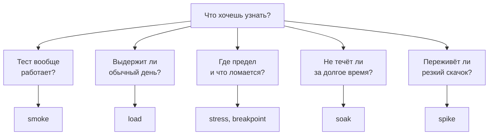
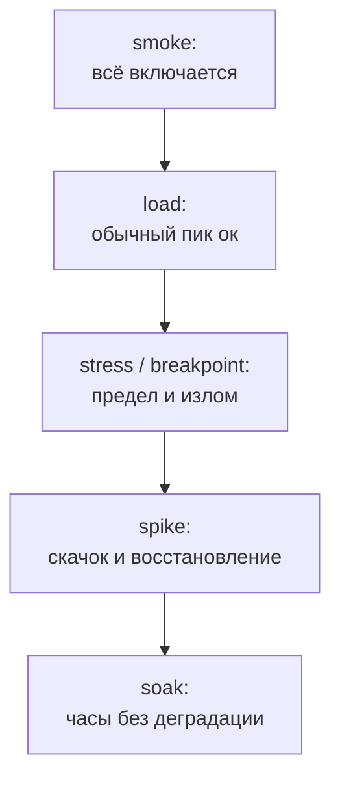

## Зачем это нужно

Я не раз видел один и тот же первый тест. Новичку говорят «нагрузи сервис», он ставит побольше пользователей и смотрит, что будет. Через десять минут у него график, который ни на что не отвечает. Сервис «выдержал 500 RPS» (запросов в секунду). И что? Хватит ли этого на распродажу? Не потечёт ли память к вечеру? Переживёт ли магазин рассылку, после которой за минуту придёт втрое больше людей?

Каждый из этих вопросов требует **своего теста**: со своей формой нагрузки, длительностью и условием успеха. Отсюда названия: smoke, load, stress, soak, spike, breakpoint. Это не мода, а список вопросов, которые стоит задать системе.

Ты научишься выбирать тип теста под вопрос. На практике напишешь генератор `shape.py`, который гонит нагрузку **по профилю**: с заданной скоростью прихода запросов (открытая модель из [урока 8.2](02-queues-littles-law.md)). С ним прогонишь на «Магазине» smoke, load, spike, breakpoint и мини-soak.

Шаг проекта: в `~/perf-lab/08-theory/` появится `shape.py`, а в `baseline.md` таблица «план испытаний»: какие тесты, зачем и с какими числами ты будешь гонять «Магазин» дальше. Locust ([тема 9](../09-locust/01-first-locustfile.md)) и k6 ([тема 10](../10-k6/01-js-first-script.md)) сделают то же профессиональнее, но смысл тестов от инструмента не зависит.

## Что нужно знать

- Задержка, p95, ошибки и baseline: [урок 8.1](01-latency-throughput.md).
- Колено, рабочая нагрузка 60–70% колена, открытая и закрытая модели: [урок 8.2](02-queues-littles-law.md). Числа колена из твоего `baseline.md` понадобятся при настройке профилей.
- Память контейнера и `docker stats`: [урок 5.4](../05-docker/04-limits-stats.md).

## Картина целиком

Ты принимаешь новый мост. Сначала пускаешь одного пешехода: держится ли вообще (**smoke**, «дымовой» тест: включили, дыма нет). Потом выпускаешь обычный дневной поток машин (**load**). Потом ставишь всё больше грузовиков, чтобы узнать, при каком весе мост начнёт сдавать и как именно (**stress** и **breakpoint**). Потом оставляешь обычный поток на неделю: не появятся ли трещины (**soak**). И наконец смотришь, что будет, если разом хлынет толпа после матча (**spike**).

Вся логика выбора умещается в одну схему:



От вопроса идёт стрелка к типу теста: тип выбирают по вопросу, а не по настроению. Нет вопроса, нет и теста.

## Теория

### Тест это вопрос с критерием ответа

Нагрузочный тест стоит времени. Если у него нет вопроса, результат нечем оценить: 300 RPS и p95 150 мс это хорошо или плохо? Поэтому до запуска записывают два предложения: что хотим узнать и при каком результате считаем ответ положительным. Второе называют **критерием успеха** (pass/fail criteria). Например: «p95 каталога не больше 300 мс и ошибок меньше 1% при 300 RPS». Про критерии и SLO будет [урок 8.4](04-load-profile-slo.md), здесь нужна сама привычка.

Дальше у каждого типа теста я буду называть пять вещей: цель, форму нагрузки (как скорость прихода запросов меняется во времени), длительность, что смотреть и критерий. Форму удобно рисовать: по горизонтали время, по вертикали нагрузка. Переключай и смотри, чем формы различаются.

<div class="viz" data-viz="load-profiles"></div>

У smoke нагрузка крошечная, у load ровная «полка» обычного дня, у stress лестница вверх, у soak такая же полка, но на часы. У spike резкий пик на фоне спокойствия. Полки load и soak одной высоты, но soak в десятки раз дольше.

Осторожно: «стресс-тестом» часто зовут любой нагрузочный тест. Это неверно: стресс-тест это «выше нормы, до отказа», а обычная нагрузка называется load.

> **Проверь понимание:** коллега просит «нагрузить сервис на 1000 RPS на 10 минут, посмотреть». Какие два вопроса ты задашь, прежде чем начинать?

<details markdown="1">
<summary>Ответ</summary>

«Что именно мы хотим узнать (выдержит ли обычный день, где предел, не течёт ли)?» и «Что считаем успехом: какие p95 и доля ошибок?» Без ответов непонятно ни форма, ни длительность, ни то, хорошо ли получилось.

</details>

> **Главное:** у теста есть вопрос и критерий успеха, и от них зависят форма и длительность нагрузки.
{: .key}

Начнём с самого дешёвого теста: с него начинается любая проверка.

### Smoke: «включается ли оно вообще»

Большой тест дорог: час подготовки, час прогона. Обидно потратить его и узнать, что в сценарии опечатка в адресе, токен просрочен, а метрики никуда не пишутся. Для этого есть **smoke-тест**: он отвечает на единственный вопрос, работают ли сам тест и сервис. Перед стартом ракеты тоже проверяют проводки, а не то, долетит ли она.

Нагрузка крошечная: 1-5 пользователей или 1-2 запроса в секунду, без разгона, на 1-5 минут. Хватит заметить поломку, мало чтобы сломать самим. Смотрят, чтобы запросы доходили и были успешны, чтобы метрики на дашборде появились, а в логах не было исключений. Задержку не оцениваем: при двух запросах в секунду она ничего не говорит о боевой нагрузке. Критерий: 0 ошибок.

Smoke ставят перед любым другим тестом и после каждой правки сценария. Его же включают в автоматическую проверку после выкладки: быстрый прогон «вход, каталог, корзина, заказ» показывает, что релиз не сломал основное.

> **Прикинь сам:** smoke «Магазина»: 2 запроса в секунду по карточке товара, 30 секунд. Сколько запросов должно уйти? Что ты подумаешь, если p95 окажется 2 секунды при ожидаемых 10 мс?
{: .predict}

2 × 30 = 60 запросов, 0 ошибок, p95 около 10 мс на пустом стенде. А 2 секунды это не «плохая производительность», а сигнал, что со стендом или сценарием что-то не так. До load-теста надо разобраться.

Осторожно: smoke это не «нагрузочный тест на минимальной нагрузке», цель другая. И «smoke прошёл» ничего не говорит о том, выдержит ли сервис нагрузку.

> **Главное:** smoke проверяет, что тест и сервис вообще работают, и его критерий один: ноль ошибок.
{: .key}

Smoke зелёный. Теперь основной вопрос бизнеса.

### Load: «выдержит ли обычный день»

**Load-тест** отвечает на вопрос: в обычный пиковый час сервис укладывается в цели? Если нет, проверять экзотику рано.

Форма такая: плавный **разгон** до целевой нагрузки (чтобы не бить по холодному кэшу и не принять разгон за предел), потом ровная **полка**, потом спад. Целевая нагрузка это реальный пиковый час (как её посчитать, расскажет [урок 8.4](04-load-profile-slo.md)), а для рабочей зоны берут 60-70% колена из [урока 8.2](02-queues-littles-law.md): выше задержка растёт скачками, и случайная волна бьёт по пределу. Полка длится 10-15 минут: Prometheus опрашивает «Магазин» раз в 5 секунд, и за 10 минут набирается 120 точек. Первые минуты полки, **прогрев** (warm-up), в критерии можно не брать: кэши и пулы соединений ещё холодные.

Смотрят четыре вещи: дошёл ли RPS до цели, p95 и p99, долю ошибок и насыщение ресурсов (CPU, память, пул соединений). Все четыре на полке, а не на разгоне. Критерий, например: «p95 не больше 300 мс, ошибок меньше 1%, CPU не выше 70%, RPS на полке не ниже цели».

> **Прикинь сам:** цель load «Магазина» 300 RPS каталога. На полке получилось RPS 299, p95 14 мс, ошибок 0, CPU `shop` 62%. Критерий выполнен?
{: .predict}

Да, все четыре числа в норме. Если бы p95 оказался 400 мс, мы бы не говорили «сервис плохой», а искали, где очередь (по таблице из 8.2).

Осторожно: тестировать надо пик, а не среднее за сутки: среднего не бывает ни у кого в пятницу вечером. И load должен проходить, а не ломать сервис. Ломать будет следующий тест.

> **Главное:** load проверяет обычный пик на ровной полке, и смотреть надо четыре сигнала именно на полке, а не на разгоне.
{: .key}

Обычный день выдержали. Что будет выше обычного?

### Stress: «где и как ломается»

Однажды нагрузка превысит обычную: распродажа, реклама, сбой у соседа. Заранее надо знать две вещи: до какого значения система держится и **как она ломается**. Плавно (задержка растёт, ошибок нет) или резко (всё вдруг в ошибках и потом не поднимается). Деградацию можно пережить, обвал нет. На эти вопросы отвечает **stress-тест**.

Форма это лестница: нагрузка растёт ступенями выше обычной (100%, 150%, 200% рабочей и дальше), на каждой несколько минут, чтобы система устоялась. Всего 20-40 минут, 4-8 ступеней. Смотрят, на какой ступени p95 (задержка, которую не превышают 95% запросов: среднее прячет медленных) вышел за критерий и когда появились ошибки (таймауты, 5xx - сбои сервера, 429 - код «слишком много запросов»). Смотрят, какой ресурс вырос первым и **что происходит при возврате** к обычной нагрузке: восстановилась ли система сама.

Рабочая нагрузка 300 RPS каталога, ступени 300, 450, 600, 750. На 450 p95 60 мс (подросло, терпимо), на 600 p95 4 секунды и первые таймауты, на 750 сплошные ошибки. После возврата к 300 p95 вернулся к 14 мс за 2 минуты. Вывод: предел около 500, сервис ломается плавно, через очередь, и восстанавливается сам.

Осторожно: стресс-тест не должен «пройти», он обязан найти границу. Если сломалось, это успех теста. Провал это когда ты не выяснил, что именно сломалось.

> **Главное:** stress находит, где и как система ломается и восстанавливается ли она, поэтому успех это найденный предел и названный виновник.
{: .key}

А если нужна не картина, а точное число?

### Breakpoint: «где именно точка излома»

Stress отвечает «что будет выше нормы». Для плана ёмкости ([урок 12.3](../12-process/03-capacity.md)) нужен точный предел: до какого RPS работает и при каком перестаёт. Это **breakpoint** (точка излома). Нагрузка растёт непрерывно или маленькими ступенями (по 5-10%), пока не нарушится критерий. У него обязательно есть условие стопа, иначе генератор будет бесконечно добивать упавший сервис. Результат одно число: последняя нагрузка, при которой критерий выполнялся.

Колено в [уроке 8.2](02-queues-littles-law.md) мы искали закрытой моделью (потоками). Для настоящего breakpoint берут открытую: скорость прихода растёт сама, независимо от ответов.

Ступени по 30 секунд, цели 100, 200, 300, 400, 500, 600 RPS, критерий p95 до 300 мс:

<div class="viz" data-viz="chart" data-type="line" data-x="100,200,300,400,500,600" data-x-label="Цель, RPS" data-y-label="p95, мс" data-unit="мс" data-explain="Задержка почти плоская до 300 RPS, на 400 уже заметно выросла, на 500 и 600 уходит вверх: очередь копится. Порог p95 300 мс нарушен на 500, значит, точка излома между 400 и 500 RPS." data-series='[{"name":"p95, мс","values":[6,8,14,45,860,6200]},{"name":"Порог, мс","values":[300,300,300,300,300,300]}]'></div>

Это хоккейная клюшка из 8.1 (кривая, которая долго тянется ровно и вдруг резко взлетает), нарисованная ступенчатым тестом. Это отдельный прогон, поэтому числа чуть отличаются от примера со stress. Порог пересечён между 400 и 500.

> **Прикинь сам:** какую рабочую нагрузку ты возьмёшь, если breakpoint по ступеням равен 400?
{: .predict}

Рабочая зона 60-70% от него: 240-280 RPS. Ступени по 100 RPS дают грубый ответ. Если уточнить мелкими ступенями и найти предел около 485, рабочая зона выйдет 290-340 RPS, и 300 RPS из load-примера в неё попадает. Пока не уточнил, берёшь нижнюю оценку.

Осторожно: breakpoint и stress путают. У первого цель число, у второго картина «как и что ломается». На практике их часто делают одним прогоном.

> **Главное:** breakpoint это последняя нагрузка, при которой критерий выполнялся, и рабочая нагрузка берётся ниже неё.
{: .key}

Мы искали, где ломается быстро. А что ломается медленно, за часы?

### Soak: «не течёт ли за долгое время»

Некоторые проблемы не видны за 15 минут. Утечка памяти: каждый запрос оставляет в памяти по 10 КБ, за минуту незаметно, а за сутки это гигабайты и убитый контейнер. Так же растут журналы, таблицы, число незакрытых соединений. **Soak-тест** (soak, «вымачивание», по-английски его ещё зовут endurance, «выносливость»: встретишь в чужих статьях) держит обычную нагрузку очень долго. Как капающий кран: за минуту не заметишь, за ночь будет лужа.

Форма как у load (полка 60-70% колена), но часами: минимум 2-4, лучше сутки. На стенде мы сделаем «мини-soak» на 3 минуты с ускоренной утечкой. Смотрят **тренды**, а не значения: растёт ли память, не ухудшился ли p95 к концу, были ли перезапуски контейнера. Критерий: «за 8 часов память выросла не более чем на 10%, p95 в последний час не хуже, чем в первый, перезапусков нет». Методы поиска утечки в [уроке 11.4](../11-bottlenecks/04-memory-soak.md).

Утечка в «Магазине» включается переменной `LEAK_ENABLED=1`: на каждый запрос в память добавляется 10 КБ, и их никто не освобождает. Лимит контейнера `shop` 512 МБ (`mem_limit` в `compose.yaml`).

> **Прикинь сам:** при 20 RPS за сколько минут память упрётся в лимит? А что покажет load-тест на 10 минут?
{: .predict}

20 запросов по 10 КБ это 200 КБ в секунду, то есть 0,2 МБ. Лимит 512 МБ закончится за 512 ÷ 0,2 = 2560 секунд, около 43 минут, и контейнер перезапустится. За 10 минут память вырастет лишь на 120 МБ, и все решат «всё нормально». Вот зачем нужен soak.

Осторожно: soak это не «побольше нагрузки на дольше», а обычная нагрузка на дольше. И рост памяти ещё не доказывает утечку: кэши тоже растут и стабилизируются.

> **Главное:** soak держит обычную нагрузку часами и ищет не предел, а то, что копится медленно, по трендам памяти, диска и p95.
{: .key}

Остался удар, а не износ.

### Spike: «переживёт ли удар»

Рассылка на миллион адресов, пост в соцсети, старт распродажи: за секунды нагрузка вырастает вдвое-втрое и так же быстро падает. Автомасштабирование (платформа сама добавляет серверы, когда нагрузка растёт) не успеет подключить новые, а кэши холодные. **Spike-тест** проверяет, что происходит во время скачка и за сколько система приходит в норму после него (время восстановления).

Форма: спокойный фон (50-70% рабочей нагрузки), почти мгновенный скачок в два-три раза выше нормы и плато на 10-60 секунд. Потом возврат к фону и наблюдение за восстановлением 5-10 минут. Смотрят ошибки в момент удара, p95 во время и после, время восстановления и зависимости (не закончился ли пул, не посыпалась ли оплата). Критерий: «во время скачка ошибок меньше 5%, p95 вернулся к норме не позже чем через 2 минуты».

Для spike нужна открытая модель из 8.2: запросы приходят по расписанию, как бы ни отвечал сервис. В закрытой модели новый запрос идёт только после ответа на прошлый. Скачок пользователей сделать можно, но как только сервис замедлится, пользователи будут ждать ответов, и поток запросов сам упадёт как раз тогда, когда удар должен быть сильнее всего. Различия показывал виджет в [уроке 8.2](02-queues-littles-law.md).

Фон 100 RPS, скачок до 600 RPS на 20 секунд, обратно на 100. «Магазин» держит около 500.

> **Прикинь сам:** сколько запросов накопится в очереди и сколько секунд она будет рассасываться после скачка?
{: .predict}

Лишних запросов 100 в секунду, 20 секунд: 2000 в очереди. После удара сервис обслуживает 500 в секунду, из них 100 уходят на фон, а очередь тает по 400 в секунду: ещё 5 секунд хвоста. Очередь рассасывается со скоростью запаса, а не мгновенно.

Осторожно: spike путают со stress. Stress долго и ступенями, spike мгновенно и ненадолго. И «пик прошёл без ошибок» ещё не значит «всё хорошо»: смотри восстановление и зависимости.

> **Главное:** spike проверяет резкий скачок и время восстановления, и очередь после него рассасывается со скоростью запаса.
{: .key}

Типов шесть, и пора свести их вместе.

### Сводка и порядок запуска

Держи шпаргалку: у каждого типа свой вопрос, форма и критерий (на телефоне таблицу можно прокрутить вбок).

| Тип | Вопрос | Форма | Длительность | Что смотреть | Успех |
|---|---|---|---|---|---|
| smoke | Работает ли тест и сервис | 1-5 пользователей | 1-5 мин | Ошибки, метрики пишутся | 0 ошибок |
| load | Укладывается ли обычный пик в цели | Разгон, полка, спад | 15-30 мин | RPS, p95, ошибки, CPU | Критерии SLO |
| stress | Где и как ломается | Лестница выше нормы | 20-40 мин | Ступень излома, виновник, восстановление | Предел найден, деградация мягкая |
| breakpoint | Точное число предела | Лестница до стопа | 10-30 мин | Последняя ступень в критерии | Число для плана ёмкости |
| soak | Не течёт ли со временем | Ровная полка | 4-24 ч | Тренды: память, диск, p95 | Нет роста |
| spike | Переживёт ли скачок | Фон, пик, фон | 10-20 мин | Ошибки, время восстановления | Возврат за N минут |

Порядок запуска такой: smoke, load, stress и breakpoint, spike, soak. Каждый следующий дороже предыдущего: если load не проходит, stress гонять рано, а если сервис не восстанавливается после spike, рано запускать soak на сутки. Smoke идёт перед каждым.



Если звено красное, дальше не идём: чиним и возвращаемся. Осторожно: делать все шесть всегда не нужно. Маленькому внутреннему сервису хватит smoke и load, а stress и spike нужны, когда на пике реально ждёшь трёхкратный скачок.

> **Главное:** тесты идут от дешёвого к дорогому, и нужны ровно те, на чьи вопросы ты ждёшь ответа.
{: .key}

Осталось понять, на какие графики смотреть во время любого теста.

### Что смотреть во время любого теста: четыре сигнала

На экране десятки графиков, и новичок смотрит на тот, что красивее. Для любой системы с очередью на практике хватает четырёх («четыре золотых сигнала»): они отвечают на вопросы «сколько идёт, как быстро, сколько ломается, сколько запаса». **Трафик**: сколько запросов в секунду реально проходит; если RPS не дошёл до цели, тест проверил не то. **Задержка**: p95 и p99 по важным маршрутам, а не среднее. **Ошибки**: доля 5xx, таймаутов и обрывов. **Насыщение**: насколько заняты ограниченные ресурсы, то есть CPU контейнера, пул соединений (`shop_db_pool_waiting`) и число запросов в работе (`http_requests_in_progress`). По закону Литтла из 8.2 насыщение это очередь перед ресурсом, и оно первым говорит, что предел близко.

Load на 300 RPS: трафик 299, p95 14 мс, ошибок 0, CPU 62%, `http_requests_in_progress` в среднем 4. На ступени breakpoint 500 RPS: трафик 481 (меньше цели, сервис не успевает), p95 900 мс, ошибок 0, `http_requests_in_progress` 60 и растёт. Проблему показали насыщение и трафик, а не ошибки.

Осторожно: если смотреть только на ошибки, будет казаться, что всё хорошо. Очередь копится без единой ошибки, и они появятся после таймаутов, когда поздно.

> **Главное:** во время теста смотри четыре сигнала (трафик, задержка, ошибки, насыщение), и насыщение предупредит раньше ошибок.
{: .key}

Последнее: правила, общие для всех типов.

### Что общего у всех тестов

Первые минуты любого теста не показательны (холодные кэши и пулы): разогревай заранее или исключай разгон из расчёта критериев. Меняй за раз одну вещь: сравнивая «до и после», держи тот же профиль и ту же среду ([урок 8.1](01-latency-throughput.md), baseline). Смотри сервис, а не только генератор. Я как-то полчаса искал «предел магазина», а упирался в процессор ноутбук, на котором крутился сам генератор: меряешь его, а не сервис.

Любой тест, который может сломать сервис, имеет условие остановки: «ошибок больше 20%: остановить». Иначе добьёшь лежащее. И нагрузку даём только на свой стенд: чужие сайты нельзя, это выглядит как атака и может быть ею по закону.

Все формы умеют воспроизводить Locust ([тема 9](../09-locust/01-first-locustfile.md)) и k6 ([тема 10](../10-k6/02-scenarios-thresholds.md)). В k6 нужная форма называется `ramping-arrival-rate` («нарастающая скорость прихода»: ты задаёшь, сколько итераций сценария в секунду должно начинаться на каждом отрезке; если в итерации пять запросов, то 20 итераций в секунду дадут около 100 запросов в секунду), а критерии успеха называются `thresholds` («пороги»: «p95 меньше 300 мс», иначе тест красный). Свой маленький генератор мы пишем один раз, чтобы понимать, что стоит за настройками готового инструмента.

> **Главное:** общие правила: прогрев не в счёт, меняй одну вещь за раз, смотри сервис, а не только генератор, и всегда держи условие остановки.
{: .key}

Вернёмся к вопросу про распродажу из начала. Теперь ты знаешь, что ответом будет не один график, а набор тестов с вопросом и критерием каждого.

## Практика

Стенд поднят, как в 8.2 (`docker compose --profile monitoring up -d --wait` в `~/load-tester/project/shop`), оплата `delay_ms` равна 50, утечка выключена. Перед началом освежи `~/perf-lab/08-theory/` и виртуальное окружение: `cd ~/perf-lab/08-theory && source ~/perf-lab/.venv/bin/activate`.

### 1. Генератор по профилю: shape.py

`measure.py` и `sweep.py` работали по закрытой модели (потоки). Для тестов формы нужна **открытая**: «в секунду номер N должно уйти R запросов, что бы ни случилось». Напишем `shape.py`.

Профиль задаётся строкой из ступеней `секунд:RPS` через запятую. Например `"30:100,30:200"` значит «30 секунд по 100 RPS, потом 30 секунд по 200». Это достаточно, чтобы собрать любую форму: плавный разгон это много маленьких ступеней, спайк это три ступени.

Создай `~/perf-lab/08-theory/shape.py`:

```python
"""Генератор по профилю (открытая модель): запросы уходят по расписанию,
не дожидаясь ответов на предыдущие.

Запуск:  python shape.py catalog "30:100,30:200" [окно_секунд]
Профиль: секунды:RPS через запятую.
Остановка: три окна подряд с ошибками выше 20% или с «сделано» ниже половины цели.
"""
import sys
import threading
import time
from concurrent.futures import ThreadPoolExecutor

import requests
from requests.adapters import HTTPAdapter

from measure import one_request, percentile

local = threading.local()


def get_session():
    """Своя сессия у каждого потока (requests.Session не для общего использования)."""
    if not hasattr(local, "session"):
        local.session = requests.Session()
        local.session.mount("http://", HTTPAdapter(pool_maxsize=64))
    return local.session


def fire(mode, planned, t0, starts, out):
    """Один запрос. Пишем момент отправки, а по ответу плановое время, момент завершения и код.
    Задержку потом считаем от ПЛАНОВОГО времени: если запрос простоял в очереди
    перед отправкой, это тоже время ожидания клиента."""
    starts.append(time.perf_counter() - t0)
    _, code = one_request(get_session(), mode)
    out.append((planned, time.perf_counter() - t0, code))


def window_stats(w, window, starts, out):
    """Что произошло в окне номер w: отправлено, сделано (успешно завершено), p95, ошибок.
    Завершённые запросы относим к окну по времени ЗАВЕРШЕНИЯ."""
    lo, hi = w * window, (w + 1) * window
    sent = sum(1 for s in list(starts) if lo <= s < hi)
    done = [(d - p) * 1000 for p, d, c in list(out) if lo <= d < hi and 0 < c < 400]
    errors = sum(1 for p, d, c in list(out) if lo <= d < hi and (c == 0 or c >= 400))
    return sent / window, len(done) / window, sorted(done), errors


def main():
    mode = sys.argv[1]
    stages = [tuple(float(x) for x in part.split(":")) for part in sys.argv[2].split(",")]
    window = float(sys.argv[3]) if len(sys.argv) > 3 else 10.0

    # расписание: момент отправки каждого запроса и цель RPS в этот момент
    schedule, total = [], 0.0
    for seconds, rps in stages:
        schedule += [(total + i / rps, rps) for i in range(int(seconds * rps))]
        total += seconds

    def bad(w):
        _, rate, done, errors = window_stats(w, window, starts, out)
        finished = len(done) + errors
        return rate < 0.5 * targets[w] or (finished > 0 and errors / finished > 0.2)

    starts, out, targets, stopped = [], [], {}, None
    t0 = time.perf_counter()
    with ThreadPoolExecutor(max_workers=64) as pool:
        for planned, rps in schedule:
            wait = t0 + planned - time.perf_counter()
            if wait > 0:
                time.sleep(wait)
            w = int(planned // window)
            if w not in targets and w >= 3 and all(bad(v) for v in (w - 3, w - 2, w - 1)):
                stopped = int(w * window)
                pool.shutdown(wait=False, cancel_futures=True)
                break
            targets[w] = rps
            pool.submit(fire, mode, planned, t0, starts, out)

    print(f"{'окно, с':>10} {'цель':>7} {'отправлено':>11} {'сделано':>8} {'p95, мс':>9} {'ошибок':>7}")
    for w in sorted(targets):
        sent, rate, done, errors = window_stats(w, window, starts, out)
        label = f"{int(w * window)}-{int((w + 1) * window)}"
        p95 = f"{percentile(done, 95):.1f}" if done else "-"
        print(f"{label:>10} {targets[w]:>7g} {sent:>11.1f} {rate:>8.1f} {p95:>9} {errors:>7}")
    if stopped is not None:
        print(f"Остановлено на {stopped} с: три окна подряд хуже порога.")
    else:
        late = sum(1 for p, d, c in out if d >= total)
        print(f"Завершилось после конца профиля: {late} запросов (в таблицу не вошли).")


if __name__ == "__main__":
    main()
```

Разбор нового, по частям:

- `stages = [tuple(float(x) for x in part.split(":")) ...]` превращает строку `"30:100,30:200"` в список пар `[(30.0, 100.0), (30.0, 200.0)]`: сначала режем по запятым, потом каждую часть по двоеточию.
- Расписание заранее: в ступени `(seconds, rps)` запросы уходят в моменты `total + i / rps`: при 100 RPS через каждые 0,01 с. Главный цикл спит до нужного момента (`time.sleep(wait)`) и **отдаёт запрос пулу потоков** (`pool.submit`), не дожидаясь ответа. Это и есть открытая модель.
- `threading.local()` создаёт «личную полку» для каждого потока: `local.session` у одного потока не видна другому. Так у каждого потока своя `requests.Session`, потоки не делят одно соединение. `hasattr(local, "session")` спрашивает, есть ли уже сессия у этого потока: если нет, создаём.
- `mount("http://", HTTPAdapter(pool_maxsize=64))` говорит сессии: для адресов на `http://` держи до 64 открытых соединений (по умолчанию 10). `HTTPAdapter` это деталь `requests`, которая управляет соединениями, `mount` подключает её.
- `fire` записывает момент отправки (`starts`) и, когда ответ пришёл, плановое время, момент завершения и код ответа (`out`). Задержка считается от **планового** момента: если сервис не успевает, запросы копятся перед пулом потоков, и это ожидание попадает в цифру. Так генератор не «подстраивается» под медленный сервер, то есть избегает координированного пропуска из 8.2.
- Окно по умолчанию 10 секунд, каждая строка таблицы это одно окно. **Отправлено**: сколько запросов в секунду ушло из генератора в этом окне. **Сделано**: сколько в секунду **успешно завершилось** в этом окне (код ниже 400), запрос относится к окну по времени завершения. **Ошибок**: сколько завершилось кодом 400 и выше, таймаутом или обрывом; в «сделано» они не входят. p95 считается по успешным запросам от планового времени.
- `max_workers=64`: максимум одновременно «висящих» запросов у генератора. Когда сервис не успевает и все 64 потока ждут ответа, новые запросы стоят в очереди пула, и «отправлено» падает ниже цели. Время в этой очереди входит в p95.
- Остановка: если три окна подряд «сделано» ниже половины цели или ошибок больше 20%, генератор прекращает подавать нагрузку. Иначе тест будет добивать упавший сервис до конца профиля (в «Сломай и почини» это видно).
- `window_stats(w, ...)` берёт все записи, у которых время завершения попало в окно `w`, и считает по ним таблицу. Одна функция работает и на печать таблицы, и на проверку остановки.

**Ограничение генератора.** `shape.py` шлёт запросы **строго с равными интервалами** (100 в секунду это запрос каждые 10 мс). Настоящие пользователи приходят неровно, случайно (поток из [урока 8.2](02-queues-littles-law.md)), и при той же средней нагрузке очередь и p95 у реального сервиса выше, чем покажет этот тест. Поэтому смотри на результат как на оценку «снизу»: держи запас и не планируй рабочую зону вплотную к цифре из теста. Чтобы приблизиться к реальности, интервал между запросами можно брать случайным: `-math.log(random.random()) / rps` секунд. То же относится к `constant-arrival-rate` в k6: ритм у него ровный.

**Типичные ошибки:**

- `ValueError: could not convert string to float`: опечатка в профиле; нужен формат `секунды:RPS`, ступени через запятую без пробелов, строка в кавычках.
- «Отправлено» и «сделано» заметно меньше цели на **малых** нагрузках: машина занята, или генератор не успевает по таймеру. Проверь `htop`: если процесс python в потолке по CPU, ты упёрся в генератор. Сделай ступени ниже. Если же на высокой ступени «отправлено» ниже цели, а p95 растёт, это не поломка генератора: все 64 потока ждут ответов, сервис перегружен.
- Профиль длиной не кратной окну (например, `"25:100"` при окне 10): последнее окно неполное, его «сделано» занижено, а ответы, пришедшие после конца профиля, попадут и в это окно, и в строку «после конца профиля». Подбирай ступени кратными окну.
- `Connection pool is full, discarding connection` (предупреждение библиотеки): запросов в полёте больше, чем размер пула соединений. Значит, сервис перегружен или генератор мощнее, чем ты ожидал; это информация, а не ошибка.

### 2. Smoke

```bash
python shape.py catalog "30:2"
```

```text
   окно, с    цель  отправлено  сделано   p95, мс  ошибок
      0-10       2         2.0      2.0       9.2       0
     10-20       2         2.0      2.0       8.1       0
     20-30       2         2.0      2.0       7.9       0
Завершилось после конца профиля: 0 запросов (в таблицу не вошли).
```

**Как читать вывод:** три окна по 10 секунд, цель 2 запроса в секунду, отправлено 2 и сделано 2 (генератор успевает), ошибок 0, p95 около 8 мс. Строка под таблицей про запросы после конца профиля: 0, значит, все ответы пришли вовремя. Для smoke это **ответ**: тест работает, сервис отвечает, ошибок нет. Задержку не оцениваем: при 2 RPS она ни о чём не говорит.

### 3. Load

Подставь **свои** числа из `baseline.md`: рабочая нагрузка каталога 60–70% колена. У нас колено 500, значит, полка 300 RPS. Разгон ступенями, затем полка две минуты (для первого раза коротко; настоящий load держат 10–15):

```bash
python shape.py catalog "10:100,10:200,120:300,10:100"
```

```text
   окно, с    цель  отправлено  сделано   p95, мс  ошибок
      0-10     100       100.0    100.0       6.8       0
     10-20     200       200.0    200.0       8.9       0
     20-30     300       300.0    299.8      14.1       0
     30-40     300       300.0    300.0      13.7       0
       ...
   130-140     300       300.0    300.0      14.4       0
   140-150     100       100.0    100.0       6.9       0
Завершилось после конца профиля: 0 запросов (в таблицу не вошли).
```

**Как читать вывод:** смотри на **полку** (окна 20–140), а не на разгон. Цель 300, сделано 300 (не ниже 95% цели, то есть 285), p95 стабильные 13–15 мс, ошибок 0. Критерий «p95 не больше 300 мс, ошибок меньше 1%, RPS не ниже 95% цели» выполнен. Если на полке p95 растёт от окна к окну, это очередь, а не разогрев: стоп, ищи ограничение (таблица из 8.2). Заодно открой в Grafana дашборд «Магазин: обзор (эталон)», выстави окно на время теста и убедись, что RPS и p95 на панелях совпадают с таблицей: это сверка «глазами генератора» и «глазами сервиса».

### 4. Spike

Фон 100 RPS, удар 450 на 20 секунд, возврат и наблюдение за восстановлением:

```bash
python shape.py catalog "40:100,20:450,60:100"
```

```text
   окно, с    цель  отправлено  сделано   p95, мс  ошибок
      0-10     100       100.0    100.0       6.9       0
       ...
     40-50     450       450.0    449.6     115.0       0
     50-60     450       450.0    450.0     190.0       0
     60-70     100       100.0    104.5     160.0       0
     70-80     100       100.0    100.0      12.0       0
     80-90     100       100.0    100.0       7.2       0
       ...
Завершилось после конца профиля: 0 запросов (в таблицу не вошли).
```

**Как читать вывод:** на ударе (окна 40–60) p95 вырос с 7 до 115–190 мс, ошибок нет: сервис справился. В окне 60–70 нагрузка уже вернулась к 100, а «сделано» 104,5, и p95 всё ещё 160 мс. Это **хвост очереди**: накопившиеся на ударе запросы сервис доедает сверх нового потока (колонка «сделано» считает завершённые запросы, поэтому она может быть выше цели). К окну 70–80 всё в норме. Время восстановления примерно 10 секунд (критерий «не позже 2 минут» выполнен). Если взять удар 600 вместо 450, p95 в окнах удара улетит в секунды, а восстановление растянется (проверь сам: `"40:100,20:600,60:100"`).

> Не уверен, какой тип теста подходит под вопрос? Опиши цель в одной фразе и спроси нейросеть, какой из пяти типов выбрать и почему. Сверь с таблицей типов из урока и с тем, что отвечает на цель именно этот тип.
{: .ai}

### 5. Breakpoint

Лестница, окно 30 секунд, чтобы одна строка таблицы это одна ступень:

```bash
python shape.py catalog "30:100,30:200,30:300,30:400,30:500,30:600" 30
```

```text
   окно, с    цель  отправлено  сделано   p95, мс  ошибок
      0-30     100       100.0    100.0       6.4       0
     30-60     200       200.0    200.0       8.2       0
     60-90     300       300.0    299.9      14.0       0
    90-120     400       400.0    398.8      45.0       0
   120-150     500       487.4    485.2     860.0       0
   150-180     600       485.0    484.9    6200.0       0
Завершилось после конца профиля: 3936 запросов (в таблицу не вошли).
```

**Как читать вывод:** до 400 RPS «сделано» равно цели (398,8 это 99,7%). На 500 генератор хотел слать 500 в секунду, а сервис завершает только около 485: разница копится в очереди, p95 вырос до 860 мс. «Отправлено» уже чуть ниже цели (487): все 64 потока заняты, лишние запросы ждут перед ними. На 600 «сделано» 485 из 600 (81%, ниже порога 95%), а p95 6,2 с: очередь растёт каждую секунду, пока ступень не кончится. Строка внизу показывает её размер: 3936 запросов к концу профиля так и не получили ответа. Критерий нарушен на ступени 500 по p95 (RPS там ещё 97% цели, то есть полка по одному RPS проходила бы). Значит, breakpoint: **400 RPS** (последняя пройденная ступень), а настоящий предел лежит между 400 и 500, около 485 (это число и есть плато колонки «сделано»). Для точного числа повтори с мелкими ступенями между 400 и 500 (`"30:420,30:440,30:460,30:480"`). Эти же p95 ты видел на графике выше. Запиши в `baseline.md`.

Закрой тест, который «лёг»: после `600` подожди минуту, пока очередь рассосётся, и проверь `curl -s localhost:8000/readyz`. Если сервис не отвечает, перезапусти: `docker compose restart shop` из каталога `project/shop`.

### 6. Soak в миниатюре

Включи утечку и перезапусти `shop`:

```bash
cd ~/load-tester/project/shop
sed -i.bak 's/^LEAK_ENABLED=0/LEAK_ENABLED=1/' .env && rm .env.bak
docker compose up -d shop
```

Разбор: `sed -i.bak 's/что/на что/' файл` правит файл на месте (`.bak` это резервная копия, без неё `sed -i` на macOS требует аргумента), `^` значит «в начале строки». Затем `up -d shop` пересоздаёт только `shop` с новой настройкой.

В первом терминале нагрузка 100 RPS три минуты, во втором наблюдение за памятью каждые 20 секунд:

```bash
python shape.py catalog "180:100" 60
```

```bash
cd ~/load-tester/project/shop
for i in 1 2 3 4 5 6 7 8 9; do
  docker stats --no-stream --format '{{.MemUsage}}' $(docker compose ps -q shop); sleep 20
done
```

```text
   окно, с    цель  отправлено  сделано   p95, мс  ошибок
      0-60     100       100.0    100.0       7.1       0
    60-120     100       100.0    100.0       7.4       0
   120-180     100       100.0    100.0       7.9       0
Завершилось после конца профиля: 0 запросов (в таблицу не вошли).
```

```text
81.5MiB / 512MiB
101.3MiB / 512MiB
121.0MiB / 512MiB
141.2MiB / 512MiB
...
```

**Как читать вывод:** задержка почти не изменилась (7,1, 7,4, 7,9 мс): ни по p95, ни по ошибкам «ничего не видно». А память растёт линейно на 20 МБ за каждые 20 секунд (100 запросов в секунду × 10 КБ = 1 МБ/с). Вот что находит soak и не находит load. До лимита 512 МБ оставалось бы чуть больше 7 минут: тест на 5 минут пропустил бы, на 10 уже упал бы.

Верни утечку: `sed -i.bak 's/^LEAK_ENABLED=1/LEAK_ENABLED=0/' .env && rm .env.bak && docker compose up -d shop`. 

### 7. План испытаний

Допиши в `~/perf-lab/08-theory/baseline.md` раздел с планом (числа подставь свои):

```markdown
## План испытаний «Магазина» (8.3)

| Тип | Профиль | Длительность | Критерий |
|---|---|---|---|
| smoke | 2 RPS каталог | 30 с | 0 ошибок |
| load | полка 300 RPS каталог | 15 мин + разгон | p95 до 300 мс, ошибок до 1% |
| breakpoint | лестница 100..600, шаг 100 | 3 мин | число последней ступени |
| spike | 100 -> 450 -> 100 | 2 мин | возврат p95 за 2 мин |
| soak | полка 300 RPS | 8 ч (позже, в теме 11) | память без роста |
```

Закоммить: `cd ~/perf-lab && git add 08-theory && git commit -m "8.3: shape.py и план испытаний" && git push`.

## Сломай и почини

**Поломка.** Коллега хочет проверить вход пользователей и запускает «load-тест логина на 20 логинов в секунду, 60 секунд»:

```bash
python shape.py login "60:20" 10
```

```text
   окно, с    цель  отправлено  сделано   p95, мс  ошибок
      0-10      20        10.1      3.7    7861.4       0
     10-20      20         3.7      3.7   15890.9       0
     20-30      20         3.8      3.8   24129.1       0
Остановлено на 30 с: три окна подряд хуже порога.
```

Генератор остановился сам на 30-й секунде. **Задача.** Объясни, что произошло и почему этот тест ничего не доказал. Подсказка: что ты знаешь про предел логина? Ответь, не заглядывая в разбор.

<details markdown="1">
<summary>Разбор</summary>

Предел логина около 3,8 RPS (bcrypt занимает 250 мс одного процессора, из [урока 8.1](01-latency-throughput.md)). Тест подаёт 20 RPS: в пять с лишним раз больше. Колонка «сделано» стоит на 3,7–3,8 при цели 20: это и есть предел, сервис больше не завершает. Открытая модель не подстраивается: 16 лишних запросов в секунду копятся в очереди, и p95 растёт линейно, примерно на 8 секунд за каждое окно. Колонка «отправлено» упала с 10 до 3,7: все 64 потока генератора заняли запросы, ждущие ответа, и новые встали в очередь перед ними. Ошибок нет: таймаут клиента (30 секунд в `measure.py`) отсчитывается от отправки, а не от планового времени, и ответ за 17 секунд (64 запроса ÷ 3,8 в секунду) в него укладывается. Критерий остановки сработал на третьем окне подряд со «сделано» ниже половины цели. Без него тест ещё 30 секунд копил бы очередь и после конца профиля ещё минуты разгребал бы её.

Критическая ошибка здесь не в «Магазине», а в **плане**: цель теста не соответствует рабочей зоне. Правильных вариантов два:

- **Если нужен load:** цель 60–70% предела, то есть 2–2,5 логина в секунду. Повтори: `python shape.py login "10:1,10:2,60:2.5" 10`. p95 около 300 мс, ошибок нет. Но вопрос «а нужно ли нам 20 логинов в секунду» остаётся: в [уроке 8.4](04-load-profile-slo.md) мы посчитаем, сколько логинов в секунду действительно бывает, и если реальный пик 8, то это находка: **вход нужно ускорять** (см. [урок 11.2](../11-bottlenecks/02-cpu.md)).
- **Если нужен stress/breakpoint:** тогда лестница `"30:1,30:2,30:3,30:4,30:5,30:6"`, и результат «предел около 3,8, при 4+ очередь растёт» это ответ теста, а не провал.

Урок: **форма и высота нагрузки выбираются под вопрос**, а предел известен заранее из теста 8.2. Тест, где нагрузка впятеро выше предела, не отвечает ни на «выдержит ли обычный день», ни на «где предел»: он только показывает, что 20 больше 3,8.

</details>

## ИИ в помощь

Нейросеть помогает выбрать тип теста под цель и набросать форму нагрузки, но сроки и числа она берёт «примерные», и ответственность за выбор остаётся на тебе. Общие правила: [ИИ-помощник](../ai.md).

**Задача:** выбрать тип теста под бизнес-вопрос.

```text
Я тестирую интернет-магазин на стенде. Вопрос: «Выдержим ли мы акцию, когда за минуту
приходит втрое больше покупателей, чем обычно?» Из типов smoke, load, stress, spike, soak
и breakpoint выбери подходящие и расставь по порядку. Для каждого скажи, на какой
вопрос он отвечает и что не покажет.
```
{: .wrap}

**Проверь ответ:** сверь с таблицей типов в уроке: у каждого типа свой вопрос. Типичная ошибка: нейросеть называет stress и spike одним и тем же или советует начинать с soak на несколько часов. Тесты идут от дешёвого к дорогому: начинай со smoke.

**Задача:** набросать профиль нагрузки.

```text
Составь профиль для spike-теста магазина: обычная нагрузка <число> пользователей,
пик <число>, разгон за <число> секунд, держим <число> минут, возврат к обычной.
Дай список этапов с (длительность, пользователи, скорость запуска) и объясни,
что надо смотреть в метриках на каждом этапе.
```
{: .wrap}

**Проверь ответ:** запусти короткую версию (`smoke`-масштаб) и проверь, что этапы совпадают с заказанными. Типичная ошибка: пик не в тех единицах (пользователи против запросов в секунду).

## Словарик урока

| Термин | Простыми словами |
|---|---|
| Профиль нагрузки (load profile) | Как нагрузка меняется во времени: форма, высота, длительность |
| Smoke-тест (дымовой) | Короткий тест на минимальной нагрузке: работают ли тест и сервис |
| Load-тест (нагрузочный) | Обычная ожидаемая нагрузка пикового часа: укладывается ли сервис в цели |
| Stress-тест (стрессовый) | Нагрузка ступенями выше обычной: где и как сервис ломается |
| Breakpoint (точка излома) | Последняя нагрузка, при которой критерий выполняется |
| Soak-тест (на выносливость) | Обычная нагрузка много часов: ищем утечки и деградацию |
| Spike-тест (всплеск) | Резкий скачок нагрузки и возвращение: переживёт ли и как быстро восстановится |
| Разгон (ramp-up) | Плавный рост нагрузки в начале теста |
| Полка (plateau, steady state) | Ровный участок нагрузки, по которому считают критерии |
| Прогрев (warm-up) | Первые минуты, пока кэши и пулы разогреваются; в критерии не берутся |
| Критерий успеха (pass/fail criteria) | Заранее записанные пороги: при каких p95 и ошибках тест пройден |
| Время восстановления (recovery time) | За сколько после спада нагрузки сервис возвращается к норме |
| Условие остановки (abort condition) | Правило, при котором тест останавливается сам, чтобы не добить сервис |
| Утечка памяти (memory leak) | Память, которую программа занимает и не отдаёт: растёт со временем |

## Вопросы с собеседований

Раздел для повторения: ответь вслух, потом открой ответ. Вопросы с пометкой `[на скорость]` тренируй на время: ответ за 30 секунд.



## Проверено на версиях

Ubuntu 24.04, Python 3.12, requests 2.34.2, стенд «Магазин» из `project/shop` (Python 3.14, PostgreSQL 18.6), Prometheus 3.15, Grafana 13.2, Docker Compose v2. Октябрь 2026.

## Итог урока: ты умеешь

- [ ] Назвать шесть типов теста (smoke, load, stress, breakpoint, soak, spike) и объяснить, на какой вопрос отвечает каждый.
- [ ] Нарисовать форму нагрузки для каждого типа и назвать его длительность.
- [ ] Записать цель и критерий успеха до запуска теста.
- [ ] Запустить ступенчатый профиль открытой моделью и прочитать таблицу по окнам.
- [ ] Найти breakpoint и выбрать по нему рабочую нагрузку.
- [ ] Увидеть утечку памяти в мини-soak и объяснить, почему load её не нашёл.
- [ ] Выбрать порядок запуска тестов и условия остановки.

Дальше: [урок 8.4. Профиль нагрузки, SLO и методика испытаний](04-load-profile-slo.md): откуда взять числа для профиля и как записать критерии успеха.
