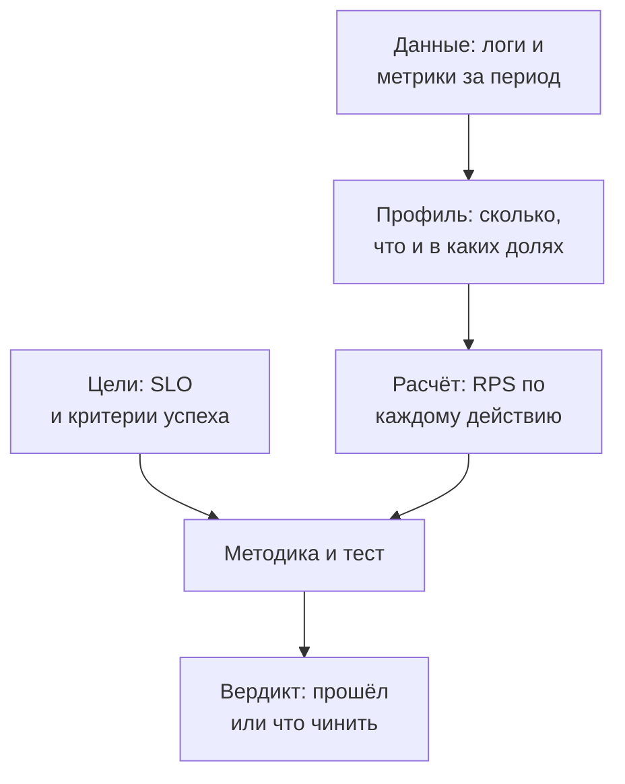
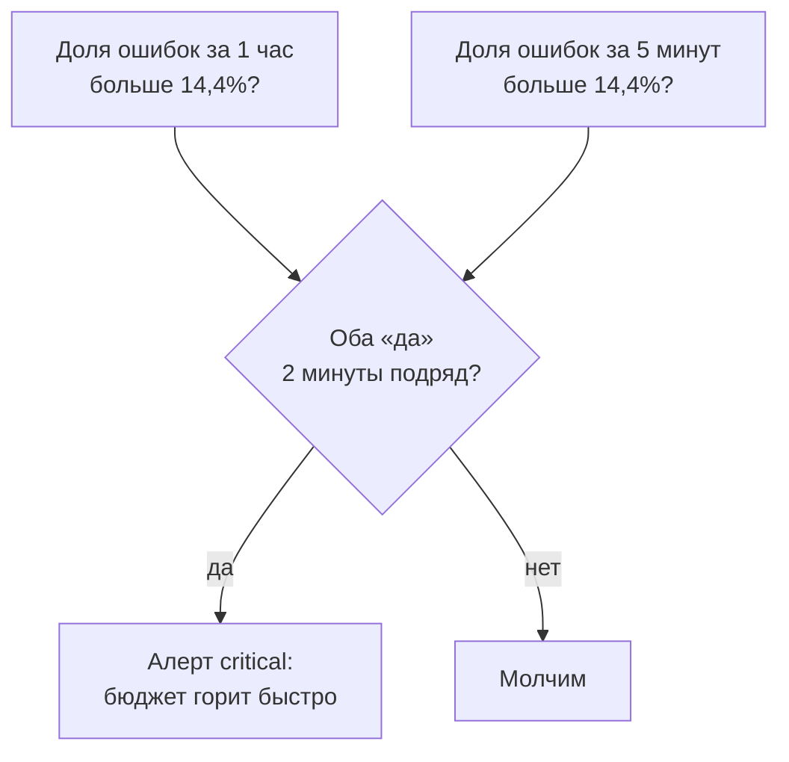
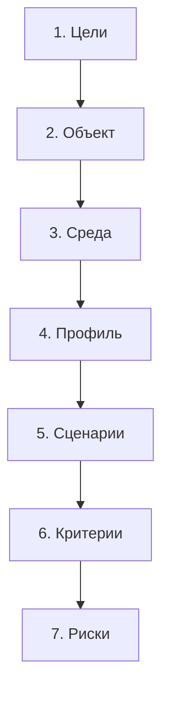

## Зачем это нужно

Ты умеешь мерить задержку и пропускную способность ([8.1](01-latency-throughput.md)), понимаешь очереди и колено ([8.2](02-queues-littles-law.md)) и знаешь типы тестов ([8.3](03-test-types.md)). Остались два вопроса, на которых спотыкаются даже опытные: **«с какими числами гонять тест?»** и **«как понять, что сервис прошёл?»**

Если выбрать числа «от балды» (1000 пользователей, потому что красиво), результат будет бесполезен в обе стороны. Слишком мало: тест пройдёт, а в реальный пик сервис упадёт. Слишком много: тест провалится, команда потратит месяц на оптимизацию того, что на самом деле не нужно. Правильные числа берутся **из данных о реальном использовании**: сколько людей приходит в пиковый час, что они делают и в каких пропорциях. Это называется **профилем нагрузки**. А «прошёл или нет» решают заранее записанные цели: **SLO**. Вместе с остальным они складываются в один документ, **методику испытаний**, по которому любой может повторить тест и получить сравнимый результат.

Шаг проекта: ты соберёшь «реальный» трафик на «Магазине», получишь из Prometheus доли действий, пересчитаешь их в RPS по каждому маршруту скриптом `profile_calc.py`, запишешь SLO и оформишь всё в `~/perf-lab/08-theory/methodology.md`. Этот файл ты будешь использовать как основу в темах 9–11 (скрипты Locust и k6 повторят профиль) и в отчёте ([урок 12.1](../12-process/01-report.md)).

## Что нужно знать

- Задержка, p95, ошибки, baseline: [урок 8.1](01-latency-throughput.md).
- Закон Литтла, рабочая нагрузка 60–70% предела: [урок 8.2](02-queues-littles-law.md). Пределы логина и каталога из твоего `baseline.md` нужны для сравнения.
- Типы тестов и критерии успеха: [урок 8.3](03-test-types.md).
- PromQL `rate`, `increase`, `sum by`, `histogram_quantile`: [урок 7.2](../07-observability/02-promql.md).

## Картина целиком

Врач не назначает «побольше анализов», а идёт от жалобы: что болит, как давно, какой у пациента возраст. У нагрузочного тестирования та же цепочка: **кто пользуется** (данные), **что они делают** (профиль), **что считаем нормой** (SLO), **как проверяем** (тест), **что решаем** (вывод).



Что здесь видно: два входа в тест. Один говорит «какая нагрузка» (из данных), другой «какой результат считаем хорошим» (из целей). Ошибка в любом из них обесценивает тест, и поэтому мы разбираем их подробно, а не торопимся запускать.

- профиль состоит из **состава** (какие действия и в каких долях) и **объёма** (сколько их в пиковый час), оба берутся из данных, а не из головы;
- RPS получается арифметикой: сессий в час × действий в сессии ÷ 3600, потом запас на пик внутри часа и на рост;
- цель успеха это SLO (измеримое обещание), а не «чтобы было быстро».

## Теория

### Что такое профиль нагрузки

**Зачем это существует.** «Нагрузка» сама по себе не число. 20 RPS карточек товара и 20 RPS логинов это совершенно разные испытания: первое сервер выдерживает с запасом, второе в пять раз выше его предела. Поэтому нагрузку описывают не одним числом, а **профилем** (workload model): набором того, что делают пользователи, и того, сколько их.

**Аналогия.** Расписание кинотеатра. «Сегодня 500 зрителей» ничего не говорит. Важно, сколько на какие сеансы, сколько приходят группами, сколько берут попкорн (самая нагруженная касса) и когда пик (перед вечерним сеансом, а не днём). Аналогия ломается тем, что у кинотеатра известно число мест, а у сайта потолка посетителей нет.

**Как это устроено.** Профиль нагрузки описывает четыре вещи:

1. **Пользовательские сценарии** (user journeys): последовательности действий, например «зашёл, посмотрел список, открыл карточку, добавил в корзину, оформил».
2. **Состав** (mix): доля каждого действия. На сайте обычно читают намного больше, чем покупают: список и карточки составляют основную часть, заказы единицы процентов.
3. **Объём**: сколько сессий (визитов) приходится на пиковый час.
4. **Форма во времени**: как нагрузка растёт и падает (разгон, полка), тип теста из [урока 8.3](03-test-types.md).

Ещё одна важная вещь: **данные**. Тест, в котором все 100 виртуальных пользователей заходят под одним логином и открывают одну и ту же карточку, измеряет кэш, а не сервис. Поэтому профиль включает и разнообразие: разные пользователи, разные товары.

**Что путают.** Профиль и «сценарий теста» в инструменте: сценарий это код, который воспроизводит профиль. Сначала профиль на бумаге, потом код.

### Откуда брать данные

**Зачем это существует.** Хорошие числа есть только в реальном трафике: ты не угадаешь, что логинов в 10 раз меньше, чем просмотров каталога, или что 70% пользователей уходит, не дойдя до корзины. Поэтому первый шаг всегда: «покажите, что происходило».

**Как это устроено.** Источники по надёжности:

1. **Метрики сервиса.** У «Магазина» есть `http_requests_total{method,route,status}` с разбивкой по маршрутам. Из неё считаем доли и объёмы. Это основной источник.
2. **Логи.** Все запросы с путями, пользователями и временем; можно посчитать сессии и их длину.
3. **Аналитика бизнеса.** Сессии, конверсии (какой процент дошёл до заказа), сезонность.
4. **Оценка**, если у сервиса ещё нет трафика: берёшь у бизнеса «сколько пользователей мы ждём» и из аналогов «как они себя ведут». Помечаешь результат «оценка, пересмотреть через месяц после запуска».

Выбирай **окно данных, содержащее пик**: неделя, лучше месяц, и внутри него самый нагруженный час. Среднее за сутки бесполезно (ночью трафика почти нет, среднее занижено в несколько раз).

**Разобранный пример.** В Prometheus считаем объём запросов по маршрутам за пиковый час (значение час считаем на окне времени, где был пик):

```promql
sum by (route) (increase(http_requests_total[1h]))
```

Разбор: `http_requests_total` счётчик (только растёт); `increase(...[1h])` показывает, на сколько он вырос за последний час; `sum by (route)` складывает по всем статусам и методам и оставляет разбивку по маршрутам. Получаем таблицу «маршрут, число запросов за час». Чтобы найти **пиковый** час, а не последний, в Grafana строят график `sum(increase(http_requests_total[1h]))` за неделю и находят максимум.

**Что путают.** Запросы и сессии: запросов в десять раз больше. И «пиковая минута» с «пиковым часом»: профиль считают по часу (устойчивая нагрузка), а всплески внутри часа закрывают запасом (ниже).

> **Проверь понимание:** почему нельзя взять среднее число запросов за сутки как целевую нагрузку теста?

<details markdown="1">
<summary>Ответ</summary>

Нагрузка в течение суток неравномерна: ночью почти нет, вечером пик, который в несколько раз выше среднего. Если проверить сервис на среднем, в пик он окажется перегружен. Цель теста это пиковый час, а не среднее.

</details>

### Состав: доли действий

**Зачем это существует.** Каждое действие тяжелее или легче: карточка товара это одно чтение (5 мс), логин это 250 мс процессорного времени, заказ это транзакция плюс оплата. Если неверно задать пропорции, тест либо недогрузит самое слабое место, либо перегрузит его в пять раз.

**Как это устроено.** **Сессия** (визит) это одно посещение магазина: человек пришёл, вошёл в аккаунт, походил по страницам и ушёл. Состав считают в **действиях на сессию**: сколько раз за визит средний посетитель делает то или иное действие. Данные берём из Prometheus: объём запросов по маршрутам делим на число сессий. Число сессий для «Магазина» равно числу логинов (`/api/login` один раз на визит). Для стенда после сбора данных получается примерно такая картина:

| Действие | Маршрут | На сессию | Доля запросов |
|---|---|---|---|
| Вход | `POST /api/login` | 1,00 | 9,3% |
| Список каталога | `GET /api/products` | 5,00 | 46,5% |
| Карточка товара | `GET /api/products/{id}` | 3,00 | 27,9% |
| Добавить в корзину | `POST /api/cart/items` | 1,20 | 11,2% |
| Оформить заказ | `POST /api/orders` | 0,25 | 2,3% |
| История заказов | `GET /api/orders` | 0,30 | 2,8% |
| **Всего** | | **10,75** | 100% |

Читаем: на каждый визит приходится 10,75 запроса. Из каждых 100 запросов 74 это чтение каталога (список и карточка), всего 2 или 3 оформление заказа. Конверсия в заказ 0,25 заказа на визит, то есть каждый четвёртый посетитель что-то покупает (для магазина это довольно много, но для учебного стенда нормально).

Посмотри на то же самое картинкой: виджет считает RPS по каждому действию и сравнивает с пределом, который ты знаешь для логина. Подвигай ползунки «сессий в пиковый час» и «рост».

<div class="viz" data-viz="perf-mix" data-sessions="2400" data-peak="1.5" data-growth="2" data-limit='{"Вход (POST /api/login)":4}'></div>

Что здесь видно: столбцы это RPS каждого действия при выбранных параметрах, красная метка это предел. Логин занимает самую маленькую долю в объёме (всего 2 RPS), но он ближе всех к собственному пределу, потому что стоит дороже всех. Это главное правило профиля: **смотри не на то, что больше всего, а на то, что ближе всего к пределу**. Подними рост до 3 и столбец логина зайдёт за 70% предела, а вместе с ним и в красную зону.

**Что путают.** Доли запросов и доли пользователей. 74% запросов это чтение, но «74% пользователей читают» неверно: читают все, а покупают единицы. И распределение «поровну»: если дать каждому действию одинаковую долю, получишь профиль, которого не бывает (см. «Сломай и почини»).

### Расчёт RPS шаг за шагом

**Зачем это существует.** От данных к числу, которое ты введёшь в генератор нагрузки. Расчёт простой, но у него есть пять шагов, и пропуск любого портит результат.

**Как это устроено.**

1. **Сессии в пиковый час.** Из данных: например, 2400 визитов.
2. **Запросы в час по действию** = сессии × действий на сессию. Логин: 2400 × 1 = 2400. Список: 2400 × 5 = 12 000.
3. **Средний RPS** = запросы в час ÷ 3600. Логин: 2400 ÷ 3600 = 0,67.
4. **Запас на пик внутри часа.** Нагрузка внутри часа не ровная: в самую горячую минуту приходит в 1,3–2 раза больше среднего. Берём коэффициент **1,5**: логин 0,67 × 1,5 = 1,0.
5. **Запас на рост.** Мы тестируем не сегодняшний день, а ближайшие полгода-год: берём коэффициент роста, например **×2**: 1,0 × 2 = 2,0.

Общий итог: целевой RPS = средний RPS × 1,5 × 2 = **средний × 3**. Покажем все действия:

| Действие | В час | Средний RPS | Целевой RPS (×3) |
|---|---|---|---|
| Вход | 2400 | 0,67 | 2,0 |
| Список каталога | 12 000 | 3,33 | 10,0 |
| Карточка | 7200 | 2,00 | 6,0 |
| Корзина | 2880 | 0,80 | 2,4 |
| Заказ | 600 | 0,17 | 0,5 |
| История | 720 | 0,20 | 0,6 |
| **Всего** | **25 800** | **7,17** | **21,5** |

Теперь самый важный шаг, **сверка с пределом**. Предел логина 3,8 RPS (из 8.1 и 8.2), цель 2,0: это 53% предела, в рабочей зоне 60–70%. С запасом рост ×2 «Магазин» по логину укладывается. Если бы бизнес ждал рост ×4, цель 4,0 стала бы больше предела 3,8: это **находка до начала тестов**, и вывод: вход надо ускорять (тема 11), а не гонять тест, который заведомо провалится.

**Разобранный пример (число одновременных пользователей).** Генератор в [теме 9](../09-locust/01-first-locustfile.md) задаётся числом пользователей, а не RPS. Переводим по закону Литтла из [урока 8.2](02-queues-littles-law.md). Одна сессия: 10,75 действий, между действиями пауза в среднем 2 секунды (`wait_time` 1–3 с) плюс ответ около 50 мс, то есть сессия длится 10,75 × 2,05 ≈ 22 секунды. Сессий приходит 2400 ÷ 3600 = 0,67 в секунду. Внутри одновременно: 0,67 × 22 = **15 пользователей** в среднем, а с запасами ×3 около **44 пользователей** на целевую нагрузку. Проверка: 15 пользователей, каждый шлёт запрос раз в 2,05 с, это 7,3 RPS, то есть те же 7,17 среднего. Сошлось. Паузы 1–3 секунды здесь упрощение для учебного стенда: у настоящих людей паузы обычно 5–30 секунд, и пользователей на ту же нагрузку нужно больше. В методике всегда записывай паузу (think time) и откуда её взял.

**Что путают.** Что «2400 сессий это 2400 одновременных пользователей». Одновременно онлайн 15, остальные приходят и уходят в течение часа. Также забывают коэффициенты запаса и тестируют «сегодняшний средний час»: тест проходит, а в первый же пик сервис падает.

> **Проверь понимание:** сессий в пик 1800, на сессию в среднем 8 запросов. Какой средний RPS и целевой с запасом 1,5 на минутный пик и ×2 на рост?

<details markdown="1">
<summary>Ответ</summary>

Запросов в час 1800 × 8 = 14 400, средний RPS 14 400 ÷ 3600 = 4. Целевой 4 × 1,5 × 2 = 12 RPS.

</details>

### SLI, SLO и SLA простыми словами

**Зачем это существует.** Что значит «сервис работает хорошо»? Для одного это «быстро», для другого «без ошибок», для третьего «как вчера». Пока это не записано числами, любой результат теста можно трактовать как угодно. SLO фиксирует договорённость и превращает «хорошо» в измеримое условие.

**Аналогия.** Доставка пиццы «за 30 минут или бесплатно». «За 30 минут» это измеряемая цель, «бесплатно» последствие, а «в 99% заказов» это то, на сколько серьёзно обещание. Аналогия ломается тем, что у пиццерии последствие обычно выгодно клиенту (бесплатно), а у технического SLO последствие чаще внутреннее (приоритеты команды).

**Как это устроено.** Три сокращения, их часто смешивают:

- **SLI** (service level indicator, показатель уровня сервиса): **что мы меряем**. Конкретная метрика: доля успешных запросов, p95 задержки каталога, доля заказов, прошедших оплату.
- **SLO** (service level objective, цель уровня сервиса): **какое значение SLI считаем хорошим**. Формула: «SLI, порог, период». Например: «95% запросов к каталогу быстрее 300 мс в течение 30 дней» или «доля успешных (не 5xx) запросов не ниже 99,5% за 30 дней».
- **SLA** (service level agreement, соглашение): юридическое обещание клиенту с последствиями (возврат денег). Обычно мягче SLO: внутри ставят цель строже, чтобы был запас до нарушения договора. В курсе мы работаем с SLO, SLA это дело юристов и бизнеса.

Хорошие SLI это **то, что видит пользователь**: «ответили ли и как быстро», а не «сколько занимает процессор». Для веб-сервиса типично два SLI: **доступность** (доля успешных запросов) и **задержка** (доля запросов быстрее порога или перцентиль).

Для «Магазина» SLO по маршрутам с учётом их природы:

| Что | SLI | SLO |
|---|---|---|
| Каталог (список, карточка) | p95 задержки | не больше 300 мс |
| Вход | p95 задержки | не больше 800 мс (bcrypt 250 мс чистой работы плюс очередь) |
| Заказ | p95 задержки | не больше 1500 мс (оплата 50 мс плюс транзакция) |
| Всё вместе | доля запросов без 5xx и таймаутов | не ниже 99% |

Эти SLI считаются из метрик «Магазина» простыми запросами PromQL:

```promql
# p95 задержки каталога за 5 минут
histogram_quantile(0.95,
  sum by (le) (rate(http_request_duration_seconds_bucket{route="/api/products"}[5m])))

# доля успешных запросов (без 5xx) за 5 минут
sum(rate(http_requests_total{status!~"5.."}[5m]))
/
sum(rate(http_requests_total[5m]))
```

Разбор: `rate(...[5m])` скорость роста счётчика за 5 минут; `histogram_quantile(0.95, ...)` восстанавливает 95-й перцентиль из корзин гистограммы (бакетов `le`); `status!~"5.."` значит «статус не соответствует шаблону 5xx» (точка в регулярном выражении любой символ). Вторая формула делит успешные на все.

**Бюджет ошибок** (error budget): если SLO «99% успешных», то ошибиться разрешено в 1% запросов. Это не недочёт, а запас, который команда может «потратить» на релизы и эксперименты. Закончился бюджет, значит, стоп новым фичам, чиним надёжность. В курсе эта идея мелькнёт ещё в теме 12; здесь важно понять только суть: **100% недостижимо и не нужно, цель задаёт допустимый уровень брака**.

**Разобранный пример.** SLO «доля успешных не ниже 99% за сутки». Пиковый час 25 800 запросов, пусть сутки 150 000. Допустимо ошибок: 1% = 1500. Ночью упала оплата, 400 заказов завершились 5xx. Бюджет за сутки потрачен на 27% (400 из 1500). Если такое повторится четыре раза за сутки, уйдёт 1600 запросов, больше бюджета в 1500, и SLO нарушен.

**Что путают.** SLI и SLO: первое «что мерим», второе «сколько хорошо». И перцентиль со средним: SLO по среднему задержки (скажем, «среднее не больше 200 мс») плохо: среднее скрывает хвост (урок 8.1), и цель на p95 или p99 честнее. Ещё путают SLA и SLO: SLA наружу, с последствиями, SLO внутри, строже.

> **Проверь понимание:** «p95 каталога не больше 300 мс»: это SLI или SLO? А «p95 каталога»?

<details markdown="1">
<summary>Ответ</summary>

«p95 каталога» это SLI (то, что меряем). «p95 не больше 300 мс» это SLO (цель, то есть SLI с порогом и обычно периодом).

</details>

### Burn rate: алерт на скорость сгорания бюджета

**Зачем это существует.** Алерт «доля ошибок больше 1%» плохо подходит для SLO на месяц. Короткий всплеск на две минуты разбудит дежурного, хотя бюджет почти не тронут. А ровная тонкая утечка в 0,9% не сработает никогда, хотя за месяц съест почти весь бюджет. Нужен алерт, который отвечает на вопрос не «плохо ли сейчас», а «**как быстро мы тратим бюджет и успеем ли дожить до конца месяца**».

**Аналогия.** Бензобак. Не так важно, сколько осталось, важнее, как быстро падает стрелка: при расходе вдвое выше нормы ты не доедешь до заправки, даже если сейчас полбака. Аналогия ломается на том, что бюджет ошибок восстанавливается сам, когда скользящее окно в 30 дней уходит вперёд.

**Как это устроено.** **Burn rate** (скорость сгорания) это отношение фактической доли ошибок к допустимой по SLO. Для SLO 99% допустима доля 1% (бюджет). Если ошибок 1%, burn rate равен 1: бюджет кончится ровно к концу 30 дней. Если 14,4%, burn rate равен 14,4, и бюджет кончится за 30 / 14,4 ≈ 2,1 суток. Число 14,4 выбрано не случайно: за **один час** при такой скорости сгорает 14,4 / 720 = 2% месячного бюджета (в 30 днях 720 часов), а это уже повод разбудить человека. Скорость 6 сжигает 5% бюджета за 6 часов и опустошает его за 5 суток: этого достаточно для обычного рабочего тикета.

<div class="viz" data-viz="chart" data-type="line" data-x="0,1,2,3,5,10,20,30" data-series='[{"name":"Burn rate 1 (норма)","values":[100,97,93,90,83,67,33,0]},{"name":"Burn rate 6","values":[100,80,60,40,0,0,0,0]},{"name":"Burn rate 14,4","values":[100,52,4,0,0,0,0,0]}]' data-x-label="Дней с начала сгорания" data-y-label="Остаток бюджета" data-unit="%" data-explain="При норме бюджет живёт месяц, при скорости 6 пять суток, при 14,4 чуть больше двух."></div>

Что здесь видно: чем выше скорость, тем круче падает остаток. Линия 14,4 пересекает ноль на третьи сутки, а линия «нормы» доживает до конца месяца.

Один порог по одному окну не подходит: короткое окно (5 минут) реагирует быстро, но шумит, длинное (1 час) надёжное, но долго «остывает» после починки и держит алерт включённым. Поэтому используют **два окна сразу** (multiwindow): алерт срабатывает, только когда выполнены **оба** условия. Длинное окно подтверждает, что беда настоящая, короткое, что она идёт прямо сейчас. Пары окон и скорости (из рекомендаций книги Google по SRE) такие:

| Алерт | Скорость | Окна | Порог по ошибкам (SLO 99%) | Бюджет, сгоревший за длинное окно | Важность |
|---|---|---|---|---|---|
| `ShopErrorBudgetBurnFast` | 14,4 | 1 час и 5 минут | 14,4 × 1% = 14,4% | 2% | critical |
| `ShopErrorBudgetBurnSlow` | 6 | 6 часов и 30 минут | 6 × 1% = 6% | 5% | warning |



На схеме: алерт срабатывает по пересечению двух условий, а `for: 2m` в правиле дополнительно отсекает мигание.

Окна 5m, 30m, 1h и 6h считать в каждом алерте заново дорого и громоздко, поэтому они вынесены в **recording rules** ([урок 7.2](../07-observability/02-promql.md)): `sli:http_error_ratio:rate5m`, `...rate30m`, `...rate1h`, `...rate6h`. Алерт получается коротким:

```yaml
- alert: ShopErrorBudgetBurnFast
  expr: sli:http_error_ratio:rate1h > (14.4 * 0.01) and sli:http_error_ratio:rate5m > (14.4 * 0.01)
  for: 2m
  labels: {severity: critical}
```

Разбор: `14.4 * 0.01` это скорость на бюджет (1%); `and` оставляет момент, когда **оба** ряда выше порога. Те же правила для задержки каталога стоят в `monitoring/prometheus/rules/slo.yml`: SLI там это доля запросов медленнее 250 мс (`sli:catalog_slow_ratio:rate5m` и так далее), бюджет 5% (SLO «95% быстрее порога»), поэтому пороги 14,4 × 5% = 72% и 6 × 5% = 30%. Порог 250 мс, а не 300 мс из таблицы выше: долю запросов быстрее порога можно считать только по границе корзины гистограммы, а границы 0,3 у «Магазина» нет (есть 0,25 и 0,5). Берут ближайшую границу снизу: условие получается чуть строже.

**Разобранный пример.** SLO 99%, нагрузка 20 RPS, за 30 дней это 51 840 000 запросов и бюджет 518 400 ошибок. Случай первый: оплата сломалась на 5 минут, половина запросов получила 5xx. За 5 минут доля ошибок 50% (burn rate 50), короткое окно сильно выше порога. Но за час ошибки составили (5 / 60) × 50% ≈ 4,2%, это burn rate 4,2, ниже 14,4: длинное окно не согласно, **алерта нет**, и это правильно: сгорело (5 / 60) × 50 / 720 ≈ 0,6% бюджета. Случай второй: ошибки держатся на 30% полчаса. Через 30 минут доля за час 15% (выше 14,4%), доля за 5 минут 30%: оба условия выполнены, через 2 минуты придёт critical. После починки короткое окно упадёт до нуля за пять минут, и алерт погаснет, даже пока часовое окно ещё помнит беду.

**Что путают.** Во-первых, burn rate 14,4 это не «14,4% ошибок» вообще, а 14,4 бюджета: для SLO 99,9% тот же порог означал бы 1,44% ошибок. Порог всегда считают от бюджета. Во-вторых, окна не от потолка: пары «1 час и 5 минут» и «6 часов и 30 минут» подобраны так, чтобы короткое окно было примерно в 12 раз короче длинного. В-третьих, на стенде алерт увидит беду, если нагрузка идёт: без трафика доля ошибок пуста (деления на ноль нет, ряда нет), и алерт молчит (для этого есть `ShopNoTraffic`, урок [7.6](../07-observability/06-alerts-incidents.md)).

> **Проверь понимание:** SLO 99,5%, ошибок в последний час 3%. Бюджет сгорает быстрее 14,4? А если ошибок 8%?

<details markdown="1">
<summary>Ответ</summary>

Бюджет 0,5%. Порог быстрой скорости: 14,4 × 0,5% = 7,2%. При 3% скорость 3 / 0,5 = 6: до быстрого алерта не дотягивает (но медленный по этой доле уже может сработать, если 6 часов держится). При 8% скорость 16, выше 14,4, и при подтверждении коротким окном придёт critical.

</details>

### От SLO к критериям успеха теста

**Зачем это существует.** SLO обычно записан на период в 30 дней, а тест длится полчаса. Нужно перевести «обещание на месяц» в «порог для этого прогона». Иначе тест проходит «по ощущениям».

**Как это устроено.** Критерий теста строят по тому же шаблону из трёх чисел, которые ты уже знаешь с [урока 8.1](01-latency-throughput.md): **RPS, p95, ошибок**, и добавляют насыщение ресурсов:

- **Нагрузка достигнута:** RPS на полке не ниже 95% цели (иначе тест не проверил то, что обещал).
- **Задержка:** p95 каждого действия не выше порога SLO на полке.
- **Ошибки:** доля ошибок не выше порога (обычно 1%) и **нет** таймаутов.
- **Ресурсы:** CPU не выше 70–80%, пул БД не упирается (`shop_db_pool_waiting` близок к нулю), память не растёт.

Для load-теста «Магазина» на целевых 21,5 RPS критерий читается так: «на полке 15 минут при смеси из профиля: RPS не ниже 20, p95 каталога не выше 300 мс, p95 входа не выше 800 мс, p95 заказа не выше 1500 мс, ошибок меньше 1%, CPU `shop` не выше 70%». Всё это проверяется глазами по Grafana и выводом генератора, результат записывается в отчёт как «прошёл» или «не прошёл с указанием, что именно».

**Что путают.** Критерий «чтобы без ошибок»: полное отсутствие ошибок на длительных тестах недостижимо (сеть, перезапуски), поэтому порог ненулевой. И критерий «p95 меньше, чем было»: это не критерий, а сравнение; сравнивают с baseline отдельным шагом.

### Методика испытаний: один документ на весь тест

**Зачем это существует.** Через месяц ты (или коллега) захочешь повторить тест и сравнить результат. Если помнишь «примерно 300 RPS и кажется 10 минут», сравнение невозможно: непонятно, изменился ли сервис или условия. Методика фиксирует условия.

**Как это устроено.** Документ из семи разделов (так же устроен шаблон, который ты положишь в `~/perf-lab/08-theory/methodology.md`):

1. **Цели.** Что хотим узнать (одно-два предложения) и какое решение примем по результату.
2. **Объект испытаний.** Что тестируем: сервис, версия, конфигурация (`.env`, лимиты, размер пула), набор данных.
3. **Среда.** Где и на чём: машина, ресурсы, генератор на том же хосте или отдельно, что может влиять (чужая нагрузка, прогрев, версии).
4. **Профиль нагрузки.** Таблица из этого урока: состав, объём, цель RPS, форма во времени, пользовательские данные.
5. **Сценарии и тесты.** Какие типы тестов, в каком порядке, какой длительности (см. урок 8.3).
6. **Критерии успеха.** Пороги SLO для этого прогона, условия остановки.
7. **Риски и ограничения.** Что может исказить результат или навредить (генератор слабее сервиса, нагрузка на общую базу, нет прогрева) и что делаем.



Что здесь видно: порядок «от вопроса к рискам». Цели идут первыми, потому что без них остальное нечем оправдать, а риски последними: они вытекают из всего предыдущего. Методика короткая: страница-две, не диссертация.

**Разобранный пример.** Фрагмент раздела 6 для «Магазина»: «Критерии успеха (load, полка 15 мин при 21,5 RPS): p95 каталога не больше 300 мс, p95 входа не больше 800 мс, p95 заказа не больше 1500 мс, ошибок меньше 1%, CPU `shop` не выше 70%, `shop_db_pool_waiting` в среднем меньше 1. Условие остановки: ошибок больше 20% в течение 30 секунд». Такое можно проверить другим человеком и получить тот же вердикт.

**Что путают.** Методику и отчёт. Методика пишется **до** теста: «что и как проверяем». Отчёт после: «что получили». Если писать «методику» после, она незаметно подгоняется под результат.

### Типичные ошибки профиля

**Зачем это существует.** Ошибки профиля коварны: тест проходит или проваливается красиво, а вывод неверен. Список ловушек, которые стоит помнить:

- **Среднее вместо пика.** Тест на среднем часе пропускает реальные перегрузки.
- **Равные доли.** Все действия одинаково часто: логин нагружается в разы больше реального.
- **Нет пауз между действиями.** Человек думает между кликами (в учебных примерах берём 1–3 секунды, у настоящих людей обычно дольше). Без пауз 15 пользователей создадут нагрузку, которую обычно создают 300.
- **Один пользователь, одна карточка.** Всё из кэша: результат оптимистичен. Разнообразь данные: разные пользователи, случайные товары.
- **Логин на каждый запрос.** В реальности входят один раз на визит. Профиль, где логин в каждом запросе, сломает самое слабое место.
- **Нет прогрева и нет запаса на рост.** Первые минуты холодные, а цель взята «как сейчас».
- **Профиль «из головы»,** без данных. Хотя бы пометить «оценка» и пересмотреть.

**Что путают.** Что «чем больше нагрузка в тесте, тем лучше проверка». Лишняя нагрузка дает ложные провалы и ненужные оптимизации.

## Практика

Стенд поднят (`docker compose --profile monitoring up -d --wait` в `~/load-tester/project/shop`), утечка выключена, оплата 50 мс, как в 8.2. Рабочий каталог `~/perf-lab/08-theory`, окружение `source ~/perf-lab/.venv/bin/activate`.

### 1. Сгенерируй «обычный» трафик

В реальной работе данные уже есть. На учебном стенде их нет, поэтому создадим: простой скрипт, где виртуальные покупатели ведут себя примерно как настоящие. Один покупатель это сессия: вход, десять действий с паузами 1–3 секунды, потом уходит и приходит новый. Доли действий похожи на таблицу выше.

Создай `~/perf-lab/08-theory/traffic.py`:

```python
"""Имитация обычных покупателей, чтобы появились данные для профиля.
Запуск: python traffic.py 15 180     (покупателей одновременно, секунд)
"""
import random
import sys
import time
from concurrent.futures import ThreadPoolExecutor

import requests

from measure import BASE

ACTIONS = ["list", "card", "cart", "order", "history"]
WEIGHTS = [5.0, 3.0, 1.2, 0.25, 0.3]  # на сессию: список 5, карточка 3, корзина 1,2 и так далее


def session_once(deadline):
    """Одна сессия: вход, около 10 действий с паузами, выход."""
    s = requests.Session()
    n = random.randint(1, 1000)
    r = s.post(f"{BASE}/api/login", json={"email": f"user{n:04d}@shop.lab", "password": "password"}, timeout=30)
    if r.status_code != 200:
        return
    s.headers["Authorization"] = f"Bearer {r.json()['token']}"
    in_cart = False
    for _ in range(10):
        if time.time() > deadline:
            return
        action = random.choices(ACTIONS, WEIGHTS)[0]
        if action == "order" and not in_cart:
            action = "cart"  # заказ с пустой корзиной бессмыслен
        if action == "list":
            s.get(f"{BASE}/api/products", params={"page": random.randint(1, 10)}, timeout=30)
        elif action == "card":
            s.get(f"{BASE}/api/products/{random.randint(1, 10000)}", timeout=30)
        elif action == "cart":
            s.post(f"{BASE}/api/cart/items", json={"product_id": random.randint(1, 10000), "qty": 1}, timeout=30)
            in_cart = True
        elif action == "order":
            s.post(f"{BASE}/api/orders", timeout=60)
            in_cart = False
        else:
            s.get(f"{BASE}/api/orders", timeout=30)
        time.sleep(random.uniform(1, 3))  # пауза на раздумье


def customer(deadline):
    while time.time() < deadline:
        session_once(deadline)


def main():
    users, seconds = int(sys.argv[1]), float(sys.argv[2])
    deadline = time.time() + seconds
    with ThreadPoolExecutor(max_workers=users) as pool:
        list(pool.map(lambda _: customer(deadline), range(users)))
    print("Готово")


if __name__ == "__main__":
    main()
```

Разбор нового: `random.choices(ACTIONS, WEIGHTS)[0]` выбирает действие с вероятностью, пропорциональной весу (список в пять раз вероятнее входа, заказ в двадцать); `time.sleep(random.uniform(1, 3))` случайная пауза от 1 до 3 секунд, как `wait_time` Locust; `list(pool.map(...))` запускает покупателей параллельно и ждёт, когда все закончатся.

Запусти три минуты на 15 покупателях:

```bash
python traffic.py 15 180
```

```text
Готово
```

**Типичные ошибки:**

- Скрипт сразу завершился с `Готово`: вход не удался (ответ не 200). Проверь `curl -s localhost:8000/readyz` и что в базе есть пользователи `user0001@shop.lab` и далее (стенд их заводит сам при старте).
- Посыпались исключения `KeyError: 'token'`: логин вернул ошибку; печатай `r.text`.

### 2. Достань состав из Prometheus

Открой `http://localhost:9090` и введи запрос. Окно `[4m]` покрывает минуты трафика:

```promql
sum by (route) (increase(http_requests_total{route!~"/metrics|/healthz|/readyz"}[4m]))
```

```text
{route="/api/login"}           133
{route="/api/products"}        683
{route="/api/products/{id}"}   410
{route="/api/cart/items"}      164
{route="/api/orders"}            72
```

**Как читать вывод:** метрика собрана по маршрутам, и маршруты `GET` и `POST /api/orders` слиплись в одну строку (метка `method` скрыта суммой). Чтобы разделить, добавь `method` в группировку: `sum by (route, method) (...)`. Число логинов (133) это число сессий: 15 покупателей, сессия около 21 секунды, за 180 секунд набегает около 130 сессий (по Литтлу из 8.2). Делим остальное на 133: список 683 ÷ 133 = 5,1, карточка 410 ÷ 133 = 3,1, корзина 164 ÷ 133 = 1,2, заказы 72 ÷ 133 = 0,54 (это 0,25 заказа плюс 0,3 просмотра истории, оба маршрута `/api/orders`). Это те самые «на сессию»: твои числа немного отличаются (случайность), но близки к весам скрипта. Увидеть их по реальным данным и есть смысл этого шага.

**Типичные ошибки:**

- `Empty query result`: окно трафика уже вне `[4m]`. Увеличь окно (`[15m]`) или запусти `traffic.py` ещё раз.
- Цифры «прыгают» и не делятся ровно: `increase` в Prometheus экстраполирует границы окна, это нормально, смотри на порядок и доли.

### 3. Посчитай профиль: profile_calc.py

Расчёт из теории оформим скриптом, чтобы не считать руками и пересчитывать при смене чисел. Создай `~/perf-lab/08-theory/profile_calc.py`:

```python
"""Из состава сессии и объёма считает целевой RPS по каждому действию.
Запуск: python profile_calc.py [сессий_в_час] [запас_на_минутный_пик] [запас_на_рост]
"""
import sys

# действие: (сколько раз на сессию, предел RPS из твоих замеров или None)
MIX = {
    "Вход":             (1.00, 3.8),
    "Список каталога":  (5.00, None),
    "Карточка товара":  (3.00, 500),
    "В корзину":        (1.20, None),
    "Оформить заказ":   (0.25, None),
    "История заказов":  (0.30, None),
}


def main():
    sessions = float(sys.argv[1]) if len(sys.argv) > 1 else 2400
    peak = float(sys.argv[2]) if len(sys.argv) > 2 else 1.5
    growth = float(sys.argv[3]) if len(sys.argv) > 3 else 2.0
    print(f"{'действие':<18}{'в час':>8}{'средний':>9}{'цель':>7}{'предел':>8}{'% предела':>11}")
    total_hour = total_target = total_usage = 0.0
    for name, (per_session, limit) in MIX.items():
        per_hour = sessions * per_session
        average = per_hour / 3600
        target = average * peak * growth
        total_hour += per_hour
        total_target += target
        usage = f"{target / limit * 100:.0f}%" if limit else "-"
        if limit:
            total_usage += target / limit
        print(f"{name:<18}{per_hour:>8.0f}{average:>9.2f}{target:>7.1f}{limit or '-':>8}{usage:>11}")
    print(f"{'ИТОГО':<18}{total_hour:>8.0f}{total_hour / 3600:>9.2f}{total_target:>7.1f}")
    # все маршруты делят один процессор: доли предела складываются
    print(f"Суммарная загрузка по маршрутам с измеренным пределом: {total_usage * 100:.0f}%")
    # закон Литтла: сколько пользователей одновременно (пауза 2 с, ответ 0,05 с)
    actions = sum(p for p, _ in MIX.values())
    session_seconds = actions * 2.05
    online = sessions / 3600 * session_seconds
    print(f"Одновременно онлайн: {online:.0f} (в среднем), {online * peak * growth:.0f} (цель)")


if __name__ == "__main__":
    main()
```

Разбор нового: словарь `MIX` это состав профиля, меняй числа на свои из шага 2; предел в третьей колонке берёшь из `baseline.md` (если не измерял, `None`); `{limit or '-':>8}` печатает предел или прочерк; `f"{...:<18}"` выравнивание по левому краю шириной 18 символов, `>8` по правому.

```bash
python profile_calc.py
```

```text
действие             в час  средний   цель  предел  % предела
Вход                  2400     0.67    2.0     3.8        53%
Список каталога      12000     3.33   10.0       -          -
Карточка товара       7200     2.00    6.0     500         1%
В корзину             2880     0.80    2.4       -          -
Оформить заказ         600     0.17    0.5       -          -
История заказов        720     0.20    0.6       -          -
ИТОГО                25800     7.17   21.5
Суммарная загрузка по маршрутам с измеренным пределом: 54%
Одновременно онлайн: 15 (в среднем), 44 (цель)
```

**Как читать вывод:** колонка «цель» это RPS, которые ты введёшь в генератор: 21,5 всего. Главное смотри в последней колонке: логин занимает 53% своего предела, карточка 1% (у остальных пределы пока не измерены). Все маршруты работают на одном процессоре, поэтому их доли **складываются**: строка «Суммарная загрузка» показывает 54% (53% + 1%, округлено), и это уже в рабочей зоне 60–70% без остальных четырёх маршрутов. Предел каждого маршрута измерен при пустых остальных: под полной нагрузкой реальные пределы ниже, особенно у быстрых запросов, которые стоят в очереди за тяжёлым логином (250 мс на один процессор). Поэтому колонку «% предела» читай как нижнюю оценку. Строка «онлайн» отвечает на вопрос «сколько пользователей ставить в Locust»: около 44. Попробуй `python profile_calc.py 2400 1.5 4` (рост ×4): логин получит 4,0 RPS при пределе 3,8, то есть 105%: это тревога ещё до запуска теста.

> Формулируешь SLO и не уверен в числах? Сначала посчитай по своей базовой линии и профилю, потом спроси нейросеть, где формулировка расплывчата. Не принимай её цифры порогов: порог берётся из твоих измерений и требований, а не «в среднем по отрасли».
{: .ai}

### 4. Запиши SLO и методику

Создай `~/perf-lab/08-theory/methodology.md`. Подставь свои числа:

```markdown
# Методика испытаний: «Магазин», пиковый час

## 1. Цели
Проверить, что «Магазин» выдерживает пиковый час с запасом роста ×2 и укладывается в SLO.
Решение: если не укладывается, чиним узкое место (темы 11) до выхода на публику.

## 2. Объект испытаний
Стенд `project/shop` (коммит: ___), `.env` по умолчанию: WEB_CONCURRENCY=1, DB_POOL_MAX=5,
BCRYPT_ROUNDS=12, оплата 50 мс. Данные: 1000 пользователей, 10 000 товаров.

## 3. Среда
Ноутбук ___, Docker, контейнер shop: 1 CPU, 512 МБ. Генератор на том же хосте (искажает на
высоких RPS, проверять htop). Фоновых нагрузок нет.

## 4. Профиль нагрузки
Пиковый час: 2400 сессий. Состав на сессию: вход 1, список 5, карточка 3, корзина 1,2,
заказ 0,25, история 0,3 (10,75 запроса). Паузы 1-3 с. Запас: ×1,5 на минутный пик, ×2 на рост.
Цель: 21,5 RPS (вход 2,0), около 44 одновременных пользователей.

## 5. Сценарии и тесты
smoke (2 RPS, 30 с) -> load (полка 21,5 RPS, 15 мин) -> breakpoint (лестница до p95 > порога)
-> spike (x3 на 20 с) -> soak (позже, тема 11).

## 6. Критерии успеха
Load: RPS не ниже 20; p95 каталога <= 300 мс; p95 входа <= 800 мс; p95 заказа <= 1500 мс;
ошибок < 1%; CPU shop <= 70%; shop_db_pool_waiting в среднем < 1.
Остановка: ошибок > 20% в течение 30 с.

## 7. Риски и ограничения
- Генератор на том же хосте: при росте RPS может стать пределом.
- Первые 2 минуты не учитываем (прогрев).
- Предел списка каталога, корзины и заказа ещё не измерен: замерить sweep.py до load.
- Нагрузка только на локальный стенд.
```

Закоммить: `cd ~/perf-lab && git add 08-theory && git commit -m "8.4: профиль, SLO и методика" && git push`.

### 5. Посмотри на сгорание бюджета в стенде

Правила SLO уже подключены к стенду (`monitoring/prometheus/rules/slo.yml`), запусти профиль `monitoring`, если он выключен, и пусти лёгкий трафик из урока 7.2 (`traffic.sh`). Команда делает мгновенный запрос к Prometheus (так же, как `promq.sh` из урока 7.2), напомню её разбор в одну строку: `curl -s -G` шлёт запрос с параметром `query`, `jq` достаёт значение.

```bash
curl -s -G localhost:9090/api/v1/query --data-urlencode 'query=sli:http_error_ratio:rate5m / 0.01' | jq -r '.data.result[0].value[1]'
```

Разбор: `sli:http_error_ratio:rate5m` готовый ряд доли ошибок за 5 минут, `/ 0.01` делит его на бюджет SLO 99%, то есть выдаёт burn rate.

```text
0
```

**Как читать вывод:** 0 значит ошибок нет, burn rate нулевой, бюджет не тратится. Единица означала бы «тратим ровно по плану», 14,4 «горим так быстро, что разбудим дежурного». Если ответ `NaN` или пустой (`null`), трафика за 5 минут нет: запусти `traffic.sh`. Подними 5xx на оплате (`fail_rate` у `payment`, как в уроке 7.6), и значение вырастет.

**Типичные ошибки:** `NaN` или `null` в выводе: нет трафика (деление 0 на 0 даёт `NaN`) или правила ещё не посчитались (подожди пару минут после старта); `jq: error ... Cannot index`: Prometheus не запущен, проверь `docker compose ps`.

**Типичные ошибки:**

- Расчёт «на пальцах» не совпадает со скриптом: проверь, что в скрипте и в расчёте одинаковые коэффициенты запаса (1,5 и 2); частая ошибка забыть одно из них.
- Предел из `baseline.md` не подставлен: колонка «% предела» пустая, и главный вывод (логин близко к пределу) пропадает. Подставь пределы каждого маршрута, который измерил.

## Сломай и почини

**Поломка.** Коллега считал профиль «на глаз»: «Магазин»: четыре основных действия, пусть будут поровну: вход, каталог, корзина, заказ. Общая цель 21,5 RPS, значит, по 5,4 RPS каждого. Он прогнал load на этих числах, и тест на входе провалился:

```text
Вход: цель 5.4 RPS, сделано 3.8, p95 6800 мс, таймаутов много
```

Он делает вывод: «Магазин не выдерживает пик, надо переписывать логин и покупать серверы». **Задача.** Что не так с выводом? Разберись, не заглядывая в ответ.

<details markdown="1">
<summary>Разбор</summary>

Ошибка в профиле, а не в «Магазине». Логин происходит **один раз на визит**, а действий на визит больше десяти: по данным Prometheus (шаг 2) логин составляет около 9% запросов, а не 25%. Реальная цель логина 2,0 RPS (53% предела 3,8), а коллега подал 5,4: на 40% больше предела, поэтому очередь и таймауты (та же картина, что в «Сломай и почини» урока 8.3).

Что делать: **считать состав из данных** (`sum by (route) (increase(http_requests_total[1h]))`), а не из головы. Починка: профиль из `profile_calc.py`. Повторить load на 21,5 RPS с реальной смесью: p95 входа около 300 мс, тест проходит.

Обратная ошибка опаснее: если бы он занизил долю логина, тест прошёл бы, а в реальный пик «Магазин» упал. Поэтому профиль всегда проверяют данными и пишут в методике, откуда взяты числа. Если для логина реальный пик окажется выше (скажем, рассылка загнала всех логиниться в одну минуту), то это отдельный spike-тест и задача для темы 11: ускорять вход.

</details>

## ИИ в помощь

Нейросеть помогает отшлифовать формулировку цели и методики и найти слабые места документа, но числа порогов должны идти из твоих измерений. Общие правила: [ИИ-помощник](../ai.md).

**Задача:** проверить формулировку SLO.

```text
Вот мой черновик SLO для сервиса магазина: <вставь текст SLO: метрика, порог, окно, доля>.
Проверь: измеримо ли это, есть ли окно и доля запросов, не смешаны ли цель (SLO)
и измерение (SLI). Предложи переформулировку, но числа не меняй: они из моих измерений.
Что неясно, переспроси.
```
{: .wrap}

**Проверь ответ:** проверь, что каждую формулировку можно выразить запросом в Prometheus. Типичные ошибки: «99,9% запросов быстрее 200 мс» без окна времени, «доступность» без определения успешного ответа и подмена чисел «более типичными».

**Задача:** составить профиль нагрузки из состава трафика.

```text
Вот состав запросов за час по Prometheus: <вставь маршруты и доли в процентах>
и пиковый RPS <число>. Нужен профиль для теста: доля каждого сценария и число пользователей
при паузе <число> с между действиями. Покажи формулу и расчёт по шагам.
```
{: .wrap}

**Проверь ответ:** пересчитай на калькуляторе и сравни с результатом `profile_calc.py` из практики. Типичная ошибка: доли, которые в сумме не дают 100%, и забытая пауза в расчёте числа пользователей.

## Словарик урока

| Термин | Простыми словами |
|---|---|
| Профиль нагрузки (workload model) | Что делают пользователи, в каких долях, сколько их и как нагрузка меняется во времени |
| Пользовательский сценарий (user journey) | Последовательность действий одного посетителя: вход, каталог, корзина, заказ |
| Состав (mix) | Доля каждого действия в общем трафике |
| Сессия (session) | Один визит пользователя от входа до ухода |
| Пиковый час | Самый нагруженный час периода: по нему считают цель теста |
| Запас на пик и рост | Коэффициенты, на которые умножают средний RPS (минутный всплеск и рост бизнеса) |
| Пауза на раздумье (think time) | Время между действиями пользователя, пока он читает и решает |
| SLI | Что мы меряем: например, p95 задержки или доля успешных запросов |
| SLO | Цель на показатель: SLI, порог и период |
| SLA | Юридическое соглашение с клиентом о уровне сервиса и последствиях нарушения |
| Бюджет ошибок (error budget) | Сколько брака допускает SLO (100% минус цель): запас на релизы и сбои |
| Burn rate | Во сколько раз быстрее нормы тратится бюджет ошибок: доля ошибок, делённая на бюджет SLO |
| Критерий успеха (pass/fail) | Пороги, по которым тест считается пройденным |
| Методика испытаний | Документ: цели, объект, среда, профиль, сценарии, критерии, риски |
| Условие остановки | Правило, при котором тест прерывается, чтобы не добить сервис |

## Вопросы с собеседований

Раздел для повторения: ответь вслух, потом открой ответ. Вопросы `[на скорость]` тренируй на время: ответ за 30 секунд.

### 1. [junior] [часто] Что такое SLI, SLO и SLA?

<details markdown="1">
<summary>Ответ</summary>

SLI это измеряемый показатель (например, p95 задержки или доля успешных запросов). SLO это внутренняя цель на этот показатель (95% запросов быстрее 300 мс за 30 дней). SLA это юридическое соглашение с клиентом с последствиями при нарушении; его делают мягче SLO, чтобы был запас.

**Что хотят услышать:** три определения, пример с цифрами, разница «внутри» и «наружу».

**Красный флаг:** путаница SLI и SLO или «SLA это то же самое, что аптайм».

</details>

### 2. [junior] [часто] Что такое профиль нагрузки и из чего он состоит?

<details markdown="1">
<summary>Ответ</summary>

Описание того, что делают пользователи и сколько их: сценарии, доли действий, объём в пиковый час и форма во времени (разгон, полка). Составляется из реальных данных (метрики, логи). Из профиля получают RPS по каждому действию.

**Что хотят услышать:** состав, объём, форму; «из данных, а не из головы».

**Красный флаг:** «1000 пользователей и всё».

</details>

### 3. [junior] [часто] Почему тест нельзя строить на среднем за сутки?

<details markdown="1">
<summary>Ответ</summary>

Нагрузка неравномерна: ночью почти нет, в пик в несколько раз выше среднего. Тест на среднем покажет «всё хорошо», а в пик сервис перегрузится. Тестируют пиковый час с запасом на минутные всплески и рост.

**Что хотят услышать:** пик, запасы, объяснение причины.

**Красный флаг:** «среднее самое честное число».

</details>

### 4. [junior] Как из числа сессий получить RPS?

<details markdown="1">
<summary>Ответ</summary>

Сессии в пиковый час умножить на число действий в сессии, поделить на 3600. Затем умножить на запас на минутный пик (около 1,5) и на запас на рост (например, 2). Для каждого действия считается отдельно: у входа и каталога разные цели.

**Что хотят услышать:** формулу с коэффициентами, ключевое слово «по каждому действию».

**Красный флаг:** «просто число пользователей на 1 запрос в секунду».

</details>

### 5. [middle] Как перевести RPS в число виртуальных пользователей для генератора?

<details markdown="1">
<summary>Ответ</summary>

Законом Литтла: одновременно онлайн = сессий в секунду × длительность сессии. Длительность сессии = действий в сессии × (пауза + ответ). Например, 0,67 сессии в секунду × 22 с = 15 пользователей; с запасами около 44. Проверка обратным расчётом: 15 пользователей, запрос раз в 2 с даёт те же 7 RPS.

**Что хотят услышать:** закон Литтла, роль паузы, проверка обратным расчётом.

**Красный флаг:** «пользователей столько же, сколько RPS».

</details>

### 6. [middle] Какие SLI ты выберешь для веб-сервиса и почему?

<details markdown="1">
<summary>Ответ</summary>

То, что видит пользователь: доступность (доля запросов без 5xx и таймаутов) и задержку (p95 или p99 по важным маршрутам, а не среднее). Для критичных действий (оплата) отдельные SLI. Использование CPU и памяти это не SLI, а диагностика: пользователю важен результат, а не загрузка процессора.

**Что хотят услышать:** пользовательский взгляд, перцентили, по маршрутам.

**Красный флаг:** «CPU меньше 80%».

</details>

### 7. [middle] Как превратить месячное SLO в критерий для теста на 30 минут?

<details markdown="1">
<summary>Ответ</summary>

Берут те же пороги SLI (p95, доля ошибок) и применяют их к полке теста при профильной нагрузке. Добавляют условия: достигнута цель RPS, ресурсы не на пределе, нет таймаутов. Тест не доказывает месячное SLO, но показывает, что при расчётном пике сервис в пороги укладывается.

**Что хотят услышать:** переносим пороги, не период; нагрузка достигнута; ресурсы.

**Красный флаг:** «30 минут без ошибок значит SLO выполнен».

</details>

### 8. [middle] Что должно быть в методике испытаний?

<details markdown="1">
<summary>Ответ</summary>

Цели и решение по результату, объект (версия, конфигурация), среда, профиль нагрузки, сценарии и типы тестов, критерии успеха и остановки, риски и ограничения. Пишется до теста, чтобы результат можно было повторить и сравнить, и чтобы критерии не подгонялись под полученные цифры.

**Что хотят услышать:** хотя бы пять разделов, «до теста», повторяемость.

**Красный флаг:** «методика это скрипт на Locust».

</details>

### 9. [middle] Тест пройден, но через неделю в реальный пик сервис упал. Что могло быть не так с профилем?

<details markdown="1">
<summary>Ответ</summary>

Типичные причины: цель посчитана по среднему, а не по пику; не было запаса на минутные всплески и рост; доли действий из головы (недогружено слабое место); нет пауз и разнообразия данных (всё из кэша); логин не на каждый визит; генератор слабее цели и недодал нагрузку. Проверяю каждое по данным пика и методике.

**Что хотят услышать:** несколько конкретных причин, проверка по данным.

**Красный флаг:** «просто не повезло».

</details>

### 10. [junior] [на скорость] Что такое пиковый час и зачем он?

<details markdown="1">
<summary>Ответ</summary>

Самый нагруженный час периода. По нему задают цель теста: проверяем самое трудное, а не среднее.

</details>

### 11. [junior] [на скорость] Посчитай RPS: 1800 сессий в час, 10 запросов на сессию.

<details markdown="1">
<summary>Ответ</summary>

1800 × 10 = 18 000 запросов в час, ÷ 3600 = 5 RPS в среднем. С запасами 1,5 и 2: 15 RPS.

</details>

### 12. [middle] Что такое burn rate и почему алерт по SLO делают на двух окнах?

<details markdown="1">
<summary>Ответ</summary>

Burn rate это отношение фактической доли ошибок к допустимой по SLO: при 1 бюджет кончится ровно к концу периода, при 14,4 за 2 суток. Алерт «быстрое сгорание» берут как burn rate выше 14,4 одновременно на окне в час и в пять минут. Длинное окно подтверждает, что беда настоящая, а не всплеск, короткое быстро гасит алерт после починки. Для медленного сгорания (скорость 6) берут окна 6 часов и 30 минут и важность ниже.

**Что хотят услышать:** определение через бюджет, смысл пары окон, что порог считают от бюджета, а не от круглого числа, разные важности быстрого и медленного алертов.

**Красный флаг:** «алерт на ошибки больше 1% за минуту» для месячного SLO.

</details>

## Проверено на версиях

Ubuntu 24.04, Python 3.12, requests 2.34.2, стенд «Магазин» из `project/shop` (Python 3.14, PostgreSQL 18.6), Prometheus 3.15, Grafana 13.2. Октябрь 2026.

## Итог урока: ты умеешь

- [ ] Описать профиль нагрузки: сценарии, состав, объём, форму.
- [ ] Достать состав действий из метрик (`sum by (route) (increase(...))`) и посчитать действий на сессию.
- [ ] Пересчитать сессии в целевой RPS по каждому действию с запасами на пик и рост.
- [ ] Перевести RPS в число одновременных пользователей по закону Литтла.
- [ ] Сверить цель с пределом ресурса и заметить проблему до теста.
- [ ] Объяснить разницу между SLI, SLO и SLA и записать SLO для маршрута.
- [ ] Посчитать burn rate и объяснить, почему быстрый алерт стоит на двух окнах (1 час и 5 минут).
- [ ] Записать критерии успеха теста и оформить методику испытаний из семи разделов.

Дальше: [тема 9. Locust](../09-locust/01-first-locustfile.md): воспроизведёшь этот профиль в настоящем инструменте нагрузки.
