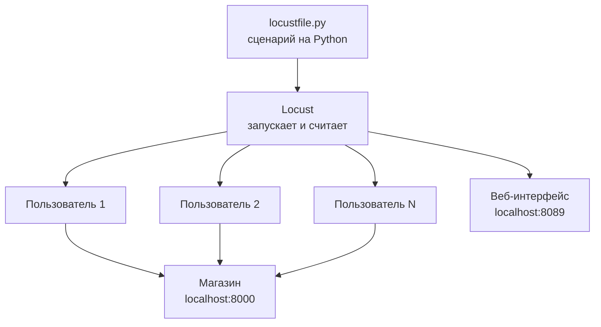
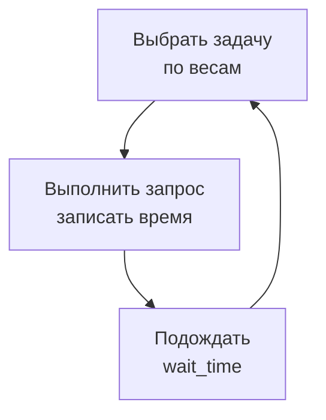
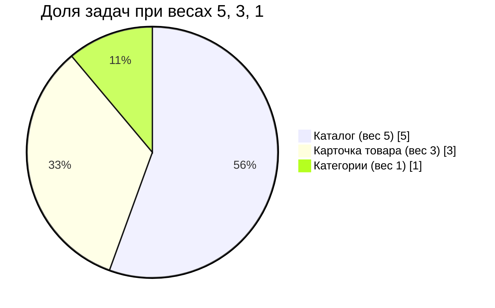
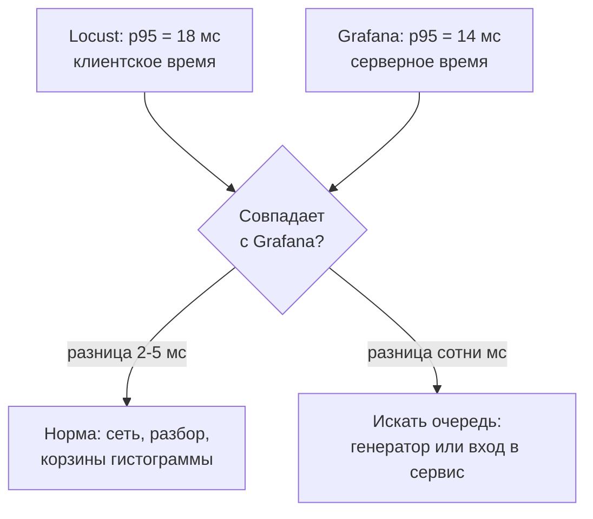

## Зачем это нужно

В [уроке 8.1](../08-perf-theory/01-latency-throughput.md) ты написал мини-генератор `measure.py`: несколько потоков, цикл запросов, список времён и три числа в конце. Для знакомства с задержкой этого хватало, а для настоящей работы нет. Он не показывает ничего, пока тест не закончился. Он считает один маршрут за раз. Он не умеет плавно наращивать нагрузку, не рисует графики, не разделяет ошибки по видам и не умеет делать паузы «как у живого человека». Дописывать всё это самому долго и скучно, а главное, твой самодельный счётчик придётся доказывать: почему ему можно верить.

**Locust** это готовый инструмент нагрузочного тестирования, в котором сценарий пишется обычным Python-кодом. Ты описываешь, что делает один «покупатель»: открывает каталог, смотрит товар, ждёт пару секунд. Locust запускает сотни таких покупателей одновременно, сам считает RPS, перцентили и ошибки по каждому маршруту и рисует всё это в веб-интерфейсе в реальном времени. Сценарий в Locust лежит в git как обычный код, его можно ревьюить, переиспользовать и запускать на сервере без мыши.

Шаг проекта: ты ставишь Locust 2.46 в свой `~/perf-lab/.venv`, пишешь первый `~/perf-lab/09-locust/locustfile.py` (анонимный посетитель, который смотрит каталог), прогоняешь 20 пользователей на стенде и сверяешь числа Locust с Grafana. Этот же файл вырастет за следующие четыре урока: появятся логин, корзина, проверки, профиль нагрузки и распределённый запуск.

## Что нужно знать

- Классы в Python: `class`, `self`, метод, наследование. Locust весь построен на классе пользователя, это тема [урока 4.6](../04-python/06-classes.md).
- Виртуальное окружение и `requests`: [урок 4.5](../04-python/05-venv-requests.md). Locust внутри использует `requests`, так что `session.get(...)` тебе уже знаком.
- Задержка, RPS и перцентили: [урок 8.1](../08-perf-theory/01-latency-throughput.md). Закрытая и открытая модели нагрузки: [урок 8.2](../08-perf-theory/02-queues-littles-law.md).
- Стенд «Магазин» с мониторингом и дашборд в Grafana: [урок 5.3](../05-docker/03-compose-shop.md) и [урок 7.3](../07-observability/03-grafana.md).

## Картина целиком

Сравни с репетицией массовки в театре. Режиссёр (это ты) пишет сценарий роли: «Зритель входит, смотрит афишу, раз в пару минут что-то покупает, между действиями думает». Дальше он набирает 50 статистов, каждый играет эту роль сам по себе, в своём темпе. Помощник с блокнотом (это Locust) записывает, сколько каждое действие длилось и чем кончилось. Аналогия ломается в одном месте: статисты в театре устают, а виртуальные пользователи Locust нет и не опаздывают, поэтому нагрузка получается ровнее, чем у живых людей.



Что здесь видно: сценарий один, пользователей много, и каждый ходит в магазин сам. Locust стоит посередине и считает: он запускает пользователей, принимает от них время каждого запроса и показывает итог в браузере.

Один пользователь живёт по очень простому циклу, и весь урок про то, как этот цикл настроить:



Смотри на картинку: «выбрал задачу, сделал запрос, подумал, выбрал снова». Нагрузка на сервер это сумма таких циклов всех пользователей. Поэтому три ручки управляют всем: **сколько пользователей**, **как часто каждый совершает действие** (пауза) и **какие действия и как часто** (задачи и их веса).

## Теория

### Из чего состоит Locust и почему он тянет сотни пользователей

**Зачем это существует.** Чтобы изобразить 500 покупателей, не нужно 500 компьютеров, но нужен способ вести 500 «разговоров» с магазином одновременно. Самое очевидное решение, 500 потоков (threads, как в `measure.py`), работает, но каждый поток тяжёлый: ему нужна память и время операционной системы на переключения. На сотнях потоков сам генератор начинает тормозить раньше сервера.

**Аналогия.** Один официант обслуживает десять столиков. Он не стоит над одним столиком, пока повар готовит: принял заказ, пошёл к следующему, вернулся, когда блюдо готово. Столиков много, официант один, и он почти всегда занят полезным делом. Аналогия ломается там, где официант вдруг начинает долго считать чек: пока он считает, остальные столики ждут. Про это дальше, в разделе про одно ядро.

**Как это устроено.** Locust использует библиотеку **gevent** (гринлеты, greenlets). **Гринлет** это очень лёгкий «поток внутри потока»: создаётся за микросекунды, весит килобайты, а переключается он не по приказу операционной системы, а сам, в тот момент, когда ему приходится ждать (ответа по сети, паузы). Пока гринлет ждёт ответа магазина, процессор занимается другим гринлетом. Поэтому один процесс Locust ведёт сотни пользователей. Практически важное:

1. **Один виртуальный пользователь (virtual user, VU) это один гринлет**, который крутит твой класс-сценарий по кругу. Слова «пользователь», «юзер», «VU» в Locust значат одно и то же.
2. Locust заранее «подменяет» ждущие функции стандартной библиотеки (это называют monkey-patching), поэтому обычные `requests` и `time.sleep` внутри сценария не блокируют остальных: они ждут «по-гринлетовски».
3. Тяжёлые **вычисления** гринлета никто не прерывает: пока ты считаешь что-то на процессоре, все остальные пользователи этого процесса стоят. Поэтому в сценарии нельзя делать ничего дорогого: большие циклы, сложные регулярки, хеширование паролей. Сценарий должен быть тонким: сформировал запрос, отправил, проверил.
4. Один процесс использует **одно ядро** процессора. Больше ядер значит больше процессов; это тема [урока 9.5](05-distributed-generator.md).

Из чего ещё состоит запущенный Locust: **раннер** (runner, он создаёт пользователей и следит за их числом), **статистика** (собирает время и результат каждого запроса), **веб-интерфейс** (по умолчанию порт 8089, показывает статистику и позволяет запускать и останавливать тест) и твой **locustfile**. Locustfile это просто Python-файл, в котором есть хотя бы один класс пользователя.

**Что путают.** Locust не «браузер»: он не выполняет JavaScript, не грузит картинки и стили, не рисует страницу. Каждый запрос в сценарии это один HTTP-запрос, который ты описал сам. Для API-сервиса вроде «Магазина» это именно то, что нужно: нагружают API, а не вёрстку.

> **Проверь понимание:** в сценарии пользователя ты написал внутри задачи цикл `for i in range(50_000_000): pass`, чтобы «чем-то занять процессор». Что случится с остальными пользователями этого процесса Locust?

<details markdown="1">
<summary>Ответ</summary>

Они встанут. Цикл на процессоре не содержит ожидания сети, поэтому гринлет не отдаёт управление, и пока он считает (секунды), никто другой в этом процессе не отправляет запросы и не принимает ответы. На графике это выглядит как провалы RPS и ложные скачки задержки: время ответа включает ожидание, пока генератор «очнётся». Тяжёлое в сценарий не кладут.

</details>

### Класс пользователя: HttpUser, client и host

**Зачем это существует.** Locust должен знать, **как** ходит пользователь: каким клиентом, на какой сервер, с какими паузами. Всё это ты описываешь классом. Один класс это один «тип» посетителя (анонимный гость, покупатель, администратор), а пользователей этого типа Locust создаст столько, сколько попросишь.

**Аналогия.** Класс это должностная инструкция («посетитель: приходит, смотрит, уходит»), а виртуальный пользователь это конкретный сотрудник, который по ней работает. Инструкция одна, сотрудников может быть сколько угодно, и у каждого свои собственные данные: в блокноте у каждого свои записи. Аналогия ломается тем, что настоящий сотрудник понимает инструкцию, а Locust выполняет её буквально.

**Как это устроено.** Минимальный locustfile выглядит так (разбор построчно):

```python
from locust import HttpUser, task, between


class Visitor(HttpUser):
    host = "http://localhost:8000"
    wait_time = between(1, 3)

    @task
    def catalog(self):
        self.client.get("/api/products")
```

- `from locust import ...`: берём три нужные вещи из библиотеки. `HttpUser` это заготовка пользователя, который ходит по HTTP.
- `class Visitor(HttpUser)`: наш класс **наследует** `HttpUser` ([урок 4.6](../04-python/06-classes.md)), то есть получает от него всё нужное: клиента, запуск, остановку. Имя класса любое.
- `host = "http://localhost:8000"`: базовый адрес. Все пути в сценарии пишутся относительно него (`/api/products`), поэтому, чтобы переехать с локального стенда на другой, достаточно поменять одну строку или передать флаг `--host`. В адресе нет слеша на конце.
- `wait_time = between(1, 3)`: после каждой задачи пользователь ждёт случайное время от 1 до 3 секунд. Об этом отдельный раздел ниже.
- `@task`: **декоратор** (строка с `@` над функцией: она добавляет функции особое поведение). Он ставит на метод ярлык «это действие пользователя». Locust сам вызывает все такие методы, тебе вызывать их не нужно.
- `self.client`: это HTTP-клиент пользователя. Он **почти полностью повторяет `requests.Session`**: те же `get`, `post`, `headers`, `json=`, `params=`. Отличие одно, но главное: каждый вызов Locust замечает, засекает время и записывает в статистику под именем «метод + путь».

Две детали, которые экономят часы:

- **У каждого пользователя свой клиент** и своё соединение с сервером. Соединение держится открытым (keep-alive, из [урока 8.1](../08-perf-theory/01-latency-throughput.md)), поэтому DNS и установка TCP происходят один раз, а не на каждый запрос. Заголовки, которые ты положишь в `self.client.headers`, видит только этот пользователь. Так позже будет храниться токен.
- Locust записывает **время от отправки запроса до получения всего ответа**, как и `measure.py`. Он не знает, сколько из этого ушло на сервер, а сколько на сеть и на ожидание самого генератора: это сквозное время клиента.

**Что путают.** `host` в классе и флаг `--host` в командной строке: если указаны оба, побеждает командная строка (и поле Host в веб-интерфейсе). Ещё путают `HttpUser` и `User`: у `User` нет `client`, он годится для нагрузки не по HTTP. У нас всегда `HttpUser`.

> **Проверь понимание:** в классе `host = "http://localhost:8000"`, а ты запустил `locust --host http://localhost:8080`. Куда пойдут запросы? И почему путь в `get` пишут как `/api/products`, а не `http://localhost:8000/api/products`?

<details markdown="1">
<summary>Ответ</summary>

На порт 8080: командная строка важнее атрибута класса. Путь пишут относительным, потому что Locust подставляет базовый адрес сам, и тогда один и тот же сценарий можно направить на любой стенд без правки кода. Кроме того, статистика группируется по относительному пути, а не по полному адресу.

</details>

### Задачи и веса: чем занят пользователь

**Зачем это существует.** Реальные посетители не делают всё поровну: каталог смотрят в десять раз чаще, чем оформляют заказ. Если твой тест шлёт все действия с одинаковой частотой, он проверит не тот магазин, который работает в жизни. Веса позволяют задать пропорции.

**Аналогия.** Игральные кубики с разными гранями: у одного кубика на пять граней нарисован «каталог», на три «товар», на одну «категории». Пользователь каждый раз бросает кубик и делает то, что выпало. Аналогия ломается тем, что кубик у Locust честный, но не помнит прошлых бросков: подряд могут выпасть три «категории», и это нормально.

**Как это устроено.** Число в скобках после `@task` это вес. Locust выбирает следующую задачу случайно, **с вероятностью, пропорциональной весу**. Вес не процент и не «раз в N»: важны только отношения. Вот три задачи:

```python
    @task(5)
    def catalog(self):
        self.client.get("/api/products", params={"page": random.randint(1, 10)})

    @task(3)
    def product(self):
        self.client.get(f"/api/products/{random.randint(1, 10000)}", name="/api/products/[id]")

    @task(1)
    def categories(self):
        self.client.get("/api/categories")
```

Сумма весов 5 + 3 + 1 = 9. Значит, в среднем из каждых девяти выполненных задач пять будут каталогом (5/9 = 56%), три карточкой (33%) и одна категориями (11%). Те же пропорции получились бы при весах 50, 30, 10. Без числа `@task` значит вес 1.



Вес превращается в долю круга. Утроить вес карточки значит утроить её долю и немного уменьшить доли остальных.

**Разобранный пример.** За тест выполнено 1190 задач. По весам ждём: каталог 1190 × 5/9 ≈ 661, карточка ≈ 397, категории ≈ 132. Фактические числа почти всегда отличаются на несколько процентов (выбор случайный): 655, 401, 134 это нормальный разброс. А вот 300 каталогов и 700 карточек значило бы, что где-то ошибка в весах.

Две строки в коде выше ты видишь впервые:

- `random.randint(1, 10)` даёт случайное целое от 1 до 10 включительно. Без `import random` вверху файла сценарий упадёт на этом месте. Номера страниц и товаров случайные, чтобы запросы не были одинаковыми: иначе всё попадёт в кэш базы, и тест окажется слишком оптимистичным.
- `name="/api/products/[id]"` отдельный важный параметр. Статистика Locust строит строки по **имени запроса**, а по умолчанию имя равно пути. Без `name` каждый товар из десяти тысяч получил бы свою строку, и таблица превратилась бы в десять тысяч строк по одному запросу. С `name` все карточки сливаются в одну строку «`/api/products/[id]`», и по ней можно судить о маршруте. В [уроке 9.2](02-user-journey.md) мы разберём это глубже.

**Что путают.** Параметры запроса не пишут в пути: `get("/api/products?page=3")` создаст отдельную строку статистики для каждой страницы. Используй `params={"page": 3}`: Locust группирует по пути без параметров. И вторая ошибка: вес не говорит «раз в десять секунд», а только соотносит задачи между собой. Как часто задача случится в секунду, определяют число пользователей и паузы.

> **Проверь понимание:** задачи имеют веса 10, 5 и 1. Сколько процентов выполнений приходится на самую редкую? Что будет с её долей, если добавить четвёртую задачу с весом 16?

<details markdown="1">
<summary>Ответ</summary>

Сумма 10 + 5 + 1 = 16, доля редкой 1/16 = 6,25%. Новая задача с весом 16 делает сумму 32, и доля редкой падает до 1/32 = 3,1%: вдвое. Чем больше суммарный вес, тем меньше доля каждой старой задачи, даже если её собственный вес не менялся.

</details>

### Пауза: wait_time и закрытая модель

**Зачем это существует.** Живой человек, увидев страницу, читает её несколько секунд, а не нажимает следующую ссылку через миллисекунду. Эту паузу называют **временем на размышление** (think time). Без неё каждый виртуальный пользователь превращается в пулемёт, и 20 пользователей создают нагрузку, как тысячи людей. Тест получается не реалистичным, а просто жестоким.

**Аналогия.** Очередь в столовой для сотрудников из [урока 8.2](../08-perf-theory/02-queues-littles-law.md): человек взял поднос, поел, ушёл думать и вернулся. Чем дольше обедает, тем реже подходит к раздаче. Пауза это время обеда.

**Как это устроено.** В Locust пауза задаётся атрибутом `wait_time`, и пользователь ждёт её **после каждой выполненной задачи**. Готовые варианты:

| Вариант | Что делает | Когда нужен |
|---|---|---|
| `between(1, 3)` | случайная пауза от 1 до 3 с | основной вариант: человек думает по-разному |
| `constant(2)` | всегда ровно 2 с | простые учебные эксперименты |
| `constant_pacing(2)` | цикл «задача + пауза» всегда ровно 2 с | хочешь, чтобы пользователь делал одно действие раз в 2 с независимо от скорости ответа |
| `constant_throughput(0.5)` | 0,5 задачи в секунду на пользователя | то же, но задаёшь частоту, а не период |
| не задан | пауза 0 | только для проверки предела, пользователь шлёт запрос сразу после ответа |

Теперь самое важное: как пауза превращается в RPS. Пользователь живёт циклом «запрос, пауза, запрос, пауза». Один цикл длится **пауза + время ответа**. Значит, один пользователь делает `1 / (пауза + ответ)` запросов в секунду, а N пользователей в N раз больше:

> RPS ≈ N ÷ (средняя пауза + время ответа)

Это закон Литтла из [урока 8.2](../08-perf-theory/02-queues-littles-law.md) в рабочей одежде. Посмотри на живой пример: пользователи ходят с паузой, и ты видишь, как они чередуют запросы и ожидания. Ниже график: сколько RPS даёт такое число пользователей, пока сервер справляется, и что происходит, когда он упирается в предел.

<div class="viz" data-viz="locust-closed" data-users="20" data-wait-min="1" data-wait-max="3" data-resp="80" data-cap="150"></div>

Что здесь видно: 8 строк вверху это 8 из 20 пользователей. Цветные короткие метки это запросы (они очень короткие по сравнению с паузами), а пустые промежутки это паузы. 20 пользователей с паузой в среднем 2 с и ответом 80 мс дают около 10 RPS, ты можешь пересчитать это руками. Подними число пользователей: сначала RPS растёт прямо пропорционально, а у предела сервера он упирается в потолок, и вместо RPS начинает расти время ответа.

**Разобранный пример.** 20 пользователей, `between(1, 3)` (в среднем 2 с), ответ 0,08 с. Цикл 2,08 с. Один пользователь: 1 / 2,08 = 0,48 запроса в секунду. Двадцать: 20 / 2,08 = **9,6 RPS**. Нужно 100 RPS? Тогда N = 100 × 2,08 = **208 пользователей**. А если убрать паузу вообще: цикл 0,08 с, один пользователь даёт 12,5 RPS, и 20 пользователей это 250 RPS, в 26 раз больше при тех же 20 пользователях.

Отсюда практический вывод: **«сколько пользователей» и «сколько RPS» это разные вопросы**. Locust управляется пользователями, а не RPS. Нужный RPS ты получаешь подбором числа пользователей и пауз, и каждый раз сверяешь по статистике. Это закрытая модель из [урока 8.2](../08-perf-theory/02-queues-littles-law.md): пользователь не шлёт новый запрос, пока не получил ответ на прошлый, поэтому сервер не завалить, но и нагрузку на медленный сервер ты невольно снижаешь. К последствиям мы вернёмся в [уроке 9.5](05-distributed-generator.md).

**Что путают.** `wait_time` не пауза между запросами внутри задачи: если в задаче два вызова `self.client.get`, между ними паузы не будет, она случится только после конца задачи. И `between(1, 3)` не «от 1 до 3 запросов»: это секунды.

> **Проверь понимание:** сервер ответил за 1 секунду вместо 0,08 (стал медленным), а пользователей и паузы ты не менял. Что случится с RPS при 20 пользователях и средней паузе 2 с?

<details markdown="1">
<summary>Ответ</summary>

Цикл стал 2 + 1 = 3 с, RPS = 20 / 3 = 6,7 вместо 9,6. Нагрузка на медленный сервер **упала сама**: пользователи заняты ожиданием ответа и реже шлют новые запросы. Это и есть свойство закрытой модели: плохой сервер получает меньше нагрузки, чем хороший.

</details>

### Веб-интерфейс Locust: что в нём есть и как читать статистику

**Зачем это существует.** Тест без наблюдения бесполезен: нужно видеть в реальном времени, растёт ли RPS, ползут ли перцентили вверх, появились ли ошибки. Веб-интерфейс Locust (web UI) это приборная панель теста.

**Как это устроено.** Ты запускаешь `locust` в каталоге с locustfile, открываешь `http://localhost:8089`, и первое, что видишь, это форма «Start new load test» с тремя полями:

- **Number of users (peak concurrency)**: сколько виртуальных пользователей нужно в итоге. «Peak» значит «максимум, до которого дорастём».
- **Ramp up (users started/second)**: **скорость запуска** (spawn rate): сколько новых пользователей Locust создаёт в секунду. 2 значит: 20 пользователей наберутся за 10 секунд. Плавный старт важен: 200 пользователей, запущенных за одну секунду, это удар (spike), а не разгон.
- **Host**: адрес стенда. Если в классе задан `host`, поле уже заполнено.

Нажимаешь **Start**, и открывается панель с вкладками. Главные:

- **Statistics** (статистика): таблица, по строке на каждое имя запроса и итоговая строка **Aggregated**.
- **Charts** (графики): три графика во времени: Total Requests per Second (RPS и отдельно ошибки в секунду), Response Times (медиана и 95-й перцентиль) и Number of Users.
- **Failures** (ошибки): список ошибок с текстом и числом повторов.
- **Exceptions**: исключения Python в самом сценарии (опечатка в коде, `KeyError`). Если тут не пусто, чинить надо сценарий, а не магазин.
- **Download Data**: выгрузка статистики в CSV и HTML-отчёта.

Вот как выглядит вкладка Statistics после двух минут теста с 20 пользователями на нашем сценарии (числа ориентировочные, у тебя будут свои):

| Type | Name | # Requests | # Fails | Median (ms) | 95%ile (ms) | 99%ile (ms) | Average (ms) | Max (ms) | Current RPS |
|---|---|---|---|---|---|---|---|---|---|
| GET | /api/categories | 132 | 0 | 4 | 7 | 11 | 4,6 | 14 | 1,1 |
| GET | /api/products | 661 | 0 | 11 | 18 | 31 | 12,1 | 44 | 5,4 |
| GET | /api/products/[id] | 397 | 0 | 5 | 9 | 13 | 5,8 | 27 | 3,3 |
| | Aggregated | 1190 | 0 | 8 | 17 | 29 | 9,8 | 44 | 9,8 |

**Как читать эту таблицу.** Идём по порядку важности:

1. **# Fails** и колонка Failures: сначала смотри, нет ли ошибок. Если ошибок 40%, все остальные числа бессмысленны: это время быстрых отказов (урок 8.1, вопрос про «быстрые ошибки»).
2. **Aggregated, RPS**: 9,8 RPS. Сверь с расчётом: 20 / (2 + 0,01) ≈ 10. Совпало, значит, нагрузка именно такая, как ты задумал.
3. **95%ile и 99%ile**: что видят почти все. Медиана (Median) это типичный запрос, среднее (Average) смотри последним, как в уроке 8.1.
4. **Строки по маршрутам**: `/api/products` самый медленный (11 мс), потому что считает общее число товаров для ответа, а `/api/products/[id]` быстрый. Именно так находят медленный маршрут: по строке, а не по Aggregated.
5. **Max**: единичный выброс. Одно значение не тревожит, но если Max в десятки раз больше p99, стоит посмотреть, что это было (прогрев, сборка мусора, пересылка).

Locust, чтобы не копить в памяти миллионы значений, **округляет** большие времена (выше 100 мс до трёх значащих цифр) и хранит их в корзинах: перцентили у него приблизительные. Для задач этого курса точности хватает с запасом.

Вот как выглядит тот же тест на вкладке Charts:

<div class="viz" data-viz="chart" data-type="line" data-x="0,10,20,30,40,50,60,70,80,90,100,110,120" data-x-label="Секунд от старта теста" data-y-label="Значение" data-explain="Locust запускает пользователей по 2 в секунду, за 10 секунд набирается 20. RPS сразу выходит на плато около 10 и дальше колеблется от случайных пауз." data-series='[{"name":"Пользователей","values":[0,20,20,20,20,20,20,20,20,20,20,20,20]},{"name":"RPS","values":[0,4.1,9.6,10.3,9.8,10.1,9.7,10.4,9.9,10.2,9.8,10.0,10.1]}]'></div>

Смотри на картинку: RPS растёт вместе с числом пользователей, пока те запускаются, а потом ложится на плато около 10. Небольшие колебания вокруг плато нормальны: паузы случайные. Если бы линия RPS росла или падала при постоянном числе пользователей, это был бы сигнал, что сервер меняет поведение.

**Что путают.** «Current RPS» в таблице это скользящее значение за последние секунды, а не среднее за весь тест: на разгоне оно ниже итогового. Для отчёта берут среднее за **стационарный** участок (когда пользователи уже набрались), а не за весь прогон.

> **Проверь понимание:** в Aggregated 1190 запросов за 120 секунд, но 25 пользователей на старте набирались 12 секунд. Верно ли «средний RPS 9,9 это RPS стабильной работы»?

<details markdown="1">
<summary>Ответ</summary>

Примерно, но слегка занижено. Первые секунды пользователей было меньше 25, поэтому средний RPS за весь тест чуть ниже, чем при полной нагрузке. Честнее брать только «полку» графика RPS или перезапускать тест и жать **Reset Stats** после разгона, чтобы в статистику попало только стационарное состояние.

</details>

### Locust и Grafana: два взгляда на один тест

**Зачем это существует.** Locust говорит «что видел клиент», Grafana «что видел сервер». Они меряют **разное** и в разных местах ([урок 8.1](../08-perf-theory/01-latency-throughput.md), раздел «Где меряют»). Если сверять их привычкой, ты быстро найдёшь ошибки теста: несовпадение чисел почти всегда что-то значит.

**Аналогия.** Футбольный матч: счёт на табло стадиона (сервер) и твоя запись по телевизору (клиент). Должны сходиться. Если не сходятся, либо ты пропустил гол, либо табло врёт.

**Как это устроено.** Сверка делается по трём вещам.

1. **Число запросов.** Сколько запросов отправил Locust, столько должен принять магазин. В Grafana или на странице Prometheus (`localhost:9090`) за окно теста:

```text
sum(increase(http_requests_total[2m]))
```

   Если сервер получил заметно меньше, чем Locust отправил, запросы не дошли: сломана сеть, закончились соединения или Locust сам не успевал. Если сервер получил **больше**, чем вижу в Locust, нагрузку давит кто-то ещё (второй генератор, сам Prometheus не считается).
2. **Распределение по маршрутам.** Сервер группирует запросы по **шаблону пути** (`/api/products/{id}`), Locust по твоему `name` (`/api/products/[id]`). Названия разные, но смысл один, и доли должны сойтись.
3. **Задержки.** Здесь расхождения естественны и объяснимы. Перцентили сервера считаются из гистограммы с грубыми корзинами (урок 8.1), поэтому p95 в Grafana приблизительный. Клиентское время в Locust больше серверного на сеть, на ожидание гринлета и на разбор ответа. На локальной машине разница обычно единицы миллисекунд. Если разница в сотни миллисекунд при пустой сети, очередь где-то перед приложением: например, генератор перегружен ([урок 9.5](05-distributed-generator.md)) или соединения ждут в сервере.



Две цифры сами по себе ничего не доказывают, их разница это диагностика. Малая разница значит «тест и сервис видят одно и то же»; большая значит «время теряется где-то между».

**Что путают.** Сверяют **разные временные окна**: Locust считает с момента Start (и после Reset Stats заново), а `[1m]` в Grafana сглажен минутой. Сравнивай одинаковые интервалы стационарной части.

> **Проверь понимание:** Locust показал 2400 запросов за тест, а `sum(increase(http_requests_total[2m]))` показал 2150. Назови две возможные причины.

<details markdown="1">
<summary>Ответ</summary>

Первая: окно в Prometheus не совпало с тестом (взяли 2 минуты, а тест длился дольше или старт был раньше). Вторая: часть запросов не дошла до приложения: соединения отклонены или оборваны, что в Locust видно как ошибки без кода ответа. Проверяй вкладку Failures и границы окна. Третья, менее очевидная: `/healthz`, `/readyz` и `/metrics` магазин в метрики не включает, и если сценарий их запрашивает, разница получится сама.

</details>

## Практика

Все файлы урока складывай в `~/perf-lab/09-locust/`. Нагрузку даём только на свой стенд на своей машине: нагружать чужие сайты нельзя ни «чуть-чуть», ни «для проверки».

### 1. Подними стенд и поставь Locust

Стенд с мониторингом (если ещё не запущен):

```bash
cd ~/load-tester/project/shop
cp -n .env.example .env
docker compose --profile monitoring up -d --wait
curl -s localhost:8000/readyz
```

```text
{"status":"ready"}
```

`cp -n` копирует только если файла ещё нет. Теперь Locust. Активируем окружение и закрепляем версию в `requirements.txt`, как договорились в [уроке 4.5](../04-python/05-venv-requests.md):

```bash
source ~/perf-lab/.venv/bin/activate
cd ~/perf-lab
echo "locust==2.46.6" >> requirements.txt
pip install -r requirements.txt
locust --version
```

```text
locust 2.46.6 from /home/student/perf-lab/.venv/lib/python3.12/site-packages/locust (Python 3.12.3)
```

`echo ... >> файл` дописывает строку в конец файла. `pip install -r requirements.txt` ставит всё из списка (`requests` и Locust со всеми зависимостями, их несколько десятков, это нормально). Последняя команда печатает версию, а заодно показывает, из какого окружения Locust запущен: путь должен идти через `.venv`.

**Типичные ошибки:**
- `locust: command not found`: окружение не активировано. Строка приглашения должна начинаться с `(.venv)`. Выполни `source ~/perf-lab/.venv/bin/activate`.
- Долго «Building wheel for ...»: у пакетов нет готовой сборки под твой Python. Проверь `python --version`: нужен 3.12 или новее.

### 2. Напиши первый locustfile

```bash
mkdir -p ~/perf-lab/09-locust && cd ~/perf-lab/09-locust
```

Создай `locustfile.py`. Имя именно такое: без флага `-f` Locust ищет файл с этим именем в текущем каталоге.

```python
"""Первый сценарий: анонимный посетитель смотрит каталог «Магазина»."""
import random

from locust import HttpUser, between, task


class Visitor(HttpUser):
    host = "http://localhost:8000"
    wait_time = between(1, 3)

    @task(5)
    def catalog(self):
        # params: страница уходит в запрос, а в статистике остаётся одна строка /api/products
        self.client.get("/api/products", params={"page": random.randint(1, 10)})

    @task(3)
    def product(self):
        # name: все карточки считаются одной строкой статистики
        product_id = random.randint(1, 10000)
        self.client.get(f"/api/products/{product_id}", name="/api/products/[id]")

    @task(1)
    def categories(self):
        self.client.get("/api/categories")
```

В Python-файле можно использовать f-строки (`f"...{product_id}"`): значение переменной вставляется прямо в текст, это уже знакомо по [уроку 4.2](../04-python/02-conditions-loops.md). Диапазон 1–10 000 это ровно 10 000 товаров, которые есть в базе стенда.

### 3. Запусти с веб-интерфейсом

```bash
locust
```

```text
[2026-10-03 12:00:01,123] laptop/INFO/locust.main: Starting Locust 2.46.6
[2026-10-03 12:00:01,124] laptop/INFO/locust.main: Starting web interface at http://0.0.0.0:8089
```

Команда запускает Locust и ждёт; терминал занят до остановки по `Ctrl+C`. Открой в браузере `http://localhost:8089`. Адрес `0.0.0.0` в сообщении значит «слушаю на всех сетевых интерфейсах»: интерфейс доступен и другим компьютерам твоей сети, а у Locust нет логина. На рабочей машине в офисной сети безопаснее запускать `locust --web-host 127.0.0.1`, тогда панель видна только тебе.

В форме поставь: Number of users `20`, Ramp up `2`, Host уже должен быть `http://localhost:8000`. Нажми **Start**.

### 4. Прочитай статистику

Дай тесту поработать минуты две. Смотри вкладки **Statistics**, **Charts** и **Failures** и ответь себе письменно (в `~/perf-lab/09-locust/notes.md`, понадобится ниже):

1. Сколько запросов и RPS в строке Aggregated? Сходится ли RPS с расчётом `20 / (2 + ответ)`?
2. Какой маршрут самый медленный по 95%ile?
3. Есть ли ошибки на вкладке Failures? (На здоровом стенде нет.)
4. В процентах: какая доля запросов приходится на каждый из трёх маршрутов, и похоже ли это на 56/33/11?

**Как читать вывод:** если RPS заметно ниже расчёта, проверь, что число пользователей набрано (вкладка Charts, график Number of Users дошёл до 20), и что среднее время ответа маленькое. Если доли маршрутов далеки от весов, на малом числе запросов это нормально, подожди ещё минуту.

Нажми **Stop**. Тест остановился, статистика осталась на экране. Кнопка **New** запускает новый тест, **Reset Stats** обнуляет таблицу, не останавливая пользователей.

### 5. Сверь с Grafana

Открой `http://localhost:3000`, дашборд «Магазин: обзор (эталон)» ([урок 7.3](../07-observability/03-grafana.md)). Поставь диапазон «Last 15 minutes» и найди свой тест по «горбу» на панели «RPS по маршруту». Сравни:

- сумму RPS на дашборде с Aggregated в Locust (должны быть близки);
- p95 маршрута `/api/products` на дашборде и 95%ile строки `/api/products` в Locust. Запиши обе цифры.

Для точной сверки числа запросов зайди в Prometheus (`http://localhost:9090`) и выполни, подставив продолжительность своего теста вместо `2m`:

```text
sum by (route) (increase(http_requests_total[2m]))
```

В результате три строки: `/api/products`, `/api/products/{id}`, `/api/categories`. Их суммы должны быть близки к числам в колонке `# Requests`.

**Как читать вывод:** разница 2-5 мс в p95 нормальна (клиент добавляет сеть и обработку). Если число запросов сильно расходится, прочитай раздел «Locust и Grafana» выше и найди причину.

### 6. Закоммить

```bash
cd ~/perf-lab && git add requirements.txt 09-locust && git commit -m "9.1: первый locustfile" && git push
```

## Сломай и почини

**Поломка A. Неверный порт.** Останови Locust (`Ctrl+C`) и измени в `locustfile.py` строку `host = "http://localhost:8000"` на `host = "http://localhost:8080"`. Запусти заново и нажми Start с теми же 20 пользователями.

**Что ожидать.** На вкладке Statistics 100% ошибок, на вкладке Failures строки вроде `ConnectionRefusedError(111, 'Connection refused')` (текст чуть отличается по версии библиотеки), RPS при этом **высокий**, а задержки около нуля. Магазин при этом полон сил, и в Grafana ни одного нового запроса.

**Задача.** Выяви причину тремя шагами, не меняя код вслепую: 1) смотри не на RPS, а на Fails; 2) вкладка Failures и текст ошибки; 3) `curl -s localhost:8080/readyz` из терминала.

<div class="viz" data-viz="flow" data-steps='[{"title":"Сначала доля ошибок","text":"Если в `Fails` почти 100%, остальные числа таблицы не читай."},{"title":"Открой вкладку Failures","text":"Текст ошибки отвечает, дошёл ли запрос до сервера."},{"title":"Нет соединения","text":"`Connection refused`: по этому адресу никто не слушает. Проверь `host`, порт, `docker compose ps`."},{"title":"Проверь вручную","text":"Тот же адрес через `curl`: работает ли он вне Locust."},{"title":"Сверь с Grafana","text":"Нет новых запросов в `http_requests_total`: нагрузка до сервера не дошла."},{"title":"Исправь и повтори","text":"Верни порт 8000, сбрось статистику и убедись, что `Fails` стали 0."}]'></div>

Что здесь видно: порядок работы с любым странным результатом теста: сначала ошибки, потом причина, потом проверка вне инструмента. Самое коварное в этой поломке: быстрые отказы выглядят в таблице как «отличная скорость». Вернись к вопросу 10 из [урока 8.1](../08-perf-theory/01-latency-throughput.md).

**Починка.** Верни порт `8000`. Тест снова работает, `Fails` равны нулю.

**Поломка B. Пользователь без паузы.** Закомментируй строку `wait_time = between(1, 3)` (поставь `#` в начало). Запусти тест на те же 20 пользователей.

**Что ожидать.** RPS взлетает с 10 до сотен (у тебя цифра будет своя, на стенде с одним ядром примерно 250-350), p95 начинает расти, на панели «CPU контейнера shop» в Grafana полка около 100%. Ошибок нет, но тест уже не про «20 обычных покупателей», а про «20 пулемётов». Именно такой сценарий ты написал бы, если бы забыл про паузу.

**Задача.** Сравни: сколько RPS даёт один пользователь без паузы (по закону Литтла ≈ 1 / время ответа) и во сколько раз нагрузка выросла против теста с паузой. Верни `wait_time`, чтобы остаток курса работал на реалистичную нагрузку.

## Словарик урока

| Термин | Простыми словами |
|---|---|
| Locust | Инструмент нагрузочного тестирования, где сценарий пишется на Python |
| Locustfile | Python-файл со сценарием: в нём хотя бы один класс пользователя |
| Виртуальный пользователь (virtual user, VU) | Один «покупатель» в тесте: гринлет, который по кругу выполняет твой сценарий |
| Гринлет (greenlet) | Очень лёгкий поток внутри процесса; переключается, когда ждёт сеть или паузу |
| gevent | Библиотека гринлетов, на которой работает Locust |
| HttpUser | Базовый класс пользователя, который ходит по HTTP и имеет `self.client` |
| `self.client` | HTTP-клиент пользователя: как `requests.Session`, но с записью статистики |
| `@task(N)` | Метка «это действие пользователя» с весом N: шансы пропорциональны весам |
| `wait_time` | Пауза пользователя после каждой задачи: `between`, `constant`, `constant_pacing` |
| Время на размышление (think time) | Пауза человека между действиями; в Locust это `wait_time` |
| Скорость запуска (spawn rate, ramp up) | Сколько новых пользователей Locust создаёт в секунду |
| `name=` | Имя запроса в статистике: так разные URL с id собираются в одну строку |
| Aggregated | Итоговая строка статистики по всем запросам |
| Закрытая модель | Новый запрос пользователь шлёт только после ответа на прошлый; RPS зависит от скорости ответов |

## Вопросы с собеседований

Раздел для повторения: ответь вслух, потом открой ответ. Короткие вопросы с пометкой `[на скорость]` тренируй на время: ответ за 30 секунд.

### 1. [junior] [часто] Что такое виртуальный пользователь в Locust и чем он отличается от потока?

<details markdown="1">
<summary>Ответ</summary>

Виртуальный пользователь это экземпляр класса-сценария, который крутит свои задачи по кругу с паузами и имитирует одного человека. В Locust он реализован гринлетом (gevent): очень лёгкой сопрограммой, а не потоком операционной системы. Поэтому один процесс вмещает сотни пользователей, а на потоках генератор упёрся бы в память и переключения раньше сервера.

**Что хотят услышать:** гринлеты, кооперативное переключение при ожидании сети, один процесс это одно ядро.

**Красный флаг:** «каждый пользователь это отдельный процесс».

</details>

### 2. [junior] [часто] Как Locust выбирает, какую задачу выполнить следующей?

<details markdown="1">
<summary>Ответ</summary>

Случайно, с вероятностью, пропорциональной весу из `@task(N)`. Вес без числа равен 1. Важно соотношение, а не абсолютные значения: 5/3/1 и 50/30/10 дают одинаковые доли. Выбор независимый, поэтому подряд может выпасть одна и та же задача.

**Что хотят услышать:** вероятность пропорциональна весу, вес это не частота в секунду.

**Красный флаг:** «задачи выполняются по порядку».

</details>

### 3. [junior] [часто] Зачем нужен `wait_time` и что будет без него?

<details markdown="1">
<summary>Ответ</summary>

Он задаёт паузу пользователя после каждой задачи, имитируя время на размышление. Без него пауза равна нулю, и каждый пользователь шлёт запрос сразу после ответа: нагрузка становится в разы выше реальной, 20 пользователей создают сотни RPS. Для проверки предела это годится, для реалистичного теста нет.

**Что хотят услышать:** RPS ≈ пользователи ÷ (пауза + ответ); без паузы нагрузка определяется только скоростью ответов.

**Красный флаг:** «пауза нужна, чтобы не перегружать сервер»: цель не щадить, а быть похожим на людей.

</details>

### 4. [junior] Чем `self.client` в Locust отличается от `requests.Session`?

<details markdown="1">
<summary>Ответ</summary>

Интерфейс почти тот же (`get`, `post`, `headers`, `json=`), но Locust оборачивает каждый вызов: засекает время, определяет успех или ошибку и записывает в статистику под именем запроса. Кроме того, у каждого пользователя свой клиент, свои заголовки и своё открытое соединение.

**Что хотят услышать:** обёртка над requests со сбором статистики, у каждого пользователя свой.

**Красный флаг:** «на `requests` в Locust писать нельзя»: можно, но такие запросы не попадут в статистику.

</details>

### 5. [junior] Зачем параметр `name=` в запросе?

<details markdown="1">
<summary>Ответ</summary>

Locust группирует статистику по имени запроса, а по умолчанию имя равно пути. Если в пути есть id (`/api/products/4217`), каждое значение станет отдельной строкой, и таблица разрастётся до тысяч строк по одному запросу. С `name="/api/products/[id]"` все они сливаются в одну строку, по которой видно задержку маршрута.

**Что хотят услышать:** группировка по шаблону, соответствие шаблону пути на сервере; параметры запроса передают через `params=`.

**Красный флаг:** «name нужен для красоты».

</details>

### 6. [junior] Какие три числа ты смотришь первыми в таблице статистики Locust?

<details markdown="1">
<summary>Ответ</summary>

Сначала число ошибок (Fails), потому что при большой доле ошибок остальные числа обманчивы. Потом RPS (достиг ли он планового значения). Потом перцентили 95 и 99 по самым важным маршрутам, а не по Aggregated. Среднее и максимум смотрю в последнюю очередь.

**Что хотят услышать:** ошибки, RPS, хвост задержек; по маршрутам, а не только итог.

**Красный флаг:** «смотрю среднее время».

</details>

### 7. [middle] Почему p95 в Locust и в Grafana для одного маршрута не совпадают?

<details markdown="1">
<summary>Ответ</summary>

Они меряют в разных местах. Locust это клиентское время: сеть, ожидание гринлета, разбор ответа. Grafana это серверное время от входа запроса в приложение до выхода ответа, причём перцентиль считается из гистограммы с грубыми корзинами. Малая разница (единицы миллисекунд) нормальна. Разница в сотни миллисекунд означает очередь вне приложения: перегруженный генератор, ожидание соединения, сетевая проблема.

**Что хотят услышать:** разные точки измерения, приблизительность гистограммы, диагностическая ценность разницы.

**Красный флаг:** «одна из систем врёт, надо верить Grafana».

</details>

### 8. [middle] 50 пользователей, `between(2, 4)`, ответ сервера 100 мс. Сколько приблизительно RPS?

<details markdown="1">
<summary>Ответ</summary>

Средняя пауза 3 с, ответ 0,1 с, цикл 3,1 с. RPS = 50 / 3,1 ≈ 16. Расчёт верен, пока сервер справляется. Если ответ вырастет до секунды, цикл станет 4 с и RPS упадёт до 12,5: закрытая модель.

**Что хотят услышать:** формула «пользователи ÷ (пауза + ответ)» и оговорка про зависимость от скорости ответа.

**Красный флаг:** «50 пользователей это 50 RPS».

</details>

### 9. [middle] Locust у тебя показывает 100% ошибок и очень маленькие задержки. Что делаешь?

<details markdown="1">
<summary>Ответ</summary>

Это быстрые отказы, а не быстрый сервис. Открываю вкладку Failures: текст ошибки покажет, не дошёл ли запрос до сервера (`Connection refused`, неверный host или порт), или сервер ответил кодами 4xx/5xx. Проверяю адрес и ответ вручную через `curl`, сверяю с Grafana, пришли ли вообще запросы. Пока доля ошибок не равна нулю или не объяснена, числа задержек в отчёт не идут.

**Что хотят услышать:** порядок «ошибки, причина, проверка вне инструмента».

**Красный флаг:** «отличный результат, сервис очень быстрый».

</details>

### 10. [middle] Какую модель нагрузки по умолчанию реализует Locust: открытую или закрытую? Чем это грозит?

<details markdown="1">
<summary>Ответ</summary>

Закрытую: у пользователя есть цикл «запрос, ответ, пауза», новый запрос идёт только после ответа. Если сервер замедляется, нагрузка сама падает, и перегрузка выглядит мягче, чем в жизни, где посетители продолжали бы приходить. Поэтому Locust отлично находит предел и колено, но слабее проверяет «выдержит ли сервис заданный поток прихода». В [уроке 9.5](05-distributed-generator.md) об этом отдельный разговор.

**Что хотят услышать:** закрытая модель, связь с координированным пропуском.

**Красный флаг:** «Locust сам держит нужный RPS».

</details>

### 11. [middle] Чем думающее время (`between`) отличается от pacing (`constant_pacing`)?

<details markdown="1">
<summary>Ответ</summary>

`between(a, b)` и `constant(n)` это пауза **после** задачи: цикл пользователя равен времени задачи плюс пауза. Если сервер замедлился, цикл удлиняется, и нагрузка падает. Это think time: так моделируют человека, который читает страницу. `constant_pacing(n)` задаёт длину **всего цикла** «задача плюс пауза»: пока задача быстрее n секунд, цикл ровно n секунд и пользователь делает ровно одно действие за n секунд, то есть 1/n запросов в секунду. Если задача стала длиннее n, паузы нет, цикл равен времени задачи, и частота падает. Pacing нужен, когда хочется стабильный темп, а не имитация человека.

**Что хотят услышать:** think time это пауза после действия, pacing это длина всего цикла; pacing не гарантирует RPS, если ответ дольше периода.

**Красный флаг:** «`constant_pacing` задаёт RPS всего теста» или «разницы нет».

</details>

### 12. [junior] [на скорость] 10 пользователей, пауза ровно 1 секунда, ответ почти мгновенный. Сколько RPS?

<details markdown="1">
<summary>Ответ</summary>

Около 10: цикл ≈ 1 секунда, каждый пользователь делает 1 запрос в секунду, десять дают 10 RPS (чуть меньше из-за времени ответа).

</details>

## Проверено на версиях

Ubuntu 24.04, Python 3.12, Locust 2.46.6 (gevent, requests), стенд «Магазин» из `project/shop` (Python 3.14, FastAPI 0.142, PostgreSQL 18.6), Prometheus 3.15, Grafana 13.2. Октябрь 2026.

## Итог урока: ты умеешь

- [ ] Установить Locust в виртуальное окружение и зафиксировать версию в `requirements.txt`.
- [ ] Написать класс `HttpUser` с `host`, `wait_time` и несколькими задачами с весами.
- [ ] Посчитать ожидаемый RPS по формуле «пользователи ÷ (пауза + ответ)» и сверить с Locust.
- [ ] Запустить тест в веб-интерфейсе, задав число пользователей и скорость запуска.
- [ ] Прочитать таблицу статистики: ошибки, RPS, перцентили по маршрутам.
- [ ] Использовать `name=` и `params=`, чтобы статистика не расползалась на тысячи строк.
- [ ] Сверить числа Locust с Grafana и объяснить естественную разницу.
- [ ] Отличить быстрые отказы от быстрого сервиса.

Дальше: [урок 9.2. Сценарий покупателя: логин, корзина, заказ, корреляция](02-user-journey.md), где пользователь авторизуется и пройдёт путь до оформления заказа.
