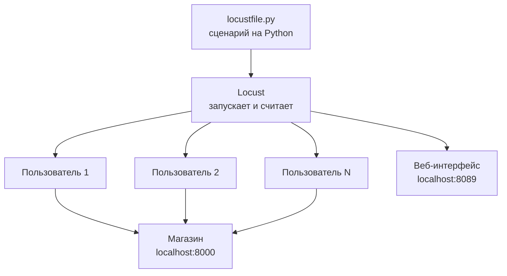
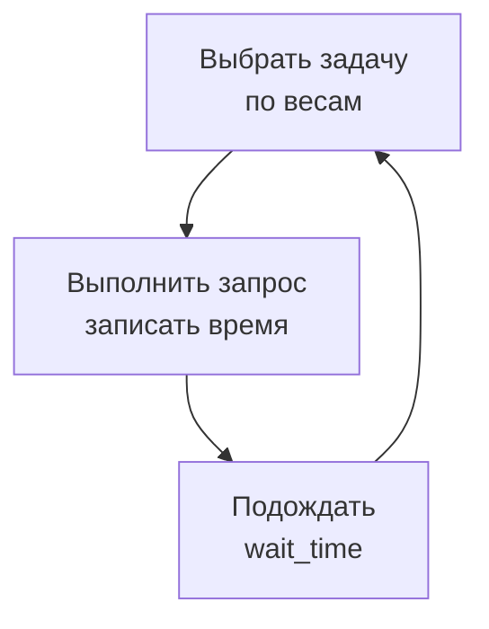
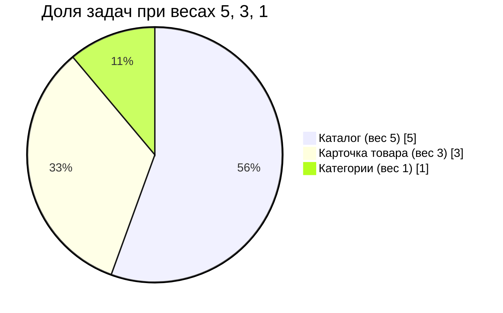
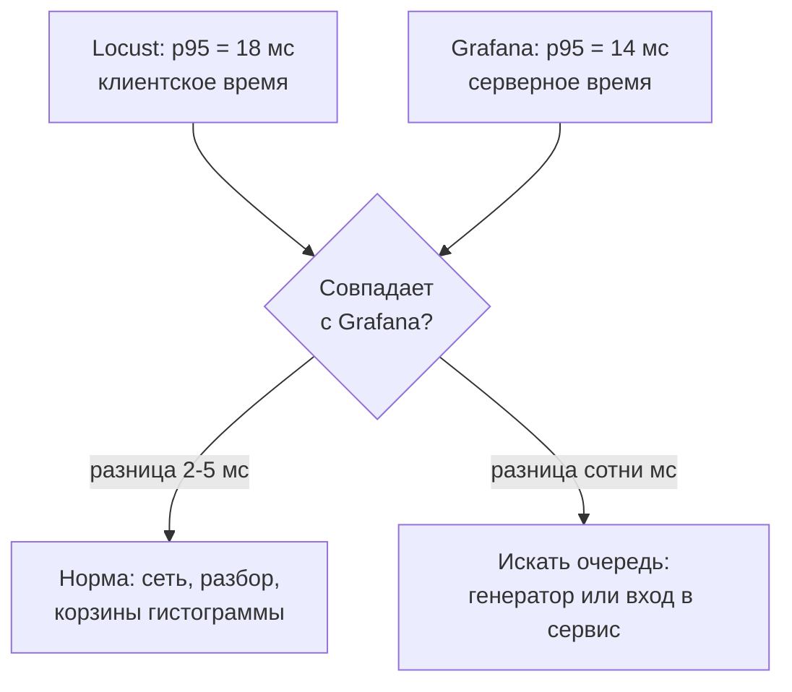

## Зачем это нужно

Я много лет пишу нагрузочные тесты и сейчас покажу, как делают первый настоящий. До распродажи в магазине осталось несколько недель, менеджер просит: «Дай мне цифры, сколько покупателей мы выдержим». Твой `measure.py` из [урока 8.1](../08-perf-theory/01-latency-throughput.md) для знакомства с задержкой хватал, а для такой просьбы нет. Он молчит, пока тест не закончится, считает один маршрут и не умеет плавно наращивать нагрузку. А главное, самодельному счётчику придётся доказывать, что ему можно верить.

Поэтому берём готовый инструмент. **Locust** запускает сотни виртуальных покупателей, сам считает RPS, перцентили и ошибки по каждому маршруту и рисует всё в браузере, пока тест идёт. Сценарий для него это обычный Python-файл (его называют **locustfile**, «файл для Locust»). Его можно хранить в репозитории git ([тема 3](../03-git/index.md)), показывать коллегам на проверку и запускать на сервере без мыши.

У меня с этим была типичная история. Первый свой генератор я сделал на двухстах потоках и ужасно гордился. Тест показал «сервис еле дышит», я побежал к разработчикам, а они посмотрели на процессор и сказали: «Сервис скучает, это ты тормозишь». Задыхался мой генератор, а не магазин. Ниже ты узнаешь, почему так бывает и как Locust этого избегает.

Шаг проекта: ты ставишь Locust 2.46 в `~/perf-lab/.venv` и пишешь первый `~/perf-lab/09-locust/locustfile.py` (анонимный посетитель смотрит каталог). Потом прогоняешь 20 пользователей и сверяешь числа Locust с Grafana. Этот же файл вырастет за следующие четыре урока: появятся логин, корзина, проверки, профиль нагрузки и распределённый запуск.

## Что нужно знать

- Классы в Python: `class`, `self`, метод, наследование. Locust весь построен на классе пользователя, это тема [урока 4.6](../04-python/06-classes.md).
- Виртуальное окружение и `requests`: [урок 4.5](../04-python/05-venv-requests.md). Locust внутри использует `requests`, так что `session.get(...)` тебе уже знаком.
- Задержка, RPS и перцентили: [урок 8.1](../08-perf-theory/01-latency-throughput.md). Закрытая и открытая модели нагрузки: [урок 8.2](../08-perf-theory/02-queues-littles-law.md).
- Стенд «Магазин» с мониторингом и дашборд в Grafana: [урок 5.3](../05-docker/03-compose-shop.md) и [урок 7.3](../07-observability/03-grafana.md).

## Картина целиком

Сравни с репетицией массовки в театре. Режиссёр (это ты) пишет роль: «Зритель входит, смотрит афишу, между действиями думает». Он набирает 50 статистов (в Locust это **виртуальные пользователи**), и каждый играет эту роль сам, в своём темпе. Помощник с блокнотом (это Locust) записывает время и результат каждого действия. Аналогия ломается в одном месте: статисты устают, а виртуальные пользователи Locust нет, и нагрузка выходит ровнее, чем от живых людей.



Что здесь видно: сценарий один, пользователей много, и каждый ходит в магазин сам. Locust стоит посередине: запускает пользователей, принимает от них время каждого запроса и показывает итог в браузере.

Жизнь одного пользователя устроена просто, и весь урок о том, как её настроить:



Нагрузка на сервер это сумма таких циклов всех пользователей. Поэтому три ручки управляют всем: сколько пользователей, как часто каждый действует (пауза) и какие действия выбирает (задачи и их веса).

## Теория

### Почему Locust тянет сотни пользователей

Чтобы изобразить 500 покупателей, не нужно 500 компьютеров, но нужен способ вести 500 «разговоров» с магазином одновременно. Очевидный путь, 500 потоков (как в `measure.py`), работает, но поток тяжёлый: ему нужна память и время операционной системы на переключения. На этом сгорел мой первый генератор.

Представь одного официанта на десять столиков. Он не стоит над столиком, пока повар готовит: принял заказ, пошёл дальше, вернулся, когда блюдо готово. Столиков много, официант один, и он почти всегда занят делом. Так же устроен Locust. Он использует библиотеку **gevent** (готовый Python-код, который умеет быстро переключаться между ждущими задачами), а её «официант» называется **гринлет** (greenlet): очень лёгкий «поток внутри потока». Он создаётся за микросекунды, весит килобайты и переключается не по приказу системы, а сам, когда ему приходится ждать: ответа сети или паузы. Пока один гринлет ждёт магазин, процессор занят другим. Поэтому один процесс Locust ведёт сотни пользователей.

Отсюда следуют три правила, которые экономят часы:

1. Один **виртуальный пользователь** (virtual user, VU) это один гринлет, который крутит твой сценарий по кругу. «Пользователь», «юзер» и VU в Locust одно и то же.
2. Обычные `requests` и `time.sleep` по умолчанию стоят и никого не пускают вперёд. Поэтому Locust при запуске заменяет их внутренности на свои, которые на время ожидания отдают процессор соседям. Такую замену «на лету» называют monkey-patching («обезьянья заплатка»), и делает её Locust сам, тебе ничего включать не надо.
3. Вычисления гринлета никто не прерывает. Пока он считает на процессоре, весь процесс стоит. Значит, сценарий должен быть тонким: собрал запрос, отправил, проверил. Никаких больших циклов и хеширования паролей.

> **Прикинь сам:** в задаче ты написал цикл `for i in range(50_000_000): pass`, «чтобы занять процессор». Что случится с остальными пользователями процесса?
{: .predict}

Они встанут. Python в одном процессе считает одним ядром и одной командой за раз. В цикле нет ожидания сети, гринлет не отдаёт управление, а другие гринлеты ждут в очереди на то же ядро, и несколько секунд никто не шлёт запросы и не читает ответы. На графике это провалы RPS и ложные скачки задержки: время ответа включает ожидание, пока генератор «очнётся». Помнишь мою байку? Это тот же случай.

Осторожно: Locust не браузер. Он не выполняет JavaScript и не грузит картинки: каждый запрос это один HTTP-запрос, который ты описал. Для API вроде «Магазина» этого достаточно.

> **Главное:** один процесс ведёт сотни пользователей, пока гринлеты ждут сеть, но вычисления в сценарии стопорят всех. Ядро у процесса одно (больше ядер в [уроке 9.5](05-distributed-generator.md)).
{: .key}

Мы знаем, на чём всё держится. Теперь посмотрим, как выглядит сам сценарий.

### Класс пользователя: HttpUser, client и host

Сценарий Locust описывает «должностную инструкцию»: посетитель приходит, смотрит каталог, уходит. Инструкция одна, а сотрудников по ней Locust заведёт сколько попросишь, и у каждого свой блокнот. Но Locust, в отличие от человека, выполняет инструкцию буквально. Вот минимальный locustfile:

```python
from locust import HttpUser, task, between


class Visitor(HttpUser):
    host = "http://localhost:8000"
    wait_time = between(1, 3)

    @task
    def catalog(self):
        self.client.get("/api/products")
```

Читаем сверху вниз.

- `class Visitor(HttpUser)`: класс **наследует** заготовку `HttpUser` ([урок 4.6](../04-python/06-classes.md)) и получает клиента, запуск и остановку. Имя любое.
- `host`: базовый адрес без слеша на конце. Пути в сценарии пишут относительно него, поэтому для другого стенда меняют одну строку или флаг `--host`.
- `wait_time = between(1, 3)`: после каждой задачи пользователь ждёт от 1 до 3 секунд. Об этом отдельный раздел ниже.
- `@task`: **декоратор** (строка с `@` над функцией, она добавляет функции особое поведение). Он помечает метод как «действие пользователя». Вызывать такие методы тебе не нужно: Locust делает это сам.
- `self.client`: HTTP-клиент пользователя. Он почти полностью повторяет `requests.Session`: те же `get`, `post`, `headers`, `json=`, `params=`. Отличие в том, что Locust засекает время каждого вызова и пишет в статистику под именем «метод + путь».

У каждого пользователя свой клиент и своё соединение, которое не закрывается после ответа (keep-alive из [урока 8.1](../08-perf-theory/01-latency-throughput.md)), поэтому DNS и установка TCP происходят один раз. Заголовки в `self.client.headers` видит только этот пользователь: там позже будет храниться токен. Замеряется время от отправки запроса до получения всего ответа, как в `measure.py`, включая сеть и ожидание самого генератора.

Осторожно: если `host` задан и в классе, и флагом `--host`, побеждает командная строка. И не путай `HttpUser` с `User`: у `User` нет `client`, он нужен для нагрузки не по HTTP. У нас всегда `HttpUser`.

> **Проверь понимание:** в классе `host = "http://localhost:8000"`, а ты запустил `locust --host http://localhost:8080`. Куда пойдут запросы? И почему путь пишут `/api/products`, а не полным адресом?

<details markdown="1">
<summary>Ответ</summary>

На порт 8080: командная строка важнее атрибута класса. Путь относительный, потому что Locust подставляет базовый адрес сам, и один сценарий можно направить на любой стенд без правки кода. К тому же статистика группируется по относительному пути.

</details>

> **Главное:** класс описывает один тип посетителя, `self.client` ходит как `requests`, а Locust замечает каждый вызов и копит статистику.
{: .key}

Один метод с `@task` это пока скучный посетитель. Как сделать так, чтобы он вёл себя как настоящие покупатели?

### Задачи и веса: чем занят пользователь

Реальные посетители каталог смотрят в десять раз чаще, чем оформляют заказ. Если тест шлёт все действия поровну, он проверит не тот магазин, который работает в жизни. Пропорции задаёт вес.

Представь кубик, у которого на пяти гранях нарисован «каталог», на трёх «товар» и на одной «категории». Пользователь бросает его каждый раз и делает то, что выпало. Кубик не помнит прошлых бросков: три «категории» подряд это нормально. Число в скобках после `@task` и есть количество граней:

```python
    @task(5)
    def catalog(self):
        self.client.get("/api/products", params={"page": random.randint(1, 10)})

    @task(3)
    def product(self):
        self.client.get(f"/api/products/{random.randint(1, 10000)}", name="/api/products/[id]")

    @task(1)
    def categories(self):
        self.client.get("/api/categories")
```

Сумма весов 5 + 3 + 1 = 9. Значит, из девяти задач в среднем пять будут каталогом (56%), три карточкой (33%) и одна категориями (11%). Те же доли дали бы веса 50, 30 и 10: важны только отношения. Без числа `@task` это вес 1.



Вес превращается в долю круга.

За тест выполнено 1190 задач. Ждём каталог 1190 × 5 ÷ 9 ≈ 661, карточку 397, категории 132. Фактические 655, 401 и 134 это нормальный разброс случайного выбора. А 300 каталогов и 700 карточек значило бы, что ошибка в весах.

В коде выше две новые строки. `random.randint(1, 10)` даёт случайное целое от 1 до 10 включительно (не забудь `import random` вверху, иначе сценарий упадёт). Случайные номера нужны, чтобы запросы не повторялись: иначе магазин отвечал бы из быстрой памяти (кэша), и тест вышел бы слишком оптимистичным. А `name="/api/products/[id]"` важнее. Статистика строит строки по имени запроса, а по умолчанию оно равно пути. Без `name` каждый из десяти тысяч товаров получил бы свою строку. С `name` все карточки сливаются в одну, и по ней можно судить о маршруте. Глубже разберём в [уроке 9.2](02-user-journey.md).

> **Прикинь сам:** веса 10, 5 и 1. Сколько процентов выполнений у самой редкой задачи? Что с её долей, если добавить четвёртую с весом 16?
{: .predict}

Сумма 16, доля редкой 1 ÷ 16 = 6,25%. С новой задачей сумма 32, доля падает до 3,1%: вдвое, хотя вес редкой не менялся.

Осторожно: параметры не пишут в путь. `get("/api/products?page=3")` создаст отдельную строку статистики для каждой страницы, поэтому используй `params={"page": 3}`. И вес не значит «раз в десять секунд»: он лишь соотносит задачи. Как часто задача случается в секунду, зависит от числа пользователей и пауз.

> **Главное:** вес это доля выбора среди задач, а не частота. Пути с переменной частью называй через `name`, параметры отдавай через `params`.
{: .key}

Мы знаем, что выбирает пользователь. Остаётся вопрос, как часто он действует, и тут появляется пауза.

### Пауза: wait_time и закрытая модель

Человек, открыв страницу, читает её несколько секунд, а не жмёт следующую ссылку через миллисекунду. Эту паузу называют **временем на размышление** (think time). Без неё каждый виртуальный пользователь становится пулемётом: 20 таких создают нагрузку тысяч людей, и тест выходит не реалистичным, а просто жестоким.

Это как в столовой из [урока 8.2](../08-perf-theory/02-queues-littles-law.md): чем дольше человек обедает, тем реже подходит к раздаче. В Locust пауза задаётся атрибутом `wait_time`, и пользователь ждёт её после каждой выполненной задачи. Основной вариант `between(1, 3)`: случайная пауза от 1 до 3 секунд, потому что люди думают по-разному. `constant(2)` ждёт ровно 2 секунды, это для простых экспериментов. `constant_pacing(2)` делает так, чтобы весь цикл «задача + пауза» длился ровно 2 секунды, как бы быстро ни ответил сервер. Без `wait_time` пауза нулевая: так проверяют предел.

Теперь главное: как пауза превращается в RPS. Один цикл длится «пауза + время ответа». Значит, пользователь делает `1 ÷ (пауза + ответ)` запросов в секунду, а N пользователей в N раз больше. Короткая запись:

> RPS ≈ N ÷ (средняя пауза + время ответа)

Это закон Литтла из [урока 8.2](../08-perf-theory/02-queues-littles-law.md) в рабочей одежде. Посмотри на живой пример: пользователи чередуют запросы и ожидания.

<div class="viz" data-viz="locust-closed" data-users="20" data-wait-min="1" data-wait-max="3" data-resp="80" data-cap="150"></div>

Что здесь видно: 8 строк вверху это 8 из 20 пользователей, цветные метки это запросы (по сравнению с паузами очень короткие), пустые промежутки это паузы. Подними число пользователей: сначала RPS растёт прямо пропорционально, а у предела упирается в потолок, и растёт уже время ответа.

> **Прикинь сам:** 20 пользователей, `between(1, 3)` (в среднем 2 с), ответ 0,08 с. Сколько RPS?
{: .predict}

Цикл 2,08 с. Один пользователь: 1 ÷ 2,08 = 0,48 запроса в секунду. Двадцать: 20 ÷ 2,08 = 9,6 RPS. Нужно 100 RPS? Тогда N = 100 × 2,08 = 208 пользователей. Убери паузу совсем: цикл 0,08 с, один пользователь даёт 12,5 RPS, а двадцать 250 RPS, в 26 раз больше при тех же двадцати.

Вывод: «сколько пользователей» и «сколько RPS» это разные вопросы. Locust управляется пользователями, а нужный RPS ты получаешь подбором пользователей и пауз. Это закрытая модель из [урока 8.2](../08-perf-theory/02-queues-littles-law.md): пользователь не шлёт новый запрос, пока не получил ответ. Завалить сервер так трудно, а на медленный сервер нагрузка невольно падает. К последствиям вернёмся в [уроке 9.5](05-distributed-generator.md).

> **Проверь понимание:** сервер ответил за 1 секунду вместо 0,08, а пользователей и паузы ты не менял. Что случится с RPS?

<details markdown="1">
<summary>Ответ</summary>

Цикл стал 2 + 1 = 3 с, RPS = 20 ÷ 3 = 6,7 вместо 9,6. Нагрузка на медленный сервер упала сама: пользователи заняты ожиданием и реже шлют новое. Это свойство закрытой модели.

</details>

Осторожно: `wait_time` это не пауза между запросами внутри задачи. Если в задаче два вызова `self.client.get`, между ними паузы нет, она случится после конца задачи. И `between(1, 3)` это секунды, а не число запросов.

> **Главное:** RPS ≈ пользователи ÷ (пауза + ответ), и в закрытой модели медленный сервер сам получает меньше нагрузки.
{: .key}

Пользователи и паузы заданы. Как увидеть, что тест делает, пока он идёт?

### Веб-интерфейс Locust: как читать статистику

Тест без наблюдения бесполезен: нужно видеть, растёт ли RPS, ползут ли перцентили вверх, появились ли ошибки. Веб-интерфейс Locust это приборная панель теста. Ты запускаешь `locust` в каталоге с locustfile, открываешь `http://localhost:8089` и видишь форму с тремя полями. **Number of users** это сколько пользователей нужно в итоге. **Ramp up** это скорость запуска (по-английски spawn rate): сколько новых пользователей Locust создаёт в секунду. Значение 2 набирает 20 пользователей за 10 секунд, и плавный разгон важен: 200 пользователей за секунду это резкий удар (spike), а не разгон. **Host** это адрес стенда, он уже заполнен, если задан в классе.

После **Start** откроются вкладки. **Statistics** это таблица по строке на имя запроса плюс итоговая строка **Aggregated**. **Charts** показывает три графика: RPS с ошибками, медиану с 95-м перцентилем и число пользователей. **Failures** перечисляет ошибки с текстом и счётчиком. **Exceptions** это сбои самого сценария (опечатка, `KeyError`): если там не пусто, чинить надо сценарий, а не магазин.

Вот Statistics после двух минут теста с 20 пользователями (числа ориентировочные, у тебя будут свои):

| Type | Name | # Requests | # Fails | Median (ms) | 95%ile (ms) | 99%ile (ms) | Average (ms) | Max (ms) | Current RPS |
|---|---|---|---|---|---|---|---|---|---|
| GET | /api/categories | 132 | 0 | 4 | 7 | 11 | 4,6 | 14 | 1,1 |
| GET | /api/products | 661 | 0 | 11 | 18 | 31 | 12,1 | 44 | 5,4 |
| GET | /api/products/[id] | 397 | 0 | 5 | 9 | 13 | 5,8 | 27 | 3,3 |
| | Aggregated | 1190 | 0 | 8 | 17 | 29 | 9,8 | 44 | 9,8 |

Читать её надо в порядке важности. Сначала `# Fails`: если ошибок 40%, остальные числа бессмысленны, это время быстрых отказов. Потом Aggregated RPS: 9,8 против расчёта 20 ÷ (2 + 0,01) ≈ 10 (здесь ответ в среднем 10 мс, а в прикидке выше мы брали 0,08 с для круглых чисел). Совпало, значит, нагрузка такая, как задумано. Дальше 95%ile и 99%ile. Median это типичный запрос, а Average смотри последним, как в [уроке 8.1](../08-perf-theory/01-latency-throughput.md). Строки по маршрутам показывают, где больно: `/api/products` самый медленный (11 мс), потому что считает общее число товаров, а карточка быстрая. Max это самый медленный запрос за весь тест. Если он в несколько раз больше p99, это одиночный выброс: открой Failures и посмотри, не было ли в тот момент ошибок.

Перцентили Locust приближённые: большие времена он слегка округляет, но для курса точности хватает.

Теперь та же картина на вкладке Charts:

<div class="viz" data-viz="chart" data-type="line" data-x="0,10,20,30,40,50,60,70,80,90,100,110,120" data-x-label="Секунд от старта теста" data-y-label="Значение" data-explain="Locust запускает пользователей по 2 в секунду, за 10 секунд набирается 20. RPS сразу выходит на плато около 10 и дальше колеблется от случайных пауз." data-series='[{"name":"Пользователей","values":[0,20,20,20,20,20,20,20,20,20,20,20,20]},{"name":"RPS","values":[0,4.1,9.6,10.3,9.8,10.1,9.7,10.4,9.9,10.2,9.8,10.0,10.1]}]'></div>

RPS растёт, пока пользователи запускаются, и ложится на плато около 10. Колебания нормальны: паузы случайные.

Осторожно: Current RPS это скользящее значение за последние секунды, на разгоне оно ниже итогового. Для отчёта берут среднее за **стационарный** участок, когда пользователи уже набрались.

> **Проверь понимание:** в Aggregated 1190 запросов за 120 секунд, но 20 пользователей на старте набирались 10 секунд. Верно ли, что «средний RPS 9,9 это RPS стабильной работы»?

<details markdown="1">
<summary>Ответ</summary>

Примерно, но слегка занижено: первые 10 секунд пользователей было меньше 20. Честнее брать «полку» графика или нажать **Reset Stats** после разгона, чтобы в статистику попало только стационарное состояние.

</details>

> **Главное:** сначала смотри ошибки, потом RPS против расчёта, потом перцентили по маршрутам, а среднее и максимум в последнюю очередь.
{: .key}

Locust показывает, что видел клиент. Но тест проверяет сервер, и второй взгляд даёт Grafana.

### Locust и Grafana: два взгляда на один тест

Locust говорит, что видел клиент, Grafana что видел сервер. Это как счёт на табло стадиона и твоя запись по телевизору: должны сходиться, а если нет, либо ты пропустил гол, либо табло врёт. Меряют они в разных местах ([урок 8.1](../08-perf-theory/01-latency-throughput.md)), поэтому несовпадение что-то значит. Сверка идёт по трём вещам.

Первая: число запросов. Сколько отправил Locust, столько должен принять магазин. Спроси у Prometheus (`localhost:9090`) за окно теста:

```text
sum(increase(http_requests_total[2m]))
```

Если сервер получил заметно меньше, запросы не дошли. Если больше, нагрузку давит кто-то ещё.

Вторая: доли по маршрутам. Сервер группирует по шаблону пути (`/api/products/{id}`), Locust по твоему `name` (`/api/products/[id]`). Названия разные, смысл один, доли должны сойтись.

Третья: задержки, и здесь расхождения естественны. Перцентили сервера считаются из гистограммы с грубыми корзинами, поэтому p95 в Grafana приблизительный. Клиентское время больше серверного на сеть, ожидание гринлета и разбор ответа. На локальной машине разница это единицы миллисекунд.



Сотни миллисекунд при пустой сети это очередь перед приложением: перегруженный генератор ([урок 9.5](05-distributed-generator.md)) или соединения, которые ждут в сервере.

Осторожно: сверяй одинаковые окна. Locust считает с момента Start (после Reset Stats заново), а в Grafana `[1m]` сглажен минутой.

> **Проверь понимание:** Locust показал 2400 запросов, а `sum(increase(http_requests_total[2m]))` 2150. Назови возможные причины (их три).

<details markdown="1">
<summary>Ответ</summary>

Первая: окно в Prometheus не совпало с тестом. Вторая: часть запросов не дошла до приложения (отклонены или оборваны), в Locust это ошибки без кода ответа: смотри вкладку Failures. Третья: магазин не включает `/healthz`, `/readyz` и `/metrics` в метрики, и если сценарий их запрашивает, разница получится сама.

</details>

> **Главное:** число запросов и доли по маршрутам должны сходиться у Locust и Grafana, а разница задержек в единицы миллисекунд норма, в сотни означает очередь.
{: .key}

Вернёмся к распродаже: у тебя есть сценарий, реалистичные паузы и два независимых взгляда на результат. Менеджеру уже можно показывать не «вроде нормально», а числа.

## Практика

Все файлы урока складывай в `~/perf-lab/09-locust/`. Нагрузку даём только на свой стенд на своей машине: нагружать чужие сайты нельзя ни «чуть-чуть», ни «для проверки».

### 1. Подними стенд и поставь Locust

Стенд с мониторингом (если ещё не запущен):

```bash
cd ~/load-tester/project/shop
cp -n .env.example .env
docker compose --profile monitoring up -d --wait
curl -s localhost:8000/readyz
```

```text
{"status":"ready"}
```

`cp -n` копирует только если файла ещё нет. Теперь Locust. Активируем окружение и закрепляем версию в `requirements.txt`, как договорились в [уроке 4.5](../04-python/05-venv-requests.md):

```bash
source ~/perf-lab/.venv/bin/activate
cd ~/perf-lab
echo "locust==2.46.6" >> requirements.txt
pip install -r requirements.txt
locust --version
```

```text
locust 2.46.6 from /home/student/perf-lab/.venv/lib/python3.12/site-packages/locust (Python 3.12.3)
```

`echo ... >> файл` дописывает строку в конец файла. `pip install -r requirements.txt` ставит всё из списка (`requests` и Locust со всеми зависимостями, их несколько десятков, это нормально). Последняя команда печатает версию, а заодно показывает, из какого окружения Locust запущен: путь должен идти через `.venv`.

**Типичные ошибки:**
- `locust: command not found`: окружение не активировано. Строка приглашения должна начинаться с `(.venv)`. Выполни `source ~/perf-lab/.venv/bin/activate`.
- Долго «Building wheel for ...»: у пакетов нет готовой сборки под твой Python. Проверь `python --version`: нужен 3.12 или новее.

### 2. Напиши первый locustfile

```bash
mkdir -p ~/perf-lab/09-locust && cd ~/perf-lab/09-locust
```

Создай `locustfile.py`. Имя именно такое: без флага `-f` Locust ищет файл с этим именем в текущем каталоге.

```python
"""Первый сценарий: анонимный посетитель смотрит каталог «Магазина»."""
import random

from locust import HttpUser, between, task


class Visitor(HttpUser):
    host = "http://localhost:8000"
    wait_time = between(1, 3)

    @task(5)
    def catalog(self):
        # params: страница уходит в запрос, а в статистике остаётся одна строка /api/products
        self.client.get("/api/products", params={"page": random.randint(1, 10)})

    @task(3)
    def product(self):
        # name: все карточки считаются одной строкой статистики
        product_id = random.randint(1, 10000)
        self.client.get(f"/api/products/{product_id}", name="/api/products/[id]")

    @task(1)
    def categories(self):
        self.client.get("/api/categories")
```

В Python-файле можно использовать f-строки (`f"...{product_id}"`): значение переменной вставляется прямо в текст, это уже знакомо по [уроку 4.2](../04-python/02-conditions-loops.md). Диапазон 1–10 000 это ровно 10 000 товаров, которые есть в базе стенда.

### 3. Запусти с веб-интерфейсом

```bash
locust
```

```text
[2026-10-03 12:00:01,123] laptop/INFO/locust.main: Starting Locust 2.46.6
[2026-10-03 12:00:01,124] laptop/INFO/locust.main: Starting web interface at http://0.0.0.0:8089
```

Команда запускает Locust и ждёт; терминал занят до остановки по `Ctrl+C`. Открой в браузере `http://localhost:8089`. Адрес `0.0.0.0` в сообщении значит «слушаю на всех сетевых интерфейсах»: интерфейс доступен и другим компьютерам твоей сети, а у Locust нет логина. На рабочей машине в офисной сети безопаснее запускать `locust --web-host 127.0.0.1`, тогда панель видна только тебе.

В форме поставь: Number of users `20`, Ramp up `2`, Host уже должен быть `http://localhost:8000`. Нажми **Start**.

> Locust не запускается или падает с ошибкой, которой нет в «Типичных ошибках»? Скопируй команду, `locustfile.py` и весь вывод, спроси нейросеть, что значит каждая строка. Проверь правку запуском на одном пользователе (`-u 1`), а не сразу под нагрузкой.
{: .ai}

### 4. Прочитай статистику

Дай тесту поработать минуты две. Смотри вкладки **Statistics**, **Charts** и **Failures** и ответь себе письменно (в `~/perf-lab/09-locust/notes.md`, понадобится ниже):

1. Сколько запросов и RPS в строке Aggregated? Сходится ли RPS с расчётом `20 / (2 + ответ)`?
2. Какой маршрут самый медленный по 95%ile?
3. Есть ли ошибки на вкладке Failures? (На здоровом стенде нет.)
4. В процентах: какая доля запросов приходится на каждый из трёх маршрутов, и похоже ли это на 56/33/11?

**Как читать вывод:** если RPS заметно ниже расчёта, проверь, что число пользователей набрано (вкладка Charts, график Number of Users дошёл до 20), и что среднее время ответа маленькое. Если доли маршрутов далеки от весов, на малом числе запросов это нормально, подожди ещё минуту.

Нажми **Stop**. Тест остановился, статистика осталась на экране. Кнопка **New** запускает новый тест, **Reset Stats** обнуляет таблицу, не останавливая пользователей.

### 5. Сверь с Grafana

Открой `http://localhost:3000`, дашборд «Магазин: обзор (эталон)» ([урок 7.3](../07-observability/03-grafana.md)). Поставь диапазон «Last 15 minutes» и найди свой тест по «горбу» на панели «RPS по маршруту». Сравни:

- сумму RPS на дашборде с Aggregated в Locust (должны быть близки);
- p95 маршрута `/api/products` на дашборде и 95%ile строки `/api/products` в Locust. Запиши обе цифры.

Для точной сверки числа запросов зайди в Prometheus (`http://localhost:9090`) и выполни, подставив продолжительность своего теста вместо `2m`:

```text
sum by (route) (increase(http_requests_total[2m]))
```

В результате три строки: `/api/products`, `/api/products/{id}`, `/api/categories`. Их суммы должны быть близки к числам в колонке `# Requests`.

**Как читать вывод:** разница 2-5 мс в p95 нормальна (клиент добавляет сеть и обработку). Если число запросов сильно расходится, прочитай раздел «Locust и Grafana» выше и найди причину.

### 6. Закоммить

```bash
cd ~/perf-lab && git add requirements.txt 09-locust && git commit -m "9.1: первый locustfile" && git push
```

## Сломай и почини

**Поломка A. Неверный порт.** Останови Locust (`Ctrl+C`) и измени в `locustfile.py` строку `host = "http://localhost:8000"` на `host = "http://localhost:8080"`. Запусти заново и нажми Start с теми же 20 пользователями.

**Что ожидать.** На вкладке Statistics 100% ошибок, на вкладке Failures строки вроде `ConnectionRefusedError(111, 'Connection refused')` (текст чуть отличается по версии библиотеки), RPS при этом **высокий**, а задержки около нуля. Магазин при этом полон сил, и в Grafana ни одного нового запроса.

**Задача.** Выяви причину тремя шагами, не меняя код вслепую: 1) смотри не на RPS, а на Fails; 2) вкладка Failures и текст ошибки; 3) `curl -s localhost:8080/readyz` из терминала.

<div class="viz" data-viz="flow" data-steps='[{"title":"Сначала доля ошибок","text":"Если в `Fails` почти 100%, остальные числа таблицы не читай."},{"title":"Открой вкладку Failures","text":"Текст ошибки отвечает, дошёл ли запрос до сервера."},{"title":"Нет соединения","text":"`Connection refused`: по этому адресу никто не слушает. Проверь `host`, порт, `docker compose ps`."},{"title":"Проверь вручную","text":"Тот же адрес через `curl`: работает ли он вне Locust."},{"title":"Сверь с Grafana","text":"Нет новых запросов в `http_requests_total`: нагрузка до сервера не дошла."},{"title":"Исправь и повтори","text":"Верни порт 8000, сбрось статистику и убедись, что `Fails` стали 0."}]'></div>

Что здесь видно: порядок работы с любым странным результатом теста: сначала ошибки, потом причина, потом проверка вне инструмента. Самое коварное в этой поломке: быстрые отказы выглядят в таблице как «отличная скорость». Вернись к вопросу 10 из [урока 8.1](../08-perf-theory/01-latency-throughput.md).

**Починка.** Верни порт `8000`. Тест снова работает, `Fails` равны нулю.

**Поломка B. Пользователь без паузы.** Закомментируй строку `wait_time = between(1, 3)` (поставь `#` в начало). Запусти тест на те же 20 пользователей.

**Что ожидать.** RPS взлетает с 10 до сотен (у тебя цифра будет своя, на стенде с одним ядром примерно 250-350), p95 начинает расти, на панели «CPU контейнера shop» в Grafana полка около 100%. Ошибок нет, но тест уже не про «20 обычных покупателей», а про «20 пулемётов». Именно такой сценарий ты написал бы, если бы забыл про паузу.

**Задача.** Сравни: сколько RPS даёт один пользователь без паузы (по закону Литтла ≈ 1 / время ответа) и во сколько раз нагрузка выросла против теста с паузой. Верни `wait_time`, чтобы остаток курса работал на реалистичную нагрузку.

## ИИ в помощь

Нейросеть быстро набрасывает `locustfile.py` и объясняет статистику, но Locust сильно менялся между версиями, и она часто пишет код для старых. Общие правила: [ИИ-помощник](../ai.md).

**Задача:** набросать первый сценарий для нового маршрута.

```text
Locust 2.46, Python 3.12. Вот мой locustfile.py: <вставь файл>.
Добавь задачу, которая ходит на GET /api/products/{id} со случайным id от 1 до 10000,
с весом втрое меньше, чем у списка товаров. Чтобы статистика не распадалась на 10000 строк,
сгруппируй запросы под одним именем. Объясни, что делает name= и как работает @task(3).
```
{: .wrap}

**Проверь ответ:** запусти на одном пользователе и открой вкладку Statistics (`http://localhost:8089`): должна быть одна строка с общим именем, а не тысячи. Типичные ошибки: `HttpLocust` и `min_wait` из старых версий (в 2.x их нет), `self.client.get(url=...)` с полным адресом вместо пути, забытый `name=`.

**Задача:** разобрать таблицу статистики.

```text
Вот таблица Statistics из Locust после минуты теста: <вставь таблицу>.
Объясни по колонкам, что значат Median, 95%, Average, Failures и Current RPS.
Какие числа важнее первыми и почему среднее мало что говорит?
```
{: .wrap}

**Проверь ответ:** сверь с Grafana из практики: RPS и p95 должны быть близки. Типичная ошибка: нейросеть называет RPS числом пользователей.

## Словарик урока

| Термин | Простыми словами |
|---|---|
| Locust | Инструмент нагрузочного тестирования, где сценарий пишется на Python |
| Locustfile | Python-файл со сценарием: в нём хотя бы один класс пользователя |
| Виртуальный пользователь (virtual user, VU) | Один «покупатель» в тесте: гринлет, который по кругу выполняет твой сценарий |
| Гринлет (greenlet) | Очень лёгкий поток внутри процесса; переключается, когда ждёт сеть или паузу |
| gevent | Библиотека гринлетов, на которой работает Locust |
| HttpUser | Базовый класс пользователя, который ходит по HTTP и имеет `self.client` |
| `self.client` | HTTP-клиент пользователя: как `requests.Session`, но с записью статистики |
| `@task(N)` | Метка «это действие пользователя» с весом N: шансы пропорциональны весам |
| `wait_time` | Пауза пользователя после каждой задачи: `between`, `constant`, `constant_pacing` |
| Время на размышление (think time) | Пауза человека между действиями; в Locust это `wait_time` |
| Скорость запуска (spawn rate, ramp up) | Сколько новых пользователей Locust создаёт в секунду |
| `name=` | Имя запроса в статистике: так разные URL с id собираются в одну строку |
| Aggregated | Итоговая строка статистики по всем запросам |
| Закрытая модель | Новый запрос пользователь шлёт только после ответа на прошлый; RPS зависит от скорости ответов |

## Вопросы с собеседований

Раздел для повторения: ответь вслух, потом открой ответ. Короткие вопросы с пометкой `[на скорость]` тренируй на время: ответ за 30 секунд.



## Проверено на версиях

Ubuntu 24.04, Python 3.12, Locust 2.46.6 (gevent, requests), стенд «Магазин» из `project/shop` (Python 3.14, FastAPI 0.142, PostgreSQL 18.6), Prometheus 3.15, Grafana 13.2. Октябрь 2026.

## Итог урока: ты умеешь

- [ ] Установить Locust в виртуальное окружение и зафиксировать версию в `requirements.txt`.
- [ ] Написать класс `HttpUser` с `host`, `wait_time` и несколькими задачами с весами.
- [ ] Посчитать ожидаемый RPS по формуле «пользователи ÷ (пауза + ответ)» и сверить с Locust.
- [ ] Запустить тест в веб-интерфейсе, задав число пользователей и скорость запуска.
- [ ] Прочитать таблицу статистики: ошибки, RPS, перцентили по маршрутам.
- [ ] Использовать `name=` и `params=`, чтобы статистика не расползалась на тысячи строк.
- [ ] Сверить числа Locust с Grafana и объяснить естественную разницу.
- [ ] Отличить быстрые отказы от быстрого сервиса.

Дальше: [урок 9.2. Сценарий покупателя: логин, корзина, заказ, корреляция](02-user-journey.md), где пользователь авторизуется и пройдёт путь до оформления заказа.
