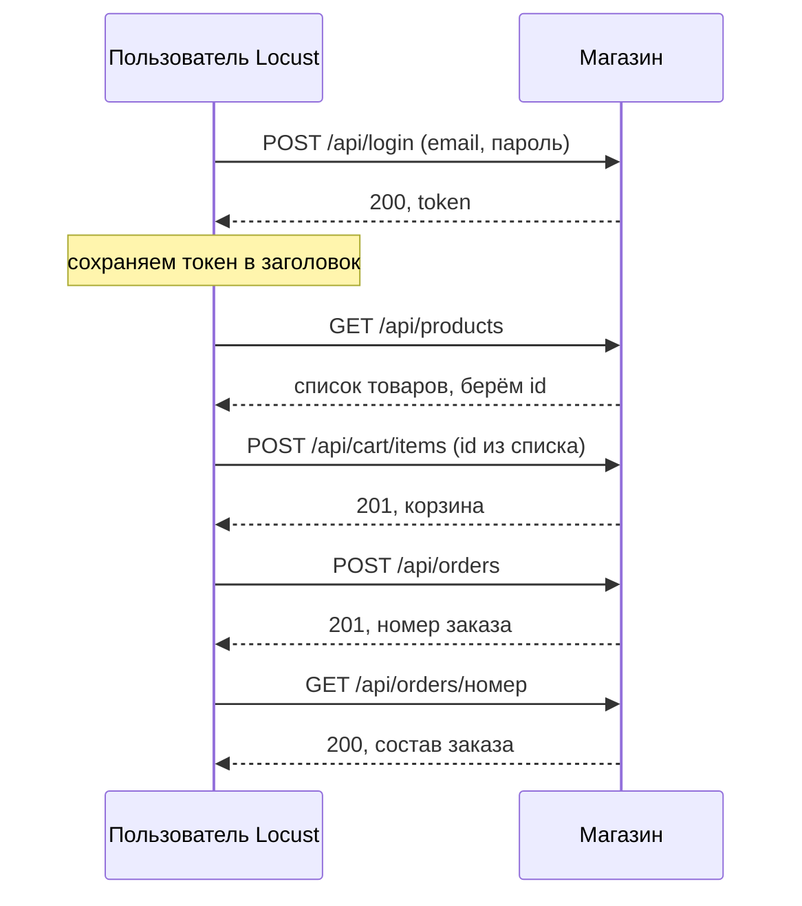
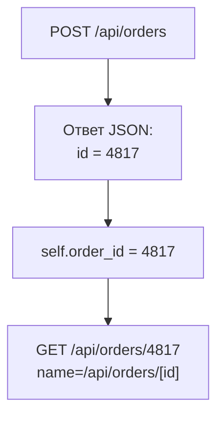

## Зачем это нужно

Анонимный посетитель из [урока 9.1](01-first-locustfile.md) умеет только читать каталог. Но магазин зарабатывает на другом: человек входит в аккаунт, кладёт товар в корзину и оформляет заказ. Эти запросы тяжёлые: они пишут в базу, занимают строки в ней на время записи (пока один заказ меняет товар, другие ждут) и ходят во внешнюю оплату. Я много лет собираю такие сценарии, и мой опыт такой: если проверять только чтение, тест покажет красивые цифры, а в день распродажи упадёт то, что ты не проверял.

У меня была типичная история. Я собрал «покупателя», запустил, всё зелёное. А потом открыл Failures: каждый второй «заказ» был ответом «корзина пуста». Мой сценарий оформлял заказ, не положив ничего в корзину, и тест честно мерил скорость отказов. Чтобы такого не было, сценарию нужна **память**: после логина помнить токен, после каталога помнить товары, после заказа помнить его номер. Запрос зависит от ответа на предыдущий. Такую связку называют **корреляцией**: значение из одного ответа подставляется в следующий запрос.

Шаг проекта: ты дополняешь `~/perf-lab/09-locust/locustfile.py` классом `Buyer`: вход, каталог, карточка, корзина, заказ, проверка заказа. Анонимный `Visitor` из 9.1 остаётся, и два типа пользователей работают вместе в пропорции 4 к 1.

## Что нужно знать

- Класс пользователя, `@task`, веса, `wait_time`, `name=`, `self.client`: [урок 9.1](01-first-locustfile.md).
- Токен и заголовок `Authorization: Bearer ...`, JSON в теле запроса: [урок 2.2](../02-web/02-rest-json-auth.md).
- Словари и списки, `response.json()`: [урок 4.1](../04-python/01-first-program.md) и [урок 4.5](../04-python/05-venv-requests.md).
- Эндпоинты «Магазина» (`/api/login`, `/api/cart/items`, `/api/orders`): [урок 2.3](../02-web/03-backend-anatomy.md) и `project/shop/README.md`.

## Картина целиком

Поход в магазин это экскурсия с чек-листом: вошёл, получил бейдж (токен), осмотрел витрину, взял вещь, дошёл до кассы, получил чек (номер заказа). Бейдж и чек надо сохранять: без бейджа не пустят в следующий зал, без чека нечего проверять. Аналогия ломается тем, что человек носит бейдж сам, а сценарию его нужно явно положить на место и предъявлять каждый раз.



Что здесь видно: четыре значения «путешествуют» между запросами: токен из логина, id товара из каталога, корзина и номер заказа. Сценарий, который их не подхватывает, ломается. И порядок важен: заказ нельзя оформить раньше, чем в корзине появится товар. Поэтому в Locust есть класс `SequentialTaskSet`: набор задач, которые идут строго по порядку, как строчки в списке.

## Теория

### Состояние пользователя: on_start и атрибуты

Виртуальный пользователь живёт долго: десятки минут и сотни задач. За это время он должен помнить свой токен и свою корзину. Если получать токен перед каждым запросом, ты нагрузишь магазин логинами, а не покупками, и результат будет про другое.

Это как отметка пропуска на входе: ты отмечаешься один раз утром, а потом весь день показываешь пропуск охране у дверей. Утренняя отметка в Locust называется `on_start`, а пропуск в кармане это атрибут пользователя. Аналогия ломается там, где токен магазина живёт ограниченное время (на стенде 3600 секунд), и дольше часа тест на одной авторизации не проживёт.

У пользователя есть два служебных метода-«крючка» (Locust вызывает их сам в нужный момент). `on_start(self)` Locust вызывает один раз при создании пользователя, до первой задачи: сюда кладут вход в систему. `on_stop(self)` вызывается при остановке, туда кладут уборку, но нам в магазине убирать нечего. Состояние хранится в атрибутах `self`: `self.token`, `self.ids`, `self.order_id`. Каждый пользователь это отдельный объект, поэтому `self.ids` у одного не пересекается с `self.ids` у другого. Заголовок авторизации удобно положить в клиент один раз: `self.client.headers["Authorization"] = "Bearer " + token`. После этого он уходит с каждым запросом пользователя, и в задачах про токен можно забыть.

Вот вход в `Buyer`:

```python
    def on_start(self):
        number = next(Buyer.numbers) % 1000 + 1          # 1, 2, ... 1000, потом снова 1
        creds = {"email": f"user{number:04d}@shop.lab", "password": "password"}
        r = self.client.post("/api/login", json=creds, name="/api/login", timeout=60)
        if not r.ok:
            raise StopUser()
        self.client.headers["Authorization"] = "Bearer " + r.json()["token"]
```

Разберём строки по одной.

`next(Buyer.numbers)`: у класса есть счётчик `numbers = itertools.count()` (он объявлен в полном файле ниже, в начале класса), он выдаёт 0, 1, 2 и так далее. Каждый новый пользователь получает свой номер, и два покупателя не делят аккаунт и корзину.

`% 1000 + 1`: остаток от деления на 1000 это числа 0–999, плюс 1 даёт 1–1000, ровно те пользователи, что есть в базе. Тысяча первый возьмёт номер 1.

`{number:04d}` дополняет число нулями до четырёх знаков: 7 превращается в `0007`, получается `user0007@shop.lab`.

`timeout=60` нужен потому, что логин дорогой (почему, расскажу в следующем разделе), и ответ ждём до минуты.

`raise StopUser()` честно останавливает только этого пользователя, если войти не вышло, остальные продолжают, и ты увидишь это на графике Number of Users.

Ответ логина выглядит как `{"token": "9f2c...", "expires_in": 3600}`, поэтому достаём `r.json()["token"]`.

Осторожно: `on_start` вызывается на каждого пользователя, а не один раз на тест. Общие данные (список аккаунтов из файла) разберём в [уроке 9.3](03-data-checks.md). И не клади токен в переменную модуля (обычную `token = ...` вверху файла, вне классов): она одна на весь процесс, и все побредут под одним аккаунтом.

> **Прикинь сам:** в задаче ты написал `global token` и пишешь туда токен при логине. Почему при 50 пользователях это ломает тест?
{: .predict}

Переменная одна на всех. Каждый новый пользователь перезаписывает её своим токеном, и все 50 ходят под токеном последнего вошедшего. Нагрузка выглядит нормально, но корзины и заказы смешиваются.

> **Главное:** вход делают один раз в `on_start`, а токен, корзину и номера хранят в `self`, а не в общих переменных.
{: .key}

Но вход в магазине не простой запрос. Почему именно он чаще всего портит начало теста?

### Почему логин дорогой и как с ним жить

Пароли в базе хранят не открытым текстом, а в виде **хеша**: необратимого «отпечатка», из которого пароль не восстановить, но можно проверить, подходит ли введённый. Магазин применяет алгоритм **bcrypt**, и он намеренно медленный: проверка одного пароля занимает около четверти секунды процессорного времени. Это защита: честному пользователю четверть секунды на вход незаметна, а вору, который украл базу, на каждую догадку нужны те же четверть секунды, и миллиарды попыток займут годы. Цена в том, что каждый вход нагружает процессор.

На стенде один рабочий процесс на одном ядре (`WEB_CONCURRENCY=1` в `.env`), и bcrypt занимает всё выделенное ядро (`cpus: 1.0`), так что остальным запросам не хватает процессора. 250 мс на вход значат потолок около 4 входов в секунду на весь магазин (1 ÷ 0,25). Ты видел это в [уроке 8.1](../08-perf-theory/01-latency-throughput.md): `measure.py login` показал около 3,9 RPS, а мы дальше округляем до 4.

> **Прикинь сам:** тест на 200 пользователей, запуск по 20 в секунду. Каждый входит в `on_start`. Сколько логинов магазин успеет за 10 секунд разгона и чем это кончится?
{: .predict}

За 10 секунд придёт 200 логинов, а магазин обработает 4 × 10 = 40. Остальные 160 встают в очередь: последний вошёл бы только через 40 секунд. Посмотри на график.

<div class="viz" data-viz="chart" data-type="line" data-x="0,5,10,20,30,40,50" data-x-label="Секунд от старта теста" data-y-label="Ожидание входа, с" data-unit="с" data-explain="Магазин делает около 4 входов в секунду (bcrypt, один процесс). При скорости запуска 20 в секунду очередь на вход растёт: последний пользователь ждёт 41 секунду. При скорости запуска 2 в секунду очередь не накапливается, вход занимает доли секунды." data-series='[{"name":"Запуск 20 в секунду","values":[0.3,20.6,41,31,21,11,1.3],"unit":"с"},{"name":"Запуск 2 в секунду","values":[0.3,0.4,0.4,0.5,0.4,0.4,0.4],"unit":"с"}]'></div>

Что здесь видно: при быстром запуске очередь на вход сама стала главным результатом, и первые 50 секунд ты измеряешь логин, а не покупки. Медленный запуск (меньше 4 в секунду) очереди не создаёт.

Отсюда практика. Скорость запуска не выше пропускной способности логина: на нашем стенде 2–3 пользователя в секунду. Предел входа 4, но берём меньше: тому же процессу надо ещё обслуживать покупки уже вошедших. Стационарную часть теста смотри отдельно: после разгона нажми **Reset Stats** или бери «полку» графика. Токен живёт час, поэтому не логинься в каждой задаче. И дай логину собственный `name` (`/api/login`), тогда его цифры не смешаются с покупками.

Осторожно: высокий p95 у `/api/login` в начале теста принимают за «медленный магазин». Это следствие твоей скорости запуска, а не дефект.

> **Проверь понимание:** сколько секунд займёт вход 120 пользователей при запуске по 2 в секунду и по 40 в секунду (магазин обрабатывает 4 входа в секунду)?

<details markdown="1">
<summary>Ответ</summary>

При 2 в секунду пользователи набираются за 60 секунд, магазин успевает: вход занимает 0,25–0,4 с. При 40 в секунду все 120 приходят за 3 секунды, а магазин обработает их за 120 ÷ 4 = 30 секунд: последний ждёт около 27. Пользователей поровну, разница в очереди.

</details>

> **Главное:** логин занимает процессор, поэтому запускай пользователей не быстрее 2–3 в секунду и смотри цифры после разгона.
{: .key}

Вошли. Теперь нужно, чтобы следующие запросы использовали то, что вернул сервер.

### Корреляция: брать из ответа то, что нужно следующему запросу

Живой клиент не придумывает номер товара, он берёт его из каталога, который только что увидел. Случайный `random.randint(1, 10000)` даст валидный запрос, но связь «увидел, значит купил» потеряется. А для заказа это критично: `/api/orders/12345` надо читать именно тот заказ, который ты только что создал, иначе будет 404.

Вспомни пиццерию: оператор говорит «ваш заказ номер 47», и ты записываешь его, а не придумываешь. Корреляция это три шага: достать значение из ответа (`r.json()["id"]`), сохранить в `self` и подставить в следующий запрос.



Что здесь видно: значение из первого ответа живёт в объекте пользователя и попадает в путь следующего запроса, а `name=` держит статистику по маршруту чистой.

Магазин на `POST /api/orders` отвечает так:

```text
{"id": 4817, "status": "paid", "total": 2340.0,
 "items": [{"product_id": 512, "name": "Товар 512", "price": 1170.0, "qty": 2}]}
```

Цены и сумма это JSON-числа (2340.0), не строки в кавычках, поэтому в проверках сравнивай числа: `r.json()["total"] == 2340.0`. Достаём `self.order_id = r.json()["id"]`, то есть 4817, а в следующей задаче `self.client.get(f"/api/orders/{self.order_id}", name="/api/orders/[id]")`. Магазин вернёт заказ именно этого пользователя (чужой заказ он не отдаст) со статусом 200.

А если заказ не создался? При ответе 409 («not enough stock», товара не хватило) или 400 («cart is empty», корзина пуста) в теле ответа нет поля `id`, и `r.json()["id"]` упадёт с `KeyError` (ошибкой «в словаре нет такого ключа»). Исключение попадёт на вкладку **Exceptions**, и пользователь пропустит остаток цепочки. Поэтому перед извлечением проверяй успех: `if r.ok:`. Если не успех, `self.order_id = None`, и следующая задача пропускается.

> **Прикинь сам:** задача «создать заказ» упала с 409, а задача «проверить заказ» берёт `self.order_id` без проверки. Что произойдёт?
{: .predict}

Либо атрибута нет вообще (Python скажет `AttributeError`: «у объекта нет такого поля», и это появится на вкладке Exceptions), либо там номер прошлого круга, и запрос получит 200 с чужим для этого круга результатом. В обоих случаях тест врёт: либо шум исключений, либо видимость успеха.

Осторожно: корреляцию путают с параметризацией. **Параметризация** это подстановка данных из внешнего набора (например, файла CSV со списком аккаунтов), а корреляция это подстановка данных из ответов сервера. Первое тема [урока 9.3](03-data-checks.md), второе мы разобрали сейчас.

> **Главное:** то, что вернул сервер, сохраняй в `self` и подставляй дальше, а перед этим проверяй, что ответ успешный.
{: .key}

Значения путешествуют, но шаги всё ещё надо выстроить по порядку.

### Порядок шагов: SequentialTaskSet и типы пользователей

Если положить шесть шагов покупки шестью `@task` прямо на пользователя, Locust выберет их случайно, и «оформить заказ» выпадет первым, когда корзина пуста. Порядок нужно зафиксировать. `SequentialTaskSet` выполняет методы с `@task` в порядке их записи в файле, закончив последний, начинает с первого и так до конца теста. Паузы `wait_time` работают между шагами, как раньше. (Есть и обычный `TaskSet` с выбором по весам, он нам не нужен.)

Набор подключается к пользователю через атрибут `tasks`:

```python
class Buyer(HttpUser):
    wait_time = between(1, 3)
    tasks = [Purchase]
```

Это значит: `Buyer` целиком занят сценарием `Purchase`. Если в `tasks` лежат и классы, и функции с весами (`tasks = {Purchase: 3, browse: 1}`), Locust сначала выбирает по весу между «пойти по сценарию покупки» и «просто полистать».

В одном файле можно описать несколько классов пользователей (`Visitor`, `Buyer`). Вес класса задаёт долю в общем числе: `weight = 4` у `Visitor` и `weight = 1` у `Buyer` дают 80% и 20%. Это ближе к жизни: основная масса смотрит, а покупают немногие. Чтобы запустить только один тип, назови его после опций: `locust Buyer`.

> **Прикинь сам:** `weight = 4` у `Visitor`, `weight = 1` у `Buyer`. Запущено 50 пользователей. Сколько каких?
{: .predict}

Сорок `Visitor` и десять `Buyer`. С тремя пользователями пропорцию 4:1 выразить нельзя, и Locust возьмёт ближайшую раскладку: для маленьких тестов вес даёт лишь приблизительную картину.

Осторожно: `SequentialTaskSet` не про порядок запросов внутри одной задачи. Два вызова `self.client.get` в одном методе идут подряд без паузы, это обычный Python. После последнего шага набор сам начинает сначала.

> **Главное:** порядок покупки задаёт `SequentialTaskSet`, а доли типов посетителей задают веса классов.
{: .key}

Вернёмся к распродаже: теперь у тебя в тесте покупатель, который входит, выбирает товар из каталога, платит и проверяет чек. Менеджеру можно показывать нагрузку, похожую на настоящую.

## Практика

Всё делается на локальном стенде. Если он не запущен, подними его командами из урока 9.1 (`docker compose --profile monitoring up -d --wait`).

### 1. Руками пройди путь, который будешь автоматизировать

Прежде чем писать код, убедись, что ты сам понимаешь цепочку. Токен в переменную, затем заказ:

```bash
TOKEN=$(curl -s localhost:8000/api/login -H 'Content-Type: application/json' \
  -d '{"email":"user0007@shop.lab","password":"password"}' | jq -r .token)
curl -s -X POST localhost:8000/api/cart/items -H "Authorization: Bearer $TOKEN" \
  -H 'Content-Type: application/json' -d '{"product_id":512,"qty":1}' | jq
curl -s -X POST localhost:8000/api/orders -H "Authorization: Bearer $TOKEN" | jq
```

`$(...)` выполняет команду внутри и подставляет её вывод, `jq -r .token` достаёт поле `token` из JSON без кавычек ([урок 1.2](../01-linux/02-text-logs.md)). Заголовок `Authorization: Bearer $TOKEN` предъявляет токен, как пропуск. Ожидаемые ответы:

```text
{
  "items": [{"product_id": 512, "name": "...", "price": ..., "qty": 1}],
  "total": ...
}
{
  "id": 200005,
  "status": "paid",
  "total": ...,
  "items": [{"product_id": 512, "name": "...", "price": ..., "qty": 1}]
}
```

**Как читать вывод:** первый ответ это корзина с твоим товаром (статус 201), второй это созданный заказ с номером `id`: именно его сценарий должен будет подхватить. Номер у тебя будет другим: он больше количества исторических заказов (200 000), потому что идёт после них. Если заказ вернул `{"detail":"cart is empty"}`, корзина была пуста: этот ответ ты ещё встретишь.

**Типичные ошибки:**
- `{"detail":"bearer token required"}` (401): заголовок Authorization не передан или написан иначе. Проверь, что `$TOKEN` не пустой: `echo $TOKEN`.
- `{"detail":"invalid or expired token"}` (401): токен устарел или скопирован с ошибкой.
- `{"detail":"product not found"}` (404): товара с таким id нет, в стенде их 10 000.

### 2. Добавь класс покупателя в locustfile

Открой `~/perf-lab/09-locust/locustfile.py` и приведи к такому виду (`Visitor` остаётся, добавляется `Purchase` и `Buyer`). У `Visitor` появился `weight = 4`.

```python
"""Сценарии «Магазина»: анонимный посетитель и покупатель."""
import itertools
import random

from locust import HttpUser, SequentialTaskSet, between, task
from locust.exception import StopUser


class Visitor(HttpUser):
    host = "http://localhost:8000"
    wait_time = between(1, 3)
    weight = 4

    @task(5)
    def catalog(self):
        self.client.get("/api/products", params={"page": random.randint(1, 10)})

    @task(3)
    def product(self):
        self.client.get(f"/api/products/{random.randint(1, 10000)}", name="/api/products/[id]")

    @task(1)
    def categories(self):
        self.client.get("/api/categories")


class Purchase(SequentialTaskSet):
    """Один проход покупателя: каталог, карточка, корзина, заказ, проверка."""

    def on_start(self):
        self.ids = []
        self.product_id = None
        self.order_id = None

    @task
    def catalog(self):
        r = self.client.get("/api/products", params={"page": random.randint(1, 10)})
        if r.ok:
            self.ids = [item["id"] for item in r.json()["items"]]

    @task
    def open_product(self):
        self.product_id = random.choice(self.ids) if self.ids else random.randint(1, 10000)
        self.client.get(f"/api/products/{self.product_id}", name="/api/products/[id]")

    @task
    def add_to_cart(self):
        self.client.post("/api/cart/items", json={"product_id": self.product_id, "qty": 1})

    @task
    def checkout(self):
        self.order_id = None
        r = self.client.post("/api/orders", timeout=60)
        if r.ok:
            self.order_id = r.json()["id"]

    @task
    def check_order(self):
        if self.order_id:
            self.client.get(f"/api/orders/{self.order_id}", name="/api/orders/[id]")


class Buyer(HttpUser):
    host = "http://localhost:8000"
    wait_time = between(1, 3)
    weight = 1
    tasks = [Purchase]
    numbers = itertools.count()

    def on_start(self):
        number = next(Buyer.numbers) % 1000 + 1
        creds = {"email": f"user{number:04d}@shop.lab", "password": "password"}
        r = self.client.post("/api/login", json=creds, name="/api/login", timeout=60)
        if not r.ok:
            raise StopUser()
        self.client.headers["Authorization"] = "Bearer " + r.json()["token"]
```

Что нового по сравнению с разбором выше: `random.choice(список)` берёт случайный элемент, `r.ok` это `True`, если код ответа меньше 400 (удобный способ проверить успех), `on_start` в `Purchase` задаёт пустые значения, чтобы атрибуты существовали с первой секунды. Методы внутри `Purchase` выполняются **в порядке записи**: `catalog`, `open_product`, `add_to_cart`, `checkout`, `check_order`.

Синтаксис можно проверить без запуска:

```bash
python -m py_compile ~/perf-lab/09-locust/locustfile.py && echo синтаксис в порядке
```

**Типичные ошибки:**
- `NameError: name 'itertools' is not defined`: забыл `import itertools` вверху.
- Покупатели не появляются в таблице: в Locust выбраны классы по имени (`locust Visitor`) или у `Buyer` вес 0.

> Покупатель падает на логине или в корзине? Сначала проверь шаги руками командой `curl`, как в первом задании практики, потом покажи нейросети код сценария и ответ сервера и спроси, где ошибка. Проверь правку запуском на одном пользователе.
{: .ai}

### 3. Запусти и посмотри на покупателей

```bash
cd ~/perf-lab/09-locust && locust
```

В форме: пользователей `30`, скорость запуска `2`. Нажми Start. Через минуту на вкладке Statistics должны появиться новые строки: `/api/login`, `/api/cart/items`, `/api/orders`, `/api/orders/[id]`. На вкладке Failures ошибок быть не должно. Сравни строки: `/api/login` будет в сотни раз медленнее, чем карточка товара, а `/api/orders` в десятки раз.

| Name | # Requests | Median (ms) | 95%ile (ms) |
|---|---|---|---|
| /api/login | 30 | 290 | 480 |
| /api/products | 140 | 12 | 20 |
| /api/products/[id] | 150 | 6 | 11 |
| /api/cart/items | 24 | 9 | 16 |
| /api/orders | 24 | 82 | 130 |
| /api/orders/[id] | 24 | 7 | 12 |

**Как читать вывод:** логин дорогой из-за bcrypt (250-300 мс), заказ в районе 80 мс, потому что внутри транзакции магазин ждёт имитацию оплаты (50 мс и ещё немного). Чтение из каталога единицы миллисекунд. Число запросов логина 30 это ровно число пользователей: каждый вошёл один раз.

Посмотри на график Number of Users: линия должна идти по ступеньке в 2 пользователя в секунду. Если пользователи пропали (линия просела ниже заданной), перейди на вкладку Failures: туда попадут неудачные входы.

### 4. Сверь в Grafana

На дашборде «Магазин: обзор (эталон)» найди панель с метриками `shop_orders_created_total` и сравни число созданных заказов с числом запросов `/api/orders` в Locust (минус ошибки). Затем в Prometheus:

```text
sum by (route, status) (increase(http_requests_total[5m]))
```

Ты должен увидеть `/api/login` со статусом 200 и `/api/orders` со статусом 201.

### 5. Зафиксируй

```bash
cd ~/perf-lab && git add 09-locust && git commit -m "9.2: покупатель, корзина, заказ" && git push
```

## Сломай и почини

**Поломка A. Токен не передан.** Закомментируй в `on_start` у `Buyer` строку, которая записывает заголовок `Authorization`. Запусти тест на 10 покупателей.

**Что ожидать.** Логин проходит (200), а всё, что требует авторизации, падает: на вкладке Failures появятся `POST /api/cart/items` и `POST /api/orders` с ошибкой «401 Unauthorized». Сервер быстро отклоняет такие запросы: задержки маленькие, а RPS подскакивает. Если смотреть только на скорость, можно решить, что стало лучше.

**Диагностика.**

<div class="viz" data-viz="flow" data-steps='[{"title":"Откуда ошибки","text":"Вкладка `Failures`: какие маршруты и какие коды."},{"title":"Код 401","text":"Пользователь не авторизован: токена нет или он не принят."},{"title":"Проверь вручную","text":"`curl` без заголовка и с заголовком: ответ `bearer token required` или `invalid or expired token`."},{"title":"Найди, где теряется токен","text":"Читай `on_start`: сохранён ли токен в `self.client.headers`."},{"title":"Исправь и сбрось статистику","text":"Верни строку, нажми `Reset Stats`, убедись, что `Fails` стали 0."}]'></div>

Что здесь видно: быстрые 401 это нагрузка на обработчик ошибок, а не на корзину и заказ, тест измеряет не то. Ты видишь причину через **код ответа**, а не через время.

**Поломка B. Заказ без корзины.** Поменяй порядок: поставь метод `checkout` выше `add_to_cart`. Запусти.

**Что ожидать.** Первый проход: `POST /api/orders` отвечает 400 «cart is empty», а это фейл. Дальше корзина наполняется в конце цикла, и со второго круга заказы проходят. Результат: пятая часть заказов падает без видимой причины. Урок: порядок шагов в `SequentialTaskSet` это логика сценария, и ошибку в ней видно только по проценту ошибок на конкретном маршруте.

**Починка.** Верни `add_to_cart` перед `checkout`.

## ИИ в помощь

Нейросеть хорошо собирает цепочку запросов в сценарий и объясняет, как передать токен между шагами, но реальные ответы стенда она не знает. Общие правила: [ИИ-помощник](../ai.md).

**Задача:** собрать путь покупателя из ответов сервера.

```text
Locust 2.46. Покупатель проходит: POST /api/login, GET /api/products, POST /api/cart/items,
POST /api/orders. Вот реальные ответы curl по каждому шагу: <вставь тело и коды ответов>.
Напиши класс HttpUser, где токен из ответа логина передаётся в заголовок Authorization: Bearer,
product_id берётся из ответа каталога, а пауза между действиями 1-3 секунды.
Объясни, где хранится токен и почему on_start, а не @task.
```
{: .wrap}

**Проверь ответ:** запусти класс на одном пользователе и посмотри таблицу Statistics: каждый шаг должен быть, ошибок ноль. Типичные ошибки: поле токена называется иначе, чем в реальном ответе (проверь по `curl`), заголовок без слова `Bearer`, id товара зашит константой вместо взятия из каталога.

**Задача:** распределить веса.

```text
Мой покупатель: смотрит каталог (вес 10), открывает товар (5), кладёт в корзину (2), оформляет заказ (1).
Какая доля запросов каждого типа получится? Покажи расчёт и скажи, реалистично ли это
для магазина и как это проверить по метрикам http_requests_total.
```
{: .wrap}

**Проверь ответ:** доли из таблицы Locust сравни с расчётом. Типичная ошибка: нейросеть считает веса долей пользователей, а не запросов.

В чат не отправляй реальные пароли и токены: для курса хватит пользователей стенда, на работе замени их на заглушки.

## Словарик урока

| Термин | Простыми словами |
|---|---|
| `on_start` / `on_stop` | Методы пользователя, которые Locust вызывает один раз при его создании и остановке |
| Состояние пользователя | Данные, которые виртуальный пользователь помнит между задачами: токен, корзина, номер заказа |
| Хеш пароля | Необратимый «отпечаток» пароля; по нему проверяют вход, а сам пароль не хранят |
| bcrypt | Намеренно медленный алгоритм хеширования паролей: защита от подбора, цена: нагрузка на процессор |
| Корреляция | Подстановка в следующий запрос значения из ответа на предыдущий (токен, id) |
| Параметризация | Подстановка данных из внешнего набора (файл пользователей) |
| `SequentialTaskSet` | Набор задач, выполняемых строго по порядку записи, затем снова с начала |
| `tasks = [...]` | Атрибут пользователя: какие наборы задач он выполняет |
| `weight` (у класса) | Доля пользователей этого типа среди всех |
| `StopUser` | Исключение, которым пользователь честно завершает свою работу |
| `r.ok` | `True`, если код ответа меньше 400 |

## Вопросы с собеседований

Раздел для повторения: ответь вслух, потом открой ответ. Вопросы `[на скорость]` тренируй на время.



## Проверено на версиях

Ubuntu 24.04, Python 3.12, Locust 2.46.6, стенд «Магазин» из `project/shop` (`BCRYPT_ROUNDS=12`, `WEB_CONCURRENCY=1`, `SESSION_TTL=3600`), Prometheus 3.15, Grafana 13.2. Октябрь 2026. Значения задержек в таблицах ориентировочные: у тебя они будут своими.

## Итог урока: ты умеешь

- [ ] Хранить состояние виртуального пользователя в `self` и вести вход в `on_start`.
- [ ] Положить токен в заголовки клиента и убедиться, что он уходит с каждым запросом.
- [ ] Объяснить, почему логин в магазине дорогой, и выбрать скорость запуска, которая не создаёт очередь на вход.
- [ ] Выполнить корреляцию: достать из ответа id, сохранить и подставить в следующий запрос.
- [ ] Собрать путь покупателя в `SequentialTaskSet` и подключить его через `tasks`.
- [ ] Разделить пользователей на типы с весами 4 к 1.
- [ ] Распознать быстрые 401 и 400 как ошибку сценария, а не ускорение магазина.

Дальше: [урок 9.3. Тестовые данные и проверки ответов](03-data-checks.md), где пользователи берутся из CSV, а Locust научится замечать ошибки, спрятанные внутри успешных ответов.
