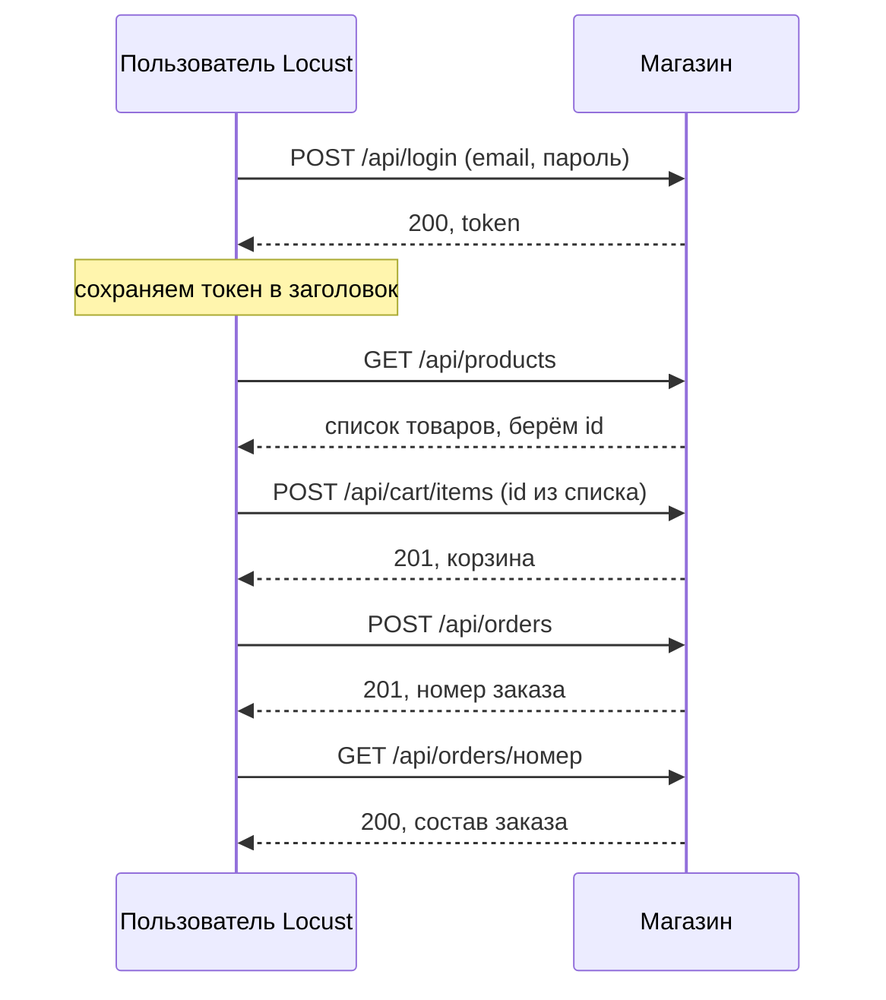
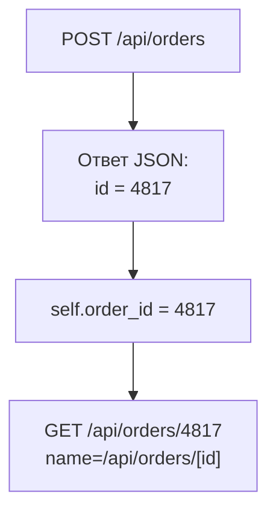

## Зачем это нужно

Анонимный посетитель из [урока 9.1](01-first-locustfile.md) умеет только читать каталог. Но деньги магазин зарабатывает на другом: человек входит в аккаунт, кладёт товар в корзину и оформляет заказ. Именно эти запросы тяжёлые: они пишут в базу, держат блокировки, ходят во внешнюю оплату. Если проверять только чтение, тест покажет красивые цифры, а в день акции упадёт то, что ты не проверял.

Чтобы воспроизвести путь покупателя, сценарию нужна **память**: после логина надо помнить токен, после просмотра каталога помнить, какие товары в нём были, после заказа помнить его номер. Запрос становится зависимым от ответа на предыдущий. В тестировании такие связки называют **корреляцией**: значение из одного ответа подставляется в следующий запрос. Без неё сценарий либо не работает вовсе, либо стучится в несуществующие адреса и измеряет скорость ошибок 404.

Шаг проекта: ты дополняешь `~/perf-lab/09-locust/locustfile.py` классом `Buyer`: вход, просмотр каталога, карточка, корзина, заказ, проверка заказа. Анонимный `Visitor` из 9.1 остаётся, и два типа пользователей работают вместе в пропорции 4 к 1.

## Что нужно знать

- Класс пользователя, `@task`, веса, `wait_time`, `name=`, `self.client`: [урок 9.1](01-first-locustfile.md).
- Токен и заголовок `Authorization: Bearer ...`, JSON в теле запроса: [урок 2.2](../02-web/02-rest-json-auth.md).
- Словари и списки, `response.json()`: [урок 4.1](../04-python/01-first-program.md) и [урок 4.5](../04-python/05-venv-requests.md).
- Эндпоинты «Магазина» (`/api/login`, `/api/cart/items`, `/api/orders`): [урок 2.3](../02-web/03-backend-anatomy.md) и `project/shop/README.md`.

## Картина целиком

Походы в магазин похожи на экскурсию с чек-листом: вошёл, получил бейдж на входе (токен), осмотрел витрину, взял вещь, дошёл до кассы, получил чек (номер заказа), проверил чек. Бейдж и чек надо **сохранять**: без бейджа тебя не пустят в следующий зал, без чека нечего проверять. Аналогия ломается тем, что бейдж живой человек просто носит с собой, а сценарию его нужно явно положить в нужное место и каждый раз предъявлять.



Что здесь видно: четыре значения «путешествуют» между запросами: токен из логина, id товара из каталога, корзина из добавления и номер заказа из оформления. Сценарий, который их не подхватывает, ломается.

Путь покупателя устроен как **последовательность шагов**, и для этого в Locust есть отдельный класс `SequentialTaskSet`: набор задач, которые идут строго по порядку, как строчки в списке. Обычные `@task` на пользователе выбираются случайно по весам, а здесь порядок важен: заказ нельзя оформить раньше, чем в корзине появится товар.

## Теория

### Состояние пользователя: on_start, on_stop и атрибуты

**Зачем это существует.** Один виртуальный пользователь живёт долго: десятки минут, сотни задач. За это время ему нужно помнить свой токен, свою корзину, свой номер аккаунта. Если токен получать заново перед каждым запросом, ты нагрузишь магазин логинами, а не покупками, и результат будет про другое.

**Аналогия.** Ты приходишь на работу, отмечаешь пропуск на входе один раз, а потом весь день ходишь по зданию, показывая пропуск охране у дверей. Утренняя отметка это `on_start`, пропуск в кармане это атрибут пользователя. Аналогия ломается там, где пропуск у человека не протухает за ночь, а токен магазина живёт ограниченное время (в нашем стенде 3600 секунд), и дольше часа тест на одной авторизации не проживёт.

**Как это устроено.** У пользователя есть два служебных метода-«крючка»:

- `on_start(self)`: Locust вызывает его **один раз** при создании пользователя, до первой задачи. Сюда кладут вход в систему и подготовку данных.
- `on_stop(self)`: вызывается один раз при остановке пользователя, когда тест закончился. Сюда кладут уборку (выход, удаление созданных данных). Нам в магазине убирать нечего, мы его просто упомянем.

Состояние хранится в **атрибутах `self`**: `self.token`, `self.ids`, `self.order_id`. Каждый виртуальный пользователь это отдельный объект, поэтому `self.ids` у одного не пересекается с `self.ids` у другого. Заголовок авторизации удобнее всего положить в клиент один раз: `self.client.headers["Authorization"] = "Bearer " + token`. После этого он автоматически уходит с каждым запросом этого пользователя, и в задачах про токен можно забыть.

**Разобранный пример.** Вот вход в `Buyer`:

```python
    def on_start(self):
        number = next(Buyer.numbers) % 1000 + 1          # 1, 2, ... 1000, потом снова 1
        creds = {"email": f"user{number:04d}@shop.lab", "password": "password"}
        r = self.client.post("/api/login", json=creds, name="/api/login", timeout=60)
        if not r.ok:
            raise StopUser()
        self.client.headers["Authorization"] = "Bearer " + r.json()["token"]
```

Разбираем каждую строку:

- `next(Buyer.numbers)`: у класса есть счётчик `numbers = itertools.count()`, который выдаёт 0, 1, 2, ... при каждом вызове `next`. Благодаря этому каждый новый пользователь получает свой номер, и два виртуальных покупателя не делят один аккаунт и одну корзину.
- `% 1000 + 1`: остаток от деления на 1000 даёт числа от 0 до 999, плюс 1 это 1–1000: ровно те пользователи, что есть в базе. Тысяча первый пользователь снова возьмёт номер 1.
- `f"user{number:04d}@shop.lab"`: `:04d` дополняет число нулями до четырёх знаков, 7 превращается в `0007`. Получается `user0007@shop.lab`.
- `timeout=60`: логин в магазине дорогой (bcrypt, см. ниже), поэтому ждём ответ до минуты, а не обрываем запрос раньше времени.
- `raise StopUser()`: если войти не удалось, этому пользователю дальше делать нечего. Исключение `StopUser` честно останавливает **только его**, остальные продолжают. Пользователь пропадёт из счётчика, и ты увидишь это на графике Number of Users.
- `r.json()["token"]`: ответ логина выглядит как `{"token": "9f2c...", "expires_in": 3600}`. Достаём поле `token`.

**Что путают.** `on_start` вызывается на **каждого** пользователя, а не один раз на весь тест. Для общих данных (список пользователей, прочитанный из файла) нужен другой механизм, он будет в [уроке 9.3](03-data-checks.md). И ещё: не клади токен в обычную переменную модуля (`token = ...` вверху файла): она одна на всех, и все пользователи будут бродить под одним аккаунтом.

> **Проверь понимание:** в задачах пользователя ты написал `global token` и записываешь туда токен при логине. Почему при 50 пользователях это ломает тест?

<details markdown="1">
<summary>Ответ</summary>

Глобальная переменная одна на всех. Каждый новый пользователь перезаписывает её своим токеном, и все 50 начинают ходить под токеном последнего вошедшего. Нагрузка выглядит нормально, но корзины и заказы смешиваются, а часть запросов попадёт под чужой, уже просроченный аккаунт. Состояние пользователя живёт в `self`, а не в глобальных переменных.

</details>

### Почему логин в магазине дорогой, и что с этим делать

**Зачем это существует.** Пароли в базе хранят не открытым текстом, а в виде **хеша** (результата одностороннего преобразования, из которого пароль не восстановить). Алгоритм **bcrypt**, который применяет магазин, намеренно медленный: проверка одного пароля занимает порядка четверти секунды процессорного времени. Это защита: если базу украдут, подбирать пароли придётся очень долго. Цена этой защиты в том, что каждый вход нагружает процессор.

**Как это устроено.** На стенде «Магазин» стоит один рабочий процесс на одном ядре (в `.env` это `WEB_CONCURRENCY=1`), и пока он считает bcrypt, он не обслуживает больше никого. 250 мс на один вход значат потолок около 4 входов в секунду на весь магазин. Это ты уже видел в [уроке 8.1](../08-perf-theory/01-latency-throughput.md), когда `measure.py login` показал около 3,9 RPS и очередь задержек.

Теперь представь тест на 200 пользователей. Каждый должен войти в `on_start`. Если запустить их по 20 в секунду, за 10 секунд придёт 200 логинов, а магазин успеет обработать 40. Остальные 160 встанут в очередь: последний вошёл бы только через 40 секунд.

<div class="viz" data-viz="chart" data-type="line" data-x="0,5,10,20,30,40,50" data-x-label="Секунд от старта теста" data-y-label="Ожидание входа, с" data-unit="с" data-explain="Магазин делает около 4 входов в секунду (bcrypt, один процесс). При скорости запуска 20 в секунду очередь на вход растёт: последний пользователь ждёт 41 секунду. При скорости запуска 2 в секунду очередь не накапливается, вход занимает доли секунды." data-series='[{"name":"Запуск 20 в секунду","values":[0.3,20.6,41,31,21,11,1.3],"unit":"с"},{"name":"Запуск 2 в секунду","values":[0.3,0.4,0.4,0.5,0.4,0.4,0.4],"unit":"с"}]'></div>

Смотри на картинку: при быстром запуске очередь на вход сама стала главным результатом теста: за первые 50 секунд ты измеряешь логин, а не покупки. Медленный запуск (меньше 4 в секунду) очереди не создаёт.

Что делать на практике:

1. **Скорость запуска не выше пропускной способности логина.** Для нашего стенда это 2–3 пользователя в секунду. Больше нельзя: начало теста будет ложным «штормом логинов».
2. **Измеряй стационарную часть отдельно.** Статистику после разгона сбрасывай (**Reset Stats**) или бери «полку» графика.
3. **Не логинься в каждой задаче.** Токен живёт час, логинься один раз.
4. **Логин имеет собственный `name`** (`/api/login`): тогда его цифры не смешиваются с покупками. А в тесте, который проверяет именно штурм логина, ты как раз смотришь эту строку.

**Что путают.** Высокий p95 `/api/login` в начале теста принимают за «медленный магазин». Это следствие твоей скорости запуска, а не дефект. Проверяй: сколько логинов в секунду ты запросил, и сколько магазин способен обработать.

> **Проверь понимание:** на стенде 250 мс на вход и один процесс. Сколько секунд займёт вход 120 пользователей, если запускать их по 2 в секунду, и по 40 в секунду?

<details markdown="1">
<summary>Ответ</summary>

Пропускная способность около 4 входов в секунду. При 2 в секунду пользователи набираются за 60 секунд, магазин успевает: каждый вход занимает около 0,25–0,4 секунды. При 40 в секунду все 120 приходят за 3 секунды, а магазин обработает их за 120 / 4 = 30 секунд: последний ждёт около 27 секунд. Само число пользователей одинаково, разница в очереди.

</details>

### Корреляция: брать из ответа то, что нужно следующему запросу

**Зачем это существует.** Живой клиент не придумывает номер товара, он берёт его из каталога, который только что увидел. Если ты подставишь случайный `random.randint(1, 10000)`, запрос будет валидным (в магазине столько товаров), но связь «увидел, значит купил» потеряется. Для проверки работоспособности это допустимо, а для сценария, где важна согласованность, нет: например, заказ `/api/orders/12345` нужно читать именно тот, который ты только что создал, а случайный номер даст 404 (чужой или несуществующий).

**Аналогия.** Вы заказываете пиццу по телефону, оператор говорит «ваш заказ номер 47». Если потом позвонить с вопросом «где мой заказ номер 99?», разговор будет о чужой пицце. Номер надо записать из ответа, а не придумать.

**Как это устроено.** Корреляция это три шага:

1. **Достать** значение из ответа: `r.json()["id"]`, `r.json()["items"][0]["id"]`.
2. **Сохранить** его в атрибут `self` (или в локальную переменную, если оно нужно в этой же задаче).
3. **Подставить** в следующий запрос: в путь, в тело, в заголовок.



Значение из первого ответа сохраняется в объекте пользователя и попадает в путь следующего запроса. `name=` при этом оставляет статистику по маршруту чистой.

**Разобранный пример.** Магазин на `POST /api/orders` отвечает примерно так (поля из кода `main.py`):

```text
{"id": 4817, "status": "paid", "total": 2340.0,
 "items": [{"product_id": 512, "name": "Товар 512", "price": 1170.0, "qty": 2}]}
```

Цены и сумма в ответе это JSON-числа (2340.0), не строки в кавычках, поэтому в проверках сравнивай числа: `r.json()["total"] == 2340.0`.

Достаём номер: `self.order_id = r.json()["id"]`, то есть 4817. В следующей задаче: `self.client.get(f"/api/orders/{self.order_id}", name="/api/orders/[id]")`. Магазин вернёт заказ именно этого пользователя (в SQL есть условие `user_id = ...`), статус 200.

Что должна делать корреляция, когда что-то пошло не так? Если заказ не создался (ответ 409 «not enough stock» или 400 «cart is empty»), `r.json()["id"]` упадёт с `KeyError`, исключение попадёт на вкладку **Exceptions**, и пользователь пропустит остаток цепочки. Поэтому перед извлечением проверяй успех: `if r.ok:`. Если не успех, `self.order_id = None`, и следующая задача пропускается.

**Что путают.** Корреляцию с параметризацией. **Параметризация** это подстановка данных из внешнего набора (CSV с пользователями, список товаров). **Корреляция** это подстановка данных из ответов сервера. Первое тема [урока 9.3](03-data-checks.md), второе мы разбираем сейчас.

> **Проверь понимание:** задача «оплатить» берёт `self.order_id`, но задача «создать заказ» упала с 409. Что произойдёт, если не проверять успех?

<details markdown="1">
<summary>Ответ</summary>

Атрибут `order_id` либо не создан (исключение `AttributeError` на вкладке Exceptions), либо хранит значение прошлой итерации (запрос пойдёт на старый номер заказа и получит 200 с результатом, который тест не должен был видеть). В обоих случаях тест врёт: либо шум исключений, либо видимость успеха. Пустое значение проверяют явно и пропускают шаг.

</details>

### Порядок шагов: SequentialTaskSet и вложенные наборы

**Зачем это существует.** Если положить шесть шагов покупки как шесть `@task` прямо на пользователя, Locust выберет их случайно: «оформить заказ» может выпасть первым, когда корзина пуста. Порядок нужно зафиксировать.

**Как это устроено.** В Locust есть три уровня организации задач.

| Уровень | Что это | Порядок |
|---|---|---|
| `@task` на пользователе | отдельные действия | случайный по весам |
| `TaskSet` | набор действий внутри пользователя (как «режим», например «покупки») | случайный по весам |
| `SequentialTaskSet` | набор действий с порядком | строго сверху вниз, затем с начала |

`SequentialTaskSet` выполняет методы с `@task` **в порядке их записи в файле**. Закончив последний, начинает с первого, и так до конца теста. Паузы `wait_time` пользователя работают между шагами, как и раньше.

Подключается набор в пользователя через атрибут `tasks`:

```python
class Buyer(HttpUser):
    wait_time = between(1, 3)
    tasks = [Purchase]
```

Это значит: пользователь `Buyer` целиком занимается сценарием `Purchase`. Если `tasks` содержит и классы, и функции с весами (например, `tasks = {Purchase: 3, browse: 1}`), Locust сначала выбирает по весу между «пойти по сценарию покупки» и «просто полистать каталог».

**Типы пользователей и их веса.** В одном файле можно описать несколько классов пользователей (`Visitor`, `Buyer`). Вес класса задаёт его долю в общем числе пользователей: `weight = 4` у `Visitor` и `weight = 1` у `Buyer` значит 80% и 20%. Такая раскладка ближе к реальности: основная масса просто смотрит, а покупает немногие. Если ты хочешь запустить **только один** тип, укажи его имя после опций: `locust Buyer`.

**Что путают.** `SequentialTaskSet` не имеет отношения к последовательности запросов внутри одной задачи. Если в одном методе два вызова `self.client.get`, они выполняются подряд без паузы, это обычный Python. И второе: из вложенного набора задач можно выйти вызовом `self.interrupt()`: Locust тогда возвращается на уровень пользователя. Нам он не нужен: после последнего шага набор сам начинает сначала.

> **Проверь понимание:** у `Visitor` `weight = 4`, у `Buyer` `weight = 1`. Запущено 50 пользователей. Сколько их каждого типа? А что будет, если запустить 3?

<details markdown="1">
<summary>Ответ</summary>

Из 50: 40 `Visitor` и 10 `Buyer`. Locust распределяет пользователей по весам, сохраняя пропорцию как можно точнее при любом числе. С тремя пользователями пропорция 4:1 выразить нельзя, Locust выберет ближайшее распределение (обычно 3 и 0 или 2 и 1: зависит от порядка запуска). Для маленьких тестов вес даёт лишь приблизительную картину.

</details>

## Практика

Всё делается на локальном стенде. Если он не запущен, подними его командами из урока 9.1 (`docker compose --profile monitoring up -d --wait`).

### 1. Руками пройди путь, который будешь автоматизировать

Прежде чем писать код, убедись, что ты сам понимаешь цепочку. Токен в переменную, затем заказ:

```bash
TOKEN=$(curl -s localhost:8000/api/login -H 'Content-Type: application/json' \
  -d '{"email":"user0007@shop.lab","password":"password"}' | jq -r .token)
curl -s -X POST localhost:8000/api/cart/items -H "Authorization: Bearer $TOKEN" \
  -H 'Content-Type: application/json' -d '{"product_id":512,"qty":1}' | jq
curl -s -X POST localhost:8000/api/orders -H "Authorization: Bearer $TOKEN" | jq
```

`$(...)` выполняет команду внутри и подставляет её вывод, `jq -r .token` достаёт поле `token` из JSON без кавычек ([урок 1.2](../01-linux/02-text-logs.md)). Заголовок `Authorization: Bearer $TOKEN` предъявляет токен, как пропуск. Ожидаемые ответы:

```text
{
  "items": [{"product_id": 512, "name": "...", "price": ..., "qty": 1}],
  "total": ...
}
{
  "id": 200005,
  "status": "paid",
  "total": ...,
  "items": [{"product_id": 512, "name": "...", "price": ..., "qty": 1}]
}
```

**Как читать вывод:** первый ответ это корзина с твоим товаром (статус 201), второй это созданный заказ с номером `id`: именно его сценарий должен будет подхватить. Номер у тебя будет другим: он больше количества исторических заказов (200 000), потому что идёт после них. Если заказ вернул `{"detail":"cart is empty"}`, корзина была пуста: этот ответ ты ещё встретишь.

**Типичные ошибки:**
- `{"detail":"bearer token required"}` (401): заголовок Authorization не передан или написан иначе. Проверь, что `$TOKEN` не пустой: `echo $TOKEN`.
- `{"detail":"invalid or expired token"}` (401): токен устарел или скопирован с ошибкой.
- `{"detail":"product not found"}` (404): товара с таким id нет, в стенде их 10 000.

### 2. Добавь класс покупателя в locustfile

Открой `~/perf-lab/09-locust/locustfile.py` и приведи к такому виду (`Visitor` остаётся, добавляется `Purchase` и `Buyer`). У `Visitor` появился `weight = 4`.

```python
"""Сценарии «Магазина»: анонимный посетитель и покупатель."""
import itertools
import random

from locust import HttpUser, SequentialTaskSet, between, task
from locust.exception import StopUser


class Visitor(HttpUser):
    host = "http://localhost:8000"
    wait_time = between(1, 3)
    weight = 4

    @task(5)
    def catalog(self):
        self.client.get("/api/products", params={"page": random.randint(1, 10)})

    @task(3)
    def product(self):
        self.client.get(f"/api/products/{random.randint(1, 10000)}", name="/api/products/[id]")

    @task(1)
    def categories(self):
        self.client.get("/api/categories")


class Purchase(SequentialTaskSet):
    """Один проход покупателя: каталог, карточка, корзина, заказ, проверка."""

    def on_start(self):
        self.ids = []
        self.product_id = None
        self.order_id = None

    @task
    def catalog(self):
        r = self.client.get("/api/products", params={"page": random.randint(1, 10)})
        if r.ok:
            self.ids = [item["id"] for item in r.json()["items"]]

    @task
    def open_product(self):
        self.product_id = random.choice(self.ids) if self.ids else random.randint(1, 10000)
        self.client.get(f"/api/products/{self.product_id}", name="/api/products/[id]")

    @task
    def add_to_cart(self):
        self.client.post("/api/cart/items", json={"product_id": self.product_id, "qty": 1})

    @task
    def checkout(self):
        self.order_id = None
        r = self.client.post("/api/orders", timeout=60)
        if r.ok:
            self.order_id = r.json()["id"]

    @task
    def check_order(self):
        if self.order_id:
            self.client.get(f"/api/orders/{self.order_id}", name="/api/orders/[id]")


class Buyer(HttpUser):
    host = "http://localhost:8000"
    wait_time = between(1, 3)
    weight = 1
    tasks = [Purchase]
    numbers = itertools.count()

    def on_start(self):
        number = next(Buyer.numbers) % 1000 + 1
        creds = {"email": f"user{number:04d}@shop.lab", "password": "password"}
        r = self.client.post("/api/login", json=creds, name="/api/login", timeout=60)
        if not r.ok:
            raise StopUser()
        self.client.headers["Authorization"] = "Bearer " + r.json()["token"]
```

Что нового по сравнению с разбором выше: `random.choice(список)` берёт случайный элемент, `r.ok` это `True`, если код ответа меньше 400 (удобный способ проверить успех), `on_start` в `Purchase` задаёт пустые значения, чтобы атрибуты существовали с первой секунды. Методы внутри `Purchase` выполняются **в порядке записи**: `catalog`, `open_product`, `add_to_cart`, `checkout`, `check_order`.

Синтаксис можно проверить без запуска:

```bash
python -m py_compile ~/perf-lab/09-locust/locustfile.py && echo синтаксис в порядке
```

**Типичные ошибки:**
- `NameError: name 'itertools' is not defined`: забыл `import itertools` вверху.
- Покупатели не появляются в таблице: в Locust выбраны классы по имени (`locust Visitor`) или у `Buyer` вес 0.

### 3. Запусти и посмотри на покупателей

```bash
cd ~/perf-lab/09-locust && locust
```

В форме: пользователей `30`, скорость запуска `2`. Нажми Start. Через минуту на вкладке Statistics должны появиться новые строки: `/api/login`, `/api/cart/items`, `/api/orders`, `/api/orders/[id]`. На вкладке Failures ошибок быть не должно. Сравни строки: `/api/login` будет в сотни раз медленнее, чем карточка товара, а `/api/orders` в десятки раз.

| Name | # Requests | Median (ms) | 95%ile (ms) |
|---|---|---|---|
| /api/login | 30 | 290 | 480 |
| /api/products | 140 | 12 | 20 |
| /api/products/[id] | 150 | 6 | 11 |
| /api/cart/items | 24 | 9 | 16 |
| /api/orders | 24 | 82 | 130 |
| /api/orders/[id] | 24 | 7 | 12 |

**Как читать вывод:** логин дорогой из-за bcrypt (250-300 мс), заказ в районе 80 мс, потому что внутри транзакции магазин ждёт имитацию оплаты (50 мс и ещё немного). Чтение из каталога единицы миллисекунд. Число запросов логина 30 это ровно число пользователей: каждый вошёл один раз.

Посмотри на график Number of Users: линия должна идти по ступеньке в 2 пользователя в секунду. Если пользователи пропали (линия просела ниже заданной), перейди на вкладку Failures: туда попадут неудачные входы.

### 4. Сверь в Grafana

На дашборде «Магазин: обзор (эталон)» найди панель с метриками `shop_orders_created_total` и сравни число созданных заказов с числом запросов `/api/orders` в Locust (минус ошибки). Затем в Prometheus:

```text
sum by (route, status) (increase(http_requests_total[5m]))
```

Ты должен увидеть `/api/login` со статусом 200 и `/api/orders` со статусом 201.

### 5. Зафиксируй

```bash
cd ~/perf-lab && git add 09-locust && git commit -m "9.2: покупатель, корзина, заказ" && git push
```

## Сломай и почини

**Поломка A. Токен не передан.** Закомментируй в `on_start` у `Buyer` строку, которая записывает заголовок `Authorization`. Запусти тест на 10 покупателей.

**Что ожидать.** Логин проходит (200), а всё, что требует авторизации, падает: на вкладке Failures появятся `POST /api/cart/items` и `POST /api/orders` с ошибкой «401 Unauthorized». Сервер быстро отклоняет такие запросы: задержки маленькие, а RPS подскакивает. Если смотреть только на скорость, можно решить, что стало лучше.

**Диагностика.**

<div class="viz" data-viz="flow" data-steps='[{"title":"Откуда ошибки","text":"Вкладка `Failures`: какие маршруты и какие коды."},{"title":"Код 401","text":"Пользователь не авторизован: токена нет или он не принят."},{"title":"Проверь вручную","text":"`curl` без заголовка и с заголовком: ответ `bearer token required` или `invalid or expired token`."},{"title":"Найди, где теряется токен","text":"Читай `on_start`: сохранён ли токен в `self.client.headers`."},{"title":"Исправь и сбрось статистику","text":"Верни строку, нажми `Reset Stats`, убедись, что `Fails` стали 0."}]'></div>

Что здесь видно: быстрые 401 это нагрузка на обработчик ошибок, а не на корзину и заказ, тест измеряет не то. Ты видишь причину через **код ответа**, а не через время.

**Поломка B. Заказ без корзины.** Поменяй порядок: поставь метод `checkout` выше `add_to_cart`. Запусти.

**Что ожидать.** Первый проход: `POST /api/orders` отвечает 400 «cart is empty», а это фейл. Дальше корзина наполняется в конце цикла, и со второго круга заказы проходят. Результат: пятая часть заказов падает без видимой причины. Урок: порядок шагов в `SequentialTaskSet` это логика сценария, и ошибку в ней видно только по проценту ошибок на конкретном маршруте.

**Починка.** Верни `add_to_cart` перед `checkout`.

## Словарик урока

| Термин | Простыми словами |
|---|---|
| `on_start` / `on_stop` | Методы пользователя, которые Locust вызывает один раз при его создании и остановке |
| Состояние пользователя | Данные, которые виртуальный пользователь помнит между задачами: токен, корзина, номер заказа |
| Хеш пароля | Необратимый «отпечаток» пароля; по нему проверяют вход, а сам пароль не хранят |
| bcrypt | Намеренно медленный алгоритм хеширования паролей: защита от подбора, цена: нагрузка на процессор |
| Корреляция | Подстановка в следующий запрос значения из ответа на предыдущий (токен, id) |
| Параметризация | Подстановка данных из внешнего набора (файл пользователей) |
| `SequentialTaskSet` | Набор задач, выполняемых строго по порядку записи, затем снова с начала |
| `tasks = [...]` | Атрибут пользователя: какие наборы задач он выполняет |
| `weight` (у класса) | Доля пользователей этого типа среди всех |
| `StopUser` | Исключение, которым пользователь честно завершает свою работу |
| `r.ok` | `True`, если код ответа меньше 400 |

## Вопросы с собеседований

Раздел для повторения: ответь вслух, потом открой ответ. Вопросы `[на скорость]` тренируй на время.

### 1. [junior] [часто] Зачем логин делают в `on_start`, а не в каждой задаче?

<details markdown="1">
<summary>Ответ</summary>

Вход нужен один раз, дальше пользователь предъявляет токен. Если логиниться в каждой задаче, нагрузка превратится в нагрузку на логин, который у нас к тому же самый дорогой маршрут из-за bcrypt. `on_start` вызывается один раз на пользователя, токен кладётся в заголовки клиента и уходит с каждым запросом.

**Что хотят услышать:** один вход на пользователя, цена логина, токен в заголовке клиента.

**Красный флаг:** «в `on_start` положено делать всё, что нужно один раз на тест»: он на каждого пользователя.

</details>

### 2. [junior] [часто] Что такое корреляция и приведи пример из своего сценария.

<details markdown="1">
<summary>Ответ</summary>

Подстановка значения из ответа сервера в следующий запрос. Пример: из ответа `POST /api/orders` берётся `id` заказа, и им строится путь `GET /api/orders/{id}`. Другие примеры: токен из логина, id товара из каталога. Без корреляции сценарий обращается к несуществующим или чужим объектам и меряет скорость ошибок.

**Что хотят услышать:** достать, сохранить, подставить; отличие от параметризации.

**Красный флаг:** путают с кэшированием.

</details>

### 3. [junior] Чем `SequentialTaskSet` отличается от `@task` на пользователе?

<details markdown="1">
<summary>Ответ</summary>

Обычные `@task` выбираются случайно по весам. `SequentialTaskSet` выполняет задачи строго по порядку записи, а после последней начинает сначала. Это нужно для путей, где один шаг зависит от предыдущего: нельзя оформить заказ до добавления в корзину.

**Что хотят услышать:** случайный выбор против фиксированного порядка, пример зависимых шагов.

**Красный флаг:** «в `SequentialTaskSet` задачи выполняются параллельно».

</details>

### 4. [junior] Где хранить токен пользователя и почему не в глобальной переменной?

<details markdown="1">
<summary>Ответ</summary>

В `self`: удобнее всего в заголовках клиента `self.client.headers`. Глобальная переменная одна на всех виртуальных пользователей, и они перетрут токены друг друга. Состояние пользователя живёт в его объекте.

**Что хотят услышать:** изоляция состояния между пользователями.

**Красный флаг:** «токен хранится в файле, откуда читают все».

</details>

### 5. [middle] [часто] Почему в начале теста высокий p95 у `/api/login`, и как это исправить?

<details markdown="1">
<summary>Ответ</summary>

Логин дорогой (bcrypt, 250-300 мс процессорного времени), а магазин на одном процессе обрабатывает 3-4 входа в секунду. Если запускать пользователей быстрее, в очереди на вход накапливаются десятки секунд, и ты измеряешь собственную скорость запуска. Решение: скорость запуска не выше пропускной способности логина, стационарную часть измеряют после разгона (Reset Stats), логин в отчёте идёт отдельной строкой.

**Что хотят услышать:** связь spawn rate с пропускной способностью, очередь, отдельный `name`.

**Красный флаг:** «магазин медленный, надо оптимизировать».

</details>

### 6. [middle] Как сделать, чтобы разные пользователи Locust не делили один аккаунт?

<details markdown="1">
<summary>Ответ</summary>

Выдавать каждому свой номер при создании: общий счётчик на классе (`itertools.count`), остаток от деления на число аккаунтов; позже тот же приём заменяет CSV с учётными записями. Общий аккаунт ломает данные: корзины и заказы смешиваются, возникают ложные 409 и блокировки на одной строке.

**Что хотят услышать:** уникальные данные на пользователя, последствия общего аккаунта.

**Красный флаг:** `random.randint` без проверки коллизий там, где важна уникальность.

</details>

### 7. [middle] Что произойдёт, если не проверять успех перед `r.json()["id"]`?

<details markdown="1">
<summary>Ответ</summary>

Если запрос неуспешный, в теле нет поля `id`, и получится `KeyError`. Locust покажет исключения на вкладке Exceptions, пользователь пропустит остаток цепочки. Хуже, когда старое значение остаётся от прошлого круга: тест продолжает и рисует успех. Проверяй `r.ok` и очищай атрибут перед новым шагом.

**Что хотят услышать:** проверка успеха, очистка состояния, вкладка Exceptions.

**Красный флаг:** оборачивают всё в голый `try/except: pass`.

</details>

### 8. [middle] Как сделать, чтобы 80% пользователей были просто посетителями, а 20% покупателями?

<details markdown="1">
<summary>Ответ</summary>

Два класса пользователей с `weight = 4` и `weight = 1`. Locust раздаст пропорционально. Для запуска одного типа указывают его имя в командной строке.

**Что хотят услышать:** вес класса, а не вес задачи; связь с реальным профилем.

**Красный флаг:** одним классом с задачей «покупка» с весом 1 против «просмотр» 4: это доли действий, а не людей.

</details>

### 9. [junior] [на скорость] Как называется метод, который Locust вызывает один раз при создании пользователя?

<details markdown="1">
<summary>Ответ</summary>

`on_start`. Парный к нему `on_stop` вызывается при остановке.

</details>

### 10. [junior] [на скорость] Каким заголовком передают Bearer-токен?

<details markdown="1">
<summary>Ответ</summary>

`Authorization: Bearer <токен>`. В Locust кладётся в `self.client.headers`, чтобы уходил с каждым запросом.

</details>

### 11. [junior] [на скорость] Что делает `raise StopUser()` в `on_start`?

<details markdown="1">
<summary>Ответ</summary>

Останавливает только этого виртуального пользователя: остальные продолжают, а счётчик пользователей уменьшается.

</details>

## Проверено на версиях

Ubuntu 24.04, Python 3.12, Locust 2.46.6, стенд «Магазин» из `project/shop` (`BCRYPT_ROUNDS=12`, `WEB_CONCURRENCY=1`, `SESSION_TTL=3600`), Prometheus 3.15, Grafana 13.2. Октябрь 2026. Значения задержек в таблицах ориентировочные: у тебя они будут своими.

## Итог урока: ты умеешь

- [ ] Хранить состояние виртуального пользователя в `self` и вести вход в `on_start`.
- [ ] Положить токен в заголовки клиента и убедиться, что он уходит с каждым запросом.
- [ ] Объяснить, почему логин в магазине дорогой, и выбрать скорость запуска, которая не создаёт очередь на вход.
- [ ] Выполнить корреляцию: достать из ответа id, сохранить и подставить в следующий запрос.
- [ ] Собрать путь покупателя в `SequentialTaskSet` и подключить его через `tasks`.
- [ ] Разделить пользователей на типы с весами 4 к 1.
- [ ] Распознать быстрые 401 и 400 как ошибку сценария, а не ускорение магазина.

Дальше: [урок 9.3. Тестовые данные и проверки ответов](03-data-checks.md), где пользователи берутся из CSV, а Locust научится замечать ошибки, спрятанные внутри успешных ответов.
