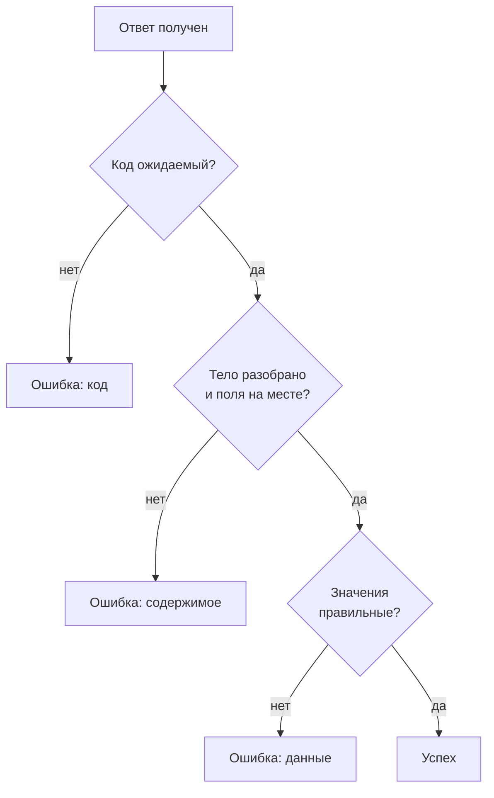
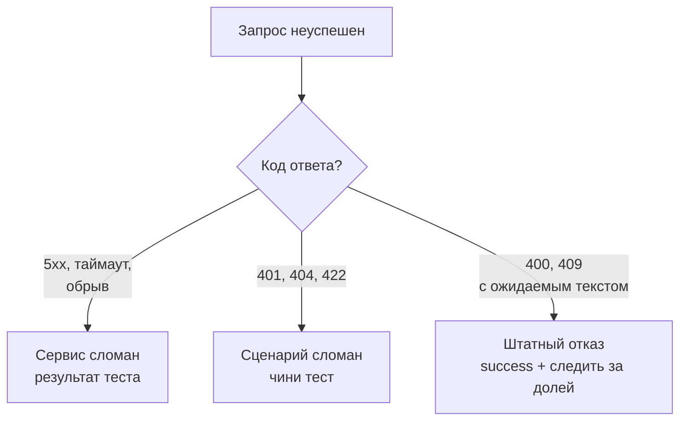

## Зачем это нужно

До сих пор твой тест считал успехом любой ответ с кодом меньше 400. Это опасное допущение. Сервис может вернуть **200 OK** и при этом пустой список товаров, чужую корзину или JSON с текстом «внутренняя ошибка». Для Locust это зелёный запрос, для покупателя катастрофа. Хуже всего, что такой тест красиво выглядит: ошибок ноль, задержки маленькие (пустой ответ строится быстро), а магазин на самом деле сломан. Нагрузочный тест, который не проверяет содержимое, измеряет скорость ответа «что-нибудь», а не скорость ответа «правильное».

Вторая проблема в данных. Если все пользователи ходят за одним и тем же товаром, весь тест читает одну строку из кэша базы и показывает фантастические цифры. Если пользователей в тесте больше, чем в базе, они делят аккаунты и мешают друг другу. Тестовые данные должны быть **достаточно разнообразными и согласованными**: реальные учётные записи, реальные идентификаторы.

Шаг проекта: ты генерируешь `~/perf-lab/09-locust/users.csv` и подключаешь его, добавляешь в сценарий функцию проверки ответа и разделяешь ошибки на «магазин сломан», «сценарий сломан» и «штатный отказ».

## Что нужно знать

- Сценарий, `SequentialTaskSet`, корреляция, токен: [урок 9.2](02-user-journey.md).
- Коды ответов HTTP (200, 201, 400, 401, 404, 409, 5xx): [урок 2.1](../02-web/01-client-server-http.md).
- Проверки в `pytest`, `assert`: [урок 6.1](../06-api-testing/01-testing-basics.md). Тут та же идея, только проверка не останавливает тест, а помечает запрос.
- Чтение CSV-файла в Python: модуль `csv`, словари: [урок 4.4](../04-python/04-files-json-csv.md).

## Картина целиком

Контролёр на конвейере проверяет не только «изделие выехало», но и «изделие правильное»: размер, вес, вид. Если конвейер выдаёт пустые коробки очень быстро, показатель «штук в час» отличный, а качество нулевое. Проверки в сценарии это контролёр: после каждого запроса он решает «годится или брак» и записывает причину. Аналогия ломается тем, что у контролёра есть время подумать, а проверки в нагрузочном тесте должны быть быстрыми: они выполняются на генераторе, и каждая лишняя операция отнимает у него силы.



Что здесь видно: успехом запрос становится только после трёх проверок подряд: код, форма ответа и значения. Каждая ловит свой класс поломок, и каждая пишет собственное сообщение, по которому на вкладке Failures видно, что именно сломалось.

## Теория

### Как Locust решает, что запрос успешный, и как это изменить

**Зачем это существует.** По умолчанию Locust работает как `requests`: если код ответа 4xx или 5xx (метод `raise_for_status` бросил бы исключение), запрос считается неудачным; всё остальное успешным. Простое правило, которое покрывает типичные поломки, но молчит о содержимом.

**Аналогия.** Сторож на входе проверяет только «есть пропуск или нет», а не «чей пропуск». Пропуск чужого человека сторож пропустит, пока бланк правильный.

**Как это устроено.** Чтобы вмешаться в решение, добавляют `catch_response=True` и используют ответ как **контекстный менеджер** (`with`: блок, в конце которого Python сам делает уборку; ты видел его в [уроке 4.4](../04-python/04-files-json-csv.md) при работе с файлами):

```python
with self.client.get("/api/products", catch_response=True) as response:
    if not response.json()["items"]:
        response.failure("каталог пуст")
```

Что здесь происходит:

- `catch_response=True` говорит Locust: «не записывай результат сам, дай мне решить».
- `with ... as response`: ответ доступен как `response`. Закончился блок, и Locust записывает итог.
- `response.failure("текст")` помечает запрос как **неудачный** и запоминает текст как причину. Именно этот текст попадёт на вкладку Failures.
- `response.success()` явно помечает запрос как успешный: нужно, когда код 4xx на самом деле штатный.
- Если внутри блока ничего не вызывать, действует правило по умолчанию: код меньше 400 это успех.

Все три способа влияют только на статистику Locust: время запроса записывается в любом случае, а вот «успех/неудача» определяется тобой. Для последующих разборов это важная деталь: на графике RPS неудачные запросы считаются отдельной линией.

**Разобранный пример.** Ответ `GET /api/products?page=2` приходит с кодом 200 и телом:

```text
{"items": [], "page": 2, "size": 20, "total": 0}
```

Правило по умолчанию: 200, успех. Проверка `if not response.json()["items"]` замечает, что список пуст, и вызывает `failure("каталог пуст")`. Теперь запрос красный, а в Failures появилась строка `GET /api/products: каталог пуст`. Если бы проверки не было, ты увидел бы идеальные 3 мс и ноль ошибок на сломанной базе.

**Что путают.** Что `catch_response=True` ничего сам не проверяет. Он только забирает у Locust решение, а решаешь ты. И второе: код, который в блоке упал исключением (например, `KeyError` из-за отсутствующего поля), Locust запишет как неудачный запрос с текстом исключения, но ты потеряешь понятное сообщение. Поэтому в проверках пользуйся `.get()` или `in`, а не прямым обращением к ключу.

> **Проверь понимание:** ответ пришёл с кодом 200, но в теле `{"detail": "internal error"}`. Какой запрос видит Locust по умолчанию и что нужно добавить?

<details markdown="1">
<summary>Ответ</summary>

По умолчанию это успешный запрос: код ниже 400. Чтобы заметить, нужен `catch_response=True` и проверка тела: `if "detail" in response.json(): response.failure(...)`. Так ошибка, замаскированная кодом 200, попадёт в Failures.

</details>

### Что проверять: четыре уровня

**Зачем это существует.** Чем строже проверка, тем больше ошибок поймано, но тем больше работы генератору. Нужен разумный набор: ловить всё, что значит «пользователь получил не то», не превращая генератор в узкое место.

**Как это устроено.** Проверки бывают четырёх уровней, от дешёвых к дорогим:

1. **Код ответа.** Дёшево, обязательно всегда. Для создания ожидаем 201, для чтения 200, для удаления 204. Проверка «код меньше 400» слишком мягкая: 202 или 304 тоже пройдут.
2. **Форма ответа.** Это JSON? Есть ли нужные поля (`items`, `token`, `id`)? Дёшево: один разбор JSON.
3. **Значения.** Список не пуст, в заказе то, что положили, `id` в ответе равен запрошенному. Умеренно дорого, зависит от объёма.
4. **Время.** Бизнес-порог: ответ каталога медленнее 500 мс считается неудачей. Это не замена перцентилям, а **SLO на уровне запроса** (напоминание из [урока 8.4](../08-perf-theory/04-load-profile-slo.md): цель надёжности в цифрах). Время ответа доступно как `response.elapsed.total_seconds()`.

Правило: на каждый маршрут проверяй код и форму, а значения только те, которые доказывают смысл. Не сверяй каждое поле: это дорого и хрупко (изменили имя поля, и тест краснеет).

**Разобранный пример.** Для `GET /api/products/{id}` разумный набор: код 200 (уровень 1), в JSON есть `id` (уровень 2), `id` равен тому, что просили (уровень 3). Если сервер вернёт товар с другим id (баг в кэше, одна из классических неисправностей: по [уроку 11.5](../11-bottlenecks/05-cache-dependencies.md) кэш бывает сломан), тест ловит это только на уровне 3.

**Что путают.** Валидацию схемы ответа в нагрузочном тесте делать не нужно: это работа функциональных API-тестов ([тема 6](../06-api-testing/01-testing-basics.md)). Здесь проверяем минимум, который доказывает «пользователь получил то, ради чего пришёл».

> **Проверь понимание:** в каком уровне ты поймаешь баг, при котором `/api/products/5` возвращает товар 7?

<details markdown="1">
<summary>Ответ</summary>

Только на уровне 3 (значения): сверяя `response.json()["id"]` с запрошенным числом. Код 200 и наличие поля `id` пройдут, а ответ при этом чужой.

</details>

### Три вида ошибок и как их различать

**Зачем это существует.** В конце теста в таблице Failures может оказаться 300 ошибок. Что с ними делать? Это зависит от того, какая именно ошибка. Если не разделять, отчёт получится «ошибок 3%» без смысла.

**Аналогия.** Три причины, по которым посылка не дошла: курьер сломал её (сервис сломан), на ней неверный адрес (ошибка сценария), адресат попросил не доставлять (штатный отказ). Одинаковый результат, разные виновники и разные действия.

**Как это устроено.** Классификация делается по коду и тексту:

| Класс | Примеры из «Магазина» | Что значит | Что делать |
|---|---|---|---|
| **Сервис сломан** | 500, 502, 503 (`database pool timeout`), 504 (`payment timeout`), обрыв соединения, таймаут клиента | магазин не справился | это результат теста: ищем узкое место |
| **Сценарий сломан** | 401 (токен не передан), 404 на товар, которого нет, 422 (неверное тело запроса), `KeyError` в коде | ты неправильно написал тест | чинить тест, а не магазин |
| **Штатный отказ** | 400 `cart is empty` при заказе, 409 `not enough stock`, 401 при неверном пароле (тест на безопасность) | сервис правильно сказал «нет» | не считать ошибкой, но следить за долей |

Коды из таблицы берутся из кода `project/shop/shop/app/main.py`: 400 «cart is empty», 409 «not enough stock» и «product unavailable», 404 «product not found», 401 «bearer token required» и «invalid or expired token», 503 «database pool timeout» при нехватке соединений в пуле, 502 и 504 при проблемах с оплатой, 422 от валидатора запросов (FastAPI возвращает его на неверное тело).

Штатные отказы обрабатывают явно: `response.success()`, но с условием: код и текст должны **точно** совпадать с ожидаемым. Любой другой 400 остаётся ошибкой. Так ты не «замазываешь» настоящие проблемы:

```python
if response.status_code == 400 and response.json().get("detail") == "cart is empty":
    response.success()
```

И ещё одно правило, которое экономит часы: **сообщение в `failure()` должно быть постоянным, без переменных значений**. Вкладка Failures группирует ошибки по тексту. Если написать `failure(f"заказ {order_id} без товаров")`, каждая ошибка получит свою строку, и ты получишь сотни единичных записей вместо одной группы «заказ без товаров: 300 раз». Подробности клади в лог, а в сообщение только класс проблемы.



Что здесь видно: сначала код решает, чья это проблема. Только первая ветка попадает в отчёт как дефект магазина.

**Что путают.** Таймаут клиента с ошибкой сервера. Если Locust оборвал запрос по `timeout=`, сервер мог просто долго работать. В статистике это «ошибка 0», без кода ответа. Для отчёта важно: «клиент потерял терпение через 30 с», а не «сервер ответил ошибкой».

> **Проверь понимание:** на вкладке Failures 120 ошибок `POST /api/orders: 409`, текст «not enough stock». Что это: баг магазина, баг теста или нормальное поведение?

<details markdown="1">
<summary>Ответ</summary>

Зависит от данных. Магазин ведёт себя правильно (отказывает, когда товара не хватает), значит это не сбой сервиса. Но 120 штук говорят о том, что остатки у популярных товаров закончились: тест нарушает собственные данные. В нашем стенде у каждого товара миллион штук, поэтому такая ошибка означала бы, что тест слишком долго работал на одних и тех же товарах. Это штатный отказ, а исправляется он данными: чаще менять товары или пополнять склад перед тестом.

</details>

### Тестовые данные: откуда брать пользователей и товары

**Зачем это существует.** Данные в тесте решают три задачи: сделать запросы **разными** (чтобы не попадать в один кэш), **валидными** (существующие id, правильные пароли) и **независимыми** (пользователи не мешают друг другу). Нарушение любой делает цифры недостоверными.

**Аналогия.** Репетиция на сцене: если все статисты берут один реквизит, они толкаются у одного стола, а остальная сцена пуста.

**Как это устроено.** Источники данных, от простого к сложному:

1. **Случайные значения в коде**: `random.randint(1, 10000)` для id товара. Просто, разнообразно, но не воспроизводимо: два прогона берут разные товары. Для `GET` обычно достаточно.
2. **CSV-файл**: таблица учётных записей, которую читают при старте. Воспроизводимо и контролируемо. Применяют для логинов, паролей, списков товаров.
3. **Подготовка перед тестом**: скрипт создаёт данные (пользователей, товары), и сценарий их использует. Нужно, когда данных в базе нет.
4. **Данные из ответов**: корреляция из [урока 9.2](02-user-journey.md).

Как раздать пользователей из CSV по виртуальным пользователям так, чтобы они не делили аккаунты? Читаем файл **один раз на весь процесс**, при импорте locustfile, и раздаём по кругу:

```python
import csv
import itertools
from pathlib import Path

def load_users():
    path = Path(__file__).with_name("users.csv")
    with path.open(newline="", encoding="utf-8") as f:
        return list(csv.DictReader(f))

USERS = load_users()
user_cycle = itertools.cycle(USERS)
```

- `Path(__file__).with_name("users.csv")`: путь к файлу рядом с locustfile. `__file__` это путь к самому файлу сценария; так сценарий находит данные, откуда бы его ни запустили.
- `csv.DictReader` читает CSV как список словарей: каждая строка это `{"email": "user0001@shop.lab", "password": "password"}`, ключи берутся из первой строки файла.
- `itertools.cycle(USERS)` выдаёт элементы по кругу бесконечно: после тысячного снова первый.
- Файл читается **один раз**, а не при создании каждого пользователя. Иначе 500 пользователей прочитали бы файл 500 раз.

Размер данных тоже имеет значение. Если у тебя 20 учётных записей на 200 пользователей, каждая запись будет использована десять раз одновременно, и на корзине появятся блокировки и странные 409. Минимум одна запись на виртуального пользователя. Магазин даёт тысячу: этого достаточно для всех тестов курса.

**Что путают.** Читают CSV внутри `on_start`: это работает, но создаёт лишнюю нагрузку на диск в момент запуска и риск, что два пользователя получат одну строку. Общий итератор на модуле безопасен при работе на гринлетах: переключение происходит только на ожидании сети, а `next(...)` не ждёт.

> **Проверь понимание:** в CSV 100 пользователей, тест на 300. Что случится и как это заметить?

<details markdown="1">
<summary>Ответ</summary>

Каждая учётная запись будет использоваться тремя виртуальными пользователями одновременно. Корзина у них общая (она привязана к пользователю), поэтому один добавит товар, а другой оформит его заказ; ответы станут непредсказуемыми: 400 «cart is empty» там, где ты ждал 201, лишние блокировки строк в базе. Заметить можно по росту 400 и 409 на `/api/orders`. Решение: данные на каждого виртуального пользователя.

</details>

## Практика

### 1. Сгенерируй CSV с пользователями

В базе стенда есть `user0001@shop.lab` … `user1000@shop.lab`, пароль `password` ([урок 2.1](../02-web/01-client-server-http.md)). Создай файл с ними. Скрипт `~/perf-lab/09-locust/make_users.py`:

```python
"""Создаёт users.csv для Locust: 1000 учётных записей стенда «Магазин»."""
import csv

with open("users.csv", "w", newline="", encoding="utf-8") as f:
    writer = csv.writer(f)
    writer.writerow(["email", "password"])
    for n in range(1, 1001):
        writer.writerow([f"user{n:04d}@shop.lab", "password"])
print("записано 1000 строк")
```

```bash
cd ~/perf-lab/09-locust && python make_users.py && head -3 users.csv && wc -l users.csv
```

```text
записано 1000 строк
email,password
user0001@shop.lab,password
user0002@shop.lab,password
1001 users.csv
```

`head -3` показывает первые три строки, `wc -l` считает строки: 1000 пользователей плюс заголовок дают 1001.

**Как читать вывод:** первая строка файла это заголовок, он нужен `DictReader` для имён ключей. Если строк не 1001, скрипт запускался в неправильном каталоге или оборвался.

Файл не секрет (пароль известен всему курсу), но в чужие проекты такие файлы с настоящими паролями класть нельзя: в реальной работе добавь `users.csv` в `.gitignore` и храни тестовые данные вне репозитория. Для учебного стенда мы коммитим его, и в README лаборатории пишем одной строкой, откуда файл берётся.

### 2. Подключи данные и проверки в locustfile

Замени в `~/perf-lab/09-locust/locustfile.py` верх файла и классы покупателя на этот вариант (`Visitor` ты тоже улучшишь):

```python
"""Сценарии «Магазина»: посетитель и покупатель с данными из CSV и проверками."""
import csv
import itertools
import random
from pathlib import Path

from locust import HttpUser, SequentialTaskSet, between, task
from locust.exception import StopUser


def load_users():
    path = Path(__file__).with_name("users.csv")
    with path.open(newline="", encoding="utf-8") as f:
        return list(csv.DictReader(f))


USERS = itertools.cycle(load_users())


def check(response, status, *fields):
    """Проверяет код, JSON и обязательные поля. Возвращает тело или None."""
    if response.status_code != status:
        response.failure(f"код {response.status_code}, ожидался {status}")
        return None
    try:
        body = response.json()
    except ValueError:
        response.failure("ответ не JSON")
        return None
    for field in fields:
        if field not in body:
            response.failure(f"нет поля {field}")
            return None
    return body


class Visitor(HttpUser):
    host = "http://localhost:8000"
    wait_time = between(1, 3)
    weight = 4

    @task(5)
    def catalog(self):
        with self.client.get("/api/products", params={"page": random.randint(1, 10)},
                             catch_response=True, name="/api/products") as r:
            body = check(r, 200, "items", "total")
            if body is not None and not body["items"]:
                r.failure("каталог пуст")

    @task(3)
    def product(self):
        product_id = random.randint(1, 10000)
        with self.client.get(f"/api/products/{product_id}", catch_response=True,
                             name="/api/products/[id]") as r:
            body = check(r, 200, "id", "price")
            if body is not None and body["id"] != product_id:
                r.failure("вернулся другой товар")

    @task(1)
    def search(self):
        query = f"Товар {random.randint(1, 99)}"
        with self.client.get("/api/products", params={"q": query}, catch_response=True,
                             name="/api/products?q") as r:
            check(r, 200, "items")

    @task(1)
    def categories(self):
        with self.client.get("/api/categories", catch_response=True) as r:
            body = check(r, 200)
            if body is not None and len(body) != 20:
                r.failure("число категорий не 20")
```

Разбор новых деталей. Функция `check` собирает все три первых проверки в одном месте: код, JSON, поля. Звёздочка в `*fields` значит «любое число дополнительных аргументов»: их можно передать сколько нужно (`check(r, 200, "items", "total")`), внутри они приходят как кортеж. Функция возвращает разобранное тело, чтобы не вызывать `response.json()` второй раз. В `catalog` проверка значения: список не пуст. В `product` проверка «вернулся тот же товар». В `categories` ответ это не словарь, а список, поэтому `fields` пусты, а длину проверяем отдельно: в базе ровно 20 категорий. В `search` параметр `q` ищет по названию (`ILIKE`), поэтому `name="/api/products?q"` собирает все поисковые запросы в одну строку статистики: параметр в имени мы записали сами.

Теперь покупатель:

```python
class Purchase(SequentialTaskSet):
    def on_start(self):
        self.ids = []
        self.product_id = None
        self.order_id = None

    @task
    def catalog(self):
        with self.client.get("/api/products", params={"page": random.randint(1, 10)},
                             catch_response=True, name="/api/products") as r:
            body = check(r, 200, "items")
            if body is not None:
                self.ids = [item["id"] for item in body["items"]]
                if not self.ids:
                    r.failure("каталог пуст")

    @task
    def open_product(self):
        self.product_id = random.choice(self.ids) if self.ids else random.randint(1, 10000)
        with self.client.get(f"/api/products/{self.product_id}", catch_response=True,
                             name="/api/products/[id]") as r:
            body = check(r, 200, "id")
            if body is not None and body["id"] != self.product_id:
                r.failure("вернулся другой товар")

    @task
    def add_to_cart(self):
        with self.client.post("/api/cart/items", json={"product_id": self.product_id, "qty": 1},
                              catch_response=True) as r:
            body = check(r, 201, "items", "total")
            if body is not None and not any(i["product_id"] == self.product_id for i in body["items"]):
                r.failure("товара нет в корзине")

    @task
    def checkout(self):
        self.order_id = None
        with self.client.post("/api/orders", catch_response=True, timeout=60) as r:
            if r.status_code == 400 and "cart is empty" in r.text:
                r.success()  # штатный отказ: корзина пуста
                return
            body = check(r, 201, "id", "items")
            if body is not None:
                self.order_id = body["id"]
                if not body["items"]:
                    r.failure("заказ без товаров")

    @task
    def check_order(self):
        if not self.order_id:
            return
        with self.client.get(f"/api/orders/{self.order_id}", catch_response=True,
                             name="/api/orders/[id]") as r:
            body = check(r, 200, "id", "items")
            if body is not None and body["id"] != self.order_id:
                r.failure("вернулся другой заказ")


class Buyer(HttpUser):
    host = "http://localhost:8000"
    wait_time = between(1, 3)
    weight = 1
    tasks = [Purchase]

    def on_start(self):
        account = next(USERS)
        with self.client.post("/api/login", json=account, name="/api/login",
                              catch_response=True, timeout=60) as r:
            body = check(r, 200, "token")
            if body is None:
                raise StopUser()
            self.client.headers["Authorization"] = "Bearer " + body["token"]
```

Здесь учётная запись приходит из CSV (`json=account` отправляет словарь `{"email": ..., "password": ...}` как JSON), а все проверки идут через `check`. Заметь `r.text` в `checkout`: это тело ответа как текст, его удобно искать подстрокой.

Проверь синтаксис и запусти:

```bash
python -m py_compile locustfile.py && locust
```

Поставь 30 пользователей со скоростью запуска 2. Пусть тест поработает пару минут.

**Типичные ошибки:**
- `FileNotFoundError: users.csv`: ты запустил Locust не в каталоге файла и `make_users.py` не отработал. Запусти его в `~/perf-lab/09-locust`.
- `KeyError: 'email'`: в CSV нет заголовка или он называется иначе.
- Вкладка Exceptions не пуста: тебя поймало необработанное исключение. Прочитай строку, там будет номер строки сценария.

### 3. Посмотри на вкладку Failures

На здоровом стенде таблица Failures должна быть **пустой**. Если там что-то есть, разбери по таблице классов: чья это проблема? Нажми **Reset Stats** после разгона и прогони ещё минуту.

### 4. Научи тест замечать скрытую поломку

Сломаем намеренно, чтобы убедиться, что проверки работают. Запроси несуществующие товары: временно поменяй в `Visitor.product` диапазон на `random.randint(9000, 12000)` (товаров с номерами выше 10000 нет). Запусти 20 посетителей.

На вкладке Failures появятся строки `GET /api/products/[id]: код 404, ожидался 200`: примерно две трети запросов карточки (номера 10001-12000 не существуют, это 2000 из 3001 возможных). Эти запросы ответили быстро (404 это дёшево), и среднее время выглядит лучше, чем должно быть.

**Как читать вывод:** по классификации это «сценарий сломан»: товаров с такими номерами нет. Исправь диапазон обратно. Урок: ошибку поймали проверки, а не твой глаз.

### 5. Зафиксируй

```bash
cd ~/perf-lab && git add 09-locust && git commit -m "9.3: данные из CSV и проверки ответов" && git push
```

## Сломай и почини

**Поломка A. Файл данных короче, чем нужно.** Оставь в `users.csv` первые 10 пользователей (`head -11 users.csv > u.csv && mv u.csv users.csv`) и запусти 100 пользователей (проверь, что `Buyer` составляет 20% от них: 20 покупателей на 10 учётных записей).

**Что ожидать.** Каждая запись достаётся двоим: одна корзина на двоих. Покупатели мешают друг другу: появляются 400 «cart is empty» (чужой заказ уже забрал корзину) и редкие 409, а проверка «товара нет в корзине» срабатывает, потому что чужие операции вклиниваются между шагами. На вкладке Failures появятся строки «товара нет в корзине» и «код 400».

<div class="viz" data-viz="flow" data-steps='[{"title":"Откуда ошибки","text":"На вкладке `Failures` смотри текст и маршрут: `/api/orders` и `/api/cart/items`."},{"title":"Это 4xx","text":"Сервис не падает, а возвращает отказы: значит, дело в данных или сценарии."},{"title":"Сравни числа","text":"Сколько в CSV учётных записей и сколько запущено пользователей `Buyer`."},{"title":"Найди пересечение","text":"Если пользователей больше записей, они делят корзину."},{"title":"Дай данные каждому","text":"Увеличь файл или уменьши число пользователей."},{"title":"Проверь","text":"Прогон без `Failures` на `/api/orders`."}]'></div>

Что здесь видно: ошибки 4xx на заказах говорят не о слабости магазина, а о нарушенной независимости тестовых данных. Восстанови полный файл: `python make_users.py`.

**Поломка B. Код 200, но каталог пуст.** Временно поменяй в `Visitor.catalog` страницу на `random.randint(400, 600)`. Товаров всего 10 000, по 20 на страницу это 500 страниц, поэтому страницы 501-600 лежат за пределом.

**Что ожидать.** Магазин отвечает **200** и телом `{"items": [], "page": 550, "size": 20, "total": 10000}`. Страницы 400-500 нормальные, а страницы 501-600 пустые: примерно треть запросов каталога. Проверка «каталог пуст» отмечает их в Failures. А теперь для сравнения закомментируй обе проверки и оставь простой `self.client.get(...)`: ошибок ноль, задержки у пустых страниц даже меньше. Именно так красивый отчёт может лгать.

**Починка.** Верни `randint(1, 10)` и проверки. Вывод: проверка кода пропускает пустой каталог, а проверка содержимого нет.

## Словарик урока

| Термин | Простыми словами |
|---|---|
| `catch_response=True` | Флаг, который передаёт тебе решение «успех или ошибка» вместо автоматического |
| `response.failure("...")` | Пометить запрос как неудачный и записать причину |
| `response.success()` | Явно пометить запрос успешным (например, штатный отказ) |
| Контекстный менеджер (`with`) | Блок, по окончании которого Python сам выполняет завершающее действие |
| Проверка содержимого | Сверка не только кода, но и тела ответа: поля, значения |
| Штатный отказ | Ожидаемый 4xx, который не означает поломки (пустая корзина, нет товара) |
| Ошибка сценария | Ошибка в самом тесте: неверный токен, несуществующий id |
| Параметризация | Подстановка данных из внешнего набора: CSV, список |
| `csv.DictReader` | Читает CSV-файл как список словарей с именами колонок |
| `itertools.cycle` | Выдаёт элементы списка по кругу бесконечно |
| Независимость данных | Каждый виртуальный пользователь работает со своими данными |

## Вопросы с собеседований

Раздел для повторения: ответь вслух, потом открой ответ. Вопросы `[на скорость]` тренируй на время.

### 1. [junior] [часто] Что такое `catch_response` и когда он нужен?

<details markdown="1">
<summary>Ответ</summary>

Флаг, который забирает у Locust решение, считать ли ответ успешным. Нужен, когда критерий успеха сложнее «код меньше 400»: проверить тело, поля, значения, время, признать штатный отказ. Внутри блока `with` вызываешь `response.failure("причина")` или `response.success()`.

**Что хотят услышать:** флаг передаёт решение вам; примеры: пустой список при 200, штатный 400.

**Красный флаг:** «он нужен, чтобы ловить исключения».

</details>

### 2. [junior] [часто] Почему нельзя считать успехом любой ответ 200?

<details markdown="1">
<summary>Ответ</summary>

Код 200 говорит только «сервер ответил». Тело может быть пустым, чужим или содержать сообщение об ошибке. Такие запросы быстрые, и тест выглядит лучше, чем есть: ошибок нет, задержки малы. Поэтому проверяют форму и ключевые значения ответа.

**Что хотят услышать:** примеры замаскированных ошибок и понимание, что быстрый неверный ответ искажает метрики.

**Красный флаг:** «проверки замедляют генератор, поэтому их нет».

</details>

### 3. [junior] Как классифицируешь ошибки по итогам теста?

<details markdown="1">
<summary>Ответ</summary>

Три группы. Сервис сломан: 5xx, таймауты, обрывы (результат теста). Сценарий сломан: 401, 404, 422, исключения в коде (чинить тест). Штатный отказ: ожидаемые 400 или 409 с точным текстом (не ошибка, но следить за долей). В отчёт как дефект идёт только первая группа.

**Что хотят услышать:** по коду и тексту, разные действия для разных групп.

**Красный флаг:** «все ошибки одинаковые, считаю процент».

</details>

### 4. [junior] Откуда брать тестовых пользователей и сколько их нужно?

<details markdown="1">
<summary>Ответ</summary>

Из CSV или другого набора, подготовленного заранее, не меньше одной записи на виртуального пользователя, чтобы они не делили корзины и сессии. Файл читают один раз на процесс и раздают по кругу или по номеру пользователя.

**Что хотят услышать:** независимость данных, чтение один раз, минимум одна запись на пользователя.

**Красный флаг:** один логин на всех.

</details>

### 5. [middle] [часто] Почему сообщение в `failure()` не должно содержать переменных значений?

<details markdown="1">
<summary>Ответ</summary>

Locust группирует ошибки на вкладке Failures по тексту сообщения. Если вставить в него id заказа или время, каждая ошибка станет отдельной строкой, и вместо «заказ без товаров: 300 раз» ты увидишь 300 строк по одному. Сообщение должно описывать класс проблемы, детали уходят в лог.

**Что хотят услышать:** группировка по тексту, постоянные сообщения.

**Красный флаг:** «чем подробнее текст, тем лучше».

</details>

### 6. [middle] Как отличить таймаут клиента от ошибки сервера?

<details markdown="1">
<summary>Ответ</summary>

У таймаута клиента нет кода ответа: Locust оборвал запрос сам по `timeout=`, в статистике он выглядит как ошибка без кода (текст вроде `ReadTimeout`). У ошибки сервера есть код 5xx и тело. Сравни с Grafana: сервер мог ещё работать и позже закончить запрос. В отчёте это разные строки: «клиент не дождался» и «сервер ответил ошибкой».

**Что хотят услышать:** наличие кода, связь с порогом ожидания, сверка с серверной стороной.

**Красный флаг:** «таймаут и 504 это одно и то же».

</details>

### 7. [middle] Что делает штатный отказ ошибкой, и как не «замазать» настоящую проблему?

<details markdown="1">
<summary>Ответ</summary>

Штатный отказ признают успехом только при точном совпадении кода и текста (`400` и «cart is empty»). Любой другой 400 остаётся ошибкой. Дополнительно следят за долей штатных отказов: если она растёт (скажем, пустых корзин половина), сценарий или данные перекошены, даже если отдельно эти запросы не ошибка.

**Что хотят услышать:** точное условие, мониторинг доли.

**Красный флаг:** «все 4xx помечаю как успешные».

</details>

### 8. [middle] Почему не стоит читать CSV внутри `on_start`?

<details markdown="1">
<summary>Ответ</summary>

Файл будет читаться на каждого пользователя: сотни чтений в момент запуска, лишняя нагрузка на генератор, и риск, что два пользователя получат одну строку. Читают один раз при импорте сценария и раздают через общий итератор. В распределённом режиме ещё делят данные между воркерами (урок 9.5).

**Что хотят услышать:** один раз на процесс, общий итератор, независимость.

**Красный флаг:** «CSV в `on_start`: так проще, и этого достаточно».

</details>

### 9. [middle] Когда нужна проверка времени ответа в самом запросе?

<details markdown="1">
<summary>Ответ</summary>

Когда у маршрута есть жёсткий порог для пользователя (каталог не медленнее 500 мс). Тогда медленный ответ помечается неудачей, и в Failures видно долю нарушений. Это дополнение к перцентилям, а не замена: перцентили показывают распределение, порог показывает нарушение цели.

**Что хотят услышать:** связь с SLO и отличие от перцентилей.

**Красный флаг:** «ставлю порог на каждый запрос: так точнее».

</details>

### 10. [junior] [на скорость] Каким вызовом пометить запрос неудачным в блоке `with`?

<details markdown="1">
<summary>Ответ</summary>

`response.failure("причина")`.

</details>

### 11. [junior] [на скорость] Какой код у «корзина пуста» в «Магазине»?

<details markdown="1">
<summary>Ответ</summary>

400, текст `cart is empty`, маршрут `POST /api/orders`.

</details>

### 12. [junior] [на скорость] Что такое `csv.DictReader` одной фразой?

<details markdown="1">
<summary>Ответ</summary>

Читатель CSV, который превращает каждую строку в словарь, где ключи это имена колонок из первой строки.

</details>

## Проверено на версиях

Ubuntu 24.04, Python 3.12, Locust 2.46.6, стенд «Магазин» из `project/shop` (10 000 товаров по 1 000 000 штук, 1000 пользователей), Prometheus 3.15, Grafana 13.2. Октябрь 2026.

## Итог урока: ты умеешь

- [ ] Объяснить, почему «код меньше 400» не гарантирует правильный ответ.
- [ ] Использовать `catch_response=True`, `failure()` и `success()`.
- [ ] Написать функцию проверки: код, JSON, поля, значения.
- [ ] Разделить ошибки на «сервис сломан», «сценарий сломан» и «штатный отказ».
- [ ] Писать постоянные сообщения об ошибках, чтобы Failures группировались.
- [ ] Сгенерировать CSV с учётными записями и раздать их по пользователям без пересечений.
- [ ] Заметить по Failures, что данных не хватает на всех виртуальных пользователей.

Дальше: [урок 9.4. Запуск без интерфейса, профиль нагрузки и отчёты](04-headless-shape.md), где тест запускается одной командой на сервере, а нагрузка идёт по ступенчатой форме.
