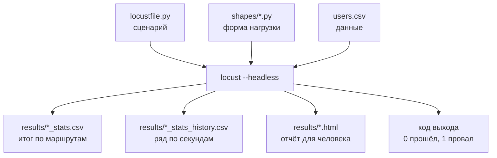

## Зачем это нужно

Веб-интерфейс Locust отлично подходит для знакомства: нажал Start, смотришь графики. Но настоящий тест редко запускают мышью. Его запускают ночью по расписанию, из CI после каждой выкладки, на удалённом сервере, где нет браузера. Тест, который нужно «нажимать», нельзя повторить в точности и нельзя сравнить с вчерашним. Нужен запуск **одной командой**: те же параметры, тот же результат в файлах, код завершения, по которому автоматика видит «прошёл» или «провалился».

Вторая задача: форма нагрузки. В [уроке 8.3](../08-perf-theory/03-test-types.md) ты узнал, что бывают smoke, load, stress, spike, и у каждого своя форма во времени: ровная полка, лестница, пик. В веб-интерфейсе ты задаёшь только «столько-то пользователей» и «столько-то в секунду». Для лестницы или пика Locust позволяет написать форму кодом: **LoadTestShape**.

Шаг проекта: ты запускаешь тесты без интерфейса, сохраняешь результаты в `~/perf-lab/results/`, пишешь три формы нагрузки (`load`, `stress`, `spike`), добавляешь к сценарию автоматическую проверку целей из [урока 8.4](../08-perf-theory/04-load-profile-slo.md) и скрипт `summarize.py`, который из CSV считает итог полки.

## Что нужно знать

- Locustfile с `Visitor` и `Buyer`, веса, CSV пользователей и `check`: [урок 9.3](03-data-checks.md).
- Виды тестов и их формы: [урок 8.3](../08-perf-theory/03-test-types.md). Профиль нагрузки, SLO, `methodology.md`: [урок 8.4](../08-perf-theory/04-load-profile-slo.md).
- Bash-скрипт с аргументами и `set -e`: [урок 1.5](../01-linux/05-bash-scripts.md). Чтение CSV в Python: [урок 4.4](../04-python/04-files-json-csv.md).
- Расчёт числа пользователей из нужного RPS (закон Литтла): [урок 8.2](../08-perf-theory/02-queues-littles-law.md).

## Картина целиком

Возьми испытательный стенд на заводе. Раньше инженер стоял у пульта и крутил ручки, глядя на стрелки. Теперь есть программа испытаний: «30 секунд разгон, 5 минут полка, 30 секунд спад», кнопка «Пуск», самописец, который записывает все показания в журнал, и автомат, который в конце говорит «норма» или «брак». Инженер приходит утром и читает журнал. Аналогия ломается тем, что у самописца есть своя погрешность: Locust записывает время запроса со стороны генератора, и о нём надо помнить (урок 9.5).



Что здесь видно: на входе три вещи (что делают пользователи, как растёт их число, какие у них данные), на выходе четыре (две таблицы, страница отчёта и код завершения). Все вместе они превращают тест в воспроизводимый эксперимент: тот же вход даёт сравнимый выход.

## Теория

### Запуск без интерфейса: флаги, которые нужны каждый день

**Зачем это существует.** Автоматика не умеет нажимать на кнопки в браузере, а всё нужное для запуска (адрес, число пользователей, длительность) можно передать аргументами. Режим без интерфейса называется **headless** (буквально «безголовый»: без графической части).

**Как это устроено.** Минимальная команда:

```bash
locust -f locustfile.py --headless -u 44 -r 3 -t 5m --host http://localhost:8000
```

| Флаг | Что значит | Пример |
|---|---|---|
| `-f` | какой файл или файлы со сценарием (можно несколько через запятую) | `-f locustfile.py,shapes/load.py` |
| `--headless` | запустить без веб-интерфейса и начать тест сразу | |
| `-u` (`--users`) | сколько пользователей в итоге | `-u 44` |
| `-r` (`--spawn-rate`) | сколько новых пользователей в секунду | `-r 3` |
| `-t` (`--run-time`) | сколько длится тест: `30s`, `5m`, `1h30m` | `-t 5m` |
| `--host` | адрес, если не задан в классе | `--host http://localhost:8000` |
| `--csv` | префикс файлов для сохранения таблиц | `--csv results/2026-10-03-load` |
| `--html` | файл HTML-отчёта | `--html results/2026-10-03-load.html` |
| `--only-summary` | не печатать таблицу каждые 2 секунды, только итог | |
| `--reset-stats` | обнулить статистику, когда все пользователи запущены | |
| `--stop-timeout` | сколько секунд дать пользователям закончить задачи при остановке | `--stop-timeout 10` |

Без `-t` headless-тест идёт до `Ctrl+C`. Без `--csv` и `--html` результат остаётся только в консоли: потеряется вместе с окном терминала. Поэтому в боевом запуске `--csv` и `--html` всегда есть.

**Что происходит по порядку.** Locust стартует, начинает создавать пользователей со скоростью `-r`, и когда их набралось `-u`, держит их до конца срока `-t`. Затем останавливает пользователей (даёт задачам закончиться в пределах `--stop-timeout`), печатает итоговую таблицу и завершается. **Код завершения** (exit code) это число, которое программа сообщает системе: 0 «всё хорошо», не ноль «что-то не так». В Locust по умолчанию код 1, если были неудачные запросы, иначе 0 ([урок 1.5](../01-linux/05-bash-scripts.md) про `$?`). Это значит, что `locust ... && echo прошёл` сработает «правильно» без дополнительных усилий. А ещё ты можешь сам решить, какой код вернуть: об этом ниже.

**Разобранный пример.** Мы хотим повторить load-тест из 8.4: 44 пользователя, 5 минут. Из-за дорогого логина ([урок 9.2](02-user-journey.md)) скорость запуска берём 3 в секунду: все 44 входят за 15 секунд, очередь не накапливается. Команда:

```bash
locust -f locustfile.py --headless -u 44 -r 3 -t 5m --csv results/2026-10-03-load --html results/2026-10-03-load.html --only-summary
```

**Что путают.** `-u` это пользователи, а не RPS: частая ошибка вида «поставил `-u 100`, жду 100 RPS». RPS зависит от пауз и скорости ответов (формула из [урока 9.1](01-first-locustfile.md)). И `-t` считается с начала теста, включая разгон: тест на `-t 5m` с разгоном 15 секунд даёт 4 минуты 45 секунд полки.

> **Проверь понимание:** ты запустил `locust --headless -u 100 -r 10` и не задал `-t`. Через час терминал всё ещё показывает цифры. Что пошло не так и что значит «правильно»?

<details markdown="1">
<summary>Ответ</summary>

Без `-t` headless-тест идёт бесконечно, до `Ctrl+C`. «Правильно» это задавать время всегда: `-t 5m`. Тест без срока не повторяется, не автоматизируется и забивает стенд.

</details>

### Что лежит в результатах: CSV и HTML

**Зачем это существует.** Экран исчезает, файлы остаются. Результаты нужны, чтобы сравнивать с прошлыми прогонами, строить графики, прикладывать к отчёту ([урок 12.1](../12-process/01-report.md)) и считать итог скриптом.

**Как это устроено.** Флаг `--csv результат/префикс` создаёт четыре файла с общим префиксом:

| Файл | Что внутри |
|---|---|
| `префикс_stats.csv` | итог за весь тест: по строке на маршрут и строка Aggregated |
| `префикс_stats_history.csv` | то же самое, но по времени: строка каждые 1-2 секунды |
| `префикс_failures.csv` | ошибки: маршрут, текст, сколько раз |
| `префикс_exceptions.csv` | исключения в коде сценария |

Флаг `--html файл` добавляет HTML-страницу: сводка, таблица, графики. Её удобно открыть сразу и отправить коллеге.

Колонки `_stats.csv`: `Type`, `Name`, `Request Count`, `Failure Count`, `Median Response Time`, `Average Response Time`, `Min Response Time`, `Max Response Time`, `Average Content Size`, `Requests/s`, `Failures/s`, затем перцентили `50%`, `66%`, `75%`, `80%`, `90%`, `95%`, `98%`, `99%`, `99.9%`, `99.99%`, `100%`. Время в миллисекундах. Последняя строка с именем `Aggregated` это итог по всем запросам.

В `_stats_history.csv` те же значения по времени плюс колонки `Timestamp` (время Unix, секунды от 1 января 1970), `User Count` (сколько пользователей работало) и `Total Request Count`. По этому файлу видно **динамику**: когда выросло p95, когда пошли ошибки, при каком числе пользователей.

**Разобранный пример.** Две строки из `_stats_history.csv` для строки Aggregated (названия колонок упрощены):

| Timestamp | User Count | Requests/s | Failures/s | 95% |
|---|---|---|---|---|
| 1759490112 | 44 | 20,4 | 0 | 38 |
| 1759490114 | 44 | 21,9 | 0 | 38 |

Первая колонка это момент (по таким временам удобно сверять с Grafana: переведи через `date -d @1759490112`), вторая число пользователей, третья скорость запросов (RPS), четвёртая ошибки в секунду, пятая p95 в мс. Видно полку: 44 пользователя, около 21 RPS, p95 38 мс.

**Что путают.** Что `_stats.csv` показывает итог «всего теста». В него входит разгон, а значит и холодный старт, и все дорогие логины: цифры хуже, чем на полке. Для критериев успеха считают **полку**: берут строки истории, где `User Count` равен максимальному, или перезапускают с `--reset-stats`. Второе: перцентили в Locust приблизительные (хранятся корзинами), точность для курса достаточна.

> **Проверь понимание:** где найти, при каком числе пользователей p95 каталога впервые превысил 300 мс?

<details markdown="1">
<summary>Ответ</summary>

В `_stats_history.csv`: фильтруешь строки с `Name` равным `/api/products`, идёшь по времени и находишь первую, где колонка `95%` больше 300. В той же строке колонка `User Count` и называет число пользователей. Итоговый `_stats.csv` тут не поможет: он усредняет весь тест.

</details>

### LoadTestShape: форма нагрузки кодом

**Зачем это существует.** Параметры `-u` и `-r` описывают одну прямую: «разогнаться до N и держать». Для лестницы (stress), пика (spike) или суточной кривой этого мало. LoadTestShape позволяет написать функцию «в этот момент времени должно быть столько-то пользователей».

**Аналогия.** Нотная запись: музыкант (Locust) каждую секунду смотрит, что написано в партитуре на этот момент: «играть громко», «играть тихо». Форма нагрузки это партитура, пользователи это музыканты, которые подтягиваются или уходят по сигналу. Аналогия ломается тем, что музыканты Locust не умеют мгновенно «вступить»: каждому нужно время на вход (логин), поэтому крутой подъём получается пологим.

**Как это устроено.** Ты пишешь класс, наследующий `LoadTestShape`, с методом `tick()`. Locust вызывает его примерно раз в секунду. Метод возвращает пару `(пользователей, скорость_запуска)`: сколько пользователей должно быть сейчас и с какой скоростью к этому числу приближаться. Когда `tick()` возвращает `None`, тест заканчивается. Время от старта теста даёт `self.get_run_time()` в секундах.

```python
from locust import LoadTestShape

class Staircase(LoadTestShape):
    steps = [(60, 20), (120, 40), (180, 80), (240, 160), (300, 240)]
    spawn_rate = 3

    def tick(self):
        now = self.get_run_time()
        for until, users in self.steps:
            if now < until:
                return users, self.spawn_rate
        return None
```

Разбор:

- `steps` это список пар «до какой секунды, сколько пользователей». До 60-й секунды 20 пользователей, до 120-й 40, и так далее: лестница из пяти ступеней по минуте.
- `tick()` проходит по списку и находит первую ступень, срок которой ещё не вышел. Возвращает её число пользователей и скорость запуска 3.
- Когда все ступени пройдены, цикл кончается и возвращается `None`: тест остановлен. Параметры `-u`, `-r`, `-t` при этом **игнорируются**: форму задаёт код. (`--run-time` всё равно работает как аварийный предел.)
- Нужно, чтобы файл с формой подключался вместе со сценарием: `-f locustfile.py,shapes/stress.py`. В файле должен быть **один** класс `LoadTestShape`: если несколько в разных файлах, победит неочевидный. Поэтому формы лежат в отдельных файлах, и в каждом запуске подключается один.

Помни про логин. Когда ступень требует 240 вместо 160 пользователей, 80 новых должны войти. При bcrypt 250 мс и одном процессе это 20 секунд, а при `spawn_rate = 3` ещё 27: всего ступень «раскачивается» почти полминуты. Поэтому на короткой ступени (минута) половина времени уходит на подъём. Ступени делают такой длины, чтобы полка успела сложиться: в нашей практике минута, а в реальных испытаниях 3-5 минут.

<div class="viz" data-viz="load-profiles" data-only="stress,spike"></div>

Смотри на картинку: две формы, которые в Locust задаются именно через `LoadTestShape`: лестница (stress) и пик (spike). У лестницы каждая ступень это шаг в `steps`, у пика три точки: спокойно, резкий подъём, возврат.

**Формы под виды тестов:**

| Тест | Как задать в Locust | Что важно |
|---|---|---|
| Smoke | два прогона: `-u 1 -r 1 -t 30s Visitor` и `-u 1 -r 1 -t 30s Buyer` | по одному пользователю каждого класса, ошибок 0: покупка тоже проверена |
| Load | `-u 44 -r 3 -t 5m` (или shape с полкой) | разгон до целевого числа, полка 5-15 минут |
| Stress | shape-лестница | ступени 3-5 минут, смотрим, на какой ломается |
| Spike | shape с резким подъёмом | для резкого пика нужны пользователи без логина (`Visitor`) |
| Soak | `-u 44 -r 3 -t 4h` | та же полка, но часы; смотрим на дрейф |

**Главное ограничение.** `LoadTestShape` задаёт **число пользователей**, а не RPS. Это закрытая модель (урок 8.2): если сервер замедлится, RPS упадёт, хотя пользователей столько же. Нужен ровный RPS независимо от скорости ответов? Либо ставь паузу `constant_throughput(1)` (каждый пользователь делает одну задачу в секунду, пока сервер успевает, N пользователей дают N RPS), либо используй открытый генератор (в k6 это `constant-arrival-rate`, тема 10). Locust сам по себе открытой модели не даёт.

**Что путают.** Что shape можно подмешать к `-u` и `-r`: нельзя, shape побеждает. И что `tick()` вызывается на каждую секунду теста: вызывается примерно раз в секунду, но точное значение времени надо брать из `get_run_time()`, а не считать вызовы.

> **Проверь понимание:** в форме `steps = [(60, 20), (120, 40)]`. Какое число пользователей вернёт `tick()` на 90-й секунде, и когда закончится тест?

<details markdown="1">
<summary>Ответ</summary>

На 90-й секунде первая ступень (до 60) прошла, вторая (до 120) ещё нет: вернётся 40. Тест закончится на 120-й секунде, когда `tick()` не найдёт подходящей ступени и вернёт `None`.

</details>

### Критерии успеха в коде и код выхода

**Зачем это существует.** Если после теста нужно открыть таблицу и сверить глазами с SLO, автоматизации нет. Хочется, чтобы Locust сам сказал «цели соблюдены» (код 0) или «нарушены» (код 1). Тогда тест можно поставить в CI: сборка краснеет, если SLO нарушено.

**Как это устроено.** Locust даёт **события** (events): в нужные моменты вызывает твои функции. Одно из них, `quitting`, срабатывает, когда тест закончился и Locust собирается выйти. В обработчике ты читаешь итоговую статистику и выставляешь `environment.process_exit_code`:

```python
from locust import events

SLO_P95_MS = {("GET", "/api/products"): 300, ("POST", "/api/login"): 800,
              ("POST", "/api/orders"): 1500}

@events.quitting.add_listener
def check_slo(environment, **kwargs):
    total = environment.stats.total
    problems = []
    if total.fail_ratio > 0.01:
        problems.append(f"ошибок {total.fail_ratio:.1%}, допустимо 1%")
    for (method, name), limit in SLO_P95_MS.items():
        entry = environment.stats.get(name, method)
        if entry.num_requests and entry.get_response_time_percentile(0.95) > limit:
            problems.append(f"{method} {name}: p95 выше {limit} мс")
    if problems:
        print("SLO НАРУШЕН: " + "; ".join(problems))
        environment.process_exit_code = 1
```

Ошибки запросов дают код 1 и без обработчика: Locust по умолчанию выходит с кодом 1, если в статистике есть хотя бы одна ошибка или необработанное исключение (флаг `--exit-code-on-error` меняет этот код). Обработчик нужен для порогов, которых Locust сам не знает: например, p95 выше SLO при нуле ошибок.

Разбор:

- `@events.quitting.add_listener` подписывает функцию на событие «тест заканчивается».
- `environment.stats.total` это итоговая строка Aggregated, `fail_ratio` доля неудачных запросов от 0 до 1; `:.1%` печатает как процент с одним знаком.
- `environment.stats.get(name, method)` достаёт строку статистики по имени и методу, как в таблице. `get_response_time_percentile(0.95)` возвращает p95 в миллисекундах.
- Пороги взяты из таблицы SLO урока 8.4: каталог 300 мс, вход 800 мс, заказ 1500 мс, ошибок не больше 1%.
- Выставленный `process_exit_code = 1` Locust вернёт системе при выходе и без оглядки на остальные правила.

Проверка в Bash:

```bash
locust -f locustfile.py,shapes/load.py --headless ... ; echo "код: $?"
```

`$?` это код последней команды: 0 (цели соблюдены) или 1 (нарушены).

**Что путают.** Что итог за весь тест это «полка». Он включает разгон: логины тянут `/api/login` вверх, и p95 входа за весь тест хуже, чем на полке. 800 мс для логина в SLO 8.4 выведено из стоимости bcrypt и очереди на входе. Для строгого сравнения полки используй `--reset-stats` (но тогда логины уйдут из статистики, раз они прошли на разгоне), либо считай по `_stats_history.csv` (практика).

> **Проверь понимание:** зачем в обработчике условие `entry.num_requests and ...`?

<details markdown="1">
<summary>Ответ</summary>

Если за тест не было ни одного запроса этого маршрута (например, запущен только `Visitor` без логина), строка пустая, а перцентиль пустой статистики не определён. Условие пропускает маршрут без данных, а не падает с исключением. Заодно оно напоминает: маршрут, который не тестировался, критерием не проверен.

</details>

## Практика

Тесты идут на локальный стенд. В конце каждого запуска сохраняем результат в `~/perf-lab/results/`.

### 1. Подготовь каталоги и формы

```bash
mkdir -p ~/perf-lab/results ~/perf-lab/09-locust/shapes
cd ~/perf-lab/09-locust
```

Форма **load** (`shapes/load.py`): ровная полка. Хотя то же самое делают флаги, форма удобна тем, что число задано в коде и не зависит от того, как кто-то запустил команду.

```python
"""Load: разгон до 44 пользователей и полка 5 минут (цель из 8.4)."""
from locust import LoadTestShape


class Load(LoadTestShape):
    users = 44
    spawn_rate = 3
    duration = 300

    def tick(self):
        if self.get_run_time() > self.duration:
            return None
        return self.users, self.spawn_rate
```

Форма **stress** (`shapes/stress.py`): лестница. Ступени минутные, чтобы упражнение шло 5 минут:

```python
"""Stress: лестница 20, 40, 80, 160, 240 пользователей по минуте."""
from locust import LoadTestShape


class Staircase(LoadTestShape):
    steps = [(60, 20), (120, 40), (180, 80), (240, 160), (300, 240)]
    spawn_rate = 3

    def tick(self):
        now = self.get_run_time()
        for until, users in self.steps:
            if now < until:
                return users, self.spawn_rate
        return None
```

Форма **spike** (`shapes/spike.py`): фон 20 пользователей, на 60-й секунде резкий подъём до 120, на 120-й возврат. Запускается только на `Visitor`, у которого нет логина: иначе подъём упрётся в очередь входа.

```python
"""Spike: 20 пользователей, на 60-й секунде 120, на 120-й снова 20."""
from locust import LoadTestShape


class Spike(LoadTestShape):
    def tick(self):
        now = self.get_run_time()
        if now < 60:
            return 20, 20
        if now < 120:
            return 120, 50
        if now < 240:
            return 20, 50
        return None
```

Проверь синтаксис: `python -m py_compile shapes/*.py && echo ok`.

### 2. Добавь проверку SLO в locustfile

Допиши в конец `locustfile.py` блок из раздела «Критерии успеха в коде» (импорт `events` добавь к строке `from locust import ...`). Не забудь: каждый маршрут, который не используется в запущенном тесте, пропускается условием `num_requests`.

### 3. Запусти smoke

```bash
cd ~/perf-lab/09-locust
for cls in Visitor Buyer; do
  locust -f locustfile.py --headless -u 1 -r 1 -t 30s --csv ../results/$(date +%F)-smoke-$cls --html ../results/$(date +%F)-smoke-$cls.html --only-summary $cls; echo "код $cls: $?"
done
```

Smoke идёт двумя прогонами: класс в конце команды говорит Locust запускать только его. Без имени класса при `-u 1` Locust случайно выбрал бы одного пользователя по весам (чаще `Visitor`, вес 4 из 5), и покупка могла бы остаться непроверенной. Цикл `for` выполняет команду по очереди для каждого слова в списке, `$cls` подставляет текущее. `$(date +%F)` подставляет сегодняшнюю дату в формате `2026-10-03`: файлы получают осмысленное имя. Пробелов в имени нет, поэтому цитирование не нужно.

```text
[2026-10-03 12:10:01,404] laptop/INFO/locust.main: Starting Locust 2.46.6
[2026-10-03 12:10:01,405] laptop/INFO/locust.main: Run time limit set to 30 seconds
[2026-10-03 12:10:01,406] laptop/INFO/locust.runners: Ramping to 1 users at a rate of 1.00 per second
[2026-10-03 12:10:01,407] laptop/INFO/locust.runners: All users spawned: {"Visitor": 1} (1 total users)
...
Type     Name                   # reqs      # fails |    Avg    Min    Max    Med |   req/s  failures/s
GET      /api/products               8     0(0.00%) |     12      9     21     11 |    0.27        0.00
...
         Aggregated                 17     0(0.00%) |      8      4     21      7 |    0.57        0.00

код Visitor: 0
...
код Buyer: 0
```

**Как читать вывод:** показан прогон `Visitor`; у `Buyer` в таблице будут строки `/api/login`, корзина и `/api/orders`. Главное: `0(0.00%)` ошибок в обоих прогонах и код 0 в обеих строках `код ...`. Если код 1, читай причину ниже таблицы: либо ошибки, либо сработал твой обработчик SLO.

**Типичные ошибки:**
- `No such file or directory: '../results/...'`: каталога `results` нет. Выполни `mkdir -p ~/perf-lab/results`.
- Тест не заканчивается: забыл `-t` или используешь форму, которая не возвращает `None`.
- `Locust ... No user class found!`: в файле нет класса `HttpUser`. Проверь `-f` и отступы.

> Locust выдал ошибку, которой нет в «Типичных ошибках»? Скопируй команду запуска и весь вывод, спроси нейросеть, что значит каждая строка ошибки. Ответ проверь так: запусти исправленную команду на `-u 1 -t 10s` и убедись, что тест стартует и код выхода 0.
{: .ai}

### 4. Запусти load и найди полку

```bash
locust -f locustfile.py,shapes/load.py --headless --host http://localhost:8000 --csv ../results/$(date +%F)-load --html ../results/$(date +%F)-load.html --only-summary; echo "код: $?"
```

Параметры `-u`, `-r`, `-t` не нужны: их заменяет форма. Пока идёт тест (5 минут), открой Grafana `http://localhost:3000`, дашборд «Магазин: обзор (эталон)»: должен появиться горб RPS около 21. По окончании в консоли итог, в `results/` пять файлов (четыре CSV и HTML). Открой `.html` в браузере: там сводка и графики того же теста.

### 5. Посчитай полку скриптом

Создай `~/perf-lab/09-locust/summarize.py`: берёт `_stats_history.csv`, оставляет секунды, где пользователей было максимум, и печатает итог полки по строке Aggregated.

```python
"""Итог полки теста: python summarize.py ../results/2026-10-03-load"""
import csv
import statistics
import sys

prefix = sys.argv[1]
with open(prefix + "_stats_history.csv", newline="", encoding="utf-8") as f:
    rows = [r for r in csv.DictReader(f) if r["Name"] == "Aggregated"]

top = max(int(r["User Count"]) for r in rows)
plateau = [r for r in rows if int(r["User Count"]) == top and r["Requests/s"] != "0"]
rps = [float(r["Requests/s"]) for r in plateau]
p95 = [float(r["95%"]) for r in plateau if r["95%"] != "N/A"]
fails = [float(r["Failures/s"]) for r in plateau]

print(f"пользователей на полке: {top}")
print(f"секунд полки:           {len(plateau)}")
print(f"RPS среднее:            {statistics.mean(rps):.1f}")
print(f"p95 (медиана по секундам): {statistics.median(p95):.0f} мс")
print(f"ошибок в секунду (макс): {max(fails):.2f}")
```

```bash
python summarize.py ../results/$(date +%F)-load
```

```text
пользователей на полке: 44
секунд полки:           275
RPS среднее:            20.9
p95 (медиана по секундам): 41 мс
ошибок в секунду (макс): 0.00
```

**Как читать вывод:** 44 пользователя, RPS около 21 это почти ровно цель из 8.4 (21,5), значит, расчёт профиля сработал. p95 41 мс (по всем маршрутам вместе: в нём нет дорогих логинов, они ушли на разгон). Ошибок нет. Сверь число секунд полки: тест длился 300 секунд, разгон 15 секунд, остальное полка.

В `p95` в истории может встретиться `N/A` (когда за интервал не было запросов): скрипт их пропускает. Если на полке мало строк, тест слишком короткий.

### 6. Прогони мини-stress и найди ступень

```bash
locust -f locustfile.py,shapes/stress.py --headless --host http://localhost:8000 --csv ../results/$(date +%F)-stress --html ../results/$(date +%F)-stress.html --only-summary; echo "код: $?"
```

Пять минут, ступени 20, 40, 80, 160, 240 пользователей. Открой HTML-отчёт и посмотри график Response Times при росте числа пользователей. На ноутбуке ты, скорее всего, **не** найдёшь излом: магазин выдерживает несколько сотен RPS, а 240 пользователей дают всего около 120 RPS. Это нормально: упражнение про технику, а настоящий предел искать будем в теме 11. Для справки, так выглядит полный прогон до 800 пользователей на стенде с одним процессом (цифры ориентировочные):

<div class="viz" data-viz="chart" data-type="line" data-x="50,100,200,400,600,800" data-x-label="Пользователей" data-y-label="Значение" data-explain="Лестница из шести ступеней по три минуты. До 400 пользователей RPS растёт вместе с числом пользователей, а задержка почти не меняется. На 600 и 800 RPS упирается в потолок около 330, а p95 взлетает: пользователи теперь ждут в очереди перед магазином." data-series='[{"name":"RPS","values":[25,50,99,196,285,330],"unit":"RPS"},{"name":"p95, мс","values":[14,15,18,35,120,900],"unit":"мс"}]'></div>

До колена RPS растёт прямо, а p95 стоит почти на месте. После 400 пользователей RPS почти не прибавляется, а p95 растёт взрывом: добавляя пользователей, ты добавляешь не нагрузку, а очередь. Это то же колено, которое ты видел в [уроке 8.2](../08-perf-theory/02-queues-littles-law.md), и ступени Locust помогают его найти: рабочая нагрузка выбирается на 60-70% от колена.

### 7. Сохрани и закоммить

```bash
cd ~/perf-lab && git add 09-locust results && git commit -m "9.4: headless, формы нагрузки, результаты" && git push
```

## Сломай и почини

**Поломка A. Форма и флаги вместе.** Запусти `locust -f locustfile.py,shapes/load.py --headless -u 500 -r 100 -t 20s`.

**Что ожидать.** Locust не создаёт 500 пользователей: число и скорость берёт форма, а флаги `-u` и `-r` не действуют (в логе вместо ожидаемого «500 users» увидишь рост до 44). Смешивать форму и эти флаги нет смысла: читатель команды увидит число 500 и ошибётся в выводах. Если рядом стоит `-t 20s`, тест остановится по этому пределу, раньше формы: проверь по времени в логе.

**Задача.** Прочитай первые строки вывода, найди сообщение «Ramping to ... users» и сравни с числом из `-u`.

<div class="viz" data-viz="flow" data-steps='[{"title":"Сверь число пользователей","text":"Сколько реально запущено: строка `All users spawned` в логе и график `Number of Users`."},{"title":"Есть ли форма","text":"Нет ли в подключённых файлах класса `LoadTestShape`: он главнее `-u` и `-r`."},{"title":"Что подключено","text":"Какие файлы перечислены в `-f`: лишняя форма меняет весь тест."},{"title":"Верни управление","text":"Убери файл формы из `-f` или не передавай `-u`, если нужна форма."}]'></div>

Что здесь видно: расхождение «заказал одно, получил другое» почти всегда лечится сверкой реального числа пользователей из лога с ожиданием.

**Поломка B. Подъём упирается в логин.** Запусти spike на `Buyer`: `locust -f locustfile.py,shapes/spike.py --headless -t 4m Buyer` (форма берётся из spike.py, пользователи типа `Buyer`).

**Что ожидать.** Форма просит 120 пользователей через 60 секунд, а магазин успевает логинить около 4 в секунду: подъём с 20 до 120 занимает 25 секунд, а `/api/login` на вкладке статистики показывает p95 в десятки секунд. «Пик» получился плавным, а на входе очередь. Это не вина формы: так устроен магазин. Для проверки настоящего резкого пика запускай тот же spike на `Visitor` (без логина): `... Visitor`.

**Починка.** Для spike используй `Visitor` либо заранее «прогрей» пользователей: запусти тест с высокой базовой нагрузкой и меняй только поведение, а не число пользователей.

> Сначала разбери поломки по алгоритму из схемы выше и запиши свою гипотезу, и только потом спроси нейросеть, согласна ли она. Спорные места проверь по логу: строкам `Ramping to ... users` и `All users spawned`.
{: .ai}

## ИИ в помощь

Нейросеть хорошо набрасывает каркас формы нагрузки и объясняет незнакомый вывод Locust, но флаги и имена колонок она нередко придумывает. Общие правила: [ИИ-помощник](../ai.md).

**Задача:** набросать форму нагрузки (лестницу или пик) с нужными числами, не вспоминая синтаксис `LoadTestShape`.

```text
Я учусь нагрузочному тестированию. Locust 2.46, Python 3.12. Нужен класс на LoadTestShape
для файла shapes/ladder.py: лестница 10, 20, 40, 80 пользователей, каждая ступень 2 минуты,
скорость запуска 3 пользователя в секунду, после последней ступени тест заканчивается.
Напиши код и объясни построчно: что возвращает tick(), как тест останавливается,
почему число пользователей берётся из формы, а не из флага -u.
```
{: .wrap}

**Проверь ответ:** флаг `-t` форма нагрузки игнорирует, поэтому для проверки временно сократи ступени до 10 секунд и найди в логе строки `Ramping to ... users`: числа должны совпасть с заказанными. Типичные ошибки нейросетей: `tick()` возвращает одно число вместо пары `(пользователи, скорость)`, вместо `None` для остановки возвращается `0`, берётся несуществующий флаг вроде `--shape`.

**Задача:** разобрать итоговую таблицу и найти полку по `_stats_history.csv`.

```text
Я запускаю Locust 2.46 с флагом --csv results/load. Вот первая строка файла
results/load_stats_history.csv и три строки из середины теста:
<вставь вывод head -1 и sed -n '100,102p'>
Мне нужен код на Python (только стандартная библиотека), который находит секунды,
где число пользователей максимальное, и печатает среднее RPS и медиану p95 по строке Aggregated.
Объясни, зачем нужна именно медиана по секундам, а не среднее.
```
{: .wrap}

**Проверь ответ:** имена колонок в коде (`User Count`, `Requests/s`, `95%`, `Name`) сверь с первой строкой твоего файла: нейросети подставляют `p95`, `Total Request Count` или `Response Time 95` по памяти. Затем запусти код на своём прогоне и сравни результат со своим `summarize.py`.

**Задача:** добавить в locustfile проверку SLO, которая вернёт код выхода 1.

```text
Locust 2.46. Вот мой locustfile.py: <вставь файл без паролей>.
Допиши обработчик события quitting: если p95 маршрута /api/products выше 300 мс
или доля ошибок больше 1%, выставь environment.process_exit_code = 1 и напечатай причину.
Объясни, почему обработчик ставят на quitting, а не на request, и что будет,
если у маршрута не было ни одного запроса.
```
{: .wrap}

**Проверь ответ:** сделай порог заведомо жёстким (например, 1 мс), запусти короткий тест и выполни `echo $?`: должно быть 1. Типичная ошибка: события из старых версий Locust (`request_success`, `request_failure`), их в 2.x нет, вместо них одно событие `request`. Ещё нейросети забывают условие `num_requests` и получают исключение на пустом маршруте.

В чат не отправляй содержимое `users.csv` с реальными логинами и адреса чужих серверов: для курса хватит пользователей стенда, на работе замени их на `user@example.com`.

## Словарик урока

| Термин | Простыми словами |
|---|---|
| Headless | Запуск Locust без веб-интерфейса, одной командой |
| `-u` / `--users` | Число пользователей в итоге |
| `-r` / `--spawn-rate` | Скорость запуска: сколько новых пользователей в секунду |
| `-t` / `--run-time` | Длительность теста: `30s`, `5m`, `1h` |
| `--csv` | Префикс файлов с таблицами результатов |
| `--html` | Файл HTML-отчёта |
| Код выхода (exit code) | Число, которое программа возвращает системе: 0 «успех», иначе «проблема» |
| `LoadTestShape` | Класс, задающий форму нагрузки кодом: сколько пользователей в каждый момент |
| `tick()` | Метод формы, который Locust вызывает раз в секунду и в ответ получает пользователей и скорость |
| Ступень (step) | Участок лестницы нагрузки с постоянным числом пользователей |
| Полка (plateau) | Участок теста с постоянной нагрузкой, по которому считают критерии |
| Событие (event) | Момент, на который можно подписать свою функцию: например, конец теста |
| Разгон (ramp-up) | Начало теста, пока пользователи ещё набираются |

## Вопросы с собеседований

Раздел для повторения: ответь вслух, потом открой ответ. Вопросы `[на скорость]` тренируй на время.

### 1. [junior] [часто] Как запустить Locust без веб-интерфейса, и какие флаги обязательны в боевом запуске?

<details markdown="1">
<summary>Ответ</summary>

`locust -f файл --headless -u N -r R -t T`. В боевом запуске всегда задают длительность `-t`, иначе тест бесконечен, и сохранение результатов (`--csv`, `--html`), иначе они потеряются вместе с консолью. Адрес стенда либо в классе, либо `--host`.

**Что хотят услышать:** `--headless`, `-u`, `-r`, `-t`, `--csv`, `--html`.

**Красный флаг:** «просто запускаю с интерфейсом и смотрю».

</details>

### 2. [junior] [часто] Что за файлы создаёт `--csv` и какой самый полезный?

<details markdown="1">
<summary>Ответ</summary>

Четыре: `_stats` (итог по маршрутам), `_stats_history` (ряд по времени), `_failures`, `_exceptions`. Самый полезный `_stats_history`: по нему видно динамику, число пользователей в каждый момент и полку; итог `_stats` усредняет разгон вместе с рабочим участком.

**Что хотят услышать:** история по времени, полка отдельно от разгона.

**Красный флаг:** считают критерии по итогу всего теста.

</details>

### 3. [junior] Что такое LoadTestShape и когда он нужен?

<details markdown="1">
<summary>Ответ</summary>

Класс, в котором метод `tick()` каждую секунду возвращает `(пользователей, скорость запуска)` или `None` для остановки. Нужен для форм, которые флагами не выразить: лестница (stress), пик (spike), суточная кривая. Если форма есть в подключённых файлах, она главнее `-u` и `-r`.

**Что хотят услышать:** `tick`, возврат `None`, приоритет над флагами.

**Красный флаг:** «shape задаёт RPS».

</details>

### 4. [middle] [часто] Задаёт ли Locust RPS? Как получить ровный RPS?

<details markdown="1">
<summary>Ответ</summary>

Нет, Locust управляет числом пользователей (закрытая модель): RPS получается из пауз и скорости ответов. Если сервер замедляется, RPS падает. Приблизить постоянный RPS можно, подобрав `-u` и `wait_time`, либо `constant_throughput`, либо взять открытый генератор (k6 с `constant-arrival-rate`), если нужна настоящая открытая модель.

**Что хотят услышать:** закрытая модель, `constant_throughput`, оговорка про открытую.

**Красный флаг:** «`-u 100` это 100 RPS».

</details>

### 5. [middle] Как автоматически определить, что тест прошёл?

<details markdown="1">
<summary>Ответ</summary>

Ошибки запросов дают код выхода 1 и так, это поведение Locust по умолчанию. Для порогов по задержке нужен код: в обработчике события `quitting` сравнить итоговую статистику с порогами (доля ошибок, p95 по маршрутам) и выставить `environment.process_exit_code = 1` при нарушении. CI читает код выхода. Критерии должны браться из методики, а не придумываться в момент теста.

**Что хотят услышать:** события, код выхода, пороги из SLO.

**Красный флаг:** «смотрю график и решаю».

</details>

### 6. [middle] Почему итоговый `_stats.csv` плохо подходит для проверки SLO?

<details markdown="1">
<summary>Ответ</summary>

Он усредняет весь тест, включая разгон: холодные кэши, дорогие входы, неполную нагрузку. Цели относятся к рабочему участку, полке. Поэтому полку выделяют (`--reset-stats` или фильтр по `User Count` в `_stats_history`) и считают критерии по ней.

**Что хотят услышать:** разгон искажает итог, полка отдельно.

**Красный флаг:** «в итоге есть p95, значит достаточно».

</details>

### 7. [middle] Почему пик (spike) на сценарии с логином получается пологим?

<details markdown="1">
<summary>Ответ</summary>

Каждый новый пользователь должен войти, а вход дорогой (bcrypt). Пропускная способность логина около 4 в секунду, поэтому быстрый подъём разбивается о очередь входа. Для проверки резкого всплеска нагрузки берут пользователей без логина или заранее прогретых, а логин тестируют отдельным сценарием.

**Что хотят услышать:** связь формы с пропускной способностью входа.

**Красный флаг:** «увеличу spawn rate до 1000».

</details>

### 8. [middle] Как сделать, чтобы результаты разных прогонов можно было сравнить?

<details markdown="1">
<summary>Ответ</summary>

Запускать одной командой из скрипта с зафиксированными параметрами, складывать результаты в каталог по дате и типу теста (`results/2026-10-03-load_*`), хранить версию стенда и настройки рядом (ссылка на коммит, `.env`), считать критерии одним скриптом по полке. Тогда различие между прогонами объясняется изменением системы, а не теста.

**Что хотят услышать:** воспроизводимость: команда, имена, окружение, один способ подсчёта.

**Красный флаг:** «сравниваю по скриншотам».

</details>

### 9. [junior] [на скорость] Какой флаг задаёт длительность теста?

<details markdown="1">
<summary>Ответ</summary>

`-t` (`--run-time`), например `5m` или `30s`.

</details>

### 10. [junior] [на скорость] Что возвращает `tick()`, чтобы тест закончился?

<details markdown="1">
<summary>Ответ</summary>

`None`.

</details>

### 11. [junior] [на скорость] Какой код выхода у успешного теста и как его посмотреть в Bash?

<details markdown="1">
<summary>Ответ</summary>

0, смотрят командой `echo $?` сразу после запуска.

</details>

### 12. [junior] [на скорость] В каком файле искать, на какой секунде вырос p95?

<details markdown="1">
<summary>Ответ</summary>

В `префикс_stats_history.csv`: там строки по времени с колонкой `95%` и `User Count`.

</details>

## Проверено на версиях

Ubuntu 24.04, Python 3.12, Locust 2.46.6, стенд «Магазин» из `project/shop`, Prometheus 3.15, Grafana 13.2. Октябрь 2026. Тексты сообщений в консоли Locust отличаются от версии к версии: ориентируйся на смысл. Цифры в таблицах и на графиках ориентировочные.

## Итог урока: ты умеешь

- [ ] Запустить тест без интерфейса одной командой и понять, что она делает.
- [ ] Сохранить результаты (`--csv`, `--html`) в каталог по дате и типу теста.
- [ ] Прочитать `_stats.csv` и `_stats_history.csv`, найти полку по числу пользователей.
- [ ] Написать форму нагрузки через `LoadTestShape` (полка, лестница, пик).
- [ ] Подобрать скорость запуска так, чтобы вход не тормозил разгон.
- [ ] Закодировать SLO в код выхода и использовать его в автоматизации.
- [ ] Объяснить, почему Locust задаёт пользователей, а не RPS.

Дальше: [урок 9.5. Один генератор и много: как не упереться в тестовую машину](05-distributed-generator.md), где ты узнаешь, как понять, что тормозит не магазин, а твой генератор.
