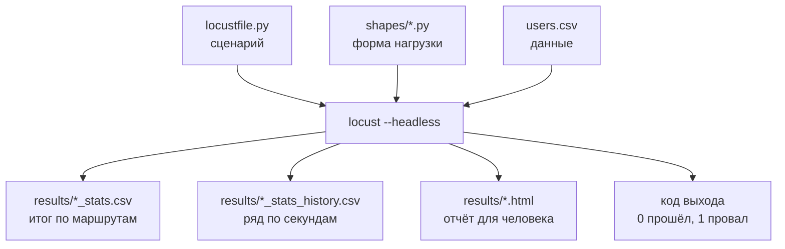

## Зачем это нужно

Веб-интерфейс Locust хорош для знакомства: нажал Start и смотришь графики. Но настоящий тест редко запускают мышью. Его гоняют ночью по расписанию, из CI после каждой выкладки, на сервере, где нет браузера. CI (непрерывная сборка) это робот, который после каждой правки кода сам собирает и проверяет проект, подробнее в [уроке 12.2](../12-process/02-perf-ci.md). Нагрузочный тест там нужен, чтобы новая выкладка не замедлила сайт незаметно для всех. Я сам когда-то «запускал» нагрузку руками и вечером не мог вспомнить, какие числа вводил утром. Тест, который нужно нажимать, нельзя повторить в точности и нельзя сравнить со вчерашним. Нужен запуск одной командой: те же параметры, результат в файлах и код завершения, по которому автоматика видит «прошёл» или «провалился».

Вторая задача: форма нагрузки. В [уроке 8.3](../08-perf-theory/03-test-types.md) ты узнал, что у тестов smoke, load, stress и spike разная форма во времени: ровная полка (участок, где число пользователей держится постоянным), лестница, пик. В веб-интерфейсе ты задаёшь только «столько-то пользователей» и «столько-то в секунду». Лестницу или пик можно написать кодом, и называется это **LoadTestShape**.

Шаг проекта: ты запускаешь тесты без интерфейса и сохраняешь результаты в `~/perf-lab/results/`. Пишешь три формы нагрузки (`load`, `stress`, `spike`) и автоматическую проверку целей из [урока 8.4](../08-perf-theory/04-load-profile-slo.md). Скрипт `summarize.py` считает из CSV итог полки.

## Что нужно знать

- Locustfile с `Visitor` и `Buyer`, веса, CSV пользователей и `check`: [урок 9.3](03-data-checks.md).
- Виды тестов и их формы: [урок 8.3](../08-perf-theory/03-test-types.md). Профиль нагрузки, SLO, `methodology.md`: [урок 8.4](../08-perf-theory/04-load-profile-slo.md).
- Bash-скрипт с аргументами и `set -e`: [урок 1.5](../01-linux/05-bash-scripts.md). Чтение CSV в Python: [урок 4.4](../04-python/04-files-json-csv.md).
- Расчёт числа пользователей из нужного RPS (закон Литтла): [урок 8.2](../08-perf-theory/02-queues-littles-law.md).

## Картина целиком

Возьми испытательный стенд на заводе. Раньше инженер стоял у пульта и крутил ручки. Теперь есть программа испытаний («30 секунд разгон, 5 минут полка, 30 секунд спад»), самописец и автомат, который в конце говорит «норма» или «брак». Разгон это плавный набор пользователей до нужного числа. Инженер приходит утром и читает журнал. Аналогия ломается тут: Locust пишет время со стороны генератора, а не магазина ([урок 9.5](05-distributed-generator.md)).



Что здесь видно: на входе три вещи (что делают пользователи, как растёт их число, какие у них данные), на выходе четыре (две таблицы, отчёт и код завершения). Вместе они превращают тест в воспроизводимый эксперимент: тот же вход даёт сравнимый выход.

## Теория

### Запуск без интерфейса

Автоматика не умеет нажимать кнопки в браузере, но всё нужное для запуска (адрес, число пользователей, длительность) можно передать аргументами. Режим без окна и экрана называется **headless** (буквально «безголовый»: есть тело, нет интерфейса). Минимальная команда:

```bash
locust -f locustfile.py --headless -u 44 -r 3 -t 5m --host http://localhost:8000
```

Разберём флаги. `-f` называет файл со сценарием (можно несколько через запятую: `-f locustfile.py,shapes/load.py`). `--headless` запускает тест сразу, без интерфейса. `-u` (`--users`) задаёт, сколько пользователей нужно в итоге, `-r` (`--spawn-rate`) сколько новых в секунду, `-t` (`--run-time`) сколько длится тест: `30s`, `5m`, `1h30m`. `--host` нужен, если адрес не задан в классе. Результаты сохраняют флаги `--csv` (префикс файлов таблиц, например `results/2026-10-03-load`) и `--html` (файл отчёта): без них итог остаётся в консоли и теряется вместе с окном. Ещё три полезных. `--only-summary` печатает только итог, без таблицы каждые 2 секунды. `--reset-stats` обнуляет статистику, когда все пользователи запущены. `--stop-timeout 10` даёт пользователям 10 секунд закончить задачи при остановке.

Locust набирает пользователей со скоростью `-r`, держит их до конца срока `-t`, печатает итог и завершается, сообщив системе **код завершения** (exit code): число, которое программа возвращает системе при выходе: 0 значит «прошла без проблем», любое другое «что-то не так» ([урок 1.5](../01-linux/05-bash-scripts.md) про `$?`). По умолчанию у Locust код 1, если были неудачные запросы, иначе 0, и `locust ... && echo прошёл` работает правильно без усилий. Свой код можно выставить самому, ниже покажу.

Повторим load-тест из 8.4: 44 пользователя, 5 минут. Из-за дорогого логина ([урок 9.2](02-user-journey.md)) скорость запуска берём 3 в секунду: все 44 входят за 15 секунд, очереди нет.

```bash
locust -f locustfile.py --headless -u 44 -r 3 -t 5m --csv results/2026-10-03-load --html results/2026-10-03-load.html --only-summary
```

> **Прикинь сам:** ты запустил `locust --headless -u 100 -r 10` без `-t`. Через час терминал всё ещё показывает цифры. Что пошло не так?
{: .predict}

Без `-t` тест идёт до `Ctrl+C`. Правильно задавать время всегда: тест без срока нельзя повторить и автоматизировать, и он забивает стенд.

Осторожно: `-u` это пользователи, а не RPS. «Поставил `-u 100`, жду 100 RPS» частая ошибка: RPS зависит от пауз и скорости ответов (формула из [урока 9.1](01-first-locustfile.md)). И `-t` считается с начала теста, включая разгон: `-t 5m` с разгоном 15 секунд даёт 4 минуты 45 секунд полки.

> **Главное:** боевой запуск это `--headless`, пользователи, скорость запуска, срок и всегда `--csv` с `--html`.
{: .key}

Тест прошёл и записал файлы. Что в них лежит?

### Что лежит в результатах: CSV и HTML

Экран исчезает, файлы остаются: их сравнивают с прошлыми прогонами, прикладывают к отчёту ([урок 12.1](../12-process/01-report.md)) и считают скриптом. Флаг `--csv` создаёт четыре файла с общим префиксом. `префикс_stats.csv` это итог за весь тест: строка на маршрут и строка Aggregated. `префикс_stats_history.csv` это то же самое по времени, строка каждые 1-2 секунды. Без флага `--csv-full-history` в нём только строка Aggregated, строки отдельных маршрутов появляются с ним. `префикс_failures.csv` хранит ошибки (маршрут, текст, сколько раз), `префикс_exceptions.csv` исключения в коде сценария. Флаг `--html` добавляет страницу со сводкой и графиками, её удобно отправить коллеге.

В `_stats.csv` колонки `Type`, `Name`, `Request Count`, `Failure Count`, время ответа (медиана, среднее, минимум, максимум), `Requests/s`, `Failures/s` и перцентили `50%` … `99%`, всё в миллисекундах. В `_stats_history.csv` те же значения по времени плюс `Timestamp` (секунды с 1 января 1970: так компьютеры считают время), `User Count` (сколько пользователей работало) и `Total Request Count`. Именно по нему видно динамику: когда вырос p95, когда пошли ошибки и при каком числе пользователей.

Вот две строки истории для Aggregated (названия колонок упрощены):

| Timestamp | User Count | Requests/s | Failures/s | 95% |
|---|---|---|---|---|
| 1759490112 | 44 | 20,4 | 0 | 240 |
| 1759490114 | 44 | 21,9 | 0 | 240 |

Первая колонка это момент (по нему сверяют с Grafana: `date -d @1759490112`), дальше число пользователей, RPS, ошибки в секунду и p95 в мс. Видна полка: 44 пользователя, около 21 RPS, p95 240 мс. Не пугайся p95: это все маршруты вместе. Четыре пользователя `Auth` из [урока 9.3](03-data-checks.md) входят 2 раза в секунду, это почти каждый десятый запрос, и дорогие входы по 200-300 мс занимают все верхние 5%. Каталог на этой полке отвечает за десятки миллисекунд, это видно в его собственной строке.

> **Прикинь сам:** где найти, при каком числе пользователей p95 каталога впервые превысил 300 мс?
{: .predict}

В `_stats_history.csv` (запуск с `--csv-full-history`): берёшь строки с `Name`, равным `/api/products`, идёшь по времени до первой, где `95%` больше 300, и читаешь в ней `User Count`. Итоговый `_stats.csv` тут не поможет: он усредняет весь тест.

Осторожно: `_stats.csv` показывает итог всего теста, включая разгон с очередью на вход, поэтому цифры хуже, чем на полке. Для критериев успеха считают полку: берут строки истории, где `User Count` максимален, или запускают с `--reset-stats`.

> **Главное:** итог лежит в `_stats.csv`, динамика в `_stats_history.csv`, а для проверки целей берут полку, а не весь тест.
{: .key}

Флагов `-u` и `-r` хватает для ровной полки. А как получить лестницу или пик?

### LoadTestShape: форма нагрузки кодом

Параметры `-u` и `-r` описывают одну прямую: «разогнаться до N и держать». Для лестницы или пика нужна партитура: музыкант (Locust) каждую секунду смотрит, что написано на этот момент, «играть громко» или «тихо». **LoadTestShape** это такая партитура: ты пишешь функцию «в этот момент должно быть столько-то пользователей». Аналогия ломается тем, что музыканты Locust не умеют вступить мгновенно: каждому нужно время на вход (логин), поэтому крутой подъём получается пологим.

Ты пишешь класс, наследующий `LoadTestShape`, с методом `tick()`. Locust вызывает его примерно раз в секунду. Метод возвращает пару `(пользователей, скорость_запуска)`: сколько должно быть сейчас и с какой скоростью к этому числу идти. Вернул `None`, и тест кончился. Время от старта даёт `self.get_run_time()`.

```python
from locust import LoadTestShape

class Staircase(LoadTestShape):
    steps = [(60, 20), (120, 40), (180, 80), (240, 160), (300, 240)]
    spawn_rate = 3

    def tick(self):
        now = self.get_run_time()
        for until, users in self.steps:
            if now < until:
                return users, self.spawn_rate
        return None
```

`steps` это пары «до какой секунды, сколько пользователей»: до 60-й секунды 20, до 120-й 40 и так далее, лестница из пяти ступеней по минуте. `tick()` находит первую ступень, срок которой не вышел, и возвращает её число пользователей и скорость запуска 3. Когда ступени кончились, возвращается `None`. Флаги `-u` и `-r` при этом игнорируются: число пользователей и скорость задаёт код. Флаг `-t` с формой можно не ставить: срок задаёт сама форма, когда `tick()` возвращает `None`. Если `-t` всё же указан, он работает как предел сверху: тест остановится по тому, что наступит раньше, поэтому не ставь `-t` короче формы, иначе она оборвётся посреди ступеней. Форму подключают вместе со сценарием: `-f locustfile.py,shapes/stress.py`. Locust ждёт в запуске ровно одну форму, поэтому каждая лежит в своём файле, а нужную ты выбираешь, назвав её файл после `-f`.

<div class="viz" data-viz="chart" data-type="line" data-x="0,60,120,180,240,300" data-x-label="Секунд от старта теста" data-y-label="Пользователей" data-explain="Форма Staircase: каждая минута это новая ступень, 20, 40, 80, 160 и 240 пользователей. На графике показаны значения, которые возвращает tick() в начале каждой ступени." data-series='[{"name":"Пользователей по форме","values":[20,40,80,160,240,240]}]'></div>

<div class="viz" data-viz="load-profiles" data-only="stress,spike"></div>

Что здесь видно: две формы, которые в Locust задаются именно через `LoadTestShape`. У лестницы каждая ступень это шаг в `steps`, у пика три точки: спокойно, резкий подъём, возврат.

> **Прикинь сам:** в форме `steps = [(60, 20), (120, 40)]`. Сколько пользователей вернёт `tick()` на 90-й секунде и когда закончится тест?
{: .predict}

На 90-й секунде первая ступень (до 60) прошла, а вторая (до 120) ещё нет, поэтому 40. Тест закончится на 120-й секунде, когда `tick()` не найдёт ступени и вернёт `None`.

Помни про логин. Когда ступень требует 240 вместо 160, 80 новых пользователей должны войти. Магазин обработает их за 80 ÷ 4 = 20 секунд, а `spawn_rate = 3` позволит запустить их за 80 ÷ 3 ≈ 27 секунд. Ступень в минуту почти полминуты раскачивается, поэтому в реальных испытаниях ступени делают по 3-5 минут, чтобы полка успела сложиться.

Формы под виды тестов складываются так. Smoke идёт двумя прогонами (`-u 1 -r 1 -t 30s Visitor` и то же с `Buyer`): так сразу видно, какой тип сломан, а покупка тоже проверена. Ошибок должно быть ноль. Load это `-u 44 -r 3 -t 5m` или форма с полкой. Stress это лестница со ступенями по 3-5 минут, смотрим, на какой ломается. Spike это резкий подъём, и для него нужны пользователи без логина (`Visitor`), иначе пик упрётся в очередь на вход. Soak это `-u 44 -r 3 -t 4h`: та же полка, но часы.

Главное ограничение: `LoadTestShape` задаёт число пользователей, а не RPS. Это закрытая модель из [урока 8.2](../08-perf-theory/02-queues-littles-law.md): сервер замедлился, RPS упал. Нужен ровный RPS? Ставь паузу `constant_throughput(1)`: она сама подстраивается так, что каждый пользователь делает одну задачу в секунду, пока сервер успевает, и N пользователей дают N RPS. Либо бери открытый генератор: в k6 это режим `constant-arrival-rate`, где новые запросы приходят по расписанию, не дожидаясь ответов ([тема 10](../10-k6/index.md)). Сам Locust открытой модели не даёт.

Осторожно: shape нельзя подмешать к `-u` и `-r`, он побеждает. Время берут из `get_run_time()`, а не считают вызовы `tick()`.

> **Главное:** форма нагрузки это функция «время в число пользователей», она заменяет `-u`, `-r`, `-t` и остаётся закрытой моделью.
{: .key}

Форма задана, тест идёт. Осталось научить его самого говорить «прошёл» или «провалился».

### Критерии успеха в коде и код выхода

Если после теста нужно открыть таблицу и сверить глазами с SLO, автоматизации нет. Хочется, чтобы Locust сам сказал «цели соблюдены» (код 0) или «нарушены» (код 1): тогда тест встанет в CI, и сборка покраснеет при нарушении SLO.

Для этого есть **события** (events): в нужные моменты жизни теста Locust вызывает твои функции. Такая функция называется обработчиком (listener): ты один раз подписываешь её на событие, как на рассылку. Событие `quitting` срабатывает, когда тест закончился и Locust собирается выйти. В обработчике ты читаешь итоговую статистику и выставляешь `environment.process_exit_code`:

```python
from locust import events

SLO_P95_MS = {("GET", "/api/products"): 300, ("POST", "/api/login"): 800,
              ("POST", "/api/orders"): 1500}

@events.quitting.add_listener
def check_slo(environment, **kwargs):
    total = environment.stats.total
    problems = []
    if total.fail_ratio > 0.01:
        problems.append(f"ошибок {total.fail_ratio:.1%}, допустимо 1%")
    for (method, name), limit in SLO_P95_MS.items():
        entry = environment.stats.get(name, method)
        if entry.num_requests and entry.get_response_time_percentile(0.95) > limit:
            problems.append(f"{method} {name}: p95 выше {limit} мс")
    if problems:
        print("SLO НАРУШЕН: " + "; ".join(problems))
        environment.process_exit_code = 1
```

`@events.quitting.add_listener` подписывает функцию на событие «тест заканчивается». `environment.stats.total` это строка Aggregated, а `fail_ratio` доля неудачных запросов от 0 до 1 (`:.1%` печатает её процентом). `environment.stats.get(name, method)` достаёт строку по имени и методу, `get_response_time_percentile(0.95)` возвращает p95 в миллисекундах. Пороги из таблицы SLO урока 8.4: каталог 300 мс, вход 800 мс, заказ 1500 мс, ошибок не больше 1%.

Ошибки запросов дают код 1 и без обработчика (флаг `--exit-code-on-error` меняет этот код). Обработчик нужен для порогов, которых Locust сам не знает: p95 выше SLO при нуле ошибок. Проверка в Bash:

```bash
locust -f locustfile.py,shapes/load.py --headless ... ; echo "код: $?"
```

`$?` это код последней команды: 0, цели соблюдены, или 1, нарушены.

> **Прикинь сам:** зачем в обработчике условие `entry.num_requests and ...`?
{: .predict}

Если за тест не было ни одного запроса этого маршрута (запущен только `Visitor`, без логина), строка пустая, а перцентиль пустой статистики не определён. Условие пропускает такой маршрут, а не падает с исключением.

Осторожно: итог за весь тест это не полка. Он включает разгон: логины тянут `/api/login` вверх, и p95 входа за весь тест хуже, чем на полке. Порог 800 мс взят из [урока 8.4](../08-perf-theory/04-load-profile-slo.md): 250 мс чистой работы bcrypt плюс запас на очередь на входе. Для строгого сравнения полки используй `--reset-stats` (но тогда логины, прошедшие на разгоне, уйдут из статистики) или считай по `_stats_history.csv`, как в практике.

> **Главное:** событие `quitting` и `process_exit_code` превращают SLO в код выхода, который понимает CI.
{: .key}

Вернёмся к распродаже: тест запускается одной командой, оставляет файлы и сам говорит, выдержал ли магазин цели. Менеджер получит «да» или «нет» с цифрами.

## Практика

Тесты идут на локальный стенд. В конце каждого запуска сохраняем результат в `~/perf-lab/results/`.

### 1. Подготовь каталоги и формы

```bash
mkdir -p ~/perf-lab/results ~/perf-lab/09-locust/shapes
cd ~/perf-lab/09-locust
```

Форма **load** (`shapes/load.py`): ровная полка. Хотя то же самое делают флаги, форма удобна тем, что число задано в коде и не зависит от того, как кто-то запустил команду.

```python
"""Load: разгон до 44 пользователей и полка 5 минут (цель из 8.4)."""
from locust import LoadTestShape


class Load(LoadTestShape):
    users = 44
    spawn_rate = 3
    duration = 300

    def tick(self):
        if self.get_run_time() > self.duration:
            return None
        return self.users, self.spawn_rate
```

Форма **stress** (`shapes/stress.py`): лестница. Ступени минутные, чтобы упражнение шло 5 минут:

```python
"""Stress: лестница 20, 40, 80, 160, 240 пользователей по минуте."""
from locust import LoadTestShape


class Staircase(LoadTestShape):
    steps = [(60, 20), (120, 40), (180, 80), (240, 160), (300, 240)]
    spawn_rate = 3

    def tick(self):
        now = self.get_run_time()
        for until, users in self.steps:
            if now < until:
                return users, self.spawn_rate
        return None
```

Форма **spike** (`shapes/spike.py`): фон 20 пользователей, на 60-й секунде резкий подъём до 120, на 120-й возврат. Запускается только на `Visitor`, у которого нет логина: иначе подъём упрётся в очередь входа.

```python
"""Spike: 20 пользователей, на 60-й секунде 120, на 120-й снова 20."""
from locust import LoadTestShape


class Spike(LoadTestShape):
    def tick(self):
        now = self.get_run_time()
        if now < 60:
            return 20, 20
        if now < 120:
            return 120, 50
        if now < 240:
            return 20, 50
        return None
```

Проверь синтаксис: `python -m py_compile shapes/*.py && echo ok`.

### 2. Добавь проверку SLO в locustfile

Допиши в конец `locustfile.py` блок из раздела «Критерии успеха в коде» (импорт `events` добавь к строке `from locust import ...`). Не забудь: каждый маршрут, который не используется в запущенном тесте, пропускается условием `num_requests`.

### 3. Запусти smoke

```bash
cd ~/perf-lab/09-locust
for cls in Visitor Buyer; do
  locust -f locustfile.py --headless -u 1 -r 1 -t 30s --csv ../results/$(date +%F)-smoke-$cls --html ../results/$(date +%F)-smoke-$cls.html --only-summary $cls; echo "код $cls: $?"
done
```

Smoke идёт двумя прогонами: класс в конце команды говорит Locust запускать только его. Без имени класса при `-u 1` Locust случайно выбрал бы одного пользователя по весам (чаще `Visitor`, вес 4 из 5), и покупка могла бы остаться непроверенной. Цикл `for` выполняет команду по очереди для каждого слова в списке, `$cls` подставляет текущее. `$(date +%F)` подставляет сегодняшнюю дату в формате `2026-10-03`: файлы получают осмысленное имя. Пробелов в имени нет, поэтому цитирование не нужно.

```text
[2026-10-03 12:10:01,404] laptop/INFO/locust.main: Starting Locust 2.46.6
[2026-10-03 12:10:01,405] laptop/INFO/locust.main: Run time limit set to 30 seconds
[2026-10-03 12:10:01,406] laptop/INFO/locust.runners: Ramping to 1 users at a rate of 1.00 per second
[2026-10-03 12:10:01,407] laptop/INFO/locust.runners: All users spawned: {"Visitor": 1} (1 total users)
...
Type     Name                   # reqs      # fails |    Avg    Min    Max    Med |   req/s  failures/s
GET      /api/products               8     0(0.00%) |     12      9     21     11 |    0.27        0.00
...
         Aggregated                 17     0(0.00%) |      8      4     21      7 |    0.57        0.00

код Visitor: 0
...
код Buyer: 0
```

**Как читать вывод:** показан прогон `Visitor`; у `Buyer` в таблице будут строки `/api/login`, корзина и `/api/orders`. Главное: `0(0.00%)` ошибок в обоих прогонах и код 0 в обеих строках `код ...`. Если код 1, читай причину ниже таблицы: либо ошибки, либо сработал твой обработчик SLO.

**Типичные ошибки:**
- `No such file or directory: '../results/...'`: каталога `results` нет. Выполни `mkdir -p ~/perf-lab/results`.
- Тест не заканчивается: забыл `-t` или используешь форму, которая не возвращает `None`.
- `Locust ... No user class found!`: в файле нет класса `HttpUser`. Проверь `-f` и отступы.

> Locust выдал ошибку, которой нет в «Типичных ошибках»? Скопируй команду запуска и весь вывод, спроси нейросеть, что значит каждая строка ошибки. Ответ проверь так: запусти исправленную команду на `-u 1 -t 10s` и убедись, что тест стартует и код выхода 0.
{: .ai}

### 4. Запусти load и найди полку

```bash
locust -f locustfile.py,shapes/load.py --headless --host http://localhost:8000 --csv ../results/$(date +%F)-load --html ../results/$(date +%F)-load.html --only-summary; echo "код: $?"
```

Параметры `-u`, `-r`, `-t` не нужны: их заменяет форма. Пока идёт тест (5 минут), открой Grafana `http://localhost:3000`, дашборд «Магазин: обзор (эталон)»: должен появиться горб RPS около 21. По окончании в консоли итог, в `results/` пять файлов (четыре CSV и HTML). Открой `.html` в браузере: там сводка и графики того же теста.

### 5. Посчитай полку скриптом

Создай `~/perf-lab/09-locust/summarize.py`: берёт `_stats_history.csv`, оставляет секунды, где пользователей было максимум, и печатает итог полки по строке Aggregated.

```python
"""Итог полки теста: python summarize.py ../results/2026-10-03-load"""
import csv
import statistics
import sys

prefix = sys.argv[1]
with open(prefix + "_stats_history.csv", newline="", encoding="utf-8") as f:
    rows = [r for r in csv.DictReader(f) if r["Name"] == "Aggregated"]

top = max(int(r["User Count"]) for r in rows)
plateau = [r for r in rows if int(r["User Count"]) == top and r["Requests/s"] != "0"]
rps = [float(r["Requests/s"]) for r in plateau]
p95 = [float(r["95%"]) for r in plateau if r["95%"] != "N/A"]
fails = [float(r["Failures/s"]) for r in plateau]

print(f"пользователей на полке: {top}")
print(f"секунд полки:           {len(plateau)}")
print(f"RPS среднее:            {statistics.mean(rps):.1f}")
print(f"p95 (медиана по секундам): {statistics.median(p95):.0f} мс")
print(f"ошибок в секунду (макс): {max(fails):.2f}")
```

```bash
python summarize.py ../results/$(date +%F)-load
```

```text
пользователей на полке: 44
секунд полки:           275
RPS среднее:            20.9
p95 (медиана по секундам): 240 мс
ошибок в секунду (макс): 0.00
```

**Как читать вывод:** 44 пользователя, RPS около 21 это почти ровно цель из 8.4 (21,5), значит, расчёт профиля сработал. p95 240 мс посчитан по всем маршрутам вместе, и его задают входы класса `Auth`: 2 в секунду из 21, как требует профиль. Для вывода о каталоге или корзине бери строку маршрута в `_stats.csv`. Ошибок нет. Сверь число секунд полки: тест длился 300 секунд, разгон 15 секунд, остальное полка.

В `p95` в истории может встретиться `N/A` (когда за интервал не было запросов): скрипт их пропускает. Если на полке мало строк, тест слишком короткий.

### 6. Прогони мини-stress и найди ступень

```bash
locust -f locustfile.py,shapes/stress.py --headless --host http://localhost:8000 --csv ../results/$(date +%F)-stress --html ../results/$(date +%F)-stress.html --only-summary; echo "код: $?"
```

Пять минут, ступени 20, 40, 80, 160, 240 пользователей. Открой HTML-отчёт и посмотри график Response Times при росте числа пользователей. На ноутбуке ты, скорее всего, **не** найдёшь излом: магазин выдерживает несколько сотен RPS, а 240 пользователей дают всего около 120 RPS. Это нормально: упражнение про технику, а настоящий предел искать будем в теме 11. Для справки, так выглядит полный прогон до 800 пользователей на стенде с одним процессом (цифры ориентировочные):

<div class="viz" data-viz="chart" data-type="line" data-x="50,100,200,400,600,800" data-x-label="Пользователей" data-y-label="Значение" data-explain="Лестница из шести ступеней по три минуты. До 400 пользователей RPS растёт вместе с числом пользователей, а задержка почти не меняется. На 600 и 800 RPS упирается в потолок около 330, а p95 взлетает: пользователи теперь ждут в очереди перед магазином." data-series='[{"name":"RPS","values":[25,50,99,196,285,330],"unit":"RPS"},{"name":"p95, мс","values":[14,15,18,35,120,900],"unit":"мс"}]'></div>

До колена RPS растёт прямо, а p95 стоит почти на месте. После 400 пользователей RPS почти не прибавляется, а p95 растёт взрывом: добавляя пользователей, ты добавляешь не нагрузку, а очередь. Это то же колено, которое ты видел в [уроке 8.2](../08-perf-theory/02-queues-littles-law.md), и ступени Locust помогают его найти: рабочая нагрузка выбирается на 60-70% от колена.

### 7. Сохрани и закоммить

```bash
cd ~/perf-lab && git add 09-locust results && git commit -m "9.4: headless, формы нагрузки, результаты" && git push
```

## Сломай и почини

**Поломка A. Форма и флаги вместе.** Запусти `locust -f locustfile.py,shapes/load.py --headless -u 500 -r 100 -t 20s`.

**Что ожидать.** Locust не создаёт 500 пользователей: число и скорость берёт форма, а флаги `-u` и `-r` не действуют (в логе вместо ожидаемого «500 users» увидишь рост до 44). Смешивать форму и эти флаги нет смысла: читатель команды увидит число 500 и ошибётся в выводах. Если рядом стоит `-t 20s`, тест остановится по этому пределу, раньше формы: проверь по времени в логе.

**Задача.** Прочитай первые строки вывода, найди сообщение «Ramping to ... users» и сравни с числом из `-u`.

<div class="viz" data-viz="flow" data-steps='[{"title":"Сверь число пользователей","text":"Сколько реально запущено: строка `All users spawned` в логе и график `Number of Users`."},{"title":"Есть ли форма","text":"Нет ли в подключённых файлах класса `LoadTestShape`: он главнее `-u` и `-r`."},{"title":"Что подключено","text":"Какие файлы перечислены в `-f`: лишняя форма меняет весь тест."},{"title":"Верни управление","text":"Убери файл формы из `-f` или не передавай `-u`, если нужна форма."}]'></div>

Что здесь видно: расхождение «заказал одно, получил другое» почти всегда лечится сверкой реального числа пользователей из лога с ожиданием.

**Поломка B. Подъём упирается в логин.** Запусти spike на `Buyer`: `locust -f locustfile.py,shapes/spike.py --headless -t 4m Buyer` (форма берётся из spike.py, пользователи типа `Buyer`).

**Что ожидать.** Форма просит 120 пользователей через 60 секунд, а магазин успевает логинить около 4 в секунду: подъём с 20 до 120 занимает 25 секунд, а `/api/login` на вкладке статистики показывает p95 в десятки секунд. «Пик» получился плавным, а на входе очередь. Это не вина формы: так устроен магазин. Для проверки настоящего резкого пика запускай тот же spike на `Visitor` (без логина): `... Visitor`.

**Починка.** Для spike используй `Visitor` либо заранее «прогрей» пользователей: запусти тест с высокой базовой нагрузкой и меняй только поведение, а не число пользователей.

> Сначала разбери поломки по алгоритму из схемы выше и запиши свою гипотезу, и только потом спроси нейросеть, согласна ли она. Спорные места проверь по логу: строкам `Ramping to ... users` и `All users spawned`.
{: .ai}

## ИИ в помощь

Нейросеть хорошо набрасывает каркас формы нагрузки и объясняет незнакомый вывод Locust, но флаги и имена колонок она нередко придумывает. Общие правила: [ИИ-помощник](../ai.md).

**Задача:** набросать форму нагрузки (лестницу или пик) с нужными числами, не вспоминая синтаксис `LoadTestShape`.

```text
Я учусь нагрузочному тестированию. Locust 2.46, Python 3.12. Нужен класс на LoadTestShape
для файла shapes/ladder.py: лестница 10, 20, 40, 80 пользователей, каждая ступень 2 минуты,
скорость запуска 3 пользователя в секунду, после последней ступени тест заканчивается.
Напиши код и объясни построчно: что возвращает tick(), как тест останавливается,
почему число пользователей берётся из формы, а не из флага -u.
```
{: .wrap}

**Проверь ответ:** длительность теста при форме задаёт сама форма (`-t` только обрывает её раньше), поэтому для проверки временно сократи ступени до 10 секунд и найди в логе строки `Ramping to ... users`: числа должны совпасть с заказанными. Типичные ошибки нейросетей: `tick()` возвращает одно число вместо пары `(пользователи, скорость)`, вместо `None` для остановки возвращается `0`, берётся несуществующий флаг вроде `--shape`.

**Задача:** разобрать итоговую таблицу и найти полку по `_stats_history.csv`.

```text
Я запускаю Locust 2.46 с флагом --csv results/load. Вот первая строка файла
results/load_stats_history.csv и три строки из середины теста:
<вставь вывод head -1 и sed -n '100,102p'>
Мне нужен код на Python (только стандартная библиотека), который находит секунды,
где число пользователей максимальное, и печатает среднее RPS и медиану p95 по строке Aggregated.
Объясни, зачем нужна именно медиана по секундам, а не среднее.
```
{: .wrap}

**Проверь ответ:** имена колонок в коде (`User Count`, `Requests/s`, `95%`, `Name`) сверь с первой строкой твоего файла: нейросети подставляют `p95`, `Total Request Count` или `Response Time 95` по памяти. Затем запусти код на своём прогоне и сравни результат со своим `summarize.py`.

**Задача:** добавить в locustfile проверку SLO, которая вернёт код выхода 1.

```text
Locust 2.46. Вот мой locustfile.py: <вставь файл без паролей>.
Допиши обработчик события quitting: если p95 маршрута /api/products выше 300 мс
или доля ошибок больше 1%, выставь environment.process_exit_code = 1 и напечатай причину.
Объясни, почему обработчик ставят на quitting, а не на request, и что будет,
если у маршрута не было ни одного запроса.
```
{: .wrap}

**Проверь ответ:** сделай порог заведомо жёстким (например, 1 мс), запусти короткий тест и выполни `echo $?`: должно быть 1. Типичная ошибка: события из старых версий Locust (`request_success`, `request_failure`), их в 2.x нет, вместо них одно событие `request`. Ещё нейросети забывают условие `num_requests` и получают исключение на пустом маршруте.

В чат не отправляй содержимое `users.csv` с реальными логинами и адреса чужих серверов: для курса хватит пользователей стенда, на работе замени их на `user@example.com`.

## Словарик урока

| Термин | Простыми словами |
|---|---|
| Headless | Запуск Locust без веб-интерфейса, одной командой |
| `-u` / `--users` | Число пользователей в итоге |
| `-r` / `--spawn-rate` | Скорость запуска: сколько новых пользователей в секунду |
| `-t` / `--run-time` | Длительность теста: `30s`, `5m`, `1h` |
| `--csv` | Префикс файлов с таблицами результатов |
| `--html` | Файл HTML-отчёта |
| Код выхода (exit code) | Число, которое программа возвращает системе: 0 «успех», иначе «проблема» |
| `LoadTestShape` | Класс, задающий форму нагрузки кодом: сколько пользователей в каждый момент |
| `tick()` | Метод формы, который Locust вызывает раз в секунду и в ответ получает пользователей и скорость |
| Ступень (step) | Участок лестницы нагрузки с постоянным числом пользователей |
| Полка (plateau) | Участок теста с постоянной нагрузкой, по которому считают критерии |
| Событие (event) | Момент, на который можно подписать свою функцию: например, конец теста |
| Разгон (ramp-up) | Начало теста, пока пользователи ещё набираются |

## Вопросы с собеседований

Раздел для повторения: ответь вслух, потом открой ответ. Вопросы `[на скорость]` тренируй на время.



## Проверено на версиях

Ubuntu 24.04, Python 3.12, Locust 2.46.6, стенд «Магазин» из `project/shop`, Prometheus 3.15, Grafana 13.2. Октябрь 2026. Тексты сообщений в консоли Locust отличаются от версии к версии: ориентируйся на смысл. Цифры в таблицах и на графиках ориентировочные.

## Итог урока: ты умеешь

- [ ] Запустить тест без интерфейса одной командой и понять, что она делает.
- [ ] Сохранить результаты (`--csv`, `--html`) в каталог по дате и типу теста.
- [ ] Прочитать `_stats.csv` и `_stats_history.csv`, найти полку по числу пользователей.
- [ ] Написать форму нагрузки через `LoadTestShape` (полка, лестница, пик).
- [ ] Подобрать скорость запуска так, чтобы вход не тормозил разгон.
- [ ] Закодировать SLO в код выхода и использовать его в автоматизации.
- [ ] Объяснить, почему Locust задаёт пользователей, а не RPS.

Дальше: [урок 9.5. Один генератор и много: как не упереться в тестовую машину](05-distributed-generator.md), где ты узнаешь, как понять, что тормозит не магазин, а твой генератор.
