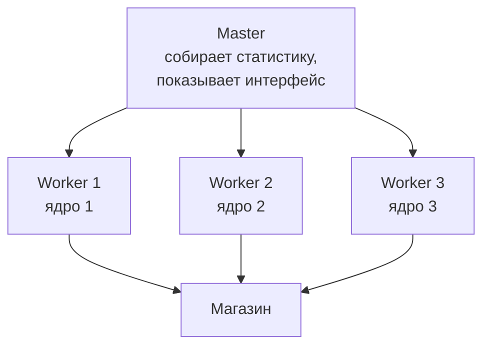
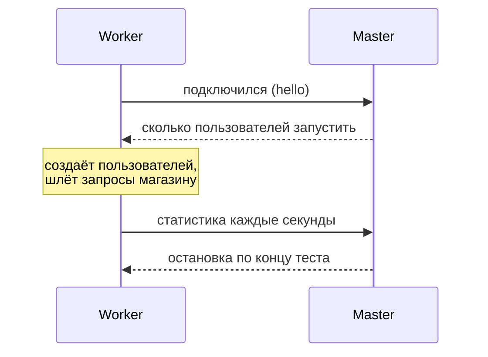

## Зачем это нужно

Ты запускаешь тест, поднимаешь число пользователей, и RPS перестаёт расти, а задержки ползут вверх. Первая мысль: «магазин упёрся в предел». Я много лет читаю такие графики и сразу задаю другой вопрос: а что делает процессор того компьютера, где запущен Locust? Однажды я радостно отчитался, что магазин держит 400 RPS. Коллега посмотрел на мой ноутбук, где процесс Locust сидел на 100%, и сказал: «Ты измерил ноутбук». Если генератор занят на 100%, он не успевает ни слать запросы, ни вовремя читать ответы, и в измеренное время попадает его собственное ожидание. Получаются «задержки магазина», которых магазин не создавал.

Вторая беда тоньше: закрытая модель ([урок 8.2](../08-perf-theory/02-queues-littles-law.md)) прячет самые страшные моменты. Когда магазин зависает на пять секунд, пользователи Locust зависают вместе с ним и не шлют новые запросы. В статистику попадают считанные медленные запросы, а сотни запросов, которые реальные клиенты отправили бы за это время, не появляются вовсе. Это **координированный пропуск** (coordinated omission), и после урока ты будешь его узнавать.

Шаг проекта: ты измеряешь, сколько RPS выдаёт один процесс Locust, запускаешь несколько процессов (один главный и рабочие, подробности в теории), воспроизводишь координированный пропуск на своём стенде и записываешь в паспорт машины, какую нагрузку генератор даёт честно.

## Что нужно знать

- Locustfile, веса, `wait_time`: [урок 9.1](01-first-locustfile.md). Данные из CSV и проверки: [урок 9.3](03-data-checks.md). Запуск без интерфейса, `--csv`, `LoadTestShape`: [урок 9.4](04-headless-shape.md).
- Закрытая и открытая модели, очередь и насыщение: [урок 8.2](../08-perf-theory/02-queues-littles-law.md). Перцентили и «хвост»: [урок 8.1](../08-perf-theory/01-latency-throughput.md).
- Процессы, загрузка CPU, `top`/`htop`: [урок 1.3](../01-linux/03-processes-resources.md). `docker stats`: [урок 5.4](../05-docker/04-limits-stats.md).

## Картина целиком

Допустим, ты проверяешь кассу в магазине, а покупатели это актёры, которых нанял один режиссёр. Он сам выдаёт реплики, смотрит на часы и записывает время обслуживания. Пока актёров десять, всё гладко. Когда их сто, режиссёр не успевает записывать, путается, и по его блокноту выходит, что касса медленная, хотя она справлялась. Выход: нанять помощников, каждый ведёт свою группу актёров, а режиссёр лишь собирает записи. Аналогия ломается тем, что режиссёр выдыхается постепенно, а ядро процесса Locust либо занято, либо нет: плавного перехода нет, ядро либо справляется, либо нет.



Что здесь видно: нагрузку создают воркеры, каждый на своём ядре. Мастер сам запросов не шлёт: он раздаёт воркерам задание, собирает результаты и показывает их в одном интерфейсе. Для тебя тест выглядит как один: общая таблица, общий график.

## Теория

### Почему генератор упирается

Каждый запрос требует работы на стороне клиента: собрать HTTP-запрос, отправить, принять байты, разобрать заголовки, декодировать JSON, прогнать проверки из [урока 9.3](03-data-checks.md), записать время. Простой запрос стоит порядка одной-двух миллисекунд процессорного времени. Процесс использует одно ядро ([урок 9.1](01-first-locustfile.md): гринлеты работают внутри одного процесса), поэтому на бумаге его потолок 500-1000 запросов в секунду (1 секунда ÷ 1-2 мс). Реальный сценарий с проверками и разбором ответов тяжелее, и потолок получается ниже, поэтому в примерах дальше 250-400. У твоей машины он свой, и его надо измерять. Это как кассир: как бы быстро он ни считал, больше определённого числа покупателей в час не обслужит. Заставить его работать вдвое быстрее нельзя, можно поставить второго.

Пока ядро занято на 50-70%, всё хорошо: гринлет, дождавшись ответа, сразу получает управление. Когда загрузка подходит к 100%, ответы ждут очереди на обработку, и измеренное время растёт на это ожидание. Locust сам следит и печатает в консоль:

```text
[2026-10-03 12:30:11,300] laptop/WARNING/root: CPU usage above 90%! This may constrain your throughput and even give inaccurate measurements
```

Увидел это предупреждение, значит, результаты на этом участке ненадёжны. Признаков перегруженного генератора три. Само предупреждение `CPU usage above 90%`. RPS перестал расти при росте числа пользователей, а у магазина процессор ещё свободен (`docker stats`, панель CPU контейнера в Grafana). И задержка в Locust выше серверной на десятки и сотни миллисекунд ([урок 9.1](01-first-locustfile.md), сверка с Grafana).

<div class="viz" data-viz="locust-generator" data-gen="400" data-procs="1" data-server="500"></div>

Что здесь видно: красная линия это то, что показывает Locust, зелёная это то, что видел магазин. Пока генератор справляется, линии идут вместе. У потолка генератора красная улетает вверх, хотя магазин спокоен. Добавь процессов: потолок генератора уходит вправо, и график упирается уже в магазин. Это правильная картина: потолок виден, и он принадлежит магазину.

> **Прикинь сам:** в Locust p95 равен 400 мс, в Grafana p95 того же маршрута 25 мс, процесс `locust` грузит ядро на 100%. Где узкое место?
{: .predict}

В генераторе. Магазин отвечает за 25 мс, а Locust видит 400, потому что ответы ждут очереди в перегруженном процессе. Разница в 375 мс это ожидание клиента, а не работа сервера.

До масштабирования стоит облегчить сценарий. Класс `FastHttpUser` (из `locust.contrib.fasthttp`) использует другой HTTP-клиент, в несколько раз быстрее обычного: меняешь родителя, `class Visitor(FastHttpUser)`, и `self.client.get`, `catch_response`, `name=` остаются, хотя `response.json()` и мелочи чуть отличаются от `requests`. Дальше экономь в задачах: не разбирай весь JSON ради одного поля, не пиши в лог на каждый запрос.

Осторожно: генератор не слабый из-за Python. Потолок это одно ядро и цена клиента на запрос, и лекарство одно для любого инструмента (в k6 и Gatling тоже упираются в ядра).

> **Главное:** генератор упирается в своё ядро раньше, чем магазин, и это видно по предупреждению, застывшему RPS и разнице задержек с Grafana.
{: .key}

Один процесс упёрся в ядро. Как задействовать остальные?

### Несколько процессов: `--processes` и master/worker

Чтобы использовать больше ядер, нужно больше процессов. Locust делит работу между ними, как бригадир между рабочими: один главный (**master**, «хозяин») и несколько рабочих (**worker**, «работник»). Воркеры создают пользователей и шлют запросы, мастер руководит и собирает.

Самый простой способ на одной машине: `--processes`. Locust сам запускает мастера и воркеров:

```bash
locust -f locustfile.py --headless -u 200 -r 20 -t 3m --processes 4
```

Число после `--processes` это количество воркеров, а `--processes -1` значит «по числу ядер». Интерфейс и CSV работают как обычно.

Для нескольких машин (на первой работе это редкость, но пригодится) или ручного контроля используют `--master` и `--worker`. Мастер запускают один раз, воркеры отдельно, на этой же машине или на других, и они подключаются к мастеру по сети (порт 5557 по умолчанию):

```bash
# машина (или терминал) 1: мастер
locust -f locustfile.py --master --headless --expect-workers 2 -u 200 -r 20 -t 3m
# машины 2 и 3: воркеры
locust -f locustfile.py --worker --master-host 192.168.1.10
```

`--master` объявляет мастера, он запросы не шлёт. `--expect-workers 2` значит «не начинай, пока не подключились два воркера»: без него headless-мастер стартует с первым подключившимся. `--worker` объявляет воркера, а `--master-host` называет адрес мастера (по умолчанию `127.0.0.1`, то есть этот же компьютер). Файл сценария должен лежать у каждого воркера и быть одинаковым, версии Locust тоже: мастер рассылает не код, а команды «запусти столько-то пользователей». Порт 5557 мастера должен быть открыт для воркеров. Если воркеры на других машинах стучатся в стенд «Магазин», он должен быть доступен им по сети: по умолчанию порты стенда привязаны к `127.0.0.1` и с другого компьютера не видны. Впиши в `.env` стенда `BIND_ADDR=0.0.0.0` (или адрес его интерфейса), перезапусти `docker compose up -d`, и целью теста делай `--host http://<адрес-стенда>:8000`. Делай это только в доверенной сети: Redis без пароля, а у оплаты открыт `/admin/config` (подробно в [уроке 5.3](../05-docker/03-compose-shop.md)).

Пользователей мастер делит поровну: 200 на 4 воркера это по 50, а скорость запуска 20 в секунду это по 5. Статистику воркеры шлют мастеру несколько раз в секунду, и он складывает её в одну таблицу. Перцентили он не усредняет (среднее перцентилей даёт неверное число). Воркеры присылают, сколько ответов попало в каждое округлённое время (например, «120 мс: 37 штук»), мастер складывает эти счётчики и считает перцентили по общему распределению. Точность у них до округления, для отчёта её хватает.



Что здесь видно: воркер представляется мастеру, получает задание и дальше только отчитывается. Весь трафик к магазину идёт напрямую от воркеров.

> **Прикинь сам:** мастер запущен с `--expect-workers 3`, поднялись два воркера. Что будет?
{: .predict}

Мастер будет ждать третьего: в логе «подключено 2 из 3», тест не начнётся. Это не зависание, а защита: нагрузка не окажется меньше запланированной. Подключи третьего воркера или перезапусти мастера с `--expect-workers 2`.

С данными из урока 9.3 теперь беда. Пользователей раздавал общий `itertools.cycle` внутри одного процесса, а процессов несколько, и каждый прочитает весь `users.csv` с первой строки: два воркера возьмут одни и те же аккаунты. Файл нужно разделить. У каждого воркера есть номер (`worker_index`), и он берёт «свою» часть списка:

```python
import itertools
import logging
import os
from locust import events

@events.test_start.add_listener
def split_accounts(environment, **kwargs):
    global USERS
    index = max(getattr(environment.runner, "worker_index", 0), 0)
    workers = int(os.environ.get("WORKERS", "1"))
    part = len(ACCOUNTS) // workers
    chunk = ACCOUNTS[index * part:(index + 1) * part]
    if not chunk:
        logging.error("Воркер %s: пустая доля аккаунтов, проверь WORKERS (сейчас %s)", index, workers)
        chunk = ACCOUNTS
    USERS = itertools.cycle(chunk)
```

Здесь `ACCOUNTS` и `USERS` те же, что в блоке загрузки данных [урока 9.3](03-data-checks.md): `ACCOUNTS` это список из `load_users()`, а `USERS` мы перекрываем на цикл только по «куску» этого воркера. Номер воркера нужен, чтобы каждый брал свой кусок и аккаунты не пересекались. Номер воркера присылает мастер при подключении, поэтому читать его надо в `test_start`, а не в `init`: там он ещё равен -1. `max(..., 0)` нужен для одиночного запуска, где номера нет. Число воркеров передают переменной окружения: `WORKERS=4 locust ...`. Для тысячи записей и четырёх воркеров каждому достанется по 250. Если `WORKERS` забыли задать, он равен 1, и второй воркер (номер 1) получит пустой кусок: тест идёт, но аккаунты пересекаются. Поэтому строку `Воркер 1: пустая доля аккаунтов` считай ошибкой настройки: задай `WORKERS` и перезапусти.

Осторожно: `--processes 8` на 4-ядерной машине не даст вдвое больше нагрузки. Процессов больше, чем ядер, и они делят ядра. Бери не больше физических ядер и оставляй одно операционной системе, а если на той же машине работает стенд, то и ему.

> **Главное:** на одной машине бери `--processes` по числу свободных ядер, на нескольких `--master` и `--worker`, и не забудь разделить аккаунты между воркерами.
{: .key}

Генератор теперь честный. Но осталась ошибка, которую процессами не починишь.

### Координированный пропуск: самая коварная ошибка

Название длинное, а пример с почтой ниже всё проясняет. Генератор шлёт запросы по очереди: следующий только после ответа на предыдущий. Если сервер завис на пять секунд, генератор висит вместе с ним и не отправляет новые. Запросы, которые должны были уйти за время зависания, пропали: их не было, значит, и задержек у них нет. Статистика видит одну-две медленные записи вместо десятков, и перцентили выглядят нормально.

Представь, что проверяешь почтовое отделение и стоишь в очереди сам: один запрос, ответ, следующий. Окошко закрылось на перерыв на 30 минут. Ты дождался, обслужился и записал: «ожидание 30 минут, один раз». А за эти полчаса подошли бы ещё сорок человек, и каждый простоял бы десятки минут. Твоя запись говорит «один неудачный случай», реальность «сорок пострадавших». Аналогия ломается тем, что настоящие клиенты почты видят друг друга в очереди, а в тесте от них нет и следа.

> **Прикинь сам:** тест на 10 запросов в секунду (10 пользователей с паузой 1 секунда). На 20-й секунде магазин замирает на 5 секунд. Сколько медленных записей получит Locust и сколько их было бы у реальных клиентов?
{: .predict}

Locust получит 10 записей по 5 секунд: все десять пользователей отправили запрос в момент замирания и ждали ответа. За минуту выйдет около 600 запросов, из них 590 быстрых (по 10 мс) и 10 медленных, то есть 1,7%. p50 и p95 по 10 мс, p99 покажет 5 секунд. Хвост выглядит мелким.

А реальные клиенты приходят с постоянной скоростью (это открытая модель): 10 в секунду. За 5 секунд замирания пришло бы 50 клиентов, и каждый ждал бы остаток замирания, от 0 до 5 секунд, в среднем 2,5. Медленных было бы 50 из 600, это 8%. Тогда p95 около 2 секунд, а p99 около 4,6. Locust показал бы p95 10 мс, реальность 2 секунды: разница в 200 раз.

<div class="viz" data-viz="locust-omission" data-rate="10" data-stall="5"></div>

Что здесь видно: синие точки это то, что записал генератор, оранжевые это запросы, которые клиенты отправили бы «по расписанию». Во время остановки сервера у синих пара медленных точек, а у оранжевых целая стена. Перцентили в пояснении у синих почти не изменились, у оранжевых хвост огромный. Убери замирание, и наборы совпадут: проблема живёт только в остановках и тормозах.

Locust сам пропуск не исправляет, у него закрытая модель. Поэтому помни, на какой вопрос она отвечает: «как ведёт себя сервис при N пользователях, которые ждут ответов», а не «при потоке X запросов в секунду». Смотри на Max и метрики сервера: если в Locust Max вдруг 5 секунд, а p99 хороший, остановки были, и надо искать в Grafana провал RPS и рост очереди. Для вопроса про поток («выдержит ли сервис 100 приходов в секунду, как бы он ни тормозил») нужен открытый генератор. Он есть в k6, другом инструменте нагрузки: исполнитель `constant-arrival-rate` ([тема 10](../10-k6/index.md), она дальше по курсу). Locust мы берём для первых тестов потому, что он проще и честно отвечает на вопрос «сколько пользователей выдержит магазин». И не выбирай средний RPS критерием: при зависании он тоже падает, и тест выглядит мягко.

> **Проверь понимание:** магазин завис на 10 секунд. Locust с 20 пользователями показал p99 = 300 мс на всём тесте, но Max = 10 с. Нормален ли p99?

<details markdown="1">
<summary>Ответ</summary>

Для закрытой модели да, но он ничего не доказывает. Остановка дала только 20 медленных записей на тысячи быстрых, и p99 их не замечает. Max в 10 с выдаёт, что остановка была. Реальных клиентов за эти 10 секунд пришло бы гораздо больше, а их ожидания в статистику не попали.

</details>

Осторожно: серверные метрики (Grafana) тоже не всё видят. Они меряют только то, что сервер принял к обработке, а запросы, застрявшие в очереди до приложения, там не видны. Для полной картины сверяют обе стороны и ищут провалы RPS.

> **Главное:** закрытая модель прячет остановки: Locust считает медленными только тех, кто успел отправить запрос, а Max и провал RPS выдают пропуск.
{: .key}

Мы знаем, чего бояться. Остаётся решить, где запускать сам генератор.

### Где и как запускать генератор

Генератор и стенд делят ресурсы: процессор, память, сеть. Если они на одной машине, они отнимают друг у друга процессор, и ты не знаешь, чей это предел. Идеал: генератор на отдельной машине. На учебном стенде, где всё на одном ноутбуке, это невозможно, и надо помнить, что цифры о магазине и Locust взаимно искажены. Для курса это терпимо, для настоящего теста нет.

Расположение должно быть стабильным. Если генератор далеко (другой город или VPN, защищённый канал через интернет), к каждому запросу добавляются десятки миллисекунд сети, и ты меряешь и её, а для сравнения прогонов расположение не должно меняться. Загрузку каждого процесса держи не выше 60-70%: при малейшем всплеске измерения иначе поплывут. На время теста выключи тяжёлые программы и не запускай его от ноутбука на батарее, процессор снижает частоту. На Linux у каждого процесса есть лимит открытых файлов, а каждое соединение считается файлом. Команда `ulimit -n` (она показывает лимиты процессов в текущем окне терминала) выдаст обычно 1024, и тысяча пользователей его исчерпает. Для сессии лимит поднимают: `ulimit -n 10000`.

Главное правило: откалибруй генератор. Перед настоящим тестом выясни потолок одного процесса: бей по самому дешёвому маршруту и смотри, где RPS перестаёт расти. Дальше число процессов считается так: нужный RPS ÷ (0,7 × потолок процесса). Коэффициент 0,7 это запас в 30%: выше 70% загрузки ядро уже плохо переносит всплески, как мы видели выше.

> **Прикинь сам:** потолок одного процесса 250 RPS, нужно 700 RPS, загрузку держим 70%. Сколько процессов?
{: .predict}

Допустимая нагрузка процесса 250 × 0,7 = 175 RPS, значит, 700 ÷ 175 = 4 процесса. Лучше пять, если сценарий может стать тяжелее.

Ещё пример. Потолок на ноутбуке 380 RPS по лёгкому маршруту, а сценарий с проверками и JSON вдвое тяжелее, то есть около 190. Нужно 600 RPS. Один процесс при 70% даёт 130, значит, 600 ÷ 130 ≈ 5 процессов. На 4-ядерном ноутбуке со стендом это невозможно: нужен второй компьютер как воркер или лёгкий `FastHttpUser`.

<div class="viz" data-viz="chart" data-type="line" data-x="1,2,3,4" data-x-label="Процессов Locust (--processes)" data-y-label="Значение" data-explain="Один процесс выдаёт около 370 запросов в секунду и упирается в своё ядро. Второй процесс почти удваивает нагрузку. Третий и четвёртый уже не помогают: теперь предел у магазина (около 720), задержка растёт." data-series='[{"name":"RPS","values":[370,680,715,720],"unit":"RPS"},{"name":"p95 в Locust, мс","values":[38,41,95,140],"unit":"мс"}]'></div>

Что здесь видно: добавлять процессы полезно, пока их нехватка ограничивает RPS. Когда RPS перестал расти, а задержка пошла вверх, предел перешёл к магазину, и тест измеряет уже его, а не генератор.

Осторожно: «на облачной машине много ядер, значит можно всё» неверно. Смотри на фактическую загрузку процессов, а не на число ядер в характеристиках.

> **Главное:** сначала измерь потолок одного процесса, потом считай процессы с запасом 30%, и держи генератор подальше от стенда.
{: .key}

Вернёмся к распродаже: теперь, когда в тесте RPS перестаёт расти, ты можешь честно сказать менеджеру, чей это предел. Либо магазина, и тогда это результат, либо твоего ноутбука, и тогда добавляем процессов и повторяем.

## Практика

### 1. Два вспомогательных сценария

В `~/perf-lab/09-locust/` создай два маленьких файла. `ping.py` бьёт по самому дешёвому маршруту без пауз: это потолок генератора.

```python
"""ping.py: потолок генератора. Без пауз, самый лёгкий маршрут."""
from locust import HttpUser, constant, task


class Ping(HttpUser):
    host = "http://localhost:8000"
    wait_time = constant(0)

    @task
    def healthz(self):
        self.client.get("/healthz")
```

`steady.py` держит ровную нагрузку: 10 пользователей, пауза ровно 1 секунда, один маршрут. Нужен для опыта с координированным пропуском.

```python
"""steady.py: 10 пользователей, пауза 1 секунда, карточка товара."""
import random

from locust import HttpUser, constant, task


class Steady(HttpUser):
    host = "http://localhost:8000"
    wait_time = constant(1)

    @task
    def product(self):
        self.client.get(f"/api/products/{random.randint(1, 10000)}", name="/api/products/[id]")
```

`constant(0)` это пауза ноль: пользователь шлёт запрос сразу после ответа. Для `/healthz` магазин не обращается к базе, это самый дешёвый запрос.

### 2. Измерь потолок одного процесса

Запусти стенд, затем в двух терминалах. В первом тест:

```bash
cd ~/perf-lab/09-locust
locust -f ping.py --headless -u 100 -r 100 -t 60s --csv ../results/$(date +%F)-ping1 --only-summary
```

Во втором смотри загрузку процессов:

```bash
top -b -n 1 -o %CPU | head -15
docker stats --no-stream
```

`top -b -n 1` печатает один снимок и выходит, `-o %CPU` сортирует по загрузке процессора. `docker stats --no-stream` показывает загрузку контейнеров.

```text
  PID USER   PR NI    VIRT    RES    SHR S  %CPU  %MEM     TIME+ COMMAND
 8412 student 20  0  612340  71204  18120 R  99.7   0.4   0:58.12 locust
 7301 student 20  0 1208800 160420  22300 S  71.0   0.9   2:10.41 uvicorn
```

```text
CONTAINER   NAME           CPU %     MEM USAGE / LIMIT
a1b2c3d4e5  shop-shop-1    68.20%    190MiB / 7.6GiB
```

**Как читать вывод.** Смотри, у кого процессор упёрся в потолок. `locust` на 99,7% значит, что генератор насыщен, `uvicorn` или контейнер `shop` на 71% значит, что у магазина ещё есть запас. В консоли Locust появится предупреждение о 90% CPU. Итоговый RPS записан в `_stats.csv`: возьми его как потолок одного процесса. Например, 370 RPS.

Если на твоём компьютере упёрся магазин (контейнер `shop` около 100%), а `locust` нет, значит, твой процесс сильнее магазина: тогда ты уже нашёл потолок магазина по лёгкому маршруту, и генератор не помеха. Запиши это.

**Типичные ошибки:**
- `Address already in use` на порту 8089: на этом порту уже работает другой Locust (без `--headless`). Найди и останови: `pkill -f locust` и повтори.
- `top: invalid option`: на Mac `top -b` нет, используй `top -l 1 -o cpu | head -15`.

### 3. Добавь процессов

```bash
locust -f ping.py --headless -u 100 -r 100 -t 60s --processes 2 --csv ../results/$(date +%F)-ping2 --only-summary
locust -f ping.py --headless -u 100 -r 100 -t 60s --processes 4 --csv ../results/$(date +%F)-ping4 --only-summary
```

Каждый раз записывай RPS и p95 из итоговой таблицы и смотри `docker stats`. Ожидаемая картина: RPS вырастет примерно вдвое при двух процессах, потом упрётся в магазин. Сделай таблицу в `~/perf-lab/09-locust/notes.md`:

| Процессов | RPS | p95, мс | CPU shop, % | Вывод |
|---|---|---|---|---|
| 1 | | | | |
| 2 | | | | |
| 4 | | | | |

И запиши одну строку в паспорт машины `~/perf-lab/machine.md`: «Locust: потолок одного процесса N RPS по /healthz, процессов не больше K». Эти числа понадобятся в [уроке 11.1](../11-bottlenecks/01-method.md), когда придётся решать, чей предел ты видишь.

**Типичные ошибки:**
- RPS не вырос при двух процессах: магазин уже упёрся (контейнер около 100% CPU): это результат, а не ошибка.
- `--processes` не принимается: старая версия Locust. Проверь `locust --version`: нужна 2.46.

### 4. Ручной режим master/worker

Открой три терминала и в каждом активируй окружение (`source ~/perf-lab/.venv/bin/activate`, `cd ~/perf-lab/09-locust`). Мастер:

```bash
locust -f locustfile.py --master --headless --expect-workers 2 -u 44 -r 3 -t 2m --csv ../results/$(date +%F)-master
```

В двух других терминалах по воркеру:

```bash
locust -f locustfile.py --worker
```

В мастере увидишь:

```text
[2026-10-03 12:40:01,100] laptop/INFO/locust.main: Starting Locust 2.46.6
[2026-10-03 12:40:01,101] laptop/INFO/locust.runners: Waiting for workers to be ready, 0 of 2 connected
[2026-10-03 12:40:07,310] laptop/INFO/locust.runners: Worker laptop_a1b2 (index 0) reported as ready. 1 workers connected.
[2026-10-03 12:40:09,455] laptop/INFO/locust.runners: Worker laptop_c3d4 (index 1) reported as ready. 2 workers connected.
[2026-10-03 12:40:09,456] laptop/INFO/locust.runners: The last worker required reported ready.
```

**Как читать вывод:** `index 0` и `index 1` это номера, которые видит `worker_index` из раздела про данные. Тест начался, когда подключились оба. Попробуй запустить только одного воркера и убедиться, что мастер ждёт: вернёшься к этому в разделе «Сломай и почини».

Теперь добавь в locustfile блок разделения данных из теории (`ACCOUNTS` и `USERS` у тебя уже есть из урока 9.3). Проверь работу: `WORKERS=2 locust -f locustfile.py --worker` в обоих терминалах. На вкладке Failures не должно быть конфликтов по заказам.

> Мастер ждёт воркеров или воркер не подключается, а в «Типичных ошибках» этого нет? Скопируй команды всех трёх терминалов и последние строки логов, спроси нейросеть, на каком шаге разошлись. Ответ проверь так: в логе мастера должно быть `Worker ... reported as ready`, число воркеров равно `--expect-workers`.
{: .ai}

### 5. Воспроизведи координированный пропуск

В первом терминале запусти ровную нагрузку на минуту:

```bash
cd ~/perf-lab/09-locust
locust -f steady.py --headless -u 10 -r 10 -t 60s --csv ../results/$(date +%F)-omission --only-summary
```

Во втором терминале, на 20-й секунде после старта, останови магазин на 5 секунд:

```bash
cd ~/load-tester/project/shop && docker compose pause shop && sleep 5 && docker compose unpause shop
```

`docker compose pause` замораживает процессы контейнера: они не завершаются, но и не работают, запросы зависают. `unpause` размораживает. Это имитация пятисекундной остановки магазина (например, из-за сборки мусора или перегрузки базы).

Посмотри итог. Ожидаемая картина (числа ориентировочные):

```text
Type     Name                   # reqs      # fails |    Avg    Min    Max    Med |   req/s
GET      /api/products/[id]        596     0(0.00%) |     64      3   5035      6 |    9.9

Response time percentiles (approximated)
 Type     Name        50%    66%    75%    80%    90%    95%    98%    99%  99.9% 99.99%   100% # reqs
 GET      /api/p...     6      7      8      8     10     14     20   5000   5000   5000   5000    596
```

Теперь сравни с честным расчётом. За 5 секунд замирания при постоянных 10 клиентах в секунду пришло бы 50 запросов, каждый ждал бы от 0 до 5 секунд. Они составили бы около 8% всех запросов, и честные перцентили были бы: p95 около 2 с, p99 около 4,6 с.

**Как читать вывод:** Locust показал p95 = 14 мс (в таблице 5000 появляется только в колонке 99%: 10 из 596 запросов, около 1,7%, были медленными, а это меньше 2%, поэтому p98 ещё быстрый). Средний ответ 64 мс выглядит почти нормально, при этом Max 5035 мс выдаёт остановку. Честная оценка p95 в 150 раз хуже. Разница вызвана тем, что 10 пользователей Locust на время замирания просто перестали посылать запросы. Открой Grafana: провал RPS на графике в эти секунды показывает то, чего нет в перцентилях.

Лекарства Locust сам не даёт: он замеряет время от отправки запроса, а пауза пользователя скрывает очередь, которая накопилась бы у настоящих клиентов. Для честных хвостов бери открытую модель, где новые запросы приходят по расписанию независимо от ответов: в k6 это `constant-arrival-rate`, [урок 10.2](../10-k6/02-scenarios-thresholds.md).

### 6. Зафиксируй

```bash
cd ~/perf-lab && git add 09-locust results machine.md && git commit -m "9.5: потолок генератора, распределённый запуск, пропуск" && git push
```

## Сломай и почини

**Поломка A. Генератор раньше магазина.** Запусти `locust -f locustfile.py --headless -u 600 -r 50 -t 90s` одним процессом и одновременно посмотри в Grafana на CPU контейнера `shop` и на график RPS.

**Что ожидать.** В консоли Locust предупреждение о загрузке CPU выше 90%. На графике RPS Locust выходит на плато, а CPU `shop` ниже 100%. p95 в Locust заметно выше, чем в Grafana по тем же маршрутам. Генератор мешает тесту.

**Диагностика.**

<div class="viz" data-viz="flow" data-steps='[{"title":"Читай консоль Locust","text":"Предупреждение `CPU usage above 90%` значит, что измерениям нельзя верить."},{"title":"Сравни загрузку","text":"`top` для процесса `locust` против `docker stats` для контейнера `shop`: у кого 100%?"},{"title":"Сравни задержки","text":"p95 в Locust против p95 в Grafana по тому же маршруту: большая разница значит очередь у клиента."},{"title":"Облегчи или умножь","text":"Лёгкий сценарий (`FastHttpUser`) или `--processes N`."},{"title":"Повтори и проверь","text":"Предупреждения нет, разница p95 в единицы миллисекунд."}]'></div>

Прежде чем объявлять предел магазина, исключи генератор по трём признакам. Перезапусти с `--processes 3`: предупреждение исчезнет, а RPS вырастет, пока не упрётся уже в магазин.

**Поломка B. Мастер ждёт воркера, которого нет.** Запусти мастер с `--expect-workers 3`, воркеров подними только двух.

**Что ожидать.** В логе мастера «Waiting for workers to be ready, 2 of 3 connected», тест не стартует, интерфейс (если не `--headless`) показывает два воркера. Терминал выглядит зависшим.

**Починка.** Подключи третьего воркера или перезапусти мастер с `--expect-workers 2`. Урок: мастер ждёт столько воркеров, сколько ты обещал, и это защита от неполной нагрузки.

> Сначала пройди диагностику из схемы сам: консоль, `top`, `docker stats`, сравнение p95. Потом спроси нейросеть, согласна ли она с твоим выводом, и сверь ответ с повторным запуском с `--processes 3`.
{: .ai}

## ИИ в помощь

Нейросеть помогает читать загрузку процессов и считать число процессов под цель, но числа твоей машины она знать не может. Общие правила: [ИИ-помощник](../ai.md).

**Задача:** понять, кто упёрся, генератор или магазин.

```text
Я нагружаю свой локальный стенд «Магазин» (FastAPI, порт 8000) через Locust 2.46, один процесс,
100 пользователей, сценарий бьёт в /healthz без пауз. Ubuntu 24.04.
Вывод top во время теста: <вставь top -b -n 1 | head -15>
Вывод docker stats --no-stream: <вставь вывод>
Строка итога Locust: <вставь строку Aggregated>
Объясни по каждой строке: кто упёрся в процессор, генератор или магазин, и что мне делать дальше.
Не придумывай числа, которых нет в выводе.
```
{: .wrap}

**Проверь ответ:** вывод должен опираться на колонку `%CPU` процесса `locust` и контейнера `shop`; повтори тест с `--processes 2` и посмотри, вырос ли RPS. Типичная ошибка: нейросеть советует `top -b` на Mac (там `top -l 1`) или говорит «всё хорошо», не заметив предупреждения Locust о загрузке CPU выше 90%.

**Задача:** разделить тестовых пользователей между воркерами.

```text
Locust 2.46, режим master/worker, два воркера на одной машине. У меня список из 1000 аккаунтов
user0001@shop.lab ... user1000@shop.lab. Нужно, чтобы воркеры не брали одни и те же аккаунты.
Покажи способ через переменную окружения WORKERS и индекс воркера (environment.runner.worker_index)
и объясни, как узнать индекс и когда он становится известен. Предупреди, что может пойти не так.
```
{: .wrap}

**Проверь ответ:** запусти мастер с `--expect-workers 2` и двумя воркерами, выведи в лог индекс и первый аккаунт каждого воркера: аккаунты не должны пересекаться. Типичные ошибки: обращение к `worker_index` у одиночного процесса (там его нет), устаревшие флаги вроде `--slaves` вместо `--worker`, и `--master-host` на мастере вместо воркера.

**Задача:** объяснить координированный пропуск своими словами.

```text
Я прогнал Locust: 10 пользователей, пауза 1 секунда, и на 20-й секунде остановил магазин на 5 секунд.
Locust показал p95 = 14 мс, Max = 5035 мс. Объясни простыми словами, почему p95 такой маленький,
что на самом деле почувствовали бы 10 живых пользователей и как посчитать честные перцентили.
Ответ с примером чисел, без формул.
```
{: .wrap}

**Проверь ответ:** сверь расчёт с уроком: за 5 секунд замирания при 10 запросах в секунду набегает около 50 «потерянных» запросов, это около 8% всех. Типичная ошибка нейросетей: уверенно сказать, что Locust сам исправляет координированный пропуск (не исправляет) или перепутать его с обычной перегрузкой.

Адреса настоящих серверов и содержимое `.env` в чат не вставляй: замени на `10.0.0.X` и `<PASSWORD>`.

## Словарик урока

| Термин | Простыми словами |
|---|---|
| Генератор нагрузки | Программа и машина, которые создают запросы к системе (здесь Locust) |
| Насыщение генератора | Состояние, когда процессор генератора занят на 100% и он не успевает вести тест |
| Master | Главный процесс Locust: раздаёт задания и собирает статистику, запросов не шлёт |
| Worker | Рабочий процесс Locust: создаёт пользователей и шлёт запросы |
| `--processes N` | Запустить N воркеров и мастер на одной машине |
| `--expect-workers` | Сколько воркеров ждать, прежде чем начать тест |
| `FastHttpUser` | Облегчённый пользователь с быстрым HTTP-клиентом для высоких нагрузок |
| Координированный пропуск | Искажение, при котором генератор из-за зависания сервера не отправляет запросы и не видит часть задержек |
| Открытая модель | Запросы приходят с заданной скоростью независимо от ответов |
| Закрытая модель | Новый запрос идёт только после ответа на предыдущий |
| `ulimit -n` | Предел открытых файлов (и соединений) для процесса |
| Калибровка генератора | Измерение потолка одного процесса до настоящего теста |

## Вопросы с собеседований

Раздел для повторения: ответь вслух, потом открой ответ. Вопросы `[на скорость]` тренируй на время.

### 1. [junior] [часто] Как понять, что тормозит генератор, а не сервис?

<details markdown="1">
<summary>Ответ</summary>

Три признака: предупреждение Locust о загрузке CPU выше 90%; RPS перестаёт расти при росте пользователей, а у сервиса процессор ещё свободен; задержка в Locust заметно выше серверной (Grafana) по тому же маршруту. Проверяют загрузку процесса генератора командой `top` и контейнера сервиса через `docker stats`.

**Что хотят услышать:** сравнить две стороны: клиент и сервер, проверить CPU обоих.

**Красный флаг:** «если RPS не растёт, значит, сервер упёрся».

</details>

### 2. [junior] [часто] Как масштабировать Locust на несколько ядер и несколько машин?

<details markdown="1">
<summary>Ответ</summary>

На одной машине `--processes N` запускает N воркеров и мастер. На нескольких запускают мастер (`--master`) и воркеры (`--worker --master-host=адрес`) на других машинах. Один процесс использует одно ядро. Файл сценария должен быть у каждого воркера, версии Locust должны совпадать.

**Что хотят услышать:** master/worker, `--processes`, одно ядро на процесс.

**Красный флаг:** «потоков нужно больше».

</details>

### 3. [junior] Что делает мастер в распределённом Locust?

<details markdown="1">
<summary>Ответ</summary>

Раздаёт воркерам задание (сколько пользователей запустить и с какой скоростью), собирает от них статистику и показывает общую таблицу и интерфейс. Запросов к целевой системе он сам не шлёт, нагрузку создают воркеры.

**Что хотят услышать:** координатор, статистика, нагрузки не создаёт.

**Красный флаг:** «мастер тоже создаёт пользователей».

</details>

### 4. [middle] [часто] Что такое координированный пропуск и почему оно опасно?

<details markdown="1">
<summary>Ответ</summary>

Закрытый генератор не отправляет новый запрос, пока не получен ответ на предыдущий. Когда сервис замирает, генератор замирает вместе с ним и не отправляет запросы, которые реальные клиенты отправили бы за это время. Медленных запросов попадает в статистику мало, перцентили выглядят хорошими, хотя пострадало много людей. Опасность в том, что тест показывает «всё нормально» при реальном провале.

**Что хотят услышать:** пример с остановкой, закрытая против открытой модели, признак: Max в статистике намного выше p99.

**Красный флаг:** «серверные метрики тоже так считают, значит, это проблема тестировщика».

</details>

### 5. [middle] Как бороться с координированным пропуском?

<details markdown="1">
<summary>Ответ</summary>

Для вопросов про поток запросов применять открытую модель: инструмент, который шлёт запросы по расписанию независимо от ответов (k6 `constant-arrival-rate`). В закрытой модели смотреть Max и провалы RPS в метриках сервиса, считать критерии с учётом этого и не полагаться на p99. Сверять клиентскую и серверную картины.

**Что хотят услышать:** открытая модель, провалы RPS, Max.

**Красный флаг:** «увеличить число пользователей».

</details>

### 6. [middle] Почему нельзя запускать генератор и тестируемый сервис на одной машине?

<details markdown="1">
<summary>Ответ</summary>

Они делят процессор, память и сеть: один отнимает ресурсы у другого, и непонятно, чей предел ты измерил. Для учебных стендов это допустимо с оговоркой, для реальных испытаний генератор выносят на отдельную машину в той же сети, чтобы расстояние не добавляло задержку.

**Что хотят услышать:** взаимное влияние, отдельная машина, близко по сети.

**Красный флаг:** «ноутбук мощный, ему всё равно».

</details>

### 7. [middle] Как рассчитать, сколько процессов генератора нужно?

<details markdown="1">
<summary>Ответ</summary>

Откалибровать потолок одного процесса на своём сценарии, взять 60-70% от него как рабочую нагрузку и поделить нужный RPS. Пример: потолок 250 RPS, нужно 700, рабочая нагрузка процесса 175, значит, 4 процесса (лучше 5 с запасом). Число процессов не больше числа свободных ядер.

**Что хотят услышать:** калибровка, запас, ограничение ядрами.

**Красный флаг:** «берём побольше процессов, чем ядер, чтобы наверняка».

</details>

### 8. [middle] Как в распределённом режиме не дать воркерам взять одни и те же тестовые аккаунты?

<details markdown="1">
<summary>Ответ</summary>

Каждый воркер знает свой номер (`worker_index`), и по нему берёт свою часть списка, например `ACCOUNTS[index * part:(index + 1) * part]`. Число воркеров передают через параметр или переменную окружения. Так аккаунты не пересекаются, и корзины и заказы разных воркеров не мешают друг другу.

**Что хотят услышать:** номер воркера, разделение данных.

**Красный флаг:** «пусть все берут из одного файла с начала».

</details>

### 9. [middle] Какие ограничения операционной системы часто упираются на нагрузке?

<details markdown="1">
<summary>Ответ</summary>

Лимит открытых файлов (`ulimit -n`, каждое соединение это файл): по умолчанию иногда 1024, не хватает на тысячи пользователей. Предел временных портов при очень большом числе соединений с одного адреса. Ядра и частота процессора (энергосбережение на ноутбуке). Лечат подъёмом лимитов, питанием от сети и отдельной мощной машиной.

**Что хотят услышать:** `ulimit -n`, порты, процессор.

**Красный флаг:** «ОС ограничений не имеет».

</details>

### 10. [middle] Когда нужен `FastHttpUser` и что он меняет?

<details markdown="1">
<summary>Ответ</summary>

`FastHttpUser` из `locust.contrib.fasthttp` использует более быстрый HTTP-клиент (`geventhttpclient`) вместо `requests`. Он нужен, когда один процесс упирается в ядро генератора (предупреждение о CPU выше 90%, RPS не растёт, а сервер свободен): один процесс отправит в несколько раз больше запросов. Сценарий почти тот же: `self.client.get`, `catch_response`, `name=`. Отличается разбор ответа (`response.json()`, детали заголовков), поэтому после замены проверь сценарий на 1 пользователе. Он не заменяет `--processes`: когда ядро одно, всё равно нужны несколько процессов.

**Что хотят услышать:** узкое место в клиенте, а не в сервере; та же работа с меньшим числом ядер; оговорка о различиях в API.

**Красный флаг:** «быстрый клиент ускоряет сервис» или «ставят всегда, по умолчанию».

</details>

### 11. [junior] [на скорость] Сколько ядер использует один процесс Locust?

<details markdown="1">
<summary>Ответ</summary>

Одно. Для большей нагрузки нужны несколько процессов (`--processes`) или машин.

</details>

### 12. [junior] [на скорость] Какой флаг делает мастер ждущим двух воркеров?

<details markdown="1">
<summary>Ответ</summary>

`--expect-workers 2`.

</details>

## Проверено на версиях

Ubuntu 24.04, Python 3.12, Locust 2.46.6 (gevent, `--processes`, `FastHttpUser`), стенд «Магазин» из `project/shop`, Docker Compose 5.x, Prometheus 3.15, Grafana 13.2. Октябрь 2026. Цифры потолков зависят от машины: у тебя будут свои.

## Итог урока: ты умеешь

- [ ] Назвать три признака перегруженного генератора и отличить его предел от предела магазина.
- [ ] Спросить нейросеть про загрузку генератора, приложив `top` и `docker stats`, и проверить ответ повторным запуском.
- [ ] Измерить потолок одного процесса Locust по лёгкому маршруту.
- [ ] Запустить несколько процессов (`--processes`) и собрать мастер с воркерами вручную.
- [ ] Разделить тестовые данные между воркерами.
- [ ] Объяснить координированный пропуск и воспроизвести его на стенде.
- [ ] Выбрать открытый генератор там, где нужен постоянный поток запросов.
- [ ] Рассчитать число процессов по цели RPS и записать потолок в паспорт машины.

Тема 9 закончена: ты умеешь писать сценарий на Locust, запускать его без интерфейса, задавать форму нагрузки и понимать, когда числам можно верить. Дальше: [тема 10, k6](../10-k6/index.md): тот же магазин, другой инструмент, и настоящая открытая модель нагрузки.
