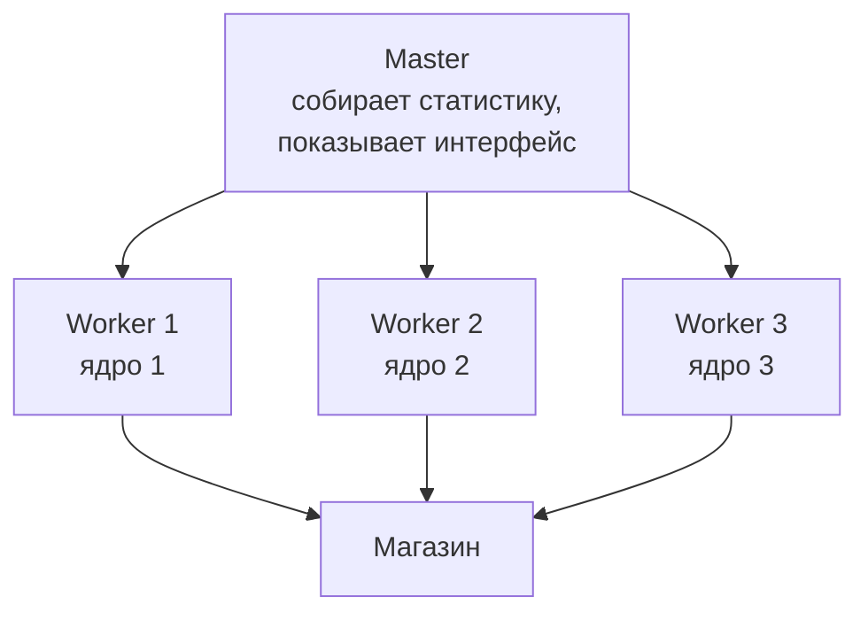
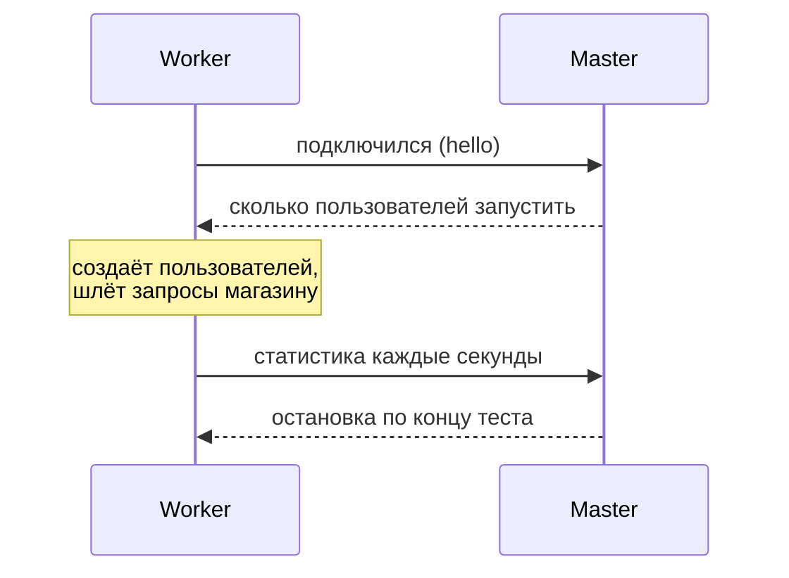

## Зачем это нужно

Ты запускаешь тест, поднимаешь число пользователей, и RPS перестаёт расти. Задержки ползут вверх. Первая мысль: «магазин упёрся в предел». Но предел может быть совсем в другом месте: в твоём собственном компьютере. Если процессор, на котором работает Locust, занят на 100%, он не успевает ни отправлять запросы, ни вовремя читать ответы. Измеряемое время включает ожидание самого генератора, и ты получаешь «задержки магазина», которых магазин не создавал. Отчёт, построенный на таких числах, неправильный, а вывод «магазин выдерживает 400 RPS» может оказаться выводом «мой ноутбук выдерживает 400 RPS».

Вторая беда тоньше: закрытая модель ([урок 8.2](../08-perf-theory/02-queues-littles-law.md)) прячет самые страшные моменты. Когда магазин зависает на пять секунд, виртуальные пользователи Locust тоже зависают вместе с ним и не отправляют новые запросы. В статистику попадают считанные медленные запросы, а сотни запросов, которые реальные клиенты отправили бы за это время, не появляются вовсе. Это называется **координированным пропуском** (coordinated omission), и после этого урока ты будешь его узнавать.

Шаг проекта: ты измеряешь, сколько RPS выдаёт один процесс Locust, учишься запускать несколько процессов и режим master/worker, воспроизводишь координированный пропуск на своём стенде и записываешь в паспорт машины, какую нагрузку генератор даёт честно.

## Что нужно знать

- Locustfile, веса, `wait_time`: [урок 9.1](01-first-locustfile.md). Данные из CSV и проверки: [урок 9.3](03-data-checks.md). Запуск без интерфейса, `--csv`, `LoadTestShape`: [урок 9.4](04-headless-shape.md).
- Закрытая и открытая модели, очередь и насыщение: [урок 8.2](../08-perf-theory/02-queues-littles-law.md). Перцентили и «хвост»: [урок 8.1](../08-perf-theory/01-latency-throughput.md).
- Процессы, загрузка CPU, `top`/`htop`: [урок 1.3](../01-linux/03-processes-resources.md). `docker stats`: [урок 5.4](../05-docker/04-limits-stats.md).

## Картина целиком

Представь, что ты проверяешь пропускную способность кассы в магазине, а покупатели это актёры, которых нанял один режиссёр. Режиссёр один и ему всё надо делать самому: выдавать реплики, смотреть на часы, записывать время обслуживания. Пока актёров десять, всё идёт гладко. Когда их сто, режиссёр не успевает записывать, начинает путаться в записях, и по его блокноту получается, что касса работает медленно, хотя касса справлялась. Выход: нанять помощников, каждый ведёт свою группу актёров, а режиссёр лишь собирает записи. Аналогия ломается тем, что у режиссёра кончаются силы постепенно, а у процесса Locust ядро занято либо нет: насыщение наступает как порог.



Что здесь видно: нагрузку создают воркеры, каждый на своём ядре. Мастер сам запросов не шлёт: он раздаёт воркерам задание (сколько пользователей запустить), собирает от них результаты и показывает их в одном интерфейсе. Для тебя тест выглядит как один: общая таблица, общий график.

## Теория

### Почему генератор вообще упирается

**Зачем это существует.** Каждый запрос требует работы на стороне клиента: собрать HTTP-запрос, отправить, принять байты, разобрать заголовки, декодировать JSON, прогнать проверки из урока 9.3, записать время в статистику. Эта работа занимает процессорное время: порядка одной-двух миллисекунд на запрос для обычного клиента на `requests`. Один процесс может использовать только одно ядро ([урок 9.1](01-first-locustfile.md): гринлеты работают внутри одного процесса), поэтому его потолок примерно 300-800 запросов в секунду, в зависимости от машины и сложности сценария.

**Аналогия.** Один кассир, как бы быстро он ни считал, обслужит не более определённого числа покупателей в час. Заставить его работать вдвое быстрее нельзя, можно поставить второго кассира.

**Как это устроено.** Вся нагрузка идёт через один процесс, пока ты не попросишь иначе. Загрузка его ядра растёт вместе с RPS. Пока ядро занято на 50-70%, всё хорошо: гринлет, дождавшись ответа, сразу получает управление. Когда загрузка подходит к 100%, ответы начинают ждать своей очереди на обработку, и измеренное время вырастает на это ожидание. Locust сам следит за этим и печатает в консоль предупреждение:

```text
[2026-10-03 12:30:11,300] laptop/WARNING/root: CPU usage above 90%! This may constrain your throughput and even give inaccurate measurements
```

Если ты видишь это предупреждение, результаты теста на этом участке ненадёжны. Запомни три признака перегруженного генератора:

1. **Предупреждение** `CPU usage above 90%`.
2. **RPS перестал расти** при росте числа пользователей, а у магазина процессор ещё свободен (`docker stats`, Grafana, панель CPU контейнера).
3. **Задержка в Locust выше, чем на сервере** на десятки и сотни миллисекунд ([урок 9.1](01-first-locustfile.md), раздел про сверку с Grafana).

<div class="viz" data-viz="locust-generator" data-gen="400" data-procs="1" data-server="500"></div>

Что здесь видно: красная линия это то, что показывает Locust, зелёная это то, что на самом деле видел магазин. Пока генератор справляется, линии идут вместе. Когда нагрузка подходит к потолку генератора, красная улетает вверх, хотя магазин ещё спокоен (зелёная ровная). Добавь процессов: потолок генератора сдвигается вправо, а потом график упирается уже в магазин. Это и есть правильная картина: потолок виден, и он принадлежит магазину.

**Как сделать клиента дешевле.** До масштабирования стоит облегчить сам сценарий:

- **Класс `FastHttpUser`** (из `locust.contrib.fasthttp`) использует другой HTTP-клиент (`geventhttpclient`), в несколько раз быстрее обычного. Подставляется заменой родителя: `class Visitor(FastHttpUser)`. У него те же `self.client.get`, `catch_response`, `name=`, но `response.json()` и некоторые детали чуть отличаются от `requests`. Его применяют, когда один процесс не вытягивает нужный RPS.
- **Минимум работы в задачах:** не разбирай JSON целиком, если нужно одно поле, не пиши в лог на каждый запрос, не считай ничего тяжёлого.
- **Меньше проверок на горячем пути**, чем нужно только для диагностики.

**Что путают.** Что генератор «слабый» из-за Python. Python здесь ни при чём: потолок это одно ядро и цена клиента на запрос, а лекарство одинаково для любого инструмента (в k6 и Gatling тоже упираются в ядра).

> **Проверь понимание:** в Locust p95 равен 400 мс, в Grafana p95 того же маршрута 25 мс, на ноутбуке процесс `locust` загружает ядро на 100%. Где узкое место?

<details markdown="1">
<summary>Ответ</summary>

В генераторе. Магазин отвечает за 25 мс, а Locust видит 400 мс, потому что ответы ждут своей очереди в перегруженном процессе. Разница в 375 мс это ожидание клиента, а не работа сервера. Нужно добавить процессов или удешевить сценарий и повторить измерение.

</details>

### Несколько процессов: `--processes` и master/worker

**Зачем это существует.** Чтобы использовать больше ядер, нужно больше процессов. Locust умеет делить работу между процессами: один главный (**master**) и несколько рабочих (**worker**). Воркеры создают пользователей и шлют запросы, мастер руководит и собирает.

**Как это устроено.** Есть два способа.

**1. Одна машина, все ядра: `--processes`.** Самый простой. Locust сам запускает мастер и воркеров как дочерние процессы:

```bash
locust -f locustfile.py --headless -u 200 -r 20 -t 3m --processes 4
```

Число после `--processes` это количество воркеров. `--processes -1` значит «по числу ядер». Мастер запускается автоматически, интерфейс и CSV работают как обычно.

**2. Несколько машин или ручной контроль: `--master` и `--worker`.** Мастер запускается один раз, воркеры запускаются отдельно, на этой же машине или на других, и подключаются к мастеру по сети (порт 5557 по умолчанию):

```bash
# машина (или терминал) 1: мастер
locust -f locustfile.py --master --headless --expect-workers 2 -u 200 -r 20 -t 3m
# машины 2 и 3: воркеры
locust -f locustfile.py --worker --master-host 192.168.1.10
```

- `--master` объявляет процесс мастером. Сам он запросы не шлёт.
- `--expect-workers 2` значит «не начинай тест, пока не подключились 2 воркера». Без него headless-мастер стартует с первым подключившимся.
- `--worker` объявляет процесс воркером. Адрес мастера задают `--master-host` (по умолчанию `127.0.0.1`, то есть этот же компьютер).
- **Файл сценария должен быть у каждого воркера** и быть одинаковым: мастер рассылает не код, а команды «запусти столько-то пользователей». Версии Locust тоже должны совпадать.
- Порт 5557 мастера должен быть доступен воркерам по сети, это дело файрвола.

Пользователей мастер делит между воркерами поровну: 200 пользователей на 4 воркера это 50 на каждый. Скорость запуска делится так же (20 в секунду на четверых это по 5). Статистику воркеры отправляют мастеру несколько раз в секунду, он складывает её в единую таблицу, и перцентили получаются общие.



Что здесь видно: воркер сначала представляется мастеру, потом получает задание и дальше только отчитывается. Весь трафик к магазину идёт напрямую от воркеров, мастер в него не вмешивается.

**Данные в распределённом режиме.** В [уроке 9.3](03-data-checks.md) пользователи раздавались через общий `itertools.cycle` внутри одного процесса. Теперь процессов несколько, и каждый прочитает весь `users.csv` и начнёт с первой строки: два воркера возьмут одни и те же аккаунты. Нужно разделить файл между воркерами. Простое решение: у каждого воркера есть номер (`worker_index`), и он начинает со «своей» части списка:

```python
import os
from locust import events

@events.init.add_listener
def split_accounts(environment, **kwargs):
    global USERS
    index = getattr(environment.runner, "worker_index", 0) or 0
    workers = int(os.environ.get("WORKERS", "1"))
    part = len(ACCOUNTS) // workers
    USERS = itertools.cycle(ACCOUNTS[index * part:(index + 1) * part] or ACCOUNTS)
```

Здесь `ACCOUNTS` это список из `load_users()`, а `USERS` перекрыт на цикл по «куску». Номер воркера берётся из `environment.runner.worker_index`, а число воркеров передаётся переменной окружения `WORKERS` (в командной строке: `WORKERS=4 locust ...`). Для тысячи записей и четырёх воркеров каждый получает 250. Условие `or ACCOUNTS` оставляет полный список, если кусок получился пустым (на одиночном запуске).

**Что путают.** Что `--processes 8` на 4-ядерной машине даст в два раза больше нагрузки. Нет: процессов больше, чем ядер, значит они делят ядра, и толку нет. Берут не больше, чем физических ядер, и оставляют ядро операционной системе, а если на той же машине работает стенд, то ещё и ему.

> **Проверь понимание:** запущен мастер с `--expect-workers 3`, поднялись два воркера. Что произойдёт?

<details markdown="1">
<summary>Ответ</summary>

Мастер будет ждать третьего: в логе строки о том, что подключено 2 из 3, а тест не начнётся. Это не зависание, а защита: он не хочет начинать с неполным составом, чтобы нагрузка не оказалась меньше запланированной. Подключи третьего воркера или перезапусти мастер с `--expect-workers 2`.

</details>

### Координированный пропуск: самая коварная ошибка

**Зачем это существует.** Название длинное, а идея простая. Генератор нагрузки отправляет запросы по очереди: следующий только после ответа на предыдущий. Если сервер на пять секунд завис, генератор тоже на пять секунд «завис» вместе с ним: он ждёт и не отправляет новые запросы. Эти запросы, которые **должны были** быть отправлены за время зависания, пропали: их не было, значит, и задержек у них нет. Статистика видит одну-две медленные записи вместо десятков, и перцентили выглядят нормально.

**Аналогия.** Проверяешь работу почтового отделения и стоишь в очереди сам: один запрос, ответ, следующий запрос. Окошко закрылось на перерыв на 30 минут. Ты дождался, обслужился и записал: «ожидание: 30 минут, один раз». А за эти 30 минут к окошку подошли бы ещё сорок человек, и каждый тоже простоял бы десятки минут. Твоя запись говорит «один неудачный случай», реальность «сорок пострадавших». Аналогия ломается тем, что настоящие клиенты почты хотя бы видят друг друга в очереди, а в тесте о них нет никакого следа.

**Как это устроено.** Тест на 10 запросов в секунду (10 пользователей с паузой 1 секунда). На 20-й секунде магазин замирает на 5 секунд, потом оживает. Что запишет Locust:

- 10 пользователей отправили запрос в момент замирания, и каждый ждал около 5 секунд. Итого **10 записей по 5 секунд**.
- После оживления они продолжили как ни в чём не бывало.
- За минуту всего около 600 запросов: 590 быстрых (по 10 мс) и 10 медленных. Доля медленных 1,7%: p95 и p50 в норме (10 мс), p99 покажет 5 секунд. Хвост выглядит мелким.

А **честное** число: реальные клиенты приходят с постоянной скоростью (открытая модель), 10 в секунду. За 5 секунд замирания пришло бы 50 клиентов, и каждый ждал бы остаток замирания: от 0 до 5 секунд, в среднем 2,5. Медленных было бы 50 из 600, это 8%. Тогда p95 около 2 секунд, p99 около 4,6 секунды. Locust показал бы p95 10 мс, реальность 2 секунды: разница в 200 раз.

<div class="viz" data-viz="locust-omission" data-rate="10" data-stall="5"></div>

Что здесь видно: синие точки это то, что записал генератор, оранжевые это запросы, которые клиенты отправили бы «по расписанию». Во время остановки сервера у синих есть пара медленных точек, а у оранжевых целая стена. Сравни перцентили в пояснении: у синих они почти не изменились, у оранжевых хвост огромный. Убери замирание, и два набора совпадут: проблема появляется только при остановках и тормозах.

**Что с этим делать.** Locust сам не исправляет пропуск: у него закрытая модель. Практические правила:

1. **Помни про свойство.** Закрытая модель честно отвечает на вопрос «как ведёт себя сервис при N пользователях, которые ждут ответов», а не на «как ведёт себя сервис при потоке X запросов в секунду».
2. **Смотри на максимум и на метрики сервера.** Если в Locust Max вдруг 5 секунд, а p99 хороший, значит, были остановки, и надо смотреть Grafana (где был провал RPS и рост очереди).
3. **Для вопросов про поток** («выдержит ли сервис 100 приходов в секунду, как бы он ни тормозил») используй открытый генератор: в k6 это исполнитель `constant-arrival-rate` (тема 10), в Gatling открытая нагрузка.
4. **Не выбирай средний RPS как критерий.** Он при зависании тоже падает, и тест выглядит «мягко».

**Что путают.** Что серверные метрики (Grafana) эту проблему не имеют. Они меряют только то, что сервер принял к обработке: запросы, застрявшие в очереди принятия соединений (до приложения), там тоже не видны. Поэтому для полной картины сверяют обе стороны и ищут провалы RPS.

> **Проверь понимание:** магазин завис на 10 секунд. Locust с 20 пользователями показал p99 = 300 мс на всём тесте, но Max = 10 с. Нормален ли p99?

<details markdown="1">
<summary>Ответ</summary>

Для закрытой модели да, но он ничего не доказывает. Остановка дала только 20 медленных записей на тысячи быстрых, и p99 их «не замечает». Max в 10 с выдаёт, что остановка была. Реальных клиентов за эти 10 секунд пришло бы гораздо больше, а их ожидания в статистику не попали.

</details>

### Где и как запускать генератор

**Зачем это существует.** Генератор и стенд делят ресурсы: процессор, память, сеть. Если они на одной машине, они отнимают друг у друга процессор, и ты не знаешь, чей это предел. Правила размещения такие.

**Как это устроено.**

1. **Генератор на отдельной машине** от тестируемой системы. На учебном стенде, где всё на одном ноутбуке, это невозможно, и ты должен помнить: цифры о магазине и Locust взаимно искажены. Для курса это терпимо, для настоящего теста нет.
2. **Рядом по сети.** Если генератор далеко (другой город, VPN), к каждому запросу добавляются десятки миллисекунд сети, и ты меряешь в том числе её. Для сравнения прогонов важно, чтобы расположение не менялось.
3. **Запас по ядрам.** Держи загрузку каждого процесса генератора не выше 60-70%. Больше значит, что при малейшем всплеске измерения поплывут.
4. **Ограничения системы.** На Linux у процесса ограничено число открытых файлов (каждое соединение это файл): команда `ulimit -n` покажет лимит, по умолчанию он часто 1024, а тысяча пользователей с открытыми соединениями его исчерпает. Поднимают для сессии: `ulimit -n 10000`. Ещё есть предел временных портов, но он важен на очень больших нагрузках.
5. **Стабильная среда.** Выключи на время теста тяжёлые программы, браузер с десятью вкладками, обновления. Не запускай тест от ноутбука на батарее: процессор снижает частоту.
6. **Откалибруй генератор.** Перед настоящим тестом выясни, сколько RPS **одного** процесса твоей машины допустимо: бей по самому дешёвому маршруту и смотри потолок. Дальше планируй: нужный RPS ÷ (0,7 × потолок процесса) даёт число процессов.

**Разобранный пример.** Потолок одного процесса на ноутбуке 380 RPS по лёгкому маршруту, а твой сценарий с проверками и JSON вдвое тяжелее: реальный потолок около 190 RPS. Нужно 600 RPS. Один процесс при 70% даёт 130 RPS, значит, нужно 600 ÷ 130 ≈ 5 процессов. На 4-ядерном ноутбуке это уже невозможно (ядро занято и стендом), значит, нужен второй компьютер как воркер или лёгкий `FastHttpUser`.

<div class="viz" data-viz="chart" data-type="line" data-x="1,2,3,4" data-x-label="Процессов Locust (--processes)" data-y-label="Значение" data-explain="Один процесс выдаёт около 370 запросов в секунду и упирается в своё ядро. Второй процесс почти удваивает нагрузку. Третий и четвёртый уже не помогают: теперь предел у магазина (около 720), задержка растёт." data-series='[{"name":"RPS","values":[370,680,715,720],"unit":"RPS"},{"name":"p95 в Locust, мс","values":[38,41,95,140],"unit":"мс"}]'></div>

Что здесь видно: добавлять процессы полезно, пока их нехватка ограничивает RPS. Когда RPS перестал расти, а задержка пошла вверх, предел перешёл к магазину: теперь тест измеряет его, а не генератор.

**Что путают.** Что на облачной машине «много ядер, значит можно всё». Смотри на фактическую загрузку процессов, а не на число ядер в характеристиках.

> **Проверь понимание:** потолок одного процесса 250 RPS, нужно проверить 700 RPS, загрузку держим 70%. Сколько процессов?

<details markdown="1">
<summary>Ответ</summary>

Допустимая нагрузка процесса 250 × 0,7 = 175 RPS. 700 ÷ 175 = 4 процесса. Лучше пять, если сценарий может стать тяжелее.

</details>

## Практика

### 1. Два вспомогательных сценария

В `~/perf-lab/09-locust/` создай два маленьких файла. `ping.py` бьёт по самому дешёвому маршруту без пауз: это потолок генератора.

```python
"""ping.py: потолок генератора. Без пауз, самый лёгкий маршрут."""
from locust import HttpUser, constant, task


class Ping(HttpUser):
    host = "http://localhost:8000"
    wait_time = constant(0)

    @task
    def healthz(self):
        self.client.get("/healthz")
```

`steady.py` держит ровную нагрузку: 10 пользователей, пауза ровно 1 секунда, один маршрут. Нужен для опыта с координированным пропуском.

```python
"""steady.py: 10 пользователей, пауза 1 секунда, карточка товара."""
import random

from locust import HttpUser, constant, task


class Steady(HttpUser):
    host = "http://localhost:8000"
    wait_time = constant(1)

    @task
    def product(self):
        self.client.get(f"/api/products/{random.randint(1, 10000)}", name="/api/products/[id]")
```

`constant(0)` это пауза ноль: пользователь шлёт запрос сразу после ответа. Для `/healthz` магазин не обращается к базе, это самый дешёвый запрос.

### 2. Измерь потолок одного процесса

Запусти стенд, затем в двух терминалах. В первом тест:

```bash
cd ~/perf-lab/09-locust
locust -f ping.py --headless -u 100 -r 100 -t 60s --csv ../results/$(date +%F)-ping1 --only-summary
```

Во втором смотри загрузку процессов:

```bash
top -b -n 1 -o %CPU | head -15
docker stats --no-stream
```

`top -b -n 1` печатает один снимок и выходит, `-o %CPU` сортирует по загрузке процессора. `docker stats --no-stream` показывает загрузку контейнеров.

```text
  PID USER   PR NI    VIRT    RES    SHR S  %CPU  %MEM     TIME+ COMMAND
 8412 student 20  0  612340  71204  18120 R  99.7   0.4   0:58.12 locust
 7301 student 20  0 1208800 160420  22300 S  71.0   0.9   2:10.41 uvicorn
```

```text
CONTAINER   NAME           CPU %     MEM USAGE / LIMIT
a1b2c3d4e5  shop-shop-1    68.20%    190MiB / 7.6GiB
```

**Как читать вывод.** Смотри, у кого процессор упёрся в потолок. `locust` на 99,7% значит, что генератор насыщен, `uvicorn` или контейнер `shop` на 71% значит, что у магазина ещё есть запас. В консоли Locust появится предупреждение о 90% CPU. Итоговый RPS записан в `_stats.csv`: возьми его как потолок одного процесса. Например, 370 RPS.

Если на твоём компьютере упёрся магазин (контейнер `shop` около 100%), а `locust` нет, значит, твой процесс сильнее магазина: тогда ты уже нашёл потолок магазина по лёгкому маршруту, и генератор не помеха. Запиши это.

**Типичные ошибки:**
- `Address already in use` на порту 8089: на этом порту уже работает другой Locust (без `--headless`). Найди и останови: `pkill -f locust` и повтори.
- `top: invalid option`: на Mac `top -b` нет, используй `top -l 1 -o cpu | head -15`.

### 3. Добавь процессов

```bash
locust -f ping.py --headless -u 100 -r 100 -t 60s --processes 2 --csv ../results/$(date +%F)-ping2 --only-summary
locust -f ping.py --headless -u 100 -r 100 -t 60s --processes 4 --csv ../results/$(date +%F)-ping4 --only-summary
```

Каждый раз записывай RPS и p95 из итоговой таблицы и смотри `docker stats`. Ожидаемая картина: RPS вырастет примерно вдвое при двух процессах, потом упрётся в магазин. Сделай таблицу в `~/perf-lab/09-locust/notes.md`:

| Процессов | RPS | p95, мс | CPU shop, % | Вывод |
|---|---|---|---|---|
| 1 | | | | |
| 2 | | | | |
| 4 | | | | |

И запиши одну строку в паспорт машины `~/perf-lab/machine.md`: «Locust: потолок одного процесса N RPS по /healthz, процессов не больше K». Эти числа понадобятся в [уроке 11.1](../11-bottlenecks/01-method.md), когда придётся решать, чей предел ты видишь.

**Типичные ошибки:**
- RPS не вырос при двух процессах: магазин уже упёрся (контейнер около 100% CPU): это результат, а не ошибка.
- `--processes` не принимается: старая версия Locust. Проверь `locust --version`: нужна 2.46.

### 4. Ручной режим master/worker

Открой три терминала и в каждом активируй окружение (`source ~/perf-lab/.venv/bin/activate`, `cd ~/perf-lab/09-locust`). Мастер:

```bash
locust -f locustfile.py --master --headless --expect-workers 2 -u 44 -r 3 -t 2m --csv ../results/$(date +%F)-master
```

В двух других терминалах по воркеру:

```bash
locust -f locustfile.py --worker
```

В мастере увидишь:

```text
[2026-10-03 12:40:01,100] laptop/INFO/locust.main: Starting Locust 2.46.6
[2026-10-03 12:40:01,101] laptop/INFO/locust.runners: Waiting for workers to be ready, 0 of 2 connected
[2026-10-03 12:40:07,310] laptop/INFO/locust.runners: Worker laptop_a1b2 (index 0) reported as ready. 1 workers connected.
[2026-10-03 12:40:09,455] laptop/INFO/locust.runners: Worker laptop_c3d4 (index 1) reported as ready. 2 workers connected.
[2026-10-03 12:40:09,456] laptop/INFO/locust.runners: The last worker required reported ready.
```

**Как читать вывод:** `index 0` и `index 1` это номера, которые видит `worker_index` из раздела про данные. Тест начался, когда подключились оба. Попробуй запустить только одного воркера и убедиться, что мастер ждёт: вернёшься к этому в разделе «Сломай и почини».

Теперь добавь в locustfile блок разделения данных из теории (с `ACCOUNTS` вместо одного списка). Проверь работу: `WORKERS=2 locust -f locustfile.py --worker` в обоих терминалах. На вкладке Failures не должно быть конфликтов по заказам.

### 5. Воспроизведи координированный пропуск

В первом терминале запусти ровную нагрузку на минуту:

```bash
cd ~/perf-lab/09-locust
locust -f steady.py --headless -u 10 -r 10 -t 60s --csv ../results/$(date +%F)-omission --only-summary
```

Во втором терминале, на 20-й секунде после старта, останови магазин на 5 секунд:

```bash
cd ~/load-tester/project/shop && docker compose pause shop && sleep 5 && docker compose unpause shop
```

`docker compose pause` замораживает процессы контейнера: они не завершаются, но и не работают, запросы зависают. `unpause` размораживает. Это имитация пятисекундной остановки магазина (например, из-за сборки мусора или перегрузки базы).

Посмотри итог. Ожидаемая картина (числа ориентировочные):

```text
Type     Name                   # reqs      # fails |    Avg    Min    Max    Med |   req/s
GET      /api/products/[id]        596     0(0.00%) |     64      3   5035      6 |    9.9

Response time percentiles (approximated)
 Type     Name        50%    66%    75%    80%    90%    95%    98%    99%  99.9% 99.99%   100% # reqs
 GET      /api/p...     6      7      8      8     10     14   5000   5000   5000   5000   5000    596
```

Теперь сравни с честным расчётом. За 5 секунд замирания при постоянных 10 клиентах в секунду пришло бы 50 запросов, каждый ждал бы от 0 до 5 секунд. Они составили бы около 8% всех запросов, и честные перцентили были бы: p95 около 2 с, p99 около 4,6 с.

**Как читать вывод:** Locust показал p95 = 14 мс (в таблице 98% уже 5000, потому что 10 из 596 запросов, около 1,7%, были медленными). Средний ответ 64 мс выглядит почти нормально, при этом Max 5035 мс выдаёт остановку. Честная оценка p95 в 150 раз хуже. Разница вызвана тем, что 10 пользователей Locust на время замирания просто перестали посылать запросы. Открой Grafana: провал RPS на графике в эти секунды показывает то, чего нет в перцентилях.

### 6. Зафиксируй

```bash
cd ~/perf-lab && git add 09-locust results machine.md && git commit -m "9.5: потолок генератора, распределённый запуск, пропуск" && git push
```

## Сломай и почини

**Поломка A. Генератор раньше магазина.** Запусти `locust -f locustfile.py --headless -u 600 -r 50 -t 90s` одним процессом и одновременно посмотри в Grafana на CPU контейнера `shop` и на график RPS.

**Что ожидать.** В консоли Locust предупреждение о загрузке CPU выше 90%. На графике RPS Locust выходит на плато, а CPU `shop` ниже 100%. p95 в Locust заметно выше, чем в Grafana по тем же маршрутам. Генератор мешает тесту.

**Диагностика.**

<div class="viz" data-viz="flow" data-steps='[{"title":"Читай консоль Locust","text":"Предупреждение `CPU usage above 90%` значит, что измерениям нельзя верить."},{"title":"Сравни загрузку","text":"`top` для процесса `locust` против `docker stats` для контейнера `shop`: у кого 100%?"},{"title":"Сравни задержки","text":"p95 в Locust против p95 в Grafana по тому же маршруту: большая разница значит очередь у клиента."},{"title":"Облегчи или умножь","text":"Лёгкий сценарий (`FastHttpUser`) или `--processes N`."},{"title":"Повтори и проверь","text":"Предупреждения нет, разница p95 в единицы миллисекунд."}]'></div>

Что здесь видно: прежде чем объявлять предел магазина, исключи генератор по трём признакам. Перезапусти с `--processes 3`: предупреждение исчезнет, а RPS вырастет, пока не упрётся уже в магазин.

**Поломка B. Мастер ждёт воркера, которого нет.** Запусти мастер с `--expect-workers 3`, воркеров подними только двух.

**Что ожидать.** В логе мастера «Waiting for workers to be ready, 2 of 3 connected», тест не стартует, интерфейс (если не `--headless`) показывает два воркера. Терминал выглядит зависшим.

**Починка.** Подключи третьего воркера или перезапусти мастер с `--expect-workers 2`. Урок: мастер ждёт столько воркеров, сколько ты обещал, и это защита от неполной нагрузки.

## Словарик урока

| Термин | Простыми словами |
|---|---|
| Генератор нагрузки | Программа и машина, которые создают запросы к системе (здесь Locust) |
| Насыщение генератора | Состояние, когда процессор генератора занят на 100% и он не успевает вести тест |
| Master | Главный процесс Locust: раздаёт задания и собирает статистику, запросов не шлёт |
| Worker | Рабочий процесс Locust: создаёт пользователей и шлёт запросы |
| `--processes N` | Запустить N воркеров и мастер на одной машине |
| `--expect-workers` | Сколько воркеров ждать, прежде чем начать тест |
| `FastHttpUser` | Облегчённый пользователь с быстрым HTTP-клиентом для высоких нагрузок |
| Координированный пропуск | Искажение, при котором генератор из-за зависания сервера не отправляет запросы и не видит часть задержек |
| Открытая модель | Запросы приходят с заданной скоростью независимо от ответов |
| Закрытая модель | Новый запрос идёт только после ответа на предыдущий |
| `ulimit -n` | Предел открытых файлов (и соединений) для процесса |
| Калибровка генератора | Измерение потолка одного процесса до настоящего теста |

## Вопросы с собеседований

Раздел для повторения: ответь вслух, потом открой ответ. Вопросы `[на скорость]` тренируй на время.

### 1. [junior] [часто] Как понять, что тормозит генератор, а не сервис?

<details markdown="1">
<summary>Ответ</summary>

Три признака: предупреждение Locust о загрузке CPU выше 90%; RPS перестаёт расти при росте пользователей, а у сервиса процессор ещё свободен; задержка в Locust заметно выше серверной (Grafana) по тому же маршруту. Проверяют загрузку процесса генератора командой `top` и контейнера сервиса через `docker stats`.

**Что хотят услышать:** сравнить две стороны: клиент и сервер, проверить CPU обоих.

**Красный флаг:** «если RPS не растёт, значит, сервер упёрся».

</details>

### 2. [junior] [часто] Как масштабировать Locust на несколько ядер и несколько машин?

<details markdown="1">
<summary>Ответ</summary>

На одной машине `--processes N` запускает N воркеров и мастер. На нескольких запускают мастер (`--master`) и воркеры (`--worker --master-host=адрес`) на других машинах. Один процесс использует одно ядро. Файл сценария должен быть у каждого воркера, версии Locust должны совпадать.

**Что хотят услышать:** master/worker, `--processes`, одно ядро на процесс.

**Красный флаг:** «потоков нужно больше».

</details>

### 3. [junior] Что делает мастер в распределённом Locust?

<details markdown="1">
<summary>Ответ</summary>

Раздаёт воркерам задание (сколько пользователей запустить и с какой скоростью), собирает от них статистику и показывает общую таблицу и интерфейс. Запросов к целевой системе он сам не шлёт, нагрузку создают воркеры.

**Что хотят услышать:** координатор, статистика, нагрузки не создаёт.

**Красный флаг:** «мастер тоже создаёт пользователей».

</details>

### 4. [middle] [часто] Что такое координированный пропуск и почему оно опасно?

<details markdown="1">
<summary>Ответ</summary>

Закрытый генератор не отправляет новый запрос, пока не получен ответ на предыдущий. Когда сервис замирает, генератор замирает вместе с ним и не отправляет запросы, которые реальные клиенты отправили бы за это время. Медленных запросов попадает в статистику мало, перцентили выглядят хорошими, хотя пострадало много людей. Опасность в том, что тест показывает «всё нормально» при реальном провале.

**Что хотят услышать:** пример с остановкой, закрытая против открытой модели, признак: Max в статистике намного выше p99.

**Красный флаг:** «серверные метрики тоже так считают, значит, это проблема тестировщика».

</details>

### 5. [middle] Как бороться с координированным пропуском?

<details markdown="1">
<summary>Ответ</summary>

Для вопросов про поток запросов применять открытую модель: инструмент, который шлёт запросы по расписанию независимо от ответов (k6 `constant-arrival-rate`). В закрытой модели смотреть Max и провалы RPS в метриках сервиса, считать критерии с учётом этого и не полагаться на p99. Сверять клиентскую и серверную картины.

**Что хотят услышать:** открытая модель, провалы RPS, Max.

**Красный флаг:** «увеличить число пользователей».

</details>

### 6. [middle] Почему нельзя запускать генератор и тестируемый сервис на одной машине?

<details markdown="1">
<summary>Ответ</summary>

Они делят процессор, память и сеть: один отнимает ресурсы у другого, и непонятно, чей предел ты измерил. Для учебных стендов это допустимо с оговоркой, для реальных испытаний генератор выносят на отдельную машину в той же сети, чтобы расстояние не добавляло задержку.

**Что хотят услышать:** взаимное влияние, отдельная машина, близко по сети.

**Красный флаг:** «ноутбук мощный, ему всё равно».

</details>

### 7. [middle] Как рассчитать, сколько процессов генератора нужно?

<details markdown="1">
<summary>Ответ</summary>

Откалибровать потолок одного процесса на своём сценарии, взять 60-70% от него как рабочую нагрузку и поделить нужный RPS. Пример: потолок 250 RPS, нужно 700, рабочая нагрузка процесса 175, значит, 4 процесса (лучше 5 с запасом). Число процессов не больше числа свободных ядер.

**Что хотят услышать:** калибровка, запас, ограничение ядрами.

**Красный флаг:** «берём побольше процессов, чем ядер, чтобы наверняка».

</details>

### 8. [middle] Как в распределённом режиме не дать воркерам взять одни и те же тестовые аккаунты?

<details markdown="1">
<summary>Ответ</summary>

Каждый воркер знает свой номер (`worker_index`), и по нему берёт свою часть списка, например `ACCOUNTS[index * part:(index + 1) * part]`. Число воркеров передают через параметр или переменную окружения. Так аккаунты не пересекаются, и корзины и заказы разных воркеров не мешают друг другу.

**Что хотят услышать:** номер воркера, разделение данных.

**Красный флаг:** «пусть все берут из одного файла с начала».

</details>

### 9. [middle] Какие ограничения операционной системы часто упираются на нагрузке?

<details markdown="1">
<summary>Ответ</summary>

Лимит открытых файлов (`ulimit -n`, каждое соединение это файл): по умолчанию иногда 1024, не хватает на тысячи пользователей. Предел временных портов при очень большом числе соединений с одного адреса. Ядра и частота процессора (энергосбережение на ноутбуке). Лечат подъёмом лимитов, питанием от сети и отдельной мощной машиной.

**Что хотят услышать:** `ulimit -n`, порты, процессор.

**Красный флаг:** «ОС ограничений не имеет».

</details>

### 10. [junior] [на скорость] Сколько ядер использует один процесс Locust?

<details markdown="1">
<summary>Ответ</summary>

Одно. Для большей нагрузки нужны несколько процессов (`--processes`) или машин.

</details>

### 11. [junior] [на скорость] Что говорит предупреждение «CPU usage above 90%»?

<details markdown="1">
<summary>Ответ</summary>

Генератор перегружен, измерения могут быть неточны: добавь процессов или упрости сценарий и повтори тест.

</details>

### 12. [junior] [на скорость] Какой флаг делает мастер ждущим двух воркеров?

<details markdown="1">
<summary>Ответ</summary>

`--expect-workers 2`.

</details>

### 13. [junior] [на скорость] Закрытая или открытая модель у Locust по умолчанию?

<details markdown="1">
<summary>Ответ</summary>

Закрытая: пользователь шлёт следующий запрос только после ответа на предыдущий.

</details>

## Проверено на версиях

Ubuntu 24.04, Python 3.12, Locust 2.46.6 (gevent, `--processes`, `FastHttpUser`), стенд «Магазин» из `project/shop`, Docker Compose 5.x, Prometheus 3.15, Grafana 13.2. Октябрь 2026. Цифры потолков зависят от машины: у тебя будут свои.

## Итог урока: ты умеешь

- [ ] Назвать три признака перегруженного генератора и отличить его предел от предела магазина.
- [ ] Измерить потолок одного процесса Locust по лёгкому маршруту.
- [ ] Запустить несколько процессов (`--processes`) и собрать мастер с воркерами вручную.
- [ ] Разделить тестовые данные между воркерами.
- [ ] Объяснить координированный пропуск и воспроизвести его на стенде.
- [ ] Выбрать открытый генератор там, где нужен постоянный поток запросов.
- [ ] Рассчитать число процессов по цели RPS и записать потолок в паспорт машины.

Тема 9 закончена: ты умеешь писать сценарий на Locust, запускать его без интерфейса, задавать форму нагрузки и понимать, когда числам можно верить. Дальше: [тема 10, k6](../10-k6/index.md): тот же магазин, другой инструмент, и настоящая открытая модель нагрузки.
