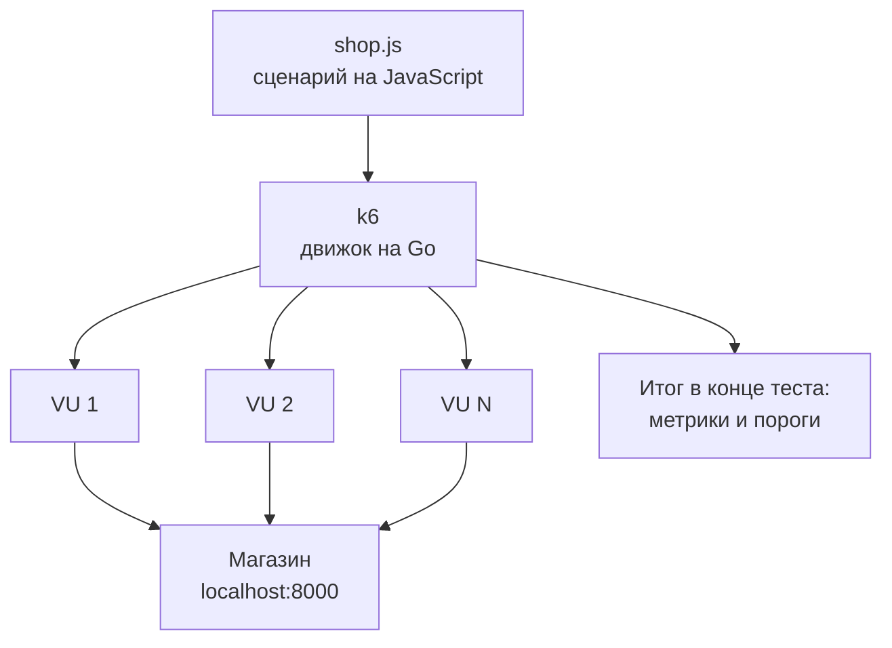
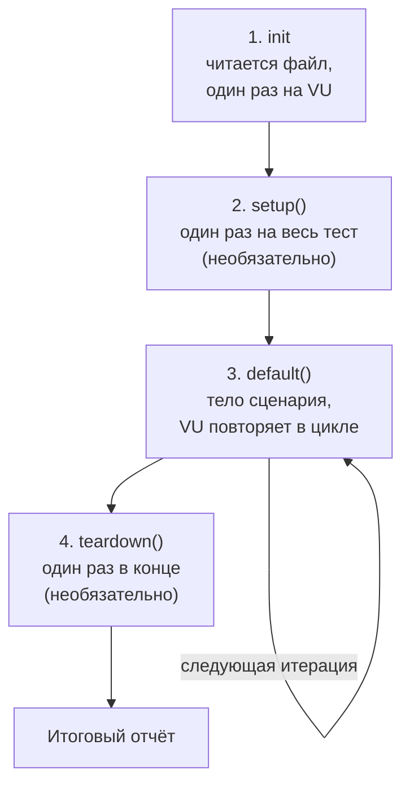
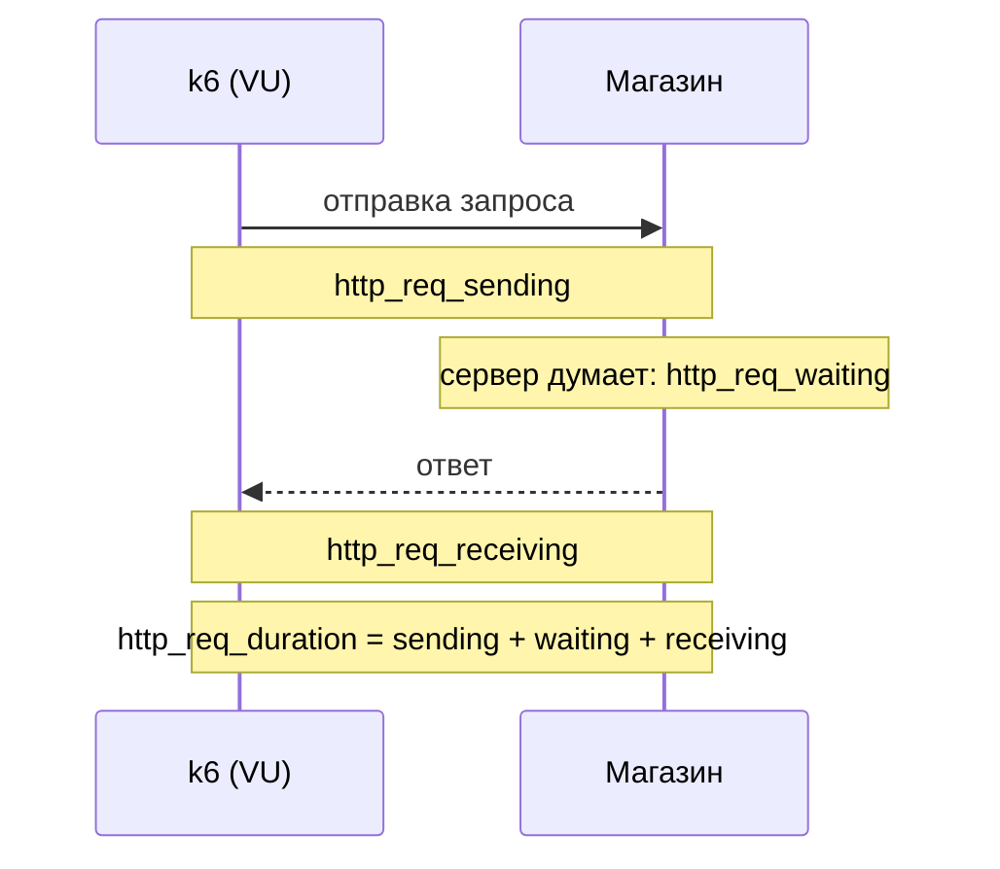
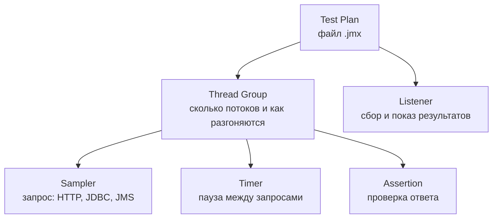

## Зачем это нужно

Я давно работаю с нагрузкой, а сейчас сижу рядом с тобой на твоей первой работе в команде интернет-магазина. Скоро распродажа, и перед каждым релизом команда хочет знать: сайт стал быстрее или медленнее. Нужен тест, который запускается сам и сам говорит «прошёл» или «упал». Для этого берут **k6** (читается «кей-шесть»).

В теме 9 ты писал нагрузку на Python и Locust. Но k6 встретится тебе в вакансиях, так что второй инструмент стоит знать. Он умеет держать заданную **скорость запросов** (например, 200 в секунду), а не заданное число «пользователей». **Сценарий** (файл с шагами теста) для него пишут на **JavaScript**.

Новичка пугает не k6, а JavaScript: «я же не программист». Но тебе нужен крошечный кусок языка: переменные, функции, объекты, массивы, формат данных JSON и подключение файлов. Ты знаешь Python, поэтому я буду сравнивать. К концу урока ты прочтёшь итоговый отчёт k6 построчно: на собеседовании просят объяснить любую из его 30 строк.

Шаг проекта: ты ставишь k6 и пишешь `~/perf-lab/10-k6/shop.js` (тот же путь покупателя, что в Locust: вход, каталог, карточка товара, корзина, заказ). Запускаешь его на пять пользователей на 30 секунд и сохраняешь результат в `~/perf-lab/results/`. В [следующем уроке](02-scenarios-thresholds.md) этот же скрипт получит сценарии и пороги (условия «прошёл или упал»), в [последнем](03-k6-prometheus.md) его метрики улетят в Grafana.

## Что нужно знать

- Стенд «Магазин» запущен, `curl -s localhost:8000/readyz` отвечает: [урок 2.1](../02-web/01-client-server-http.md) и [тема 5](../05-docker/index.md). Для 10.3 понадобится профиль мониторинга из [темы 7](../07-observability/index.md).
- Что такое HTTP-запрос, статус ответа, заголовки и JSON: [урок 2.1](../02-web/01-client-server-http.md).
- Python на уровне «функции, словари, списки»: [тема 4](../04-python/index.md). Мы будем сравнивать с ним.
- Locust и путь покупателя «логин, каталог, корзина, заказ»: [урок 9.2](../09-locust/02-user-journey.md). Здесь ты повторишь тот же путь на другом инструменте.
- Задержка, перцентили p50/p95/p99, доля ошибок: [урок 8.1](../08-perf-theory/01-latency-throughput.md). Без них итоговый отчёт k6 не прочитать.

## Картина целиком

Представь репетицию оркестра. Партитура это твой файл на JavaScript, дирижёр это k6, а музыканты это **виртуальные пользователи** (VU, virtual users). Виртуальный пользователь не человек и не браузер, а маленькая программа, которая играет твою партитуру по кругу без отдыха, пока ты не вставил паузу.



Здесь видно: один процесс k6 читает файл и запускает столько VU, сколько ты разрешил. Каждый VU сам ходит в магазин, а замеры стекаются обратно в отчёт.

Сам k6 написан на языке Go, поэтому он экономный: один процесс тянет тысячи VU на ноутбуке. Твой JavaScript выполняется во встроенном интерпретаторе, а не в браузере и не в Node.js (среда запуска JavaScript на сервере). Отсюда два факта: в сценарии нет `document` и `window`, и нет менеджера пакетов `npm`. Зато есть свои встроенные **модули** (подключаемые наборы готовых функций), например `k6/http`.

У сценария четыре стадии жизни, две из них необязательные:



Основная работа идёт на третьей стадии: функция `default` выполняется снова и снова, пока не кончится время теста. Всё остальное вокруг неё: подготовиться до, прибраться после. Что делает каждая стадия, расскажу в разделе про запуск сценария, а пока запомни порядок.

## Теория

### Переменные и типы: `const`, `let` и подвох с плюсом

Загадка для начала: что напечатает JavaScript для `'5' + 1` и для `'5' - 1`? Если ты из Python, ответ удивит: `51` и `4`. Разберёмся, почему.

Сценарию нужно хранить токен, адрес магазина, номер пользователя. Для этого есть **переменные**: подписанные коробки. В JavaScript они двух видов. `const` (от constant, «постоянная») запечатана скотчем: значение кладут при создании, и коробку уже не подменить. `let` («пусть будет») обычная: содержимое можно заменить. Мой совет: пиши `const`, а `let` только там, где значение придётся менять (счётчик, токен после входа).

```js
const base = 'http://localhost:8000';   // адрес магазина, не меняется
let counter = 0;                         // счётчик, будем увеличивать
counter = counter + 1;                   // теперь counter равен 1
counter++;                               // сокращение: counter стал 2
```

Комментарий начинается с `//` (в Python это `#`). Типы значений почти те же, что в Python:

| В JavaScript | Пример | Аналог в Python |
|---|---|---|
| строка (string) | `'привет'`, `"привет"` | `str` |
| число (number), одно на целые и дробные | `42`, `0.5` | `int` и `float` |
| логическое (boolean) | `true`, `false` | `True`, `False` |
| «ничего» намеренно | `null` | `None` |
| «значение не задано» | `undefined` | ближайшее: ошибка «нет такой переменной» |
| объект (object) | `{ a: 1 }` | `dict` |
| массив (array) | `[1, 2, 3]` | `list` |

Теперь про загадку. JavaScript **молча преобразует типы**. Плюс, если рядом строка, склеивает: `'5' + 1` даёт строку `'51'`. Минус склеивать не умеет, поэтому превращает `'5'` в число и вычитает: получается 4. Вот почему для сравнения я всегда ставлю **три знака равенства** `===`: он требует, чтобы совпали и значение, и тип. Двойное `==` приведёт типы само, и `5 == '5'` окажется `true`.

> **Прикинь сам:** что напечатает `console.log('10' + 5, '10' - 5)`?
{: .predict}

`105 5`. Плюс склеил строку `'10'` с числом 5 и получил строку `'105'`. Минус превратил `'10'` в число 10 и вычел 5. `console.log` с несколькими аргументами печатает их через пробел.

Осторожно: переменные окружения (`__ENV`, они появятся в сценарии ниже) всегда строки. `__ENV.RATE` равно `'20'`, а не 20, поэтому пиши `Number(__ENV.RATE)`. И поле, которого в объекте нет, даёт `undefined`, а не ошибку: токена нет, а скрипт пошёл дальше с пустым заголовком.

> **Главное:** JavaScript сам склеивает и преобразует типы, поэтому пиши `const`, сравнивай через `===`, а числа из текста превращай в числа через `Number`.
{: .key}

Типы мы разобрали. Теперь научимся давать кускам кода имена и работать со сложными данными.

### Функции, объекты, массивы

Ответ магазина приходит набором полей, а сценарий состоит из шагов вроде «войти» и «положить в корзину». Для шагов есть **функции**, для данных **объекты** и **массивы**. Функция это рецепт на карточке: «возьми это, сделай так, получишь результат». Объект это карточка товара с полями «название», «цена», «остаток». Массив это нумерованная стопка карточек.

Функцию пишут двумя способами, оба тебе встретятся:

```js
function pad(n, width) {                  // обычная функция
  return String(n).padStart(width, '0');
}
const email = (n) => `user${pad(n, 4)}@shop.lab`;   // стрелочная: параметры => результат
```

`String(n)` превращает число в строку, а `.padStart(4, '0')` дополняет её слева нулями до длины 4: из `7` получится `'0007'`. Стрелочная запись `(n) => ...` короче, и её удобно передавать другой функции: в `check()` ты будешь писать `(r) => r.status === 200`, то есть «по ответу r верни: статус равен 200?».

В Python ты написал бы `f"user{n:04d}@shop.lab"`. В JavaScript формата `:04d` нет, поэтому два шага: число в строку, потом нули слева. Для `n = 7` выйдет `user0007@shop.lab`, для `n = 1000` дополнять нечего, и выйдет `user1000@shop.lab`. Так номер VU превращается в пользователя стенда (`user0001@shop.lab`…`user1000@shop.lab`). Строка в обратных кавычках с `${...}` внутри называется **шаблонной**, это аналог f-строки. Обратные кавычки это клавиша слева от единицы.

Объект записывают в фигурных скобках как `ключ: значение`, к полю обращаются через точку. Массив это список в квадратных скобках, нумерация с нуля:

```js
const user = { email: 'user0001@shop.lab', password: 'password' };
console.log(user.email);          // user0001@shop.lab
user.password = 'qwerty';         // поле можно поменять, хотя user объявлен через const
console.log(user.name);           // undefined: такого поля нет, ошибки не будет

const ids = [1, 2, 3];
console.log(ids[0], ids.length);   // 1 3
ids.push(4);                       // добавить в конец
for (const id of ids) {            // пройти по каждому элементу (в Python: for id in ids)
  console.log(id * 2);
}
```

Условие пишут как `if (условие) { ... } else { ... }`, скобки вокруг условия обязательны. «И» это `&&`, «или» это `||`, «не» это `!`. Выражение `a || b` вернёт `a`, если оно не пустое, иначе `b`: так делают значения по умолчанию. В `__ENV.BASE_URL || 'http://localhost:8000'` читай «возьми адрес из окружения, а если его нет, локальный».

Если ты пришёл из Python, держи сводку:

| Python | JavaScript |
|---|---|
| `x = 5` | `let x = 5;` или `const x = 5;` |
| `f"{a} и {b}"` | `` `${a} и ${b}` `` |
| `def f(a): return a * 2` | `function f(a) { return a * 2; }` или `(a) => a * 2` |
| `d = {"a": 1}`; `d["a"]` | `const d = { a: 1 };` `d.a` или `d['a']` |
| `xs.append(3)`, `len(xs)` | `xs.push(3)`, `xs.length` |
| `for x in xs:` | `for (const x of xs) { }` |
| `if a and not b:` | `if (a && !b) { }` |
| `None`, `True` | `null` (и `undefined`), `true` |
| `a == b` | `a === b` |
| блоки по отступам | блоки в `{ }`, строки кончаются `;` |

> **Прикинь сам:** функция `const f = (x) => x + 1;`. Что вернёт `f('1')`?
{: .predict}

Строку `'11'`: плюс снова склеил. Нужно число? Пиши `Number(x) + 1` и получишь 2.

Осторожно: `user.email` и `user['email']` одно и то же, скобки нужны, когда имя поля лежит в переменной. А в обычной функции без `return` результат молча станет `undefined`.

> **Главное:** функция даёт имя шагу, объект хранит поля, массив хранит список; обращение к полю идёт через точку, к элементу по номеру с нуля.
{: .key}

Данные мы хранить умеем. Но магазин присылает их не объектами, а текстом, и его надо превратить в объект.

### JSON: на каком языке говорят скрипт и магазин

Магазин принимает и отдаёт данные текстом. Ему на вход нужно `{"email":"user0001@shop.lab","password":"password"}`, а в ответ он присылает `{"token":"...","expires_in":3600}`. Это **JSON** (JavaScript Object Notation, «запись объектов JavaScript»): текст, внешне почти совпадающий с объектом. Ты видел его в [теме 2](../02-web/01-client-server-http.md). Два действия, обратные друг другу: `JSON.stringify(объект)` делает строку JSON, она нужна перед отправкой (тело запроса в k6 это строка). `JSON.parse(строка)` делает из строки объект, чтобы вытащить поле из ответа. У ответа k6 для этого есть короткая запись `res.json()`.

```js
const text = '{"token":"abc123","expires_in":3600}';
const data = JSON.parse(text);          // теперь data.token равно 'abc123'
console.log(data.expires_in + 1);       // 3601: число осталось числом
console.log(JSON.stringify({ product_id: 5, qty: 1 }));   // {"product_id":5,"qty":1}
```

В ответе входа токен это длинная случайная строка, а `expires_in` сколько секунд он живёт (по умолчанию `SESSION_TTL` равно 3600, час). Строка `const token = res.json('token');` положит в `token` только токен. Параметр `'token'` это **путь к полю**, он заходит и в глубину: `'items.0.id'`. Если поля нет, получишь `undefined`: проверяй результат.

> **Прикинь сам:** сервер вернул `{"items":[{"id":5},{"id":9}],"total":2}`. Как достать id второго товара из `data = JSON.parse(text)`?
{: .predict}

`data.items[1].id`: `items` это массив, нумерация с нуля, поэтому второй элемент имеет индекс 1. Результат 9. Через путь это `res.json('items.1.id')`.

Осторожно: в JSON ключи **всегда в двойных кавычках**. Напишешь тело руками как `"{'email': 'a'}"`, и магазин ответит ошибкой разбора (422), поэтому собирай тело через `JSON.stringify`.

> **Главное:** `JSON.stringify` делает из объекта текст для отправки, `JSON.parse` и `res.json()` делают из текста ответа объект; тело руками не печатай.
{: .key}

Скрипт научился говорить с магазином на одном языке. Теперь посмотрим, как не превратить его в один гигантский файл.

### Модули: как разнести сценарий по файлам

Сценарий растёт, и функцию «собрать email» не хочется копировать по пяти файлам. Код делят на **модули**: файлы, из которых можно вынести нужное и подключить в другом месте. Модуль отдаёт наружу словом `export`, другой файл забирает словом `import`:

```js
// lib/util.js
export function userEmail(n) {
  return `user${String(n).padStart(4, '0')}@shop.lab`;
}
```

```js
// shop.js
import { userEmail } from './lib/util.js';   // путь начинается с ./ : файл рядом с этим
import http from 'k6/http';                  // встроенный модуль k6: адрес без ./
import { check, sleep } from 'k6';           // из встроенного модуля берём две функции
```

Фигурные скобки в `import` значат «взять вот эти имена». Без скобок берут то, что модуль объявил главным (`export default`): у `k6/http` это объект `http`. Пути к своим файлам пишутся с `./` и **обязательно с расширением** `.js`. Пакеты из `npm` подключить нельзя: только встроенные модули k6, свои файлы и файлы по ссылке `https://`.

Осторожно: без расширения (`'./lib/util'`) импорт не сработает, k6 не угадывает `.js`. И `require(...)` из Node.js в k6 не работает, только `import`.

> **Главное:** общий код живёт в своих файлах, `export` его отдаёт, `import` забирает; путь к своему файлу пишется с `./` и с `.js`.
{: .key}

Язык мы освоили в том минимуме, что нужен. Теперь к самому k6: как он запускает твой файл и сколько запросов в итоге получит магазин.

### Как k6 запускает сценарий: init, default, VU и итерации

Ты запустил пять VU, а магазин получил совсем не пять запросов в секунду. Почему?

Представь кассира. Утром он один раз надевает форму и открывает кассу, потом по кругу обслуживает покупателей. Кассир это **VU**: независимый исполнитель сценария со своей копией кода и своими переменными (его номер лежит в `__VU`, с единицы). Покупатель это **итерация**: один проход функции по умолчанию от начала до конца (вход, каталог, корзина, заказ, пауза). Утренняя подготовка это **init-код**: всё, что написано в файле вне функций, то есть импорты, `const` и `export const options`. Он выполняется один раз на каждый VU до начала теста. Аналогия ломается там, что виртуальный кассир не устаёт: без паузы он сразу берёт следующего покупателя.

Функция, которую k6 вызывает на каждой итерации, называется `default`: `export default function () { ... }`. Рядом можно описать необязательные `export function setup()` (один раз до теста) и `export function teardown()` (один раз после). Настройки теста (сколько VU, как долго, какие пороги) лежат в `export const options = { ... }`. Каждый VU делает запросы по одному: пока нет ответа, он ждёт.

Переменная вне функций принадлежит конкретному VU и **сохраняется между его итерациями**. Поэтому токен после входа можно сохранить там и больше не логиниться. Вход в «Магазине» самая дорогая операция: проверка пароля через bcrypt занимает около четверти секунды процессорного времени, а стенд по умолчанию считает всё одним воркером. Логинься на каждой итерации, и ты нагрузишь не каталог и заказы, а проверку паролей.

<div class="viz" data-viz="k6-vu-lanes" data-vus="3" data-latency="300" data-sleep="1"></div>

У каждого VU своя дорожка: синее это идущий запрос, серое это пауза. Одна итерация это пара «синее плюс серое».

Пауза нужна ради реализма. Живой человек между кликами думает (think time, «время на раздумье»). Функция `sleep(секунды)` из модуля `k6` останавливает только текущий VU. Без неё VU мгновенно шлёт следующий запрос, и нагрузка в десятки раз выше, чем создали бы люди. Пауза бывает и случайной, `sleep(1 + Math.random())` (от 1 до 2 секунд), но для первого скрипта хватит `sleep(1)`.

Посчитаем для трёх VU, запроса в 300 мс и `sleep(1)`. Одна итерация длится 0,3 + 1 = 1,3 секунды. За 30 секунд один VU успеет 30 / 1,3 ≈ 23 итерации, три VU около 69. Магазин получит 3 / 1,3 ≈ 2,3 запроса в секунду, а не «3 пользователя, 3 запроса»: большую часть времени VU думает. Убери `sleep`, и те же три VU дадут 3 / 0,3 = 10 запросов в секунду. Это связь из [урока 8.2](../08-perf-theory/02-queues-littles-law.md) (закон Литтла) в деле.

> **Прикинь сам:** запрос длится 100 мс, пауза 0, VU 5. Сколько запросов в секунду получит сервер, если он отвечает ровно за 100 мс при любой нагрузке?
{: .predict}

Одна итерация 0,1 с, у одного VU 10 итераций в секунду, у пяти 50 запросов в секунду. На практике чуть меньше: k6 тратит доли миллисекунды на каждую итерацию.

Осторожно: итерация не запрос, их в ней может быть пять. И init не default: `console.log('привет')` вне функции напечатается по разу на каждый VU, а не на каждую итерацию.

> **Главное:** запросов в секунду столько, сколько VU делённое на время итерации, а переменные вне функций живут у VU между итерациями.
{: .key}

Мы знаем, кто гоняет сценарий. Теперь посмотрим на сам запрос.

### HTTP-запросы и ответ

Весь сценарий это набор запросов к API. Модуль `k6/http` их делает и сам замеряет время. Основные функции: `http.get(url, params)` и `http.post(url, body, params)`, дальше по аналогии `http.put` и `http.del`. Последний аргумент `params` это настройки: `headers` (заголовки), `tags` (метки для метрик), `timeout` (сколько ждать, по умолчанию 60 секунд).

```js
const res = http.post(`${base}/api/login`,
  JSON.stringify({ email: 'user0001@shop.lab', password: 'password' }),
  { headers: { 'Content-Type': 'application/json' } });
```

Заголовок `Content-Type: application/json` говорит серверу, что в теле JSON. Для строкового тела k6 его сам не ставит, поэтому пиши руками.

Функция возвращает объект ответа. Вот поля, которыми ты будешь пользоваться чаще всего:

| Поле | Что в нём |
|---|---|
| `res.status` | код ответа (200, 201, 404…); 0, если ответа не было вообще (сервер недоступен) |
| `res.body` | тело ответа строкой |
| `res.json()` | тело, разобранное как JSON; `res.json('token')` вернёт одно поле по пути |
| `res.headers` | заголовки ответа |
| `res.timings.duration` | сколько мс длился запрос (то же значение уходит в `http_req_duration`) |
| `res.error` | текст сетевой ошибки, если она была (например, соединение отклонено) |

Теперь главная особенность k6: он **не бросает исключение** при ответе 404 или 500. Для него это обычный ответ, он честно запишет задержку и статус. Если сервера нет совсем, k6 тоже не падает: `res.status` равен 0, причина в `res.error`, а в консоли будет предупреждение `WARN` `Request Failed`. Хорош ли ответ, решает твоя проверка.

Полный путь покупателя в «Магазине» состоит из пяти запросов: `POST /api/login` (получить токен), `GET /api/products` (каталог), `GET /api/products/{id}` (карточка), `POST /api/cart/items` с телом `{"product_id": N, "qty": 1}` (корзина) и `POST /api/orders` (заказ). Последние два требуют заголовок `Authorization: Bearer <токен>`: он доказывает серверу, что ты это ты. Вход возвращает 200, корзина и заказ возвращают 201.

> **Прикинь сам:** в консоли `res.status` равен 0. Что это значит?
{: .predict}

Ответа не было: сервер недоступен, соединение отклонено или запрос не уложился в таймаут. Причину ищи в `res.error`. Настоящих HTTP-ответов с кодом 0 не бывает.

> **Главное:** k6 не считает плохой ответ ошибкой скрипта: он записывает код и время, а оценивать ответ должен ты.
{: .key}

Как именно оценивать? Для этого есть функция, которой я однажды очень не хотел пользоваться.

### `check()`: проверка, которая не останавливает тест

Расскажу, как я однажды обманулся. После правки в магазине я прогнал тест: ошибок 0%, задержки в норме. Выложили релиз, и через час поддержка написала: заказы не оформляются. Магазин отвечал кодом 200, но в теле лежала ошибка. Я смотрел только на код и не проверил, что внутри. С тех пор в каждом сценарии у меня есть проверка содержимого.

Функция `check(значение, { 'название': функция })` вызывает каждую функцию с ответом и записывает результат в метрику `checks` (доля успешных). Она возвращает `true`, только если **все** проверки прошли.

```js
const ok = check(res, {
  'вход: 200': (r) => r.status === 200,
  'токен получен': (r) => typeof r.json('token') === 'string',
});
if (!ok) return;     // неудачный вход: нет смысла идти дальше
```

Название проверки появится в отчёте, поэтому пиши его так, чтобы по красной строке было понятно, что сломалось: `'вход: 200'`, а не `'check1'`.

Главное, что нужно усвоить: **`check` не останавливает тест и не решает, «прошёл» он или «упал»**. Упавшая проверка просто уменьшает долю в метрике `checks` и ставит красный крестик. Чтобы тест упал (особенно в CI, то есть в автоматической проверке перед релизом), нужен **порог** (threshold): условие на метрику, о нём [урок 10.2](02-scenarios-thresholds.md). Получается пара: `check` фиксирует факты, порог выносит приговор.

А что k6 считает «ошибкой запроса» для метрики `http_req_failed`? По умолчанию любой ответ вне диапазона 200–399 и все сетевые ошибки. Значит, 401, 404 и 500 попадут в `http_req_failed`, а 301 и 302 нет. Если ответ 404 для тебя ожидаемый, диапазон можно поменять: `http.setResponseCallback(http.expectedStatuses(200, 404))`. В нашем сценарии менять ничего не нужно.

Осторожно: `check` не прерывает итерацию, остановиться должен ты сам строкой `if (!ok) return;`. И он не то же самое, что `http_req_failed`: проверка может упасть при коде 200 (в теле не то), а запрос при этом не «failed». Смотри обе метрики.

> **Главное:** `check` записывает факты и не останавливает тест; решает «прошёл или упал» порог, а код 200 без проверки тела ничего не доказывает.
{: .key}

Проверки отвечают на вопрос «правильно ли». А как не получить тысячи одинаковых строк в метриках?

### Метки `name`: чтобы 10 000 товаров не стали 10 000 строк

У каждого запроса есть **метка** (tag) `url`. Адреса `/api/products/17` и `/api/products/4213` для k6 разные, значит, на каждый товар будет своя строка. В отчёте это не видно, зато в мониторинге из [урока 10.3](03-k6-prometheus.md) тысячи значений метки перегрузят Prometheus. Это **высокая кардинальность** (число уникальных комбинаций меток): на каждую тратится память. Решение: задать запросу метку `name` с одним общим значением.

```js
http.get(`${base}/api/products/${id}`, { tags: { name: '/api/products/[id]' } });
```

Так все карточки соберутся под одним именем. Locust решал ту же задачу параметром `name`, ты делал это в [теме 9](../09-locust/01-first-locustfile.md).

> **Главное:** запрос с меняющимся адресом помечай меткой `name` с одним общим значением, иначе метрики разрастутся.
{: .key}

Запросы мы отправили и проверили. Осталось прочитать, что k6 напечатает в конце.

### Итоговый отчёт k6 построчно

Тест закончился, и k6 печатает отчёт, по которому решают, выпускать ли релиз. В версии 2.x он называется **compact** (компактный): сначала пороги, потом проверки, потом метрики четырёх групп. У каждой метрики есть **тип**, и от него зависит вид строки:

| Тип | Что хранит | Как выглядит в отчёте |
|---|---|---|
| Counter (счётчик) | число, которое только растёт | итог и скорость в секунду: `521  17.3/s` |
| Gauge (датчик) | текущее значение | последнее, минимум и максимум: `5  min=5  max=5` |
| Rate (доля) | какая часть значений «ненулевая» | процент и «сколько из скольких»: `0.00%  0 out of 521` |
| Trend (распределение) | много замеров, показывается их статистика | `avg=… min=… med=… max=… p(90)=… p(95)=…` |

В Trend `avg` это среднее, `min` и `max` крайние значения, `med` медиана (то же, что p50), `p(90)` и `p(95)` перцентили. Ты знаешь из [8.1](../08-perf-theory/01-latency-throughput.md): среднему верить нельзя, смотри на `p(95)`. Единицы читай внимательно: `µs` это микросекунды (миллионные доли секунды), `ms` миллисекунды, `s` секунды.

Самое важное в отчёте это **время одного запроса**, `http_req_duration`. Оно не равно «всему, что случилось до ответа», а состоит ровно из трёх частей:



Здесь видно: `waiting` это «время до первого байта» (TTFB, [урок 8.1](../08-perf-theory/01-latency-throughput.md)), в нём почти всегда живёт работа сервера. До отправки есть ещё `http_req_blocked` (ожидание свободного соединения) и `http_req_connecting` (открытие соединения), но в `http_req_duration` они не входят.

Теперь пройдём отчёт сверху вниз. **THRESHOLDS** (пороги) это условия из твоих `options`: `✓` выполнено, `✗` нарушено, и при одном `✗` k6 завершится с ненулевым кодом. Дальше **checks**: сколько проверок выполнено и какая доля прошла, ниже список по названиям.

В группе **HTTP** три строки. `http_req_duration` это задержка запросов (Trend), главный показатель. Под ней стоит `{ expected_response:true }`: то же, но только для ожидаемых ответов. Если запросы быстро падают (500 за 2 мс), общая строка выглядит красивее правды, а эта покажет настоящее, так что сверяй обе. `http_req_failed` это доля неудачных запросов (Rate), твоя «доля ошибок» из 8.1. `http_reqs` это число запросов и запросов в секунду (Counter), то есть RPS.

В группе **EXECUTION** `iteration_duration` это время итерации вместе с паузой, `iterations` это число итераций, `vus` показывает, сколько VU работало, а `vus_max` сколько их **выделено**. Группа **NETWORK** это `data_received` и `data_sent`, байты туда и обратно.

Теперь пример. В конце теста стоят строки `http_reqs ... 521  17.3/s`, `iterations ... 129  4.29/s` и `http_req_duration ... avg=29.7ms med=14.2ms p(95)=82.4ms max=291ms`. За 30 секунд сделано 521 запрос в 129 итерациях. Сколько запросов на итерацию? От 521 отнимаем 5 входов (по одному на VU), остаётся 516, и 516 / 129 даёт 4. Медиана вдвое меньше среднего, значит, есть хвост из медленных запросов. Его видно в `max=291ms`: это вход, где проверяется пароль. А среднее 29,7 мс скрывает, что заказ занимает около 80 мс, а каталог около 12 мс. Чтобы разделить запросы, понадобятся метки `name` и пороги по ним из 10.2.

> **Прикинь сам:** в отчёте `http_req_failed: 50.00% 260 out of 520` и `checks_failed: 0.00%`. Как такое возможно?
{: .predict}

Половина запросов вернула код вне 200–399, а проверки эти запросы не видели: например, скрипт раньше сделал `return`, и до проверок дело не дошло. Две метрики независимы. Проверки видят только то, что ты проверил, а `http_req_failed` смотрит на все запросы.

Осторожно: `http_req_duration` про один запрос, `iteration_duration` про всю итерацию с паузой. И «ошибок 0,00%, значит, всё хорошо» не работает: `http_req_failed` смотрит только на код, сломанное тело при коде 200 он не увидит. Помнишь мою историю? Именно это со мной и случилось.

> **Главное:** в отчёте смотри `p(95)` у `http_req_duration`, долю `http_req_failed` и строку `checks`; число запросов проверяй умножением итераций в секунду на запросы в итерации.
{: .key}

Теперь ты умеешь читать отчёт k6. Остался один инструмент, о котором тебя наверняка спросят, хотя пользоваться им ты не будешь.

### Apache JMeter: что это и почему о нём спрашивают

До Locust и k6 нагрузку чаще всего давали **Apache JMeter**: программа на Java, которой почти двадцать пять лет. Она встретится тебе не потому, что лучше, а потому что на ней написаны тысячи тестов. Практики не будет, нужно лишь опознать её в чужом проекте.

JMeter это конструктор: сценарий собирают мышкой из блоков. Тест хранится в файле **тест-плана** `.jmx` (это XML, текстовый формат с тегами). Блоки вложены друг в друга как папки в графическом редакторе (GUI, graphical user interface).



В корне плана лежит **Thread Group** (группа потоков): сколько пользователей, за какое время они разгоняются и сколько раз повторяют сценарий. Внутри неё **Sampler** (запрос, одна «проба» сервера), **Timer** (пауза) и **Assertion** (проверка). **Listener** показывает результаты. Понятия те же, что в Locust и k6, названия другие:

| Locust / k6 | JMeter |
|---|---|
| пользователь (user, VU) | поток (thread) в Thread Group |
| число пользователей и разгон | Number of Threads и Ramp-up Period |
| запрос `client.get` / `http.get` | HTTP Request (Sampler) |
| пауза `wait_time` / `sleep()` | Timer (Constant Timer, Uniform Random Timer) |
| `check` / `catch_response` | Assertion (Response, JSON) |
| данные из CSV | CSV Data Set Config |
| заголовки, общие для запросов | HTTP Header Manager |
| итоговый отчёт | Listener и HTML-отчёт из `-e -o` |

Нагрузку JMeter запускают **без окна**: `jmeter -n -t plan.jmx -l results.jtl -e -o report/`. Окно годится только для отладки на одном-двух пользователях.

<details markdown="1">
<summary>Для любопытных: что значат ключи `jmeter -n -t plan.jmx -l results.jtl -e -o report/`</summary>

`-n` (non-GUI) запуск без окна, `-t` файл плана. `-l` файл, куда пишется каждый запрос (`.jtl`, обычная таблица CSV). `-e` собрать HTML-отчёт, `-o` папка для отчёта (пустая или несуществующая). Актуальная ветка на 2026 год 5.6.x (при проверке 5.6.3), нужна Java 8 или новее.

</details>

Почему его до сих пор спрашивают? Во-первых, наследие: у многих компаний сотни планов. Во-вторых, протоколы: кроме HTTP, JMeter из коробки умеет базы по JDBC, очереди JMS, FTP и TCP. Минусы: план в XML плохо читается в git (одна правка мышкой меняет десятки строк), а каждый пользователь это поток Java, поэтому генератор тянет меньше, чем k6 на Go. Вот как инструменты выглядят рядом:

Вот как инструменты выглядят рядом:

| | JMeter | Locust | k6 |
|---|---|---|---|
| Язык сценария | мышкой в GUI, хранится как XML; скрипты на Groovy для сложного | Python | JavaScript |
| Модель нагрузки | потоки (закрытая); открытая через Open Model Thread Group (с версии 5.5) или Timer и плагины | пользователи (закрытая), открытую собирают вручную | обе, открытая встроена (executors) |
| Ресурсы генератора | поток Java на пользователя, тяжелее всего | процесс Python, умеренно | движок на Go, легче всего |
| CI | запуск `-n`, пороги через плагины или разбор `.jtl` | запуск `--headless`, код выхода задаёшь сам | пороги и код выхода встроены |
| Метрики в Prometheus | через сторонний плагин или Backend Listener в InfluxDB/Graphite | сторонний экспортёр | встроенный вывод (remote write), см. [урок 10.3](03-k6-prometheus.md) |

Подробное сравнение k6 и Locust с твоими цифрами в [уроке 10.3](03-k6-prometheus.md).

Осторожно: нагрузку с окном JMeter не гоняй. Оно само тратит процессор и память, и часть задержки появится на стороне генератора, а не на стенде (как в [теме 8](../08-perf-theory/index.md)). Запускай через `jmeter -n`.

> **Главное:** JMeter это старый инструмент с тестами в XML, его запускают без окна (`-n`); для новых проектов берут код, как в k6 и Locust.
{: .key}

Вернёмся в магазин: перед распродажей у тебя есть инструмент, который сам скажет «прошёл» или «упал». Первый запуск ты сделаешь в практике.

## Практика

Все файлы лежат в `~/perf-lab/10-k6/`. Стенд «Магазин» должен быть запущен: `curl -s localhost:8000/readyz` отвечает `{"status":"ready"}`.

### 1. Поставь k6

Команды из официальной документации k6 для Ubuntu. Разбор по строкам:

```bash
sudo apt-get update && sudo apt-get install -y ca-certificates curl gpg
curl -fsSL https://dl.k6.io/key.gpg | sudo gpg --dearmor -o /usr/share/keyrings/k6-archive-keyring.gpg
echo "deb [signed-by=/usr/share/keyrings/k6-archive-keyring.gpg] https://dl.k6.io/deb stable main" | sudo tee /etc/apt/sources.list.d/k6.list
sudo apt-get update
sudo apt-get install -y k6
k6 version
```

Что делает каждая часть. Первая строка ставит утилиты, нужные для скачивания и проверки подписей (`curl`, `gpg` могли уже стоять, повторная установка безвредна). Вторая скачивает **ключ**, которым Grafana подписывает пакеты: `-fsSL` значит «упасть при ошибке, молчать, показать ошибку, идти по перенаправлениям», `gpg --dearmor` переводит ключ из текстового вида в бинарный, а `-o` сохраняет в файл. Третья добавляет адрес репозитория в список источников apt: параметр `signed-by` ограничивает доверие **только этим ключом**, чтобы он не мог подписывать пакеты других источников; `tee` записывает в файл под `sudo`, потому что обычное перенаправление `>` прав не получило бы. Четвёртая обновляет список пакетов, пятая ставит k6, последняя печатает версию.

Ожидаемый вывод последней команды:

```text
k6 v2.3.0 (commit/3f9a2b1c4d, go1.26.0, linux/amd64)
```

**Как читать вывод:** первое число версии `2` важно. Много статей в интернете написано про k6 версий 0.x и 1.x. Из версии 2.0 убрали старые вещи: команды `k6 pause`, `k6 resume`, `k6 scale`, `k6 status` и один из исполнителей нагрузки (`externally-controlled`), а флаг `--no-summary` заменён на `--summary-mode=disabled`. Увидишь такие команды в старой инструкции, значит, она устарела. Остальное из статей (`k6/http`, `check`, `sleep`, `options`) работает так же.

**Типичные ошибки:**

- `E: Unable to locate package k6`: репозиторий не добавлен или не выполнен `apt-get update` после добавления. Повтори третью и четвёртую команды.
- `NO_PUBKEY` при `apt-get update`: ключ не скачался или записан не туда. Повтори вторую команду и убедись, что файл `/usr/share/keyrings/k6-archive-keyring.gpg` существует.

### 2. Освой JavaScript на самом k6

Отдельного JavaScript (Node.js) ты не ставил, и не надо: учебные куски запустим прямо в k6. Создай каталог и файл:

```bash
mkdir -p ~/perf-lab/10-k6/lib ~/perf-lab/results && cd ~/perf-lab/10-k6
nano js-basics.js
```

```js
// js-basics.js: учебный файл, запускаем его самим k6
const base = 'http://localhost:8000';
let counter = 0;
const user = { email: 'user0001@shop.lab', password: 'password' };
const ids = [1, 2, 3];

function pad(n, width) { return String(n).padStart(width, '0'); }
const email = (n) => `user${pad(n, 4)}@shop.lab`;

export default function () {
  counter++;
  console.log(`итерация ${counter}, VU ${__VU}`);
  console.log(email(7), email(1000));
  console.log(JSON.stringify(user));
  const data = JSON.parse('{"token":"abc","expires_in":3600}');
  console.log(data.token, data.expires_in + 1);
  for (const id of ids) console.log(`${base}/api/products/${id}`);
  console.log(typeof user, Array.isArray(ids), ids.length, user.name);
  console.log(0.1 + 0.2, '5' + 1, '5' - 1, 5 === '5', 5 == '5');
}
```

Запуск: `k6 run --iterations 2 --summary-mode=disabled js-basics.js`. Разбор: `k6 run файл` запускает сценарий; `--iterations 2` говорит «две итерации, потом стоп» (VU по умолчанию один); `--summary-mode=disabled` выключает итоговый отчёт, он нам сейчас не нужен.

```text
INFO[0000] итерация 1, VU 1                              source=console
INFO[0000] user0007@shop.lab user1000@shop.lab           source=console
INFO[0000] {"email":"user0001@shop.lab","password":"password"}  source=console
INFO[0000] abc 3601                                      source=console
INFO[0000] http://localhost:8000/api/products/1          source=console
INFO[0000] http://localhost:8000/api/products/2          source=console
INFO[0000] http://localhost:8000/api/products/3          source=console
INFO[0000] object true 3 undefined                       source=console
INFO[0000] 0.30000000000000004 51 4 false true           source=console
INFO[0000] итерация 2, VU 1                              source=console
...
```

(Вывод второй итерации повторяет первую, кроме строки про счётчик.) **Как читать вывод:** `INFO` это уровень сообщения, `[0000]` секунды от старта теста, `source=console` значит «напечатано твоим `console.log`». Строка «итерация 2» показывает главное: `counter` из init **не сбросился** между итерациями, потому что принадлежит VU. Попробуй `--vus 2 --iterations 4`: у каждого VU будет свой счётчик.

**Типичные ошибки:**

- `SyntaxError: ... Unexpected token`: чаще всего пропущена скобка или запятая. k6 называет строку и столбец.
- `ReferenceError: ... is not defined`: имя написано с опечаткой или переменной нет в этой области.

### 3. Первый запрос

```js
// hello.js
import http from 'k6/http';
import { check } from 'k6';

export default function () {
  const res = http.get('http://localhost:8000/healthz');
  check(res, { 'healthz: 200': (r) => r.status === 200 });
}
```

Запусти: `k6 run hello.js`. Без опций k6 делает **одну итерацию одним VU**: удобно для проверки, что скрипт вообще работает.

```text
         execution: local
            script: hello.js
            output: -

         scenarios: (100.00%) 1 scenario, 1 max VUs, 10m30s max duration (incl. graceful stop):
                  * default: 1 iterations for each of 1 VUs (maxDuration: 10m0s, gracefulStop: 30s)


  █ TOTAL RESULTS

    checks_total.......................: 1       151.2/s
    checks_succeeded...................: 100.00% 1 out of 1
    checks_failed......................: 0.00%   0 out of 1

    ✓ healthz: 200

    HTTP
    http_req_duration.......................................................: avg=4.62ms min=4.62ms med=4.62ms max=4.62ms p(90)=4.62ms p(95)=4.62ms
      { expected_response:true }............................................: avg=4.62ms min=4.62ms med=4.62ms max=4.62ms p(90)=4.62ms p(95)=4.62ms
    http_req_failed.........................................................: 0.00%  0 out of 1
    http_reqs...............................................................: 1      151.2/s

    EXECUTION
    iteration_duration......................................................: avg=6.18ms min=6.18ms med=6.18ms max=6.18ms p(90)=6.18ms p(95)=6.18ms
    iterations..............................................................: 1      151.2/s
    vus.....................................................................: 1      min=1 max=1
    vus_max.................................................................: 1      min=1 max=1

    NETWORK
    data_received...........................................................: 142 B  21 kB/s
    data_sent...............................................................: 80 B   12 kB/s
```

У тебя числа будут другие, формат тот же. **Как читать вывод:** блок `scenarios` сверху пересказывает, что k6 собирался сделать: «1 итерация на 1 VU». Одна проверка прошла (`✓`), один запрос (`http_reqs 1`), на запрос ушло 4,62 мс, а итерация длилась 6,18 мс (разница это накладные расходы k6). Скорость в секунду (151/s) на одной итерации ничего не значит: это «1 запрос / 6,6 мс», не нагрузка.

**Типичные ошибки:**

- `WARN ... Request Failed ... dial tcp 127.0.0.1:8000: connect: connection refused`: стенд не запущен. Подними его (`docker compose up -d` в `~/load-tester/project/shop`) и проверь `readyz`.
- `GoError: ... open ... no such file`: неверный путь к файлу сценария, запускай из каталога `~/perf-lab/10-k6`.

### 4. Сценарий покупателя

Вынеси помощник в модуль `lib/util.js`:

```js
// lib/util.js
export function userEmail(n) {
  return `user${String(n).padStart(4, '0')}@shop.lab`;
}
```

И напиши `shop.js`:

```js
// shop.js: путь покупателя «Магазина»: вход, каталог, карточка, корзина, заказ
import http from 'k6/http';
import { check, sleep } from 'k6';
import { userEmail } from './lib/util.js';

const BASE = (__ENV.BASE_URL || 'http://localhost:8000').replace(/\/$/, '');
const JSON_HEADERS = { 'Content-Type': 'application/json' };

export const options = {
  vus: 5,
  duration: '30s',
  thresholds: { http_req_failed: ['rate<0.01'] },
};

// Эти переменные свои у каждого VU и живут между итерациями.
let token;
let tokenExpiresAt = 0;

function login() {
  const number = ((__VU - 1) % 1000) + 1;            // VU 1 это user0001, VU 1001 снова user0001
  const res = http.post(`${BASE}/api/login`,
    JSON.stringify({ email: userEmail(number), password: 'password' }),
    { headers: JSON_HEADERS });
  if (!check(res, { 'вход: 200': (r) => r.status === 200 })) return false;
  token = res.json('token');
  tokenExpiresAt = Date.now() + (res.json('expires_in') - 5) * 1000;   // с запасом в 5 секунд
  return true;
}

export default function () {
  if (!token || Date.now() >= tokenExpiresAt) {
    if (!login()) return;
  }
  const auth = { headers: { ...JSON_HEADERS, Authorization: `Bearer ${token}` } };

  check(http.get(`${BASE}/api/products`), { 'каталог: 200': (r) => r.status === 200 });

  const productId = 1 + Math.floor(Math.random() * 10000);
  check(http.get(`${BASE}/api/products/${productId}`, { tags: { name: '/api/products/[id]' } }),
    { 'карточка: 200': (r) => r.status === 200 });

  check(http.post(`${BASE}/api/cart/items`, JSON.stringify({ product_id: productId, qty: 1 }), auth),
    { 'корзина: 201': (r) => r.status === 201 });

  check(http.post(`${BASE}/api/orders`, null, auth), { 'заказ: 201': (r) => r.status === 201 });

  sleep(1);
}
```

Разбор незнакомых мест. `(__ENV.BASE_URL || '...')` значение из переменной окружения или локальный адрес; `.replace(/\/$/, '')` убирает слэш в конце, если он есть. `{ ...JSON_HEADERS, Authorization: ... }` копирует поля объекта и добавляет ещё одно (три точки называют «spread», разворот). `Date.now()` текущее время в миллисекундах, поэтому `expires_in` (секунды) умножается на 1000. `Math.floor(Math.random() * 10000)` случайное целое от 0 до 9999, плюс 1 даёт id товара от 1 до 10 000. `http.post(url, null, auth)` запрос без тела. В `if (!login()) return;` неудачный вход просто завершает итерацию (VU начнёт следующую).

Сначала запусти «на пробу» (один VU, одна итерация), чтобы убедиться, что сценарий вообще работает: `k6 run --vus 1 --iterations 1 shop.js`. Все пять проверок должны быть зелёными. Если красная, смотри, какая: по названию видно шаг. Включи показ запросов и ответов `--http-debug=full` (он печатает каждый запрос и ответ целиком, поэтому с ним запускай только один раз и на одной итерации).

Теперь основной запуск, с сохранением отчёта в файл (`tee` пишет в файл и одновременно на экран):

```bash
k6 run shop.js | tee ~/perf-lab/results/k6-first.txt
```

```text
         execution: local
            script: shop.js
            output: -

         scenarios: (100.00%) 1 scenario, 5 max VUs, 1m0s max duration (incl. graceful stop):
                  * default: 5 looping VUs for 30s (gracefulStop: 30s)


  █ THRESHOLDS

    http_req_failed
    ✓ 'rate<0.01' rate=0.00%


  █ TOTAL RESULTS

    checks_total.......................: 521     17.31/s
    checks_succeeded...................: 100.00% 521 out of 521
    checks_failed......................: 0.00%   0 out of 521

    ✓ вход: 200
    ✓ каталог: 200
    ✓ карточка: 200
    ✓ корзина: 201
    ✓ заказ: 201

    HTTP
    http_req_duration..................: avg=29.7ms  min=4.9ms  med=14.2ms  max=291ms   p(90)=76.3ms  p(95)=82.4ms
      { expected_response:true }.......: avg=29.7ms  min=4.9ms  med=14.2ms  max=291ms   p(90)=76.3ms  p(95)=82.4ms
    http_req_failed....................: 0.00%  0 out of 521
    http_reqs..........................: 521    17.31/s

    EXECUTION
    iteration_duration.................: avg=1.16s   min=1.08s  med=1.15s   max=1.41s   p(90)=1.2s    p(95)=1.24s
    iterations.........................: 129    4.29/s
    vus................................: 5      min=5      max=5
    vus_max............................: 5      min=5      max=5

    NETWORK
    data_received......................: 731 kB 24 kB/s
    data_sent..........................: 161 kB 5.3 kB/s
```

Цифры условные, у тебя будут другие: на стенде задержки зависят от машины. **Как читать вывод.** Идём сверху вниз.

1. `scenarios`: «5 looping VUs for 30s»: пять пользователей по кругу в течение 30 секунд. Максимальная длительность 1m0s включает 30 секунд на мягкое завершение (`gracefulStop`): k6 дожидается итераций, начатых к концу времени.
2. `THRESHOLDS`: порог `rate<0.01` на `http_req_failed` выполнен: ошибок 0,00% (меньше 1%).
3. `checks`: 521 проверка, все успешны. Проверок 521 (а не 516) потому, что к 516 проверкам по четырём шагам плюс 5 раз по одному разу вошли пять VU.
4. `http_req_duration`: среднее 29,7 мс, медиана 14,2 мс, p(95) = 82,4 мс. Разрыв между медианой и средним означает «хвост»: это заказы (~75 мс, внутри них сходка в «оплату» с её 50 мс) и пять входов (до 291 мс).
5. `iterations`: 129 за 30 с, 4,29 в секунду. Проверим формулой из теории: пять VU и итерация примерно 1,16 с дают 5 / 1,16 ≈ 4,3. Совпало, значит, сценарий ведёт себя как задумано.
6. `http_reqs`: 521 запрос, 17,31 в секунду. 4 запроса на итерацию умножить на 4,29 = 17,2, плюс пять входов.
7. `vus`: все пять VU работали весь тест. `iteration_duration` чуть больше 1 секунды, потому что включает `sleep(1)`.

Закоммить результат, как в предыдущих темах:

```bash
cd ~/perf-lab && git add 10-k6 results/k6-first.txt && git commit -m "k6: первый сценарий покупателя" && git push
```

**Типичные ошибки:**

- `ReferenceError: userEmail is not defined` или `GoError: The moduleSpecifier "./lib/util" ...`: забыто расширение `.js` в импорте или файл лежит не в `lib/`.
- `TypeError: Cannot read property 'token' of undefined` (или `null`): `res.json()` вызван на запросе, который вернул не JSON, например при недоступном магазине. Поэтому у входа стоит проверка и ранний `return`.
- Все проверки красные `✗ вход: 200`, `http_req_failed` близко к 100%: магазин не запущен или логин 401. Выполни вручную `curl -s localhost:8000/api/login -H 'Content-Type: application/json' -d '{"email":"user0001@shop.lab","password":"password"}'`.

> Застрял на ошибке k6 или JavaScript, которой нет в «Типичных ошибках»? Скопируй весь вывод вместе с номером строки скрипта и спроси нейросеть, что значит каждая строка. Ответ проверь: запусти исправленный скрипт с `--vus 1 --iterations 1` и убедись, что ошибка ушла.
{: .ai}

## Сломай и почини

**Поломка.** Измени пароль в `login()` на `'passw0rd'` (опечатка вместо `'password'`) и запусти `k6 run shop.js; echo "код выхода: $?"`.

**Задача.** Прежде чем читать разбор, ответь себе: что покажет отчёт и почему? Ты видишь только этот отчёт, как дежурный, которому прислали красный пайплайн. Порядок рассуждения:

<div class="viz" data-viz="flow" data-steps='[{"title":"Что в порогах","text":"Есть `✗`? Какой метрики?"},{"title":"Что в проверках","text":"Какая проверка падает и сколько раз?"},{"title":"Сколько итераций","text":"Итераций слишком много или мало по сравнению с обычным прогоном?"},{"title":"Покажи ответ","text":"Один прогон `--vus 1 --iterations 1` и `--http-debug=full`."},{"title":"Исправь и проверь","text":"Верни пароль, убедись по тем же строкам."}]'></div>

<details markdown="1">
<summary>Разбор</summary>

1. В `THRESHOLDS` стоит `✗ 'rate<0.01' rate=100.00%`: порог по `http_req_failed` нарушен, все запросы «неудачные». Код выхода равен 99 (так k6 сообщает, что порог нарушен, это основа работы в CI, подробно в 10.2).
2. В проверках красный только `вход: 200`, а остальных четырёх нет вовсе: их не запускали, потому что при неудачном входе итерация завершается раньше (`return`). Вывод: «ломается самый первый шаг».
3. Итераций стало гораздо больше (несколько тысяч), а `iteration_duration` почти нулевая: каждая итерация это один быстрый 401, и сразу следующий. Нагрузка получилась страшнее обычной, но она бессмысленная. Это важный урок: **красная нагрузка не равна «тяжёлой»**, часто это просто быстрые ошибки. Заодно у стенда: неверный пароль тоже проверяется через bcrypt, то есть процессор занят зря.
4. Одна итерация с `--http-debug=full` покажет: `HTTP/1.1 401 Unauthorized` и тело `{"detail":"invalid credentials"}` или подобное сообщение об ошибке входа.
5. Верни `'password'`, запусти ещё раз: порог `✓`, код выхода 0.

</details>

## ИИ в помощь

Нейросеть быстро объясняет незнакомый JavaScript и читает сводку k6, но знание k6 у неё часто устарелое: она путает версии 0.x и 2.x. Общие правила: [ИИ-помощник](../ai.md).

**Задача:** разобрать сводку прогона построчно.

```text
Я запустил k6 2.3 против своего стенда «Магазин» (localhost:8000), 5 VU, 30 секунд. Вот сводка:
<вставь блок от THRESHOLDS до конца>
Объясни простыми словами каждую строку: что значат checks, http_req_duration (avg, p(95)), http_req_failed,
iterations и vus. Скажи, на какую строку смотреть первой и почему. Не выдумывай числа, которых нет в выводе.
```
{: .wrap}

**Проверь ответ:** сверь объяснение с разделом про сводку в теме урока и с самой сводкой: каждое число должно быть в твоём выводе. Типичная ошибка: нейросеть описывает формат k6 0.x или советует `k6 status` и `--no-summary`, которых в версии 2 нет.

**Задача:** набросать проверку поля ответа.

```text
У меня сценарий k6 2.3 на JavaScript. Запрос res = http.get('http://localhost:8000/api/products?size=5').
Ответ - JSON с товарами. Напиши check, который проверяет: статус 200, ответ разбирается как JSON,
и в нём есть непустой список товаров. Объясни каждую строку, отдельно скажи, почему проваленный check
не останавливает тест.
```
{: .wrap}

**Проверь ответ:** запусти кусок с `--vus 1 --iterations 1` и посмотри на строку `checks`. Типичные ошибки: `res.json` вызван как свойство без скобок, поле названо наугад (сверь с реальным `curl -s localhost:8000/api/products?size=1`), `import` из несуществующего модуля вместо `k6/http` и `k6`.

В запрос не вставляй настоящие токены и пароли: замени их на `<TOKEN>`.

## Словарик урока

| Термин | Простыми словами |
|---|---|
| k6 | Инструмент нагрузочного тестирования: движок на Go, сценарии на JavaScript |
| VU (virtual user) | Виртуальный пользователь: независимый исполнитель сценария, делает запросы по одному |
| Итерация (iteration) | Один проход функции по умолчанию от начала до конца |
| Init-код | Всё вне функций в файле: выполняется один раз на VU до начала теста |
| default-функция | Тело сценария: VU вызывает её в цикле, пока идёт тест |
| setup / teardown | Необязательные функции: один раз до теста и один раз после |
| `options` | Настройки теста: VU, длительность, пороги |
| `const` / `let` | Переменная, которую нельзя переназначить, и которую можно |
| Стрелочная функция | Короткая запись функции: `(r) => r.status === 200` |
| Шаблонная строка | Строка в обратных кавычках со вставками `${значение}` |
| JSON | Текстовый формат данных; `JSON.stringify` создаёт его, `JSON.parse` разбирает |
| Модуль (module) | Файл, из которого `export` отдаёт код, а `import` забирает его |
| `check` | Проверка ответа: считает долю успехов, тест не останавливает |
| Порог (threshold) | Условие на метрику, нарушение которого роняет тест (подробно в 10.2) |
| Think time | Пауза между действиями пользователя: `sleep()` |
| Counter / Gauge / Rate / Trend | Типы метрик: счётчик, датчик, доля, распределение с перцентилями |
| `http_req_duration` | Время запроса: отправка плюс ожидание плюс получение |
| `http_req_failed` | Доля запросов с кодом вне 200–399 или без ответа |
| Метка `name` | Общее имя для запросов с разными URL, чтобы не плодить строки в метриках |
| Кардинальность | Число уникальных комбинаций значений меток; слишком большое вредит мониторингу |
| Apache JMeter | Нагрузочный инструмент на Java: тест собирают в GUI из блоков и хранят в XML-файле `.jmx` |
| Тест-план (`.jmx`) | Файл JMeter с деревом элементов теста в формате XML |
| Thread Group | Блок JMeter: число потоков, разгон и число повторов |
| Sampler / Listener | Запрос к серверу в JMeter / элемент, который собирает и показывает результаты |
| Assertion / Timer | Проверка ответа в JMeter / пауза между запросами |
| Режим `-n` (non-GUI) | Запуск JMeter без окна: единственный способ давать нагрузку |

## Вопросы с собеседований

Раздел для повторения: ответь вслух, потом открой ответ. Короткие вопросы тренируй на скорость: ответ за 30 секунд.

### 1. [junior] [часто] Что такое VU и чем он отличается от итерации?

<details markdown="1">
<summary>Ответ</summary>

VU (виртуальный пользователь) это исполнитель сценария: у него свой набор переменных, и он делает запросы по одному, ожидая ответа. Итерация это один проход функции по умолчанию. VU повторяет итерации одну за другой, пока идёт тест. В одной итерации может быть много запросов.

**Что хотят услышать:** VU это исполнитель, итерация это проход, запросов больше, чем итераций.

**Красный флаг:** «VU это один запрос» или «VU это реальный человек».

</details>

### 2. [junior] [часто] Чем k6 отличается от Locust?

<details markdown="1">
<summary>Ответ</summary>

Сценарии на JavaScript против Python. k6 написан на Go и экономнее по ресурсам. В k6 есть готовые пороги с кодом выхода, удобные для CI, и можно задавать заданную скорость запросов (открытая модель); у Locust по умолчанию «столько-то пользователей» (закрытая модель) и есть удобный веб-интерфейс. Подробное сравнение в уроке 10.3.

**Что хотят услышать:** язык, модель нагрузки, пороги для CI.

**Красный флаг:** «k6 быстрее, потому что лучше», без объяснения причин.

</details>

### 3. [junior] [часто] Что делает k6, если сервер отвечает 500: бросает исключение?

<details markdown="1">
<summary>Ответ</summary>

Нет. 500 для k6 обычный ответ: он записывает задержку, считает запрос неудачным в `http_req_failed` (код вне 200–399) и идёт дальше. Хороший ли это ответ, решают проверки (`check`) и пороги.

**Что хотят услышать:** нет исключений, важны проверки, `http_req_failed`.

**Красный флаг:** «тест упадёт сам».

</details>

### 4. [junior] Чем `check` отличается от порога (threshold)?

<details markdown="1">
<summary>Ответ</summary>

`check` проверяет конкретный ответ и записывает результат в метрику `checks`, тест не останавливает и итоговый вердикт не выносит. Порог это условие на метрику за весь тест (`p(95)<500`): нарушение даёт ненулевой код выхода (99) и красный CI.

**Что хотят услышать:** проверка фиксирует, порог выносит приговор.

**Красный флаг:** «проверка роняет тест».

</details>

### 5. [junior] Из каких стадий состоит жизненный цикл скрипта k6?

<details markdown="1">
<summary>Ответ</summary>

Init (код вне функций, один раз на VU), необязательный `setup()` (один раз до теста), `default()` (тело, повторяется на каждой итерации), необязательный `teardown()` (один раз после). В конце итоговый отчёт.

**Что хотят услышать:** четыре стадии, что и сколько раз выполняется.

**Красный флаг:** «всё выполняется на каждой итерации».

</details>

### 6. [junior] Из чего складывается `http_req_duration`?

<details markdown="1">
<summary>Ответ</summary>

Из трёх частей: `http_req_sending` (отправка запроса), `http_req_waiting` (ожидание ответа, то есть работа сервера, TTFB) и `http_req_receiving` (получение ответа). Время соединения (`http_req_connecting`, `http_req_blocked`) в него не входит.

**Что хотят услышать:** три части, `waiting` это работа сервера.

**Красный флаг:** «это время всего теста» или «время до обработки на сервере».

</details>

### 7. [junior] Почему логин делают один раз на VU, а не на каждой итерации?

<details markdown="1">
<summary>Ответ</summary>

Вход дорогая операция (проверка пароля через bcrypt нагружает процессор), и в реальной жизни пользователь входит один раз, а потом ходит по магазину с токеном. Если логиниться на каждой итерации, тест нагружает логин, а не те операции, которые мы хотели проверить. Токен хранят в переменной вне функции: она принадлежит VU и живёт между итерациями.

**Что хотят услышать:** реалистичность профиля и дороговизна логина.

**Красный флаг:** «чтобы быстрее писать код».

</details>

### 8. [junior] Зачем нужен `sleep()` в нагрузочном тесте?

<details markdown="1">
<summary>Ответ</summary>

Он моделирует паузу человека между действиями (think time). Без него VU шлёт запросы без остановки, и нагрузка на сервер в десятки раз выше, чем создали бы живые люди. Паузой регулируют, сколько запросов в секунду даёт один VU: запросов в секунду на VU равно 1 / (время итерации).

**Что хотят услышать:** think time и связь с RPS.

**Красный флаг:** «чтобы сервер успел передохнуть».

</details>

### 9. [middle] Что k6 по умолчанию считает неудачным запросом и как это изменить?

<details markdown="1">
<summary>Ответ</summary>

Любой ответ вне диапазона 200–399 и сетевые ошибки. Поменять «ожидаемые» коды можно через `http.setResponseCallback(http.expectedStatuses(...))` (глобально) или параметром `responseCallback` в конкретном запросе. Нужно, когда, например, 404 это нормальный ответ для данного сценария.

**Что хотят услышать:** диапазон 200–399, способ переопределить.

**Красный флаг:** «неудачный запрос это только 500».

</details>

### 10. [middle] Почему URL с id товара вредит метрикам и как это решить?

<details markdown="1">
<summary>Ответ</summary>

Метка `url` у каждого запроса разная, значит, в системе мониторинга образуются тысячи уникальных комбинаций меток (высокая кардинальность): растёт память и замедляются запросы. Решение: задать метку `name` одним значением, `tags: { name: '/api/products/[id]' }`.

**Что хотят услышать:** кардинальность и решение через `name`.

**Красный флаг:** «отключить метки совсем».

</details>

### 11. [middle] Почему для новых проектов берут k6 или Locust, а не JMeter?

<details markdown="1">
<summary>Ответ</summary>

Сценарий в k6 и Locust это код: он читается в git, ревьюится и правится как обычная программа, а `.jmx` это XML, который редактируют мышкой, и diff почти нечитаем. Генератор у k6 легче (Go, а не поток Java на пользователя), пороги с кодом выхода встроены и удобны для CI. При этом JMeter не «плохой»: у него много протоколов из коробки и плагинов, и огромный парк уже написанных планов. Для старых тестов остаётся JMeter, для новых лучше код. Нагрузку он, как и остальные, даёт в режиме `-n`, не из GUI.

**Что хотят услышать:** код против XML (git, ревью), ресурсы генератора, CI, и честное признание сильных сторон JMeter.

**Красный флаг:** «JMeter устарел, им никто не пользуется».

</details>

### 12. [на скорость] Три метрики, которые смотришь первыми в отчёте k6?

<details markdown="1">
<summary>Ответ</summary>

`http_req_duration` (p(95)), `http_req_failed` (доля ошибок) и `http_reqs` (RPS). Потом проверки (`checks`) и `iterations`.

</details>

## Проверено на версиях

Ubuntu 24.04, k6 2.3, стенд «Магазин» из `project/shop` (FastAPI, PostgreSQL 18.6, Redis 8.10). Октябрь 2026.

## Итог урока: ты умеешь

- [ ] Объяснить, что такое VU, итерация, init-код и функция по умолчанию, и в чём разница между ними.
- [ ] Написать на JavaScript простой сценарий: переменные, функции, объекты, массивы, JSON, `import` и `export`.
- [ ] Сделать HTTP-запросы `http.get` и `http.post` с заголовками и телом JSON и разобрать ответ.
- [ ] Поставить проверки `check` и объяснить, почему они не останавливают тест.
- [ ] Прочитать итоговый отчёт k6 построчно: `http_req_duration`, `http_req_failed`, `http_reqs`, `iterations`, `vus`, `checks`.
- [ ] Запустить сценарий покупателя `~/perf-lab/10-k6/shop.js` и сохранить результат в `~/perf-lab/results/`.
- [ ] Спросить нейросеть про непонятную строку сводки k6 с полным выводом и проверить ответ запуском с одной итерацией.

Дальше: [урок 10.2. Сценарии, открытая модель и пороги](02-scenarios-thresholds.md), где ты зададишь фиксированную скорость запросов и научишь k6 сам решать, прошёл ли тест.
