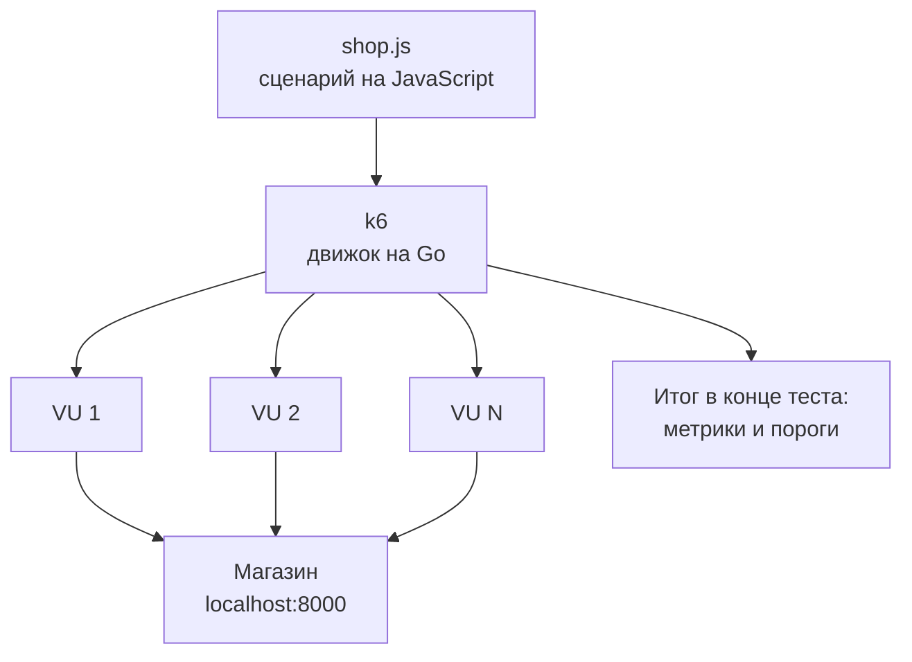
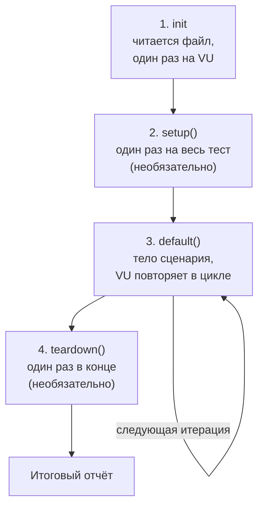
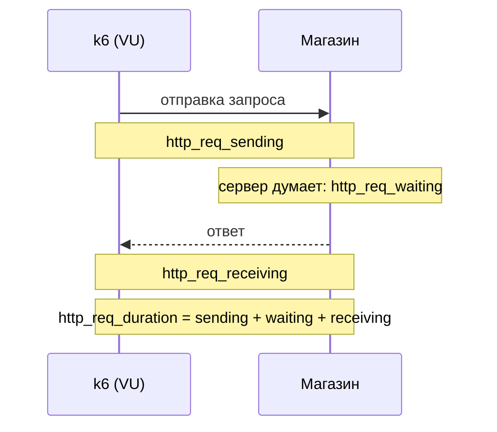

## Зачем это нужно

В теме 9 ты писал нагрузку на Python и Locust. Это хороший инструмент, но на работе тебе встретится и второй: **k6** (читается «кей-шесть»). Его выбирают команды, которым нужен тест в CI-пайплайне, который сам скажет «прошёл» или «упал», и которым надо держать заданную **скорость запросов** (например, ровно 200 в секунду), а не заданное число «пользователей». Сценарии k6 пишут на **JavaScript**, и в вакансиях для нагрузочников «умею k6» встречается почти так же часто, как «умею Locust». Поэтому второй инструмент стоит знать, чтобы не зависеть от одного.

Новичка пугает не k6, а JavaScript: «я же не программист, это язык для сайтов». Но тебе нужен не весь язык, а крошечный кусок: переменные, функции, объекты, массивы, JSON и подключение модулей. Хватит одного урока, и ты уже знаешь Python, поэтому будешь сопоставлять: «в Python так, в JavaScript вот так».

В этом уроке ты разберёшься, как k6 запускает сценарий (пользователи, итерации, стадии), как делает HTTP-запросы и проверяет ответы, и главное: научишься читать итоговый отчёт k6 **построчно**. Отчёт k6 это 30 строк чисел, и на собеседовании просят объяснить любую.

Шаг проекта: ты ставишь k6, пишешь `~/perf-lab/10-k6/shop.js` (тот же путь покупателя, что в Locust: вход, каталог, карточка товара, корзина, заказ), запускаешь на пять пользователей в течение 30 секунд и сохраняешь результат в `~/perf-lab/results/`. В [следующем уроке](02-scenarios-thresholds.md) этот же скрипт получит сценарии и пороги, в [последнем](03-k6-prometheus.md) его метрики улетят в Grafana.

## Что нужно знать

- Стенд «Магазин» запущен, `curl -s localhost:8000/readyz` отвечает: [урок 2.1](../02-web/01-client-server-http.md) и [тема 5](../05-docker/index.md). Для 10.3 понадобится профиль мониторинга из [темы 7](../07-observability/index.md).
- Что такое HTTP-запрос, статус ответа, заголовки и JSON: [урок 2.1](../02-web/01-client-server-http.md).
- Python на уровне «функции, словари, списки»: [тема 4](../04-python/index.md). Мы будем сравнивать с ним.
- Locust и путь покупателя «логин, каталог, корзина, заказ»: [урок 9.2](../09-locust/02-user-journey.md). Здесь ты повторишь тот же путь на другом инструменте.
- Задержка, перцентили p50/p95/p99, доля ошибок: [урок 8.1](../08-perf-theory/01-latency-throughput.md). Без них итоговый отчёт k6 не прочитать.

## Картина целиком

Представь киностудию. **Сценарий** фильма один, его написал автор. **Актёров** много, и каждый играет сценарий по-своему, но по одним правилам. **Режиссёр** следит, чтобы все вышли на площадку вовремя, и в конце собирает отчёт: сколько дублей снято и сколько вышло неудачными. В k6 сценарий это твой файл на JavaScript, актёры это **виртуальные пользователи** (VU, virtual users), а режиссёр это сам k6. Аналогия ломается в одном: виртуальный пользователь это не человек и не браузер, а маленькая программа, которая повторяет твой сценарий снова и снова без отдыха, если ты не вставил паузу.

Внутри k6 написан на языке **Go**, и поэтому он экономный: один процесс k6 тянет тысячи пользователей на обычном ноутбуке. Твой JavaScript выполняется не в браузере и не в Node.js (самостоятельная среда запуска JS на сервере), а во встроенном в k6 интерпретаторе. Из этого следуют два факта, которые нужно запомнить сразу: в сценарии **нет** браузерных штук (страницы, `document`, `window`) и **нет** привычных для Node модулей и менеджера пакетов `npm`. Зато есть свои модули, `k6/http` и другие, о них ниже.



Что здесь видно: файл читает один процесс k6, он запускает столько VU, сколько ты разрешил, и каждый VU сам ходит в магазин. Все замеры стекаются обратно в k6 и превращаются в итоговый отчёт.

У сценария k6 есть чёткий жизненный цикл из четырёх стадий. Четыре стадии, но две из них необязательные:



Что здесь видно: основная работа идёт на третьей стадии: функция по умолчанию выполняется снова и снова, пока не кончится время теста. Вся остальная жизнь скрипта вокруг неё: подготовиться до, прибраться после.

Три вещи в этом уроке связаны так: **JavaScript** нужен, чтобы описать сценарий; **модель VU и итераций** определяет, сколько запросов получит магазин; **метрики** показывают, как магазин справился. Если понял связь, остальное детали.

## Теория

### Минимум JavaScript: переменные и типы

**Зачем это существует.** Сценарий хранит промежуточные значения: токен, номер пользователя, адрес магазина, число. Для этого языки программирования дают **переменные**: именованные ячейки памяти. В JavaScript их два вида.

**Аналогия.** Переменная это подписанная коробка. `const` (constant, «постоянная») это коробка, запечатанная скотчем: положить внутрь можно один раз при создании, потом коробку не подменить. `let` («пусть будет») это обычная коробка, содержимое можно заменить. Аналогия ломается на деталях: у запечатанной коробки с объектом можно менять вещи внутри, нельзя заменить саму коробку. Сейчас это неважно, но запомни.

**Как это устроено.** Правило для сценария: по умолчанию пиши `const`, и только если значение придётся менять (счётчик, токен после входа), пиши `let`. Тогда случайно «затереть» нужное значение сложнее. Ещё есть старое слово `var`, оно из прошлого века и ведёт себя неочевидно, в новом коде его не пишут.

```js
const base = 'http://localhost:8000';   // адрес магазина, не меняется
let counter = 0;                         // счётчик, будем увеличивать
counter = counter + 1;                   // теперь counter равен 1
counter++;                               // сокращение: counter стал 2
```

Каждая инструкция в JavaScript заканчивается точкой с запятой. Строго говоря, язык простит её пропуск, но мы ставим, чтобы не думать о исключениях. Комментарий начинается с `//` (в Python это `#`).

Типы значений в JavaScript почти те же, что в Python:

| В JavaScript | Пример | Аналог в Python |
|---|---|---|
| строка (string) | `'привет'`, `"привет"` | `str` |
| число (number), одно на целые и дробные | `42`, `0.5` | `int` и `float` |
| логическое (boolean) | `true`, `false` | `True`, `False` |
| «ничего» намеренно | `null` | `None` |
| «значение не задано» | `undefined` | ближайшее: ошибка «нет такой переменной» |
| объект (object) | `{ a: 1 }` | `dict` |
| массив (array) | `[1, 2, 3]` | `list` |

Особенно полезны **шаблонные строки**: строка в обратных кавычках, в которую `${...}` вставляет значения. Это то же, что f-строка в Python: `` `${base}/api/products/${id}` `` вместо `f"{base}/api/products/{id}"`. Обычные кавычки для этого не работают, нужны именно обратные (клавиша слева от единицы).

**Разобранный пример.** Что вернёт каждая строка, если выполнить её в k6:

```js
console.log(0.1 + 0.2);      // 0.30000000000000004
console.log('5' + 1);        // 51   (плюс склеивает строки)
console.log('5' - 1);        // 4    (минус превращает строку в число)
console.log(5 === '5');      // false (строгое сравнение: тип тоже важен)
console.log(5 == '5');       // true  (нестрогое: JS сам приводит типы)
```

Первая строка не ошибка языка: так работают дробные числа в любом языке, и в Python будет то же (`0.30000000000000004`). Вторая и третья показывают главный подвох JavaScript: он **молча преобразует типы**, и `'5' + 1` даёт строку `51`, а не число 6. Поэтому всегда сравнивай через **три знака равенства** `===` (строгое равенство: совпали и значение, и тип). Двойное `==` в сценарии не пиши.

**Что путают.**

- `null` и `undefined`. Первое «пусто, и это сделано намеренно», второе «значение не задали». Если ты обратился к полю объекта, которого нет, получишь `undefined`, не ошибку. Это источник тихих багов: токена нет, а скрипт пошёл дальше с пустым заголовком.
- Число в строке и число-число. Переменные окружения (`__ENV`, о них ниже) всегда строки: `__ENV.RATE` равно `'20'`, а не 20. Превращай: `Number(__ENV.RATE)`.

> **Проверь понимание:** что напечатает `console.log('10' + 5, '10' - 5)`?

<details markdown="1">
<summary>Ответ</summary>

`105 5`. Плюс склеил строку `'10'` с числом 5 и получилась строка `'105'`, минус превратил `'10'` в число 10 и вычел 5. `console.log` с несколькими аргументами печатает их через пробел.

</details>

### Функции, объекты, массивы

**Зачем это существует.** Сценарий не плоский: «залогиниться» и «положить в корзину» хочется назвать и вызывать. Для этого нужны **функции**. А данные ответа сервера (токен, список товаров) приходят в виде **объектов** и **массивов**, и с ними надо уметь работать.

**Аналогия.** Функция это рецепт на карточке: «возьми эти ингредиенты, сделай вот так, получишь блюдо». Объект это карточка товара с полями «название», «цена», «остаток». Массив это нумерованная стопка таких карточек. Аналогия с карточкой ломается тем, что у объекта нет фиксированного набора полей: поле можно добавить в любой момент.

**Как это устроено.** Функцию можно записать двумя способами, и оба тебе встретятся:

```js
function pad(n, width) {                  // обычная функция
  return String(n).padStart(width, '0');
}
const email = (n) => `user${pad(n, 4)}@shop.lab`;   // стрелочная: параметры => результат
```

`String(n)` превращает число в строку, `.padStart(4, '0')` дополняет её слева нулями до длины 4: из `7` получится `'0007'`. Стрелочная запись `(n) => ...` короче и нужна там, где функцию передают как аргумент: в `check()` ты будешь писать `(r) => r.status === 200` («по ответу r верни: статус равен 200?»). Если в теле одно выражение, `return` и фигурные скобки не нужны.

Объект записывают в фигурных скобках `ключ: значение`. К полю обращаются через точку:

```js
const user = { email: 'user0001@shop.lab', password: 'password' };
console.log(user.email);          // user0001@shop.lab
user.password = 'qwerty';         // поле можно поменять, хотя user объявлен через const
console.log(user.name);           // undefined: такого поля нет, ошибки не будет
```

Массив это список в квадратных скобках, нумерация с нуля:

```js
const ids = [1, 2, 3];
console.log(ids[0], ids.length);   // 1 3
ids.push(4);                       // добавить в конец
for (const id of ids) {            // пройти по каждому элементу (в Python: for id in ids)
  console.log(id * 2);
}
ids.forEach((id) => console.log(id));   // то же самое другой записью
```

Условие записывается так: `if (условие) { ... } else { ... }`, условие в круглых скобках обязательно. Логическое «и» это `&&`, «или» это `||`, «не» это `!` (в Python `and`, `or`, `not`). Выражение `a || b` вернёт `a`, если оно «не пустое», иначе `b`: так делают значения по умолчанию, и ты увидишь это в строке `__ENV.BASE_URL || 'http://localhost:8000'`: «возьми переменную окружения, а если не задана, возьми локальный адрес».

Для тех, кто пришёл из Python, сводная таблица:

| Python | JavaScript |
|---|---|
| `x = 5` | `let x = 5;` или `const x = 5;` |
| `f"{a} и {b}"` | `` `${a} и ${b}` `` |
| `def f(a): return a * 2` | `function f(a) { return a * 2; }` или `(a) => a * 2` |
| `d = {"a": 1}`; `d["a"]` | `const d = { a: 1 };` `d.a` или `d['a']` |
| `xs.append(3)`, `len(xs)` | `xs.push(3)`, `xs.length` |
| `for x in xs:` | `for (const x of xs) { }` |
| `if a and not b:` | `if (a && !b) { }` |
| `None`, `True` | `null` (и `undefined`), `true` |
| `a == b` | `a === b` |
| блоки по отступам | блоки в `{ }`, строки кончаются `;` |

**Разобранный пример.** Адрес пользователя из номера. В Python ты написал бы `f"user{n:04d}@shop.lab"`. В JavaScript форматирования `:04d` нет, и приходится собирать из двух шагов: превратить число в строку и дополнить нулями слева. Для `n = 7` результат `'0007'`, для `n = 1000` остаётся `'1000'` (дополнять нечего). Итог: `user0007@shop.lab`. Эта функция нужна в сценарии, чтобы из номера VU получить реального пользователя стенда (`user0001@shop.lab`…`user1000@shop.lab`).

**Что путают.**

- Обращение через точку и через скобки. `user.email` и `user['email']` это одно и то же; скобки нужны, когда имя поля лежит в переменной или содержит дефис.
- Забывают `return` в обычной функции: она молча вернёт `undefined`. В стрелочной с одним выражением `return` подразумевается.

> **Проверь понимание:** функция `const f = (x) => x + 1;`. Что вернёт `f('1')`?

<details markdown="1">
<summary>Ответ</summary>

Строку `'11'`: плюс склеивает строку с числом. Если нужно число, пиши `Number(x) + 1` и получишь 2. Это тот самый подвох с неявным преобразованием типов.

</details>

### JSON: как сервер и скрипт обмениваются данными

**Зачем это существует.** Магазин принимает и отдаёт данные текстом. Например, на вход ему нужно `{"email":"user0001@shop.lab","password":"password"}`, а в ответ он пришлёт `{"token":"...","expires_in":3600}`. Этот формат называется **JSON** (JavaScript Object Notation, «запись объектов JavaScript»): текст, внешне почти совпадающий с объектом. Ты встречал его в [теме 2](../02-web/01-client-server-http.md) и в Python (`json`, `.json()` у `requests`). Именно из JavaScript формат и вышел, поэтому здесь работа с ним самая простая.

**Как это устроено.** Два действия, две обратные друг другу функции:

- `JSON.stringify(объект)` превращает объект в строку JSON. Нужно перед отправкой: тело запроса в k6 это строка.
- `JSON.parse(строка)` превращает строку JSON в объект. Нужно, чтобы вытащить поле из ответа. У ответа k6 для этого есть короткая запись `res.json()`.

```js
const text = '{"token":"abc123","expires_in":3600}';
const data = JSON.parse(text);          // теперь data.token равно 'abc123'
console.log(data.expires_in + 1);       // 3601: число осталось числом
console.log(JSON.stringify({ product_id: 5, qty: 1 }));   // {"product_id":5,"qty":1}
```

**Разобранный пример.** Что сервер возвращает при входе, мы знаем из описания стенда: `{"token":"...","expires_in":3600}`. Токен длинная случайная строка, `expires_in` сколько секунд он живёт (по умолчанию `SESSION_TTL` равно 3600, то есть час). Если в сценарии `const token = res.json('token');`, то в `token` будет только строка токена. Параметр `'token'` это **путь к полю** внутри JSON (так умеют запрашивать вложенные поля `'items.0.id'`). Если такого поля нет, получишь `undefined`, и сценарий пойдёт дальше с пустым токеном, поэтому после запроса всегда проверяй результат.

**Что путают.** JSON и объект JavaScript. В JSON ключи **всегда в двойных кавычках**, одинарные запрещены, и нет `undefined`. Если ты вручную напишешь тело запроса строкой `"{'email': 'a'}"`, сервер вернёт ошибку разбора (422). Поэтому тело собирай не руками, а через `JSON.stringify`.

> **Проверь понимание:** сервер вернул `{"items":[{"id":5},{"id":9}],"total":2}`. Как достать id второго товара из `data = JSON.parse(text)`?

<details markdown="1">
<summary>Ответ</summary>

`data.items[1].id`: `items` это массив, нумерация с нуля, поэтому второй элемент имеет индекс 1, а у него поле `id`. Результат 9. Через путь в `res.json`: `res.json('items.1.id')`.

</details>

### Модули: как разнести сценарий по файлам

**Зачем это существует.** Когда сценарий вырастает, одну и ту же функцию (например, «собрать email пользователя») не хочется копировать по пяти файлам. В JavaScript код делят на **модули**: файлы, из которых можно вынести нужное и подключить в другом месте.

**Как это устроено.** Модуль что-то отдаёт наружу словом `export`, а другой файл забирает словом `import`:

```js
// lib/util.js
export function userEmail(n) {
  return `user${String(n).padStart(4, '0')}@shop.lab`;
}
```

```js
// shop.js
import { userEmail } from './lib/util.js';   // путь начинается с ./ : файл рядом с этим
import http from 'k6/http';                  // встроенный модуль k6: адрес без ./
import { check, sleep } from 'k6';           // из встроенного модуля берём две функции
```

Фигурные скобки в `import` означают «взять вот эти имена». Запись без скобок (`import http from 'k6/http'`) берёт то, что модуль объявил «главным» (`export default`). В k6 такая форма у модуля `k6/http`. Пути с `./` ведут к твоим файлам и **обязательно с расширением** `.js`, в отличие от многих привычных по Node.js примеров. Подключать пакеты из `npm` нельзя: можно только встроенные модули k6, свои файлы и файлы по ссылке `https://` (так k6 берёт библиотеку `jslib`).

**Что путают.**

- Забывают расширение: `import ... from './lib/util'` не сработает, k6 не угадывает `.js`.
- Ищут `require(...)`: это старая запись Node.js, в k6 только `import`.
- Ждут, что k6 запустит файл на TypeScript или импортирует пакет: в нашем курсе только обычный JavaScript. (k6 2.x умеет запускать и файлы `.ts`, но ради этого не нужно ничего знать про типы, тема не про TypeScript.)

> **Проверь понимание:** `import { check } from 'k6'` и `import http from 'k6/http'`: зачем в одном случае скобки, в другом нет?

<details markdown="1">
<summary>Ответ</summary>

Из модуля `k6` забирают несколько именованных функций, и скобки перечисляют нужные. Модуль `k6/http` отдаёт один главный объект `http` как «значение по умолчанию», его импортируют без скобок и называют как удобно (`http`).

</details>

### Как k6 запускает сценарий: init, default, VU и итерации

**Зачем это существует.** Чтобы дать нагрузку, k6 должен много раз выполнить твой код параллельно. Для этого он вводит три понятия, и если ты их различаешь, остальное в k6 понятно само.

- **VU** (virtual user, виртуальный пользователь): один независимый исполнитель сценария. У каждого VU своя копия твоего кода, свои переменные, свой номер в `__VU` (с единицы). Он делает запросы **по одному**: пока не пришёл ответ, VU ждёт.
- **Итерация** (iteration): один проход функции по умолчанию от начала до конца. Выполнил логин, каталог, корзину, заказ, пауза: одна итерация. Следующую VU начинает сам.
- **Init-код**: всё, что написано в файле **вне** функций: импорты, `const`, `export const options`. Он выполняется один раз на каждый VU при его создании, до начала теста. Здесь же разрешено читать файлы (`open()`).

**Аналогия.** Кассир (VU) в магазине. Утром он один раз надевает форму и открывает кассу (init). Потом по кругу обслуживает покупателей: каждый покупатель это итерация. Если кассиров пять, одновременно обслуживаются пять покупателей. Аналогия ломается там, что виртуальный кассир не устаёт и не выходит на перерыв: без `sleep()` он сразу берёт следующего.

**Как это устроено.** Функция, которую k6 вызывает на каждой итерации, называется `default`: `export default function () { ... }`. Пока идёт тест, каждый VU вызывает её в цикле. Рядом можно описать необязательные функции `export function setup()` (один раз до теста, например, создать данные) и `export function teardown()` (один раз после). Настройки теста (сколько VU, как долго, какие пороги) лежат в `export const options = { ... }`.

Из этого следует важное свойство, на которое наткнётся каждый. Переменная, объявленная **вне** функции (в init), принадлежит конкретному VU и **сохраняется между его итерациями**. Поэтому токен после входа можно сохранить в такой переменной и больше не логиниться: каждый VU войдёт один раз, и дальше будет использовать свой токен. Это не мелочь: логин в «Магазине» самая дорогая операция (проверка пароля через bcrypt занимает около четверти секунды процессорного времени, а стенд по умолчанию считает всё одним воркером). Если логиниться на каждой итерации, ты будешь нагружать не каталог и заказы, а проверку паролей, и все метрики окажутся про неё.

<div class="viz" data-viz="k6-vu-lanes" data-vus="3" data-latency="300" data-sleep="1"></div>

Что здесь видно: у каждого VU своя дорожка, синее это идущий запрос, серое это `sleep()`. Одна итерация это пара «синее плюс серое», и дорожки не синхронны, потому что время ответа немного плавает. Чем больше VU и меньше пауза, тем плотнее заполнена картинка и тем больше запросов в секунду получает магазин. Посчитай по формуле из блока «Что сейчас происходит»: число запросов в секунду равно числу VU, делённому на время одной итерации.

**Разобранный пример.** Три VU, запрос 300 мс, `sleep(1)`. Одна итерация длится 0,3 + 1 = 1,3 секунды. За 30 секунд один VU успеет 30 / 1,3 ≈ 23 итерации, три VU около 69. Магазин получит в среднем 3 / 1,3 ≈ 2,3 запроса в секунду, а не «3 пользователя = 3 запроса». Всё дело в паузе: большую часть времени VU просто думает. Уберёшь `sleep` и получишь 3 / 0,3 = 10 запросов в секунду от тех же трёх VU. Это та самая связь «пользователи, задержка, RPS», с которой ты работал в [уроке 8.2](../08-perf-theory/02-queues-littles-law.md) (закон Литтла).

**Что путают.**

- VU и «поток» или «запрос». VU делает **один запрос за раз**; параллельных запросов у одного VU нет (кроме специальной функции `http.batch`, о ней не сейчас).
- Итерацию и запрос. В одной итерации может быть пять запросов.
- Init и default. Код вне функции выполняется один раз на VU, а не на каждой итерации. Если положить `console.log('привет')` в init, он напечатается по разу на каждый VU, а не на каждую итерацию.

> **Проверь понимание:** запрос длится 100 мс, пауза 0, VU 5. Сколько запросов в секунду получит сервер, если он отвечает ровно за 100 мс при любой нагрузке?

<details markdown="1">
<summary>Ответ</summary>

Одна итерация 0,1 с, у одного VU 10 итераций в секунду, у пяти 50 запросов в секунду. На практике чуть меньше: сам k6 тоже тратит доли миллисекунды на каждую итерацию.

</details>

### HTTP-запросы и ответ

**Зачем это существует.** Весь сценарий это набор запросов к API, и модуль `k6/http` умеет их делать и сам замеряет, сколько на них ушло времени.

**Как это устроено.** Основные функции: `http.get(url, params)`, `http.post(url, body, params)`, дальше по аналогии `http.put`, `http.del`. Последний аргумент `params` это объект с настройками: `headers` (заголовки), `tags` (метки для метрик, о них в 10.2), `timeout` (сколько ждать ответа, по умолчанию 60 секунд).

```js
const res = http.post(`${base}/api/login`,
  JSON.stringify({ email: 'user0001@shop.lab', password: 'password' }),
  { headers: { 'Content-Type': 'application/json' } });
```

Разбор: URL собран шаблонной строкой, тело это строка JSON из `JSON.stringify`, а заголовок `Content-Type: application/json` говорит серверу, что в теле именно JSON. Для строкового тела k6 этот заголовок **сам не ставит**, поэтому ты пишешь его руками.

Что возвращает функция. Объект ответа с полями, которые ты будешь использовать чаще всего:

| Поле | Что в нём |
|---|---|
| `res.status` | код ответа (200, 201, 404…); 0, если ответа не было вообще (сервер недоступен) |
| `res.body` | тело ответа строкой |
| `res.json()` | тело, разобранное как JSON; `res.json('token')` вернёт одно поле по пути |
| `res.headers` | заголовки ответа |
| `res.timings.duration` | сколько мс длился запрос (то же значение уходит в `http_req_duration`) |
| `res.error` | текст сетевой ошибки, если она была (например, соединение отклонено) |

**Самая важная особенность.** k6 **не бросает исключение** при ответе 404 или 500: для него это обычный ответ, он честно запишет задержку и статус. Исключений ждать не нужно. Хороший ли это ответ, решаешь ты проверкой (`check`, ниже). Если сервера нет совсем, k6 тоже не падает: `res.status` равен 0, в `res.error` лежит причина, а в консоль придёт предупреждение (`WARN` `Request Failed`).

**Разобранный пример.** Полный путь покупателя в «Магазине» состоит из пяти запросов: `POST /api/login` (получить токен), `GET /api/products` (каталог), `GET /api/products/{id}` (карточка), `POST /api/cart/items` с телом `{"product_id": N, "qty": 1}` (корзина), `POST /api/orders` (заказ). Последние два требуют заголовок `Authorization: Bearer <токен>`: он доказывает серверу, что ты это ты. Заказ возвращает 201 и `{id, status, total, items}`, корзина 201, вход 200.

**Что путают.**

- Думают, что 404 или 500 «уронят» скрипт. Нет, k6 пойдёт дальше. Поэтому проверки обязательны.
- Ставят `id` товара прямо в URL и удивляются потом большому числу «разных» адресов в метриках. Проблема и решение в блоке «Метки `name`».

> **Проверь понимание:** `res.status` равен 0. Что это значит?

<details markdown="1">
<summary>Ответ</summary>

Ответа не было: сервер недоступен, соединение отклонено или запрос не уложился в таймаут. В `res.error` лежит причина. Настоящих HTTP-ответов с кодом 0 не бывает.

</details>

### check(): проверка ответа, которая не останавливает тест

**Зачем это существует.** Ответ 200 не значит «всё хорошо»: сервер мог вернуть 200 с пустым телом или ошибкой внутри. Нужно уметь проверить, что ответ тот, который ты ждёшь, и посчитать долю успехов.

**Как это устроено.** Функция `check(значение, { 'название': функция })` вызывает каждую функцию с ответом и записывает результат в метрику `checks` (доля успешных). Возвращает `true`, только если **все** проверки прошли.

```js
const ok = check(res, {
  'вход: 200': (r) => r.status === 200,
  'токен получен': (r) => typeof r.json('token') === 'string',
});
if (!ok) return;     // неудачный вход: нет смысла идти дальше
```

Название проверки это строка, под ней проверка появится в итоге. Пиши названия так, чтобы по красной строке было понятно, что сломалось: `'вход: 200'`, а не `'check1'`.

Главное, что нужно усвоить: **`check` не останавливает тест и не определяет итоговый «прошёл или упал»**. Упавшая проверка просто уменьшает долю в метрике `checks` и ставит красный крестик в отчёте. Чтобы тест «упал» (особенно в CI), нужен **порог** (threshold): условие на метрику, которое мы разберём в [уроке 10.2](02-scenarios-thresholds.md). Пара проверка плюс порог работает так: `check` фиксирует факты, порог выносит приговор.

А что считать «ошибкой запроса» для метрики `http_req_failed`? Для неё k6 по умолчанию считает неудачным любой ответ вне диапазона 200–399 (и все сетевые ошибки). Поэтому 401, 404, 500 попадут в `http_req_failed`, а 301 и 302 нет. Если ответ 404 для тебя ожидаемый, диапазон «ожидаемых» статусов можно поменять: `http.setResponseCallback(http.expectedStatuses(200, 404))`. В нашем сценарии менять ничего не нужно.

**Что путают.** `check` и `if`. `check` не прерывает итерацию, он только записывает результат: чтобы остановиться, ты сам пишешь `if (!ok) return;`. И `check` с `http_req_failed`: проверка может упасть при коде 200 (в теле не то), а запрос при этом «не failed». Это две независимые метрики, и смотреть надо обе.

### sleep(): время на раздумье

Функция `sleep(секунды)` из модуля `k6` останавливает **только текущий VU** на заданное время. Она нужна, чтобы моделировать паузу человека между кликами (по-английски think time, «время на раздумье»). Без неё VU, получив ответ, мгновенно шлёт следующий запрос, и нагрузка на сервер в десятки раз выше, чем создали бы живые люди. В [уроке 8.4](../08-perf-theory/04-load-profile-slo.md) профиль нагрузки считали как раз через паузы. Аргумент может быть дробным: `sleep(0.5)`, и бывает случайным: `sleep(1 + Math.random())` (пауза от 1 до 2 секунд; `Math.random()` возвращает случайное число от 0 до 1). Для первого скрипта хватит `sleep(1)`.

### Метки name: чтобы 10 000 товаров не стали 10 000 строк в отчёте

URL `/api/products/17`, `/api/products/4213` и `/api/products/8` для k6 разные. В метриках у каждого запроса есть **метка** (tag) `url`, а значит, на каждый товар будет своя строка. В отчёте k6 это не видно, но в системе мониторинга (10.3) тысячи разных значений метки приведут к перегрузке: у Prometheus это называется **высокая кардинальность** (число уникальных комбинаций меток). Решение: задать запросу метку `name` с одним общим значением.

```js
http.get(`${base}/api/products/${id}`, { tags: { name: '/api/products/[id]' } });
```

Так все карточки товаров соберутся под одним именем. Locust решал ту же задачу параметром `name`, ты делал это в [теме 9](../09-locust/01-first-locustfile.md).

### Итоговый отчёт k6 построчно

Когда тест закончился, k6 печатает отчёт. Его надо уметь читать: именно по нему принимают решение. В версии 2.x основной вариант называется **compact** (компактный): сначала пороги, потом проверки, потом метрики четырёх групп. Каждая метрика имеет **тип**, и от типа зависит вид строки:

| Тип | Что хранит | Как выглядит в отчёте |
|---|---|---|
| Counter (счётчик) | число, которое только растёт | итог и скорость в секунду: `521  17.3/s` |
| Gauge (датчик) | текущее значение | последнее, минимум и максимум: `5  min=5  max=5` |
| Rate (доля) | какая часть значений «ненулевая» | процент и «сколько из скольких»: `0.00%  0 out of 521` |
| Trend (распределение) | много замеров, показывается их статистика | `avg=… min=… med=… max=… p(90)=… p(95)=…` |

Для Trend: `avg` среднее, `min` и `max` крайние значения, `med` медиана (то же, что p50), `p(90)` и `p(95)` перцентили. Ты знаешь из [8.1](../08-perf-theory/01-latency-throughput.md), что среднему верить нельзя, и смотреть надо на `p(95)`. Единицы читай внимательно: `µs` микросекунды (миллионные доли секунды), `ms` миллисекунды, `s` секунды.

Теперь самая важная часть, **время одного запроса**. `http_req_duration` это не «всё, что произошло до ответа», а конкретная сумма. Она состоит из трёх частей, и по ним видно, где тратится время:



Что здесь видно: `waiting` это то самое «время до первого байта» (TTFB, [урок 8.1](../08-perf-theory/01-latency-throughput.md)), и именно в нём почти всегда живёт работа сервера. До отправки есть ещё `http_req_blocked` (ожидание свободного соединения) и `http_req_connecting` (открытие соединения), но они **в `http_req_duration` не входят**.

Теперь отчёт по группам.

**THRESHOLDS** (пороги): список условий, которые ты задал в `options`, каждое с результатом. `✓` выполнено, `✗` нарушено. Если нарушено хоть одно, k6 завершится с ненулевым кодом (подробнее в 10.2).

**TOTAL RESULTS, checks:** `checks_total` сколько проверок выполнено всего, `checks_succeeded` и `checks_failed` доля успехов и неудач. Ниже список проверок по названиям: `✓` все прошли, `✗` есть падения (рядом покажет, сколько).

**HTTP:**

- `http_req_duration`: задержка запросов (Trend), основной показатель. Строка `{ expected_response:true }` сразу под ней: то же, но только для **ожидаемых** ответов (не вошедших в `failed`). Если запросы были неудачными и быстрыми (например, 500 за 2 мс), общая строка станет красивее, чем есть на самом деле, а `expected_response:true` покажет правду. Всегда сверяй эти две строки.
- `http_req_failed`: доля неудачных запросов в смысле «вне 200–399 или без ответа» (Rate). Это ваша «доля ошибок» из 8.1.
- `http_reqs`: сколько всего запросов, и скорость: запросов в секунду (Counter). Это RPS.

**EXECUTION:**

- `iteration_duration`: время одной итерации целиком, вместе с паузой (Trend). Если у итерации 5 запросов и `sleep(1)`, значение будет заметно больше суммы задержек.
- `iterations`: сколько итераций выполнено и скорость в секунду (Counter).
- `vus`: сколько VU работало: последнее значение, минимум, максимум (Gauge). `vus_max` сколько VU **выделено** (подготовлено), иногда больше, чем `vus`.
- `dropped_iterations` в отчёте появится только в некоторых режимах (10.2): сколько итераций k6 не смог запустить.

**NETWORK:** `data_received` и `data_sent`: сколько байт получено и отправлено, всего и в секунду (Counter). Полезно, чтобы заметить, что сценарий качает мегабайты, хотя должен килобайты.

**Разобранный пример.** Допустим, в конце теста строки такие: `http_reqs ... 521  17.3/s`, `iterations ... 129  4.29/s`, `http_req_duration ... avg=29.7ms med=14.2ms p(95)=82.4ms max=291ms`. Читаем: за 30 секунд сделано 521 запрос (17 в секунду) в рамках 129 итераций (4 в секунду), на итерацию приходится 4 запроса (521 − 5 логинов = 516; 516 / 129 = 4). Медиана вдвое меньше среднего, значит, есть хвост из медленных запросов. Их мы видим в `max=291ms`: это вход, где проверяется пароль. Среднее 29,7 мс скрывает, что заказ занимает 80 мс, а каталог 12 мс: отчёт показывает **все запросы сразу**, и чтобы разделить их, нужны метки `name` и пороги по ним (10.2).

**Что путают.**

- `iterations` и `http_reqs`. Итераций меньше, чем запросов, если на итерацию больше одного запроса.
- `http_req_duration` и `iteration_duration`: первое про один запрос, второе про всю итерацию с паузой.
- «Ошибок 0,00%, значит, всё хорошо». Нет: `http_req_failed` смотрит только на код ответа. Сломанное тело при 200 `http_req_failed` не увидит, его ловят проверки.

> **Проверь понимание:** в отчёте `http_req_failed: 50.00% 260 out of 520` и `checks_failed: 0.00%`. Как такое возможно?

<details markdown="1">
<summary>Ответ</summary>

Половина запросов вернула код вне 200–399, а проверки в сценарии не проверяют эти запросы или проверяют не то (например, только `status === 200` у одного из шагов, а упавшие запросы в проверки не попали, потому что скрипт раньше сделал `return`). Две метрики независимы: проверки видят только то, что ты проверил, а `http_req_failed` смотрит на все запросы.

</details>

## Практика

Все файлы лежат в `~/perf-lab/10-k6/`. Стенд «Магазин» должен быть запущен: `curl -s localhost:8000/readyz` отвечает `{"status":"ready"}`.

### 1. Поставь k6

Команды из официальной документации k6 для Ubuntu. Разбор по строкам:

```bash
sudo apt-get update && sudo apt-get install -y ca-certificates curl gpg
curl -fsSL https://dl.k6.io/key.gpg | sudo gpg --dearmor -o /usr/share/keyrings/k6-archive-keyring.gpg
echo "deb [signed-by=/usr/share/keyrings/k6-archive-keyring.gpg] https://dl.k6.io/deb stable main" | sudo tee /etc/apt/sources.list.d/k6.list
sudo apt-get update
sudo apt-get install -y k6
k6 version
```

Что делает каждая часть. Первая строка ставит утилиты, нужные для скачивания и проверки подписей (`curl`, `gpg` могли уже стоять, повторная установка безвредна). Вторая скачивает **ключ**, которым Grafana подписывает пакеты: `-fsSL` значит «упасть при ошибке, молчать, показать ошибку, идти по перенаправлениям», `gpg --dearmor` переводит ключ из текстового вида в бинарный, а `-o` сохраняет в файл. Третья добавляет адрес репозитория в список источников apt: параметр `signed-by` ограничивает доверие **только этим ключом**, чтобы он не мог подписывать пакеты других источников; `tee` записывает в файл под `sudo`, потому что обычное перенаправление `>` прав не получило бы. Четвёртая обновляет список пакетов, пятая ставит k6, последняя печатает версию.

Ожидаемый вывод последней команды:

```text
k6 v2.3.0 (commit/3f9a2b1c4d, go1.26.0, linux/amd64)
```

**Как читать вывод:** первое число версии `2` важно. Много статей в интернете написано про k6 версий 0.x и 1.x. Из версии 2.0 убрали старые вещи: команды `k6 pause`, `k6 resume`, `k6 scale`, `k6 status` и один из исполнителей нагрузки (`externally-controlled`), а флаг `--no-summary` заменён на `--summary-mode=disabled`. Увидишь такие команды в старой инструкции, значит, она устарела. Остальное из статей (`k6/http`, `check`, `sleep`, `options`) работает так же.

**Типичные ошибки:**

- `E: Unable to locate package k6`: репозиторий не добавлен или не выполнен `apt-get update` после добавления. Повтори третью и четвёртую команды.
- `NO_PUBKEY` при `apt-get update`: ключ не скачался или записан не туда. Повтори вторую команду и убедись, что файл `/usr/share/keyrings/k6-archive-keyring.gpg` существует.

### 2. Освой JavaScript на самом k6

Отдельного JavaScript (Node.js) ты не ставил, и не надо: учебные куски запустим прямо в k6. Создай каталог и файл:

```bash
mkdir -p ~/perf-lab/10-k6/lib ~/perf-lab/results && cd ~/perf-lab/10-k6
nano js-basics.js
```

```js
// js-basics.js: учебный файл, запускаем его самим k6
const base = 'http://localhost:8000';
let counter = 0;
const user = { email: 'user0001@shop.lab', password: 'password' };
const ids = [1, 2, 3];

function pad(n, width) { return String(n).padStart(width, '0'); }
const email = (n) => `user${pad(n, 4)}@shop.lab`;

export default function () {
  counter++;
  console.log(`итерация ${counter}, VU ${__VU}`);
  console.log(email(7), email(1000));
  console.log(JSON.stringify(user));
  const data = JSON.parse('{"token":"abc","expires_in":3600}');
  console.log(data.token, data.expires_in + 1);
  for (const id of ids) console.log(`${base}/api/products/${id}`);
  console.log(typeof user, Array.isArray(ids), ids.length, user.name);
  console.log(0.1 + 0.2, '5' + 1, '5' - 1, 5 === '5', 5 == '5');
}
```

Запуск: `k6 run --iterations 2 --summary-mode=disabled js-basics.js`. Разбор: `k6 run файл` запускает сценарий; `--iterations 2` говорит «две итерации, потом стоп» (VU по умолчанию один); `--summary-mode=disabled` выключает итоговый отчёт, он нам сейчас не нужен.

```text
INFO[0000] итерация 1, VU 1                              source=console
INFO[0000] user0007@shop.lab user1000@shop.lab           source=console
INFO[0000] {"email":"user0001@shop.lab","password":"password"}  source=console
INFO[0000] abc 3601                                      source=console
INFO[0000] http://localhost:8000/api/products/1          source=console
INFO[0000] http://localhost:8000/api/products/2          source=console
INFO[0000] http://localhost:8000/api/products/3          source=console
INFO[0000] object true 3 undefined                       source=console
INFO[0000] 0.30000000000000004 51 4 false true           source=console
INFO[0000] итерация 2, VU 1                              source=console
...
```

(Вывод второй итерации повторяет первую, кроме строки про счётчик.) **Как читать вывод:** `INFO` это уровень сообщения, `[0000]` секунды от старта теста, `source=console` значит «напечатано твоим `console.log`». Строка «итерация 2» показывает главное: `counter` из init **не сбросился** между итерациями, потому что принадлежит VU. Попробуй `--vus 2 --iterations 4`: у каждого VU будет свой счётчик.

**Типичные ошибки:**

- `SyntaxError: ... Unexpected token`: чаще всего пропущена скобка или запятая. k6 называет строку и столбец.
- `ReferenceError: ... is not defined`: имя написано с опечаткой или переменной нет в этой области.

### 3. Первый запрос

```js
// hello.js
import http from 'k6/http';
import { check } from 'k6';

export default function () {
  const res = http.get('http://localhost:8000/healthz');
  check(res, { 'healthz: 200': (r) => r.status === 200 });
}
```

Запусти: `k6 run hello.js`. Без опций k6 делает **одну итерацию одним VU**: удобно для проверки, что скрипт вообще работает.

```text
         execution: local
            script: hello.js
            output: -

         scenarios: (100.00%) 1 scenario, 1 max VUs, 10m30s max duration (incl. graceful stop):
                  * default: 1 iterations for each of 1 VUs (maxDuration: 10m0s, gracefulStop: 30s)


  █ TOTAL RESULTS

    checks_total.......................: 1       151.2/s
    checks_succeeded...................: 100.00% 1 out of 1
    checks_failed......................: 0.00%   0 out of 1

    ✓ healthz: 200

    HTTP
    http_req_duration.......................................................: avg=4.62ms min=4.62ms med=4.62ms max=4.62ms p(90)=4.62ms p(95)=4.62ms
      { expected_response:true }............................................: avg=4.62ms min=4.62ms med=4.62ms max=4.62ms p(90)=4.62ms p(95)=4.62ms
    http_req_failed.........................................................: 0.00%  0 out of 1
    http_reqs...............................................................: 1      151.2/s

    EXECUTION
    iteration_duration......................................................: avg=6.18ms min=6.18ms med=6.18ms max=6.18ms p(90)=6.18ms p(95)=6.18ms
    iterations..............................................................: 1      151.2/s
    vus.....................................................................: 1      min=1 max=1
    vus_max.................................................................: 1      min=1 max=1

    NETWORK
    data_received...........................................................: 142 B  21 kB/s
    data_sent...............................................................: 80 B   12 kB/s
```

У тебя числа будут другие, формат тот же. **Как читать вывод:** блок `scenarios` сверху пересказывает, что k6 собирался сделать: «1 итерация на 1 VU». Одна проверка прошла (`✓`), один запрос (`http_reqs 1`), на запрос ушло 4,62 мс, а итерация длилась 6,18 мс (разница это накладные расходы k6). Скорость в секунду (151/s) на одной итерации ничего не значит: это «1 запрос / 6,6 мс», не нагрузка.

**Типичные ошибки:**

- `WARN ... Request Failed ... dial tcp 127.0.0.1:8000: connect: connection refused`: стенд не запущен. Подними его (`docker compose up -d` в `~/load-tester/project/shop`) и проверь `readyz`.
- `GoError: ... open ... no such file`: неверный путь к файлу сценария, запускай из каталога `~/perf-lab/10-k6`.

### 4. Сценарий покупателя

Вынеси помощник в модуль `lib/util.js`:

```js
// lib/util.js
export function userEmail(n) {
  return `user${String(n).padStart(4, '0')}@shop.lab`;
}
```

И напиши `shop.js`:

```js
// shop.js: путь покупателя «Магазина»: вход, каталог, карточка, корзина, заказ
import http from 'k6/http';
import { check, sleep } from 'k6';
import { userEmail } from './lib/util.js';

const BASE = (__ENV.BASE_URL || 'http://localhost:8000').replace(/\/$/, '');
const JSON_HEADERS = { 'Content-Type': 'application/json' };

export const options = {
  vus: 5,
  duration: '30s',
  thresholds: { http_req_failed: ['rate<0.01'] },
};

// Эти переменные свои у каждого VU и живут между итерациями.
let token;
let tokenExpiresAt = 0;

function login() {
  const number = ((__VU - 1) % 1000) + 1;            // VU 1 это user0001, VU 1001 снова user0001
  const res = http.post(`${BASE}/api/login`,
    JSON.stringify({ email: userEmail(number), password: 'password' }),
    { headers: JSON_HEADERS });
  if (!check(res, { 'вход: 200': (r) => r.status === 200 })) return false;
  token = res.json('token');
  tokenExpiresAt = Date.now() + (res.json('expires_in') - 5) * 1000;   // с запасом в 5 секунд
  return true;
}

export default function () {
  if (!token || Date.now() >= tokenExpiresAt) {
    if (!login()) return;
  }
  const auth = { headers: { ...JSON_HEADERS, Authorization: `Bearer ${token}` } };

  check(http.get(`${BASE}/api/products`), { 'каталог: 200': (r) => r.status === 200 });

  const productId = 1 + Math.floor(Math.random() * 10000);
  check(http.get(`${BASE}/api/products/${productId}`, { tags: { name: '/api/products/[id]' } }),
    { 'карточка: 200': (r) => r.status === 200 });

  check(http.post(`${BASE}/api/cart/items`, JSON.stringify({ product_id: productId, qty: 1 }), auth),
    { 'корзина: 201': (r) => r.status === 201 });

  check(http.post(`${BASE}/api/orders`, null, auth), { 'заказ: 201': (r) => r.status === 201 });

  sleep(1);
}
```

Разбор незнакомых мест. `(__ENV.BASE_URL || '...')` значение из переменной окружения или локальный адрес; `.replace(/\/$/, '')` убирает слэш в конце, если он есть. `{ ...JSON_HEADERS, Authorization: ... }` копирует поля объекта и добавляет ещё одно (три точки называют «spread», разворот). `Date.now()` текущее время в миллисекундах, поэтому `expires_in` (секунды) умножается на 1000. `Math.floor(Math.random() * 10000)` случайное целое от 0 до 9999, плюс 1 даёт id товара от 1 до 10 000. `http.post(url, null, auth)` запрос без тела. В `if (!login()) return;` неудачный вход просто завершает итерацию (VU начнёт следующую).

Сначала запусти «на пробу» (один VU, одна итерация), чтобы убедиться, что сценарий вообще работает: `k6 run --vus 1 --iterations 1 shop.js`. Все пять проверок должны быть зелёными. Если красная, смотри, какая: по названию видно шаг. Включи показ запросов и ответов `--http-debug=full` (он печатает каждый запрос и ответ целиком, поэтому с ним запускай только один раз и на одной итерации).

Теперь основной запуск, с сохранением отчёта в файл (`tee` пишет в файл и одновременно на экран):

```bash
k6 run shop.js | tee ~/perf-lab/results/k6-first.txt
```

```text
         execution: local
            script: shop.js
            output: -

         scenarios: (100.00%) 1 scenario, 5 max VUs, 1m0s max duration (incl. graceful stop):
                  * default: 5 looping VUs for 30s (gracefulStop: 30s)


  █ THRESHOLDS

    http_req_failed
    ✓ 'rate<0.01' rate=0.00%


  █ TOTAL RESULTS

    checks_total.......................: 521     17.31/s
    checks_succeeded...................: 100.00% 521 out of 521
    checks_failed......................: 0.00%   0 out of 521

    ✓ вход: 200
    ✓ каталог: 200
    ✓ карточка: 200
    ✓ корзина: 201
    ✓ заказ: 201

    HTTP
    http_req_duration..................: avg=29.7ms  min=4.9ms  med=14.2ms  max=291ms   p(90)=76.3ms  p(95)=82.4ms
      { expected_response:true }.......: avg=29.7ms  min=4.9ms  med=14.2ms  max=291ms   p(90)=76.3ms  p(95)=82.4ms
    http_req_failed....................: 0.00%  0 out of 521
    http_reqs..........................: 521    17.31/s

    EXECUTION
    iteration_duration.................: avg=1.16s   min=1.08s  med=1.15s   max=1.41s   p(90)=1.2s    p(95)=1.24s
    iterations.........................: 129    4.29/s
    vus................................: 5      min=5      max=5
    vus_max............................: 5      min=5      max=5

    NETWORK
    data_received......................: 731 kB 24 kB/s
    data_sent..........................: 161 kB 5.3 kB/s
```

Цифры условные, у тебя будут другие: на стенде задержки зависят от машины. **Как читать вывод.** Идём сверху вниз.

1. `scenarios`: «5 looping VUs for 30s»: пять пользователей по кругу в течение 30 секунд. Максимальная длительность 1m0s включает 30 секунд на мягкое завершение (`gracefulStop`): k6 дожидается итераций, начатых к концу времени.
2. `THRESHOLDS`: порог `rate<0.01` на `http_req_failed` выполнен: ошибок 0,00% (меньше 1%).
3. `checks`: 521 проверка, все успешны. Проверок 521 (а не 516) потому, что к 516 проверкам по четырём шагам плюс 5 раз по одному разу вошли пять VU.
4. `http_req_duration`: среднее 29,7 мс, медиана 14,2 мс, p(95) = 82,4 мс. Разрыв между медианой и средним означает «хвост»: это заказы (~75 мс, внутри них сходка в «оплату» с её 50 мс) и пять входов (до 291 мс).
5. `iterations`: 129 за 30 с, 4,29 в секунду. Проверим формулой из теории: пять VU и итерация примерно 1,16 с дают 5 / 1,16 ≈ 4,3. Совпало, значит, сценарий ведёт себя как задумано.
6. `http_reqs`: 521 запрос, 17,31 в секунду. 4 запроса на итерацию умножить на 4,29 = 17,2, плюс пять входов.
7. `vus`: все пять VU работали весь тест. `iteration_duration` чуть больше 1 секунды, потому что включает `sleep(1)`.

Закоммить результат, как в предыдущих темах:

```bash
cd ~/perf-lab && git add 10-k6 results/k6-first.txt && git commit -m "k6: первый сценарий покупателя" && git push
```

**Типичные ошибки:**

- `ReferenceError: userEmail is not defined` или `GoError: The moduleSpecifier "./lib/util" ...`: забыто расширение `.js` в импорте или файл лежит не в `lib/`.
- `TypeError: Cannot read property 'token' of undefined` (или `null`): `res.json()` вызван на запросе, который вернул не JSON, например при недоступном магазине. Поэтому у входа стоит проверка и ранний `return`.
- Все проверки красные `✗ вход: 200`, `http_req_failed` близко к 100%: магазин не запущен или логин 401. Выполни вручную `curl -s localhost:8000/api/login -H 'Content-Type: application/json' -d '{"email":"user0001@shop.lab","password":"password"}'`.

## Сломай и почини

**Поломка.** Измени пароль в `login()` на `'passw0rd'` (опечатка вместо `'password'`) и запусти `k6 run shop.js; echo "код выхода: $?"`.

**Задача.** Прежде чем читать разбор, ответь себе: что покажет отчёт и почему? Ты видишь только этот отчёт, как дежурный, которому прислали красный пайплайн. Порядок рассуждения:

<div class="viz" data-viz="flow" data-steps='[{"title":"Что в порогах","text":"Есть `✗`? Какой метрики?"},{"title":"Что в проверках","text":"Какая проверка падает и сколько раз?"},{"title":"Сколько итераций","text":"Итераций слишком много или мало по сравнению с обычным прогоном?"},{"title":"Покажи ответ","text":"Один прогон `--vus 1 --iterations 1` и `--http-debug=full`."},{"title":"Исправь и проверь","text":"Верни пароль, убедись по тем же строкам."}]'></div>

<details markdown="1">
<summary>Разбор</summary>

1. В `THRESHOLDS` стоит `✗ 'rate<0.01' rate=100.00%`: порог по `http_req_failed` нарушен, все запросы «неудачные». Код выхода равен 99 (так k6 сообщает, что порог нарушен, это основа работы в CI, подробно в 10.2).
2. В проверках красный только `вход: 200`, а остальных четырёх нет вовсе: их не запускали, потому что при неудачном входе итерация завершается раньше (`return`). Вывод: «ломается самый первый шаг».
3. Итераций стало гораздо больше (несколько тысяч), а `iteration_duration` почти нулевая: каждая итерация это один быстрый 401, и сразу следующий. Нагрузка получилась страшнее обычной, но она бессмысленная. Это важный урок: **красная нагрузка не равна «тяжёлой»**, часто это просто быстрые ошибки. Заодно у стенда: неверный пароль тоже проверяется через bcrypt, то есть процессор занят зря.
4. Одна итерация с `--http-debug=full` покажет: `HTTP/1.1 401 Unauthorized` и тело `{"detail":"invalid credentials"}` или подобное сообщение об ошибке входа.
5. Верни `'password'`, запусти ещё раз: порог `✓`, код выхода 0.

</details>

## Словарик урока

| Термин | Простыми словами |
|---|---|
| k6 | Инструмент нагрузочного тестирования: движок на Go, сценарии на JavaScript |
| VU (virtual user) | Виртуальный пользователь: независимый исполнитель сценария, делает запросы по одному |
| Итерация (iteration) | Один проход функции по умолчанию от начала до конца |
| Init-код | Всё вне функций в файле: выполняется один раз на VU до начала теста |
| default-функция | Тело сценария: VU вызывает её в цикле, пока идёт тест |
| setup / teardown | Необязательные функции: один раз до теста и один раз после |
| `options` | Настройки теста: VU, длительность, пороги |
| `const` / `let` | Переменная, которую нельзя переназначить, и которую можно |
| Стрелочная функция | Короткая запись функции: `(r) => r.status === 200` |
| Шаблонная строка | Строка в обратных кавычках со вставками `${значение}` |
| JSON | Текстовый формат данных; `JSON.stringify` создаёт его, `JSON.parse` разбирает |
| Модуль (module) | Файл, из которого `export` отдаёт код, а `import` забирает его |
| `check` | Проверка ответа: считает долю успехов, тест не останавливает |
| Порог (threshold) | Условие на метрику, нарушение которого роняет тест (подробно в 10.2) |
| Think time | Пауза между действиями пользователя: `sleep()` |
| Counter / Gauge / Rate / Trend | Типы метрик: счётчик, датчик, доля, распределение с перцентилями |
| `http_req_duration` | Время запроса: отправка плюс ожидание плюс получение |
| `http_req_failed` | Доля запросов с кодом вне 200–399 или без ответа |
| Метка `name` | Общее имя для запросов с разными URL, чтобы не плодить строки в метриках |
| Кардинальность | Число уникальных комбинаций значений меток; слишком большое вредит мониторингу |

## Вопросы с собеседований

Раздел для повторения: ответь вслух, потом открой ответ. Короткие вопросы тренируй на скорость: ответ за 30 секунд.

### 1. [junior] [часто] Что такое VU и чем он отличается от итерации?

<details markdown="1">
<summary>Ответ</summary>

VU (виртуальный пользователь) это исполнитель сценария: у него свой набор переменных, и он делает запросы по одному, ожидая ответа. Итерация это один проход функции по умолчанию. VU повторяет итерации одну за другой, пока идёт тест. В одной итерации может быть много запросов.

**Что хотят услышать:** VU это исполнитель, итерация это проход, запросов больше, чем итераций.

**Красный флаг:** «VU это один запрос» или «VU это реальный человек».

</details>

### 2. [junior] [часто] Чем k6 отличается от Locust?

<details markdown="1">
<summary>Ответ</summary>

Сценарии на JavaScript против Python. k6 написан на Go и экономнее по ресурсам. В k6 есть готовые пороги с кодом выхода, удобные для CI, и можно задавать заданную скорость запросов (открытая модель); у Locust по умолчанию «столько-то пользователей» (закрытая модель) и есть удобный веб-интерфейс. Подробное сравнение в уроке 10.3.

**Что хотят услышать:** язык, модель нагрузки, пороги для CI.

**Красный флаг:** «k6 быстрее, потому что лучше», без объяснения причин.

</details>

### 3. [junior] [часто] Что делает k6, если сервер отвечает 500: бросает исключение?

<details markdown="1">
<summary>Ответ</summary>

Нет. 500 для k6 обычный ответ: он записывает задержку, считает запрос неудачным в `http_req_failed` (код вне 200–399) и идёт дальше. Хороший ли это ответ, решают проверки (`check`) и пороги.

**Что хотят услышать:** нет исключений, важны проверки, `http_req_failed`.

**Красный флаг:** «тест упадёт сам».

</details>

### 4. [junior] Чем `check` отличается от порога (threshold)?

<details markdown="1">
<summary>Ответ</summary>

`check` проверяет конкретный ответ и записывает результат в метрику `checks`, тест не останавливает и итоговый вердикт не выносит. Порог это условие на метрику за весь тест (`p(95)<500`): нарушение даёт ненулевой код выхода (99) и красный CI.

**Что хотят услышать:** проверка фиксирует, порог выносит приговор.

**Красный флаг:** «проверка роняет тест».

</details>

### 5. [junior] Из каких стадий состоит жизненный цикл скрипта k6?

<details markdown="1">
<summary>Ответ</summary>

Init (код вне функций, один раз на VU), необязательный `setup()` (один раз до теста), `default()` (тело, повторяется на каждой итерации), необязательный `teardown()` (один раз после). В конце итоговый отчёт.

**Что хотят услышать:** четыре стадии, что и сколько раз выполняется.

**Красный флаг:** «всё выполняется на каждой итерации».

</details>

### 6. [junior] Из чего складывается `http_req_duration`?

<details markdown="1">
<summary>Ответ</summary>

Из трёх частей: `http_req_sending` (отправка запроса), `http_req_waiting` (ожидание ответа, то есть работа сервера, TTFB) и `http_req_receiving` (получение ответа). Время соединения (`http_req_connecting`, `http_req_blocked`) в него не входит.

**Что хотят услышать:** три части, `waiting` это работа сервера.

**Красный флаг:** «это время всего теста» или «время до обработки на сервере».

</details>

### 7. [junior] Почему логин делают один раз на VU, а не на каждой итерации?

<details markdown="1">
<summary>Ответ</summary>

Вход дорогая операция (проверка пароля через bcrypt нагружает процессор), и в реальной жизни пользователь входит один раз, а потом ходит по магазину с токеном. Если логиниться на каждой итерации, тест нагружает логин, а не те операции, которые мы хотели проверить. Токен хранят в переменной вне функции: она принадлежит VU и живёт между итерациями.

**Что хотят услышать:** реалистичность профиля и дороговизна логина.

**Красный флаг:** «чтобы быстрее писать код».

</details>

### 8. [junior] Зачем нужен `sleep()` в нагрузочном тесте?

<details markdown="1">
<summary>Ответ</summary>

Он моделирует паузу человека между действиями (think time). Без него VU шлёт запросы без остановки, и нагрузка на сервер в десятки раз выше, чем создали бы живые люди. Паузой регулируют, сколько запросов в секунду даёт один VU: запросов в секунду на VU равно 1 / (время итерации).

**Что хотят услышать:** think time и связь с RPS.

**Красный флаг:** «чтобы сервер успел передохнуть».

</details>

### 9. [middle] Что k6 по умолчанию считает неудачным запросом и как это изменить?

<details markdown="1">
<summary>Ответ</summary>

Любой ответ вне диапазона 200–399 и сетевые ошибки. Поменять «ожидаемые» коды можно через `http.setResponseCallback(http.expectedStatuses(...))` (глобально) или параметром `responseCallback` в конкретном запросе. Нужно, когда, например, 404 это нормальный ответ для данного сценария.

**Что хотят услышать:** диапазон 200–399, способ переопределить.

**Красный флаг:** «неудачный запрос это только 500».

</details>

### 10. [middle] Почему URL с id товара вредит метрикам и как это решить?

<details markdown="1">
<summary>Ответ</summary>

Метка `url` у каждого запроса разная, значит, в системе мониторинга образуются тысячи уникальных комбинаций меток (высокая кардинальность): растёт память и замедляются запросы. Решение: задать метку `name` одним значением, `tags: { name: '/api/products/[id]' }`.

**Что хотят услышать:** кардинальность и решение через `name`.

**Красный флаг:** «отключить метки совсем».

</details>

### 11. [middle] Где можно использовать `open()` и `import` и почему?

<details markdown="1">
<summary>Ответ</summary>

Только в init-коде (вне функций): k6 читает файлы и модули один раз при создании VU, а не во время нагрузки, чтобы чтение диска не искажало замеры. Внутри `default()` вызвать `open()` нельзя.

**Что хотят услышать:** init-контекст и причина.

**Красный флаг:** «можно везде, просто медленнее».

</details>

### 12. [на скорость] Какой код выхода у k6, если порог нарушен?

<details markdown="1">
<summary>Ответ</summary>

99. При успехе 0.

</details>

### 13. [на скорость] Команда, чтобы проверить скрипт одним VU и одной итерацией?

<details markdown="1">
<summary>Ответ</summary>

`k6 run --vus 1 --iterations 1 shop.js`. Для разового показа запросов добавляют `--http-debug=full`.

</details>

### 14. [на скорость] Три метрики, которые смотришь первыми в отчёте k6?

<details markdown="1">
<summary>Ответ</summary>

`http_req_duration` (p(95)), `http_req_failed` (доля ошибок) и `http_reqs` (RPS). Потом проверки (`checks`) и `iterations`.

</details>

### 15. [на скорость] Чем `const` отличается от `let` и когда что писать?

<details markdown="1">
<summary>Ответ</summary>

`const` нельзя переназначить, `let` можно. По умолчанию `const`, `let` только для значений, которые будут меняться (счётчик, токен после входа).

</details>

## Проверено на версиях

Ubuntu 24.04, k6 2.3, стенд «Магазин» из `project/shop` (FastAPI, PostgreSQL 18.6, Redis 8.10). Октябрь 2026.

## Итог урока: ты умеешь

- [ ] Объяснить, что такое VU, итерация, init-код и функция по умолчанию, и в чём разница между ними.
- [ ] Написать на JavaScript простой сценарий: переменные, функции, объекты, массивы, JSON, `import` и `export`.
- [ ] Сделать HTTP-запросы `http.get` и `http.post` с заголовками и телом JSON и разобрать ответ.
- [ ] Поставить проверки `check` и объяснить, почему они не останавливают тест.
- [ ] Прочитать итоговый отчёт k6 построчно: `http_req_duration`, `http_req_failed`, `http_reqs`, `iterations`, `vus`, `checks`.
- [ ] Запустить сценарий покупателя `~/perf-lab/10-k6/shop.js` и сохранить результат в `~/perf-lab/results/`.

Дальше: [урок 10.2. Сценарии, открытая модель и пороги](02-scenarios-thresholds.md), где ты зададишь фиксированную скорость запросов и научишь k6 сам решать, прошёл ли тест.
