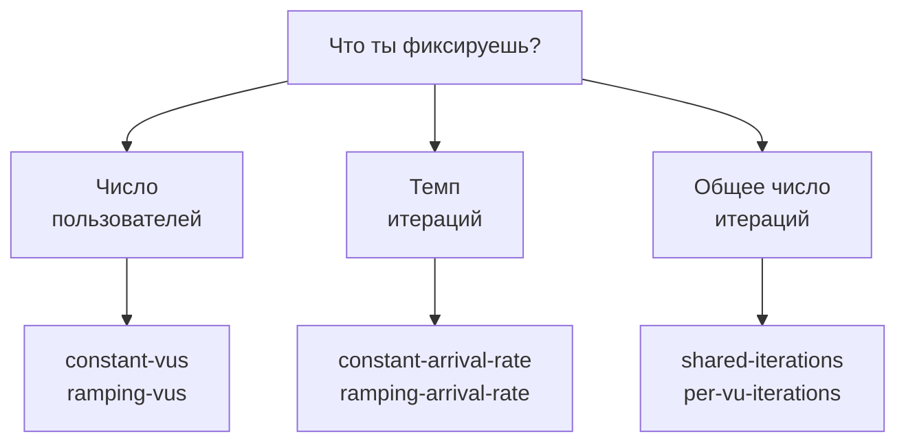
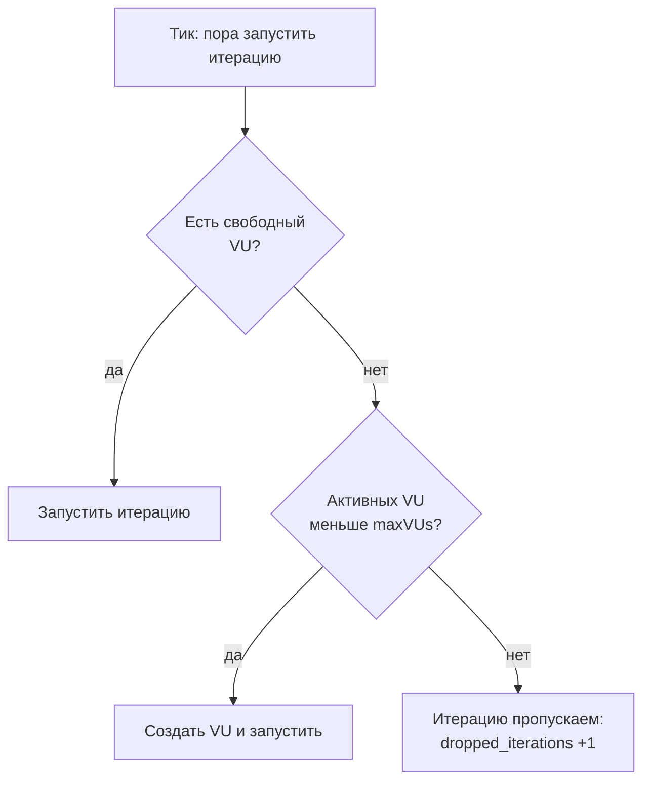

## Зачем это нужно

Снова я, твой наставник на первой работе в магазине. В [уроке 10.1](01-js-first-script.md) ты запустил k6 командой «пять пользователей, тридцать секунд». Для знакомства хорошо, но в отчёт такой запуск не поставишь.

Первый: ты не управляешь **потоком запросов**. Я однажды гонял такой тест, сервер начал тормозить, и отчёт вышел спокойный. Пять виртуальных пользователей (VU) просто стали отправлять запросы реже, потому что ждали ответов. Нагрузка упала сама, а в день распродажи покупатели придут в том же количестве. Второй недостаток: тест ничего не решает. Он напечатал таблицу, а «хорошо» это или «плохо», определяет человек глазами. Когда проверку перед релизом запускает робот (CI, автоматическая сборка), глаз нет, нужен ответ «прошёл или нет» в виде кода выхода.

Ты зададишь нагрузку как **поток** с помощью **executor'а** (так в k6 называют настройку «как запускать итерации»): «двадцать новых покупателей в секунду, что бы ни случилось». Это **открытая модель** из [урока 8.2](../08-perf-theory/02-queues-littles-law.md), где темп прихода не зависит от сервера. Пять пользователей из первого запуска это **закрытая модель**: каждый ждёт ответа. И ты запишешь требования к сервису (SLO из [урока 8.4](../08-perf-theory/04-load-profile-slo.md)) прямо в скрипт как **пороги**: тогда k6 сам завершится с нулём или с ошибкой.

Шаг проекта: ты перепишешь `~/perf-lab/10-k6/shop.js` под сценарии, подключишь 1000 пользователей и зададишь пороги. Потом поставишь три опыта: закрытая модель против открытой, поиск предела и «зелёный тест, который врёт».

## Что нужно знать

- Скрипт k6 из [урока 10.1](01-js-first-script.md): `import`, функция `default`, `http.get`/`http.post`, `check`, `sleep`, что такое VU и итерация, как читать итоговую таблицу.
- Закрытая и открытая модели нагрузки, закон Литтла: [урок 8.2](../08-perf-theory/02-queues-littles-law.md). Здесь мы будем им пользоваться при каждом расчёте.
- Виды тестов (smoke, load, stress) и SLO: [урок 8.3](../08-perf-theory/03-test-types.md) и [урок 8.4](../08-perf-theory/04-load-profile-slo.md). Пороги в k6 это SLO, записанные кодом.
- Перцентили p95 и доля ошибок: [урок 8.1](../08-perf-theory/01-latency-throughput.md).
- Запуск Locust без интерфейса, чтобы было с чем сравнивать: [урок 9.4](../09-locust/04-headless-shape.md).
- Стенд «Магазин» запущен (`curl -s localhost:8000/readyz`), оплата доступна на `localhost:8001`.

## Картина целиком

Есть два способа проверить кафе. В первом ты сажаешь за столики пять друзей: «заказывайте, как только съели прошлый заказ». Повара замешкались, друзья едят медленнее, и нагрузка на кухню сама упала. Во втором ты стоишь на улице и каждые пять секунд заводишь в кафе нового человека, как бы ни шла кухня. Повара замешкались, и в зале копится толпа. Второй способ жестче и ближе к жизни.

Первый способ это **закрытая модель**: число пользователей фиксировано, и каждый ждёт ответа. Второй это **открытая модель**: фиксирован **темп прихода**, а число занятых пользователей получается само. За выбор модели в k6 отвечает **executor** («исполнитель»). Executor'ов шесть, но выбирать просто: спроси себя, что ты держишь постоянным.



Здесь видно три ответа: пользователей (закрытая модель), темп прихода (открытая модель) или количество работы («выполни ровно столько-то итераций и остановись»). Слово `ramping` в названии значит «меняется по ходу теста».

Из темы 8 ты помнишь эту картинку: у красной линии (открытая модель) при замедлении растёт очередь, у синей (закрытая) нет.

<div class="viz" data-viz="perf-open-closed" data-rate="8" data-users="10" data-slow="3"></div>


## Теория

### Сценарий и executor: кто решает, когда запускать итерацию

В 10.1 нагрузка задавалась ключами `vus` и `duration`. Что стоит за этой короткой записью? Одна бригада актёров. **Сценарий** (scenario) это именованный блок в `options.scenarios`. У него своя роль (функция), свой выход на сцену (время старта) и свой режиссёрский план, то есть executor: «выходить по одному каждую минуту» или «пятеро играют без перерыва». Реальный тест строят из нескольких бригад: покупатели и «читатели каталога».

Напомню: **итерация** это один вызов функции сценария. Executor решает, сколько VU работает и **что запускает следующую итерацию**: завершение предыдущей (закрытая модель) или часы (открытая). Общие поля такие:

| Поле | Смысл |
|---|---|
| `executor` | Название исполнителя: как запускать итерации |
| `startTime` | Через сколько после старта теста сценарий начнёт работу (по умолчанию `'0s'`) |
| `exec` | Имя экспортируемой функции, которую крутит сценарий (по умолчанию `default`) |
| `env` | Свои переменные окружения только для этого сценария |
| `tags` | Свои теги для всех метрик этого сценария |
| `gracefulStop` | Сколько ждать завершения уже начатых итераций после окончания времени (по умолчанию `'30s'`) |

Вот две записи одного и того же: пять VU на тридцать секунд.

```javascript
// короткая запись (то, что ты делал в 10.1)
export const options = { vus: 5, duration: '30s' };

// полная запись: один сценарий с именем «shop»
export const options = {
  scenarios: {
    shop: { executor: 'constant-vus', vus: 5, duration: '30s' },
  },
};
```

Имя сценария (`shop`) попадёт в тег `scenario` каждой метрики, по нему в Grafana отличают сценарии.

> **Прикинь сам:** в сценарии `duration: '1m'`, `gracefulStop: '30s'`. Тест запущен в 12:00:00. Когда он закончится самое позднее?
{: .predict}

В 12:01:30. Минуту k6 запускает новые итерации (до 12:01:00), потом до 30 секунд даёт доработать тем, что уже идут. Если все успели раньше, тест закончится раньше. В шапке теста k6 печатает именно это число: «1m30s max duration (incl. graceful stop)».

Осторожно: `duration` это время, в течение которого k6 *запускает* итерации, тест может быть длиннее.

> **Главное:** сценарий это отдельная бригада со своим executor'ом, а executor решает, сколько VU работает и что запускает следующую итерацию.
{: .key}

Executor'ов в k6 2.x шесть (седьмой, `externally-controlled`, удалён, см. ниже). Начнём с тех, что держат число пользователей.

### Закрытая модель: `constant-vus`, `ramping-vus` и два «по числу итераций»

Закрытая модель честна там, где пользователей конечное число и каждый действует по очереди: сотрудники в бухгалтерской программе. Представь конвейер с пятью рабочими: каждый берёт следующую деталь, только закончив предыдущую. Четыре executor'а закрытого типа:

| Executor | Что держит | Параметры | Когда брать |
|---|---|---|---|
| `constant-vus` | Постоянное число VU заданное время | `vus`, `duration` | Простой «пять пользователей полчаса», smoke-тест |
| `ramping-vus` | Число VU по ступеням | `startVUs`, `stages`, `gracefulRampDown` | Профиль «разгон, плато, спад» по пользователям |
| `shared-iterations` | Общее число итераций на всех VU | `vus`, `iterations`, `maxDuration` | «Выполни ровно 200 покупок, как получится» |
| `per-vu-iterations` | Каждому VU по N итераций | `vus`, `iterations`, `maxDuration` | Каждый из 100 пользователей делает ровно один заказ |

**Ступени** (`stages`) у `ramping-vus` это список отрезков: `{ duration: '1m', target: 20 }` значит «за минуту плавно дойти до 20 VU». Ступень с прежним `target` это плато.

```javascript
scenarios: {
  shop: {
    executor: 'ramping-vus',
    startVUs: 0,
    stages: [
      { duration: '1m', target: 10 },  // разгон: 0 -> 10 VU
      { duration: '3m', target: 10 },  // плато: держим 10 VU
      { duration: '30s', target: 0 },  // спад
    ],
    gracefulRampDown: '30s',  // сколько дать доработать итерации у VU, которых убираем
  },
}
```

`gracefulRampDown` это то же, что `gracefulStop`, только при уменьшении числа VU: k6 не обрывает запрос «на полуслове».

Теперь главная ловушка. Сколько запросов даёт `constant-vus` при пяти VU? Итерация длится 1,07 с (запросы около 70 мс плюс `sleep(1)`), значит, один VU делает 1 / 1,07 = 0,93 итерации в секунду. Пять VU дают около 4,7. Сервер замедлился, и итерация стала 3,1 с: теперь 5 / 3,1 = 1,6 итерации в секунду. **Темп не задан, он получается из задержки.** Формулу ты знаешь из 8.2: число занятых равно темпу, умноженному на время. Закрытая модель фиксирует левую часть, а темп отпускает в свободное плавание. Вот так мой тест и «успокоился».

> **Прикинь сам:** `per-vu-iterations`, `vus: 20`, `iterations: 5`. Сколько итераций будет в сумме?
{: .predict}

100: каждый из 20 VU делает ровно 5. При `shared-iterations` с теми же числами их было бы 5 на всех, и быстрый VU сделал бы больше медленного.

Осторожно: `maxDuration` у обоих «по числу итераций» по умолчанию 10 минут, дальше k6 обрывает итерации.

> **Главное:** закрытая модель держит число VU, а темп получается из задержки: сервер замедлился, и нагрузка упала сама.
{: .key}

Для проверки перед распродажей такая щадящая нагрузка не годится. Нужен поток, который не зависит от сервера.

### Открытая модель: `constant-arrival-rate` и `ramping-arrival-rate`

Покупатели не ждут, пока сервер ответит предыдущему. Они приходят потоком: в час распродажи, скажем, 20 человек в секунду. Если сервер замедлился, поток не уменьшается, и растёт очередь. Тест, который этого не воспроизводит, **щадит** сервер именно тогда, когда его надо давить (координированный пропуск из [урока 8.2](../08-perf-theory/02-queues-littles-law.md)).

Представь эскалатор: новый человек ступает на лестницу каждые две секунды, торопится ли предыдущий или нет. `constant-arrival-rate` так и работает. Параметры у него такие:

- `rate` и `timeUnit`: «`rate` итераций за `timeUnit`». `rate: 20, timeUnit: '1s'` это 20 в секунду, `rate: 30, timeUnit: '1m'` это 30 в минуту.
- `duration`: сколько идёт поток.
- `preAllocatedVUs`: сколько VU k6 **заранее** подготовит до старта. Создать VU посреди теста (запустить для него окружение) занимает миллисекунды и сам расходует процессор, поэтому лучше подготовить запас заранее.
- `maxVUs`: потолок, сколько VU можно создать сверх подготовленных. Он защищает твой ноутбук от неограниченного роста.

Решение k6 принимает каждый раз, когда по часам пора запустить очередную итерацию (это и есть «тик»):



Итерация не стоит в очереди: она либо стартует сразу, либо пропущена навсегда. Пропуски k6 считает в метрике `dropped_iterations`, это главный признак, что поток **не получен**. Упёршись в `maxVUs`, k6 пишет `Insufficient VUs, reached N active VUs and cannot initialize more`.

Закон Литтла из 8.2: число занятых равно темпу, умноженному на время. Пусть `rate` 5 итераций в секунду, а итерация длится 1,07 с (запросы плюс `sleep(1)`, как выше). Занятых VU: 5 × 1,07 ≈ **5,4**. Сервер замедлился, итерация 3,1 с: нужно 5 × 3,1 = **15,5** VU. А если `maxVUs: 10`, то 10 VU сделают 10 / 3,1 = 3,2 итерации в секунду, остальные 5 − 3,2 = 1,8 в секунду пропадут. За минуту это 1,8 × 60 ≈ 108 штук в `dropped_iterations`.

> **Прикинь сам:** `rate: 10` в секунду, итерация 0,8 с, `maxVUs: 12`. Что будет, если сервер замедлится вдвое?
{: .predict}

Сейчас занято 10 × 0,8 = 8 VU. После замедления нужно 16, а разрешено 12: темп 12 / 1,6 = 7,5, и 2,5 итерации в секунду пропадут.

В виджете два executor'а под одной нагрузкой: синяя линия это `constant-vus`, зелёная `constant-arrival-rate`. Сервер замедляется на секундах 20-40.

<div class="viz" data-viz="k6-executors" data-rate="50" data-vus="5" data-maxvus="20" data-latency="100" data-slow="5"></div>

У синей линии число VU задано, а RPS проваливается вместе с сервером. У зелёной RPS держится, растёт число занятых VU, пока не упрётся в `maxVUs`. Дальше проваливается и она, и появляется красная часть: итерации, которые k6 не запустил.

Чтобы искать предел, темп надо растить. Для этого есть `ramping-arrival-rate`: у него добавляются `startRate` (с чего начать) и `stages` с `target` в итерациях за `timeUnit`. Ты смотришь, на каком значении ломаются пороги.

```javascript
scenarios: {
  shop: {
    executor: 'ramping-arrival-rate',
    startRate: 1,
    timeUnit: '1s',
    preAllocatedVUs: 10,
    maxVUs: 100,
    stages: [
      { target: 5,  duration: '1m' },   // с 1 до 5 итераций/с за минуту
      { target: 10, duration: '1m' },
      { target: 15, duration: '1m' },
      { target: 20, duration: '1m' },
    ],
  },
}
```

Осторожно: `rate` это итерации, а не запросы. Пять запросов в итерации и 5 итераций в секунду дают 25 запросов в секунду. И `sleep` поток не замедляет, но требует *больше VU* для того же потока.

<details markdown="1">
<summary>Для любопытных: что удалили в k6 2.x</summary>

Если в статьях про k6 ты видишь executor `externally-controlled` и команды `k6 pause`, `k6 resume`, `k6 scale`, `k6 status`, знай: по заметкам к выпуску k6 2.0 они удалены (я не проверял каждую команду в 2.3: сверь через `k6 --help`). Для управления тестом на лету встроенного способа нет, тест перезапускают.

</details>

> **Главное:** открытая модель держит темп прихода, а число VU подстраивается под задержку. Не хватило VU: итерации пропадают в `dropped_iterations`, и нагрузка ниже заказанной.
{: .key}

Нагрузку мы задавать научились. Теперь нужен судья: кто скажет, что результат хороший.

### Пороги: SLO, записанное кодом

Цель теста не таблица, а решение: «сервис годен» или «не годен». Представь контроль качества на заводе: у детали допуск «диаметр 10 мм ± 0,1», и партия вне допуска не отгружается. **Порог** (threshold) это правило для метрики, записанное в скрипте. Если хоть одно нарушено, k6 завершается с ошибкой. Это SLO из 8.4, только исполняемое.

Порог записывается как `<агрегация> <оператор> <значение>`. Агрегации зависят от **типа метрики** (из 10.1):

| Тип | Примеры метрик | Агрегации | Пример порога |
|---|---|---|---|
| Rate (доля) | `http_req_failed`, `checks` | `rate` | `rate<0.01` |
| Trend (распределение) | `http_req_duration`, `iteration_duration` | `avg`, `min`, `max`, `med`, `p(N)` | `p(95)<500` |
| Counter (счётчик) | `iterations`, `dropped_iterations` | `count`, `rate` | `count==0` |
| Gauge (шкала) | `vus` | `value` | `value<100` |

Пороги лежат в `options.thresholds`: ключ это метрика, значение это **массив** условий, и должны выполниться все.

```javascript
thresholds: {
  http_req_failed: ['rate<0.01'],            // ошибок меньше 1%
  http_req_duration: ['p(95)<500'],          // p95 меньше 500 мс
  checks: ['rate>0.99'],                     // проверок успешно больше 99%
}
```

В блоке `THRESHOLDS` видны галочка или крестик и фактическое значение. Главное видит CI: **код выхода** (exit code) процесса k6. Любая программа в Linux возвращает число: 0 значит «успех», остальное «ошибка» ([урок 6.3](../06-api-testing/03-ci-actions.md)). Основные коды k6:

| Код | Что случилось |
|---|---|
| 0 | Тест прошёл, все пороги выполнены |
| 99 | Тест дошёл до конца, но хотя бы один порог нарушен |
| 107 | Ошибка в скрипте (исключение JavaScript) |
| 108 | Тест остановлен самим скриптом (`exec.test.abort()`) или порогом с `abortOnFail` |
| 105 | Тест прерван снаружи (например, `Ctrl+C`) |

Код 99 запомни наизусть: «скрипт работает, сервис не прошёл».

Что значит `p(95)<500`? Тест сделал 1000 запросов, k6 сортирует задержки и берёт 950-ю. Допустим, 940 запросов быстрее 300 мс, а следующие 60 длятся от 450 мс до 1,3 с. Тогда p(95) = 600 мс, порог нарушен, хотя среднее приличное (около 120 мс). Покрути сам:

<div class="viz" data-viz="k6-threshold" data-limit="500" data-errors="0.5" data-slowpct="6"></div>

Красные столбики это запросы выше порога. Когда медленных больше пяти процентов, p(95) уезжает за порог, и k6 завершится с кодом 99.

> **Прикинь сам:** `http_req_duration: ['p(95)<500', 'p(99)<1500']`, при этом p(95) = 300 мс, а p(99) = 1700 мс. С каким кодом завершится k6?
{: .predict}

С кодом 99: условия в массиве работают как «и», а второе нарушено. У первого в блоке будет галочка, у второго крестик.

Порогу можно велеть **остановить тест сразу**. Вместо строки пишут объект. `abortOnFail: true` останавливает тест при первом нарушении, `delayAbortEval: '10s'` откладывает проверку: в первые секунды метрики неустойчивы (прогрев, логины). Десять секунд взяты на глаз, под свой тест подбирай сам.

```javascript
http_req_failed: [
  { threshold: 'rate<0.05', abortOnFail: true, delayAbortEval: '10s' },
],
```

Осторожно, две ловушки. `check` из 10.1 тест не роняет, он пишет в метрику `checks`, поэтому нужен порог `checks: ['rate>0.99']`. И порог без данных проходит: опечатался в теге, под правило не попал ни один запрос, и галочка стоит. Читай *число* рядом с ней.

> **Главное:** порог превращает SLO в код выхода, а код 99 значит «тест дошёл до конца, но порог нарушен»; ставь пороги на ошибки, p95 и `dropped_iterations`.
{: .key}

Один порог на всю метрику усредняет быстрый каталог и медленный заказ. Как поставить отдельную планку на заказ?

### Теги и группы: как отделить один шаг от другого

Каталога в десять раз больше, чем заказов, и если заказ тормозит, общий p95 этого не покажет. Метрику надо **резать** на части. Представь чек из магазина: общая сумма важна, но спорить о цене ты будешь по строке конкретного товара. Строки чека помечены артикулами, и в k6 такие «артикулы» называются **тегами** (tag): пара «имя: значение», которую k6 клеит к каждой метрике.

Часть тегов k6 ставит сам: `method`, `status`, `url`, `name`, `scenario`, `group`, `expected_response`. Свои добавляешь в параметрах запроса (`tags: { step: 'order' }`) или в описании сценария. Тег `name` особенный: если он есть, метрики группируются по нему вместо `url`. Так `/api/products/17` и `/api/products/942` получат одно имя `/api/products/[id]`, а не 10 000 разных серий. Это критично для Prometheus из урока 10.3: у каждого значения тега своя временная серия, и десять тысяч значений заставят базу задыхаться.

Метрика, отрезанная по тегу, называется **подметрикой** (submetric), то есть отдельной строкой отчёта для части запросов, и на неё ставят порог: `'http_req_duration{step:order}': ['p(95)<1500']`.

Есть и другой способ выделить шаг: **группа** (group), функция `group('название', function () { ... })`, которая оборачивает несколько шагов. Всё внутри получает тег `group` со значением `::название`, а k6 заводит метрику `group_duration` со временем всего блока. Группа удобна, когда важно время шага из нескольких запросов целиком. Но тегов обычно хватает, а длинные вложенные группы делают вывод шумным.

В итерации «Магазина» заказ лежит в группе и имеет свой тег, а порог на заказ мягче общего:

```javascript
group('покупка', function () {
  const res = http.post(`${baseURL}/api/orders`, null, { headers, tags: { step: 'order' } });
  check(res, { 'заказ: 201': (r) => r.status === 201 });
});
// и порог на него в options.thresholds:
//   'http_req_duration{step:order}': ['p(95)<1500'],
```

В таблице появится отдельная строка `http_req_duration{step:order}` со своим p(95). Число 1500 взято из SLO заказа ([урок 8.4](../08-perf-theory/04-load-profile-slo.md)). Общий порог 500 мс действует на все запросы вместе, а заказ с оплатой медленнее остальных, поэтому ему своя, более мягкая планка. В итерации пять запросов и один из них заказ, то есть пятая часть, и если они станут дольше 500 мс, покраснеет и общий p95: тоже полезный сигнал.

> **Прикинь сам:** зачем писать `tags: { name: '/api/products/[id]' }`, если у запроса и так есть полный URL?
{: .predict}

Без `name` каждый товар получит собственную метрику по `url`: в отчёте и в Prometheus будут тысячи серий вместо одной. `name` сводит все карточки под одно имя, и p(95) считается по всем сразу.

Осторожно: тег и группу путают. Тег это метка на запросе, по ней режут метрики. Группа это обёртка вокруг кода, которая ещё и мерит время всего блока. А `name` заменяет URL в отчёте, обычный тег добавляется рядом.

> **Главное:** режь метрики тегами и ставь пороги на подметрики; `name` склеивает запросы с меняющимся адресом в одну серию.
{: .key}

Осталось решить, откуда брать пользователей для тысячи VU.

### Данные пользователей: `SharedArray`

В 10.1 ты брал пользователя по номеру VU. Реальные тесты читают логины, id товаров и поисковые запросы из файла. Файл читается один раз, а VU десятки, и каждому нужен доступ. Представь книгу в читальном зале: если каждому посетителю выдать личную копию, зал быстро переполнится, а одна книга на всех, которую только читают, экономит место. Аналогия ломается на правке: общий массив в k6 менять нельзя.

Вспомни стадии из 10.1: сначала **init-контекст** (код верхнего уровня, который каждый VU выполняет один раз до начала теста), потом `setup`, итерации, `teardown`. Функция `open('файл')` читает локальный файл и работает **только в init-контексте**. Прочитаешь файл в init обычной переменной, и у каждого VU будет собственная копия: при 500 VU это 500 копий в памяти. `SharedArray` из модуля `k6/data` решает это: функция-загрузчик выполняется один раз, массив лежит в общей памяти, VU читают его по индексу.

Чтобы разные VU брали разных пользователей, нужен уникальный номер. Его даёт модуль `k6/execution`: `exec.vu.idInTest` это номер VU во всём тесте, начиная с 1 (то же, что `__VU` из 10.1, только официальным путём). Благодаря ленивому логину из 10.1 пользователь выбирается один раз, при первой итерации.

Файл `users.json` создаётся одной командой Python:

```bash
python3 -c "import json; print(json.dumps([{'email': f'user{i:04d}@shop.lab', 'password': 'password'} for i in range(1, 1001)]))" > ~/perf-lab/10-k6/users.json
```

`f'user{i:04d}@shop.lab'` подставляет номер с нулями до четырёх знаков (`user0001`). `range(1, 1001)` даёт числа от 1 до 1000, `json.dumps` делает из списка JSON, а `>` кладёт его в файл. В скрипте:

```javascript
import { SharedArray } from 'k6/data';
import exec from 'k6/execution';

const users = new SharedArray('users', function () {
  return JSON.parse(open(import.meta.resolve('./users.json')));   // один раз для всех VU
});

// внутри итерации:
const user = users[(exec.vu.idInTest - 1) % users.length];
```

Остаток от деления (`%`) нужен на случай, если VU больше, чем пользователей: тогда пользователи повторятся. Номера VU считают с 1, а места в массиве с 0, поэтому от номера отнимают 1: VU 1 берёт `users[0]`, VU 1000 берёт `users[999]`, VU 1001 снова `users[0]`. Двое VU под одним пользователем делят корзину и ломают друг другу заказы. `import.meta.resolve('./users.json')` считает путь от файла со скриптом. В [уроке 12.2](../12-process/02-perf-ci.md) ты запустишь `shop.js` из другого каталога, и файл всё равно найдётся.

> **Прикинь сам:** в тесте 1500 VU, в `users.json` 1000 пользователей. Какого пользователя возьмёт VU номер 1001?
{: .predict}

(1001 − 1) % 1000 = 0: первого, того же, что VU 1. Два VU под одним пользователем делят корзину в Redis. Нужно больше пользователей или меньше VU.

Осторожно: `open()` внутри `default` вызывает ошибку, данные `SharedArray` менять нельзя, а имя (`'users'`) должно быть уникальным в скрипте.

> **Главное:** файл с данными читай один раз через `SharedArray`, а пользователя выбирай по номеру VU с остатком от деления.
{: .key}

Теперь у тебя есть всё для практики: поток, пороги, срезы и данные. Тот самый тест перед распродажей начнёт собираться уже в следующем разделе.

## Практика

### 1. Подготовь пользователей

```bash
cd ~/perf-lab/10-k6
python3 -c "import json; print(json.dumps([{'email': f'user{i:04d}@shop.lab', 'password': 'password'} for i in range(1, 1001)]))" > users.json
jq length users.json
jq '.[0], .[999]' users.json
```

Разбор: `jq length` печатает, сколько элементов в массиве; `.[0], .[999]` выводит первого и последнего.

```text
1000
{
  "email": "user0001@shop.lab",
  "password": "password"
}
{
  "email": "user1000@shop.lab",
  "password": "password"
}
```

**Как читать вывод:** 1000 и последний `user1000` значит, что файл целый. Если пусто или ошибка, значит, команда Python не дошла до конца: запусти её без `> users.json` и посмотри ошибку.

**Типичные ошибки.** `bash: python3: command not found`: ты забыл активировать окружение или не поставил Python (урок 4.5), `source ~/perf-lab/.venv/bin/activate`. `jq: command not found`: `sudo apt install -y jq` (он ставился в 1.1).

### 2. Перепиши `shop.js` под сценарий с настройками из окружения

Замени содержимое `~/perf-lab/10-k6/shop.js` целиком. Шаги те же, что в 10.1 (логин один раз на VU, каталог, карточка, корзина, заказ), плюс пятый запрос: список заказов (`GET /api/orders`, он нам ещё пригодится в теме 11). Добавились сценарий, пороги, теги и пользователи из файла.

```javascript
import http from 'k6/http';
import { check, group, sleep } from 'k6';
import { SharedArray } from 'k6/data';
import exec from 'k6/execution';

const baseURL = (__ENV.BASE_URL || 'http://localhost:8000').replace(/\/$/, '');
const duration = __ENV.DURATION || '1m';
const rate = Number(__ENV.RATE || 5);
const maxVUs = Number(__ENV.MAX_VUS || 50);

const users = new SharedArray('users', function () {
  return JSON.parse(open(import.meta.resolve('./users.json')));
});

// Набор готовых исполнителей. Какой взять, говорит переменная EXECUTOR.
const scenarios = {
  // открытая модель: фиксированный темп итераций (по умолчанию)
  open: {
    executor: 'constant-arrival-rate',
    rate, timeUnit: '1s', duration,
    preAllocatedVUs: Math.min(10, maxVUs), maxVUs,
  },
  // закрытая модель: фиксированное число VU
  closed: {
    executor: 'constant-vus',
    vus: Number(__ENV.VUS || 5), duration,
  },
  // ищем предел: темп растёт ступенями
  ramp: {
    executor: 'ramping-arrival-rate',
    startRate: 1, timeUnit: '1s',
    preAllocatedVUs: 10, maxVUs: 100,
    stages: [
      { target: 5, duration: '1m' },
      { target: 10, duration: '1m' },
      { target: 15, duration: '1m' },
      { target: 20, duration: '1m' },
    ],
  },
};

export const options = {
  scenarios: { shop: scenarios[__ENV.EXECUTOR || 'open'] },
  thresholds: {
    http_req_failed: ['rate<0.01'],
    http_req_duration: ['p(95)<500'],
    'http_req_duration{step:order}': ['p(95)<1500'],
    checks: ['rate>0.99'],
    // открытая модель: пропущенные итерации значат, что нагрузки было меньше заказанного
    dropped_iterations: ['count==0'],
  },
};

// Состояние VU: переменные модуля у каждого VU свои.
let token;
let tokenExpiresAt = 0;

export default function () {
  if (!token || Date.now() >= tokenExpiresAt) {
    const user = users[(exec.vu.idInTest - 1) % users.length];
    const login = http.post(`${baseURL}/api/login`, JSON.stringify(user),
      { headers: { 'Content-Type': 'application/json' }, tags: { name: 'POST /api/login' } });
    if (!check(login, { 'вход: 200': (r) => r.status === 200 })) return;
    token = login.json('token');
    tokenExpiresAt = Date.now() + (login.json('expires_in') - 5) * 1000;
  }
  const params = { headers: { Authorization: `Bearer ${token}`, 'Content-Type': 'application/json' } };

  check(http.get(`${baseURL}/api/products`), { 'каталог: 200': (r) => r.status === 200 });

  const productID = 1 + Math.floor(Math.random() * 10000);
  check(http.get(`${baseURL}/api/products/${productID}`, { tags: { name: '/api/products/[id]' } }),
    { 'карточка: 200': (r) => r.status === 200 });

  group('покупка', function () {
    check(http.post(`${baseURL}/api/cart/items`, JSON.stringify({ product_id: productID, qty: 1 }), params),
      { 'корзина: 201': (r) => r.status === 201 });
    check(http.post(`${baseURL}/api/orders`, null, { ...params, tags: { step: 'order' } }),
      { 'заказ: 201': (r) => r.status === 201 });
  });

  check(http.get(`${baseURL}/api/orders`, params), { 'список заказов: 200': (r) => r.status === 200 });

  sleep(1);
}
```

Разбор незнакомого. `__ENV.RATE || 5` берёт переменную `RATE`, переданную ключом `-e RATE=...`, а если её нет, то 5; `Number(...)` превращает строку в число (переменные окружения всегда строки). `scenarios[__ENV.EXECUTOR || 'open']` выбирает ключ из набора готовых сценариев; в `options` он становится единственным сценарием с именем `shop`. `Math.min(10, maxVUs)` нужен, потому что `preAllocatedVUs` не может быть больше `maxVUs`: k6 откажется запускаться. `{ ...params, tags: {...} }` копирует поля объекта и добавляет ещё одно (три точки это «распаковка» объекта, из 10.1). `login.json('expires_in') - 5` вычитает пять секунд запаса, чтобы токен не истёк посреди итерации.

Почему логин не в каждой итерации? Он дорогой: стенд проверяет пароль алгоритмом bcrypt (`BCRYPT_ROUNDS=12`), это около 0,25 секунды процессорного времени, а воркер у «Магазина» один. Если логиниться в каждой итерации, ты замеришь не покупку, а скорость bcrypt: больше четырёх логинов в секунду стенд не сделает вообще.

**Типичные ошибки.**

```text
ERRO[0000] GoError: The moduleSpecifier "./users.json" couldn't be found on local disk.
```

Причина: файла `users.json` нет рядом с `shop.js` или в коде остался `open('./users.json')` без `import.meta.resolve`, и путь считается не от `shop.js`. Исправление: `ls ~/perf-lab/10-k6/users.json`.

```text
ERRO[0000] preAllocatedVUs (10) cannot be greater than maxVUs (5)
```

Причина: в сценарии `preAllocatedVUs` (сколько VU заготовить) задан больше, чем `maxVUs` (сколько можно создать). В нашем `shop.js` для открытой модели эта ошибка невозможна, её страхует `Math.min`. Для `ramp` числа 10 и 100 заданы прямо в коде, и `MAX_VUS` на него не действует. Увидишь такую ошибку в чужом скрипте или после правки: поставь `preAllocatedVUs` не больше `maxVUs`.

### 3. Первый прогон: открытая модель, 5 итераций в секунду

```bash
k6 run -e RATE=5 -e DURATION=1m shop.js > ~/perf-lab/results/k6-open-5.txt
echo "код выхода: $?"
```

Разбор: `-e RATE=5` передаёт переменную в `__ENV`; `>` перенаправляет итоговую таблицу в файл (индикатор выполнения k6 пишет в другой поток и остаётся на экране); `$?` это код выхода последней команды. Теперь открой файл: `less ~/perf-lab/results/k6-open-5.txt`. У тебя числа будут другими, ниже типичный вид.

```text
  scenarios: (100.00%) 1 scenario, 50 max VUs, 1m30s max duration (incl. graceful stop):
           * shop: 5.00 iterations/s for 1m0s (maxVUs: 10-50, gracefulStop: 30s)


  █ THRESHOLDS

    checks
    ✓ 'rate>0.99' rate=100.00%

    dropped_iterations
    ✓ 'count==0' count=0

    http_req_duration
    ✓ 'p(95)<500' p(95)=121.4ms

    http_req_duration{step:order}
    ✓ 'p(95)<1500' p(95)=168.2ms

    http_req_failed
    ✓ 'rate<0.01' rate=0.00%


  █ TOTAL RESULTS

    checks_total.......................: 1508    25.13/s
    checks_succeeded...................: 100.00% 1508 out of 1508
    checks_failed......................: 0.00%   0 out of 1508

    ✓ вход: 200
    ✓ каталог: 200
    ✓ карточка: 200
    ✓ корзина: 201
    ✓ заказ: 201
    ✓ список заказов: 200

    HTTP
    http_req_duration..................: avg=41.2ms  min=6.1ms  med=22.3ms max=402ms  p(90)=96ms   p(95)=121.4ms
      { expected_response:true }.......: avg=41.2ms  min=6.1ms  med=22.3ms max=402ms  p(90)=96ms   p(95)=121.4ms
    http_req_failed....................: 0.00%  0 out of 1508
    http_reqs..........................: 1508   25.13/s

    EXECUTION
    iteration_duration.................: avg=1.07s   min=1.03s  med=1.05s  max=1.45s  p(90)=1.1s   p(95)=1.16s
    iterations.........................: 300    5/s
    vus................................: 6      min=5       max=7
    vus_max............................: 10     min=10      max=10

    NETWORK
    data_received......................: 1.4 MB 23 kB/s
    data_sent..........................: 395 kB 6.6 kB/s
```

`echo` напечатает `код выхода: 0`.

**Как читать вывод:**

- Строка `scenarios` вверху пересказывает, как k6 понял твой сценарий: «5.00 iterations/s for 1m0s», `maxVUs: 10-50` (10 заготовлено, до 50 можно создать). Если здесь не то, что ты хотел, остальное читать незачем.
- Блок `THRESHOLDS` читай первым: пять галочек значит код выхода 0 (строка `dropped_iterations` с `count==0` сюда добавлена порогом). Отдельная строка `{step:order}` это твоя подметрика.
- `iterations: 300, 5/s`: поток получился ровно таким, как заказан. Это главная проверка открытой модели. `http_reqs: 1508` в пять раз больше итераций: пять запросов в итерации плюс несколько логинов (по одному на каждый новый VU).
- `vus: 6 max=7` и `iteration_duration avg=1,07 s`. Проверь по Литтлу: 5 × 1,07 = 5,4 занятых VU. Сходится.
- В блоке `TOTAL RESULTS` нет `dropped_iterations`: k6 печатает эту метрику только когда она не нулевая. Поэтому порог на неё в `THRESHOLDS` важен: он красным покажет пропуск.

### 4. Опыт: закрытая против открытой при медленной оплате

Сделай оплату медленной (две секунды вместо 50 мс). Это тот же приём, что в «Сломай и почини» урока 8.1:

```bash
curl -s -X POST localhost:8001/admin/config -H 'Content-Type: application/json' -d '{"delay_ms": 2000}'
```

Почему поток в этом опыте две итерации в секунду, а не пять, как выше. Заказ держит соединение с базой (из пула в пять соединений, урок 11.3) всё время оплаты: деньги списываются внутри транзакции. По закону Литтла из 8.2 при оплате в 2 секунды пул успевает обработать 5 / 2 = 2,5 заказа в секунду. Пять заказов в секунду стенд при такой оплате не переварит: пул забьётся, запросы начнут ждать соединение до пяти секунд и получать ошибки 503, а каталог встанет вместе с заказами, потому что берёт соединения из того же пула. Это интересный опыт, но другой (он в уроке 11.5), а здесь мы сравниваем модели нагрузки, поэтому берём 2 итерации в секунду: 2 × 2,05 ≈ 4,1 соединения из 5, запас небольшой, но хватает.

Три прогона по минуте с теми же шагами. Для каждого записывай `iterations`, `dropped_iterations` и p(95) заказа.

```bash
# А: закрытая модель, 5 VU
k6 run -e EXECUTOR=closed -e VUS=5 shop.js > ~/perf-lab/results/k6-closed-slow.txt
# Б: открытая модель, 2 итерации/с, VU до 50
k6 run -e RATE=2 -e MAX_VUS=50 shop.js > ~/perf-lab/results/k6-open-slow-50.txt
# В: открытая модель, 2 итерации/с, VU только до 4
k6 run -e RATE=2 -e MAX_VUS=4 shop.js > ~/perf-lab/results/k6-open-slow-4.txt
```

В третьем прогоне k6 напечатает предупреждение уже через несколько секунд:

```text
WARN[0004] Insufficient VUs, reached 4 active VUs and cannot initialize more  executor=constant-arrival-rate scenario=shop
```

Оно значит: «ты просил 2 итерации в секунду, VU не хватает, лишние пропущены». Итерация при медленной оплате длится около 3,2 с (оплата 2 с, `sleep(1)` и остальные запросы), поэтому нужно 2 × 3,2 ≈ 6,4 VU: четырёх мало. Типичные числа трёх прогонов (у тебя будут другие):

| Прогон | Итераций за минуту | Итераций в секунду | Пропущено | p(95) заказа | Код выхода |
|---|---|---|---|---|---|
| Закрытая, 5 VU, обычная оплата | 280 | 4,7 | 0 | 170 мс | 0 |
| Закрытая, 5 VU, оплата 2 с | 94 | 1,6 | 0 | 2,2 с | 99 |
| Открытая, 2 ит/с, до 50 VU, оплата 2 с | 120 | 2,0 | 0 | 2,2 с | 99 |
| Открытая, 2 ит/с, до 4 VU, оплата 2 с | 75 | 1,25 | 45 | 2,2 с | 99 |

Наглядно, сколько итераций в секунду реально прошло в каждой модели при быстрой и медленной оплате:

<div class="viz" data-viz="chart" data-type="bar" data-x="Закрытая 5 VU,Открытая 2 ит/с до 50 VU,Открытая 2 ит/с до 4 VU" data-series='[{"name":"Оплата 50 мс","values":[4.7,2.0,2.0],"unit":"ит/с"},{"name":"Оплата 2 с","values":[1.6,2.0,1.25],"unit":"ит/с"}]' data-x-label="Модель нагрузки" data-y-label="Итераций в секунду" data-unit="ит/с" data-explain="Закрытая модель сама снижает нагрузку, когда сервер замедляется: 4,7 превращаются в 1,6. Открытая держит заказанные 2 итерации в секунду, пока хватает VU. Когда maxVUs мало, часть итераций пропускается."></div>

Закрытая модель при медленной оплате снизила нагрузку втрое (с 4,7 до 1,6 итерации в секунду), и сервер «отдохнул»: по RPS можно решить, что он справляется. Падение RPS в закрытой модели скрывает объём нагрузки, но не медленную оплату: p(95) заказа в этом прогоне всё равно 2,2 с, порог красный, код 99. Открытая модель сохранила поток: заказы по-прежнему шли две в секунду, и p(95) показал реальную боль покупателей. Третий столбик показывает случай, когда сам генератор не смог держать поток из-за `maxVUs`.

**Как читать вывод:** во всех трёх прогонах с медленной оплатой код выхода 99, потому что p(95) заказа больше порога 1500 мс. Это не поломка теста, а ровно то, ради чего пороги нужны: оплата стала медленной, SLO нарушено. В случае В красным горит и порог `dropped_iterations` (`count=45`: 2 − 4 / 3,2 ≈ 0,75 итерации в секунду пропало, за минуту это около 45): это отдельный сигнал, что генератор не дал заказанного потока.

Верни оплату:

```bash
curl -s -X POST localhost:8001/admin/config -H 'Content-Type: application/json' -d '{"delay_ms": 50}'
```

**Типичные ошибки.** Забыл вернуть оплату и следующий урок «тормозит»: перед каждым опытом проверяй `curl -s localhost:8001/admin/config`. Результаты разных прогонов непохожи один на другой: между прогонами подожди 10-20 секунд и не запускай ничего параллельно (генератор и стенд на одной машине делят процессор).

### 5. Ищем предел: ramping-arrival-rate

```bash
k6 run -e EXECUTOR=ramp shop.js > ~/perf-lab/results/k6-ramp.txt
echo "код выхода: $?"
```

Четыре минуты, темп растёт ступенями с 1 до 20 итераций в секунду (это от 5 до 100 HTTP-запросов в секунду). Чтобы увидеть, на каком темпе сервис ломается, нужен график по времени: в 10.3 мы отправим метрики k6 в Grafana, а пока, глядя на итоговую таблицу, ты увидишь только общий результат. Типичная картина по ступеням (по метрикам Grafana стенда или по перезапуску теста на фиксированных темпах):

<div class="viz" data-viz="chart" data-type="line" data-x="5,10,15,20" data-series='[{"name":"p95, мс","values":[190,240,620,2400],"unit":"мс"},{"name":"p50, мс","values":[40,55,110,380],"unit":"мс"}]' data-x-label="Темп, итераций в секунду" data-y-label="Задержка" data-unit="мс" data-explain="До 10 итераций в секунду стенд почти не замечает нагрузку, после 15 p95 растёт резко: это хоккейная клюшка из урока 8.1."></div>

Что здесь видно: до 10 итераций в секунду всё спокойно, на 15 p95 перескакивает SLO в 500 мс, а на 20 уходит в секунды. Причина здесь не в k6: у «Магазина» один воркер, маленький пул соединений и медленный список заказов (N+1 запросов, нет индекса). Где именно узкое место, ты найдёшь в [уроке 11.3](../11-bottlenecks/03-database.md). Сейчас твоя задача другая: зафиксировать цифру «SLO держится до 10 итераций в секунду, это около 50 HTTP-запросов в секунду».

**Типичные ошибки.** Много предупреждений `Insufficient VUs` на последней ступени: на 20 итераций в секунду при итерации в 3 секунды нужно 60 VU, а у тебя 100: хватит. Если же ты поставил `maxVUs: 30`, часть итераций пропадёт, и график «потолка» будет вызван генератором, а не сервером. Ещё типичное: в начале ступени p95 прыгает вверх, потому что новые VU делают первый логин (250 мс). Это не баг сервиса, а цена прогрева: чем быстрее растёт число VU, тем больше логинов.

### 6. Код выхода и CI

Проверь, что порог действительно ломает команду. Запусти короткий тест с заведомо жёстким порогом (временно, через переменную: `-e` на пороги мы не вешали, поэтому возьми копию):

```bash
sed "s/p(95)<500/p(95)<5/" shop.js > strict.js
k6 run -e RATE=2 -e DURATION=15s strict.js > /dev/null
echo "код выхода: $?"
rm strict.js
```

Разбор: `sed "s/что/на что/"` заменяет в потоке текст, здесь 500 на 5 мс; результат уходит в файл `strict.js` рядом с `shop.js`, поэтому `users.json` находится по тому же пути (`open()` ищет его возле скрипта); `> /dev/null` выбрасывает таблицу, нам нужен только код. Ответ: `код выхода: 99`. Копию `strict.js` удаляет строка `rm`.

В пайплайне GitHub Actions ничего специального писать не нужно: шаг падает, если команда вернула не ноль.

```yaml
      - name: Нагрузочный smoke-тест
        run: k6 run -e RATE=2 -e DURATION=30s 10-k6/shop.js
```

Короткий тест на 2 итерации в секунду на пол минуты это smoke из 8.3: он не ищет предел, он ловит поломку («стало в три раза медленнее») на каждый коммит. Полноценную интеграцию в CI мы разберём в [уроке 12.2](../12-process/02-perf-ci.md).

### 7. Отдельный сценарий: логин 2 раза в секунду

В `shop.js` каждый VU входит один раз и дальше ходит с токеном. Значит, на длинном тесте логинов почти нет: сколько VU, столько и входов за весь прогон. Но самая дорогая операция стенда (проверка пароля bcrypt, около 0,26 секунды процессорного времени) нужна в профиле из [урока 8.4](../08-perf-theory/04-load-profile-slo.md): там 2,0 входа в секунду при пределе 3,8. Чтобы их создать, нужен отдельный сценарий, где **каждая итерация и есть логин**, а темп задан открытой моделью. Создай `~/perf-lab/10-k6/login.js`:

```javascript
import http from 'k6/http';
import { check } from 'k6';
import { SharedArray } from 'k6/data';
import exec from 'k6/execution';

const baseURL = (__ENV.BASE_URL || 'http://localhost:8000').replace(/\/$/, '');

const users = new SharedArray('users', function () {
  return JSON.parse(open(import.meta.resolve('./users.json')));
});

export const options = {
  scenarios: {
    login: {
      executor: 'constant-arrival-rate',
      rate: Number(__ENV.RATE || 2), timeUnit: '1s',
      duration: __ENV.DURATION || '1m',
      preAllocatedVUs: 5, maxVUs: 20,
    },
  },
  thresholds: {
    http_req_failed: ['rate<0.01'],
    http_req_duration: ['p(95)<1000'],
    dropped_iterations: ['count==0'],
  },
};

export default function () {
  // номер итерации по кругу перебирает пользователей: каждый вход под новым именем
  const user = users[exec.scenario.iterationInTest % users.length];
  const res = http.post(`${baseURL}/api/login`, JSON.stringify(user),
    { headers: { 'Content-Type': 'application/json' }, tags: { name: 'POST /api/login' } });
  check(res, { 'вход: 200': (r) => r.status === 200 });
}
```

Разбор незнакомого. `constant-arrival-rate` с `rate: 2` и `timeUnit: '1s'` значит «ровно две итерации в секунду», как в сценарии `open` выше. `sleep` здесь нет: пауза между действиями человека нужна, когда он ходит по сайту, а нам важен именно темп входов. `exec.scenario.iterationInTest` это номер итерации во всём тесте (0, 1, 2...), он берётся из модуля `k6/execution`, который мы уже подключали; `% users.length` («остаток от деления») возвращает номер на круг 0...999, поэтому входят разные пользователи. Запуск:

```bash
k6 run -e RATE=2 login.js > ~/perf-lab/results/k6-login-2.txt
echo "код выхода: $?"
```

Тест идёт минуту и должен сделать 120 входов. Смотри те же места, что в разборе выше: `iterations` около 120 (2 в секунду), `dropped_iterations` нет, `http_req_duration` p(95) заметно выше обычных 20-50 мс остальных запросов, потому что это bcrypt. Параллельно открой дашборд стенда: загрузка процессора контейнера `shop` при 2 входах в секунду заметно выросла (это те самые 53% предела). Попробуй `-e RATE=4`: это уже выше предела 3,8, и задержка входа начнёт расти, а `dropped_iterations` покажет, что генератор не получил заказанного потока.

Так профиль 8.4 проверяется целиком: сценарий `shop.js` даёт покупки и просмотры, `login.js` даёт 2,0 входа в секунду. Запускай их одновременно двумя командами в двух терминалах для общей картины, а в одном файле они объединяются через `scenarios` с двумя ключами и `exec` (это вопрос 10 ниже).

### 8. Закоммить сценарий и данные

CI из 12.2 запускает `10-k6/shop.js` из репозитория, а ему нужен `users.json` рядом. В 10.1 ты коммитил старую версию скрипта, а `users.json` появился позже, поэтому добавь оба файла сейчас:

```bash
cd ~/perf-lab
git add 10-k6/shop.js 10-k6/login.js 10-k6/users.json results/k6-open-5.txt
git commit -m "k6: сценарии, пороги и users.json"
git ls-files 10-k6
```

`git ls-files` печатает файлы, которые git уже отслеживает. В списке должны быть `10-k6/shop.js` и `10-k6/users.json`. Если `users.json` нет, CI упадёт с `GoError: ... couldn't be found on local disk`.

> Тест зелёный, а итераций меньше заказанного или появились `dropped_iterations`? Опиши нейросети настройки сценария и покажи сводку, спроси, где не хватает VU. Ответ проверь: подними `maxVUs` и сравни `iterations` с темпом, умноженным на длительность.
{: .ai}

## Сломай и почини

**Поломка.** Зелёный тест, который врёт. В `shop.js` порог на пропуски уже есть, поэтому возьми копию без него и запусти нагрузку выше, чем может дать твой генератор:

```bash
grep -v dropped_iterations shop.js > nodrop.js
k6 run -e RATE=20 -e MAX_VUS=5 -e DURATION=30s nodrop.js > ~/perf-lab/results/k6-green-lie.txt
echo "код выхода: $?"
```

`grep -v` печатает все строки, где нет слова `dropped_iterations`: копия получается без порога и без его комментария. Посмотри на код выхода и таблицу. **Задача:** объясни, почему тест «прошёл», хотя запрошено 20 итераций в секунду, и почини скрипт так, чтобы он сообщал о проблеме. Порядок рассуждения:

<div class="viz" data-viz="flow" data-steps='[{"title":"Сравни заказанное и фактическое","text":"Заказано 20 итераций в секунду. Сколько в строке `iterations`?"},{"title":"Найди пропуски","text":"Есть ли строка `dropped_iterations` и предупреждение `Insufficient VUs`?"},{"title":"Посчитай VU по Литтлу","text":"Темп × время итерации: сколько VU нужно и сколько разрешено."},{"title":"Реши, что виноват","text":"Генератор не поднял поток, а не сервис не справился."},{"title":"Верни порог на пропуски","text":"`dropped_iterations: [\"count==0\"]`, он есть в настоящем `shop.js`."},{"title":"Повтори","text":"Тот же запуск на `shop.js` красный с кодом 99."}]'></div>

<details markdown="1">
<summary>Разбор</summary>

1. Код выхода 0, все пороги зелёные: p(95), ошибки и проверки в норме, потому что стенд обслужил небольшой поток без проблем.
2. Но `iterations` около 110 за 30 секунд, а не 600. Заказано 20 итераций в секунду, получилось 3,7. Остальные 490 итераций в `dropped_iterations`, и вверху в логе предупреждение `Insufficient VUs, reached 5 active VUs`.
3. Итерация длится около 1,07 с, нужно 20 × 1,07 = 21 VU, разрешено 5. Больше 5 / 1,07 ≈ 4,7 итерации в секунду выжать невозможно.
4. Вывод: тест не проверил то, что заявлял. Он проверил, как стенд справляется с 4-5 итерациями, и это ничего не говорит про 20.
5. Починка: порог на пропущенные итерации. В настоящем `shop.js` он стоит в `options.thresholds`:

```javascript
dropped_iterations: ['count==0'],
```

Запусти ту же команду на `shop.js` вместо `nodrop.js`: она завершится с кодом 99, и в блоке THRESHOLDS появится `✗ 'count==0' count=490`. Лечится это увеличением `MAX_VUS` (хотя бы 30 для запаса). Удали копию: `rm nodrop.js`. Правило на будущее: **у открытой модели всегда стоит порог на `dropped_iterations`**, иначе зелёный цвет ничего не гарантирует.

</details>

## ИИ в помощь

Нейросеть хорошо собирает конфигурацию сценариев и порогов, но названия executor'ов и параметров путает чаще всего. Общие правила: [ИИ-помощник](../ai.md).

**Задача:** собрать сценарий с постоянным темпом.

```text
k6 2.3, стенд «Магазин» на localhost:8000. Нужен сценарий: открытая модель, 20 итераций в секунду
в течение 2 минут, функция buyer. Итерация длится около 1,5 секунды. Напиши блок options: executor,
preAllocatedVUs, maxVUs и пороги: p(95) http_req_duration < 500 мс, http_req_failed < 1%.
Объясни, как ты посчитал preAllocatedVUs и что будет, если VU не хватит.
```
{: .wrap}

**Проверь ответ:** расчёт сверь с формулой урока: VU = темп * время итерации, то есть 20 * 1,5 = 30 с запасом. Для короткой проверки временно поставь `duration: '10s'` внутри сценария (флаг `--duration` заменил бы сценарий на обычный с постоянным числом VU) и проверь строку `dropped_iterations`. Типичные ошибки: несуществующее имя executor'а, смесь `vus`/`duration` верхнего уровня со `scenarios`, порог записан как `p95` вместо `p(95)`.

**Задача:** понять, почему код выхода не ноль (или ноль зря).

```text
Мой тест k6 2.3 завершился с кодом <вставь код выхода>. Вот блок THRESHOLDS и checks из сводки:
<вставь вывод>
Объясни: какой порог нарушен, что означает код 99, чем check отличается от threshold и
сломает ли пайплайн CI красный check без порога.
```
{: .wrap}

**Проверь ответ:** `echo $?` после запуска и строки с `✗` в сводке. Типичная ошибка: нейросеть уверяет, что проваленный `check` сам даёт ненулевой код (не даёт, нужен порог на `checks`).

## Словарик урока

| Термин | Простыми словами |
|---|---|
| Сценарий (scenario) | Именованный блок нагрузки в `options.scenarios`: какую функцию крутить, каким executor'ом, когда стартовать |
| Executor | Исполнитель: правило, по которому k6 решает, сколько VU запускать и когда начинать итерации |
| Закрытая модель (closed model) | Число пользователей фиксировано, каждый шлёт следующий запрос после ответа на предыдущий |
| Открытая модель (open model) | Фиксирован темп прихода новых итераций, число занятых VU получается само |
| `constant-vus`, `ramping-vus` | Executor'ы закрытой модели: постоянное и ступенчатое число VU |
| `constant-arrival-rate`, `ramping-arrival-rate` | Executor'ы открытой модели: постоянный и ступенчатый темп итераций |
| `shared-iterations`, `per-vu-iterations` | Executor'ы «по числу итераций»: на всех или каждому VU |
| Ступень (stage) | Отрезок `{ duration, target }`: за время дойти до целевого значения |
| `preAllocatedVUs`, `maxVUs` | Сколько VU подготовить заранее и сколько можно создать всего в открытой модели |
| `dropped_iterations` | Счётчик итераций, которые k6 не запустил, потому что не хватило VU |
| `gracefulStop`, `gracefulRampDown` | Время «на доработку» для начатых итераций в конце теста и при уменьшении числа VU |
| Порог (threshold) | Правило «метрика должна быть такой-то» в `options.thresholds`; нарушение даёт код 99 |
| Код выхода (exit code) | Число, которое возвращает программа: 0 успех, иначе ошибка; на нём строятся пайплайны |
| Тег (tag) | Пара «имя: значение» на метрике, по ней метрику режут на части |
| Подметрика (submetric) | Метрика, отрезанная по тегу, например `http_req_duration{step:order}` |
| Группа (group) | Обёртка вокруг нескольких шагов с общим тегом `group` и метрикой `group_duration` |
| `SharedArray` | Массив данных в общей памяти, читаемый всеми VU (только чтение) |
| init-контекст | Код верхнего уровня файла, выполняется один раз на VU; здесь можно вызывать `open()` |

## Вопросы с собеседований

Раздел для повторения: ответь вслух, потом открой ответ. Короткие вопросы тренируй на скорость: ответ за 30 секунд.

### 1. [junior] [часто] Чем открытая модель нагрузки отличается от закрытой?

<details markdown="1">
<summary>Ответ</summary>

В закрытой модели число пользователей фиксировано, и каждый шлёт следующий запрос после ответа на предыдущий. Когда сервер замедляется, нагрузка падает сама. В открытой фиксирован темп прихода (например, 20 запросов в секунду), и он не зависит от ответов: при замедлении сервера растёт число одновременных запросов и очередь. Для публичного API с множеством независимых клиентов ближе открытая модель.

**Что хотят услышать:** что именно задаёт нагрузку в каждой модели и что происходит при замедлении сервера.

**Красный флаг:** «открытая значит без ограничений».

</details>

### 2. [junior] [часто] Что такое threshold в k6 и что будет, если он нарушен?

<details markdown="1">
<summary>Ответ</summary>

Порог это правило для метрики, например `http_req_duration: ['p(95)<500']`. После теста k6 проверяет все пороги, и если хоть один нарушен, завершает работу с кодом 99. Благодаря этому тест можно ставить в CI: пайплайн упадёт, если сервис не соблюдает SLO.

**Что хотят услышать:** синтаксис, код 99, связь с SLO и CI.

**Красный флаг:** «пороги просто подсвечивают значения красным».

</details>

### 3. [junior] [часто] Чем `check` отличается от `threshold`?

<details markdown="1">
<summary>Ответ</summary>

`check` проверяет конкретный ответ (статус 200, поле в JSON) и записывает успех или неудачу в метрику `checks`, но тест не останавливает и код выхода не меняет. `threshold` проверяет итоговую метрику за весь тест и определяет код выхода. Связка: `check` собирает данные, а порог `checks: ['rate>0.99']` превращает их в решение.

**Что хотят услышать:** что `check` сам по себе тест не роняет.

**Красный флаг:** «если check не прошёл, тест упадёт».

</details>

### 4. [junior] Что такое `dropped_iterations` и почему на него надо смотреть?

<details markdown="1">
<summary>Ответ</summary>

Это счётчик итераций, которые k6 не запустил, потому что не нашёл свободного VU и достиг `maxVUs`. Значит, поток запросов получился меньше заказанного: нагрузка недодана. Без порога на эту метрику тест может закончиться зелёным, хотя сервер никогда не видел запрошенной нагрузки. Лечится увеличением `maxVUs` или проверкой, не стал ли тормозить сам сервер.

**Что хотят услышать:** что тест может быть зелёным и бессмысленным.

**Красный флаг:** «это ошибки сервера».

</details>

### 5. [junior] Зачем нужны `preAllocatedVUs` и `maxVUs`?

<details markdown="1">
<summary>Ответ</summary>

`preAllocatedVUs` это VU, которые k6 готовит до начала теста: создание VU посреди теста стоит процессорного времени и искажает измерения. `maxVUs` это потолок на случай, если заготовленных не хватит: он защищает машину с генератором от неограниченного роста и определяет, когда начнутся пропуски итераций. Нужное число считается по закону Литтла: темп × время итерации, плюс запас.

**Что хотят услышать:** расчёт по Литтлу, что `preAllocatedVUs` не больше `maxVUs`.

**Красный флаг:** ставить `maxVUs: 10000` «на всякий случай».

</details>

### 6. [junior] Зачем нужен тег `name` у запроса?

<details markdown="1">
<summary>Ответ</summary>

Он задаёт общее имя для запросов с разными URL, например `/api/products/[id]` для `/api/products/17` и `/api/products/942`. Без него каждый URL становится отдельной серией метрик: в отчёте путаница, а в Prometheus взрыв кардинальности (число уникальных значений тега).

**Что хотят услышать:** группировка URL с переменной частью, кардинальность.

**Красный флаг:** «тег name нужен для красоты».

</details>

### 7. [middle] Как найти предел сервиса с помощью k6?

<details markdown="1">
<summary>Ответ</summary>

Взять `ramping-arrival-rate`, поднимать темп ступенями (например, с 1 до 20 итераций в секунду за четыре минуты) и записать, на какой ступени p95 или доля ошибок вышли за SLO. Следить, чтобы генератору хватало VU (иначе предел будет предел генератора) и чтобы на машине генератора не упирался процессор. Результат сопоставить с метриками сервера (CPU, пул соединений, очередь) в Grafana, чтобы назвать причину.

**Что хотят услышать:** открытая модель, плавный рост, контроль пропусков и ресурсов генератора, связь с метриками сервера.

**Красный флаг:** «запущу тысячу VU и посмотрю, упадёт ли».

</details>

### 8. [middle] Тест зелёный, но `iterations` в три раза меньше заказанного. В чём дело и как исправить?

<details markdown="1">
<summary>Ответ</summary>

Скорее всего, не хватило VU: упёрлись в `maxVUs`, и k6 пропустил итерации. Значит, сервер получил меньшую нагрузку, чем нужно. Проверить `dropped_iterations` и предупреждение `Insufficient VUs`; посчитать нужное число VU (темп × длительность итерации). Исправить: поднять `maxVUs` и добавить порог `dropped_iterations: ['count==0']`, чтобы такой результат больше не был зелёным.

**Что хотят услышать:** `dropped_iterations`, закон Литтла, порог на пропуски.

**Красный флаг:** «значит сервер быстрый, всё хорошо».

</details>

### 9. [middle] Как в k6 отделить метрики одного шага сценария от других и поставить на него отдельный порог?

<details markdown="1">
<summary>Ответ</summary>

Добавить запросу свой тег (`tags: { step: 'order' }`) и поставить порог на подметрику: `'http_req_duration{step:order}': ['p(95)<1500']`. Альтернатива: обернуть шаги в `group()`, тогда они получат тег `group`. Тег удобнее: он ничего не меняет в структуре кода. Проверять надо, что порог не пуст: опечатка в теге даёт порог без данных, который проходит.

**Что хотят услышать:** подметрики, пустой порог как ловушка.

**Красный флаг:** считать общий p95 достаточным.

</details>

### 10. [middle] Как в одном тесте запустить несколько сценариев с разной нагрузкой, например просмотр каталога и покупку?

<details markdown="1">
<summary>Ответ</summary>

В `options.scenarios` описывают несколько именованных сценариев, у каждого свой executor, темп и длительность. Чтобы сценарии выполняли разный код, у каждого указывают `exec: 'имяФункции'`: это имя экспортируемой функции из того же файла (без `exec` выполняется функция `default`). `startTime` сдвигает начало сценария, чтобы они шли по очереди или внахлёст. Пороги можно повесить на конкретный сценарий через тег `scenario`: `http_req_duration{scenario:buy}`. k6 считает общее число VU по всем сценариям, поэтому `maxVUs` у каждого надо считать отдельно.

**Что хотят услышать:** `scenarios`, `exec`, `startTime`, пороги по тегу сценария.

**Красный флаг:** «нужно запускать k6 несколько раз параллельно».

</details>

### 11. [junior] [на скорость] Какой код выхода у k6, если порог нарушен?

<details markdown="1">
<summary>Ответ</summary>

99. Ноль значит успех, 107 ошибку в скрипте.

</details>

### 12. [junior] [на скорость] Как посчитать, сколько VU нужно для 20 итераций в секунду при итерации в 1,5 секунды?

<details markdown="1">
<summary>Ответ</summary>

По закону Литтла: 20 × 1,5 = 30 VU, лучше с запасом 20-30%, то есть `maxVUs` около 40.

</details>

## Проверено на версиях

Ubuntu 24.04, k6 2.3, стенд «Магазин» из `project/shop` (FastAPI, PostgreSQL 18.6, Redis 8.10), Python 3.12. Согласно заметкам к выпуску k6 2.0, удалены executor `externally-controlled` и команды `k6 pause`, `k6 resume`, `k6 scale`, `k6 status`; итоговая таблица по умолчанию в «компактном» режиме (`--summary-mode=compact`), `--no-summary` заменён на `--summary-mode=disabled`. Выводы в уроке иллюстративные: у тебя числа будут другими. Октябрь 2026.

## Итог урока: ты умеешь

- [ ] Объяснить, чем закрытая модель отличается от открытой, и выбрать executor под задачу.
- [ ] Описать сценарий в `options.scenarios` и переключать executor через переменную окружения.
- [ ] Посчитать нужное число VU по закону Литтла и задать `preAllocatedVUs` и `maxVUs`.
- [ ] Заметить пропущенные итерации (`dropped_iterations`, `Insufficient VUs`) и объяснить, почему зелёный тест может врать.
- [ ] Записать SLO порогами, прочитать блок THRESHOLDS и проверить код выхода (`echo $?`, 99).
- [ ] Разрезать метрику тегами и поставить порог на подметрику.
- [ ] Подключить пользователей из файла через `SharedArray` и `exec.vu.idInTest`.
- [ ] Найти предел сервиса растущим темпом (`ramping-arrival-rate`).

Дальше: [урок 10.3. k6 в Prometheus и Grafana, сравнение с Locust](03-k6-prometheus.md), где метрики теста окажутся рядом с метриками сервиса.
