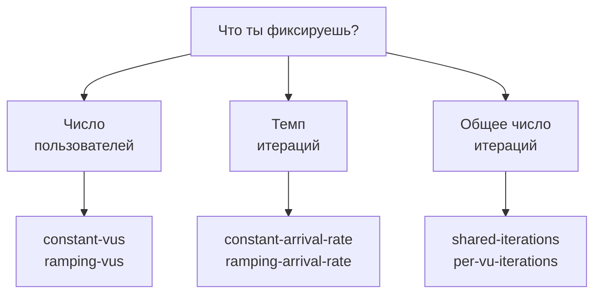
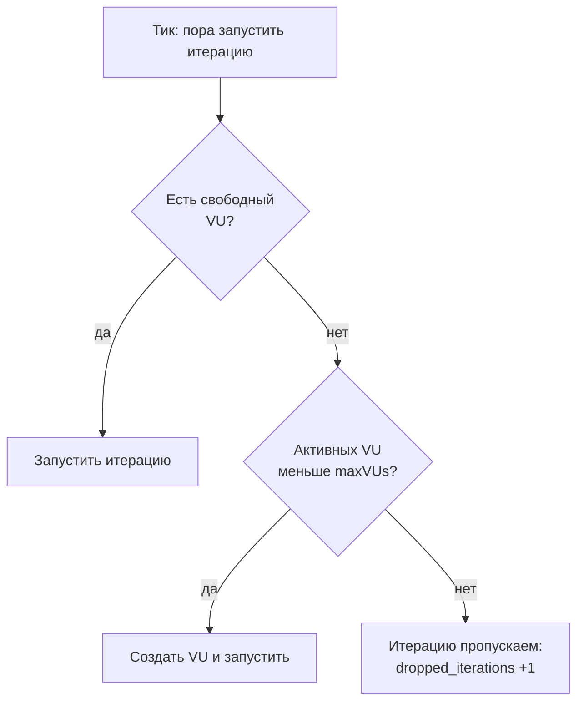

## Зачем это нужно

В [уроке 10.1](01-js-first-script.md) ты запускал k6 командой вида «пять пользователей, тридцать секунд». Это просто, но у такого запуска два недостатка, из-за которых его нельзя показывать в отчёте. Первый: ты не управляешь **потоком запросов**. Пять виртуальных пользователей (VU) отправляют столько запросов, сколько позволяет сервер: пока он отвечает быстро, поток большой, а стоит ему замедлиться, поток сам уменьшается, и тест выглядит «спокойнее», чем реальный день распродажи. Второй: тест ничего не решает. Он напечатал таблицу, а «хорошо» это или «плохо», определяет человек глазами. В пайплайне (CI) глаз нет: нужен ответ «прошёл или нет» в виде кода выхода.

Этот урок закрывает оба недостатка. Ты научишься задавать нагрузку как **поток** с помощью **executor'а** (так в k6 называется настройка «как запускать итерации»): «двадцать новых покупателей в секунду, что бы ни случилось». Это та самая открытая модель из [урока 8.2](../08-perf-theory/02-queues-littles-law.md), теперь на практике. И ты научишься записывать требования к сервису (SLO из [урока 8.4](../08-perf-theory/04-load-profile-slo.md)) прямо в скрипт, чтобы k6 сам завершался с нулём или с ошибкой.

Шаг проекта: ты переписываешь `~/perf-lab/10-k6/shop.js` из 10.1 под сценарии с настраиваемым executor'ом, подключаешь список из 1000 пользователей, задаёшь пороги и прогоняешь три опыта на «Магазине»: закрытая против открытой модели при медленной оплате, поиск предела растущей нагрузкой и «зелёный тест, который врёт».

## Что нужно знать

- Скрипт k6 из [урока 10.1](01-js-first-script.md): `import`, функция `default`, `http.get`/`http.post`, `check`, `sleep`, что такое VU и итерация, как читать итоговую таблицу.
- Закрытая и открытая модели нагрузки, закон Литтла: [урок 8.2](../08-perf-theory/02-queues-littles-law.md). Здесь мы будем им пользоваться при каждом расчёте.
- Виды тестов (smoke, load, stress) и SLO: [урок 8.3](../08-perf-theory/03-test-types.md) и [урок 8.4](../08-perf-theory/04-load-profile-slo.md). Пороги в k6 это SLO, записанные кодом.
- Перцентили p95 и доля ошибок: [урок 8.1](../08-perf-theory/01-latency-throughput.md).
- Запуск Locust без интерфейса, чтобы было с чем сравнивать: [урок 9.4](../09-locust/04-headless-shape.md).
- Стенд «Магазин» запущен (`curl -s localhost:8000/readyz`), оплата доступна на `localhost:8001`.

## Картина целиком

Представь два способа проверить, как справляется кафе. В первом ты сажаешь за столики пять друзей и просишь: «заказывайте, как только съели прошлый заказ». Если повара замешкались, друзья едят медленнее и заказывают реже: нагрузка на кухню сама уменьшилась. Во втором ты стоишь на улице и каждые пять секунд заводишь в кафе нового человека, как бы ни шла кухня. Если повара замешкались, в зале копится толпа. Второй способ жестче и ближе к жизни: покупателям на улице всё равно, что у вас проблемы.

Первый способ это **закрытая модель** (closed model): число пользователей фиксировано, каждый ждёт ответа. Второй это **открытая модель** (open model): фиксирован **темп прихода**, а число одновременно занятых пользователей получается само. В k6 за выбор модели отвечает **executor** («исполнитель»): настройка, которая говорит k6, *как* запускать итерации сценария. Executor'ов семь, и выбрать нужный проще, чем кажется:



Что здесь видно: вопрос один, «что я держу постоянным». Пользователей (закрытая модель), темп прихода (открытая модель) или количество работы (выполни ровно столько-то итераций и остановись). Слово `ramping` в названии значит «плавно меняется по ступеням»: так делают тест на рост (stress).

Из темы 8 ты помнишь разницу в картинке. Вот она ещё раз: красная линия это открытая модель, синяя закрытая. Когда сервер замедляется, у красной растёт очередь, а у синей нет.

<div class="viz" data-viz="perf-open-closed" data-rate="8" data-users="10" data-slow="3"></div>

Что здесь видно: на отрезке 20-40 секунд сервер медленнее, красная очередь растёт и потом долго рассасывается, синяя упирается в потолок «число пользователей». В этом уроке мы получим ту же картину уже на настоящем стенде и настоящем k6.

## Теория

### Сценарий и executor: как k6 решает, когда запускать итерацию

**Зачем это существует.** В 10.1 нагрузка задавалась двумя ключами `vus` и `duration` на верхнем уровне. Это сокращённая запись для одного сценария. Реальный тест устроен сложнее: несколько видов поведения (покупатели и «читатели каталога»), у каждого свой темп, свой старт во времени, свои пороги. Без отдельного понятия «сценарий» всё это пришлось бы сваливать в одну функцию с условиями.

**Аналогия.** Сценарий это одна бригада актёров в театре: у неё своя роль (функция), свой выход на сцену (время старта) и свой режиссёрский план (executor): «выходить по одному каждую минуту» или «пятеро играют без перерыва». Аналогия ломается тем, что бригады в k6 работают одновременно и независимо, а общие у них только метрики и сервер.

**Как это устроено.** **Сценарий** (scenario) это именованный блок внутри `options.scenarios`. В нём обязательно указан `executor`, плюс параметры этого executor'а и общие поля. Общие поля, которые пригодятся:

| Поле | Смысл |
|---|---|
| `executor` | Название исполнителя: как запускать итерации |
| `startTime` | Через сколько после старта теста сценарий начнёт работу (по умолчанию `'0s'`) |
| `exec` | Имя экспортируемой функции, которую крутит сценарий (по умолчанию `default`) |
| `env` | Свои переменные окружения только для этого сценария |
| `tags` | Свои теги для всех метрик этого сценария |
| `gracefulStop` | Сколько ждать завершения уже начатых итераций после окончания времени (по умолчанию `'30s'`) |

**Итерация** (iteration) это один вызов функции сценария от начала до конца: напомню из 10.1, что VU по кругу выполняет `default` и каждый такой проход считается итерацией. Выбор executor'а решает две вещи: сколько VU работает и **что запускает следующую итерацию**: завершение предыдущей (закрытая модель) или часы (открытая).

**Разобранный пример.** Две записи, которые делают одно и то же: пять VU на тридцать секунд.

```javascript
// короткая запись (то, что ты делал в 10.1)
export const options = { vus: 5, duration: '30s' };

// полная запись: один сценарий с именем «shop»
export const options = {
  scenarios: {
    shop: { executor: 'constant-vus', vus: 5, duration: '30s' },
  },
};
```

Имя сценария (`shop`) попадёт в тег `scenario` каждой метрики: по нему потом отличают сценарии в Grafana. Короткая запись внутри k6 превращается в сценарий с именем `default`.

**Что путают.** `startTime` и `gracefulStop` считают от начала всего теста, а не от начала сценария. И ещё: `duration` это время, в течение которого k6 *запускает* итерации. Итерации, начатые в последнюю секунду, доживают до конца в рамках `gracefulStop`, поэтому весь тест может быть длиннее на несколько секунд.

> **Проверь понимание:** в сценарии `duration: '1m'`, `gracefulStop: '30s'`. Тест запущен в 12:00:00. Какое самое позднее время завершения возможно?

<details markdown="1">
<summary>Ответ</summary>

12:01:30. Минуту k6 запускает новые итерации (до 12:01:00), потом до 30 секунд даёт доработать тем, что уже идут. Если все успели раньше, тест закончится раньше. В шапке теста k6 печатает именно это число: «1m30s max duration (incl. graceful stop)».

</details>

### Закрытая модель: constant-vus, ramping-vus и два «по числу итераций»

**Зачем это существует.** Закрытая модель описывает системы, где пользователей конечное число и каждый действует по очереди: сотрудники, которые вводят данные в бухгалтерской программе; вызовы между сервисами, где у клиента ограниченный пул соединений. В таких системах правда в том, что замедление сервера само уменьшает нагрузку.

**Аналогия.** Конвейер с пятью рабочими: каждый берёт следующую деталь только после того, как закончил предыдущую. Быстрее работают поставщики деталей, тем больше деталей в час; медленнее, тем меньше. Аналогия ломается там, где работники не люди, а запросы: сервер не «уставший», он просто занят.

**Как это устроено.** Четыре executor'а закрытого типа сведены в таблицу:

| Executor | Что держит | Параметры | Когда брать |
|---|---|---|---|
| `constant-vus` | Постоянное число VU заданное время | `vus`, `duration` | Простой «пять пользователей полчаса», smoke-тест |
| `ramping-vus` | Число VU по ступеням | `startVUs`, `stages`, `gracefulRampDown` | Профиль «разгон, плато, спад» по пользователям |
| `shared-iterations` | Общее число итераций на всех VU | `vus`, `iterations`, `maxDuration` | «Выполни ровно 200 покупок, как получится» |
| `per-vu-iterations` | Каждому VU по N итераций | `vus`, `iterations`, `maxDuration` | Каждый из 100 пользователей делает ровно один заказ |

**Ступени** (`stages`) у `ramping-vus` это список отрезков: `{ duration: '1m', target: 20 }` значит «за минуту плавно дойти до 20 VU». Следующая ступень стартует с того, чем закончилась предыдущая. Ступень с тем же `target`, что и раньше, это плато.

```javascript
scenarios: {
  shop: {
    executor: 'ramping-vus',
    startVUs: 0,
    stages: [
      { duration: '1m', target: 10 },  // разгон: 0 -> 10 VU
      { duration: '3m', target: 10 },  // плато: держим 10 VU
      { duration: '30s', target: 0 },  // спад
    ],
    gracefulRampDown: '30s',  // сколько дать доработать итерации у VU, которых убираем
  },
}
```

**Разобранный пример.** Сколько запросов даёт `constant-vus` при пяти VU? Если одна итерация длится 1,07 с (запросы около 70 мс плюс `sleep(1)`), то один VU делает 1 / 1,07 = 0,93 итерации в секунду, пять VU делают около 4,7 итераций в секунду. Если сервер замедлился и итерация стала длиться 3,1 с, то 5 / 3,1 = 1,6 итерации в секунду. Видишь ловушку? **Темп не задан, он получается из задержки.** Эту формулу ты знаешь из 8.2: число занятых = темп × время. Закрытая модель фиксирует левую часть (число занятых) и позволяет плыть темпу.

`gracefulRampDown` это то же самое, что `gracefulStop`, только для уменьшения числа VU посреди теста. Оба параметра нужны, чтобы k6 не обрывал запрос «на полуслове» и не засчитывал ему ошибку.

**Что путают.** `shared-iterations` и `per-vu-iterations`. В первом `iterations: 200` на всех, и быстрый VU сделает больше медленного. Во втором `iterations: 200` каждому VU. А ещё `maxDuration` у обоих: если итерации не закончились за это время, k6 их обрывает. Забудешь про него и поставишь большое число итераций, получишь «бесконечный» тест (по умолчанию `maxDuration` равен 10 минутам).

> **Проверь понимание:** `per-vu-iterations`, `vus: 20`, `iterations: 5`. Сколько итераций будет в сумме?

<details markdown="1">
<summary>Ответ</summary>

100: каждый из 20 VU делает ровно 5. При `shared-iterations` с теми же числами их было бы 5 на всех.

</details>

### Открытая модель: constant-arrival-rate и ramping-arrival-rate

**Зачем это существует.** Покупатели интернет-магазина не знают друг о друге и не ждут, пока сервер ответит предыдущему. Они приходят потоком: в час распродажи, скажем, 20 человек в секунду. Если сервер замедлился, поток не уменьшается, люди продолжают приходить, и у сервера растёт очередь. Если твой тест этого не воспроизводит, он **щадит** сервер именно тогда, когда нужно его давить. Это называют координированным упущением (coordinated omission): генератор «согласованно» замолкает вместе с сервером и не видит провала. Арифметика закрытой модели из предыдущего раздела это и показывает.

**Аналогия.** Поток людей на эскалаторе в метро: новый человек ступает на лестницу каждые две секунды, независимо от того, торопится ли предыдущий. Если лестница остановилась, на платформе копится толпа. Аналогия ломается тем, что у метро платформа ограничена, а у k6 очередь «на платформе» хранить негде: итерация, которой не нашлось VU, просто **пропускается** и считается в метрике `dropped_iterations`.

**Как это устроено.** `constant-arrival-rate` запускает новую итерацию через равные промежутки времени, независимо от ответов. Параметры:

- `rate` и `timeUnit`: «`rate` итераций за `timeUnit`». `rate: 20, timeUnit: '1s'` это 20 итераций в секунду; `rate: 30, timeUnit: '1m'` это 30 в минуту.
- `duration`: сколько времени идёт поток.
- `preAllocatedVUs`: сколько VU k6 **заранее** подготовит до начала теста. Подготовка VU (запуск окружения для скрипта, разбор модулей) стоит времени и памяти, поэтому делать это посреди теста плохо: оно исказит измерения.
- `maxVUs`: сколько VU разрешено создать **максимум**, если предварительных не хватит. Это потолок: он защищает твой ноутбук от неограниченного роста.

Решение, что делать, k6 принимает при каждом «тике» таймера:



Что здесь видно: итерация не стоит в очереди и не ждёт. Либо она стартует сразу, либо пропущена навсегда. Поэтому счётчик `dropped_iterations` это главный индикатор того, что открытая модель **не получила** запрошенный поток. Когда VU создаются сверх `preAllocatedVUs`, k6 печатает предупреждение, а когда упёрся в `maxVUs`, пишет `Insufficient VUs, reached N active VUs and cannot initialize more`.

**Разобранный пример.** Сколько VU нужно, чтобы держать поток? Берём закон Литтла из 8.2: число занятых = темп прихода × время, которое каждый проводит внутри. У нас `rate` 5 итераций в секунду, итерация длится 1,07 с (запросы и `sleep(1)`). Занятых VU: 5 × 1,07 ≈ **5,4**. Если сервер замедлится и итерация станет 3,1 с, нужно 5 × 3,1 = **15,5** VU. Если `maxVUs: 10`, то 10 VU смогут делать 10 / 3,1 = 3,2 итерации в секунду, а остальные 5 − 3,2 = 1,8 итерации в секунду будут пропускаться. За минуту это 1,8 × 60 ≈ 108 штук в `dropped_iterations`.

Попробуй это руками. В виджете два executor'а под одной нагрузкой: синяя линия это `constant-vus`, зелёная `constant-arrival-rate`. Сервер замедляется на секундах 20-40.

<div class="viz" data-viz="k6-executors" data-rate="50" data-vus="5" data-maxvus="20" data-latency="100" data-slow="5"></div>

Что здесь видно: у синей линии число VU задано, а RPS проваливается вместе с сервером. У зелёной RPS держится, а растёт число занятых VU, пока не упрётся в `maxVUs`. Дальше зелёная тоже проваливается, и тут же появляется красная часть: итерации, которые k6 даже не запустил. Модель упрощена: одна итерация это один запрос и без пауз. В нашем «Магазине» итерация состоит из пяти запросов и `sleep(1)`, поэтому `rate: 5` это около 25 HTTP-запросов в секунду, а не 5.

`ramping-arrival-rate` то же самое, но темп меняется ступенями. У него добавляются `startRate` (с чего начать) и `stages` с `target` в итерациях за `timeUnit`. Именно им ищут предел сервиса: темп растёт, и ты смотришь, на каком значении ломаются пороги.

```javascript
scenarios: {
  shop: {
    executor: 'ramping-arrival-rate',
    startRate: 1,
    timeUnit: '1s',
    preAllocatedVUs: 10,
    maxVUs: 100,
    stages: [
      { target: 5,  duration: '1m' },   // с 1 до 5 итераций/с за минуту
      { target: 10, duration: '1m' },
      { target: 15, duration: '1m' },
      { target: 20, duration: '1m' },
    ],
  },
}
```

**Что путают.**

- **`rate` это итерации, а не запросы.** Если в итерации 5 запросов, то 5 итераций в секунду это 25 запросов в секунду. Для отчёта считай оба числа.
- **`sleep` увеличивает время итерации** и тем самым число нужных VU. В открытой модели `sleep` не замедляет поток (поток задан часами), а требует *больше VU* для того же потока.
- Открытая модель не «лучше» закрытой. Для API, на которое приходят тысячи независимых клиентов, она честнее. Для системы с пулом из десяти воркеров, которые ждут друг друга, честнее закрытая.
- Если в статьях про k6 ты видишь executor `externally-controlled`, команды `k6 pause`, `k6 resume`, `k6 scale`, `k6 status`: в k6 2.x они удалены. Для управления тестом на лету сейчас нет встроенного способа, перезапускай тест.

> **Проверь понимание:** `constant-arrival-rate`, `rate: 10`, `timeUnit: '1s'`. Итерация сейчас длится 0,8 с. Сколько VU занято, и что будет, если сервер замедлится вдвое, а `maxVUs` равен 12?

<details markdown="1">
<summary>Ответ</summary>

Сейчас 10 × 0,8 = 8 VU. После замедления итерация длится 1,6 с, нужно 10 × 1,6 = 16 VU, а разрешено 12. Фактический темп 12 / 1,6 = 7,5 итерации в секунду, 2,5 в секунду будут пропущены и попадут в `dropped_iterations`. Если ты смотришь только на `http_req_duration`, это не увидишь.

</details>

### Пороги: SLO, записанное кодом

**Зачем это существует.** Цель нагрузочного теста не таблица, а решение: «сервис годен» или «не годен». Без критерия это решение принимает усталый человек в пятницу вечером. **Порог** (threshold) это правило «метрика должна быть такой-то», записанное в скрипте. После теста k6 проверяет каждое правило и, если хоть одно нарушено, завершает работу с ошибкой. Это то же, что SLO из 8.4, только исполняемое.

**Аналогия.** Контроль качества на заводе: у каждой детали допуск, например «диаметр 10 мм ± 0,1». Если хотя бы одна партия не в допуске, линия останавливается и не отгружает. Аналогия ломается на статистике: у нас допуск относится не к одной детали, а к перцентилю тысяч запросов.

**Как это устроено.** Порог записывается как `<агрегация> <оператор> <значение>`. Какие агрегации доступны, зависит от **типа метрики** (напомню из 10.1: счётчик, шкала, доля, тренд):

| Тип | Примеры метрик | Агрегации | Пример порога |
|---|---|---|---|
| Rate (доля) | `http_req_failed`, `checks` | `rate` | `rate<0.01` |
| Trend (распределение) | `http_req_duration`, `iteration_duration` | `avg`, `min`, `max`, `med`, `p(N)` | `p(95)<500` |
| Counter (счётчик) | `iterations`, `dropped_iterations` | `count`, `rate` | `count==0` |
| Gauge (шкала) | `vus` | `value` | `value<100` |

Пороги лежат в `options.thresholds`: ключ это метрика, значение это **массив** условий, и должны выполниться все. Шесть строк SLO из «Магазина»:

```javascript
thresholds: {
  http_req_failed: ['rate<0.01'],            // ошибок меньше 1%
  http_req_duration: ['p(95)<500'],          // p95 меньше 500 мс
  checks: ['rate>0.99'],                     // проверок успешно больше 99%
}
```

Результат виден в итоговой таблице блоком `THRESHOLDS`: галочка, если порог выполнен, и крестик, если нарушен, рядом фактическое значение. Главное, что видит CI: **код выхода** (exit code) процесса k6. Любая программа в Linux возвращает число после завершения: 0 значит «успех», остальное «ошибка», и именно его проверяют пайплайны (подробнее про CI: [урок 6.3](../06-api-testing/03-ci-actions.md)). У k6 основные коды такие:

| Код | Что случилось |
|---|---|
| 0 | Тест прошёл, все пороги выполнены |
| 99 | Тест дошёл до конца, но хотя бы один порог нарушен |
| 107 | Ошибка в скрипте (исключение JavaScript) |
| 108 | Тест остановлен самим скриптом (`exec.test.abort()`) или порогом с `abortOnFail` |
| 105 | Тест прерван снаружи (например, `Ctrl+C`) |

Код 99 надо знать наизусть: он значит «скрипт работает, сервис не прошёл».

Порогу можно велеть **остановить тест сразу**, не дожидаясь конца. Для этого вместо строки пишут объект `{ threshold, abortOnFail, delayAbortEval }`. `abortOnFail: true` останавливает тест при первом нарушении. `delayAbortEval: '10s'` откладывает проверку: первые секунды теста метрики неустойчивы (прогрев, первые логины), и порог по p95 сработает ложно. Нужно, чтобы накопились данные.

```javascript
http_req_failed: [
  { threshold: 'rate<0.05', abortOnFail: true, delayAbortEval: '10s' },
],
```

**Разобранный пример.** Что значит `p(95)<500`? Тест сделал 1000 запросов. k6 сортирует их задержки и берёт значение под номером 950. Допустим, 940 запросов быстрее 300 мс, а следующие 60 длятся от 450 мс до 1,3 с. Тогда 950-й запрос оказывается в «медленной» группе, p(95) = 600 мс, порог нарушен. Заметь, что среднее при этом может быть вполне приличным (около 120 мс), а перцентиль честно сообщает: «каждый двадцатый покупатель ждёт больше, чем мы обещали». Покрути сам:

<div class="viz" data-viz="k6-threshold" data-limit="500" data-errors="0.5" data-slowpct="6"></div>

Что здесь видно: столбики это сколько запросов попало в каждую «коробку» по 50 мс, красные столбики это запросы выше порога. Когда медленных запросов больше пяти процентов, p(95) уезжает за порог, и k6 завершится с кодом 99. Порог по ошибкам работает так же: стоит доле перейти 1%, код 99.

**Что путают.**

- **`check` не роняет тест.** Проверка из 10.1 только записывает «успешно/неуспешно» в метрику `checks`. Чтобы тест красился, нужен порог `checks: ['rate>0.99']`.
- **Что считается ошибкой в `http_req_failed`.** По умолчанию любой статус вне диапазона 200-399. Значит, «400 на пустую корзину» тоже ошибка. Если для тебя это ожидаемый ответ, меняй правило функцией `http.setResponseCallback(http.expectedStatuses({ min: 200, max: 399 }, 400))`.
- **Порог без данных проходит.** Если ты опечатался в теге и под правило не попал ни один запрос, k6 не сообщит ошибку: значение будет нулевым. Всегда читай *число* рядом с галочкой.
- **Зелёный тест не доказывает, что нагрузка была.** Об этом ниже в разделе про `dropped_iterations`.

> **Проверь понимание:** в списке порогов `http_req_duration: ['p(95)<500', 'p(99)<1500']`. p(95) = 300 мс, p(99) = 1700 мс. С каким кодом завершится k6?

<details markdown="1">
<summary>Ответ</summary>

С кодом 99: условия в массиве работают как «и», а второе нарушено. В блоке THRESHOLDS у первого будет галочка, у второго крестик.

</details>

### Теги и группы: как отделить один шаг от другого

**Зачем это существует.** Порог `p(95)<500` на всю метрику усредняет всё: быстрый каталог и медленный заказ. Если заказ тормозит, а каталога в десять раз больше, общий p95 этого не покажет. Нужно уметь **резать** метрику на части и ставить порог отдельно на каждую.

**Аналогия.** Чек из магазина: общая сумма важна, но если ты спорил о цене, смотришь строку конкретного товара. Теги это «артикулы» на строках чека.

**Как это устроено.** **Тег** (tag) это пара «имя: значение», которую k6 приклеивает к каждой метрике. Часть тегов k6 ставит сам: `method`, `status`, `url`, `name`, `scenario`, `group`, `expected_response`. Свои теги добавляешь в параметрах запроса (`tags: { step: 'order' }`) или в сценарии (`tags` в описании сценария). Тег `name` особенный: если у запроса есть `name`, то по нему группируются метрики вместо `url`. Это нужно для адресов с переменной частью: `/api/products/17` и `/api/products/942` получат одно имя `/api/products/[id]`, а не 10 000 разных серий. В Prometheus (урок 10.3) это критично: у каждого уникального значения тега своя временная серия, и десять тысяч значений заставят базу задыхаться.

Метрика, отрезанная по тегу, называется **подметрикой** (submetric), и на неё ставят порог: `'http_req_duration{step:order}': ['p(95)<800']`.

**Группа** (group) это функция `group('название', function () { ... })`, которая оборачивает несколько шагов. Всё внутри получает тег `group` со значением `::название`, и k6 заводит метрику `group_duration` со временем всей группы. Группы удобны, когда важно время шага из нескольких запросов целиком («оформление заказа от корзины до подтверждения»). Но тегов обычно достаточно, а группы вложенные и длинные делают вывод шумным.

**Разобранный пример.** В итерации «Магазина» заказ идёт в группе и имеет свой тег, а порог на заказ строже, чем общий:

```javascript
group('покупка', function () {
  const res = http.post(`${baseURL}/api/orders`, null, { headers, tags: { step: 'order' } });
  check(res, { 'заказ: 201': (r) => r.status === 201 });
});
// и порог на него в options.thresholds:
//   'http_req_duration{step:order}': ['p(95)<800'],
```

В итоговой таблице появится отдельная строка `http_req_duration{step:order}` со своим p(95).

**Что путают.** Тег и группу. Тег это метка на запросе (по ней режут метрики), группа это обёртка вокруг кода, которая ещё и мерит время всего блока. И ещё: `tags` у запроса не равен `name`. `name` заменяет URL в отчёте, обычный тег добавляется рядом.

> **Проверь понимание:** зачем писать `tags: { name: '/api/products/[id]' }`, если запрос и так имеет полный URL?

<details markdown="1">
<summary>Ответ</summary>

Без `name` каждый товар получит собственную метрику по `url`: в отчёте и в Prometheus будут тысячи отдельных серий вместо одной. `name` сводит все карточки под одно имя, и p(95) считается по всем карточкам вместе.

</details>

### Данные пользователей: SharedArray

**Зачем это существует.** В 10.1 ты брал пользователя по номеру VU. Это хватает, пока нужен только email и пароль в стандартном формате. Реальные тесты читают данные из файла: логины, id товаров, поисковые запросы. Файл читается один раз, но VU десятки, и каждому нужен доступ.

**Аналогия.** Общая книга на полке в читальном зале против личных копий. Если каждому посетителю выдавать собственную копию книги, зал быстро переполнится. Одна книга на всех, которую только читают, экономит место. Аналогия ломается на правке: «общую книгу» в k6 нельзя исправлять, она только для чтения.

**Как это устроено.** У k6 есть жизненный цикл, который ты видел в 10.1: сначала **init-контекст** (код верхнего уровня файла, выполняется один раз на VU при создании), затем `setup`, затем итерации, затем `teardown`. Функция `open('файл')` читает локальный файл и работает **только в init-контексте**. Если прочитать файл в init просто как переменную, у каждого VU будет собственная копия, а при 500 VU это 500 копий в памяти. `SharedArray` из модуля `k6/data` решает это: функция-загрузчик выполняется один раз, массив хранится в общей памяти, VU читают его по индексу.

Чтобы разные VU брали разных пользователей, нужен уникальный номер VU. Его даёт модуль `k6/execution`: `exec.vu.idInTest` это номер VU во всём тесте, начиная с 1 (а `__VU` из 10.1 это то же самое, но модуль `k6/execution` официальный путь). Из-за ленивого логина из 10.1 пользователь VU выбирается один раз при первой итерации.

**Разобранный пример.** Файл `users.json` создаётся одной командой Python:

```bash
python3 -c "import json; print(json.dumps([{'email': f'user{i:04d}@shop.lab', 'password': 'password'} for i in range(1, 1001)]))" > ~/perf-lab/10-k6/users.json
```

Разбор: `f'user{i:04d}@shop.lab'` подставляет номер с ведущими нулями до четырёх знаков (`user0001`); `range(1, 1001)` даёт числа от 1 до 1000; `json.dumps` превращает список в JSON; `>` кладёт в файл. В скрипте:

```javascript
import { SharedArray } from 'k6/data';
import exec from 'k6/execution';

const users = new SharedArray('users', function () {
  return JSON.parse(open('./users.json'));   // выполнится один раз для всех VU
});

// внутри итерации:
const user = users[(exec.vu.idInTest - 1) % users.length];
```

Остаток от деления (`%`) нужен на случай, если VU окажется больше, чем пользователей: тогда пользователи начнут повторяться, а повтор одного пользователя двумя VU сломает независимость корзин (README стенда предупреждает об этом).

**Что путают.** `open()` вне init-контекста (внутри `default`) вызывает ошибку. Данные в `SharedArray` менять нельзя. Имя (`'users'`) должно быть уникальным в скрипте.

> **Проверь понимание:** в тесте 1500 VU, в `users.json` 1000 пользователей. Что делает `(exec.vu.idInTest - 1) % users.length` для VU номер 1001?

<details markdown="1">
<summary>Ответ</summary>

(1001 − 1) % 1000 = 0: VU 1001 берёт первого пользователя, то есть того же, что VU 1. Два VU под одним пользователем делят корзину в Redis, и заказы одного могут сломать другого. Для таких тестов нужно больше пользователей или меньше VU.

</details>

## Практика

### 1. Подготовь пользователей

```bash
cd ~/perf-lab/10-k6
python3 -c "import json; print(json.dumps([{'email': f'user{i:04d}@shop.lab', 'password': 'password'} for i in range(1, 1001)]))" > users.json
jq length users.json
jq '.[0], .[999]' users.json
```

Разбор: `jq length` печатает, сколько элементов в массиве; `.[0], .[999]` выводит первого и последнего.

```text
1000
{
  "email": "user0001@shop.lab",
  "password": "password"
}
{
  "email": "user1000@shop.lab",
  "password": "password"
}
```

**Как читать вывод:** 1000 и последний `user1000` значит, что файл целый. Если пусто или ошибка, значит, команда Python не дошла до конца: запусти её без `> users.json` и посмотри ошибку.

**Типичные ошибки.** `bash: python3: command not found`: ты забыл активировать окружение или не поставил Python (урок 4.5), `source ~/perf-lab/.venv/bin/activate`. `jq: command not found`: `sudo apt install -y jq` (он ставился в 1.1).

### 2. Перепиши `shop.js` под сценарий с настройками из окружения

Замени содержимое `~/perf-lab/10-k6/shop.js` целиком. Шаги те же, что в 10.1 (логин один раз на VU, каталог, карточка, корзина, заказ), добавились сценарий, пороги, теги и пользователи из файла.

```javascript
import http from 'k6/http';
import { check, group, sleep } from 'k6';
import { SharedArray } from 'k6/data';
import exec from 'k6/execution';

const baseURL = (__ENV.BASE_URL || 'http://localhost:8000').replace(/\/$/, '');
const duration = __ENV.DURATION || '1m';
const rate = Number(__ENV.RATE || 5);
const maxVUs = Number(__ENV.MAX_VUS || 50);

const users = new SharedArray('users', function () {
  return JSON.parse(open('./users.json'));
});

// Набор готовых исполнителей. Какой взять, говорит переменная EXECUTOR.
const scenarios = {
  // открытая модель: фиксированный темп итераций (по умолчанию)
  open: {
    executor: 'constant-arrival-rate',
    rate, timeUnit: '1s', duration,
    preAllocatedVUs: Math.min(10, maxVUs), maxVUs,
  },
  // закрытая модель: фиксированное число VU
  closed: {
    executor: 'constant-vus',
    vus: Number(__ENV.VUS || 5), duration,
  },
  // ищем предел: темп растёт ступенями
  ramp: {
    executor: 'ramping-arrival-rate',
    startRate: 1, timeUnit: '1s',
    preAllocatedVUs: 10, maxVUs: 100,
    stages: [
      { target: 5, duration: '1m' },
      { target: 10, duration: '1m' },
      { target: 15, duration: '1m' },
      { target: 20, duration: '1m' },
    ],
  },
};

export const options = {
  scenarios: { shop: scenarios[__ENV.EXECUTOR || 'open'] },
  thresholds: {
    http_req_failed: ['rate<0.01'],
    http_req_duration: ['p(95)<500'],
    'http_req_duration{step:order}': ['p(95)<800'],
    checks: ['rate>0.99'],
  },
};

// Состояние VU: переменные модуля у каждого VU свои.
let token;
let tokenExpiresAt = 0;

export default function () {
  if (!token || Date.now() >= tokenExpiresAt) {
    const user = users[(exec.vu.idInTest - 1) % users.length];
    const login = http.post(`${baseURL}/api/login`, JSON.stringify(user),
      { headers: { 'Content-Type': 'application/json' }, tags: { name: 'POST /api/login' } });
    if (!check(login, { 'вход: 200': (r) => r.status === 200 })) return;
    token = login.json('token');
    tokenExpiresAt = Date.now() + (login.json('expires_in') - 5) * 1000;
  }
  const params = { headers: { Authorization: `Bearer ${token}`, 'Content-Type': 'application/json' } };

  check(http.get(`${baseURL}/api/products`), { 'каталог: 200': (r) => r.status === 200 });

  const productID = 1 + Math.floor(Math.random() * 10000);
  check(http.get(`${baseURL}/api/products/${productID}`, { tags: { name: '/api/products/[id]' } }),
    { 'карточка: 200': (r) => r.status === 200 });

  group('покупка', function () {
    check(http.post(`${baseURL}/api/cart/items`, JSON.stringify({ product_id: productID, qty: 1 }), params),
      { 'корзина: 201': (r) => r.status === 201 });
    check(http.post(`${baseURL}/api/orders`, null, { ...params, tags: { step: 'order' } }),
      { 'заказ: 201': (r) => r.status === 201 });
  });

  sleep(1);
}
```

Разбор незнакомого. `__ENV.RATE || 5` берёт переменную `RATE`, переданную ключом `-e RATE=...`, а если её нет, то 5; `Number(...)` превращает строку в число (переменные окружения всегда строки). `scenarios[__ENV.EXECUTOR || 'open']` выбирает ключ из набора готовых сценариев; в `options` он становится единственным сценарием с именем `shop`. `Math.min(10, maxVUs)` нужен, потому что `preAllocatedVUs` не может быть больше `maxVUs`: k6 откажется запускаться. `{ ...params, tags: {...} }` копирует поля объекта и добавляет ещё одно (три точки это «распаковка» объекта, из 10.1). `login.json('expires_in') - 5` вычитает пять секунд запаса, чтобы токен не истёк посреди итерации.

Почему логин не в каждой итерации? Он дорогой: стенд проверяет пароль алгоритмом bcrypt (`BCRYPT_ROUNDS=12`), это около 0,25 секунды процессорного времени, а воркер у «Магазина» один. Если логиниться в каждой итерации, ты замеришь не покупку, а скорость bcrypt: больше четырёх логинов в секунду стенд не сделает вообще.

**Типичные ошибки.**

```text
ERRO[0000] GoError: The moduleSpecifier "./users.json" couldn't be found on local disk.
```

Причина: запускаешь k6 не из каталога `~/perf-lab/10-k6` (пути в `open` считаются от файла скрипта, но убедись, что `users.json` рядом). Исправление: `ls ~/perf-lab/10-k6/users.json`.

```text
ERRO[0000] preAllocatedVUs (10) cannot be greater than maxVUs (5)
```

Причина: `-e MAX_VUS=5` меньше 10. В нашем коде это учтено через `Math.min`, но в чужих скриптах увидишь именно эту ошибку.

### 3. Первый прогон: открытая модель, 5 итераций в секунду

```bash
k6 run -e RATE=5 -e DURATION=1m shop.js > ~/perf-lab/results/k6-open-5.txt
echo "код выхода: $?"
```

Разбор: `-e RATE=5` передаёт переменную в `__ENV`; `>` перенаправляет итоговую таблицу в файл (индикатор выполнения k6 пишет в другой поток и остаётся на экране); `$?` это код выхода последней команды. Теперь открой файл: `less ~/perf-lab/results/k6-open-5.txt`. У тебя числа будут другими, ниже типичный вид.

```text
  scenarios: (100.00%) 1 scenario, 50 max VUs, 1m30s max duration (incl. graceful stop):
           * shop: 5.00 iterations/s for 1m0s (maxVUs: 10-50, gracefulStop: 30s)


  █ THRESHOLDS

    checks
    ✓ 'rate>0.99' rate=100.00%

    http_req_duration
    ✓ 'p(95)<500' p(95)=121.4ms

    http_req_duration{step:order}
    ✓ 'p(95)<800' p(95)=168.2ms

    http_req_failed
    ✓ 'rate<0.01' rate=0.00%


  █ TOTAL RESULTS

    checks_total.......................: 1208    20.13/s
    checks_succeeded...................: 100.00% 1208 out of 1208
    checks_failed......................: 0.00%   0 out of 1208

    ✓ вход: 200
    ✓ каталог: 200
    ✓ карточка: 200
    ✓ корзина: 201
    ✓ заказ: 201

    HTTP
    http_req_duration..................: avg=41.2ms  min=6.1ms  med=22.3ms max=402ms  p(90)=96ms   p(95)=121.4ms
      { expected_response:true }.......: avg=41.2ms  min=6.1ms  med=22.3ms max=402ms  p(90)=96ms   p(95)=121.4ms
    http_req_failed....................: 0.00%  0 out of 1508
    http_reqs..........................: 1508   25.13/s

    EXECUTION
    iteration_duration.................: avg=1.07s   min=1.03s  med=1.05s  max=1.45s  p(90)=1.1s   p(95)=1.16s
    iterations.........................: 300    5/s
    vus................................: 6      min=5       max=7
    vus_max............................: 10     min=10      max=10

    NETWORK
    data_received......................: 1.4 MB 23 kB/s
    data_sent..........................: 395 kB 6.6 kB/s
```

`echo` напечатает `код выхода: 0`.

**Как читать вывод:**

- Строка `scenarios` вверху пересказывает, как k6 понял твой сценарий: «5.00 iterations/s for 1m0s», `maxVUs: 10-50` (10 заготовлено, до 50 можно создать). Если здесь не то, что ты хотел, остальное читать незачем.
- Блок `THRESHOLDS` читай первым: четыре галочки значит код выхода 0. Отдельная строка `{step:order}` это твоя подметрика.
- `iterations: 300, 5/s`: поток получился ровно таким, как заказан. Это главная проверка открытой модели. `http_reqs: 1508` в пять раз больше итераций: пять запросов в итерации плюс несколько логинов (по одному на каждый новый VU).
- `vus: 6 max=7` и `iteration_duration avg=1,07 s`. Проверь по Литтлу: 5 × 1,07 = 5,4 занятых VU. Сходится.
- Нет `dropped_iterations` в выводе: k6 показывает эту метрику только когда она не нулевая.

### 4. Опыт: закрытая против открытой при медленной оплате

Сделай оплату медленной (две секунды вместо 50 мс). Это тот же приём, что в «Сломай и почини» урока 8.1:

```bash
curl -s -X POST localhost:8001/admin/config -H 'Content-Type: application/json' -d '{"delay_ms": 2000}'
```

Три прогона по минуте с теми же шагами. Для каждого записывай `iterations`, `dropped_iterations` и p(95) заказа.

```bash
# А: закрытая модель, 5 VU
k6 run -e EXECUTOR=closed -e VUS=5 shop.js > ~/perf-lab/results/k6-closed-slow.txt
# Б: открытая модель, 5 итераций/с, VU до 50
k6 run -e RATE=5 -e MAX_VUS=50 shop.js > ~/perf-lab/results/k6-open-slow-50.txt
# В: открытая модель, 5 итераций/с, VU только до 10
k6 run -e RATE=5 -e MAX_VUS=10 shop.js > ~/perf-lab/results/k6-open-slow-10.txt
```

В третьем прогоне k6 напечатает предупреждение уже через несколько секунд:

```text
WARN[0004] Insufficient VUs, reached 10 active VUs and cannot initialize more  executor=constant-arrival-rate scenario=shop
```

Оно значит: «ты просил 5 итераций в секунду, VU не хватает, лишние пропущены». Типичные числа трёх прогонов (у тебя будут другие):

| Прогон | Итераций за минуту | Итераций в секунду | Пропущено | p(95) заказа | Код выхода |
|---|---|---|---|---|---|
| Закрытая, 5 VU, обычная оплата | 280 | 4,7 | 0 | 170 мс | 0 |
| Закрытая, 5 VU, оплата 2 с | 97 | 1,6 | 0 | 2,2 с | 99 |
| Открытая, до 50 VU, оплата 2 с | 300 | 5,0 | 0 | 2,2 с | 99 |
| Открытая, до 10 VU, оплата 2 с | 192 | 3,2 | 108 | 2,2 с | 99 |

Наглядно, сколько итераций в секунду реально прошло в каждой модели при быстрой и медленной оплате:

<div class="viz" data-viz="chart" data-type="bar" data-x="Закрытая 5 VU,Открытая до 50 VU,Открытая до 10 VU" data-series='[{"name":"Оплата 50 мс","values":[4.7,5.0,5.0],"unit":"ит/с"},{"name":"Оплата 2 с","values":[1.6,5.0,3.2],"unit":"ит/с"}]' data-x-label="Модель нагрузки" data-y-label="Итераций в секунду" data-unit="ит/с" data-explain="Закрытая модель сама снижает нагрузку, когда сервер замедляется: 4,7 превращаются в 1,6. Открытая держит 5 итераций в секунду, пока хватает VU. Когда maxVUs мало, часть итераций пропускается."></div>

Что здесь видно: закрытая модель при медленной оплате снизила нагрузку втрое, и сервер «отдохнул»: ты решил бы, что он справляется. Открытая модель сохранила поток: заказы по-прежнему шли пять в секунду, и p(95) показал реальную боль покупателей. Третий столбик показывает случай, когда сам генератор не смог держать поток из-за `maxVUs`.

**Как читать вывод:** во всех трёх прогонах с медленной оплатой код выхода 99, потому что p(95) заказа больше 800 мс. Это не поломка теста, а ровно то, ради чего пороги нужны: оплата стала медленной, SLO нарушено. В случае В есть ещё `dropped_iterations: 108`, это отдельное предупреждение.

Верни оплату:

```bash
curl -s -X POST localhost:8001/admin/config -H 'Content-Type: application/json' -d '{"delay_ms": 50}'
```

**Типичные ошибки.** Забыл вернуть оплату и следующий урок «тормозит»: перед каждым опытом проверяй `curl -s localhost:8001/admin/config`. Результаты разных прогонов непохожи один на другой: между прогонами подожди 10-20 секунд и не запускай ничего параллельно (генератор и стенд на одной машине делят процессор).

### 5. Ищем предел: ramping-arrival-rate

```bash
k6 run -e EXECUTOR=ramp shop.js > ~/perf-lab/results/k6-ramp.txt
echo "код выхода: $?"
```

Четыре минуты, темп растёт ступенями с 1 до 20 итераций в секунду (это от 5 до 100 HTTP-запросов в секунду). Чтобы увидеть, на каком темпе сервис ломается, нужен график по времени: в 10.3 мы отправим метрики k6 в Grafana, а пока, глядя на итоговую таблицу, ты увидишь только общий результат. Типичная картина по ступеням (по метрикам Grafana стенда или по перезапуску теста на фиксированных темпах):

<div class="viz" data-viz="chart" data-type="line" data-x="5,10,15,20" data-series='[{"name":"p95, мс","values":[190,240,620,2400],"unit":"мс"},{"name":"p50, мс","values":[40,55,110,380],"unit":"мс"}]' data-x-label="Темп, итераций в секунду" data-y-label="Задержка" data-unit="мс" data-explain="До 10 итераций в секунду стенд почти не замечает нагрузку, после 15 p95 растёт резко: это хоккейная клюшка из урока 8.1."></div>

Что здесь видно: до 10 итераций в секунду всё спокойно, на 15 p95 перескакивает SLO в 500 мс, а на 20 уходит в секунды. Причина здесь не в k6: у «Магазина» один воркер, маленький пул соединений и медленный список заказов (N+1 запросов, нет индекса). Где именно узкое место, ты найдёшь в [уроке 11.3](../11-bottlenecks/03-database.md). Сейчас твоя задача другая: зафиксировать цифру «SLO держится до 10 итераций в секунду, это около 50 HTTP-запросов в секунду».

**Типичные ошибки.** Много предупреждений `Insufficient VUs` на последней ступени: на 20 итераций в секунду при итерации в 3 секунды нужно 60 VU, а у тебя 100: хватит. Если же ты поставил `maxVUs: 30`, часть итераций пропадёт, и график «потолка» будет вызван генератором, а не сервером. Ещё типичное: в начале ступени p95 прыгает вверх, потому что новые VU делают первый логин (250 мс). Это не баг сервиса, а цена прогрева: чем быстрее растёт число VU, тем больше логинов.

### 6. Код выхода и CI

Проверь, что порог действительно ломает команду. Запусти короткий тест с заведомо жёстким порогом (временно, через переменную: `-e` на пороги мы не вешали, поэтому возьми копию):

```bash
sed "s/p(95)<500/p(95)<5/" shop.js > /tmp/strict.js
cp users.json /tmp/users.json
k6 run -e RATE=2 -e DURATION=15s /tmp/strict.js > /dev/null
echo "код выхода: $?"
rm /tmp/strict.js /tmp/users.json
```

Разбор: `sed "s/что/на что/"` заменяет в потоке текст, здесь 500 на 5 мс; результат уходит во временный файл; `users.json` кладём рядом, потому что `open()` ищет его возле скрипта; `> /dev/null` выбрасывает таблицу, нам нужен только код. Ответ: `код выхода: 99`. Приберись: временные файлы мы удалили строкой `rm`.

В пайплайне GitHub Actions ничего специального писать не нужно: шаг падает, если команда вернула не ноль.

```yaml
      - name: Нагрузочный smoke-тест
        run: k6 run -e RATE=2 -e DURATION=30s 10-k6/shop.js
```

Короткий тест на 2 итерации в секунду на пол минуты это smoke из 8.3: он не ищет предел, он ловит поломку («стало в три раза медленнее») на каждый коммит. Полноценную интеграцию в CI мы разберём в [уроке 12.2](../12-process/02-perf-ci.md).

## Сломай и почини

**Поломка.** Зелёный тест, который врёт. Запусти нагрузку выше, чем может дать твой генератор:

```bash
k6 run -e RATE=20 -e MAX_VUS=5 -e DURATION=30s shop.js > ~/perf-lab/results/k6-green-lie.txt
echo "код выхода: $?"
```

Посмотри на код выхода и таблицу. **Задача:** объясни, почему тест «прошёл», хотя запрошено 20 итераций в секунду, и почини скрипт так, чтобы он сообщал о проблеме. Порядок рассуждения:

<div class="viz" data-viz="flow" data-steps='[{"title":"Сравни заказанное и фактическое","text":"Заказано 20 итераций в секунду. Сколько в строке `iterations`?"},{"title":"Найди пропуски","text":"Есть ли строка `dropped_iterations` и предупреждение `Insufficient VUs`?"},{"title":"Посчитай VU по Литтлу","text":"Темп × время итерации: сколько VU нужно и сколько разрешено."},{"title":"Реши, что виноват","text":"Генератор не поднял поток, а не сервис не справился."},{"title":"Добавь порог на пропуски","text":"`dropped_iterations: [\"count==0\"]`."},{"title":"Повтори","text":"Тест должен стать красным с кодом 99."}]'></div>

<details markdown="1">
<summary>Разбор</summary>

1. Код выхода 0, все пороги зелёные: p(95), ошибки и проверки в норме, потому что стенд обслужил небольшой поток без проблем.
2. Но `iterations` около 110 за 30 секунд, а не 600. Заказано 20 итераций в секунду, получилось 3,7. Остальные 490 итераций в `dropped_iterations`, и вверху в логе предупреждение `Insufficient VUs, reached 5 active VUs`.
3. Итерация длится около 1,07 с, нужно 20 × 1,07 = 21 VU, разрешено 5. Больше 5 / 1,07 ≈ 4,7 итерации в секунду выжать невозможно.
4. Вывод: тест не проверил то, что заявлял. Он проверил, как стенд справляется с 4-5 итерациями, и это ничего не говорит про 20.
5. Починка: порог на пропущенные итерации. Добавь в `options.thresholds`:

```javascript
dropped_iterations: ['count==0'],
```

Теперь тот же запуск завершится с кодом 99, и в блоке THRESHOLDS появится `✗ 'count==0' count=490`. Лечится это увеличением `MAX_VUS` (хотя бы 30 для запаса). Правило на будущее: **у открытой модели всегда стоит порог на `dropped_iterations`**, иначе зелёный цвет ничего не гарантирует.

</details>

## Словарик урока

| Термин | Простыми словами |
|---|---|
| Сценарий (scenario) | Именованный блок нагрузки в `options.scenarios`: какую функцию крутить, каким executor'ом, когда стартовать |
| Executor | Исполнитель: правило, по которому k6 решает, сколько VU запускать и когда начинать итерации |
| Закрытая модель (closed model) | Число пользователей фиксировано, каждый шлёт следующий запрос после ответа на предыдущий |
| Открытая модель (open model) | Фиксирован темп прихода новых итераций, число занятых VU получается само |
| `constant-vus`, `ramping-vus` | Executor'ы закрытой модели: постоянное и ступенчатое число VU |
| `constant-arrival-rate`, `ramping-arrival-rate` | Executor'ы открытой модели: постоянный и ступенчатый темп итераций |
| `shared-iterations`, `per-vu-iterations` | Executor'ы «по числу итераций»: на всех или каждому VU |
| Ступень (stage) | Отрезок `{ duration, target }`: за время дойти до целевого значения |
| `preAllocatedVUs`, `maxVUs` | Сколько VU подготовить заранее и сколько можно создать всего в открытой модели |
| `dropped_iterations` | Счётчик итераций, которые k6 не запустил, потому что не хватило VU |
| `gracefulStop`, `gracefulRampDown` | Время «на доработку» для начатых итераций в конце теста и при уменьшении числа VU |
| Порог (threshold) | Правило «метрика должна быть такой-то» в `options.thresholds`; нарушение даёт код 99 |
| Код выхода (exit code) | Число, которое возвращает программа: 0 успех, иначе ошибка; на нём строятся пайплайны |
| Тег (tag) | Пара «имя: значение» на метрике, по ней метрику режут на части |
| Подметрика (submetric) | Метрика, отрезанная по тегу, например `http_req_duration{step:order}` |
| Группа (group) | Обёртка вокруг нескольких шагов с общим тегом `group` и метрикой `group_duration` |
| `SharedArray` | Массив данных в общей памяти, читаемый всеми VU (только чтение) |
| init-контекст | Код верхнего уровня файла, выполняется один раз на VU; здесь можно вызывать `open()` |

## Вопросы с собеседований

Раздел для повторения: ответь вслух, потом открой ответ. Короткие вопросы тренируй на скорость: ответ за 30 секунд.

### 1. [junior] [часто] Чем открытая модель нагрузки отличается от закрытой?

<details markdown="1">
<summary>Ответ</summary>

В закрытой модели число пользователей фиксировано, и каждый шлёт следующий запрос после ответа на предыдущий. Когда сервер замедляется, нагрузка падает сама. В открытой фиксирован темп прихода (например, 20 запросов в секунду), и он не зависит от ответов: при замедлении сервера растёт число одновременных запросов и очередь. Для публичного API с множеством независимых клиентов ближе открытая модель.

**Что хотят услышать:** что именно задаёт нагрузку в каждой модели и что происходит при замедлении сервера.

**Красный флаг:** «открытая значит без ограничений».

</details>

### 2. [junior] [часто] Что такое threshold в k6 и что будет, если он нарушен?

<details markdown="1">
<summary>Ответ</summary>

Порог это правило для метрики, например `http_req_duration: ['p(95)<500']`. После теста k6 проверяет все пороги, и если хоть один нарушен, завершает работу с кодом 99. Благодаря этому тест можно ставить в CI: пайплайн упадёт, если сервис не соблюдает SLO.

**Что хотят услышать:** синтаксис, код 99, связь с SLO и CI.

**Красный флаг:** «пороги просто подсвечивают значения красным».

</details>

### 3. [junior] [часто] Чем `check` отличается от `threshold`?

<details markdown="1">
<summary>Ответ</summary>

`check` проверяет конкретный ответ (статус 200, поле в JSON) и записывает успех или неудачу в метрику `checks`, но тест не останавливает и код выхода не меняет. `threshold` проверяет итоговую метрику за весь тест и определяет код выхода. Связка: `check` собирает данные, а порог `checks: ['rate>0.99']` превращает их в решение.

**Что хотят услышать:** что `check` сам по себе тест не роняет.

**Красный флаг:** «если check не прошёл, тест упадёт».

</details>

### 4. [junior] В чём разница между `constant-vus` и `constant-arrival-rate`?

<details markdown="1">
<summary>Ответ</summary>

`constant-vus` держит постоянное число виртуальных пользователей, темп запросов получается из задержки сервера. `constant-arrival-rate` держит постоянный темп запуска итераций, а число занятых VU подстраивается: столько, сколько нужно, чтобы уложиться в темп, но не больше `maxVUs`. Первый закрытая модель, второй открытая.

**Что хотят услышать:** что фиксируется и что плавает; про `maxVUs`.

**Красный флаг:** считать их взаимозаменяемыми.

</details>

### 5. [junior] Что такое `dropped_iterations` и почему на него надо смотреть?

<details markdown="1">
<summary>Ответ</summary>

Это счётчик итераций, которые k6 не запустил, потому что не нашёл свободного VU и достиг `maxVUs`. Значит, поток запросов получился меньше заказанного: нагрузка недодана. Без порога на эту метрику тест может закончиться зелёным, хотя сервер никогда не видел запрошенной нагрузки. Лечится увеличением `maxVUs` или проверкой, не стал ли тормозить сам сервер.

**Что хотят услышать:** что тест может быть зелёным и бессмысленным.

**Красный флаг:** «это ошибки сервера».

</details>

### 6. [junior] Зачем нужны `preAllocatedVUs` и `maxVUs`?

<details markdown="1">
<summary>Ответ</summary>

`preAllocatedVUs` это VU, которые k6 готовит до начала теста: создание VU посреди теста стоит процессорного времени и искажает измерения. `maxVUs` это потолок на случай, если заготовленных не хватит: он защищает машину с генератором от неограниченного роста и определяет, когда начнутся пропуски итераций. Нужное число считается по закону Литтла: темп × время итерации, плюс запас.

**Что хотят услышать:** расчёт по Литтлу, что `preAllocatedVUs` не больше `maxVUs`.

**Красный флаг:** ставить `maxVUs: 10000` «на всякий случай».

</details>

### 7. [junior] Зачем нужен тег `name` у запроса?

<details markdown="1">
<summary>Ответ</summary>

Он задаёт общее имя для запросов с разными URL, например `/api/products/[id]` для `/api/products/17` и `/api/products/942`. Без него каждый URL становится отдельной серией метрик: в отчёте путаница, а в Prometheus взрыв кардинальности (число уникальных значений тега).

**Что хотят услышать:** группировка URL с переменной частью, кардинальность.

**Красный флаг:** «тег name нужен для красоты».

</details>

### 8. [middle] Как найти предел сервиса с помощью k6?

<details markdown="1">
<summary>Ответ</summary>

Взять `ramping-arrival-rate`, поднимать темп ступенями (например, с 1 до 20 итераций в секунду за четыре минуты) и записать, на какой ступени p95 или доля ошибок вышли за SLO. Следить, чтобы генератору хватало VU (иначе предел будет предел генератора) и чтобы на машине генератора не упирался процессор. Результат сопоставить с метриками сервера (CPU, пул соединений, очередь) в Grafana, чтобы назвать причину.

**Что хотят услышать:** открытая модель, плавный рост, контроль пропусков и ресурсов генератора, связь с метриками сервера.

**Красный флаг:** «запущу тысячу VU и посмотрю, упадёт ли».

</details>

### 9. [middle] Тест зелёный, но `iterations` в три раза меньше заказанного. В чём дело и как исправить?

<details markdown="1">
<summary>Ответ</summary>

Скорее всего, не хватило VU: упёрлись в `maxVUs`, и k6 пропустил итерации. Значит, сервер получил меньшую нагрузку, чем нужно. Проверить `dropped_iterations` и предупреждение `Insufficient VUs`; посчитать нужное число VU (темп × длительность итерации). Исправить: поднять `maxVUs` и добавить порог `dropped_iterations: ['count==0']`, чтобы такой результат больше не был зелёным.

**Что хотят услышать:** `dropped_iterations`, закон Литтла, порог на пропуски.

**Красный флаг:** «значит сервер быстрый, всё хорошо».

</details>

### 10. [middle] Как в k6 отделить метрики одного шага сценария от других и поставить на него отдельный порог?

<details markdown="1">
<summary>Ответ</summary>

Добавить запросу свой тег (`tags: { step: 'order' }`) и поставить порог на подметрику: `'http_req_duration{step:order}': ['p(95)<800']`. Альтернатива: обернуть шаги в `group()`, тогда они получат тег `group`. Тег удобнее: он ничего не меняет в структуре кода. Проверять надо, что порог не пуст: опечатка в теге даёт порог без данных, который проходит.

**Что хотят услышать:** подметрики, пустой порог как ловушка.

**Красный флаг:** считать общий p95 достаточным.

</details>

### 11. [junior] [на скорость] Какой код выхода у k6, если порог нарушен?

<details markdown="1">
<summary>Ответ</summary>

99. Ноль значит успех, 107 ошибку в скрипте.

</details>

### 12. [junior] [на скорость] Как посчитать, сколько VU нужно для 20 итераций в секунду при итерации в 1,5 секунды?

<details markdown="1">
<summary>Ответ</summary>

По закону Литтла: 20 × 1,5 = 30 VU, лучше с запасом 20-30%, то есть `maxVUs` около 40.

</details>

### 13. [junior] [на скорость] Какая модель нагрузки в `constant-vus`: открытая или закрытая?

<details markdown="1">
<summary>Ответ</summary>

Закрытая: число пользователей фиксировано, каждый ждёт ответа. Открытая это `constant-arrival-rate`.

</details>

### 14. [junior] [на скорость] Где можно вызывать `open()` и зачем нужен `SharedArray`?

<details markdown="1">
<summary>Ответ</summary>

`open()` только в init-контексте, то есть на верхнем уровне скрипта. `SharedArray` хранит данные в общей памяти один раз вместо копии на каждый VU.

</details>

## Проверено на версиях

Ubuntu 24.04, k6 2.3, стенд «Магазин» из `project/shop` (FastAPI, PostgreSQL 18.6, Redis 8.10), Python 3.12. В k6 2.x удалены executor `externally-controlled` и команды `k6 pause`, `k6 resume`, `k6 scale`, `k6 status`; итоговая таблица по умолчанию в «компактном» режиме (`--summary-mode=compact`), `--no-summary` заменён на `--summary-mode=disabled`. Выводы в уроке иллюстративные: у тебя числа будут другими. Октябрь 2026.

## Итог урока: ты умеешь

- [ ] Объяснить, чем закрытая модель отличается от открытой, и выбрать executor под задачу.
- [ ] Описать сценарий в `options.scenarios` и переключать executor через переменную окружения.
- [ ] Посчитать нужное число VU по закону Литтла и задать `preAllocatedVUs` и `maxVUs`.
- [ ] Заметить пропущенные итерации (`dropped_iterations`, `Insufficient VUs`) и объяснить, почему зелёный тест может врать.
- [ ] Записать SLO порогами, прочитать блок THRESHOLDS и проверить код выхода (`echo $?`, 99).
- [ ] Разрезать метрику тегами и поставить порог на подметрику.
- [ ] Подключить пользователей из файла через `SharedArray` и `exec.vu.idInTest`.
- [ ] Найти предел сервиса растущим темпом (`ramping-arrival-rate`).

Дальше: [урок 10.3. k6 в Prometheus и Grafana, сравнение с Locust](03-k6-prometheus.md), где метрики теста окажутся рядом с метриками сервиса.
