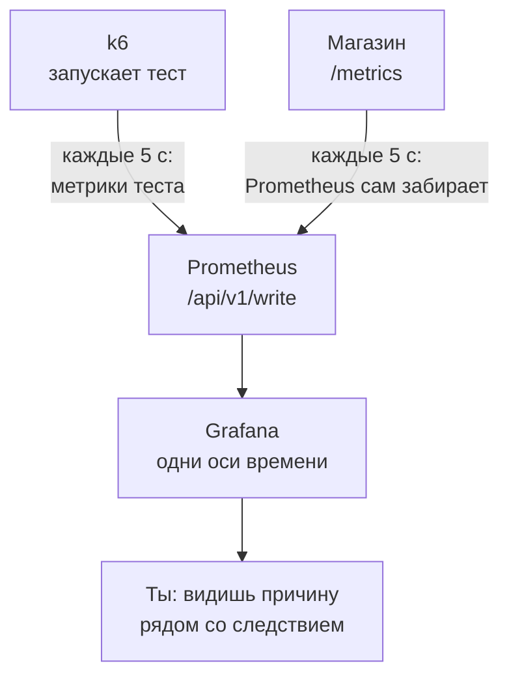
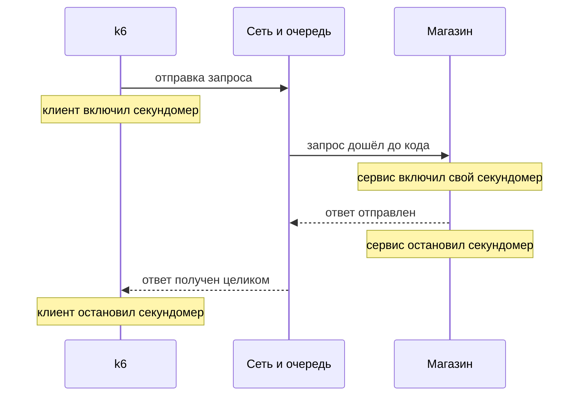

## Зачем это нужно

Это снова я, твой наставник. Перед релизом команда магазина просит меня: «Проверь, не стал ли сайт медленнее». Я прогоняю тест, k6 печатает сводку: p95 вырос с 80 до 140 мс. Следующий вопрос всегда один: почему? Сводка молчит. Через час никто не вспомнит, что было на 47-й секунде, а самое интересное всегда там. Когда вырос p95? Совпало ли это с очередью в пуле соединений? Не начал ли сервис отвечать ошибками раньше, чем k6 заметил?

Сводка k6 даёт итог одной цифрой, а график показывает, что происходило секунда за секундой. Чтобы понять **почему**, нужны графики теста **рядом** с графиками сервиса, на одной оси времени. Для этого метрики самого теста (запросы, задержка, занятые виртуальные пользователи) отправляют в тот же Prometheus, где живут метрики «Магазина», и рисуют в той же Grafana.

Вторая половина урока: сравнение k6 и Locust. Ты прошёл оба инструмента на одном сценарии, и теперь у тебя есть право на мнение.

Шаг проекта: ты запускаешь `shop.js` из 10.2 с выводом в Prometheus стенда и собираешь в Grafana дашборд «k6 и Магазин» (экспорт в `~/perf-lab/10-k6/dashboards/k6-shop.json`). Потом пишешь скрипт-обёртку `run.sh` и записываешь в `~/perf-lab/10-k6/compare.md` таблицу «k6 против Locust» с твоими цифрами.

## Что нужно знать

- Скрипт `~/perf-lab/10-k6/shop.js`, запуск `k6 run`, метрики `http_req_duration`, `http_reqs`, `vus`, `iterations`: [урок 10.1](01-js-first-script.md).
- Сценарий `shop` с `constant-arrival-rate`, переменные `RATE` и `DURATION`, пороги, `dropped_iterations`: [урок 10.2](02-scenarios-thresholds.md).
- Prometheus: метрики, метки, `/metrics`, типы counter, gauge и histogram: [урок 7.1](../07-observability/01-metrics-prometheus.md). PromQL `rate`, `sum by`, `histogram_quantile`: [урок 7.2](../07-observability/02-promql.md).
- Grafana: источник данных, панели, переменные, экспорт дашборда: [урок 7.3](../07-observability/03-grafana.md).
- Почему задержку у клиента и у сервера считают по-разному: [урок 8.1](../08-perf-theory/01-latency-throughput.md), раздел «Где меряют».
- Locust: [уроки 9.4](../09-locust/04-headless-shape.md) и [9.5](../09-locust/05-distributed-generator.md), твой CSV с результатами прогона.
- Стенд «Магазин» с профилем `monitoring` (`docker compose --profile monitoring up -d --wait`): Prometheus на 9090, Grafana на 3000.

## Картина целиком

Возьми стадион. Датчики на трибунах (сервис, база, Redis) стоят постоянно, а диспетчер раз в пять секунд обходит их и записывает показания в журнал. Так работает Prometheus: он сам ходит и забирает метрики (scrape). А теперь на поле выходит команда испытателей (k6). Они приходят на две минуты и уходят, в обходе у диспетчера их нет. Поэтому они сами **приносят свой журнал** в то же окошко: «вот что мы делали последние пять секунд». Это называется **remote write** (удалённая запись). В итоге в одном журнале лежат и показания датчиков, и протокол испытателей, на общей шкале времени.



Здесь видно, что два потока данных попадают в одну базу. Магазин отдаёт метрики по запросу Prometheus (pull, «тянуть»), а k6 отправляет свои сам (push, «толкать»). Для Grafana разницы нет: оба потока лежат в базе Prometheus как ряды в одном хранилище, а Grafana лишь рисует.

Три идеи урока: k6 умеет «толкать» метрики в Prometheus, а стенд к этому готов. Метрики теста нужно **подписывать** меткой `testid` (имя прогона), иначе прогоны перемешаются. И задержка у k6 и у сервера это **разные** числа, их разница сама диагностический инструмент.

## Теория

### Почему k6 «толкает» метрики, а не ждёт обхода

Постоянный датчик на стене это почтовый ящик: почтальон обходит его ежедневно. Разовый курьер, приехавший на два часа, ящика не имеет, он сам идёт и отдаёт посылки на приёмный пункт. Так и k6: он запускается командой, работает две минуты и **завершается**. Сервера метрик у него нет, заходить Prometheus некуда.

Приёмный пункт устроен так. **Remote write** это стандартный протокол Prometheus: любой желающий отправляет пакет точек (имя метрики, метки, значение, время) на адрес `/api/v1/write`. Prometheus при этом нужно запустить с флагом `--web.enable-remote-write-receiver`. **Стенд «Магазин» уже настроен**: флаг стоит у сервиса `prometheus` в `project/shop/compose.yaml`. Чтобы проверить приём без побочных эффектов, пошли запрос с пустым телом: Prometheus ответит ошибкой разбора, а не «не найдено».

```bash
curl -s -o /dev/null -w '%{http_code}\n' -X POST http://localhost:9090/api/v1/write
```

```text
400
```

**Как читать вывод:** `400` (плохой запрос) это хороший знак: адрес существует и принимает данные, просто тело пустое. При выключенном приёме вернулось бы `404` или `405` (метод не разрешён).

k6 подключается к приёмнику встроенным модулем вывода (output), его включает флаг `-o`:

```bash
k6 run -o experimental-prometheus-rw shop.js
```

Слово `experimental` остаётся в имени и в k6 2.x: вывод давно стабилен, но историческое имя сохранилось. Если в блоге увидишь `-o prometheus-rw`, сверься с `k6 version`.

> **Прикинь сам:** ты запустил тест, а на странице Status - Targets в Prometheus нет никакой цели для k6. Это поломка?
{: .predict}

Нет. Targets показывает только адреса, которые Prometheus сам обходит, а k6 присылает данные сам. Увидеть их можно запросом `k6_vus`.

Осторожно: remote write это запись **в** Prometheus, а не чтение (remote read) из другого хранилища. Нам нужна только запись.

> **Главное:** k6 не обходят, он сам отправляет метрики по remote write на `/api/v1/write`. Стенд к этому готов, а проверка приёма это пустой POST с ответом 400.
{: .key}

Данные пришли. Теперь надо понять, под какими именами их искать.

### Имена метрик, `testid` и единицы

Prometheus требует строгих имён (буквы, цифры, подчёркивания), а у k6 свои вроде `http_req_duration`. Вывод переводит одно в другое по двум правилам. Первое: ко всем именам добавляется префикс `k6_`. Второе: суффикс зависит от типа метрики k6. Из [урока 7.1](../07-observability/01-metrics-prometheus.md) ты помнишь счётчик (только растёт) и гейдж (идёт вверх и вниз).

| Что в k6 | Тип в k6 | Имя в Prometheus |
|---|---|---|
| `http_reqs` | Counter (счётчик) | `k6_http_reqs_total` |
| `iterations` | Counter | `k6_iterations_total` |
| `dropped_iterations` | Counter | `k6_dropped_iterations_total` |
| `checks` | Rate (доля) | `k6_checks_rate` |
| `http_req_failed` | Rate | `k6_http_req_failed_rate` |
| `vus` | Gauge (гейдж) | `k6_vus` |
| `http_req_duration` | Trend (ряд значений) | `k6_http_req_duration_p99`, `_p95`, `_avg`, `_max` |

**Тренд** (trend) в k6 хранит все измеренные значения, чтобы потом посчитать среднее и перцентили. В Prometheus такого типа нет, поэтому k6 заранее **считает** нужные показатели и шлёт каждый отдельным рядом. Какие именно, задаёт переменная `K6_PROMETHEUS_RW_TREND_STATS`. **По умолчанию там только `p(99)`**: не настроишь, и p95 из SLO в Prometheus не найдёшь. Строка `p(95),p(99),avg,max` даёт четыре ряда: `_p95`, `_p99`, `_avg`, `_max`.

С такой настройкой в Prometheus появится ряд:

```text
k6_http_req_duration_p95{testid="smoke-20261003-1402", scenario="shop", name="/api/products/[id]", method="GET", status="200"}
```

Читаем: `k6_http_req_duration_p95` это префикс, метрика и статистика. `scenario` это имя сценария из `options.scenarios` (у тебя `shop`), `name` метка из [урока 10.1](01-js-first-script.md), `method` и `status` метод и код ответа. А `testid` это метка прогона, и её k6 сам **не создаёт**: ты добавляешь её флагом `--tag testid=<имя>`, и она приклеивается к каждой метрике. Без неё вчерашний тест неотличим от сегодняшнего. Имя прогона должно быть уникальным и нести смысл (вид теста и время): `k6_vus{testid="smoke-20261003-1402"}`.

Со временем не угадывай, а проверяй. Сравни число на графике с числом из сводки того же прогона. Сводка говорит `p(95)=212.4ms`. На графике 0.2124 значит секунды (единица «seconds (s)»), 212.4 значит миллисекунды. Минута проверки спасёт от графика, который врёт в тысячу раз.

> **Прикинь сам:** в Prometheus есть `k6_http_req_duration_p99`, а `_p95` нет. Что ты забыл сделать?
{: .predict}

Задать `K6_PROMETHEUS_RW_TREND_STATS="p(95),p(99),avg,max"` (в кавычках, потому что оболочка терминала иначе сама попытается разобрать скобки).

Осторожно, три путаницы. `k6_http_req_failed_rate` это **доля** от 0 до 1, а не число ошибок. `k6_http_reqs_total` это счётчик «сколько всего», а RPS из него получают функцией `rate()` ([урок 7.2](../07-observability/02-promql.md)). Ряда `k6_dropped_iterations_total` может не быть совсем: k6 не шлёт счётчик, пока тот не вырос хоть раз (так он экономит место). Пустой график значит «потерь не было», а не «ломка».

> **Главное:** метрики k6 живут под префиксом `k6_`, p95 появится только после настройки `K6_PROMETHEUS_RW_TREND_STATS`, прогон подписывай через `--tag testid`, а единицы сверяй со сводкой.
{: .key}

Теперь о том, почему точки на графике идут ступеньками.

### Push-интервал: почему график ступенчатый

Отправлять каждое измерение отдельно нельзя: при тысяче запросов в секунду это тысяча пакетов в секунду, и измерение нагрузки само станет нагрузкой. Поэтому k6 копит измерения и раз в несколько секунд шлёт сводку. Интервал задаёт `K6_PROMETHEUS_RW_PUSH_INTERVAL`, по умолчанию **5 секунд**, как и `scrape_interval: 5s` у Prometheus стенда.

Каждые 5 секунд k6 берёт накопленное и шлёт сводку одной точкой. Как именно расширение для Prometheus считает p95 (за последнее окно или накопительно за весь тест), зависит от версии и от настроек расширения, и в этом уроке я не берусь утверждать, как именно. Поэтому проверь на своём стенде: сравни p95 на графике с итоговым p(95) в конце прогона. Если линия шумнее и местами сильно отличается, перед тобой статистика по окну. При 20 RPS в окне всего 100 запросов, так что шум оправдан. Если линия гладкая и в конце равна итогу, считается накопительно.

> **Прикинь сам:** сколько запросов попадёт в окно при 20 RPS, и будет ли p95 на графике равен p(95) из сводки?
{: .predict}

Сто запросов за 5 секунд. Совпадёт ли p95 с итогом, зависит от того, как твоя версия считает его: за окно или накопительно. Надёжно совпадают смысл и тренд, а число сверь сам.

Осторожно: интервал в `1s` сделает график подробнее, но шумнее, и нагрузка на Prometheus вырастет. Для учебного стенда `5s` оптимально: столько же, сколько шаг Prometheus. На работе берут 5-15 секунд, смотря на длину теста и размер базы.

> **Главное:** k6 шлёт сводку раз в 5 секунд; p95 на графике может быть и по окну, и накопительным (зависит от версии), поэтому сверяй его с итогом k6 в конце прогона и опирайся на тренд.
{: .key}

Есть ещё один способ хранить задержки, и мы его не берём.

<details markdown="1">
<summary>Для любопытных: нативные гистограммы</summary>

Prometheus умеет хранить распределение целиком (**нативные гистограммы**): k6 отправляет его, а перцентиль считается запросом `histogram_quantile` уже после теста, любой, хоть p97. Включают переменной `K6_PROMETHEUS_RW_TREND_AS_NATIVE_HISTOGRAM=true` и флагом Prometheus `--enable-feature=native-histograms`. **На нашем стенде этого флага нет**, поэтому мы работаем с заранее посчитанными перцентилями. Готовый дашборд для классического режима имеет id **19665**, для нативных гистограмм **18030**.

</details>

### Метки и кардинальность: как тест съедает базу

Метка удобна: по `name` можно резать задержку по маршрутам. Но на каждую **уникальную комбинацию** меток Prometheus заводит отдельный ряд (time series). Число таких комбинаций называется **кардинальностью** (cardinality). Представь шкаф с папками. Двадцать клиентов, папка на каждого: удобно. Папка на каждый чек даёт склад на миллион папок, в котором ничего не найти.

По умолчанию k6 помечает запрос меткой `url` с полным адресом. Для него `/api/products/1` и `/api/products/10000` это разные адреса, и каждому достанется ряд. Поэтому в [уроке 10.1](01-js-first-script.md) в скрипте стоит `tags: { name: '/api/products/[id]' }`: метка `name` перекрывает `url`, и все карточки сливаются в один маршрут.

Посчитаем. Допустим, на каждую комбинацию меток приходится 12 рядов (четыре статистики `http_req_duration`, `http_reqs`, `http_req_failed` и ещё несколько метрик). Без `name`: 10 000 товаров × 12 = **120 000 рядов**. С `name`: 1 × 12 = **12 рядов**. Разница в 10 000 раз получена одной строкой.

> **Прикинь сам:** в скрипте `testid` задан как `run-${Math.random()}` внутри `default`-функции. Что будет с Prometheus?
{: .predict}

Кардинальность взорвётся: каждая итерация создаёт новую комбинацию меток и новые ряды, Prometheus начнёт пухнуть по памяти. К тому же `--tag` задают один раз флагом на весь прогон. `testid` один на запуск.

Осторожно: кардинальность путают с объёмом. Миллион точек в один ряд дёшев, миллион разных рядов по одной точке дорог. `testid` с датой тоже метка, и каждый прогон добавляет набор рядов: десятки прогонов это нормально.

> **Главное:** каждая уникальная комбинация меток это отдельный ряд. Метки с тысячами значений (`url` с id товара, случайный `testid`) убивают Prometheus, а `name` и один `testid` на прогон защищают.
{: .key}

Метки есть, ряды целы. Теперь на дашборде две линии p95, и они расходятся.

### Клиентская и серверная задержка: почему две линии расходятся

На дашборде будут два p95: от k6 и от сервиса (`http_request_duration_seconds`). Новичок видит расхождение и пугается: «одна из них врёт». Не врёт ни одна, они измеряют разное, и разница показывает, где потерялось время. Это тема «Где меряют» из [урока 8.1](../08-perf-theory/01-latency-throughput.md).

Сервис включает секундомер, когда запрос **дошёл** до его кода (функция-посредник `observe_request`, которая оборачивает каждый запрос), и выключает, когда ответ **ушёл**. k6 засекает от отправки запроса до последнего байта ответа. Между ними лежит то, чего сервис не видит: очередь соединений, передача по сети и очередь внутри перегруженного генератора.



Секундомер клиента включается раньше и выключается позже, значит, **клиентский p95 не меньше серверного**. Разрыв это время в сети и в очередях.

Пример. При 20 RPS на спокойном стенде клиент p95 = 38 мс, сервер p95 = 31 мс, разрыв 7 мс: сеть на одной машине. Поднимаем нагрузку до предела: клиент 640 мс, сервер 120 мс, разрыв **520 мс**. Сервер отвечает быстро, но запросы долго ждут до его кода, например, единственный рабочий процесс веб-сервера (Uvicorn) занят, и новые соединения стоят в очереди. Растущий разрыв это признак насыщения, такой график ты принесёшь в [теме 11](../11-bottlenecks/01-method.md).

> **Прикинь сам:** сервер p95 = 90 мс, клиент p95 = 95 мс, а порог `p(95)<500` не выполнен. Возможно ли такое?
{: .predict}

Для этих чисел нет: порог проверяется по клиентскому значению, а оно 95 мс. Значит, нарушение прячется в другом: график может считаться по окнам, а порог считается по всему тесту или по метрике с тегом (например, только `/api/orders`). Ищи маршрут с высоким p95.

Осторожно: «клиент медленный, сервер быстрый, виноват генератор» верно не всегда. Перегруженный k6 или Locust тоже растягивает клиентскую линию (проверь процессор на его машине), но чаще это очередь перед сервером. Сверь, растёт ли `k6_vus` до потолка `maxVUs` и есть ли `dropped_iterations`.

> **Главное:** клиентский p95 всегда не меньше серверного, а растущий разрыв между ними это очередь перед сервисом, то есть признак насыщения.
{: .key}

Две линии мы объяснили. Теперь соберём панели в порядок чтения.

### Как читать дашборд теста: порядок взгляда

Четыре панели с десятком линий легко превращаются в красивую картинку, из которой ничего не следует. Опытный нагрузочник читает всегда в одном порядке: **поданная нагрузка, ответ сервиса, цена, ошибки**.

Сначала RPS k6: линия должна повторять профиль из `options` (полку или лесенку). Не повторяет: проблема в генераторе (мало VU, `dropped_iterations`), сервис ни при чём. Потом линия сервиса рядом: она идёт за линией k6, а расхождение значит потерю запросов по дороге. Дальше цена: p95 клиента и сервера. Пока нагрузка растёт, а линии лежат ровно, запас есть. Первая оторвавшаяся вверх показывает начало насыщения (хоккейная клюшка из 8.1). Наконец, ошибки: они обычно идут **после** роста задержки.

Пример. Лесенка 10, 20, 30, 40 RPS по минуте. На 30 RPS p95 сервера 90 мс, на 40 уходит к 400 мс. Клиентская линия на 40 RPS 900 мс, `k6_vus` вырос с 4 до 18, ошибок 0,2%. Читаем по порядку: нагрузка подана, сервис её обрабатывает, цена выросла на 40 (клюшка), разрыв клиент-сервер 500 мс (очередь), VU выросли, ошибок почти нет. Вывод для отчёта ([тема 12](../12-process/01-report.md)): «до 30 RPS в норме, на 40 насыщение, предел около 35».

> **Прикинь сам:** RPS k6 идёт по лесенке 10, 20, 30, 40, а линия сервиса остановилась на 30 и дальше ровная. Что это значит?
{: .predict}

Сервис больше 30 RPS не берёт: это его предел. Остальные 10 в секунду копятся в очереди и скоро станут таймаутами и ошибками, а клиентский p95 уйдёт вверх.

Осторожно: на красное (ошибки) смотрят первым, а это поздний признак. Ищи начало цепочки: рост задержки.

> **Главное:** читай дашборд по порядку (нагрузка, ответ сервиса, цена, ошибки) и ищи начало цепочки, а не самое красное место.
{: .key}

Часть выводов нужна не глазам, а скриптам.

### Свой итоговый отчёт: `handleSummary`

CI и скриптам нужен файл: JSON для сравнения прогонов, HTML для руководителя. Для этого в скрипте объявляют функцию `handleSummary`. В конце теста k6 вызывает её один раз и передаёт все итоги в объекте `data`. Функция возвращает объект «куда писать: что писать»: ключ `stdout` это экран, любой другой ключ это путь к файлу.

```javascript
export function handleSummary(data) {
  return {
    stdout: 'Тест закончен, подробности в summary.json\n',
    'summary.json': JSON.stringify(data, null, 2),
  };
}
```

`JSON.stringify(data, null, 2)` превращает объект в текст JSON с отступом в 2 пробела. Структуру файла смотри через `jq '.metrics | keys' summary.json` ([урок 1.2](../01-linux/02-text-logs.md)).

Осторожно: если не вернуть `stdout`, стандартная таблица на экране не появится, функция заменяет её целиком. Код выхода при нарушенном пороге она не меняет. И это не замена Prometheus: итог один, после конца теста, а графика по времени нет.

> **Главное:** `handleSummary` пишет итоги в файлы для CI и людей, а график по времени остаётся за Prometheus.
{: .key}

### k6 и Locust: что отличается по-настоящему

«K6 или Locust?» это самый частый вопрос на собеседованиях и в командных спорах. Плохой ответ: «k6 быстрее» или «Locust проще». Хороший сравнивает по осям, которые влияют на работу. Оба инструмента генерируют HTTP-нагрузку по сценарию и меряют ответы, различия в устройстве.

Язык: в Locust это обычный Python со всеми библиотеками, в k6 JavaScript, который выполняет движок на Go. Это **не Node.js** (программа, которая запускает JavaScript вне браузера): готовые npm-пакеты оттуда в k6 обычно не подключить. Модель: Locust по умолчанию закрытый ([урок 8.2](../08-perf-theory/02-queues-littles-law.md)), открытую модель собирают вручную (`constant_throughput`, свой `LoadTestShape`), а в k6 она встроена ([урок 10.2](02-scenarios-thresholds.md)). Пороги: в k6 они в скрипте, код выхода 99 сообщает пайплайну о провале, а в Locust это делают кодом (`events.quitting`, `environment.process_exit_code`).

Ресурсы: пользователь Locust это объект Python, процесс упирается в одно ядро ([урок 9.5](../09-locust/05-distributed-generator.md)), поэтому для большой нагрузки запускают несколько процессов. Один процесс k6 использует все ядра. Точные числа зависят от скрипта, **меряй сам**. Интерфейс: у Locust веб-интерфейс со слайдерами, наглядный для знакомства, а у k6 терминал и Grafana. Метрики: k6 из коробки шлёт их в Prometheus и другие системы, Locust даёт CSV, а в Prometheus идёт через отдельный экспортер. Расширения: k6 можно дополнить плагинами через **xk6**: это утилита, которая пересобирает k6 вместе с твоим плагином на Go, а для Locust это обычные Python-пакеты. Про третий инструмент, JMeter, читай в [уроке 10.1](01-js-first-script.md).

<div class="viz" data-viz="k6-pick-tool"></div>

Пять вопросов о твоей ситуации сдвигают шкалу к одному из инструментов. Это не истина, а способ увидеть, что решает больше всего: обычно модель нагрузки и нужный код выхода для CI.

Сводка (числа в практике будут свои):

| | Locust | k6 |
|---|---|---|
| Язык | Python | JavaScript / TypeScript (движок Go) |
| Модель по умолчанию | закрытая (пользователи) | любая; для потока запросов `arrival-rate` |
| Открытая модель | вручную (`LoadTestShape`) | встроена |
| Веб-интерфейс | есть, в реальном времени | нет, графики через Grafana |
| Пороги и код выхода для CI | пишутся кодом | `thresholds`, код выхода 99 |
| Ресурсы на одного VU | выше, несколько процессов | ниже, один процесс на все ядра |
| Распределённый запуск | master и worker | executors на одной машине; несколько машин настраивают отдельно |
| Метрики в Prometheus | через экспортер | `-o experimental-prometheus-rw` |
| Расширения | Python-пакеты | xk6 (Go) |
| Кривая обучения новичка | ниже, если знаешь Python | выше: нужен JS и понимание executors из 10.2 |

Что выбирать? Команда на Python, сложный сценарий с логикой и интерфейс для показа коллегам: Locust. Ровный поток, пороги в CI, высокая нагрузка с одной машины и Grafana: k6. Протокол, которого нет ни там, ни там (например, очередь Kafka): смотри расширения. На практике нагрузочник держит **оба**: Locust для исследований, k6 для регрессионных прогонов в CI ([урок 12.2](../12-process/02-perf-ci.md)).

> **Прикинь сам:** Locust на 50 пользователях показал 38 RPS, k6 с `constant-arrival-rate` на 50 RPS показал ровно 50. Значит, k6 «выжимает» больше?
{: .predict}

Нет, нагрузки разные. У Locust 50 пользователей с паузами дают столько RPS, сколько получится, а k6 просто настроен на ровно 50. Чтобы сравнить, приведи нагрузку к одной: в Locust поставь поток 50 RPS или в k6 возьми `constant-vus` с теми же паузами.

Осторожно: числа двух инструментов нельзя сравнивать без одинаковых условий. Разные паузы, модель (закрытая или открытая), способ входа (логин в каждой итерации или один раз) дадут разные RPS и p95 на одном сервисе. Сравнивай модели нагрузки, а не «чей инструмент показал меньше».

> **Главное:** k6 не лучше Locust, а лучше под задачу; числа сравнивай только при одинаковой модели нагрузки, паузах и способе входа.
{: .key}

## Практика

Все команды из `~/perf-lab/10-k6`. Стенд с мониторингом запущен, `shop.js` из 10.2 работает.

### 1. Проверь стенд и приём remote write

Поднимаем стенд (если не запущен) и проверяем, что Prometheus принимает запись:

```bash
cd ~/load-tester/project/shop
docker compose --profile monitoring up -d --wait
curl -s -o /dev/null -w '%{http_code}\n' -X POST http://localhost:9090/api/v1/write
```

Разбор: `docker compose --profile monitoring up -d --wait` запускает сервисы профиля в фоне (`-d`) и ждёт готовности (`--wait`); `curl -s` без вывода прогресса, `-o /dev/null` выбрасывает тело ответа, `-w '%{http_code}\n'` печатает только код, `-X POST` задаёт метод.

```text
400
```

**Как читать вывод:** `400` значит «адрес есть, тело пустое»: приём включён. `404` или `405` значит, что Prometheus запущен без флага: тогда смотри «Сломай и почини».

**Типичные ошибки:** `curl: (7) Failed to connect to localhost port 9090` означает, что профиль `monitoring` не запущен (повтори `up` с `--profile monitoring`); `000` в выводе то же самое.

### 2. Первый прогон с выводом в Prometheus

Короткий прогон на 40 секунд, чтобы увидеть данные. Строка запуска длинная, поэтому разберём её:

```bash
cd ~/perf-lab/10-k6
RATE=10 DURATION=40s \
K6_PROMETHEUS_RW_TREND_STATS="p(95),p(99),avg,max" \
k6 run -o experimental-prometheus-rw --tag testid=first-001 shop.js
```

Разбор: `RATE=10 DURATION=40s` перед командой задаёт переменные окружения только для этого запуска (скрипт читает их через `__ENV`, [урок 10.2](02-scenarios-thresholds.md)). `K6_PROMETHEUS_RW_TREND_STATS` просит отправлять p95, p99, среднее и максимум; кавычки нужны, потому что в `p(95)` скобки, и оболочка иначе сломается. `-o experimental-prometheus-rw` включает вывод в Prometheus (адрес по умолчанию `http://localhost:9090/api/v1/write`, подходит нашему стенду). `--tag testid=first-001` метка прогона. Символ `\` в конце строки продолжает команду на следующей.

Сводка в конце теста выглядит примерно так (у тебя числа будут другие):

```text
  █ THRESHOLDS

    checks
    ✓ 'rate>0.99' rate=100.00%

    dropped_iterations
    ✓ 'count==0' count=0

    http_req_duration
    ✓ 'p(95)<500' p(95)=212.4ms

    http_req_failed
    ✓ 'rate<0.01' rate=0.00%


  █ TOTAL RESULTS

    checks_total.......................: 2013    50.1/s
    checks_succeeded...................: 100.00% 2013 out of 2013
    checks_failed......................: 0.00%   0 out of 2013

    ✓ вход: 200
    ✓ каталог: 200
    ✓ карточка: 200
    ✓ корзина: 201
    ✓ заказ: 201
    ✓ список заказов: 200

    HTTP
    http_req_duration..................: avg=71.9ms  min=8.1ms  med=42.7ms  max=611ms  p(90)=151ms  p(95)=212.4ms
      { expected_response:true }.......: avg=71.9ms  min=8.1ms  med=42.7ms  max=611ms  p(90)=151ms  p(95)=212.4ms
    http_req_failed....................: 0.00%  0 out of 2013
    http_reqs..........................: 2013   50.1/s

    EXECUTION
    iteration_duration.................: avg=1.12s   min=1.03s  med=1.08s   max=1.9s   p(90)=1.3s   p(95)=1.5s
    iterations.........................: 400    9.96/s
    vus................................: 11     min=2      max=13
    vus_max............................: 13     min=10     max=13

    NETWORK
    data_received......................: 1.3 MB 33 kB/s
    data_sent..........................: 430 kB 11 kB/s
```

**Как читать вывод:** сначала `THRESHOLDS`: четыре зелёные галочки значат, что пороги выполнены. Два числа нужны для сверки с Grafana: `http_req_duration p(95)=212.4ms` и `iterations 9.96/s` (десять итераций в секунду при `RATE=10`). Внизу `vus max=13` показывает, сколько пользователей понадобилось, чтобы держать поток при текущей задержке: по Литтлу 10 итераций/с × 1,12 с ≈ 11 занятых VU, остальное запас на всплески. Это сверка с `k6_vus`. Запросов 2013: 400 итераций по пять запросов и по одному входу на каждый из 13 VU.

### 3. Найди метрики в Prometheus

Открой в браузере `http://localhost:9090` и на вкладке Graph введи сначала запрос, который показывает **все** имена k6:

```promql
count by (__name__) ({__name__=~"k6_.+"})
```

Разбор: `{__name__=~"k6_.+"}` выбирает все ряды, у которых имя подходит под регулярное выражение «начинается с k6_» (`=~` означает «совпадает с шаблоном»); `count by (__name__)` считает ряды на каждое имя, так что получаешь список метрик без дубликатов.

Ты увидишь `k6_http_reqs_total`, `k6_vus`, `k6_http_req_duration_p95` и другие. Теперь проверь единицы:

```promql
k6_http_req_duration_p95{testid="first-001"}
```

Сравни число с `p(95)` из сводки прогона. Если на графике 0.21 при сводке 212 мс, это секунды; если 212, то миллисекунды. **Запиши вывод в `~/perf-lab/10-k6/notes.md`:** от этого зависит выбор единицы в Grafana.

**Типичные ошибки:** запрос ничего не вернул. Причины по порядку: (1) тест ещё не отправил первую порцию (подожди 10 секунд после старта); (2) в `testid` опечатка, проверь запросом `k6_vus` без фильтра; (3) в окне графика выбран период, в который теста не было (поставь «Last 15 minutes»).

### 4. Скрипт-обёртка `run.sh`

Писать длинную команду вручную каждый раз это путь к ошибкам: забыл `testid`, забыл `K6_PROMETHEUS_RW_TREND_STATS`. Положи команду в скрипт:

```bash
cat > ~/perf-lab/10-k6/run.sh <<'SCRIPT'
#!/usr/bin/env bash
# Запуск k6 с выводом в Prometheus: ./run.sh <метка> [RATE] [DURATION]
set -u
LABEL=${1:-run}
export RATE=${2:-20}
export DURATION=${3:-2m}
TESTID="${LABEL}-$(date +%Y%m%d-%H%M)"

export K6_PROMETHEUS_RW_SERVER_URL=${K6_PROMETHEUS_RW_SERVER_URL:-http://localhost:9090/api/v1/write}
export K6_PROMETHEUS_RW_TREND_STATS="p(95),p(99),avg,max"
export K6_PROMETHEUS_RW_PUSH_INTERVAL=5s

mkdir -p ~/perf-lab/results
cd "$(dirname "$0")" || exit 1
echo "testid=${TESTID}  RATE=${RATE}  DURATION=${DURATION}"
echo "начало: $(date '+%H:%M:%S')"
k6 run -o experimental-prometheus-rw --tag testid="${TESTID}" shop.js \
  | tee ~/perf-lab/results/k6-"${TESTID}".txt
code=${PIPESTATUS[0]}
echo "конец: $(date '+%H:%M:%S'), k6 завершился с кодом ${code}"
exit "${code}"
SCRIPT
chmod +x ~/perf-lab/10-k6/run.sh
```

Разбор по частям. Первая строка `#!/usr/bin/env bash` говорит системе, какой интерпретатор запускать. `set -u` останавливает скрипт при обращении к несуществующей переменной (защита от опечаток). `${1:-run}` читает первый аргумент, а если его нет, берёт `run`; так же `${2:-20}` для RATE. `$(date +%Y%m%d-%H%M)` подставляет текущие дату и время в имя, поэтому `testid` уникален по минутам. `export` делает переменную видимой для k6. `${VAR:-значение}` у адреса позволяет переопределить его снаружи (например, если Prometheus на другом хосте). `tee файл` копирует вывод k6 и на экран, и в файл. Главная тонкость: `k6 ... | tee ...` это **конвейер** (pipeline), и код выхода конвейера по умолчанию равен коду **последней** команды, то есть `tee` (всегда 0). Нам нужен код k6, он лежит в массиве `PIPESTATUS`: `${PIPESTATUS[0]}` это код первой команды. Мы сохраняем его в `code` **сразу** после конвейера, потому что любая следующая команда затрёт `PIPESTATUS`. Без этого CI не узнал бы, что пороги нарушены (код 99).

Запусти:

```bash
~/perf-lab/10-k6/run.sh smoke 10 40s
echo "код выхода: $?"
```

```text
testid=smoke-20261003-1402  RATE=10  DURATION=40s
начало: 14:02:11
...
конец: 14:02:53, k6 завершился с кодом 0
код выхода: 0
```

**Как читать вывод:** время начала и конца пригодится, чтобы выбрать период в Grafana. Строка `код выхода: 0` значит, что пороги выполнены; при нарушении будет `99`. Сводка сохранена в `~/perf-lab/results/k6-smoke-20261003-1402.txt`.

### 5. Собери дашборд в Grafana

Открой `http://localhost:3000` (логин не нужен). Dashboards - New - New dashboard - Add visualization, источник данных **Prometheus**. Сначала создай переменную, чтобы выбирать прогон: Settings (шестерёнка) - Variables - Add variable, тип Query, имя `testid`, запрос:

```promql
label_values(k6_vus, testid)
```

Разбор: `label_values(метрика, метка)` это функция Grafana (не PromQL), которая возвращает все значения метки `testid` у метрики `k6_vus`. Теперь в панелях можно писать `$testid`, и Grafana подставит выбранный прогон.

Сделай четыре панели. На каждой выбери нужную единицу в правой панели (Standard options - Unit).

**Панель 1: «RPS: k6 и сервис».** Два запроса на одной панели, единица «requests/sec (rps)»:

```promql
sum(rate(k6_http_reqs_total{testid="$testid"}[30s]))
```

```promql
sum(rate(http_requests_total{route!="/metrics"}[30s]))
```

Подписи (Legend, режим Custom): `k6` и `Магазин`. Разбор: первая линия это сколько запросов отправил k6; вторая сколько обработал сервис. `rate(...[30s])` считает скорость за 30 секунд (окно в несколько раз длиннее push-интервала в 5 с). Фильтр `route!="/metrics"` убирает запросы самого Prometheus на `/metrics`: они не относятся к нагрузке теста.

**Панель 2: «p95: клиент и сервер».** Единица «seconds (s)» или «milliseconds (ms)» по результату сверки из шага 3. Если у k6 миллисекунды, умножь серверную линию на 1000 (`... * 1000`):

```promql
max(k6_http_req_duration_p95{testid="$testid"})
```

```promql
histogram_quantile(0.95, sum by (le) (rate(http_request_duration_seconds_bucket{route!="/metrics"}[30s])))
```

Разбор: `max(...)` берёт худшую линию по разрезам (`name`, `status`), потому что k6 присылает отдельные ряды на каждый маршрут. Вторая формула это серверный p95 из [урока 7.2](../07-observability/02-promql.md): `histogram_quantile` по корзинам гистограммы.

**Панель 3: «VU и потерянные итерации».**

```promql
k6_vus{testid="$testid"}
```

```promql
sum(rate(k6_dropped_iterations_total{testid="$testid"}[30s]))
```

Первая это сколько VU занято, вторая сколько итераций в секунду k6 не смог запустить. Если потерь не было, второй ряд пуст: это нормально, см. «Что путают» выше.

**Панель 4: «Доля ошибок».** Единица «Percent (0.0-1.0)»:

```promql
max(k6_http_req_failed_rate{testid="$testid"})
```

```promql
sum(rate(http_requests_total{status=~"5.."}[30s])) / sum(rate(http_requests_total[30s]))
```

Первая линия ошибки с точки зрения теста (включая таймауты и коды 4xx, которые k6 считает ошибкой), вторая доля ответов 5xx по метрикам сервиса. Подписи: `k6` и `Магазин (5xx)`.

Сохрани дашборд (`Save dashboard`, имя «k6 и Магазин»). Верхний период поставь по времени из `run.sh` (например, 14:00 - 14:10 или Last 15 minutes). Для рамок теста используй **аннотацию** (annotation): вертикальную отметку на графиках. Самый простой способ: в Grafana на панели удерживай Ctrl и кликни в момент начала теста, подпись `старт smoke-20261003-1402`, потом так же конец. Времена бери из вывода `run.sh`. Аннотации не обязательны для урока, но в настоящем отчёте они нужны: читатель сразу видит рамки теста.

Запусти длинный прогон с заметной нагрузкой и смотри на панели **вживую**:

```bash
~/perf-lab/10-k6/run.sh load 40 3m
```

**Как читать панели:**

- RPS k6 и RPS сервиса идут почти вместе; если k6 выше, часть запросов не дошла (таймауты, очередь);
- p95 клиента выше p95 сервера на разрыв: смотри, растёт ли он во время теста;
- VU растут, если сервис замедляется (чтобы держать заданный поток); упёрся в `maxVUs`, значит, появятся `dropped_iterations`;
- ошибки: линия k6 и линия сервиса расходятся, когда часть ошибок это таймауты (сервис их не успел увидеть).

Если у тебя установлен тот самый дашборд «Магазин: обзор (эталон)» из [урока 7.3](../07-observability/03-grafana.md) (uid `shop-overview`), открой его во втором окне на тот же период: так видно, что делали пул соединений и процессор, пока k6 росла нагрузка.

**Готовый дашборд.** Если не хочешь собирать панели руками, импортируй готовый: Dashboards - New - Import, введи id **19665** (классический режим, наш случай), нажми Load, выбери источник Prometheus и Import. Grafana скачивает его с grafana.com, поэтому нужен интернет у контейнера Grafana. Готовый дашборд красивее, но не знает про серверные метрики «Магазина»: твоя сборка, где k6 и сервис на одних осях, полезнее.

### 6. Экспортируй дашборд и сохрани в репозиторий

Share (стрелка вверх у дашборда) - Export - Save to file, либо Export as JSON. Сохрани файл как `~/perf-lab/10-k6/dashboards/k6-shop.json`:

```bash
mkdir -p ~/perf-lab/10-k6/dashboards
mv ~/Downloads/k6*.json ~/perf-lab/10-k6/dashboards/k6-shop.json
jq '.title, (.panels | length)' ~/perf-lab/10-k6/dashboards/k6-shop.json
```

```text
"k6 и Магазин"
4
```

Разбор: `jq` разбирает JSON; `.title` печатает имя дашборда, `.panels | length` число панелей. Если вышло `4`, экспорт содержит все панели.

### 7. Сравнение k6 и Locust на одном сценарии

Приведём оба инструмента к сопоставимым условиям. В Locust возьми прогон из [урока 9.4](../09-locust/04-headless-shape.md) с примерно такой же нагрузкой: твой CSV из 9.4 (файл с суффиксом `_stats.csv`). Для k6 возьми прогон с `RATE`, равным RPS Locust.

```bash
column -s, -t < <(head -n 3 ~/perf-lab/09-locust/results/*_stats.csv | cut -d, -f1-6,10,11)
```

Разбор: `head -n 3` берёт заголовок и две строки, `cut -d, -f1-6,10,11` оставляет выбранные столбцы по разделителю-запятой, `column -s, -t` выравнивает таблицу. Номера столбцов зависят от версии Locust, так что открой CSV и подбери нужные: имя запроса, число запросов, ошибки, медиана, среднее, p95.

Из итогов `run.sh` k6 возьми: `http_reqs` (в секунду), `http_req_duration` p(95), `http_req_failed`. Запиши в `~/perf-lab/10-k6/compare.md` таблицу, например:

```text
| | Locust (9.4) | k6 (10.3) |
|---|---|---|
| Нагрузка | 30 пользователей, паузы 1-3 с | 10 итераций/с, arrival-rate |
| RPS (все запросы) | 28 | 50 |
| p95, мс | 310 | 212 |
| Ошибки | 0.4% | 0.0% |
| Загрузка CPU генератора | 85% одного ядра | 12% всех ядер |
```

(числа примерные: у тебя будут другие). Ниже запиши **почему** цифры разные. Подсказки: у Locust в 9.4 между задачами пауза 1-3 секунды и логин в `on_start`, у k6 нет пауз между запросами одной итерации и вход один раз на VU. Загрузку генератора смотри `htop` во время обоих прогонов. График для отчёта:

<div class="viz" data-viz="chart" data-type="bar" data-x="RPS,p95 клиента (мс),p95 сервера (мс),CPU генератора (%)" data-series='[{"name":"Locust","values":[28,310,246,85]},{"name":"k6","values":[50,212,171,12]}]' data-x-label="Показатель" data-y-label="Значение" data-explain="Условный пример сравнения на одном сценарии: другая модель нагрузки даёт другой RPS, а k6 при той же работе занимает заметно меньше процессора. Твои числа будут другими, но сравнивай их так же: в одной таблице и с условиями рядом."></div>

Что здесь видно: столбцы разных единиц стоят рядом, поэтому смотри не на высоту, а на пару «Locust против k6» внутри каждого показателя. RPS у k6 выше, потому что у него другая нагрузка, а не потому что он «быстрее». Процессор генератора показывает настоящую разницу в цене пользователя.

Закончи практику коммитом (после темы 3 это правило каждого урока):

```bash
cd ~/perf-lab
git add 10-k6/shop.js 10-k6/users.json 10-k6/run.sh 10-k6/dashboards/k6-shop.json 10-k6/compare.md 10-k6/notes.md results/k6-*.txt
git commit -m "10.3: k6 в Prometheus, дашборд, сравнение с Locust"
git push
```

Если `shop.js` и `users.json` уже закоммичены в 10.2, git пропустит их без изменений. Проверь `git ls-files 10-k6`: в CI из [урока 12.2](../12-process/02-perf-ci.md) оба файла должны быть в репозитории.

## Сломай и почини

**Поломка 1: данные не доходят.** Останови Prometheus и запусти его **без** флага приёма записи (имитация чужого Prometheus). Проще: направь k6 на неверный адрес:

```bash
K6_PROMETHEUS_RW_SERVER_URL=http://localhost:9090/api/v1/wrong \
~/perf-lab/10-k6/run.sh broken 10 30s
```

**Задача.** Тест выполнится, сводка напечатается, код выхода может быть 0. А в Grafana пусто. Найди, где k6 сообщил о проблеме, и в чём причина. Порядок рассуждения:

<div class="viz" data-viz="flow" data-steps='[{"title":"Тест прошёл?","text":"Код выхода и сводка в норме: проблема не в сценарии."},{"title":"Данные в Prometheus?","text":"Запрос `k6_vus` без фильтра: есть ли хоть что-то."},{"title":"Что говорит k6","text":"Поищи в выводе строки с `error` и `remote write`."},{"title":"Код ответа","text":"`404` или `405` на запись: приём выключен или адрес неверный."},{"title":"Проверь вручную","text":"`curl -X POST .../api/v1/write` без тела: ждём 400."},{"title":"Почини и повтори","text":"Верный адрес или флаг, новый прогон, свежий `testid`."}]'></div>

<details markdown="1">
<summary>Разбор</summary>

1. Сводка и код выхода не зависят от вывода в Prometheus: k6 считает метрики у себя, а отправка это отдельный канал. Поэтому тест может быть «зелёным», а график пустым.
2. Запрос `k6_vus` без фильтра пустой: данных нет вообще (а не только под твоим `testid`).
3. В выводе k6 при ошибках записи появляются сообщения об ошибке отправки в remote write с кодом ответа сервера (ищи `grep -i 'remote' ~/perf-lab/results/k6-broken-*.txt`: сообщения идут в тот же поток вывода; точная формулировка зависит от версии).
4. Код `404` на неверный путь или `405`/`404` на Prometheus без `--web.enable-remote-write-receiver` означает «сюда писать нельзя».
5. Ручная проверка из шага 1 практики подтверждает: `curl -X POST` по верному адресу даёт 400, по неверному 404.
6. Исправление: убрать лишнюю переменную (адрес по умолчанию верный), прогнать заново, дождаться точек в Prometheus.

Если у тебя Prometheus запущен без флага (свой, не из стенда), добавь `--web.enable-remote-write-receiver` в `command` сервиса `prometheus` и пересоздай контейнер: `docker compose --profile monitoring up -d prometheus`. На стенде курса этого делать не нужно.

</details>

**Поломка 2: всё перемешалось.** Запусти прогон **без** `--tag testid` (прямой командой `k6 run -o experimental-prometheus-rw shop.js`) дважды подряд с разной нагрузкой. Теперь построй панель `max(k6_http_req_duration_p95)` без фильтра. Две линии слиплись в одну ломаную: где чей прогон? Ответить нельзя. Исправь: всегда запускай через `run.sh`, а старые прогоны отличай по времени. Урок на всю работу: **без метки прогона графики нельзя сравнивать**.

**Поломка 3: «No data» в панели.** Запусти `run.sh smoke 10 40s`, подожди минуту и открой Grafana с периодом «Last 5 minutes» через 20 минут. Данные есть в Prometheus, а панель пуста: период не покрывает тест. Проверь: период (правый верхний угол), значение переменной `testid` (выпадающий список вверху), единица и запрос. Ещё одна причина пустого графика: вместо `k6_vus` написано `k6_vu` (опечатка в имени), Grafana не ругается, а просто возвращает пусто. Приём диагностики: скопируй запрос в `http://localhost:9090` и подставь значения вручную, пока не увидишь ряд.

> Сначала пройди порядок из схемы сам: данные в Prometheus, сообщения k6 об ошибке записи, ответ `curl`. Потом покажи нейросети свой вывод и сверь выводы. Ответ проверь запросом `k6_vus` без фильтра в `http://localhost:9090`.
{: .ai}

## ИИ в помощь

Нейросеть помогает писать запросы PromQL к метрикам k6, но имена метрик придумывает по аналогии. Общие правила: [ИИ-помощник](../ai.md).

**Задача:** составить запрос для p95 и числа запросов в секунду по прогону.

```text
Я отправляю метрики k6 2.3 в Prometheus 3 через experimental-prometheus-rw, классический режим
(не нативные гистограммы), K6_PROMETHEUS_RW_TREND_STATS="p(95),p(99),avg,max", метка прогона testid="first-001".
Вот список имён из Prometheus: <вставь результат count by (__name__) ({__name__=~"k6_.+"})>
Составь запросы PromQL: p95 задержки и число запросов в секунду для этого прогона. Скажи, в каких единицах
значение, и объясни каждую часть запроса. Используй только имена из списка.
```
{: .wrap}

**Проверь ответ:** вставь запрос в Prometheus и сравни число с `p(95)` из сводки (0.21 против 212 мс говорит о секундах). Типичные ошибки: `histogram_quantile` по метрике, которая не гистограмма, несуществующее имя вроде `k6_http_req_duration_seconds`, `rate()` без суффикса `_total` у счётчика.

**Задача:** объяснить, почему панель Grafana пуста.

```text
Панель Grafana для k6 показывает No data, хотя тест прошёл. Запрос панели: <вставь запрос>.
Период: <вставь>. Значение переменной testid: <вставь>. Ответ curl на Prometheus /api/v1/query?query=k6_vus:
<вставь вывод>. Перечисли возможные причины по порядку вероятности и как проверить каждую.
```
{: .wrap}

**Проверь ответ:** пройди причины по очереди в Prometheus на `http://localhost:9090`. Типичная ошибка: совет «переустановить Grafana» вместо проверки периода, метки `testid` и имени метрики.

Скрины с адресами рабочих серверов и ключами доступа в чат не отправляй.

## Словарик урока

| Термин | Простыми словами |
|---|---|
| Remote write | Способ отправить метрики в Prometheus самому, а не ждать, пока он заберёт |
| Push и pull | Отправка метрик самим источником и их сбор по расписанию самим Prometheus |
| Вывод (output) k6 | Модуль, который отправляет метрики теста наружу, включается флагом `-o` |
| `testid` | Метка с именем прогона: по ней отличают один тест от другого |
| Trend stats | Какие статистики (p95, p99, среднее, максимум) k6 заранее считает и отправляет |
| Метка (label) | Пара «имя=значение» у ряда, по ней фильтруют и группируют |
| Кардинальность (cardinality) | Сколько разных комбинаций меток, то есть рядов; большая тормозит Prometheus |
| Push-интервал | Как часто k6 отправляет накопленное; по умолчанию 5 секунд |
| Нативная гистограмма | Хранение распределения целиком в Prometheus; на стенде не включена |
| Конвейер и `PIPESTATUS` | Цепочка команд через `|` и массив кодов выхода каждой из них |
| Аннотация (annotation) | Отметка на графике Grafana, например начало и конец теста |
| xk6 | Инструмент сборки k6 с расширениями на языке Go |
| Клиентская и серверная задержка | Время от отправки запроса клиентом против времени работы кода сервиса |

## Вопросы с собеседований

Раздел для повторения: ответь вслух, потом открой ответ. Короткие вопросы тренируй на скорость: ответ за 30 секунд.

### 1. [junior] [часто] Как отправить метрики k6 в Prometheus?

<details markdown="1">
<summary>Ответ</summary>

Запустить `k6 run -o experimental-prometheus-rw script.js`, адрес приёма задать переменной `K6_PROMETHEUS_RW_SERVER_URL` (по умолчанию `http://localhost:9090/api/v1/write`). У Prometheus должен быть включён приём записи: флаг `--web.enable-remote-write-receiver`. k6 не имеет `/metrics`, поэтому не ждёт обхода, а отправляет данные сам каждые 5 секунд.

**Что хотят услышать:** `remote write`, `-o`, флаг приёма в Prometheus, объяснение push против pull.

**Красный флаг:** «добавим k6 в scrape_configs».

</details>

### 2. [junior] [часто] Зачем нужна метка `testid`?

<details markdown="1">
<summary>Ответ</summary>

Все прогоны лежат в одном Prometheus подряд. Метка `--tag testid=<имя>` приклеивается ко всем метрикам прогона, и по ней можно выбрать один тест, сравнить два или построить переменную в Grafana. Без неё графики разных запусков слипаются.

**Что хотят услышать:** уникальное осмысленное имя (вид теста и время), одно на запуск.

**Красный флаг:** случайное значение на каждую итерацию (взрыв кардинальности).

</details>

### 3. [junior] [часто] Почему график p95 в Grafana не совпадает с p(95) в итогах k6?

<details markdown="1">
<summary>Ответ</summary>

Итог это p95 по всем запросам теста, а в Prometheus лежат точки, которые k6 отправляет раз в 5 секунд; в зависимости от версии это p95 за окно или накопительный. Если окно, то данных меньше, и график шумнее и местами выше или ниже итога. В любом случае сверяй по тренду и по итогу k6 в конце прогона. Ещё проверяют единицы: график может быть в секундах, а итоги в миллисекундах.

**Что хотят услышать:** окно агрегации, единицы, «сверяю по тренду».

**Красный флаг:** «один из них неправильный».

</details>

### 4. [junior] Как отличить разные прогоны и что будет с метриками, если URL содержит id товара?

<details markdown="1">
<summary>Ответ</summary>

Прогоны отличают по `testid`. Если id попадает в метку `url`, каждый товар даёт новую комбинацию меток и новые ряды: кардинальность растёт, Prometheus тормозит и разбухает. Решение: переопределить метку `name` (`tags: { name: '/api/products/[id]' }`), чтобы все запросы к карточкам считались одним маршрутом.

**Что хотят услышать:** слова «кардинальность» и `name`.

**Красный флаг:** «метки бесплатные».

</details>

### 5. [junior] Как скрипт запуска передаёт код выхода k6 в CI, если вывод идёт через `tee`?

<details markdown="1">
<summary>Ответ</summary>

Код конвейера по умолчанию равен коду последней команды, то есть `tee`, и он всегда 0. Код k6 берут из `${PIPESTATUS[0]}` сразу после конвейера (или включают `set -o pipefail`). Тогда код 99 (нарушены пороги) дойдёт до CI.

**Что хотят услышать:** `PIPESTATUS` или `pipefail`, код 99.

**Красный флаг:** «tee вернёт ошибку, если k6 упал».

</details>

### 6. [middle] Клиентский p95 в k6 вдвое выше серверного. Что это значит и что проверять?

<details markdown="1">
<summary>Ответ</summary>

Клиентская задержка включает то, чего сервис не видит: очередь соединений, сеть, очередь внутри генератора. Растущий разрыв это признак насыщения. Проверяю: растёт ли `k6_vus` до `maxVUs`, есть ли `dropped_iterations`, не перегружен ли сам генератор (процессор машины с k6), занят ли воркер сервиса и есть ли очередь в пуле. Если генератор не перегружен, а разрыв растёт вместе с нагрузкой, очередь стоит перед сервисом.

**Что хотят услышать:** клиент против сервера, насыщение, проверка самого генератора.

**Красный флаг:** «k6 просто врёт».

</details>

### 7. [middle] Чем k6 отличается от Locust и когда выбрать каждый?

<details markdown="1">
<summary>Ответ</summary>

Locust: Python, закрытая модель по умолчанию, веб-интерфейс, пользователи как объекты, масштабирование процессами. k6: JavaScript на движке Go, открытая модель встроена (arrival-rate executors), пороги и код выхода для CI, вывод в Prometheus, меньше ресурсов на VU. Locust выбираю для сложных пользовательских сценариев и команды на Python. k6 для ровного потока, регрессии в CI и высокой нагрузки с одной машины. Для протоколов вне HTTP смотрю расширения.

**Что хотят услышать:** оси сравнения, зависимость от задачи, готовность использовать оба.

**Красный флаг:** «k6 лучше, потому что быстрее».

</details>

### 8. [middle] Как сравнивать результаты Locust и k6 честно?

<details markdown="1">
<summary>Ответ</summary>

Привести нагрузку к одной модели: либо в Locust задать поток запросов, либо в k6 взять `constant-vus` с теми же числом пользователей и паузами. Одинаковые данные, одинаковый вход (логин один раз или в каждой итерации), одно окно измерения, одно железо, один стенд в одном состоянии. И записывать условия рядом с числами.

**Что хотят услышать:** модель, паузы, логин, окружение, условия в таблице.

**Красный флаг:** сравнение RPS двух разных нагрузок.

</details>

### 9. [middle] Prometheus принимает записи, но график k6 пустой. Порядок диагностики?

<details markdown="1">
<summary>Ответ</summary>

1) Тест вообще отправлял? Смотрю вывод k6 на ошибки remote write. 2) Приём включён? `curl -X POST .../api/v1/write` без тела ждёт 400, не 404. 3) Данные есть? `k6_vus` без фильтров в Prometheus. 4) Нужный `testid` и период в Grafana. 5) Имя метрики и единицы. 6) Для счётчика потерянных итераций пустой график норма, если потерь не было.

**Что хотят услышать:** движение от источника к экрану, ручная проверка запросом.

**Красный флаг:** «перезапущу Grafana».

</details>

### 10. [middle] Как показать результаты теста руководителю одной картинкой?

<details markdown="1">
<summary>Ответ</summary>

Дашборд из четырёх панелей на одной оси времени: RPS (поданный и обработанный), p95 клиента и сервера, VU с потерянными итерациями, доля ошибок. На панелях аннотации с рамками теста и порогами SLO. Вверху `testid` и условия. Так видно причинно-следственную цепочку: нагрузка выросла, p95 вырос, ошибки пошли.

**Что хотят услышать:** причина рядом со следствием, условия теста, SLO на графике.

**Красный флаг:** скриншот итогов терминала.

</details>

### 11. [middle] Как получить итоговый отчёт k6 в JSON или HTML для CI?

<details markdown="1">
<summary>Ответ</summary>

В скрипте объявляют `export function handleSummary(data)`. k6 вызывает её один раз в конце теста и передаёт все итоговые числа в `data`. Функция возвращает объект «куда: что»: `stdout` это экран, другие ключи это пути к файлам, например `'summary.json': JSON.stringify(data)`. Если не вернуть `stdout`, стандартная таблица не напечатается. Код выхода при нарушении порога `handleSummary` не меняет. Для динамики по времени используют не её, а вывод в Prometheus.

**Что хотят услышать:** `handleSummary`, возвращаемый объект с путями файлов, замена стандартного вывода.

**Красный флаг:** «отчёт собирают регулярками из текста терминала».

</details>

### 12. [на скорость] Что делает `--tag testid=...`?

<details markdown="1">
<summary>Ответ</summary>

Добавляет метку ко всем метрикам прогона, чтобы в общей базе отличать тесты.

</details>

## Проверено на версиях

Ubuntu 24.04, k6 2.3, Locust 2.46, Prometheus 3.15 (с `--web.enable-remote-write-receiver`), Grafana 13.2, готовые дашборды 19665 (классический режим) и 18030 (нативные гистограммы). Октябрь 2026.

## Итог урока: ты умеешь

- [ ] Объяснить, почему k6 отправляет метрики сам, и проверить, что Prometheus принимает запись.
- [ ] Запустить k6 с выводом в Prometheus, `testid` и нужными статистиками тренда.
- [ ] Найти метрики k6 в Prometheus и сверить единицы с итоговой сводкой.
- [ ] Написать `run.sh`, который сохраняет код выхода k6 при `tee`.
- [ ] Собрать дашборд, где k6 и сервис на одних осях, и экспортировать его в JSON.
- [ ] Объяснить, почему клиентский p95 выше серверного, и что означает растущий разрыв.
- [ ] Назвать причину кардинальности и защитить Prometheus меткой `name`.
- [ ] Сравнить k6 и Locust по осям и выбрать инструмент под задачу.

Дальше: [тема 11. Поиск узких мест](../11-bottlenecks/01-method.md), где ты применишь оба инструмента и дашборд, чтобы доказать, где именно тесно.
