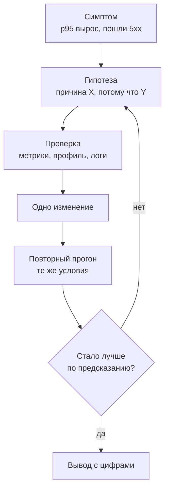
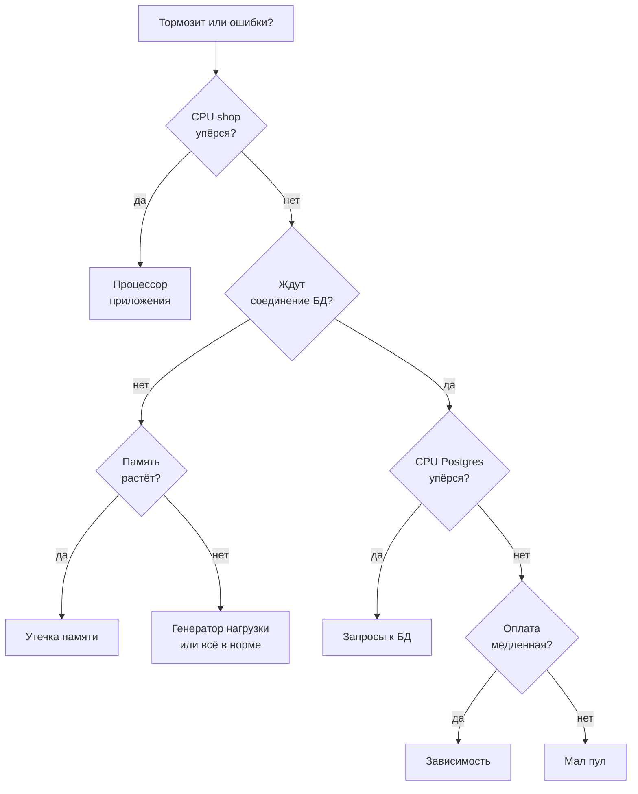

## Зачем это нужно

Ты прогнал тест на «Магазине» перед распродажей. При тройной нагрузке всё встаёт: на 30 визитах покупателей в секунду p95 вырос с 0,24 до 1,9 секунды. Руководитель спрашивает: «Почему? Что чинить?»

Я твой опытный коллега за соседним столом и этот вопрос слышал много раз. Новички берут первое подозрение («наверное, база») и сразу правят. Я сам так начинал: удвоил число воркеров (копий программы, которые обрабатывают запросы параллельно), потому что «сервис не тянет». Цифры не изменились: тормозила база, а воркеры просто громче в неё стучались. День потерян, и я не понял даже, чинил не то или починил, но заодно сломал другое.

**Узкое место** (bottleneck) - участок системы с самым низким пределом: он кончается первым и ограничивает всё остальное. Искать его надо методом: от **симптома** (что видит покупатель: медленно, ошибки) через **гипотезу** (предположение о причине, которое можно проверить) к **одному изменению** и повторному прогону. Метод ты изучишь здесь, а следующие четыре урока применят его к четырём настоящим проблемам «Магазина».

Шаг проекта: в папке `~/perf-lab/11-bottlenecks/` ты заводишь три скрипта (нагрузка на k6, смена настроек стенда с журналом, запуск теста с сохранением). Потом снимаешь базовую линию (замер до любых изменений) при четырёх нагрузках, читаешь показания ресурсов и записываешь первую гипотезу в `01-method.md`. Чинить ничего не нужно: называй причину только тогда, когда за ней стоят цифры.

## Что нужно знать

- Дашборд и методы RED и USE на уровне «видел и открывал»: [урок 7.3](../07-observability/03-grafana.md). Здесь мы будем их применять.
- Запросы PromQL и скрипт `~/perf-lab/scripts/promq.sh`: [урок 7.2](../07-observability/02-promql.md).
- Перцентили, хоккейная клюшка, насыщение: [урок 8.1](../08-perf-theory/01-latency-throughput.md); очереди и закон Литтла: [урок 8.2](../08-perf-theory/02-queues-littles-law.md); типы тестов и открытая модель: [урок 8.3](../08-perf-theory/03-test-types.md).
- Сценарий `constant-arrival-rate` в k6 и чтение отчёта: [урок 10.1](../10-k6/01-js-first-script.md) и [урок 10.2](../10-k6/02-scenarios-thresholds.md). Наш `bn.js` это обобщённый `shop.js`.
- Лимиты контейнера и `docker stats`: [урок 5.4](../05-docker/04-limits-stats.md). У «Магазина» в `compose.yaml` стоят `cpus: "1.0"` и `mem_limit: 512m`, у PostgreSQL `cpus: "1.0"` и `mem_limit: 1g`.
- Устройство бэкенда с пулом соединений и кэшем: [урок 2.3](../02-web/03-backend-anatomy.md).

## Картина целиком

Врач на приёме. Пациент говорит: «Мне плохо». Хороший врач не лечит сразу: спрашивает, где болит (симптом), предполагает диагноз (гипотеза), назначает один анализ (проверка) и только потом лечит. Назначь он пять лекарств сразу, и никто не узнает, какое помогло. У расследования узкого места тот же цикл:



Цикл замкнут: если числа не сдвинулись так, как обещала гипотеза, она неверна, и ты возвращаешься к ней, а не добавляешь второе изменение сверху.

Для проверки есть два набора вопросов. **USE** отвечает «какой ресурс кончился»: процессор, память, пул соединений, база. **RED** отвечает «что видит клиент»: сколько запросов, ошибок и как долго. Оба ты видел на дашборде в [уроке 7.3](../07-observability/03-grafana.md).

## Теория

### Узкое место: самое узкое звено определяет всё

Ты удвоил число воркеров, а сервис не ускорился ни на процент. Как так? Усилил не то, что тормозило.

Возьми трубу из трёх секций: широкая, узкая, снова широкая. Сколько воды вытекает, решает узкая. Аналогия ломается в одном: в сервисе «секции» зависят друг от друга, и медленная база заставляет приложение держать запросы дольше.

Каждый запрос по очереди проходит несколько ресурсов: процессор приложения, соединение с базой из пула, процессор базы, иногда внешний сервис. У каждого есть **предел** (capacity): сколько запросов в секунду он способен обслужить. Предел всей системы равен самому низкому. Когда нагрузка подходит к нему, у этого ресурса появляется очередь, и задержка взлетает: это «хоккейная клюшка» из [урока 8.1](../08-perf-theory/01-latency-throughput.md). Остальные ресурсы при этом простаивают.

Посчитаем для «визита покупателя» (каталог, карточка, корзина, заказ, список заказов). Один визит это одна «итерация» теста. Для каждого ресурса считаем одно: сколько итераций в секунду он выдержит.

Первый ресурс, процессор базы. Итерация съедает у него 32 мс, из них 22 мс на полный перебор таблицы заказов. Ядро одно, в секунде 1000 мс: 1000 / 32 ≈ 31 итерация в секунду.

Второй, пул соединений. Соединение занято дольше, чем работает процессор базы: пока запрос едет по сети и ждёт ответа, соединение тоже держат. В сумме выходит около 115 мс на итерацию. Соединений пять, значит 5 × 1000 / 115 ≈ 43.

Третий, процессор приложения: около 15 мс на одном ядре, 1000 / 15 ≈ 67.

| Ресурс | Что на него приходится | Предел, итераций/с |
|---|---|---|
| CPU PostgreSQL (1 ядро) | 32 мс на итерацию | 1000 / 32 ≈ 31 |
| Пул соединений (5 штук) | около 115 мс на итерацию | 5 × 1000 / 115 ≈ 43 |
| CPU приложения (1 ядро) | около 15 мс на итерацию | 1000 / 15 ≈ 67 |

Минимум у процессора PostgreSQL: это узкое место. Расширь пул до 50, и предел останется 31. Исправь запрос, и предел вырастет только до 43: следующим кончится пул. Узкое место переезжает после каждого исправления, поэтому поиск повторяют, пока предел не устроит.

<div class="viz" data-viz="bn-limits" data-load="30"></div>

Включи «Индекс на orders.user_id» (индекс как оглавление: база находит заказы покупателя сразу, без перебора всей таблицы, [урок 2.4](../02-web/04-sql-basics.md)), потом «Исправить N+1» (лишние запросы к базе на каждый заказ, их разберёт урок 11.3), подвинь пул и смотри, как слабым звеном становятся то пул, то процессор приложения. Числа виджета это расчёт, а не замер.

> **Прикинь сам:** пределы 31, 43 и 67, нагрузка 35 итераций в секунду. Какой ресурс упрётся? Что даст расширение пула до 20?
{: .predict}

35 больше предела базы (31), поэтому у базы растёт очередь. Пул и приложение загружены на 81% (35 / 43) и 52% (35 / 67) и выглядят спокойно. Пул не был узким, и его расширение ничего не даст: поможет только удешевить запросы к базе.

Осторожно: узкое место отвечает на вопрос «где», а не «почему». И это не ресурс с самой высокой загрузкой: сто процентов без очереди бывает в полном порядке.

> **Главное:** предел системы равен пределу самого слабого звена, а узкое место то, где копится очередь.
{: .key}

«База» ещё не причина. Чем причина отличается от симптома?

### Симптом и причина: два разных уровня

В отчёте написано «причина: высокий p95». Это хождение по кругу: высокий p95 мы и пытаемся объяснить.

У врача так же: температура 39 это симптом, ангина причина, и пока она не вылечена, температура вернётся. Хорошая причина называет механизм: «каждый запрос списка заказов читает всю таблицу из 200 000 строк, потому что нет индекса по `user_id`».

От симптома до причины три-четыре шага «почему»:

1. Симптом: `GET /api/orders` отвечает за 3 секунды при 30 визитах в секунду.
2. Почему? Время уходит на базу, а не на приложение.
3. Почему база медленная? Процессор PostgreSQL занят на 100%.
4. Почему занят? Каждый вызов читает всю таблицу заказов.
5. Почему всю? Нет индекса по `user_id`.

Это приём «пять почему». Останавливайся там, где можно действовать: пятый шаг даёт `CREATE INDEX`. Каждый шаг подтверждай показанием: второй логами, третий графиком процессора, четвёртый планом выполнения запроса.

> **Прикинь сам:** вход отвечает 4 секунды при 5 входах в секунду, процессор контейнера на 100%. Это уже причина?
{: .predict}

Нет, это механизм. Причина: проверка пароля (bcrypt) стоит около 250 мс процессорного времени, а ядро одно. Пять входов в секунду просят 1,25 секунды работы в каждой секунде. Исправить можно по-разному: удешевить проверку, добавить процессор или не входить заново на каждой итерации. Выбирает человек, а не метрика; подробности в уроке 11.2.

Осторожно: «растут вместе» (корреляция) ещё не значит «одно вызывает другое». Если p95 вырос вместе с памятью, оба могли расти из-за нагрузки. Причину доказывает изменение: поменял её, повторил прогон, симптом исчез или остался.

> **Главное:** симптом виден снаружи, причина это механизм, и доказывает её только изменение с повторным прогоном.
{: .key}

Как проверить все ресурсы и ничего не пропустить?

### USE: три вопроса к каждому ресурсу

Без списка смотрят на привычное (процессор) и пропускают пул соединений или внешний вызов. Метод USE даёт список: три вопроса к каждому ресурсу.

Лучше всего видно на кассе магазина. Какую долю времени касса занята? Стоит ли у неё очередь? Сколько раз она зависала? Касса на 100% без очереди в порядке, а очередь при загрузке 70% бывает, когда покупатели приходят пачками. Нужны все три вопроса.

Теперь названия. **Использование** (utilization): доля времени, когда ресурс занят; для пула из пяти соединений это доля занятых. **Насыщение** (saturation): сколько работы ждёт, потому что ресурс занят. Устойчивое насыщение выше нуля значит, что ресурс уже узкий. **Ошибки** (errors): отказ в соединении, таймаут, процесс, убитый по памяти.

Смотреть надо все ресурсы «Магазина»: процессор и память shop, пул БД, процессор PostgreSQL, оплату и генератор нагрузки.

<details markdown="1">
<summary>Для любопытных: запросы USE для каждого ресурса «Магазина»</summary>

Запросы PromQL можно прогонять через `promq.sh`, имена меток взяты с дашборда урока 7.3.

| Ресурс | Использование | Насыщение | Ошибки |
|---|---|---|---|
| CPU shop | доля от лимита ядра: `rate(container_cpu_usage_seconds_total{...service="shop"}[30s])` | доля «задушенных» периодов (throttling): `cfs_throttled_periods / cfs_periods` | перезапуски, код 137 |
| Память shop | `container_memory_working_set_bytes` к лимиту 512 МБ | рост без остановки | убит по памяти (OOM) |
| Пул БД | `(shop_db_pool_size - shop_db_pool_available) / DB_POOL_MAX` (занятые соединения от максимума пула) | `shop_db_pool_waiting`, `shop_db_connection_wait_seconds` | ответ 503 «database pool timeout» |
| CPU PostgreSQL | `rate(container_cpu_usage_seconds_total{...service="postgres"}[30s])` | длинные запросы, соединения в `active` | ошибки в логе, `max_connections` |
| Оплата (зависимость) | `rate(shop_payment_requests_total[30s])` | время `shop_payment_duration_seconds` | `result="error"` и `"timeout"` |
| Генератор нагрузки | CPU машины, где крутится k6 | пропущенные итерации `dropped_iterations` | ошибки соединения у клиента |

Почему в строке пула делим на `DB_POOL_MAX`, а не на `shop_db_pool_size`: пул стартует с `DB_POOL_MIN=1` соединения и растёт по мере нагрузки до `DB_POOL_MAX`, поэтому размер сам меняется. Пока размер 1 и оно занято, формула `1 - available / size` покажет 100% при том, что до максимума (5 по умолчанию) ещё далеко. Делить надо на константу из `.env`. Самый надёжный признак насыщения не доля, а очередь: `shop_db_pool_waiting` выше нуля.

</details>

На 30 визитах в секунду показания такие (числа типичные для ноутбука с четырьмя ядрами). Идём по таблице сверху вниз, как по чек-листу:

- процессор shop: 0,45 ядра из 1, «задушенных» периодов (throttling, о нём абзацем ниже) 3%, спокойно;
- память shop: 130 МБ из 512 и не растёт, спокойно;
- оплата: p95 попытки 0,06 с, ошибок нет, спокойно;
- пул БД: занято в среднем 4 из 5, ждут 2-3 запроса, p95 ожидания (`shop_db_connection_wait_seconds`) около 0,35 с, уже тесно;
- процессор PostgreSQL: 0,99 ядра из 1, «задушено» 41% периодов, вот он, предел.

> **Прикинь сам:** насыщены пул и база. Какой из них причина, а какой следствие?
{: .predict}

Пул насыщен из-за базы: запросы ждут её процессор, соединения заняты дольше. Причина стоит ближе к концу цепочки запроса и сама никого не ждёт, поэтому первый подозреваемый процессор PostgreSQL.

Осторожно: одного использования мало. Контейнеру выдано одно ядро, и работает «душение» (CFS throttling, [урок 7.4](../07-observability/04-exporters.md)): процессу разрешают работать порциями по 100 мс, и когда квота порции потрачена, он ждёт следующей. Среднее за минуту 60%, а запросы стоят. И не забывай про генератор: если k6 упёрся в процессор ноутбука, сервер простаивает, а график показывает «медленно».

> **Главное:** по каждому ресурсу спрашивай про занятость, очередь и сбои, а причиной считай насыщенный ресурс в конце цепочки.
{: .key}

USE смотрит изнутри, а плохо или нет, решает клиент. Что видит он?

### RED: три вопроса к сервису

Кухня ресторана может быть вся «красная»: повара заняты, а гости довольны, потому что запас по времени есть. Или наоборот: кухня отдыхает, а гости ждут блюдо час. Состояние кухни это USE, то, что видит гость, это RED.

Метод описывает сервис глазами клиента тремя величинами на каждый маршрут, по первым буквам английских слов. Rate (частота): сколько запросов в секунду. Errors (ошибки): доля ответов 5xx, а 4xx это ошибки клиента, их считают отдельно. Duration (длительность): время ответа, обычно p95.

```text
# Rate
sum by (route) (rate(http_requests_total[30s]))
# Errors
sum(rate(http_requests_total{status=~"5.."}[30s])) / sum(rate(http_requests_total[30s]))
# Duration
histogram_quantile(0.95, sum by (le, route) (rate(http_request_duration_seconds_bucket[30s])))
```

RED находит симптом и маршрут, USE находит ресурс. Сначала выясняешь, какой маршрут медленный и с какого момента, потом ищешь ресурс, которым он занят. Вот p95 по маршрутам на 30 визитах в секунду (на каждый маршрут около 28 запросов в секунду):

| Маршрут | p50 | p95 | 5xx |
|---|---|---|---|
| `/api/products` (каталог) | 0,12 с | 0,42 с | 0,2% |
| `/api/products/{id}` | 0,09 с | 0,30 с | 0,1% |
| `POST /api/cart/items` | 0,08 с | 0,33 с | 0,1% |
| `POST /api/orders` | 0,25 с | 0,95 с | 0,4% |
| `GET /api/orders` | 1,10 с | 3,10 с | 1,4% |

Тормозит всё, но не поровну: список заказов в семь раз медленнее каталога (3,10 / 0,42). Значит, причина на пути этого маршрута (он читает таблицу заказов и делает запрос на каждый заказ) и связана с базой, раз остальные тоже ухудшились. RED сузил поиск до «`GET /api/orders` и база».

> **Прикинь сам:** в отчёте «ошибок 1%». Может ли какой-то маршрут давать 100% ошибок?
{: .predict}

Может. Если оформлений заказа 1 из 100 запросов и все они падают, общая доля 1%, а у заказов 100%. Поэтому всегда делай разрез `by (route)`: среднее по сервису прячет медленный маршрут, как среднее прячет хвост ([урок 8.1](../08-perf-theory/01-latency-throughput.md)).

> **Главное:** RED показывает, на каком маршруте и с какого момента клиенту плохо, и считать его надо по маршрутам, а не по сервису целиком.
{: .key}

В каком порядке задавать вопросы USE и RED, чтобы тратить минуты, а не часы?

### Дерево диагностики

Нужен алгоритм «если… то…»: каждый ответ сужает круг подозреваемых, и расследование не зависит от настроения. Дешёвые проверки и самые частые причины идут первыми.



Листья разбирают следующие уроки: процессор приложения (11.2), база и пул (11.3), утечка памяти (11.4), зависимость (11.5). Возьмём «Заказы тормозят»: процессор shop 38%, ждут 3 запроса, процессор PostgreSQL 100%. Процессор shop упёрся? Нет. Ждут соединение? Да. Процессор PostgreSQL упёрся? Да. Лист: запросы к базе.

Пройди по дереву сам. В виджете шесть случаев с показаниями дашборда: первый он проигрывает сам, любой другой выбираешь ты и отвечаешь кликами.

<div class="viz" data-viz="bn-diagnose" data-case="2"></div>

Красная рамка на плитке значит «упёрлось». Случаи 2 и 3 похожи (запросы ждут пул), а различаются одним показанием: упёрся ли процессор базы.

Осторожно: лист не диагноз. «Запросы к БД» это направление: внутри может быть медленный запрос, нехватка индекса, мало соединений или блокировка, и у каждого свой инструмент.

> **Главное:** дерево превращает «что-то тормозит» в три-четыре дешёвых вопроса, а лист подтверждай вторым показанием: профилировщиком (он показывает, на что уходит время кода), `EXPLAIN` или логом.
{: .key}

Лист это подозрение. Как проверить его числами?

### Гипотеза: проверяемое утверждение

Скажи «система тормозит из-за общей нагрузки», и ты не ошибёшься никогда, но и пользы никакой: проверить нечем. Хорошая гипотеза рискует: называет число и может проиграть. Я записываю её по формуле:

> **Если** причина в X, **то** изменение Y приведёт к Z (с числом), **а в остальном** Z не изменится. **Доказательство:** метрика M показывает N.

| Слабая гипотеза | Сильная гипотеза |
|---|---|
| «База медленная» | «Если причина в полном переборе таблицы заказов, то после индекса по `user_id` время запроса упадёт с 20 мс примерно до 1 мс, а p95 `GET /api/orders` при 30 визитах в секунду упадёт ниже 0,3 с. Если p95 останется выше 1 с, гипотеза неверна.» |
| «Нужно больше воркеров» | «Если причина в нехватке воркеров, то при `WEB_CONCURRENCY=2` пропускная способность входа вырастет с 3,9 до 7 в секунду. Если останется 3,9, дело в лимите процессора.» |
| «Утечка памяти» | «Если приложение течёт по 10 КБ на запрос, то при 40 запросах в секунду память растёт на 24 МБ в минуту (10 КБ × 40 × 60) и из 130 МБ за 16 минут доходит до лимита 512 МБ.» |

Опровержение тоже результат: подозреваемый вычеркнут.

> **Прикинь сам:** гипотеза обещала p95 ниже 0,3 с, после правки он 0,5 с. «Почти то же самое»?
{: .predict}

Нет. Порог записан до опыта, и 0,5 больше 0,3. Решай «на глаз» после опыта, и любой результат подойдёт к любой гипотезе.

> **Главное:** хорошая гипотеза называет изменение, число и условие провала, а решает порог, записанный до опыта.
{: .key}

Как проверить гипотезу, чтобы результату можно было верить?

### Одно изменение за раз и честное сравнение

Поменяешь три параметра сразу, p95 упадёт, и ты не знаешь, какой помог. Допустим, ты разом поставил индекс (p95 с 1,9 до 0,3), расширил пул (ничего не изменилось) и поменял число воркеров (выросла память). «Упал в 6 раз» скрывает, кто дал эффект, и вредную настройку ты закрепил.

Поэтому эксперимент ставят по правилам.

1. Базовая линия до изменения: два-три прогона на текущей конфигурации.
2. Одно изменение (одна переменная в `.env` или один индекс), записанное в журнал с временем.
3. Прежние условия: сценарий, нагрузка, длительность, данные в базе, машина.
4. Прогрев: первые 20 секунд выбрасывают, пока кэши и пулы выходят на рабочий режим.
5. Повтор для оценки шума: две одинаковые конфигурации дают разные числа. Улучшение меньше разброса за результат не считается.
6. Решение по числам из гипотезы, а не по ощущению.

В цифрах: три базовых прогона дали p95 1,86 с, 1,93 с и 1,89 с. Среднее 1,89 с, разброс около 0,04 с (±2%). Ты меняешь настройку и получаешь 1,80 с. Улучшение 0,09 с, то есть 5%: чуть больше разброса, для вывода мало, повтори. Выйдет 1,78 и 1,81: устойчиво, но скромно, и если гипотеза обещала падение вдвое, она опровергнута. А 0,24 с после индекса это улучшение в 8 раз, намного больше разброса, вывод однозначен.

> **Проверь понимание:** базовые p95: 2,1; 2,4; 2,2 с. После изменения 2,0 с. Можно ли утверждать, что изменение помогло?
>
> <details markdown="1">
> <summary>Ответ</summary>
>
> Нет. Разброс базовых прогонов 0,3 с (от 2,1 до 2,4), а улучшение 0,2 с меньше разброса. Повтори прогон два-три раза или ищи изменение, которое даёт эффект в разы.
>
> </details>

**Чистый старт.** Есть ещё условие, которое забывают: «одно исходное состояние». Каждый прогон оставляет следы. В таблицах `orders` и `order_items` появляются новые заказы, у товаров уменьшается остаток, в Redis лежат чужие корзины и токены входа, а статистика `pg_stat_statements` копит запросы всех прошлых прогонов. Если ты поменяешь `BCRYPT_ROUNDS`, пароли пользователей в базе всё равно остались старыми. Второй прогон сравнивается с первым при другой базе, и разницу вызвала уже не твоя правка. Поэтому перед каждым прогоном, который попадёт в сравнение, возвращай стенд в исходное состояние:

```bash
cd ~/load-tester/project/shop
docker compose --profile monitoring down -v
docker compose --profile monitoring up -d --build --wait
curl -s localhost:8000/readyz
```

Разбор: `down` останавливает и удаляет контейнеры, а ключ `-v` (volumes, «тома») удаляет ещё и тома, где лежат данные PostgreSQL, Prometheus и Grafana. Поэтому при новом `up` PostgreSQL создаёт базу заново скриптом `db/init/02-seed.sql`: 1000 пользователей, 10 000 товаров и 200 000 исторических заказов, а Redis стартует пустым. Цена: это не мгновенно (создание 200 000 заказов с позициями занимает время, и у каждой машины своё: замерь свой стенд командой `time docker compose --profile monitoring up -d --build --wait` и запиши число в журнал) и пропадают накопленные графики, поэтому результаты прогона сохраняй в файлы **до** сброса. Без `-v` данные остаются, и стенд не чистый.

Короткий вариант между быстрыми прогонами, когда полный сброс слишком долог: очистить только то, что копится сильнее всего. Команда `FLUSHALL` в `redis-cli` убирает корзины и токены (пользователям придётся войти заново), а `SELECT pg_stat_statements_reset();` в `psql` обнуляет статистику запросов. Новые заказы при этом остаются, поэтому для итоговых сравнений бери полный `down -v`.

Правило записи: один прогон, одно изменение, одно исходное состояние. После старта выжди прогрев (в этом курсе 20 секунд: первые запросы идут в «холодные» кэши и пул) и не считай эти секунды в результате. В отчёте напиши, как сбрасывал стенд: это строка «состояние стенда» в шаблоне из [урока 12.1](../12-process/01-report.md).

Осторожно: «одно изменение» не «одна строка»: индекс и исправление N+1 два изменения, даже если оба про заказы. И лучший из прогонов не результат: бери медиану трёх или показывай все.

> **Главное:** меняй одно, сравнивай при прежних условиях и верь только улучшению, которое больше разброса.
{: .key}

Вернёмся к распродаже. Теперь на вопрос «Что чинить?» у тебя есть не догадка, а цепочка: симптом по RED, ресурс по USE, гипотеза с числом и один проверенный шаг. Дальше идём по ней в конкретные узкие места, начиная с процессора.

## Практика

Все команды выполняй на машине, где стоит «Магазин» (урок 2.1), с запущенным мониторингом (урок 7.1). Нагрузка идёт только на твой стенд.

### 1. Заведи папку темы и приготовь стенд

```bash
mkdir -p ~/perf-lab/11-bottlenecks ~/perf-lab/results
cd ~/load-tester/project/shop
git status --short .env.example && cp -n .env.example .env
docker compose --profile monitoring up -d --wait
curl -s localhost:8000/readyz
```

Что делает каждая строка: `mkdir -p` создаёт папку темы и общую папку результатов (без ошибки, если они уже есть); `cp -n` копирует `.env.example` в `.env`, только если `.env` ещё нет (`-n` значит «не перезаписывать»); `up -d --wait` поднимает стенд с мониторингом и ждёт, пока все сервисы станут здоровыми; `readyz` проверяет, что «Магазин» готов.

```text
{"status":"ready"}
```

Сейчас все настройки в `.env` должны быть значениями по умолчанию. Твои числа должны совпасть с числами урока. Проверь командой:

```bash
grep -E '^(WEB_CONCURRENCY|DB_POOL_MAX|BCRYPT_ROUNDS|CACHE_ENABLED|BUG_N_PLUS_ONE|LEAK_ENABLED|PAYMENT_TIMEOUT|PAYMENT_RETRIES)=' .env
```

```text
WEB_CONCURRENCY=1
DB_POOL_MAX=5
BCRYPT_ROUNDS=12
CACHE_ENABLED=0
BUG_N_PLUS_ONE=1
LEAK_ENABLED=0
PAYMENT_TIMEOUT=10
PAYMENT_RETRIES=3
```

**Типичные ошибки:** `grep` показал другие значения: в `.env` остались настройки из прошлых экспериментов; верни по `.env.example`. Таблица `orders` без индекса по `user_id`: проверь `docker compose exec -T postgres psql -U shop -d shop -c "SELECT indexname FROM pg_indexes WHERE tablename='orders'"`. Если там есть `orders_user_id_idx` (остался от урока 2.4), удали: `DROP INDEX orders_user_id_idx;`.

### 2. Скрипт k6 `bn.js`

Это твой единственный генератор нагрузки для всей темы. Он умеет несколько сценариев, которые выбирает переменная `SCENARIO`: `mix` (визит покупателя), `login`, `product`, `orders`, `checkout`. Сохрани файл `~/perf-lab/11-bottlenecks/bn.js`:

```javascript
import http from 'k6/http';
import { check, sleep } from 'k6';
import exec from 'k6/execution';

const BASE = (__ENV.BASE_URL || 'http://localhost:8000').replace(/\/$/, '');
const SCENARIO = __ENV.SCENARIO || 'mix';
const MAX_VUS = 400;
// Каждому одновременно работающему VU нужен свой аккаунт (у аккаунта одна корзина), поэтому берём не меньше MAX_VUS.
const USERS = Number(__ENV.USERS || MAX_VUS);
const LOGIN_USERS = 50; // сценарий login входит этими 50 аккаунтами: их хеши прогревает урок 11.2
const JSON_HEADERS = { 'Content-Type': 'application/json' };

export const options = {
  scenarios: {
    bn: {
      executor: 'constant-arrival-rate',
      rate: Number(__ENV.RATE || 10),
      timeUnit: '1s',
      duration: __ENV.DURATION || '60s',
      preAllocatedVUs: 50,
      maxVUs: MAX_VUS,
    },
  },
  setupTimeout: '600s', // вход через bcrypt медленный, 400 входов подряд не уложатся в стандартные 60 с
  summaryTrendStats: ['avg', 'med', 'p(90)', 'p(95)', 'p(99)', 'max'],
  thresholds: {
    http_req_failed: ['rate<0.01'],
    // Хоть одна пропущенная итерация значит, что k6 не смог дать заказанный темп и нагрузка ниже заявленной.
    dropped_iterations: ['count==0'],
    // Условия p(50)>=0 и p(95)>=0 всегда верны: пороги нужны, чтобы k6 напечатал p50 и p95 по каждому маршруту.
    'http_req_duration{name:/api/login}': ['p(50)>=0', 'p(95)>=0'],
    'http_req_duration{name:/api/products}': ['p(50)>=0', 'p(95)>=0'],
    'http_req_duration{name:/api/products/[id]}': ['p(50)>=0', 'p(95)>=0'],
    'http_req_duration{name:/api/cart/items}': ['p(50)>=0', 'p(95)>=0'],
    'http_req_duration{name:POST /api/orders}': ['p(50)>=0', 'p(95)>=0'],
    'http_req_duration{name:GET /api/orders}': ['p(50)>=0', 'p(95)>=0'],
  },
};

function userEmail(n) {
  return `user${String(n).padStart(4, '0')}@shop.lab`;
}

// Токены берём один раз до начала теста: вход дорогой (bcrypt), его не надо мерить в каждом сценарии.
// Если хоть один вход не удался, останавливаемся: иначе у части VU не будет своего аккаунта.
export function setup() {
  if (SCENARIO === 'login' || SCENARIO === 'product') return { tokens: [] };
  const tokens = [];
  for (let n = 1; n <= USERS; n++) {
    const res = http.post(`${BASE}/api/login`,
      JSON.stringify({ email: userEmail(n), password: 'password' }), { headers: JSON_HEADERS, timeout: '60s' });
    if (res.status !== 200) throw new Error(`вход user${n} не удался (код ${res.status}): стенд поднят, пользователи созданы?`);
    tokens.push(res.json('token'));
  }
  if (tokens.length < MAX_VUS) throw new Error(`аккаунтов ${tokens.length}, а VU до ${MAX_VUS}: два VU делили бы одну корзину; задай USERS не меньше ${MAX_VUS}`);
  return { tokens };
}

function login() {
  const n = 1 + Math.floor(Math.random() * LOGIN_USERS);
  const res = http.post(`${BASE}/api/login`,
    JSON.stringify({ email: userEmail(n), password: 'password' }),
    { headers: JSON_HEADERS, tags: { name: '/api/login' } });
  check(res, { 'вход: 200': (r) => r.status === 200 });
}

// 80% обращений к 200 «горячим» товарам, 20% к любому из 10 000: так ведут себя покупатели.
function productID() {
  return Math.random() < 0.8 ? 1 + Math.floor(Math.random() * 200) : 1 + Math.floor(Math.random() * 10000);
}

function product() {
  const res = http.get(`${BASE}/api/products/${productID()}`, { tags: { name: '/api/products/[id]' } });
  check(res, { 'карточка: 200': (r) => r.status === 200 });
}

function orders(headers) {
  const res = http.get(`${BASE}/api/orders`, { headers, tags: { name: 'GET /api/orders' } });
  check(res, { 'мои заказы: 200': (r) => r.status === 200 });
}

function checkout(headers) {
  const add = http.post(`${BASE}/api/cart/items`, JSON.stringify({ product_id: productID(), qty: 1 }),
    { headers, tags: { name: '/api/cart/items' } });
  check(add, { 'корзина: 201': (r) => r.status === 201 });
  const res = http.post(`${BASE}/api/orders`, null, { headers, tags: { name: 'POST /api/orders' } });
  check(res, { 'заказ: 201': (r) => r.status === 201 });
}

export default function (data) {
  if (SCENARIO === 'login') return login();
  if (SCENARIO === 'product') return product();
  // idInTest у каждого VU свой и начинается с 1: VU №k всегда работает под аккаунтом №k, корзины не пересекаются.
  const idx = exec.vu.idInTest - 1;
  if (idx >= data.tokens.length) exec.test.abort(`для VU ${exec.vu.idInTest} нет аккаунта`);
  const token = data.tokens[idx];
  const headers = { Authorization: `Bearer ${token}`, 'Content-Type': 'application/json' };
  if (SCENARIO === 'orders') return orders(headers);
  if (SCENARIO === 'checkout') return checkout(headers);
  // mix: как один визит покупателя
  check(http.get(`${BASE}/api/products`, { tags: { name: '/api/products' } }), { 'каталог: 200': (r) => r.status === 200 });
  product();
  checkout(headers);
  orders(headers);
  sleep(0.2);
}
```

Что здесь нового по сравнению с `shop.js` из урока 10.1:

- **`SCENARIO`** выбирает, что делает итерация. `login` только логинится, `product` читает карточку, `orders` только список заказов, `checkout` корзина и заказ, `mix` весь визит.
- **`setup()`** выполняется один раз до теста и входит 400 пользователями (это занимает минуты: вход дорогой). Токены хранятся в `data.tokens`, и VU с номером `exec.vu.idInTest` берёт токен с тем же номером. Так вход не попадает в замеры других сценариев, а два одновременно работающих VU никогда не делят корзину. Если вход хоть одного пользователя не удался или аккаунтов меньше, чем VU, тест останавливается (`throw` в `setup()` или `exec.test.abort`) вместо тихо неверных цифр.
- **`dropped_iterations: ['count==0']`** делает пропуск итераций нарушением порога (код выхода 99): в блоке `THRESHOLDS` увидишь красный крестик, если k6 не дал заказанный темп.
- **`tags: { name: ... }`** дают каждому маршруту своё имя (иначе k6 считал бы `/api/products/1` и `/api/products/2` разными метками, как объясняли в уроке 10.1).
- **Пороги на `p(50)>=0` и `p(95)>=0`** это приём: условие всегда выполняется, но заставляет k6 напечатать p50 и p95 для каждого маршрута отдельно в блоке `THRESHOLDS`.
- **`productID()`** берёт 80% обращений из 200 горячих товаров, как ведут себя настоящие покупатели. Это пригодится в уроке 11.5, когда будем включать кэш.
- **`constant-arrival-rate`** задаёт число **визитов в секунду** независимо от того, успевает ли сервер (открытая модель, [урок 8.2](../08-perf-theory/02-queues-littles-law.md)): так при перегрузке растёт задержка, а не падает нагрузка.

Проверь синтаксис без запуска: `k6 inspect ~/perf-lab/11-bottlenecks/bn.js`; пустой вывод ошибок и JSON настроек значат, что файл в порядке.

Если k6 у тебя в Docker (как в README стенда), запускай `docker run --rm -i --network host -v ~/perf-lab/11-bottlenecks:/s grafana/k6:2.3.0 run -e SCENARIO=mix -e RATE=10 /s/bn.js`; `--network host` позволяет контейнеру достучаться до `localhost:8000` стенда.

### 3. Скрипты `set-env.sh` и `run.sh`

Первый меняет настройки стенда **и записывает это в журнал**. Это то самое правило «одно изменение за раз с отметкой времени», только в виде кода:

```bash
cat > ~/perf-lab/11-bottlenecks/set-env.sh <<'EOF'
#!/usr/bin/env bash
# set-env.sh KEY=VALUE ...: меняет переменные в .env стенда, пересоздаёт shop, пишет строку в журнал опытов
set -euo pipefail
SHOP_DIR=${SHOP_DIR:-$HOME/load-tester/project/shop}
LOG=$HOME/perf-lab/11-bottlenecks/experiments.log
cd "$SHOP_DIR"
for kv in "$@"; do
  key=${kv%%=*}; val=${kv#*=}
  if grep -q "^${key}=" .env; then sed -i "s|^${key}=.*|${key}=${val}|" .env; else echo "${key}=${val}" >> .env; fi
  printf '%s  %s=%s\n' "$(date '+%F %T')" "$key" "$val" >> "$LOG"
done
docker compose up -d --force-recreate --wait shop
EOF
chmod +x ~/perf-lab/11-bottlenecks/set-env.sh
```

Разбор: `key=${kv%%=*}` отрезает от `BCRYPT_ROUNDS=4` всё, начиная с первого `=`, получается ключ; `val=${kv#*=}` отрезает всё до первого `=`, получается значение. `sed -i "s|...|...|"` заменяет строку в файле на месте (разделитель `|` выбран, чтобы не мешали косые черты в значениях). Если ключа в `.env` не было, он дописывается. `printf` добавляет строку «время  ключ=значение» в журнал. Последняя команда пересоздаёт только `shop` (`--force-recreate` заставляет Docker подхватить новый `.env`, `--wait` ждёт готовности). Метрики `shop` при этом начинаются с нуля, и это нормально.

Второй запускает k6 и сохраняет результат:

```bash
cat > ~/perf-lab/11-bottlenecks/run.sh <<'EOF'
#!/usr/bin/env bash
# run.sh <метка> [KEY=VALUE ...]: прогон bn.js, весь вывод в ~/perf-lab/results/11-<метка>.txt, на экран главное
# Код выхода: 0 (всё в порядке) или 99 (пороги нарушены: ожидаемый результат при перегрузке) дают 0, всё остальное это авария.
set -uo pipefail
label=$1; shift
args=(); for kv in "$@"; do args+=(-e "$kv"); done
mkdir -p ~/perf-lab/results
out=~/perf-lab/results/11-"$label".txt
k6 run "${args[@]}" ~/perf-lab/11-bottlenecks/bn.js 2>&1 | tee "$out" \
  | grep -E 'name:|p\(50\)|p\(95\)|http_req_failed|dropped_iterations|^ +iterations'
code=${PIPESTATUS[0]}
if [ "$code" -eq 99 ]; then
  echo "run.sh: пороги нарушены (код 99), см. $out"; exit 0
elif [ "$code" -ne 0 ]; then
  echo "run.sh: АВАРИЯ k6, код $code. Последние строки вывода:" >&2; tail -n 15 "$out" >&2; exit "$code"
fi
EOF
chmod +x ~/perf-lab/11-bottlenecks/run.sh
```

Разбор: `shift` убирает первый аргумент (метку), остальные пары `KEY=VALUE` превращаются в флаги `-e KEY=VALUE` для k6. `tee` сохраняет **весь** вывод в файл, а `grep -E` печатает на экран только нужные строки. Код выхода k6 в конвейере из трёх команд теряется, поэтому его берёт `${PIPESTATUS[0]}` (статус первой команды конвейера). Код 99 значит «тест дошёл до конца, но порог нарушен»: при перегрузке это ожидаемый результат, скрипт завершается с 0. Любой другой ненулевой код (скрипт не открылся, `setup()` упал, k6 не найден) это авария: скрипт печатает последние строки вывода и возвращает тот же код. Фильтр `grep` иначе спрятал бы текст ошибки.

### 4. Базовая линия: четыре нагрузки

Открой второй терминал для наблюдения (шаг 5), а в первом запусти четыре прогона по 60 секунд. Между прогонами делай паузу в минуту, чтобы очереди рассосались.

```bash
cd ~/perf-lab/11-bottlenecks
for r in 10 20 30 40; do ./run.sh base-$r SCENARIO=mix RATE=$r DURATION=60s; sleep 60; done
```

Для одного прогона на 30 визитах в секунду на экране будет примерно такое:

```text
  █ THRESHOLDS

    http_req_duration{name:/api/products}
    ✓ 'p(50)>=0' p(50)=118ms
    ✓ 'p(95)>=0' p(95)=421ms

    http_req_duration{name:/api/products/[id]}
    ✓ 'p(50)>=0' p(50)=92ms
    ✓ 'p(95)>=0' p(95)=304ms

    http_req_duration{name:/api/cart/items}
    ✓ 'p(50)>=0' p(50)=81ms
    ✓ 'p(95)>=0' p(95)=331ms

    http_req_duration{name:POST /api/orders}
    ✓ 'p(50)>=0' p(50)=251ms
    ✓ 'p(95)>=0' p(95)=948ms

    http_req_duration{name:GET /api/orders}
    ✓ 'p(50)>=0' p(50)=1.1s
    ✓ 'p(95)>=0' p(95)=3.1s

    http_req_failed
    ✓ 'rate<0.01' rate=0.37%

    dropped_iterations
    ✗ 'count==0' count=128
  ...
     dropped_iterations.......: 128    2.1/s
     iterations...............: 1672   27.8/s
```

**Как читать вывод:** блок `THRESHOLDS` печатает по строке p50 и p95 каждого маршрута (это наш трюк с условиями «всегда верно»). Сначала смотри самый длинный: здесь `GET /api/orders` с p95 в 3,1 с. `http_req_failed` 0,37% значит, что около одного запроса из 270 закончился ошибкой (это те, что ждали соединение БД дольше пяти секунд). `iterations 27.8/s` показывает, что сервер выполнил 27,8 визита в секунду, хотя мы просили 30, и `dropped_iterations 128` это визиты, которые k6 не смог начать, потому что все виртуальные пользователи были заняты ожиданием. Поэтому порог `count==0` красный (✗) и k6 завершится с кодом 99, а `run.sh` напишет «пороги нарушены»: на пределе это ожидаемо, это не авария. Эта разница между просимой и фактической нагрузкой и есть признак предела.

Сведи четыре прогона в таблицу. У тебя числа будут другими (процессор ноутбука иной), но **форма** должна совпасть: почти плоско до 20 и обрыв после 30. Ориентир:

| Визитов в секунду (просили) | Выполнено/с | p50 | p95 | p99 | Ошибок |
|---|---|---|---|---|---|
| 10 | 10,0 | 0,06 с | 0,11 с | 0,15 с | 0% |
| 20 | 20,0 | 0,09 с | 0,24 с | 0,41 с | 0% |
| 30 | 27,8 | 0,55 с | 1,9 с | 3,4 с | 0,4% |
| 40 | 26,9 | 2,9 с | 6,2 с | 7,0 с | 7% |

<div class="viz" data-viz="chart" data-type="line" data-x="10,20,30,40" data-x-label="Нагрузка, визитов в секунду" data-y-label="p95, с" data-unit="с" data-explain="До 20 визитов в секунду p95 почти не растёт, на 30 он подскакивает до 1,9 с, на 40 упирается в таймаут ожидания соединения (5 с) и становится 6,2 с. Выполненная нагрузка перестаёт расти на отметке около 28 в секунду: это предел системы." data-series='[{"name":"p95, с","values":[0.11,0.24,1.9,6.2],"unit":"с"},{"name":"выполнено, визитов/с","values":[10,20,27.8,26.9],"unit":"/с"}]'></div>

Две линии разошлись. До 20 визитов нагрузка и выполнение совпадают, дальше выполнение останавливается на уровне около 28, а задержка растёт. Это классическая клюшка: предел находится между 20 и 30. Наша модель говорила, что предел базы около 31 визита в секунду, на практике он ниже из-за запаса (нагрузка 30 даёт очередь и на 96% загрузки).

**Типичные ошибки:** `ERRO[0000] ... connect: connection refused` значит, что стенд не запущен (`docker compose ps`); `setup() ... не удалось войти` значит, что `.env` неверный или shop не готов; сообщение `Insufficient VUs` или большой `dropped_iterations` на 10 и 20 визитах означает, что генератор не справляется (проверь шаг про генератор ниже); `bash: ./run.sh: Permission denied` значит, что не выполнено `chmod +x`.

### 5. Показания USE во время прогона

Запусти ещё один прогон на 30 визитах, но на 3 минуты, и пока он идёт, во втором терминале снимай показания по таблице USE. Прогон: `./run.sh use-30 SCENARIO=mix RATE=30 DURATION=3m`. Скрипт `promq.sh` ты завёл в уроке 7.2.

```bash
P=~/perf-lab/scripts/promq.sh
S='container_label_com_docker_compose_service'
$P "sum(rate(container_cpu_usage_seconds_total{$S=\"shop\"}[30s]))"
$P "sum(rate(container_cpu_usage_seconds_total{$S=\"postgres\"}[30s]))"
$P "sum(rate(container_cpu_cfs_throttled_periods_total{$S=\"postgres\"}[30s])) / sum(rate(container_cpu_cfs_periods_total{$S=\"postgres\"}[30s]))"
$P "shop_db_pool_waiting"
$P "histogram_quantile(0.95, sum by (le) (rate(shop_db_connection_wait_seconds_bucket[30s])))"
$P "container_memory_working_set_bytes{$S=\"shop\"} / 1024 / 1024"
$P 'histogram_quantile(0.95, sum by (le) (rate(shop_payment_duration_seconds_bucket[30s])))'
```

Разбор: `P=...` и `S=...` это переменные оболочки, чтобы не повторять длинные имена. `rate(...[30s])` для счётчика процессорного времени в секундах даёт «сколько ядер занято»: 0,45 значит, что контейнер использует 45% одного ядра. Отношение `throttled_periods / periods` это доля периодов по 100 мс, в которых контейнер упёрся в квоту и ждал. `shop_db_pool_waiting` это число запросов, которые прямо сейчас ждут свободное соединение. Остальные запросы знакомы по таблице USE выше.

```text
  0.44
  0.99
  0.41
  2
  0.37
  131.2
  0.058
```

**Как читать вывод:** построчно: shop использует 0,44 ядра (запас большой), postgres 0,99 ядра из одного (упёрт), `throttled` 0,41 (в 41% периодов Postgres ждал квоту: насыщение), в ожидании пула 2 запроса, p95 ожидания соединения 0,37 с (это время, которое запрос стоит и ничего не делает), память shop 131 МБ из 512, оплата отвечает за 58 мс. Первым смотри строки с насыщением: это postgres и пул.

Сам процесс k6 тоже ест процессор: `top -bn1 | head -12` (или `htop`) покажет, что `k6` занимает вряд ли больше 30% одного ядра. Если он занимает 100%, результатам верить нельзя, это последний вопрос дерева диагностики.

**Типичные ошибки:** пустой вывод значит, что метки cAdvisor другие (на Docker Desktop для Mac бывают другие названия): посмотри метки запросом `container_memory_working_set_bytes` без фильтра и подбери `name` или `container_label_com_docker_compose_service`; запрос с `histogram_quantile` вернул `NaN` значит, что за 30 секунд не было ни одного запроса: нагрузка не идёт.

### 6. Пройди дерево и запиши гипотезу

Теперь у тебя есть показания и маршрут с худшим p95. Пройди по дереву из этого урока:

1. Процессор shop упёрся? Нет, 0,44 ядра.
2. Запросы ждут соединение БД? Да, ожидающих 2.
3. Процессор PostgreSQL упёрся? Да, 0,99 ядра, throttling 41%.
4. Вывод: подозрение на запросы к базе, а точнее на `GET /api/orders` как самый медленный маршрут.

Запиши результат в файл `~/perf-lab/11-bottlenecks/01-method.md`. Шаблон:

```markdown
# 11.1. Базовая линия и гипотеза

## Условия
Стенд: настройки по умолчанию (.env.example), k6 mix, 60 с, прогрев не вырезал.
Машина: <из ~/perf-lab/machine.md>. Дата: <дата>.

## Базовая линия (p95, ошибки)
10/с: ...; 20/с: ...; 30/с: ...; 40/с: ...
Предел: выполнено не больше ~28 визитов/с.

## Показания USE на 30/с
- CPU shop: 0,44 ядра, throttling ...
- CPU PostgreSQL: 0,99 ядра, throttling 41%
- Пул: ждут 2, wait p95 0,37 с
- Память, оплата: в норме

## Самый медленный маршрут
GET /api/orders: p95 3,1 с (остальные 0,3-0,9 с)

## Гипотеза
Если причина в запросах к базе по списку заказов, то ...
(что изменить, что должно произойти с числом, при каком числе гипотеза неверна)
```

Гипотеза формулируется **в виде предсказания с числом**; исправлять ничего не нужно, этим займёмся в 11.3. Допустимый пример: «Если причина в полном переборе таблицы заказов, то индекс по `user_id` снизит p95 `GET /api/orders` при 30 визитах/с ниже 0,5 с; если p95 останется выше 1 с, гипотеза неверна».

Закоммить результат и журнал:

```bash
cd ~/perf-lab
git add 11-bottlenecks results/11-*.txt
git commit -m "11.1: базовая линия mix и гипотеза"
git push
```

> Три настройки сразу поменять очень хочется, а нейросеть охотно предложит сразу пять «оптимизаций». Не принимай набор целиком: сначала сам сформулируй гипотезу с числом, потом сравни с советом ИИ и проверяй каждое изменение отдельным прогоном.
{: .ai}

## Сломай и почини

**Поломка:** нарушь главное правило метода и посмотри, что получится. Поменяй сразу три настройки, не имея гипотезы: «давайте что-нибудь поправим».

```bash
~/perf-lab/11-bottlenecks/set-env.sh DB_POOL_MAX=15 WEB_CONCURRENCY=3 BUG_N_PLUS_ONE=0
cd ~/perf-lab/11-bottlenecks
./run.sh broken-3 SCENARIO=mix RATE=30 DURATION=60s
```

Типичный результат: p95 стал около 1,0 с (раньше 1,9 с) и появилась неприятность: память shop выросла примерно втрое (три воркера, у каждого свой пул и своя копия приложения), а процессор приложения стал упираться в лимит ядра (три воркера делят одно ядро). Ты видишь «стало лучше», но не знаешь: какая из трёх правок помогла, какая нет, какая навредила.

**Диагностика.** Верни стенд на базовую конфигурацию и проведи опыт по методу: по одной настройке, с прогоном после каждой.

```bash
~/perf-lab/11-bottlenecks/set-env.sh DB_POOL_MAX=5 WEB_CONCURRENCY=1 BUG_N_PLUS_ONE=1
cd ~/perf-lab/11-bottlenecks
~/perf-lab/11-bottlenecks/set-env.sh BUG_N_PLUS_ONE=0 && ./run.sh only-nplus1 SCENARIO=mix RATE=30 DURATION=60s
~/perf-lab/11-bottlenecks/set-env.sh BUG_N_PLUS_ONE=1 DB_POOL_MAX=15 && ./run.sh only-pool SCENARIO=mix RATE=30 DURATION=60s
~/perf-lab/11-bottlenecks/set-env.sh DB_POOL_MAX=5 WEB_CONCURRENCY=3 && ./run.sh only-workers SCENARIO=mix RATE=30 DURATION=60s
~/perf-lab/11-bottlenecks/set-env.sh WEB_CONCURRENCY=1
```

Ожидаемая картина (числа ориентировочные): `BUG_N_PLUS_ONE=0` один даёт p95 около 1,2 с (снимает около четверти работы базы); `DB_POOL_MAX=15` один даёт около 1,9 с, то есть **ничего** (база упирается в процессор, а не в пул); `WEB_CONCURRENCY=3` один даёт около 1,9 с и примерно втрое больше памяти. Главный вклад дала одна правка, N+1: 1,9 с вниз до 1,2 с. Пул и воркеры по отдельности ничего не дали, а вместе с N+1 снизили p95 ещё на 0,1-0,2 с (до 1,0 с): это уже тонкая настройка, и платишь за неё памятью и процессором. Три правки в одном прогоне выглядели как общий успех, а опыт по одной показал, где польза.

<div class="viz" data-viz="flow" data-steps='[{"title":"Запиши условия","text":"Конфигурация, сценарий, нагрузка, длительность, дата. Всё, что нужно, чтобы повторить прогон."},{"title":"Базовая линия","text":"Два-три прогона без изменений. Разброс между ними это шум."},{"title":"Симптом и маршрут","text":"RED: какой маршрут и с какой нагрузки хуже. Не весь сервис."},{"title":"Ресурс по USE","text":"Обойди ресурсы: использование, насыщение, ошибки. Начни с насыщения."},{"title":"Гипотеза с числом","text":"Если причина X, то изменение Y даст Z. Запиши порог, при котором гипотеза неверна."},{"title":"Одно изменение","text":"Через `set-env.sh` или один индекс. Прогон на тех же условиях."},{"title":"Сверка и вывод","text":"Сравни с порогом из гипотезы. Подтверждено, опровергнуто или улучшение меньше шума."}]'></div>

**Проверь итог:** после всех опытов верни стенд в исходное состояние (`BUG_N_PLUS_ONE=1 DB_POOL_MAX=5 WEB_CONCURRENCY=1`, `grep` из шага 1 даёт значения по умолчанию) и посмотри журнал `cat ~/perf-lab/11-bottlenecks/experiments.log`: каждое изменение записано со временем. Допиши в `01-method.md` один абзац «Что я узнал»: какая правка действовала и какую ты не принял бы на ревью без измерения. Такой опыт часто просят пересказать на собеседовании.

## ИИ в помощь

Нейросеть полезна как «второй взгляд» на гипотезу и на чек-лист USE, но она не видит твой стенд и склонна советовать всё подряд. Общие правила: [ИИ-помощник](../ai.md).

**Задача:** проверить гипотезу на проверяемость.

```text
Я ищу узкое место в тестовом стенде «Магазин» (FastAPI, PostgreSQL, один воркер, пул соединений 5).
Базовая линия: сценарий mix, 30 запросов в секунду, 60 секунд, p95 = <вставь>, ошибок <вставь>.
Моя гипотеза: <вставь, например «p95 высокий из-за N+1 запросов; если убрать N+1, p95 упадёт хотя бы на 20%»>.
Оцени её по критериям: есть ли число, можно ли опровергнуть, меняется ли ровно одно условие.
Предложи, как переформулировать, если что-то не так. Не предлагай сразу несколько правок.
```
{: .wrap}

**Проверь ответ:** в гипотезе должны остаться число и порог отказа, а изменение должно быть одно. Типичная ошибка нейросетей: «подтвердить» любую гипотезу и посоветовать одновременно увеличить пул, воркеры и кэш, то есть нарушить метод урока.

**Задача:** составить обход ресурсов по USE.

```text
По методу USE (использование, насыщение, ошибки) составь таблицу проверок для стенда «Магазин» в Docker:
процессор, память, диск, сеть, пул соединений БД. Для каждого ресурса дай команду для Ubuntu 24.04 или метрику
из списка: shop_db_pool_waiting, shop_db_pool_available, http_requests_in_progress, и объясни, что считать насыщением.
Используй только эти метрики, других не выдумывай.
```
{: .wrap}

**Проверь ответ:** каждую метрику найди на `localhost:8000/metrics`, а команды проверь через `--help`. Типичные ошибки: несуществующие метрики вроде `shop_db_pool_usage`, смешение использования и насыщения (загрузка 100% ещё не очередь).

## Словарик урока

| Термин | Простыми словами |
|---|---|
| Узкое место (bottleneck) | Ресурс с самым низким пределом: он первым кончается и ограничивает всё остальное |
| Симптом | То, что видит пользователь: медленно, ошибки |
| Причина (root cause) | Механизм, который вызвал симптом, и который можно исправить |
| Гипотеза | Проверяемое предположение о причине с числом: что изменится и на сколько |
| USE | Три вопроса к ресурсу: использование, насыщение, ошибки |
| RED | Три вопроса к сервису: запросы, ошибки, длительность |
| Использование (utilization) | Доля времени, которую ресурс занят работой |
| Насыщение (saturation) | Очередь: сколько работы ждёт, потому что ресурс занят |
| CFS throttling («душение») | Контейнер исчерпал квоту процессора за период и ждёт следующего |
| Предел (capacity) | Сколько нагрузки ресурс или система выдерживает, не копя очередь |
| Базовая линия (baseline) | Замеры на текущей конфигурации, с ними сравнивают изменения |
| Шум (разброс) | Различие между прогонами одной и той же конфигурации |
| Пять «почему» | Приём: спрашивать «почему» до причины, которую можно исправить |
| Дерево диагностики | Алгоритм «если... то...», сужающий круг подозреваемых |

## Вопросы с собеседований

Раздел для повторения: ответь вслух, потом открой ответ. Короткие вопросы тренируй на скорость: ответ за 30 секунд.



## Проверено на версиях

Ubuntu 24.04, k6 2.3, стенд «Магазин» из `project/shop` (Python 3.14, FastAPI 0.142, PostgreSQL 18.6, Redis 8.10), Prometheus 3.15, Grafana 13.2, cAdvisor с `--docker_only`. Числа в уроке получены моделью по коду стенда на типичном ноутбуке с четырьмя ядрами: у тебя они будут другими, форма графика та же. Октябрь 2026.

## Итог урока: ты умеешь

- [ ] Объяснить, что такое узкое место и почему оно «переезжает» после исправления.
- [ ] Отличить симптом от причины и довести цепочку «почему» до исправимой причины.
- [ ] Снять показания USE по ресурсам «Магазина» и прочитать насыщение отдельно от использования.
- [ ] Найти по RED самый медленный маршрут и сузить поиск.
- [ ] Пройти по дереву диагностики и получить подозрение, а не диагноз.
- [ ] Записать гипотезу с числом и условием опровержения.
- [ ] Снять базовую линию и оценить шум, не менять сразу несколько настроек.
- [ ] Пользоваться `set-env.sh`, `run.sh` и журналом `experiments.log`.

Дальше: [урок 11.2. Процессор: воркеры, тяжёлые вычисления, профилировщик py-spy](02-cpu.md), где первый симптом это медленный вход, а причина лежит в процессоре.
