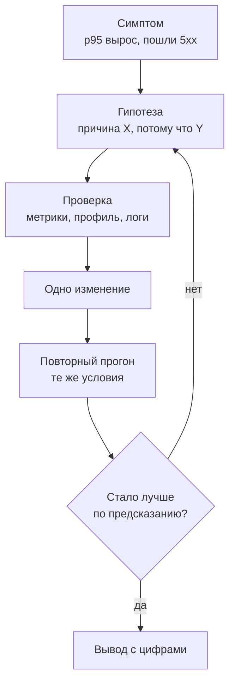
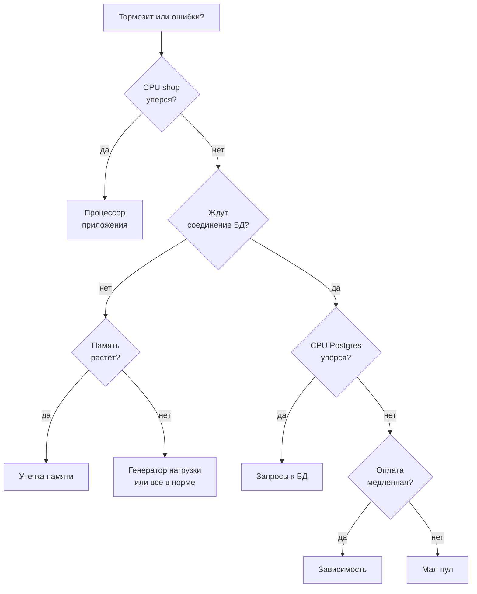

## Зачем это нужно

Ты прогнал тест, и график показал: при 30 визитах покупателей в секунду p95 вырос с 0,24 до 1,9 секунды. Руководитель спрашивает: «Почему? Что чинить?» На этом месте начинающие делают то, что кажется естественным: берут первое подозрение («наверное, база») и сразу правят. Иногда угадывают. Чаще тратят день, ничего не меняется, и никто не понимает почему: может быть, чинили не то, а может быть, починили, но заодно сломали что-то другое.

**Узкое место** (bottleneck) это ресурс или участок системы с самым низким пределом: он первым кончается и ограничивает всё остальное. Поиск узкого места это основная работа нагрузочного инженера, и делается она не вдохновением, а методом: от **симптома** (то, что видит пользователь: медленно, ошибки) через **гипотезу** (предположение о причине, которое можно проверить) и **проверку по метрикам** к **одному изменению** и повторному прогону. В этом уроке ты изучишь сам метод. В следующих четырёх уроках по нему расследуются четыре настоящие проблемы, заложенные в «Магазин».

Шаг проекта: ты заводишь рабочую папку темы `~/perf-lab/11-bottlenecks/` с тремя скриптами (генератор нагрузки на k6, смена настроек стенда с журналом, запуск теста с сохранением результата), снимаешь базовую линию «Магазина» на смешанном сценарии при четырёх нагрузках, читаешь показания по методу USE и записываешь первую проверяемую гипотезу в `01-method.md`. Чинить ничего не нужно: цель урока в том, чтобы научиться утверждать причину только тогда, когда у тебя есть для этого цифры.

## Что нужно знать

- Дашборд и методы RED и USE на уровне «видел и открывал»: [урок 7.3](../07-observability/03-grafana.md). Здесь мы будем их применять.
- Запросы PromQL и скрипт `~/perf-lab/scripts/promq.sh`: [урок 7.2](../07-observability/02-promql.md).
- Перцентили, хоккейная клюшка, насыщение: [урок 8.1](../08-perf-theory/01-latency-throughput.md); очереди и закон Литтла: [урок 8.2](../08-perf-theory/02-queues-littles-law.md); типы тестов и открытая модель: [урок 8.3](../08-perf-theory/03-test-types.md).
- Сценарий `constant-arrival-rate` в k6 и чтение отчёта: [урок 10.1](../10-k6/01-js-first-script.md) и [урок 10.2](../10-k6/02-scenarios-thresholds.md). Наш `bn.js` это обобщённый `shop.js`.
- Лимиты контейнера и `docker stats`: [урок 5.4](../05-docker/04-limits-stats.md). У «Магазина» в `compose.yaml` стоят `cpus: "1.0"` и `mem_limit: 512m`, у PostgreSQL `cpus: "1.0"` и `mem_limit: 1g`.
- Устройство бэкенда с пулом соединений и кэшем: [урок 2.3](../02-web/03-backend-anatomy.md).

## Картина целиком

Врач на приёме. Пациент говорит: «Мне плохо». Хороший врач не назначает лечение сразу: он спрашивает, где болит (симптом), измеряет температуру и давление (общие показатели), предполагает диагноз (гипотеза), назначает один анализ, который отличает один диагноз от другого (проверка), и только потом лечит. Если назначить пять лекарств сразу и пациенту станет лучше, никто не узнает, какое помогло, а какое лишнее. Плохой врач лечит то, что угадал.

Расследование узкого места работает так же, и у него один и тот же цикл на любую проблему:



Цикл замкнут. Если после изменения числа не сдвинулись так, как предсказывала гипотеза, значит, гипотеза неверна, и ты возвращаешься к ней, а не добавляешь второе изменение сверху. «Стало лучше» без предсказания тоже не победа: рассчитывай, что именно и на сколько должно улучшиться.

Метрики для проверки берут из двух готовых наборов вопросов. **USE** отвечает на вопрос «какой ресурс кончился» (процессор, память, пул соединений, база), **RED** отвечает на вопрос «что видит клиент» (сколько запросов, сколько ошибок, как долго). Обе схемы ты уже встречал на дашборде в уроке 7.3, теперь ты научишься с их помощью искать причину.

## Теория

### Узкое место: самое узкое звено определяет всё

**Зачем это понятие.** Без него легко «ускорять» то, что не тормозит. Можно удвоить число воркеров, а сервис не станет быстрее на 1%, потому что тормозила база. Понятие узкого места объясняет, где тратить усилия: только на самом слабом звене.

**Аналогия.** Труба из трёх секций: широкая, узкая и снова широкая. Сколько воды вытекает, определяет узкая секция. Расширишь широкую: вытекать будет столько же. Аналогия ломается тем, что в сервисе «секции» ещё и зависят друг от друга: медленная база заставляет приложение держать запросы дольше, а значит, занимает больше потоков и соединений.

**Как это устроено.** Каждый запрос последовательно проходит несколько ресурсов: процессор приложения, соединение с базой из пула, процессор базы, иногда сеть и внешний сервис. У каждого есть **предел** (capacity): сколько запросов в секунду он способен обслужить. Предел всей системы равен самому низкому из пределов. При нагрузке ниже него всё работает быстро. Как только нагрузка подходит к нему, у этого ресурса появляется очередь, а задержка запросов взлетает (та самая «хоккейная клюшка» из [урока 8.1](../08-perf-theory/01-latency-throughput.md)). Остальные ресурсы при этом простаивают: на их графиках всё спокойно.

**Разобранный пример.** Для сценария «визит покупателя» (каталог, карточка, корзина, заказ, список заказов) мы оценили, сколько каждый ресурс «Магазина» способен переварить в секунду (одна «итерация» это один такой визит):

| Ресурс | Что на него приходится | Предел, итераций/с |
|---|---|---|
| CPU PostgreSQL (1 ядро) | 32 мс процессорного времени базы на итерацию (из них 22 мс полный перебор таблицы заказов) | 1000 / 32 ≈ 31 |
| Пул соединений (5 штук) | соединение занято около 115 мс на итерацию | 5 × 1000 / 115 ≈ 43 |
| CPU приложения (1 ядро) | около 15 мс на итерацию | 1000 / 15 ≈ 67 |

Меньше всего у процессора PostgreSQL, около 31 итерации в секунду. Это и есть узкое место. Если расширить пул с 5 до 50 соединений, предел системы не изменится: он по-прежнему 31, потому что база упирается в свой процессор. Если же исправить запрос и освободить процессор базы, предел вырастет, но только до 43: следующим кончится пул. **Узкое место переезжает** после каждого исправления: это нормально, и поэтому поиск повторяют, пока предел не устроит.

<div class="viz" data-viz="bn-limits" data-load="30"></div>

Три прямые это загрузка трёх ресурсов при росте нагрузки, точка на отметке 100% это предел ресурса. Красная прямая добирается до сотни первой. Включи «Индекс на orders.user_id», потом «Исправить N+1», потом подвинь размер пула и смотри, как слабым звеном становятся то пул, то процессор приложения. Числа в виджете это расчётная модель, а не измерение твоего стенда: настоящие числа ты получишь в следующих уроках.

**Что путают.** Узкое место называют «причиной тормозов», но это только где. Почему (плохой запрос, нет индекса, слишком много повторов) это следующий уровень вопросов. Ещё путают узкое место и «ресурс с самой высокой загрузкой»: высоко загруженный ресурс без очереди может быть в полном порядке, а узким мест называют то, где очередь.

> **Проверь понимание:** предел базы 31, пула 43, приложения 67. Нагрузка 35 итераций в секунду. Какой ресурс упрётся и что будет с задержкой? Что сделает расширение пула до 20?
>
> <details markdown="1">
> <summary>Ответ</summary>
>
> Нагрузка 35 больше предела базы (31): у базы растёт очередь, задержка уходит вверх, пул и приложение при этом загружены на 81% и 52% и выглядят спокойно. Расширение пула до 20 ничего не даст: пул не был узким, предел системы останется 31. Помогло бы только снижение стоимости запросов к базе или более мощная база.
>
> </details>

### Симптом и причина: два разных уровня

**Зачем это различать.** «p95 вырос» это симптом, а не диагноз. Если записать в отчёт «причина: высокий p95», это тавтология. Хорошая причина называет механизм: «каждый запрос списка заказов читает всю таблицу из 200 000 строк, потому что нет индекса по `user_id`».

**Аналогия.** Температура 39 это симптом, ангина это причина. Сбивать температуру можно хоть сутки, пока не вылечена ангина, она вернётся.

**Как это устроено.** Между симптомом и причиной обычно три-четыре шага, и каждый отвечает на вопрос «почему»:

1. Симптом: `GET /api/orders` отвечает за 3 секунды при нагрузке 30 визитов в секунду.
2. Почему? Потому что запрос ждёт: время уходит на базу, а не на приложение.
3. Почему база медленная? Потому что процессор PostgreSQL занят на 100%.
4. Почему он занят? Потому что каждый вызов читает всю таблицу заказов.
5. Почему всю? Потому что нет индекса по `user_id`.

Это приём «пять почему». Останавливаться надо там, где можно действовать: пятый шаг даёт конкретное исправление (`CREATE INDEX`). Каждый шаг проверяется отдельным показанием: шаг 2 числом из логов или метрик, шаг 3 графиком CPU, шаг 4 планом выполнения запроса.

**Разобранный пример.** Сопоставим уровни для логина, которому посвящён урок 11.2: симптом «вход отвечает 4 секунды при 5 входах в секунду», механизм «процессор контейнера занят на 100%», причина «хеширование пароля bcrypt стоит 250 мс процессорного времени на вход, а процессор у контейнера один». 

Исправлять можно на разных уровнях: снизить стоимость (меньше раундов), добавить процессор или уменьшить число входов в тесте (одного входа на пользователя достаточно). Какой выбор правильный, зависит от того, что в реальности делает сервис, и это решение человека, а не метрики.

**Что путают.** Корреляция это не причина. Если p95 вырос одновременно с ростом памяти, это не значит, что память причина: оба могли вырасти из-за роста нагрузки. Причину доказывают изменением: поменял предполагаемую причину, повторил прогон, симптом исчез или не исчез.

### USE: три вопроса к каждому ресурсу

**Зачем это существует.** Системе нужен универсальный список, чтобы ничего не пропустить. Без него смотрят на то, что привычно (процессор), и пропускают то, что убивает сервис (пул соединений или внешний вызов). Метод USE придумал инженер Бренден Грегг для поиска узких мест в серверах: по каждому ресурсу задай три вопроса.

**Аналогия.** Касса в магазине. Использование: какую долю времени касса занята (с пробиванием чеков). Насыщение: стоит ли у кассы очередь. Ошибки: сколько раз касса зависала. Касса может быть занята на 100% и при этом без очереди (покупатели подходят ровно по одному), тогда проблем нет. А очередь при загрузке 70% бывает, когда покупатели приходят пачками. Поэтому все три вопроса нужны.

**Как это устроено.** Название складывается из первых букв:

- **Utilization** (использование): какая доля времени ресурс занят работой. Процессор занят на 80% значит, что 80% времени он выполняет команды. Для ресурса из нескольких штук (пул из 5 соединений) это доля занятых штук.
- **Saturation** (насыщение): сколько работы **ждёт**, потому что ресурс занят. Это очередь: запросы, которые хотят процессор, но стоят; запросы, которые ждут свободное соединение. Любое устойчиво ненулевое насыщение это сигнал, что ресурс уже узкий.
- **Errors** (ошибки): сколько раз ресурс сообщил о сбое: отказ в соединении, таймаут, убитый по памяти процесс.

Идти нужно по списку ресурсов. Для «Магазина» он такой (запросы PromQL можно проверять через `promq.sh`, имена меток из дашборда урока 7.3):

| Ресурс | Использование | Насыщение | Ошибки |
|---|---|---|---|
| CPU shop | доля от лимита ядра: `rate(container_cpu_usage_seconds_total{...service="shop"}[30s])` | доля «задушенных» периодов (throttling): `cfs_throttled_periods / cfs_periods` | перезапуски, код 137 |
| Память shop | `container_memory_working_set_bytes` к лимиту 512 МБ | рост без остановки | убит по памяти (OOM) |
| Пул БД | `1 - shop_db_pool_available / shop_db_pool_size` | `shop_db_pool_waiting`, `shop_db_connection_wait_seconds` | ответ 503 «database pool timeout» |
| CPU PostgreSQL | `rate(container_cpu_usage_seconds_total{...service="postgres"}[30s])` | длинные запросы, соединения в `active` | ошибки в логе, `max_connections` |
| Оплата (зависимость) | `rate(shop_payment_requests_total[30s])` | время `shop_payment_duration_seconds` | `result="error"` и `"timeout"` |
| Генератор нагрузки | CPU машины, где крутится k6 | пропущенные итерации `dropped_iterations` | ошибки соединения у клиента |

**Разобранный пример.** Во время теста на 30 визитах в секунду снимаем показания по таблице и получаем (числа типичные для ноутбука с четырьмя ядрами):

- CPU shop: 0,45 ядра из 1 (45%), throttling 3% периодов. Использование среднее, очереди нет.
- Пул БД: занято в среднем 4 из 5 соединений, в ожидании 2-3 запроса, `shop_db_connection_wait_seconds` p95 около 0,35 с. Насыщение есть.
- CPU PostgreSQL: 0,99 ядра из 1, throttling 41% периодов. Использование и насыщение.
- Память shop: 130 МБ из 512, ровная.
- Оплата: p95 попытки 0,06 с, ошибок нет.

Насыщены два ресурса, база и пул, но пул насыщен **из-за базы**: соединение занято дольше, потому что запросы к медленной базе ждут процессор. Поэтому подозреваемый номер один это процессор PostgreSQL, а пул это следствие. Различить причину и следствие помогает порядок: ресурс, который стоит **ближе к концу цепочки** запроса и сам не ждёт других, и есть причина.

**Что путают.** Три типичные ошибки:

- Смотрят только использование и решают «процессор 60%, запас большой». Но контейнеру выдан лимит в одно ядро, и `docker stats` показывает долю от лимита. При лимите работает «душение» (CFS throttling): процессу разрешено работать порциями по 100 мс, и если за порцию он потратил квоту, ждёт до следующей. Среднее по минуте может быть 60%, а запросы всё равно ждут. Поэтому насыщение смотрят отдельной метрикой.
- Считают 100% использования диагнозом. Загрузка 100% без очереди значит «работаем на пределе», а не «сломались».
- Не смотрят на сам генератор нагрузки: если k6 упёрся в процессор ноутбука, сервер простаивает, а график показывает «медленно».

### RED: три вопроса к сервису

**Зачем это существует.** USE смотрит на ресурсы изнутри. Но решать, плохо ли, надо по тому, что видит клиент. Метод RED (придумал Том Уилки для микросервисов) описывает сервис глазами клиента: сколько запросов, сколько из них ошибок, сколько ждали.

**Аналогия.** Ресторан. USE это состояние кухни: повара заняты, плиты горят. RED это то, что видит гость: сколько заказов принято, сколько блюд вернули, как долго ждали. Кухня может быть вся «красная», а гости довольны (запас по времени), и наоборот.

**Как это устроено.** Три величины на каждый маршрут:

- **Rate** (запросы в секунду): `sum by (route) (rate(http_requests_total[30s]))`.
- **Errors** (доля ошибок): `sum(rate(http_requests_total{status=~"5.."}[30s])) / sum(rate(http_requests_total[30s]))`. Ответы 4xx это ошибки клиента, их считают отдельно.
- **Duration** (длительность): `histogram_quantile(0.95, sum by (le, route) (rate(http_request_duration_seconds_bucket[30s])))`.

Связь между методами такая: **RED находит симптом и маршрут**, USE находит ресурс. Сначала смотришь RED и выясняешь, какой маршрут медленный и с какого момента, потом идёшь по USE и ищешь ресурс, которым этот маршрут занимается.

**Разобранный пример.** На 30 визитах в секунду p95 по маршрутам:

| Маршрут | Запросов/с | p50 | p95 | 5xx |
|---|---|---|---|---|
| `/api/products` (каталог) | 27,8 | 0,12 с | 0,42 с | 0,2% |
| `/api/products/{id}` | 27,8 | 0,09 с | 0,30 с | 0,1% |
| `POST /api/cart/items` | 27,8 | 0,08 с | 0,33 с | 0,1% |
| `POST /api/orders` | 27,8 | 0,25 с | 0,95 с | 0,4% |
| `GET /api/orders` | 27,8 | 1,10 с | 3,10 с | 1,4% |

«тормозит» всё, но не поровну. Список заказов в семь раз медленнее каталога. Это даёт две подсказки: ищем причину на пути именно списка заказов (что он делает такого, чего не делают остальные: читает таблицу заказов и делает по запросу на каждый заказ) и она связана с базой, потому что остальные маршруты тоже ухудшились (общий ресурс, все ходят в базу). RED сузил поиск с «весь сервис» до «маршрут `GET /api/orders` и общий ресурс».

**Что путают.** Дают одну общую цифру на сервис. Среднее по всему сервису прячет медленный маршрут, как среднее по запросам прячет хвост ([урок 8.1](../08-perf-theory/01-latency-throughput.md)): всегда делай разрез `by (route)`. Ещё путают доли: «ошибок 1%» может означать 1% всех запросов, но 100% оформлений заказа, если они редкие.

### Дерево диагностики

**Зачем это нужно.** USE даёт список ресурсов, но порядок осмотра остаётся на тебе. Нужен алгоритм «если… то…»: проверка, которая сужает круг подозреваемых при каждом ответе. Тогда расследование занимает минуты, а не часы, и не зависит от настроения.

**Как это устроено.** Для «Магазина» дерево такое (порядок вопросов выбран так, чтобы дешёвые проверки и самые частые причины шли первыми):



На схеме нормальный путь короткий, три вопроса. Листья разбирают следующие уроки: процессор приложения (11.2), база и пул (11.3), утечка памяти (11.4), зависимость (11.5). Если все ответы «нет», остаётся последнее подозрение: не упёрся ли сам генератор нагрузки. Каждый лист дерева это не диагноз, а подозрение: его надо подтвердить вторым показанием другого рода (профилировщик, `EXPLAIN`, лог).

Теперь пройди по дереву сам. В виджете шесть случаев, у каждого свои показания дашборда. Автоматически он проигрывает первый случай, а ты можешь выбрать любой и отвечать кликами:

<div class="viz" data-viz="bn-diagnose" data-case="2"></div>

Плитки это показания во время нагрузки, красная рамка значит «упёрлось». На вопрос отвечай «да» или «нет» по плиткам. Если ответ не сходится с показанием, виджет подскажет, на какую плитку смотреть. Случаи 2 и 3 похожи (запросы ждут пул), а различаются одним показанием: упёрся ли процессор базы.

**Разобранный пример.** Случай «Заказы тормозят»: CPU shop 38%, ждут 3 запроса, CPU PostgreSQL 100%. Вопрос 1: процессор shop упёрся? Нет (38%). Вопрос 2: ждут соединение? Да (3). Вопрос 3: процессор PostgreSQL упёрся? Да (100%). Лист: запросы к базе. Три ответа, три плитки.

**Что путают.** Принимают лист за диагноз. «Запросы к БД» это направление, а не причина: внутри может быть медленный запрос, нехватка индекса, мало соединений или блокировка. Каждое из них проверяется своим инструментом, и выбор инструмента это следующий урок.

### Гипотеза: проверяемое утверждение

**Зачем это нужно.** Гипотеза это способ не обманывать самого себя. Если сформулировать её так, что она не может оказаться неверной («система тормозит из-за общей нагрузки»), её нечем проверить и она ничего не даёт. Хорошая гипотеза **рискует**: говорит, какое число и на сколько изменится, и тем самым может проиграть.

**Как это устроено.** Формула из четырёх частей:

> **Если** причина в X, **то** изменение Y приведёт к Z (с числом), **а в остальном** Z не изменится. **Доказательство:** метрика M показывает N.

**Разобранный пример.** Сравни:

| Слабая гипотеза | Сильная гипотеза |
|---|---|
| «База медленная» | «Если причина в полном переборе таблицы заказов, то после индекса по `user_id` время запроса упадёт с 20 мс примерно до 1 мс, а p95 `GET /api/orders` при 30 визитах в секунду упадёт ниже 0,3 с. Если p95 останется выше 1 с, гипотеза неверна.» |
| «Нужно больше воркеров» | «Если причина в нехватке воркеров, то при `WEB_CONCURRENCY=2` пропускная способность входа вырастет с 3,9 до 7 в секунду. Если останется 3,9, дело в лимите процессора.» |
| «Утечка памяти» | «Если приложение течёт по 10 КБ на запрос, то при 40 запросах в секунду память растёт на 24 МБ в минуту и за 16 минут доходит до лимита 512 МБ.» |

У сильной гипотезы есть **что изменить**, **что должно произойти** и **условие, при котором она опровергнута**. Опровержение это тоже результат: ты вычеркнул подозреваемого и сузил поиск.

**Что путают.** Подгоняют факты под гипотезу: «p95 упал не на 0,3, а на 0,5 с, но это почти то же самое». Заранее записанный порог защищает от этого: решение принимается по числу, записанному до эксперимента.

### Одно изменение за раз и честное сравнение

**Зачем это нужно.** Если поменять три параметра сразу и p95 упал, ты не знаешь, какой помог. Ещё хуже: один мог помочь, второй ухудшить, и итог выглядит «чуть лучше», а ты закрепил в конфигурации вредную настройку.

**Как это устроено.** Правила честного эксперимента:

1. **Базовая линия до изменения**: два-три прогона на текущей конфигурации.
2. **Одно изменение** (одна переменная в `.env` или один индекс), записанное в журнал с временем.
3. **Прежние условия**: те же сценарий, нагрузка, длительность, данные в базе, машина, фоновые программы.
4. **Прогрев**: первые 10-20 секунд выбрасывают (кэши, пулы соединений, JIT и пр. выходят на рабочий режим).
5. **Повтор для оценки шума**: прогон двух одинаковых конфигураций даёт разные числа. Это разброс, и изменение меньше разброса за результат не считается.
6. **Решение по числам из гипотезы**, а не по ощущению.

**Разобранный пример.** Три базовых прогона на одной конфигурации дали p95: 1,86 с, 1,93 с и 1,89 с. Среднее 1,89 с, разброс около ±2% (0,04 с). Ты меняешь одну настройку и получаешь 1,80 с. Улучшение 0,09 с или 5%: чуть больше разброса, но этого мало для вывода, повтори прогон.

Если получишь 1,78 и 1,81, улучшение устойчиво, но скромное (около 5%): настройка почти не влияет, значит, гипотеза о ней неверна. Если бы вместо этого после индекса вышло 0,24 с, то это улучшение в 8 раз, намного больше разброса, и вывод однозначен.

Вот почему изменение нельзя смешивать. Допустим, ты разом поставил индекс (p95 с 1,9 до 0,3), расширил пул (p95 не меняется) и поменял число воркеров (вызывает рост потребления памяти). Итог «p95 упал в 6 раз» скрывает, кто на самом деле дал эффект: возможно, одна правка, а две другие ничего не дали или стоят памяти и процессора.

**Что путают.** Путают «одно изменение» с «одна строка». Индекс и исправление N+1 это два изменения, даже если оба касаются «заказов». Не путай и «повторить прогон» с «запустить ещё раз и взять лучший результат»: выбирать лучший значит заниматься самообманом. Бери медиану трёх или показывай все.

> **Проверь понимание:** базовые p95 в трёх прогонах: 2,1; 2,4; 2,2 с. После изменения: 2,0 с. Можно ли утверждать, что изменение помогло?
>
> <details markdown="1">
> <summary>Ответ</summary>
>
> Нет. Разброс базовых прогонов 0,3 с (от 2,1 до 2,4), а улучшение 0,2 с меньше разброса. Нужно либо повторить прогон после изменения два-три раза, либо искать изменение, которое даёт эффект в разы.
>
> </details>

## Практика

Все команды выполняй на машине, где стоит «Магазин» (урок 2.1), с запущенным мониторингом (урок 7.1). Нагрузка идёт только на твой стенд.

### 1. Заведи папку темы и приготовь стенд

```bash
mkdir -p ~/perf-lab/11-bottlenecks ~/perf-lab/results
cd ~/load-tester/project/shop
git status --short .env.example && cp -n .env.example .env
docker compose --profile monitoring up -d --wait
curl -s localhost:8000/readyz
```

Что делает каждая строка: `mkdir -p` создаёт папку темы и общую папку результатов (без ошибки, если они уже есть); `cp -n` копирует `.env.example` в `.env`, только если `.env` ещё нет (`-n` значит «не перезаписывать»); `up -d --wait` поднимает стенд с мониторингом и ждёт, пока все сервисы станут здоровыми; `readyz` проверяет, что «Магазин» готов.

```text
{"status":"ready"}
```

Сейчас все настройки в `.env` должны быть значениями по умолчанию. Твои числа должны совпасть с числами урока. Проверь командой:

```bash
grep -E '^(WEB_CONCURRENCY|DB_POOL_MAX|BCRYPT_ROUNDS|CACHE_ENABLED|BUG_N_PLUS_ONE|LEAK_ENABLED|PAYMENT_TIMEOUT|PAYMENT_RETRIES)=' .env
```

```text
WEB_CONCURRENCY=1
DB_POOL_MAX=5
BCRYPT_ROUNDS=12
CACHE_ENABLED=0
BUG_N_PLUS_ONE=1
LEAK_ENABLED=0
PAYMENT_TIMEOUT=10
PAYMENT_RETRIES=3
```

**Типичные ошибки:** `grep` показал другие значения: в `.env` остались настройки из прошлых экспериментов; верни по `.env.example`. Таблица `orders` без индекса по `user_id`: проверь `docker compose exec -T postgres psql -U shop -d shop -c "SELECT indexname FROM pg_indexes WHERE tablename='orders'"`. Если там есть `orders_user_id_idx` (остался от урока 2.4), удали: `DROP INDEX orders_user_id_idx;`.

### 2. Скрипт k6 `bn.js`

Это твой единственный генератор нагрузки для всей темы. Он умеет несколько сценариев, которые выбирает переменная `SCENARIO`: `mix` (визит покупателя), `login`, `product`, `orders`, `checkout`. Сохрани файл `~/perf-lab/11-bottlenecks/bn.js`:

```javascript
import http from 'k6/http';
import { check, sleep } from 'k6';

const BASE = (__ENV.BASE_URL || 'http://localhost:8000').replace(/\/$/, '');
const SCENARIO = __ENV.SCENARIO || 'mix';
const USERS = Number(__ENV.USERS || 50);
const JSON_HEADERS = { 'Content-Type': 'application/json' };

export const options = {
  scenarios: {
    bn: {
      executor: 'constant-arrival-rate',
      rate: Number(__ENV.RATE || 10),
      timeUnit: '1s',
      duration: __ENV.DURATION || '60s',
      preAllocatedVUs: 50,
      maxVUs: 400,
    },
  },
  summaryTrendStats: ['avg', 'med', 'p(90)', 'p(95)', 'p(99)', 'max'],
  thresholds: {
    http_req_failed: ['rate<0.01'],
    // Условия p(50)>=0 и p(95)>=0 всегда верны: пороги нужны, чтобы k6 напечатал p50 и p95 по каждому маршруту.
    'http_req_duration{name:/api/login}': ['p(50)>=0', 'p(95)>=0'],
    'http_req_duration{name:/api/products}': ['p(50)>=0', 'p(95)>=0'],
    'http_req_duration{name:/api/products/[id]}': ['p(50)>=0', 'p(95)>=0'],
    'http_req_duration{name:/api/cart/items}': ['p(50)>=0', 'p(95)>=0'],
    'http_req_duration{name:POST /api/orders}': ['p(50)>=0', 'p(95)>=0'],
    'http_req_duration{name:GET /api/orders}': ['p(50)>=0', 'p(95)>=0'],
  },
};

function userEmail(n) {
  return `user${String(n).padStart(4, '0')}@shop.lab`;
}

// Токены 50 пользователей берём один раз до начала теста: вход дорогой (bcrypt), его не надо мерить в каждом сценарии.
export function setup() {
  if (SCENARIO === 'login' || SCENARIO === 'product') return { tokens: [] };
  const tokens = [];
  for (let n = 1; n <= USERS; n++) {
    const res = http.post(`${BASE}/api/login`,
      JSON.stringify({ email: userEmail(n), password: 'password' }), { headers: JSON_HEADERS, timeout: '60s' });
    if (res.status === 200) tokens.push(res.json('token'));
  }
  if (tokens.length === 0) throw new Error('не удалось войти ни одним пользователем: стенд поднят?');
  return { tokens };
}

function login() {
  const n = 1 + Math.floor(Math.random() * USERS);
  const res = http.post(`${BASE}/api/login`,
    JSON.stringify({ email: userEmail(n), password: 'password' }),
    { headers: JSON_HEADERS, tags: { name: '/api/login' } });
  check(res, { 'вход: 200': (r) => r.status === 200 });
}

// 80% обращений к 200 «горячим» товарам, 20% к любому из 10 000: так ведут себя покупатели.
function productID() {
  return Math.random() < 0.8 ? 1 + Math.floor(Math.random() * 200) : 1 + Math.floor(Math.random() * 10000);
}

function product() {
  const res = http.get(`${BASE}/api/products/${productID()}`, { tags: { name: '/api/products/[id]' } });
  check(res, { 'карточка: 200': (r) => r.status === 200 });
}

function orders(headers) {
  const res = http.get(`${BASE}/api/orders`, { headers, tags: { name: 'GET /api/orders' } });
  check(res, { 'мои заказы: 200': (r) => r.status === 200 });
}

function checkout(headers) {
  const add = http.post(`${BASE}/api/cart/items`, JSON.stringify({ product_id: productID(), qty: 1 }),
    { headers, tags: { name: '/api/cart/items' } });
  check(add, { 'корзина: 201': (r) => r.status === 201 });
  const res = http.post(`${BASE}/api/orders`, null, { headers, tags: { name: 'POST /api/orders' } });
  check(res, { 'заказ: 201': (r) => r.status === 201 });
}

export default function (data) {
  if (SCENARIO === 'login') return login();
  if (SCENARIO === 'product') return product();
  const token = data.tokens[Math.floor(Math.random() * data.tokens.length)];
  const headers = { Authorization: `Bearer ${token}`, 'Content-Type': 'application/json' };
  if (SCENARIO === 'orders') return orders(headers);
  if (SCENARIO === 'checkout') return checkout(headers);
  // mix: как один визит покупателя
  check(http.get(`${BASE}/api/products`, { tags: { name: '/api/products' } }), { 'каталог: 200': (r) => r.status === 200 });
  product();
  checkout(headers);
  orders(headers);
  sleep(0.2);
}
```

Что здесь нового по сравнению с `shop.js` из урока 10.1:

- **`SCENARIO`** выбирает, что делает итерация. `login` только логинится, `product` читает карточку, `orders` только список заказов, `checkout` корзина и заказ, `mix` весь визит.
- **`setup()`** выполняется один раз до теста и входит 50 пользователями. Токены хранятся в `data.tokens`, и каждая итерация берёт случайный. Так вход (дорогая операция) не попадает в замеры других сценариев.
- **`tags: { name: ... }`** дают каждому маршруту своё имя (иначе k6 считал бы `/api/products/1` и `/api/products/2` разными метками, как объясняли в уроке 10.1).
- **Пороги на `p(50)>=0` и `p(95)>=0`** это приём: условие всегда выполняется, но заставляет k6 напечатать p50 и p95 для каждого маршрута отдельно в блоке `THRESHOLDS`.
- **`productID()`** берёт 80% обращений из 200 горячих товаров, как ведут себя настоящие покупатели. Это пригодится в уроке 11.5, когда будем включать кэш.
- **`constant-arrival-rate`** задаёт число **визитов в секунду** независимо от того, успевает ли сервер (открытая модель, [урок 8.2](../08-perf-theory/02-queues-littles-law.md)): так при перегрузке растёт задержка, а не падает нагрузка.

Проверь синтаксис без запуска: `k6 inspect ~/perf-lab/11-bottlenecks/bn.js`; пустой вывод ошибок и JSON настроек значат, что файл в порядке.

Если k6 у тебя в Docker (как в README стенда), запускай `docker run --rm -i --network host -v ~/perf-lab/11-bottlenecks:/s grafana/k6:2.3.0 run -e SCENARIO=mix -e RATE=10 /s/bn.js`; `--network host` позволяет контейнеру достучаться до `localhost:8000` стенда.

### 3. Скрипты `set-env.sh` и `run.sh`

Первый меняет настройки стенда **и записывает это в журнал**. Это то самое правило «одно изменение за раз с отметкой времени», только в виде кода:

```bash
cat > ~/perf-lab/11-bottlenecks/set-env.sh <<'EOF'
#!/usr/bin/env bash
# set-env.sh KEY=VALUE ...: меняет переменные в .env стенда, пересоздаёт shop, пишет строку в журнал опытов
set -euo pipefail
SHOP_DIR=${SHOP_DIR:-$HOME/load-tester/project/shop}
LOG=$HOME/perf-lab/11-bottlenecks/experiments.log
cd "$SHOP_DIR"
for kv in "$@"; do
  key=${kv%%=*}; val=${kv#*=}
  if grep -q "^${key}=" .env; then sed -i "s|^${key}=.*|${key}=${val}|" .env; else echo "${key}=${val}" >> .env; fi
  printf '%s  %s=%s\n' "$(date '+%F %T')" "$key" "$val" >> "$LOG"
done
docker compose up -d --force-recreate --wait shop
EOF
chmod +x ~/perf-lab/11-bottlenecks/set-env.sh
```

Разбор: `key=${kv%%=*}` отрезает от `BCRYPT_ROUNDS=4` всё, начиная с первого `=`, получается ключ; `val=${kv#*=}` отрезает всё до первого `=`, получается значение. `sed -i "s|...|...|"` заменяет строку в файле на месте (разделитель `|` выбран, чтобы не мешали косые черты в значениях). Если ключа в `.env` не было, он дописывается. `printf` добавляет строку «время  ключ=значение» в журнал. Последняя команда пересоздаёт только `shop` (`--force-recreate` заставляет Docker подхватить новый `.env`, `--wait` ждёт готовности). Метрики `shop` при этом начинаются с нуля, и это нормально.

Второй запускает k6 и сохраняет результат:

```bash
cat > ~/perf-lab/11-bottlenecks/run.sh <<'EOF'
#!/usr/bin/env bash
# run.sh <метка> [KEY=VALUE ...]: прогон bn.js, весь вывод в ~/perf-lab/results/11-<метка>.txt, на экран главное
set -euo pipefail
label=$1; shift
args=(); for kv in "$@"; do args+=(-e "$kv"); done
mkdir -p ~/perf-lab/results
k6 run "${args[@]}" ~/perf-lab/11-bottlenecks/bn.js 2>&1 | tee ~/perf-lab/results/11-"$label".txt \
  | grep -E 'name:|p\(50\)|p\(95\)|http_req_failed|dropped_iterations|^ +iterations' || true
EOF
chmod +x ~/perf-lab/11-bottlenecks/run.sh
```

Разбор: `shift` убирает первый аргумент (метку), остальные пары `KEY=VALUE` превращаются в флаги `-e KEY=VALUE` для k6. `tee` сохраняет **весь** вывод в файл, а `grep -E` печатает на экран только нужные строки; `|| true` нужен, чтобы пустой `grep` не обрывал скрипт. Если порог `http_req_failed` нарушен (при перегрузке), k6 завершится с кодом 99, но `tee`, `grep` и `|| true` это переживут.

### 4. Базовая линия: четыре нагрузки

Открой второй терминал для наблюдения (шаг 5), а в первом запусти четыре прогона по 60 секунд. Между прогонами делай паузу в минуту, чтобы очереди рассосались.

```bash
cd ~/perf-lab/11-bottlenecks
for r in 10 20 30 40; do ./run.sh base-$r SCENARIO=mix RATE=$r DURATION=60s; sleep 60; done
```

Для одного прогона на 30 визитах в секунду на экране будет примерно такое:

```text
  █ THRESHOLDS

    http_req_duration{name:/api/products}
    ✓ 'p(50)>=0' p(50)=118ms
    ✓ 'p(95)>=0' p(95)=421ms

    http_req_duration{name:/api/products/[id]}
    ✓ 'p(50)>=0' p(50)=92ms
    ✓ 'p(95)>=0' p(95)=304ms

    http_req_duration{name:/api/cart/items}
    ✓ 'p(50)>=0' p(50)=81ms
    ✓ 'p(95)>=0' p(95)=331ms

    http_req_duration{name:POST /api/orders}
    ✓ 'p(50)>=0' p(50)=251ms
    ✓ 'p(95)>=0' p(95)=948ms

    http_req_duration{name:GET /api/orders}
    ✓ 'p(50)>=0' p(50)=1.1s
    ✓ 'p(95)>=0' p(95)=3.1s

    http_req_failed
    ✓ 'rate<0.01' rate=0.37%
  ...
     dropped_iterations.......: 128    2.1/s
     iterations...............: 1672   27.8/s
```

**Как читать вывод:** блок `THRESHOLDS` печатает по строке p50 и p95 каждого маршрута (это наш трюк с условиями «всегда верно»). Сначала смотри самый длинный: здесь `GET /api/orders` с p95 в 3,1 с. `http_req_failed` 0,37% значит, что около одного запроса из 270 закончился ошибкой (это те, что ждали соединение БД дольше пяти секунд). `iterations 27.8/s` показывает, что сервер выполнил 27,8 визита в секунду, хотя мы просили 30, и `dropped_iterations 128` это визиты, которые k6 не смог начать, потому что все виртуальные пользователи были заняты ожиданием. Эта разница между просимой и фактической нагрузкой и есть признак предела.

Сведи четыре прогона в таблицу. У тебя числа будут другими (процессор ноутбука иной), но **форма** должна совпасть: почти плоско до 20 и обрыв после 30. Ориентир:

| Визитов в секунду (просили) | Выполнено/с | p50 | p95 | p99 | Ошибок |
|---|---|---|---|---|---|
| 10 | 10,0 | 0,06 с | 0,11 с | 0,15 с | 0% |
| 20 | 20,0 | 0,09 с | 0,24 с | 0,41 с | 0% |
| 30 | 27,8 | 0,55 с | 1,9 с | 3,4 с | 0,4% |
| 40 | 26,9 | 2,9 с | 6,2 с | 7,0 с | 7% |

<div class="viz" data-viz="chart" data-type="line" data-x="10,20,30,40" data-x-label="Нагрузка, визитов в секунду" data-y-label="p95, с" data-unit="с" data-explain="До 20 визитов в секунду p95 почти не растёт, на 30 он подскакивает до 1,9 с, на 40 упирается в таймаут ожидания соединения (5 с) и становится 6,2 с. Выполненная нагрузка перестаёт расти на отметке около 28 в секунду: это предел системы." data-series='[{"name":"p95, с","values":[0.11,0.24,1.9,6.2],"unit":"с"},{"name":"выполнено, визитов/с","values":[10,20,27.8,26.9],"unit":"/с"}]'></div>

Две линии разошлись. До 20 визитов нагрузка и выполнение совпадают, дальше выполнение останавливается на уровне около 28, а задержка растёт. Это классическая клюшка: предел находится между 20 и 30. Наша модель говорила, что предел базы около 31 визита в секунду, на практике он ниже из-за запаса (нагрузка 30 даёт очередь и на 96% загрузки).

**Типичные ошибки:** `ERRO[0000] ... connect: connection refused` значит, что стенд не запущен (`docker compose ps`); `setup() ... не удалось войти` значит, что `.env` неверный или shop не готов; сообщение `Insufficient VUs` или большой `dropped_iterations` на 10 и 20 визитах означает, что генератор не справляется (проверь шаг про генератор ниже); `bash: ./run.sh: Permission denied` значит, что не выполнено `chmod +x`.

### 5. Показания USE во время прогона

Запусти ещё один прогон на 30 визитах, но на 3 минуты, и пока он идёт, во втором терминале снимай показания по таблице USE. Прогон: `./run.sh use-30 SCENARIO=mix RATE=30 DURATION=3m`. Скрипт `promq.sh` ты завёл в уроке 7.2.

```bash
P=~/perf-lab/scripts/promq.sh
S='container_label_com_docker_compose_service'
$P "sum(rate(container_cpu_usage_seconds_total{$S=\"shop\"}[30s]))"
$P "sum(rate(container_cpu_usage_seconds_total{$S=\"postgres\"}[30s]))"
$P "sum(rate(container_cpu_cfs_throttled_periods_total{$S=\"postgres\"}[30s])) / sum(rate(container_cpu_cfs_periods_total{$S=\"postgres\"}[30s]))"
$P "shop_db_pool_waiting"
$P "histogram_quantile(0.95, sum by (le) (rate(shop_db_connection_wait_seconds_bucket[30s])))"
$P "container_memory_working_set_bytes{$S=\"shop\"} / 1024 / 1024"
$P 'histogram_quantile(0.95, sum by (le) (rate(shop_payment_duration_seconds_bucket[30s])))'
```

Разбор: `P=...` и `S=...` это переменные оболочки, чтобы не повторять длинные имена. `rate(...[30s])` для счётчика процессорного времени в секундах даёт «сколько ядер занято»: 0,45 значит, что контейнер использует 45% одного ядра. Отношение `throttled_periods / periods` это доля периодов по 100 мс, в которых контейнер упёрся в квоту и ждал. `shop_db_pool_waiting` это число запросов, которые прямо сейчас ждут свободное соединение. Остальные запросы знакомы по таблице USE выше.

```text
  0.44
  0.99
  0.41
  2
  0.37
  131.2
  0.058
```

**Как читать вывод:** построчно: shop использует 0,44 ядра (запас большой), postgres 0,99 ядра из одного (упёрт), `throttled` 0,41 (в 41% периодов Postgres ждал квоту: насыщение), в ожидании пула 2 запроса, p95 ожидания соединения 0,37 с (это время, которое запрос стоит и ничего не делает), память shop 131 МБ из 512, оплата отвечает за 58 мс. Первым смотри строки с насыщением: это postgres и пул.

Сам процесс k6 тоже ест процессор: `top -bn1 | head -12` (или `htop`) покажет, что `k6` занимает вряд ли больше 30% одного ядра. Если он занимает 100%, результатам верить нельзя, это последний вопрос дерева диагностики.

**Типичные ошибки:** пустой вывод значит, что метки cAdvisor другие (на Docker Desktop для Mac бывают другие названия): посмотри метки запросом `container_memory_working_set_bytes` без фильтра и подбери `name` или `container_label_com_docker_compose_service`; запрос с `histogram_quantile` вернул `NaN` значит, что за 30 секунд не было ни одного запроса: нагрузка не идёт.

### 6. Пройди дерево и запиши гипотезу

Теперь у тебя есть показания и маршрут с худшим p95. Пройди по дереву из этого урока:

1. Процессор shop упёрся? Нет, 0,44 ядра.
2. Запросы ждут соединение БД? Да, ожидающих 2.
3. Процессор PostgreSQL упёрся? Да, 0,99 ядра, throttling 41%.
4. Вывод: подозрение на запросы к базе, а точнее на `GET /api/orders` как самый медленный маршрут.

Запиши результат в файл `~/perf-lab/11-bottlenecks/01-method.md`. Шаблон:

```markdown
# 11.1. Базовая линия и гипотеза

## Условия
Стенд: настройки по умолчанию (.env.example), k6 mix, 60 с, прогрев не вырезал.
Машина: <из ~/perf-lab/machine.md>. Дата: <дата>.

## Базовая линия (p95, ошибки)
10/с: ...; 20/с: ...; 30/с: ...; 40/с: ...
Предел: выполнено не больше ~28 визитов/с.

## Показания USE на 30/с
- CPU shop: 0,44 ядра, throttling ...
- CPU PostgreSQL: 0,99 ядра, throttling 41%
- Пул: ждут 2, wait p95 0,37 с
- Память, оплата: в норме

## Самый медленный маршрут
GET /api/orders: p95 3,1 с (остальные 0,3-0,9 с)

## Гипотеза
Если причина в запросах к базе по списку заказов, то ...
(что изменить, что должно произойти с числом, при каком числе гипотеза неверна)
```

Гипотеза формулируется **в виде предсказания с числом**; исправлять ничего не нужно, этим займёмся в 11.3. Допустимый пример: «Если причина в полном переборе таблицы заказов, то индекс по `user_id` снизит p95 `GET /api/orders` при 30 визитах/с ниже 0,5 с; если p95 останется выше 1 с, гипотеза неверна».

Закоммить результат и журнал:

```bash
cd ~/perf-lab
git add 11-bottlenecks results/11-*.txt
git commit -m "11.1: базовая линия mix и гипотеза"
git push
```

## Сломай и почини

**Поломка:** нарушь главное правило метода и посмотри, что получится. Поменяй сразу три настройки, не имея гипотезы: «давайте что-нибудь поправим».

```bash
~/perf-lab/11-bottlenecks/set-env.sh DB_POOL_MAX=15 WEB_CONCURRENCY=3 BUG_N_PLUS_ONE=0
cd ~/perf-lab/11-bottlenecks
./run.sh broken-3 SCENARIO=mix RATE=30 DURATION=60s
```

Типичный результат: p95 стал около 1,0 с (раньше 1,9 с) и появилась неприятность: память shop выросла примерно втрое (три воркера, у каждого свой пул и своя копия приложения), а процессор приложения стал упираться в лимит ядра (три воркера делят одно ядро). Ты видишь «стало лучше», но не знаешь: какая из трёх правок помогла, какая нет, какая навредила.

**Диагностика.** Верни стенд на базовую конфигурацию и проведи опыт по методу: по одной настройке, с прогоном после каждой.

```bash
~/perf-lab/11-bottlenecks/set-env.sh DB_POOL_MAX=5 WEB_CONCURRENCY=1 BUG_N_PLUS_ONE=1
cd ~/perf-lab/11-bottlenecks
~/perf-lab/11-bottlenecks/set-env.sh BUG_N_PLUS_ONE=0 && ./run.sh only-nplus1 SCENARIO=mix RATE=30 DURATION=60s
~/perf-lab/11-bottlenecks/set-env.sh BUG_N_PLUS_ONE=1 DB_POOL_MAX=15 && ./run.sh only-pool SCENARIO=mix RATE=30 DURATION=60s
~/perf-lab/11-bottlenecks/set-env.sh DB_POOL_MAX=5 WEB_CONCURRENCY=3 && ./run.sh only-workers SCENARIO=mix RATE=30 DURATION=60s
~/perf-lab/11-bottlenecks/set-env.sh WEB_CONCURRENCY=1
```

Ожидаемая картина (числа ориентировочные): `BUG_N_PLUS_ONE=0` один даёт p95 около 1,2 с (снимает около четверти работы базы); `DB_POOL_MAX=15` один даёт около 1,9 с, то есть **ничего** (база упирается в процессор, а не в пул); `WEB_CONCURRENCY=3` один даёт около 1,9 с и примерно втрое больше памяти. Главный вклад дала одна правка, N+1: 1,9 с вниз до 1,2 с. Пул и воркеры по отдельности ничего не дали, а вместе с N+1 снизили p95 ещё на 0,1-0,2 с (до 1,0 с): это уже тонкая настройка, и платишь за неё памятью и процессором. Три правки в одном прогоне выглядели как общий успех, а опыт по одной показал, где польза.

<div class="viz" data-viz="flow" data-steps='[{"title":"Запиши условия","text":"Конфигурация, сценарий, нагрузка, длительность, дата. Всё, что нужно, чтобы повторить прогон."},{"title":"Базовая линия","text":"Два-три прогона без изменений. Разброс между ними это шум."},{"title":"Симптом и маршрут","text":"RED: какой маршрут и с какой нагрузки хуже. Не весь сервис."},{"title":"Ресурс по USE","text":"Обойди ресурсы: использование, насыщение, ошибки. Начни с насыщения."},{"title":"Гипотеза с числом","text":"Если причина X, то изменение Y даст Z. Запиши порог, при котором гипотеза неверна."},{"title":"Одно изменение","text":"Через `set-env.sh` или один индекс. Прогон на тех же условиях."},{"title":"Сверка и вывод","text":"Сравни с порогом из гипотезы. Подтверждено, опровергнуто или улучшение меньше шума."}]'></div>

**Проверь итог:** после всех опытов верни стенд в исходное состояние (`BUG_N_PLUS_ONE=1 DB_POOL_MAX=5 WEB_CONCURRENCY=1`, `grep` из шага 1 даёт значения по умолчанию) и посмотри журнал `cat ~/perf-lab/11-bottlenecks/experiments.log`: каждое изменение записано со временем. Допиши в `01-method.md` один абзац «Что я узнал»: какая правка действовала и какую ты не принял бы на ревью без измерения. Такой опыт часто просят пересказать на собеседовании.

## Словарик урока

| Термин | Простыми словами |
|---|---|
| Узкое место (bottleneck) | Ресурс с самым низким пределом: он первым кончается и ограничивает всё остальное |
| Симптом | То, что видит пользователь: медленно, ошибки |
| Причина (root cause) | Механизм, который вызвал симптом, и который можно исправить |
| Гипотеза | Проверяемое предположение о причине с числом: что изменится и на сколько |
| USE | Три вопроса к ресурсу: использование, насыщение, ошибки |
| RED | Три вопроса к сервису: запросы, ошибки, длительность |
| Использование (utilization) | Доля времени, которую ресурс занят работой |
| Насыщение (saturation) | Очередь: сколько работы ждёт, потому что ресурс занят |
| CFS throttling («душение») | Контейнер исчерпал квоту процессора за период и ждёт следующего |
| Предел (capacity) | Сколько нагрузки ресурс или система выдерживает, не копя очередь |
| Базовая линия (baseline) | Замеры на текущей конфигурации, с ними сравнивают изменения |
| Шум (разброс) | Различие между прогонами одной и той же конфигурации |
| Пять «почему» | Приём: спрашивать «почему» до причины, которую можно исправить |
| Дерево диагностики | Алгоритм «если... то...», сужающий круг подозреваемых |

## Вопросы с собеседований

Раздел для повторения: ответь вслух, потом открой ответ. Короткие вопросы тренируй на скорость: ответ за 30 секунд.

### 1. [junior] [часто] Что такое узкое место и как его искать?

<details markdown="1">
<summary>Ответ</summary>

Узкое место это ресурс с самым низким пределом, он ограничивает пропускную способность всей системы. Ищут по методу: сначала симптом (RED: какой маршрут и когда ухудшился), потом ресурсы (USE: использование, насыщение, ошибки), потом гипотеза с проверкой одним изменением. После исправления узкое место обычно переезжает на следующий ресурс, поэтому поиск повторяют.

**Что хотят услышать:** определение через предел, порядок «симптом, ресурс, гипотеза, одно изменение», упоминание того, что узкое место переезжает.

**Красный флаг:** «посмотрю, что больше всего загружено, и увеличу».

</details>

### 2. [junior] [часто] Что такое USE и RED? Когда какой использовать?

<details markdown="1">
<summary>Ответ</summary>

USE (utilization, saturation, errors) применяют к ресурсам: процессору, памяти, диску, пулу соединений. RED (rate, errors, duration) применяют к сервису и его маршрутам, то есть смотрят глазами клиента. RED находит симптом и маршрут, USE помогает найти ресурс, который объясняет этот симптом.

**Что хотят услышать:** расшифровка букв, разница «ресурс против сервиса», как они дополняют друг друга.

**Красный флаг:** путают USE и RED или называют только «нагрузку на процессор».

</details>

### 3. [junior] [часто] Чем насыщение отличается от использования? Почему важно смотреть оба?

<details markdown="1">
<summary>Ответ</summary>

Использование это доля времени, когда ресурс занят. Насыщение это очередь: работа, которая ждёт, потому что ресурс занят. Ресурс с загрузкой 100% и без очереди работает нормально, а при загрузке 70% очередь может быть, если запросы приходят пачками или у контейнера есть квота (CFS throttling). Задержку делает именно очередь, поэтому насыщение важнее использования.

**Что хотят услышать:** очередь как ключевое слово, пример с пулом соединений или throttling.

**Красный флаг:** «процессор 60%, значит запас есть».

</details>

### 4. [junior] Что такое гипотеза в нагрузочном тестировании и как её записывать?

<details markdown="1">
<summary>Ответ</summary>

Это предположение о причине, которое можно проверить: «если причина в X, то изменение Y приведёт к Z, а если Z не изменится, гипотеза неверна». В гипотезе есть число и условие опровержения. Без них она ничего не говорит и подгоняется под любой результат.

**Что хотят услышать:** проверяемость, конкретное число, условие опровержения.

**Красный флаг:** «причина в высокой нагрузке».

</details>

### 5. [junior] Почему нельзя менять несколько параметров за раз?

<details markdown="1">
<summary>Ответ</summary>

Тогда нельзя узнать, какое изменение дало эффект: одно могло помочь, другое навредить, третье ничего не делать, а итог выглядит как «стало лучше». Закрепив в конфигурации все три, ты тащишь за собой вредные и бесполезные. Правило: одно изменение, прогон на тех же условиях, сравнение, потом следующее.

**Что хотят услышать:** слово «смешивание эффектов» своими словами, пример с тремя настройками.

**Красный флаг:** «чтобы быстрее, я меняю всё сразу».

</details>

### 6. [junior] Зачем нужна базовая линия и что в неё входит?

<details markdown="1">
<summary>Ответ</summary>

Базовая линия это замеры до изменений на тех же условиях: p50, p95, p99, ошибки, пропускная способность при нескольких нагрузках, версия и настройки стенда, дата. С ней сравнивают всё последующее. Без базовой линии «стало быстрее» невозможно доказать. Делают два-три прогона, чтобы оценить шум.

**Что хотят услышать:** условия прогона и данные, оценка разброса.

**Красный флаг:** «у меня раньше было быстрее, помню».

</details>

### 7. [junior] Как понять, что генератор нагрузки сам стал узким местом?

<details markdown="1">
<summary>Ответ</summary>

Признаки: процессор машины с генератором у 100%, у k6 растёт `dropped_iterations` или сообщение «Insufficient VUs», при этом ресурсы сервера простаивают, а задержка растёт. Проверка: смотреть USE для самой машины с генератором, а при подозрении запустить генератор на другой машине или уменьшить его работу.

**Что хотят услышать:** симптом «сервер свободен, а график плохой», метрика `dropped_iterations`.

**Красный флаг:** никогда не проверяли генератор.

</details>

### 8. [middle] Как отличить причину от следствия, если два ресурса насыщены?

<details markdown="1">
<summary>Ответ</summary>

Смотрят порядок в цепочке запроса. Если пул соединений насыщен и процессор базы насыщен, то пул это следствие: соединение занято дольше, потому что запросы к базе медленные. Причиной обычно является ресурс, который стоит ближе к концу цепочки и сам ничего не ждёт. Подтверждение делают изменением: расширение пула не помогает, ускорение запроса помогает.

**Что хотят услышать:** анализ цепочки, проверка изменением, пример.

**Красный флаг:** лечат оба одновременно.

</details>

### 9. [middle] Нагрузка выросла вдвое, а p95 вырос в 10 раз. Что это говорит и что делать?

<details markdown="1">
<summary>Ответ</summary>

Нелинейность значит, что мы на колене кривой и у какого-то ресурса появилась очередь. Идём по методу: RED показывает, какие маршруты ухудшились, USE ищет ресурс с насыщением (очередь, throttling, ожидание соединения), формулируем гипотезу с числом, меняем одно и повторяем прогон. Если рост линейный, это уже не очередь, а стоимость работы (например, растёт объём данных).

**Что хотят услышать:** колено, очередь, порядок действий.

**Красный флаг:** «добавить серверов».

</details>

### 10. [middle] Как решить, что улучшение настоящее, а не шум?

<details markdown="1">
<summary>Ответ</summary>

Сравнить эффект с разбросом базовой линии: если три базовых прогона дают p95 от 1,86 до 1,93 с (около ±2%), улучшение на 5% сомнительно, а в 8 раз однозначно. Повторить прогон после изменения несколько раз, брать медиану, а не лучший результат, и проверять заранее записанный порог из гипотезы.

**Что хотят услышать:** разброс, повторы, медиана, порог до эксперимента.

**Красный флаг:** «один прогон показал лучше, значит помогло».

</details>

### 11. [на скорость] Расшифруй буквы USE и RED.

<details markdown="1">
<summary>Ответ</summary>

USE: utilization, saturation, errors (использование, насыщение, ошибки). RED: rate, errors, duration (запросы в секунду, ошибки, длительность).

</details>

### 12. [на скорость] Что делаешь после того, как исправил узкое место?

<details markdown="1">
<summary>Ответ</summary>

Повторяю прогон на тех же условиях: проверяю, что изменилась именно та метрика, которую предсказывала гипотеза, и смотрю, какой ресурс стал новым узким местом.

</details>

## Проверено на версиях

Ubuntu 24.04, k6 2.3, стенд «Магазин» из `project/shop` (Python 3.14, FastAPI 0.142, PostgreSQL 18.6, Redis 8.10), Prometheus 3.15, Grafana 13.2, cAdvisor с `--docker_only`. Числа в уроке получены моделью по коду стенда на типичном ноутбуке с четырьмя ядрами: у тебя они будут другими, форма графика та же. Октябрь 2026.

## Итог урока: ты умеешь

- [ ] Объяснить, что такое узкое место и почему оно «переезжает» после исправления.
- [ ] Отличить симптом от причины и довести цепочку «почему» до исправимой причины.
- [ ] Снять показания USE по ресурсам «Магазина» и прочитать насыщение отдельно от использования.
- [ ] Найти по RED самый медленный маршрут и сузить поиск.
- [ ] Пройти по дереву диагностики и получить подозрение, а не диагноз.
- [ ] Записать гипотезу с числом и условием опровержения.
- [ ] Снять базовую линию и оценить шум, не менять сразу несколько настроек.
- [ ] Пользоваться `set-env.sh`, `run.sh` и журналом `experiments.log`.

Дальше: [урок 11.2. Процессор: воркеры, тяжёлые вычисления, профилировщик py-spy](02-cpu.md), где первый симптом это медленный вход, а причина лежит в процессоре.
