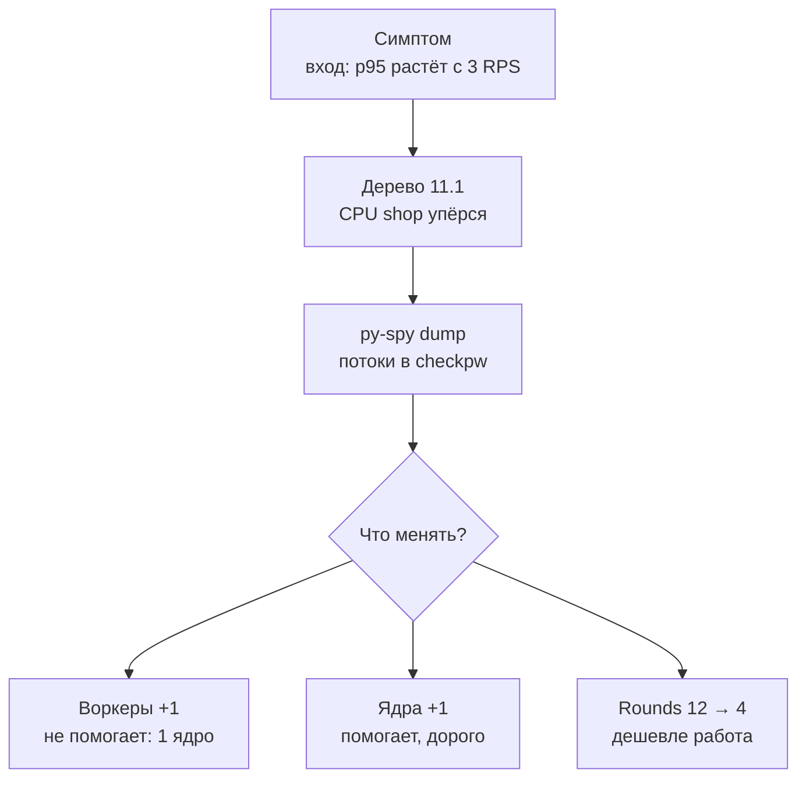

## Зачем это нужно

Ты запускаешь тест входа: пользователи по одному заходят в «Магазин». На 1 вход в секунду всё хорошо (p95 0,3 с), на 4 входа в секунду p95 уже 4,8 с, а на 6 входах в секунду 14 секунд, и в логах вперемешку ответы и тишина. При этом база почти спит, память стоит на месте. Что-то в самом приложении занимает процессор и не отдаёт его.

Так выглядит **CPU-bound** задача (CPU bound, «упирается в процессор»): время ответа определяется не ожиданием базы или сети, а тем, сколько вычислений надо сделать. Это отдельный класс узких мест со своими симптомами и своими лекарствами: тяжёлые вычисления (хеш пароля, шифрование, сжатие, разбор больших JSON, рендер), мало воркеров, низкий лимит процессора у контейнера. В этом уроке ты по методу из [урока 11.1](01-method.md) найдёшь причину медленного входа, проверишь её профилировщиком py-spy, исправишь одной настройкой и поймёшь, когда исправление ничего не даст.

Шаг проекта: в каталоге `~/perf-lab/11-bottlenecks/` ты прогонишь сценарий `login` при нарастающей нагрузке, снимешь профиль процесса py-spy, проверишь две «очевидные» гипотезы (больше воркеров, больше ядер) и одну верную (дешевле хеш), и запишешь расследование в файл `02-cpu.md` с цифрами «до» и «после».

## Что нужно знать

- Метод «симптом, гипотеза, проверка, одно изменение, повтор»: [урок 11.1](01-method.md). Скрипты `bn.js`, `set-env.sh`, `run.sh` и журнал `experiments.log` оттуда.
- Как устроен процесс с воркерами и потоками (uvicorn, `--workers`): [урок 2.3](../02-web/03-backend-anatomy.md); как работают процессы и загрузка процессора в Linux: [урок 1.3](../01-linux/03-processes-resources.md).
- Лимиты контейнера `cpus` и `mem_limit`, `docker stats`: [урок 5.4](../05-docker/04-limits-stats.md).
- Метрики процессора из cAdvisor и PromQL: [урок 7.2](../07-observability/02-promql.md), [урок 7.4](../07-observability/04-exporters.md).
- Хоккейная клюшка и предел: [урок 8.1](../08-perf-theory/01-latency-throughput.md).
- Авторизация по токену и то, что такое хеш пароля: [урок 2.2](../02-web/02-rest-json-auth.md).

## Картина целиком

Парикмахерская с одним мастером. Стрижка занимает 15 минут (это «тяжёлая работа»), и мастер принимает по очереди. Если клиенты приходят раз в 20 минут, очередей нет. Раз в 10 минут: очередь растёт без остановки, потому что мастер не успевает. Что с этим делать? Нанять второго мастера (но если кресло одно, ничего не изменится: мастера мешают друг другу), купить машинку, которая стрижёт быстрее (дешевле работа), или перестать стричь тех, кому не нужно. В «Магазине» мастер это процессор: у контейнера `shop` один `cpus: "1.0"`, то есть одно ядро, а стрижка это проверка пароля алгоритмом bcrypt, который **специально** сделан медленным.

Путь расследования на схеме:



После того как профиль подтвердил, что время уходит на проверку пароля, есть три рычага. Первые два (воркеры и ядра) меняют, сколько работы делается одновременно, третий меняет саму работу. Какой из них даст эффект, определяется не вкусом, а тем, **кто именно** ограничивает: число воркеров или квота ядер.

## Теория

### Процессор как ресурс: ядра, квота и очередь на выполнение

**Зачем это понятие.** Нагрузочный инженер должен понимать, что значит «процессор 100%», иначе он будет «лечить» то, что не болит. Загрузка одного ядра на 100% и загрузка машины из восьми ядер на 100% это совсем разные ситуации.

**Аналогия.** Ядро процессора это один кассир. Процессов, которые хотят пробивать чеки, может быть сколько угодно, а одновременно работает столько, сколько кассиров (ядер). Остальные стоят в очереди и ждут, и ОС переключает кассира между ними так быстро, что снаружи кажется, будто работают все разом. Аналогия ломается тем, что у процессора нет «затылка очереди»: ожидающие процессы занимают память и мешают друг другу, поэтому система становится медленнее, чем сумма частей.

**Как это устроено.** Процессорное время измеряется в секундах работы ядра. Если за 10 секунд процесс отработал 5 секунд на одном ядре, его загрузка 50% от одного ядра (в `docker stats` это 50%). Загрузка может превышать 100%: процесс из нескольких потоков на четырёх ядрах может показать 400%. Для контейнера действует **квота**: параметр `cpus: "1.0"` означает, что за каждые 100 мс (период CFS, Completely Fair Scheduler, планировщик Linux) контейнеру разрешено потратить суммарно не больше 100 мс процессорного времени всеми потоками вместе. Если на четырёх потоках потрачено 100 мс за 25 мс реального времени, все потоки замораживаются на оставшиеся 75 мс. Эта заморозка называется **throttling** («душение»), и её видно в метрике `container_cpu_cfs_throttled_periods_total`. Таким образом, контейнер с `cpus: "1.0"` на 64-ядерной машине всё равно получит максимум одно ядро.

Эти же секунды процессорного времени можно разложить на **user** (код приложения), **system** (ядро ОС: сеть, диск, переключения) и **iowait** (процессор простаивает, ожидая диск; формально это не загрузка). В нашем случае почти всё идёт в user.

**Разобранный пример.** Контейнер `shop` с `cpus: "1.0"` обслуживает вход. Один вход занимает ядро на 250 мс (проверка пароля). За секунду ядро может выполнить 1000 / 250 = 4 входа. Если приходит 3 входа в секунду, загрузка 75% и очереди мало. При 4 входах загрузка 100%: очереди растут. При 6 входах в секунду приходит работы на 1500 мс в секунду, а есть только 1000: каждую секунду очередь вырастает ещё на 500 мс работы. Через 10 секунд последний вход ждёт 5 секунд до начала обработки.

**Что путают.** Путают «процессор 50%» с «запас 50%»: у контейнера с лимитом это 50% **от лимита** или 50% от всей машины, смотри, какая метрика. Путают потоки и ядра: 40 потоков на одном ядре не быстрее, чем один. И путают загрузку и throttling: загрузка средняя за 30 секунд может быть 70%, а throttling 40% периодов говорит, что запросы всё равно упирались в квоту.

> **Проверь понимание:** `docker stats` показывает у `shop` 100% CPU, у PostgreSQL 15%. Контейнер `shop` имеет `cpus: "1.0"` на машине с 8 ядрами, то есть процессор ноутбука загружен на 12%. Это значит, что у вас много запаса?
>
> <details markdown="1">
> <summary>Ответ</summary>
>
> Нет. Запас есть у ноутбука, но не у контейнера: ему разрешено только одно ядро, и он его выбрал целиком. Узкое место здесь квота контейнера. Решить можно либо повысить квоту (`cpus: "2.0"`, если на машине есть свободные ядра), либо уменьшить стоимость работы.
>
> </details>

### Почему bcrypt медленный намеренно

**Зачем он существует.** Пароли нельзя хранить открытым текстом: при утечке базы все пароли станут известны. Их хранят в виде **хеша** (hash, «отпечаток»): число, полученное из пароля односторонней функцией, по которому нельзя восстановить пароль. При входе сервис хеширует введённый пароль и сравнивает с сохранённым. Но если хеш считается быстро (миллиарды в секунду, как у SHA-256), злоумышленник с украденной базой перебирает пароли быстро. Поэтому для паролей придумали специально **медленные** хеши: bcrypt, scrypt, argon2. Чем медленнее хеш, тем дороже перебор.

**Аналогия.** Замок с вращающимся барабаном, который нельзя провернуть быстрее. Честному хозяину приходится потратить четверть секунды, а вору, который пробует миллион вариантов, это дорого обходится.

**Как это устроено.** У bcrypt есть параметр **cost** (стоимость, в нашем коде `BCRYPT_ROUNDS`, число от 4 до 31). Внутри хеш выполняет 2 в степени cost итераций, поэтому каждая единица cost удваивает время. Стоимость записана внутри хеша: строка вида `$2b$12$...` означает «алгоритм 2b, cost 12». Поэтому проверка пароля (`checkpw`) всегда занимает столько времени, на какой cost создан **сохранённый хеш**, независимо от текущей настройки. Это важно: после изменения `BCRYPT_ROUNDS` старые хеши в базе остаются прежними. В коде «Магазина» это учтено: при успешном входе, если cost хеша отличается от настройки, пароль хешируется заново и сохраняется (смена применяется постепенно, у каждого пользователя при его первом успешном входе).

Библиотека bcrypt написана на C и **отпускает GIL** (глобальную блокировку интерпретатора Python, о которой чуть ниже), пока считает. Поэтому проверки пароля из разных потоков могут выполняться параллельно на разных ядрах, если ядра есть.

**Разобранный пример.** Примерное время одного `checkpw` на ядре современного ноутбука:

| cost | итераций | время |
|---|---|---|
| 4 | 16 | около 1 мс |
| 8 | 256 | около 16 мс |
| 10 | 1 024 | около 62 мс |
| 12 | 4 096 | около 250 мс |
| 14 | 16 384 | около 1 с |

Столбец «итераций» это 2 в степени cost, и время растёт ровно так же. Cost 12 это рекомендация для боевых систем 2026 года: заметная задержка для вора, но терпимая для пользователя. Вход одного человека за 250 мс незаметен, а проблема возникает, когда входят сотни людей в секунду (старт рабочего дня, акция, рассылка с «зайди и получи подарок»).

<div class="viz" data-viz="bn-bcrypt-cost" data-rounds="12" data-cpus="1"></div>

Смотри: столбики показывают, как растёт время хеша с каждой единицей cost (шкала логарифмическая, иначе малые значения не разглядеть), а справа сколько входов в секунду выдерживает такое число ядер. Подвинь cost до 4 и посмотри, как предел вырастает с 4 до тысячи входов в секунду, потом верни 12 и добавь ядер: предел растёт в точности вместе с числом ядер, но не быстрее.

**Что путают.** Думают, что понизить cost безопасно «потому что у нас же HTTPS». Это разные уровни защиты: HTTPS защищает канал, bcrypt защищает хранилище. В боевой системе cost не опускают ради скорости, а наращивают ядра или выносят вход на отдельный сервис. На нашем учебном стенде cost 4 допустим, потому что пароли там все `password`, и это настройка учебного эксперимента, а не рекомендация.

### Воркеры, потоки и GIL

**Зачем это понятие.** «Добавить воркеров» это самое частое решение при медленном приложении. Работает оно не всегда, и причины надо понимать.

**Аналогия.** Воркер это отдельная кухня с отдельными поварами; поток это повар на одной кухне. Все кухни ставят в одном здании с газовой плитой на столько-то конфорок (ядер). Больше кухонь без новых конфорок не приготовит больше блюд.

**Как это устроено.** Uvicorn запускается командой `uvicorn app.main:app --workers N`, где N берётся из `WEB_CONCURRENCY`. Он создаёт N **процессов** (воркеров): у каждого своя память, свой интерпретатор Python, свой пул соединений к базе (`DB_POOL_MAX` это размер пула **на воркер**), и свои метрики. Внутри процесса синхронные эндпоинты FastAPI (обычные `def`, как наш `login`) выполняются в **пуле потоков** (по умолчанию до 40 потоков). Потоки одного процесса делят память, но Python исполняет байт-код Python только одним потоком за раз: это **GIL** (Global Interpreter Lock). Поэтому чисто Python-вычисления не ускоряются потоками, и для параллельности на нескольких ядрах нужны отдельные процессы (воркеры). Исключение составляют операции, которые отпускают GIL: ожидание сети и базы, а также код на C вроде bcrypt.

В нашем случае bcrypt отпускает GIL, а значит, 40 потоков одного воркера уже могут занять **все** ядра, которые им разрешены. Второй воркер ничего не добавит, потому что упёрлись мы не в GIL, а в квоту контейнера: одно ядро. Если бы квота была 2 ядра, один воркер с потоками уже использовал бы оба.

**Разобранный пример.** Сравним три конфигурации для входа (стоимость cost 12, 250 мс процессорного времени на вход):

| Конфигурация | Квота контейнера | Предел входов/с |
|---|---|---|
| 1 воркер | 1 ядро | 4 |
| 2 воркера | 1 ядро | 4 (две кухни на одной конфорке) |
| 1 воркер | 2 ядра | 8 (bcrypt отпускает GIL, потоки заняли оба ядра) |
| 2 воркера | 2 ядра | 8 |

Предел определяет **наименьшее** из «сколько ядер выдали» и «сколько ядер способно занять приложение». Второй воркер полезен, когда приложение само упирается в GIL (чисто Python-работа на нескольких ядрах), а ядра свободны. Он вреден, когда ядер нет: растут память (вторая копия приложения) и число соединений к базе (два пула по 5, итого 10).

**Что путают.** Путают число воркеров с производительностью: «у нас 8 воркеров, значит, в 8 раз быстрее». Путают потоки Python с параллельностью. Забывают, что метрики и пулы у каждого воркера свои: `shop_db_pool_size` при двух воркерах покажет сумму или значения по каждому в зависимости от настройки.

> **Проверь понимание:** у контейнера `cpus: "1.0"`, проверка пароля стоит 250 мс процессора. Ты поставил `WEB_CONCURRENCY=4`. Сколько входов в секунду выдержит сервис и что будет с памятью?
>
> <details markdown="1">
> <summary>Ответ</summary>
>
> Те же 4 входа в секунду: все четыре воркера делят одно ядро. Память вырастет примерно в четыре раза (четыре копии приложения), а соединений к базе станет до 20 (четыре пула по 5). Эффект отрицательный: тот же предел, больше потребление.
>
> </details>

### Профилировщик: перестать гадать, где тратится время

**Зачем это нужно.** Метрики говорят, какой ресурс занят, но не говорят, какой **код** его занимает. Для этого нужен **профилировщик** (profiler): программа, которая смотрит, что делает процесс, и показывает, в каких функциях он проводит время.

**Аналогия.** Метрики это счётчик электроэнергии на вводе: видишь, что много, но не знаешь, что включено. Профилировщик это человек, который ходит по комнатам и записывает, что горит.

**Как это устроено.** Профилировщики бывают двух видов. **Трассирующие** встраиваются в программу и записывают каждый вызов функции: точно, но замедляют программу в разы. **Сэмплирующие** (sampling) подглядывают снаружи: много раз в секунду (по умолчанию 100) останавливают взгляд на процессе и записывают, в какой функции он сейчас находится. Если из 1000 снимков в 800 процесс был в `checkpw`, значит, 80% времени он проводит там. Они почти не замедляют программу, поэтому ими можно смотреть боевой сервис. **py-spy** это сэмплирующий профилировщик для Python. Он читает память процесса через системный вызов `ptrace` и не требует менять код. Две команды нужны нам:

- `py-spy dump --pid N`: один снимок, показывает стеки всех потоков прямо сейчас (где каждый поток находится).
- `py-spy record --pid N -d 30 -o profile.svg`: записывает 30 секунд и строит **flame graph** («пламя»): блоки, где ширина равна доле времени, а вертикаль показывает цепочку вызовов (снизу вызывающий, сверху вызванный).

Чтобы `ptrace` работал внутри контейнера, нужна специальная возможность Linux `SYS_PTRACE` (capability, разрешение на слежение за процессами). В `compose.yaml` стенда её нет (это сделано намеренно: по умолчанию контейнеру этого не разрешено), поэтому мы подключим её отдельным небольшим файлом, не меняя файлы стенда.

**Разобранный пример.** Вывод `py-spy dump` во время нагрузки на вход выглядит так (сокращённо):

```text
Process 1: /usr/local/bin/python3.14 /usr/local/bin/uvicorn app.main:app --host 0.0.0.0 --port 8000 --workers 1 --no-access-log
Python v3.14.0 (/usr/local/bin/python3.14)

Thread 1 (idle): "MainThread"
    run (uvicorn/server.py:73)
Thread 17 (active): "AnyIO worker thread"
    login (app/main.py:151)
    run (concurrent/futures/thread.py:59)
Thread 18 (active): "AnyIO worker thread"
    login (app/main.py:151)
    run (concurrent/futures/thread.py:59)
Thread 19 (active): "AnyIO worker thread"
    login (app/main.py:151)
    ...
```

Как читать: `idle` значит «поток ждёт» (главный поток слушает порт), `active` значит «поток работает». Строка `login (app/main.py:151)` это текущая функция и номер строки: `151` это та самая `bcrypt.checkpw(...)`. Если десять снимков подряд показывают десять потоков в одной строке, а остальные потоки ждут, ты нашёл, куда уходит процессор. Одного снимка недостаточно, он может поймать случайное место, поэтому смотрят серию или flame graph.

**Что путают.** Путают py-spy с отладчиком: он ничего не останавливает и не меняет. Путают «активный поток» с «использует процессор»: py-spy по умолчанию показывает потоки в состояниях, не обязательно требующих процессора; флаг `--gil` оставляет только потоки, держащие GIL. И путают «функция, где много времени» с «функция, которую надо переписать»: `checkpw` не баг, это честная работа, которую можно сделать дешевле лишь осознанным компромиссом.

### Как отличить CPU-bound от других проблем

**Зачем это нужно.** Чтобы не искать процессорное узкое место там, где его нет.

**Как это устроено.** Признаки CPU-bound сервиса:

1. Загрузка процессора контейнера близка к его лимиту, а throttling заметен.
2. Задержка растёт с нагрузкой, как хоккейная клюшка, а база и внешние сервисы **не** насыщены.
3. В профиле много времени в вычислениях (хеш, парсинг, сериализация), а не в ожидании сети.
4. Добавление ядер почти линейно увеличивает предел, а добавление воркеров при тех же ядрах нет.

Для сравнения: признаки ожидания (I/O-bound): процессор низкий, потоки в профиле в `recv`, `wait`, `select`; предел определяют пул и база.

**Разобранный пример.** Сравнение двух сценариев на 5 запросах в секунду. Вход (`login`): CPU shop 100%, throttling 70%, в профиле `checkpw`, CPU postgres 3%. Карточка товара (`/api/products/[id]`): CPU shop 15%, throttling 0, CPU postgres 20%, пул свободен. Первый ограничен процессором, второй не ограничен ничем: он просто быстрый.

**Что путают.** «Процессор 100%, значит, надо больше процессора». Иногда процессор 100% из-за ошибки (бесконечный цикл, лишний `json.dumps` на каждый запрос, логирование на уровне DEBUG), и лечится не ядрами, а исправлением. Проверка профилем отличает честную работу от ошибки.

## Практика

Стенд поднят с мониторингом, настройки по умолчанию (проверь `grep -E '^(WEB_CONCURRENCY|BCRYPT_ROUNDS)=' ~/load-tester/project/shop/.env`: `1` и `12`). Рабочий каталог `~/perf-lab/11-bottlenecks`, скрипты из урока 11.1 на месте.

### 1. Базовая линия входа

Сначала прогрей пользователей: у каждого хеш в базе сохранён со стоимостью, указанной при заполнении, и мы ещё не меняли настройку, так что прогрев пока не нужен. Прогони вход при шести нагрузках, от 1 до 6 в секунду, по 40 секунд каждая:

```bash
cd ~/perf-lab/11-bottlenecks
for r in 1 2 3 4 5 6; do ./run.sh login-before-$r SCENARIO=login RATE=$r DURATION=40s; sleep 30; done
```

Перед запуском на что смотрим: сценарий `login` (из `bn.js`) входит случайным пользователем из первых 50, ничего больше. Тайм-аут запроса в k6 по умолчанию 60 секунд, так что даже 14-секундные ответы дойдут.

Для 4 входов в секунду будет примерно такое:

```text
    http_req_duration{name:/api/login}
    ✓ 'p(50)>=0' p(50)=2.6s
    ✓ 'p(95)>=0' p(95)=4.8s
    http_req_failed
    ✓ 'rate<0.01' rate=0.00%
     dropped_iterations.......: 31     0.8/s
     iterations...............: 129    3.2/s
```

**Как читать вывод:** `p(95)=4.8s` это симптом, `iterations 3.2/s` при просимых 4 значит, что сервис выдал на 20% меньше, а `dropped_iterations` показывает, сколько входов k6 не смог даже начать. Ошибок нет: сервис не падает, он просто стоит в очереди. Собери шесть нагрузок в таблицу и сравни со своим ноутбуком. Ориентир:

| Входов в секунду | 1 | 2 | 3 | 4 | 5 | 6 |
|---|---|---|---|---|---|---|
| p95, с | 0,30 | 0,55 | 1,2 | 4,8 | 9,5 | 14,2 |

<div class="viz" data-viz="chart" data-type="line" data-x="1,2,3,4,5,6" data-x-label="Входов в секунду" data-y-label="p95, с" data-unit="с" data-explain="До двух входов в секунду задержка почти равна стоимости хеша (около 0,3 с). На трёх она ещё терпима, а после четырёх, когда нагрузка превысила предел в 4 входа в секунду, p95 растёт почти линейно с каждым добавленным входом: очередь копится всё время теста." data-series='[{"name":"p95 до исправления","values":[0.3,0.55,1.2,4.8,9.5,14.2],"unit":"с"}]'></div>

График плоский до трёх входов в секунду и резко уходит вверх с четырёх. Это та же клюшка, что в [уроке 8.1](../08-perf-theory/01-latency-throughput.md), только с пределом около четырёх. Он совпадает с расчётом: 1000 мс ядра делим на 250 мс на вход.

### 2. Сверка со второй стороной USE

Для 5 входов в секунду на минуту сними показания и убедись по дереву из урока 11.1, что это именно процессор приложения:

```bash
./run.sh login-use SCENARIO=login RATE=5 DURATION=90s &
sleep 40
P=~/perf-lab/scripts/promq.sh
S='container_label_com_docker_compose_service'
$P "sum(rate(container_cpu_usage_seconds_total{$S=\"shop\"}[30s]))"
$P "sum(rate(container_cpu_cfs_throttled_periods_total{$S=\"shop\"}[30s])) / sum(rate(container_cpu_cfs_periods_total{$S=\"shop\"}[30s]))"
$P "sum(rate(container_cpu_usage_seconds_total{$S=\"postgres\"}[30s]))"
$P "shop_db_pool_waiting"
wait
```

Разбор: `&` запускает нагрузку в фоне, `sleep 40` даёт ей прогреться, команды `$P` снимают показания в середине теста, `wait` дожидается конца прогона.

```text
  1.00
  0.68
  0.03
  0
```

**Как читать вывод:** shop использует 1,00 ядра из выданного одного (100%), в 68% периодов контейнер упирался в квоту (throttling, насыщение), postgres занят на 3%, никто не ждёт соединения. Ответ на вопрос 1 дерева диагностики «CPU shop упёрся?» это «да». Остальные ветки можно не проверять.

**Типичные ошибки:** `throttled` пустой значит, что cAdvisor не отдаёт этот счётчик (на Docker Desktop для Mac его может не быть; тогда смотри `docker stats`, там 100%); показания сняты слишком рано, до выхода на предел.

### 3. Гипотеза и профиль py-spy

Запиши гипотезу до того, как что-то менять:

> Если причина в стоимости bcrypt (250 мс на ядре, предел 4 входа/с), то при `BCRYPT_ROUNDS=4` (около 1 мс) p95 входа при 6 входах в секунду упадёт ниже 0,05 с. Если после этого p95 останется выше 1 с, причина в другом.

Теперь докажем, что процессор тратится именно на проверку пароля, а не на что-то ещё. Для этого нужен py-spy в контейнере `shop`, а ему нужно разрешение `SYS_PTRACE`. Правим не стенд, а делаем файл-надстройку `~/perf-lab/11-bottlenecks/ptrace.yaml`:

```bash
cat > ~/perf-lab/11-bottlenecks/ptrace.yaml <<'EOF'
services:
  shop:
    cap_add:
      - SYS_PTRACE
EOF
cd ~/load-tester/project/shop
export COMPOSE_FILE=compose.yaml:$HOME/perf-lab/11-bottlenecks/ptrace.yaml
docker compose up -d --force-recreate --wait shop
```

Разбор: Docker Compose умеет собирать конфигурацию из нескольких файлов, позднейшие дополняют ранние. Переменная `COMPOSE_FILE` перечисляет их через двоеточие, поэтому все следующие команды `docker compose` в этом терминале увидят и стенд, и надстройку, а сам `compose.yaml` остаётся нетронутым. `cap_add: [SYS_PTRACE]` выдаёт контейнеру право наблюдать за процессами. Это ослабление изоляции, держим его только на учебном стенде.

Запусти нагрузку на вход (в одном терминале) и посмотри на процесс (в другом):

```bash
# терминал 1
cd ~/perf-lab/11-bottlenecks && ./run.sh login-profile SCENARIO=login RATE=5 DURATION=90s
# терминал 2
cd ~/load-tester/project/shop && export COMPOSE_FILE=compose.yaml:$HOME/perf-lab/11-bottlenecks/ptrace.yaml
docker compose exec shop sh -c 'pip install -q py-spy && py-spy dump --pid 1'
```

`pip install py-spy` устанавливается внутрь запущенного контейнера и исчезнет вместе с ним. `--pid 1` это главный процесс контейнера (uvicorn). Если у тебя `WEB_CONCURRENCY=1`, рабочий код выполняется в нём же.

```text
Process 1: /usr/local/bin/python3.14 /usr/local/bin/uvicorn app.main:app --host 0.0.0.0 --port 8000 --workers 1 --no-access-log
Python v3.14.0 (/usr/local/bin/python3.14)

Thread 1 (idle): "MainThread"
    run (uvicorn/server.py:73)
Thread 17 (active): "AnyIO worker thread"
    login (app/main.py:151)
    run (concurrent/futures/thread.py:59)
Thread 18 (active): "AnyIO worker thread"
    login (app/main.py:151)
    run (concurrent/futures/thread.py:59)
Thread 19 (active): "AnyIO worker thread"
    login (app/main.py:151)
    run (concurrent/futures/thread.py:59)
Thread 20 (idle): "AnyIO worker thread"
    ...
```

**Как читать вывод:** посчитай потоки в `login (app/main.py:151)`: именно там `bcrypt.checkpw`. Повтори команду 3-4 раза с паузой: каждый раз половина и больше потоков на этой строке, остальные в `idle`. Это и есть доказательство: код не ждёт ни базу, ни сеть, он считает хеш. Для картинки запиши 30 секунд: `docker compose exec shop sh -c 'py-spy record --pid 1 -d 30 -o /tmp/p.svg'`, затем `docker compose cp shop:/tmp/p.svg ~/perf-lab/11-bottlenecks/login-flame.svg` и открой `svg` в браузере: самый широкий блок будет `checkpw`.

**Типичные ошибки:** `Permission denied` или `Error: Failed to find python version` при `dump` значит, что надстройка не подключена (`echo $COMPOSE_FILE`, потом пересоздай контейнер); `pip: command not found` значит, что в образе нет pip: используй `python -m pip install py-spy`; `Python 3.14 is not supported` значит, что версия py-spy старая: `pip install -U py-spy`; снимок показывает все потоки `idle` значит, нагрузка не идёт в этот момент.

Если `cap_add` ты не хочешь использовать, есть запасной вариант: с хоста Linux найти PID процесса контейнера (`docker top shop-shop-1`) и запустить `sudo py-spy dump --pid <PID>` от имени root. Это работает на Linux, на Mac с Docker Desktop процессы находятся внутри виртуальной машины и с хоста недоступны.

### 4. Проверка «очевидных» гипотез: больше воркеров и больше ядер

Сначала воркеры. Одно изменение, потом прогон:

```bash
cd ~/perf-lab/11-bottlenecks
./set-env.sh WEB_CONCURRENCY=2
./run.sh login-workers2 SCENARIO=login RATE=6 DURATION=40s
```

Ожидание, которое дала теория: ничего не изменится, p95 останется около 14 с, а `docker stats` покажет, что память shop выросла вдвое (около 240 МБ вместо 120 МБ). Результат подтверждает: узкое место это квота ядра, а не число воркеров. Верни `WEB_CONCURRENCY=1`.

Теперь ядра. Нужна ещё одна надстройка: `~/perf-lab/11-bottlenecks/cpus2.yaml`.

```bash
cat > ~/perf-lab/11-bottlenecks/cpus2.yaml <<'EOF'
services:
  shop:
    cpus: "2.0"
EOF
./set-env.sh WEB_CONCURRENCY=1
export COMPOSE_FILE=compose.yaml:$HOME/perf-lab/11-bottlenecks/ptrace.yaml:$HOME/perf-lab/11-bottlenecks/cpus2.yaml
cd ~/load-tester/project/shop && docker compose up -d --force-recreate --wait shop
cd ~/perf-lab/11-bottlenecks && ./run.sh login-cpus2 SCENARIO=login RATE=6 DURATION=40s
```

Вот что нового: в `cpus2.yaml` мы **переопределяем** только значение лимита, остальное берётся из `compose.yaml`. Двое ядер есть, если ноутбук имеет хотя бы четыре. Результат: предел вырос вдвое (до 8 входов в секунду), и 6 входов в секунду проходят с p95 около 0,6 с. Один воркер использовал оба ядра, потому что bcrypt отпускает GIL, и потоки пула работали параллельно. Это работающее решение, но цена его в удвоенной стоимости процессорных ядер. Верни стенд к одному ядру: `unset COMPOSE_FILE`, и в первом терминале тоже, потом `docker compose up -d --force-recreate --wait shop` из `project/shop`.

**Типичные ошибки:** после изменения `cpus` p95 не изменился значит, что надстройка не подключилась (`docker compose config | grep cpus` покажет текущее значение); на Mac с Docker Desktop у виртуальной машины может быть выдано меньше ядер, чем ты запросил (проверь в настройках Docker Desktop, раздел Resources).

### 5. Верное исправление: дешевле хеш

Это правка стоимости работы, и она ровно по гипотезе. Одно изменение:

```bash
cd ~/perf-lab/11-bottlenecks
./set-env.sh BCRYPT_ROUNDS=4
```

Но помни, что `checkpw` смотрит на cost **сохранённого** хеша, то есть у каждого пользователя пока ещё хеш на cost 12. Хеш пересчитывается при успешном входе. Значит, сначала надо один раз «прогреть» первых 50 пользователей, чтобы у них в базе лежал хеш cost 4:

```bash
for n in $(seq -w 1 50); do
  curl -s -o /dev/null -X POST localhost:8000/api/login -H 'Content-Type: application/json' \
    -d "{\"email\":\"user00${n}@shop.lab\",\"password\":\"password\"}"
done
```

Разбор: `seq -w 1 50` печатает числа от 01 до 50 с нулями слева, `user00${n}` собирает адреса `user0001@shop.lab`…`user0050@shop.lab`, `curl -s -o /dev/null` отправляет вход и выбрасывает ответ. Каждый такой вход дорогой (250 мс на проверку старого хеша, потом хеш новым cost), всего около 15 секунд. Проверка, что хеш изменился:

```bash
cd ~/load-tester/project/shop
docker compose exec -T postgres psql -U shop -d shop -c "SELECT email, left(password_hash, 7) FROM users WHERE id IN (1, 50, 51)"
```

```text
        email         |  left
----------------------+---------
 user0001@shop.lab    | $2b$04$
 user0050@shop.lab    | $2b$04$
 user0051@shop.lab    | $2b$12$
(3 rows)
```

**Как читать вывод:** `$2b$04$` это cost 4, у пользователей 1..50 хеш уже новый, у 51-го пока старый (он не входил). Наш тест использует только 1..50, поэтому достаточно.

Теперь повторный прогон при тех же шести нагрузках и в тех же условиях:

```bash
cd ~/perf-lab/11-bottlenecks
for r in 1 2 3 4 5 6; do ./run.sh login-after-$r SCENARIO=login RATE=$r DURATION=40s; sleep 20; done
```

Ожидаемо p95 на всех нагрузках около 8 мс (чуть выше стоимости хеша, плюс запрос к базе и запись сессии в Redis), ошибок нет, `iterations` равно просимым.

<div class="viz" data-viz="chart" data-type="bar" data-x="1,2,3,4,5,6" data-x-label="Входов в секунду" data-y-label="p95, мс" data-unit="мс" data-explain="Синие столбики это p95 при BCRYPT_ROUNDS=12, зелёные при 4. На шести входах в секунду разница: 14 200 мс и 8 мс." data-series='[{"name":"до: cost 12","values":[300,550,1200,4800,9500,14200],"unit":"мс"},{"name":"после: cost 4","values":[8,8,8,9,9,10],"unit":"мс"}]'></div>

Смотри: «после» практически не зависит от нагрузки в этом диапазоне, потому что предел вырос с 4 до примерно 400 входов в секунду. Столбики «до» подрастают от 0,3 до 14 секунд. Гипотеза подтвердилась по числам, записанным заранее (ниже 0,05 с).

Проверь профиль ещё раз под нагрузкой 6 входов в секунду: теперь потоки в `checkpw` редки, а CPU shop около 5%.

### 6. Вывод и коммит

Допиши `~/perf-lab/11-bottlenecks/02-cpu.md`:

```markdown
# 11.2. Процессор: вход

## Симптом
Вход: p95 0,30 с на 1/с, 4,8 с на 4/с, 14,2 с на 6/с. Ошибок нет.

## Показания
CPU shop 100% от лимита (1 ядро), throttling 68%, CPU postgres 3%, пул не ждёт.
py-spy dump: большая часть потоков в login (main.py:151) = bcrypt.checkpw.

## Гипотеза
Если причина в стоимости bcrypt (250 мс), то cost 4 снизит p95 при 6/с ниже 0,05 с.

## Что проверено
- WEB_CONCURRENCY=2: p95 не изменился (14 с), память x2. Узкое место не число воркеров.
- cpus 2.0: предел 8 входов/с, p95 при 6/с 0,6 с. Работает, но платим ядрами.
- BCRYPT_ROUNDS=4 (после прогрева 50 пользователей): p95 при 6/с 10 мс.

## Вывод
Предел входа вырос с ~4 до сотен/с. cost 4 допустим только на стенде: в проде оставляем 12, добавляем ядра или выносим вход.
```

```bash
cd ~/perf-lab
git add 11-bottlenecks results/11-login-*.txt
git commit -m "11.2: вход упирается в bcrypt, расследование и исправление"
git push
```

Оставь `BCRYPT_ROUNDS=4` для следующих уроков: вход нам больше не мешает измерениям. (В уроках 11.3-11.5 токены берутся один раз в `setup()`.)

## Сломай и почини

**Поломка:** верни cost обратно (`BCRYPT_ROUNDS=12`) и прогони вход ещё раз. Типичная ошибка в реальных проектах: «настройку вернули, значит, всё как раньше». Но хеши в базе хранят cost, с которым созданы, и пересчитываются при входе в сторону настройки.

```bash
cd ~/perf-lab/11-bottlenecks
./set-env.sh BCRYPT_ROUNDS=12
./run.sh login-regress SCENARIO=login RATE=6 DURATION=40s
```

Что произойдёт: пятьдесят пользователей с хешами cost 4 при первом входе проходят быструю проверку, затем код видит расхождение и считает новый хеш cost 12 (250 мс процессора) и записывает его в базу. Первые секунды прогона вход ещё быстрый, потом по мере пересчётов хеши становятся дорогими и p95 ползёт вверх к прежним 14 секундам. Узор «медленнее с каждой секундой теста» это подсказка: причина в хранимых данных, а не только в настройке.

**Диагностика:** `SELECT left(password_hash, 7), count(*) FROM users WHERE id <= 50 GROUP BY 1` показывает, сколько хешей на каком cost. Загрузка CPU shop растёт постепенно, по мере того как хеши пересчитываются.

**Решение:** верни `BCRYPT_ROUNDS=4`, снова прогрей пользователей циклом из шага 5 и проверь запросом выше, что у всех пятидесяти `$2b$04$`. Вывод для отчёта: изменение стоимости хеширования это не только настройка, это ещё и миграция данных.

## Словарик урока

| Термин | Простыми словами |
|---|---|
| CPU-bound | Скорость ограничивает процессор: работа это вычисления, а не ожидание |
| Квота CPU (`cpus`) | Сколько ядер контейнеру разрешено использовать суммарно |
| Throttling («душение») | Контейнер выбрал квоту за период 100 мс и заморожен до следующего |
| Хеш пароля | Односторонний «отпечаток» пароля: хранится вместо пароля, по нему нельзя восстановить исходный |
| bcrypt, cost | Медленный хеш для паролей; cost задаёт число итераций (2 в степени cost) |
| Воркер | Отдельный процесс сервера со своей памятью, пулом и метриками |
| GIL | Блокировка интерпретатора Python: байт-код одновременно исполняет только один поток |
| Профилировщик | Программа, показывающая, в каких функциях процесс проводит время |
| Сэмплирующий профилировщик | Делает моментальные снимки по 100 раз в секунду, почти не замедляя программу |
| py-spy | Сэмплирующий профилировщик для Python, подключается к запущенному процессу |
| Flame graph | Диаграмма профиля: ширина блока это доля времени, вертикаль это цепочка вызовов |
| `SYS_PTRACE` | Разрешение Linux наблюдать за чужими процессами, нужно py-spy в контейнере |
| Override-файл Compose | Дополнительный файл, который поверх основного меняет часть настроек |

## Вопросы с собеседований

Раздел для повторения: ответь вслух, потом открой ответ.

### 1. [junior] [часто] Сервис медленный, процессор упёрся в 100%. Что делаешь?

<details markdown="1">
<summary>Ответ</summary>

Сначала подтверждаю, что упёрся именно процессор приложения (использование, throttling, база свободна), потом смотрю профилировщиком, на что он тратится. Дальше выбор: сделать работу дешевле, добавить ядер или распараллелить по воркерам, если ядра есть. Решение подтверждаю повторным прогоном на тех же условиях.

**Что хотят услышать:** проверка по USE, профиль, три рычага, повторный прогон.

**Красный флаг:** «увеличу число воркеров» без анализа.

</details>

### 2. [junior] [часто] Зачем bcrypt медленный и почему это проблема для нагрузки?

<details markdown="1">
<summary>Ответ</summary>

Медленный хеш делает перебор украденной базы дорогим для злоумышленника. Но каждый вход стоит процессорное время (около 250 мс при cost 12), поэтому предел входов в секунду равен числу ядер, делённому на это время. Всплески входов могут положить сервис.

**Что хотят услышать:** защита от перебора, стоимость растёт вдвое с каждой единицей cost, предел по ядрам.

**Красный флаг:** предложение заменить на MD5 ради скорости.

</details>

### 3. [junior] [часто] Что такое воркер и всегда ли больше воркеров быстрее?

<details markdown="1">
<summary>Ответ</summary>

Воркер это отдельный процесс сервера. Больше воркеров быстрее, только если есть свободные ядра, а приложение упирается в GIL. Если квота ядра одна, воркеры делят её, а памяти и соединений к базе тратится больше.

**Что хотят услышать:** процесс, GIL, зависимость от ядер, побочные эффекты (память, пулы).

**Красный флаг:** «воркеров столько, сколько хватает памяти».

</details>

### 4. [junior] Как узнать, что контейнер упирается в лимит процессора?

<details markdown="1">
<summary>Ответ</summary>

Смотреть `docker stats` (близко к 100% от лимита) и метрику throttling: `rate(container_cpu_cfs_throttled_periods_total[30s]) / rate(container_cpu_cfs_periods_total[30s])`. Высокая доля значит, что контейнер упирался в квоту.

**Что хотят услышать:** throttling, а не только средняя загрузка.

**Красный флаг:** смотрят загрузку всей машины.

</details>

### 5. [junior] Что такое профилировщик и чем py-spy удобен на боевом сервисе?

<details markdown="1">
<summary>Ответ</summary>

Профилировщик показывает, в каких функциях программа проводит время. py-spy сэмплирующий: он снимает снимки стеков извне и почти не замедляет процесс, код менять не нужно. Он выдаёт `dump` (один снимок потоков) и `record` (flame graph).

**Что хотят услышать:** сэмплирование, мало накладных расходов, два режима.

**Красный флаг:** запускают трассирующий профилировщик на боевом сервисе.

</details>

### 6. [middle] Почему второй воркер не помог входу, а второе ядро помогло?

<details markdown="1">
<summary>Ответ</summary>

bcrypt отпускает GIL, значит, потоки одного воркера уже могут занимать столько ядер, сколько разрешено. Ограничением была квота контейнера (одно ядро): второй воркер делил то же ядро. Добавление ядра подняло предел вдвое.

**Что хотят услышать:** GIL отпускается в C-коде, различие «квота против числа процессов».

**Красный флаг:** «Python однопоточный, поэтому надо процессы» без проверки.

</details>

### 7. [middle] Как безопасно поменять cost bcrypt в боевой системе?

<details markdown="1">
<summary>Ответ</summary>

Cost хранится в хеше, поэтому старые хеши продолжают работать. Новое значение применяется при регистрации и при успешном входе (пересчёт хеша). Пользователей это не затрагивает, но нагрузка на процессор растёт по мере пересчётов; нужно заранее оценить пик и добавить ядер. Понижать cost для скорости нельзя без решения по безопасности.

**Что хотят услышать:** постепенный пересчёт, оценка нагрузки, баланс безопасности.

**Красный флаг:** массовый пересчёт всех пользователей разом.

</details>

### 8. [middle] Что такое flame graph и как его читать?

<details markdown="1">
<summary>Ответ</summary>

Диаграмма профиля: каждый блок это функция, ширина доля времени, снизу вызывающая функция, сверху вызванные. Ищут самые широкие блоки на верхних уровнях: они и есть места, где тратится время.

**Что хотят услышать:** ширина, а не высота, это время.

**Красный флаг:** принимают высокий стек за долгое выполнение.

</details>

### 9. [middle] Как отличить CPU-bound от I/O-bound нагрузки по метрикам?

<details markdown="1">
<summary>Ответ</summary>

CPU-bound: загрузка близка к лимиту, throttling, в профиле вычисления, предел растёт с ядрами. I/O-bound: процессор низкий, потоки ждут сеть или базу, предел определяют пулы, база или внешние сервисы.

**Что хотят услышать:** оба набора признаков и профиль как арбитр.

**Красный флаг:** считают всё «медленным процессором».

</details>

### 10. [на скорость] Во сколько раз растёт время bcrypt при увеличении cost на 1?

<details markdown="1">
<summary>Ответ</summary>

В два раза.

</details>

### 11. [на скорость] Что делает `py-spy dump --pid 1`?

<details markdown="1">
<summary>Ответ</summary>

Печатает один снимок стеков всех потоков процесса с PID 1: что каждый поток делает прямо сейчас.

</details>

### 12. [на скорость] Что такое throttling контейнера?

<details markdown="1">
<summary>Ответ</summary>

Заморозка контейнера до конца периода 100 мс, когда он исчерпал квоту процессорного времени.

</details>

## Проверено на версиях

Python 3.14 в образе `shop`, uvicorn, bcrypt 4.x, py-spy 0.4 (`pip install -U py-spy`, версия с поддержкой 3.14), Docker Compose v2 (`COMPOSE_FILE` через двоеточие), cAdvisor, Prometheus 3.15. Числа смоделированы по коду стенда и могут отличаться на твоём железе; форма (плоско до предела, резкий подъём после) та же. Октябрь 2026.

## Итог урока: ты умеешь

- [ ] Объяснить, что значит CPU-bound и чем квота контейнера отличается от загрузки машины.
- [ ] Показать по USE (использование, throttling, свободная база), что узкое место процессор приложения.
- [ ] Снять `py-spy dump` и найти строку, где тратится время.
- [ ] Объяснить, почему bcrypt медленный и как cost связан со временем.
- [ ] Предсказать, поможет ли больше воркеров или больше ядер, и проверить прогоном.
- [ ] Менять `BCRYPT_ROUNDS` вместе с прогревом данных и объяснить разницу «настройка против миграции».
- [ ] Подключать надстройку Compose и записывать расследование «до и после» с цифрами.

Дальше: [урок 11.3. База данных: медленный запрос, EXPLAIN, индекс, пул соединений](03-database.md), где процессор приложения свободен, а узким местом оказывается база.
