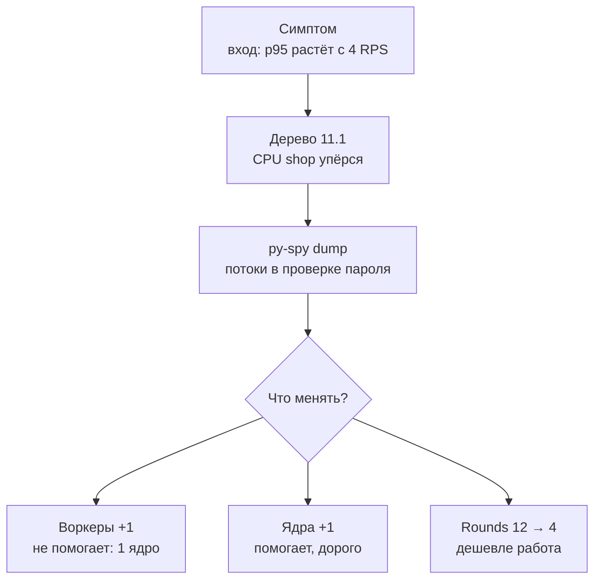

## Зачем это нужно

Ты запускаешь тест входа: пользователи по одному заходят в «Магазин». На 1 вход в секунду всё хорошо (p95 0,3 с). На 4 входа (ядро занято почти целиком) p95 уже 4,8 с, на 6 входах 14 секунд, и в логах вперемешку ответы и тишина. База почти спит, память стоит. Что-то в самом приложении занимает процессор и не отдаёт его.

Я твой наставник, и такие случаи узнаются по признакам, гадать не придётся. Такая задача называется **CPU-bound** («упирается в процессор»): время ответа определяет не ожидание базы или сети, а объём вычислений. У неё свои симптомы и свои лекарства. Виноватыми бывают тяжёлые вычисления (хеш пароля, шифрование, сжатие, разбор больших JSON), мало воркеров (отдельных процессов сервера, [урок 2.3](../02-web/03-backend-anatomy.md)) или низкий лимит процессора у контейнера. По методу из [урока 11.1](01-method.md) ты найдёшь причину медленного входа. Подтвердишь её профилировщиком (программой, которая показывает, в каком месте кода проходит время; нам нужен py-spy), исправишь одной настройкой и поймёшь, когда исправление ничего не даст.

Шаг проекта: в `~/perf-lab/11-bottlenecks/` ты прогонишь сценарий `login` при нарастающей нагрузке и снимешь профиль процесса (отчёт о том, где он тратит время) программой py-spy. Проверишь две «очевидные» гипотезы (больше воркеров, больше ядер) и одну верную (дешевле хеш), а расследование запишешь в `02-cpu.md` с цифрами «до» и «после».

## Что нужно знать

- Метод «симптом, гипотеза, проверка, одно изменение, повтор»: [урок 11.1](01-method.md). Скрипты `bn.js`, `set-env.sh`, `run.sh` и журнал `experiments.log` оттуда.
- Как устроен процесс с воркерами и потоками (uvicorn, `--workers`): [урок 2.3](../02-web/03-backend-anatomy.md); как работают процессы и загрузка процессора в Linux: [урок 1.3](../01-linux/03-processes-resources.md).
- Лимиты контейнера `cpus` и `mem_limit`, `docker stats`: [урок 5.4](../05-docker/04-limits-stats.md).
- Метрики процессора из cAdvisor и PromQL: [урок 7.2](../07-observability/02-promql.md), [урок 7.4](../07-observability/04-exporters.md).
- Хоккейная клюшка и предел: [урок 8.1](../08-perf-theory/01-latency-throughput.md).
- Авторизация по токену и то, что такое хеш пароля: [урок 2.2](../02-web/02-rest-json-auth.md).

## Картина целиком

Парикмахерская с одним мастером. Стрижка занимает 15 минут. Клиенты приходят раз в 20 минут: очереди нет. Раз в 10 минут: очередь растёт без остановки. Что делать? Нанять второго мастера (но кресло одно, и мастера только мешают друг другу), купить машинку, которая стрижёт быстрее, или не стричь тех, кому не нужно. В «Магазине» мастер это процессор: у контейнера `shop` стоит `cpus: "1.0"`, то есть одно ядро. А стрижка это проверка пароля алгоритмом bcrypt, который **специально** сделан медленным.



Когда профиль подтвердил, что время уходит на проверку пароля, остаются три рычага. Воркеры и ядра меняют, сколько работы делается одновременно, а третий меняет саму работу. Какой сработает, решает не вкус, а то, кто именно ограничивает: число воркеров или квота ядер.

## Теория

### Процессор как ресурс: ядра, квота и очередь

Контейнеру выдано одно ядро, оно загружено на 100%, а процессор ноутбука на 12%. Запас большой или нет?

Ядро это один кассир. Хотят пробивать чеки сколько угодно процессов, а работает одновременно столько, сколько кассиров (ядер). Остальные ждут, и система переключает кассира между ними так быстро, что снаружи кажется, будто работают все. Аналогия ломается там, что ожидающие процессы занимают память и мешают друг другу, поэтому система медленнее суммы частей.

Процессорное время считают в секундах работы ядра. Если за 10 секунд процесс отработал 5 секунд на одном ядре, его загрузка 50% (так показывает `docker stats`). Для процесса из нескольких потоков загрузка может быть и 400% на четырёх ядрах. У контейнера есть **квота**: `cpus: "1.0"` значит, что за каждые 100 мс (период планировщика Linux) все потоки вместе могут потратить не больше 100 мс процессорного времени. Потоки это рабочие нити внутри одного процесса, каждая делает своё дело. Если они потратили свои 100 мс за 25 мс реального времени, все потоки замирают на оставшиеся 75 мс. Это уже знакомое тебе «душение» (throttling, [урок 11.1](01-method.md)), его видно в `container_cpu_cfs_throttled_periods_total`. Значит, контейнер с `cpus: "1.0"` на машине с 64 ядрами всё равно получит одно ядро, а точнее его долю, равную целому ядру.

Посчитаем для входа. Один вход держит ядро 250 мс (так мерили на стенде: проверка пароля с cost 12). В секунде 1000 мс, значит, ядро успевает 1000 / 250 = 4 входа. Придут 3 входа в секунду: работы на 750 мс, загрузка 75%, очереди почти нет. Придут 4: загрузка 100%, запаса нет.

> **Прикинь сам:** приходят 6 входов в секунду. Сколько работы это в каждой секунде и что будет с очередью через 10 секунд?
{: .predict}

Шесть входов по 250 мс это 1500 мс работы, а в секунде у ядра только 1000. Каждую секунду очередь вырастает ещё на 500 мс работы. За 10 секунд набегает 5000 мс, и последний вход ждёт 5 секунд до начала обработки. Тест идёт дольше десяти секунд, очередь копится дальше, и p95 к концу минуты уходит с 0,3 к 14 секундам.

Осторожно: «50% загрузки» не значит «запас 50%». Смотри, от чего процент: от лимита контейнера или от всей машины. И средняя загрузка за 30 секунд может быть 70%, а throttling 40% периодов говорит, что запросы всё равно упирались в квоту.

> **Проверь понимание:** `docker stats` показывает у `shop` 100% CPU, процессор ноутбука с 8 ядрами загружен на 12%. Запаса много?
>
> <details markdown="1">
> <summary>Ответ</summary>
>
> Нет. Запас есть у ноутбука, но не у контейнера: ему разрешено одно ядро, и он выбрал его целиком. Либо повышай квоту (`cpus: "2.0"`, если ядра свободны), либо снижай стоимость работы.
>
> </details>

> **Главное:** у контейнера есть своя квота ядер, и 100% от неё значит «запаса нет», сколько бы ни было свободно на машине.
{: .key}

Мы знаем, что вход упёрся в ядро. Но почему один вход так дорог?

### Почему bcrypt медленный намеренно

Пароли нельзя хранить открытым текстом: утечёт база, утекут все пароли. Их хранят в виде **хеша** («отпечатка»): числа, полученного из пароля односторонней функцией, по которой пароль не восстановить ([урок 2.2](../02-web/02-rest-json-auth.md)). При входе сервис хеширует введённый пароль и сравнивает с сохранённым. Но если хеш считается быстро, как обычные быстрые хеши (миллиарды в секунду), вор с украденной базой перебирает пароли так же быстро. Поэтому для паролей придумали **медленные** хеши, самый известный из них bcrypt. Честному хозяину четверть секунды ничего не стоит, а вору, который пробует миллион вариантов, это дорого.

У bcrypt есть параметр **cost** (стоимость, у нас `BCRYPT_ROUNDS`, число от 4 до 31). Внутри хеш делает 2 в степени cost кругов перемешивания (итераций): при cost 4 это 16 кругов, при cost 5 уже 32. Каждая единица cost удваивает время. Cost записан в самом хеше: строка `$2b$12$...` значит «алгоритм 2b, cost 12». Поэтому проверка пароля (функция `checkpw` из библиотеки bcrypt) занимает столько, на какой cost создан **сохранённый** хеш, а не сколько стоит сейчас в настройке. После смены `BCRYPT_ROUNDS` старые хеши в базе остаются прежними. «Магазин» это учитывает: при успешном входе, если cost хеша отличается от настройки, пароль хешируется заново. Смена применяется постепенно, у каждого пользователя при первом успешном входе.

| cost | итераций | время одного `checkpw` |
|---|---|---|
| 4 | 16 | около 1 мс |
| 8 | 256 | около 16 мс |
| 10 | 1 024 | около 62 мс |
| 12 | 4 096 | около 250 мс |
| 14 | 16 384 | около 1 с |

Итераций столько, сколько 2 в степени cost, и время растёт так же. Cost 12 сегодня обычный выбор для боевых систем: на современном ядре это около четверти секунды, вор заметит, пользователь нет. Один вход за 250 мс незаметен. Беда начинается, когда входят сотни людей в секунду: утро рабочего дня, акция, рассылка «зайди и получи подарок».

<div class="viz" data-viz="bn-bcrypt-cost" data-rounds="12" data-cpus="1"></div>

Столбики показывают, как растёт время хеша с каждой единицей cost (шкала сжатая: каждое деление в десять раз, иначе малые значения не видны), а справа, сколько входов в секунду выдерживает выбранное число ядер. Опусти cost до 4: вход стоит 1 мс, и предел вырастет с 4 до тысячи входов (1000 мс / 1 мс). Верни 12 и добавляй ядра: предел растёт ровно вместе с ядрами, но не быстрее.

Осторожно: не думай, что cost можно понизить, «потому что у нас же HTTPS». HTTPS защищает канал, bcrypt защищает хранилище. В боевой системе cost не опускают ради скорости, а наращивают ядра или выносят вход на отдельный сервис. На учебном стенде cost 4 допустим, потому что все пароли `password`. Я однажды опустил cost перед тестом, забыл вернуть и неделю смотрел цифры входа, которые были в сотни раз лучше правды. Записывай каждую такую правку в журнал.

> **Главное:** bcrypt медленный нарочно, его цена растёт вдвое с каждой единицей cost, и при входах сотнями в секунду она съедает процессор.
{: .key}

Один вход съедает ядро, значит, добавим воркеров? Посмотрим, почему не всё так просто.

### Воркеры, потоки и GIL

«Добавим воркеров» говорят первым делом. Работает это не всегда, и причины надо понимать.

Воркер это отдельная кухня со своими поварами, поток это повар на одной кухне. Все кухни стоят в одном здании с плитой на столько-то конфорок (ядер). Больше кухонь без новых конфорок не приготовит больше блюд.

Uvicorn (программа, которая принимает запросы и раздаёт их коду сервиса) запускается как `uvicorn app.main:app --workers N`, где N берётся из `WEB_CONCURRENCY`. Он создаёт N **процессов** (воркеров): у каждого своя память, свой интерпретатор Python, свой пул соединений к базе (`DB_POOL_MAX` это размер пула **на воркер**) и свои метрики. Внутри процесса обычные обработчики адресов FastAPI (`def`, как наш `login`) работают в пуле потоков, по умолчанию до 40. Потоки делят память, но Python исполняет свой код только одним потоком за раз: это **GIL** (глобальная блокировка интерпретатора), как один ключ от кабинета на всех.

Поэтому чисто Python-вычисления потоками не ускорить, и для параллельности нужны отдельные процессы. Есть исключение: на время ожидания сети и базы, а также пока работает код на C (как bcrypt), поток отдаёт ключ другим. Это и значит «отпускает GIL».

Для нас это ключ. bcrypt отпускает GIL, значит, потоки одного воркера уже могут занять **все** разрешённые ядра. Второй воркер ничего не добавит, потому что мы упёрлись не в GIL, а в квоту контейнера. Отличить просто: при упоре в квоту throttling высок, а при упоре в GIL ядра свободны, но загрузка контейнера не растёт.

| Конфигурация | Квота контейнера | Предел входов/с |
|---|---|---|
| 1 воркер | 1 ядро | 4 |
| 2 воркера | 1 ядро | 4 (две кухни на одной конфорке) |
| 1 воркер | 2 ядра | 8 (потоки заняли оба ядра) |
| 2 воркера | 2 ядра | 8 |

Предел определяет меньшее из двух: сколько ядер выдали и сколько способно занять приложение. Второй воркер полезен, когда приложение упирается в GIL (чистый Python на нескольких ядрах) и ядра свободны. А когда ядер нет, он вреден: растут память (вторая копия) и число соединений к базе (два пула по 5, итого 10).

> **Прикинь сам:** у контейнера `cpus: "1.0"`, проверка пароля стоит 250 мс. Ты поставил `WEB_CONCURRENCY=4`. Сколько входов в секунду выдержит сервис и что будет с памятью?
{: .predict}

Те же 4 входа в секунду: четыре воркера делят одно ядро. Память вырастет примерно в четыре раза, а соединений к базе станет до 20 (четыре пула по 5). Эффект отрицательный: тот же предел, больше потребление.

Осторожно: число воркеров не равно производительности («восемь воркеров, значит, в восемь раз быстрее»). И потоки Python не равны параллельности. Метрики и пулы у каждого воркера свои.

> **Главное:** воркеры помогают, только когда ядра свободны и приложение упирается в GIL, а при квоте в одно ядро они лишь едят память.
{: .key}

Мы рассуждали о воркерах и ядрах, но пока не доказали, что время уходит именно в проверку пароля. Чем это доказать?

### Профилировщик: перестать гадать, где тратится время

Метрики говорят, какой ресурс занят, но не какой **код** его занимает. Для этого есть **профилировщик**: программа, которая смотрит, что делает процесс, и показывает, где он проводит время. Метрики это счётчик электричества на вводе: видишь, что много, но не знаешь, что включено. Профилировщик ходит по комнатам и записывает, что горит.

Бывают два вида. Трассирующие записывают каждый вызов функции: точно, но замедляют программу в разы. **Сэмплирующие** подглядывают снаружи: сто раз в секунду смотрят, в какой функции сейчас процесс. Если из 1000 снимков в 800 он был в `checkpw`, значит, 80% времени он там. Они почти не тормозят программу, поэтому ими смотрят даже боевой сервис.

> **Прикинь сам:** за 2 секунды py-spy сделал 200 снимков, в 160 из них процесс был в `checkpw`. Какую долю времени он там проводит?
{: .predict}

Сто шестьдесят из двухсот это 0,8, то есть 80%. Остальные 20% времени уходят на всё прочее: разбор запроса, базу, ответ. Так «где тратится время» превращается в число. **py-spy** это сэмплирующий профилировщик для Python. Он подглядывает за процессом снаружи и не требует менять код (для этого в Linux есть возможность `ptrace`, разрешение одной программе читать память другой). Нужны две команды. `py-spy dump --pid N` делает один снимок: что сейчас выполняет каждый поток (цепочка вызовов, её называют стеком). `py-spy record --pid N -d 30 -o profile.svg` пишет 30 секунд и рисует картинку **flame graph** («пламя»): ширина блока равна доле времени, а вертикаль показывает цепочку вызовов (снизу вызывающий, сверху вызванный).

Чтобы `ptrace` работал в контейнере, нужна возможность Linux `SYS_PTRACE` (разрешение следить за процессами). В `compose.yaml` стенда её нет намеренно, поэтому мы подключим её отдельным небольшим файлом, не трогая файлы стенда.

Вот сокращённый вывод `py-spy dump` во время нагрузки на вход:

```text
Process 1: /usr/local/bin/python3.14 /usr/local/bin/uvicorn app.main:app --host 0.0.0.0 --port 8000 --workers 1 --no-access-log
Python v3.14.0 (/usr/local/bin/python3.14)

Thread 1 (idle): "MainThread"
    run (uvicorn/server.py:73)
Thread 17 (active): "AnyIO worker thread"
    login (app/main.py:157)
    run (concurrent/futures/thread.py:59)
Thread 18 (active): "AnyIO worker thread"
    login (app/main.py:157)
    run (concurrent/futures/thread.py:59)
Thread 19 (active): "AnyIO worker thread"
    login (app/main.py:157)
    ...
```

`idle` значит «поток ждёт» (главный слушает порт), `active` значит «работает». Строка `login (app/main.py:157)` это функция и номер строки: на 157-й стоит `bcrypt.checkpw(...)`. Если десять снимков подряд показывают десять потоков на одной строке, а остальные ждут, ты нашёл, куда уходит процессор. Одного снимка мало, он может попасть в случайное место, поэтому смотрят серию или flame graph.

Осторожно: py-spy не отладчик, он ничего не останавливает. «Активный» поток не всегда значит «ест процессор»: флаг `--gil` оставляет только потоки, держащие GIL. И «функция, где много времени» не значит «функцию надо переписать»: `checkpw` не баг, а честная работа, которую можно удешевить только осознанным компромиссом.

> **Главное:** сэмплирующий профилировщик показывает, в какой строке кода проходит время, и серия снимков превращает догадку в доказательство.
{: .key}

Профиль показал `checkpw`. Как отличить такую проблему от других, похожих на неё?

### Как отличить CPU-bound от других проблем

Важно не искать процессорное узкое место там, где его нет. У сервиса, упёршегося в процессор, четыре признака. Загрузка близка к лимиту, а throttling заметен. Задержка растёт «клюшкой», а база и внешние сервисы не насыщены. В профиле много времени в вычислениях (хеш, разбор, упаковка ответа в JSON), а не в ожидании сети. И добавление ядер почти линейно поднимает предел, а добавление воркеров при тех же ядрах нет.

У ожидания (I/O-bound, упирается в сеть и диск) картина обратная. Процессор низкий, потоки в профиле стоят в `recv`, `wait`, `select` (это ждут ответа по сети), а предел определяют пул и база.

Сравни два маршрута на 5 запросах в секунду. Вход: CPU shop 100%, throttling 70%, в профиле `checkpw`, CPU postgres 3%. Карточка товара (`/api/products/{id}`): CPU shop 15%, throttling 0, CPU postgres 20%, пул свободен. Первый упёрся в процессор, второй не упёрся ни во что: он просто быстрый.

Осторожно: «процессор 100%, значит, нужно больше процессора» верно не всегда. Иногда он занят из-за ошибки: бесконечный цикл, лишний `json.dumps` (превращение данных в текст JSON) на каждый запрос, логи на уровне DEBUG. Лечится это не ядрами, а исправлением, и отличает одно от другого профиль.

> **Главное:** CPU-bound узнают по четырём признакам вместе, и сначала профиль, потом ядра.
{: .key}

Вернёмся к распродаже. Вход при тройной нагрузке встал в одно ядро из-за пароля. Теперь у тебя есть три рычага и способ выбрать нужный числами.

## Практика

Стенд поднят с мониторингом, настройки по умолчанию (проверь `grep -E '^(WEB_CONCURRENCY|BCRYPT_ROUNDS)=' ~/load-tester/project/shop/.env`: `1` и `12`). Рабочий каталог `~/perf-lab/11-bottlenecks`, скрипты из урока 11.1 на месте.

### 1. Базовая линия входа

Сначала прогрей пользователей: у каждого хеш в базе сохранён со стоимостью, указанной при заполнении, и мы ещё не меняли настройку, так что прогрев пока не нужен. Прогони вход при шести нагрузках, от 1 до 6 в секунду, по 40 секунд каждая:

```bash
cd ~/perf-lab/11-bottlenecks
for r in 1 2 3 4 5 6; do ./run.sh login-before-$r SCENARIO=login RATE=$r DURATION=40s; sleep 30; done
```

Перед запуском на что смотрим: сценарий `login` (из `bn.js`) входит случайным пользователем из первых 50, ничего больше. Тайм-аут запроса в k6 по умолчанию 60 секунд, так что даже 14-секундные ответы дойдут.

Для 4 входов в секунду будет примерно такое:

```text
    http_req_duration{name:/api/login}
    ✓ 'p(50)>=0' p(50)=2.6s
    ✓ 'p(95)>=0' p(95)=4.8s
    http_req_failed
    ✓ 'rate<0.01' rate=0.00%
     dropped_iterations.......: 31     0.8/s
     iterations...............: 129    3.2/s
```

**Как читать вывод:** `p(95)=4.8s` это симптом, `iterations 3.2/s` при просимых 4 значит, что сервис выдал на 20% меньше, а `dropped_iterations` показывает, сколько входов k6 не смог даже начать. Ошибок нет: сервис не падает, он просто стоит в очереди. Собери шесть нагрузок в таблицу и сравни со своим ноутбуком. Ориентир:

| Входов в секунду | 1 | 2 | 3 | 4 | 5 | 6 |
|---|---|---|---|---|---|---|
| p95, с | 0,30 | 0,55 | 1,2 | 4,8 | 9,5 | 14,2 |

<div class="viz" data-viz="chart" data-type="line" data-x="1,2,3,4,5,6" data-x-label="Входов в секунду" data-y-label="p95, с" data-unit="с" data-explain="До двух входов в секунду задержка почти равна стоимости хеша (около 0,3 с). На трёх она ещё терпима, а после четырёх, когда нагрузка превысила предел в 4 входа в секунду, p95 растёт почти линейно с каждым добавленным входом: очередь копится всё время теста." data-series='[{"name":"p95 до исправления","values":[0.3,0.55,1.2,4.8,9.5,14.2],"unit":"с"}]'></div>

График плоский до трёх входов в секунду и резко уходит вверх с четырёх. Это та же клюшка, что в [уроке 8.1](../08-perf-theory/01-latency-throughput.md), только с пределом около четырёх. Он совпадает с расчётом: 1000 мс ядра делим на 250 мс на вход.

### 2. Сверка со второй стороной USE

Для 5 входов в секунду на минуту сними показания и убедись по дереву из урока 11.1, что это именно процессор приложения:

```bash
./run.sh login-use SCENARIO=login RATE=5 DURATION=90s &
sleep 40
P=~/perf-lab/scripts/promq.sh
S='container_label_com_docker_compose_service'
$P "sum(rate(container_cpu_usage_seconds_total{$S=\"shop\"}[30s]))"
$P "sum(rate(container_cpu_cfs_throttled_periods_total{$S=\"shop\"}[30s])) / sum(rate(container_cpu_cfs_periods_total{$S=\"shop\"}[30s]))"
$P "sum(rate(container_cpu_usage_seconds_total{$S=\"postgres\"}[30s]))"
$P "shop_db_pool_waiting"
wait
```

Разбор: `&` запускает нагрузку в фоне, `sleep 40` даёт ей прогреться, команды `$P` снимают показания в середине теста, `wait` дожидается конца прогона.

```text
  1.00
  0.68
  0.03
  0
```

**Как читать вывод:** shop использует 1,00 ядра из выданного одного (100%), в 68% периодов контейнер упирался в квоту (throttling, насыщение), postgres занят на 3%, никто не ждёт соединения. Ответ на вопрос 1 дерева диагностики «CPU shop упёрся?» это «да». Остальные ветки можно не проверять.

**Типичные ошибки:** `throttled` пустой значит, что cAdvisor не отдаёт этот счётчик (на Docker Desktop для Mac его может не быть; тогда смотри `docker stats`, там 100%); показания сняты слишком рано, до выхода на предел.

### 3. Гипотеза и профиль py-spy

Запиши гипотезу до того, как что-то менять:

> Если причина в стоимости bcrypt (250 мс на ядре, предел 4 входа/с), то при `BCRYPT_ROUNDS=4` (около 1 мс) p95 входа при 6 входах в секунду упадёт ниже 0,05 с. Если после этого p95 останется выше 1 с, причина в другом.

Теперь докажем, что процессор тратится именно на проверку пароля, а не на что-то ещё. Для этого нужен py-spy в контейнере `shop`, а ему нужно разрешение `SYS_PTRACE`. Правим не стенд, а делаем файл-надстройку `~/perf-lab/11-bottlenecks/ptrace.yaml`:

```bash
cat > ~/perf-lab/11-bottlenecks/ptrace.yaml <<'EOF'
services:
  shop:
    cap_add:
      - SYS_PTRACE
EOF
cd ~/load-tester/project/shop
export COMPOSE_FILE=compose.yaml:$HOME/perf-lab/11-bottlenecks/ptrace.yaml
docker compose up -d --force-recreate --wait shop
```

Разбор: Docker Compose умеет собирать конфигурацию из нескольких файлов, позднейшие дополняют ранние. Переменная `COMPOSE_FILE` перечисляет их через двоеточие, поэтому все следующие команды `docker compose` в этом терминале увидят и стенд, и надстройку, а сам `compose.yaml` остаётся нетронутым. `cap_add: [SYS_PTRACE]` выдаёт контейнеру право наблюдать за процессами. Это ослабление изоляции, держим его только на учебном стенде.

Запусти нагрузку на вход (в одном терминале) и посмотри на процесс (в другом):

```bash
# терминал 1
cd ~/perf-lab/11-bottlenecks && ./run.sh login-profile SCENARIO=login RATE=5 DURATION=90s
# терминал 2
cd ~/load-tester/project/shop && export COMPOSE_FILE=compose.yaml:$HOME/perf-lab/11-bottlenecks/ptrace.yaml
docker compose exec shop sh -c 'pip install -q py-spy && py-spy dump --pid 1'
```

`pip install py-spy` устанавливается внутрь запущенного контейнера и исчезнет вместе с ним. `--pid 1` это главный процесс контейнера (uvicorn). Если у тебя `WEB_CONCURRENCY=1`, рабочий код выполняется в нём же.

```text
Process 1: /usr/local/bin/python3.14 /usr/local/bin/uvicorn app.main:app --host 0.0.0.0 --port 8000 --workers 1 --no-access-log
Python v3.14.0 (/usr/local/bin/python3.14)

Thread 1 (idle): "MainThread"
    run (uvicorn/server.py:73)
Thread 17 (active): "AnyIO worker thread"
    login (app/main.py:157)
    run (concurrent/futures/thread.py:59)
Thread 18 (active): "AnyIO worker thread"
    login (app/main.py:157)
    run (concurrent/futures/thread.py:59)
Thread 19 (active): "AnyIO worker thread"
    login (app/main.py:157)
    run (concurrent/futures/thread.py:59)
Thread 20 (idle): "AnyIO worker thread"
    ...
```

**Как читать вывод:** посчитай потоки в `login (app/main.py:157)`: именно там `bcrypt.checkpw`. Повтори команду 3-4 раза с паузой: каждый раз половина и больше потоков на этой строке, остальные в `idle`. Это и есть доказательство: код не ждёт ни базу, ни сеть, он считает хеш. Для картинки запиши 30 секунд: `docker compose exec shop sh -c 'py-spy record --pid 1 -d 30 -o /tmp/p.svg'`, затем `docker compose cp shop:/tmp/p.svg ~/perf-lab/11-bottlenecks/login-flame.svg` и открой `svg` в браузере: самый широкий блок будет `checkpw`.

**Типичные ошибки:** `Permission denied` или `Error: Failed to find python version` при `dump` значит, что надстройка не подключена (`echo $COMPOSE_FILE`, потом пересоздай контейнер); `pip: command not found` значит, что в образе нет pip: используй `python -m pip install py-spy`; `Python 3.14 is not supported` значит, что версия py-spy старая: `pip install -U py-spy`; снимок показывает все потоки `idle` значит, нагрузка не идёт в этот момент.

Если `cap_add` ты не хочешь использовать, есть запасной вариант: с хоста Linux найти PID процесса контейнера (`docker top shop-shop-1`) и запустить `sudo py-spy dump --pid <PID>` от имени root. Это работает на Linux, на Mac с Docker Desktop процессы находятся внутри виртуальной машины и с хоста недоступны.

### 4. Проверка «очевидных» гипотез: больше воркеров и больше ядер

Сначала воркеры. Одно изменение, потом прогон:

```bash
cd ~/perf-lab/11-bottlenecks
./set-env.sh WEB_CONCURRENCY=2
./run.sh login-workers2 SCENARIO=login RATE=6 DURATION=40s
```

Ожидание, которое дала теория: ничего не изменится, p95 останется около 14 с, а `docker stats` покажет, что память shop выросла вдвое (около 240 МБ вместо 120 МБ). Результат подтверждает: узкое место это квота ядра, а не число воркеров. Верни `WEB_CONCURRENCY=1`.

Теперь ядра. Нужна ещё одна надстройка: `~/perf-lab/11-bottlenecks/cpus2.yaml`.

```bash
cat > ~/perf-lab/11-bottlenecks/cpus2.yaml <<'EOF'
services:
  shop:
    cpus: "2.0"
EOF
./set-env.sh WEB_CONCURRENCY=1
export COMPOSE_FILE=compose.yaml:$HOME/perf-lab/11-bottlenecks/ptrace.yaml:$HOME/perf-lab/11-bottlenecks/cpus2.yaml
cd ~/load-tester/project/shop && docker compose up -d --force-recreate --wait shop
cd ~/perf-lab/11-bottlenecks && ./run.sh login-cpus2 SCENARIO=login RATE=6 DURATION=40s
```

Вот что нового: в `cpus2.yaml` мы **переопределяем** только значение лимита, остальное берётся из `compose.yaml`. Двое ядер есть, если ноутбук имеет хотя бы четыре. Результат: предел вырос вдвое (до 8 входов в секунду), и 6 входов в секунду проходят с p95 около 0,6 с. Один воркер использовал оба ядра, потому что bcrypt отпускает GIL, и потоки пула работали параллельно. Это работающее решение, но цена его в удвоенной стоимости процессорных ядер. Верни стенд к одному ядру: `unset COMPOSE_FILE`, и в первом терминале тоже, потом `docker compose up -d --force-recreate --wait shop` из `project/shop`.

**Типичные ошибки:** после изменения `cpus` p95 не изменился значит, что надстройка не подключилась (`docker compose config | grep cpus` покажет текущее значение); на Mac с Docker Desktop у виртуальной машины может быть выдано меньше ядер, чем ты запросил (проверь в настройках Docker Desktop, раздел Resources).

### 5. Верное исправление: дешевле хеш

Это правка стоимости работы, и она ровно по гипотезе. Одно изменение:

```bash
cd ~/perf-lab/11-bottlenecks
./set-env.sh BCRYPT_ROUNDS=4
```

Но помни, что `checkpw` смотрит на cost **сохранённого** хеша, то есть у каждого пользователя пока ещё хеш на cost 12. Хеш пересчитывается при успешном входе. Значит, сначала надо один раз «прогреть» первых 50 пользователей, чтобы у них в базе лежал хеш cost 4:

```bash
for n in $(seq -w 1 50); do
  curl -s -o /dev/null -X POST localhost:8000/api/login -H 'Content-Type: application/json' \
    -d "{\"email\":\"user00${n}@shop.lab\",\"password\":\"password\"}"
done
```

Разбор: `seq -w 1 50` печатает числа от 01 до 50 с нулями слева, `user00${n}` собирает адреса `user0001@shop.lab`…`user0050@shop.lab`, `curl -s -o /dev/null` отправляет вход и выбрасывает ответ. Каждый такой вход дорогой (250 мс на проверку старого хеша, потом хеш новым cost), всего около 15 секунд. Проверка, что хеш изменился:

```bash
cd ~/load-tester/project/shop
docker compose exec -T postgres psql -U shop -d shop -c "SELECT email, left(password_hash, 7) FROM users WHERE id IN (1, 50, 51)"
```

```text
        email         |  left
----------------------+---------
 user0001@shop.lab    | $2b$04$
 user0050@shop.lab    | $2b$04$
 user0051@shop.lab    | $2b$12$
(3 rows)
```

**Как читать вывод:** `$2b$04$` это cost 4, у пользователей 1..50 хеш уже новый, у 51-го пока старый (он не входил). Наш тест использует только 1..50, поэтому достаточно.

Теперь повторный прогон при тех же шести нагрузках и в тех же условиях:

```bash
cd ~/perf-lab/11-bottlenecks
for r in 1 2 3 4 5 6; do ./run.sh login-after-$r SCENARIO=login RATE=$r DURATION=40s; sleep 20; done
```

Ожидаемо p95 на всех нагрузках около 8 мс (чуть выше стоимости хеша, плюс запрос к базе и запись сессии в Redis), ошибок нет, `iterations` равно просимым.

<div class="viz" data-viz="chart" data-type="bar" data-x="1,2,3,4,5,6" data-x-label="Входов в секунду" data-y-label="p95, мс" data-unit="мс" data-explain="Синие столбики это p95 при BCRYPT_ROUNDS=12, зелёные при 4. На шести входах в секунду разница: 14 200 мс и 8 мс." data-series='[{"name":"до: cost 12","values":[300,550,1200,4800,9500,14200],"unit":"мс"},{"name":"после: cost 4","values":[8,8,8,9,9,10],"unit":"мс"}]'></div>

Смотри: «после» практически не зависит от нагрузки в этом диапазоне, потому что предел вырос с 4 до примерно 400 входов в секунду. Столбики «до» подрастают от 0,3 до 14 секунд. Гипотеза подтвердилась по числам, записанным заранее (ниже 0,05 с).

Проверь профиль ещё раз под нагрузкой 6 входов в секунду: теперь потоки в `checkpw` редки, а CPU shop около 5%.

### 6. Вывод и коммит

Допиши `~/perf-lab/11-bottlenecks/02-cpu.md`:

```markdown
# 11.2. Процессор: вход

## Симптом
Вход: p95 0,30 с на 1/с, 4,8 с на 4/с, 14,2 с на 6/с. Ошибок нет.

## Показания
CPU shop 100% от лимита (1 ядро), throttling 68%, CPU postgres 3%, пул не ждёт.
py-spy dump: большая часть потоков в login (main.py:157) = bcrypt.checkpw.

## Гипотеза
Если причина в стоимости bcrypt (250 мс), то cost 4 снизит p95 при 6/с ниже 0,05 с.

## Что проверено
- WEB_CONCURRENCY=2: p95 не изменился (14 с), память x2. Узкое место не число воркеров.
- cpus 2.0: предел 8 входов/с, p95 при 6/с 0,6 с. Работает, но платим ядрами.
- BCRYPT_ROUNDS=4 (после прогрева 50 пользователей): p95 при 6/с 10 мс.

## Вывод
Предел входа вырос с ~4 до сотен/с. cost 4 допустим только на стенде: в проде оставляем 12, добавляем ядра или выносим вход.
```

```bash
cd ~/perf-lab
git add 11-bottlenecks results/11-login-*.txt
git commit -m "11.2: вход упирается в bcrypt, расследование и исправление"
git push
```

Оставь `BCRYPT_ROUNDS=4` для следующих уроков: вход нам больше не мешает измерениям. (В уроках 11.3-11.5 токены берутся один раз в `setup()`.)

> Профиль py-spy выглядит как стена незнакомых функций? Вставь нейросети самые верхние строки и спроси, что делает каждая функция и почему она занимает столько времени. Ответ проверь по своей гипотезе и по `BCRYPT_ROUNDS`: после правки доля этой функции в профиле должна упасть.
{: .ai}

## Сломай и почини

**Поломка:** верни cost обратно (`BCRYPT_ROUNDS=12`) и прогони вход ещё раз. Типичная ошибка в реальных проектах: «настройку вернули, значит, всё как раньше». Но хеши в базе хранят cost, с которым созданы, и пересчитываются при входе в сторону настройки.

```bash
cd ~/perf-lab/11-bottlenecks
./set-env.sh BCRYPT_ROUNDS=12
./run.sh login-regress SCENARIO=login RATE=6 DURATION=40s
```

Что произойдёт: пятьдесят пользователей с хешами cost 4 при первом входе проходят быструю проверку, затем код видит расхождение и считает новый хеш cost 12 (250 мс процессора) и записывает его в базу. Первые секунды прогона вход ещё быстрый, потом по мере пересчётов хеши становятся дорогими и p95 ползёт вверх к прежним 14 секундам. Узор «медленнее с каждой секундой теста» это подсказка: причина в хранимых данных, а не только в настройке.

**Диагностика:** `SELECT left(password_hash, 7), count(*) FROM users WHERE id <= 50 GROUP BY 1` показывает, сколько хешей на каком cost. Загрузка CPU shop растёт постепенно, по мере того как хеши пересчитываются.

**Решение:** верни `BCRYPT_ROUNDS=4`, снова прогрей пользователей циклом из шага 5 и проверь запросом выше, что у всех пятидесяти `$2b$04$`. Вывод для отчёта: изменение стоимости хеширования это не только настройка, это ещё и миграция данных.

## ИИ в помощь

Нейросеть хорошо объясняет профили и незнакомые функции, но может подтолкнуть к «очевидному» ложному решению, например к росту числа воркеров. Общие правила: [ИИ-помощник](../ai.md).

**Задача:** прочитать профиль py-spy.

```text
Я профилирую сервис FastAPI (стенд «Магазин», один воркер), py-spy top показывает:
<вставь первые 15 строк py-spy top или py-spy dump>
Нагрузка: вход пользователей, 6 запросов в секунду, p95 около 14 секунд, процессор контейнера shop около 100% одного ядра.
Объясни, что делает каждая из верхних функций, какая из них тратит время и почему. Предложи две
проверяемые гипотезы и как опровергнуть каждую одним прогоном. Скажи, чего по этим данным сказать нельзя.
```
{: .wrap}

**Проверь ответ:** гипотезу проверь своим опытом: поменяй одну настройку (`BCRYPT_ROUNDS`) и сравни p95 и профиль. Типичные ошибки: совет «добавить воркеров» там, где ядро одно (воркеры поделят то же ядро), и выдуманные флаги `py-spy`, сверь с `py-spy --help`.

**Задача:** объяснить, почему «снизить cost хеша» небезопасно для боевой системы.

```text
В учебном стенде я снизил BCRYPT_ROUNDS с 12 до 4, чтобы тест входа не упирался в процессор.
Объясни простыми словами, что делает cost у bcrypt, зачем он нарочно медленный, чем это опасно
в настоящем сервисе и что сделать вместо снижения (кэш сессий, токены, масштабирование). Ответ без формул.
```
{: .wrap}

**Проверь ответ:** сверь с теорией урока: cost 12 около 250 мс, каждая единица удваивает время. Типичная ошибка: рекомендация «убрать хеширование для скорости», что опасно.

В чат не вставляй настоящие хеши паролей и содержимое `.env`: замени их на `<HASH>` и `<SECRET>`.

## Словарик урока

| Термин | Простыми словами |
|---|---|
| CPU-bound | Скорость ограничивает процессор: работа это вычисления, а не ожидание |
| Квота CPU (`cpus`) | Сколько ядер контейнеру разрешено использовать суммарно |
| Throttling («душение») | Контейнер выбрал квоту за период 100 мс и заморожен до следующего |
| Хеш пароля | Односторонний «отпечаток» пароля: хранится вместо пароля, по нему нельзя восстановить исходный |
| bcrypt, cost | Медленный хеш для паролей; cost задаёт число итераций (2 в степени cost) |
| Воркер | Отдельный процесс сервера со своей памятью, пулом и метриками |
| GIL | Блокировка интерпретатора Python: байт-код одновременно исполняет только один поток |
| Профилировщик | Программа, показывающая, в каких функциях процесс проводит время |
| Сэмплирующий профилировщик | Делает моментальные снимки по 100 раз в секунду, почти не замедляя программу |
| py-spy | Сэмплирующий профилировщик для Python, подключается к запущенному процессу |
| Flame graph | Диаграмма профиля: ширина блока это доля времени, вертикаль это цепочка вызовов |
| `SYS_PTRACE` | Разрешение Linux наблюдать за чужими процессами, нужно py-spy в контейнере |
| Override-файл Compose | Дополнительный файл, который поверх основного меняет часть настроек |

## Вопросы с собеседований

Раздел для повторения: ответь вслух, потом открой ответ.



## Проверено на версиях

Python 3.14 в образе `shop`, uvicorn, bcrypt 4.x, py-spy 0.4 (`pip install -U py-spy`, версия с поддержкой 3.14), Docker Compose v2 (`COMPOSE_FILE` через двоеточие), cAdvisor, Prometheus 3.15. Числа смоделированы по коду стенда и могут отличаться на твоём железе; форма (плоско до предела, резкий подъём после) та же. Октябрь 2026.

## Итог урока: ты умеешь

- [ ] Объяснить, что значит CPU-bound и чем квота контейнера отличается от загрузки машины.
- [ ] Показать по USE (использование, throttling, свободная база), что узкое место процессор приложения.
- [ ] Снять `py-spy dump` и найти строку, где тратится время.
- [ ] Объяснить, почему bcrypt медленный и как cost связан со временем.
- [ ] Предсказать, поможет ли больше воркеров или больше ядер, и проверить прогоном.
- [ ] Менять `BCRYPT_ROUNDS` вместе с прогревом данных и объяснить разницу «настройка против миграции».
- [ ] Подключать надстройку Compose и записывать расследование «до и после» с цифрами.
- [ ] Показать нейросети профиль py-spy с контекстом и проверить её гипотезу одним изменением и повторным прогоном.

Дальше: [урок 11.3. База данных: медленный запрос, EXPLAIN, индекс, пул соединений](03-database.md), где процессор приложения свободен, а узким местом оказывается база.
