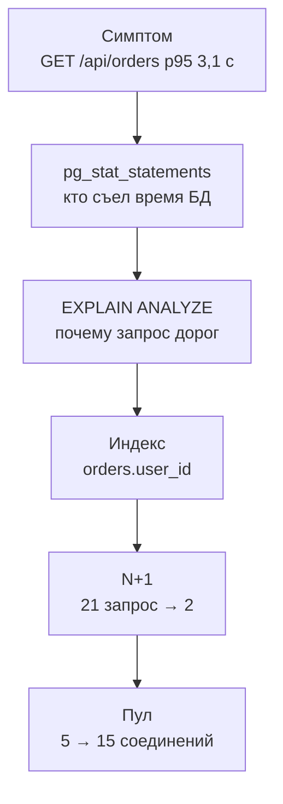

## Зачем это нужно

В [уроке 11.1](01-method.md) ты снял базовую линию «Магазина» и записал гипотезу: на 30 визитах в секунду страдает база, самый медленный маршрут это `GET /api/orders` (p95 3,1 с). В этом уроке ты её проверишь и починишь, а заодно увидишь, как узкое место переезжает: уберёшь одну причину, и вылезет следующая.

База данных это самое частое узкое место веб-сервисов. Причина проста: приложение можно запустить в десяти копиях, а база обычно одна, и все копии стоят в очереди к ней. Типичные болезни у всех одни и те же: запрос читает всю таблицу вместо одной строки (нет индекса), запрос повторяется сотни раз там, где хватило бы одного (проблема N+1), все соединения заняты и новые запросы ждут (мал пул). Каждая лечится по-своему, и главное умение здесь: сначала **найти** виновника по измерению, а не по догадке.

Шаг проекта: в `~/perf-lab/11-bottlenecks/` ты по очереди найдёшь три причины (через `pg_stat_statements`, `EXPLAIN ANALYZE` и метрики пула), исправишь каждую одним изменением, после каждого пересчитаешь предел системы и запишешь таблицу «что поменяли, что стало» в `03-database.md`.

## Что нужно знать

- Метод и скрипты `bn.js`, `set-env.sh`, `run.sh`, базовая линия: [урок 11.1](01-method.md).
- SQL: `SELECT`, `WHERE`, `JOIN`, индексы, `EXPLAIN` на уровне «создавал и удалял»: [урок 2.4](../02-web/04-sql-basics.md).
- Как бэкенд ходит в базу через пул соединений: [урок 2.3](../02-web/03-backend-anatomy.md); как работает пул под нагрузкой: [урок 8.2](../08-perf-theory/02-queues-littles-law.md).
- Метрики пула `shop_db_pool_*` и `shop_db_connection_wait_seconds`: [урок 7.2](../07-observability/02-promql.md), дашборд [урок 7.3](../07-observability/03-grafana.md).
- Закон Литтла (сколько соединений нужно при данной нагрузке): [урок 8.2](../08-perf-theory/02-queues-littles-law.md).
- Стенд: PostgreSQL 18.6 с расширением `pg_stat_statements` и `cpus: "1.0"` у контейнера базы, пул `DB_POOL_MAX=5` на воркер.

## Картина целиком

Библиотека с одним библиотекарем. Читатель просит «все мои заказы». Если в библиотеке нет каталога по читателям, библиотекарь идёт вдоль всех 200 000 полок и смотрит каждую карточку: «Не ваша... не ваша... не ваша...» (полный перебор, `Seq Scan`). Это долго и ест время единственного библиотекаря. С каталогом по читателям он сразу идёт к нужной полке (индекс). Но есть вторая беда: для каждого из 20 заказов читателя библиотекарь ещё раз ходит в хранилище за списком товаров, вместо того чтобы принести все 20 за раз (N+1). И третья: у входа всего 5 окошек, и если библиотекарь занят, люди стоят в очереди у окошек (пул соединений).

Путь расследования:



Каждый шаг вытекает из предыдущего. Сначала узнаём, **какой запрос** дорог, потом **почему**, чиним, и после каждого исправления снова меряем: узкое место сдвигается на следующий ресурс.

## Теория

### Как устроен запрос к базе и откуда берётся время

**Зачем это понятие.** Чтобы понять, чем «дорогой» запрос отличается от «дешёвого», надо знать, на что база тратит время. Иначе слова «база тормозит» остаются словами.

**Аналогия.** Заказ в ресторане. Время складывается из ожидания официанта (очередь к соединению), работы повара (процессор базы) и того, сколько продуктов надо достать с полок (чтение страниц данных). Быстрее всего блюдо, для которого всё лежит под рукой.

**Как это устроено.** Запрос проходит четыре стадии. Его принимает **соединение** (connection): отдельный процесс PostgreSQL на каждое соединение, и их число ограничено (`max_connections=100` у нас). **Планировщик** (planner) выбирает **план** выполнения: как искать строки (перебрать таблицу целиком или пойти по индексу), в каком порядке соединять таблицы. **Исполнитель** читает данные: таблица хранится **страницами** по 8 КБ (`8 kB page`). Если страницы нужной таблицы уже в памяти (в `shared buffers`), чтение быстрое (`hit`), если нет, читается с диска (`read`, на порядок медленнее). Затем результат передаётся клиенту. Время запроса это процессорное время на сравнение и сортировку, плюс чтение страниц, плюс ожидание блокировок.

Приложение в «Магазине» берёт соединение из **пула** (pool): набора заранее открытых соединений, которыми пользуются по очереди. Открывать соединение к PostgreSQL дорого (десятки миллисекунд), поэтому их держат и переиспользуют.

**Разобранный пример.** Запрос списка заказов в «Магазине» (из кода `main.py`):

```text
SELECT id, status, total, created_at FROM orders
WHERE user_id = 42 ORDER BY created_at DESC, id DESC LIMIT 20
```

Таблица `orders` содержит 200 000 строк, примерно по 200 заказов на каждого из 1000 пользователей. Нужно найти 200 строк пользователя 42, отсортировать по дате и взять 20. Без индекса база не знает, где лежат эти 200 строк, поэтому читает **все** 200 000 (это и 1575 страниц по 8 КБ, около 12 МБ) и по каждой проверяет `user_id = 42`. Время около 20 мс процессорного времени на каждый вызов. С индексом база заходит в дерево по значению 42, получает адреса 200 нужных строк и читает только их.

**Что путают.** Думают, что «20 мс это быстро». Для одного запроса быстро, но один визит покупателя делает такой запрос один раз, а при 30 визитах в секунду это 30 × 22 мс = 660 мс процессора базы в секунду, то есть две трети единственного ядра ушли на один запрос. Стоимость запроса надо умножать на частоту.

### pg_stat_statements: кто съел время базы

**Зачем это существует.** Логи медленных запросов показывают запросы дольше порога (у нас 200 мс), но самый вредный запрос может быть быстрым и частым. Нужен учёт по всем запросам: сколько раз вызван, сколько суммарно времени отработал.

**Аналогия.** Банковская выписка: важны не только крупные покупки, но и мелкие регулярные платежи, которые за месяц набегают в большую сумму.

**Как это устроено.** Расширение `pg_stat_statements` (в стенде включено, `track=all`) ведёт таблицу-учёт: каждому **нормализованному** запросу (значения заменены на `$1`, `$2`, чтобы запросы с разными параметрами считались одним) соответствует строка с полями: `calls` (сколько раз вызван), `total_exec_time` (суммарное время, мс), `mean_exec_time` (среднее, мс), `rows` (сколько строк отдано), `shared_blks_hit` и `shared_blks_read` (страницы из памяти и с диска). Главная сортировка для поиска узкого места: по `total_exec_time`, так как именно суммарное время занимает базу. Счётчики накапливаются с момента запуска (или последнего `pg_stat_statements_reset()`), поэтому **перед замером их сбрасывают**, иначе в таблице исторический мусор.

**Разобранный пример.** После минуты теста mix с нагрузкой 30 визитов в секунду (до исправлений) запрос:

```sql
SELECT left(query, 60) AS query, calls, round(total_exec_time) AS total_ms,
       round(mean_exec_time::numeric, 1) AS mean_ms, rows
FROM pg_stat_statements WHERE query NOT LIKE '%pg_stat%'
ORDER BY total_exec_time DESC LIMIT 5;
```

даёт примерно такое:

```text
                            query                             | calls | total_ms | mean_ms | rows
--------------------------------------------------------------+-------+----------+---------+--------
 SELECT id, status, total, created_at FROM orders WHERE user_ |  1612 |    51270 |    31.8 |  32240
 SELECT oi.order_id, oi.product_id, p.name, oi.qty, oi.price  | 32240 |     4590 |     0.1 | 64480
 SELECT id, name, price, category_id, stock FROM products WHE |  1672 |     2210 |     1.3 |   1672
 INSERT INTO orders (user_id, status, total) VALUES ($1, $2,  |  1670 |     1650 |     1.0 |   1670
 SELECT p.id, p.name, p.price, p.category_id, p.stock FROM pr |  1672 |     1480 |     0.9 | 33440
```

Как читать: сначала `total_ms`. Верхний запрос (список заказов) забрал 51 270 мс из примерно 60 000 мс общей работы базы за минуту (при одном ядре это вся доступная минута): около 85% времени. Его среднее 31,8 мс (вместе с конкуренцией за процессор) в сотни раз выше, чем у остальных. Второй по списку запрос `order_items` вызван 32 240 раз при `mean 0,1 мс`: суммарно он съел мало, но его **число вызовов** (20 на каждый HTTP-запрос списка заказов) это отпечаток N+1. Если делить `calls` второго на `calls` первого: 32 240 / 1 612 = 20. Это подсказка для следующего шага.

**Что путают.** Сортируют по `mean_exec_time` и выбирают «самый медленный» запрос, а на деле он вызван три раза. Или сортируют по `calls` и находят самый частый, а он стоит микросекунды. Для поиска узкого места сначала `total_exec_time`, потом смотрят, из чего он складывается: из дороговизны (`mean`) или частоты (`calls`).

> **Проверь понимание:** запрос A: 10 000 вызовов, `mean` 0,5 мс. Запрос B: 20 вызовов, `mean` 120 мс. Какой нагрузит базу сильнее и какой стоит оптимизировать первым?
>
> <details markdown="1">
> <summary>Ответ</summary>
>
> A: 10 000 × 0,5 = 5 000 мс. B: 20 × 120 = 2 400 мс. Больше времени у A, хотя каждый его вызов быстрый. Но вопрос «оптимизировать первым» зависит от того, что видит пользователь: если B стоит на критичном маршруте, он ощущается медленнее. Для нагрузки на базу смотрят суммарное время, для задержки пользователя смотрят `mean` и p95 маршрута.
>
> </details>

### EXPLAIN ANALYZE: почему запрос дорог

**Зачем это нужно.** `pg_stat_statements` говорит, что запрос дорог. Но почему и что менять, показывает план.

**Аналогия.** Маршрутный лист курьера: сначала зайти туда, потом сюда. `EXPLAIN` показывает маршрут, который выбрал планировщик, а `EXPLAIN ANALYZE` ещё и сообщает, сколько фактически заняла каждая остановка.

**Как это устроено.** `EXPLAIN` показывает план без выполнения, с оценками. `EXPLAIN (ANALYZE, BUFFERS)` **выполняет запрос** и добавляет реальные время, число строк и страниц. Осторожно: `ANALYZE` на `INSERT` или `UPDATE` реально изменит данные, оборачивай такие в транзакцию с откатом. План это дерево узлов, читать его надо снизу вверх (внутренние узлы выполняются первыми). Основные узлы доступа:

- **Seq Scan** (последовательное чтение): читает всю таблицу и фильтрует. Нормален для маленьких таблиц и когда нужна большая доля строк. Плох, когда нужна малая доля большой таблицы.
- **Index Scan / Bitmap Index Scan**: идёт по индексу к нужным строкам. Bitmap сначала собирает адреса страниц, потом читает их по порядку: удобно, когда строк много, но не большинство.

Ключевые поля: `cost` (условные единицы оценки планировщика, сравнимы только между планами одного запроса), `rows` (оценка), `actual time` (миллисекунды, первое и последнее значение), `Rows Removed by Filter` (сколько строк прочитано и **отброшено**: главный признак напрасной работы), `Buffers: shared hit=... read=...` (страницы из памяти и с диска).

**Разобранный пример.** План списка заказов **до индекса**:

```text
Limit  (cost=4075.12..4075.17 rows=20 width=28) (actual time=19.84..19.85 rows=20 loops=1)
  Buffers: shared hit=1575
  ->  Sort  (cost=4075.12..4075.62 rows=200 width=28) (actual time=19.83..19.84 rows=20 loops=1)
        Sort Key: created_at DESC, id DESC
        Sort Method: top-N heapsort  Memory: 27kB
        ->  Seq Scan on orders  (cost=0.00..4070.00 rows=200 width=28) (actual time=0.03..19.62 rows=200 loops=1)
              Filter: (user_id = 42)
              Rows Removed by Filter: 199800
              Buffers: shared hit=1575
Planning Time: 0.12 ms
Execution Time: 19.90 ms
```

Читаем снизу вверх. **Seq Scan on orders** с фильтром `user_id = 42`: база прочитала всю таблицу, строки пользователя нашлись 200, а `Rows Removed by Filter: 199800` значит, что **199 800 строк прочитаны зря** (99,9% работы). `Buffers: shared hit=1575` это 1575 страниц из памяти. Дальше `Sort` сортирует найденные 200 строк (метод top-N, берёт только 20 лучших), `Limit` отдаёт 20. Время 19,9 мс: почти всё в Seq Scan (19,62 мс).

Главный вывод одной строкой: нужна малая доля большой таблицы (200 из 200 000), а база читает всю. Лечение: индекс по `user_id`.

**Что путают.** Путают `cost` со временем: это условные единицы, их сравнивают между планами. Путают оценочные `rows` с фактическими: большая разница между ними (например, оценка 1, реально 50 000) означает устаревшую статистику, и лечат это командой `ANALYZE`. И не замечают, что `EXPLAIN ANALYZE` на самом деле запускает запрос.

### Индекс: каталог, который надо поддерживать

**Зачем это существует.** Без индекса поиск строки по значению это просмотр всей таблицы: чем больше таблица, тем дольше. Индекс превращает поиск в проход по дереву: время растёт не с размером таблицы, а с его логарифмом.

**Аналогия.** Предметный указатель в конце книги: слово, страницы. Вместо чтения всей книги ты открываешь указатель и идёшь на три нужные страницы. Цена: указатель надо поддерживать. Каждая новая страница в книге требует обновить указатель, и он занимает место. Аналогия ломается тем, что индекс PostgreSQL это сбалансированное дерево (B-tree), его обновление чуть дороже простой записи в конец.

**Как это устроено.** Индекс по `user_id` это отдельная структура, где значения `user_id` отсортированы, а рядом лежат адреса строк. Поиск `user_id = 42` проходит дерево за 3-4 шага и находит адреса 200 строк. Дальше база читает именно эти строки. Побочные эффекты:

- **Запись дороже**: каждый `INSERT` в `orders` теперь обновляет и индекс. На нашем масштабе это доли миллисекунды, но на таблице с индексами «на всякий случай» запись заметно замедляется.
- **Место**: индекс по `integer` на 200 000 строк занимает около 4-5 МБ.
- **Не всегда используется**: если нужна большая доля таблицы, планировщик всё равно выберет Seq Scan, и это правильно.
- **Составной индекс** `(user_id, created_at DESC, id DESC)` умеет отдавать строки уже в нужном порядке, избавляя от сортировки: для нашего запроса это ещё лучше, но для 200 строк на пользователя разница крошечная.

Команда создания: `CREATE INDEX orders_user_id_idx ON orders(user_id);`. На боевой таблице используют `CREATE INDEX CONCURRENTLY`: он не блокирует запись во время построения (обычный `CREATE INDEX` блокирует запись в таблицу, и в магазине в разгар дня это простой). После создания полезно выполнить `ANALYZE orders;`: обновить статистику, чтобы планировщик точнее оценивал строки.

**Разобранный пример.** План того же запроса **после индекса**:

```text
Limit  (cost=219.30..219.35 rows=20 width=28) (actual time=0.61..0.62 rows=20 loops=1)
  Buffers: shared hit=193
  ->  Sort  (cost=219.30..219.80 rows=200 width=28) (actual time=0.61..0.61 rows=20 loops=1)
        Sort Key: created_at DESC, id DESC
        Sort Method: top-N heapsort  Memory: 27kB
        ->  Bitmap Heap Scan on orders  (cost=5.20..215.00 rows=200 width=28) (actual time=0.12..0.52 rows=200 loops=1)
              Recheck Cond: (user_id = 42)
              Heap Blocks: exact=190
              Buffers: shared hit=193
              ->  Bitmap Index Scan on orders_user_id_idx  (cost=0.00..5.15 rows=200 width=0) (actual time=0.08..0.08 rows=200 loops=1)
                    Index Cond: (user_id = 42)
                    Buffers: shared hit=3
Planning Time: 0.15 ms
Execution Time: 0.65 ms
```

Сравниваем: время 19,9 мс стало 0,65 мс (в 30 раз), страниц прочитано 193 вместо 1575 (в 8 раз), `Rows Removed by Filter` исчез. Узел `Bitmap Index Scan` прошёл по индексу (3 страницы), собрал адреса 200 строк, а `Bitmap Heap Scan` прочитал 190 нужных страниц таблицы (строки каждого пользователя разбросаны по таблице, поэтому страниц много). Цена индекса: запись стала на доли миллисекунды дороже.

**Что путают.** «Создам индекс на каждый столбец»: так замедляют запись и пухнет память. Индекс создают под конкретный частый запрос, который показала статистика. И ещё: «индекс создан, а запрос всё равно медленный», потому что планировщик не использует его (причины: устаревшая статистика, тип в условии не совпадает, функция над столбцом `WHERE lower(email) = ...`).

### N+1: сто маленьких вместо двух больших

**Зачем это понятие.** Это самая частая ошибка в коде работы с базой, и в `pg_stat_statements` она видна как запрос с огромным числом вызовов.

**Аналогия.** Нужно купить 20 продуктов. N+1 это 20 отдельных походов в магазин (по одному продукту) плюс первый поход за списком. Правильно: один поход со списком из 20 пунктов.

**Как это устроено.** Код получает список из N заказов (один запрос), а потом в цикле по каждому заказу делает ещё один запрос за его товарами: `1 + N` запросов вместо двух. У «Магазина» это переключается настройкой `BUG_N_PLUS_ONE` (по умолчанию `1`, ошибка включена): при `1` код делает 1 запрос + 20 запросов по заказам (21 запрос), при `0` один запрос заказов и один `WHERE oi.order_id = ANY(...)` со всеми заказами сразу (2 запроса). Каждый из 20 отдельных запросов быстр (0,1 мс), но у каждого есть накладные расходы: сетевой круг до базы, разбор, блокировка соединения. На нагрузке они превращаются в большую долю процессорного времени и долгое удержание соединения из пула.

**Разобранный пример.** Для одного вызова `GET /api/orders` (20 заказов):

| Вариант | Запросов к БД | Круги до базы | Соединение занято |
|---|---|---|---|
| `BUG_N_PLUS_ONE=1` | 21 | 21 | около 8-10 мс на пустой базе (21 круг по 0,3-0,4 мс) |
| `BUG_N_PLUS_ONE=0` | 2 | 2 | около 1 мс |

При 30 визитах в секунду разница: 30 × 20 = 600 лишних запросов к базе в секунду. Для базы с процессором 1 ядро на каждый такой запрос уходит около 0,1-0,15 мс, то есть 60-90 мс процессора в секунду (до 9% ядра), плюс время, пока соединение занято. В `pg_stat_statements` N+1 узнаётся по соотношению: `calls` запроса второго уровня делится на `calls` первого и даёт ровно число элементов (у нас 20).

**Что путают.** Считают N+1 проблемой «медленных запросов». Но каждый запрос **быстрый**: поэтому он не попадает в лог медленных запросов, и его не видно, пока не посмотришь на число вызовов. И считают, что N+1 лечится индексом: индекс по `order_id` уже есть, и каждый отдельный запрос быстр, лечится это **сменой количества запросов**.

### Пул соединений: сколько окошек и как долго они заняты

**Зачем это существует.** Каждое соединение к PostgreSQL это отдельный процесс на сервере (несколько мегабайт памяти и работа планировщика ОС). Тысяча соединений тормозит базу сама по себе. Поэтому приложение держит небольшой набор соединений (**пул**) и раздаёт их запросам по очереди. Но маленький пул становится узким местом: пока все заняты, новые запросы ждут.

**Аналогия.** Пять кассовых окон в банке и сколько угодно клиентов. Если обслуживание одного занимает 115 мс, окна в сумме обработают 5 / 0,115 = 43 клиента в секунду. Больше никак: остальные ждут в зале. Если зал вместимости ограничен (таймаут), часть клиентов уходит с отказом.

**Как это устроено.** В «Магазине» пул настраивается переменными: `DB_POOL_MIN=1`, `DB_POOL_MAX=5` (на каждый воркер), `DB_POOL_TIMEOUT=5` секунд. Запрос берёт соединение (если свободного нет, ждёт), выполняет работу и возвращает. Если ждать пришлось дольше 5 секунд, он получает ошибку (503 «database pool timeout»). Метрики: `shop_db_pool_size` (сколько соединений открыто), `shop_db_pool_available` (сколько свободно), `shop_db_pool_waiting` (сколько запросов **сейчас ждут**), `shop_db_connection_wait_seconds` (гистограмма: сколько запрос ждал соединения). Связь с законом Литтла из [урока 8.2](../08-perf-theory/02-queues-littles-law.md): среднее число занятых соединений = частота запросов × время удержания соединения. Если на 40 итераций в секунду приходится 115 мс удержания, в среднем занято 4,6 соединения из 5. Остаётся запас в 0,4, и любой всплеск превращается в очередь.

<div class="viz" data-viz="pool" data-size="5" data-duration="115" data-rate="50" data-timeout="5000"></div>

Смотри: пять соединений, запросы приходят чаще, чем те освобождаются (пять по 115 мс это максимум около 43 в секунду, а приходит 50), поэтому растёт очередь ожидающих. Очередь не рассосётся, пока нагрузка выше предела, а запросы, прождавшие дольше таймаута, получают отказ. Попробуй поставить размер 15: тот же поток пройдёт без очереди.

**Разобранный пример.** Критичное наблюдение: время **удержания** соединения складывается из работы запроса **и ожидания базой своего процессора**. Если процессор базы занят на 100%, каждый запрос делается дольше, соединение удерживается дольше, и пул из 5 соединений насыщается при меньшей нагрузке. Поэтому очередь в пуле часто **следствие** медленной базы, а не самостоятельная причина. Правило: прежде чем увеличивать пул, проверь процессор базы. Если база упёрлась в процессор, увеличение пула лишь переместит очередь внутрь базы: соединений станет больше, а ядро то же.

Максимум соединений ограничен и базой: `max_connections=100`. Пул у каждого воркера свой, поэтому `WEB_CONCURRENCY × DB_POOL_MAX` не должно превышать сотню минус запас для мониторинга и администрирования. 15 соединений на один воркер это нормально, 15 на 8 воркеров (120) уже нет.

**Что путают.** «Пул мал, раздуем до 100» делает хуже: сто конкурирующих запросов на одном процессоре базы выполняются все медленнее, а не быстрее. Для маленькой базы оптимум обычно в пределах (число ядер × 2) + число дисков, а дальше помогает **ограничить** конкуренцию и очередь складывать в приложении. Путают также `pool waiting` (мгновенная очередь) и `connection_wait_seconds` (сколько в среднем ждали): первая метрика показывает **сейчас**, вторая **как долго**.

### Узкое место переезжает

Три исправления из этого урока меняют предел системы ступенями. Расчётные пределы по итерациям mix (визитам):

| Состояние | Предел CPU БД | Предел пула (5) | Предел CPU shop | Предел системы |
|---|---|---|---|---|
| Исходно | около 31 | около 43 | около 67 | 31 (CPU БД) |
| + индекс `orders.user_id` | около 45 | около 43 | около 67 | около 43-45 (БД и пул рядом) |
| + `BUG_N_PLUS_ONE=0` | около 55 | около 60 | около 67 | около 55 (CPU БД) |
| + `DB_POOL_MAX=15` | около 55 | около 85 | около 67 | около 55-67 |

Виджет считает те же ступени и рисует загрузку трёх ресурсов. Включи по очереди индекс и исправление N+1 и подвинь пул:

<div class="viz" data-viz="bn-limits" data-index="0" data-fixed="0" data-pool="5" data-load="40"></div>

Линия, которая первой достигает 100%, и есть узкое место. На нагрузке 40 исходная система давно за пределом (процессор базы), после индекса запас остаётся скромным, а после остальных правок ограничивающим становится уже что-то другое. Число после «DB_POOL_MAX» важно: если ты поднимешь пул, не починив процессор базы, предел не сдвинется.

## Практика

Стенд с мониторингом, `BCRYPT_ROUNDS=4` после прошлого урока (вход нам не мешает) и прогретые пользователи. Остальные настройки по умолчанию: `DB_POOL_MAX=5`, `BUG_N_PLUS_ONE=1`, индекса `orders_user_id_idx` нет. Проверь:

```bash
cd ~/load-tester/project/shop
grep -E '^(DB_POOL_MAX|BUG_N_PLUS_ONE|BCRYPT_ROUNDS)=' .env
docker compose exec -T postgres psql -U shop -d shop -c "SELECT indexname FROM pg_indexes WHERE tablename='orders'"
```

```text
DB_POOL_MAX=5
BUG_N_PLUS_ONE=1
BCRYPT_ROUNDS=4
       indexname
-----------------
 orders_pkey
(1 row)
```

Если в списке есть `orders_user_id_idx`, удали его: `docker compose exec -T postgres psql -U shop -d shop -c "DROP INDEX orders_user_id_idx"`. Удобно сделать псевдоним для работы с базой:

```bash
alias psqlshop='docker compose -f ~/load-tester/project/shop/compose.yaml exec -T postgres psql -U shop -d shop'
```

### 1. Базовая линия на 40 визитах

Сегодня удобнее вести расследование на нагрузке 40: она выше предела, симптом заметен. Прогон и база сразу после него:

```bash
cd ~/perf-lab/11-bottlenecks
psqlshop -c "SELECT pg_stat_statements_reset();"
./run.sh db-base SCENARIO=mix RATE=40 DURATION=60s
```

`pg_stat_statements_reset()` обнуляет учёт, поэтому цифры после него относятся только к нашему прогону. Результат ориентировочно: p95 6,2 с, выполнено 26,9 визита в секунду, ошибок 7% (503 «database pool timeout» через 5 с).

### 2. Кто съел время базы

```bash
psqlshop -c "SELECT left(query, 60) AS query, calls, round(total_exec_time) AS total_ms, round(mean_exec_time::numeric,1) AS mean_ms FROM pg_stat_statements WHERE query NOT LIKE '%pg_stat%' ORDER BY total_exec_time DESC LIMIT 5;"
```

Вывод аналогичен показанному в теории. **Как читать вывод:** верхний запрос это `SELECT ... FROM orders WHERE user_id = ...`, он забрал большую часть суммарного времени; второй `SELECT oi.order_id ... FROM order_items` имеет число вызовов в 20 раз больше. Запиши обе подсказки: «orders: дорогой запрос» и «order_items: N+1».

Затем проверь процессор и пул:

```bash
P=~/perf-lab/scripts/promq.sh; S='container_label_com_docker_compose_service'
$P "sum(rate(container_cpu_usage_seconds_total{$S=\"postgres\"}[30s]))"
$P "shop_db_pool_waiting"
$P "histogram_quantile(0.95, sum by (le) (rate(shop_db_connection_wait_seconds_bucket[30s])))"
```

Эти запросы нужно выполнять **во время** прогона, поэтому запусти прогон на 90 секунд в одном терминале и снимай показания в другом. Типичные значения: процессор postgres 1,00, `pool waiting` 3-4, p95 ожидания соединения около 0,4 с на 30 визитах и около 4,8 с на 40 (почти до таймаута). По дереву из 11.1: процессор shop не упёрт, ждут соединения, процессор базы упёрт: **запросы к БД**.

### 3. EXPLAIN ANALYZE: почему

Возьми пользователя с заказами и посмотри план:

```bash
psqlshop -c "EXPLAIN (ANALYZE, BUFFERS) SELECT id, status, total, created_at FROM orders WHERE user_id = 42 ORDER BY created_at DESC, id DESC LIMIT 20;"
```

Разбор: `EXPLAIN (ANALYZE, BUFFERS)` выполняет запрос и печатает план с реальными временем и страницами (запрос только читает, поэтому ничего не меняет). Ожидаемый вывод это план из теории: `Seq Scan on orders`, `Rows Removed by Filter: 199800`, `Execution Time` около 20 мс.

**Как читать вывод:** сначала самый глубокий узел (с наибольшим отступом): `Seq Scan`. В нём `Rows Removed by Filter: 199800` значит, что работа почти вся напрасная. Время самого запроса (`Execution Time`) умножь на частоту: 40 визитов/с × 20 мс = 800 мс процессора базы в секунду, а у неё в секунде 1000 мс.

**Типичные ошибки:** `ERROR: relation "orders" does not exist` значит, что подключился не к базе `shop` (проверь `-d shop`); план показывает `Index Scan` значит, что индекс уже создан (удали и повтори); `time` в плане вдвое больше на первый раз значит, что страницы читались с диска, повтори запрос.

Запиши гипотезу: «Если причина в полном переборе `orders`, то индекс по `user_id` снизит время запроса с 20 мс до 1 мс, а p95 mix на 40/с упадёт с 6,2 с ниже 2 с. Если p95 останется выше 4 с, гипотеза неверна.»

### 4. Исправление 1: индекс

```bash
psqlshop -c "CREATE INDEX orders_user_id_idx ON orders(user_id);"
psqlshop -c "ANALYZE orders;"
psqlshop -c "EXPLAIN (ANALYZE, BUFFERS) SELECT id, status, total, created_at FROM orders WHERE user_id = 42 ORDER BY created_at DESC, id DESC LIMIT 20;"
```

Разбор: `CREATE INDEX` строит индекс (на 200 000 строк около секунды), `ANALYZE` обновляет статистику, третья команда это тот же `EXPLAIN`. Теперь план содержит `Bitmap Index Scan on orders_user_id_idx`, `Execution Time` около 0,65 мс, `Buffers: shared hit=193`. Первое изменение сделано одной командой. Запиши его в журнал руками, раз это не `set-env.sh`: `echo "$(date '+%F %T')  CREATE INDEX orders_user_id_idx" >> ~/perf-lab/11-bottlenecks/experiments.log`.

Теперь прогон при тех же условиях (сначала сброс учёта):

```bash
psqlshop -c "SELECT pg_stat_statements_reset();"
./run.sh db-index SCENARIO=mix RATE=40 DURATION=60s
```

Ожидаемо: выполнено около 39,5 визита в секунду, p95 около 1,3 с, ошибок около 0,3%. Гипотеза подтверждена по заранее записанному порогу (ниже 2 с). Узкое место сдвинулось: процессор базы остался около 90%, а пул (5 окон по 115 мс) почти на пределе.

**Типичные ошибки:** прогон показал то же, что до индекса: индекс не создан в той базе, к которой подключается стенд (`psqlshop -c "\d orders"` покажет индекс); p95 стал хуже на первых секундах: страницы индекса ещё не в кэше, выбрось прогрев или повтори.

### 5. Исправление 2: N+1

Снова смотрим `pg_stat_statements` после прогона `db-index`:

```bash
psqlshop -c "SELECT left(query, 60) AS query, calls, round(total_exec_time) AS total_ms, round(mean_exec_time::numeric,2) AS mean_ms FROM pg_stat_statements WHERE query NOT LIKE '%pg_stat%' ORDER BY total_exec_time DESC LIMIT 4;"
```

```text
                            query                             | calls | total_ms | mean_ms
--------------------------------------------------------------+-------+----------+---------
 SELECT oi.order_id, oi.product_id, p.name, oi.qty, oi.price  | 47320 |     5870 |    0.12
 SELECT id, status, total, created_at FROM orders WHERE user_ |  2366 |     1540 |    0.65
 SELECT id, name, price, category_id, stock FROM products WHE |  2366 |     3010 |    1.27
 INSERT INTO orders (user_id, status, total) VALUES ($1, $2,  |  2364 |     2320 |    0.98
```

**Как читать вывод:** теперь самый дорогой запрос это `order_items` (47 320 вызовов, ровно 20 на каждый вызов списка заказов, 2366 × 20). Каждый вызов быстр (0,12 мс), но их множество. Это отпечаток N+1. Теория твердит, что лечится сменой числа запросов, а не индексом. В стенде это переключатель `BUG_N_PLUS_ONE`:

```bash
./set-env.sh BUG_N_PLUS_ONE=0
psqlshop -c "SELECT pg_stat_statements_reset();"
./run.sh db-nplus1 SCENARIO=mix RATE=40 DURATION=60s
```

Ожидаемо: p95 около 0,35 с, ошибок нет, выполнено 40 в секунду. В `pg_stat_statements` число вызовов `order_items` стало равно числу вызовов списка заказов (2 запроса на вызов вместо 21). Предел системы теперь около 55 визитов в секунду, определяет его процессор базы.

Параллельно проверь число запросов к базе на вызов: `psqlshop -c "SELECT calls FROM pg_stat_statements WHERE query LIKE '%order_items oi%'"` сравни с числом вызовов `GET /api/orders` из отчёта k6 (число итераций).

### 6. Исправление 3: пул, но осознанно

Сейчас на 40 визитах пул не мешает. Увидеть его влияние можно, подняв нагрузку, где пул уже важен: 55 визитов в секунду.

```bash
./run.sh db-nplus1-55 SCENARIO=mix RATE=55 DURATION=60s
```

Снимай во время прогона `shop_db_pool_waiting` и процессор postgres. Типичные значения: waiting 1-2, процессор postgres около 98%. По дереву: процессор базы упёрт, пул следствие. Гипотеза на пул: «Если мал пул, то 15 соединений сократят ожидание соединения (p95 с 0,25 до ниже 0,05 с). Если предел выше не вырастет, пул не был узким».

```bash
./set-env.sh DB_POOL_MAX=15
./run.sh db-pool15-55 SCENARIO=mix RATE=55 DURATION=60s
```

Результат: ожидание соединения упало ниже 0,02 с, но общий p95 изменился мало (около 0,45 с вместо 0,5 с). Предел системы упирается уже в процессор базы (около 55), и больший пул его не изменит. Это правильный вывод: пул был лишь **следствием**, а раздутый пул не принёс бы ничего хорошего. Проверь `max_connections`: `psqlshop -c "SHOW max_connections"` покажет 100, при `WEB_CONCURRENCY=1` пул 15 безопасен.

<div class="viz" data-viz="chart" data-type="bar" data-x="исходно,индекс,+N+1,+пул 15" data-x-label="Состояние стенда" data-y-label="p95 при 40 визитах/с, мс" data-unit="мс" data-explain="Каждое исправление сдвигает p95 при 40 визитах в секунду. Индекс снимает основное (6200 до 1300 мс), N+1 доводит до 350 мс, расширение пула почти ничего не добавляет, потому что процессор базы и так был упёртым ограничителем." data-series='[{"name":"p95 mix, мс","values":[6200,1300,350,300],"unit":"мс"},{"name":"выполнено, визитов/с","values":[26.9,39.5,40,40],"unit":"/с"}]'></div>

Смотри: две первые правки дают почти весь эффект, третья (пул) почти ничего. Это то, что предсказывала таблица пределов, и поэтому изменения проверяют по одному: иначе ты бы не узнал, что пул 15 бесполезен.

### 7. Запиши вывод и закоммить

Допиши `~/perf-lab/11-bottlenecks/03-database.md` таблицу и выводы:

```markdown
# 11.3. База данных

## Симптом
mix 40 визитов/с: p95 6,2 с, выполнено 26,9/с, 7% ошибок (503 пул). GET /api/orders самый медленный.

## Показания
CPU postgres 1,00 (упёрт), pool waiting 3-4, wait p95 около 4,8 с. pg_stat_statements: запрос orders 85% времени БД, order_items в 20 раз чаще orders.

## Что менял по одному (mix 40/с, 60 с)
| изменение | p95, мс | выполнено/с |
| исходно | 6200 | 26,9 |
| индекс orders_user_id_idx | 1300 | 39,5 |
| BUG_N_PLUS_ONE=0 | 350 | 40,0 |
| DB_POOL_MAX=15 (при 55/с) | 450 | 55 |

## Вывод
Главное: индекс (Seq Scan 20 мс → 0,65 мс). Затем N+1 (21 запрос → 2). Пул не был причиной, а следствием. Предел ~55 визитов/с, дальше упирается CPU БД.
```

```bash
cd ~/perf-lab
git add 11-bottlenecks results/11-db-*.txt
git commit -m "11.3: БД: индекс, N+1, пул, расследование"
git push
```

Оставь индекс, `BUG_N_PLUS_ONE=0` и `DB_POOL_MAX=15`: следующие уроки опираются на исправленную базу.

## Сломай и почини

**Поломка:** раздуй пул «на всякий случай» и посмотри, что получится. Верни медленный запрос и поставь пул 90:

```bash
psqlshop -c "DROP INDEX orders_user_id_idx;"
./set-env.sh DB_POOL_MAX=90
./run.sh db-bigpool SCENARIO=mix RATE=40 DURATION=60s
```

Что произойдёт: ошибок «database pool timeout» нет (соединений много), но p95 не лучше, а часто хуже исходного: все 90 запросов лезут в базу одновременно, процессор делится на всех, и каждый запрос выполняется дольше. Очередь переехала из приложения внутрь базы, где её хуже видно. К тому же 90 соединений занимают больше памяти базы, а второй воркер уже не поместился бы в `max_connections=100`.

**Диагностика:** `psqlshop -c "SELECT state, count(*) FROM pg_stat_activity WHERE datname='shop' GROUP BY state"` показывает десятки соединений в состоянии `active` одновременно; метрика `shop_db_pool_waiting` равна нулю (очереди в приложении нет), а процессор postgres 100%. Вывод: насыщена база, пул лишь прятал очередь.

**Решение:** создай индекс заново (`CREATE INDEX orders_user_id_idx ON orders(user_id); ANALYZE orders;`), верни `DB_POOL_MAX=15`, повтори прогон и сравни. Правило на запас: размер пула подбирают по закону Литтла (частота × время удержания × запас 2) и по числу ядер базы, а не «чтобы не было ожидания».

## Словарик урока

| Термин | Простыми словами |
|---|---|
| Соединение (connection) | Канал между приложением и базой; в PostgreSQL это отдельный процесс на сервере |
| Пул соединений | Набор заранее открытых соединений, которые раздают запросам по очереди |
| `pg_stat_statements` | Расширение PostgreSQL: учёт всех запросов, числа вызовов и суммарного времени |
| Нормализованный запрос | Запрос, где значения заменены на `$1`, `$2`, чтобы похожие считались одним |
| План выполнения (plan) | Способ, которым база решила выполнить запрос |
| `EXPLAIN ANALYZE` | Показывает план и реально выполняет запрос, замеряя время и страницы |
| Seq Scan | Чтение всей таблицы подряд с фильтрацией |
| Index Scan, Bitmap Index Scan | Поиск строк через индекс |
| Rows Removed by Filter | Сколько строк прочитано и отброшено: признак напрасной работы |
| Индекс | Дополнительная структура для быстрого поиска, замедляет запись, занимает место |
| `CREATE INDEX CONCURRENTLY` | Построение индекса без блокировки записи, на боевых таблицах |
| N+1 | Один запрос списка и ещё N запросов по каждому элементу вместо двух |
| `shop_db_pool_waiting` | Сколько запросов прямо сейчас ждут свободное соединение |
| `max_connections` | Максимум одновременных соединений к PostgreSQL |
| Статистика (`ANALYZE`) | Данные о таблице, по которым планировщик оценивает стоимость плана |

## Вопросы с собеседований

Раздел для повторения: ответь вслух, потом открой ответ.

### 1. [junior] [часто] Как найти самый вредный запрос к базе?

<details markdown="1">
<summary>Ответ</summary>

Использовать `pg_stat_statements`: сбросить статистику, прогнать нагрузку, отсортировать по `total_exec_time`. Смотреть, из чего складывается время: из дороговизны одного вызова (`mean_exec_time`) или из их количества (`calls`). Затем разобрать план `EXPLAIN (ANALYZE, BUFFERS)`.

**Что хотят услышать:** учёт, сортировка по суммарному времени, сброс перед замером, EXPLAIN.

**Красный флаг:** искать только по логу медленных запросов или по `mean`.

</details>

### 2. [junior] [часто] Что показывает EXPLAIN ANALYZE и на что смотреть первым?

<details markdown="1">
<summary>Ответ</summary>

План выполнения с реальным временем, строками и страницами. Сначала на самый глубокий узел: `Seq Scan` на большой таблице, `Rows Removed by Filter` (сколько строк прочитано напрасно), `Buffers` (сколько страниц), разницу оценки и реального числа строк.

**Что хотят услышать:** Seq Scan против Index Scan, Rows Removed by Filter, предупреждение, что ANALYZE выполняет запрос.

**Красный флаг:** путают `cost` с миллисекундами.

</details>

### 3. [junior] [часто] Когда индекс помогает и когда вредит?

<details markdown="1">
<summary>Ответ</summary>

Помогает, когда запрос выбирает малую долю большой таблицы по этому столбцу. Вредит, когда их слишком много: замедляют запись, занимают место и память. Если нужна большая часть таблицы, планировщик всё равно выберет полный перебор. Индекс создают под конкретный частый запрос, проверяя планом.

**Что хотят услышать:** оба направления, цена записи, избирательность.

**Красный флаг:** «индекс на каждый столбец».

</details>

### 4. [junior] Что такое N+1 и как его заметить?

<details markdown="1">
<summary>Ответ</summary>

Один запрос списка и N запросов по каждому элементу. Заметить по `pg_stat_statements`: у быстрого запроса огромное число вызовов, кратное числу вызовов родительского. Лечится одним запросом `WHERE id = ANY(...)` или `JOIN`.

**Что хотят услышать:** признак по числу вызовов, лечение сменой числа запросов.

**Красный флаг:** «каждый запрос быстрый, значит, проблем нет».

</details>

### 5. [junior] Что делает пул соединений и почему нельзя поставить его размер в сто?

<details markdown="1">
<summary>Ответ</summary>

Пул держит открытые соединения и раздаёт их запросам, чтобы не платить за открытие. Большой пул не ускоряет, если упёрся процессор базы: все запросы идут одновременно и делят то же ядро. Растёт память, и общий лимит `max_connections` быстро кончается, особенно при нескольких воркерах.

**Что хотят услышать:** пул на воркер, лимит базы, очередь переезжает в базу.

**Красный флаг:** «поставлю пул побольше, чтобы не ждали».

</details>

### 6. [middle] Как понять, что пул причина, а не следствие?

<details markdown="1">
<summary>Ответ</summary>

Смотреть процессор базы и время запросов: если процессор базы упёрт, соединения заняты дольше из-за него, и пул следствие. Если процессор базы низкий, запросы быстрые, а `pool waiting` высок, то пул мал или соединения удерживаются зря (например, транзакция держит соединение и ждёт внешний сервис, это тема урока 11.5). Проверка: расширить пул и повторить прогон.

**Что хотят услышать:** порядок «сначала процессор базы», проверка изменением.

**Красный флаг:** лечат оба симптома сразу.

</details>

### 7. [middle] Как создать индекс на боевой таблице безопасно?

<details markdown="1">
<summary>Ответ</summary>

`CREATE INDEX CONCURRENTLY`: не блокирует запись, но дольше строится и не может идти внутри транзакции. Перед этим убедиться, что хватит места и нагрузки, после выполнить `ANALYZE`, проверить планом, что индекс используется, и следить за временем записи.

**Что хотят услышать:** CONCURRENTLY, проверка планом, цена записи.

**Красный флаг:** обычный `CREATE INDEX` на горячей таблице в рабочее время.

</details>

### 8. [middle] Индекс создан, а запрос всё равно медленный. Почему?

<details markdown="1">
<summary>Ответ</summary>

Планировщик его не выбрал: устаревшая статистика (нужен `ANALYZE`), условие не совпадает с индексом (функция над столбцом, несовпадение типов, `LIKE '%x'`), нужна большая доля таблицы, составной индекс в другом порядке столбцов. Проверка: `EXPLAIN` и смотреть узел.

**Что хотят услышать:** несколько причин и инструмент проверки.

**Красный флаг:** «значит, индекс не работает, создам ещё один».

</details>

### 9. [middle] Сколько соединений нужно сервису при 100 запросов в секунду и удержании 50 мс?

<details markdown="1">
<summary>Ответ</summary>

По закону Литтла: 100 × 0,05 = 5 соединений занято в среднем. С запасом на всплески 10-15. Но удержание зависит от процессора базы: если он насыщен, удержание растёт, и цифры устаревают, поэтому проверяют под нагрузкой.

**Что хотят услышать:** формулу и оговорку про зависимость времени удержания.

**Красный флаг:** «ставлю 100, это безопасно».

</details>

### 10. [на скорость] Как называется чтение всей таблицы в плане PostgreSQL?

<details markdown="1">
<summary>Ответ</summary>

Seq Scan (последовательное чтение).

</details>

### 11. [на скорость] Как сбросить статистику запросов перед замером?

<details markdown="1">
<summary>Ответ</summary>

`SELECT pg_stat_statements_reset();`

</details>

### 12. [на скорость] Как по `pg_stat_statements` понять, что есть N+1?

<details markdown="1">
<summary>Ответ</summary>

У быстрого запроса число вызовов в N раз больше, чем у родительского запроса.

</details>

## Проверено на версиях

PostgreSQL 18.6 с `pg_stat_statements` (`track=all`), планы записаны в формате PostgreSQL 18 (названия узлов те же, что в 14-17), psycopg-pool в образе `shop`, Prometheus 3.15, k6 2.3. Числа в таблицах рассчитаны моделью по коду стенда и могут отличаться на твоём железе; последовательность «индекс, N+1, пул» и форма изменений должны совпасть. Октябрь 2026.

## Итог урока: ты умеешь

- [ ] Найти самый вредный запрос по `pg_stat_statements` с учётом суммарного времени и числа вызовов.
- [ ] Прочитать `EXPLAIN (ANALYZE, BUFFERS)`: Seq Scan, Rows Removed by Filter, страницы, время.
- [ ] Создать индекс под конкретный запрос и подтвердить эффект планом и нагрузочным прогоном.
- [ ] Узнать N+1 по числу вызовов и убрать его.
- [ ] Прочитать метрики пула и отличить пул-причину от пула-следствия.
- [ ] Применять по одному изменению и видеть, как узкое место переезжает.
- [ ] Записать расследование таблицей «изменение, p95, выполнено» с выводом.

Дальше: [урок 11.4. Память и утечки: тест на выносливость](04-memory-soak.md), где база уже здорова, но приложение медленно пожирает память.
