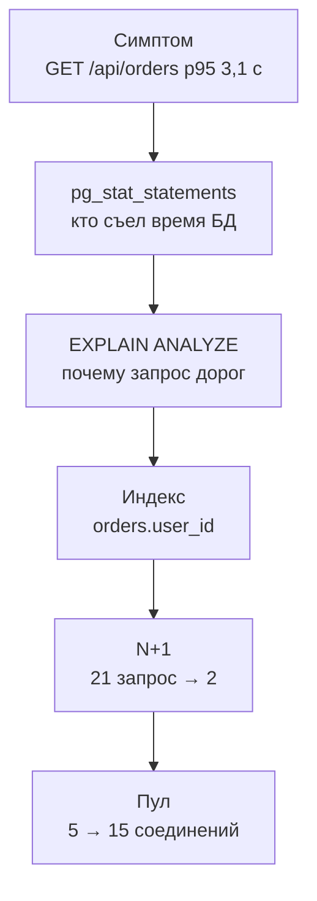

## Зачем это нужно

В [уроке 11.1](01-method.md) ты снял базовую линию «Магазина» и записал гипотезу: на 30 визитах в секунду страдает база. Самый медленный маршрут: `GET /api/orders` (p95 3,1 с). Распродажа через неделю, тест при тройной нагрузке всё ещё встаёт. Сегодня ты гипотезу проверишь и починишь, а заодно увидишь, как узкое место переезжает: уберёшь одну причину, и вылезет следующая.

База данных чаще всего оказывается узким местом веб-сервиса. Приложение можно запустить в десяти копиях, а база обычно одна, и все копии стоят к ней в очереди. Болезни почти всегда те же. Запрос читает всю таблицу вместо одной строки (нет индекса). Один и тот же запрос повторяется сотни раз там, где хватило бы одного (проблема N+1). Все соединения заняты, и новые запросы ждут (мал пул). Лечатся они по-разному, а главное умение одно: сначала **найти** виновника по измерению, а не по догадке. Я сам в начале карьеры раздул пул «на всякий случай» и сделал хуже, об этом ты прочтёшь ниже.

Шаг проекта: в `~/perf-lab/11-bottlenecks/` ты по очереди найдёшь три причины (через `pg_stat_statements`, `EXPLAIN ANALYZE` и метрики пула) и исправишь каждую одним изменением. После каждого пересчитаешь предел системы и запишешь таблицу «что поменяли, что стало» в `03-database.md`.

## Что нужно знать

- Метод и скрипты `bn.js`, `set-env.sh`, `run.sh`, базовая линия: [урок 11.1](01-method.md).
- SQL: `SELECT`, `WHERE`, `JOIN`, индексы, `EXPLAIN` на уровне «создавал и удалял»: [урок 2.4](../02-web/04-sql-basics.md).
- Как бэкенд ходит в базу через пул соединений: [урок 2.3](../02-web/03-backend-anatomy.md); как работает пул под нагрузкой: [урок 8.2](../08-perf-theory/02-queues-littles-law.md).
- Метрики пула `shop_db_pool_*` и `shop_db_connection_wait_seconds`: [урок 7.2](../07-observability/02-promql.md), дашборд [урок 7.3](../07-observability/03-grafana.md).
- Закон Литтла (сколько соединений нужно при данной нагрузке): [урок 8.2](../08-perf-theory/02-queues-littles-law.md).
- Стенд: PostgreSQL 18.6 с расширением `pg_stat_statements` и `cpus: "1.0"` у контейнера базы, пул `DB_POOL_MAX=5` на воркер.

## Картина целиком

Библиотека с одним библиотекарем. Читатель просит «все мои заказы». Каталога по читателям нет, поэтому библиотекарь идёт вдоль всех 200 000 полок и смотрит каждую карточку: «Не ваша... не ваша... не ваша...». Это полный перебор (`Seq Scan`). С каталогом по читателям он сразу идёт к нужной полке: это индекс. Вторая беда: на каждый из 20 заказов читателя библиотекарь ещё раз ходит в хранилище за списком товаров. Принести все 20 за раз он не догадывается (N+1). Третья: окошек у входа всего пять, и если библиотекарь занят, люди стоят в очереди (пул соединений).



Сначала узнаём, **какой запрос** дорог, потом **почему**, чиним, и после каждого исправления снова меряем: узкое место сдвигается на следующий ресурс.

## Теория

### Как устроен запрос к базе и откуда берётся время

«База тормозит» остаётся словами, пока не знаешь, на что она тратит время. Давай разберём.

Это как заказ в ресторане. Время складывается из ожидания официанта (очередь к соединению), работы повара (процессор базы) и того, сколько продуктов надо достать с полок (чтение данных). Быстрее всего то блюдо, для которого всё лежит под рукой.

В базе то же самое по стадиям. Запрос принимает **соединение** (connection): в PostgreSQL это отдельный процесс на каждое соединение, и их число ограничено (у нас `max_connections=100`). Затем **планировщик** выбирает **план**: как искать строки (перебрать таблицу целиком или пойти по индексу) и в каком порядке соединять таблицы. Потом исполнитель читает данные. Таблица хранится **страницами** по 8 КБ. Страницы в памяти читаются быстро (`hit`), а с диска на порядок медленнее (`read`). В итоге время запроса это процессор на сравнение и сортировку, плюс чтение страниц, плюс ожидание блокировок.

Приложение берёт соединение из **пула**: набора заранее открытых соединений, которыми пользуются по очереди. Открывать соединение к PostgreSQL дорого (десятки миллисекунд), поэтому их держат и переиспользуют.

Вот запрос списка заказов из `main.py`:

```text
SELECT id, status, total, created_at FROM orders
WHERE user_id = 42 ORDER BY created_at DESC, id DESC LIMIT 20
```

В `orders` 200 000 строк, примерно по 200 заказов на каждого из 1000 пользователей. Нужно найти 200 строк пользователя 42 и отсортировать по дате: чтобы взять 20 последних, надо знать, какие из 200 самые свежие. Без индекса база не знает, где они лежат, и читает **все** 200 000 (это 1575 страниц по 8 КБ, около 12 МБ), проверяя `user_id = 42`. Выходит около 20 мс процессорного времени на вызов (так мерили на стенде в одиночку, под нагрузкой чуть больше).

> **Прикинь сам:** 20 мс на запрос это быстро? Один визит делает такой запрос один раз, а приходит 30 визитов в секунду. Сколько процессора базы уйдёт?
{: .predict}

Под нагрузкой запрос стоит около 22 мс. Тридцать по 22 это 660 мс процессора базы в секунду, то есть две трети единственного ядра уходят на один запрос. Стоимость запроса надо умножать на частоту.

> **Главное:** время запроса складывается из процессора, чтения страниц и ожиданий, а стоимость запроса надо умножать на то, как часто он вызывается.
{: .key}

Мы знаем, что запрос дорог. Но как среди сотен запросов найти тот, что съедает базу?

### pg_stat_statements: кто съел время базы

Журнал медленных запросов показывает только те, что дольше порога (у нас 200 мс). Но самый вредный запрос может быть быстрым и частым. Нужен учёт по всем запросам. Вспомни банковскую выписку: важны не только крупные покупки, но и мелкие регулярные платежи, которые за месяц набегают в большую сумму.

Расширение `pg_stat_statements` (в стенде включено, `track=all`) и есть такая выписка. Оно ведёт таблицу, где каждому **нормализованному** запросу (значения заменены на `$1`, `$2`, чтобы запросы с разными параметрами считались одним) соответствует строка. В ней `calls` (сколько раз вызван), `total_exec_time` (суммарное время, мс), `mean_exec_time` (среднее, мс) и `rows` (сколько строк отдано). Счётчики копятся с запуска или с последнего `pg_stat_statements_reset()`, поэтому **перед замером их сбрасывают**, иначе в таблице исторический мусор. Сортировать для поиска узкого места надо по `total_exec_time`: именно суммарное время занимает базу.

После минуты теста при 30 визитах в секунду (до исправлений) такой запрос:

```sql
SELECT left(query, 60) AS query, calls, round(total_exec_time) AS total_ms,
       round(mean_exec_time::numeric, 1) AS mean_ms, rows
FROM pg_stat_statements WHERE query NOT LIKE '%pg_stat%'
ORDER BY total_exec_time DESC LIMIT 5;
```

даёт примерно такое:

```text
                            query                             | calls | total_ms | mean_ms | rows
--------------------------------------------------------------+-------+----------+---------+--------
 SELECT id, status, total, created_at FROM orders WHERE user_ |  1612 |    51270 |    31.8 |  32240
 SELECT oi.order_id, oi.product_id, p.name, oi.qty, oi.price  | 32240 |     4590 |     0.1 | 64480
 SELECT id, name, price, category_id, stock FROM products WHE |  1672 |     2210 |     1.3 |   1672
 INSERT INTO orders (user_id, status, total) VALUES ($1, $2,  |  1670 |     1650 |     1.0 |   1670
 SELECT p.id, p.name, p.price, p.category_id, p.stock FROM pr |  1672 |     1480 |     0.9 | 33440
```

Смотри сначала на `total_ms`. Список заказов набрал 51 270 мс за минуту, больше всех остальных запросов вместе. Осторожно: `total_ms` это время выполнения вместе с ожиданием (ядра, диска, блокировок), а не чистый расход процессора. Поэтому сумма по нескольким соединениям может превысить 60 000 мс за минуту даже на одном ядре. Для поиска главного виновника это неважно: доля в общем времени показывает, кого чинить первым. Вызовов 1612 за минуту, около 27 в секунду, чуть меньше 30 из-за прогрева. Среднее у запроса 31,8 мс: это его 22 мс работы плюс ожидание ядра, когда запросов много. Так он в десятки раз дороже остальных.

> **Прикинь сам:** второй запрос (`order_items`) вызван 32 240 раз, первый 1 612. Что говорит их отношение?
{: .predict}

32 240 / 1 612 = 20: на каждый вызов списка заказов приходится ровно двадцать запросов за товарами. Суммарно они съели мало (по 0,1 мс), но число вызовов это отпечаток N+1. Подсказка для следующего шага.

Осторожно: сортировка по `mean_exec_time` выберет «самый медленный» запрос, который вызван три раза. Сортировка по `calls` найдёт самый частый, который стоит микросекунды. Сначала `total_exec_time`, потом смотри, из чего он складывается: из цены (`mean`) или частоты (`calls`).

> **Проверь понимание:** запрос A: 10 000 вызовов, `mean` 0,5 мс. Запрос B: 20 вызовов, `mean` 120 мс. Какой сильнее нагрузит базу?
>
> <details markdown="1">
> <summary>Ответ</summary>
>
> A: 10 000 × 0,5 = 5 000 мс. B: 20 × 120 = 2 400 мс. Базу сильнее нагружает A, хотя каждый его вызов быстрый. Но если B стоит на критичном маршруте, пользователь ощутит его сильнее. Для нагрузки на базу смотрят суммарное время, для задержки пользователя `mean` и p95 маршрута.
>
> </details>

> **Главное:** виновника ищут по суммарному времени, а отношение `calls` двух запросов выдаёт N+1.
{: .key}

Виновник найден. А почему он дорог, показывает план.

### EXPLAIN ANALYZE: почему запрос дорог

План похож на маршрутный лист курьера: сначала зайти сюда, потом туда. `EXPLAIN` показывает маршрут, который выбрал планировщик, а `EXPLAIN (ANALYZE, BUFFERS)` ещё и **выполняет запрос**, добавляя реальное время, число строк и страниц. Осторожно: на `INSERT` или `UPDATE` он реально изменит данные, оборачивай такие в транзакцию с откатом.

План это дерево узлов, читать его надо снизу вверх: внутренние узлы выполняются первыми. Два главных способа достать строки. **Seq Scan** читает всю таблицу и фильтрует: нормален для маленьких таблиц, плох, когда нужна малая доля большой. **Index Scan** и **Bitmap Index Scan** идут по индексу к нужным строкам. Bitmap сначала собирает адреса страниц, потом читает их по порядку: удобно, когда строк много, но не большинство. Из полей важнее всех `Rows Removed by Filter` (сколько строк прочитано и отброшено: главный признак напрасной работы), `actual time` (миллисекунды) и `Buffers: shared hit=... read=...` (страницы из памяти и с диска). `cost` это условные единицы оценки, их сравнивают только между планами одного запроса.

План списка заказов **до индекса**:

```text
Limit  (cost=4075.12..4075.17 rows=20 width=28) (actual time=19.84..19.85 rows=20 loops=1)
  Buffers: shared hit=1575
  ->  Sort  (cost=4075.12..4075.62 rows=200 width=28) (actual time=19.83..19.84 rows=20 loops=1)
        Sort Key: created_at DESC, id DESC
        Sort Method: top-N heapsort  Memory: 27kB
        ->  Seq Scan on orders  (cost=0.00..4070.00 rows=200 width=28) (actual time=0.03..19.62 rows=200 loops=1)
              Filter: (user_id = 42)
              Rows Removed by Filter: 199800
              Buffers: shared hit=1575
Planning Time: 0.12 ms
Execution Time: 19.90 ms
```

Читаем снизу. **Seq Scan on orders** с фильтром `user_id = 42`: нашлось 200 строк, а `Rows Removed by Filter: 199800` значит, что 199 800 строк прочитаны зря (99,9% работы). `shared hit=1575` это 1575 страниц из памяти. Выше `Sort` (метод `top-N heapsort` держит только 20 лучших, а не упорядочивает все) берёт из 200 строк 20 лучших, `Limit` отдаёт их. Из 19,9 мс на Seq Scan ушло 19,62.

> **Прикинь сам:** прочитано 200 000 строк, нужно 200. Какую долю работы составляет напрасная?
{: .predict}

Нужные 200 из 200 000 это 0,1%, значит напрасных 99,9%. Нужна малая доля большой таблицы, а база читает всю. Лечение: индекс по `user_id`.

Осторожно: `cost` не время. Если оценка `rows` сильно расходится с фактом (оценка 1, реально 50 000), статистика устарела, и лечит это команда `ANALYZE`.

> **Главное:** по плану ищи `Seq Scan` с огромным `Rows Removed by Filter`: это работа, которую индекс сделал бы напрасной.
{: .key}

Лечение названо. Что такое индекс и сколько он стоит?

### Индекс: каталог, который надо поддерживать

Без индекса поиск строки по значению это просмотр всей таблицы: чем больше таблица, тем дольше. Индекс превращает его в проход по дереву. Время почти не растёт с размером таблицы: таблица в тысячу раз больше добавляет лишь несколько шагов по дереву.

Представь предметный указатель в конце книги: слово и страницы. Вместо чтения всей книги ты открываешь указатель и идёшь на три нужные страницы. Цена: указатель надо поддерживать, при каждой новой странице обновлять, и он занимает место.

Индекс по `user_id` это отдельная структура (B-дерево: значения разложены по ветвям, как справочник по буквам), где значения отсортированы, а рядом лежат адреса строк. Поиск `user_id = 42` проходит дерево за 3-4 шага и находит адреса 200 строк. У этого три цены. Каждый `INSERT` в `orders` теперь обновляет и индекс (на нашем масштабе доли миллисекунды, но «индексы на всякий случай» заметно замедляют запись). Индекс по `integer` на 200 000 строк занимает 4-5 МБ. А если нужна большая доля таблицы, планировщик всё равно выберет Seq Scan, и это правильно.

Команда создания: `CREATE INDEX orders_user_id_idx ON orders(user_id);`. На боевой таблице используют `CREATE INDEX CONCURRENTLY`: он не блокирует запись при построении, а обычный `CREATE INDEX` блокирует, и в разгар дня магазин встанет. После создания выполни `ANALYZE orders;` (команда обновляет сводку, по которой планировщик прикидывает, сколько строк найдётся), чтобы планировщик точнее оценивал строки.

<details markdown="1">
<summary>Для любопытных: составной индекс</summary>

Наш запрос просит не просто строки пользователя, а 20 самых свежих: `WHERE user_id = 42 ORDER BY created_at DESC, id DESC LIMIT 20`. Простой индекс по `user_id` находит все 200 строк пользователя, но потом их приходится сортировать (в плане выше это узел `Sort`). Составной индекс (в нём два и больше столбцов) хранит строки одного пользователя уже упорядоченными по времени:

```sql
CREATE INDEX orders_user_created_idx ON orders (user_id, created_at DESC, id DESC);
ANALYZE orders;
```

Тогда планировщик идёт по индексу с начала и останавливается на двадцатой строке, а `Sort` исчезает. План примерно такой (числа у тебя будут другими, это иллюстрация):

```text
Limit  (cost=0.42..60.10 rows=20 width=28) (actual time=0.03..0.09 rows=20 loops=1)
  ->  Index Scan using orders_user_created_idx on orders  (cost=0.42..600.00 rows=200 width=28) (actual time=0.03..0.08 rows=20 loops=1)
        Index Cond: (user_id = 42)
Execution Time: 0.12 ms
```

Что здесь видно: узла `Sort` нет, прочитано 20 строк вместо 200, а время на порядок меньше. Для одного пользователя с 200 заказами выигрыш в миллисекундах, но у активного покупателя с тысячами заказов он станет заметным. Если делаешь этот опыт, удали простой индекс перед созданием составного (`DROP INDEX orders_user_id_idx;`), иначе планировщик может выбрать любой из двух, и это смажет сравнение. В уроке мы остаёмся на простом индексе `user_id`: он дешевле в записи и объясняет принцип.

</details>

План после индекса:

```text
Limit  (cost=219.30..219.35 rows=20 width=28) (actual time=0.61..0.62 rows=20 loops=1)
  Buffers: shared hit=193
  ->  Sort  (cost=219.30..219.80 rows=200 width=28) (actual time=0.61..0.61 rows=20 loops=1)
        Sort Key: created_at DESC, id DESC
        Sort Method: top-N heapsort  Memory: 27kB
        ->  Bitmap Heap Scan on orders  (cost=5.20..215.00 rows=200 width=28) (actual time=0.12..0.52 rows=200 loops=1)
              Recheck Cond: (user_id = 42)
              Heap Blocks: exact=190
              Buffers: shared hit=193
              ->  Bitmap Index Scan on orders_user_id_idx  (cost=0.00..5.15 rows=200 width=0) (actual time=0.08..0.08 rows=200 loops=1)
                    Index Cond: (user_id = 42)
                    Buffers: shared hit=3
Planning Time: 0.15 ms
Execution Time: 0.65 ms
```

Время упало с 19,9 до 0,65 мс (в 30 раз), страниц прочитано 193 вместо 1575 (в 8 раз), `Rows Removed by Filter` исчез. `Bitmap Index Scan` прошёл по индексу (3 страницы) и собрал список адресов 200 строк, как закладки. `Bitmap Heap Scan` прочитал эти страницы таблицы по порядку (`Heap Blocks: exact=190` это число страниц, `Recheck Cond` перепроверка условия). Заказы пользователя лежат вперемешку с чужими, записаны по мере поступления, поэтому 200 строк раскиданы по 190 страницам. Всё равно это 193 против 1575.

Осторожно: «создам индекс на каждый столбец» замедляет запись и раздувает память. Индекс ставят под конкретный частый запрос, который показала статистика. Бывает и так, что индекс создан, а запрос медленный: планировщик его не использует (статистика устарела, тип в условии не совпадает, функция над столбцом вроде `WHERE lower(email) = ...`).

> **Главное:** индекс меняет поиск по всей таблице на проход по дереву, но платит за это записью и местом, поэтому ставится под измеренный запрос.
{: .key}

Индекс убрал самую жирную часть. Но в `pg_stat_statements` остался второй запрос с тысячами вызовов.

### N+1: сто маленьких вместо двух больших

Нужно купить 20 продуктов. N+1 это 20 отдельных походов в магазин по одному продукту плюс первый поход за списком. Правильно: один поход со списком из 20 пунктов.

В коде так: сначала один запрос возвращает N заказов, потом в цикле по каждому заказу идёт ещё запрос за его товарами. Получается `1 + N` запросов вместо двух. У «Магазина» это включает настройка `BUG_N_PLUS_ONE`. По умолчанию она равна `1`, ошибка включена, и код делает 1 запрос + 20 по заказам (21 запрос), при `0` один запрос заказов и один `WHERE oi.order_id = ANY(...)` сразу по всем (2 запроса). Каждый из двадцати быстр (0,1 мс), но у каждого есть накладные расходы: сетевой круг до базы, разбор, занятое соединение. Под нагрузкой они съедают процессор и долго держат соединение из пула.

| Вариант | Запросов к БД | Круги до базы | Соединение занято |
|---|---|---|---|
| `BUG_N_PLUS_ONE=1` | 21 | 21 | около 8-10 мс на пустой базе (21 круг по 0,3-0,4 мс) |
| `BUG_N_PLUS_ONE=0` | 2 | 2 | около 1 мс |

> **Прикинь сам:** при 30 визитах в секунду сколько лишних запросов к базе делает N+1?
{: .predict}

Двадцать лишних на визит, 30 × 20 = 600 запросов в секунду. На каждый уходит около 0,1-0,15 мс процессора: 60-90 мс в секунду, до 9% ядра, плюс время, пока соединение занято.

Осторожно: N+1 не «медленные запросы». Каждый из них **быстрый**, поэтому в журнал медленных он не попадёт, и его видно, только когда смотришь на число вызовов. И индекс тут не лечит: индекс по `order_id` уже есть, лечится сменой количества запросов.

> **Главное:** N+1 это много быстрых запросов вместо одного, и узнают его по `calls` второго запроса, делённому на `calls` первого.
{: .key}

Запросов стало меньше. Но каждый всё равно берёт соединение из пула. Сколько таких «окошек» нужно?

### Пул соединений: сколько окошек и как долго они заняты

Каждое соединение к PostgreSQL это процесс на сервере (несколько мегабайт памяти и лишняя работа операционной системы по переключению между ними). Тысяча соединений тормозит базу сама по себе, поэтому приложение держит небольшой пул. Но маленький пул сам становится узким местом: пока все заняты, новые запросы ждут.

Это пять кассовых окон в банке и сколько угодно клиентов. Допустим, визит держит окошко в среднем 115 мс (так на стенде при N+1: 21 запрос и остальная работа). Тогда окна в сумме успевают 5 / 0,115 = 43 клиента в секунду, остальные ждут в зале. Если ждут слишком долго (таймаут), часть уходит с отказом.

В «Магазине» пул настраивают `DB_POOL_MIN=1`, `DB_POOL_MAX=5` (на каждый воркер) и `DB_POOL_TIMEOUT=5` секунд. Запрос берёт соединение (если свободного нет, ждёт), работает и возвращает. Прождал больше пяти секунд, получает 503 «database pool timeout». Метрики: `shop_db_pool_size` (сколько соединений открыто), `shop_db_pool_available` (сколько свободно), `shop_db_pool_waiting` (сколько запросов **сейчас ждут**), `shop_db_connection_wait_seconds` (гистограмма: сколько ждали). Как в кафе: два посетителя в минуту по три минуты за столиком занимают в среднем шесть столиков. По закону Литтла из [урока 8.2](../08-perf-theory/02-queues-littles-law.md) среднее число занятых соединений равно частоте запросов, умноженной на время удержания. Если на 40 итераций в секунду приходится 115 мс удержания, занято в среднем 40 × 0,115 = 4,6 соединения из 5. Запас 0,4, и любой всплеск превращается в очередь.

<div class="viz" data-viz="pool" data-size="5" data-duration="115" data-rate="50" data-timeout="5000"></div>

Пять соединений освобождаются реже, чем приходят запросы: максимум около 43 в секунду, а приходит 50. Поэтому очередь растёт и не рассосётся, пока нагрузка выше предела. Те, кто прождал дольше таймаута, получают отказ. Поставь размер 15, и тот же поток пройдёт без очереди.

> **Прикинь сам:** база упёрлась в процессор на 100%. Запросы выполняются дольше, соединения держатся дольше. Что станет с очередью у пула из 5 соединений, и что даст раздутие пула до 100?
{: .predict}

Время удержания растёт, пул из 5 насыщается при меньшей нагрузке, поэтому очередь в пуле часто **следствие** медленной базы, а не причина. Раздутие до 100 сделает хуже: сто конкурирующих запросов на одном ядре базы идут все медленнее, а не быстрее. Я так и сделал когда-то: очередь у окошек исчезла, зато вся очередь переехала внутрь базы, а p95 стал хуже. Правило: прежде чем увеличивать пул, проверь процессор базы.

Есть и верхняя граница: `max_connections=100`. Пул у каждого воркера свой, поэтому `WEB_CONCURRENCY × DB_POOL_MAX` не должно превышать сотню минус запас на мониторинг и администрирование. 15 соединений на один воркер нормально, а 15 на 8 воркеров (120) уже нет.

Осторожно: `shop_db_pool_waiting` показывает очередь **сейчас**, а `shop_db_connection_wait_seconds` показывает, **как долго** ждали. Это разные вопросы.

> **Главное:** размер пула подбирают по закону Литтла и по процессору базы, а очередь у пула часто лишь следствие медленной базы.
{: .key}

Три исправления готовы. Что они вместе делают с пределом системы?

### Узкое место переезжает

Каждое исправление сдвигает предел ступенью. Предел ресурса это его мощность, делённая на цену одного визита. Процессор базы: 1000 мс в секунду / 32 мс на визит это около 31. Это грубая оценка: мы считаем, что почти всё время запроса база работает процессором, а ожидание диска и блокировок мало (при упёртом в 1,00 CPU postgres так и есть). После индекса визит стоит около 22 мс, и предел около 45. Пул: 5 окошек / 0,115 с это около 43. Процессор приложения: около 15 мс на визит, это около 67. Пределы в визитах в секунду (визит это одна итерация сценария mix):

| Состояние | Предел CPU БД | Предел пула (5) | Предел CPU shop | Предел системы |
|---|---|---|---|---|
| Исходно | около 31 | около 43 | около 67 | 31 (CPU БД) |
| + индекс `orders.user_id` | около 45 | около 43 | около 67 | около 43-45 (БД и пул рядом) |
| + `BUG_N_PLUS_ONE=0` | около 55 | около 60 | около 67 | около 55 (CPU БД) |
| + `DB_POOL_MAX=15` | около 55 | около 85 | около 67 | около 55-67 |

Виджет считает те же ступени и рисует загрузку трёх ресурсов. Включи по очереди индекс и исправление N+1 и подвинь пул:

<div class="viz" data-viz="bn-limits" data-index="0" data-fixed="0" data-pool="5" data-load="40"></div>

Линия, которая первой достигает 100%, и есть узкое место. При нагрузке 40 исходная система давно за пределом (процессор базы), после индекса запас скромный, а после остальных правок ограничивать начинает уже что-то другое. Поднимешь пул, не починив процессор базы, и предел не сдвинется.

> **Главное:** после каждого исправления снова меряй, потому что узкое место переезжает, а поднимать пул, пока процессор базы упёрт, бесполезно.
{: .key}

Вернёмся к распродаже: индекс, N+1 и пул подняли предел с 31 до 55-67 визитов в секунду. Тройная нагрузка уже не кладёт магазин, а следующий предел будет искать сам процессор приложения.

## Практика

Стенд с мониторингом, `BCRYPT_ROUNDS=4` после прошлого урока (вход нам не мешает) и прогретые пользователи. Остальные настройки по умолчанию: `DB_POOL_MAX=5`, `BUG_N_PLUS_ONE=1`, индекса `orders_user_id_idx` нет. Проверь:

```bash
cd ~/load-tester/project/shop
grep -E '^(DB_POOL_MAX|BUG_N_PLUS_ONE|BCRYPT_ROUNDS)=' .env
docker compose exec -T postgres psql -U shop -d shop -c "SELECT indexname FROM pg_indexes WHERE tablename='orders'"
```

```text
DB_POOL_MAX=5
BUG_N_PLUS_ONE=1
BCRYPT_ROUNDS=4
       indexname
-----------------
 orders_pkey
(1 row)
```

Если в списке есть `orders_user_id_idx`, удали его: `docker compose exec -T postgres psql -U shop -d shop -c "DROP INDEX orders_user_id_idx"`. Удобно сделать псевдоним для работы с базой:

```bash
alias psqlshop='docker compose -f ~/load-tester/project/shop/compose.yaml exec -T postgres psql -U shop -d shop'
```

### 1. Базовая линия на 40 визитах

Сегодня удобнее вести расследование на нагрузке 40: она выше предела, симптом заметен. Прогон и база сразу после него:

```bash
cd ~/perf-lab/11-bottlenecks
psqlshop -c "SELECT pg_stat_statements_reset();"
./run.sh db-base SCENARIO=mix RATE=40 DURATION=60s
```

`pg_stat_statements_reset()` обнуляет учёт, поэтому цифры после него относятся только к нашему прогону. Результат ориентировочно: p95 6,2 с, выполнено 26,9 визита в секунду, ошибок 7% (503 «database pool timeout» через 5 с).

### 2. Кто съел время базы

```bash
psqlshop -c "SELECT left(query, 60) AS query, calls, round(total_exec_time) AS total_ms, round(mean_exec_time::numeric,1) AS mean_ms FROM pg_stat_statements WHERE query NOT LIKE '%pg_stat%' ORDER BY total_exec_time DESC LIMIT 5;"
```

Вывод аналогичен показанному в теории. **Как читать вывод:** верхний запрос это `SELECT ... FROM orders WHERE user_id = ...`, он забрал большую часть суммарного времени; второй `SELECT oi.order_id ... FROM order_items` имеет число вызовов в 20 раз больше. Запиши обе подсказки: «orders: дорогой запрос» и «order_items: N+1».

Затем проверь процессор и пул:

```bash
P=~/perf-lab/scripts/promq.sh; S='container_label_com_docker_compose_service'
$P "sum(rate(container_cpu_usage_seconds_total{$S=\"postgres\"}[30s]))"
$P "shop_db_pool_waiting"
$P "histogram_quantile(0.95, sum by (le) (rate(shop_db_connection_wait_seconds_bucket[30s])))"
```

Эти запросы нужно выполнять **во время** прогона, поэтому запусти прогон на 90 секунд в одном терминале и снимай показания в другом. Типичные значения: процессор postgres 1,00, `pool waiting` 3-4, p95 ожидания соединения около 0,4 с на 30 визитах и около 4,8 с на 40 (почти до таймаута). По дереву из 11.1: процессор shop не упёрт, ждут соединения, процессор базы упёрт: **запросы к БД**.

### 3. EXPLAIN ANALYZE: почему

Возьми пользователя с заказами и посмотри план:

```bash
psqlshop -c "EXPLAIN (ANALYZE, BUFFERS) SELECT id, status, total, created_at FROM orders WHERE user_id = 42 ORDER BY created_at DESC, id DESC LIMIT 20;"
```

Разбор: `EXPLAIN (ANALYZE, BUFFERS)` выполняет запрос и печатает план с реальными временем и страницами (запрос только читает, поэтому ничего не меняет). Ожидаемый вывод это план из теории: `Seq Scan on orders`, `Rows Removed by Filter: 199800`, `Execution Time` около 20 мс.

**Как читать вывод:** сначала самый глубокий узел (с наибольшим отступом): `Seq Scan`. В нём `Rows Removed by Filter: 199800` значит, что работа почти вся напрасная. Время самого запроса (`Execution Time`) умножь на частоту: 40 визитов/с × 20 мс = 800 мс процессора базы в секунду, а у неё в секунде 1000 мс.

**Типичные ошибки:** `ERROR: relation "orders" does not exist` значит, что подключился не к базе `shop` (проверь `-d shop`); план показывает `Index Scan` значит, что индекс уже создан (удали и повтори); `time` в плане вдвое больше на первый раз значит, что страницы читались с диска, повтори запрос.

Запиши гипотезу: «Если причина в полном переборе `orders`, то индекс по `user_id` снизит время запроса с 20 мс до 1 мс, а p95 mix на 40/с упадёт с 6,2 с ниже 2 с. Если p95 останется выше 4 с, гипотеза неверна.»

### 4. Исправление 1: индекс

```bash
psqlshop -c "CREATE INDEX orders_user_id_idx ON orders(user_id);"
psqlshop -c "ANALYZE orders;"
psqlshop -c "EXPLAIN (ANALYZE, BUFFERS) SELECT id, status, total, created_at FROM orders WHERE user_id = 42 ORDER BY created_at DESC, id DESC LIMIT 20;"
```

Разбор: `CREATE INDEX` строит индекс (на 200 000 строк около секунды), `ANALYZE` обновляет статистику, третья команда это тот же `EXPLAIN`. Теперь план содержит `Bitmap Index Scan on orders_user_id_idx`, `Execution Time` около 0,65 мс, `Buffers: shared hit=193`. Первое изменение сделано одной командой. Запиши его в журнал руками, раз это не `set-env.sh`: `echo "$(date '+%F %T')  CREATE INDEX orders_user_id_idx" >> ~/perf-lab/11-bottlenecks/experiments.log`.

Теперь прогон при тех же условиях (сначала сброс учёта):

```bash
psqlshop -c "SELECT pg_stat_statements_reset();"
./run.sh db-index SCENARIO=mix RATE=40 DURATION=60s
```

Ожидаемо: выполнено около 39,5 визита в секунду, p95 около 1,3 с, ошибок около 0,3%. Гипотеза подтверждена по заранее записанному порогу (ниже 2 с). Узкое место сдвинулось: процессор базы остался около 90%, а пул (5 окон по 115 мс) почти на пределе.

**Типичные ошибки:** прогон показал то же, что до индекса: индекс не создан в той базе, к которой подключается стенд (`psqlshop -c "\d orders"` покажет индекс); p95 стал хуже на первых секундах: страницы индекса ещё не в кэше, выбрось прогрев или повтори.

### 5. Исправление 2: N+1

Снова смотрим `pg_stat_statements` после прогона `db-index`:

```bash
psqlshop -c "SELECT left(query, 60) AS query, calls, round(total_exec_time) AS total_ms, round(mean_exec_time::numeric,2) AS mean_ms FROM pg_stat_statements WHERE query NOT LIKE '%pg_stat%' ORDER BY total_exec_time DESC LIMIT 4;"
```

```text
                            query                             | calls | total_ms | mean_ms
--------------------------------------------------------------+-------+----------+---------
 SELECT oi.order_id, oi.product_id, p.name, oi.qty, oi.price  | 47320 |     5870 |    0.12
 SELECT id, status, total, created_at FROM orders WHERE user_ |  2366 |     1540 |    0.65
 SELECT id, name, price, category_id, stock FROM products WHE |  2366 |     3010 |    1.27
 INSERT INTO orders (user_id, status, total) VALUES ($1, $2,  |  2364 |     2320 |    0.98
```

**Как читать вывод:** теперь самый дорогой запрос это `order_items` (47 320 вызовов, ровно 20 на каждый вызов списка заказов, 2366 × 20). Каждый вызов быстр (0,12 мс), но их множество. Это отпечаток N+1. Теория твердит, что лечится сменой числа запросов, а не индексом. В стенде это переключатель `BUG_N_PLUS_ONE`:

```bash
./set-env.sh BUG_N_PLUS_ONE=0
psqlshop -c "SELECT pg_stat_statements_reset();"
./run.sh db-nplus1 SCENARIO=mix RATE=40 DURATION=60s
```

Ожидаемо: p95 около 0,35 с, ошибок нет, выполнено 40 в секунду. В `pg_stat_statements` число вызовов `order_items` стало равно числу вызовов списка заказов (2 запроса на вызов вместо 21). Предел системы теперь около 55 визитов в секунду, определяет его процессор базы.

Параллельно проверь число запросов к базе на вызов: `psqlshop -c "SELECT calls FROM pg_stat_statements WHERE query LIKE '%order_items oi%'"` сравни с числом вызовов `GET /api/orders` из отчёта k6 (число итераций).

### 6. Исправление 3: пул, но осознанно

Сейчас на 40 визитах пул не мешает. Увидеть его влияние можно, подняв нагрузку, где пул уже важен: 55 визитов в секунду.

```bash
./run.sh db-nplus1-55 SCENARIO=mix RATE=55 DURATION=60s
```

Снимай во время прогона `shop_db_pool_waiting` и процессор postgres. Типичные значения: waiting 1-2, процессор postgres около 98%. По дереву: процессор базы упёрт, пул следствие. Гипотеза на пул: «Если мал пул, то 15 соединений сократят ожидание соединения (p95 с 0,25 до ниже 0,05 с). Если предел выше не вырастет, пул не был узким».

```bash
./set-env.sh DB_POOL_MAX=15
./run.sh db-pool15-55 SCENARIO=mix RATE=55 DURATION=60s
```

Результат: ожидание соединения упало ниже 0,02 с, но общий p95 изменился мало (около 0,45 с вместо 0,5 с). Предел системы упирается уже в процессор базы (около 55), и больший пул его не изменит. Это правильный вывод: пул был лишь **следствием**, а раздутый пул не принёс бы ничего хорошего. Проверь `max_connections`: `psqlshop -c "SHOW max_connections"` покажет 100, при `WEB_CONCURRENCY=1` пул 15 безопасен.

<div class="viz" data-viz="chart" data-type="bar" data-x="исходно,индекс,+N+1,+пул 15" data-x-label="Состояние стенда" data-y-label="p95 при 40 визитах/с, мс" data-unit="мс" data-explain="Каждое исправление сдвигает p95 при 40 визитах в секунду. Индекс снимает основное (6200 до 1300 мс), N+1 доводит до 350 мс, расширение пула почти ничего не добавляет, потому что процессор базы и так был упёртым ограничителем." data-series='[{"name":"p95 mix, мс","values":[6200,1300,350,300],"unit":"мс"},{"name":"выполнено, визитов/с","values":[26.9,39.5,40,40],"unit":"/с"}]'></div>

Смотри: две первые правки дают почти весь эффект, третья (пул) почти ничего. Это то, что предсказывала таблица пределов, и поэтому изменения проверяют по одному: иначе ты бы не узнал, что пул 15 бесполезен.

### 7. Запиши вывод и закоммить

Допиши `~/perf-lab/11-bottlenecks/03-database.md` таблицу и выводы:

```markdown
# 11.3. База данных

## Симптом
mix 40 визитов/с: p95 6,2 с, выполнено 26,9/с, 7% ошибок (503 пул). GET /api/orders самый медленный.

## Показания
CPU postgres 1,00 (упёрт), pool waiting 3-4, wait p95 около 4,8 с. pg_stat_statements: запрос orders 85% времени БД, order_items в 20 раз чаще orders.

## Что менял по одному (mix 40/с, 60 с)
| изменение | p95, мс | выполнено/с |
| исходно | 6200 | 26,9 |
| индекс orders_user_id_idx | 1300 | 39,5 |
| BUG_N_PLUS_ONE=0 | 350 | 40,0 |
| DB_POOL_MAX=15 (при 55/с) | 450 | 55 |

## Вывод
Главное: индекс (Seq Scan 20 мс → 0,65 мс). Затем N+1 (21 запрос → 2). Пул не был причиной, а следствием. Предел ~55 визитов/с, дальше упирается CPU БД.
```

```bash
cd ~/perf-lab
git add 11-bottlenecks results/11-db-*.txt
git commit -m "11.3: БД: индекс, N+1, пул, расследование"
git push
```

Оставь индекс, `BUG_N_PLUS_ONE=0` и `DB_POOL_MAX=15`: следующие уроки опираются на исправленную базу.

## Сломай и почини

**Поломка:** раздуй пул «на всякий случай» и посмотри, что получится. Верни медленный запрос и поставь пул 90:

```bash
psqlshop -c "DROP INDEX orders_user_id_idx;"
./set-env.sh DB_POOL_MAX=90
./run.sh db-bigpool SCENARIO=mix RATE=40 DURATION=60s
```

Что произойдёт: ошибок «database pool timeout» нет (соединений много), но p95 не лучше, а часто хуже исходного: все 90 запросов лезут в базу одновременно, процессор делится на всех, и каждый запрос выполняется дольше. Очередь переехала из приложения внутрь базы, где её хуже видно. К тому же 90 соединений занимают больше памяти базы, а второй воркер уже не поместился бы в `max_connections=100`.

**Диагностика:** `psqlshop -c "SELECT state, count(*) FROM pg_stat_activity WHERE datname='shop' GROUP BY state"` показывает десятки соединений в состоянии `active` одновременно; метрика `shop_db_pool_waiting` равна нулю (очереди в приложении нет), а процессор postgres 100%. Вывод: насыщена база, пул лишь прятал очередь.

**Решение:** создай индекс заново (`CREATE INDEX orders_user_id_idx ON orders(user_id); ANALYZE orders;`), верни `DB_POOL_MAX=15`, повтори прогон и сравни. Правило на запас: размер пула подбирают по закону Литтла (частота × время удержания × запас 2) и по числу ядер базы, а не «чтобы не было ожидания».

> Сначала пройди диагностику сам: `pg_stat_activity`, `shop_db_pool_waiting`, процессор postgres. Потом спроси нейросеть, согласна ли она с выводом «насыщена база, пул прятал очередь», и проверь повторным прогоном с `DB_POOL_MAX=15` и индексом.
{: .ai}

## ИИ в помощь

Нейросеть неплохо читает план `EXPLAIN ANALYZE` и подсказывает индекс, но не знает твоих данных и объёмов. Общие правила: [ИИ-помощник](../ai.md).

**Задача:** разобрать план запроса.

```text
PostgreSQL 18, таблица orders (около 200 000 строк), запрос: <вставь SELECT ... WHERE user_id = ...>.
Вот вывод EXPLAIN (ANALYZE, BUFFERS): <вставь план целиком>
Объясни построчно, что значит каждый узел, где тратится время (actual time, rows, loops) и почему
выбран такой план. Предложи индекс, объясни, почему именно он, и скажи, как мне проверить, что
он помог. Не угадывай объёмы данных, которых нет в плане.
```
{: .wrap}

**Проверь ответ:** создай индекс на копии стенда, снова выполни `EXPLAIN ANALYZE` и сравни `Execution Time` и тип узла (`Seq Scan` должен смениться на `Index Scan`). Типичные ошибки: индекс не на тот столбец, совет ставить индекс на каждый столбец (замедлит запись), забытый `ANALYZE` после создания.

**Задача:** найти N+1 по картине запросов.

```text
В pg_stat_statements стенда «Магазин» самый частый запрос: <вставь query и calls, mean_exec_time>.
За один прогон из 40 визитов он выполнен <число> раз. Объясни, как отличить N+1 от обычной нагрузки
и как посчитать, сколько запросов приходится на один HTTP-запрос. Покажи, как исправить: один запрос
с JOIN или IN вместо цикла. Объясни, как проверить результат метрикой.
```
{: .wrap}

**Проверь ответ:** отношение `calls` к числу HTTP-запросов на маршруте должно сойтись с твоей оценкой; после правки оно упадёт до единиц. Типичная ошибка: исправление, которое грузит в память лишние данные, или совет поднять пул вместо устранения лишних запросов.

Данные клиентов и пароли из таблиц в чат не копируй: оставляй только структуру и числа.

## Словарик урока

| Термин | Простыми словами |
|---|---|
| Соединение (connection) | Канал между приложением и базой; в PostgreSQL это отдельный процесс на сервере |
| Пул соединений | Набор заранее открытых соединений, которые раздают запросам по очереди |
| `pg_stat_statements` | Расширение PostgreSQL: учёт всех запросов, числа вызовов и суммарного времени |
| Нормализованный запрос | Запрос, где значения заменены на `$1`, `$2`, чтобы похожие считались одним |
| План выполнения (plan) | Способ, которым база решила выполнить запрос |
| `EXPLAIN ANALYZE` | Показывает план и реально выполняет запрос, замеряя время и страницы |
| Seq Scan | Чтение всей таблицы подряд с фильтрацией |
| Index Scan, Bitmap Index Scan | Поиск строк через индекс |
| Rows Removed by Filter | Сколько строк прочитано и отброшено: признак напрасной работы |
| Индекс | Дополнительная структура для быстрого поиска, замедляет запись, занимает место |
| `CREATE INDEX CONCURRENTLY` | Построение индекса без блокировки записи, на боевых таблицах |
| N+1 | Один запрос списка и ещё N запросов по каждому элементу вместо двух |
| `shop_db_pool_waiting` | Сколько запросов прямо сейчас ждут свободное соединение |
| `max_connections` | Максимум одновременных соединений к PostgreSQL |
| Статистика (`ANALYZE`) | Данные о таблице, по которым планировщик оценивает стоимость плана |

## Вопросы с собеседований

Раздел для повторения: ответь вслух, потом открой ответ.



## Проверено на версиях

PostgreSQL 18.6 с `pg_stat_statements` (`track=all`), планы записаны в формате PostgreSQL 18 (названия узлов те же, что в 14-17), psycopg-pool в образе `shop`, Prometheus 3.15, k6 2.3. Числа в таблицах рассчитаны моделью по коду стенда и могут отличаться на твоём железе; последовательность «индекс, N+1, пул» и форма изменений должны совпасть. Октябрь 2026.

## Итог урока: ты умеешь

- [ ] Найти самый вредный запрос по `pg_stat_statements` с учётом суммарного времени и числа вызовов.
- [ ] Прочитать `EXPLAIN (ANALYZE, BUFFERS)`: Seq Scan, Rows Removed by Filter, страницы, время.
- [ ] Создать индекс под конкретный запрос и подтвердить эффект планом и нагрузочным прогоном.
- [ ] Узнать N+1 по числу вызовов и убрать его.
- [ ] Прочитать метрики пула и отличить пул-причину от пула-следствия.
- [ ] Применять по одному изменению и видеть, как узкое место переезжает.
- [ ] Записать расследование таблицей «изменение, p95, выполнено» с выводом.

Дальше: [урок 11.4. Память и утечки: тест на выносливость](04-memory-soak.md), где база уже здорова, но приложение медленно пожирает память.
