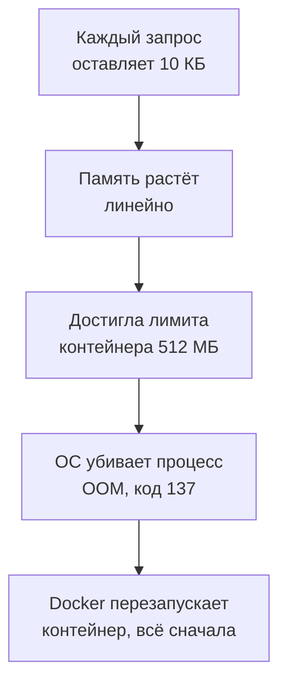

## Зачем это нужно

Я твой наставник: опытный коллега, который сидит рядом и смотрит на тот же стенд. Представь, что на распродаже магазин пережил тройную нагрузку, но через сутки ночью сервис тихо упал, и утром нет ни метрик, ни понятной причины. Я однажды так провёл выходные: все короткие тесты были зелёными, а на настоящей нагрузке сервис умирал через несколько часов.

Все тесты прошлых уроков короткие: минута, три минуты. За это время сервис выглядит прекрасно. Но есть проблемы, которые за минуту не видны: система медленно деградирует. Это утечка памяти (программа берёт память и не отдаёт), рост очереди, диск, забитый логами. Для них придуман **тест на выносливость** (soak test, «пропитка»): нагрузка умеренная, но долгая, час или сутки. Он ищет не предел, а то, что **со временем** что-то растёт без остановки.

Шаг проекта: ты включаешь в «Магазине» утечку (`LEAK_ENABLED=1`, имитация релиза с багом) и запускаешь 20-минутный soak на 40 запросах в секунду. Потом строишь график памяти, считаешь скорость утечки, предсказываешь падение до того, как оно случится, и сравниваешь с контрольным прогоном без утечки. Результат пойдёт в `~/perf-lab/11-bottlenecks/04-memory-soak.md`.

## Что нужно знать

- Метод «симптом, гипотеза, проверка, одно изменение» и скрипты `bn.js`, `set-env.sh`, `run.sh`: [урок 11.1](01-method.md).
- Типы тестов и профиль soak (ровная нагрузка долго): [урок 8.3](../08-perf-theory/03-test-types.md).
- Лимит памяти контейнера и сигнал 137: [урок 5.4](../05-docker/04-limits-stats.md); процессы и память в Linux: [урок 1.3](../01-linux/03-processes-resources.md).
- Метрики cAdvisor, `predict_linear`, `rate`: [урок 7.2](../07-observability/02-promql.md), [урок 7.4](../07-observability/04-exporters.md); алерты и работа с инцидентом: [урок 7.6](../07-observability/06-alerts-incidents.md).
- Контейнер `shop` имеет `mem_limit: 512m`, в `compose.yaml` стоит `restart: unless-stopped`, поэтому после убийства Docker поднимет контейнер сам.

## Картина целиком

Ванна с открытым краном и маленьким сливом. Пока воды мало, разницы никто не замечает. Если измерять уровень минуту, увидишь «ничего не происходит», а если час, увидишь прямую линию вверх, и в какой-то момент вода переливается через край. Утечка памяти работает так же: каждый запрос оставляет в памяти небольшой «осадок», который приложение не освобождает.



Пока память не кончилась, ответы не ухудшаются вообще: полупустой шкаф ищет вещи так же быстро, как пустой. Потом приходит обрыв: процесс убит мгновенно, а Docker поднимает его заново секунд за двадцать. Поэтому soak ищут не по задержке (график p95 ровный), а по **наклону графика памяти**.

## Теория

### Память процесса: что растёт нормально, что нет

Память сервиса выросла вдвое за десять минут. Это уже утечка? Не обязательно, и ошибиться тут легко в обе стороны.

Посмотри на рабочий стол. Утром он пуст, к обеду на нём бумаги, чашки, ноутбук (прогрев). Дальше беспорядок остаётся постоянным: что-то берёшь, что-то убираешь. А теперь представь, что каждый час на столе остаются два стакана, и никто их не уносит. Это утечка.

Программа берёт память у операционной системы и по мере работы возвращает. В Python память освобождается сама: объект, на который никто не ссылается, убирает сборщик мусора. **Утечка** (memory leak) возникает, когда ссылка остаётся: объект никому не нужен, но лежит в списке, словаре или кэше без ограничения, и сборщик считает его нужным. Здоровая память ведёт себя одним из трёх способов. Это «прогрев и плато» (первые минуты растёт, потом ровно), «пила» (растёт и падает, в среднем ровно) или «ступени» (растёт при новых видах нагрузки). Утечка это линия, которая **растёт без остановки и не возвращается**, а её наклон зависит только от числа запросов.

В «Магазине» утечка устроена просто. При `LEAK_ENABLED=1` прослойка (middleware, код, который проходят все запросы) добавляет в глобальный список блок `bytearray(10 * 1024)` (кусок памяти в 10 КБ), и список никогда не чистится. Расчёт: 40 запросов в секунду × 10 КБ = 400 КБ в секунду, это 24 МБ в минуту. Мониторинг тоже проходит через прослойку. Prometheus (система, собирающая метрики) стучится раз в 5 секунд. Docker проверяет, что сервис жив, тоже раз в 5 секунд, и вместе это около 0,4 запроса в секунду, то есть 14 МБ в час. Контейнер стартует с памятью около 118 МБ (это показывает `docker stats` сразу после запуска), лимит 512 МБ (`mem_limit` в `compose.yaml`), значит, на утечку остаётся 394 МБ. Нагрузка даёт 24 МБ в минуту, мониторинг около 0,25, итого около 24,5. 394 / 24,5 МБ в минуту даёт примерно 16 минут.

> **Прикинь сам:** сколько проживёт контейнер при 10 запросах в секунду вместо 40?
{: .predict}

10 × 10 КБ = 100 КБ в секунду, это 6 МБ в минуту, около 6,4 МБ с мониторингом. 394 / 6,4 это 61 минута, то есть больше часа. Время до обрыва обратно пропорционально нагрузке.

<div class="viz" data-viz="bn-leak" data-rps="40" data-kb="10" data-limit="512" data-base="118"></div>

Серая «пила» здесь здоровая память, она колеблется вокруг ровной линии, а красная прямая это утечка. Точка пересечения с лимитом показывает время OOM. Подвинь нагрузку: наклон меняется. Подвинь лимит: сдвинется только дедлайн, наклон останется.

Осторожно: утечку путают с кэшем. Кэш тоже растёт, но у него есть предел (число элементов, время жизни), и график выходит на плато. Ещё путают «память не упала после теста» с утечкой. Python часто придерживает освобождённую память про запас и не возвращает системе, и график остаётся высоким. Но при повторном таком же прогоне нового подъёма нет.

> **Проверь понимание:** за 10 минут теста память выросла со 120 до 280 МБ, потом четыре минуты стоит ровно на 280. Утечка?
>
> <details markdown="1">
> <summary>Ответ</summary>
>
> Скорее всего нет: рост с плато это прогрев (кэши, пул соединений). Утечка не останавливается, пока идёт нагрузка. Подожди ещё и прогони второй раз: если память ползёт вверх после плато или каждый прогон поднимает «потолок», тогда утечка.
>
> </details>

> **Главное:** здоровая память выходит на плато или ходит «пилой», а утечка растёт без остановки с наклоном, который зависит от числа запросов.
{: .key}

Допустим, утечка есть и память растёт. Чем это кончается?

### OOM: что происходит, когда память кончилась

Сервис молча исчез, а в логе нет ни одной ошибки. Так выглядит смерть от нехватки памяти.

Представь лифт с ограничением по весу. Пока груз растёт, он едет, а на пределе срабатывает предохранитель: не плавное замедление, а резкая остановка.

У контейнера лимит `mem_limit: 512m`. Его держит ядро Linux (механизм cgroup, группа контроля ресурсов): оно считает память всех процессов контейнера. Когда сумма подходит к лимиту, ядро сначала выбрасывает то, что можно освободить (файловый кэш). Если не хватает, включается **OOM-killer** (Out Of Memory killer, «убийца при нехватке памяти»): он выбирает процесс и посылает ему сигнал `SIGKILL` (9), который нельзя перехватить. Процесс исчезает **без записи в свой лог**: не успевает ни закрыть соединения, ни написать «умираю». Код выхода равен 128 + 9 = **137**, это «137» в статусе контейнера.

Теперь вопрос, что будет после убийства. Это решает настройка `restart`. У сервисов стенда стоит `restart: unless-stopped`, поэтому Docker поднимет контейнер сам: память обнулится, и сервис будет падать циклически, раз в 16 минут. Перезапуск это маскировка, а не лечение: сервис «ожил», причина на месте, пользователи каждый раз получают разрыв соединений.

Вот что ты увидишь после обрыва:

- `docker compose ps shop` показывает `Up 2 minutes (healthy)` у контейнера, который давно должен был жить: он недавно перезапущен;
- `docker inspect shop-shop-1 | jq '.[0].RestartCount'` даёт растущее число перезапусков, а `OOMKilled` уже `false` (новый старт сбросил флаг). Сам факт OOM остался в `docker events` (событие `oom`, затем `die` с `exitCode=137`) и в метрике `container_oom_events_total`;
- в Prometheus `up{job="shop"}` на 10-20 секунд станет 0, но алерт `ShopDown` (он срабатывает, если сервис недоступен) ждёт минуту (`for: 1m`), поэтому он, скорее всего, **не сработает**. Тихую утечку ловят запросы `changes(container_start_time_seconds{container_label_com_docker_compose_service="shop"}[1h])` и `increase(container_oom_events_total{container_label_com_docker_compose_service="shop"}[1h])`;
- в логе приложения перед концом ничего особенного: «логи чистые» не значит «всё было хорошо»;
- в k6 на время перезапуска (около 20 секунд) идут `connection refused`, потом ответы возвращаются, и память снова растёт.

> **Прикинь сам:** алерт ждёт минуту, а контейнер перезапускается за 20 секунд. Сработает ли он?
{: .predict}

Нет: за 20 секунд условие не продержится 60. Именно поэтому утечка «тихая», и на неё нужны отдельные проверки: перезапуски и OOM-события.

Осторожно: код 137 путают с ошибкой приложения (код 1) и ищут исключение в логе, а его нет. Ещё путают OOM контейнера (лимит cgroup) и OOM всей машины, когда не хватает памяти у хоста: там убиваются разные процессы.

> **Главное:** OOM-killer убивает процесс мгновенно и без следа в его логе, код выхода 137, а `restart: unless-stopped` лишь прячет проблему.
{: .key}

Теперь ясно, что искать. Как поставить такой тест?

### Тест на выносливость: как он устроен

Короткая поездка не покажет, что при долгой езде перегревается двигатель. Для такой проверки нужен длинный пробег на умеренной скорости, а не гонка. Это и есть soak.

Его профиль: ровная нагрузка около 70% от предела (у нас 40 из 55), но **долго**. Нагрузка должна быть ниже предела, иначе очереди накопятся, и ты будешь мерить перегрузку, а не утечку. У «Магазина» после исправлений предел около 55 визитов в секунду, мы берём простой маршрут (карточка товара), который не упирается в базу. Длительность должна хотя бы немного превышать время, за которое проблема проявится. Для утечки с обрывом через 16 минут берём 20 минут, а на боевых системах часы и сутки. Смотреть надо на **тренды**, то есть на то, куда идёт график: память, соединения, очередь, открытые файлы, диск. Ничего не должно расти без остановки, кроме того, что растёт по смыслу (размер таблицы заказов).

<div class="viz" data-viz="load-profiles" data-only="soak"></div>

Форма нагрузки ровная и долгая, сама по себе скучная. Информативны графики рядом: память, соединения, диск.

План нашего soak: сценарий `product` из `bn.js` (наш скрипт k6 из урока 11.1; карточка товара, один запрос на итерацию), постоянная частота 40 запросов в секунду, 20 минут. Токены не нужны: они берутся один раз в `setup()`, и час жизни токена (`SESSION_TTL=3600`) нас не касается. Запускай такой тест в фоне, чтобы не держать терминал.

Осторожно: soak путают со stress. Stress это нагрузка выше предела на короткое время, soak это ниже предела на долгое. И не жди от soak «красного p95»: пока утечка не мешает ответам, он ровный до самого обрыва.

> **Проверь понимание:** почему для soak берут около 70% от предела, а не 100%?
>
> <details markdown="1">
> <summary>Ответ</summary>
>
> На пределе очередь растёт сама, и по графикам не отличить перегрузку от утечки. Ниже предела всё, что растёт, растёт по своей причине.
>
> </details>

> **Главное:** soak это умеренная нагрузка надолго, и смотрят в нём на наклон трендов, а не на задержку.
{: .key}

Мы ищем утечку памяти. Но течь может и что-то другое.

### Что ещё растёт со временем, кроме памяти

Если смотреть только память, остальные утечки пропустишь. Что ещё накапливается, показывает таблица.

| Что растёт | Откуда берётся | Где смотреть |
|---|---|---|
| Открытые соединения | Не возвращены в пул | занятых соединений (`shop_db_pool_size - shop_db_pool_available`) всё больше, а после нагрузки их число не возвращается к исходному; смотри и `shop_db_pool_waiting` |
| Файловые дескрипторы (номера, под которыми процесс держит открытые файлы и соединения) | Незакрытые файлы и сокеты, то есть сетевые соединения (лимит `ulimit -n`, обычно 1024) | `process_open_fds`, при исчерпании ошибка `Too many open files` |
| Потоки | Создаются и не завершаются | число потоков в `py-spy dump` |
| Диск | Логи без ротации (ротация это удаление или сжатие старых файлов логов), временные файлы | `node_filesystem_avail_bytes` из node-exporter |
| Очередь или таблица | Задачи приходят быстрее, чем обрабатываются | длина очереди, размер таблицы |
| Время запроса | Таблица пухнет, индекс деградирует | p95 растёт медленно при **той же** нагрузке |

В нашем soak течёт только память, поэтому остальные графики нужны как **контроль**. Если соединения, диск и p95 на месте, ты можешь утверждать, что проблема в памяти, а не искать её в трёх местах. Хороший отчёт содержит таблицу «что смотрели» с пометкой «растёт / не растёт».

Осторожно: рост таблицы `orders` не тревожит, каждый тест создаёт заказы. Тревожит время запроса, которое растёт при той же нагрузке: тогда виноват индекс или статистика.

> **Главное:** soak ищет любой накапливающийся ресурс, поэтому рядом с памятью смотри соединения, дескрипторы, диск и p95.
{: .key}

Мы знаем, что смотреть. Как предсказать, когда рост кончится бедой?

### Как предсказать падение: производная и predict_linear

Видеть, что память растёт, мало. Нужно знать **когда** она кончится: через 16 минут или через две недели. От ответа зависит срочность.

Как с бензобаком: по скорости убывания и остатку считаешь, на сколько хватит. PromQL умеет оценивать наклон. Функция `deriv(m[10m])` (производная: скорость роста; запись `[10m]` значит «возьми значения за последние 10 минут») даёт среднюю скорость изменения метрики за 10 минут (байт в секунду). Функция `predict_linear(m[10m], 3600)` предсказывает значение через 3600 секунд, если рост продолжится по прямой:

```text
predict_linear(container_memory_working_set_bytes{container_label_com_docker_compose_service="shop"}[10m], 3600)
```

Здесь `container_memory_working_set_bytes` это память, которую ядро не может освободить, и именно её сравнивают с лимитом. Метрика `container_memory_usage_bytes` включает вытесняемый файловый кэш и для прогноза не годится. Если ответ больше лимита, рост кончится убийством. Можно и просто делить остаток на скорость, как мы делаем ниже, но функция считает это сама, и на ней строят алерты.

Посчитаем на soak. Через 5 минут память 240 МБ (старт 118 МБ плюс 24,5 МБ в минуту, 5 минут). `deriv` за последние 4 минуты даёт 0,41 МБ в секунду, это 24,5 МБ в минуту. Запас: 512 − 240 = 272 МБ.

> **Прикинь сам:** сколько минут осталось до OOM?
{: .predict}

272 / 24,5 это 11,1 минуты. Пять минут уже прошло, 5 + 11 это шестнадцатая минута, как и в первом расчёте. Простая арифметика превращает «что-то растёт» в «через 11 минут упадёт». Типичный алерт делают так же: `predict_linear(...[1h], 4*3600) > лимит` предупреждает за четыре часа.

Осторожно: не бери слишком короткое окно в начале теста, там идёт прогрев, и прогноз завышен. Смотри последние 10 минут, а не первые. Линейный прогноз верен, пока нагрузка постоянна: она выросла вдвое, и утечка идёт вдвое быстрее.

> **Главное:** `predict_linear` по `working_set` превращает рост в срок: «упадём через столько-то минут».
{: .key}

Срок известен. Осталось найти источник.

### Как локализовать утечку и что делать

Нашёл утечку, а чинить нечего, пока не знаешь, где она. Сужай по шагам:

1. Подтверди, что это утечка: растёт только вверх, без плато, наклон пропорционален числу запросов (поменяй нагрузку и проверь).
2. Найди, от чего зависит. Прогони отдельно разные маршруты: если растёт при любом, утечка в общем коде (прослойка, логирование, метрики), если при одном, в его обработчике.
3. Возьми профилировщик памяти: в Python есть встроенный `tracemalloc` (запоминает, где выделена память, и по снимкам показывает, что выросло), есть внешние `memray` и `objgraph`. Сравни снимки до и после: увидишь строку, выделившую больше всего.
4. Исправь код: чисти, ограничивай размер, закрывай.
5. Повтори soak: наклон должен стать нулевым.

В нашем стенде шаг 2 уже дан: утечка в прослойке и растёт от **любого** запроса, даже от `/healthz`. Проверка: останови нагрузку на минуту. Наклон не обнулится, останется маленький (0,4 запроса в секунду от мониторинга, 14 МБ в час). Значит, утечка привязана к запросам вообще, а не к бизнес-логике. Лечение здесь `LEAK_ENABLED=0`, в настоящем проекте это правка кода и релиз.

Осторожно: перезапуск по расписанию, `restart: unless-stopped` и увеличенный лимит не лечат, а лишь откладывают, поэтому в отчёте их записывают как временные меры. Вызов `gc.collect()` тоже не поможет: сборщик освобождает только то, на что нет ссылок, а у утечки ссылка есть.

> **Главное:** утечку локализуют по шагам (подтвердить, от чего зависит, снимки памяти, исправить, повторить soak), а перезапуск её только прячет.
{: .key}

Вернёмся к распродаже: теперь ты умеешь поймать тихую ночную смерть сервиса за двадцать минут теста, а не за сутки, и назвать срок до падения заранее.

## Практика

Стенд с мониторингом. В этом уроке вход не нужен, берём сценарий `product`. Для удобства Grafana открыта на `http://localhost:3000`. Перед началом проверь, что всё вернулось к исправленному виду из прошлого урока: `grep -E '^(LEAK_ENABLED|DB_POOL_MAX|BUG_N_PLUS_ONE)=' ~/load-tester/project/shop/.env` должен показать `LEAK_ENABLED=0`, `DB_POOL_MAX=15`, `BUG_N_PLUS_ONE=0`.

### 1. Контрольный soak: без утечки

Сначала проверяем, как выглядит **здоровая** память. Запусти 20-минутный прогон в фоне:

```bash
cd ~/perf-lab/11-bottlenecks
./run.sh soak-control SCENARIO=product RATE=40 DURATION=20m > /dev/null 2>&1 &
echo "soak-control запущен: $(date +%T)"
```

Разбор: `&` в конце запускает команду в фоне, `> /dev/null 2>&1` отправляет вывод на экран «в никуда» (результат всё равно сохранится в файл `~/perf-lab/results/11-soak-control.txt` скриптом `run.sh`). В течение 20 минут открой Grafana (Explore) или `promq.sh` и смотри память:

```bash
P=~/perf-lab/scripts/promq.sh; S='container_label_com_docker_compose_service'
$P "container_memory_working_set_bytes{$S=\"shop\"} / 1024 / 1024"
```

Запускай команду раз в пару минут, значения такие:

```text
  118.4
  121.0
  119.7
  122.2
  120.5
```

**Как читать вывод:** память колеблется около 120 МБ (разброс 2-4 МБ: «пила» сборщика мусора и буферов), общего роста нет. Так выглядит здоровый soak.

**Типичные ошибки:** `run.sh` выдаёт `connection refused` значит, что стенд не запущен; память растёт в первые 2-3 минуты на 10-20 МБ значит, что идёт прогрев (нормально), смотри с третьей минуты.

### 2. Включаем утечку: как будто «релиз с багом»

После контрольного прогона (когда он закончится) имитируем плохой релиз. Одно изменение:

```bash
./set-env.sh LEAK_ENABLED=1
```

Запиши гипотезу до запуска:

> Если приложение течёт по 10 КБ на запрос, то при 40 запросах в секунду память растёт на 24 МБ в минуту, стартует около 118 МБ и достигает лимита 512 МБ примерно на 16-17-й минуте. Если рост окажется выходить на плато, это не утечка.

Теперь 20-минутный прогон (дольше предсказанного падения):

```bash
./run.sh soak-leak SCENARIO=product RATE=40 DURATION=20m > /dev/null 2>&1 &
echo "soak-leak запущен: $(date +%T)"
```

### 3. Наблюдение: график, наклон, прогноз

Пока идёт прогон, в Grafana (Explore, источник Prometheus) построй график: `container_memory_working_set_bytes{container_label_com_docker_compose_service="shop"} / 1024 / 1024`. Через 5 минут снимай три показания:

```bash
$P "container_memory_working_set_bytes{$S=\"shop\"} / 1024 / 1024"
$P "deriv(container_memory_working_set_bytes{$S=\"shop\"}[4m]) * 60 / 1024 / 1024"
$P "predict_linear(container_memory_working_set_bytes{$S=\"shop\"}[4m], 600) / 1024 / 1024"
```

Разбор: первая строка это текущая память в МБ. Вторая `deriv(...)` скорость роста в байтах в секунду, умноженная на 60 даёт «за минуту» и деление на 1024 дважды переводит в МБ. Третья `predict_linear(..., 600)` это прогноз на 600 секунд (10 минут) вперёд, в МБ.

```text
  241.8
  24.6
  487.3
```

**Как читать вывод:** память 242 МБ, растёт на 24,6 МБ в минуту (это 40 запросов в секунду по 10 КБ плюс запросы мониторинга), прогноз через 10 минут 487 МБ: ещё ниже лимита, но через 11 минут будет 512. Расчёт до OOM: (512 − 242) / 24,6 = 11 минут. Если твои значения близки, гипотеза держится.

Для убедительности проверь, что наклон привязан к числу запросов. Хватит одной минуты проверки: `deriv` на текущем RPS 40 даёт 24,6, а число запросов Prometheus тоже знает: `sum(rate(http_requests_total[1m]))` вернёт около 40,4 (вместе с `/metrics`). 24,6 МБ в минуту / (40,4 × 60) = 10,4 КБ на запрос: ровно 10 КБ плюс накладные расходы на список. Это количественное подтверждение механизма.

<div class="viz" data-viz="chart" data-type="line" data-x="0,2,4,6,8,10,12,14,16" data-x-label="Минуты теста" data-y-label="Память shop, МБ" data-unit="МБ" data-explain="Серая линия: контрольный прогон, память около 120 МБ без роста. Красная: с утечкой, на каждый запрос остаётся 10 КБ, прирост 24,5 МБ в минуту. На шестнадцатой минуте линия упирается в лимит 512 МБ и контейнер убит." data-series='[{"name":"без утечки","values":[118,121,119,122,120,121,119,122,120],"unit":"МБ"},{"name":"с утечкой","values":[118,167,216,265,314,363,412,461,510],"unit":"МБ"}]'></div>

Смотри: две линии на одном графике. Серая ровная, красная идёт вверх почти прямой и без остановки. Задержки (p95) в это время обеих одинаковые, около 12 мс: они бы **не выдали** проблему.

### 4. Что случилось: OOM

На шестнадцатой-семнадцатой минуте прогон на считанные секунды начнёт сыпать ошибками (длительность зависит от старта сервиса и проверки здоровья, измерь свою): Docker убьёт контейнер и поднимет его снова. К концу прогона (20 минут) контейнер уже живёт несколько минут. Проверь:

```bash
cd ~/load-tester/project/shop
docker compose ps shop
docker inspect shop-shop-1 | jq '.[0] | {RestartCount, State: (.State | {Status, ExitCode, OOMKilled})}'
docker events --since 30m --until 1s --filter container=shop-shop-1 --filter event=oom --filter event=die
```

```text
NAME         IMAGE       COMMAND                  SERVICE   CREATED          STATUS                    PORTS
shop-shop-1  shop-shop   "/entrypoint.sh"         shop      28 minutes ago   Up 4 minutes (healthy)

{
  "RestartCount": 1,
  "State": {
    "Status": "running",
    "ExitCode": 0,
    "OOMKilled": false
  }
}

2026-10-03T10:41:07.114Z container oom 3f9a0c1d2b44 (image=shop-shop, name=shop-shop-1)
2026-10-03T10:41:07.131Z container die 3f9a0c1d2b44 (exitCode=137, image=shop-shop, name=shop-shop-1)
```

**Как читать вывод:** контейнер создан 28 минут назад, а работает всего 4: значит, он перезапускался. `RestartCount: 1`. `OOMKilled: false` и `ExitCode: 0` относятся уже к **новому** запуску, поэтому по ним убийство не докажешь: доказательство в `docker events`, где стоят `oom` и сразу `die` с `exitCode=137`. В логе приложения перед концом ничего нет: процесс убит мгновенно, без записи. Это наблюдение новичков сбивает с толку.

В Prometheus сначала проверь, что алерт `ShopDown`, скорее всего, **не** сработал: `curl -s localhost:9090/api/v1/alerts | jq '.data.alerts[].labels.alertname'`. Простой 15-20 секунд короче его выдержки в минуту. Зато видно перезапуск и OOM:

```bash
curl -s -G localhost:9090/api/v1/query --data-urlencode 'query=increase(container_oom_events_total{container_label_com_docker_compose_service="shop"}[30m])' | jq -r '.data.result[0].value[1]'
```

```text
1
```

Это число OOM-убийств за 30 минут (у тебя может быть `1` или дробное значение вроде `1.0003`, `increase` экстраполирует). Если пусто: метрика называется иначе в твоей версии cAdvisor, посмотри `curl -s localhost:8080/metrics | grep oom` (порт cAdvisor может быть закрыт с хоста, тогда `docker compose exec` или страница `/graph` в Prometheus).

**Типичные ошибки:** `RestartCount: 0`: прогон ещё не дошёл до предела, подожди; на Docker Desktop для Mac память виртуальной машины может быть меньше 512 МБ, и убьёт раньше (проверь настройки Resources).

Результат прогона в k6:

```bash
grep -E "http_req_failed|iterations|connection refused" ~/perf-lab/results/11-soak-leak.txt | head -5
```

Ожидаем небольшую долю ошибок, порядка процента (несколько секунд или десятков секунд перезапуска из 20 минут) и сообщения `connection refused`. Если бы политики перезапуска не было, ошибок было бы около 20% (последние 4 минуты из 20).

### 5. Исправление и повторный soak

Исправление в стенде это выключатель (в настоящем проекте была бы правка кода). Одно изменение:

```bash
cd ~/perf-lab/11-bottlenecks
./set-env.sh LEAK_ENABLED=0
./run.sh soak-fixed SCENARIO=product RATE=40 DURATION=20m > /dev/null 2>&1 &
```

Через 20 минут снимай `deriv`: он должен быть около нуля (±0,2 МБ в минуту), память около 120 МБ, ошибок нет. Это замыкает цикл: симптом (рост памяти), гипотеза (10 КБ на запрос), проверка (наклон, число запросов), одно изменение, повторный прогон, итог (наклон нулевой). Без повторного прогона исправление не доказано.

### 6. Вывод и коммит

Допиши `~/perf-lab/11-bottlenecks/04-memory-soak.md`:

```markdown
# 11.4. Память: soak

## Условия
SCENARIO=product, 40 запросов/с, 20 минут, mem_limit 512 МБ, исправленная БД.

## Контроль (без утечки)
Память около 120 МБ ±3, наклон 0.

## С LEAK_ENABLED=1
Старт 118 МБ, рост 24,6 МБ/мин (10,4 КБ на запрос), прогноз в минуту 5: падение через 11 минут.
Факт: OOM на 16-й минуте (событие `oom` в `docker events`, exitCode=137), Docker перезапустил контейнер сам (RestartCount=1), простой порядка десятков секунд (замерь), ошибок в k6 около процента. p95 всё время около 12 мс. Алерт ShopDown не сработал (простой короче его `for: 1m`), перезапуск виден только по `container_oom_events_total`.

## Исправление
LEAK_ENABLED=0 (в настоящем проекте: правка кода). Повторный soak: наклон 0, ошибок нет.

## Временные меры (не лечат)
restart: unless-stopped (уже в стенде), лимит памяти больше: только отсрочка.
```

```bash
cd ~/perf-lab
git add 11-bottlenecks results/11-soak-*.txt
git commit -m "11.4: soak и утечка памяти"
git push
```

## Сломай и почини

**Поломка:** повтори падение и посмотри на него глазами дежурного, который про утечку не знает. Контейнер перезапускается сам, значит, «чинить перезапуском» не нужно: он уже так «починен». Включи утечку и запусти длинный прогон:

```bash
cd ~/perf-lab/11-bottlenecks
./set-env.sh LEAK_ENABLED=1
./run.sh soak-restart SCENARIO=product RATE=40 DURATION=40m > /dev/null 2>&1 &
```

Что произойдёт: сервис упадёт на 16-й минуте, Docker поднимет его, и память начнёт расти сначала. Ты увидишь «зубья пилы» с периодом 16 минут: память растёт, падает до 118, растёт снова. `RestartCount` растёт. Ошибок в k6 мало (около 20 секунд простоя на каждый перезапуск), и кажется, что проблема «решена». Но каждый раз пользователи получают разрыв соединений, сессии в процессе теряются, а ночью никто не заметит повторяющегося падения: `ShopDown` с выдержкой в минуту молчит, потому что сервис быстро возвращается.

**Задача:** найди следы перезапусков тремя способами (`docker inspect`, `docker events`, запрос в Prometheus) и придумай алерт, который бы их заметил. Подсказка: нужен счётчик перезапусков за час, а не состояние «недоступен сейчас».

**Диагностика:** `docker inspect shop-shop-1 | jq '.[0].RestartCount'` показывает число перезапусков, а запрос `changes(container_start_time_seconds{container_label_com_docker_compose_service="shop"}[1h])` в Prometheus показывает частоту. Зубчатый график памяти с периодом, постоянным при данной нагрузке, это сигнатура «утечка плюс перезапуск».

**Решение:** перезапуск не лечит, а прячет. Верни `LEAK_ENABLED=0` (`./set-env.sh LEAK_ENABLED=0`), дождись окончания прогона или останови его. Правило для отчёта: политика перезапуска нужна всегда как страховка, но алерт на **число перезапусков** обязателен, иначе утечка станет невидимой. Пример правила: `increase(container_oom_events_total{container_label_com_docker_compose_service="shop"}[1h]) > 0` с важностью `warning`.

> Сначала найди перезапуски сам тремя способами из задачи, потом спроси нейросеть про текст алерта на их число. Правило проверь в Prometheus: запрос должен вернуть значение, когда контейнер перезапускался за последний час.
{: .ai}

## ИИ в помощь

Нейросеть быстро набросает алерт и объяснит коды выхода, но формулы и имена метрик cAdvisor она нередко путает. Общие правила: [ИИ-помощник](../ai.md).

**Задача:** отличить утечку от обычного роста памяти.

```text
Стенд «Магазин» в Docker, контейнер shop, soak-тест 40 минут, 40 запросов в секунду. Память контейнера
(container_memory_working_set_bytes), по точкам раз в минуту: <вставь значения в МБ>.
Лимит памяти <вставь>. Это утечка или обычный рост кэша? Объясни, как по наклону прямой оценить,
через сколько минут будет OOM, покажи расчёт по шагам и что ещё проверить, прежде чем сказать «утечка».
```
{: .wrap}

**Проверь ответ:** пересчитай сам: (лимит - текущая память) / наклон в МБ в минуту. Сверь с графиком в Grafana и с `docker inspect` (`OOMKilled`). Типичные ошибки: арифметика с перепутанными единицами (МБ и МиБ, байты и мегабайты), совет смотреть `container_memory_usage_bytes` вместо `working_set` (в нём кэш файлов), вывод об утечке по одной точке.

**Задача:** написать алерт на частые перезапуски.

```text
Prometheus 3.15, метрики cAdvisor. Напиши правило алерта: контейнер сервиса shop (метка
container_label_com_docker_compose_service="shop") перезапускался хотя бы раз за последний час,
severity warning, с аннотацией summary. Объясни каждую часть выражения и чем changes() отличается от increase().
```
{: .wrap}

**Проверь ответ:** проверь выражение в `http://localhost:9090` во время перезапуска и проверь файл правил командой `promtool check rules`. Типичная ошибка: имя метрики из другого экспортёра или алерт на «недоступен сейчас», который молчит, потому что сервис быстро возвращается.

## Словарик урока

| Термин | Простыми словами |
|---|---|
| Утечка памяти | Программа берёт память и не освобождает: ссылка остаётся, хотя объект не нужен |
| Soak test (тест на выносливость) | Умеренная нагрузка долго: ищет медленную деградацию |
| `working_set` | Часть памяти контейнера, которую ядро не может освободить: она решает, придёт ли OOM |
| OOM-killer | Механизм ядра, убивающий процесс, когда память кончилась |
| OOMKilled | Отметка Docker, что контейнер убит по лимиту памяти |
| Код выхода 137 | 128 + 9: процесс убит сигналом SIGKILL |
| cgroup | Механизм ядра Linux, ограничивающий и считающий ресурсы группы процессов |
| `deriv` | Функция PromQL: скорость изменения метрики за окно |
| `predict_linear` | Функция PromQL: значение метрики через заданное время при линейном росте |
| Плато | Выход графика на ровную линию после роста (прогрев, кэш с лимитом) |
| Политика `restart` | Что Docker делает с остановившимся контейнером: перезапускает или нет |
| Предиктивный алерт | Предупреждение по прогнозу: «упадёт через N часов» |
| `tracemalloc` | Встроенный в Python инструмент: показывает, где выделена память |

## Вопросы с собеседований

Раздел для повторения: ответь вслух, потом открой ответ.

### 1. [junior] [часто] Что такое soak-тест и что он находит?

<details markdown="1">
<summary>Ответ</summary>

Ровная умеренная нагрузка долгое время (часы, сутки). Находит проблемы, проявляющиеся со временем: утечки памяти, рост очередей и соединений, забитый диск, истекающие токены и сертификаты. Короткий тест их не покажет.

**Что хотят услышать:** умеренная нагрузка, долго, тренды, примеры проблем.

**Красный флаг:** путают с стресс-тестом (нагрузка выше предела на короткое время).

</details>

### 2. [junior] [часто] Как отличить утечку памяти от обычного роста?

<details markdown="1">
<summary>Ответ</summary>

Обычный рост (прогрев, кэш) выходит на плато или имеет лимит. Утечка растёт монотонно, не останавливается, наклон зависит от числа запросов, и повторные прогоны поднимают потолок. Проверяют длительным прогоном и сравнением наклона при разной нагрузке.

**Что хотят услышать:** плато против бесконечного роста, зависимость от нагрузки.

**Красный флаг:** «память выросла, значит утечка» после двух минут теста.

</details>

### 3. [junior] [часто] Что означает код выхода 137 у контейнера?

<details markdown="1">
<summary>Ответ</summary>

Процесс убит сигналом SIGKILL (128 + 9). Чаще всего это OOM-killer: контейнер превысил лимит памяти. Подтверждение: `OOMKilled: true` в `docker inspect` (если контейнер не перезапущен, иначе флаг сброшен: смотри `docker events` и `RestartCount`). В логе приложения следов не будет: процесс не успевает ничего написать.

**Что хотят услышать:** 128 + 9, OOM, проверка `OOMKilled`, `docker events` и `RestartCount`, отсутствие записей в логе.

**Красный флаг:** искать исключение в логе приложения.

</details>

### 4. [junior] Какую метрику памяти контейнера сравнивать с лимитом?

<details markdown="1">
<summary>Ответ</summary>

`container_memory_working_set_bytes`: это память, которую ядро не может освободить без убийства процессов. `usage_bytes` включает вытесняемый файловый кэш и даёт ложную тревогу.

**Что хотят услышать:** working set, причина.

**Красный флаг:** брать `usage` без разбора.

</details>

### 5. [middle] Как предсказать, когда сервис упадёт по памяти?

<details markdown="1">
<summary>Ответ</summary>

Измерить наклон: `deriv(memory[10m])`, остаток до лимита разделить на наклон. В Prometheus: `predict_linear(memory[1h], N)`, и если ответ больше лимита, будет OOM. Окно брать после прогрева, нагрузка должна быть стабильной.

**Что хотят услышать:** производная или `predict_linear`, оговорки про прогрев и постоянство нагрузки.

**Красный флаг:** «посмотрим по графику на глаз».

</details>

### 6. [middle] Почему перезапуск контейнера не лечит утечку?

<details markdown="1">
<summary>Ответ</summary>

Он обнуляет память, но причина остаётся, утечка начинается снова. Сервис падает циклически, пользователи теряют соединения и сессии, а алерты на недоступность могут не срабатывать из-за быстрого возврата. Перезапуск остаётся страховкой, но нужен алерт на число перезапусков и исправление кода.

**Что хотят услышать:** маскировка, цикл, алерт на перезапуски.

**Красный флаг:** «настроим перезапуск по расписанию, и всё».

</details>

### 7. [middle] Как найти место утечки в Python-приложении?

<details markdown="1">
<summary>Ответ</summary>

Сузить: от каких запросов растёт. Затем профилировщик памяти (`tracemalloc` со снимками до и после, `memray`, `objgraph`): они показывают строки кода, где выросла память. Исправить (ограничить кэш, чистить структуру), повторить soak и убедиться, что наклон нулевой.

**Что хотят услышать:** локализация, инструменты, повторный soak.

**Красный флаг:** `gc.collect()` как лечение.

</details>

### 8. [middle] Какой длины должен быть soak-тест и какая нагрузка?

<details markdown="1">
<summary>Ответ</summary>

Нагрузка 60-70% от предела (чтобы не копились очереди), длительность в несколько раз больше, чем нужно проблеме проявиться: для утечки с OOM через 16 минут минимум 20-30, на практике часы или сутки. Смотреть тренды памяти, соединений, диска, а не только p95.

**Что хотят услышать:** ниже предела, долго, тренды.

**Красный флаг:** soak на 5 минут.

</details>

### 9. [на скорость] Чему равен код выхода при SIGKILL?

<details markdown="1">
<summary>Ответ</summary>

137 (128 + 9).

</details>

### 10. [на скорость] Какая функция PromQL оценивает скорость роста метрики?

<details markdown="1">
<summary>Ответ</summary>

`deriv` (для gauge), а прогноз на будущее даёт `predict_linear`.

</details>

### 11. [на скорость] Задержки в утечке растут?

<details markdown="1">
<summary>Ответ</summary>

Обычно нет, пока память не кончилась. Утечку видно по тренду памяти, не по p95.

</details>

## Проверено на версиях

Docker Compose v2, контейнер `shop` с `mem_limit: 512m`, Prometheus 3.15 (`deriv`, `predict_linear`), cAdvisor, Grafana 13.2, k6 2.3. Числа получены расчётом по коду стенда (10 КБ на запрос), на твоём ноутбуке старт памяти и время падения могут отличаться на несколько минут. Октябрь 2026.

## Итог урока: ты умеешь

- [ ] Отличать утечку от прогрева и кэша по форме графика.
- [ ] Проектировать soak: нагрузка ниже предела, длительность с запасом, метрики-тренды.
- [ ] Считать скорость утечки и предсказывать время до OOM по `deriv` и `predict_linear`.
- [ ] Узнавать OOM по коду 137, `OOMKilled: true`, `docker events` и `RestartCount` и понимать, почему в логе пусто.
- [ ] Объяснять, почему перезапуск маскирует, а не лечит, и ставить алерт на перезапуски.
- [ ] Подтверждать исправление повторным soak с нулевым наклоном.

Дальше: [урок 11.5. Кэш, внешние зависимости, таймауты и ретраи](05-cache-dependencies.md), последний урок темы: ускоряем «Магазин» кэшем и ломаем его медленной оплатой.
