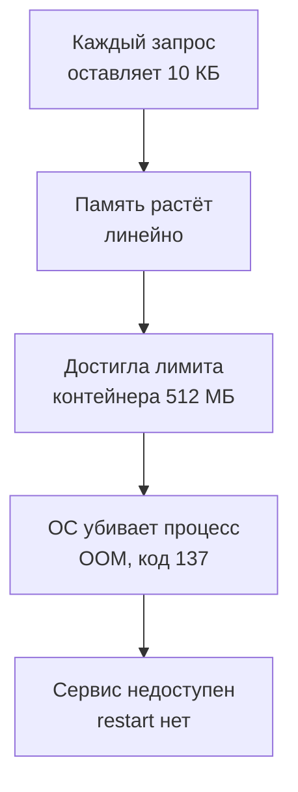

## Зачем это нужно

Все тесты из прошлых уроков короткие: минута, три минуты. За это время сервис выглядит прекрасно. Но есть класс проблем, которые за минуту не видны вообще: система медленно, незаметно деградирует. Утечка памяти (программа берёт память и не отдаёт), рост очереди, забивание диска логами, исчерпание файловых дескрипторов. Сервис работает неделю, а потом ночью его убивает операционная система, и утром нет ни метрик, ни понятной причины.

Для таких проблем придуман особый вид теста: **тест на выносливость** (soak test, «пропитка», endurance test). Нагрузка умеренная, но долгая: час, шесть часов, сутки. Цель не найти предел, а увидеть, что **со временем** ничего не растёт без остановки. В этом уроке ты запустишь такой тест на «Магазине» с включённой утечкой, поймаешь её по графику памяти, предскажешь время падения до того, как оно случится, и дашь точный отчёт.

Шаг проекта: ты включаешь в «Магазине» утечку (`LEAK_ENABLED=1`, имитация релиза с багом), запускаешь 20-минутный soak на 40 запросах в секунду, строишь график памяти, считаешь скорость утечки, подтверждаешь OOM (убийство по памяти) и сравниваешь с контрольным прогоном без утечки. Результат пойдёт в `~/perf-lab/11-bottlenecks/04-memory-soak.md`.

## Что нужно знать

- Метод «симптом, гипотеза, проверка, одно изменение» и скрипты `bn.js`, `set-env.sh`, `run.sh`: [урок 11.1](01-method.md).
- Типы тестов и профиль soak (ровная нагрузка долго): [урок 8.3](../08-perf-theory/03-test-types.md).
- Лимит памяти контейнера и сигнал 137: [урок 5.4](../05-docker/04-limits-stats.md); процессы и память в Linux: [урок 1.3](../01-linux/03-processes-resources.md).
- Метрики cAdvisor, `predict_linear`, `rate`: [урок 7.2](../07-observability/02-promql.md), [урок 7.4](../07-observability/04-exporters.md); алерт `ShopDown` и работа с инцидентом: [урок 7.6](../07-observability/06-alerts-incidents.md).
- Контейнер `shop` имеет `mem_limit: 512m`, политики перезапуска в `compose.yaml` нет (`restart` не задан).

## Картина целиком

Представь ванну с открытым краном и маленьким сливом. Пока воды мало, никто не замечает разницы. Каждую минуту прибавляется чуть-чуть, и в какой-то момент она переливается через край. Если измерять уровень воды минуту, ты увидишь «ничего не происходит». Если измерять час, увидишь прямую линию вверх. Утечка памяти работает так же: каждый запрос оставляет в памяти небольшой «осадок», который приложение не освобождает.

Что происходит дальше, на схеме:



Что здесь видно: утечка не ухудшает ответы постепенно, она их не ухудшает вообще, пока память не кончится. Потом приходит обрыв: процесс убит мгновенно, без предупреждений в логе приложения. Поэтому soak ищут не по задержке (график p95 ровный), а по **наклону графика памяти**.

## Теория

### Память процесса: что растёт нормально, что нет

**Зачем это понятие.** Без знания, как ведёт себя здоровая память, любой рост кажется утечкой, а настоящая утечка кажется «просто кэшем».

**Аналогия.** Рабочий стол. Утром пустой, к обеду на нём бумаги, чашки, ноутбук (прогрев). Дальше он выходит на плато: ты берёшь и убираешь, общий беспорядок постоянен. Утечка это когда каждый час на столе остаются два стакана, и никто их не уносит.

**Как это устроено.** Программа получает память у операционной системы и возвращает её по мере работы. У Python память управляется автоматически (подсчёт ссылок и сборщик мусора): объект, на который никто не ссылается, освобождается. **Утечка** (memory leak) это ситуация, когда ссылка остаётся: объект больше никому не нужен, но лежит в списке, словаре или кэше без ограничения, и сборщик мусора считает его нужным. Типичные источники: глобальный список, в который добавляют и никогда не чистят; кэш без лимита размера; незакрытые соединения и файлы; подписки на события без отписки.

Здоровая память сервиса ведёт себя по одному из трёх сценариев:

1. **Прогрев и плато**: в первые минуты растёт (загружаются модули, наполняются кэши, открываются соединения), потом ровная линия.
2. **«Пила»**: растёт и падает (сборщик мусора, кэш с вытеснением): в среднем ровно.
3. **Ступени**: растёт при появлении новых типов нагрузки.

Утечка выглядит как линия, которая **растёт без остановки и не возвращается**. Главный признак: наклон не зависит от времени, зависит только от числа запросов.

**Разобранный пример.** В «Магазине» утечка устроена просто (флаг `LEAK_ENABLED`): на каждый HTTP-запрос middleware (прослойка, вызываемая для всех запросов) добавляет в глобальный список блок `bytearray(10 * 1024)`, то есть 10 КБ. Список никогда не чистится. Одна копия приложения, 40 запросов в секунду: 40 × 10 КБ = 400 КБ в секунду, 24 МБ в минуту. Плюс запросы мониторинга (`/metrics`, `/healthz`, `/readyz`) тоже проходят через middleware: даже без нагрузки Prometheus стучится раз в 5 секунд, а Docker проверяет здоровье, и это около 0,4 запроса в секунду, то есть 14 МБ в час. Контейнер стартует с памятью около 118 МБ, лимит 512 МБ, значит, на утечку остаётся 394 МБ. При 24,5 МБ в минуту это 16 минут.

<div class="viz" data-viz="bn-leak" data-rps="40" data-kb="10" data-limit="512" data-base="118"></div>

Что здесь видно: серая «пила» это здоровая память, она колеблется около ровной линии, красная прямая это утечка с наклоном, зависящим от нагрузки и размера утечки на запрос. Точка на пересечении с лимитом это время OOM. Подвинь RPS: утечка идёт быстрее (при 10 запросах в секунду контейнер проживёт больше часа). Подвинь лимит: он сдвигает дедлайн, но не наклон.

**Что путают.** Путают утечку и кэш. Кэш тоже растёт, но у него есть предел (число элементов, TTL), и график выходит на плато. Путают память приложения с памятью контейнера: `container_memory_usage_bytes` включает страницы файлового кэша ядра (они вытесняемы), а `container_memory_working_set_bytes` это та часть, которую ядро не может освободить: именно её сравнивают с лимитом, и именно она решает, придёт ли OOM-killer. Ещё путают «память не падает после теста» с утечкой: Python часто не возвращает освобождённую память ОС, и график после нагрузки остаётся высоким, но **не растёт** при повторных прогонах. Проверка: второй такой же прогон не должен давать нового подъёма.

> **Проверь понимание:** ты видишь график памяти: за 10 минут теста она выросла со 120 до 280 МБ, потом четыре минуты стоит ровно на 280. Утечка?
>
> <details markdown="1">
> <summary>Ответ</summary>
>
> Скорее всего нет: рост с последующим плато это прогрев (кэши, пул соединений, выросший пул потоков). Утечка не останавливается, пока нагрузка идёт. Проверка: подольше подождать и прогнать ещё раз. Если после плато память всё равно ползёт вверх, или каждый новый прогон поднимает «потолок», тогда утечка.
>
> </details>

### OOM: что происходит, когда память кончилась

**Зачем это понятие.** Утечка опасна не как таковая, а тем, как заканчивается. Нужно понимать, что увидишь после обрыва и где искать следы.

**Аналогия.** Лифт с ограничением по весу. Пока груз растёт, лифт едет. Достигнут предел, и его блокирует предохранитель: не плавное замедление, а резкая остановка.

**Как это устроено.** У контейнера есть лимит `mem_limit: 512m`. Он реализован средствами ядра Linux (cgroup, группа контроля ресурсов): ядро считает память всех процессов контейнера. Когда сумма подходит к лимиту, ядро сначала выбрасывает то, что можно освободить (кэш файлов). Если не хватает, оно включает **OOM-killer** (Out Of Memory killer, «убийца при нехватке памяти»): выбирает процесс в контейнере и посылает ему сигнал `SIGKILL` (9), который нельзя перехватить. Процесс исчезает **без записи в свой лог**: он не успевает ни закрыть соединения, ни написать «умираю». Код выхода равен 128 + номер сигнала = 128 + 9 = **137**. Это знаменитое «137» в статусе контейнера. Docker также помечает `OOMKilled: true`.

Что будет дальше, зависит от политики перезапуска (`restart`). Если она не задана (как в нашем `compose.yaml`), контейнер остаётся в состоянии `Exited (137)`, и сервис недоступен до ручного запуска. Если задана `restart: unless-stopped`, Docker перезапустит контейнер, память обнулится, утечка начнётся заново, и сервис будет падать **циклически** раз в 16 минут. Перезапуск это **маскировка**, а не лечение.

**Разобранный пример.** Что ты увидишь после OOM:

- `docker compose ps -a` покажет `shop-shop-1 ... Exited (137) 2 minutes ago`;
- `docker inspect shop-shop-1 | jq '.[0].State'` покажет `"OOMKilled": true, "ExitCode": 137`;
- в Prometheus метрика `up{job="shop"}` станет 0, сработает алерт `ShopDown` (урок 7.6);
- в логах приложения **ничего особенного** перед концом: последняя строка обычная запись запроса. Это важно: «логи чистые» не значит «всё было хорошо»;
- в k6 в момент убийства пойдут `connection refused` и нарастёт доля ошибок до 100%.

**Что путают.** Путают код 137 с обычной ошибкой приложения (код 1) и ищут исключение в логе, а его нет. Путают OOM контейнера (лимит cgroup) и OOM всей машины (нехватка памяти у хоста): признаки схожи, но картина другая: при втором убиваются разные процессы, а не только в одном контейнере. Путают лимит и фактическое потребление: 512 МБ это потолок, а не обещание.

### Тест на выносливость: как он устроен

**Зачем он существует.** Чтобы поймать то, что видно только со временем: утечки, рост очередей, деградацию индексов, забитые диски, истекающие сертификаты и токены (у нашего `SESSION_TTL` час, токены протухают).

**Аналогия.** Проверка автомобиля: короткая поездка не покажет, что при долгой езде перегревается двигатель. Для такой проверки нужен долгий пробег на умеренной скорости, а не гонка.

**Как это устроено.** Профиль нагрузки soak это ровная нагрузка около 60-70% от предела, **долго**. Параметры выбирают так:

- **Нагрузка**: ниже предела, чтобы очереди не накапливались (иначе будешь мерить перегрузку, а не утечку). У «Магазина» после исправлений предел около 55 визитов в секунду, берём простой маршрут (карточка товара), который не упирается в базу.
- **Длительность**: достаточная, чтобы медленная проблема проявилась. Правило: хотя бы в 3-5 раз дольше, чем проблема должна проявляться, то есть для утечки со временем до OOM в 16 минут нужно 20+ минут. Для боевых систем часы и сутки.
- **Что смотрим**: не только задержки (они в утечке почти не меняются), но тренды: память, число соединений, размер очереди, открытые файлы, диск, потоки. Метрики с наклоном.
- **Разрешённая деградация**: не должно быть **монотонного роста** ничего, кроме того, что растёт по смыслу (размер таблиц).

<div class="viz" data-viz="load-profiles" data-only="soak"></div>

Что здесь видно: форма нагрузки soak ровная и долгая. Само нагрузочное значение скучно, а информативны графики, которые рядом с ним: память, соединения, диск.

**Разобранный пример.** План нашего soak: сценарий `product` из `bn.js` (карточка товара, один запрос на итерацию), постоянная частота 40 запросов в секунду (не 40 визитов), 20 минут. Токены не нужны, поэтому лимит жизни токена в час нас не касается (для долгих тестов других сценариев токены надо обновлять, а у `bn.js` они берутся один раз в `setup()`). Прогон идёт параллельно с наблюдением в Prometheus, и в конце считают наклон памяти. Тест такого типа стоит запускать **в фоне**, чтобы не держать терминал.

**Что путают.** Путают soak со stress: stress это нагрузка выше предела на короткое время, soak это ниже предела на долгое. И ждут от soak «красного p95»: если утечка не мешает ответам, p95 остаётся ровным до самого обрыва. Смотри на тренды.

### Что ещё растёт со временем, кроме памяти

**Зачем это знать.** Soak ищет не одну утечку, а любой ресурс, который накапливается. Если смотреть только память, остальные пропустишь.

**Как это устроено.** Типичный список «что тоже может течь», каждое со своей метрикой:

| Что растёт | Откуда берётся | Где смотреть |
|---|---|---|
| Открытые соединения | Не возвращены в пул, не закрыты клиенты | `shop_db_pool_available` падает к нулю и не восстанавливается |
| Файловые дескрипторы | Незакрытые файлы и сокеты (лимит `ulimit -n`, обычно 1024) | `process_open_fds`, при исчерпании ошибка `Too many open files` |
| Потоки | Потоки, которые создаются и не завершаются | число потоков в `py-spy dump` |
| Диск | Логи без ротации, временные файлы | `node_filesystem_avail_bytes` из node-exporter |
| Очередь или таблица | Задачи приходят быстрее, чем обрабатываются | длина очереди, размер таблицы |
| Время запроса | Таблица пухнет, индекс деградирует, `bloat` | p95 растёт медленно при **той же** нагрузке |

**Разобранный пример.** В нашем soak из этого списка течёт только память, и именно поэтому остальные графики важны как **контроль**: если соединения, диск и p95 на месте, ты можешь утверждать, что проблема локализована в памяти, а не искать её в трёх местах. Хороший отчёт soak содержит таблицу «что смотрели» с пометкой «растёт / не растёт» по каждому пункту.

**Что путают.** Принимают рост размера таблицы `orders` за проблему: он по смыслу растёт, ведь каждый тест создаёт заказы. Тревожит не размер, а то, что время запроса растёт при той же нагрузке: тогда виноват индекс или статистика.

### Как предсказать падение: производная и `predict_linear`

**Зачем это нужно.** Видеть, что память растёт, мало. Хочется знать **когда** она кончится: через 16 минут или через две недели. От ответа зависит срочность.

**Аналогия.** Бензобак с датчиком расхода: по скорости убывания и остатку ты считаешь, на сколько хватит.

**Как это устроено.** PromQL умеет оценивать наклон. Функция `deriv(m[10m])` возвращает среднюю скорость изменения метрики за 10 минут (байт в секунду). Функция `predict_linear(m[10m], 3600)` экстраполирует: какое значение метрика примет через 3600 секунд, если рост продолжится линейно. Запрос про память:

```text
predict_linear(container_memory_working_set_bytes{container_label_com_docker_compose_service="shop"}[10m], 3600)
```

Если ответ больше лимита, рост кончится убийством. Типичное правило алерта: `predict_linear(...[1h], 4*3600) > лимит` предупреждает за четыре часа. Такие алерты называют **предиктивными**.

**Разобранный пример.** Ровно через 5 минут soak мы увидим память 240 МБ (старт 118 МБ, 24,4 МБ в минуту). `deriv` за последние 4 минуты даёт 0,41 МБ в секунду (24,5 МБ в минуту). Оставшийся запас: 512 − 240 = 272 МБ. 272 / 24,5 = 11,1 минуты до OOM. Предсказание: падение примерно на шестнадцатой минуте, как и в расчёте. Простой расчёт, но он превращает «что-то растёт» в «через 11 минут упадёт»: это та точность, которую ждут от инженера.

**Что путают.** Считают наклон по слишком короткому окну: в первые минуты идёт прогрев, а не утечка, и предсказание завышено. Берут окно вне прогрева: смотрят последние 10 минут, не первые. И забывают, что линейный прогноз верен, пока нагрузка постоянна: удвоилась нагрузка, и утечка идёт вдвое быстрее.

### Как локализовать утечку и что делать

**Зачем это нужно.** Нашёл утечку: дальше надо понять, где она. Иначе починить нельзя.

**Как это устроено.** Порядок сужения:

1. **Подтвердить, что это утечка**: растёт монотонно, не выходит на плато, наклон пропорционален числу запросов (поменяй нагрузку и проверь наклон).
2. **Найти, от чего зависит**: от каких запросов. Прогони отдельно разные маршруты. Если растёт при любом запросе, утечка в общем коде (middleware, логирование, метрики), а если при одном маршруте, в обработчике.
3. **Профилировщик памяти**: у Python есть встроенный `tracemalloc` (запоминает, где выделена память, и по снимкам показывает, что выросло) и внешние `memray`, `objgraph`. Снимок до и после сравнивают и видят, какая строка кода выделила больше всего.
4. **Исправить код** (чистить, ограничить размер, закрывать).
5. **Повторить soak** и убедиться, что наклон стал нулевым.

Временные меры, которые **не лечат**: перезапуск по расписанию, `restart: unless-stopped`, увеличение лимита. Они дают отсрочку и маскируют проблему, поэтому их фиксируют как временные в отчёте.

**Разобранный пример.** В нашем стенде утечка включается переменной, поэтому шаг 2 дан: она в middleware, и растёт от **любого** запроса, включая `/healthz`. Проверка: на минуту остановить нагрузку и смотреть наклон: он не обнулится, останется маленький (0,4 запроса в секунду от мониторинга, 14 МБ в час). Это признак того, что утечка привязана к запросам вообще, а не к бизнес-логике. Лечение здесь выключатель `LEAK_ENABLED=0`: в настоящем проекте это правка кода и релиз.

**Что путают.** Считают, что утечку можно «вылечить» сборщиком мусора (`gc.collect()`): он освобождает только то, на что нет ссылок, а у утечки ссылка есть. Увеличивают лимит памяти и считают проблему решённой. Не повторяют soak после исправления.

## Практика

Стенд с мониторингом. В этом уроке вход не нужен, берём сценарий `product`. Для удобства Grafana открыта на `http://localhost:3000`. Перед началом проверь, что всё вернулось к исправленному виду из прошлого урока: `grep -E '^(LEAK_ENABLED|DB_POOL_MAX|BUG_N_PLUS_ONE)=' ~/load-tester/project/shop/.env` должен показать `LEAK_ENABLED=0`, `DB_POOL_MAX=15`, `BUG_N_PLUS_ONE=0`.

### 1. Контрольный soak: без утечки

Сначала проверяем, как выглядит **здоровая** память. Запусти 20-минутный прогон в фоне:

```bash
cd ~/perf-lab/11-bottlenecks
./run.sh soak-control SCENARIO=product RATE=40 DURATION=20m > /dev/null 2>&1 &
echo "soak-control запущен: $(date +%T)"
```

Разбор: `&` в конце запускает команду в фоне, `> /dev/null 2>&1` отправляет вывод на экран «в никуда» (результат всё равно сохранится в файл `~/perf-lab/results/11-soak-control.txt` скриптом `run.sh`). В течение 20 минут открой Grafana (Explore) или `promq.sh` и смотри память:

```bash
P=~/perf-lab/scripts/promq.sh; S='container_label_com_docker_compose_service'
$P "container_memory_working_set_bytes{$S=\"shop\"} / 1024 / 1024"
```

Запускай команду раз в пару минут, значения такие:

```text
  118.4
  121.0
  119.7
  122.2
  120.5
```

**Как читать вывод:** память колеблется около 120 МБ (разброс 2-4 МБ: «пила» сборщика мусора и буферов), общего роста нет. Так выглядит здоровый soak.

**Типичные ошибки:** `run.sh` выдаёт `connection refused` значит, что стенд не запущен; память растёт в первые 2-3 минуты на 10-20 МБ значит, что идёт прогрев (нормально), смотри с третьей минуты.

### 2. Включаем утечку: как будто «релиз с багом»

После контрольного прогона (когда он закончится) имитируем плохой релиз. Одно изменение:

```bash
./set-env.sh LEAK_ENABLED=1
```

Запиши гипотезу до запуска:

> Если приложение течёт по 10 КБ на запрос, то при 40 запросах в секунду память растёт на 24 МБ в минуту, стартует около 118 МБ и достигает лимита 512 МБ примерно на 16-17-й минуте. Если рост окажется выходить на плато, это не утечка.

Теперь 20-минутный прогон (дольше предсказанного падения):

```bash
./run.sh soak-leak SCENARIO=product RATE=40 DURATION=20m > /dev/null 2>&1 &
echo "soak-leak запущен: $(date +%T)"
```

### 3. Наблюдение: график, наклон, прогноз

Пока идёт прогон, в Grafana (Explore, источник Prometheus) построй график: `container_memory_working_set_bytes{container_label_com_docker_compose_service="shop"} / 1024 / 1024`. Через 5 минут снимай три показания:

```bash
$P "container_memory_working_set_bytes{$S=\"shop\"} / 1024 / 1024"
$P "deriv(container_memory_working_set_bytes{$S=\"shop\"}[4m]) * 60 / 1024 / 1024"
$P "predict_linear(container_memory_working_set_bytes{$S=\"shop\"}[4m], 600) / 1024 / 1024"
```

Разбор: первая строка это текущая память в МБ. Вторая `deriv(...)` скорость роста в байтах в секунду, умноженная на 60 даёт «за минуту» и деление на 1024 дважды переводит в МБ. Третья `predict_linear(..., 600)` это прогноз на 600 секунд (10 минут) вперёд, в МБ.

```text
  241.8
  24.6
  487.3
```

**Как читать вывод:** память 242 МБ, растёт на 24,6 МБ в минуту (это 40 запросов в секунду по 10 КБ плюс запросы мониторинга), прогноз через 10 минут 487 МБ: ещё ниже лимита, но через 11 минут будет 512. Расчёт до OOM: (512 − 242) / 24,6 = 11 минут. Если твои значения близки, гипотеза держится.

Для убедительности проверь, что наклон привязан к числу запросов. Хватит одной минуты проверки: `deriv` на текущем RPS 40 даёт 24,6, а число запросов Prometheus тоже знает: `sum(rate(http_requests_total[1m]))` вернёт около 40,4 (вместе с `/metrics`). 24,6 МБ в минуту / (40,4 × 60) = 10,4 КБ на запрос: ровно 10 КБ плюс накладные расходы на список. Это количественное подтверждение механизма.

<div class="viz" data-viz="chart" data-type="line" data-x="0,2,4,6,8,10,12,14,16" data-x-label="Минуты теста" data-y-label="Память shop, МБ" data-unit="МБ" data-explain="Серая линия: контрольный прогон, память около 120 МБ без роста. Красная: с утечкой, на каждый запрос остаётся 10 КБ, прирост 24,5 МБ в минуту. На шестнадцатой минуте линия упирается в лимит 512 МБ и контейнер убит." data-series='[{"name":"без утечки","values":[118,121,119,122,120,121,119,122,120],"unit":"МБ"},{"name":"с утечкой","values":[118,167,216,265,314,363,412,461,510],"unit":"МБ"}]'></div>

Что здесь видно: две линии на одном графике. Серая ровная, красная идёт вверх почти прямой и без остановки. Задержки (p95) в это время обеих одинаковые, около 12 мс: они бы **не выдали** проблему.

### 4. Что случилось: OOM

На шестнадцатой-семнадцатой минуте прогон начнёт сыпать ошибками. После конца прогона (или в момент падения):

```bash
cd ~/load-tester/project/shop
docker compose ps -a shop
docker inspect shop-shop-1 | jq '.[0].State | {Status, ExitCode, OOMKilled}'
docker compose logs --tail 3 shop
```

```text
NAME         IMAGE       COMMAND                  SERVICE   CREATED          STATUS                       PORTS
shop-shop-1  shop-shop   "/entrypoint.sh"         shop      28 minutes ago   Exited (137) 3 minutes ago

{
  "Status": "exited",
  "ExitCode": 137,
  "OOMKilled": true
}

shop-1  | {"ts": "2026-10-03T10:41:07+00:00", "level": "INFO", "msg": "Запрос завершён", "method": "GET", "route": "/api/products/{id}", "path": "/api/products/87", "status": 200, "duration_ms": 11.8, "request_id": "..."}
shop-1  | {"ts": "2026-10-03T10:41:07+00:00", "level": "INFO", "msg": "Запрос завершён", "method": "GET", "route": "/api/products/{id}", "path": "/api/products/12", "status": 200, "duration_ms": 10.2, "request_id": "..."}
shop-1  | {"ts": "2026-10-03T10:41:07+00:00", "level": "INFO", "msg": "Запрос завершён", "method": "GET", "route": "/api/products/{id}", "path": "/api/products/190", "status": 200, "duration_ms": 12.4, "request_id": "..."}
```

**Как читать вывод:** `Exited (137)` и `OOMKilled: true` это приговор: контейнер убит по памяти. Последние строки лога совершенно обычные: никакого сообщения об ошибке перед концом, процесс убит мгновенно. Ошибка в логе приложения не будет: это то самое наблюдение, которое новичков сбивает с толку.

В Prometheus проверь, что алерт сработал: `curl -s localhost:9090/api/v1/alerts | jq '.data.alerts[].labels.alertname'`: среди результатов `ShopDown`.

**Типичные ошибки:** `OOMKilled: false` при коде 137 значит, что контейнер остановил кто-то вручную (`docker kill`) или убила вся система, а не лимит cgroup; `docker compose ps -a` показывает `Up` значит, что прогон ещё не дошёл до предела: подожди; на Docker Desktop для Mac память виртуальной машины может быть меньше 512 МБ, и убьёт раньше (проверь настройки Resources).

Результат прогона в k6:

```bash
grep -E "http_req_failed|iterations|connection refused" ~/perf-lab/results/11-soak-leak.txt | head -5
```

Ожидаем долю ошибок около 20% (последние 4 минуты из 20) и сообщения `connection refused`.

### 5. Исправление и повторный soak

Исправление в стенде это выключатель (в настоящем проекте была бы правка кода). Одно изменение:

```bash
cd ~/perf-lab/11-bottlenecks
./set-env.sh LEAK_ENABLED=0
./run.sh soak-fixed SCENARIO=product RATE=40 DURATION=20m > /dev/null 2>&1 &
```

Через 20 минут снимай `deriv`: он должен быть около нуля (±0,2 МБ в минуту), память около 120 МБ, ошибок нет. Это замыкает цикл: симптом (рост памяти), гипотеза (10 КБ на запрос), проверка (наклон, число запросов), одно изменение, повторный прогон, итог (наклон нулевой). Без повторного прогона исправление не доказано.

### 6. Вывод и коммит

Допиши `~/perf-lab/11-bottlenecks/04-memory-soak.md`:

```markdown
# 11.4. Память: soak

## Условия
SCENARIO=product, 40 запросов/с, 20 минут, mem_limit 512 МБ, исправленная БД.

## Контроль (без утечки)
Память около 120 МБ ±3, наклон 0.

## С LEAK_ENABLED=1
Старт 118 МБ, рост 24,6 МБ/мин (10,4 КБ на запрос), прогноз в минуту 5: падение через 11 минут.
Факт: OOM на 16-й минуте, Exited (137), OOMKilled=true. p95 всё время около 12 мс. Алерт ShopDown сработал.

## Исправление
LEAK_ENABLED=0 (в настоящем проекте: правка кода). Повторный soak: наклон 0, ошибок нет.

## Временные меры (не лечат)
restart: unless-stopped, лимит памяти больше: только отсрочка.
```

```bash
cd ~/perf-lab
git add 11-bottlenecks results/11-soak-*.txt
git commit -m "11.4: soak и утечка памяти"
git push
```

## Сломай и почини

**Поломка:** повтори падение, но на этот раз «чини перезапуском». Добавь надстройку с политикой перезапуска и снова включи утечку:

```bash
cat > ~/perf-lab/11-bottlenecks/restart.yaml <<'EOF'
services:
  shop:
    restart: unless-stopped
EOF
cd ~/load-tester/project/shop
export COMPOSE_FILE=compose.yaml:$HOME/perf-lab/11-bottlenecks/restart.yaml
cd ~/perf-lab/11-bottlenecks
./set-env.sh LEAK_ENABLED=1
./run.sh soak-restart SCENARIO=product RATE=40 DURATION=40m > /dev/null 2>&1 &
```

Что произойдёт: сервис упадёт на 16-й минуте, но Docker поднимет его, и память начнёт расти сначала. Ты увидишь «зубья пилы» с периодом 16 минут: на графике память растёт, падает до 118, растёт снова. В `docker inspect` счётчик `RestartCount` растёт. Ошибок в k6 теперь меньше (несколько секунд простоя на каждый перезапуск), и кажется, что проблема «решена». Но каждый раз пользователи получают разрыв соединений, сессии в процессе теряются, а ночью никто не заметит повторяющегося падения, потому что алерты тоже перестают срабатывать (сервис быстро возвращается).

**Диагностика:** `docker inspect shop-shop-1 | jq '.[0].RestartCount'` показывает число перезапусков, а запрос `changes(container_start_time_seconds{container_label_com_docker_compose_service="shop"}[1h])` в Prometheus показывает частоту. Зубчатый график памяти с периодом, постоянным при данной нагрузке, это сигнатура «утечка плюс перезапуск».

**Решение:** перезапуск не лечит, а прячет. Убери надстройку (`unset COMPOSE_FILE`, `rm ~/perf-lab/11-bottlenecks/restart.yaml`), верни `LEAK_ENABLED=0`, пересоздай контейнер (`docker compose up -d --force-recreate --wait shop` из `project/shop`). Правило для отчёта: политика перезапуска нужна всегда как страховка, но алерт на **число перезапусков** обязателен, иначе утечка станет невидимой.

## Словарик урока

| Термин | Простыми словами |
|---|---|
| Утечка памяти | Программа берёт память и не освобождает: ссылка остаётся, хотя объект не нужен |
| Soak test (тест на выносливость) | Умеренная нагрузка долго: ищет медленную деградацию |
| `working_set` | Часть памяти контейнера, которую ядро не может освободить: она решает, придёт ли OOM |
| OOM-killer | Механизм ядра, убивающий процесс, когда память кончилась |
| OOMKilled | Отметка Docker, что контейнер убит по лимиту памяти |
| Код выхода 137 | 128 + 9: процесс убит сигналом SIGKILL |
| cgroup | Механизм ядра Linux, ограничивающий и считающий ресурсы группы процессов |
| `deriv` | Функция PromQL: скорость изменения метрики за окно |
| `predict_linear` | Функция PromQL: значение метрики через заданное время при линейном росте |
| Плато | Выход графика на ровную линию после роста (прогрев, кэш с лимитом) |
| Политика `restart` | Что Docker делает с остановившимся контейнером: перезапускает или нет |
| Предиктивный алерт | Предупреждение по прогнозу: «упадёт через N часов» |
| `tracemalloc` | Встроенный в Python инструмент: показывает, где выделена память |

## Вопросы с собеседований

Раздел для повторения: ответь вслух, потом открой ответ.

### 1. [junior] [часто] Что такое soak-тест и что он находит?

<details markdown="1">
<summary>Ответ</summary>

Ровная умеренная нагрузка долгое время (часы, сутки). Находит проблемы, проявляющиеся со временем: утечки памяти, рост очередей и соединений, забитый диск, истекающие токены и сертификаты. Короткий тест их не покажет.

**Что хотят услышать:** умеренная нагрузка, долго, тренды, примеры проблем.

**Красный флаг:** путают с стресс-тестом (нагрузка выше предела на короткое время).

</details>

### 2. [junior] [часто] Как отличить утечку памяти от обычного роста?

<details markdown="1">
<summary>Ответ</summary>

Обычный рост (прогрев, кэш) выходит на плато или имеет лимит. Утечка растёт монотонно, не останавливается, наклон зависит от числа запросов, и повторные прогоны поднимают потолок. Проверяют длительным прогоном и сравнением наклона при разной нагрузке.

**Что хотят услышать:** плато против бесконечного роста, зависимость от нагрузки.

**Красный флаг:** «память выросла, значит утечка» после двух минут теста.

</details>

### 3. [junior] [часто] Что означает код выхода 137 у контейнера?

<details markdown="1">
<summary>Ответ</summary>

Процесс убит сигналом SIGKILL (128 + 9). Чаще всего это OOM-killer: контейнер превысил лимит памяти. Подтверждение: `OOMKilled: true` в `docker inspect`. В логе приложения следов не будет: процесс не успевает ничего написать.

**Что хотят услышать:** 128 + 9, OOM, проверка `OOMKilled`, отсутствие записей в логе.

**Красный флаг:** искать исключение в логе приложения.

</details>

### 4. [junior] Какую метрику памяти контейнера сравнивать с лимитом?

<details markdown="1">
<summary>Ответ</summary>

`container_memory_working_set_bytes`: это память, которую ядро не может освободить без убийства процессов. `usage_bytes` включает вытесняемый файловый кэш и даёт ложную тревогу.

**Что хотят услышать:** working set, причина.

**Красный флаг:** брать `usage` без разбора.

</details>

### 5. [middle] Как предсказать, когда сервис упадёт по памяти?

<details markdown="1">
<summary>Ответ</summary>

Измерить наклон: `deriv(memory[10m])`, остаток до лимита разделить на наклон. В Prometheus: `predict_linear(memory[1h], N)`, и если ответ больше лимита, будет OOM. Окно брать после прогрева, нагрузка должна быть стабильной.

**Что хотят услышать:** производная или `predict_linear`, оговорки про прогрев и постоянство нагрузки.

**Красный флаг:** «посмотрим по графику на глаз».

</details>

### 6. [middle] Почему перезапуск контейнера не лечит утечку?

<details markdown="1">
<summary>Ответ</summary>

Он обнуляет память, но причина остаётся, утечка начинается снова. Сервис падает циклически, пользователи теряют соединения и сессии, а алерты на недоступность могут не срабатывать из-за быстрого возврата. Перезапуск остаётся страховкой, но нужен алерт на число перезапусков и исправление кода.

**Что хотят услышать:** маскировка, цикл, алерт на перезапуски.

**Красный флаг:** «настроим перезапуск по расписанию, и всё».

</details>

### 7. [middle] Как найти место утечки в Python-приложении?

<details markdown="1">
<summary>Ответ</summary>

Сузить: от каких запросов растёт. Затем профилировщик памяти (`tracemalloc` со снимками до и после, `memray`, `objgraph`): они показывают строки кода, где выросла память. Исправить (ограничить кэш, чистить структуру), повторить soak и убедиться, что наклон нулевой.

**Что хотят услышать:** локализация, инструменты, повторный soak.

**Красный флаг:** `gc.collect()` как лечение.

</details>

### 8. [middle] Какой длины должен быть soak-тест и какая нагрузка?

<details markdown="1">
<summary>Ответ</summary>

Нагрузка 60-70% от предела (чтобы не копились очереди), длительность в несколько раз больше, чем нужно проблеме проявиться: для утечки с OOM через 16 минут минимум 20-30, на практике часы или сутки. Смотреть тренды памяти, соединений, диска, а не только p95.

**Что хотят услышать:** ниже предела, долго, тренды.

**Красный флаг:** soak на 5 минут.

</details>

### 9. [на скорость] Чему равен код выхода при SIGKILL?

<details markdown="1">
<summary>Ответ</summary>

137 (128 + 9).

</details>

### 10. [на скорость] Какая функция PromQL оценивает скорость роста метрики?

<details markdown="1">
<summary>Ответ</summary>

`deriv` (для gauge), а прогноз на будущее даёт `predict_linear`.

</details>

### 11. [на скорость] Задержки в утечке растут?

<details markdown="1">
<summary>Ответ</summary>

Обычно нет, пока память не кончилась. Утечку видно по тренду памяти, не по p95.

</details>

## Проверено на версиях

Docker Compose v2, контейнер `shop` с `mem_limit: 512m`, Prometheus 3.15 (`deriv`, `predict_linear`), cAdvisor, Grafana 13.2, k6 2.3. Числа получены расчётом по коду стенда (10 КБ на запрос), на твоём ноутбуке старт памяти и время падения могут отличаться на несколько минут. Октябрь 2026.

## Итог урока: ты умеешь

- [ ] Отличать утечку от прогрева и кэша по форме графика.
- [ ] Проектировать soak: нагрузка ниже предела, длительность с запасом, метрики-тренды.
- [ ] Считать скорость утечки и предсказывать время до OOM по `deriv` и `predict_linear`.
- [ ] Узнавать OOM по коду 137 и `OOMKilled: true` и понимать, почему в логе пусто.
- [ ] Объяснять, почему перезапуск маскирует, а не лечит, и ставить алерт на перезапуски.
- [ ] Подтверждать исправление повторным soak с нулевым наклоном.

Дальше: [урок 11.5. Кэш, внешние зависимости, таймауты и ретраи](05-cache-dependencies.md), последний урок темы: ускоряем «Магазин» кэшем и ломаем его медленной оплатой.
