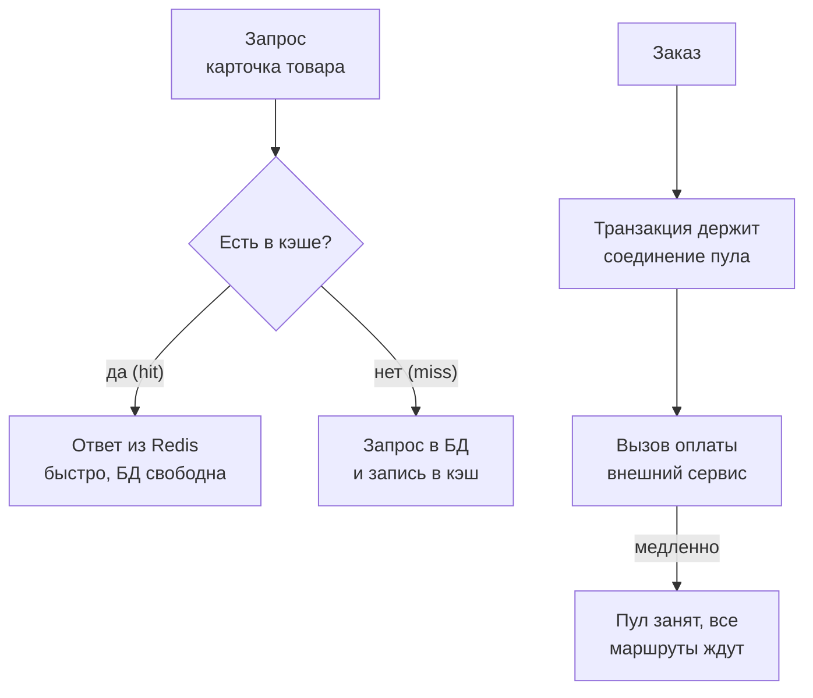

## Зачем это нужно

Я твой наставник: опытный коллега, который сидит рядом и смотрит на тот же стенд. Вот история из нашей работы. Тест показал, что при тройной нагрузке всё встаёт, и мы прошли базу, процессор и память. Остались два подозреваемых, и они зеркальны. Первый друг: **кэш**, быстрое временное хранилище готовых ответов. Второй враг: **внешняя зависимость**, всё, что сервис вызывает по сети и чем не владеет (платёжный шлюз, почта, чужое API). Починить её ты не можешь, но обязан пережить её сбой.

Кэш способен ускорить сервис в разы и разгрузить базу, но только если не обманываться цифрами. Медленная зависимость способна положить **весь** сервис, а повторные попытки (ретраи), добавленные «для надёжности», превращают небольшой сбой в лавину. Оба явления видны только под нагрузкой, поэтому их находят нагрузочные инженеры. Я однажды включил три ретрая «для надёжности» и сам устроил себе шторм.

Шаг проекта: ты включаешь кэш карточек товаров и измеряешь выигрыш (доля попаданий, нагрузка на базу, p95) и проверяешь ловушки кэша. Затем замедляешь заглушку оплаты и смотришь, как один чужой сервис ломает все маршруты. Исправляешь таймаутами и ретраями и записываешь итог всей темы в `~/perf-lab/11-bottlenecks/05-cache-dependencies.md`.

## Что нужно знать

- Метод и скрипты `bn.js`, `set-env.sh`, `run.sh`: [урок 11.1](01-method.md); пул соединений, N+1 и «узкое место переезжает»: [урок 11.3](03-database.md).
- Redis и ключи со сроком жизни: [урок 2.3](../02-web/03-backend-anatomy.md); как кэш подключён в «Магазине»: `CACHE_ENABLED`, `CACHE_TTL`.
- Закон Литтла и очереди: [урок 8.2](../08-perf-theory/02-queues-littles-law.md); хоккейная клюшка: [урок 8.1](../08-perf-theory/01-latency-throughput.md).
- Метрики `shop_cache_requests_total`, `shop_payment_requests_total` и PromQL `rate`, `histogram_quantile`: [урок 7.2](../07-observability/02-promql.md).
- Заглушка оплаты на порту 8001 и её `/admin/config` (задержка и доля ошибок меняются на лету): [описание стенда](../05-docker/03-compose-shop.md).
- Настройки `.env`: `CACHE_ENABLED=0`, `CACHE_TTL=60`, `PAYMENT_TIMEOUT=10`, `PAYMENT_RETRIES=3`.

## Картина целиком

Пиццерия. Кухня это база: пицца печётся 10 минут. Пятьдесят человек заказывают «Маргариту», повар печёт пятьдесят пицц подряд, очередь растёт. Умный менеджер держит под лампой десяток готовых: покупатель берёт за секунду, кухня занята редкими заказами. Это кэш, и у него свои проблемы: пицца под лампой остывает (данные устаревают). Во второй половине пиццерия заказывает тесто у стороннего поставщика. Поставщик задерживает, повара стоят и ждут, касса закрыта для всех, даже для тех, кто хотел кофе. А если менеджер при каждой задержке звонит поставщику ещё три раза, тот получает вчетверо больше звонков.



Верхняя часть показывает выигрыш кэша, нижняя опасность: вызов внешнего сервиса **внутри** транзакции удерживает дефицитное соединение пула на время чужой работы.

## Теория

### Кэш: зачем он и как измерить пользу

Одну карточку популярного товара смотрят тысячи людей. Заново читать её из базы каждый раз значит тратить процессор базы и соединения пула на одинаковую работу.

Это шпаргалка: ты записываешь ответ на карточку и достаёшь её за секунду, а не листаешь учебник. Шпаргалка не знает, что учебник обновили, и тогда ты уверенно даёшь неверный ответ.

В «Магазине» кэш это Redis (хранилище «ключ, значение» в памяти). При `CACHE_ENABLED=1` обработчик карточки смотрит ключ `product:<id>`. Нашёл: отдаёт готовый ответ (**hit**, попадание). Не нашёл (**miss**, промах): идёт в базу, кладёт результат в Redis на `CACHE_TTL` секунд (по умолчанию 60) и отдаёт. Когда время вышло, запись истекает (**TTL**, time to live, время жизни), и следующий запрос снова идёт в базу. Каждое обращение считает метрика `shop_cache_requests_total{result="hit"|"miss"}`.

Главная метрика кэша: **hit ratio** (доля попаданий), то есть hits / (hits + misses). При 90% база видит только 10% прежней нагрузки, при 50% половину, а при 10% кэш почти бесполезен.

Посчитаем для «Магазина». Допустим, 80% запросов приходятся на 200 «горячих» товаров из 10 000, остальные 20% рассыпаны по каталогу. Горячий товар запрашивают раз в секунду-две, значит, за минуту он промахнётся один раз, остальные раз пятьдесят попадёт: около 99%. Холодных запросов 50 в секунду на 10 000 товаров, каждый товар приходит раз в 200 секунд, и запись успевает истечь: попаданий около четверти. Итого 0,8 × 0,99 + 0,2 × 0,26 ≈ 0,84.

> **Прикинь сам:** при 250 запросах в секунду и hit ratio 84% сколько запросов доходит до базы?
{: .predict}

Промахи это 16%: 250 × 0,16 = 40 запросов в секунду вместо 250. Вот что это даёт (ориентировочные числа):

| Показатель | Без кэша | С кэшем (TTL 60 с) |
|---|---|---|
| Запросов к базе | 250/с | около 40/с |
| p95 карточки | 38 мс | 11 мс |
| CPU shop | 78% | 58% |
| CPU postgres | 55% | 10% |

База разгрузилась в шесть раз, p95 упал в три с половиной раза. Даже процессору приложения стало легче: прочитать из Redis дешевле, чем разобрать ответ базы.

<div class="viz" data-viz="hockey-stick" data-capacity="430" data-base="11" data-load="250" data-unit="запросов/с"></div>

Это график «нагрузка против задержки» для сервиса с кэшем: предел около 430 запросов в секунду, а на 250 мы далеко от колена. Без кэша предел был около 320. Кэш поднял потолок, но не убрал его.

Осторожно: если тест просит один и тот же товар, кэш прогреется за секунду, и ты увидишь результат, которого в жизни не будет. Распределение запросов в тесте должно быть похоже на настоящее (поэтому в `bn.js` 80% на горячие товары). Ещё есть **холодный старт**: после очистки кэша все запросы идут в базу, и она должна выдержать полную нагрузку.

> **Проверь понимание:** hit ratio 90%, нагрузка 1000 запросов в секунду. Сколько запросов видит база? Что будет, если перезапустить Redis?
>
> <details markdown="1">
> <summary>Ответ</summary>
>
> База видит 10%, то есть 100 запросов в секунду. После перезапуска Redis кэш пуст, hit ratio падает почти до нуля, и база получает все 1000, а справиться может со своими ста: очередь, пул переполнен. База должна выдерживать нагрузку и без кэша, хотя бы на время прогрева.
>
> </details>

> **Главное:** польза кэша равна hit ratio, а база должна выдерживать нагрузку и без него хотя бы на время прогрева.
{: .key}

Кэш быстрый. Но всегда ли он говорит правду?

### Ловушки кэша: устаревшие данные и инвалидация

Администратор поправил цену товара, а покупатель всё ещё видит старую. Кэш отдал неправду, и это не баг, а его свойство.

Как табло в аэропорту, которое обновляется раз в минуту: рейс задержали, а на табло «по расписанию». Данные в кэше устаревают, как только изменятся в базе. Есть два способа это лечить: ждать истечения TTL (просто, но с задержкой) и **инвалидация** (invalidation): явно удалить запись при изменении. В «Магазине» инвалидация одна: после успешного заказа код удаляет ключи `product:<id>` купленных товаров. Всё остальное держится на TTL.

Проверь руками. С включённым кэшем: `curl localhost:8000/api/products/1` (цена, например, 137). Потом `UPDATE products SET price = 1 WHERE id = 1` прямо в базе и снова `curl`: придёт 137, а не 1. Через минуту, когда ключ истечёт, придёт 1. Ты обменял свежесть данных на скорость.

> **Прикинь сам:** для каких полей карточки минута неточности допустима, а для каких нет?
{: .predict}

Описание товара подождёт минуту. А вот остаток (`stock`) и цену в корзине так показывать нельзя. В «Магазине» заказ проверяет остаток в базе (`SELECT ... FOR UPDATE`), поэтому купить отсутствующий товар нельзя, но устаревшее число показать можно.

<details markdown="1">
<summary>Для любопытных: гонка и давка</summary>

Гонка чтения и инвалидации: запрос A прочитал старую цену, цена поменялась, кэш очистили, и A записал старую цену обратно. Она пролежит до конца TTL. Давка (cache stampede): популярный ключ истёк, и сотни параллельных запросов одновременно идут в базу за одним и тем же. Защита: блокировка на ключ, случайный разброс TTL (jitter), прогрев.

</details>

Осторожно: нагрузочный тест кэша должен проверять не только скорость, но и корректность. Например, заказ должен идти по актуальной цене: код читает её из базы, а не из кэша.

> **Главное:** кэш меняет свежесть на скорость, и для каждого поля решай, допустима ли минута неточности.
{: .key}

Кэш мы приручили. Теперь вторая половина: что делать, когда тормозит чужой сервис.

### Внешняя зависимость: чужое время становится твоим

Оплата тормозит, а каталог, который оплату вообще не вызывает, тоже лёг. Как так?

Магазин ждёт доставку от курьерской службы. Служба задерживается, и если ты не разрешаешь выдать клиенту заказ без доставки, весь магазин стоит в очереди ждущих заказов.

В `create_order` код начинает транзакцию, блокирует строки товаров (`SELECT ... FOR UPDATE`), вставляет заказ, обновляет остатки, **вызывает оплату** `pay()` и только потом завершает транзакцию. Это намеренный антипаттерн. Пока идёт сетевой вызов, удерживаются три вещи: соединение из пула (оно занято, хотя база ничего не делает), блокировки строк (другие заказы на те же товары ждут) и поток обработчика.

Если оплата отвечает за 50 мс, это незаметно. Если за 2 секунды, соединение занято 2 секунды вместо 50 мс. По закону Литтла каждое соединение даёт 1 / время_удержания заказов в секунду: при пуле 15 получается 15 / 2 = 7,5 заказов в секунду. Заказов приходит больше, а соединения нужны **всем** маршрутам: список товаров, карточка и корзина берут их из того же пула.

<div class="viz" data-viz="pool" data-size="15" data-duration="2000" data-rate="12" data-timeout="5000"></div>

Пул из 15 соединений, каждое держится две секунды, приходит 12 заказов в секунду, а освобождается 7,5. Очередь растёт, и ждущие запросы получают отказ по таймауту пула (5 с).

Вот что покажет прогон mix при 10 визитах в секунду и задержке оплаты 2000 мс (её меняет `POST /admin/config` на порту 8001). Базовая линия: p95 0,11 с, ошибок 0.

| Маршрут | p95 до | p95 при задержке оплаты 2 с | Доля 503 |
|---|---|---|---|
| `/api/products` (каталог) | 0,05 с | 5,1 с | 35% |
| `/api/products/[id]` | 0,03 с | 5,0 с | 35% |
| `POST /api/orders` | 0,08 с | 7,3 с | 45% |
| `GET /api/orders` | 0,10 с | 5,2 с | 36% |

Тормозит **всё**: p95 около 5 секунд (таймаут пула, `DB_POOL_TIMEOUT=5`), а 35% запросов получают 503 `database pool timeout`. Для пользователя «сайт лёг», хотя причина в чужом сервисе. Это **каскадный отказ** (cascading failure): сбой в одном месте разрастается на соседние.

> **Прикинь сам:** где в этой картине искать виновника, если процессор postgres почти пуст?
{: .predict}

Транзакции ждут оплату, а не работают. По дереву из [урока 11.1](01-method.md): CPU shop низкий, ждут соединения (`shop_db_pool_waiting` высок), процессор базы не упёрт. Значит, соединения удерживаются зря: подозрение на зависимость. Подтверждают `shop_payment_duration_seconds` и длительность `POST /api/orders` при здоровой базе.

Осторожно: не ищи причину в базе, она тут жертва. И не путай таймаут пула (сколько ждать свободного соединения) с таймаутом оплаты (сколько ждать ответа).

> **Главное:** вызов чужого сервиса внутри транзакции превращает его медленность в нехватку соединений для всех маршрутов.
{: .key}

Значит, ждать ответа надо ограниченное время. Сколько?

### Таймауты: сколько ждать внешнего сервиса

Без таймаута вызов к зависшему сервису ждёт вечно и навсегда занимает твои соединения и потоки. Таймаут это лимит ожидания: дальше ты сдаёшься и возвращаешь ошибку. Это как звонок в службу: полминуты гудков можно, дольше нет смысла.

Выбирай таймаут по тому, сколько зависимость отвечает **в норме** и сколько готов ждать клиент. Оплата в норме отвечает за 50 мс, значит, `PAYMENT_TIMEOUT=10` (по умолчанию) слишком щедр: клиент уйдёт раньше. Правило: примерно в 3-5 раз больше p99 нормальной работы, но не дольше терпения пользователя (3-5 секунд для веб-запроса). Для httpx в `shop` одно значение применяется ко всем стадиям вызова.

Сравним на задержке оплаты 2 секунды:

| `PAYMENT_TIMEOUT` | Что с заказом | Соединение держится |
|---|---|---|
| 10 с | оплата успевает (2 с), заказ создан | 2 с |
| 3 с | то же, запас 1 с | 2 с |
| 1 с | таймаут, 504 «payment timeout» (после повторов), заказ не создан | 1 с на попытку |

> **Прикинь сам:** при таймауте 1 с и задержке оплаты 2 с заказ создаётся?
{: .predict}

Нет: оплата не успевает, и все заказы превращаются в ошибки. При этом заглушка всё равно доделает работу, и деньги могли бы списаться, хотя клиент получил ошибку (**зомби-работа**). Поэтому у настоящих платёжных вызовов есть **идемпотентные ключи**: повтор с тем же ключом не списывает дважды (в учебном стенде их нет).

Осторожно: «таймаут сработал» не значит «операция не выполнилась»: на стороне зависимости работа могла завершиться.

> **Главное:** таймаут выбирают по норме зависимости и терпению пользователя: короткий превращает медленное в ошибки, длинный держит соединение.
{: .key}

Таймаут ограничивает одну попытку. А если попыток несколько?

### Ретраи: когда повтор помогает и когда убивает

Сбои бывают случайными: потерялась посылка, миг перегрузки. Повторная попытка часто проходит. Но звонить занятому абоненту каждую секунду разумно, а десять раз в секунду значит мешать ему освободиться.

`pay()` делает до `PAYMENT_RETRIES + 1` попыток (при 3 это четыре) **без паузы**: упала одна, сразу вторая. Каждая неудача занимает до таймаута, и соединение пула держится всё это время. Получается три беды. Усиление нагрузки: вместо одного запроса на зависимость идёт до четырёх, и именно когда ей плохо. Сбой на 10 секунд растягивается в минуты (**шторм ретраев**, retry storm). Удержание ресурсов: четыре попытки по таймауту 1 с держат соединение 4 секунды. Синхронность: сотни клиентов повторяют одновременно, и пики складываются (**thundering herd**, «стадо»).

Посчитаем. Нормальный поток 12 заказов в секунду, предел оплаты 30 попыток в секунду. Без сбоя это 12 попыток в секунду, всё нормально. Во время сбоя при `PAYMENT_RETRIES=3` каждый заказ делает 4 попытки: 12 × 4 = 48 в секунду, выше предела 30. Оплата перегружена, ошибки растут, ждущих клиентов больше, и повторов тоже. С `PAYMENT_RETRIES=0` остаются 12 попыток в секунду, и оплата восстанавливается сразу.

<div class="viz" data-viz="bn-retry-storm" data-rate="12" data-capacity="30" data-retries="3" data-timeout="1" data-blip="10"></div>

Верхняя панель показывает попытки к оплате против предела (линия), нижняя успешные заказы. Включи режим «без пауз» с тремя повторами: во время сбоя попытки взлетают выше предела и остаются там и после сбоя. Переключи на «с паузой» или «бюджет повторов»: система восстанавливается.

> **Прикинь сам:** оплата упала, `PAYMENT_RETRIES=3`, заказов 8 в секунду, предел оплаты 25. Сколько запросов в секунду вы ей шлёте?
{: .predict}

8 × 4 = 32, выше предела 25: оплата не оправится, пока вы продолжаете ретраить.

<details markdown="1">
<summary>Для любопытных: правильные приёмы</summary>

Экспоненциальная пауза с джиттером (exponential backoff with jitter): ждать 0,1 с, 0,2 с, 0,4 с и так далее плюс случайный разброс. Бюджет ретраев: повторов не больше, скажем, 10% от общего числа запросов. Выключатель (circuit breaker): при высоком проценте ошибок на время перестать вызывать зависимость и быстро отдавать ошибку. Не ретраить ошибки клиента (4xx) и неидемпотентные операции без ключа. Главное исправление для нашего антипаттерна: вынести вызов из транзакции. Сначала зафиксировать заказ в статусе `pending` и освободить соединение, потом вызвать оплату и обновить статус. Тогда медленная оплата держит только поток, а не дефицитное соединение. В учебном стенде это потребовало бы правки кода, поэтому мы ограничиваемся настройками, а в отчёте пишем это главной рекомендацией.

</details>

Осторожно: «три ретрая это надёжность» неверно: при общем сбое это три лишних удара по лежащему сервису. Ретраи без таймаута накапливаются без ограничения.

> **Главное:** ретраи спасают от случайных сбоев и убивают при общих: считай, во сколько раз они умножают нагрузку на зависимость.
{: .key}

Вернёмся к распродаже: тройная нагрузка укладывала магазин сразу по нескольким причинам, и теперь у тебя есть метод, чтобы найти каждую. Кэш снимает нагрузку с базы. Таймауты и вынесенный из транзакции вызов оплаты не дают чужой медленности лечь на всех. А ретраи без паузы надо сокращать или заменять паузой.

## Практика

Стенд поднят, мониторинг включён. Исходное состояние для урока: после 11.3-11.4 в `.env` стоит `BUG_N_PLUS_ONE=0`, `DB_POOL_MAX=15`, `LEAK_ENABLED=0`; индекс `orders_user_id_idx` создан. Проверь: `grep -E '^(CACHE_ENABLED|BUG_N_PLUS_ONE|DB_POOL_MAX|LEAK_ENABLED|PAYMENT_TIMEOUT|PAYMENT_RETRIES)=' ~/load-tester/project/shop/.env` и `psqlshop -c "\d orders"` (индекс на месте). Если что-то не так, верни настройки через `set-env.sh`.

### Часть 1. Кэш

#### 1.1. Базовая линия без кэша

Нагрузка на карточки товаров, 250 запросов в секунду, 60 секунд. Это сценарий `product` с распределением 80/20.

```bash
cd ~/perf-lab/11-bottlenecks
./set-env.sh CACHE_ENABLED=0
psqlshop -c "SELECT pg_stat_statements_reset();"
./run.sh cache-off SCENARIO=product RATE=250 DURATION=60s
psqlshop -c "SELECT calls, round(mean_exec_time::numeric,2) AS mean_ms FROM pg_stat_statements WHERE query LIKE 'SELECT id, name, price, category_id, stock FROM products WHERE id%'"
```

Ожидаемо (числа для ноутбука ориентировочные):

```text
    http_req_duration{name:/api/products/[id]}
    ✓ 'p(50)>=0' p(50)=11.2ms
    ✓ 'p(95)>=0' p(95)=38.4ms
     iterations...............: 15000  249.9/s
 calls | mean_ms
-------+---------
 15000 |    0.55
```

**Как читать вывод:** p95 38 мс, и все 15 000 карточек пошли в базу (число вызовов равно числу запросов: `calls` = `iterations`). Средний запрос базы стоит 0,55 мс, но 250 раз в секунду это заметный процессор.

#### 1.2. Включаем кэш

Гипотеза: «Если включить кэш с TTL 60 с, то при 80% запросов к 200 горячим товарам hit ratio будет около 84%, вызовов в базу станет примерно 40 в секунду, p95 упадёт с 38 до 11 мс. Если hit ratio окажется ниже 50% или p95 не упадёт ниже 25 мс, гипотеза неверна». Одно изменение:

```bash
./set-env.sh CACHE_ENABLED=1
psqlshop -c "SELECT pg_stat_statements_reset();"
./run.sh cache-on SCENARIO=product RATE=250 DURATION=60s
P=~/perf-lab/scripts/promq.sh
$P 'sum(increase(shop_cache_requests_total{result="hit"}[1m])) / sum(increase(shop_cache_requests_total[1m]))'
psqlshop -c "SELECT calls FROM pg_stat_statements WHERE query LIKE 'SELECT id, name, price, category_id, stock FROM products WHERE id%'"
```

Разбор: `increase(...[1m])` показывает, насколько вырос счётчик за последнюю минуту (то есть за прогон); отношение попаданий к сумме даёт hit ratio. Результат:

```text
  0.84
 calls
-------
  2380
```

**Как читать вывод:** hit ratio 0,84, как предсказано. В базу дошло 2 380 запросов за минуту (около 40 в секунду) вместо 15 000, то есть в шесть раз меньше. p95 из отчёта k6 около 11 мс.

<div class="viz" data-viz="chart" data-type="bar" data-x="p95 (мс),запросы к БД (1/с),CPU shop (%)" data-x-label="Показатель" data-y-label="значение" data-unit="" data-explain="Сравнение без кэша и с кэшем на 250 запросов в секунду: p95 упал с 38 до 11 мс, запросов к базе стало 40 вместо 250 в секунду, процессор shop снизился с 78% до 58%." data-series='[{"name":"без кэша","values":[38,250,78]},{"name":"с кэшем","values":[11,40,58]}]'></div>

По всем трём показателям кэш выигрывает. Заметнее всего разгрузка базы (шесть раз): именно это даёт запас на случай роста нагрузки.

**Типичные ошибки:** hit ratio около нуля значит, что `CACHE_ENABLED` не подхватился (`docker compose exec shop env | grep CACHE`); hit ratio около 100% в тесте значит, что тест просит всего несколько товаров (в `bn.js` должно быть 80/20); `NaN` значит, что нет запросов за окно, значит, прогон уже закончился: смотри `increase` сразу после него.

#### 1.3. Ловушка: данные поменялись мимо приложения

Кэш включён и прогрет. Проверь свежесть:

```bash
curl -s localhost:8000/api/products/1 | jq '{id, price}'
psqlshop -c "UPDATE products SET price = 1 WHERE id = 1;"
curl -s localhost:8000/api/products/1 | jq '{id, price}'
sleep 61
curl -s localhost:8000/api/products/1 | jq '{id, price}'
```

```text
{"id": 1, "price": "137.00"}
{"id": 1, "price": "137.00"}
{"id": 1, "price": "1.00"}
```

**Как читать вывод:** после правки в базе второй запрос вернул **старую** цену 137: ответ взят из кэша. Только после TTL (60 секунд) пришла новая цена. Запиши это как риск: «цена в карточке может быть неактуальна до 60 с после ручной правки в БД». Верни цену: `psqlshop -c "UPDATE products SET price = 137 WHERE id = 1;"` (исходное значение возьми из первого вывода).

### Часть 2. Внешняя зависимость

Кэш оставь включённым (он снижает нагрузку на базу, но не защитит заказ). Подготовь заглушку оплаты: смотри текущие настройки.

```bash
curl -s localhost:8001/admin/config
```

```text
{"delay_ms":50.0,"fail_rate":0.0}
```

**Как читать вывод:** заглушка отвечает за 50 мс в среднем (с разбросом ±20%), и ошибок ноль. Менять её настройки можно на лету командой `curl -X POST localhost:8001/admin/config -H 'Content-Type: application/json' -d '{"delay_ms": 2000}'`: в теле можно указать `delay_ms`, `fail_rate` или оба.

#### 2.1. Базовая линия оформления заказов

```bash
cd ~/perf-lab/11-bottlenecks
./run.sh pay-base SCENARIO=mix RATE=10 DURATION=60s
```

Ожидаемо: p95 около 0,11 с, ошибок нет, `POST /api/orders` p95 около 0,08 с.

#### 2.2. Оплата замедлилась

Гипотеза: «Если оплата ответит за 2 секунды, то соединение пула будет удерживаться на 2 секунды при пуле 15 (максимум 7,5 заказа в секунду). При 10 визитах в секунду очередь за пулом вырастет, и **все** маршруты станут медленными и начнут получать 503, хотя процессор базы останется свободным. Если каталог останется быстрым, гипотеза неверна».

```bash
curl -s -X POST localhost:8001/admin/config -H 'Content-Type: application/json' -d '{"delay_ms": 2000}'
./run.sh pay-slow SCENARIO=mix RATE=10 DURATION=60s
```

Во время прогона снимай:

```bash
P=~/perf-lab/scripts/promq.sh; S='container_label_com_docker_compose_service'
$P "shop_db_pool_waiting"
$P "sum(rate(container_cpu_usage_seconds_total{$S=\"postgres\"}[30s]))"
$P 'histogram_quantile(0.95, sum by (le) (rate(shop_payment_duration_seconds_bucket[30s])))'
```

```text
  14
  0.07
  2.4
```

**Как читать вывод:** в очереди за соединением 14 запросов (первая строка), при этом процессор postgres на 7% (вторая): база **не** занята, значит, соединения удерживаются не работой базы, p95 оплаты 2,4 с (третья) называет виновника: зависимость. По дереву из урока 11.1 это не лист «запросы к БД», а лист «зависимость». Отчёт k6 покажет p95 около 5 с у **всех** маршрутов и около 35-45% ошибок 503. Таким образом гипотеза подтверждена, и это пример каскадного отказа.

**Типичные ошибки:** каталог остался быстрым значит, что нагрузки не хватило, чтобы занять пул (подними RATE до 12-15) или оплата не получила настройку (`curl -s localhost:8001/admin/config`); ошибки 502 вместо 503 значит, что оплата возвращает ошибку, а не медленно отвечает (смотри `fail_rate`).

#### 2.3. Шторм ретраев

Теперь превратим оплату в **недоступную** с таймаутом 1 секунда и стандартными тремя ретраями. Сначала гипотеза: «При таймауте 1 с и задержке 2 с каждая попытка кончается таймаутом. Каждый заказ делает 4 попытки, значит, число обращений к оплате вчетверо выше числа заказов; соединение удерживается 4 секунды. Заглушка продолжает считать оплаты, на которые мы уже не ждём».

```bash
cd ~/perf-lab/11-bottlenecks
./set-env.sh PAYMENT_TIMEOUT=1
./run.sh pay-storm SCENARIO=checkout RATE=5 DURATION=60s
P=~/perf-lab/scripts/promq.sh
$P 'sum by (result) (increase(shop_payment_requests_total[1m]))'
$P 'sum(increase(shop_orders_created_total[1m]))'
```

```text
{result="timeout"}  1195
  0
```

**Как читать вывод:** за минуту оплата получила 1195 попыток (все с результатом `timeout`) при **ноль** созданных заказов: из 300 заказов (5/с × 60 с) каждый сделал 4 попытки (≈1200). Это усиление ×4 в чистом виде. Параллельно в логе заглушки (`docker compose logs payment`) видны запросы, которые она всё равно обрабатывает: зомби-работа. Заказы отдают 504 «payment timeout».

Таблица ориентировочных цифр для сравнения:

| Настройки | Попыток к оплате (за 60 с) | Заказов создано | Результат клиента |
|---|---|---|---|
| задержка 50 мс, retries 3 (норма) | 300 | 300 | 201 |
| задержка 2000 мс, timeout 10 с | 300 | около 270 (пул) | 201 или 503 |
| задержка 2000 мс, timeout 1 с, retries 3 | около 1200 | 0 | 504 |

#### 2.4. Исправление настройками

Одним изменением за раз. Сначала ретраи (убираем усиление):

```bash
./set-env.sh PAYMENT_RETRIES=0
./run.sh pay-noretry SCENARIO=checkout RATE=5 DURATION=60s
$P 'sum by (result) (increase(shop_payment_requests_total[1m]))'
```

Ожидаемо: попыток 300 (по одной на заказ), `timeout` по-прежнему (оплата отвечает 2 секунды при таймауте 1 секунда), заказов 0, но **нагрузка на оплату вчетверо ниже**, соединение держится 1 секунду вместо 4. Теперь реалистичный таймаут: оплата в норме отвечает за 50 мс, а в деградации за 2 секунды, и мы готовы подождать 3 секунды:

```bash
./set-env.sh PAYMENT_TIMEOUT=3
./run.sh pay-fixed SCENARIO=checkout RATE=5 DURATION=60s
```

Ожидаемо: оплата успевает (2 с < 3 с), заказы создаются (около 5 в секунду), ошибок нет, p95 `POST /api/orders` около 2,1 с, потому что оплата честно медленная. Сам пул: 5 заказов в секунду × 2 с = 10 соединений занято из 15: запас есть. Но при 8 заказах в секунду он кончится (предел 7,5): именно поэтому правильное **долгосрочное** решение это вынести вызов оплаты из транзакции, а не крутить таймауты.

Верни оплату в норму: `curl -s -X POST localhost:8001/admin/config -H 'Content-Type: application/json' -d '{"delay_ms": 50}'` и `./set-env.sh PAYMENT_RETRIES=3 PAYMENT_TIMEOUT=10` (исходные значения), если хочешь сохранить стенд по умолчанию.

<div class="viz" data-viz="chart" data-type="bar" data-x="норма,оплата 2 с,3 ретрая,исправлено" data-x-label="Сценарий" data-y-label="Попыток к оплате за минуту" data-unit="" data-explain="Сколько запросов к оплате отправляет магазин при 5 заказах в секунду. В норме 300, при таймауте 1 с и трёх повторах 1195 (усиление в четыре раза), после исправления снова 300." data-series='[{"name":"попыток к оплате за 60 с","values":[300,300,1195,300]}]'></div>

Столбик третьего сценария вчетверо выше остальных: это и есть шторм ретраев. Исправление возвращает число попыток к норме, и теперь не только оплата перестаёт задыхаться, но и соединение пула освобождается быстрее.

### Часть 3. Вывод по всей теме

Запиши `~/perf-lab/11-bottlenecks/05-cache-dependencies.md`:

```markdown
# 11.5. Кэш и зависимости

## Кэш (product, 250/с, 60 с)
| | без кэша | с кэшем |
| p95, мс | 38 | 11 |
| запросов к БД, 1/с | 250 | 40 |
| hit ratio | - | 0,84 |
Ловушка: цена, правленная в БД, видна в карточке до 60 с. Остаток в кэше тоже устаревает.

## Оплата
Задержка 2 с, пул 15: макс 7,5 заказа/с. mix 10/с: все маршруты p95 ~5 с, 35-45% 503, CPU postgres 7%.
Таймаут 1 с + retries 3: 4 попытки на заказ (1195 за минуту при 300 заказах), заказов 0, заглушка работает впустую.
Исправление: PAYMENT_RETRIES=0, PAYMENT_TIMEOUT=3: заказы идут, 300 попыток.

## Рекомендации
1. Вынести оплату из транзакции (pending → оплата → paid).
2. Ретраи с паузой и джиттером, бюджет, выключатель.
3. Таймаут по нормальному p99 зависимости, идемпотентный ключ.
4. Алерт на pool waiting и p95 оплаты.
```

Дополни отдельный файл `~/perf-lab/11-bottlenecks/summary.md`: таблицу всей темы «проблема, как нашли, исправление, эффект» по пяти урокам. Это основа для портфолио в [теме 13](../13-final/03-portfolio-resume.md).

```bash
cd ~/perf-lab
git add 11-bottlenecks results/11-cache-*.txt results/11-pay-*.txt
git commit -m "11.5: кэш, оплата, таймауты и ретраи"
git push
```

> Сначала сам объясни, почему после `FLUSHALL` вырос `shop_db_pool_waiting`, и предложи защиту. Потом спроси нейросеть про прогрев и jitter и проверь на стенде: повтори сброс с `CACHE_ENABLED=1` и смотри, как быстро растёт hit ratio.
{: .ai}

## Сломай и почини

**Поломка:** проверь, как ведёт себя кэш при внезапной «очистке» Redis. Включён кэш, идёт нагрузка 250 запросов в секунду. Сбрось весь кэш и посмотри на базу:

```bash
cd ~/perf-lab/11-bottlenecks
./run.sh cache-flush SCENARIO=product RATE=250 DURATION=90s &
sleep 30
cd ~/load-tester/project/shop && docker compose exec -T redis redis-cli FLUSHALL
```

Что произойдёт: hit ratio мгновенно падает до нуля и медленно (десятки секунд) восстанавливается, в базу в первые секунды летит почти полная нагрузка (до 250 запросов в секунду вместо 40), p95 на несколько секунд подпрыгивает. `FLUSHALL` стирает и корзины (они тоже в Redis), поэтому на боевой системе так делать нельзя; здесь мы лишь воспроизводим перезапуск Redis.

**Диагностика:** график `rate(shop_cache_requests_total{result="miss"}[15s])` показывает всплеск промахов в момент очистки, и параллельно растёт `shop_db_pool_waiting`. Если база не рассчитана на полную нагрузку без кэша, пул переполнится. Если рассчитана, всплеск проглатывается.

**Решение:** (1) убедиться, что база **держит** нагрузку и без кэша хотя бы на время прогрева (мы показали это в уроке 11.3, предел около 55 визитов в секунду); (2) прогревать кэш при старте; (3) случайный разброс TTL (jitter), чтобы ключи не истекали одновременно; (4) для горячих ключей защита от stampede (блокировка на ключ). Для отчёта: «кэш это оптимизация, а не часть ёмкости: ёмкость считается без него».

## ИИ в помощь

Нейросеть хорошо перечисляет защиты кэша и ретраев, но часто даёт общие советы без твоих цифр. Общие правила: [ИИ-помощник](../ai.md).

**Задача:** посчитать эффект кэша и объяснить hit ratio.

```text
Сервис «Магазин», карточка товара. Нагрузка 250 запросов в секунду, hit ratio кэша <вставь>%, запрос в базу
занимает <вставь> мс. Объясни простыми словами и с числами, сколько запросов реально доходит до базы с кэшем
и без него, и почему ёмкость нужно считать без кэша. Затем перечисли три риска кэша (stampede, одновременное
истечение TTL, холодный старт) и по одной защите от каждого.
```
{: .wrap}

**Проверь ответ:** сверь расчёт со своим прогоном: запросы в базу равны нагрузке, умноженной на долю промахов; метрики `shop_cache_requests_total{result="miss"}` и `hit`. Типичная ошибка: нейросеть советует увеличить TTL до бесконечности без инвалидации и забывает про устаревшие данные.

**Задача:** разобрать каскад ретраев при медленной оплате.

```text
Сервис shop вызывает payment (заглушка оплаты, порт 8001) внутри транзакции базы. Настройки:
PAYMENT_TIMEOUT=<вставь>, PAYMENT_RETRIES=<вставь>, ретраи без паузы. Оплата замедлилась до <вставь> мс.
Покажи по шагам, как растёт число запросов к payment и время удержания соединения пула, почему падает весь
сервис, и как исправить: вынести вызов из транзакции, поставить паузу с экспоненциальным ростом и случайным разбросом,
таймаут, лимит ретраев.
```
{: .wrap}

**Проверь ответ:** воспроизведи через `/admin/config` у payment и сравни `shop_payment_requests_total` и `shop_db_pool_waiting`. Типичная ошибка: совет «просто увеличить пул», который не лечит причину, и ретраи для неидемпотентных операций без защиты от двойного заказа.

## Словарик урока

| Термин | Простыми словами |
|---|---|
| Кэш | Быстрое временное хранилище готовых ответов |
| Hit / miss | Попадание в кэш (нашли) и промах (не нашли, пошли в базу) |
| Hit ratio | Доля попаданий: hits / (hits + misses) |
| TTL | Время жизни записи в кэше, после него она удаляется |
| Инвалидация | Явное удаление записи из кэша при изменении данных |
| Stampede (давка) | Много запросов одновременно промахиваются по истёкшему ключу и бьют по базе |
| Холодный старт | Пустой кэш после перезапуска: всё идёт в базу |
| Внешняя зависимость | Сервис, который ты вызываешь по сети и не контролируешь |
| Каскадный отказ | Сбой в одном месте растёт на соседние части системы |
| Таймаут | Предел ожидания ответа, после него вызов прерывают |
| Ретрай | Повторная попытка вызова после неудачи |
| Шторм ретраев | Повторы усиливают нагрузку на зависимость и мешают ей восстановиться |
| Backoff и jitter | Растущая пауза между попытками со случайным разбросом |
| Retry budget | Ограничение доли повторов от общего числа запросов |
| Circuit breaker | Выключатель: при высокой доле ошибок вызовы временно прекращаются |
| Идемпотентность | Повтор операции с тем же ключом не меняет результат второй раз |
| Зомби-работа | Операция, на результат которой клиент уже не ждёт, но сервис её доделывает |

## Вопросы с собеседований

Раздел для повторения: ответь вслух, потом открой ответ.

### 1. [junior] [часто] Что такое hit ratio и от чего он зависит?

<details markdown="1">
<summary>Ответ</summary>

Доля запросов, обслуженных из кэша. Зависит от распределения запросов (есть ли горячие ключи), TTL и размера кэша. При высоком hit ratio база разгружена, при низком кэш почти бесполезен. Ориентир по базе: видит долю (1 − hit ratio) исходной нагрузки.

**Что хотят услышать:** определение, зависимость от распределения и TTL, расчёт нагрузки на базу.

**Красный флаг:** «кэш всегда ускоряет».

</details>

### 2. [junior] [часто] Какие проблемы создаёт кэш?

<details markdown="1">
<summary>Ответ</summary>

Устаревшие данные (до TTL или до инвалидации), гонки между чтением и обновлением, stampede при истечении горячего ключа, холодный старт после очистки, дополнительная сложность. Нагрузочный тест кэша проверяет не только скорость, но и свежесть данных.

**Что хотят услышать:** минимум три проблемы и инвалидацию.

**Красный флаг:** «кэш нельзя сломать».

</details>

### 3. [junior] [часто] Что такое таймаут и зачем он нужен?

<details markdown="1">
<summary>Ответ</summary>

Предел ожидания ответа от внешнего сервиса. Без него зависший вызов блокирует потоки и соединения навсегда. Значение выбирают по нормальному времени ответа зависимости (примерно в 3-5 раз выше p99) и терпению пользователя.

**Что хотят услышать:** защита ресурсов, как выбрать значение.

**Красный флаг:** «таймаут не нужен, пусть ждёт».

</details>

### 4. [junior] Что такое ретрай и когда он вреден?

<details markdown="1">
<summary>Ответ</summary>

Повторная попытка после неудачи. Помогает при случайных сбоях. Вреден, когда зависимость перегружена или лежит: повторы добавляют нагрузку, мешают ей восстановиться, удерживают ресурсы и бьют синхронной волной.

**Что хотят услышать:** усиление нагрузки, пример ×4.

**Красный флаг:** «ставим пять ретраев, чтобы надёжнее».

</details>

### 5. [middle] Почему медленная оплата делает медленным каталог?

<details markdown="1">
<summary>Ответ</summary>

Вызов оплаты внутри транзакции удерживает соединение из пула. Когда оплата замедляется, все соединения оказываются заняты ожиданием, а каталог берёт соединение из того же пула и встаёт в очередь. Это каскадный отказ. Признак: процессор базы свободен, `pool waiting` высок. Исправление: вынести вызов из транзакции, разделить пулы, ввести таймауты и выключатель.

**Что хотят услышать:** общий дефицитный ресурс, признак по метрикам, три приёма лечения.

**Красный флаг:** «надо раздуть пул».

</details>

### 6. [middle] Как сделать ретраи безопасными?

<details markdown="1">
<summary>Ответ</summary>

Экспоненциальная пауза с джиттером, ограничение числа попыток и бюджет повторов, выключатель при высокой доле ошибок, идемпотентные ключи для операций с побочными эффектами, ретраить только временные ошибки (5xx, таймауты), не 4xx.

**Что хотят услышать:** backoff с jitter, budget, circuit breaker, идемпотентность.

**Красный флаг:** ретраи без паузы.

</details>

### 7. [middle] Как нагрузочным тестом проверить устойчивость к сбою зависимости?

<details markdown="1">
<summary>Ответ</summary>

Держать обычную нагрузку, замедлить или сломать зависимость (заглушка, чаос-инструмент), снять метрики: пул, ошибки, задержки по маршрутам, число попыток к зависимости. Проверить, что сервис деградирует предсказуемо (быстрые ошибки, запасной ответ), не теряет соседние маршруты и восстанавливается после снятия сбоя.

**Что хотят услышать:** управляемый сбой, метрики, восстановление.

**Красный флаг:** тест только «зелёного» пути.

</details>

### 8. [middle] Почему кэш нельзя учитывать в расчёте ёмкости?

<details markdown="1">
<summary>Ответ</summary>

Кэш может оказаться пустым (перезапуск, деплой, сбой Redis), и тогда на базу придёт полная нагрузка. Ёмкость считают без кэша или хотя бы проверяют, что база выдерживает холодный старт; кэш считают запасом производительности.

**Что хотят услышать:** холодный старт, база выдерживает без кэша.

**Красный флаг:** «у нас hit ratio 95%, база нам не нужна».

</details>

### 9. [на скорость] Как посчитать, сколько запросов видит база при hit ratio 90% и нагрузке 1000/с?

<details markdown="1">
<summary>Ответ</summary>

100 в секунду (10% промахов).

</details>

### 10. [на скорость] Во сколько раз ретраи (3 повтора) могут увеличить нагрузку на зависимость?

<details markdown="1">
<summary>Ответ</summary>

В четыре раза: одна основная попытка и три повтора.

</details>

### 11. [на скорость] Что такое TTL?

<details markdown="1">
<summary>Ответ</summary>

Время жизни записи в кэше: по его истечении запись удаляется.

</details>

### 12. [на скорость] Что такое stampede?

<details markdown="1">
<summary>Ответ</summary>

Одновременный промах множества запросов по истёкшему популярному ключу: все идут в базу за одним и тем же.

</details>

## Проверено на версиях

Redis 8.10, PostgreSQL 18.6, Python 3.14 (httpx в образе `shop`), Prometheus 3.15, k6 2.3. Заглушка оплаты управляется через `/admin/config`. Числа смоделированы по коду стенда (задержка оплаты, размер пула, распределение запросов) и на твоём железе будут отличаться; соотношения (hit ratio около 0,8, усиление ×4, каскад на все маршруты) должны совпасть. Октябрь 2026.

## Итог урока: ты умеешь

- [ ] Включать кэш и измерять пользу: hit ratio, запросы к базе, p95.
- [ ] Знать и проверять ловушки кэша: устаревшие данные, инвалидация, stampede, холодный старт.
- [ ] Определять по метрикам, что причина во внешней зависимости, а не в базе.
- [ ] Объяснять, почему вызов зависимости внутри транзакции создаёт каскадный отказ.
- [ ] Считать усиление нагрузки от ретраев и подбирать таймауты и число повторов.
- [ ] Называть безопасные приёмы: backoff с jitter, бюджет, выключатель, идемпотентность, вынос вызова из транзакции.
- [ ] Свести расследования всей темы в таблицу «проблема, причина, исправление, эффект».

Дальше: [тема 12, урок 12.1: отчёт о нагрузочном тестировании](../12-process/01-report.md), где расследования превращаются в документ для команды.
