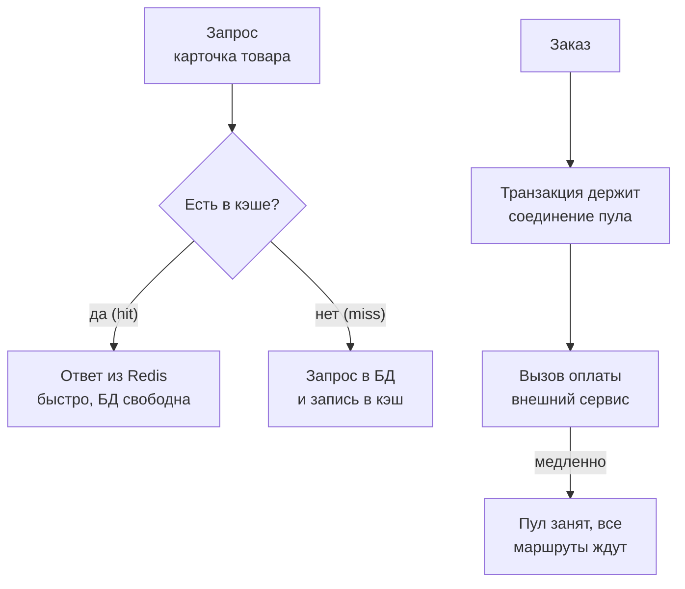

## Зачем это нужно

Последний урок темы разбирает два зеркальных явления. Первое хорошее: кэш может сделать сервис в разы быстрее и снять нагрузку с базы, но только если его не ломать и не обманываться цифрами. Второе плохое: внешняя зависимость (платёжный шлюз, чужое API), которая замедлилась, способна положить **весь** твой сервис, а ретраи (повторные попытки), добавленные «для надёжности», превращают небольшой сбой в лавину. Оба явления проявляются только под нагрузкой, и поэтому находят их нагрузочные инженеры.

**Кэш** (cache, «тайник») это быстрое временное хранилище готовых ответов: вместо того чтобы заново считать или читать из базы, сервис берёт ответ из памяти. **Внешняя зависимость** это всё, что сервис вызывает по сети и чем не владеет: платёжный сервис, почтовая рассылка, чужое API. Ты не можешь её починить, но обязан пережить её сбой.

Шаг проекта: ты включаешь кэш карточек товаров и измеряешь выигрыш (hit ratio, нагрузка на базу, p95), проверяешь две ловушки кэша, затем замедляешь заглушку оплаты и наблюдаешь, как один медленный сервис ломает все маршруты. Исправляешь таймаутами и ретраями, записываешь итог расследования и всей темы в `~/perf-lab/11-bottlenecks/05-cache-dependencies.md`.

## Что нужно знать

- Метод и скрипты `bn.js`, `set-env.sh`, `run.sh`: [урок 11.1](01-method.md); пул соединений, N+1 и «узкое место переезжает»: [урок 11.3](03-database.md).
- Redis и ключи со сроком жизни: [урок 2.3](../02-web/03-backend-anatomy.md); как кэш подключён в «Магазине»: `CACHE_ENABLED`, `CACHE_TTL`.
- Закон Литтла и очереди: [урок 8.2](../08-perf-theory/02-queues-littles-law.md); хоккейная клюшка: [урок 8.1](../08-perf-theory/01-latency-throughput.md).
- Метрики `shop_cache_requests_total`, `shop_payment_requests_total` и PromQL `rate`, `histogram_quantile`: [урок 7.2](../07-observability/02-promql.md).
- Заглушка оплаты на порту 8001 и её `/admin/config` (задержка и доля ошибок меняются на лету): [описание стенда](../05-docker/03-compose-shop.md).
- Настройки `.env`: `CACHE_ENABLED=0`, `CACHE_TTL=60`, `PAYMENT_TIMEOUT=10`, `PAYMENT_RETRIES=3`.

## Картина целиком

Представь пиццерию. Кухня это база данных: пицца готовится 10 минут. Если пятьдесят человек заказывают «Маргариту», повар печёт пятьдесят пицц подряд, и очередь растёт. Умный менеджер держит под лампой десяток готовых «Маргарит»: покупатель берёт готовую за секунду, а кухня занята только редкими заказами (это кэш). Но у менеджера свои проблемы: пицца под лампой остывает (устаревшие данные), а лампа вмещает десять штук (ограниченная память). Во второй половине урока пиццерия заказывает у стороннего поставщика теста. Если поставщик задерживает, повара стоят и ждут, касса закрыта для всех, даже для тех, кто хотел просто кофе. А если менеджер при каждой задержке звонит поставщику ещё три раза, поставщик, и так перегруженный, получает вчетверо больше звонков.

Схема двух частей урока:



Что здесь видно: верхняя часть показывает выигрыш кэша (hit быстро, miss как обычно), нижняя показывает опасность: вызов внешнего сервиса **внутри** транзакции удерживает дефицитный ресурс (соединение пула) на время чужой работы. Первое ускоряет, второе превращает чужую медленность в нашу.

## Теория

### Кэш: зачем он и как измерить пользу

**Зачем он существует.** Многие запросы повторяются: одну и ту же карточку популярного товара смотрят тысячи людей. Заново читать её из базы каждый раз значит тратить процессор базы и соединения пула на одинаковую работу. Кэш хранит готовый ответ и отдаёт его за доли миллисекунды.

**Аналогия.** Шпаргалка. Вместо того чтобы каждый раз листать учебник (база), ты записываешь ответ на карточку и достаёшь её за секунду. Аналогия ломается тем, что шпаргалка не знает, когда учебник обновили: если учебник исправлен, а шпаргалка нет, ты уверенно даёшь неверный ответ.

**Как это устроено.** В «Магазине» кэш это Redis (хранилище «ключ, значение» в памяти). При включённом `CACHE_ENABLED=1` обработчик карточки товара работает так: смотрит ключ `product:<id>` в Redis. Нашёл: отдаёт готовый JSON (**hit**, попадание). Не нашёл (**miss**, промах): идёт в базу, кладёт результат в Redis с временем жизни `CACHE_TTL` (60 секунд) и отдаёт. Через минуту запись истекает (**TTL**, time to live, время жизни), и следующий запрос снова идёт в базу. Каждое обращение считается в метрике `shop_cache_requests_total{result="hit"|"miss"}`.

Главная метрика кэша **hit ratio** (доля попаданий): hits / (hits + misses). От неё зависит всё: при hit ratio 90% база видит только 10% прежней нагрузки, при 50% только половину снимает, при 10% кэш почти бесполезен (а накладные расходы на проверку есть). На hit ratio влияют распределение запросов (одни товары популярнее других) и TTL.

**Разобранный пример.** Покупатели смотрят товары неравномерно. Допустим, 80% запросов приходятся на 200 «горячих» товаров из 10 000, а оставшиеся 20% рассыпаются по всему каталогу. Каждый горячий товар запрашивается раз в секунду-две, значит, TTL в 60 секунд почти не даёт ему «остыть»: за минуту промахнётся один раз, остальные раз пятьдесят попадут. Холодные товары (50 запросов в секунду на 10 000 штук: каждый запрашивается в среднем раз в 200 секунд) успевают истечь до следующего запроса, и их попаданий около четверти. Общий hit ratio: 0,8 × 0,99 + 0,2 × 0,26 ≈ 0,84. То есть **84% запросов** не доходят до базы.

Что это даёт при нагрузке 250 карточек в секунду (ориентировочные числа):

| Показатель | Без кэша | С кэшем (TTL 60 с) |
|---|---|---|
| Запросов к базе | 250/с | около 40/с |
| p95 карточки | 38 мс | 11 мс |
| CPU shop | 78% | 58% |
| CPU postgres | 55% | 10% |
| hit ratio | (нет) | около 84% |

Читаем: база разгрузилась в шесть раз (250 против 40 запросов в секунду), p95 снизился в три с половиной раза, а у приложения процессор тоже стал свободнее: чтение из Redis дешевле, чем разбор ответа базы.

<div class="viz" data-viz="hockey-stick" data-capacity="430" data-base="11" data-load="250" data-unit="запросов/с"></div>

Что здесь видно: график «нагрузка против задержки» для сервиса с кэшем, предел около 430 запросов в секунду. На 250 мы далеко от колена, отсюда задержка около 11 мс. Подвинь нагрузку к пределу и увидишь, как задержка взлетает: кэш поднял потолок, но не убрал его. (Без кэша предел был около 320, и 250 это уже заметно ближе к колену.)

**Что путают.** Путают скорость кэша и его пользу: кэш с hit ratio 30% почти ничего не даёт. Путают «нагрузочный тест с кэшем быстрее» с «система быстрее»: если тест просит один и тот же товар, кэш прогреется за первую секунду, и ты увидишь результат, которого не будет в жизни. Распределение запросов в тесте должно быть похоже на настоящее (поэтому в `bn.js` 80% на горячие товары). И ещё: **холодный старт**. После очистки кэша (деплой, перезапуск Redis) все запросы идут в базу, и она должна выдержать полную нагрузку, иначе перезапуск Redis уронит сервис.

> **Проверь понимание:** hit ratio 90%, нагрузка 1000 запросов в секунду. Сколько запросов видит база? Что будет, если Redis перезапустить?
>
> <details markdown="1">
> <summary>Ответ</summary>
>
> База видит 10% то есть 100 запросов в секунду. При перезапуске Redis кэш пуст, hit ratio падает почти до нуля, и база получает все 1000 запросов в секунду, а справиться может только со своими ста: возникает очередь, пул переполняется. Поэтому кэш нельзя считать «бесплатным ускорением»: база должна выдерживать нагрузку и без него, хотя бы на время прогрева.
>
> </details>

### Ловушки кэша: устаревшие данные и инвалидация

**Зачем это понятие.** «В информатике две сложные задачи: инвалидация кэша и названия переменных». Кэш быстр, но может отдавать неправду. Нагрузочный инженер должен знать, где.

**Аналогия.** Табло в аэропорту, которое обновляется раз в минуту. Рейс задержали, а на табло ещё «по расписанию». Пассажир, поверивший табло, ошибся.

**Как это устроено.** Данные в кэше могут устареть, как только изменятся в базе. Есть два способа: ждать истечения TTL (простой, но с задержкой) и **инвалидация** (invalidation): явно удалить запись при изменении. В «Магазине» инвалидация есть только в одном месте: после успешного заказа код удаляет ключи `product:<id>` купленных товаров. Всё остальное меняется на основании TTL. Отсюда ловушки:

1. **Данные меняются мимо приложения**: администратор поправил цену прямо в базе (`UPDATE products SET price = ...`), а кэш не узнал и отдаёт старую цену до 60 секунд.
2. **В кэше лежат быстро меняющиеся поля**: в карточке есть `stock` (остаток). Если кэш отдаёт остаток минуту назад, покупатель может увидеть «в наличии» у проданного товара. В «Магазине» заказ проверяет остаток в базе (`SELECT ... FOR UPDATE`), поэтому оформить заказ на отсутствующий товар нельзя, но показать устаревшее число можно.
3. **Гонка чтения и инвалидации**: запрос A прочитал старую цену из базы, в этот момент цена поменялась и кэш очистили, потом запрос A записал старую цену в кэш. Теперь кэш содержит устаревшее значение до конца TTL, и никто не знает.
4. **Stampede** («давка», cache stampede): популярный ключ истёк, и сотни параллельных запросов одновременно промахиваются и все идут в базу за одним и тем же. Защита: блокировка на ключ, случайный разброс TTL (jitter), прогрев.

**Разобранный пример.** Ловушка 1 в «Магазине» проверяется руками. С включённым кэшем: сначала `curl localhost:8000/api/products/1` (цена, например, 137), затем `UPDATE products SET price = 1 WHERE id = 1` прямо в базе и снова `curl`: приходит прежняя цена 137, а не 1. Через минуту, когда ключ истечёт, придёт 1. Это не баг кэша, это его свойство: ты обменял свежесть данных на скорость. Вопрос в том, допустима ли минута неточности для данного поля: для описания товара да, для остатка и цены в корзине нет.

**Что путают.** Считают, что у кэша «всё должно быть в порядке» после включения. Нагрузочный тест кэша должен проверять не только скорость, но и **корректность**: при изменении цены покупатель, оформивший заказ, должен получить заказ по актуальной цене (код читает её из базы, не из кэша; и мы это видели выше).

### Внешняя зависимость: чужое время становится твоим

**Зачем это понятие.** Современный сервис редко живёт один: платёжный шлюз, почта, SMS, геокодер, чужое API. Каждая такая зависимость может тормозить или падать, и твой сервис должен это переживать. Нагрузочный тест нужен, чтобы проверить заранее.

**Аналогия.** Цепочка подрядчиков: твой магазин ждёт доставку от курьерской службы. Если служба задерживается, и ты никому не разрешаешь отдать клиенту заказ без доставки, то весь магазин стоит в очереди из ждущих заказов.

**Как это устроено.** Вызов оплаты в «Магазине» в `create_order`: код начинает транзакцию, блокирует строки товаров (`SELECT ... FOR UPDATE`), вставляет заказ, обновляет остатки, **вызывает оплату** (`pay()`) и только потом заканчивает транзакцию. Это **намеренный антипаттерн**: пока идёт сетевой вызов, удерживаются три вещи: (1) соединение из пула (оно занято, хотя база ничего не делает), (2) блокировки строк товаров (другие заказы на те же товары ждут), (3) поток обработчика. Если оплата отвечает за 50 мс, это незаметно. Если за 2 секунды, то соединение пула занято 2 секунды вместо 50 мс, и пропускная способность оформления заказов падает в 40 раз.

Расчёт по закону Литтла: каждое соединение выдерживает 1 / время_удержания заказов в секунду. При задержке оплаты 2 с и пуле из 15 соединений получается 15 / 2 = **7,5 заказов в секунду** максимум. (В уроке 11.3 пул у нас вырос до 15; при исходных 5 было бы 2,5.) Заказов приходит больше: оставшиеся ждут свободное соединение. Но соединения нужны **всем** маршрутам: список товаров, карточка, корзина берут то же соединение из того же пула. Как только все 15 соединений зависли на оплате, каталог тоже встаёт в очередь: **медленная оплата роняет маршруты, которые оплату не используют**. Это называется **каскадный отказ** (cascading failure): сбой в одном месте разрастается на соседние.

<div class="viz" data-viz="pool" data-size="15" data-duration="2000" data-rate="12" data-timeout="5000"></div>

Что здесь видно: пул из 15 соединений, каждое удерживается две секунды (оплата), приходит 12 заказов в секунду, а освобождается 7,5. Очередь растёт, а запросы ждут таймаут пула (5 с) и получают отказ. Это те же 15 соединений, которыми пользуется всё остальное.

**Разобранный пример.** Установим задержку оплаты 2000 мс (через `POST /admin/config` на порту 8001) и прогоним сценарий mix при 10 визитах в секунду. Примерный результат (базовая линия 10 визитов: p95 0,11 с, ошибок 0):

| Маршрут | p95 до | p95 при задержке оплаты 2 с | Доля 503 |
|---|---|---|---|
| `/api/products` (каталог) | 0,05 с | 5,1 с | 35% |
| `/api/products/[id]` | 0,03 с | 5,0 с | 35% |
| `POST /api/orders` | 0,08 с | 7,3 с | 45% |
| `GET /api/orders` | 0,10 с | 5,2 с | 36% |

Читаем: тормозит **всё**, а не только оформление заказа. Каталог и карточки оплату не вызывают, но стоят в той же очереди за соединением, поэтому p95 около 5 секунд (это таймаут пула, `DB_POOL_TIMEOUT=5`), и 35% запросов получают 503 `database pool timeout`. Для пользователя «сайт лёг», хотя причина в чужом сервисе.

**Что путают.** Ищут причину в базе: процессор postgres при этом **почти пуст** (транзакции ждут оплату, а не работают), а пул забит. Диагностика по дереву из урока 11.1: CPU shop низкий, ждут соединения (`shop_db_pool_waiting` высок), процессор базы **не** упёрт, значит, соединения удерживаются зря: подозрение на зависимость. Ключевая метрика: `shop_payment_duration_seconds`, и длительность `POST /api/orders` при нормальной базе.

### Таймауты: сколько ждать внешнего сервиса

**Зачем они нужны.** Без таймаута вызов ждёт бесконечно: зависший сервис блокирует твои соединения и потоки навсегда. Таймаут это лимит на ожидание, после которого ты сдаёшься и возвращаешь ошибку.

**Аналогия.** Ты звонишь в службу и готов слушать гудки полминуты. Дольше ждать нет смысла: у тебя другие дела, а оператор уже, вероятно, не ответит.

**Как это устроено.** Таймаут выбирают исходя из того, сколько **в норме** отвечает зависимость и сколько готов ждать клиент. У оплаты в норме 50 мс, значит, таймаут 10 секунд (по умолчанию `PAYMENT_TIMEOUT=10`) слишком щедр: клиент уйдёт раньше. Правило: таймаут примерно в 3-5 раз больше p99 нормальной работы зависимости, но не дольше терпения пользователя (3-5 секунд для веб-запроса). Есть два разных таймаута: **на соединение** (connect timeout, как долго ждать установки связи) и **на чтение ответа** (read timeout, как долго ждать данных). Для httpx в `shop` одно значение `timeout` применяется ко всем.

Слишком **короткий** таймаут тоже вреден: он превращает медленные, но успешные вызовы в ошибки, и зависшая оплата не отменяется: заглушка доделает работу, и деньги могут списаться, хотя клиент получил ошибку (**зомби-работа**). Поэтому у платёжных вызовов должны быть **идемпотентные ключи**: повторная отправка с тем же ключом не списывает деньги дважды (в учебном стенде их нет, это упрощение).

**Разобранный пример.** При задержке оплаты 2 секунды сравним таймауты:

| `PAYMENT_TIMEOUT` | Что происходит с заказом | Сколько держится соединение |
|---|---|---|
| 10 с | оплата успевает (2 с), заказ создан | 2 с |
| 3 с | то же, запас 1 с | 2 с |
| 1 с | таймаут, 504 «payment timeout» (после повторов), заказ не создан, но заглушка всё равно отработала | 1 с на попытку |

Читаем: слишком короткий таймаут при медленной, но живой оплате превращает все заказы в ошибки. Слишком длинный держит соединение, пока ждёшь. Нужно среднее значение, подтверждённое нагрузочным тестом: при деградации хочется быстрее освободить соединение, но не бросить успешные вызовы.

**Что путают.** Путают таймаут пула (5 с, сколько ждать свободного соединения) с таймаутом оплаты (сколько ждать ответа). Путают «таймаут сработал» с «операция не выполнилась»: на стороне зависимости работа могла завершиться.

### Ретраи: когда повтор помогает и когда убивает

**Зачем они нужны.** Сбои бывают случайными: одиночная потерянная посылка, миг перегрузки. Повторная попытка часто проходит. Ретрай повышает надёжность, но только при определённых условиях.

**Аналогия.** Дозвониться до занятого абонента: перезвонить через минуту разумно. Звонить десять раз в секунду значит мешать ему освободиться.

**Как это устроено.** Код `pay()` делает до `PAYMENT_RETRIES + 1` попыток (при значении 3 это четыре попытки), **без паузы** между ними: упала одна, сразу вторая. Каждая неудача занимает время (до таймаута), а соединение пула на всё время удерживается. Плохое поведение складывается из трёх факторов:

1. **Усиление нагрузки**: при каждом заказе на зависимость идёт до 4 запросов вместо одного. Если зависимость перегружена, ты **добавляешь** ей нагрузки в момент, когда ей и так плохо. Получается **шторм ретраев** (retry storm): сбой на 10 секунд превращается в минуты, потому что зависимость не может выйти из перегрузки под лавиной повторов.
2. **Удержание ресурсов**: четыре попытки по таймауту 1 с держат соединение 4 секунды вместо 1.
3. **Синхронность**: сотни клиентов повторяют одновременно (**thundering herd**, «стадо»), и пики складываются.

Правильные приёмы:

- **Экспоненциальная пауза с джиттером** (exponential backoff with jitter): между попытками ждать 0,1 с, 0,2 с, 0,4 с и т. д. плюс случайный разброс, чтобы клиенты не синхронизировались.
- **Бюджет ретраев** (retry budget): повторов не больше, скажем, 10% от общего числа запросов.
- **Выключатель** (circuit breaker): если процент ошибок высок, на время перестать вызывать зависимость вообще (быстро отдавать ошибку или запасной ответ), потом осторожно проверить.
- **Не ретраить то, что ретраить нельзя**: ошибки клиента (4xx) и неидемпотентные операции без ключа.
- **Вынести вызов из транзакции**: самое важное исправление для нашего антипаттерна. Сначала зафиксировать заказ в статусе `pending`, освободить соединение, потом вызвать оплату и обновить статус. Тогда медленная оплата держит только поток, а не дефицитное соединение. В учебном стенде это требовало бы изменения кода, и мы ограничимся настройками, но в отчёте это пишется как главная рекомендация.

**Разобранный пример.** Оплата получила сбой на 10 секунд (не отвечает за таймаут 1 с). Нормальный поток 12 заказов в секунду, предел оплаты 30 попыток в секунду. Без сбоя: 12 попыток в секунду, всё нормально. Во время сбоя при `PAYMENT_RETRIES=3`: каждый заказ делает 4 попытки, итого 48 попыток в секунду, больше предела 30. Оплата перегружена, ошибки растут, клиентов, ждущих ответа, становится больше, и количество повторов тоже. После конца сбоя накопленная очередь повторов ещё долго держит оплату в перегрузке: восстановление не наступает, пока нагрузка не упадёт. С `PAYMENT_RETRIES=0` те же 12 попыток в секунду остаются ниже предела, и оплата восстанавливается сразу.

<div class="viz" data-viz="bn-retry-storm" data-rate="12" data-capacity="30" data-retries="3" data-timeout="1" data-blip="10"></div>

Что здесь видно: верхняя панель показывает попытки к оплате в секунду против предела (линия), нижняя успешные заказы. Включи режим «без пауз» и три повтора: во время сбоя попытки взлетают выше предела и **остаются** там после сбоя. Переключи на «с паузой» или «бюджет повторов»: сбой проходит и система восстанавливается. Подвинь «повторов» к нулю и посмотри, как поведёт себя восстановление.

**Что путают.** «Три ретрая это надёжность»: при общем сбое это три дополнительных удара по лежащему сервису. «Ретраи без таймаута»: попытки без ограничения времени накапливаются. И «таймаут клиента больше таймаута сервера»: клиент ждёт, а сервер уже сдался, и его работа никому не нужна.

> **Проверь понимание:** оплата упала, `PAYMENT_RETRIES=3`, заказов 8 в секунду. Сколько запросов к оплате в секунду создаёт ваш сервис в худшем случае, и что это значит, если предел оплаты 25 в секунду?
>
> <details markdown="1">
> <summary>Ответ</summary>
>
> 8 × 4 = 32 попытки в секунду, а предел 25: оплата не сможет оправиться, пока вы продолжаете ретраить. Исправление: `PAYMENT_RETRIES` меньше (1) или пауза с джиттером, и выключатель, чтобы при провале быстро отдавать ошибку и разгружать зависимость.
>
> </details>

## Практика

Стенд поднят, мониторинг включён. Исходное состояние для урока: после 11.3-11.4 в `.env` стоит `BUG_N_PLUS_ONE=0`, `DB_POOL_MAX=15`, `LEAK_ENABLED=0`; индекс `orders_user_id_idx` создан. Проверь: `grep -E '^(CACHE_ENABLED|BUG_N_PLUS_ONE|DB_POOL_MAX|LEAK_ENABLED|PAYMENT_TIMEOUT|PAYMENT_RETRIES)=' ~/load-tester/project/shop/.env` и `psqlshop -c "\d orders"` (индекс на месте). Если что-то не так, верни настройки через `set-env.sh`.

### Часть 1. Кэш

#### 1.1. Базовая линия без кэша

Нагрузка на карточки товаров, 250 запросов в секунду, 60 секунд. Это сценарий `product` с распределением 80/20.

```bash
cd ~/perf-lab/11-bottlenecks
./set-env.sh CACHE_ENABLED=0
psqlshop -c "SELECT pg_stat_statements_reset();"
./run.sh cache-off SCENARIO=product RATE=250 DURATION=60s
psqlshop -c "SELECT calls, round(mean_exec_time::numeric,2) AS mean_ms FROM pg_stat_statements WHERE query LIKE 'SELECT id, name, price, category_id, stock FROM products WHERE id%'"
```

Ожидаемо (числа для ноутбука ориентировочные):

```text
    http_req_duration{name:/api/products/[id]}
    ✓ 'p(50)>=0' p(50)=11.2ms
    ✓ 'p(95)>=0' p(95)=38.4ms
     iterations...............: 15000  249.9/s
 calls | mean_ms
-------+---------
 15000 |    0.55
```

**Как читать вывод:** p95 38 мс, и все 15 000 карточек пошли в базу (число вызовов равно числу запросов: `calls` = `iterations`). Средний запрос базы стоит 0,55 мс, но 250 раз в секунду это заметный процессор.

#### 1.2. Включаем кэш

Гипотеза: «Если включить кэш с TTL 60 с, то при 80% запросов к 200 горячим товарам hit ratio будет около 84%, вызовов в базу станет примерно 40 в секунду, p95 упадёт с 38 до 11 мс. Если hit ratio окажется ниже 50% или p95 не упадёт ниже 25 мс, гипотеза неверна». Одно изменение:

```bash
./set-env.sh CACHE_ENABLED=1
psqlshop -c "SELECT pg_stat_statements_reset();"
./run.sh cache-on SCENARIO=product RATE=250 DURATION=60s
P=~/perf-lab/scripts/promq.sh
$P 'sum(increase(shop_cache_requests_total{result="hit"}[1m])) / sum(increase(shop_cache_requests_total[1m]))'
psqlshop -c "SELECT calls FROM pg_stat_statements WHERE query LIKE 'SELECT id, name, price, category_id, stock FROM products WHERE id%'"
```

Разбор: `increase(...[1m])` показывает, насколько вырос счётчик за последнюю минуту (то есть за прогон); отношение попаданий к сумме даёт hit ratio. Результат:

```text
  0.84
 calls
-------
  2380
```

**Как читать вывод:** hit ratio 0,84, как предсказано. В базу дошло 2 380 запросов за минуту (около 40 в секунду) вместо 15 000, то есть в шесть раз меньше. p95 из отчёта k6 около 11 мс.

<div class="viz" data-viz="chart" data-type="bar" data-x="p95 (мс),запросы к БД (1/с),CPU shop (%)" data-x-label="Показатель" data-y-label="значение" data-unit="" data-explain="Сравнение без кэша и с кэшем на 250 запросов в секунду: p95 упал с 38 до 11 мс, запросов к базе стало 40 вместо 250 в секунду, процессор shop снизился с 78% до 58%." data-series='[{"name":"без кэша","values":[38,250,78]},{"name":"с кэшем","values":[11,40,58]}]'></div>

Что здесь видно: по всем трём показателям кэш выигрывает. Заметнее всего разгрузка базы (шесть раз): именно это даёт запас на случай роста нагрузки.

**Типичные ошибки:** hit ratio около нуля значит, что `CACHE_ENABLED` не подхватился (`docker compose exec shop env | grep CACHE`); hit ratio около 100% в тесте значит, что тест просит всего несколько товаров (в `bn.js` должно быть 80/20); `NaN` значит, что нет запросов за окно, значит, прогон уже закончился: смотри `increase` сразу после него.

#### 1.3. Ловушка: данные поменялись мимо приложения

Кэш включён и прогрет. Проверь свежесть:

```bash
curl -s localhost:8000/api/products/1 | jq '{id, price}'
psqlshop -c "UPDATE products SET price = 1 WHERE id = 1;"
curl -s localhost:8000/api/products/1 | jq '{id, price}'
sleep 61
curl -s localhost:8000/api/products/1 | jq '{id, price}'
```

```text
{"id": 1, "price": "137.00"}
{"id": 1, "price": "137.00"}
{"id": 1, "price": "1.00"}
```

**Как читать вывод:** после правки в базе второй запрос вернул **старую** цену 137: ответ взят из кэша. Только после TTL (60 секунд) пришла новая цена. Запиши это как риск: «цена в карточке может быть неактуальна до 60 с после ручной правки в БД». Верни цену: `psqlshop -c "UPDATE products SET price = 137 WHERE id = 1;"` (исходное значение возьми из первого вывода).

### Часть 2. Внешняя зависимость

Кэш оставь включённым (он снижает нагрузку на базу, но не защитит заказ). Подготовь заглушку оплаты: смотри текущие настройки.

```bash
curl -s localhost:8001/admin/config
```

```text
{"delay_ms":50.0,"fail_rate":0.0}
```

**Как читать вывод:** заглушка отвечает за 50 мс в среднем (с разбросом ±20%), и ошибок ноль. Менять её настройки можно на лету командой `curl -X POST localhost:8001/admin/config -H 'Content-Type: application/json' -d '{"delay_ms": 2000}'`: в теле можно указать `delay_ms`, `fail_rate` или оба.

#### 2.1. Базовая линия оформления заказов

```bash
cd ~/perf-lab/11-bottlenecks
./run.sh pay-base SCENARIO=mix RATE=10 DURATION=60s
```

Ожидаемо: p95 около 0,11 с, ошибок нет, `POST /api/orders` p95 около 0,08 с.

#### 2.2. Оплата замедлилась

Гипотеза: «Если оплата ответит за 2 секунды, то соединение пула будет удерживаться на 2 секунды при пуле 15 (максимум 7,5 заказа в секунду). При 10 визитах в секунду очередь за пулом вырастет, и **все** маршруты станут медленными и начнут получать 503, хотя процессор базы останется свободным. Если каталог останется быстрым, гипотеза неверна».

```bash
curl -s -X POST localhost:8001/admin/config -H 'Content-Type: application/json' -d '{"delay_ms": 2000}'
./run.sh pay-slow SCENARIO=mix RATE=10 DURATION=60s
```

Во время прогона снимай:

```bash
P=~/perf-lab/scripts/promq.sh; S='container_label_com_docker_compose_service'
$P "shop_db_pool_waiting"
$P "sum(rate(container_cpu_usage_seconds_total{$S=\"postgres\"}[30s]))"
$P 'histogram_quantile(0.95, sum by (le) (rate(shop_payment_duration_seconds_bucket[30s])))'
```

```text
  14
  0.07
  2.4
```

**Как читать вывод:** в очереди за соединением 14 запросов (первая строка), при этом процессор postgres на 7% (вторая): база **не** занята, значит, соединения удерживаются не работой базы, p95 оплаты 2,4 с (третья) называет виновника: зависимость. По дереву из урока 11.1 это не лист «запросы к БД», а лист «зависимость». Отчёт k6 покажет p95 около 5 с у **всех** маршрутов и около 35-45% ошибок 503. Таким образом гипотеза подтверждена, и это пример каскадного отказа.

**Типичные ошибки:** каталог остался быстрым значит, что нагрузки не хватило, чтобы занять пул (подними RATE до 12-15) или оплата не получила настройку (`curl -s localhost:8001/admin/config`); ошибки 502 вместо 503 значит, что оплата возвращает ошибку, а не медленно отвечает (смотри `fail_rate`).

#### 2.3. Шторм ретраев

Теперь превратим оплату в **недоступную** с таймаутом 1 секунда и стандартными тремя ретраями. Сначала гипотеза: «При таймауте 1 с и задержке 2 с каждая попытка кончается таймаутом. Каждый заказ делает 4 попытки, значит, число обращений к оплате вчетверо выше числа заказов; соединение удерживается 4 секунды. Заглушка продолжает считать оплаты, на которые мы уже не ждём».

```bash
cd ~/perf-lab/11-bottlenecks
./set-env.sh PAYMENT_TIMEOUT=1
./run.sh pay-storm SCENARIO=checkout RATE=5 DURATION=60s
P=~/perf-lab/scripts/promq.sh
$P 'sum by (result) (increase(shop_payment_requests_total[1m]))'
$P 'sum(increase(shop_orders_created_total[1m]))'
```

```text
{result="timeout"}  1195
  0
```

**Как читать вывод:** за минуту оплата получила 1195 попыток (все с результатом `timeout`) при **ноль** созданных заказов: из 300 заказов (5/с × 60 с) каждый сделал 4 попытки (≈1200). Это усиление ×4 в чистом виде. Параллельно в логе заглушки (`docker compose logs payment`) видны запросы, которые она всё равно обрабатывает: зомби-работа. Заказы отдают 504 «payment timeout».

Таблица ориентировочных цифр для сравнения:

| Настройки | Попыток к оплате (за 60 с) | Заказов создано | Результат клиента |
|---|---|---|---|
| задержка 50 мс, retries 3 (норма) | 300 | 300 | 201 |
| задержка 2000 мс, timeout 10 с | 300 | около 270 (пул) | 201 или 503 |
| задержка 2000 мс, timeout 1 с, retries 3 | около 1200 | 0 | 504 |

#### 2.4. Исправление настройками

Одним изменением за раз. Сначала ретраи (убираем усиление):

```bash
./set-env.sh PAYMENT_RETRIES=0
./run.sh pay-noretry SCENARIO=checkout RATE=5 DURATION=60s
$P 'sum by (result) (increase(shop_payment_requests_total[1m]))'
```

Ожидаемо: попыток 300 (по одной на заказ), `timeout` по-прежнему (оплата отвечает 2 секунды при таймауте 1 секунда), заказов 0, но **нагрузка на оплату вчетверо ниже**, соединение держится 1 секунду вместо 4. Теперь реалистичный таймаут: оплата в норме отвечает за 50 мс, а в деградации за 2 секунды, и мы готовы подождать 3 секунды:

```bash
./set-env.sh PAYMENT_TIMEOUT=3
./run.sh pay-fixed SCENARIO=checkout RATE=5 DURATION=60s
```

Ожидаемо: оплата успевает (2 с < 3 с), заказы создаются (около 5 в секунду), ошибок нет, p95 `POST /api/orders` около 2,1 с, потому что оплата честно медленная. Сам пул: 5 заказов в секунду × 2 с = 10 соединений занято из 15: запас есть. Но при 8 заказах в секунду он кончится (предел 7,5): именно поэтому правильное **долгосрочное** решение это вынести вызов оплаты из транзакции, а не крутить таймауты.

Верни оплату в норму: `curl -s -X POST localhost:8001/admin/config -H 'Content-Type: application/json' -d '{"delay_ms": 50}'` и `./set-env.sh PAYMENT_RETRIES=3 PAYMENT_TIMEOUT=10` (исходные значения), если хочешь сохранить стенд по умолчанию.

<div class="viz" data-viz="chart" data-type="bar" data-x="норма,оплата 2 с,3 ретрая,исправлено" data-x-label="Сценарий" data-y-label="Попыток к оплате за минуту" data-unit="" data-explain="Сколько запросов к оплате отправляет магазин при 5 заказах в секунду. В норме 300, при таймауте 1 с и трёх повторах 1195 (усиление в четыре раза), после исправления снова 300." data-series='[{"name":"попыток к оплате за 60 с","values":[300,300,1195,300]}]'></div>

Что здесь видно: столбик третьего сценария вчетверо выше остальных: это и есть шторм ретраев. Исправление возвращает число попыток к норме, и теперь не только оплата перестаёт задыхаться, но и соединение пула освобождается быстрее.

### Часть 3. Вывод по всей теме

Запиши `~/perf-lab/11-bottlenecks/05-cache-dependencies.md`:

```markdown
# 11.5. Кэш и зависимости

## Кэш (product, 250/с, 60 с)
| | без кэша | с кэшем |
| p95, мс | 38 | 11 |
| запросов к БД, 1/с | 250 | 40 |
| hit ratio | - | 0,84 |
Ловушка: цена, правленная в БД, видна в карточке до 60 с. Остаток в кэше тоже устаревает.

## Оплата
Задержка 2 с, пул 15: макс 7,5 заказа/с. mix 10/с: все маршруты p95 ~5 с, 35-45% 503, CPU postgres 7%.
Таймаут 1 с + retries 3: 4 попытки на заказ (1195 за минуту при 300 заказах), заказов 0, заглушка работает впустую.
Исправление: PAYMENT_RETRIES=0, PAYMENT_TIMEOUT=3: заказы идут, 300 попыток.

## Рекомендации
1. Вынести оплату из транзакции (pending → оплата → paid).
2. Ретраи с паузой и джиттером, бюджет, выключатель.
3. Таймаут по нормальному p99 зависимости, идемпотентный ключ.
4. Алерт на pool waiting и p95 оплаты.
```

Дополни отдельный файл `~/perf-lab/11-bottlenecks/summary.md`: таблицу всей темы «проблема, как нашли, исправление, эффект» по пяти урокам. Это основа для портфолио в [теме 13](../13-final/03-portfolio-resume.md).

```bash
cd ~/perf-lab
git add 11-bottlenecks results/11-cache-*.txt results/11-pay-*.txt
git commit -m "11.5: кэш, оплата, таймауты и ретраи"
git push
```

## Сломай и почини

**Поломка:** проверь, как ведёт себя кэш при внезапной «очистке» Redis. Включён кэш, идёт нагрузка 250 запросов в секунду. Сбрось весь кэш и посмотри на базу:

```bash
cd ~/perf-lab/11-bottlenecks
./run.sh cache-flush SCENARIO=product RATE=250 DURATION=90s &
sleep 30
cd ~/load-tester/project/shop && docker compose exec -T redis redis-cli FLUSHALL
```

Что произойдёт: hit ratio мгновенно падает до нуля и медленно (десятки секунд) восстанавливается, в базу в первые секунды летит почти полная нагрузка (до 250 запросов в секунду вместо 40), p95 на несколько секунд подпрыгивает. `FLUSHALL` стирает и корзины (они тоже в Redis), поэтому на боевой системе так делать нельзя; здесь мы лишь воспроизводим перезапуск Redis.

**Диагностика:** график `rate(shop_cache_requests_total{result="miss"}[15s])` показывает всплеск промахов в момент очистки, и параллельно растёт `shop_db_pool_waiting`. Если база не рассчитана на полную нагрузку без кэша, пул переполнится. Если рассчитана, всплеск проглатывается.

**Решение:** (1) убедиться, что база **держит** нагрузку и без кэша хотя бы на время прогрева (мы показали это в уроке 11.3, предел около 55 визитов в секунду); (2) прогревать кэш при старте; (3) случайный разброс TTL (jitter), чтобы ключи не истекали одновременно; (4) для горячих ключей защита от stampede (блокировка на ключ). Для отчёта: «кэш это оптимизация, а не часть ёмкости: ёмкость считается без него».

## Словарик урока

| Термин | Простыми словами |
|---|---|
| Кэш | Быстрое временное хранилище готовых ответов |
| Hit / miss | Попадание в кэш (нашли) и промах (не нашли, пошли в базу) |
| Hit ratio | Доля попаданий: hits / (hits + misses) |
| TTL | Время жизни записи в кэше, после него она удаляется |
| Инвалидация | Явное удаление записи из кэша при изменении данных |
| Stampede (давка) | Много запросов одновременно промахиваются по истёкшему ключу и бьют по базе |
| Холодный старт | Пустой кэш после перезапуска: всё идёт в базу |
| Внешняя зависимость | Сервис, который ты вызываешь по сети и не контролируешь |
| Каскадный отказ | Сбой в одном месте растёт на соседние части системы |
| Таймаут | Предел ожидания ответа, после него вызов прерывают |
| Ретрай | Повторная попытка вызова после неудачи |
| Шторм ретраев | Повторы усиливают нагрузку на зависимость и мешают ей восстановиться |
| Backoff и jitter | Растущая пауза между попытками со случайным разбросом |
| Retry budget | Ограничение доли повторов от общего числа запросов |
| Circuit breaker | Выключатель: при высокой доле ошибок вызовы временно прекращаются |
| Идемпотентность | Повтор операции с тем же ключом не меняет результат второй раз |
| Зомби-работа | Операция, на результат которой клиент уже не ждёт, но сервис её доделывает |

## Вопросы с собеседований

Раздел для повторения: ответь вслух, потом открой ответ.

### 1. [junior] [часто] Что такое hit ratio и от чего он зависит?

<details markdown="1">
<summary>Ответ</summary>

Доля запросов, обслуженных из кэша. Зависит от распределения запросов (есть ли горячие ключи), TTL и размера кэша. При высоком hit ratio база разгружена, при низком кэш почти бесполезен. Ориентир по базе: видит долю (1 − hit ratio) исходной нагрузки.

**Что хотят услышать:** определение, зависимость от распределения и TTL, расчёт нагрузки на базу.

**Красный флаг:** «кэш всегда ускоряет».

</details>

### 2. [junior] [часто] Какие проблемы создаёт кэш?

<details markdown="1">
<summary>Ответ</summary>

Устаревшие данные (до TTL или до инвалидации), гонки между чтением и обновлением, stampede при истечении горячего ключа, холодный старт после очистки, дополнительная сложность. Нагрузочный тест кэша проверяет не только скорость, но и свежесть данных.

**Что хотят услышать:** минимум три проблемы и инвалидацию.

**Красный флаг:** «кэш нельзя сломать».

</details>

### 3. [junior] [часто] Что такое таймаут и зачем он нужен?

<details markdown="1">
<summary>Ответ</summary>

Предел ожидания ответа от внешнего сервиса. Без него зависший вызов блокирует потоки и соединения навсегда. Значение выбирают по нормальному времени ответа зависимости (примерно в 3-5 раз выше p99) и терпению пользователя.

**Что хотят услышать:** защита ресурсов, как выбрать значение.

**Красный флаг:** «таймаут не нужен, пусть ждёт».

</details>

### 4. [junior] Что такое ретрай и когда он вреден?

<details markdown="1">
<summary>Ответ</summary>

Повторная попытка после неудачи. Помогает при случайных сбоях. Вреден, когда зависимость перегружена или лежит: повторы добавляют нагрузку, мешают ей восстановиться, удерживают ресурсы и бьют синхронной волной.

**Что хотят услышать:** усиление нагрузки, пример ×4.

**Красный флаг:** «ставим пять ретраев, чтобы надёжнее».

</details>

### 5. [middle] Почему медленная оплата делает медленным каталог?

<details markdown="1">
<summary>Ответ</summary>

Вызов оплаты внутри транзакции удерживает соединение из пула. Когда оплата замедляется, все соединения оказываются заняты ожиданием, а каталог берёт соединение из того же пула и встаёт в очередь. Это каскадный отказ. Признак: процессор базы свободен, `pool waiting` высок. Исправление: вынести вызов из транзакции, разделить пулы, ввести таймауты и выключатель.

**Что хотят услышать:** общий дефицитный ресурс, признак по метрикам, три приёма лечения.

**Красный флаг:** «надо раздуть пул».

</details>

### 6. [middle] Как сделать ретраи безопасными?

<details markdown="1">
<summary>Ответ</summary>

Экспоненциальная пауза с джиттером, ограничение числа попыток и бюджет повторов, выключатель при высокой доле ошибок, идемпотентные ключи для операций с побочными эффектами, ретраить только временные ошибки (5xx, таймауты), не 4xx.

**Что хотят услышать:** backoff с jitter, budget, circuit breaker, идемпотентность.

**Красный флаг:** ретраи без паузы.

</details>

### 7. [middle] Как нагрузочным тестом проверить устойчивость к сбою зависимости?

<details markdown="1">
<summary>Ответ</summary>

Держать обычную нагрузку, замедлить или сломать зависимость (заглушка, чаос-инструмент), снять метрики: пул, ошибки, задержки по маршрутам, число попыток к зависимости. Проверить, что сервис деградирует предсказуемо (быстрые ошибки, запасной ответ), не теряет соседние маршруты и восстанавливается после снятия сбоя.

**Что хотят услышать:** управляемый сбой, метрики, восстановление.

**Красный флаг:** тест только «зелёного» пути.

</details>

### 8. [middle] Почему кэш нельзя учитывать в расчёте ёмкости?

<details markdown="1">
<summary>Ответ</summary>

Кэш может оказаться пустым (перезапуск, деплой, сбой Redis), и тогда на базу придёт полная нагрузка. Ёмкость считают без кэша или хотя бы проверяют, что база выдерживает холодный старт; кэш считают запасом производительности.

**Что хотят услышать:** холодный старт, база выдерживает без кэша.

**Красный флаг:** «у нас hit ratio 95%, база нам не нужна».

</details>

### 9. [на скорость] Как посчитать, сколько запросов видит база при hit ratio 90% и нагрузке 1000/с?

<details markdown="1">
<summary>Ответ</summary>

100 в секунду (10% промахов).

</details>

### 10. [на скорость] Во сколько раз ретраи (3 повтора) могут увеличить нагрузку на зависимость?

<details markdown="1">
<summary>Ответ</summary>

В четыре раза: одна основная попытка и три повтора.

</details>

### 11. [на скорость] Что такое TTL?

<details markdown="1">
<summary>Ответ</summary>

Время жизни записи в кэше: по его истечении запись удаляется.

</details>

### 12. [на скорость] Что такое stampede?

<details markdown="1">
<summary>Ответ</summary>

Одновременный промах множества запросов по истёкшему популярному ключу: все идут в базу за одним и тем же.

</details>

## Проверено на версиях

Redis 8.10, PostgreSQL 18.6, Python 3.14 (httpx в образе `shop`), Prometheus 3.15, k6 2.3. Заглушка оплаты управляется через `/admin/config`. Числа смоделированы по коду стенда (задержка оплаты, размер пула, распределение запросов) и на твоём железе будут отличаться; соотношения (hit ratio около 0,8, усиление ×4, каскад на все маршруты) должны совпасть. Октябрь 2026.

## Итог урока: ты умеешь

- [ ] Включать кэш и измерять пользу: hit ratio, запросы к базе, p95.
- [ ] Знать и проверять ловушки кэша: устаревшие данные, инвалидация, stampede, холодный старт.
- [ ] Определять по метрикам, что причина во внешней зависимости, а не в базе.
- [ ] Объяснять, почему вызов зависимости внутри транзакции создаёт каскадный отказ.
- [ ] Считать усиление нагрузки от ретраев и подбирать таймауты и число повторов.
- [ ] Называть безопасные приёмы: backoff с jitter, бюджет, выключатель, идемпотентность, вынос вызова из транзакции.
- [ ] Свести расследования всей темы в таблицу «проблема, причина, исправление, эффект».

Дальше: [тема 12, урок 12.1: отчёт о нагрузочном тестировании](../12-process/01-report.md), где расследования превращаются в документ для команды.
