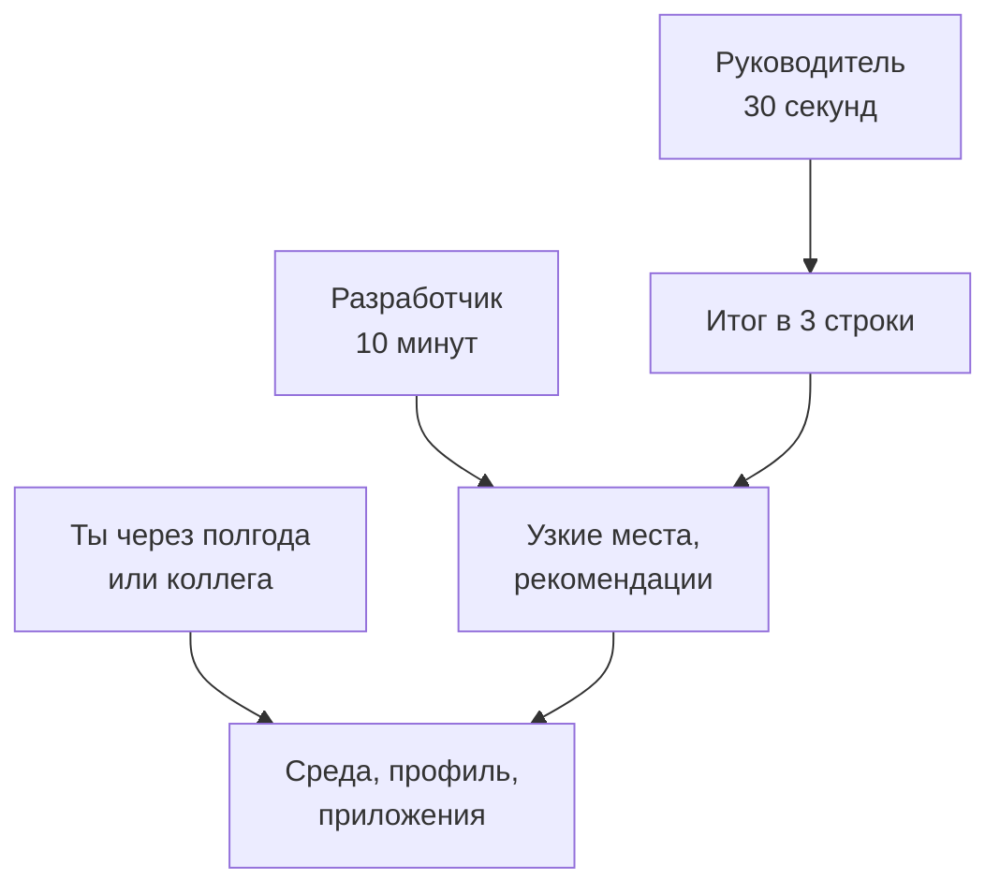
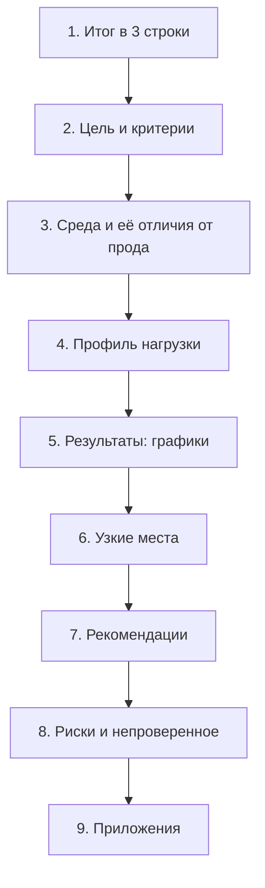
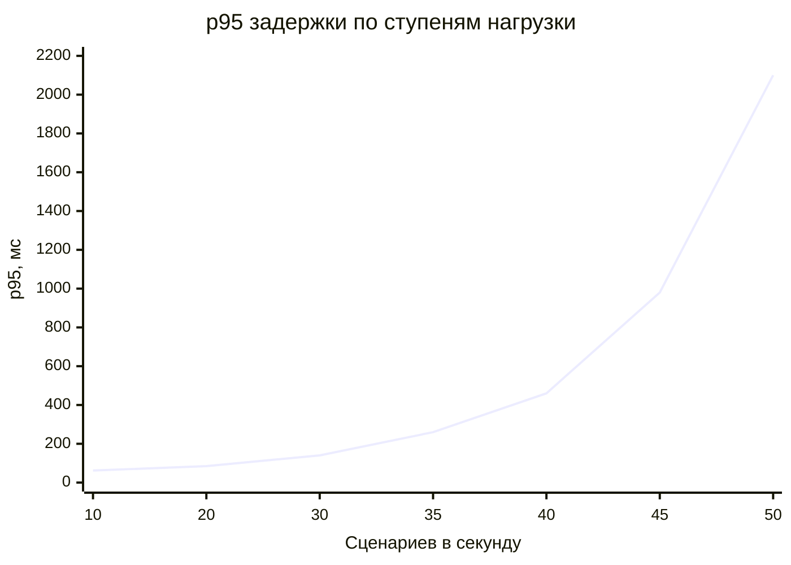

## Зачем это нужно

Ты провёл десяток прогонов, нашёл узкое место, доказал его цифрами и проверил починку на стенде: задержка на проблемном маршруте упала в разы. Теперь это нужно кому-то передать. Руководитель спросит: «Выдержим акцию? Что нужно сделать и сколько это стоит?» Разработчик: «Покажи, на каком запросе ломается и как это повторить». Ты сам через полгода: «Почему тогда решили, что хватит? Что вообще мерили?» Если у тебя на руках только терминал с цифрами и скриншот Grafana, ответить не получится: результат теста живёт ровно столько, сколько живёт открытая вкладка.

**Отчёт о нагрузочном тесте** (load test report) это документ, который превращает числа в решение. Хороший отчёт читают, на него ссылаются в задачах и совещаниях, по нему повторяют тест через год. Плохой отчёт (30 страниц графиков без вывода или одна строка «всё работает») закрывают, не дочитав, и тест, на который ушла неделя, не влияет ни на что. Здесь учимся писать первый.

Шаг проекта: ты прогонишь «Магазин» ступенчатой нагрузкой (скорость запросов растёт ступенями, каждая держится минуту), соберёшь результаты в таблицу, заведёшь шаблон `~/perf-lab/reports/TEMPLATE.md` и заполнишь по нему свой первый настоящий отчёт. К нему ты вернёшься в двух следующих уроках: данные оттуда станут базовой линией для CI (урок 12.2) и основой прогноза ёмкости (урок 12.3).

## Что нужно знать

- Методика испытаний, цель, SLO и профиль нагрузки: файл `~/perf-lab/08-theory/methodology.md` из [урока 8.4](../08-perf-theory/04-load-profile-slo.md). Отчёт описывает, как прошёл тест по этой методике.
- Перцентили, ёмкость и «клюшка»: [урок 8.1](../08-perf-theory/01-latency-throughput.md) и [урок 8.2](../08-perf-theory/02-queues-littles-law.md). Без них фразы «p95 = 480 мс» и «колено на 40 запросах в секунду» ничего не значат.
- Скрипт k6 с порогами и кодом выхода: `~/perf-lab/10-k6/shop.js` из [темы 10](../10-k6/index.md). Его мы будем гонять ступенями.
- Расследования из [темы 11](../11-bottlenecks/index.md): отчёт строится вокруг найденных узких мест и доказательств.
- Работа с git в `~/perf-lab`: [тема 3](../03-git/index.md).

## Картина целиком

Возьми заключение врача после обследования. Перед врачом сотни показателей: анализы, снимки, давление по часам. Но пациенту выдают лист, где сверху стоит диагноз и что делать, ниже обоснование, и только в конце приложены сами анализы. Врач не начинает с «в 8:15 измерили пульс». Он знает: пациент дочитает до конца только то, что идёт первым. Нагрузочный отчёт устроен так же: **сверху вывод, снизу доказательства**, чем глубже, тем подробнее и тем меньше людей это читает. Аналогия ломается в одном месте: пациент один, а у отчёта разные читатели, и каждый берёт свой слой.



На схеме три слоя, читатель останавливается там, где ему хватило. Руководитель читает только верхний блок, поэтому он обязан быть самодостаточным. Разработчик спускается до узких мест. Повторить тест через год можно только по нижнему слою: версии, команды, сырые данные.

Из каких частей состоит отчёт и в каком порядке они идут, показывает схема:



Порядок разделов такой: вывод, затем почему ему можно верить, затем детали. Разделы 2–4 отвечают на вопрос «а при каких условиях это измерено?», раздел 5 на «что получилось», 6–8 на «и что с этим делать». Ниже мы пройдём каждый.

## Теория

### Кто читает отчёт и что ему нужно

**Зачем это существует.** Отчёт без читателя не отчёт. Чтобы он «работал», надо сначала понять, кто и зачем его откроет. Три типичных читателя хотят разного, и если смешать, не получат ничего.

**Как это устроено.**

| Читатель | Что хочет понять | Сколько времени у него | Что читает |
|---|---|---|---|
| Руководитель, владелец продукта | Можно ли выпускать? Что рискуем? Что и когда нужно сделать? | 30 секунд | Итог |
| Разработчик, архитектор | Где тесно, как повторить, что чинить | 10–15 минут | Узкие места, рекомендации, приложения |
| Нагрузочник (ты, коллега, твой преемник) | При каких условиях измерено, можно ли сравнить с новым прогоном | По необходимости | Среда, профиль, приложения |

Отсюда два следствия. Первое: **итог пишется последним, но стоит первым**, и в нём нет терминов, которых руководитель не знает. Слово «p95» без пояснения туда не попадает, а «95% покупателей ждут не дольше 0,5 с» попадает. Второе: каждый раздел отвечает на один вопрос читателя и заканчивается там, где вопрос исчерпан.

**Разобранный пример.** Руководитель спрашивает в чате: «Что с тестом?» Плохой ответ: ссылка на папку с тридцатью файлами. Хороший: три строки итога из отчёта плюс ссылка «подробности здесь». Он прочитал за полминуты, принял решение «чиним до акции», и тебя не отвлекали вопросами.

**Что путают.** Пишут отчёт для себя: перечисляют всё, что делали, в хронологическом порядке («сначала запустили, потом посмотрели, потом перезапустили»). Для читателя интересен не путь, а результат. Хронология уходит в приложение, в журнал испытаний.

> **Проверь понимание:** руководитель читает только первую страницу. Какие два вопроса должны получить ответ на ней, даже если больше ничего не прочитано?

<details markdown="1">
<summary>Ответ</summary>

Во-первых, выдерживает ли система нужную нагрузку (вердикт с числом и условием). Во-вторых, что нужно сделать и к какому сроку (действие или решение, которое от него ждут). Всё остальное служит доказательством этих двух ответов.

</details>

### Итог в три строки

**Зачем это существует.** Это единственный раздел, который гарантированно прочитают. Три строки заставляют самого понять, что ты выяснил: если не получается сказать за три строки, вывода пока нет.

**Как это устроено.** Три строки, у каждой своя роль:

1. **Вердикт**: выдерживает ли система цель, с числами и условием. «Магазин держит 200 запросов в секунду при p95 до 0,5 с и ошибках меньше 1%».
2. **Запас**: насколько это далеко от того, что нужно. «Сегодняшний пик 90, к акции ждём 172: это 86% от предела».
3. **Действие**: главное узкое место и что с ним делать, кто и до какого срока. «Нет индекса по `orders.user_id`: добавить до 20 ноября, эффект проверен, +45% ёмкости».

Каждая строка содержит число, и ни в одной нет слов «вроде», «в целом», «достаточно хорошо».

**Разобранный пример.** Сравни две версии итога для одного и того же теста:

```text
Плохо:  Система стабильно работает под нагрузкой. Обнаружены узкие места в базе
        данных. Рекомендуется оптимизация.

Хорошо: 1. Магазин выдерживает 200 запросов/с при p95 < 500 мс и ошибках < 1%.
        2. Пик сегодня 90 запросов/с (45% предела), к акции в ноябре ждём ~172 (86%).
        3. Список заказов тормозит из-за Seq Scan по orders: индекс по user_id
           поднял предел до 290 запросов/с. Нужно внедрить до 20 ноября.
```

В плохой версии нет ни одного числа, которое можно проверить, ни одного срока, и после неё не понятно, надо ли что-то делать. Вторая отвечает на оба вопроса руководителя: «выдержим?» (да, но тесно) и «что делать?» (индекс, срок).

**Что путают.** Пишут в итоге «тест успешно пройден». Успех это не вывод: тест можно пройти и убедиться, что система не выдерживает требуемого. Вывод про систему, а не про тест.

> **Проверь понимание:** в итоге написано: «Отлично, p95 всего 210 мс». Чего не хватает, чтобы строка стала выводом?

<details markdown="1">
<summary>Ответ</summary>

Условия и сравнение: при какой нагрузке получено 210 мс и какова цель. «При 100 запросах/с p95 равен 210 мс, цель 500 мс» это уже вывод. Число без нагрузки и без цели оценить нельзя.

</details>

### Цель, среда и профиль: почему этим цифрам можно верить

**Зачем это существует.** Число без условий нельзя ни проверить, ни сравнить. «p95 = 210 мс» на ноутбуке с одним процессором и на сервере с шестнадцатью это разные факты. Разделы про цель, среду и профиль отвечают на вопрос «при каких условиях это измерено», и по ним читатель решает, доверять ли результатам.

**Как это устроено.** Три раздела:

**Цель и критерии успеха.** Откуда они: из методики [урока 8.4](../08-perf-theory/04-load-profile-slo.md). Тройка «нагрузка, задержка, ошибки»: «до 200 запросов/с, p95 меньше 500 мс, ошибок меньше 1%». Если цели не было, так и написать: «цели не задано, измерялась ёмкость», и тогда это исследование, а не проверка.

**Среда.** Таблица «тест против прода». Для каждого параметра две колонки: что было в тесте и что в реальной работе. Параметры: процессор и память сервиса, число экземпляров, база (размер данных, версия), где стоит генератор нагрузки, сеть между ними, версия кода (хеш коммита), конфигурация (переменные `.env`), версия инструмента.

Самая важная часть этого раздела это **отличия от прода**: они определяют, насколько цифры переносятся на реальную систему. Честная запись: «Генератор нагрузки работал на той же машине, что и сервис, и отнимал у него процессор: реальная ёмкость выше». Читатель, увидев это, правильно скорректирует ожидания, а спрятанное отличие потом всплывает как «вы нас обманули».

**Профиль нагрузки.** Сценарий (что делает один «пользователь»: каталог, карточка, корзина, заказ), доли операций, форма (ступени, плато), длительность, модель (открытая: запросы идут независимо от ответов, или закрытая: пользователи ждут ответ), число пользователей или запросов в секунду. Ссылка на скрипт и коммит, где он лежит.

**Разобранный пример.** Раздел «Среда» для нашего стенда:

```text
| Параметр               | Тест                                  | Прод (реальный сервис)     |
|------------------------|---------------------------------------|----------------------------|
| Сервис «Магазин»       | 1 контейнер, 1 процессор, 512 МБ      | зависит от установки       |
| Воркеров               | 1 (WEB_CONCURRENCY=1)                 | несколько экземпляров      |
| База                   | PostgreSQL 18, 200 000 заказов        | больше данных и индексов   |
| Генератор              | k6 на той же машине, что и стенд      | отдельные машины           |
| Сеть                   | localhost, нет TLS, нет балансировщика| есть, добавит 1–5 мс       |
| Версия кода            | commit a1b2c3d стенда                 |                            |
```

Колонка «Прод» не обязана быть заполнена цифрами, если ты их не знаешь. Но она обязана быть: пустое место напоминает читателю, что перенос на прод это отдельное допущение.

**Что путают.** Пишут «среда: тестовая» или «как в проде». Слова «как в проде» это самое опасное утверждение в отчёте: если оно ложно, все выводы обесцениваются. Либо докажи цифрами (одинаковая конфигурация), либо перечисли отличия.

> **Проверь понимание:** генератор нагрузки и сервис на одной машине. В какую сторону это искажает измеренную ёмкость, и как это записать в отчёт?

<details markdown="1">
<summary>Ответ</summary>

Занижает: генератор отнимает процессор, сервису достаётся меньше, чем было бы в реальной работе. В разделе «Среда» пишется: «Генератор на той же машине, ёмкость измерена с запасом (реальная выше)». Это отличие в безопасную сторону, но его всё равно записывают, чтобы никто не принял число за точное.

</details>

### Результаты: графики, которые отвечают на вопрос

**Зачем это существует.** Таблица с сотней цифр читается плохо, а картинка показывает форму: плато, колено, рост. Но график может и обманывать, и тогда отчёт хуже, чем без него.

Каждый график в отчёте должен отвечать на один вопрос.

**Как это устроено.** Минимальный набор графиков для нагрузочного отчёта, и вопрос каждого:

1. **Задержка против нагрузки** (p50, p95, p99 по ступеням). Вопрос: где колено, при какой нагрузке задержка перестаёт быть приемлемой.
2. **Пропускная способность против поданной нагрузки.** Вопрос: где сервис перестал успевать (кривая ложится на плато).
3. **Доля ошибок против нагрузки.** Вопрос: с какой ступени начинаются ошибки.
4. **До и после** (если чинили). Вопрос: помогло ли исправление и насколько.
5. **Ресурсы** (процессор, память, пул соединений во времени). Вопрос: какой ресурс закончился первым.

Правила честного графика:

- **Единицы и подписи на осях**: «p95, мс», «запросов в секунду». График без единиц вызывает вопросы вместо ответов.
- **Ось от нуля**, если сравниваешь величины. Обрезанная ось превращает разницу в 5% в «пропасть».
- **Линия цели** (SLO) прямо на графике: читателю не придётся помнить, что «500 мс это плохо».
- **Перцентили, а не среднее**, как в [уроке 8.1](../08-perf-theory/01-latency-throughput.md). Среднее прячет хвост.
- **Задержка и ошибки рядом**: быстрые ошибки улучшают задержку, и без доли ошибок график врёт.
- **Одна мысль на график**, под ним подпись с выводом: «p95 пересекает цель на 42 запросах в секунду».
- **Таблица рядом с графиком**: точные числа берут из таблицы, форму видят на графике.

Вот результаты ступенчатого прогона учебного «Магазина» (сценарий покупки: каталог, карточка, корзина, заказ, список заказов; профиль и числа ниже сквозные для всего урока и для урока 12.3). Они сняты на стенде в таком состоянии: включён кэш карточек (`CACHE_ENABLED=1`, урок 11.5), остальное по умолчанию, то есть индекса по `orders.user_id` и исправления N+1 ещё нет: это узкое место отчёта. Стенд «из коробки» (урок 11.1) слабее: предел около 31 сценария в секунду и p95 около 1,9 с на 30. Форма кривой та же, числа твои будут другими.

<div class="viz" data-viz="chart" data-type="line" data-x="10,20,30,35,40,45,50" data-x-label="Сценариев в секунду" data-y-label="p95, мс" data-unit="мс" data-explain="Задержка p95 до 30 сценариев в секунду почти не меняется, потом резко растёт. Цель 500 мс пересекается около 41 сценария в секунду." data-series='[{"name":"p95, мс","values":[62,85,140,260,460,980,2100]},{"name":"Цель SLO, мс","values":[500,500,500,500,500,500,500]}]'></div>

Смотри: пологая часть кривой до 30 сценариев в секунду, затем колено и подъём «клюшкой». Пунктир цели 500 мс кривая пересекает между 40 и 45 сценариями: это и есть ёмкость по SLO (около 40 сценариев в секунду, что даёт примерно 200 HTTP-запросов в секунду: в сценарии пять запросов). Наведи мышь на любую точку, чтобы увидеть значения, а клик по легенде скроет линию.

А теперь про ошибки: тот же прогон, доля ошибок и пропускная способность.

<div class="viz" data-viz="chart" data-type="line" data-x="10,20,30,35,40,45,50" data-x-label="Сценариев в секунду (подано)" data-y-label="Значение" data-explain="Полученная пропускная способность отстаёт от поданной после 40 сценариев в секунду, одновременно появляются ошибки." data-series='[{"name":"Получено, запросов/с","values":[50,100,150,175,198,215,224]},{"name":"Ошибок, %","values":[0,0,0,0,0.1,0.8,3.5],"unit":"%"}]'></div>

Линия полученных запросов растёт вместе с нагрузкой, а после 40 сценариев в секунду сгибается: сервис не успевает, и появляются ошибки. Если бы мы показали только задержку, пришлось бы гадать, отвечал ли сервис быстро или быстро отказывал.

**Разобранный пример.** Подпись под графиком в отчёте: «Рис. 1. p95 задержки по ступеням нагрузки. Цель 500 мс (пунктир). До 30 сценариев/с p95 не превышает 140 мс; на 40 сценариях/с p95 = 460 мс, на 45 уже 980 мс. Ёмкость по SLO: 40 сценариев/с (≈200 запросов/с)». Подпись дублирует вывод картинки словами и числами: читатель, пролистывающий отчёт, получает ответ, не вглядываясь.

**Что путают.** Вставляют скриншот Grafana с общей панелью и ждут, что читатель сам найдёт нужное. Скриншот без подписи, периода и объяснения это иллюстрация, а не доказательство. Минимум: что на нём, за какой период, что из него следует.

> **Проверь понимание:** на графике задержки p95 при 100 запросах в секунду показывает 90 мс, а при 400 запросах 60 мс (ниже). Что проверить в первую очередь, прежде чем радоваться?

<details markdown="1">
<summary>Ответ</summary>

Долю ошибок на этой ступени: перегруженный сервис отвечает быстрыми отказами, и они снижают перцентили. Ещё проверить, что генератор подал 400 запросов в секунду (не уткнулся сам в процессор) и что полученная пропускная способность тоже выросла.

</details>

### Узкие места: гипотеза, доказательство, эффект

**Зачем это существует.** Раздел «Результаты» говорит, **что** случилось: на 45 сценариях в секунду всё плохо. Раздел «Узкие места» говорит, **почему**, и от него зависит решение. Без него разработчик спросит «а где именно?», и ты потратишь день на ответ, который должен был быть в отчёте.

**Как это устроено.** Каждое узкое место описывается одинаково, тремя шагами из [темы 11](../11-bottlenecks/index.md):

1. **Симптом**: что видно снаружи. «`GET /api/orders` даёт p95 около 1000 мс на 40 сценариях/с, остальные маршруты быстрее 140 мс».
2. **Доказательство**: что показало, где причина. «`EXPLAIN` запроса показывает Seq Scan по таблице `orders` (200 000 строк) из-за отсутствия индекса по `user_id`; при этом запросов в базу на один список заказов 21 (N+1)».
3. **Эффект исправления**: измерение до и после при одинаковой нагрузке. «Индекс и один запрос вместо 21: p95 `GET /api/orders` 1000 мс → 45 мс; ёмкость по SLO 200 → 290 запросов/с».

Пункт 3 превращает рекомендацию из мнения в факт. «Советую добавить индекс» может не поверить никто, «индекс уже проверен на стенде, вот измерение» принимают.

<div class="viz" data-viz="chart" data-type="bar" data-x="GET /api/orders,POST /api/orders,GET /api/products/{id}" data-x-label="Маршрут при 40 сценариях в секунду" data-y-label="p95, мс" data-unit="мс" data-explain="Индекс по orders.user_id и устранение N+1 ускорили только список заказов; остальные маршруты не изменились, значит, виноват был он." data-series='[{"name":"До","values":[1000,140,18]},{"name":"После","values":[45,135,17]}]'></div>

На графике столбцы «до» и «после» по трём маршрутам при той же нагрузке. Изменился один маршрут, остальные остались на месте: это доказательство, оно показывает, что исправление не сломало соседей и что причина была здесь. Если бы «после» ускорилось всё сразу, стоило бы заподозрить, что изменилась среда, а не код.

**Разобранный пример.** В отчёте нельзя оставлять утверждения без доказательства. Сравни: «Узкое место: база данных» (кто виноват? какой запрос? откуда известно?) и «Узкое место: запрос списка заказов, Seq Scan по `orders`, 21 SQL-запрос на один вызов (метрика `http_requests_total` и лог со `request_id`, приложение 3)». Второе проверяемо.

**Что путают.** Выдают за узкое место первое, что показал график ресурсов («процессор 80%»), хотя процессор мог быть следствием. Рабочая привычка: узкое место подтверждено, когда исправление устранило симптом. Если не можешь исправить, честно пиши «гипотеза» и что нужно для проверки.

> **Проверь понимание:** в отчёте написано «после оптимизации всё стало быстрее». Что сделать, чтобы это стало доказательством?

<details markdown="1">
<summary>Ответ</summary>

Привести измерение до и после при одной и той же нагрузке и в одной и той же среде: какие маршруты, какие перцентили, на сколько. И показать, что изменилось только то, что чинили. Тогда читатель сможет проверить и повторить.

</details>

### Как писать выводы с цифрами

**Зачем это существует.** Почти все слабые отчёты слабы одинаково: в них есть данные, но нет выводов, или выводы такие, что их нельзя ни проверить, ни опровергнуть («система работает хорошо»). Нужна привычка, которая превращает любое наблюдение в проверяемое утверждение.

**Как это устроено.** Формула сильного вывода из четырёх частей:

**наблюдение + число + сравнение + значение для решения.**

Пример по частям: «На 40 сценариях/с (наблюдение) p95 равен 460 мс (число), цель 500 мс (сравнение), то есть запас до цели 8%, и любое ухудшение уже нарушит SLO (значение для решения)». Если какой-то части нет, вывод хромает: без числа его нельзя проверить, без сравнения неясно, хорошо это или плохо, без значения непонятно, зачем читать.

Дополнительные правила:

- **Пиши вывод для величины, а не для ощущения**: «p95 вырос в 7 раз (с 62 до 460 мс)» вместо «заметно вырос».
- **Разделяй факт и интерпретацию**: «p95 460 мс» это факт, «значит, база не справляется» это интерпретация, и она нуждается в доказательстве.
- **Называй условия**: «при 40 сценариях/с на стенде», а не «система держит».
- **Давай диапазон там, где есть шум**: «p95 460 мс в трёх прогонах (440–490)». Один прогон это одно измерение, не закон ([урок 12.2](02-perf-ci.md) про шум).
- **Сравнивай с целью или с базовой линией**, а не с ощущением «быстро».
- **Не прячь плохие новости** и не раздувай хорошие. «Ёмкость 200, к акции ждём 172, а это выше рабочей границы 70% (140; [урок 12.3](03-capacity.md))» честнее, чем «ёмкости хватает».

<div class="viz" data-viz="flow" data-title="Как превратить наблюдение в вывод" data-steps='[{"title":"Запиши наблюдение","text":"Что именно видно: маршрут, нагрузка, период."},{"title":"Добавь число","text":"p95, RPS, процент ошибок: с единицами."},{"title":"Сравни с целью","text":"С SLO из методики или с базовой линией: лучше, хуже, на сколько."},{"title":"Объясни значение","text":"Что из этого следует для решения: выпускать, чинить, пересчитать."},{"title":"Отдели факт от догадки","text":"Причину без доказательства помечай словом «гипотеза»."}]'></div>

Пять шагов, по которым проверяется любой вывод. Если ты можешь пройти все пять, вывод готов к отчёту; если застрял на втором, у тебя пока ощущение, а не вывод.

**Разобранный пример.** Три слабых вывода и их исправление:

```text
Слабо:   Система работает стабильно.
Сильно:  В часовом прогоне при 30 сценариях/с p95 держался в пределах 130–150 мс,
         ошибок 0: деградации за час нет.

Слабо:   Задержка на заказе высокая.
Сильно:  POST /api/orders даёт p95 = 140 мс при 40 сценариях/с: 80% времени это вызов
         оплаты (метрика shop_payment_duration_seconds, p95 = 110 мс).

Слабо:   Рекомендуется увеличить мощность.
Сильно:  Ёмкость 200 запросов/с уже тесна для акции: ждём 172 (86%), а рабочая
         граница 70% это 140 (урок 12.3). Нужно +23% или индекс по orders.user_id
         (проверено: +45%).
```

В каждом «сильно» есть и число, и условие, и следствие.

**Что путают.** Вставляют в вывод среднее: «среднее время ответа 120 мс». Это то самое «среднее врёт» из [урока 8.1](../08-perf-theory/01-latency-throughput.md). Ещё одна частая ошибка: вывод про то, чего не измеряли («пользователям будет хорошо»: ты мерил задержку на сервере, а не опыт человека с плохим интернетом).

Среднее и хвост на одном и том же прогоне выглядят так:

<div class="viz" data-viz="percentiles" data-slow="6" data-slow-ms="900"></div>

При шести медленных запросах из ста среднее почти не показывает проблему, а p95 и p99 показывают сразу. Поэтому в выводах стоят перцентили. Подвигай число медленных запросов и посмотри, когда среднее наконец «замечает».

> **Проверь понимание:** переформулируй вывод «после индекса заказы работают быстро» так, чтобы он стал проверяемым.

<details markdown="1">
<summary>Ответ</summary>

Например: «После добавления индекса по `orders.user_id` p95 `GET /api/orders` при 40 сценариях/с снизился с 1000 до 45 мс (три прогона по 5 минут, разброс до 8%), ёмкость по SLO выросла с 200 до 290 запросов/с». Названы маршрут, нагрузка, было и стало, число прогонов, разброс.

</details>

### Рекомендации и риски

**Зачем это существует.** Отчёт без рекомендаций это сводка, отчёт с рекомендациями это инструмент решения. А раздел рисков отвечает на вопрос, который скоро зададут сами: «а что вы не проверили?»

**Как это устроено.** **Рекомендация** это конкретное действие с ответственным, сроком и ожидаемым эффектом, которое можно записать в задачу. В отличие от «оптимизировать базу данных» (это направление, а не задача), «добавить индекс по `orders.user_id` и заменить 21 запрос одним (команда магазина, до 20 ноября, ожидаемо +45% ёмкости)» превращается в карточку в трекере.

Таблица рекомендаций обычно содержит: действие, ожидаемый эффект (с числом), стоимость или трудозатраты, срок, приоритет, как проверить. Приоритет задаёт связка «эффект на единицу усилий»: дешёвое и сильное идёт первым.

**Риски и непроверенное.** Честный перечень того, что отчёт не доказывает:

- допущения среды («генератор на той же машине», «данных в базе меньше, чем в проде»);
- что не покрыто профилем («не проверяли возврат заказов, он редкий, но тяжёлый»);
- ограничения прогона («час, а не сутки: утечку памяти этот тест не покажет»);
- внешние зависимости («оплата подменена заглушкой с задержкой 50 мс, реальная может отвечать медленнее»);
- что может сломать вывод («если акция принесёт больше заказов, чем обычный день, пропорции профиля изменятся»).

Раздел рисков вызывает доверие, а не подрывает его: читатель видит, что ты знаешь границы своих знаний. Отчёт, в котором рисков нет, выглядит либо наивным, либо нечестным.

**Разобранный пример.** Рекомендации по «Магазину»:

```text
| № | Действие                                   | Эффект (проверено на стенде)  | Трудозатраты | Срок     |
|---|--------------------------------------------|-------------------------------|--------------|----------|
| 1 | Индекс по orders.user_id, убрать N+1       | ёмкость 200 -> 290 запросов/с | 1 день       | 20 нояб. |
| 2 | Больше воркеров (WEB_CONCURRENCY=2)        | не измерено, нужен тест       | 0,5 дня      | после 1  |
| 3 | Пересчитать ёмкость после п. 1 и 2         | -                             | 0,5 дня      | 25 нояб. |
```

**Что путают.** Пишут рекомендацию, которую нельзя проверить («улучшить производительность»), или перечисляют десять равнозначных пунктов, и читатель не знает, с чего начать. Три-пять рекомендаций, упорядоченных по приоритету, лучше пятнадцати.

> **Проверь понимание:** чем рекомендация «оптимизировать запросы к базе» отличается от настоящей и как её исправить?

<details markdown="1">
<summary>Ответ</summary>

Она не конкретна: неясно, какие запросы, что менять, кто и когда, какой эффект и как проверить. Исправление: «заменить 21 запрос на списке заказов одним, добавить индекс по `orders.user_id`; команда магазина, до даты; ожидаемый эффект p95 1000 -> 45 мс; проверка: повторить stress-тест».

</details>

### Приложения: чтобы тест можно было повторить

**Зачем это существует.** Через полгода тебя не будет рядом, или ты забудешь детали. Приложения превращают отчёт из «поверьте на слово» в «проверьте сами».

**Как это устроено.** В приложения кладут:

- **Команды запуска** точно как выполнялись (с флагами и переменными окружения).
- **Скрипты и версии**: ссылка на файл и коммит (`10-k6/shop.js` в коммите `d4e5f6a`), версии k6, ОС, стенда.
- **Сырые данные**: файлы из `~/perf-lab/results/` (JSON-сводки k6, CSV) в репозитории или в хранилище, на которое ссылаешься.
- **Конфигурацию** (`.env`, значения `WEB_CONCURRENCY`, `DB_POOL_MAX`).
- **Журнал испытаний**: хронология прогонов с датой и временем, что менялось между ними.
- **Скриншоты и дашборды** с периодом (ссылка на Grafana с `from` и `to` или экспорт).

Правило простое: человек, у которого нет доступа к твоему ноутбуку, но есть репозиторий и твой отчёт, должен суметь повторить тест и получить числа в пределах шума.

**Что путают.** Складывают в приложения «всё подряд». Лучше тридцать строк сути с ссылками, чем сто страниц логов, которые никто не откроет.

> **Проверь понимание:** какие три вещи нужно записать, чтобы коллега мог повторить ступенчатый прогон?

<details markdown="1">
<summary>Ответ</summary>

Точную команду запуска (скрипт, переменные, длительность ступеней), версии (k6, стенд, коммит) и конфигурацию стенда (`.env`). Плюс где лежат результаты, чтобы сравнить свои числа с твоими.

</details>

### Типичные ошибки отчётов

Список, который стоит держать перед глазами при проверке собственного текста:

1. **Нет вывода.** Много графиков, ни одного утверждения. Решение: каждый график получает подпись-вывод.
2. **Нет условий.** Числа без среды, версий и профиля. Нельзя ни проверить, ни сравнить.
3. **Среднее вместо перцентилей.** Прячет хвост (урок 8.1).
4. **Нет цели.** Непонятно, хорошо или плохо. Любое число сравнивается с целью.
5. **Нет доли ошибок.** Задержка выглядит лучше, чем была.
6. **Выводы без доказательств.** «База тормозит» без запроса, плана и метрик.
7. **Один прогон как истина.** Шум принят за результат ([урок 12.2](02-perf-ci.md)).
8. **Спрятанные отличия среды.** «Как в проде» без доказательств.
9. **Хронология вместо структуры.** «Сначала мы запустили...».
10. **Рекомендации без срока и владельца.** Превращаются в «хорошие идеи».
11. **Нет приложений.** Через месяц тест нельзя повторить.
12. **Перегруз.** Всё подряд, читатель тонет, главное теряется.

И последняя, самая обидная: **отчёт не обновили после исправления.** Если в отчёте написано «ёмкость 200», а после индекса она 290, читатель получит устаревшее решение. Ставь дату и версию кода и пересматривай отчёт после изменений.

## Практика

Все файлы урока складывай в `~/perf-lab/12-process/` и `~/perf-lab/reports/`. Нагрузку даём только на свой локальный стенд: нагружать чужие сайты нельзя.

### 1. Подними стенд и убедись, что он в исходном состоянии

```bash
cd ~/load-tester/project/shop
cp .env.example .env
docker compose --profile monitoring up -d --wait
curl -s localhost:8000/readyz
```

```text
{"status":"ready"}
```

`cp .env.example .env` возвращает настройки по умолчанию. В таком состоянии числа у тебя будут как в [уроке 11.1](../11-bottlenecks/01-method.md): предел около 31 сценария в секунду, p95 около 1,9 с на 30. Образец отчёта ниже снят с включённым кэшем: если хочешь числа ближе к нему, допиши в `.env` строку `CACHE_ENABLED=1` и перезапусти стенд (`docker compose up -d --wait`). Индекс и N+1 пока не трогай: их починка будет разделом 6 твоего отчёта. `curl -s` печатает ответ без индикатора загрузки. Верни оплату в норму, если трогал: `curl -s -X POST localhost:8001/admin/config -H 'Content-Type: application/json' -d '{"delay_ms": 50, "fail_rate": 0}'`.

### 2. Собери ступенчатый прогон

Нужен скрипт, который гоняет k6 несколько раз с растущей нагрузкой и складывает сводки в `results/`. Создай `~/perf-lab/12-process/stress.sh`:

```bash
#!/usr/bin/env bash
# Ступенчатый прогон: по минуте на каждую ступень. Запуск: ./stress.sh [ступени через пробел]
set -u
cd "$(dirname "$0")/.."
mkdir -p results
STEPS="${*:-10 20 30 35 40 45 50}"
for rate in $STEPS; do
  echo "== $rate сценариев/с, 60 с =="
  k6 run -q -e RATE="$rate" -e DURATION=60s \
    --summary-export "results/stress-$rate.json" 10-k6/shop.js || true
  sleep 20   # пауза: очередь рассасывается, следующая ступень начинается с чистого листа
done
```

Разбор: `set -u` останавливает скрипт при обращении к несуществованной переменной. `cd "$(dirname "$0")/.."` переходит в корень `~/perf-lab` независимо от того, откуда запустили скрипт (`$0` это имя скрипта, `dirname` берёт его каталог). `${*:-10 20 ...}` берёт ступени из аргументов, а если их нет, использует значения по умолчанию. `-e RATE=...` передаёт переменные окружения в k6: скрипт `shop.js` читает `RATE` (сценариев в секунду) и `DURATION`. `--summary-export` сохраняет итоговую сводку в JSON. `|| true` нужен потому, что на перегруженных ступенях пороги `shop.js` не выполняются и k6 завершается кодом 99 ([урок 10.2](../10-k6/02-scenarios-thresholds.md)): это ожидаемая реакция на перегрузку, и скрипт должен идти дальше. `sleep 20` даёт сервису отдышаться.

```bash
chmod +x ~/perf-lab/12-process/stress.sh
~/perf-lab/12-process/stress.sh
```

Прогон займёт около 10 минут: пока он идёт, открой Grafana (`http://localhost:3000`) и смотри, как растёт нагрузка на дашборде «Магазин: обзор (эталон)». Можешь дочитать следующий раздел.

**Типичные ошибки:**

- `k6: command not found`: k6 не установлен ([урок 10.1](../10-k6/01-js-first-script.md)).
- `ERRO[0000] ... connection refused`: стенд не запущен, вернись к шагу 1.
- Файла `10-k6/shop.js` нет: скрипт из темы 10 лежит в `~/perf-lab/10-k6/`; если назвал иначе, поправь путь.

### 3. Собери таблицу из сводок

Создай `~/perf-lab/12-process/table.py`:

```python
"""Таблица по ступенчатому прогону: python table.py [шаблон файлов]"""
import glob
import json
import re
import sys

pattern = sys.argv[1] if len(sys.argv) > 1 else "../results/stress-*.json"


def values(summary, name):
    metric = summary["metrics"][name]
    return metric.get("values", metric)  # у разных версий k6 поля лежат по-разному


rows = []
for path in glob.glob(pattern):
    rate = int(re.search(r"-(\d+)\.json$", path).group(1))
    with open(path) as stream:
        summary = json.load(stream)
    duration = values(summary, "http_req_duration")
    requests = values(summary, "http_reqs")
    failed = values(summary, "http_req_failed")
    error = failed.get("rate", failed.get("value", 0))
    rows.append((rate, requests["rate"], duration["avg"], duration["p(95)"], error * 100))

print(f"{'сцен/с':>7} {'запр/с':>8} {'среднее':>9} {'p95':>8} {'ошибок %':>9}")
for rate, rps, avg, p95, error in sorted(rows):
    print(f"{rate:>7} {rps:>8.0f} {avg:>9.0f} {p95:>8.0f} {error:>9.1f}")
```

`glob.glob` находит файлы по шаблону, `re.search` достаёт число из имени (`stress-40.json` → 40), `metric.get("values", metric)` берёт поля как из старого, так и из нового формата сводки. Если скрипт падает с `KeyError`, посмотри, какие ключи есть у тебя: `jq '.metrics | keys' ~/perf-lab/results/stress-10.json`.

```bash
cd ~/perf-lab/12-process && source ~/perf-lab/.venv/bin/activate && python table.py
```

```text
 сцен/с   запр/с   среднее      p95  ошибок %
     10       50        21       62       0.0
     20      100        27       85       0.0
     30      150        44      140       0.0
     35      175        85      260       0.0
     40      198       190      460       0.1
     45      215       420      980       0.8
     50      224       910     2100       3.5
```

**Как читать вывод:** колонка «запр/с» это полученная пропускная способность в HTTP-запросах (в сценарии их пять, поэтому она примерно в пять раз больше «сцен/с»). Смотри на p95: он плоский до 30 и ломается между 35 и 45. Когда p95 пересекает 500 мс (твоя цель из [методики](../08-perf-theory/04-load-profile-slo.md)), записывай ёмкость по SLO: у примера 40 сценариев в секунду, около 200 запросов в секунду. На «ошибок %» смотри первой на перегруженных ступенях. **Твои числа будут другими:** важна форма, а не точное значение.

### 4. Заведи шаблон отчёта

Создай `~/perf-lab/reports/TEMPLATE.md`:

````markdown
# <Система>: нагрузочное тестирование «<сценарий>», <месяц год>

Автор: <имя>. Версия кода: <хеш коммита>. Дата прогонов: <дата>. Статус: <черновик / принят>.

## 1. Итог (три строки)

1. **Вердикт:** <система выдерживает / не выдерживает> <нагрузка> при <p95 < ... мс, ошибки < ...%>.
2. **Запас:** <пик сейчас, ожидаемый пик к <дата>, % от предела>.
3. **Действие:** <главное узкое место> -> <что сделать, кто, до какого срока, ожидаемый эффект>.

## 2. Цель и критерии успеха

Что проверяли и зачем: <...>. Критерии (из методики): <нагрузка, p95, ошибки>.

## 3. Среда

| Параметр | Тест | Прод / реальная работа |
|---|---|---|
| Сервис (процессор, память, воркеры) | | |
| База (версия, объём данных) | | |
| Генератор нагрузки (где, версия) | | |
| Сеть | | |
| Версия кода, конфигурация | | |

**Отличия от прода и как они влияют на выводы:** <...>

## 4. Профиль нагрузки

Сценарий: <шаги>. Доли операций: <...>. Форма: <ступени, плато>. Модель: <открытая/закрытая>. Длительность: <...>. Скрипт: <путь и коммит>.

## 5. Результаты

<график + таблица + подпись-вывод под каждым графиком>

## 6. Узкие места

### 6.1 <название>
Симптом: <...>. Доказательство: <...>. Эффект исправления (до -> после): <...>.

## 7. Рекомендации

| № | Действие | Эффект | Трудозатраты | Срок | Как проверить |
|---|---|---|---|---|---|

## 8. Риски и что не проверено

- <...>

## 9. Приложения

Команды запуска, версии, сырые данные (`results/`), журнал испытаний, ссылки на дашборды.
````

Шаблон сам напоминает, что писать в каждом разделе, и заставляет заполнять «Отличия от прода», который проще всего пропустить.

### 5. Заполни отчёт по своему прогону

Скопируй шаблон: `cp ~/perf-lab/reports/TEMPLATE.md ~/perf-lab/reports/2026-10-shop-purchase.md`. Заполни в таком порядке (вывод идёт последним, хотя стоит первым):

1. Раздел 3 «Среда»: параметры своего ноутбука (`nproc`, `free -h`, `docker compose version`, твой `machine.md` из [урока 1.1](../01-linux/01-workstation-terminal.md)), хеш коммита стенда (`git -C ~/load-tester rev-parse --short HEAD`), версию k6 (`k6 version`). Запиши минимум три отличия от прода.
2. Раздел 4: сценарий из `shop.js`. Загляни в скрипт и перечисли пять запросов итерации.
3. Раздел 5: таблица из шага 3 и график. В Markdown на GitHub график строится прямо из текста блоком `xychart-beta`. Подставь свои числа:

````markdown

````

4. Раздел 6: возьми одно узкое место из [темы 11](../11-bottlenecks/index.md), которое ты нашёл (например, индекс по `orders.user_id`), и опиши по схеме «симптом, доказательство, эффект». Если ещё не чинил, повтори исправление и измерь «до» и «после» одним и тем же `stress.sh`.
5. Разделы 7 и 8: два-три действия с эффектом и сроком, не меньше трёх рисков.
6. Раздел 2 и, наконец, раздел 1 «Итог» в три строки.

Для примера: так выглядит готовый отчёт по «Магазину» с реалистичными числами (твои числа другие, оформление то же).

---

#### Магазин: нагрузочное тестирование «покупка», октябрь 2026

Автор: нагрузочный инженер. Версия кода стенда: `a1b2c3d`. Прогоны: 12 и 13 октября. Статус: принят.

##### 1. Итог

1. **Вердикт:** Магазин выдерживает 40 сценариев покупки в секунду (около 200 запросов/с) при p95 < 500 мс и ошибках < 1%. Это предел по SLO: на 45 сценариях p95 = 980 мс.
2. **Запас:** пик сегодня 90 запросов/с (45% предела); ожидаемый пик акции в ноябре около 172 (86%): ниже предела, но выше рабочей границы 70% (доля предела, после которой уже тесно: [урок 12.3](03-capacity.md)).
3. **Действие:** запрос списка заказов проходит полным перебором таблицы `orders` и делает 21 запрос к базе на вызов. Индекс по `orders.user_id` и один запрос вместо 21 подняли предел до 290 запросов/с (проверено на стенде). Внедрить до 20 ноября.

##### 2. Цель и критерии

Проверить, выдерживает ли Магазин ожидаемый пик акции. Критерии из методики: до 200 запросов/с (40 сценариев/с), p95 < 500 мс, ошибок < 1%.

##### 3. Среда

| Параметр | Тест | Прод |
|---|---|---|
| Сервис | 1 контейнер, 1 процессор, 512 МБ, 1 воркер | несколько экземпляров |
| База | PostgreSQL 18.6, 200 000 заказов, 10 000 товаров | больше данных |
| Генератор | k6 2.3 на той же машине (8 ядер, 16 ГБ) | отдельные машины |
| Сеть | localhost, без TLS и балансировщика | есть, +1-5 мс |
| Конфигурация | `.env.example` и `CACHE_ENABLED=1` | своя |

**Отличия и влияние:** генератор делит процессор с сервисом, ёмкость занижена (реальная выше); в проде есть сеть и больше данных, p95 будет на несколько миллисекунд выше. Оплата подменена заглушкой (50 мс).

##### 4. Профиль нагрузки

Сценарий из `10-k6/shop.js`: каталог, карточка товара, корзина, заказ, список заказов (пять запросов, пауза 1 с). Открытая модель (постоянная скорость прихода). Ступени 10, 20, 30, 35, 40, 45, 50 сценариев/с по 60 секунд, между ступенями 20 секунд паузы.

##### 5. Результаты

<div class="viz" data-viz="chart" data-type="line" data-x="10,20,30,35,40,45,50" data-x-label="Сценариев в секунду" data-y-label="p95, мс" data-unit="мс" data-explain="Рис. 1. До 30 сценариев/с p95 не выше 140 мс; на 40 равен 460 мс (цель 500), на 45 уже 980 мс. Ёмкость по SLO: 40 сценариев/с." data-series='[{"name":"p95, мс","values":[62,85,140,260,460,980,2100]},{"name":"Цель, мс","values":[500,500,500,500,500,500,500]}]'></div>

| Сценариев/с | Запросов/с | p95, мс | Ошибок % |
|---|---|---|---|
| 30 | 150 | 140 | 0 |
| 40 | 198 | 460 | 0,1 |
| 45 | 215 | 980 | 0,8 |
| 50 | 224 | 2100 | 3,5 |

Вывод: после 40 сценариев/с пропускная способность растёт всё медленнее (198, 215, 224), а задержка в 4,5 раза за две ступени: сервис упёрся. Запас до цели на 40 сценариях всего 8%.

##### 6. Узкие места

**6.1 Список заказов.** Симптом: `GET /api/orders` даёт p95 около 1000 мс при 40 сценариях/с, остальные маршруты быстрее 140 мс. Доказательство: `EXPLAIN` показывает Seq Scan по `orders` (200 000 строк), на один вызов приходится 21 SQL-запрос (N+1). Эффект: индекс и один запрос: p95 1000 -> 45 мс, предел 200 -> 290 запросов/с.

##### 7. Рекомендации

| № | Действие | Эффект | Трудозатраты | Срок |
|---|---|---|---|---|
| 1 | Индекс по `orders.user_id`, убрать N+1 | предел 200 -> 290 запр/с | 1 день | 20 нояб. |
| 2 | Проверить `WEB_CONCURRENCY=2` | не измерено | 0,5 дня | после п. 1 |
| 3 | Повторить stress-тест и пересчитать ёмкость | - | 0,5 дня | 25 нояб. |

##### 8. Риски

- Генератор на той же машине: ёмкость занижена, но точная цифра для прода неизвестна.
- Профиль не включает возврат заказов и поиск: нагрузка этих операций не проверена.
- Прогон по минуте на ступень: утечки и деградацию во времени он не покажет (нужен soak-тест).
- Оплата подменена заглушкой, реальный сервис может отвечать медленнее.

##### 9. Приложения

`~/perf-lab/12-process/stress.sh`, `results/stress-*.json`, `reports/TEMPLATE.md`, k6 2.3, стенд `a1b2c3d`, Docker Compose, журнал испытаний.

---

Итог читается за полминуты, а у каждого утверждения есть число, условие или ссылка. Пример короткий намеренно: твой отчёт может быть на страницу-две, длиннее обычно не нужно.

Положи отчёт и шаблон под git:

```bash
cd ~/perf-lab && git add 12-process reports results && git commit -m "12.1: ступенчатый прогон и отчёт по Магазину" && git push
```

**Типичные ошибки:** `git add` не видит `results/`, если он в `.gitignore`: это нормально для больших файлов, тогда положи в отчёт только сводную таблицу, а на сырые данные дай ссылку. Если Mermaid-график не рисуется на GitHub, проверь, что блок открывается тремя обратными кавычками и словом `mermaid`.

## Сломай и почини

**Поломка.** Тебе прислали «отчёт», по которому нужно принять решение. Прочитай и найди, что с ним не так (подсказка: не меньше семи дефектов).

```text
Отчёт: нагрузочное тестирование Магазина.

Мы запустили тест на Магазине. Сначала запустили с 10 пользователями, потом
с 50. Среднее время ответа 120 мс, это отлично. В Grafana видно, что процессор
загружен, видимо, проблема в базе. Ошибок почти не было. Тест прошёл успешно.
Рекомендуем оптимизировать базу данных, тогда всё будет работать быстро.
Среда как в проде.
```

Выпиши дефекты в файл `~/perf-lab/reports/broken-review.md`, потом перепиши этот текст в формате шаблона, используя числа своего прогона (или условные, но реалистичные), и сравни с разбором.

<details markdown="1">
<summary>Разбор</summary>

Дефекты:

1. **Нет итога и вывода.** «Тест прошёл успешно» это про тест, а не про систему: непонятно, выдерживает ли Магазин нужную нагрузку.
2. **Нет цели.** Не сказано, что хорошо, что плохо; «отлично» не с чем сравнить.
3. **Среднее вместо перцентилей.** 120 мс может скрывать хвост в секунды (урок 8.1).
4. **Нет условий.** Какой сценарий, сколько длился тест, «10 и 50 пользователей» это сколько запросов в секунду, какая версия.
5. **Гипотеза выдана за факт.** «Видимо, база»: нет запроса, плана, метрики. Доказательства нет.
6. **«Ошибок почти не было»** без числа и без связи с задержкой: сколько процентов, на какой ступени?
7. **«Среда как в проде»** без доказательства; генератор, размер базы, версии не названы.
8. **Нет графиков, рисков и приложений;** тест нельзя повторить.
9. **Рекомендация без конкретики,** срока и ожидаемого эффекта.

Переписанный итог мог бы быть таким: «Магазин выдерживает 40 сценариев/с (около 200 запросов/с) при p95 < 500 мс и ошибках < 1%. Пик сегодня 90 запросов/с. Узкое место: список заказов (Seq Scan, N+1), индекс поднял предел до 290 запросов/с, внедрить до 20 ноября». Проверка себя: в каждой строке есть число и условие, из итога понятно, что делать, а отличия среды перечислены. Если хотя бы один пункт из списка дефектов остался, вернись к шаблону.

</details>

## Словарик урока

| Термин | Простыми словами |
|---|---|
| Отчёт о нагрузочном тесте (load test report) | Документ, который превращает числа прогона в решение: что выдерживаем, где тесно, что делать |
| Итог (executive summary) | Три строки в начале отчёта: вердикт, запас, действие. Единственное, что читают все |
| Критерии успеха | Числа, с которыми сравнивают результат: нагрузка, p95, доля ошибок. Берутся из методики |
| Среда тестирования | Всё, на чём шёл тест: машина, версии, конфигурация, где генератор |
| Отличия от прода | Список того, чем тестовая среда не похожа на реальную; определяет, насколько можно переносить цифры |
| Профиль нагрузки | Что и как делает «пользователь», с какой скоростью приходит и сколько длится тест |
| Узкое место (bottleneck) | Участок системы, который первым упирается в предел и ограничивает всё остальное |
| Доказательство | Измерение, показывающее, что причина здесь: план запроса, метрика, профиль |
| Эффект исправления | Измерение «до и после» при одинаковой нагрузке и среде |
| Рекомендация | Конкретное действие с ответственным, сроком и ожидаемым эффектом |
| Риск | Что отчёт не доказывает: допущения, непроверенное, ограничения прогона |
| Приложения | Команды, версии, сырые данные: всё, чтобы повторить тест |
| Журнал испытаний | Хронология прогонов: когда, что менялось, какой результат |

## Вопросы с собеседований

Раздел для повторения: ответь вслух, потом открой ответ. Короткие вопросы с пометкой «на скорость» тренируй на время: ответ за 30 секунд.

### 1. [junior] [часто] Что должно быть в отчёте о нагрузочном тесте?

<details markdown="1">
<summary>Ответ</summary>

Итог для руководителя (вердикт, запас, действие), цель и критерии, среда с отличиями от прода, профиль нагрузки, результаты с графиками и подписями-выводами, узкие места с доказательствами, рекомендации со сроками, риски и непроверенное, приложения для повторения теста.

**Что хотят услышать:** порядок «вывод сверху», наличие среды и условий, доказательства, повторяемость.

**Красный флаг:** «графики и таблица с цифрами».

</details>

### 2. [junior] [часто] Что такое итог отчёта и что в нём должно быть?

<details markdown="1">
<summary>Ответ</summary>

Три строки в начале: вердикт (выдерживает ли цель, с числами и условием), запас (сколько до предела и до ожидаемого пика), действие (главное узкое место и что делать, кто, до какого срока). Без жаргона, с числами, самодостаточно для читателя, который остановится на этом месте.

**Что хотят услышать:** три составляющие, числа, понятность нетехническому читателю.

**Красный флаг:** «краткое описание того, что мы делали».

</details>

### 3. [junior] [часто] Почему нельзя писать «система работает хорошо»?

<details markdown="1">
<summary>Ответ</summary>

Это нельзя проверить и сравнить. Вывод должен содержать наблюдение, число, сравнение с целью и значение для решения: «при 40 сценариях в секунду p95 равен 460 мс при цели 500 мс, запас 8%». Тогда читатель может оспорить, повторить и принять решение.

**Что хотят услышать:** проверяемость, число, сравнение с целью.

**Красный флаг:** «потому что звучит нескромно».

</details>

### 4. [junior] Зачем в отчёте раздел «Среда» и «отличия от прода»?

<details markdown="1">
<summary>Ответ</summary>

Числа без условий нельзя сравнить и перенести: тот же p95 на ноутбуке и на сервере разные факты. Раздел «отличия от прода» показывает, как перенести результат на реальную систему и в какую сторону ошибка (например, генератор на той же машине занижает ёмкость). Спрятанные отличия потом подрывают доверие ко всему отчёту.

**Что хотят услышать:** условия определяют применимость, честные допущения.

**Красный флаг:** «среда у нас как в проде, расписывать не нужно».

</details>

### 5. [junior] Какие графики обязательны в нагрузочном отчёте?

<details markdown="1">
<summary>Ответ</summary>

Задержка (перцентили) против нагрузки, пропускная способность против поданной нагрузки, доля ошибок против нагрузки, ресурсы (процессор, память, пул) во времени, и «до и после», если чинили. На каждом: единицы, линия цели, ось от нуля, подпись с выводом.

**Что хотят услышать:** перцентили, ошибки рядом с задержкой, цель на графике.

**Красный флаг:** «средняя задержка по времени».

</details>

### 6. [middle] Как показать, что исправление узкого места помогло?

<details markdown="1">
<summary>Ответ</summary>

Измерить «до» и «после» при одинаковой нагрузке, профиле и среде, по тем же метрикам, в нескольких прогонах, чтобы отделить эффект от шума. Показать, что изменился тот маршрут, который чинили, а остальные остались прежними. Записать в отчёт числа и разброс.

**Что хотят услышать:** контроль условий, повторы, сравнение конкретных метрик.

**Красный флаг:** «запустил один раз, стало быстрее».

</details>

### 7. [middle] Тест показал p95 в пределах нормы, но выводы «система выдерживает» делать нельзя. Почему так может быть?

<details markdown="1">
<summary>Ответ</summary>

Возможные причины: генератор сам упёрся в процессор и не подал нужную нагрузку; перегруженный сервис отвечал быстрыми ошибками, которые снизили перцентили; профиль не покрывает реальные операции; данных в базе меньше, чем в проде; прогон слишком короткий для утечек; один прогон без оценки шума. В отчёте это попадает в раздел рисков, а перед выводом проверяются ошибки и фактическая нагрузка.

**Что хотят услышать:** критическое отношение к собственному результату, быстрые ошибки, проверка генератора.

**Красный флаг:** «если тест зелёный, значит всё в порядке».

</details>

### 8. [middle] Как построить рекомендации, чтобы их выполнили?

<details markdown="1">
<summary>Ответ</summary>

Каждая рекомендация это конкретное действие с владельцем, сроком, ожидаемым эффектом в числах, трудозатратами и способом проверки. Их немного (3–5) и они упорядочены по приоритету: сначала дешёвое и сильное. Лучше с уже проверенным эффектом на стенде. Записывается в трекер как задача.

**Что хотят услышать:** конкретность, приоритет, проверяемость.

**Красный флаг:** «оптимизировать базу и увеличить мощность».

</details>

### 9. [middle] Руководитель просит «отчёт на одну страницу». Что ты оставишь?

<details markdown="1">
<summary>Ответ</summary>

Итог из трёх строк, один главный график (задержка против нагрузки с линией цели), список из трёх рекомендаций со сроками и пару главных рисков, а условия теста одной строкой («стенд, 1 процессор, генератор рядом»). Всё остальное уходит в приложение со ссылкой. Важно не убрать вывод и не потерять условия.

**Что хотят услышать:** приоритет вывода над деталями, но сохранение условий.

**Красный флаг:** «выброшу графики и оставлю таблицу».

</details>

### 10. [junior] [на скорость] Назови порядок разделов отчёта.

<details markdown="1">
<summary>Ответ</summary>

Итог, цель и критерии, среда, профиль, результаты, узкие места, рекомендации, риски, приложения. Сверху вывод, снизу доказательства.

**Что хотят услышать:** итог первым.

**Красный флаг:** хронология «что делали».

</details>

### 11. [junior] [на скорость] Из каких четырёх частей состоит сильный вывод?

<details markdown="1">
<summary>Ответ</summary>

Наблюдение, число, сравнение с целью или базой, значение для решения. Например: «на 40 сценариях/с p95 460 мс при цели 500: запас 8%, любое ухудшение нарушит SLO».

**Что хотят услышать:** все четыре, пример.

**Красный флаг:** «краткость и уверенность».

</details>

### 12. [junior] [на скорость] Почему в выводах не используют среднюю задержку?

<details markdown="1">
<summary>Ответ</summary>

Среднее прячет редкие медленные запросы: один из ста может ждать секунды, а среднее будет «отлично». В выводах стоят p95 и p99 вместе с долей ошибок.

**Что хотят услышать:** хвост, перцентили.

**Красный флаг:** «среднее проще понять».

</details>

## Проверено на версиях

Ubuntu 24.04, k6 2.3, стенд «Магазин» из `project/shop` (Python 3.14, FastAPI 0.142, PostgreSQL 18.6), Prometheus 3.15, Grafana 13.2, Mermaid `xychart-beta` на GitHub. Числа в примерах учебные: твои будут другими, важна форма. Октябрь 2026.

## Итог урока: ты умеешь

- [ ] Объяснить, кто читает отчёт и какой слой ему нужен.
- [ ] Написать итог в три строки: вердикт, запас, действие, с числами.
- [ ] Описать среду, профиль и отличия от прода так, чтобы результат можно было сравнить и повторить.
- [ ] Выбрать график под вопрос и подписать его выводом, с линией цели и без обрезанной оси.
- [ ] Оформить узкое место по схеме «симптом, доказательство, эффект до/после».
- [ ] Превратить наблюдение в вывод с числом, сравнением и значением для решения.
- [ ] Написать рекомендации с владельцем, сроком и эффектом и честный раздел рисков.
- [ ] Заполнить `~/perf-lab/reports/TEMPLATE.md` по своему ступенчатому прогону.

Дальше: [урок 12.2. Нагрузка в CI: регресс производительности](02-perf-ci.md): число из отчёта становится базовой линией, а проверка запускается сама на каждый коммит.
