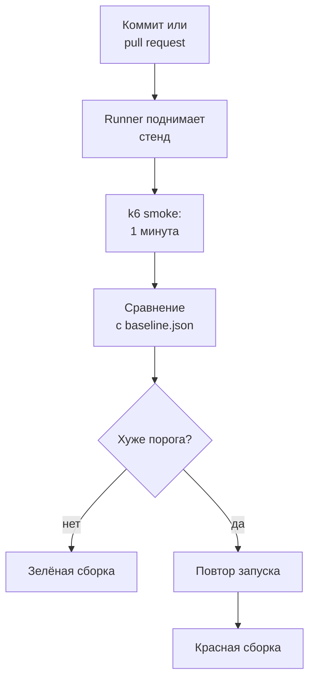
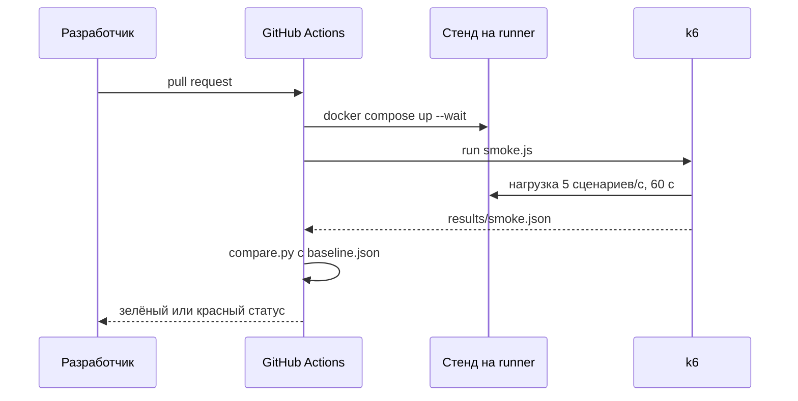

## Зачем это нужно

Расскажу, как у меня выглядел типичный провал. Мы сделали отличный отчёт, как в [уроке 12.1](01-report.md): цифры, график, довольный руководитель. Через месяц разработчик добавил «безобидную» правку, ещё один запрос к базе на странице каталога. Всё работало, автотесты из [урока 6.3](../06-api-testing/03-ci-actions.md) были зелёными, а ёмкость упала на треть. Заметили через неделю по жалобе покупателя, и искать виноватого пришлось среди сорока коммитов.

Теперь та же история у тебя: до распродажи недели, и надо следить, чтобы отчёт не устарел раньше времени. Это называется регрессом производительности (performance regression): код стал работать медленнее, хотя работает правильно. Обычные тесты его не ловят, они проверяют «правильно ли», а не «как быстро».

Ловит его короткая нагрузочная проверка, которая сама идёт на каждое изменение в **CI** (continuous integration, непрерывная интеграция: сервер сам прогоняет проверки на каждое изменение кода). Изменение приходит как **pull request** (запрос на слияние): разработчик просит добавить его правку в основную ветку, и пока её не приняли, CI проверяет её отдельно. Результат она сравнивает с эталоном. Такая проверка называется **perf smoke**, «дымовой» тест производительности.: включил прибор и смотришь, не пошёл ли дым. Это короткая проверка из [урока 8.3](../08-perf-theory/03-test-types.md): не «сколько выдержим», а «стало ли хуже».

Подвох в том, что идею чаще бросают, чем внедряют, и виноват **шум**. Одна и та же проверка на одном и том же коде в разные минуты даёт разные числа. Если сборка краснеет от шума, через неделю на неё перестанут смотреть. Весь урок про то, как построить проверку, которой верят.

Шаг проекта: в `~/perf-lab` появятся сценарий `smoke.js`, базовая линия `baseline.json`, скрипты `compare.py` (сравнение) и `noise.sh` (замер шума) и workflow `.github/workflows/perf-smoke.yml`, который запускает всё это на каждом pull request.

## Что нужно знать

- k6, пороги и код выхода 99: [урок 10.2](../10-k6/02-scenarios-thresholds.md). Мы запускаем тот же `~/perf-lab/10-k6/shop.js`, только коротко.
- GitHub Actions: workflow, job, step, поднятие стенда в CI: [урок 6.3](../06-api-testing/03-ci-actions.md). Здесь мы повторим тот же приём с другой проверкой.
- Перцентили и «клюшка»: [урок 8.1](../08-perf-theory/01-latency-throughput.md) и [8.2](../08-perf-theory/02-queues-littles-law.md). p95 это то число, которое мы сравниваем.
- Отчёт и базовая линия из [урока 12.1](01-report.md): числа ступенчатого прогона становятся ориентиром.
- Python и JSON: [тема 4](../04-python/index.md). Скрипт сравнения короткий.

## Картина целиком

Пропускной пункт с рамкой металлоискателя. Она срабатывает на ключи в кармане, и человека отправляют обратно. Настроишь слишком чувствительно: рамка звенит на каждого, очередь растёт, и охранник перестаёт реагировать. Слишком грубо: нож пройдёт. Хорошая настройка стоит выше обычного «фона» (монеты, ремни) и ниже реальной опасности. Perf smoke это такая рамка для кода: на каждый коммит быстрый замер и красный сигнал только при настоящем ухудшении. Аналогия ломается там, что «фон» в CI меняется день ото дня, поэтому его мерят заранее.



Runner (раннер) это виртуальная машина GitHub, на которой идёт проверка; о нём было в [уроке 6.3](../06-api-testing/03-ci-actions.md). Развилка «хуже порога?» решает судьбу проверки: порог определяет и пропущенные регрессы (плохой код прошёл зелёным), и ложные тревоги (здоровый код покраснел из-за шума). Повтор перед красной сборкой снижает вторые, не увеличивая первые.

Урок идёт по блокам схемы: что запускаем (smoke), с чем сравниваем (базовая линия), как выбрать порог (шум) и когда красный означает «нельзя вливать».

## Теория

### Perf smoke: короткая нагрузка вместо длинного теста

Полный тест из [урока 12.1](01-report.md) идёт десять минут и требует чистого стенда. Гонять его на каждый коммит дорого. Значит, регрессы копятся до следующего запуска? Нет, есть способ дешевле.

Домашние весы неточны, но резкий скачок покажут сразу, а точное обследование у врача делают раз в год. Smoke это домашние весы, stress-тест это врач. Весы не говорят, сколько ты весишь на самом деле, они отвечают на один вопрос: «не стало ли заметно хуже?»

Поэтому smoke идёт одну минуту, без ступеней, на одной постоянной нагрузке, и выдаёт не отчёт, а зелёный или красный статус. Нагрузку выбирают заметно ниже предела, но такую, чтобы разница была видна. У нашего стенда предел 40 сценариев в секунду, smoke идёт на 5: система не перегружена, и каждая лишняя миллисекунда кода попадает в p95. Если нагрузка слишком мала, регресс утонет в шуме. Если у самого предела, любое колебание выбросит замер на «клюшку» ([урок 8.2](../08-perf-theory/02-queues-littles-law.md)), где задержка скачет от пустяка.

Считаем p95 и долю ошибок: среднее регресс на отдельных маршрутах пропускает ([урок 8.1](../08-perf-theory/01-latency-throughput.md)).

Разработчик добавил в `GET /api/products` запрос остатка на складе, и каждый вызов делает на один запрос в базу больше. При пяти сценариях в секунду p95 каталога вырос с 260 до 360 мс. Это плюс 100 мс к 260, то есть 38%. Порог SLO из k6 `p(95)<500` остался зелёным, а регресс налицо: нужна проверка относительно эталона.

> **Прикинь сам:** почему smoke гонят на нагрузке заметно ниже предела, а не прямо на нём?
{: .predict}

Рядом с пределом задержка растёт по «клюшке»: крошечное изменение нагрузки даёт большой скачок p95, и результат прыгает. Далеко от предела кривая плоская, p95 стабилен, и регресс виден на фоне шума.

Осторожно: smoke не заменяет stress-тест. Он ловит ухудшение относительно прошлого, а предел показывает только полный тест: smoke нужен на каждый коммит, stress раз в релиз.

> **Главное:** perf smoke это минутная проверка далеко от предела, которая отвечает «не стало ли хуже», а не «сколько мы держим».
{: .key}

Чтобы сказать «стало хуже», нужно знать, как было. Откуда взять это «было»?

### Базовая линия: с чем сравниваем

Число «p95 = 360 мс» само по себе ни хорошо, ни плохо. Хорошо оно или плохо, видно только на фоне эталона: как было, когда всё работало. Такой эталон называется **базовой линией** (baseline). Она лежит в репозитории рядом с кодом, и по ней сравнивают каждый новый замер.

Простейшая базовая линия это файл `baseline.json` с парой чисел:

```json
{
  "p95_ms": 262,
  "runs": 5,
  "commit": "a1b2c3d",
  "date": "2026-10-14"
}
```

На коммите `a1b2c3d` «Магазин» при пяти сценариях в секунду показывал p95 262 мс, и это медиана пяти запусков. Медиана (median) это серединное значение: из пяти чисел по возрастанию берут третье. Единичный выброс её не сдвигает, в отличие от среднего.

Эталон надо снимать там же, где потом сравниваешь. Если он снят на ноутбуке, а сравнение идёт на облачной машине, разница получится из-за машины, а не кода. Поэтому базовую линию для CI снимают в CI. Лежит она в git, чтобы было видно, когда и кем её меняли. И обновляют её осознанно, отдельным коммитом с объяснением («после индекса p95 снизился, фиксируем новую базу»). Если эталон автоматически подтягивать к последнему результату, регресс просто «съедается»: 260, 270, 280, и никто не заметил.

Новый запуск дал 275 мс: это плюс 5%, в пределах шума. Запуск с 360 мс это плюс 37%, красный.

> **Проверь понимание:** базовую линию сняли на ноутбуке, p95 = 60 мс. В CI тот же код даёт 260 мс. Это регресс?

<details markdown="1">
<summary>Ответ</summary>

Нет, это разница окружений: облачный раннер медленнее ноутбука и делит процессор со стендом. Сравнивать можно только замеры с одной и той же среды, поэтому эталон снимают в самом CI.

</details>

Осторожно: эталон хранят вне репозитория, в wiki или в голове, и через полгода никто не знает, откуда число. Ещё одна ошибка: взять эталоном самый удачный запуск, тогда обычные запуски выглядят «регрессом».

> **Главное:** базовая линия это медиана нескольких запусков, снятая в том же CI и лежащая в git; обновляют её только осознанно.
{: .key}

Эталон есть. На сколько процентов можно отклониться, не считая это регрессом? Ответ упирается в шум.

### Шум и нестабильные раннеры

Один и тот же код три раза подряд дал три разных p95. Сломался код? Скорее всего, нет: в CI числа плавают сами.

Причин несколько. Раннер делит сервер с чужими машинами: соседи занимают процессор и диск, и твой тест получает то больше, то меньше. Сразу после старта стенда кэши и пулы пусты, поэтому первые 10–15 секунд не учитывают. Стенд и генератор нагрузки борются за те же два процессора. Нагрузка идёт на случайные товары, и часть запросов попадает в кэш, а часть нет. Наконец, фоновая уборка в PostgreSQL (`autovacuum`, плановая уборка мусора в таблицах, которая на минуту занимает диск и процессор) может выпасть как раз на твою минуту.

Шум не исчезает, но его можно измерить: запусти проверку несколько раз подряд на неизменном коде. Пять запусков дали 241, 262, 258, 279 и 301 мс. Минимум 241, максимум 301, медиана 262. Разброс 301 минус 241 равен 60 мс, делим на медиану 262 и получаем 23%. Это и есть шум: 23% от эталона.

> **Прикинь сам:** пять запусков на неизменном коде дали p95: 200, 210, 205, 250, 208. Каков шум?
{: .predict}

Медиана 208 (упорядочим: 200, 205, 208, 210, 250). Разброс 250 минус 200 это 50 мс, делим на 208, выходит около 24%. Выброс 250 говорит ещё и о том, что одного запуска мало.

Что шум делает с порогом? Порог «эталон плюс 10%» (288 мс) сработает на запуске 301: красный на нетронутом коде. Порог «плюс 50%» (393 мс) к такому шуму устойчив и поймает регресс больше 50% (выше 393 мс), но регресс в 30% (340 мс) пропустит. Чтобы ловить меньше, надо снижать шум (длиннее прогон, прогрев, больше нагрузки) или сравнивать на одной машине (раздел про A/B ниже).

<div class="viz" data-viz="proc-ci-history" data-base="260" data-noise="12" data-regress="40" data-at="18" data-threshold="400" data-retries="0"></div>

Точки это p95 каждого из тридцати коммитов, пунктир порога и линия эталона. С коммита 18 в код внесён регресс. Подвигай шум вверх: сначала на здоровом коде появятся красные точки (ложные тревоги), потом шум закроет регресс. Опусти порог, и ложные тревоги пойдут через раз. Подними, и регресс перестанет ловиться.

Осторожно: порог «на глаз» («плюс 10% это много») без измерения шума это гадание: на раннере с разбросом 25% он краснеет каждый четвёртый раз.

> **Главное:** шум измеряют заранее: несколько запусков на неизменном коде, разброс делят на медиану; порог начинается там, где шум заканчивается.
{: .key}

Шум известен. Теперь можно ставить порог, и тут нас ждут две разные ошибки.

### Порог с запасом: относительный и абсолютный

Порог превращает число в вердикт, и ошибиться можно в две стороны. Ложная тревога: красный на здоровом коде, тратит время и подрывает доверие. Пропущенный регресс: зелёный на плохом коде, ёмкость теряется молча. Обе сразу не убрать, можно выбрать баланс.

В CI ставят два порога, потому что они ловят разное. Абсолютный (SLO) живёт прямо в k6, в `thresholds`, как в [уроке 10.2](../10-k6/02-scenarios-thresholds.md): «p95 меньше 500 мс, ошибок меньше 1%». Он ловит «стало совсем плохо» и не зависит от истории. Но регресс, не дотянувший до SLO, он пропустит: было 260, стало 400, а он молчит.

Относительный сравнивает с эталоном: «p95 не больше эталона на 50%», то есть не выше 393 мс. Он ловит сползание внутри SLO.

Для относительного удобны три зоны. Пока p95 не превышает эталон в 1,25 раза, это шум, сборка зелёная. От 1,25 до 1,5 подозрительно: сборка остаётся зелёной, но в сводке появляется предупреждение. Выше 1,5 это регресс, сборка красная. Зона предупреждения никого не блокирует, зато заставляет заметить медленное сползание.

Запас выбирают правилом: порог равен эталону плюс два шума, это грубо покрывает почти все случайные скачки. У нас шум 23%, дважды это 46%, и ближайший круглый порог 50% (коэффициент 1,5) как раз с запасом. Нужно ловить регресс в 20% при шуме 23%? Тогда надо снижать шум, а не двигать порог.

При эталоне 262 мс запуск с 275 мс даёт отношение 1,05, зелёный. С 340 мс получаем 1,30, зелёный с предупреждением. С 420 мс получаем 1,60, красный. А p95 = 530 мс краснеет по абсолютному порогу, каким бы ни был эталон.

> **Прикинь сам:** эталон 150 мс, SLO 500 мс. Новый коммит даёт p95 = 290 мс. Какие пороги сработают?
{: .predict}

Абсолютный нет: 290 меньше 500. Относительный да: 290 делим на 150, получаем 1,93, а это больше 1,5. Ради таких случаев (почти вдвое медленнее, но в пределах SLO) относительная проверка и нужна.

Осторожно: один жёсткий порог «плюс 10%» даёт ложные тревоги, а проверка только по SLO пропускает регресс в 90% (с 260 до 495 мс).

> **Главное:** нужны оба порога: абсолютный ловит «совсем плохо», относительный ловит сползание, а запас над ним равен двум-трём шумам.
{: .key}

Даже хороший порог иногда краснеет случайно. Что делать с этим?

### Повторы: как не падать от шума

Один запуск из двадцати на здоровом коде окажется выше порога просто по случайности, и разработчик будет искать несуществующую проблему.

Врач при подозрительном анализе просит пересдать: одно отклонение может быть случайностью, два подряд уже сигнал. Так работает и повтор: красный засчитывается, только если проверка не прошла дважды подряд. Если первый запуск красный, а второй зелёный, сборка зелёная, с пометкой «флейк» (нестабильный результат) в логе.

Почему это работает, показывает вероятность. Пусть шум даёт ложный красный в 10% запусков. Две независимые неудачи подряд случаются в 0,1 · 0,1 = 0,01, то есть в 1% случаев. Ложные тревоги упали в десять раз. А настоящий регресс (код стабильно хуже) падает в обоих запусках, поэтому ловится как прежде.

> **Прикинь сам:** шум даёт ложный красный в 20% запусков. Сколько ложных красных остаётся при одном повторе и при двух?
{: .predict}

При одном повторе нужны два красных подряд: 0,2 · 0,2 = 0,04, то есть 4%. При двух повторах три красных подряд: 0,2 · 0,2 · 0,2 = 0,008, то есть 0,8%.

<div class="viz" data-viz="proc-ci-history" data-base="260" data-noise="18" data-regress="40" data-at="18" data-threshold="320" data-retries="1"></div>

Шум 18% и тесный порог дают красные точки на здоровых коммитах, но с повтором часть из них гаснет (бледные кольца это неудачные первые попытки). Поставь повторов 0 и посчитай, сколько красных стало. Потом поставь 2: реальный регресс по-прежнему красный, повторы убирают только случайность.

Время повторы почти не тратят: запуск повторяется лишь после неудачи. Цена другая: нестабильный регресс, который проявляется в половине запусков, проскочит с вероятностью 50%. Поэтому вторую попытку судят тем же порогом, а больше двух попыток не делают.

Пример: первая попытка 330 мс (красный, порог 320), вторая 285 мс (зелёный), итог зелёный. В логе должна остаться строка «attempt 1 failed, attempt 2 passed», иначе, когда проверка начнёт «краснеть по понедельникам», причину никто не найдёт.

Осторожно: если повтор нужен чаще чем в одном запуске из десяти, дело не в везении. Шум слишком велик, и порог пора менять, а не прятать проблему повторами.

> **Главное:** красный засчитывается после двух неудач подряд, и это режет ложные тревоги, но не прячет настоящий регресс.
{: .key}

Проверка стала надёжной. Осталось решить, имеет ли она право остановить чужое изменение.

### Когда красная проверка должна блокировать сборку

Проверка, которая ничего не блокирует, превращается в декорацию. Проверка, которая блокирует по любому поводу, превращается в помеху. Нужна осознанная политика с тремя уровнями строгости.

Первый уровень: информативно. Проверка не влияет на статус, результат виден в сводке. Он подходит на старте, пока копится статистика шума. Второй: проверка блокирует pull request (required check, обязательная проверка): красный запрещает слияние. Подходит, когда шум измерен, ложных красных почти нет, а регресс дорогой (платёжный путь, главная страница). Третий: блокирует релиз. Тяжёлые ночные тесты перед выкаткой, которые нельзя гонять на каждый коммит.

Начинай с первого уровня на две-три недели, собери статистику, затем переходи ко второму с порогом, который её выдержал. Критерий: за период ни одного ложного красного после повторов. Для «Магазина» шум по пяти запускам в день оказался 15–25%, порог поставили плюс 50% с одним повтором и предупреждением при плюс 25%. За две недели 14 красных из 60 запусков, после повтора осталось 2, и оба настоящие: команда добавляла лишние запросы. Повтор срезал не в десять раз, как в формуле выше, а в семь. Плохие минуты у соседей по серверу идут пачкой, поэтому два красных подряд случаются чаще, чем у монетки. Проверка стала обязательной.

Нужен и обход: слить несмотря на красное, но с записью причины, иначе при срочной правке люди найдут свой способ. Автор изменения должен уметь воспроизвести проверку сам, запустив `smoke.js` руками, а в сообщении об ошибке видеть, что нарушено и во сколько раз.

Осторожно: блокирующую проверку нельзя включать сразу, без статистики: первая же ложная тревога настроит команду против всей идеи. Но и вечный «информативный» режим плох, регрессы так и пролезают.

> **Главное:** проверку сначала запускают информативно, собирают статистику шума и только потом делают обязательной, с видимым обходом для срочных случаев.
{: .key}

Политика выбрана. Как всё это собрать в один файл, чтобы красный можно было потом разобрать?

### Workflow: артефакты, сводка и защита

Статус «красный» без подробностей бесполезен: непонятно, что мерили и почему упало. Поэтому после каждого запуска CI сохраняет два вида следов.

Первый вид это артефакты (artifacts): файлы, прикреплённые к запуску workflow и доступные по умолчанию 90 дней. Мы сохраняем `results/smoke.json` (сводку k6) и `compare.md` (результат сравнения). Шаг загрузки идёт с условием `if: always()`: по умолчанию шаги после упавшего пропускаются, и без условия данных не будет как раз тогда, когда они нужнее всего. Второй вид это сводка задания (job summary): файл Markdown `$GITHUB_STEP_SUMMARY`, который GitHub показывает на странице запуска. Туда `compare.py` печатает таблицу «эталон, сейчас, отношение, вердикт», и качать артефакт не нужно.

Один запуск это точка, а регресс виден по ряду. Поэтому раз в сутки (`schedule`) на главной ветке гоняют тот же smoke и складывают числа в Prometheus ([урок 10.3](../10-k6/03-k6-prometheus.md)) или хотя бы в файл. Тогда видно, что p95 ползёт по 2% в неделю, хотя ни одна сборка не покраснела.

Сам workflow (файл с описанием, что и когда запускать на runner'е) держится на нескольких решениях, и у каждого есть причина. Он идёт на каждый pull request и вручную для отладки. Если разработчик быстро присылает правку за правкой, старые запуски отменяются: два прогона рядом мешали бы замерам. Зависший стенд не сжигает лимит минут: у задания таймаут 15 минут. А права у workflow минимальные, только чтение репозитория: проверка ничего в нём не меняет, и украсть через неё нечего.

Одно место стоит запомнить, потому что на нём ломают репозитории. Когда в запуск вручную передают текст из формы, его нельзя вставлять прямо в команду: тот, кто заполняет поле, может написать там не число, а команду, и она выполнится на runner'е с доступом к паролям. Поэтому значение сначала кладут в переменную окружения (`env`), и команда читает его как обычные данные. Атака через такую вставку называется script injection (внедрение скрипта).



Стенд и k6 живут на одной машине. Абсолютную ёмкость мы так не узнаем ([урок 12.1](01-report.md): отличие от прода). Для сравнения «было и стало» это не мешает: условия одинаковы.

Осторожно: из интернета копируют workflow с триггером `pull_request_target`. Обычный `pull_request` из чужого форка идёт без доступа к паролям репозитория, а `pull_request_target` запускается с ним, и чужой код получает токены. Учебному репозиторию хватает `pull_request` и прав только на чтение.

> **Главное:** сохраняй артефакты и сводку всегда, права давай минимальные, а ввод из форм передавай через `env`.
{: .key}

Остаётся вопрос: что делать, когда закоммиченный эталон перестаёт справляться?

### A/B-сравнение на одной машине

Эталон из `baseline.json` стареет: GitHub обновляет образ машины, и числа «уезжают» без единой правки кода. Есть способ надёжнее: измерить `main` и ветку на одной и той же машине в одном задании. Шум машины действует на оба замера одинаково и выпадает из сравнения.

В задании два прогона: стенд из `main` даёт `results/main.json`, затем стенд из ветки pull request'а даёт `results/pr.json`. Сравнивают их между собой. Чтобы снизить шум, чередуют (main, pr, main, pr) и берут медианы. Цена: время сборки вдвое-вчетверо больше, workflow сложнее. Поэтому A/B (сравнение двух вариантов, A и B, в одинаковых условиях) берут, когда простой эталон уже не справляется, а на старте хватает его. В этом уроке мы делаем простой вариант.

Осторожно: при одном запуске A/B второй замер выигрывает от «разогретого» кэша, поэтому нужны чередование и прогрев.

> **Главное:** A/B меряет main и ветку на одной машине, шум действует на обе стороны одинаково, и сравнение получается чище, но дороже.
{: .key}

Вернёмся к «безобидному» запросу в каталоге. С такой проверкой он покраснел бы в день появления, а не через неделю по жалобе. Осталось построить её руками.

## Практика

Файлы лежат в `~/perf-lab/12-process/` и `~/perf-lab/.github/workflows/`. Нагрузка идёт только на твой локальный стенд и на стенд в твоём CI.

### 1. Короткий сценарий smoke.js

Стенд должен работать (`curl -s localhost:8000/readyz` отвечает `{"status":"ready"}`). Создай `~/perf-lab/12-process/smoke.js`:

```javascript
// Perf smoke: тот же сценарий покупки, что в 10-k6/shop.js, но короткий и фиксированный.
import shop from '../10-k6/shop.js';

export default shop;

export const options = {
  scenarios: {
    smoke: {
      executor: 'constant-arrival-rate',
      rate: Number(__ENV.RATE || 5),
      timeUnit: '1s',
      duration: __ENV.DURATION || '60s',
      preAllocatedVUs: 10,
      maxVUs: 50,
    },
  },
  thresholds: {
    http_req_failed: ['rate<0.01'],
    http_req_duration: ['p(95)<500'],
    checks: ['rate>0.99'],
    dropped_iterations: ['count==0'],
  },
};
```

Разбор: `import shop from ...` берёт функцию сценария из твоего `shop.js`, и сценарий не дублируется. `export default shop` объявляет её сценарием этого файла. В `options` берутся из переменных окружения `RATE` и `DURATION`, по умолчанию 5 сценариев в секунду и 60 секунд. `constant-arrival-rate` (как в [уроке 10.2](../10-k6/02-scenarios-thresholds.md)) подаёт нагрузку с постоянной скоростью независимо от ответов. Пороги это абсолютные SLO: p95 меньше 500 мс, ошибок меньше 1%. `thresholds` из `shop.js` сюда не переходят: `import` берёт только функцию сценария, а `options` у файла свои. Поэтому порог `dropped_iterations` повторён: без него при нехватке VU тест пройдёт зелёным на меньшей нагрузке, чем заказано.

```bash
cd ~/perf-lab
k6 run --summary-export results/smoke.json 12-process/smoke.js
```

```text
  █ THRESHOLDS

    checks
    ✓ 'rate>0.99' rate=100.00%

    dropped_iterations
    ✓ 'count==0' count=0

    http_req_duration
    ✓ 'p(95)<500' p(95)=61.34ms

    http_req_failed
    ✓ 'rate<0.01' rate=0.00%

  █ TOTAL RESULTS

    HTTP
    http_req_duration..............: avg=24.1ms min=3.2ms med=15.8ms max=312ms p(90)=48.5ms p(95)=61.34ms
    http_reqs......................: 1508   25.13/s
```

**Как читать вывод:** сначала блок THRESHOLDS: галочки значит пороги выполнены, а крестик это провал и код выхода 99. Потом `p(95)` в строке `http_req_duration`: это число мы будем сравнивать с эталоном. `http_reqs` 1508: 60 секунд по 5 сценариев по 5 запросов (1500) плюс по одному логину на каждый задействованный VU, как в 10.2. На твоей машине числа другие: на ноутбуке p95 заметно ниже, чем будет в CI. Если k6 пишет `could not open file ../10-k6/shop.js`, проверь, что запускаешь из `~/perf-lab` и что файл называется `shop.js`.

**Типичные ошибки:** `ERRO ... default export is not a function`: в `shop.js` сценарий должен быть `export default function`. `dial tcp ... connection refused`: стенд не запущен.

### 2. Измерь шум: noise.sh

Прежде чем выбрать порог, узнай шум. Создай `~/perf-lab/12-process/noise.sh`:

```bash
#!/usr/bin/env bash
# Несколько одинаковых прогонов smoke подряд. Запуск: ./noise.sh [число прогонов]
set -u
cd "$(dirname "$0")/.."
mkdir -p results
N="${1:-5}"
for i in $(seq 1 "$N"); do
  echo "== прогон $i из $N =="
  k6 run -q --summary-export "results/noise-$i.json" 12-process/smoke.js || true
  sleep 10   # пауза между прогонами: стенд приходит в обычное состояние
done
python3 12-process/compare.py --noise 'results/noise-*.json'
```

Разбор: цикл `seq 1 "$N"` повторяет прогон N раз; `-q` убирает лишний вывод; `|| true` не даёт скрипту остановиться, если k6 выйдет с кодом 99; в конце `compare.py --noise` посчитает разброс. Скрипт сравнения мы пишем следующим шагом.

### 3. compare.py: сравнение с эталоном

Создай `~/perf-lab/12-process/compare.py`:

```python
"""Сравнение smoke-прогона с эталоном и оценка шума.

  python3 compare.py                               сравнить results/smoke.json с baseline.json
  python3 compare.py --noise 'results/noise-*.json' оценить шум по нескольким прогонам
  python3 compare.py --update 'results/noise-*.json' записать новый baseline.json (медиана)
Код выхода: 0 в норме или предупреждение, 1 регресс или ошибки.
"""
import glob
import json
import datetime
import os
import statistics
import subprocess
import sys

HERE = os.path.dirname(os.path.abspath(__file__))
RESULT = os.path.join(HERE, "..", "results", "smoke.json")
BASELINE = os.path.join(HERE, "baseline.json")
WARN = float(os.environ.get("WARN_RATIO", 1.25))  # выше: предупреждение
FAIL = float(os.environ.get("FAIL_RATIO", 1.5))   # выше: красная сборка
MAX_ERRORS = 0.01


def load(path):
    with open(path) as stream:
        return json.load(stream)


def metric(summary, name):
    item = summary["metrics"][name]
    return item.get("values", item)  # в разных версиях k6 поля лежат на разной глубине


def p95_and_errors(path):
    summary = load(path)
    p95 = metric(summary, "http_req_duration")["p(95)"]
    failed = metric(summary, "http_req_failed")
    errors = failed.get("rate", failed.get("value", 0))
    return p95, errors


def noise(pattern):
    values = sorted(p95_and_errors(path)[0] for path in glob.glob(pattern))
    if len(values) < 3:
        sys.exit("нужно хотя бы 3 прогона")
    median = statistics.median(values)
    spread = (values[-1] - values[0]) / median
    print(f"прогонов: {len(values)}, p95 по прогонам: {[round(v) for v in values]}")
    print(f"медиана {median:.0f} мс, минимум {values[0]:.0f}, максимум {values[-1]:.0f}")
    print(f"шум (разброс / медиана): {spread:.0%}")
    advice = 1 + max(0.25, round(2 * spread * 20) / 20)
    print(f"порог красного: не меньше {advice:.2f} от эталона (сейчас {FAIL:.2f})")
    return median


def update(pattern):
    median = noise(pattern)
    try:
        commit = subprocess.check_output(["git", "rev-parse", "--short", "HEAD"], text=True).strip()
    except (OSError, subprocess.CalledProcessError):
        commit = "unknown"
    data = {"p95_ms": round(median), "runs": len(glob.glob(pattern)),
            "commit": commit, "date": datetime.date.today().isoformat()}
    with open(BASELINE, "w") as stream:
        json.dump(data, stream, indent=2)
    print(f"baseline.json обновлён: {data}")


def compare():
    base = load(BASELINE)["p95_ms"]
    p95, errors = p95_and_errors(RESULT)
    ratio = p95 / base
    if errors >= MAX_ERRORS:
        verdict, code = "ОШИБКИ", 1
    elif ratio > FAIL:
        verdict, code = "РЕГРЕСС", 1
    elif ratio > WARN:
        verdict, code = "ПРЕДУПРЕЖДЕНИЕ", 0
    else:
        verdict, code = "В НОРМЕ", 0
    print("### Perf smoke\n")
    print("| p95 эталона, мс | p95 сейчас, мс | отношение | ошибок | вердикт |")
    print("|---|---|---|---|---|")
    print(f"| {base:.0f} | {p95:.0f} | {ratio:.2f} | {errors:.2%} | {verdict} |")
    if verdict == "ПРЕДУПРЕЖДЕНИЕ":
        print(f"::warning::p95 выше эталона в {ratio:.2f} раза")
    return code


if __name__ == "__main__":
    args = sys.argv[1:]
    if args[:1] == ["--noise"]:
        noise(args[1])
    elif args[:1] == ["--update"]:
        update(args[1])
    else:
        sys.exit(compare())
```

Разбор. `metric()` берёт поле из `values` (старый формат сводки) или прямо из метрики (новый): если что-то не находится, выведи ключи `jq '.metrics | keys' results/smoke.json`. `statistics.median` это та самая медиана. `noise()` считает разброс как (максимум - минимум) / медиана и предлагает порог: удвоенный шум, округлённый до 5%, но не меньше 1,25. `update()` записывает медиану, число прогонов, коммит и дату в `baseline.json`. `compare()` печатает таблицу в формате Markdown (она попадёт в сводку GitHub) и возвращает код выхода: 1 при регрессе или ошибках, 0 иначе. Строка `::warning::...` это команда GitHub Actions: она создаёт жёлтую аннотацию, но только если попала в вывод шага. Раз вывод `compare.py` уходит в файл, шаг «Сводка» в workflow ниже печатает эту строку заново. Пороги `WARN_RATIO` и `FAIL_RATIO` можно переопределять переменными окружения.

```bash
chmod +x ~/perf-lab/12-process/noise.sh
~/perf-lab/12-process/noise.sh 5
```

```text
прогонов: 5, p95 по прогонам: [241, 258, 262, 279, 301]
медиана 262 мс, минимум 241, максимум 301
шум (разброс / медиана): 23%
порог красного: не меньше 1.45 от эталона (сейчас 1.50)
```

**Как читать вывод:** главное число это «шум». Строка «порог красного» подсказывает минимум: у нас 1.45, а действующие 1.50 его покрывают. Если шум 5%, порог может быть +25%, если 25%, порог красного должен быть около +50%. На ноутбуке вместо облачной машины шум обычно ниже, но задача настоящая: измерить его там, где проверка будет жить. Это число 262 мы запишем в эталон. **Твои числа будут другими.** Если k6 завершился ошибкой на одном из прогонов, смотри `results/noise-N.json`: без файла `compare.py` скажет «нужно хотя бы 3 прогона».

Зафиксируй эталон:

```bash
cd ~/perf-lab && python3 12-process/compare.py --update 'results/noise-*.json'
cat 12-process/baseline.json
```

```text
{
  "p95_ms": 262,
  "runs": 5,
  "commit": "d4e5f6a",
  "date": "2026-10-14"
}
```

Проверка сравнения на нормальном прогоне:

```bash
k6 run -q --summary-export results/smoke.json 12-process/smoke.js; python3 12-process/compare.py; echo "код выхода: $?"
```

```text
### Perf smoke

| p95 эталона, мс | p95 сейчас, мс | отношение | ошибок | вердикт |
|---|---|---|---|---|
| 262 | 271 | 1.03 | 0.00% | В НОРМЕ |
код выхода: 0
```

### 4. Намеренный регресс: убедись, что проверка срабатывает

Проверка, которую ни разу не видели красной, ненадёжна. Устроим регресс без правки кода: замедлим оплату в заглушке.

```bash
curl -s -X POST localhost:8001/admin/config -H 'Content-Type: application/json' -d '{"delay_ms": 400, "fail_rate": 0}'
cd ~/perf-lab && k6 run -q --summary-export results/smoke.json 12-process/smoke.js; python3 12-process/compare.py; echo "код выхода: $?"
```

Разбор: `/admin/config` у заглушки оплаты меняет задержку на лету (в [теме 11](../11-bottlenecks/index.md) ты с ней работал). Заказ в сценарии вызывает оплату, поэтому каждый заказ теперь на 350 мс дольше.

```text
### Perf smoke

| p95 эталона, мс | p95 сейчас, мс | отношение | ошибок | вердикт |
|---|---|---|---|---|
| 262 | 468 | 1.79 | 0.00% | РЕГРЕСС |
код выхода: 1
```

**Как читать вывод:** абсолютный порог SLO 500 мс k6 здесь не нарушил (468 < 500), поэтому k6 вернул бы 0. Ухудшение поймал только относительный порог: 1,79 это больше 1,5. Ради таких ситуаций нужны оба порога. Верни оплату: `curl -s -X POST localhost:8001/admin/config -H 'Content-Type: application/json' -d '{"delay_ms": 50, "fail_rate": 0}'`.

**Типичные ошибки:** `KeyError: 'http_req_duration'`: сводка не та (пуст файл `smoke.json` или k6 упал до записи). `FileNotFoundError ... baseline.json`: выполни `--update`.

### 5. Workflow в GitHub Actions

Создай `~/perf-lab/.github/workflows/perf-smoke.yml`. Тут есть выражения `${{ }}`: GitHub подставляет значения, поэтому они нужны именно в таком виде.


```yaml
name: Perf smoke

on:
  pull_request:
  workflow_dispatch:
    inputs:
      rate:
        description: Сценариев в секунду
        default: "5"

permissions:
  contents: read

concurrency:
  group: perf-smoke-${{ github.ref }}
  cancel-in-progress: true

jobs:
  smoke:
    runs-on: ubuntu-latest
    timeout-minutes: 15
    defaults:
      run:
        shell: bash
    env:
      RATE: ${{ inputs.rate || '5' }}
    steps:
      - uses: actions/checkout@v5
        with:
          persist-credentials: false

      - name: Код стенда (load-tester)
        uses: actions/checkout@v5
        with:
          repository: distinguished-sre/load-tester
          path: stand
          persist-credentials: false

      - name: Поднять стенд
        working-directory: stand/project/shop
        run: |
          cp .env.example .env
          docker compose up -d --build --wait --wait-timeout 300
          curl --fail --silent http://localhost:8000/readyz

      - name: Прогрев
        run: |
          docker run --rm --network host -u "$(id -u):$(id -g)" \
            -v "$PWD:/work" -w /work -e RATE=2 -e DURATION=15s \
            grafana/k6:2.3.0 run -q 12-process/smoke.js || true

      - name: Smoke (до двух попыток)
        run: |
          mkdir -p results
          for attempt in 1 2; do
            if docker run --rm --network host -u "$(id -u):$(id -g)" \
                 -v "$PWD:/work" -w /work -e RATE -e DURATION=60s \
                 grafana/k6:2.3.0 run --summary-export results/smoke.json 12-process/smoke.js \
               && python3 12-process/compare.py | tee results/compare.md; then
              echo "попытка $attempt: зелёная"
              exit 0
            fi
            echo "попытка $attempt: красная"
            sleep 10
          done
          exit 1

      - name: Сводка
        if: always()
        run: |
          if [ -f results/compare.md ]; then
            grep -v '^::warning::' results/compare.md >> "$GITHUB_STEP_SUMMARY"
            grep '^::warning::' results/compare.md || true   # аннотация работает только из вывода шага
          fi

      - name: Артефакты
        if: always()
        uses: actions/upload-artifact@v4
        with:
          name: perf-smoke
          path: results/
```


Разбор по частям.

- `on: pull_request` запускает проверку на каждый pull request, `workflow_dispatch` даёт запустить вручную с параметром `rate`.
- `permissions: contents: read`: только чтение, больше проверке не нужно.
- `concurrency` с `cancel-in-progress` отменяет прошлый запуск для той же ветки: два прогона одновременно мешали бы друг другу (общие процессоры).
- `env: RATE` берёт значение из ввода через переменную окружения. Дальше в командах стоит `$RATE`, а не подстановка `${{ inputs.rate }}`: это защита от внедрения чужого кода через поле ввода.
- Два шага со стендом повторяют приём из [урока 6.3](../06-api-testing/03-ci-actions.md): второй `checkout` кладёт `load-tester` в `stand/`, затем `.env` и `docker compose up --wait`.
- Прогрев отбрасывает холодный старт (15 секунд на 2 сценариях в секунду, результат игнорируется, `|| true`).
- Шаг Smoke запускает k6 в контейнере (`--network host` чтобы видеть `localhost:8000`, `-v "$PWD:/work"` монтирует репозиторий, `-u` убирает проблему с владельцем файлов), затем `compare.py`, вывод которого `tee` печатает в лог и пишет в `results/compare.md` (при `shell: bash` включён `pipefail`, поэтому код выхода `compare.py` не теряется). Если что-то красное (код выхода k6 99 или compare 1), цикл делает вторую попытку: зелёной сборку делает любая из двух, красной только две подряд.
- Шаги «Сводка» и «Артефакты» с `if: always()` выполняются при любом исходе: таблица попадает в `$GITHUB_STEP_SUMMARY`, предупреждение печатается в лог шага (отсюда жёлтая аннотация), файлы сохраняются.

**Как читать результат:** на странице запуска (вкладка Actions) открой запуск, сверху жёлтые аннотации (предупреждения), ниже таблица «Perf smoke» из `compare.md`, внизу артефакт `perf-smoke` для скачивания. Попытки видны в логе шага: строки «попытка 1: красная», «попытка 2: зелёная» означают, что сработал повтор.

Закоммить и проверь:

```bash
cd ~/perf-lab
git switch -c ci-perf-smoke
git add 12-process 10-k6/shop.js 10-k6/users.json .github/workflows/perf-smoke.yml
git ls-files 10-k6
git commit -m "12.2: perf smoke в CI, базовая линия и сравнение"
git push -u origin ci-perf-smoke
```

`smoke.js` импортирует `../10-k6/shop.js`, а тот читает `users.json`: без них в репозитории CI упадёт на первом же запуске, поэтому `git ls-files 10-k6` должен показать оба файла.

После этого открой pull request на GitHub (кнопка Compare & pull request) и посмотри запуск во вкладке Actions. Эталон `262 мс` в `baseline.json` снят у тебя на ноутбуке: **на облачной машине он будет другим** (скорее всего заметно выше), поэтому первый запуск в CI покажет вердикт «регресс» из-за окружения. Это ожидаемо и повторяет главное правило урока: эталон снимается там, где сравнивается. Исправление в следующем разделе.

**Типичные ошибки:** `checkout` с `repository: distinguished-sre/load-tester` работает с токеном по умолчанию, потому что репозиторий стенда публичный; для приватного репозитория нужен персональный токен в секретах. `docker: Error response ... pull access denied`: опечатка в имени образа, нужно `grafana/k6:2.3.0`. `Permission denied` при записи `results/compare.md`: каталог `results` создан от root (не запускай k6 без `-u`). Красный на первом PR из-за эталона: пересними эталон в CI (шаг 6).

### 6. Эталон из самого CI

Запусти workflow вручную пять раз подряд (Actions, Perf smoke, Run workflow) и в каждом запуске скачай артефакт `perf-smoke`. Возьми из пяти `smoke.json` значение p95 и положи в `results/noise-1.json` ... `results/noise-5.json` (скачанные файлы переименуй). Затем:

```bash
cd ~/perf-lab
python3 12-process/compare.py --noise 'results/noise-*.json'
python3 12-process/compare.py --update 'results/noise-*.json'
git add 12-process/baseline.json && git commit -m "12.2: baseline снят в CI" && git push
```

Теперь эталон принадлежит среде, в которой проходит проверка. Если шум в твоём CI больше 25%, подними `FAIL_RATIO` в workflow (добавь `FAIL_RATIO: "1.7"` в `env` задания) на значение, которое подсказал `noise()`.

**Типичные ошибки:** путаешь файлы разных запусков: названия артефактов одинаковые, переименовывай по мере скачивания. Мало прогонов: меньше трёх `compare.py` не считает.

Коммит делается снова только когда меняется эталон осознанно: такой коммит должен быть отдельным и с пояснением, иначе регресс спрячется в «обновлении базы».

## Сломай и почини

**Поломка.** Команда включила проверку, и через неделю половина pull request'ов краснеет без причины. Вот что известно: порог `FAIL_RATIO=1.1` (+10%), повторов нет, эталон снят на ноутбуке автора, `RATE=40` (вплотную к пределу стенда), прогон 20 секунд. Разработчики уже привыкли нажимать «re-run» до зелёного.

Найди причины ложных красных и составь план исправления. Затем подтверди идею на виджете: подвигай ползунки на «шум» и «порог» и найди, при каких значениях ложные красные исчезают.

<details markdown="1">
<summary>Разбор</summary>

Причины:

1. **Порог +10% при шуме 20-25%.** Он ниже шума, поэтому срабатывает на здоровом коде. Нужен порог выше шума: +50%, с предупреждением при +25%.
2. **Эталон с ноутбука.** Облачная машина медленнее, отношение к такому эталону сразу выше порога. Эталон надо снять в CI (медиана 5 запусков).
3. **Нагрузка у предела (40 сценариев).** Рядом с пределом p95 скачет по «клюшке», шум возрастает в разы. Нагрузку надо снизить до 5-10 сценариев в секунду.
4. **Прогон 20 секунд.** Холодный старт занимает значимую долю и мало запросов: p95 нестабилен. Нужны прогрев и минута.
5. **Нет повторов.** Одно случайное красное блокирует PR. Один повтор снижает ложные красные в разы.
6. **Привычка «re-run до зелёного»** признак того, что проверке больше не верят. Вылечить это можно только честным порогом: если красный бывает ложным, перестают смотреть и на настоящие.

План: измерить шум (`noise.sh`, пять запусков в CI), снять эталон там же, поставить нагрузку 5, прогрев 15 секунд, минута замера, порог красного +50%, один повтор, предупреждение при +25%, до стабилизации перевести проверку в информативный режим. На виджете: при шуме 20% порог 400 мс (на эталоне 260) почти не даёт ложных красных, а регресс +60% ловит.

</details>

> Красный пайплайн без понятной причины? Сначала сам проверь по списку из «Сломай и почини»: порог ниже шума, эталон на другой машине, нагрузка у предела. Потом покажи нейросети лог шага и свой вывод. Ответ проверь замером шума `noise.sh`.
{: .ai}

## ИИ в помощь

Нейросеть быстро пишет YAML для GitHub Actions и небольшие скрипты сравнения, но версии действий и синтаксис она часто берёт устаревшие. Общие правила: [ИИ-помощник](../ai.md).

**Задача:** собрать workflow для проверки производительности.

```text
Нужен workflow GitHub Actions для репозитория со стендом на Docker Compose (проект project/shop) и сценарием
k6 smoke.js (k6 2.3). Шаги: поднять стенд и дождаться /readyz, запустить k6, выложить сводку в артефакты, и
вызвать python3 compare.py, который падает с кодом 1 при ухудшении p95 больше чем в 1,5 раза. Запуск при pull
request, но не при изменениях только в документации. Объясни каждый шаг. Версии действий укажи те, что
актуальны, и скажи, где я могу их проверить.
```
{: .wrap}

**Проверь ответ:** проверь версии действий на странице каждого действия в GitHub Marketplace и прогони workflow в тестовой ветке. Типичные ошибки: устаревшие версии (`checkout@v2`), несуществующее действие для k6, отступы YAML, шаг после падающего без `if: always()`.

**Задача:** выбрать порог для сравнения.

```text
Я пять раз прогнал одну и ту же версию сервиса в CI: p95 в мс: <вставь пять значений>. Предложи порог ухудшения для
красного и для предупреждения, объясни, как отличить шум от регресса, и сколько повторов нужно. Покажи расчёт.
```
{: .wrap}

**Проверь ответ:** посчитай разброс сам: (максимум - минимум) / медиана. Порог должен быть заметно выше разброса. Типичная ошибка: порог «5 процентов» без оглядки на шум, из-за чего проверка краснеет на здоровом коде.

В workflow не вставляй настоящие ключи: используй `secrets.<ИМЯ>` в GitHub и не показывай значения нейросети.

## Словарик урока

| Термин | Простыми словами |
|---|---|
| Регресс производительности (performance regression) | Код стал медленнее прежнего, хотя работает правильно |
| Perf smoke | Короткая нагрузочная проверка на каждое изменение: не стало ли заметно хуже |
| CI (непрерывная интеграция) | Автоматический запуск проверок на каждое изменение кода |
| Базовая линия (baseline) | Эталонный результат на хорошем коде, с которым сравнивают новые замеры |
| Медиана | Серединное значение в упорядоченном ряду: не реагирует на единичные выбросы |
| Шум | Случайный разброс результатов одной и той же проверки на неизменном коде |
| Раннер (runner) | Машина, на которой GitHub выполняет workflow: общая виртуальная, шум выше, чем на своей |
| Абсолютный порог | Граница по SLO («p95 меньше 500 мс»), не зависит от истории |
| Относительный порог | Граница к эталону («не больше +50%»): ловит сползание в пределах SLO |
| Ложная тревога (false alarm) | Красный сигнал на здоровом коде, обычно из-за шума |
| Пропущенный регресс | Зелёный сигнал на плохом коде, обычно из-за слишком мягкого порога |
| Повтор (retry) | Второй запуск проверки при красном: два красных подряд считаются настоящим |
| Артефакт (artifact) | Файл, прикреплённый к запуску workflow и доступный для скачивания |
| Сводка задания (job summary) | Markdown-страница на запуске: таблица результата без скачивания файлов |
| A/B-сравнение | Замер основной ветки и ветки изменения на одной машине в одном задании |
| Код выхода 99 | Так k6 сообщает, что порог не выполнен; CI видит это как падение шага |

## Вопросы с собеседований

Раздел для повторения: ответь вслух, потом открой ответ. Вопросы «на скорость» тренируй на время: ответ за 30 секунд.

### 1. [junior] [часто] Зачем нагрузочный тест в CI, если есть обычные автотесты?

<details markdown="1">
<summary>Ответ</summary>

Автотесты проверяют, правильно ли работает код, а не как быстро. Регресс производительности (код корректен, но медленнее) они не видят. Короткий нагрузочный тест на каждое изменение сравнивает задержку с эталоном и ловит ухудшение сразу, пока виноват один коммит, а не сорок.

**Что хотят услышать:** разница «правильно» и «быстро», раннее обнаружение, локализация виновного коммита.

**Красный флаг:** «нагрузочный тест тоже просто тест, ничем не отличается».

</details>

### 2. [junior] [часто] Что такое регресс производительности?

<details markdown="1">
<summary>Ответ</summary>

Ухудшение скорости или ёмкости после изменения кода при сохранении правильности работы. Например, лишний запрос к базе увеличил p95 каталога на 40%.

**Что хотят услышать:** определение с примером, понимание, что функциональные тесты его не ловят.

**Красный флаг:** путает регресс с багом или падением сервиса.

</details>

### 3. [junior] [часто] Почему результат нагрузочного теста в CI нестабилен?

<details markdown="1">
<summary>Ответ</summary>

Раннеры общие виртуальные машины: соседи занимают процессор и диск. Добавляются холодный старт, стенд и генератор на одной машине, случайность самой нагрузки, фоновые задачи базы. Поэтому один запуск это не точное число, а выборка с разбросом.

**Что хотят услышать:** несколько причин шума и вывод, что порог и эталон надо выбирать с учётом разброса.

**Красный флаг:** «CI просто глючит» без понимания причин.

</details>

### 4. [middle] Как выбрать порог для проверки производительности в CI?

<details markdown="1">
<summary>Ответ</summary>

Сначала измерить шум: несколько запусков на неизменном коде, разброс (максимум минус минимум) делим на медиану. Порог красного ставят заметно выше: обычно эталон плюс два-три шума. Добавляют зону предупреждения ниже и абсолютный порог SLO в k6. Если нужно ловить меньший регресс, чем шум, снижают шум (длиннее прогон, прогрев, A/B на одной машине), а не ужесточают порог.

**Что хотят услышать:** измерение шума, запас, два типа порогов.

**Красный флаг:** «поставлю +5%, чтобы всё ловить».

</details>

### 5. [middle] Что лучше: абсолютный порог (SLO) или относительный (к эталону)?

<details markdown="1">
<summary>Ответ</summary>

Нужны оба, они ловят разное. Абсолютный ловит «стало совсем плохо» и не зависит от истории, но пропускает регрессы внутри SLO (было 260 мс, стало 450). Относительный ловит сползание, но зависит от качества эталона и шума.

**Что хотят услышать:** какие дефекты каждый пропускает.

**Красный флаг:** «достаточно одного порога по SLO».

</details>

### 6. [middle] Зачем в проверке повторы и в чём их опасность?

<details markdown="1">
<summary>Ответ</summary>

Случайный ложный красный (например, 10% запусков) после одного повтора превращается в два красных подряд: 1%. Реальный регресс падает в обоих запусках и ловится. Опасность: повторы маскируют нестабильный тест или слишком тесный порог. Если повтор нужен часто, надо менять порог или снижать шум, а не добавлять повторы.

**Что хотят услышать:** вероятностное объяснение, ограничение метода.

**Красный флаг:** «ставлю десять повторов, пока не станет зелёным».

</details>

### 7. [middle] Эталон снят на ноутбуке, в CI проверка краснеет. В чём проблема и как исправить?

<details markdown="1">
<summary>Ответ</summary>

Сравнивают разные окружения: облачный раннер медленнее ноутбука. Эталон надо снять в самом CI, медианой нескольких запусков, и хранить в репозитории. Для максимальной точности сравнивать `main` и ветку на одной машине в одном задании (A/B).

**Что хотят услышать:** окружение определяет эталон, медиана, A/B.

**Красный флаг:** «подниму порог, пока не позеленеет».

</details>

### 8. [middle] Когда красная проверка производительности должна блокировать слияние?

<details markdown="1">
<summary>Ответ</summary>

Когда шум измерен, ложных красных после повторов практически нет, а регресс на этом участке дорог. До этого проверку запускают в информативном режиме и собирают статистику. Для срочных случаев нужен видимый обход с записью причины.

**Что хотят услышать:** поэтапное внедрение, статистика до блокировки, возможность обхода.

**Красный флаг:** «сразу сделаем обязательной, пусть привыкают».

</details>

### 9. [middle] Как в k6 сделать так, чтобы CI видел провал?

<details markdown="1">
<summary>Ответ</summary>

Описать `thresholds`. Если порог не выполнен, k6 завершается кодом 99, и шаг workflow падает. Ещё полезно писать сводку (`--summary-export`) и сохранять её артефактом при любом исходе (`if: always()`), чтобы красный можно было разобрать.

**Что хотят услышать:** код 99, thresholds, артефакты при падении.

**Красный флаг:** «парсю лог и ищу слово FAIL».

</details>

### 10. [junior] [на скорость] Какой код выхода у k6 при невыполненном пороге?

<details markdown="1">
<summary>Ответ</summary>

99.

**Что хотят услышать:** число и что это значит (порог не выполнен).

**Красный флаг:** «1» или «не знаю».

</details>

### 11. [junior] [на скорость] Чем медиана лучше среднего для эталона?

<details markdown="1">
<summary>Ответ</summary>

Медиана не реагирует на единичные выбросы: один аномально долгий запуск не сдвигает эталон, а среднее сдвигает.

**Что хотят услышать:** устойчивость к выбросам.

**Красный флаг:** «они одинаковы».

</details>

### 12. [junior] [на скорость] Почему нагрузку для smoke берут ниже предела?

<details markdown="1">
<summary>Ответ</summary>

Рядом с пределом задержка растёт по «клюшке» и сильно скачет, результат нестабилен. Далеко от предела кривая плоская, поэтому реальный регресс виден на фоне шума.

**Что хотят услышать:** «клюшка», стабильность измерения.

**Красный флаг:** «чтобы быстрее проходило».

</details>

## Проверено на версиях

GitHub Actions: `actions/checkout@v5`, `actions/upload-artifact@v4`, `ubuntu-latest`. k6 2.3 (образ `grafana/k6:2.3.0`), стенд «Магазин» из `project/shop` (PostgreSQL 18.6, Redis 8.10), Python 3.12+ (`statistics`, стандартная библиотека). Формат `--summary-export` менялся между версиями k6, поэтому `compare.py` читает оба варианта. Числа в примерах учебные: на твоём CI они другие. Октябрь 2026.

## Итог урока: ты умеешь

- [ ] Объяснить, почему обычные тесты не ловят регресс производительности и что такое perf smoke.
- [ ] Выбрать параметры smoke: нагрузка ниже предела, минута, прогрев, p95 и доля ошибок.
- [ ] Хранить базовую линию в репозитории, снимать её в той среде, где идёт сравнение, и менять осознанно.
- [ ] Измерить шум несколькими запусками и выбрать порог с запасом, а не на глаз.
- [ ] Использовать абсолютный (SLO) и относительный (к эталону) пороги с зоной предупреждения.
- [ ] Применять повторы и понимать их границы.
- [ ] Решить, когда проверка информативная, а когда блокирующая.
- [ ] Написать workflow с минимальными правами, повтором, артефактами и сводкой.
- [ ] Попросить нейросеть набросать workflow и проверить версии действий и прогон в тестовой ветке.

Дальше: [урок 12.3. Прогноз ёмкости: сколько выдержим через год](03-capacity.md): от «не стало хуже» к «хватит ли нам мощности через год».
