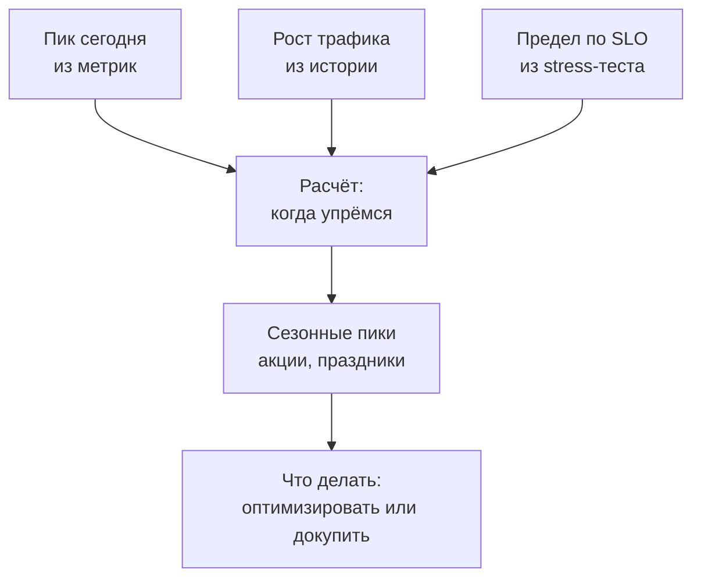
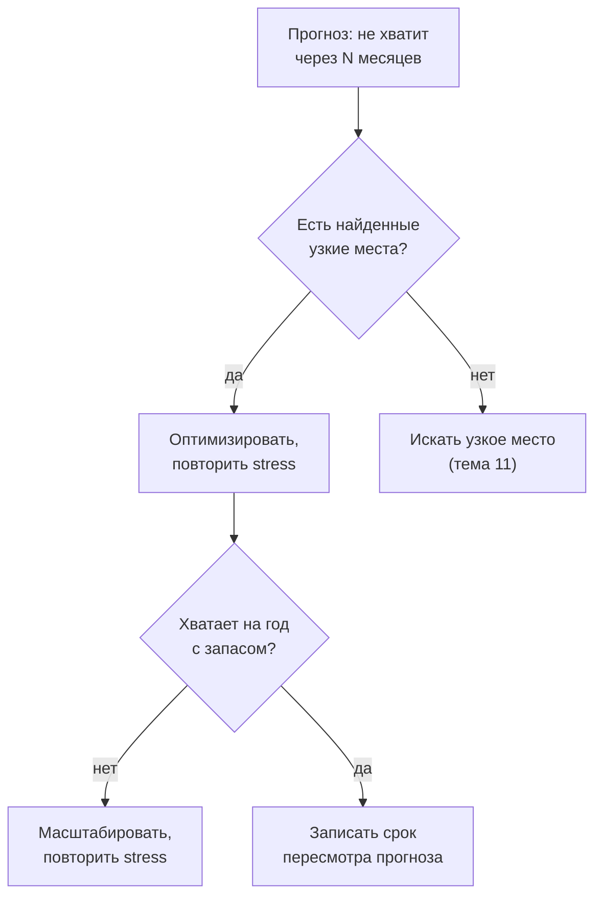

## Зачем это нужно

Тест из [урока 12.1](01-report.md) ответил на вопрос «сколько выдерживаем сегодня»: около 200 запросов в секунду при p95 до 0,5 с. Теперь приходит руководитель с планом: в следующем квартале идёт маркетинговая кампания, трафик растёт, и нужно решить, закладывать ли деньги на серверы в бюджет. Вопрос звучит так: «Сколько мы выдержим через год, и хватит ли нам?» Ответ «сейчас всё хорошо» тут не работает, а «давайте купим побольше на всякий случай» обходится дорого и не решает ничего: возможно, купили не то или зря.

**Прогноз ёмкости** (capacity planning) это расчёт, когда нагрузка дорастёт до предела системы и сколько мощности нужно, чтобы этого не случилось. Он собирает три числа: **сколько трафика сегодня** (пик), **как быстро он растёт** и **где предел** системы (из stress-теста). Остальное арифметика, но с ловушками: почти всё в этой теме выглядит проще, чем есть на самом деле, и ошибки обходятся либо лишними расходами, либо ночным инцидентом в самый неудобный день.

Шаг проекта: ты напишешь `~/perf-lab/12-process/capacity.py`, который по результатам ступенчатого прогона и допущениям о росте считает, когда «Магазин» упрётся в предел, и добавишь раздел «Прогноз ёмкости» в отчёт из урока 12.1. Это финальный шаг темы: измерили, зафиксировали в CI, прогнозируем.

## Что нужно знать

- Ёмкость, клюшка (hockey stick) и запас до предела: [урок 8.1](../08-perf-theory/01-latency-throughput.md) и [8.2](../08-perf-theory/02-queues-littles-law.md). Мы возьмём ёмкость из ступенчатого прогона.
- SLO и профиль нагрузки: [урок 8.4](../08-perf-theory/04-load-profile-slo.md). Предел всегда считается «по SLO», а не «до падения».
- Ступенчатый прогон и таблица результатов: [урок 12.1](01-report.md). Файлы `results/stress-*.json` оттуда нужны сейчас.
- Метрики и запросы Prometheus для реальной нагрузки: [урок 7.2](../07-observability/02-promql.md). Откуда брать «пик сегодня».
- Python и JSON: [тема 4](../04-python/index.md).

## Картина целиком

Бассейн с общей дорожкой. Сегодня в час пик плавает 9 человек из 20 возможных. Каждый месяц приходит на 6% людей больше. Когда станет тесно? Не тогда, когда на дорожке 20 человек: тесно уже при 14, потому что негде развернуться. А ещё раз в год проходит соревнование, и в тот день приходит вдвое больше обычного. Прогноз ёмкости это ответы на три вопроса: когда доберёмся до «тесно», что будет в день соревнования и что делать: расширять дорожку или учить людей плавать компактнее (оптимизировать). Аналогия ломается тем, что у системы «тесно» наступает не плавно: после определённой загрузки задержка растёт резко ([урок 8.2](../08-perf-theory/02-queues-littles-law.md)), и это главная ловушка прогноза.



Три входных числа слева направо сходятся в расчёт, потом корректируются на события и превращаются в решение. Ошибка любого из трёх входов проходит сквозь весь расчёт: если пик измерен неверно, красивая формула ничего не спасёт. Поэтому ниже мы разберём каждый вход отдельно и посмотрим, где он обманывает.

## Теория

### Три входных числа

**Зачем это существует.** Прогноз бесполезен, если непонятно, откуда числа. Каждый вход это измерение или обоснованное допущение, и у каждого есть способ ошибиться.

**Как это устроено.**

**1. Пик сегодня.** Не средняя нагрузка за сутки, а **максимум** в характерный период (например, 95-й перцентиль минутных значений за последние 4 недели). Средний трафик в сутки может быть 25 запросов в секунду, а в вечерний час пик 90. Система ломается в пике, а не на среднем. Берётся из мониторинга: в Prometheus, например, `max_over_time(sum(rate(http_requests_total[1m]))[4w:1m])` ([урок 7.2](../07-observability/02-promql.md), здесь скобки читать не нужно, суть в «максимум за четыре недели»).

**2. Рост.** Процент в месяц, который ты вычисляешь по истории пиков за 6–12 месяцев или берёшь из бизнес-плана («число заказов растёт на 5–7% в месяц»). Рост можно считать двумя способами: линейно (каждый месяц прибавляется одно и то же число запросов) и **сложным процентом** (каждый месяц прибавляется один и тот же процент от текущего). Реальный трафик ближе ко второму (чем больше клиентов, тем больше новых приходит через рекомендации), и разница заметна на горизонте больше полугода.

**3. Предел.** Ёмкость по SLO из stress-теста ([урок 12.1](01-report.md)): последняя нагрузка, при которой p95 меньше 500 мс и ошибок меньше 1%. Для нашего «Магазина» это около 200 запросов в секунду. Важно, что это **не точка отказа**, а точка, где мы выходим за SLO. Падает всё позже, но для пользователей «медленно» уже плохо.

**Разобранный пример.** «Магазин»: пик сегодня 90 запросов/с (из метрик за 4 недели), рост 6% в месяц (из бизнес-плана), ёмкость 200 запросов/с. Загрузка сегодня 90 / 200 = 45%.

**Что путают.** Берут среднюю нагрузку вместо пика («у нас 25 запросов/с, 12% запаса, красота!»). Либо путают разные единицы: пик в пользователях в секунду, а ёмкость в HTTP-запросах. Нужно считать в одних единицах: если в сценарии 5 запросов, то 40 сценариев в секунду равны 200 запросам в секунду.

> **Проверь понимание:** среднесуточный трафик 30 запросов в секунду, пик в обеденный час 110, ёмкость 200. Какую загрузку считать сегодняшней?

<details markdown="1">
<summary>Ответ</summary>

110 / 200 = 55%. Считать надо по пику: система упирается в предел в самые плотные минуты, а не в среднем за сутки. Загрузка по среднему (15%) создаёт ложное чувство запаса.

</details>

### Запас и рабочая граница

**Зачем это существует.** Предел 200 это не цель «дойти до 200», а потолок. Работать на 100% опасно: любой всплеск, перезапуск одного сервера или медленная зависимость выбросят нас за SLO. Поэтому вводят **рабочую границу** (целевую загрузку): долю от ёмкости, выше которой мы считаем систему «тесной» и начинаем действовать заранее.

**Аналогия.** Заполнять шкаф на 100% можно, но открыть дверцу, не обрушив всё, уже нельзя. Разумный шкаф заполнен на 70%, чтобы и место было, и положить новое.

**Как это устроено.** Рабочую границу выбирают по трём причинам:

- **Колено кривой.** После определённой загрузки задержка растёт резко ([урок 8.2](../08-perf-theory/02-queues-littles-law.md)). Граница ставится до колена.
- **Отказ одного узла.** Если экземпляров два, и один упал, второй принимает весь трафик. Значит, каждый должен работать не выше 50%, иначе при отказе перегрузка.
- **Непредвиденные всплески.** Рекламная рассылка, ошибка в клиенте, ретраи: пик иногда случается внезапно.

Обычно берут 60–70% для сервисов без резервирования и около 50% для пары с отказоустойчивостью. Для нашего учебного стенда возьмём 70%. Тогда **рабочая граница** равна 200 · 0,7 = 140 запросов в секунду. «Тесно» наступает не на 200, а на 140.

На графике ниже зелёный участок до границы, жёлтый между границей и пределом, красный выше предела. Пик растёт, и видно, в какой месяц он выходит из зелёной зоны.

<div class="viz" data-viz="proc-capacity" data-peak="90" data-capacity="200" data-growth="6" data-target="70" data-season="1" data-boost="0"></div>

Смотри: сплошная кривая это прогнозируемый пик по месяцам, горизонтальные линии это рабочая граница и предел. Пик выходит из зелёной зоны на седьмом-восьмом месяце, а из жёлтой в красную на четырнадцатом. Подвигай ползунок «граница загрузки» до 50 и до 90, посмотри, как меняется срок: граница это не мелочь, она сдвигает решение на месяцы. Эффект сезонных пиков (множитель «пик акции») мы разберём ниже.

**Разобранный пример.** Сегодня пик 90 (45% предела). Через 7,6 месяца пик дорастёт до 140 (пересечёт рабочую границу), через 13,7 до 200 (пересечёт предел). Получается, что у нас **около 7 месяцев** на действия, а не 13: для планирования важна граница, а не предел.

**Что путают.** Считают срок до 100% и объявляют «у нас больше года». Это срок до нарушения SLO, а решения и закупки (недели или месяцы) надо принимать заранее, до границы.

> **Проверь понимание:** два экземпляра сервиса, каждый тянет 100 запросов в секунду по SLO. Трафик 120. Что случится, если один экземпляр откажет?

<details markdown="1">
<summary>Ответ</summary>

Весь трафик ляжет на один экземпляр с пределом 100, а у нас 120: перегрузка 120%, p95 уйдёт далеко за SLO. Поэтому для пары рабочая граница около 50%: каждый должен выдерживать весь трафик в одиночку. Сейчас загрузка 60% от суммарной ёмкости, и запаса на отказ уже нет.

</details>

### Линейная и сложная экстраполяция

**Зачем это существует.** Чтобы предсказать, когда пик дорастёт до границы, нужно продолжить тренд вперёд. Самое простое продолжение это линейное, но оно систематически ошибается для растущего бизнеса.

**Аналогия.** Вклад в банке с капитализацией: проценты начисляются на проценты. Через десять лет денег заметно больше, чем «каждый год по 5% от начальной суммы».

**Как это устроено.** Два способа продолжить рост «6% в месяц» от пика 90:

- **Линейный:** прибавляем 6% от **исходных** 90, то есть 5,4 запроса в месяц. Через 12 месяцев 90 + 12 · 5,4 = 155.
- **Сложный:** каждый месяц умножаем на 1,06. Через 12 месяцев 90 · 1,06¹² = 181.

Расхождение за год 26 запросов (около 17%), а пересечение рабочей границы 140: линейно через 9,3 месяца, сложным процентом через 7,6. Линейный расчёт даёт **оптимистичную** оценку: кажется, времени больше на 1,7 месяца, чем на самом деле. Чем больше горизонт, тем сильнее разница. Какой выбрать: по истории. Если график пиков за год выглядит как прямая линия, ближе линейный. Если изгибается вверх, сложный. Безопаснее для планирования брать сложный: он ошибается в сторону запаса.

<div class="viz" data-viz="proc-capacity" data-peak="90" data-capacity="200" data-growth="6" data-target="70" data-season="1" data-boost="0"></div>

Тот же график, но попробуй нажать кнопку переключения «сложный процент / линейно». Линейная кривая идёт прямо и пересекает границу позже: именно эти месяцы разницы и есть «воображаемый запас». Поставь рост 12% в месяц: расхождение станет огромным.

**Разобранный пример.** Таблица по месяцам при росте 6% в месяц (сложный процент), ёмкость 200:

```text
месяц  пик, запр/с  загрузка
    0           90      45%
    3          107      54%
    6          128      64%
    9          152      76%  <- выше границы 70%
   12          181      91%
   18          257     128%
```

Видно, как медленно растёт в начале (первые три месяца +17) и как быстро потом (последние три месяца года +29). Тренд ускоряется сам, и поэтому интуиция «растёт понемногу» обманывает.

**Что путают.** Считают рост «в процентах от старого значения» и умножают на число месяцев. Либо берут рост по короткому всплеску (два месяца подряд +15%) и экстраполируют на год: короткий скачок не тренд.

> **Проверь понимание:** пик 100 запросов/с, рост 10% в месяц. Сколько будет через 6 месяцев линейным способом и сложным?

<details markdown="1">
<summary>Ответ</summary>

Линейно: 100 + 6 · 10 = 160. Сложным процентом: 100 · 1,1⁶ = 177. Сложный расчёт на 17 запросов выше, то есть линейный занижает нагрузку на 10%.

</details>

### Ловушка: задержка не линейна

**Зачем это существует.** Это самая опасная ошибка в прогнозах: взять две точки измерения, провести прямую и сказать «ещё много запаса». Мы уже знаем из [урока 8.2](../08-perf-theory/02-queues-littles-law.md), что зависимость задержки от нагрузки изгибается «клюшкой». Прямая по первым точкам это обман.

**Аналогия.** Дорога с затором: на 10 машинах в минуту проезжаешь за 5 минут, на 20 тоже за 5 минут, на 30 за 6. Если провести прямую, на 100 машинах получится 12 минут. А на деле дорога встала.

**Как это устроено.** Задержка зависит от загрузки так: пока ресурсы свободны, запросы почти не ждут друг друга, и p95 растёт едва заметно. Когда загрузка приближается к 100%, образуется очередь, и ожидание в ней растёт взрывом (формула очереди из урока 8.2). Поэтому **нельзя экстраполировать задержку из «спокойной» зоны на высокую загрузку**. Нужно мерить в нужной зоне ступенчатым тестом.

Вот данные нашего «Магазина» из урока 12.1. Прямая через две первые точки (50 запросов/с даёт 62 мс, 100 запросов/с даёт 85 мс) предсказывает на 200 запросах 131 мс. Реальный результат 460 мс:

<div class="viz" data-viz="chart" data-type="line" data-x="50,100,150,175,198,215" data-x-label="Запросов в секунду" data-y-label="p95, мс" data-unit="мс" data-explain="Реальный p95 в середине нагрузки вдвое-втрое выше прямой по первым двум точкам, а у предела выше в 3-4 раза. Цель 500 мс достигается там, где прямая обещала бы большой запас." data-series='[{"name":"Измерено","values":[62,85,140,260,460,980]},{"name":"Прямая по первым двум точкам","values":[62,85,108,119,132,142]}]'></div>

Смотри: прямая и реальная кривая расходятся уже в районе 150 запросов в секунду, а у предела 200 расхождение в несколько раз. Прогноз по прямой сказал бы: «на 215 запросах всё ещё 142 мс, запас огромный». В действительности на 215 уже 980 мс. Наведи на точки и сравни значения.

То же в виде «клюшки» с запасом до предела (модель с ёмкостью 200):

<div class="viz" data-viz="hockey-stick" data-capacity="200" data-base="55" data-load="140" data-unit="запросов/с"></div>

При нагрузке 140 (70% ёмкости) мы ещё в пологой части, а при 180 и выше кривая взмывает. Подвигай нагрузку и найди точку, где добавление 10 запросов в секунду ломает задержку: запас до предела нельзя читать как «ещё 30%, и всё будет нормально».

Из этого следуют два правила прогноза:

1. **Ёмкость всегда измеряется по SLO.** Не «до падения» и не «по прямой», а по точке, где p95 пересекает цель.
2. **Рабочая граница стоит до колена**, с запасом. Колено у нас между 150 (140 мс) и 175 (260 мс), а предел по SLO на 198, поэтому 70% (140) выглядит разумным.

**Разобранный пример.** Допустим, ты видишь на дашборде, что при пике 100 запросов/с p95 равен 90 мс, и делаешь вывод «до 500 мс далеко, выдержим ещё в 5 раз больше». Правильнее: «какая нагрузка даёт 500 мс, показал stress-тест (около 200). Значит, запас примерно двукратный по нагрузке, а не пятикратный, и колено начнётся раньше».

**Что путают.** Экстраполируют задержку, ёмкость и использование ресурсов по текущему состоянию. Корректно прогнозировать **нагрузку** (трафик), а задержку на этой нагрузке брать из измерения.

> **Проверь понимание:** на 100 запросах/с p95 равен 85 мс, на 150 равен 140. Можно ли прикинуть p95 на 250 запросах, продолжив эту линию?

<details markdown="1">
<summary>Ответ</summary>

Нет: 250 выше ёмкости (200), там очередь растёт неограниченно, и p95 по прямой дал бы примерно 200 мс, а на деле секунды. Любая нагрузка выше колена должна измеряться, а не вычисляться по пологому участку.

</details>

### Сезонность: пик акции

**Зачем это существует.** Годовой рост и ежедневный максимум это не всё. Бывают события, которые на день-два умножают трафик: распродажа, праздники, рекламная рассылка. Система должна пережить их, иначе вся работа за год пойдёт насмарку в самый важный день.

**Как это устроено.** Пик события оценивают как **множитель к обычному пику** на тот момент. Источники множителя: прошлые события (в прошлую «Чёрную пятницу» трафик был ×1,8 к обычному дню), планы маркетинга, оценки по аналогии с другими компаниями. Итоговая нагрузка события равна обычному пику в месяц акции, помноженному на множитель. Для «Магазина»: акция через месяц, пик через месяц 90 · 1,06 = 95, множитель 1,8, нагрузка акции около 172 запросов/с. Это 86% ёмкости: между рабочей границей (70%) и пределом (100%). Система выдержит, но вплотную. Граница 70% задана для обычного роста, где она оставляет запас на всплески. Разовый пик, к которому есть план деградации (отключить тяжёлые функции, включить очередь), можно вести до 85–90% ёмкости: заранее известное событие на день-два допускает меньший запас, чем постоянный режим.

Такое событие нужно ещё и **проверять отдельным тестом**: профиль spike из [урока 8.3](../08-perf-theory/03-test-types.md), потому что резкий скачок отличается от плавного роста: пулы соединений, кэши и автомасштабирование не успевают подстроиться.

<div class="viz" data-viz="proc-capacity" data-peak="90" data-capacity="200" data-growth="6" data-target="70" data-season="1.8" data-season-month="1" data-boost="0"></div>

Оранжевая отметка это пик акции в первый месяц, и он на уровне 86% предела: выше рабочей границы, хотя обычный пик до границы дойдёт только на восьмом месяце. Подними ползунок «пик акции» до 2,5: акция пробивает предел, и именно она, а не годовой рост, определит, сколько мощности нужно. Попробуй прирост ёмкости 45%: акция уходит в зелёную зону.

**Разобранный пример.** Обычный пик через год 181 запрос/с. А пик акции через месяц 172. Для безопасной работы 70% границы нужна ёмкость, которая выдержит и то, и другое: max(172; 181) / 0,7 = 259. Сегодня 200, нужно на 29% больше. Если акция будет через год (у неё в то время пик 181 · 1,8 = 326), потребуется 466. Время события в году меняет требования, а не только размер.

**Что путают.** Считают сезонность «разовой» и не покупают под неё мощность, тогда её надо временно арендовать (облако позволяет). Либо забывают, что множитель накладывается на **выросший** пик, а не на сегодняшний.

> **Проверь понимание:** обычный пик 100, рост 5% в месяц, акция через 6 месяцев с множителем 2. Какой пик акции?

<details markdown="1">
<summary>Ответ</summary>

Обычный пик через 6 месяцев: 100 · 1,05⁶ = 134. Пик акции 134 · 2 = 268 запросов/с. Множитель накладывается на выросший, а не на сегодняшний пик (который дал бы 200 и недооценил событие).

</details>

### Что покупать или оптимизировать

**Зачем это существует.** Прогноз показал, что мощности не хватит. Варианты решения это не только «купить серверов». У каждого своя цена, срок и риск, и разумно выбирать по порядку.

**Как это устроено.** Три рычага:

1. **Оптимизировать** (убрать лишнюю работу). Индекс по `orders.user_id` и один запрос вместо 21 из [урока 12.1](01-report.md) подняли ёмкость 200 → 290 запросов/с за один день работы. Это самый дешёвый рычаг, если узкие места найдены ([тема 11](../11-bottlenecks/index.md)).
2. **Масштабировать вертикально** (мощнее машина: больше процессоров, памяти). Просто сделать, работает до потолка, но у машин потолок есть, а цена растёт быстрее мощности. Для «Магазина» это, например, больше воркеров (`WEB_CONCURRENCY=2`) на двух процессорах: эффект нужно **измерить** повторным stress-тестом, а не предполагать.
3. **Масштабировать горизонтально** (больше экземпляров). Даёт запас и отказоустойчивость, но работает, только пока не упёрлись в общее для всех ограничение: одну базу данных, пул соединений, внешнюю оплату. Два экземпляра редко дают ровно ×2.

Порядок решения: сначала оптимизировать то, что нашли, затем масштабировать то, что осталось. **Каждое решение проверяется повторным stress-тестом**, потому что реальный прирост бывает любым: от +45% до нуля, если мы чинили не то место.



Прогноз запускает цикл «улучшить, измерить, пересчитать», а не покупку. Вторая развилка важна: даже после оптимизации прогноз пересчитывается, потому что новая ёмкость сдвигает все сроки.

<div class="viz" data-viz="proc-capacity" data-peak="90" data-capacity="200" data-growth="6" data-target="70" data-season="1.8" data-season-month="1" data-boost="45"></div>

Смотри: с приростом 45% (результат индекса) ёмкость 290, рабочая граница 203. Обычный пик пересекает её уже после года, акция выходит из жёлтой зоны. Проверь, что будет при приросте 20%: этого недостаточно. Подбери минимальный прирост, при котором год проходит без жёлтой зоны, и сравни с блоком «что делать» под виджетом.

**Разобранный пример.** Сравнение вариантов для «Магазина» (числа ёмкости условные, кроме измеренного индекса):

```text
| Вариант                          | Новая ёмкость | Хватает на год?    | Цена и срок            |
|----------------------------------|---------------|--------------------|------------------------|
| Ничего не делать                 | 200           | нет (нужно 259)    | -                      |
| Индекс + убрать N+1 (измерено)   | 290           | да, запас 12%      | 1 день работы          |
| Только WEB_CONCURRENCY=2         | не измерено   | неизвестно         | 0,5 дня + stress-тест  |
| Второй экземпляр сервиса         | не измерено   | зависит от базы    | деньги + настройка     |
```

Выбор: индекс (дёшево и проверено), затем повторный stress, затем пересмотр прогноза через квартал. Остальное откладывается до фактов.

**Что путают.** Покупают мощность, не проверив, что ограничивает ёмкость. Если узкое место это база, добавление экземпляров сервиса не поможет и только перегрузит базу сильнее.

> **Проверь понимание:** прогноз показал, что через 8 месяцев не хватит. У тебя есть два варианта: оптимизация на неделю работы (по оценке +30%) и закупка вдвое большей мощности на квартал. Что делаешь первым?

<details markdown="1">
<summary>Ответ</summary>

Сначала оптимизацию: дёшево, быстро, срок позволяет, и её эффект можно проверить измерением. Потом повторить stress-тест и пересчитать прогноз. Если +30% не хватает, добавлять мощность, уже зная, сколько именно. Закупка вдвое больше вслепую расходует деньги и может не затронуть реальное узкое место.

</details>

### Подводные камни прогноза

**Как это устроено.** Помимо линейности и сезонности, есть набор ловушек, которые стоит проверить перед тем, как показывать прогноз:

1. **Стенд не равен проду.** Ёмкость измерена в тестовой среде ([отличия среды из урока 12.1](01-report.md)): генератор на той же машине занижает её, меньший объём данных завышает. Для критичных решений нужен тест на среде, близкой к проду.
2. **Состав нагрузки меняется.** Ёмкость 200 запросов/с измерена для профиля «покупка»; акция даёт больше заказов и корзин, меньше просмотров каталога. Заказ дороже, поэтому при том же числе запросов нагрузка на базу выше. Прогнозировать надо по ключевой операции (заказов в секунду), а не только по общему числу запросов.
3. **Рост бывает не плавным.** Скачки от маркетинга, новые клиенты, сезонные спады. Пересматривай прогноз по факту раз в квартал: сравни предсказанный пик с реальным.
4. **Внешние зависимости.** Платёжный провайдер, почта, внешние API имеют свои лимиты и свои сроки ответа ([урок 11.5](../11-bottlenecks/05-cache-dependencies.md)). Ёмкость системы это ёмкость самого слабого звена.
5. **Ресурсы, которые растут не вместе с нагрузкой.** Объём данных (база растёт, запросы медленнее), память при утечке ([урок 11.4](../11-bottlenecks/04-memory-soak.md)), число соединений. Они требуют отдельного тренда.
6. **Мало точек истории.** Тренд по двум месяцам ненадёжен. Если истории нет, честно называй диапазон («рост от 3 до 9% в месяц»), а не одну цифру.
7. **Расчёт без допусков.** «Через 7,6 месяца» это не дата, а ориентир. Сообщай как диапазон: «через 6-9 месяцев в зависимости от темпа роста».

Чем точнее прогноз выглядит, тем осторожнее нужно быть. Вилка в прогнозе это норма: покажи три сценария (консервативный, ожидаемый, пессимистичный) и покажи, какое решение нужно принять в каждом.

<div class="viz" data-viz="flow" data-title="Проверка прогноза перед показом" data-steps='[{"title":"Единицы совпадают","text":"Пик и ёмкость в одних единицах: запросы в секунду или заказы в секунду."},{"title":"Пик, а не среднее","text":"Нагрузка взята по максимуму за характерный период."},{"title":"Предел по SLO","text":"Ёмкость измерена ступенчатым тестом, а не выведена по прямой."},{"title":"Рабочая граница","text":"Срок считается до границы, а не до 100%."},{"title":"Сезонные пики","text":"Акции и праздники добавлены множителем к выросшему пику."},{"title":"Диапазон сценариев","text":"Показаны три темпа роста, а не одна цифра."}]'></div>

Шесть пунктов, которые нужно пройти по порядку перед тем, как отдавать прогноз. Каждый соответствует ловушке выше. Если не проходит хотя бы один, прогноз ещё не готов.

**Что путают.** Принимают прогноз за обещание. Это модель с допущениями, и правильно показывать допущения вместе с цифрами.

> **Проверь понимание:** прогноз построен по общему числу запросов в секунду, но акция сдвинет профиль в сторону заказов. Почему это риск и как его снизить?

<details markdown="1">
<summary>Ответ</summary>

Заказ дороже просмотра каталога (больше обращений к базе и оплате), поэтому при тех же запросах в секунду нагрузка на систему выше, а ёмкость 200 измерена на другом профиле. Снижение риска: проверить ёмкость профилем, похожим на акционный (больше заказов, spike), и вести прогноз по ключевой операции, например по заказам в секунду.

</details>

## Практика

Файлы лежат в `~/perf-lab/12-process/`. Нагрузка идёт только на твой локальный стенд.

### 1. Данные: ступенчатый прогон

Если после [урока 12.1](01-report.md) в `~/perf-lab/results/` есть файлы `stress-10.json`, `stress-20.json` и так далее, переходи к шагу 2. Если нет, запусти прогон:

```bash
cd ~/perf-lab/12-process && ./stress.sh
ls ~/perf-lab/results/stress-*.json
```

Нагрузка идёт 10 минут, `stress.sh` из прошлого урока гонит ступени по минуте. Стенд должен быть в исходном состоянии (`cp .env.example .env`, оплата 50 мс).

### 2. Скрипт capacity.py

Создай `~/perf-lab/12-process/capacity.py`:

```python
"""Прогноз ёмкости: python3 capacity.py [--peak 90] [--growth 6] [--target 70]
   [--season 1.8] [--season-month 1] [--boost 0] [--capacity 200] [--pattern 'results/stress-*.json']"""
import argparse
import glob
import json
import math
import os
import re

HERE = os.path.dirname(os.path.abspath(__file__))
SLO_P95_MS = 500
SLO_ERRORS = 0.01

parser = argparse.ArgumentParser()
parser.add_argument("--peak", type=float, default=90, help="пик сегодня, запросов/с")
parser.add_argument("--growth", type=float, default=6, help="рост пика в месяц, %%")
parser.add_argument("--target", type=float, default=70, help="рабочая граница загрузки, %%")
parser.add_argument("--season", type=float, default=1.8, help="во сколько раз акция выше обычного пика")
parser.add_argument("--season-month", type=int, default=1, help="через сколько месяцев акция")
parser.add_argument("--boost", type=float, default=0, help="прирост ёмкости от оптимизации, %%")
parser.add_argument("--capacity", type=float, help="ёмкость по SLO, запросов/с (если не брать из прогона)")
parser.add_argument("--pattern", default=os.path.join(HERE, "..", "results", "stress-*.json"))
args = parser.parse_args()


def metric(summary, name):
    item = summary["metrics"][name]
    return item.get("values", item)


def capacity_from_stress(pattern):
    """Ёмкость по SLO: запросов/с на последней ступени, где p95 и ошибки в норме."""
    best = 0
    for path in sorted(glob.glob(pattern), key=lambda p: int(re.search(r"-(\d+)\.json$", p).group(1))):
        with open(path) as stream:
            summary = json.load(stream)
        p95 = metric(summary, "http_req_duration")["p(95)"]
        failed = metric(summary, "http_req_failed")
        errors = failed.get("rate", failed.get("value", 0))
        if p95 < SLO_P95_MS and errors < SLO_ERRORS:
            best = metric(summary, "http_reqs")["rate"]
    return best


cap = args.capacity or round(capacity_from_stress(args.pattern), -1)
if not cap:
    raise SystemExit("нет ёмкости: запусти stress.sh или передай --capacity")
cap *= 1 + args.boost / 100
growth = args.growth / 100
border = cap * args.target / 100


def peak_at(month):
    return args.peak * (1 + growth) ** month


def month_reaching(level):
    if args.peak >= level:
        return 0.0
    return math.log(level / args.peak) / math.log(1 + growth)


def linear_month_reaching(level):
    step = args.peak * growth  # прирост в месяц, если считать от сегодняшнего пика равномерно
    return (level - args.peak) / step


print(f"ёмкость по SLO: {cap:.0f} запросов/с, рабочая граница {args.target:.0f}%: {border:.0f}")
print(f"пик сегодня {args.peak:.0f} запросов/с, рост {args.growth:.0f}% в месяц\n")
print("месяц  пик, запр/с  загрузка")
for month in (0, 3, 6, 9, 12, 18):
    value = peak_at(month)
    mark = "  <- выше границы" if value > border else ""
    print(f"{month:>5}  {value:>11.0f}  {value / cap:>7.0%}{mark}")

print(f"\nграницу {border:.0f} пик пересечёт через {month_reaching(border):.1f} мес. "
      f"(линейная прикидка: {linear_month_reaching(border):.1f})")
print(f"предел {cap:.0f} пик пересечёт через {month_reaching(cap):.1f} мес. "
      f"(линейная прикидка: {linear_month_reaching(cap):.1f})")

sale = peak_at(args.season_month) * args.season
print(f"\nпик акции через {args.season_month} мес.: {sale:.0f} запросов/с, это {sale / cap:.0%} ёмкости")
year = peak_at(12)
need = max(sale, year) / (args.target / 100)
print(f"через год обычный пик {year:.0f}; чтобы держать границу {args.target:.0f}%, нужна ёмкость {need:.0f}")
if need > cap:
    print(f"не хватает {need / cap - 1:.0%}: нужно оптимизировать или докупить мощность")
else:
    print(f"хватает с запасом {cap / need - 1:.0%}")
```

Разбор. `argparse` разбирает параметры командной строки: у каждого есть значение по умолчанию («Магазин»: пик 90, рост 6%, граница 70%, акция ×1,8 через месяц). `capacity_from_stress` читает сводки ступенчатого прогона, берёт **последнюю ступень, где p95 меньше 500 мс и ошибок меньше 1%**, и возвращает пропускную способность на ней. Это ёмкость по SLO. `round(..., -1)` округляет до десятков (198 станет 200): точность прогноза всё равно не выше. `month_reaching` решает уравнение «пик · 1,06^m = уровень» через логарифм: `math.log(уровень / пик) / math.log(1,06)` даёт число месяцев. `linear_month_reaching` считает то же линейно, для сравнения. Потом печатается таблица, пересечения, нагрузка акции и необходимая ёмкость: `max(акция, обычный пик через год) / граница`.

```bash
cd ~/perf-lab/12-process && python3 capacity.py
```

```text
ёмкость по SLO: 200 запросов/с, рабочая граница 70%: 140
пик сегодня 90 запросов/с, рост 6% в месяц

месяц  пик, запр/с  загрузка
    0           90      45%
    3          107      54%
    6          128      64%
    9          152      76%  <- выше границы
   12          181      91%  <- выше границы
   18          257     128%  <- выше границы

границу 140 пик пересечёт через 7.6 мес. (линейная прикидка: 9.3)
предел 200 пик пересечёт через 13.7 мес. (линейная прикидка: 20.4)

пик акции через 1 мес.: 172 запросов/с, это 86% ёмкости
через год обычный пик 181; чтобы держать границу 70%, нужна ёмкость 259
не хватает 29%: нужно оптимизировать или докупить мощность
```

**Как читать вывод:** первая строка это вход прогноза: откуда ёмкость (из твоего прогона) и где рабочая граница. Таблица показывает загрузку по месяцам: метка «выше границы» это точка, когда нужно уже действовать. Блок «пересечёт» самое важное: до **границы** 7,6 месяца, а не 13,7 до предела, и линейная прикидка оптимистичнее на 1,7 месяца. Блок акции показывает, что событие ближе к пределу, чем обычный рост. Последняя строка это вывод для решения: «нужно +29% ёмкости». Твои числа зависят от твоего прогона: форма будет той же. Если скрипт пишет «нет ёмкости», ступенчатый прогон не создал файлы или ни одна ступень не уложилась в SLO (проверь стенд и `.env`).

**Типичные ошибки:** `KeyError: 'http_req_duration'`: сводка не та, посмотри `jq '.metrics | keys' ~/perf-lab/results/stress-10.json`. `ModuleNotFoundError`: в этом скрипте только стандартная библиотека, ошибка значит опечатку в имени модуля. `FileNotFoundError`: запускай из `~/perf-lab/12-process` или укажи `--pattern`.

### 3. Чувствительность: что если рост не 6%

Проверь три сценария роста и запиши результаты в таблицу:

```bash
for g in 3 6 9; do echo "== рост $g% =="; python3 capacity.py --growth $g | grep -E "границу|не хватает|хватает"; done
```

```text
== рост 3% ==
границу 140 пик пересечёт через 14.9 мес. (линейная прикидка: 18.5)
не хватает 19%: нужно оптимизировать или докупить мощность
== рост 6% ==
границу 140 пик пересечёт через 7.6 мес. (линейная прикидка: 9.3)
не хватает 29%: нужно оптимизировать или докупить мощность
== рост 9% ==
границу 140 пик пересечёт через 5.1 мес. (линейная прикидка: 6.2)
не хватает 81%: нужно оптимизировать или докупить мощность
```

Разбор: `for g in 3 6 9` повторяет команду для трёх темпов, `grep -E` оставляет только нужные строки. **Как читать вывод:** при любом темпе роста мощности через год не хватает, но срок от 5 до 15 месяцев и необходимый прирост от 19% до 81%. Вилка и есть настоящий результат прогноза: решение «оптимизируем сейчас» верно во всех трёх сценариях, а вот закупка зависит от того, какой сценарий реализуется.

### 4. Что даст оптимизация

Подставь ёмкость после индекса (прирост 45% из [урока 12.1](01-report.md)):

```bash
python3 capacity.py --boost 45 | tail -8
```

```text
границу 203 пик пересечёт через 14.0 мес. (линейная прикидка: 20.9)
предел 290 пик пересечёт через 20.1 мес. (линейная прикидка: 37.0)

пик акции через 1 мес.: 172 запросов/с, это 59% ёмкости
через год обычный пик 181; чтобы держать границу 70%, нужна ёмкость 259
хватает с запасом 12%
```

**Как читать вывод:** после индекса граница уходит за год, акция укладывается в 59% предела. Но это **расчёт**: прирост 45% измерен на стенде, а в проде мог быть другим. Проверь повторным stress-тестом: примени оптимизацию на стенде и снова запусти `./stress.sh`, затем `python3 capacity.py` без `--boost`: скрипт сам возьмёт новую ёмкость из результатов.

### 5. Раздел «Прогноз ёмкости» в отчёте

Открой отчёт `~/perf-lab/reports/2026-10-shop-purchase.md` из [урока 12.1](01-report.md) и добавь раздел 7.1 (после рекомендаций):

```markdown
### 7.1 Прогноз ёмкости на 12 месяцев

Допущения: пик сегодня 90 запросов/с (метрики за 4 недели), рост 6% в месяц (диапазон 3-9%),
ёмкость 200 запросов/с по SLO, рабочая граница 70% (140), акция через месяц с множителем 1,8.

| Сценарий роста | До границы (140) | До предела (200) | Пик акции | Нужная ёмкость на год |
|---|---|---|---|---|
| 3% в месяц | 14,9 мес. | 27 мес. | 167 (83%) | 238 (+19%) |
| 6% в месяц | 7,6 мес. | 13,7 мес. | 172 (86%) | 259 (+29%) |
| 9% в месяц | 5,1 мес. | 9,3 мес. | 177 (88%) | 362 (+81%) |

Вывод: без изменений граница 70% будет пройдена через 5-15 месяцев, акция через месяц займёт 86% предела.
После индекса по `orders.user_id` (ёмкость 290, проверено) год проходит с запасом 12% при росте 6%.
Пересмотр прогноза: раз в квартал по фактическому пику.
```

Числа в таблице подставь из своих запусков `capacity.py` для трёх значений `--growth` (команда из шага 3) и `--season`: пик акции и нужная ёмкость считаются по-разному для каждого темпа. Раздел добавляет строку в «Итог» отчёта: «Запас на год: хватает при условии индекса». Закоммить:

```bash
cd ~/perf-lab && git add 12-process/capacity.py reports && git commit -m "12.3: прогноз ёмкости и раздел отчёта" && git push
```

**Типичные ошибки:** выдумывают рост «на глаз». Бери из мониторинга (максимумы по неделям за полгода) или из бизнес-плана и указывай источник в допущениях. Показывают одну цифру вместо вилки.

## Сломай и почини

**Поломка.** Коллега прислал прогноз: «Измерили p95 на 50 запросах: 62 мс, на 100: 85 мс. Задержка растёт линейно, на 200 будет около 110 мс, это в 4 раза лучше SLO. Рост трафика 6% в месяц считали прямой: за год 90 + 12 · 5,4 = 155 запросов, значит, запас есть, к акции готовы. Среднесуточный трафик 30, пик 90 из метрик взяли». Найди не меньше пяти ошибок и пересчитай.

<details markdown="1">
<summary>Разбор</summary>

Ошибки:

1. **Задержка экстраполирована по пологому участку.** Реальный p95 на 200 запросах 460 мс, а не 110 (клюшка). Ёмкость надо брать из ступенчатого теста по SLO.
2. **Нет рабочей границы.** Ёмкость принята за «можно работать до 200», а граница 70% (140) пересекается раньше.
3. **Рост линейный.** Сложный процент даёт 181 за год, а не 155: прогноз занижен на 17%.
4. **Нет сезонности.** Акция через месяц добавляет ×1,8, то есть 172 запроса, и это не учтено.
5. **Среднее и пик.** «Среднесуточный 30» упомянут рядом с пиком: считать нужно по пику (90), и сомнение, какое из чисел взято, должно быть снято в допущениях.
6. **Нет вилки.** Рост взят одной цифрой, вместо диапазона 3-9%.
7. **Два замера вместо ступенчатого теста,** отдельно не проверена ёмкость на нужной нагрузке.

Пересчёт: ёмкость по SLO 200, граница 140, пик через год 181, пик акции 172. Нужна ёмкость 259, не хватает 29%, и это нужно решать до акции. Запусти `python3 capacity.py`, чтобы убедиться.

</details>

## Словарик урока

| Термин | Простыми словами |
|---|---|
| Прогноз ёмкости (capacity planning) | Расчёт, когда нагрузка дорастёт до предела системы и сколько мощности нужно |
| Пик | Максимальная нагрузка за характерный период; считаем по нему, а не по среднему |
| Ёмкость по SLO | Нагрузка, при которой p95 и ошибки ещё в норме; её даёт ступенчатый тест |
| Рабочая граница (целевая загрузка) | Доля ёмкости (например, 70%), после которой система считается тесной и надо действовать |
| Запас (headroom) | Разница между ёмкостью и текущим пиком, лучше в процентах от ёмкости |
| Линейный рост | Каждый месяц прибавляется одно и то же число запросов |
| Сложный рост | Каждый месяц прибавляется один и тот же процент от текущего значения: растёт ускоряясь |
| Экстраполяция | Продолжение измеренного тренда за пределы измеренного |
| Сезонность, пик акции | Короткий всплеск, умножающий обычный пик; накладывается на выросший трафик |
| Масштабирование вертикальное | Мощнее машина: больше процессоров и памяти |
| Масштабирование горизонтальное | Больше экземпляров сервиса; упирается в общие ресурсы (база, оплата) |
| Оптимизация | Убрать лишнюю работу: индекс, кэш, меньше запросов; обычно самый дешёвый рычаг |
| Сценарии роста | Консервативный, ожидаемый, пессимистичный: диапазон, а не одна цифра |

## Вопросы с собеседований

Раздел для повторения: ответь вслух, потом открой ответ. Вопросы «на скорость» тренируй на время: ответ за 30 секунд.

### 1. [junior] [часто] Что такое capacity planning и зачем он нужен?

<details markdown="1">
<summary>Ответ</summary>

Это расчёт, когда нагрузка дорастёт до предела системы и сколько мощности нужно, чтобы не упереться. Нужен, чтобы закладывать бюджет и работы заранее, а не тушить инцидент в день акции. Входы: пик, темп роста, ёмкость по SLO.

**Что хотят услышать:** три входа, цель «заранее».

**Красный флаг:** «купить серверов с запасом».

</details>

### 2. [junior] [часто] Почему прогноз делают по пику, а не по среднему?

<details markdown="1">
<summary>Ответ</summary>

Система ломается в самые плотные минуты. Среднесуточный трафик может быть втрое ниже пика, и загрузка по среднему создаёт ложное чувство запаса.

**Что хотят услышать:** пик (максимум за период), пример разницы.

**Красный флаг:** «среднее надёжнее».

</details>

### 3. [junior] [часто] Что такое рабочая граница загрузки и почему не 100%?

<details markdown="1">
<summary>Ответ</summary>

Доля ёмкости (обычно 60-70%, для пары с резервированием около 50%), выше которой система считается тесной. Не 100%, потому что перед пределом задержка растёт резко (колено), нужен запас на всплески и на отказ одного узла.

**Что хотят услышать:** колено кривой, отказ узла, всплески.

**Красный флаг:** «работаем до 100%, пока SLO не нарушен».

</details>

### 4. [middle] Чем линейный прогноз роста отличается от сложного и какой безопаснее?

<details markdown="1">
<summary>Ответ</summary>

Линейный прибавляет каждый месяц одну и ту же величину, сложный умножает на (1 + темп). Для растущего трафика сложный ближе к реальности, а линейный даёт оптимистичную оценку: срок до границы получается позже. Для планирования безопаснее сложный.

**Что хотят услышать:** разница на примере (100 при 10% через 6 месяцев: 160 против 177).

**Красный флаг:** «разница небольшая, на горизонте года не важна».

</details>

### 5. [middle] Можно ли по двум измерениям задержки спрогнозировать задержку при большей нагрузке?

<details markdown="1">
<summary>Ответ</summary>

Нет: зависимость задержки от нагрузки нелинейна (клюшка), у загрузки около 100% очередь растёт взрывом. Нагрузку (трафик) прогнозируют, а ёмкость и задержку на высокой нагрузке измеряют ступенчатым тестом по SLO.

**Что хотят услышать:** клюшка, измерение вместо экстраполяции.

**Красный флаг:** «проведу прямую по точкам и посмотрю».

</details>

### 6. [middle] Как учитывают сезонные события в прогнозе?

<details markdown="1">
<summary>Ответ</summary>

Множителем к выросшему обычному пику на момент события (из прошлых акций, плана маркетинга). Требуемая ёмкость определяется максимумом из обычного пика и пика акции с учётом рабочей границы. Событие проверяют отдельным тестом со скачком (spike), потому что внезапная нагрузка ведёт себя иначе, чем плавная.

**Что хотят услышать:** множитель на выросший пик, проверка spike-тестом.

**Красный флаг:** «акция разовая, под неё не считаем».

</details>

### 7. [middle] Прогноз показал, что мощности не хватит. Что делаешь?

<details markdown="1">
<summary>Ответ</summary>

Сначала оптимизация найденных узких мест (дешевле всего), повторный stress-тест и пересчёт прогноза. Если не хватает, масштабирование (вертикальное или горизонтальное) с проверкой, что ограничением не стала общая зависимость (база, оплата). Каждый шаг подтверждается измерением.

**Что хотят услышать:** порядок «оптимизация, потом масштабирование», проверка измерением.

**Красный флаг:** «сразу закажу больше серверов».

</details>

### 8. [middle] Почему два экземпляра сервиса не дают двойной ёмкости?

<details markdown="1">
<summary>Ответ</summary>

Экземпляры делят общие ресурсы: базу данных, пул соединений, кэш, внешние сервисы. Если узкое место там, дополнительные экземпляры упрутся в то же ограничение и даже усилят нагрузку на него. Реальный прирост нужно мерить.

**Что хотят услышать:** общее узкое место, измерение.

**Красный флаг:** «всё масштабируется линейно».

</details>

### 9. [middle] Как показать результат прогноза руководителю, если рост неизвестен точно?

<details markdown="1">
<summary>Ответ</summary>

Диапазоном сценариев (консервативный, ожидаемый, пессимистичный) с указанием допущений и решения для каждого: «при 3-9% в месяц граница пройдена через 5-15 месяцев, оптимизация нужна в любом случае, закупку решаем после повторного измерения». Плюс срок пересмотра по фактическому росту.

**Что хотят услышать:** вилка, допущения, действие, пересмотр.

**Красный флаг:** одна цифра без допущений.

</details>

### 10. [junior] [на скорость] Как посчитать пик через N месяцев при росте 6% в месяц?

<details markdown="1">
<summary>Ответ</summary>

Пик сегодня умножить на 1,06 в степени N.

**Что хотят услышать:** сложный процент.

**Красный флаг:** «пик + 6% · N».

</details>

### 11. [junior] [на скорость] Что такое ёмкость по SLO?

<details markdown="1">
<summary>Ответ</summary>

Максимальная нагрузка, при которой p95 и доля ошибок ещё в пределах цели. Её определяет ступенчатый тест.

**Что хотят услышать:** привязка к SLO, а не «до падения».

**Красный флаг:** «нагрузка, при которой всё упало».

</details>

### 12. [junior] [на скорость] Почему акция может определять нужную мощность сильнее, чем годовой рост?

<details markdown="1">
<summary>Ответ</summary>

Её пик в несколько раз выше обычного, он накладывается на выросший трафик, и именно он первым упирается в предел.

**Что хотят услышать:** множитель к пику.

**Красный флаг:** «акции короткие, их можно не учитывать».

</details>

## Проверено на версиях

Python 3.12+ (`argparse`, `math`, `statistics`: стандартная библиотека), k6 2.3, стенд «Магазин» из `project/shop`, Prometheus 3.15 для запроса пика. Числа ёмкости и роста учебные: твои будут другими, важна последовательность расчёта. Октябрь 2026.

## Итог урока: ты умеешь

- [ ] Назвать три входа прогноза (пик, рост, ёмкость по SLO) и откуда каждый берётся.
- [ ] Считать загрузку по пику, а не по среднему, в одинаковых единицах.
- [ ] Выбрать рабочую границу и объяснить, почему срок считается до неё, а не до предела.
- [ ] Продолжить рост сложным процентом и показать, чем линейный расчёт ошибается.
- [ ] Объяснить, почему задержку нельзя экстраполировать, и измерить ёмкость ступенчатым тестом.
- [ ] Учесть сезонный пик множителем к выросшему трафику.
- [ ] Сравнить варианты (оптимизация, вертикальное, горизонтальное масштабирование) и проверить выбор повторным тестом.
- [ ] Показать прогноз диапазоном сценариев с допущениями и добавить раздел в отчёт.

Это последний урок темы 12. Дальше: [тема 13, финал](../13-final/01-incident-under-load.md): разбор инцидента под нагрузкой, где пригодится всё пройденное.
