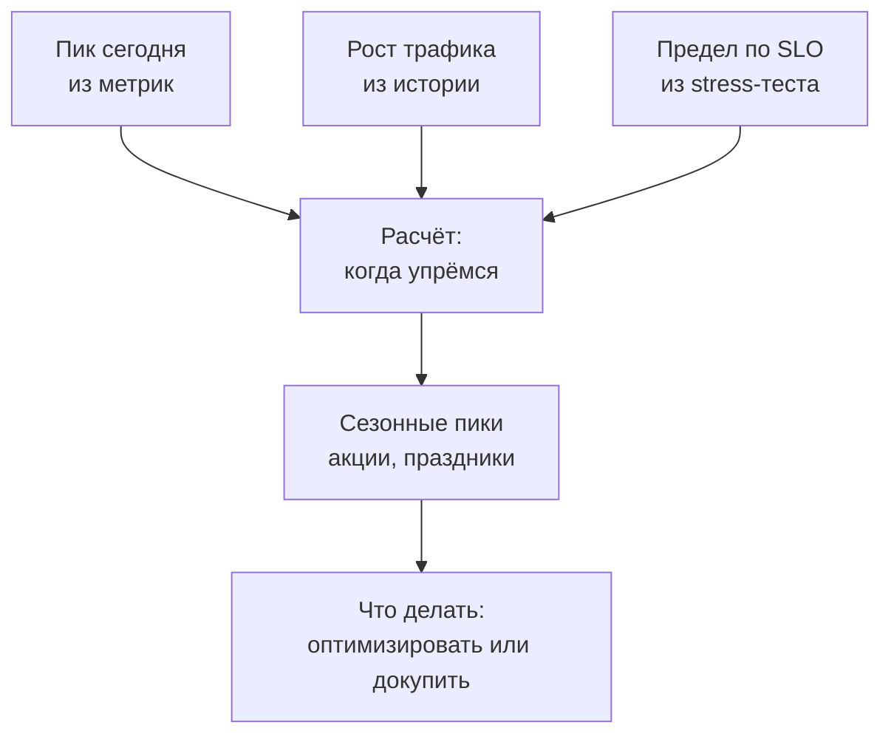
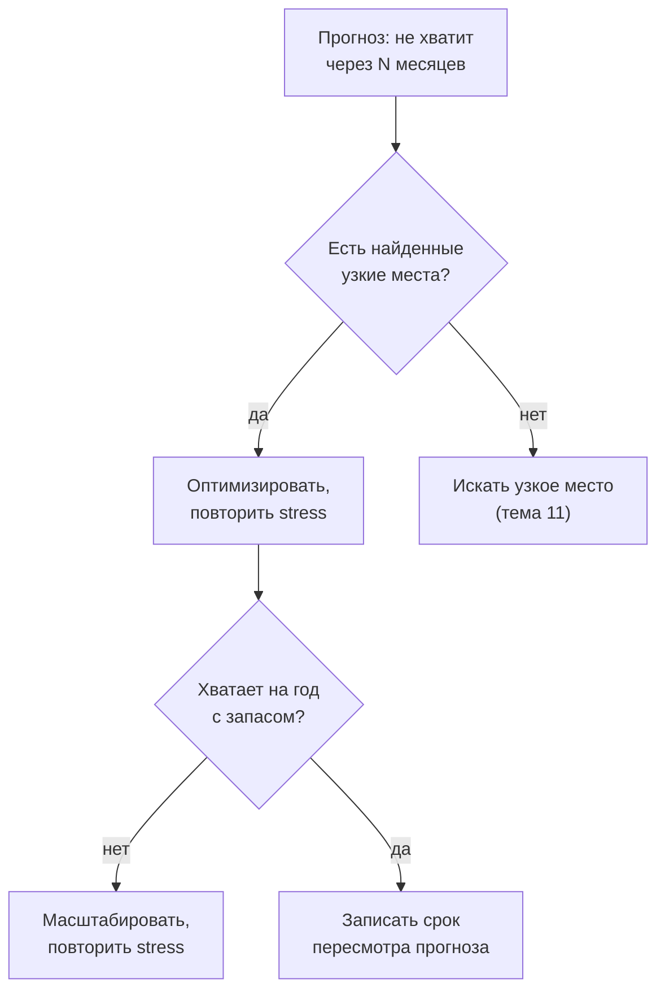

## Зачем это нужно

Я помню вопрос, после которого понял, что «у нас всё хорошо» не ответ. Руководитель принёс план: в следующем квартале большая кампания, трафик вырастет. «Сколько мы выдержим через год и хватит ли?» Я сказал, что сейчас запас большой, он спросил «насколько большой и до какого месяца?», и мне нечего было ответить.

Твой тест из [урока 12.1](01-report.md) ответил на вопрос «сколько выдерживаем сегодня»: около 200 запросов в секунду при p95 до 0,5 с. Теперь ответ нужен на год вперёд, перед распродажей и после неё.

Это называется **прогнозом ёмкости** (capacity planning): расчёт, когда нагрузка дорастёт до предела системы и сколько мощности нужно, чтобы этого не случилось. В него входят три числа: сколько трафика сегодня (пик), как быстро он растёт и где предел (из stress-теста). Остальное арифметика, но с ловушками: ошибка обходится либо лишними расходами, либо ночным инцидентом в самый неудобный день.

Шаг проекта: ты напишешь `~/perf-lab/12-process/capacity.py`, который по результатам ступенчатого прогона и допущениям о росте считает, когда «Магазин» упрётся в предел, и добавишь раздел «Прогноз ёмкости» в отчёт из урока 12.1. Это финальный шаг темы: измерили, зафиксировали в CI, прогнозируем.

## Что нужно знать

- Ёмкость, клюшка (hockey stick) и запас до предела: [урок 8.1](../08-perf-theory/01-latency-throughput.md) и [8.2](../08-perf-theory/02-queues-littles-law.md). Мы возьмём ёмкость из ступенчатого прогона.
- SLO и профиль нагрузки: [урок 8.4](../08-perf-theory/04-load-profile-slo.md). Предел всегда считается «по SLO», а не «до падения».
- Ступенчатый прогон и таблица результатов: [урок 12.1](01-report.md). Файлы `results/stress-*.json` оттуда нужны сейчас.
- Метрики и запросы Prometheus для реальной нагрузки: [урок 7.2](../07-observability/02-promql.md). Откуда брать «пик сегодня».
- Python и JSON: [тема 4](../04-python/index.md).

## Картина целиком

Бассейн с общей дорожкой. Сегодня в час пик плавает 9 человек из 20 возможных, и каждый месяц приходит на 6% людей больше. Когда станет тесно? Не при 20: тесно уже при 14, потому что негде развернуться. А раз в год проходит соревнование, и приходит вдвое больше обычного. Прогноз ёмкости отвечает на три вопроса: когда доберёмся до «тесно», что будет в день соревнования и что делать: расширять дорожку или научить людей плавать компактнее (оптимизировать). Аналогия ломается там, что у системы «тесно» наступает резко ([урок 8.2](../08-perf-theory/02-queues-littles-law.md)): это главная ловушка прогноза.



Три входных числа сходятся в расчёт, потом корректируются на события и превращаются в решение.

## Теория

### Три входных числа

Прогноз стоит ровно столько, сколько стоят его числа. Откуда их брать и как они обманывают?

Первое число это пик сегодня. Не средний трафик за сутки, а максимум в характерный период, например 95-й перцентиль минутных значений за последние четыре недели. Среднее может быть 25 запросов в секунду, а вечером в час пик 90. Система ломается в пике, а не на среднем. Берут его из мониторинга: в Prometheus это `max_over_time(sum(rate(http_requests_total[1m]))[4w:1m])` ([урок 7.2](../07-observability/02-promql.md); скобки читать не нужно, суть в «максимум за четыре недели»).

Второе число это рост: процент в месяц по истории пиков за 6–12 месяцев или из бизнес-плана («заказов на 5–7% больше каждый месяц»). Рост считают линейно (каждый месяц прибавляется одно и то же число запросов) или сложным процентом (прибавляется одинаковая доля от текущего значения). Реальный трафик ближе ко второму: чем больше клиентов, тем больше новых приходит по рекомендациям.

Третье число это предел: ёмкость по SLO из stress-теста ([урок 12.1](01-report.md)), то есть последняя нагрузка, при которой p95 меньше 500 мс и ошибок меньше 1%. У «Магазина» это около 200 запросов в секунду. Это не точка отказа, а точка, где мы выходим за SLO: падает всё позже, но покупателю «медленно» уже плохо.

Соберём: пик 90 запросов в секунду, рост 6% в месяц, ёмкость 200. Загрузка сегодня 90 / 200 = 0,45, то есть 45%.

> **Прикинь сам:** среднесуточный трафик 30 запросов в секунду, пик в обеденный час 110, ёмкость 200. Какую загрузку считать сегодняшней?
{: .predict}

110 / 200 = 55%, потому что система упирается в предел в самые плотные минуты. Загрузка по среднему (15%) создаёт ложное чувство запаса.

Осторожно: путают единицы. Пик в пользователях в секунду, а ёмкость в HTTP-запросах: считай в одних. В сценарии пять запросов, поэтому 40 сценариев в секунду равны 200 запросам.

> **Главное:** прогноз строится на пике (не на среднем), темпе роста и пределе по SLO, и все три в одних единицах.
{: .key}

Предел 200 известен. Но работать на 100% нельзя, и тут нужен запас.

### Запас и рабочая граница

Предел 200 это потолок, а не цель. Любой всплеск, перезапуск одного сервера или медленная зависимость выбросят нас за SLO. Поэтому вводят **рабочую границу** (целевую загрузку): долю ёмкости, выше которой система считается «тесной» и мы начинаем действовать заранее.

Границу выбирают по трём причинам. Первая: колено кривой, после которого задержка растёт резко ([урок 8.2](../08-perf-theory/02-queues-littles-law.md)). Граница стоит до него. Вторая: отказ узла. Если экземпляров два и один упал, второй принимает весь трафик, а значит, каждый должен работать не выше 50%. Третья: внезапные всплески (рассылка, ошибка клиента, ретраи).

Обычно берут 60–70% для сервиса без резервирования и около 50% для пары с отказоустойчивостью. Для стенда возьмём 70%, и рабочая граница равна 200 · 0,7 = 140 запросов в секунду. «Тесно» наступает не на 200, а на 140.

<div class="viz" data-viz="proc-capacity" data-peak="90" data-capacity="200" data-growth="6" data-target="70" data-season="1" data-boost="0"></div>

Сплошная кривая это прогноз пика по месяцам, горизонтальные линии это граница и предел. Пик выходит из зелёной зоны на седьмом-восьмом месяце. Подвигай «границу загрузки»: она сдвигает решение на месяцы.

Сегодняшний пик 90 дорастёт до 140 (граница) через 7,6 месяца, а до 200 (предел) через 13,7. Значит, у нас около семи месяцев на действия, а не тринадцать. Закупки и решения занимают недели и месяцы, поэтому срок считают до границы.

> **Проверь понимание:** два экземпляра сервиса, каждый тянет 100 запросов в секунду по SLO. Трафик 120. Что случится, если один откажет?

<details markdown="1">
<summary>Ответ</summary>

Весь трафик ляжет на один экземпляр с пределом 100, а у нас 120: перегрузка, p95 уйдёт далеко за SLO. Поэтому для пары граница около 50%. Сейчас загрузка 60% от суммарной ёмкости, и запаса на отказ уже нет.

</details>

> **Главное:** срок на решение считают до рабочей границы, а не до предела: граница стоит до колена и оставляет запас на отказы и всплески.
{: .key}

Теперь вопрос, который стоит месяцев: как правильно продолжить рост вперёд?

### Линейная и сложная экстраполяция

Чтобы узнать, когда пик дорастёт до границы, тренд продолжают вперёд. Самое простое продолжение, линейное, ошибается для растущего бизнеса всегда в одну сторону. Вклад в банке тоже растёт быстрее, чем «каждый год по 5% от начальной суммы»: проценты начисляются на проценты.

Продолжим рост 6% в месяц от пика 90. Линейно мы каждый месяц прибавляем 6% от исходных 90, то есть 5,4 запроса. Через 12 месяцев 90 + 12 · 5,4 = 155. Сложным процентом мы каждый месяц умножаем на 1,06, и через год получается 90 · 1,06¹² = 181. Расхождение 26 запросов, около 17%. Границу 140 линейный расчёт пересекает через 9,3 месяца, сложный через 7,6. Линейный даёт оптимистичную оценку: кажется, что времени на 1,7 месяца больше, чем на самом деле.

Какой выбрать? Смотри на историю: если пики за год лежат на прямой, ближе линейный, если изгибаются вверх, сложный. Для планирования безопаснее сложный: он ошибается в сторону запаса.

<div class="viz" data-viz="proc-capacity" data-peak="90" data-capacity="200" data-growth="6" data-target="70" data-season="1" data-boost="0"></div>

Нажми переключатель «сложный процент / линейно». Линейная кривая пересекает границу позже, и эти месяцы разницы и есть воображаемый запас.

```text
месяц  пик, запр/с  загрузка
    0           90      45%
    3          107      54%
    6          128      64%
    9          152      76%  <- выше границы 70%
   12          181      91%
   18          257     128%
```

В первые три месяца пик растёт на 17 запросов, а в последние три месяца года на 29: тренд ускоряется сам, поэтому интуиция «растёт понемногу» обманывает.

> **Прикинь сам:** пик 100 запросов в секунду, рост 10% в месяц. Сколько будет через 6 месяцев линейным способом и сложным?
{: .predict}

Линейно: 100 + 6 · 10 = 160. Сложным процентом: 100 · 1,1⁶ = 177. Линейный занижает нагрузку на 17 запросов.

Осторожно: рост по короткому всплеску (два месяца подряд +15%) на год вперёд продолжать нельзя, это скачок, а не тренд.

> **Главное:** растущий трафик продолжают сложным процентом: линейный расчёт даёт больше времени, чем есть на самом деле.
{: .key}

Мы научились прогнозировать нагрузку. А что будет с задержкой на этой нагрузке?

### Ловушка: задержка не линейна

Самая опасная ошибка прогнозов: взять две точки, провести прямую и сказать «запаса много». Из [урока 8.2](../08-perf-theory/02-queues-littles-law.md) мы знаем, что задержка изгибается «клюшкой». На дороге с затором на 10 машинах в минуту едешь 5 минут, на 20 тоже 5, на 30 уже 6. Прямая обещает на 100 машинах 12 минут, а дорога встала.

Пока ресурсы свободны, запросы почти не ждут друг друга, и p95 растёт едва заметно. Когда загрузка приближается к 100%, образуется очередь, и ожидание в ней растёт взрывом. Поэтому задержку из спокойной зоны на высокую загрузку не продолжают, её меряют ступенчатым тестом.

Данные «Магазина» из урока 12.1. Прямая через две первые точки (50 запросов в секунду дают 62 мс, 100 дают 85 мс) обещает на 200 запросах около 131 мс. Измеренное значение 460 мс.

<div class="viz" data-viz="chart" data-type="line" data-x="50,100,150,175,198,215" data-x-label="Запросов в секунду" data-y-label="p95, мс" data-unit="мс" data-explain="Реальный p95 в середине нагрузки вдвое-втрое выше прямой по первым двум точкам, а у предела выше в 3-4 раза. Цель 500 мс достигается там, где прямая обещала бы большой запас." data-series='[{"name":"Измерено","values":[62,85,140,260,460,980]},{"name":"Прямая по первым двум точкам","values":[62,85,108,120,130,138]}]'></div>

Линия и кривая расходятся уже около 150 запросов в секунду, а у предела разница в несколько раз. По прямой на 215 запросах всё ещё 138 мс и «огромный запас», а на деле 980 мс.

То же как «клюшка» с запасом до предела (модель с ёмкостью 200):

<div class="viz" data-viz="hockey-stick" data-capacity="200" data-base="55" data-load="140" data-unit="запросов/с"></div>

На 140 запросах мы ещё в пологой части, а с 180 кривая взмывает.

> **Проверь понимание:** на 100 запросах в секунду p95 равен 85 мс, на 150 равен 140. Можно ли прикинуть p95 на 250, продолжив эту линию?

<details markdown="1">
<summary>Ответ</summary>

Нет: 250 выше ёмкости (200), там очередь растёт без предела, и по прямой вышло бы около 200 мс, а на деле секунды. Всё, что выше колена, надо мерить, а не вычислять по пологому участку.

</details>

Отсюда два правила. Ёмкость всегда измеряют по SLO, а не «до падения» и не «по прямой». Граница стоит до колена: у нас оно между 150 (140 мс) и 175 (260 мс), а предел по SLO на 198, поэтому 70% (140) выглядит разумно. Прогнозируют нагрузку, а задержку на этой нагрузке берут из измерения.

> **Главное:** нагрузку прогнозируют, задержку измеряют: прямая по спокойным точкам всегда обещает слишком много запаса.
{: .key}

Мы посчитали обычный рост. Но есть дни, когда трафик не растёт, а прыгает.

### Сезонность: пик акции

Бывают события, которые на день-два умножают трафик: распродажа, праздники, рассылка. Система должна пережить их, иначе вся работа за год пойдёт насмарку в самый важный день.

Пик события оценивают как множитель к обычному пику на тот момент. Источники множителя: прошлые события (в прошлую «Чёрную пятницу» было ×1,8 к обычному дню), планы маркетинга, оценки по аналогии. Для «Магазина» акция через месяц: пик через месяц 90 · 1,06 = 95, множитель 1,8, нагрузка акции около 172 запросов в секунду. Это 86% ёмкости, между границей (70%) и пределом: выдержим, но вплотную. Для разового пика с планом деградации (отключить тяжёлые функции) допустимы 85–90% ёмкости.

> **Прикинь сам:** обычный пик 100, рост 5% в месяц, акция через 6 месяцев с множителем 2. Какой пик акции?
{: .predict}

Обычный пик через 6 месяцев: 100 · 1,05⁶ = 134. Пик акции 134 · 2 = 268 запросов в секунду. Множитель накладывается на выросший пик: от сегодняшнего вышло бы 200, и событие недооценили бы.

<div class="viz" data-viz="proc-capacity" data-peak="90" data-capacity="200" data-growth="6" data-target="70" data-season="1.8" data-season-month="1" data-boost="0"></div>

Оранжевая отметка это пик акции в первый месяц на уровне 86% предела: выше границы, хотя обычный пик дойдёт до неё только на восьмом месяце. Подними «пик акции» до 2,5, и акция пробьёт предел: именно она, а не годовой рост, определит нужную мощность.

Теперь посчитаем нужную ёмкость. Обычный пик через год 181, пик акции через месяц 172. Чтобы выдержать оба при границе 70%, нужно max(172; 181) / 0,7 = 259, а у нас 200: не хватает 29%. Если акция будет через год, её пик 181 · 1,8 = 326, и нужно уже 466. Время события в году меняет требования, а не только размер.

Такое событие проверяют отдельным тестом, профилем spike из [урока 8.3](../08-perf-theory/03-test-types.md): резкий скачок отличается от плавного роста, пулы соединений и кэши не успевают подстроиться.

Осторожно: сезонность считают разовой и не закладывают под неё мощность, хотя её можно временно арендовать.

> **Главное:** пик акции это множитель к выросшему обычному пику, и часто именно он, а не годовой рост, определяет нужную мощность.
{: .key}

Прогноз показал, что не хватает. Что делать?

### Что покупать или оптимизировать

Прогноз показал, что мощности не хватит. Но решений больше, чем «купить серверов», и у каждого своя цена, срок и риск. Рычагов три.

Первый: оптимизировать, то есть убрать лишнюю работу. Индекс по `orders.user_id` и один запрос вместо 21 из [урока 12.1](01-report.md) подняли ёмкость 200 → 290 запросов в секунду за один день работы. Это самый дешёвый рычаг, если узкие места найдены ([тема 11](../11-bottlenecks/index.md)). Второй: вертикальное масштабирование, то есть мощнее машина. Просто, но упирается в потолок, а цена растёт быстрее мощности. Для «Магазина» это, например, `WEB_CONCURRENCY=2`, и эффект надо измерить повторным stress-тестом. Третий: горизонтальное, то есть больше экземпляров. Оно даёт запас и отказоустойчивость, но работает, пока не упёрлись в общее ограничение: одну базу, пул соединений, внешнюю оплату. Два экземпляра редко дают ровно ×2.

Порядок такой: сначала оптимизировать найденное, потом масштабировать остальное, и каждое решение проверять повторным stress-тестом. Реальный прирост бывает любым: от +45% до нуля, если чинили не то место.



Прогноз запускает цикл «улучшить, измерить, пересчитать», а не покупку. Даже после оптимизации его пересчитывают: новая ёмкость сдвигает все сроки.

<div class="viz" data-viz="proc-capacity" data-peak="90" data-capacity="200" data-growth="6" data-target="70" data-season="1.8" data-season-month="1" data-boost="45"></div>

С приростом 45% ёмкость 290, граница 203. Обычный пик пересекает её уже после года, акция выходит из жёлтой зоны. При приросте 20% этого не хватает: подбери минимальный прирост, при котором год проходит без жёлтой зоны.

```text
| Вариант                          | Новая ёмкость | Хватает на год?    | Цена и срок            |
|----------------------------------|---------------|--------------------|------------------------|
| Ничего не делать                 | 200           | нет (нужно 259)    | -                      |
| Индекс + убрать N+1 (измерено)   | 290           | да, запас 12%      | 1 день работы          |
| Только WEB_CONCURRENCY=2         | не измерено   | неизвестно         | 0,5 дня + stress-тест  |
| Второй экземпляр сервиса         | не измерено   | зависит от базы    | деньги + настройка     |
```

Выбор: индекс (дёшево и проверено), затем повторный stress, затем пересмотр прогноза через квартал, остальное до фактов. Осторожно: мощность не покупают, пока не проверили, что ограничивает ёмкость. Если это база, лишние экземпляры сервиса не помогут и перегрузят её ещё сильнее.

> **Главное:** сначала оптимизация, потом масштабирование, и после каждого шага повторный stress-тест и пересчёт прогноза.
{: .key}

Остался вопрос: как не принять модель за обещание?

### Подводные камни прогноза

Перед тем как показывать прогноз, проверь его на ловушках. Стенд не равен проду: генератор на той же машине занижает ёмкость, меньший объём данных завышает ([отличия среды из урока 12.1](01-report.md)). Состав нагрузки меняется: ёмкость 200 измерена на профиле «покупка», а акция даёт больше заказов и меньше просмотров каталога. Заказ дороже, поэтому при тех же запросах нагрузка на базу выше, и прогноз лучше вести по ключевой операции (заказов в секунду).

Рост бывает не плавным: скачки от маркетинга, спады. Раз в квартал сравнивай предсказанный пик с реальным. Внешние зависимости (платёжный провайдер, почта) имеют свои лимиты ([урок 11.5](../11-bottlenecks/05-cache-dependencies.md)), и ёмкость системы равна ёмкости самого слабого звена. Объём данных, память при утечке ([урок 11.4](../11-bottlenecks/04-memory-soak.md)) и число соединений растут не вместе с нагрузкой и требуют отдельного тренда. Если истории мало (два месяца), честно называй диапазон («рост от 3 до 9% в месяц»), а не одну цифру.

«Через 7,6 месяца» это не дата, а ориентир, поэтому сообщай диапазон: «через 6–9 месяцев в зависимости от темпа роста». Покажи три сценария (консервативный, ожидаемый, пессимистичный) и какое решение нужно в каждом.

<div class="viz" data-viz="flow" data-title="Проверка прогноза перед показом" data-steps='[{"title":"Единицы совпадают","text":"Пик и ёмкость в одних единицах: запросы в секунду или заказы в секунду."},{"title":"Пик, а не среднее","text":"Нагрузка взята по максимуму за характерный период."},{"title":"Предел по SLO","text":"Ёмкость измерена ступенчатым тестом, а не выведена по прямой."},{"title":"Рабочая граница","text":"Срок считается до границы, а не до 100%."},{"title":"Сезонные пики","text":"Акции и праздники добавлены множителем к выросшему пику."},{"title":"Диапазон сценариев","text":"Показаны три темпа роста, а не одна цифра."}]'></div>

Шесть пунктов по порядку, и каждый соответствует ловушке выше. Не прошёл хотя бы один: прогноз ещё не готов.

> **Проверь понимание:** прогноз построен по общему числу запросов в секунду, но акция сдвинет профиль в сторону заказов. Почему это риск и как его снизить?

<details markdown="1">
<summary>Ответ</summary>

Заказ дороже просмотра каталога (больше обращений к базе и оплате), поэтому при тех же запросах в секунду нагрузка выше, а ёмкость 200 измерена на другом профиле. Проверь ёмкость профилем, похожим на акционный (больше заказов, spike), и веди прогноз по заказам в секунду.

</details>

> **Главное:** прогноз это модель с допущениями: показывай диапазон и допущения вместе с цифрами.
{: .key}

Вернёмся к вопросу руководителя: «Сколько выдержим через год и хватит ли?» Теперь у тебя есть ответ с числами: граница через семь месяцев, акция на 86% предела, индекс даёт запас. Остаётся посчитать это скриптом.

## Практика

Файлы лежат в `~/perf-lab/12-process/`. Нагрузка идёт только на твой локальный стенд.

### 1. Данные: ступенчатый прогон

Если после [урока 12.1](01-report.md) в `~/perf-lab/results/` есть файлы `stress-10.json`, `stress-20.json` и так далее, переходи к шагу 2. Если нет, запусти прогон:

```bash
cd ~/perf-lab/12-process && ./stress.sh
ls ~/perf-lab/results/stress-*.json
```

Нагрузка идёт 10 минут, `stress.sh` из прошлого урока гонит ступени по минуте. Стенд должен быть в исходном состоянии (`cp .env.example .env`, оплата 50 мс).

### 2. Скрипт capacity.py

Создай `~/perf-lab/12-process/capacity.py`:

```python
"""Прогноз ёмкости: python3 capacity.py [--peak 90] [--growth 6] [--target 70]
   [--season 1.8] [--season-month 1] [--boost 0] [--capacity 200] [--pattern 'results/stress-*.json']"""
import argparse
import glob
import json
import math
import os
import re

HERE = os.path.dirname(os.path.abspath(__file__))
SLO_P95_MS = 500
SLO_ERRORS = 0.01

parser = argparse.ArgumentParser()
parser.add_argument("--peak", type=float, default=90, help="пик сегодня, запросов/с")
parser.add_argument("--growth", type=float, default=6, help="рост пика в месяц, %%")
parser.add_argument("--target", type=float, default=70, help="рабочая граница загрузки, %%")
parser.add_argument("--season", type=float, default=1.8, help="во сколько раз акция выше обычного пика")
parser.add_argument("--season-month", type=int, default=1, help="через сколько месяцев акция")
parser.add_argument("--boost", type=float, default=0, help="прирост ёмкости от оптимизации, %%")
parser.add_argument("--capacity", type=float, help="ёмкость по SLO, запросов/с (если не брать из прогона)")
parser.add_argument("--pattern", default=os.path.join(HERE, "..", "results", "stress-*.json"))
args = parser.parse_args()


def metric(summary, name):
    item = summary["metrics"][name]
    return item.get("values", item)


def capacity_from_stress(pattern):
    """Ёмкость по SLO: запросов/с на последней ступени, где p95 и ошибки в норме."""
    best = 0
    for path in sorted(glob.glob(pattern), key=lambda p: int(re.search(r"-(\d+)\.json$", p).group(1))):
        with open(path) as stream:
            summary = json.load(stream)
        p95 = metric(summary, "http_req_duration")["p(95)"]
        failed = metric(summary, "http_req_failed")
        errors = failed.get("rate", failed.get("value", 0))
        if p95 < SLO_P95_MS and errors < SLO_ERRORS:
            best = metric(summary, "http_reqs")["rate"]
    return best


cap = args.capacity or round(capacity_from_stress(args.pattern), -1)
if not cap:
    raise SystemExit("нет ёмкости: запусти stress.sh или передай --capacity")
cap *= 1 + args.boost / 100
growth = args.growth / 100
border = cap * args.target / 100


def peak_at(month):
    return args.peak * (1 + growth) ** month


def month_reaching(level):
    if args.peak >= level:
        return 0.0
    return math.log(level / args.peak) / math.log(1 + growth)


def linear_month_reaching(level):
    step = args.peak * growth  # прирост в месяц, если считать от сегодняшнего пика равномерно
    return (level - args.peak) / step


print(f"ёмкость по SLO: {cap:.0f} запросов/с, рабочая граница {args.target:.0f}%: {border:.0f}")
print(f"пик сегодня {args.peak:.0f} запросов/с, рост {args.growth:.0f}% в месяц\n")
print("месяц  пик, запр/с  загрузка")
for month in (0, 3, 6, 9, 12, 18):
    value = peak_at(month)
    mark = "  <- выше границы" if value > border else ""
    print(f"{month:>5}  {value:>11.0f}  {value / cap:>7.0%}{mark}")

print(f"\nграницу {border:.0f} пик пересечёт через {month_reaching(border):.1f} мес. "
      f"(линейная прикидка: {linear_month_reaching(border):.1f})")
print(f"предел {cap:.0f} пик пересечёт через {month_reaching(cap):.1f} мес. "
      f"(линейная прикидка: {linear_month_reaching(cap):.1f})")

sale = peak_at(args.season_month) * args.season
print(f"\nпик акции через {args.season_month} мес.: {sale:.0f} запросов/с, это {sale / cap:.0%} ёмкости")
year = peak_at(12)
need = max(sale, year) / (args.target / 100)
print(f"через год обычный пик {year:.0f}; чтобы держать границу {args.target:.0f}%, нужна ёмкость {need:.0f}")
if need > cap:
    print(f"не хватает {need / cap - 1:.0%}: нужно оптимизировать или докупить мощность")
else:
    print(f"хватает с запасом {cap / need - 1:.0%}")
```

Разбор. `argparse` разбирает параметры командной строки: у каждого есть значение по умолчанию («Магазин»: пик 90, рост 6%, граница 70%, акция ×1,8 через месяц). `capacity_from_stress` читает сводки ступенчатого прогона, берёт **последнюю ступень, где p95 меньше 500 мс и ошибок меньше 1%**, и возвращает пропускную способность на ней. Это ёмкость по SLO. `round(..., -1)` округляет до десятков (198 станет 200): точность прогноза всё равно не выше. `month_reaching` решает уравнение «пик · 1,06^m = уровень» через логарифм: `math.log(уровень / пик) / math.log(1,06)` даёт число месяцев. `linear_month_reaching` считает то же линейно, для сравнения. Потом печатается таблица, пересечения, нагрузка акции и необходимая ёмкость: `max(акция, обычный пик через год) / граница`.

```bash
cd ~/perf-lab/12-process && python3 capacity.py
```

```text
ёмкость по SLO: 200 запросов/с, рабочая граница 70%: 140
пик сегодня 90 запросов/с, рост 6% в месяц

месяц  пик, запр/с  загрузка
    0           90      45%
    3          107      54%
    6          128      64%
    9          152      76%  <- выше границы
   12          181      91%  <- выше границы
   18          257     128%  <- выше границы

границу 140 пик пересечёт через 7.6 мес. (линейная прикидка: 9.3)
предел 200 пик пересечёт через 13.7 мес. (линейная прикидка: 20.4)

пик акции через 1 мес.: 172 запросов/с, это 86% ёмкости
через год обычный пик 181; чтобы держать границу 70%, нужна ёмкость 259
не хватает 29%: нужно оптимизировать или докупить мощность
```

**Как читать вывод:** первая строка это вход прогноза: откуда ёмкость (из твоего прогона) и где рабочая граница. Таблица показывает загрузку по месяцам: метка «выше границы» это точка, когда нужно уже действовать. Блок «пересечёт» самое важное: до **границы** 7,6 месяца, а не 13,7 до предела, и линейная прикидка оптимистичнее на 1,7 месяца. Блок акции показывает, что событие ближе к пределу, чем обычный рост. Последняя строка это вывод для решения: «нужно +29% ёмкости». Твои числа зависят от твоего прогона: форма будет той же. Если скрипт пишет «нет ёмкости», ступенчатый прогон не создал файлы или ни одна ступень не уложилась в SLO (проверь стенд и `.env`).

**Типичные ошибки:** `KeyError: 'http_req_duration'`: сводка не та, посмотри `jq '.metrics | keys' ~/perf-lab/results/stress-10.json`. `ModuleNotFoundError`: в этом скрипте только стандартная библиотека, ошибка значит опечатку в имени модуля. `FileNotFoundError`: запускай из `~/perf-lab/12-process` или укажи `--pattern`.

### 3. Чувствительность: что если рост не 6%

Проверь три сценария роста и запиши результаты в таблицу:

```bash
for g in 3 6 9; do echo "== рост $g% =="; python3 capacity.py --growth $g | grep -E "границу|не хватает|хватает"; done
```

```text
== рост 3% ==
границу 140 пик пересечёт через 14.9 мес. (линейная прикидка: 18.5)
не хватает 19%: нужно оптимизировать или докупить мощность
== рост 6% ==
границу 140 пик пересечёт через 7.6 мес. (линейная прикидка: 9.3)
не хватает 29%: нужно оптимизировать или докупить мощность
== рост 9% ==
границу 140 пик пересечёт через 5.1 мес. (линейная прикидка: 6.2)
не хватает 81%: нужно оптимизировать или докупить мощность
```

Разбор: `for g in 3 6 9` повторяет команду для трёх темпов, `grep -E` оставляет только нужные строки. **Как читать вывод:** при любом темпе роста мощности через год не хватает, но срок от 5 до 15 месяцев и необходимый прирост от 19% до 81%. Вилка и есть настоящий результат прогноза: решение «оптимизируем сейчас» верно во всех трёх сценариях, а вот закупка зависит от того, какой сценарий реализуется.

### 4. Что даст оптимизация

Подставь ёмкость после индекса (прирост 45% из [урока 12.1](01-report.md)):

```bash
python3 capacity.py --boost 45 | tail -8
```

```text
границу 203 пик пересечёт через 14.0 мес. (линейная прикидка: 20.9)
предел 290 пик пересечёт через 20.1 мес. (линейная прикидка: 37.0)

пик акции через 1 мес.: 172 запросов/с, это 59% ёмкости
через год обычный пик 181; чтобы держать границу 70%, нужна ёмкость 259
хватает с запасом 12%
```

**Как читать вывод:** после индекса граница уходит за год, акция укладывается в 59% предела. Но это **расчёт**: прирост 45% измерен на стенде, а в проде мог быть другим. Проверь повторным stress-тестом: примени оптимизацию на стенде и снова запусти `./stress.sh`, затем `python3 capacity.py` без `--boost`: скрипт сам возьмёт новую ёмкость из результатов.

### 5. Раздел «Прогноз ёмкости» в отчёте

Открой отчёт `~/perf-lab/reports/2026-10-shop-purchase.md` из [урока 12.1](01-report.md) и добавь раздел 7.1 (после рекомендаций):

```markdown
### 7.1 Прогноз ёмкости на 12 месяцев

Допущения: пик сегодня 90 запросов/с (метрики за 4 недели), рост 6% в месяц (диапазон 3-9%),
ёмкость 200 запросов/с по SLO, рабочая граница 70% (140), акция через месяц с множителем 1,8.

| Сценарий роста | До границы (140) | До предела (200) | Пик акции | Нужная ёмкость на год |
|---|---|---|---|---|
| 3% в месяц | 14,9 мес. | 27 мес. | 167 (83%) | 238 (+19%) |
| 6% в месяц | 7,6 мес. | 13,7 мес. | 172 (86%) | 259 (+29%) |
| 9% в месяц | 5,1 мес. | 9,3 мес. | 177 (88%) | 362 (+81%) |

Вывод: без изменений граница 70% будет пройдена через 5-15 месяцев, акция через месяц займёт 86% предела.
После индекса по `orders.user_id` (ёмкость 290, проверено) год проходит с запасом 12% при росте 6%.
Пересмотр прогноза: раз в квартал по фактическому пику.
```

Числа в таблице подставь из своих запусков `capacity.py` для трёх значений `--growth` (команда из шага 3) и `--season`: пик акции и нужная ёмкость считаются по-разному для каждого темпа. Раздел добавляет строку в «Итог» отчёта: «Запас на год: хватает при условии индекса». Закоммить:

```bash
cd ~/perf-lab && git add 12-process/capacity.py reports && git commit -m "12.3: прогноз ёмкости и раздел отчёта" && git push
```

**Типичные ошибки:** выдумывают рост «на глаз». Бери из мониторинга (максимумы по неделям за полгода) или из бизнес-плана и указывай источник в допущениях. Показывают одну цифру вместо вилки.

## Сломай и почини

**Поломка.** Коллега прислал прогноз: «Измерили p95 на 50 запросах: 62 мс, на 100: 85 мс. Задержка растёт линейно, на 200 будет около 110 мс, это в 4 раза лучше SLO. Рост трафика 6% в месяц считали прямой: за год 90 + 12 · 5,4 = 155 запросов, значит, запас есть, к акции готовы. Среднесуточный трафик 30, пик 90 из метрик взяли». Найди не меньше пяти ошибок и пересчитай.

<details markdown="1">
<summary>Разбор</summary>

Ошибки:

1. **Задержка экстраполирована по пологому участку.** Реальный p95 на 200 запросах 460 мс, а не 110 (клюшка). Ёмкость надо брать из ступенчатого теста по SLO.
2. **Нет рабочей границы.** Ёмкость принята за «можно работать до 200», а граница 70% (140) пересекается раньше.
3. **Рост линейный.** Сложный процент даёт 181 за год, а не 155: прогноз занижен на 17%.
4. **Нет сезонности.** Акция через месяц добавляет ×1,8, то есть 172 запроса, и это не учтено.
5. **Среднее и пик.** «Среднесуточный 30» упомянут рядом с пиком: считать нужно по пику (90), и сомнение, какое из чисел взято, должно быть снято в допущениях.
6. **Нет вилки.** Рост взят одной цифрой, вместо диапазона 3-9%.
7. **Два замера вместо ступенчатого теста,** отдельно не проверена ёмкость на нужной нагрузке.

Пересчёт: ёмкость по SLO 200, граница 140, пик через год 181, пик акции 172. Нужна ёмкость 259, не хватает 29%, и это нужно решать до акции. Запусти `python3 capacity.py`, чтобы убедиться.

</details>

> Сначала пересчитай прогноз в «Сломай и почини» вручную или скриптом `capacity.py`, и только потом сверь с нейросетью. Арифметика сложного процента у неё ошибается часто, поэтому каждое число проверяй.
{: .ai}

## ИИ в помощь

Нейросеть помогает продумать сценарии роста и объяснить метод руководителю, но считать за неё нельзя: арифметика и формулы у неё хромают. Общие правила: [ИИ-помощник](../ai.md).

**Задача:** проверить расчёт прогноза.

```text
Сервис «Магазин». Пик сегодня <вставь> запросов в секунду, рост <вставь>% в месяц (сложный процент),
ёмкость по SLO p95 < 500 мс: <вставь> запросов в секунду, рабочая граница 70% от ёмкости.
Через 12 месяцев запланирована акция с пиком в 1,8 раза выше обычного. Покажи формулу и расчёт по шагам:
пик через 12 месяцев, пик акции, нужная ёмкость с запасом и дефицит в процентах.
```
{: .wrap}

**Проверь ответ:** посчитай сам (`python3 -c "print(90 * 1.06 ** 12)"`) или запусти `capacity.py` с теми же числами. Типичные ошибки: линейный рост вместо сложного, забытая рабочая граница, пик перепутан со средним и ошибка в степени.

**Задача:** набросать вилку сценариев для руководителя.

```text
У меня результаты прогноза ёмкости для сервиса: рост 3%, 6% и 9% в месяц дают пик через год
<вставь три числа> запросов в секунду, ёмкость <вставь>. Напиши абзац для руководителя без жаргона:
что выбрать, чем рискуем и когда принимать решение. Используй только мои числа.
```
{: .wrap}

**Проверь ответ:** все числа в абзаце должны совпадать с твоей таблицей, а решение с датой должно следовать из расчёта. Типичная ошибка: уверенный вывод «запаса хватит», когда в худшем сценарии он не хватает.

## Словарик урока

| Термин | Простыми словами |
|---|---|
| Прогноз ёмкости (capacity planning) | Расчёт, когда нагрузка дорастёт до предела системы и сколько мощности нужно |
| Пик | Максимальная нагрузка за характерный период; считаем по нему, а не по среднему |
| Ёмкость по SLO | Нагрузка, при которой p95 и ошибки ещё в норме; её даёт ступенчатый тест |
| Рабочая граница (целевая загрузка) | Доля ёмкости (например, 70%), после которой система считается тесной и надо действовать |
| Запас (headroom) | Разница между ёмкостью и текущим пиком, лучше в процентах от ёмкости |
| Линейный рост | Каждый месяц прибавляется одно и то же число запросов |
| Сложный рост | Каждый месяц прибавляется один и тот же процент от текущего значения: растёт ускоряясь |
| Экстраполяция | Продолжение измеренного тренда за пределы измеренного |
| Сезонность, пик акции | Короткий всплеск, умножающий обычный пик; накладывается на выросший трафик |
| Масштабирование вертикальное | Мощнее машина: больше процессоров и памяти |
| Масштабирование горизонтальное | Больше экземпляров сервиса; упирается в общие ресурсы (база, оплата) |
| Оптимизация | Убрать лишнюю работу: индекс, кэш, меньше запросов; обычно самый дешёвый рычаг |
| Сценарии роста | Консервативный, ожидаемый, пессимистичный: диапазон, а не одна цифра |

## Вопросы с собеседований

Раздел для повторения: ответь вслух, потом открой ответ. Вопросы «на скорость» тренируй на время: ответ за 30 секунд.

### 1. [junior] [часто] Что такое capacity planning и зачем он нужен?

<details markdown="1">
<summary>Ответ</summary>

Это расчёт, когда нагрузка дорастёт до предела системы и сколько мощности нужно, чтобы не упереться. Нужен, чтобы закладывать бюджет и работы заранее, а не тушить инцидент в день акции. Входы: пик, темп роста, ёмкость по SLO.

**Что хотят услышать:** три входа, цель «заранее».

**Красный флаг:** «купить серверов с запасом».

</details>

### 2. [junior] [часто] Почему прогноз делают по пику, а не по среднему?

<details markdown="1">
<summary>Ответ</summary>

Система ломается в самые плотные минуты. Среднесуточный трафик может быть втрое ниже пика, и загрузка по среднему создаёт ложное чувство запаса.

**Что хотят услышать:** пик (максимум за период), пример разницы.

**Красный флаг:** «среднее надёжнее».

</details>

### 3. [junior] [часто] Что такое рабочая граница загрузки и почему не 100%?

<details markdown="1">
<summary>Ответ</summary>

Доля ёмкости (обычно 60-70%, для пары с резервированием около 50%), выше которой система считается тесной. Не 100%, потому что перед пределом задержка растёт резко (колено), нужен запас на всплески и на отказ одного узла.

**Что хотят услышать:** колено кривой, отказ узла, всплески.

**Красный флаг:** «работаем до 100%, пока SLO не нарушен».

</details>

### 4. [middle] Чем линейный прогноз роста отличается от сложного и какой безопаснее?

<details markdown="1">
<summary>Ответ</summary>

Линейный прибавляет каждый месяц одну и ту же величину, сложный умножает на (1 + темп). Для растущего трафика сложный ближе к реальности, а линейный даёт оптимистичную оценку: срок до границы получается позже. Для планирования безопаснее сложный.

**Что хотят услышать:** разница на примере (100 при 10% через 6 месяцев: 160 против 177).

**Красный флаг:** «разница небольшая, на горизонте года не важна».

</details>

### 5. [middle] Можно ли по двум измерениям задержки спрогнозировать задержку при большей нагрузке?

<details markdown="1">
<summary>Ответ</summary>

Нет: зависимость задержки от нагрузки нелинейна (клюшка), у загрузки около 100% очередь растёт взрывом. Нагрузку (трафик) прогнозируют, а ёмкость и задержку на высокой нагрузке измеряют ступенчатым тестом по SLO.

**Что хотят услышать:** клюшка, измерение вместо экстраполяции.

**Красный флаг:** «проведу прямую по точкам и посмотрю».

</details>

### 6. [middle] Как учитывают сезонные события в прогнозе?

<details markdown="1">
<summary>Ответ</summary>

Множителем к выросшему обычному пику на момент события (из прошлых акций, плана маркетинга). Требуемая ёмкость определяется максимумом из обычного пика и пика акции с учётом рабочей границы. Событие проверяют отдельным тестом со скачком (spike), потому что внезапная нагрузка ведёт себя иначе, чем плавная.

**Что хотят услышать:** множитель на выросший пик, проверка spike-тестом.

**Красный флаг:** «акция разовая, под неё не считаем».

</details>

### 7. [middle] Прогноз показал, что мощности не хватит. Что делаешь?

<details markdown="1">
<summary>Ответ</summary>

Сначала оптимизация найденных узких мест (дешевле всего), повторный stress-тест и пересчёт прогноза. Если не хватает, масштабирование (вертикальное или горизонтальное) с проверкой, что ограничением не стала общая зависимость (база, оплата). Каждый шаг подтверждается измерением.

**Что хотят услышать:** порядок «оптимизация, потом масштабирование», проверка измерением.

**Красный флаг:** «сразу закажу больше серверов».

</details>

### 8. [middle] Почему два экземпляра сервиса не дают двойной ёмкости?

<details markdown="1">
<summary>Ответ</summary>

Экземпляры делят общие ресурсы: базу данных, пул соединений, кэш, внешние сервисы. Если узкое место там, дополнительные экземпляры упрутся в то же ограничение и даже усилят нагрузку на него. Реальный прирост нужно мерить.

**Что хотят услышать:** общее узкое место, измерение.

**Красный флаг:** «всё масштабируется линейно».

</details>

### 9. [middle] Как показать результат прогноза руководителю, если рост неизвестен точно?

<details markdown="1">
<summary>Ответ</summary>

Диапазоном сценариев (консервативный, ожидаемый, пессимистичный) с указанием допущений и решения для каждого: «при 3-9% в месяц граница пройдена через 5-15 месяцев, оптимизация нужна в любом случае, закупку решаем после повторного измерения». Плюс срок пересмотра по фактическому росту.

**Что хотят услышать:** вилка, допущения, действие, пересмотр.

**Красный флаг:** одна цифра без допущений.

</details>

### 10. [junior] [на скорость] Как посчитать пик через N месяцев при росте 6% в месяц?

<details markdown="1">
<summary>Ответ</summary>

Пик сегодня умножить на 1,06 в степени N.

**Что хотят услышать:** сложный процент.

**Красный флаг:** «пик + 6% · N».

</details>

### 11. [junior] [на скорость] Что такое ёмкость по SLO?

<details markdown="1">
<summary>Ответ</summary>

Максимальная нагрузка, при которой p95 и доля ошибок ещё в пределах цели. Её определяет ступенчатый тест.

**Что хотят услышать:** привязка к SLO, а не «до падения».

**Красный флаг:** «нагрузка, при которой всё упало».

</details>

### 12. [junior] [на скорость] Почему акция может определять нужную мощность сильнее, чем годовой рост?

<details markdown="1">
<summary>Ответ</summary>

Её пик в несколько раз выше обычного, он накладывается на выросший трафик, и именно он первым упирается в предел.

**Что хотят услышать:** множитель к пику.

**Красный флаг:** «акции короткие, их можно не учитывать».

</details>

## Проверено на версиях

Python 3.12+ (`argparse`, `math`, `statistics`: стандартная библиотека), k6 2.3, стенд «Магазин» из `project/shop`, Prometheus 3.15 для запроса пика. Числа ёмкости и роста учебные: твои будут другими, важна последовательность расчёта. Октябрь 2026.

## Итог урока: ты умеешь

- [ ] Назвать три входа прогноза (пик, рост, ёмкость по SLO) и откуда каждый берётся.
- [ ] Считать загрузку по пику, а не по среднему, в одинаковых единицах.
- [ ] Выбрать рабочую границу и объяснить, почему срок считается до неё, а не до предела.
- [ ] Продолжить рост сложным процентом и показать, чем линейный расчёт ошибается.
- [ ] Объяснить, почему задержку нельзя экстраполировать, и измерить ёмкость ступенчатым тестом.
- [ ] Учесть сезонный пик множителем к выросшему трафику.
- [ ] Сравнить варианты (оптимизация, вертикальное, горизонтальное масштабирование) и проверить выбор повторным тестом.
- [ ] Показать прогноз диапазоном сценариев с допущениями и добавить раздел в отчёт.

Это последний урок темы 12. Дальше: [тема 13, финал](../13-final/01-incident-under-load.md): разбор инцидента под нагрузкой, где пригодится всё пройденное.
