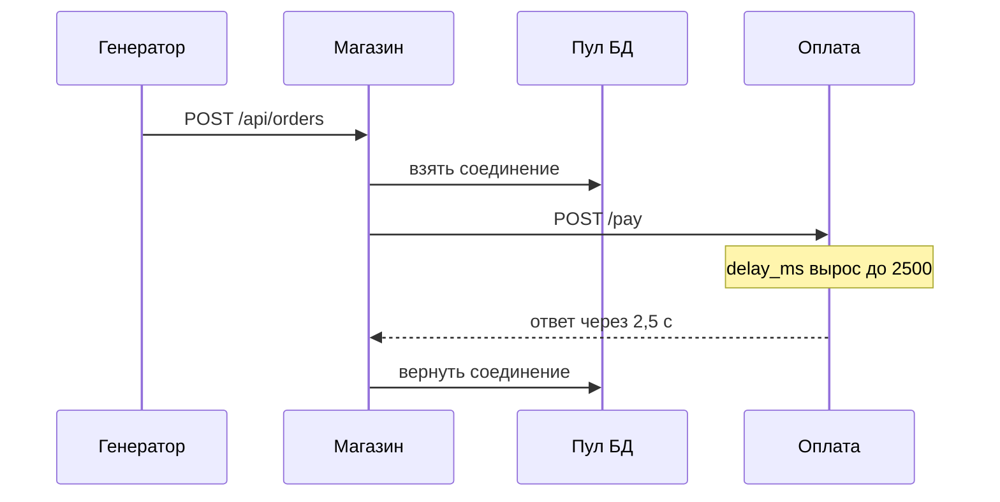
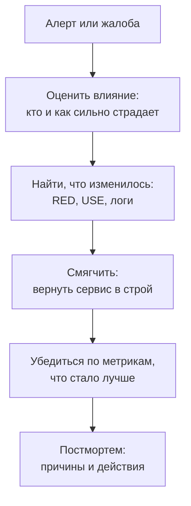
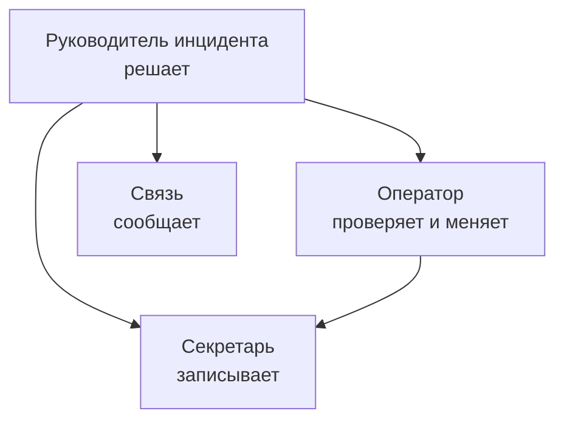

## Зачем это нужно

До сих пор ты ломал «Магазин» сам: ты знал, что именно сломал, и смотрел на графики с готовым ответом в голове. На работе всё наоборот. Ночью приходит сообщение «алерт: магазин отвечает медленно», ты не знаешь причину, пользователи уже недовольны, а коллеги спрашивают в чате «что происходит?». Инцидент (incident) это событие, из-за которого пользователи получают сервис хуже, чем обещано: он стал медленным, выдаёт ошибки или недоступен. Работа дежурного (on-call) инженера состоит из трёх вещей: быстро понять масштаб, вернуть сервису нормальную работу и потом честно разобраться, как такое случилось.

Нагрузочник попадает в инциденты двумя путями. Первый: твой тест сам вызвал сбой (поэтому тест на стенде всегда согласуется, а на чужом сервисе без разрешения запрещён). Второй: на проде случилась нагрузка, которую ты умеешь читать лучше всех: «это насыщение пула», «это ретраи», «это хвост задержки». Поэтому финал курса начинается с инцидента. Это самый близкий к работе опыт, который можно получить на учебном стенде.

Шаг проекта: в `~/perf-lab/13-final/incident/` ты запустишь нагрузку на «Магазин», а скрипт в случайный момент и случайным способом сломает оплату. Ты продежуришь этот инцидент: увидишь алерты, найдёшь причину по дашборду, метрикам и логам, смягчишь последствия и напишешь постмортем по шаблону `~/perf-lab/13-final/postmortem.md`. Постмортем пойдёт в портфолио (урок 13.3): работодатели любят видеть, что ты умеешь разбирать сбои без поиска виноватых.

## Что нужно знать

- Стенд «Магазин» с профилем мониторинга и дашбордом «Магазин: обзор (эталон)»: [урок 7.3](../07-observability/03-grafana.md). Алерты и Alertmanager: [урок 7.6](../07-observability/06-alerts-incidents.md).
- PromQL: `rate`, `sum by`, `histogram_quantile`: [урок 7.2](../07-observability/02-promql.md). Логи в Loki: [урок 7.5](../07-observability/05-logs-loki.md).
- Метод «от симптома к причине», RED и USE: [урок 11.1](../11-bottlenecks/01-method.md). Пул соединений: [урок 11.3](../11-bottlenecks/03-database.md). Таймауты и ретраи оплаты: [урок 11.5](../11-bottlenecks/05-cache-dependencies.md).
- Locust в безголовом режиме: [урок 9.4](../09-locust/04-headless-shape.md). Закон Литтла и очереди: [урок 8.2](../08-perf-theory/02-queues-littles-law.md).

## Картина целиком

Ресторан в час пик. Повара (приложение) готовят блюда быстро, но каждый заказ нужно пробить на терминале оплаты, и повар стоит у терминала, пока тот не ответит. Терминал вдруг начинает «думать» по две секунды. Повары выстраиваются у терминала, плита простаивает, новые заказы копятся, гости ждут, часть уходит. Управляющий (дежурный) сначала не пытается чинить терминал: он смотрит, сколько гостей страдает, зовёт специалиста по терминалу или переводит гостей на оплату наличными. И только после вечера садится с командой выяснять, почему терминал не предупредил о сбое и почему повар не может отойти от него. Аналогия ломается в одном месте: в ресторане видно глазами, в сервисе всё, что ты «видишь», это графики, и они показывают не причину, а следствие.

Вот цепочка нашего учебного инцидента:



Заказ держит соединение с базой, пока ждёт оплату. Когда оплата медленная, пять соединений пула быстро заняты, остальные запросы (даже каталог, которому оплата не нужна) стоят в очереди и получают 503. Источник беды снаружи, а страдает всё.

А так выглядит порядок работы дежурного: сначала смягчить, потом разбираться.



Смотри: поиск причины нужен ровно настолько, насколько он помогает смягчить. Полный разбор идёт после того, как пользователям стало хорошо.

## Теория

### Что считается инцидентом и как его оценивают

Не каждое отклонение графика это инцидент. Метрика, которая на минуту выросла и вернулась, это событие. Инцидент начинается там, где **пользователи страдают заметно** или вот-вот начнут. Чтобы не спорить в моменте «серьёзно или нет», команды заранее договариваются о **серьёзности** (severity): шкале из трёх-четырёх уровней, например:

| Уровень | Что происходит | Что делаем |
| --- | --- | --- |
| SEV1 | сервис недоступен или заказы не проходят у всех | будим людей, все силы сюда |
| SEV2 | сервис сильно деградировал: медленно или ошибки у заметной части | дежурный занимается сразу |
| SEV3 | неприятно, но есть обходной путь | разберёмся в рабочее время |

Критерий обычно привязан к SLO (цели по надёжности из [урока 8.4](../08-perf-theory/04-load-profile-slo.md)): если p95 или доля ошибок вышли за SLO и не возвращаются, это уже инцидент. В нашем стенде алерты из `project/shop/monitoring/prometheus/rules/` соответствуют этим уровням: `ShopDown` и `ShopHighErrorRate` помечены `critical`, `ShopHighLatencyP95` и `ShopDbPoolExhausted` помечены `warning`.

**Что путают:** инцидент и проблема. Проблема (problem) это глубинная причина, которая может вызывать много инцидентов (например, «оплата держит транзакцию»). Инцидент это конкретный сбой с началом и концом. Сначала гасят инцидент, потом разбираются с проблемой.

> **Проверь понимание:** p95 вырос до 1,3 с на две минуты и вернулся сам. Инцидент это или нет?
>
> <details markdown="1"><summary>Ответ</summary>Скорее нет: это всплеск, и алерт `ShopHighLatencyP95` ждёт пять минут именно для того, чтобы не будить людей из-за такого. Но запиши его: если всплески повторяются, это проблема, которую надо разобрать в рабочее время.</details>

### Роли: кто что делает

Когда инцидентом занимается несколько человек, без ролей все делают одно и то же и никто не пишет в общий чат. Классический набор:

- **Руководитель инцидента** (incident commander, IC) принимает решения и держит общую картину. Он не обязан сам лазить по консолям. Его вопросы: «что мы знаем, что делаем, кто чем занят».
- **Оператор** (operator, ops) выполняет команды: смотрит графики, меняет конфиг, откатывает. Он говорит вслух, что делает и что видит.
- **Связь** (communications) пишет коротко и по расписанию тем, кого касается: поддержке, руководству, пользователям.
- **Секретарь** (scribe) ведёт хронологию: что и когда произошло и кто что сделал. Из его записей потом вырастает постмортем.

В реальных маленьких командах всё это делают два-три человека, а на учебном стенде ты один. Это нормально: ты просто **надеваешь шляпы по очереди**. Перед командой пишешь «шляпа: оператор», потом «шляпа: IC». Главное, что хронология ведётся с первой минуты, а решения (например, «откатываем») проговариваются, а не принимаются молча.



Решения сходятся к руководителю, а всё, что делает оператор, обязательно попадает секретарю. Если действия не записаны, постмортем будет основан на памяти, а память после ночного инцидента плохой свидетель.

### Хронология и три важных времени

Инцидент измеряют так же, как нагрузку: цифрами. Три времени, о которых спрашивают на каждом разборе:

1. **Время обнаружения** (time to detect, TTD, MTTD в среднем по инцидентам): от начала сбоя до того, как о нём узнали. Если сбой начался в 14:05, а алерт пришёл в 14:11, TTD равно шести минутам. На него влияют пороги и срок `for` в алерте.
2. **Время реакции** (time to acknowledge, TTA): от алерта до того, как дежурный взял его в работу и начал смотреть.
3. **Время восстановления** (time to restore, MTTR в среднем): от начала сбоя до возврата к норме. Оно складывается из первых двух, времени диагностики и времени самого смягчения.

Для алерта с условием `for: 5m` обнаружение не может быть быстрее пяти минут: Prometheus ждёт, что условие держится пять минут подряд. Это защита от ложных тревог, но и цена: пока ждёшь, пользователи страдают. Поэтому быстрые алерты (пул, 5xx) и медленные (p95) живут рядом и дополняют друг друга. Посмотри на модель инцидента и подвигай слайдер реакции.

<div class="viz" data-viz="final-incident-timeline" data-delay="2000" data-react="9"></div>

Смотри: сбой начинается на минуте 5, красная зона это время, когда пользователи страдают. Алерты на графике срабатывают не мгновенно, и чем позже откат, тем больше запросов получило ошибку. Посмотри, при какой реакции алерты вообще не успевают сработать: это не победа, а повод задуматься, как о такой деградации узнают люди.

### Пошаговая диагностика

На стенде есть ровно то, что ты настраивал в теме 7: метрики, логи и алерты. Порядок такой, чтобы идти от общего к частному и не гадать:

<div class="viz" data-viz="flow" data-title="Как дежурный идёт от алерта к причине" data-steps='[{"title":"Прочитай алерт целиком","text":"Название, `for`, что именно превысило порог. `ShopDbPoolExhausted`: очередь за соединениями БД."},{"title":"Оцени влияние (RED)","text":"RPS, доля 5xx, p95 по `route`. Кто страдает: все маршруты или один."},{"title":"Что изменилось","text":"Сравни с графиком 15 минут назад: что выросло первым? Первым растёт причина, остальное следствие."},{"title":"Занято или ждёт (USE)","text":"CPU shop низкий, а запросов в работе много: сервис не считает, он чего-то ждёт."},{"title":"Чего ждёт","text":"`shop_db_pool_waiting` растёт, `shop_db_pool_available` равно 0: пул. Кто держит соединения: `shop_payment_duration_seconds`."},{"title":"Подтверди логами","text":"В Loki `{service=\"shop\",level=\"ERROR\"}`: текст ошибки и `request_id`. Одна строка лога подтверждает или опровергает гипотезу."},{"title":"Смягчи и перепроверь","text":"Сделай одно действие, подожди 1-2 минуты scrape, убедись по тем же графикам."}]'></div>

Первые три шага про масштаб, остальные про причину. Шаги 4 и 5 это те самые USE и RED из урока 11.1, но с другой целью: не изучить, а быстро принять решение.

**Разобранный пример.** Допустим, на дашборде видишь: p95 стал 4,2 с, 5xx составляют 18%, CPU shop 12%, `shop_db_pool_available` 0, `shop_db_pool_waiting` 6. Читаем по порядку. p95 и 5xx говорят «плохо всем». CPU низкий: приложение не считает, а ждёт. Пул пуст, очередь шесть: ждёт соединения с базой. Но сама база вряд ли медленная: если бы PostgreSQL был перегружен, вырос бы его CPU и длительность запросов. Остаётся вопрос «кто держит соединения долго?». Ты вспоминаешь урок 11.5: заказ держит соединение, пока платит. Смотришь `shop_payment_duration_seconds`: p95 2,9 с вместо 0,05. Гипотеза готова: оплата замедлилась, заказы держат соединения, пул пуст, остальные запросы в очереди. Её можно проверить действием (вернуть оплату в норму) и увидеть эффект.

**Что путают:** искать причину в том, что «выглядит хуже всего». Самый красный график часто последствие. Ищи тот, который изменился первым.

### Смягчение, исправление, причина

Это три разные вещи, и на собеседовании их различение ценится:

- **Смягчение** (mitigation) возвращает пользователям нормальную работу быстро, даже ценой грубого действия: откатить конфиг, отключить фичу, снизить нагрузку, перезапустить сервис. Оно не обязано быть красивым, оно обязано быть быстрым и безопасным.
- **Исправление** (fix) убирает слабое место: например, вынести оплату из транзакции. Оно делается после, в рабочее время, с тестом.
- **Причина** (cause) отвечает на вопрос «почему такое вообще могло случиться». У инцидентов почти всегда **несколько причин**: триггер (оплата замедлилась), слабое место (транзакция держит соединение), дыра в наблюдении (нет алерта на задержку оплаты).

Типичные смягчения для нашего случая:

| Действие | Когда уместно | Риск |
| --- | --- | --- |
| Вернуть зависимость в норму | если ты её владелец или можешь откатить настройку | низкий |
| Снизить входящую нагрузку | если вернуть нельзя | часть пользователей получит отказ, зато остальные работают |
| Перезапустить shop | если накопились «зависшие» соединения | потеря сессий в полёте, не лечит причину |
| Увеличить пул | почти никогда (в 11.3 допустимо, когда причина в размере пула) | при медленной оплате прячет симптом и нагружает базу, см. «Сломай и почини» |

**Что путают:** «починили» и «смягчили». Если ты вернул оплату в норму, но не изменил, что оплата держит транзакцию, то следующий сбой оплаты вызовет тот же инцидент. Поэтому в постмортеме обязательны действия по исправлению.

### Ретраи: как сбой зависимости размножается

Есть вторая поломка оплаты: не медленная, а нестабильная (`fail_rate` 0,6). Здесь работают повторные попытки (retries) из урока 11.5: магазин при отказе оплаты повторяет запрос до `PAYMENT_RETRIES=3` раз без паузы, то есть до четырёх попыток на один заказ. Если оплата отвечает отказом в 60% случаев, одна попытка падает с вероятностью 0,6, а все четыре подряд с вероятностью 0,6 в четвёртой степени, это около 13%. Значит, большинство заказов всё-таки проходит, но **оплата получает в среднем в 2,2 раза больше запросов**, чем заказов (1 + 0,6 + 0,36 + 0,22), и сама ещё сильнее тормозит. Ошибки у зависимости превращаются в лишнюю нагрузку на неё. Этот эффект называют штормом повторов (retry storm). В метриках он виден как рост `shop_payment_requests_total{result="error"}` быстрее, чем `shop_orders_created_total`.

### Почему под нагрузкой сбои каскадные: считаем по закону Литтла

Нагрузочное тестирование учит одной неприятной вещи: сбои под нагрузкой не нарастают плавно, они обрушиваются. Причина в обратной связи: плохо работающая часть заставляет остальные ждать, ожидание занимает ресурсы, нехватка ресурсов делает плохо работающими ещё больше запросов. Закон Литтла из [урока 8.2](../08-perf-theory/02-queues-littles-law.md) говорит: число запросов «внутри» равно скорости их прихода, умноженной на время, которое каждый проводит внутри. Для пула это превращается в предельную пропускную способность: **соединений в пуле, делённое на время удержания одного соединения**.

**Разобранный пример.** В пуле пять соединений. Пока оплата отвечает за 0,05 с, заказ держит соединение примерно 0,06 с (оплата плюс пара быстрых запросов к базе). Тогда пул пропускает 5 / 0,06 = около 83 заказов в секунду, а к нам приходит четыре: запас в двадцать раз, очереди нет. Оплата замедлилась до 2,5 с: соединение теперь занято 2,56 с, пул пропускает 5 / 2,56 = около 2 заказов в секунду. Приходит по-прежнему 4. Значит, 2 заказа в секунду «не помещаются», очередь растёт без остановки, пока ожидание не упрётся в `DB_POOL_TIMEOUT` в пять секунд и запросы не начнут получать 503. Сервис перешёл от «запас в двадцать раз» к «двойной перегрузке» из-за **изменения только одного числа**, времени оплаты. Именно поэтому на модели выше есть порог: сдвинь задержку оплаты с 1000 до 1300 мс, и ошибки появятся, хотя до этого их не было совсем.

Второй усилитель: пока заказы держат соединения, остальные запросы (каталог, карточки, корзина) тоже ждут тот же пул. Они не имеют отношения к оплате, но разделяют с ней ресурс. Это общее правило: **любой общий ресурс связывает независимые части системы**. Третий усилитель: ретраи. Клиенты, получив 503, пробуют снова, и очередь только растёт. Хорошие системы ограничивают это: паузами между повторами, лимитами, быстрым отказом вместо долгого ожидания.

**Что путают:** считать, что «оплата упала, значит пострадали только заказы». Пострадать может всё, что делит с ней ресурс.

> **Проверь понимание:** в пуле 10 соединений, оплата отвечает за 0,5 с, на заказы приходится 15 заказов в секунду. Справится ли пул?
>
> <details markdown="1"><summary>Ответ</summary>Соединение занято около 0,5 с, пул пропускает 10 / 0,5 = 20 заказов в секунду. Приходит 15, значит справляется с запасом около четверти (75% загрузки). Но если оплата замедлится до 1 с, пропускная способность упадёт до 10 в секунду, и пул окажется перегружен.</details>

### Как писать статусы: связь без паники

Пока оператор ищет причину, кто-то должен отвечать на вопрос «что происходит». Хорошее сообщение коротко и всегда содержит четыре вещи: **что видим** (факт с цифрой), **кого касается**, **что делаем**, **когда следующее обновление**. Плохое сообщение: «Проблемы с магазином, разбираемся». Хорошее:

```text
11:42 Заказы оформляются медленно (p95 около 5 с), у части запросов ошибки (около 20%).
Затронуты все покупатели. Похоже, замедлилась оплата, проверяем и готовим откат настройки.
Следующее обновление в 11:50.
```

Три правила: не называй причину, пока она не подтверждена («похоже» и «проверяем» честнее, чем ошибочное «виновата оплата»), пиши цифры, а не прилагательные, и выполняй обещание об обновлении, даже если сказать нечего («без изменений, продолжаем»).

### Инструкция для дежурного и бюджет ошибок

Чтобы ночью не изобретать порядок действий, для типовых алертов пишут **runbook** (инструкцию дежурного): что значит алерт, куда смотреть, какие смягчения безопасны, кому эскалировать. Для `ShopDbPoolExhausted` она занимала бы десять строк: проверь `shop_db_pool_waiting`, найди, кто держит соединения, проверь задержку зависимостей, примени смягчение из списка. Хорошая практика: ссылка на runbook лежит прямо в описании алерта.

Серьёзность связана и с **бюджетом ошибок** (error budget). Если SLO обещает, что 99,5% запросов выполняются успешно и быстро, то 0,5% запросов можно «потратить» на сбои. Инцидент, при котором пятая часть запросов провалилась на десять минут, съедает заметную долю бюджета целого периода. Тогда команда меняет приоритеты: сначала надёжность, потом новые функции. Для нагрузочника это ещё один язык: «после этого теста сбой при замедлении оплаты стоит нам месяц бюджета ошибок» звучит убедительнее, чем «пул маленький».

### Постмортем без обвинений

Постмортем (postmortem, разбор инцидента) это документ, который пишется после инцидента, когда сервис уже работает. Его цель: понять, **как система допустила** сбой, и договориться, что изменить, чтобы такого не повторилось. Подход называется «blameless», то есть «без поиска виноватого»: мы не ищем, кто нажал не ту кнопку, потому что в хорошо устроенной системе одна кнопка не должна ронять сервис. Если наказывать за ошибки, люди перестают честно о них рассказывать, и ты теряешь главный источник информации.

Сравни две формулировки одного и того же факта:

| С поиском виноватого | Без него |
| --- | --- |
| «Оператор забыл поставить алерт на оплату» | «В системе не было алерта на задержку оплаты, поэтому о сбое мы узнали по ошибкам пользователей» |
| «Инженер выставил слишком маленький пул» | «Размер пула подобран для нормальной работы и не рассчитан на деградацию зависимости» |

Вторая формулировка называет факт и условие, а не человека, и сразу подсказывает действие. Структура постмортема, которой ты воспользуешься:

1. **Кратко:** два-три предложения, что случилось.
2. **Влияние:** сколько длилось, какая доля запросов, какие функции пострадали, цифры из метрик.
3. **Хронология:** время, событие, кто/что. Первые три колонки обязательны.
4. **Причины:** триггер, слабые места, что способствовало.
5. **Что сработало, что не сработало, где повезло.** «Повезло» важно: именно там прячутся следующие инциденты.
6. **Действия:** что сделаем, кто владелец, срок. Действие без владельца и срока это пожелание.
7. **Уроки:** что узнали.

«Пять почему» (5 whys) полезный приём: спрашиваешь «почему» от следствия к причине, пока не дойдёшь до того, что можно изменить. Но не доводи до людей: если цепочка закончилась словом «потому что Иван», ты где-то свернул не туда, спроси ещё раз «почему система это допустила».

## Практика

Всё в этом уроке ты запускаешь на своём локальном стенде. Потом остановишь генератор, и стенд вернётся к норме.

### 1. Подготовь стенд и дашборд

```bash
cd ~/load-tester/project/shop
docker compose --profile monitoring up -d --wait
curl -s localhost:8000/readyz
curl -s localhost:8001/admin/config
```

Первая команда поднимает стенд вместе с мониторингом (если уже работает, ничего не изменится). `curl localhost:8000/readyz` проверяет магазин, а `localhost:8001/admin/config` показывает текущие настройки оплаты.

Ожидаемый вывод:

```text
{"status":"ready"}
{"delay_ms":50.0,"fail_rate":0.0}
```

**Как читать вывод:** `ready` значит, что база и Redis отвечают. `delay_ms` 50 и `fail_rate` 0 это здоровое состояние оплаты, с которым мы сравниваем. Если у тебя другие числа после прошлых экспериментов, верни нормальные (см. шаг 6).

Открой в браузере Grafana (`http://localhost:3000`, дашборд «Магазин: обзор (эталон)»), Prometheus на вкладке Alerts (`http://localhost:9090/alerts`) и Alertmanager (`http://localhost:9093`). Включи на дашборде автообновление раз в 5 секунд, а период поставь «последние 15 минут».

**Типичные ошибки:** `connection refused` на 3000 или 9090: стенд поднят без профиля `monitoring`, повтори команду выше с `--profile monitoring`.

### 2. Создай рабочий каталог и сценарий нагрузки

```bash
mkdir -p ~/perf-lab/13-final/incident
cd ~/perf-lab/13-final/incident
cat > locustfile.py <<'EOF'
import random

from locust import HttpUser, between, task


class Buyer(HttpUser):
    wait_time = between(1, 3)

    def on_start(self):
        number = random.randint(1, 1000)
        response = self.client.post("/api/login", name="/api/login",
                                    json={"email": f"user{number:04d}@shop.lab", "password": "password"})
        self.client.headers.update({"Authorization": "Bearer " + response.json()["token"]})

    @task
    def buy(self):
        product = random.randint(1, 10000)
        self.client.get("/api/products", params={"page": random.randint(1, 10)}, name="/api/products")
        self.client.get(f"/api/products/{product}", name="/api/products/[id]")
        self.client.post("/api/cart/items", json={"product_id": product, "qty": 1}, name="/api/cart/items")
        self.client.post("/api/orders", name="/api/orders")
EOF
```

Сценарий короткий: каждый «покупатель» один раз входит, потом в цикле смотрит каталог, открывает карточку, кладёт товар в корзину и оформляет заказ, с паузой 1-3 секунды. `name=` собирает разные URL карточек в одну строку статистики (приём из урока 9.2). Заказ здесь идёт каждый цикл, потому что именно он ходит в оплату. Десять таких пользователей дают порядка 4 заказов и 16-20 запросов в секунду, что для пула из пяти соединений нормально, пока оплата быстрая.

### 3. Скрипт, который «ломает оплату» без предупреждения

```bash
cat > inject.sh <<'EOF'
#!/usr/bin/env bash
# Через 4-7 минут тихо ломает оплату одним из двух способов и записывает, каким.
set -euo pipefail
cd "$(dirname "$0")"
sleep $(( 240 + RANDOM % 180 ))
if (( RANDOM % 2 )); then
  kind=slow;  body='{"delay_ms":2500}'
else
  kind=flaky; body='{"fail_rate":0.6}'
fi
curl -fsS localhost:8001/admin/config -H 'Content-Type: application/json' -d "$body" > /dev/null
echo "$kind $(date +%T)" > .fault
EOF
cat > reset.sh <<'EOF'
#!/usr/bin/env bash
# Возвращает оплату в нормальное состояние.
curl -fsS localhost:8001/admin/config -H 'Content-Type: application/json' -d '{"delay_ms":50,"fail_rate":0}'
EOF
chmod +x inject.sh reset.sh
```

Разбор. `set -euo pipefail` останавливает скрипт при любой ошибке (урок 1.5). `$(( 240 + RANDOM % 180 ))` это случайное число секунд от 240 до 419: `RANDOM` встроенная переменная bash, `%` остаток от деления. `if (( RANDOM % 2 ))` выбирает одну из двух поломок. `curl ... -d "$body"` отправляет на оплату новые настройки (поле, которое не указано, остаётся прежним). В файл `.fault` записывается тип и время, **но ты его не открываешь до конца разбора**: так же, как на реальном дежурстве ты не знаешь ответ заранее. Ты автор скрипта и знаешь варианты, но не знаешь, какой выпадет и когда, а этого достаточно.

### 4. Запусти нагрузку и дежурство

В первом терминале запусти генератор на 14 минут:

```bash
source ~/perf-lab/.venv/bin/activate
cd ~/perf-lab/13-final/incident
rm -f .fault && ./reset.sh > /dev/null
locust -f locustfile.py --host http://localhost:8000 --headless -u 10 -r 2 -t 14m --csv run
```

Флаги: `--headless` без веб-интерфейса, `-u 10` десять пользователей, `-r 2` по два новых в секунду, `-t 14m` длительность, `--csv run` результаты в файлы `run_*.csv`. Locust печатает таблицу каждые 5 секунд, там колонки `Requests`, `Fails`, `Median`, `95%ile`.

Во втором терминале запусти скрипт сбоя в фоне:

```bash
cd ~/perf-lab/13-final/incident
nohup ./inject.sh > /dev/null 2>&1 &
```

`nohup` и `&` отправляют скрипт в фон, вывод выбрасывается: дежурный не получает уведомления о том, что ему сломали.

Теперь ты дежурный. Заведи файл хронологии и записывай всё, что видишь и делаешь, с временем:

```bash
cat > incident-log.md <<'EOF'
# Хронология инцидента (время локальное)
EOF
note() { echo "- $(date +%T) $*" >> ~/perf-lab/13-final/incident/incident-log.md; }
note "нагрузка 10 пользователей запущена, всё в норме"
```

`note` функция bash: добавляет в файл строку с текущим временем. Дальше пиши `note "алерт ShopDbPoolExhausted в Alertmanager"`, `note "гипотеза: оплата, проверяю"` и так далее. Первые 4-7 минут просто наблюдай норму: запомни значения p95, RPS и доли 5xx. Именно с ними ты потом сравниваешь.

### 5. Диагностика

Когда на дашборде что-то изменится или сработает алерт, действуй по схеме выше. Сначала посмотри, какие алерты горят:

```bash
curl -s localhost:9090/api/v1/alerts | jq -r '.data.alerts[] | [.labels.alertname, .state] | @tsv'
```

Здесь `jq -r '.data.alerts[] | [...] | @tsv'` берёт массив алертов и печатает по строке «имя, состояние». Пример для медленной оплаты:

```text
ShopDbPoolExhausted	firing
ShopHighErrorRate	pending
```

**Как читать вывод:** `pending` значит, что условие выполняется, но срок `for` ещё не вышел; `firing` значит, что алерт уже сработал. Сначала сработал алерт пула (его `for` одна минута), а алерт по ошибкам ещё ждёт (две минуты). Ровно то, что ты видел на модели.

Оцени масштаб (RED):

```bash
q() { curl -s localhost:9090/api/v1/query --data-urlencode "query=$1" | jq -r '.data.result[] | [(.metric | tostring), .value[1]] | @tsv'; }
q 'sum(rate(http_requests_total[1m]))'
q 'sum(rate(http_requests_total{status=~"5.."}[1m])) / sum(rate(http_requests_total[1m]))'
q 'histogram_quantile(0.95, sum by (le) (rate(http_request_duration_seconds_bucket[1m])))'
```

Функция `q` оборачивает запрос к HTTP API Prometheus: `--data-urlencode` сам кодирует символы PromQL, `jq` достаёт значение. Пример вывода во время инцидента:

```text
{}	6.8
{}	0.21
{}	4.9
```

**Как читать вывод:** RPS упал с примерно 18 до 6,8, пятая часть запросов (21%) заканчивается 5xx, p95 вырос до 4,9 с (в норме около 0,1). Пользователи страдают заметно: это SEV2.

Теперь отделим «занят» от «ждёт» и найдём, кто держит соединения:

```bash
q 'shop_db_pool_waiting'
q 'shop_db_pool_available'
q 'histogram_quantile(0.95, sum by (le) (rate(shop_payment_duration_seconds_bucket[1m])))'
q 'sum by (result) (rate(shop_payment_requests_total[1m]))'
```

```text
{"__name__":"shop_db_pool_waiting"}	5
{"__name__":"shop_db_pool_available"}	0
{}	2.9
{"result":"ok"}	1.9
```

**Как читать вывод:** в очереди за соединением пять запросов, свободных соединений ноль. Оплата отвечает с p95 2,9 с (в норме 0,06), результаты все `ok`: оплата не падает, она **медленная**. Если бы `result="error"` рос, а длительность оставалась маленькой, это был бы вариант «нестабильная оплата». Так по двум числам различаются два сценария.

Подтверди логами. В Grafana открой Explore, источник Loki, запрос:

```text
{service="shop",level="ERROR"}
```

Строки выглядят так (сокращено):

```text
{"ts":"2026-10-03T11:42:07+00:00","level":"ERROR","msg":"Запрос завершён","method":"GET","route":"/api/products","status":503,"duration_ms":5003.1,"request_id":"c1f0...","trace_id":"8e2b...","error":"couldn't get a connection after 5.00 sec"}
```

**Как читать вывод:** `status` 503 и `error` «couldn't get a connection after 5.00 sec» подтверждают, что запросы не получают соединение из пула за `DB_POOL_TIMEOUT` (5 секунд, поэтому `duration_ms` около 5000). Заметь `route`: пострадал `/api/products`, который к оплате отношения не имеет. Это и есть доказательство, что проблема общая (пул), а не локальная. В полях логов нет «виновника», он только в метриках оплаты: поэтому нужен и тот, и другой источник.

Запиши в хронологию: `note "гипотеза: оплата медленная, заказы держат пул. p95 оплаты 2,9 с"`.

### 6. Смягчение и проверка

Ты не владелец «внешней» оплаты, но на стенде у тебя есть ручка, которой в жизни соответствует «вернуть предыдущую конфигурацию» или «переключиться на резервного провайдера». Применяем смягчение:

```bash
cd ~/perf-lab/13-final/incident
note "смягчение: возвращаю настройки оплаты"
./reset.sh
```

```text
{"delay_ms":50.0,"fail_rate":0.0}
```

Подожди 1-2 минуты (Prometheus собирает метрики раз в 15 секунд, а запросы используют окно в минуту) и повтори команды `q` из шага 5. Ожидаемо: очередь пула равна нулю, 5xx падает до нуля, p95 возвращается к 0,1 с. Алерты перейдут в `resolved`. Запиши момент, когда **по метрикам** стало хорошо: `note "восстановлено: p95 0,1 с, 5xx 0%"`. Это время окончания инцидента для постмортема.

**Типичные ошибки:** `{"detail":...}` или `Connection refused` на 8001: контейнер оплаты остановлен, проверь `docker compose ps`. Графики не восстановились: окно `[1m]` ещё содержит старые данные, подожди две минуты и только потом делай вывод.

Дождись конца Locust (14 минут от старта) или останови его `Ctrl+C`. Теперь можно открыть `.fault`:

```bash
cat ~/perf-lab/13-final/incident/.fault
```

```text
slow 11:39:48
```

Сравни с хронологией: во сколько ты заметил сбой, во сколько нашёл причину, во сколько смягчил. Разница между временем в `.fault` и твоей первой записью о сбое и есть твоё время обнаружения.

### 7. Напиши постмортем

```bash
cd ~/perf-lab/13-final
cat > postmortem.md <<'EOF'
# Постмортем: <название одной строкой>

Дата: <ГГГГ-ММ-ДД>. Автор: <ты>. Статус: черновик / готов.

## Кратко
<2-3 предложения: что случилось, сколько длилось, чем закончилось>

## Влияние
- Длительность: <от и до, минут>
- Что видели пользователи: <медленно / ошибки 503 / не оформить заказ>
- Цифры: <пик p95, пик доли 5xx, на сколько упал RPS>

## Хронология
| Время | Событие | Кто / что |
| --- | --- | --- |
|  | начало сбоя (по .fault) | система |
|  | первый алерт | Alertmanager |
|  | заметил | дежурный |
|  | гипотеза | дежурный |
|  | смягчение | дежурный |
|  | по метрикам стало хорошо | дежурный |

## Причины
- Триггер: <что изменилось>
- Слабые места: <что позволило сбою разрастись>
- Дыры в наблюдении: <чего не хватило, чтобы заметить быстрее>

## Что сработало
## Что не сработало
## Где повезло

## Действия
| Действие | Владелец | Срок | Как проверим |
| --- | --- | --- | --- |
|  |  |  |  |

## Уроки
EOF
```

Скопируй время событий из `incident-log.md`, цифры из шага 5 и заполни все разделы. Для раздела «Причины» дай минимум три пункта: триггер (оплата замедлилась), слабое место (оплата внутри транзакции держит соединение пула, ретраи без паузы увеличивают нагрузку) и дыру в наблюдении (нет алерта на задержку оплаты `shop_payment_duration_seconds`). В «Действиях» предложи минимум три конкретных: вынести вызов оплаты за пределы транзакции, добавить алерт на p95 оплаты, добавить паузу и ограничение повторов. Проверь текст на «виноватых»: ни одного человека в причинах быть не должно.

Заверши коммитом:

```bash
cd ~/perf-lab
git add 13-final
git commit -m "13.1: инцидент под нагрузкой, хронология и постмортем"
git push
```

## Сломай и почини

Теперь проверим соблазнительное «лечение»: увеличить пул. Повтори весь инцидент (шаги 4-6), но на этот раз не откатывай оплату. Вместо этого, когда найдёшь причину, измени `~/load-tester/project/shop/.env`: поставь `DB_POOL_MAX=20` и пересоздай магазин:

```bash
cd ~/load-tester/project/shop
sed -i 's/^DB_POOL_MAX=.*/DB_POOL_MAX=20/' .env
docker compose up -d shop
```

`sed -i 's/.../.../'` заменяет строку в файле на месте. `docker compose up -d shop` пересоздаёт только контейнер магазина с новой настройкой. Подожди две минуты и посмотри на дашборд.

Что ты увидишь: очередь пула и 503 исчезли, 5xx стало 0%. Но p95 остался около 2,6 с, потому что каждый заказ по-прежнему ждёт медленную оплату. Ты вылечил симптом (отказы), но не пользовательский опыт (задержку), и вдобавок теперь до двадцати соединений с PostgreSQL могут часами висеть в открытых транзакциях с блокировкой строк товаров (`FOR UPDATE`). Проверь:

```bash
docker compose exec -T postgres psql -U shop -d shop -c "SELECT state, count(*) FROM pg_stat_activity WHERE datname='shop' GROUP BY state;"
```

В строке `idle in transaction` ты увидишь несколько соединений: это заказы, которые держат транзакцию, пока ждут оплату. **Вывод для постмортема:** увеличение пула это не смягчение, а перенос проблемы глубже, к базе. Настоящее смягчение: вернуть оплату или снизить нагрузку, настоящее исправление: не держать соединение во время сетевого вызова.

Верни всё как было:

```bash
sed -i 's/^DB_POOL_MAX=.*/DB_POOL_MAX=5/' .env
docker compose up -d shop
~/perf-lab/13-final/incident/reset.sh
```

Второе задание: повтори инцидент ещё раз, пока `.fault` не покажет `flaky`. Составь для него короткую таблицу признаков: чем он отличается от `slow` в метриках оплаты (результат `error`, а не рост длительности), какие коды ответов (502 вместо 503) и почему здесь работает шторм повторов.

## Словарик урока

| Термин | Простыми словами |
| --- | --- |
| Инцидент (incident) | Событие, из-за которого пользователи получают сервис хуже обещанного: медленно, с ошибками или никак. |
| Серьёзность (severity, SEV) | Заранее согласованный уровень «насколько всё плохо», от которого зависит, кого будят и что делают. |
| Дежурный (on-call) | Человек, который в свою смену отвечает на алерты и разбирается с инцидентами. |
| Руководитель инцидента (IC) | Тот, кто принимает решения и держит общую картину; не обязан сам нажимать команды. |
| Секретарь (scribe) | Тот, кто записывает хронологию: что и когда произошло. |
| Время обнаружения (TTD) | Сколько прошло от начала сбоя до того, как о нём узнали. |
| Время восстановления (MTTR) | Сколько в среднем проходит от начала сбоя до возврата к норме. |
| Смягчение (mitigation) | Быстрое действие, возвращающее пользователям нормальную работу, даже без устранения причины. |
| Исправление (fix) | Устранение слабого места, из-за которого сбой возможен; делается после смягчения. |
| Шторм повторов (retry storm) | Лавина повторных запросов к уже больной зависимости, которая усиливает сбой. |
| Постмортем (postmortem) | Документ-разбор после инцидента: влияние, хронология, причины, действия. |
| Без обвинений (blameless) | Подход: описываем, как система допустила сбой, а не кто виноват. |
| Действие по итогам (action item) | Конкретная задача из постмортема с владельцем и сроком. |

## Вопросы с собеседований

Раздел для повторения: ответь вслух, потом открой ответ. Короткие вопросы тренируй на скорость: ответ за 30 секунд.

### 1. [junior] [часто] Что ты делаешь первым, когда пришёл алерт о медленном сервисе?

<details markdown="1">
<summary>Ответ</summary>

Читаю алерт целиком: что превысило порог и как давно. Оцениваю масштаб по RED: сколько запросов, какая доля ошибок и p95, кто страдает, один маршрут или все. Сравниваю с тем, что было до: что изменилось первым. Если пользователи страдают заметно, сообщаю в канал инцидента, что я занимаюсь. Только потом углубляюсь в причину.

**Что хотят услышать:** сначала масштаб и влияние, потом причина; сообщение команде; сравнение с нормой.

**Красный флаг:** «сразу иду в код» или «перезапускаю сервис» без оценки влияния.

</details>

### 2. [junior] [часто] Чем смягчение отличается от исправления?

<details markdown="1">
<summary>Ответ</summary>

Смягчение быстро возвращает пользователям нормальную работу: откат, отключение фичи, снижение нагрузки. Оно может быть грубым. Исправление убирает слабое место, из-за которого сбой возможен, и делается позже с тестами. Пример: вернуть оплату в нормальный режим это смягчение, а вынести вызов оплаты из транзакции это исправление.

**Что хотят услышать:** сначала смягчаем, потом исправляем; пример для каждого.

**Красный флаг:** «пока не найдём причину, ничего не трогаем».

</details>

### 3. [junior] [часто] Что такое постмортем и зачем он «без обвинений»?

<details markdown="1">
<summary>Ответ</summary>

Постмортем это письменный разбор инцидента: влияние, хронология, причины, действия с владельцами и сроками. Без обвинений потому, что целью является исправить систему, а не наказать человека. Если за ошибки наказывают, люди прячут информацию, и разбор теряет главное. Хорошая формулировка описывает, какое условие в системе допустило сбой.

**Что хотят услышать:** действия по итогам, а не вывод «виноват X»; польза честности.

**Красный флаг:** «в постмортеме надо назвать виновного, чтобы он больше не ошибался».

</details>

### 4. [junior] Что значит «ошибки 503 на всех маршрутах, CPU сервиса низкий»?

<details markdown="1">
<summary>Ответ</summary>

Сервис не занят вычислениями, он чего-то ждёт. Раз затронуты все маршруты, ждёт он общий ресурс: например, соединения пула БД, которые заняты медленной зависимостью. Проверю `shop_db_pool_waiting` и `shop_db_pool_available`, а затем длительность зависимостей.

**Что хотят услышать:** различение «занят» и «ждёт», идея общего ресурса, конкретные метрики.

**Красный флаг:** «нужно добавить CPU».

</details>

### 5. [junior] Что такое MTTR и из чего он складывается?

<details markdown="1">
<summary>Ответ</summary>

Среднее время восстановления: от начала сбоя до возврата к норме. Складывается из времени обнаружения, реакции дежурного, диагностики и самого смягчения. Сократить его можно быстрыми алертами, понятными дашбордами, runbook (инструкциями для типовых сбоев) и заранее отработанным откатом.

**Что хотят услышать:** все четыре составляющие, примеры улучшений.

**Красный флаг:** «MTTR это время, за которое починили баг в коде».

</details>

### 6. [middle] Оплата стала отвечать за 2,5 с, и магазин упал, хотя оплата нужна только заказам. Почему и как исправить?

<details markdown="1">
<summary>Ответ</summary>

Заказ вызывает оплату внутри транзакции и держит соединение пула, пока ждёт. Пять соединений быстро заняты, остальные запросы ждут очередь и по таймауту получают 503. Зависимость замедлилась, а пострадало всё, потому что общий ресурс не разделён. Исправление: вызывать оплату вне транзакции (статус заказа «ожидает оплаты», потом «оплачен»), поставить на оплату ограничение таймаута и числа повторов с паузой, отдельный пул или ограничение на число параллельных заказов, алерт на задержку оплаты.

**Что хотят услышать:** механизм (удержание соединения), общий ресурс, несколько мер, а не «увеличить пул».

**Красный флаг:** «увеличить пул до 100».

</details>

### 7. [middle] Как отличить медленную зависимость от нестабильной по метрикам?

<details markdown="1">
<summary>Ответ</summary>

Медленная: растёт p95 длительности вызова (`shop_payment_duration_seconds`), результат `ok`, на нашей стороне растёт очередь пула и p95 всех запросов. Нестабильная: растёт доля `error` в `shop_payment_requests_total`, длительность попытки нормальная, наружу идут 502, а число попыток оплаты растёт быстрее числа заказов из-за ретраев.

**Что хотят услышать:** конкретные метрики и разные последствия.

**Красный флаг:** «в обоих случаях смотрю логи и угадываю».

</details>

### 8. [middle] Почему алерт с `for: 5m` не ловит быстрый сбой, и что с этим делать?

<details markdown="1">
<summary>Ответ</summary>

Условие должно держаться пять минут подряд, значит обнаружение не быстрее пяти минут. Это защита от ложных срабатываний, но цена измеряется в страдающих пользователях. Решение: набор алертов разной скорости. Быстрые на причины-насыщение (очередь пула, доля 5xx за две минуты) и медленный на задержку. Плюс алерты на зависимости: p95 оплаты.

**Что хотят услышать:** компромисс «быстрота против ложных тревог», связка быстрых и медленных алертов.

**Красный флаг:** «поставить `for: 0`, чтобы будил сразу».

</details>

### 9. [middle] Как составить хронологию инцидента, если ты не вёл записей?

<details markdown="1">
<summary>Ответ</summary>

Восстанавливаю по источникам: графики Grafana и сырые метрики Prometheus (когда начался рост), история алертов в Alertmanager (когда сработали), логи Loki (первые 5xx и их текст), история чата и команд оболочки. Время приводить к одному часовому поясу. Но честнее вести записи в ходе инцидента, поэтому у каждого инцидента есть секретарь.

**Что хотят услышать:** несколько независимых источников, один часовой пояс, признание, что восстановление хуже ведения.

**Красный флаг:** «по памяти».

</details>

### 10. [middle] Что бы ты сделал после инцидента, чтобы он не повторился?

<details markdown="1">
<summary>Ответ</summary>

Разделил бы действия на три группы. Исправление слабого места (оплата вне транзакции, таймауты и пауза в ретраях). Наблюдение (алерт на задержку зависимости, панель в дашборде). Проверка (нагрузочный тест с замедленной оплатой как регрессионный сценарий). У каждого действия владелец и срок, и через месяц проверяю, что они сделаны.

**Что хотят услышать:** конкретные меры по трём направлениям, владельцы и сроки, проверка выполнения.

**Красный флаг:** «быть внимательнее» и «провести инструктаж».

</details>

### 11. [на скорость] Назови четыре роли в инциденте.

<details markdown="1">
<summary>Ответ</summary>

Руководитель инцидента, оператор, связь, секретарь.

**Что хотят услышать:** все четыре и по одной фразе, чем занята каждая.

**Красный флаг:** «все делают всё».

</details>

### 12. [на скорость] Алерт `pending` и `firing`: в чём разница?

<details markdown="1">
<summary>Ответ</summary>

`pending` условие выполняется, но срок `for` ещё не истёк. `firing` срок истёк, алерт отправлен в Alertmanager.

**Что хотят услышать:** упоминание `for`.

**Красный флаг:** «`pending` значит, что алерт отключён».

</details>

## Проверено на версиях

Ubuntu 24.04, Locust 2.46, стенд «Магазин» из `project/shop` (Python 3.14, PostgreSQL 18.6, Redis 8.10), Prometheus 3.15, Grafana 13.2, Loki 3.7. Октябрь 2026. Числа в примерах вывода иллюстративные: у тебя они будут другими, важна картина.

## Итог урока: ты умеешь

- [ ] Назвать роли в инциденте и надеть их по очереди, когда ты один.
- [ ] Вести хронологию с временем и посчитать время обнаружения и восстановления.
- [ ] Пройти от алерта к причине: масштаб по RED, «занят или ждёт» по USE, подтверждение логами.
- [ ] Отличить медленную зависимость от нестабильной по метрикам.
- [ ] Сказать, чем смягчение отличается от исправления, и объяснить, почему увеличение пула не лечит.
- [ ] Написать постмортем без поиска виноватых, с действиями, владельцами и сроками.

Дальше: [урок 13.2. Тестовое задание за один день](02-take-home.md), где ты соберёшь всё пройденное в одну работу.
