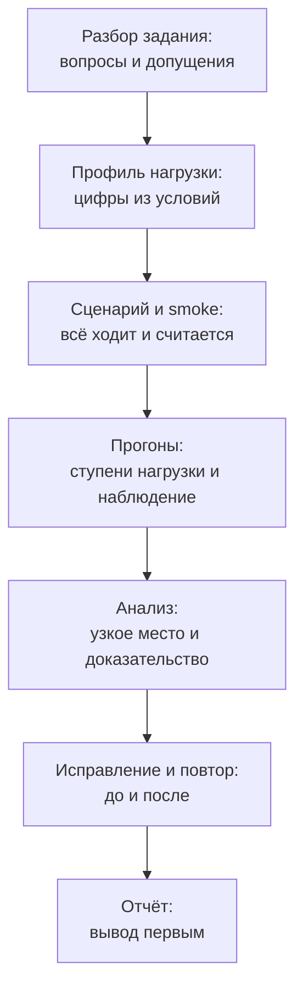

## Зачем это нужно

Многие работодатели вместо долгих расспросов дают **тестовое задание** (take-home assignment): письмо с условиями, срок «сделайте за день-два» и просьба прислать результат. Для нагрузочного тестирования это особенно удобный формат: за один день видно всё, что нужно нанимающему. Умеешь ли ты читать чужое задание и задавать вопросы, составить план, написать сценарий, провести честный эксперимент, найти узкое место и доказать его цифрами, а главное, написать отчёт, который прочитает занятый человек за пять минут.

Кандидаты чаще всего проваливают тестовое не из-за незнания инструмента, а из-за **управления временем и подачи**. Они полдня пишут красивый сценарий, на анализ остаётся час, отчёт пишется в последние минуты на бегу, а в результате приходит папка с файлами и без вывода. Этот урок учит работать по плану и сдавать результат, который хочется читать.

Шаг проекта: ты получишь текст тестового задания по «Магазину», разберёшь его, составишь план на восемь часов, подготовишь каталог `~/perf-lab/13-final/take-home/` со всеми шаблонами и скриптами и сделаешь сквозной минимум (сценарий и первый прогон). Само задание целиком ты выполнишь в отдельный день с таймером: так же, как на настоящем тестовом. Урок рассчитан на 4 часа: чтение, разбор, подготовка и первый прогон.

## Что нужно знать

- Профиль нагрузки, SLO и методика испытаний: [урок 8.4](../08-perf-theory/04-load-profile-slo.md), виды тестов: [урок 8.3](../08-perf-theory/03-test-types.md).
- Locust и запуск без интерфейса: [урок 9.4](../09-locust/04-headless-shape.md), либо k6: [урок 10.2](../10-k6/02-scenarios-thresholds.md).
- Дашборд, PromQL и логи: [уроки 7.2](../07-observability/02-promql.md), [7.3](../07-observability/03-grafana.md) и [7.5](../07-observability/05-logs-loki.md).
- Поиск узкого места от симптома к причине: [урок 11.1](../11-bottlenecks/01-method.md) и дальше [11.2](../11-bottlenecks/02-cpu.md), [11.3](../11-bottlenecks/03-database.md), [11.5](../11-bottlenecks/05-cache-dependencies.md).
- Отчёт и ёмкость: [урок 12.1](../12-process/01-report.md), [12.3](../12-process/03-capacity.md).

## Картина целиком

Тестовое задание похоже на экзамен по вождению. Инспектор не ждёт, что ты проедешь трассу быстрее всех: он смотрит, смотришь ли ты в зеркала, соблюдаешь ли правила и понимаешь ли, почему сделал именно так. Скорость значит меньше, чем осознанность. Аналогия ломается там, что в экзамене по вождению ошибка одна и сразу видна, а в тестовом нагрузочника ошибка может спрятаться в отчёте: красивые графики без ответа на вопрос «и что?».

Весь день укладывается в один конвейер, и у каждого этапа есть результат, который можно показать:



Что здесь видно: от разбора до отчёта идёт линия без возвратов. Возврат назад (переписать сценарий после прогонов) возможен, но каждый возврат ест время, поэтому этапы выстроены так, чтобы ошибки находились как можно раньше: сценарий проверяют одним минутным smoke-прогоном до больших замеров.

## Теория

### Как задание читает тот, кто его проверяет

Проверяющий это инженер, у которого есть своя работа. У него десять-двадцать решений, на каждое он готов потратить 10-15 минут. Он идёт по приблизительному плану: открывает отчёт (README или `report.md`), смотрит вывод, затем листает графики, затем проверяет, воспроизводимо ли сделанное (запускаются ли скрипты), и в последнюю очередь читает код. Из этого следует, где тратить время.

| Что смотрит | Что он ищет | Что для этого нужно |
| --- | --- | --- |
| Первый экран отчёта | Ответ на вопрос задания в трёх строках | Вывод сверху, а не в конце |
| Профиль нагрузки | Обоснование цифр, а не «взял 100 пользователей» | Расчёт от условий задания |
| Графики | Видно ли узкое место и доказательство | Подписанные оси, единицы, отметки событий |
| Анализ | Гипотеза, проверка, вывод | Цепочка «симптом, метрика, причина, эксперимент» |
| Рекомендации | Приоритет и ожидаемый эффект | Одно-два конкретных изменения, проверенных повторным прогоном |
| Честность | Ограничения и допущения | Раздел «что не успел и что сомнительно» |
| Воспроизводимость | Могу ли я повторить | Команды запуска в README, версии, `requirements.txt` |

Именно поэтому красивый, но объяснённый результат на тесте побеждает идеальный, но молчаливый.

### Разбор условий: вопросы и допущения

Любое тестовое неполное: в нём пропущено что-то, что работодатель считает очевидным. Первая ошибка начинающих: молча додумать и сделать. Вторая: завалить автора письма двадцатью вопросами. Правильно: **выписать неясности**, для каждой решить, критична она или нет, критичные (две-три) задать письмом в начале, остальные закрыть **допущениями** (assumptions) и записать в отчёт.

Пример разбора. В задании сказано «сервис должен выдерживать пиковую нагрузку интернет-магазина». Что неясно: сколько это в числах, какие операции, что считается «выдерживает». Критичные: целевая нагрузка и критерий успеха. Они обычно есть в тексте (проверь), а если нет, спроси. Некритичные: «сколько пользователей в БД» (берём как есть), «что с кэшем» (не трогаем, фиксируем настройки стенда). Записываешь:

```text
Допущение 1. Нагрузка задана сессиями в пиковый час; пик минуты в 1,5 раза выше среднего часа, запас на рост 2x.
Допущение 2. Настройки стенда не меняются до итогового прогона «после исправления».
Допущение 3. Тест идёт с одной машины, генератор не является узким местом (проверяю загрузкой CPU генератора).
```

**Что путают:** допущение с придумыванием. Допущение это явная запись «я считаю так, потому что...», а не тихий выбор. Проверяющий может не согласиться, но он видит ход мысли.

### Профиль нагрузки: из слов в цифры

В [уроке 8.4](../08-perf-theory/04-load-profile-slo.md) ты переводил сессии в пиковый час в RPS. На тестовом это почти всегда первый расчёт. Схема: сессий в час, делим на 3600, умножаем на пиковый коэффициент и запас роста, получаем сессии в секунду. Дальше умножаем на число операций в сессии. Расчёт лучше положить в скрипт: тогда его можно пересчитать, если автор задания поправит условия, и он служит доказательством. Разобранный пример приведён в практике, шаг 3.

Важное свойство: **профиль определяет, что ты найдёшь**. Если в смеси много входов, упрёшься в процессор из-за bcrypt (урок 11.2). Если много просмотров заказов, найдёшь отсутствие индекса и N+1 (урок 11.3). Поэтому профиль нельзя «подгонять под известное узкое место»: ты его берёшь из условий, а что найдётся, то найдётся.

### Эксперимент: гипотеза, метод, критерий

Нагрузочное тестирование это эксперимент, и оформлять его стоит как эксперимент:

1. **Вопрос:** «выдерживает ли магазин 20 запросов в секунду с p95 каталога меньше 300 мс?»
2. **Метод:** ступенчатая нагрузка (5, 10, 20, 30, 40 RPS) по 3 минуты на ступень, смесь из профиля, один стенд, одинаковая конфигурация.
3. **Критерий:** ступень считается пройденной, если p95 каталога меньше 300 мс, p95 заказа меньше 1 с, ошибок меньше 1%, и p95 не растёт во времени внутри ступени.
4. **Контроль:** до начала замеров smoke-прогон 1 минуту при 2 пользователях: всё возвращает 200 и числа сходятся с Prometheus.

Ступень в три минуты выбрана не случайно: метрики Prometheus собираются раз в 15 секунд, окно `rate` берёт минуту, а первую минуту ступени система «прогревается». Значимы вторая и третья минуты. На ступенях короче минуты ты видишь только переходной процесс.

### Как искать узкое место за ограниченное время

Времени мало, поэтому методика строго упорядочена, как в [уроке 11.1](../11-bottlenecks/01-method.md):

<div class="viz" data-viz="flow" data-title="Поиск узкого места на тестовом: шаги и их цена" data-steps='[{"title":"Найди ступень, где сломалось","text":"Первая ступень, на которой p95 выше порога или появились ошибки. Это «предел» для отчёта."},{"title":"Какой маршрут первым","text":"p95 по `route`: растёт один маршрут или все сразу. Один маршрут: проблема в нём. Все: общий ресурс."},{"title":"Занят или ждёт","text":"CPU контейнера shop около 100%: упёрлись в процессор. Низкий CPU при высокой задержке: ждём пул, базу или зависимость."},{"title":"Что именно ждёт","text":"`shop_db_pool_waiting`, длительность SQL в `pg_stat_statements`, `shop_payment_duration_seconds`."},{"title":"Проверь одним экспериментом","text":"Одно изменение (индекс, воркеры, конфиг) и повтор той же ступени. Меняй ровно одно за раз."},{"title":"Запиши до и после","text":"Таблица: ступень, RPS, p95, ошибки до и после. Без неё вывод «стало лучше» бездоказателен."}]'></div>

Что здесь видно: шаги идут от самых дешёвых проверок (смотрим на графики) к дорогим (меняем конфиг и повторяем прогон). Не прыгай сразу к шагу 5: гипотеза, не подтверждённая метриками, это угадывание.

**Правило доказательства:** для каждого вывода в отчёте у тебя должно быть минимум **два независимых подтверждения**. Например, для «упёрлись в пул БД»: `shop_db_pool_waiting` больше нуля и растёт в той же точке, где растёт p95 (первый факт), и в логах 503 с «couldn't get a connection after 5.00 sec» (второй факт). Один график это впечатление, два совпадающих источника это доказательство.

### Как распорядиться восемью часами

Типичная ошибка: «у меня весь день, начну со сценария» и в итоге пять часов уходит на сценарий. Тайм-бокс (time-box) значит выделить жёсткий лимит времени на этап и перейти к следующему, даже если результат не идеален. Ниже типовой план. Подвигай ползунки и посмотри, как перераспределение времени бьёт по отчёту:

<div class="viz" data-viz="final-day-plan" data-total="8" data-plan='[{"name":"Разбор, вопросы, допущения","h":0.5,"min":0.25},{"name":"Профиль и расчёт","h":0.5,"min":0.25},{"name":"Сценарий и smoke","h":1.25,"min":0.75},{"name":"Прогон теста","h":1.5,"min":1},{"name":"Анализ узкого места","h":1.25,"min":1},{"name":"Исправление и повтор","h":1,"min":0.75},{"name":"Отчёт и сдача","h":1.5,"min":1.25}]'></div>

Что здесь видно: отчёту и анализу вместе отдана почти треть дня, и это не случайность. Минимумы подсвечиваются красным: если упасть ниже, шанс сдать сильную работу резко падает. Полчаса запаса в конце дня нужны на то, что пойдёт не так: контейнер упал, график не построился, запись не закоммитилась.

Три рабочих правила:

1. **Сначала сквозной минимум.** К полудню у тебя должен быть худший возможный вариант целиком: скрипт, один прогон, три строки вывода. Улучшать будешь от рабочего, а не от пустоты.
2. **Отчёт пишется по ходу.** Ведёшь `notes.md`: что запустил, во сколько, что увидел. К вечеру отчёт собирается из заметок, а не из памяти.
3. **Остановка по расписанию.** Когда время этапа вышло, записываешь «не успел: X» и идёшь дальше. Честное «не успел» стоит дороже, чем неряшливо сделанное.

### Отчёт: вывод первым

Структура отчёта опирается на [урок 12.1](../12-process/01-report.md), но на тестовом она жёстче. Один экран (до скролла) отвечает на вопрос задания:

```text
Вывод. Магазин держит 12 RPS в смеси из профиля при p95 каталога 180 мс. На 20 RPS p95 каталога
растёт до 1,4 с, ошибок нет. Узкое место: один воркер shop упирается в CPU из-за bcrypt при входе.
Рекомендация: увеличить число воркеров (WEB_CONCURRENCY=3). После правки 20 RPS проходит, p95 каталога 160 мс.
```

Три предложения: что выдерживает, где ломается и почему, что делать и что получилось. Остальное в отчёте это доказательства для скептика, который захочет проверить. Хороший отчёт читают по диагонали, поэтому выводы выделены, а графики подписаны так, чтобы их можно было понять без текста.

Частая ловушка: **объявить причиной то, что просто совпало**. Если p95 вырос и одновременно вырос CPU, это ещё не причинность: проверь, что именно изменение причины даёт эффект (то есть проведи эксперимент до и после).

### Критерии оценки

Это та шкала, по которой проверяющий ставит оценку. Используй её для самопроверки перед сдачей. Максимум 20 баллов.

| Критерий | 0 баллов | 2 балла | 4 балла |
| --- | --- | --- | --- |
| Профиль | цифры из воздуха | расчёт есть, но неполный | расчёт от условий, смесь операций, обоснованы допущения |
| Эксперимент | один прогон «на глаз» | ступени есть, но смешаны условия | ступени, смоук-контроль, одинаковые условия, критерий успеха заранее |
| Узкое место | не найдено или названо без доказательств | названо, одно подтверждение | названо, два независимых подтверждения |
| Исправление | нет | предложено словами | проверено повторным прогоном «до и после» |
| Отчёт и честность | нет вывода, нет ограничений | вывод есть, ограничения слабые | вывод сверху, графики подписаны, раздел «ограничения и что не успел», воспроизводимость |

Порог «берём на следующий этап» обычно 12-14 баллов. Если не хватает баллов, чаще всего это колонки «Узкое место» и «Отчёт».

### Частые ошибки

| Ошибка | Чем плоха | Как избежать |
| --- | --- | --- |
| Нет вывода в начале отчёта | проверяющий не находит ответ | три предложения на первом экране |
| Нагрузка выбрана «100 пользователей» | цифра не связана с условиями | расчёт из профиля с допущениями |
| Генератор упёрся в свой CPU | измерили слабость генератора, а не сервиса | смотри CPU генератора, держи ниже 70% |
| Меняли несколько параметров сразу | непонятно, что помогло | одно изменение за прогон |
| Графики без подписей и единиц | нельзя понять без автора | заголовок, единицы, отметка событий |
| Только средние значения | прячут хвост | p50, p95, p99 |
| «Стало быстрее» без чисел | недоказуемо | таблица до и после |
| Скрипты не запускаются у другого | нельзя проверить | команды в README, версии, `requirements.txt` |
| Скрыли неудачу | потеря доверия | раздел «что не получилось» |
| Сдали в последнюю минуту | ошибка в упаковке, пропущенные файлы | запас 30 минут и проверка «чистым» клоном |

### Пример решения: что он содержит

Ниже сокращённая картина сильного решения (числа иллюстративные: на твоём компьютере они будут другими, важна логика). Профиль даёт цель в 20 RPS. Ступенчатый прогон показывает:

<div class="viz" data-viz="chart" data-type="line" data-x="5,10,20,30,40" data-x-label="Ступень нагрузки, RPS" data-y-label="Значение" data-explain="Пропускная способность растёт вместе с нагрузкой до 20 RPS, дальше упирается в потолок около 22, а p95 каталога после 20 RPS уходит вверх. Предел виден по излому: ступень 20 RPS была последней нормальной." data-series='[{"name":"Достигнуто, RPS","values":[5,10,19.5,22,22.5]},{"name":"p95 каталога, с","values":[0.08,0.1,0.18,1.1,3.4]},{"name":"Ошибки, %","values":[0,0,0,0.4,6]}]'></div>

Что здесь видно: до 20 RPS всё в порядке, на 30 появляется «полка» (потолок RPS) и взлёт p95, на 40 уже ошибки. Это классическая «хоккейная клюшка» из урока 8.1. Автор такого решения не остановился на графике: он пошёл искать причину.

Дальше в сильном решении три факта: у `shop` загрузка CPU около 100% при том, что у PostgreSQL около 20%; `py-spy dump` или `docker stats` показывают, что процесс упёрся в один процессор; маршрут `/api/login` даёт заметную долю времени (bcrypt, урок 11.2). Гипотеза: «один воркер упирается в CPU». Эксперимент: `WEB_CONCURRENCY=3`, повтор ступеней 20 и 30. Таблица до и после: на 20 RPS p95 каталога 1,4 с против 0,16 с, на 30 RPS p95 0,9 с. Рекомендация: увеличить число воркеров, вынести вход в отдельный лимитированный путь, в долгосрочной перспективе пересмотреть стоимость хеширования вместе с безопасностью. Раздел «ограничения»: стенд работает в Docker на ноутбуке, генератор на той же машине, база маленькая, результат переносится на прод только как направление.

В другом запуске узким местом может оказаться `/api/orders` (нет индекса, N+1), и это такой же хороший ответ, если он доказан. Не пытайся угадать «правильный» ответ: проверяющему важно, **как** ты к нему пришёл.

## Практика

### 1. Подготовь рабочий каталог

```bash
mkdir -p ~/perf-lab/13-final/take-home/{scripts,results,screenshots}
cd ~/perf-lab/13-final/take-home
```

`-p` создаёт промежуточные каталоги без ошибки, фигурные скобки раскрываются в три каталога. Всё, что ты делаешь на тестовом, лежит здесь.

Создай файл с текстом задания, чтобы он всегда был под рукой:

```bash
cat > TASK.md <<'EOF'
# Тестовое задание: «Магазин» перед распродажей

Вам передан интернет-магазин (стенд из репозитория, поднимается `docker compose up -d`).
В пятницу запланирована распродажа. Нужно проверить, выдержит ли магазин ожидаемую нагрузку,
найти главное узкое место и предложить, как его убрать.

Условия:
1. Ожидаемая нагрузка: 3000 пользовательских сессий в пиковый час. Пик внутри часа выше среднего
   в 1,5 раза. Заложите запас на рост в 2 раза.
2. Сессия: один вход, 3 просмотра каталога, 2 карточки товара, добавление товара в корзину,
   в половине сессий оформление заказа, в 30% сессий просмотр списка своих заказов.
3. Критерии успеха: p95 каталога меньше 300 мс, p95 оформления заказа меньше 1 с,
   доля ошибок меньше 1%.
4. Нагружать только локальный стенд.

Что сдать (срок: 8 часов):
1. Скрипты нагрузки и инструкция запуска.
2. Расчёт профиля нагрузки.
3. Результаты прогонов: ступенчатый тест и дашборд.
4. Отчёт (до двух страниц): вывод, узкое место с доказательствами, рекомендации.
5. Проверка одного исправления: прогон до и после.
EOF
```

**Как читать задание:** пункт 1 даёт цифры, пункт 2 даёт смесь операций, пункт 3 критерии успеха, пункт 4 границы. Пункт «сдать» это твой чек-лист: каждая строка станет файлом.

### 2. Вопросы и допущения

```bash
cat > questions.md <<'EOF'
# Вопросы и допущения

## Вопросы автору (критичные)
1. Критерии p95 относятся к каждому маршруту отдельно или к смеси целиком?
2. Допустимо ли менять конфигурацию стенда для исправления (переменные `.env`), или только SQL и код?

## Допущения (если ответа нет)
1. Критерии применяю к каждому маршруту отдельно: «каталог» это `/api/products`, «оформление заказа» это `/api/orders` (POST).
2. Менять можно только то, что описано в README стенда (переменные `.env`, индекс в БД).
3. Генератор и стенд на одной машине; контролирую загрузку CPU генератора.
4. Пик внутри часа 1,5x, запас на рост 2x, как в задании.
EOF
```

Измени вопросы и допущения под себя. Главное: каждый пункт, который ты принял без ответа, записан.

### 3. Расчёт профиля скриптом

```bash
cat > scripts/calc.py <<'EOF'
sessions_per_hour = 3000
peak = 1.5      # пик внутри часа к среднему
growth = 2      # запас на рост
per_session = {            # операций за сессию
    "login": 1, "catalog": 3, "product": 2,
    "cart": 1, "order": 0.5, "my_orders": 0.3,
}
sessions_per_sec = sessions_per_hour / 3600 * peak * growth
print(f"сессий в секунду: {sessions_per_sec:.2f}")
total = 0
for name, count in per_session.items():
    rps = sessions_per_sec * count
    total += rps
    print(f"{name:10s} {rps:5.2f} RPS")
print(f"{'итого':10s} {total:5.2f} RPS")
EOF
python3 scripts/calc.py | tee results/profile.txt
```

Скрипт делит сессии в час на 3600, умножает на пик и запас, потом на число операций за сессию. `tee` показывает вывод и сохраняет его в файл (повтор из урока 1.2).

```text
сессий в секунду: 2.50
login       2.50 RPS
catalog     7.50 RPS
product     5.00 RPS
cart        2.50 RPS
order       1.25 RPS
my_orders   0.75 RPS
итого      19.50 RPS
```

**Как читать вывод:** целевая нагрузка около 20 RPS. Обрати внимание на `login`: 2,5 входа в секунду. Каждый вход это bcrypt с параметром 12, то есть заметная часть секунды процессорного времени одного воркера. Это первая гипотеза на проверку, но **гипотеза, а не вывод**: проверять её будешь метриками.

### 4. План на день

```bash
cat > plan.md <<'EOF'
# План (старт 09:00)
| Время | Этап | Результат |
| --- | --- | --- |
| 09:00-09:30 | Разбор, вопросы, допущения | questions.md |
| 09:30-10:00 | Профиль | scripts/calc.py, results/profile.txt |
| 10:00-11:15 | Сценарий, smoke | scripts/locustfile.py, минутный прогон без ошибок |
| 11:15-12:45 | Ступенчатый прогон | results/step_*.csv, скриншоты |
| 12:45-14:00 | Анализ, узкое место | notes.md с доказательствами |
| 14:00-15:00 | Исправление, повтор | results/after_*.csv |
| 15:00-16:30 | Отчёт | report.md |
| 16:30-17:00 | Запас, проверка, push | всё закоммичено |
EOF
```

Скорректируй время под себя (двигай виджет выше, пока не покажется реалистично). Поставь будильник на каждую границу этапа.

### 5. Сценарий нагрузки

Если в теме 9 ты написал свой сценарий покупателя, возьми его за основу. Ниже самодостаточный вариант, где одна задача Locust это целая сессия из условий:

```bash
cat > scripts/locustfile.py <<'EOF'
import random
import time

from locust import HttpUser, between, task


def think():
    time.sleep(random.uniform(0.2, 0.6))


class Session(HttpUser):
    wait_time = between(1, 2)

    @task
    def visit(self):
        number = random.randint(1, 1000)
        with self.client.post("/api/login", name="/api/login", catch_response=True,
                              json={"email": f"user{number:04d}@shop.lab", "password": "password"}) as r:
            if r.status_code != 200:
                r.failure(f"вход: {r.status_code}")
                return
            token = r.json()["token"]
        headers = {"Authorization": "Bearer " + token}
        for _ in range(3):
            self.client.get("/api/products", params={"page": random.randint(1, 10)}, name="/api/products")
            think()
        product = random.randint(1, 10000)
        for _ in range(2):
            self.client.get(f"/api/products/{random.randint(1, 10000)}", name="/api/products/[id]")
            think()
        self.client.post("/api/cart/items", json={"product_id": product, "qty": 1},
                         headers=headers, name="/api/cart/items")
        if random.random() < 0.5:
            think()
            self.client.post("/api/orders", headers=headers, name="/api/orders")
        if random.random() < 0.3:
            think()
            self.client.get("/api/orders", headers=headers, name="/api/orders [GET]")
EOF
```

Разбор. Каждая итерация задачи `visit` это новая сессия: вход, три просмотра каталога, две карточки, корзина, заказ в половине случаев, список заказов в 30% случаев. Такая структура воспроизводит расчёт: входы идут постоянно, а не один раз на пользователя, поэтому bcrypt нагружается так, как задумано профилем. `name=` собирает похожие URL в одну строку статистики, а имя `"/api/orders [GET]"` отделяет просмотр заказов от оформления (иначе два разных метода слились бы в одну строку).

Минутный smoke-прогон до больших замеров:

```bash
source ~/perf-lab/.venv/bin/activate
cd ~/perf-lab/13-final/take-home
locust -f scripts/locustfile.py --host http://localhost:8000 --headless -u 2 -r 1 -t 1m --only-summary --csv results/smoke
```

Ожидаемое: в итоговой таблице `Fails` равно 0 у всех строк, в `Aggregated` порядка 10-15 запросов в секунду на двух пользователях не ожидай: у каждого пользователя пауза между сессиями, получится около 3-4 RPS.

**Типичные ошибки:** `KeyError: 'token'`: вход вернул не 200, смотри `r.status_code` и убедись, что стенд поднят. Все `/api/orders` дают 400: корзина пуста, потому что ты не положил товар (в сценарии заказ идёт после корзины, проверь порядок). `ModuleNotFoundError: locust`: не активировано окружение, `source ~/perf-lab/.venv/bin/activate`.

### 6. Ступенчатый прогон и сводка

```bash
cat > scripts/run_steps.sh <<'EOF'
#!/usr/bin/env bash
# Ступени по числу пользователей: 3, 6, 12, 18, 24 (примерно 5, 9, 19, 28, 37 RPS)
set -euo pipefail
cd "$(dirname "$0")/.."
for users in 3 6 12 18 24; do
  echo "=== ступень: $users пользователей, $(date +%T)"
  locust -f scripts/locustfile.py --host http://localhost:8000 --headless \
         -u "$users" -r 3 -t 3m --only-summary --csv "results/step_$users" > /dev/null
done
EOF
chmod +x scripts/run_steps.sh
cat > scripts/summary.py <<'EOF'
import csv
import glob
import re

print(f"{'польз.':>6} {'RPS':>6} {'p95, мс':>8} {'ошибки, %':>9}")
for path in sorted(glob.glob("results/step_*_stats.csv"), key=lambda p: int(re.search(r"step_(\d+)_", p).group(1))):
    users = int(re.search(r"step_(\d+)_", path).group(1))
    for row in csv.DictReader(open(path)):
        if row["Name"] == "Aggregated":
            total = int(row["Request Count"])
            fails = int(row["Failure Count"])
            print(f"{users:6d} {float(row['Requests/s']):6.1f} {float(row['95%']):8.0f} {100 * fails / max(total, 1):9.1f}")
EOF
```

Скрипт `run_steps.sh` запускает Locust пять раз подряд по 3 минуты и сохраняет `results/step_<N>_stats.csv`. `summary.py` собирает из этих файлов строку «Aggregated» каждой ступени. Запусти ступени в фоне и **наблюдай дашборд** (это и есть главная часть):

```bash
./scripts/run_steps.sh
```

Пока идёт, в Grafana (период «последние 30 минут») следи за p95 по маршрутам, 5xx, CPU контейнера shop, пулом БД и длительностью оплаты. На границах ступеней делай скриншоты панелей в `screenshots/`. После конца:

```bash
python3 scripts/summary.py | tee results/summary.txt
```

```text
польз.    RPS  p95, мс ошибки, %
     3    5.1      110       0.0
     6    9.7      120       0.0
    12   19.0      240       0.0
    18   24.2     1300       0.1
    24   25.1     3900       4.8
```

**Как читать вывод:** RPS растёт вместе с пользователями до 12, потом упирается в потолок около 25 (насыщение), а p95 уходит вверх: классическое «колено». Пример иллюстративный. Твоя цель: найти ступень, где нарушен критерий, и сделать вывод о пределе. Не забудь, что «пользователи» в Locust это закрытая модель: рост пользователей не равен росту нагрузки в RPS, поэтому в отчёте ты указываешь именно достигнутый RPS.

### 7. Заметки по ходу и отчёт

Во время работы веди `notes.md`:

```bash
echo "- $(date +%T) запустил ступени 3-24, p95 каталога растёт с 18 пользователей" >> notes.md
```

В конце собери отчёт из заметок по шаблону:

```bash
cat > report.md <<'EOF'
# Отчёт: «Магазин» перед распродажей

## Вывод
<3 предложения: что выдерживает, где ломается и почему, что рекомендуем и что получилось после>

## Что проверяли
- Цель: 20 RPS, критерии: p95 каталога < 300 мс, p95 заказа < 1 с, ошибки < 1%.
- Профиль: расчёт в `scripts/calc.py`, смесь операций из задания.
- Метод: ступени по 3 минуты, одна конфигурация, генератор и стенд на одной машине.

## Результаты
<таблица из results/summary.txt и график RPS и p95 по ступеням>

## Узкое место
<гипотеза; два независимых подтверждения со скриншотами и запросами PromQL>

## Рекомендации
| # | Что сделать | Ожидаемый эффект | Приоритет |
| --- | --- | --- | --- |

## Проверка исправления: до и после
<таблица: ступень, RPS, p95, ошибки до и после изменения; что именно изменили>

## Ограничения и что не успел
- <допущения, чем отличается стенд от прода, что не проверил>

## Как повторить
<команды: подъём стенда, запуск ступеней, сводка, версии>
EOF
```

Заполни его по результатам. Для узкого места используй цепочку шагов из теории, для проверки исправления внеси ровно одно изменение (например, `WEB_CONCURRENCY` или индекс по рекомендациям уроков темы 11), повтори ступени 12 и 18 пользователей в `results/after_*` и впиши сравнение.

### 8. Самопроверка и сдача

Прогони отчёт и папку по таблице критериев. Для каждой строки поставь себе 0, 2 или 4 балла и запиши итог в конец `report.md` (строкой «Самооценка: N из 20, слабое место: ...»). Потом проверь воспроизводимость: склонируй репозиторий в пустой каталог и убедись, что README из `take-home` позволяет запустить хотя бы `calc.py` и `summary.py`.

```bash
cd ~/perf-lab
git add 13-final/take-home
git commit -m "13.2: тестовое задание: профиль, сценарий, прогоны, отчёт"
git push
```

## Сломай и почини

Проверь, как ты ведёшь себя, когда план ломается. Выполни эту тренировку на пустой голове, после первого прогона:

1. Во время ступени `18` остановите контейнер магазина: `docker compose stop shop` (из `~/load-tester/project/shop`), подожди 20 секунд, запусти: `docker compose start shop`. Ты только что сымитировал «потерю часа» из-за технической неполадки.
2. Что с этим сделать: не паниковать, записать в `notes.md` («17:05 стенд перезапущен вручную, ступень 18 невалидна»), **перезапустить ступень целиком** и сохранить новый результат. Нельзя «склеивать» прогон, в котором была остановка, с чистым.
3. Измени план: что ты вырежешь, если времени остался час вместо двух? (Подсказка: исправление остаётся, красивые графики сокращаются, отчёт нет.)

Вторая поломка: твой генератор оказался узким местом. Запусти ступень 24 и в соседнем терминале смотри `top`: если процесс `locust` занимает 100% ядра, то 25 RPS это предел генератора, а не магазина. Как это проверить честно: запустить два процесса Locust (`--processes 2` или режим `--master/--worker` из урока 9.5) и убедиться, что RPS вырос. Запиши в отчёт, как ты убедился, что генератор не ограничивает результат.

## Словарик урока

| Термин | Простыми словами |
| --- | --- |
| Тестовое задание (take-home assignment) | Задача на дом от работодателя: выполняешь сам за заданное время и присылаешь результат. |
| Допущение (assumption) | Явно записанное «я считаю так», когда в условии не хватает данных. |
| Тайм-бокс (time-box) | Жёсткий лимит времени на этап: вышел срок, переходишь к следующему. |
| Критерий успеха | Заранее заданные числа (p95, ошибки), по которым решают, прошёл ли тест. |
| Ступенчатая нагрузка | Тест, где нагрузка растёт ступенями, и на каждой ступени держится постоянной. |
| Воспроизводимость | Свойство результата: другой человек по твоим командам получает то же самое. |
| До и после | Сравнение двух прогонов с одним изменением, доказывающее, что оно помогло. |
| Ограничения отчёта | Честный список того, что в тесте отличалось от реальности и что не проверено. |

## Вопросы с собеседований

Раздел для повторения: ответь вслух, потом открой ответ. Короткие вопросы тренируй на скорость: ответ за 30 секунд.

### 1. [junior] [часто] Как ты подходишь к тестовому заданию, если в условиях не хватает данных?

<details markdown="1">
<summary>Ответ</summary>

Выписываю неясности и делю на критичные и некритичные. Критичные (цель, критерий успеха) уточняю у автора одним коротким письмом в начале. Остальное закрываю допущениями и записываю их в отчёт. Так я не блокируюсь и не молчу, а проверяющий видит ход мысли.

**Что хотят услышать:** вопросы по делу, допущения вместо молчаливых догадок, запись в отчёте.

**Красный флаг:** «я сам всё додумал» или двадцать вопросов на старте.

</details>

### 2. [junior] [часто] Как ты выбираешь нагрузку для теста, если заказчик дал только «пиковую посещаемость»?

<details markdown="1">
<summary>Ответ</summary>

Перевожу в RPS: сессии в пиковый час делю на 3600, умножаю на пик внутри часа и запас на рост, потом на число операций каждого вида за сессию. Расчёт кладу в скрипт, чтобы его можно было пересчитать. Допущения (пик 1,5x, запас 2x) называю явно.

**Что хотят услышать:** расчёт от сессий к RPS, смесь операций, запас.

**Красный флаг:** «взял 100 пользователей, потому что красиво».

</details>

### 3. [junior] [часто] Что должно быть на первом экране отчёта?

<details markdown="1">
<summary>Ответ</summary>

Вывод в три предложения: что система выдерживает при заданных критериях, где и почему ломается, что рекомендую и какой эффект получил. Детали и графики ниже как доказательства.

**Что хотят услышать:** вывод сверху, цифры, рекомендация.

**Красный флаг:** вывод в конце после десяти графиков.

</details>

### 4. [junior] Почему ступени нагрузки держат несколько минут, а не секунд?

<details markdown="1">
<summary>Ответ</summary>

Система прогревается, метрики собираются с шагом (Prometheus каждые 15 секунд), а окно `rate` берёт минуту. На короткой ступени видишь только переходной процесс. Значимы последние минуты ступени, когда значения установились.

**Что хотят услышать:** прогрев и шаг сбора метрик, p99 на малой выборке бессмыслен.

**Красный флаг:** «30 секунд достаточно, чтобы увидеть всё».

</details>

### 5. [junior] Как понять, что тест упёрся в генератор, а не в сервис?

<details markdown="1">
<summary>Ответ</summary>

Смотрю загрузку CPU генератора: если процесс Locust держит почти 100% ядра, RPS не растёт, а у сервиса CPU и пул свободны, то узкое место генератор. Проверяю запуском нескольких процессов или воркеров: если RPS вырос, это был генератор.

**Что хотят услышать:** метрики генератора и проверка экспериментом.

**Красный флаг:** «если RPS не растёт, значит сервер слабый».

</details>

### 6. [middle] Ты нашёл, что p95 вырос при росте CPU. Можно ли писать, что причина в CPU?

<details markdown="1">
<summary>Ответ</summary>

Не сразу: совпадение не причинность. Нужно второе независимое подтверждение (например, профиль `py-spy` показывает горячую функцию, а при добавлении воркеров p95 падает) и эксперимент «до и после» с одним изменением. Только тогда вывод доказан.

**Что хотят услышать:** два подтверждения, эксперимент, различие корреляции и причины.

**Красный флаг:** «CPU вырос, значит CPU и виноват».

</details>

### 7. [middle] Как ты оформляешь проверку исправления?

<details markdown="1">
<summary>Ответ</summary>

Меняю одно за прогон, остальные условия те же (стенд, сценарий, ступени, длительность). Таблица «до и после» по тем же ступеням: достигнутый RPS, p95, ошибки. Фиксирую, что именно изменено (конфиг, коммит). Если эффект малый, повторяю прогон, чтобы оценить разброс.

**Что хотят услышать:** одно изменение, одинаковые условия, цифры в таблице, повтор.

**Красный флаг:** «поменял три настройки сразу, стало лучше».

</details>

### 8. [middle] Что ты сделаешь, если за час до конца срока узкое место не найдено?

<details markdown="1">
<summary>Ответ</summary>

Не придумываю причину. Пишу отчёт с тем, что известно: пределы нагрузки, гипотезы, которые отброшены и почему, оставшиеся кандидаты и план, как их проверить. Честный отчёт «не нашёл, вот что исключил» сильнее выдуманного вывода.

**Что хотят услышать:** честность, зафиксированный прогресс, следующий шаг.

**Красный флаг:** «подогнал вывод под ожидаемый ответ».

</details>

### 9. [middle] Что ты включишь в раздел «Ограничения»?

<details markdown="1">
<summary>Ответ</summary>

Чем стенд отличается от прода (один хост, ограничения Docker, маленькая база), что генератор и сервис на одной машине, какие допущения принял, чего не проверял (долгий soak, пиковые всплески), насколько результат переносится на реальную систему. Это защита от ложной уверенности.

**Что хотят услышать:** честный перечень и вывод, как читать результат.

**Красный флаг:** «ограничений нет».

</details>

### 10. [на скорость] Назови пять частей структуры отчёта.

<details markdown="1">
<summary>Ответ</summary>

Вывод, что проверяли, результаты, узкое место с доказательствами, рекомендации (и до/после, ограничения, как повторить).

**Что хотят услышать:** вывод первым.

**Красный флаг:** «введение, история, график».

</details>

### 11. [на скорость] Почему «стало быстрее» без цифр не принимается?

<details markdown="1">
<summary>Ответ</summary>

Это нельзя проверить и нельзя сравнить. Нужны условия, до и после, p95 и ошибки.

**Что хотят услышать:** проверяемость.

**Красный флаг:** «и так видно».

</details>

### 12. [на скорость] Сколько изменений за один прогон «до и после»?

<details markdown="1">
<summary>Ответ</summary>

Одно: иначе не знаешь, что помогло.

**Что хотят услышать:** «одно».

**Красный флаг:** «сколько нужно».

</details>

## Проверено на версиях

Ubuntu 24.04, Locust 2.46, Python 3.12, стенд «Магазин» из `project/shop` (Python 3.14, FastAPI 0.142, PostgreSQL 18.6), Prometheus 3.15, Grafana 13.2. Числа в примерах вывода иллюстративные. Октябрь 2026.

## Итог урока: ты умеешь

- [ ] Разобрать условия тестового задания, выписать вопросы и допущения.
- [ ] Перевести условия задачи в целевой RPS и смесь операций скриптом.
- [ ] Расписать восемь часов по этапам с тайм-боксами и запасом.
- [ ] Написать сценарий, который воспроизводит профиль, и проверить его smoke-прогоном.
- [ ] Провести ступенчатый прогон, собрать сводку и найти ступень, где нарушен критерий.
- [ ] Доказать узкое место двумя независимыми фактами и проверить исправление «до и после».
- [ ] Написать отчёт с выводом сверху, ограничениями и инструкцией повтора, и оценить его по критериям.

Дальше: [урок 13.3. Портфолио и резюме](03-portfolio-resume.md), где ты оформишь всё сделанное в витрину и резюме.
