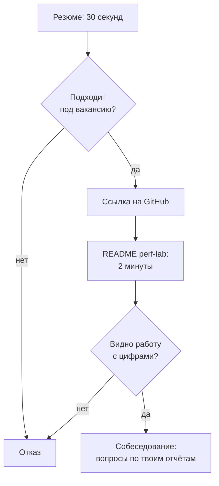

## Зачем это нужно

У начинающего нет опыта работы, и это нормально: на junior-позицию его никто и не ждёт. Но у работодателя всё равно есть вопрос: «А что этот человек умеет на деле?» Ответить на него можно двумя документами. **Резюме** (CV, curriculum vitae) это одна страница, на которой за 30 секунд видно, подходишь ли ты. **Портфолио** (portfolio) это подтверждение: репозиторий, где лежат твои сценарии, графики и отчёты, и любой может проверить, что написанное в резюме правда.

Ты уже сделал всю работу. За двенадцать тем в `~/perf-lab` скопились сценарии Locust и k6, дашборды, отчёты, разбор инцидента и тестовое задание. Но сейчас это папка с файлами, понятная только тебе. Задача этого урока: превратить её в **витрину**, которую человек с чужого компьютера поймёт за две минуты, и написать резюме, которое ссылается на неё и говорит цифрами, а не прилагательными.

Шаг проекта: ты приведёшь `~/perf-lab` в порядок (README, структура, скриншоты, чистка секретов), напишешь резюме по структуре из урока и проверишь оба документа по чек-листу глазами работодателя.

## Что нужно знать

- Твой репозиторий `~/perf-lab` и коммиты в него: [урок 3.1](../03-git/01-git-basics.md) и далее по теме 3.
- Отчёт о тестировании: структура и графики: [урок 12.1](../12-process/01-report.md).
- Постмортем и тестовое задание, которые ты сделал: [урок 13.1](01-incident-under-load.md), [урок 13.2](02-take-home.md).
- Ёмкость и «запас до предела» как язык цифр: [урок 12.3](../12-process/03-capacity.md).

## Картина целиком

Прохожий не заходит в магазин, пока витрина не зацепила: он смотрит секунду-две. Резюме и README работают так же: у них есть секунды, и за это время нужно показать главное. Аналогия ломается в одном: у витрины нет проверяющего, а у твоего портфолио он есть. Инженер может открыть любой файл и спросить: «А как это работает?» Поэтому показывай только то, что способен объяснить.

Путь работодателя выглядит так:



На каждом шаге человек может уйти. Резюме должно пройти первый ромб, README второй, и только потом начинается разговор. Любая лишняя строка в резюме и любой неубранный мусор в репозитории повышают шанс отказа на этих развилках.

## Теория

### Что такое портфолио для нагрузочника

Портфолио тестировщика производительности это набор доказательств по пяти вопросам, которые есть у любого работодателя. Каждому вопросу соответствует кусочек твоего репозитория.

| Вопрос работодателя | Чем ты отвечаешь | Где лежит |
| --- | --- | --- |
| Умеет ли писать сценарии | Locustfile и k6-скрипт с проверками и данными | `09-locust/`, `10-k6/` |
| Умеет ли смотреть метрики | Дашборд, запросы PromQL, скриншоты | `07-monitoring/`, `reports/` |
| Умеет ли находить причину | Отчёт «симптом, метрика, причина, проверка» | `11-bottlenecks/`, `reports/` |
| Умеет ли объяснять результат | Отчёт с выводом сверху и рекомендациями | `12-process/`, `13-final/take-home/` |
| Умеет ли работать в инциденте | Постмортем без обвинений | `13-final/postmortem.md` |

Из таблицы следует главный принцип: **не показывай всё, показывай лучшее**. Работодателю не нужны двадцать копий учебных скриптов. Нужны три-четыре «витринных» работы, которые отвечают на пять вопросов выше, и путь к ним в README.

### README как главная страница

README (файл `README.md` в корне репозитория) GitHub показывает сразу под списком файлов. Это первое, что увидит человек. Хороший README нагрузочного репозитория отвечает на вопросы в таком порядке:

1. **Одно предложение: что это.** «Лаборатория нагрузочного тестирования: сценарии Locust и k6, дашборды и отчёты по учебному интернет-магазину».
2. **Что внутри и где смотреть лучшее.** Три ссылки на лучшие работы с короткой подписью: что сделано и какой результат.
3. **Ключевые результаты цифрами.** Таблица или три строки.
4. **Как запустить.** Команды, версии, требования.
5. **Структура репозитория.** Дерево с пояснениями на одну строку.
6. **Ограничения и честные заметки.** Что учебное, что упрощено.

Скелет, который можно взять за основу:

```text
# perf-lab: нагрузочное тестирование интернет-магазина

Лаборатория: сценарии Locust и k6, мониторинг (Prometheus, Grafana, Loki) и отчёты
по учебному стенду «Магазин». Всё запускается локально в Docker.

## Что посмотреть в первую очередь
| Работа | О чём | Результат |
| --- | --- | --- |
| [Отчёт: поиск узкого места](13-final/take-home/report.md) | Ступенчатый тест, поиск причины, проверка исправления | Предел вырос с 12 до 30 RPS |
| [Постмортем инцидента](13-final/postmortem.md) | Замедление оплаты под нагрузкой | Хронология, причина, 4 действия |
| [Сценарий покупателя](09-locust/locustfile.py) | Вход, каталог, корзина, заказ с проверками | Профиль из расчёта нагрузки |

## Как запустить
...
```

Каждая строка таблицы это ссылка, по которой можно пройти. Если работодатель видит цифру («с 12 до 30 RPS»), у него возникает вопрос «как?», и он идёт в отчёт. Именно этого ты и хочешь.

**Что путают:** README как лабораторный журнал («сегодня я установил Locust...»). README это первое впечатление, а не дневник. Дневник можно оставить в `notes.md` внутри папок тем.

### Скриншоты, графики и отчёты

Картинка в README работает лучше абзаца. Но картинка должна быть **читаемой без пояснений**: подписаны оси и единицы, виден период времени, на графике отмечены события (начало ступени, откат), лишнее (чужие вкладки, личные данные в интерфейсе) обрезано.

Три правила для скриншотов:

1. **Один скриншот, одна мысль.** Подпись под ним говорит, на что смотреть: «p95 каталога растёт после 18:20, когда нагрузка превысила 20 RPS».
2. **Формат PNG, ширина до 1200 пикселей, вес до 300 КБ.** Репозиторий не должен весить сотни мегабайт из-за картинок.
3. **Хранить в `reports/img/` или рядом с отчётом** и ссылаться относительным путём: ``. Тогда картинка видна и на GitHub, и в локальном просмотре.

Результаты прогонов (`results/*.csv`) в репозитории оставляй выборочно: сводку и по одному файлу на каждый из лучших отчётов. Сырых данных на гигабайты в git быть не должно: это повод добавить `results/` в `.gitignore` и хранить там только то, на что ссылается отчёт.

### Чистка: чего не должно быть в публичном репозитории

Публичный репозиторий видит весь мир, включая тех, кто ищет случайно оставленные секреты. Перед публикацией выполни проверку по чек-листу:

| Что проверить | Почему | Как |
| --- | --- | --- |
| Пароли, токены, ключи API | Их находят боты за минуты | `git grep -nEi "password|token|secret|apikey"`, файл `.env` в `.gitignore` |
| Файлы `.env` | Содержат настройки и иногда секреты | В репозитории только `.env.example` |
| Данные реального работодателя | Нарушение договора и доверия | Только учебный стенд «Магазин» |
| Личные данные в скриншотах | Имя, почта, чужие вкладки | Обрезать, перепроверить глазами |
| Крупные файлы | Репозиторий тормозит | `du -sh .git`, большие результаты в `.gitignore` |
| Мёртвый код и «пробные» файлы | Создают шум | Удалить или перенести в `archive/` |

Важное правило про git: **удалённый файл остаётся в истории**. Если секрет попал в коммит, простое удаление его не уберёт, нужно считать его скомпрометированным и сменить. Для учебного стенда секреты вымышленные (`password`), но привычка «ничего секретного в коммите» нужна с первого дня, а не с первого работодателя.

### Резюме junior без опыта: структура

Резюме для начинающего это одна страница. Работодатель читает его сверху вниз, как правило, около 30 секунд, поэтому порядок блоков определяет, что он запомнит. Рекомендуемый порядок:

1. **Заголовок:** имя, роль-цель («Инженер по нагрузочному тестированию, junior»), город или формат работы, контакты, ссылка на GitHub.
2. **О себе:** два-три предложения: чему научился и чего ищешь. Без «целеустремлённый и коммуникабельный».
3. **Навыки:** сгруппированные по назначению, а не списком из тридцати слов.
4. **Проекты:** главный блок для того, у кого нет опыта. Три проекта с результатами в цифрах.
5. **Образование и курсы:** коротко, без перечня всего, что слушал.
6. **Дополнительно:** языки, сертификаты, если по теме.

Опыт работы, не связанный с IT, ставь **коротко внизу** (одна строка: роль, период), если он показывает ответственность или работу с людьми. Не прячь его и не раздувай.

### Формулы достижений: от обязанности к результату

Главная ошибка резюме: писать, что ты **делал**, а не чего **добился**. «Писал сценарии нагрузочного тестирования» это обязанность, её напишет любой. Достижение отвечает на три вопроса: что сделал, как (инструмент, метод) и какой получился результат в цифрах. Формула:

**Глагол в прошедшем времени + что именно + чем + результат с числом.**

| Обязанность (слабо) | Достижение (сильно) |
| --- | --- |
| Занимался нагрузочным тестированием | Провёл ступенчатое нагрузочное тестирование интернет-магазина (Locust, 5 ступеней до 40 RPS), определил предел 22 RPS |
| Искал узкие места | Нашёл узкое место (один воркер упирался в CPU из-за bcrypt) по метрикам Prometheus и профилю процесса, после правки предел вырос с 12 до 30 RPS |
| Настроил мониторинг | Собрал дашборд в Grafana (RPS, p95, ошибки, пул БД) и три алерта с порогами из SLO |
| Участвовал в разборе инцидента | Провёл разбор инцидента под нагрузкой: хронология за 30 минут, причина (замедление оплаты исчерпало пул соединений), 4 действия с владельцами |
| Писал отчёты | Оформил отчёт с выводом на первом экране и сравнением до и после: p95 каталога с 1,4 с до 0,16 с |

**Откуда брать цифры.** Только из своих работ. Если в твоём отчёте предел вырос с 12 до 30 RPS, пиши именно это. Не округляй в свою пользу, не пиши «увеличил производительность в 10 раз», если так не вышло: на собеседовании тебя спросят, как это измерено, и расхождение выдаст себя. Примеры ниже иллюстративные: подставь свои числа из своих отчётов.

Одно существенное уточнение: цифры из **учебного стенда** надо честно подписывать как учебные. «Интернет-магазин (учебный стенд)» не обман, а часть доверия: ты показываешь, что понимаешь разницу между учебным и боевым.

### Как цифры из курса превратить в строки резюме

Вот список «ходовых» цифр, которые у тебя уже есть, и где их брать:

| Цифра | Откуда | Как использовать |
| --- | --- | --- |
| Предел системы в RPS | Ступенчатый тест (12.3, 13.2) | «определил предел X RPS при p95 меньше 300 мс» |
| Рост после исправления | Прогон до и после (11.x, 13.2) | «предел вырос с X до Y RPS» |
| Снижение p95 | Таблица до и после | «p95 каталога с X до Y» |
| Число метрик и алертов | Дашборд (7.x) | «N панелей, M алертов» |
| Время до обнаружения и отката | Инцидент (13.1) | «обнаружил за N мин, откат за M мин» |
| Число сценариев и вариантов | Locust и k6 (9.x, 10.x) | «реализовал сценарий на Locust и k6 для одного профиля» |

Построй из них график «до и после» для README или резюме-приложения. Ниже пример того, как выглядят цифры: понятный график лучше абзаца.

<div class="viz" data-viz="chart" data-type="bar" data-x="До исправления,После исправления" data-x-label="Состояние" data-y-label="Значение" data-explain="Два столбца на каждую метрику: предел по нагрузке вырос, а p95 каталога на ступени 20 RPS упал. Пример иллюстративный, подставь свои числа." data-series='[{"name":"Предел, RPS","values":[12,30]},{"name":"p95 каталога, с","values":[1.4,0.16]}]'></div>

Смотри: один график заменяет абзац отчёта. Когда работодатель видит «12 против 30», он сразу понимает масштаб, и ему остаётся спросить «как». Такой график и стоит положить на первый экран витринного отчёта.

### Навыки: что писать и в каком виде

Раздел «Навыки» не список всего слышанного, а группы, которые читаются быстро. Для нагрузочника подходит такая раскладка:

```text
Нагрузочное тестирование: Locust, k6, профили нагрузки, ступенчатые и soak-тесты
Мониторинг: Prometheus, PromQL, Grafana, Loki, алерты
Окружение: Linux, bash, Docker и Compose, Git
Языки: Python (скрипты, requests, pytest), JavaScript (k6), SQL (чтение запросов, EXPLAIN)
Анализ: p95/p99, закон Литтла, поиск узкого места, отчёты
```

Пиши только то, о чём готов ответить на собеседовании. Если вписал «Kubernetes», а курса про него не проходил, тебя спросят, и честный ответ «слышал, не работал» всё равно хуже, чем отсутствие строки. Другая крайность: прятать то, что умеешь. Каждая строка должна опираться на проект из раздела «Проекты».

### Чего не писать

| Не пиши | Почему | Что вместо |
| --- | --- | --- |
| «Коммуникабельный, стрессоустойчивый, ответственный» | Пустые слова, их пишут все | Конкретика: «провёл разбор инцидента, оформил постмортем» |
| Список из 30 технологий | Видно, что поверхностно | 8-12 технологий, подтверждённых проектами |
| Фото, возраст, семейное положение | Не нужно для решения и в некоторых странах нежелательно | Контакты и ссылка на GitHub |
| «Опыт: 0 лет» | Самоотказ | Блок «Проекты» вместо опыта |
| Раздутые цифры («повысил в 100 раз») | Не пройдёт вопрос «как измерял?» | Реальные цифры и пометка «учебный стенд» |
| Работодателя и внутренние данные | Нарушение договора | Только учебные проекты |
| Страницу и более | Не прочитают | Одна страница |
| Опечатки | Для тестировщика это красный флаг: внимание к деталям | Прочитай вслух, дай другу, проверь орфографию |

### Сопроводительное письмо и отклик

Отклик на вакансию это тоже текст, и он короче резюме: три-пять предложений. Структура: на какую вакансию, чем ты подходишь (одно-два достижения, связанные с требованиями вакансии), ссылка на витринную работу, готовность пройти тестовое. Пример:

```text
Здравствуйте! Откликаюсь на вакансию инженера по нагрузочному тестированию.
В требованиях у вас Locust и Prometheus: в учебном проекте я провёл ступенчатое тестирование
интернет-магазина, нашёл узкое место и подтвердил исправление повторным прогоном
(предел вырос с 12 до 30 RPS). Отчёт и сценарии: <ссылка на GitHub>.
Готов выполнить тестовое задание и ответить на вопросы по моим работам.
```

Главное: под каждую вакансию меняй два-три слова на ключевые из требований, остальное оставляй. Если в вакансии k6, а у тебя главный пример на Locust, выведи вперёд k6-сценарий.

### Подготовка к вопросам по портфолио

Репозиторий и резюме превращаются в собеседование. Работодатель выбирает **одну** строку резюме и копает: «Расскажи про этот отчёт». Заготовь для каждой витринной работы короткий рассказ по схеме из четырёх частей: задача, что сделал, что нашёл (с цифрой), чему научился или что сделал бы иначе. Тренируйся рассказывать за две минуты вслух. Именно этим заняты следующие два урока.

<div class="viz" data-viz="flow" data-title="Как довести портфолио до готовности: шаги и порядок" data-steps='[{"title":"Выбери три работы","text":"Отчёт с узким местом, постмортем, сценарий покупателя. Остальное уберёшь вглубь или в архив."},{"title":"Почисти репозиторий","text":"Секреты, `.env`, крупные файлы, пробные скрипты. Проверь `git grep` по словам `password`, `token`."},{"title":"Напиши README","text":"Одно предложение, три ссылки с результатами, как запустить, структура, ограничения."},{"title":"Добавь картинки","text":"Один скриншот на мысль, оси подписаны, ширина до 1200 px."},{"title":"Напиши резюме","text":"Одна страница: роль, навыки, три проекта с цифрами, ссылка на GitHub."},{"title":"Проверь чужими глазами","text":"Открой репозиторий в режиме инкогнито и без входа, дай прочитать знакомому, засеки две минуты."}]'></div>

Порядок идёт от содержимого к упаковке. Сначала решаешь, что показывать, потом чистишь, потом оформляешь, и только в конце проверяешь чужими глазами. Проверка со стороны нужна всегда: свой текст кажется понятным только тебе.

## Практика

### 1. Выбери лучшие работы

```bash
cd ~/perf-lab
ls
git log --oneline | head -20
```

`ls` показывает содержимое корня репозитория, `git log --oneline` по строке на коммит (`head -20` берёт первые двадцать). Выпиши в блокнот три работы, которые отвечают на вопросы из таблицы теории: сценарий, отчёт с узким местом, постмортем. Для каждой запиши результат одной цифрой.

### 2. Проверь секреты

```bash
git grep -nEi "password|token|secret|apikey" -- ':!*.md' | head -30
git ls-files | grep -E "(^|/)\.env$" || echo ".env в git нет"
du -sh .git
```

Первая команда ищет в отслеживаемых файлах слова про секреты (кроме Markdown), `-n` показывает номер строки, `-E` включает расширенные выражения, `-i` игнорирует регистр. Вторая проверяет, не попал ли `.env` под git (`||` выполнит `echo`, если `grep` ничего не нашёл). Третья показывает размер истории.

```text
09-locust/locustfile.py:22:            json={"email": f"user{number:04d}@shop.lab", "password": "password"}) as r:
.env в git нет
4.2M	.git
```

**Как читать вывод:** строка с `"password": "password"` это учебный пароль стенда, он публичный, можно оставить. Если нашёлся настоящий пароль или ключ, смени его и убери из файла. `.env в git нет` хорошо. Размер `.git` в единицах мегабайт нормален, сотни мегабайт повод искать крупные файлы: `git ls-files | xargs du -h | sort -h | tail`.

**Типичные ошибки:** `git grep` без результатов не значит «чисто»: он ищет только в отслеживаемых файлах, а история может хранить прошлое (проверь `git log -p | grep -i token`). Файл `.env` в списке: добавь его в `.gitignore` и выполни `git rm --cached .env`.

### 3. Наведи порядок в структуре

```bash
cat .gitignore 2>/dev/null
```

В `.gitignore` должны быть строки, которые не пускают в git мусор:

```bash
cat >> .gitignore <<'EOF'
.env
.venv/
__pycache__/
results/*.csv
!results/summary*.txt
*.log
EOF
```

`.venv/` и `__pycache__/` это окружение и кэш Python, `results/*.csv` сырые данные прогонов, строка с `!` оставляет сводки. Если ранее результаты уже попали в git, выполни `git rm -r --cached results/` и закоммить. Файлы останутся на диске, но выйдут из репозитория.

### 4. Напиши README

Создай `README.md` в корне по скелету из теории. Подставь свои три работы и свои цифры:

```bash
cat > README.md <<'EOF'
# perf-lab: нагрузочное тестирование интернет-магазина

Лаборатория: сценарии Locust и k6, мониторинг (Prometheus, Grafana, Loki) и отчёты
по учебному стенду «Магазин». Всё запускается локально в Docker.

## Что посмотреть в первую очередь

| Работа | О чём | Результат |
| --- | --- | --- |
| [Отчёт по тестовому заданию](13-final/take-home/report.md) | ... | ... |
| [Постмортем инцидента](13-final/postmortem.md) | ... | ... |
| [Сценарий покупателя](09-locust/locustfile.py) | ... | ... |

## Как запустить

1. Стенд: `cd ~/load-tester/project/shop && cp .env.example .env && docker compose --profile monitoring up -d --build --wait`
2. Окружение: `python3 -m venv .venv && source .venv/bin/activate && pip install -r requirements.txt`
3. Сценарий: `locust -f 09-locust/locustfile.py --host http://localhost:8000`

Версии: Python 3.12, Locust 2.46, k6 2.3, Docker Compose.

## Структура

- `07-monitoring/` дашборды и запросы PromQL
- `09-locust/`, `10-k6/` сценарии нагрузки
- `11-bottlenecks/` разборы узких мест
- `13-final/` постмортем и тестовое задание
- `reports/` отчёты и скриншоты

## Ограничения

Стенд учебный: один хост, маленькая база. Цифры переносятся на реальные системы только как направление.
EOF
```

Замени все `...` на реальное содержимое: одно предложение «о чём» и одну цифру результата. Строка с `...` в готовом README это красный флаг: работодатель решит, что ты не закончил.

### 5. Скриншоты

Сделай два-три скриншота лучших графиков (ступенчатый тест, дашборд во время инцидента) и положи в `reports/img/`. Проверь размер:

```bash
mkdir -p reports/img
ls -lh reports/img
```

`-l` длинный формат, `-h` человеческие единицы. Если файл больше 300 КБ, уменьши его (на Mac это можно сделать в «Просмотре»: Инструменты, Настроить размер). Подключи картинки в отчёты строкой ``.

### 6. Напиши резюме

Создай файл `resume.md` (его не обязательно публиковать: это черновик, потом ты перенесёшь текст в нужный формат). Структура и пример (имя и контакты замени на свои):

```bash
cat > ~/perf-lab/resume.md <<'EOF'
# Имя Фамилия
Инженер по нагрузочному тестированию (junior) | Город, удалённо | почта | github.com/<логин>

## О себе
Прошёл практический курс нагрузочного тестирования и мониторинга. Провёл ступенчатое тестирование
учебного интернет-магазина, нашёл узкое место и подтвердил исправление повторным прогоном.
Ищу позицию junior в команде производительности или SRE.

## Навыки
- Нагрузочное тестирование: Locust, k6, профили нагрузки, ступенчатые и soak-тесты
- Мониторинг: Prometheus, PromQL, Grafana, Loki, алерты
- Окружение: Linux, bash, Docker Compose, Git
- Языки: Python (скрипты, requests, pytest), JavaScript (k6), SQL (чтение запросов)

## Проекты
**Нагрузочное тестирование интернет-магазина (учебный стенд)** | github.com/<логин>/perf-lab
- Рассчитал профиль нагрузки из бизнес-условий (20 RPS), написал сценарии на Locust и k6
- Нашёл узкое место по метрикам и профилю процесса, после исправления предел вырос с 12 до 30 RPS
- Оформил отчёт с выводом на первом экране и сравнением до и после (p95 с 1,4 с до 0,16 с)

**Мониторинг и алертинг стенда**
- Собрал дашборд (RPS, p95, ошибки, пул БД) и три алерта по SLO

**Разбор инцидента под нагрузкой**
- Воспроизвёл сбой оплаты, за 9 минут нашёл причину по метрикам, написал постмортем без обвинений с 4 действиями

## Образование и курсы
Курс «Нагрузочное тестирование и мониторинг с нуля», 2026

## Дополнительно
Английский: чтение технической документации
EOF
```

Замени числа на свои. Поменяй формулировки под лексику вакансии. Прочитай вслух: если запнулся, предложение слишком длинное.

### 7. Проверка чужими глазами

```text
Чек-лист проверки:
1. Открой репозиторий в окне инкогнито без входа в GitHub: README читается, ссылки открываются.
2. Дай резюме и ссылку знакомому: за 30 секунд он должен сказать, кто ты и что умеешь.
3. По каждой строке резюме спроси себя: «Какой файл в репозитории это подтверждает?»
4. Засеки две минуты на README: понятно ли, что лучше всего показать?
```

После правок:

```bash
git add README.md .gitignore reports
git commit -m "13.3: README, gitignore, скриншоты отчётов"
git push
```

## Сломай и почини

Намеренно создай типичные проблемы и найди их проверкой.

1. **Секрет в коммите.** Создай файл `.env` со строкой `API_KEY=test-123`, выполни `git add -f .env && git commit -m "oops"`. Теперь проверь: `git ls-files | grep .env`. Файл в репозитории. Исправление: `git rm --cached .env`, строка `.env` в `.gitignore`, коммит. Затем выполни `git log -p -- .env | head`: в истории он остался. Вывод: если бы это был настоящий ключ, его нужно было бы сменить, потому что удаление файла историю не стирает.
2. **README с заглушками.** Оставь в README три строки с `...` и попроси знакомого прочитать за две минуты. Он назовёт, что непонятно. Заполни и проверь снова.
3. **Резюме-обязанность.** Возьми одну строку «Занимался нагрузочным тестированием» и перепиши по формуле «глагол, что, чем, результат с числом». Проверь вопрос «как измерено?»: на него должен быть ответ в файле репозитория.

Удали тестовый `.env` и свой коммит «oops»: `git reset --hard HEAD~1`, если коммит ещё не отправлен.

> Нейросеть может отредактировать резюме и README, но не придумывает за тебя опыт. Каждую строку проверь вопросом «как измерено и где лежит доказательство в репозитории?». Что ответить нечем, вычеркни.
{: .ai}

## ИИ в помощь

Нейросеть хорошо правит формулировки и выявляет пустые места в README, но опыт и цифры в резюме должны быть только твоими. Общие правила: [ИИ-помощник](../ai.md).

**Задача:** улучшить строку резюме по формуле «глагол, что, чем, результат с числом».

```text
Вот строка из моего резюме: «<вставь, например "занимался нагрузочным тестированием">».
Мои факты: <вставь: что тестировал, инструмент, предел до и после, где лежит отчёт>.
Перепиши строку по формуле «глагол, что, чем, результат с числом», используя только эти факты.
Если фактов не хватает, задай мне вопросы, а не придумывай.
```
{: .wrap}

**Проверь ответ:** каждое число и инструмент должны быть в твоём репозитории и отчёте. Типичная ошибка: нейросеть вставляет правдоподобные «увеличил пропускную способность на 40%» и технологии, которых ты не касался. Такое резюме разваливается на первом вопросе «как измерил?».

**Задача:** проверить README глазами чужого человека.

```text
Ты рекрутер-технарь, у тебя две минуты. Вот README моего репозитория: <вставь текст>. Ответь:
что это за проект, как его запустить, что я умею показать. Что осталось непонятным? Перечисли заглушки,
пропуски и места, где нет доказательств. Правки не вноси, только замечания.
```
{: .wrap}

**Проверь ответ:** после правок попроси знакомого прочитать README за две минуты, это надёжнее любой нейросети. Типичная ошибка: пересказ README в красивых словах вместо поиска дыр.

В чат не отправляй пароли, ключи, `.env`, адреса и телефон: замени на `<КЛЮЧ>`, `<ТЕЛЕФОН>`. Не пиши в резюме то, чего не делал, даже если нейросеть предложила.

## Словарик урока

| Термин | Простыми словами |
| --- | --- |
| Резюме (CV) | Страница о тебе: роль, навыки, проекты, контакты; читается около 30 секунд. |
| Портфолио (portfolio) | Подборка работ, которые подтверждают написанное в резюме; для нас это репозиторий perf-lab. |
| README | Главный файл репозитория, показывается под списком файлов. |
| Витринная работа | Лучшая, самая показательная из твоих работ, на которую ведёт ссылка из README. |
| Достижение | Результат с числом: что сделал, чем, чего добился; противоположность обязанности. |
| Обязанность | Описание «чем занимался» без результата; слабая формулировка. |
| `.gitignore` | Файл со списком того, что git не отслеживает: секреты, кэш, сырые данные. |
| Сопроводительное письмо | Короткий текст при отклике: на какую вакансию и чем подходишь. |

## Вопросы с собеседований

Раздел для повторения: ответь вслух, потом открой ответ.

### 1. [junior] [часто] Расскажи про самый показательный проект из твоего портфолио.

<details markdown="1">
<summary>Ответ</summary>

Отвечаю по схеме из четырёх частей за две минуты: задача (проверить, выдержит ли магазин ожидаемую нагрузку), что сделал (профиль из условий, сценарии, ступенчатый тест, наблюдение за метриками), что нашёл (узкое место и подтверждение двумя фактами, цифра «до и после») и чему научился или что сделал бы иначе.

**Что хотят услышать:** структуру, цифры, понимание причины, самокритику.

**Красный флаг:** «ну я там запускал Locust и смотрел графики».

</details>

### 2. [junior] [часто] Как ты измерил, что стало лучше после исправления?

<details markdown="1">
<summary>Ответ</summary>

Повторил те же ступени нагрузки в тех же условиях, поменяв ровно одну вещь. Сравнил достигнутый RPS, p95 и долю ошибок в таблице до и после. Для надёжности повторил прогон, чтобы оценить разброс.

**Что хотят услышать:** одно изменение, одинаковые условия, таблица.

**Красный флаг:** «посмотрел на график и стало быстрее».

</details>

### 3. [junior] [часто] Почему у тебя нет опыта работы, и что ты можешь сделать на этой позиции?

<details markdown="1">
<summary>Ответ</summary>

Честно: опыта в индустрии нет, зато есть практика на проекте, который можно проверить. Назову, что умею делать самостоятельно (профиль, сценарий, прогон, анализ, отчёт), и что буду учить в первую очередь на работе.

**Что хотят услышать:** честность, ссылка на портфолио, готовность учиться.

**Красный флаг:** оправдания или преувеличение опыта.

</details>

### 4. [junior] Что у тебя в репозитории и чего там нет намеренно?

<details markdown="1">
<summary>Ответ</summary>

Есть сценарии, дашборды, отчёты, постмортем и README. Намеренно нет секретов, `.env`, сырых результатов на сотни мегабайт, данных реального работодателя и пробных скриптов. Секреты исключены через `.gitignore` и проверены поиском.

**Что хотят услышать:** осознанность и гигиена репозитория.

**Красный флаг:** «не проверял, что там лежит».

</details>

### 5. [junior] Как бы ты поступил, если бы секрет попал в коммит?

<details markdown="1">
<summary>Ответ</summary>

Считаю его скомпрометированным и немедленно меняю у источника. Затем убираю из репозитория и добавляю в `.gitignore`. Удаление файла историю не стирает, поэтому смена секрета обязательна, а чистку истории делают отдельно и с пониманием последствий.

**Что хотят услышать:** смена секрета первым шагом, понимание истории git.

**Красный флаг:** «просто удалил файл и всё».

</details>

### 6. [junior] Почему в резюме цифры, а не прилагательные?

<details markdown="1">
<summary>Ответ</summary>

Цифру можно проверить и сравнить, прилагательное нет. «Предел вырос с 12 до 30 RPS» вызывает вопрос «как?» и ведёт в отчёт, а «значительно улучшил» ничего не говорит.

**Что хотят услышать:** проверяемость.

**Красный флаг:** «так принято».

</details>

### 7. [junior] Что ты улучшил бы в своём проекте, если бы было время?

<details markdown="1">
<summary>Ответ</summary>

Называю два-три конкретных улучшения с причиной: добавить длительный soak-тест, подключить сценарий к CI с порогами (урок 12.2), расширить мониторинг алертами по SLO. Показываю, что вижу границы своей работы.

**Что хотят услышать:** зрелость, понимание ограничений.

**Красный флаг:** «всё идеально».

</details>

### 8. [middle] Как ты выбираешь, что показывать в портфолио?

<details markdown="1">
<summary>Ответ</summary>

Под вопросы работодателя: сценарии, метрики, поиск причины, отчёт, инцидент. По одной лучшей работе на вопрос, остальное убираю вглубь. Лучше три доказательные работы, чем двадцать учебных скриптов.

**Что хотят услышать:** отбор под цель, а не «всё подряд».

**Красный флаг:** «выложил всё, что было».

</details>

### 9. [middle] Как ты подготовишься к вопросам по своему резюме?

<details markdown="1">
<summary>Ответ</summary>

По каждой строке готовлю ответ «как это измерено и где подтверждение в репозитории». Репетирую двухминутные рассказы вслух, проверяю, что любая цифра воспроизводима из файлов.

**Что хотят услышать:** подготовка и связь цифр с доказательствами.

**Красный флаг:** «буду импровизировать».

</details>

### 10. [на скорость] Три вопроса, на которые должен отвечать README.

<details markdown="1">
<summary>Ответ</summary>

Что это, где посмотреть лучшее с результатом, как запустить.

**Что хотят услышать:** краткость и структура.

**Красный флаг:** «история создания».

</details>

### 11. [на скорость] Формула достижения.

<details markdown="1">
<summary>Ответ</summary>

Глагол, что именно, чем (инструмент), результат с числом.

**Что хотят услышать:** формулу и цифру.

**Красный флаг:** «описание обязанностей».

</details>

### 12. [на скорость] Остаётся ли удалённый секрет в истории git?

<details markdown="1">
<summary>Ответ</summary>

Да. Поэтому секрет нужно сменить, а не просто удалить файл.

**Что хотят услышать:** «да, меняем секрет».

**Красный флаг:** «нет, удаление его убирает».

</details>

## Проверено на версиях

Git 2.50, GitHub (оформление README в Markdown), Python 3.12, Locust 2.46, k6 2.3. Числа в примерах резюме и графика иллюстративные: подставь свои из своих отчётов. Октябрь 2026.

## Итог урока: ты умеешь

- [ ] Выбрать три лучшие работы под вопросы работодателя.
- [ ] Проверить репозиторий на секреты, крупные файлы и мусор и настроить `.gitignore`.
- [ ] Написать README: что это, лучшее с результатами, как запустить, структура, ограничения.
- [ ] Сделать читаемые скриншоты с подписанными осями и подписью, на что смотреть.
- [ ] Написать резюме junior на одну страницу с блоком проектов и цифрами из своих работ.
- [ ] Превратить обязанность в достижение по формуле «глагол, что, чем, результат».
- [ ] Подготовить двухминутный рассказ о каждой из лучших работ.
- [ ] Править резюме с помощью нейросети только на основе своих фактов и уметь доказать каждую строку из репозитория.

Дальше: [урок 13.4. Пробное собеседование: производительность](04-mock-perf.md).
