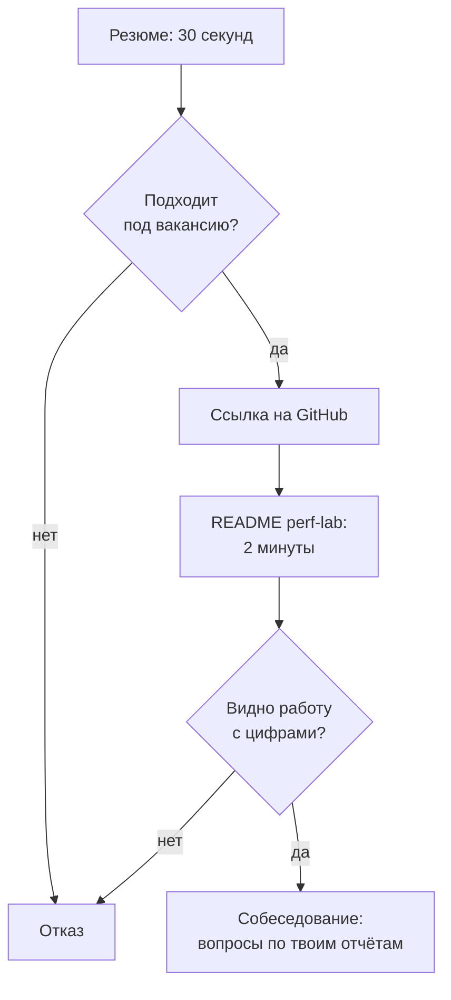

## Зачем это нужно

Я твой опытный коллега, и вот что я видел, когда помогал нанимать. На junior-позицию опыта никто не ждёт, но вопрос у работодателя один: «Что этот человек умеет на деле?» Был кандидат с отличным резюме, и я открыл его GitHub: папка с файлами `test1`, `test_final`, `test_final2` и без единого пояснения. Мы не поняли, что он умеет, и пошли дальше.

Ответить на вопрос можно двумя документами. **Резюме** (CV) это одна страница, на которой за 30 секунд видно, подходишь ли ты. **Портфолио** (portfolio) это подтверждение: репозиторий со сценариями, графиками и отчётами, где любой проверит, что написанное в резюме правда.

За двенадцать тем в `~/perf-lab` скопились сценарии Locust и k6, дашборды, отчёты, разбор инцидента и тестовое задание. Пока это папка, понятная только тебе. Её надо превратить в **витрину**, которую чужой человек поймёт за две минуты.

Шаг проекта: ты приведёшь `~/perf-lab` в порядок (README, то есть титульная страница репозитория, структура, скриншоты, чистка секретов), напишешь резюме и проверишь оба документа по чек-листу глазами работодателя.

## Что нужно знать

- Твой репозиторий `~/perf-lab` и коммиты в него: [урок 3.1](../03-git/01-git-basics.md) и далее по теме 3.
- Отчёт о тестировании: структура и графики: [урок 12.1](../12-process/01-report.md).
- Постмортем и тестовое задание, которые ты сделал: [урок 13.1](01-incident-under-load.md), [урок 13.2](02-take-home.md).
- Ёмкость и «запас до предела» как язык цифр: [урок 12.3](../12-process/03-capacity.md).

## Картина целиком

Прохожий не заходит в магазин, пока витрина не зацепила: он смотрит секунду-две. Резюме и README работают так же. Аналогия ломается в одном: у витрины нет проверяющего, а у портфолио есть. Инженер может открыть любой файл и спросить: «А как это работает?» Поэтому показывай только то, что способен объяснить.

Путь работодателя:



На каждом ромбе человек может уйти. Резюме должно пройти первый, README второй, и только потом начинается разговор. Лишняя строка в резюме или неубранный мусор в репозитории повышают шанс отказа.

## Теория

### Что показывать: три витринные работы

Работодатель, открыв репозиторий, хочет получить ответы на пять вопросов. Умеешь ли писать сценарии, смотреть метрики, находить причину, объяснять результат и работать в инциденте? У тебя на каждый есть работа: Locustfile и k6-скрипт (`09-locust/`, `10-k6/`), дашборд (`07-monitoring/`), отчёт «симптом, метрика, причина, проверка» (`11-bottlenecks/`), отчёт тестового (`13-final/take-home/`) и постмортем (`13-final/postmortem.md`).

Двадцать копий учебных скриптов только мешают. Лучше три-четыре работы, которые вместе закрывают эти пять вопросов, и путь к ним в README.

> **Главное:** не показывай всё, показывай лучшее: три-четыре работы, закрывающие пять вопросов работодателя.
{: .key}

Витрина без вывески не работает. Вывеска репозитория это README.

### README как главная страница

README (файл `README.md` в корне) GitHub показывает сразу под списком файлов, и это первое, что увидит человек. Порядок такой: одно предложение о том, что это; три ссылки на лучшие работы с результатом; как запустить; структура; ограничения. Скелет:

```text
# perf-lab: нагрузочное тестирование интернет-магазина

Лаборатория: сценарии Locust и k6, мониторинг (Prometheus, Grafana, Loki) и отчёты
по учебному стенду «Магазин». Всё запускается локально в Docker.

## Что посмотреть в первую очередь
| Работа | О чём | Результат |
| --- | --- | --- |
| [Отчёт: поиск узкого места](13-final/take-home/report.md) | Ступенчатый тест, поиск причины, проверка исправления | Предел вырос с 20 до 30 RPS |
| [Постмортем инцидента](13-final/postmortem.md) | Замедление оплаты под нагрузкой | Хронология, причина, 4 действия |
| [Сценарий покупателя](09-locust/locustfile.py) | Вход, каталог, корзина, заказ с проверками | Профиль из расчёта нагрузки |

## Как запустить
...
```

Ссылки здесь ведут внутрь твоего `perf-lab`, и каждая должна открываться. Увидев «с 20 до 30 RPS», работодатель спросит «как?» и пойдёт в отчёт. Этого ты и хочешь.

Осторожно: README это не дневник («сегодня я установил Locust…»). Дневник оставь в `notes.md` внутри папок тем.

> **Главное:** README это первое впечатление: что это, три лучшие работы с цифрой, как запустить.
{: .key}

Один хороший скриншот убеждает сильнее абзаца, если его можно понять без пояснений.

### Скриншоты, графики и отчёты

Картинка должна читаться без слов: подписаны оси и единицы, виден период, отмечены события (начало ступени, откат), лишнее (чужие вкладки, личные данные) обрезано. Один скриншот, одна мысль, и подпись говорит, на что смотреть: «p95 каталога растёт после 18:20, когда нагрузка превысила 20 RPS».

Формат PNG, ширина до 1200 пикселей, вес до 300 КБ: иначе репозиторий потяжелеет на сотни мегабайт. Храни картинки в `reports/img/` и ссылайся относительным путём: ``. Сырые результаты (`results/*.csv`) держи в `.gitignore`, оставляя только то, на что ссылается отчёт.

> **Главное:** картинка понятна без пояснений, весит мало и лежит рядом с отчётом.
{: .key}

Витрина публичная, поэтому перед открытием её нужно почистить.

### Чистка: чего не должно быть в публичном репозитории

Репозиторий видит весь мир, включая ботов, которые ищут оставленные секреты и находят их за минуты. Проверь пять вещей. Пароли, токены и ключи: команда `git grep -nEi "password|token|secret|apikey"` ищет эти слова по всем файлам репозитория (разбор ниже, в практике), а файл `.env` в `.gitignore`, в репозитории только `.env.example`. Данные реального работодателя: нужен только учебный стенд. Личные данные на скриншотах. Крупные файлы: `du -sh .git`. Мёртвый код и «пробные» файлы: удали или убери в `archive/`.

> **Прикинь сам:** ты нашёл пароль в коммите двухнедельной давности, удалил файл и сделал новый коммит. Безопасно ли это?
{: .predict}

Нет: удалённый файл остаётся в истории, и любой может открыть старый коммит. Секрет надо считать скомпрометированным и сменить. Для учебного стенда пароли вымышленные (`password`), но привычка «ничего секретного в коммите» нужна с первого дня, а не с первого работодателя.

> **Главное:** секреты не коммитят, а если коммитнули, их меняют: удаление файла историю не стирает.
{: .key}

Репозиторий готов. Теперь страница, которую увидят первой.

### Резюме без опыта: структура и достижения

Резюме junior это одна страница, которую читают сверху вниз около 30 секунд. Порядок блоков такой. Заголовок: имя, роль-цель («Инженер по нагрузочному тестированию, junior»), контакты, ссылка на GitHub. «О себе»: два-три предложения без «целеустремлённый и коммуникабельный». Навыки. Проекты: главный блок без опыта, три проекта с цифрами. Образование и курсы. Прошлую работу не из IT поставь одной строкой внизу: она показывает ответственность. Не прячь её и не раздувай.

Главная ошибка резюме: писать, что ты **делал**, а не чего **добился**. «Писал сценарии нагрузочного тестирования» напишет любой. Достижение отвечает на три вопроса: что сделал, чем и какой получился результат в цифрах.

| Обязанность (слабо) | Достижение (сильно) |
| --- | --- |
| Занимался нагрузочным тестированием | Провёл ступенчатое тестирование магазина (Locust, 5 ступеней до 40 RPS), определил предел около 20 RPS |
| Искал узкие места | Нашёл узкое место (сервис упирался в квоту одного ядра из-за bcrypt) по метрикам Prometheus, после правки предел вырос с 20 до 30 RPS |
| Участвовал в разборе инцидента | Провёл разбор инцидента под нагрузкой: хронология, причина (замедление оплаты исчерпало пул соединений), 4 действия с владельцами |

> **Прикинь сам:** перепиши «Писал отчёты» как достижение, если у тебя p95 каталога на ступени 30 RPS упал с 1,1 с до 0,16 с.
{: .predict}

Например так: «Оформил отчёт с выводом на первом экране и сравнением до и после: p95 каталога на 30 RPS с 1,1 с до 0,16 с».

Цифры бери только из своих работ: предел из ступенчатого теста ([13.2](02-take-home.md); запас до предела считали в [12.3](../12-process/03-capacity.md)), рост и p95 из прогона до и после, время обнаружения и отката из инцидента (13.1). Не округляй в свою пользу: на собеседовании спросят, как измерено. И подписывай учебное как учебное: «интернет-магазин (учебный стенд)» не обман, а доверие. Один график «до и после» заменяет абзац отчёта:

<div class="viz" data-viz="chart" data-type="bar" data-x="До исправления,После исправления" data-x-label="Состояние" data-y-label="Значение" data-explain="Два столбца на каждую метрику: предел по нагрузке вырос, а p95 каталога на ступени 30 RPS упал. Пример иллюстративный, подставь свои числа." data-series='[{"name":"Предел, RPS","values":[20,30]},{"name":"p95 каталога, с","values":[1.1,0.16]}]'></div>

Когда работодатель видит «12 против 30», он сразу понимает масштаб и спрашивает «как». Такой график стоит на первом экране витринного отчёта.

> **Главное:** пиши не обязанность, а результат: что сделал, чем, и какая цифра получилась из твоих работ.
{: .key}

Строки про достижения готовы. Что ещё вынести на ту же страницу?

### Навыки и чего не писать

Навыки это группы, которые читаются быстро, а не список всего слышанного:

```text
Нагрузочное тестирование: Locust, k6, профили нагрузки, ступенчатые и soak-тесты
Мониторинг: Prometheus, PromQL, Grafana, Loki, алерты
Окружение: Linux, bash, Docker и Compose, Git
Языки: Python (скрипты, requests, pytest), JavaScript (k6), SQL (чтение запросов, EXPLAIN)
Анализ: p95/p99, закон Литтла, поиск узкого места, отчёты
```

Пиши только то, о чём готов ответить вслух. Вписал «Kubernetes» без опыта, и тебя о нём спросят, а честное «слышал» хуже отсутствия строки. И каждая строка должна опираться на проект. Не пиши пустые слова («коммуникабельный, стрессоустойчивый»), список из тридцати технологий (хватит 8-12 подтверждённых), фото и возраст, «опыт: 0 лет» (блок «Проекты» вместо него), раздутые цифры («в 100 раз») и данные работодателя. И никаких опечаток: для тестировщика это плохой знак, он отвечает за внимание к деталям.

> **Главное:** в навыках только то, что подтверждено проектом и о чём ты готов говорить.
{: .key}

Резюме открывает дверь. А что написать в самом отклике?

### Сопроводительное письмо и подготовка к вопросам

Отклик короче резюме: три-пять предложений. На какую вакансию, чем подходишь (одно-два достижения под требования), ссылка на витринную работу, готовность к тестовому:

```text
Здравствуйте! Откликаюсь на вакансию инженера по нагрузочному тестированию.
В требованиях у вас Locust и Prometheus: в учебном проекте я провёл ступенчатое тестирование
интернет-магазина, нашёл узкое место и подтвердил исправление повторным прогоном
(предел вырос с 20 до 30 RPS). Отчёт и сценарии: <ссылка на GitHub>.
Готов выполнить тестовое задание и ответить на вопросы по моим работам.
```

Под каждую вакансию меняй два-три слова на ключевые из требований. Если в вакансии k6, а главный пример на Locust, выведи вперёд k6-сценарий.

Дальше собеседование: работодатель выберет одну строку резюме и спросит «Расскажи про этот отчёт». Заготовь для каждой работы рассказ из четырёх частей: задача, что сделал, что нашёл (с цифрой), что сделал бы иначе. Тренируйся рассказывать за две минуты вслух: именно этим заняты следующие два урока. А порядок подготовки такой:

<div class="viz" data-viz="flow" data-title="Как довести портфолио до готовности: шаги и порядок" data-steps='[{"title":"Выбери три работы","text":"Отчёт с узким местом, постмортем, сценарий покупателя. Остальное уберёшь вглубь или в архив."},{"title":"Почисти репозиторий","text":"Секреты, `.env`, крупные файлы, пробные скрипты. Проверь `git grep` по словам `password`, `token`."},{"title":"Напиши README","text":"Одно предложение, три ссылки с результатами, как запустить, структура, ограничения."},{"title":"Добавь картинки","text":"Один скриншот на мысль, оси подписаны, ширина до 1200 px."},{"title":"Напиши резюме","text":"Одна страница: роль, навыки, три проекта с цифрами, ссылка на GitHub."},{"title":"Проверь чужими глазами","text":"Открой репозиторий в режиме инкогнито и без входа, дай прочитать знакомому, засеки две минуты."}]'></div>

Порядок идёт от содержимого к упаковке: что показывать, затем чистка, оформление и проверка чужими глазами, потому что свой текст понятен только тебе.

> **Главное:** на собеседовании копают одну строку резюме, поэтому у каждой работы должен быть двухминутный рассказ с цифрой.
{: .key}

Вернёмся к распродаже: перед ней ты показываешь результат менеджеру так же, как работодателю, цифрой и ссылкой на доказательство.

## Практика

### 1. Выбери лучшие работы

```bash
cd ~/perf-lab
ls
git log --oneline | head -20
```

`ls` показывает содержимое корня репозитория, `git log --oneline` по строке на коммит (`head -20` берёт первые двадцать). Выпиши в блокнот три работы, которые отвечают на вопросы из таблицы теории: сценарий, отчёт с узким местом, постмортем. Для каждой запиши результат одной цифрой.

### 2. Проверь секреты

```bash
git grep -nEi "password|token|secret|apikey" -- ':!*.md' | head -30
git ls-files | grep -E "(^|/)\.env$" || echo ".env в git нет"
du -sh .git
```

Первая команда ищет в отслеживаемых файлах слова про секреты (кроме Markdown), `-n` показывает номер строки, `-E` включает расширенные выражения, `-i` игнорирует регистр. Вторая проверяет, не попал ли `.env` под git (`||` выполнит `echo`, если `grep` ничего не нашёл). Третья показывает размер истории.

```text
09-locust/locustfile.py:22:            json={"email": f"user{number:04d}@shop.lab", "password": "password"}) as r:
.env в git нет
4.2M	.git
```

**Как читать вывод:** строка с `"password": "password"` это учебный пароль стенда, он публичный, можно оставить. Если нашёлся настоящий пароль или ключ, смени его и убери из файла. `.env в git нет` хорошо. Размер `.git` в единицах мегабайт нормален, сотни мегабайт повод искать крупные файлы: `git ls-files | xargs du -h | sort -h | tail`.

**Типичные ошибки:** `git grep` без результатов не значит «чисто»: он ищет только в отслеживаемых файлах, а история может хранить прошлое (проверь `git log -p | grep -i token`). Файл `.env` в списке: добавь его в `.gitignore` и выполни `git rm --cached .env`.

### 3. Наведи порядок в структуре

```bash
cat .gitignore 2>/dev/null
```

В `.gitignore` должны быть строки, которые не пускают в git мусор:

```bash
cat >> .gitignore <<'EOF'
.env
.venv/
__pycache__/
results/*.csv
!results/summary*.txt
*.log
EOF
```

`.venv/` и `__pycache__/` это окружение и кэш Python, `results/*.csv` сырые данные прогонов, строка с `!` оставляет сводки. Если ранее результаты уже попали в git, выполни `git rm -r --cached results/` и закоммить. Файлы останутся на диске, но выйдут из репозитория.

### 4. Напиши README

Создай `README.md` в корне по скелету из теории. Подставь свои три работы и свои цифры:

```bash
cat > README.md <<'EOF'
# perf-lab: нагрузочное тестирование интернет-магазина

Лаборатория: сценарии Locust и k6, мониторинг (Prometheus, Grafana, Loki) и отчёты
по учебному стенду «Магазин». Всё запускается локально в Docker.

## Что посмотреть в первую очередь

| Работа | О чём | Результат |
| --- | --- | --- |
| [Отчёт по тестовому заданию](13-final/take-home/report.md) | ... | ... |
| [Постмортем инцидента](13-final/postmortem.md) | ... | ... |
| [Сценарий покупателя](09-locust/locustfile.py) | ... | ... |

## Как запустить

1. Стенд: `cd ~/load-tester/project/shop && cp .env.example .env && docker compose --profile monitoring up -d --build --wait`
2. Окружение: `python3 -m venv .venv && source .venv/bin/activate && pip install -r requirements.txt`
3. Сценарий: `locust -f 09-locust/locustfile.py --host http://localhost:8000`

Версии: Python 3.12, Locust 2.46, k6 2.3, Docker Compose.

## Структура

- `07-monitoring/` дашборды и запросы PromQL
- `09-locust/`, `10-k6/` сценарии нагрузки
- `11-bottlenecks/` разборы узких мест
- `13-final/` постмортем и тестовое задание
- `reports/` отчёты и скриншоты

## Ограничения

Стенд учебный: один хост, маленькая база. Цифры переносятся на реальные системы только как направление.
EOF
```

Замени все `...` на реальное содержимое: одно предложение «о чём» и одну цифру результата. Строка с `...` в готовом README это красный флаг: работодатель решит, что ты не закончил.

### 5. Скриншоты

Сделай два-три скриншота лучших графиков (ступенчатый тест, дашборд во время инцидента) и положи в `reports/img/`. Проверь размер:

```bash
mkdir -p reports/img
ls -lh reports/img
```

`-l` длинный формат, `-h` человеческие единицы. Если файл больше 300 КБ, уменьши его (на Mac это можно сделать в «Просмотре»: Инструменты, Настроить размер). Подключи картинки в отчёты строкой ``.

### 6. Напиши резюме

Создай файл `resume.md` (его не обязательно публиковать: это черновик, потом ты перенесёшь текст в нужный формат). Структура и пример (имя и контакты замени на свои):

```bash
cat > ~/perf-lab/resume.md <<'EOF'
# Имя Фамилия
Инженер по нагрузочному тестированию (junior) | Город, удалённо | почта | github.com/<логин>

## О себе
Прошёл практический курс нагрузочного тестирования и мониторинга. Провёл ступенчатое тестирование
учебного интернет-магазина, нашёл узкое место и подтвердил исправление повторным прогоном.
Ищу позицию junior в команде производительности или SRE.

## Навыки
- Нагрузочное тестирование: Locust, k6, профили нагрузки, ступенчатые и soak-тесты
- Мониторинг: Prometheus, PromQL, Grafana, Loki, алерты
- Окружение: Linux, bash, Docker Compose, Git
- Языки: Python (скрипты, requests, pytest), JavaScript (k6), SQL (чтение запросов)

## Проекты
**Нагрузочное тестирование интернет-магазина (учебный стенд)** | github.com/<логин>/perf-lab
- Рассчитал профиль нагрузки из бизнес-условий (20 RPS), написал сценарии на Locust и k6
- Нашёл узкое место по метрикам и профилю процесса, после исправления предел вырос с 20 до 30 RPS
- Оформил отчёт с выводом на первом экране и сравнением до и после (p95 с 1,1 с до 0,16 с)

**Мониторинг и алертинг стенда**
- Собрал дашборд (RPS, p95, ошибки, пул БД) и три алерта по SLO

**Разбор инцидента под нагрузкой**
- Воспроизвёл сбой оплаты, за 9 минут нашёл причину по метрикам, написал постмортем без обвинений с 4 действиями

## Образование и курсы
Курс «Нагрузочное тестирование и мониторинг с нуля», 2026

## Дополнительно
Английский: чтение технической документации
EOF
```

Замени числа на свои. Поменяй формулировки под лексику вакансии. Прочитай вслух: если запнулся, предложение слишком длинное.

### 7. Проверка чужими глазами

```text
Чек-лист проверки:
1. Открой репозиторий в окне инкогнито без входа в GitHub: README читается, ссылки открываются.
2. Дай резюме и ссылку знакомому: за 30 секунд он должен сказать, кто ты и что умеешь.
3. По каждой строке резюме спроси себя: «Какой файл в репозитории это подтверждает?»
4. Засеки две минуты на README: понятно ли, что лучше всего показать?
```

После правок:

```bash
git add README.md .gitignore reports
git commit -m "13.3: README, gitignore, скриншоты отчётов"
git push
```

## Сломай и почини

Намеренно создай типичные проблемы и найди их проверкой.

1. **Секрет в коммите.** Опыт ставим не в твоём `perf-lab`, а во временном репозитории: так ты не оставишь в рабочей истории лишних коммитов и не рискуешь настоящими файлами.

   ```bash
   lab=$(mktemp -d) && cd "$lab" && git init -q
   git commit -q --allow-empty -m "init"
   echo "API_KEY=test-123" > .env
   git add -f .env && git commit -qm "oops"
   git ls-files | grep .env
   ```

   Разбор: `mktemp -d` создаёт пустую временную папку и печатает её путь, `lab=$(...)` запоминает этот путь в переменной `lab`, `cd "$lab"` переходит в папку. `git commit --allow-empty` делает первый коммит без файлов. `git add -f` добавляет файл, даже если его игнорирует `.gitignore` (так секреты и попадают в историю: человек добавляет файл принудительно или до появления `.gitignore`). `git ls-files | grep .env` печатает `.env`: файл отслеживается, то есть секрет в репозитории.

   Исправление: `git rm --cached .env` (убрать файл из git, оставив на диске), строка `.env` в `.gitignore`, коммит: `git rm -q --cached .env && echo ".env" >> .gitignore && git add .gitignore && git commit -qm "fix: убрать .env"`. Затем `git log -p -- .env | head`: в истории коммит с `API_KEY=test-123` остался. Вывод: если бы это был настоящий ключ, его нужно было бы сменить, потому что удаление файла историю не стирает.

   Не пробуй «откатить» это командой `git reset --hard HEAD~1`: она отменит последний коммит, то есть коммит исправления, и `.env` снова окажется отслеживаемым. Кроме того, `--hard` стирает незакоммиченные изменения. Уборка здесь простая: удали временный репозиторий целиком командой `cd ~ && rm -rf "$lab"` (сначала выходим из папки, потом удаляем её по запомненному пути).
2. **README с заглушками.** Оставь в README три строки с `...` и попроси знакомого прочитать за две минуты. Он назовёт, что непонятно. Заполни и проверь снова.
3. **Резюме-обязанность.** Возьми одну строку «Занимался нагрузочным тестированием» и перепиши по формуле «глагол, что, чем, результат с числом». Проверь вопрос «как измерено?»: на него должен быть ответ в файле репозитория.

> Нейросеть может отредактировать резюме и README, но не придумывает за тебя опыт. Каждую строку проверь вопросом «как измерено и где лежит доказательство в репозитории?». Что ответить нечем, вычеркни.
{: .ai}

## ИИ в помощь

Нейросеть хорошо правит формулировки и выявляет пустые места в README, но опыт и цифры в резюме должны быть только твоими. Общие правила: [ИИ-помощник](../ai.md).

**Задача:** улучшить строку резюме по формуле «глагол, что, чем, результат с числом».

```text
Вот строка из моего резюме: «<вставь, например "занимался нагрузочным тестированием">».
Мои факты: <вставь: что тестировал, инструмент, предел до и после, где лежит отчёт>.
Перепиши строку по формуле «глагол, что, чем, результат с числом», используя только эти факты.
Если фактов не хватает, задай мне вопросы, а не придумывай.
```
{: .wrap}

**Проверь ответ:** каждое число и инструмент должны быть в твоём репозитории и отчёте. Типичная ошибка: нейросеть вставляет правдоподобные «увеличил пропускную способность на 40%» и технологии, которых ты не касался. Такое резюме разваливается на первом вопросе «как измерил?».

**Задача:** проверить README глазами чужого человека.

```text
Ты рекрутер-технарь, у тебя две минуты. Вот README моего репозитория: <вставь текст>. Ответь:
что это за проект, как его запустить, что я умею показать. Что осталось непонятным? Перечисли заглушки,
пропуски и места, где нет доказательств. Правки не вноси, только замечания.
```
{: .wrap}

**Проверь ответ:** после правок попроси знакомого прочитать README за две минуты, это надёжнее любой нейросети. Типичная ошибка: пересказ README в красивых словах вместо поиска дыр.

В чат не отправляй пароли, ключи, `.env`, адреса и телефон: замени на `<КЛЮЧ>`, `<ТЕЛЕФОН>`. Не пиши в резюме то, чего не делал, даже если нейросеть предложила.

## Словарик урока

| Термин | Простыми словами |
| --- | --- |
| Резюме (CV) | Страница о тебе: роль, навыки, проекты, контакты; читается около 30 секунд. |
| Портфолио (portfolio) | Подборка работ, которые подтверждают написанное в резюме; для нас это репозиторий perf-lab. |
| README | Главный файл репозитория, показывается под списком файлов. |
| Витринная работа | Лучшая, самая показательная из твоих работ, на которую ведёт ссылка из README. |
| Достижение | Результат с числом: что сделал, чем, чего добился; противоположность обязанности. |
| Обязанность | Описание «чем занимался» без результата; слабая формулировка. |
| `.gitignore` | Файл со списком того, что git не отслеживает: секреты, кэш, сырые данные. |
| Сопроводительное письмо | Короткий текст при отклике: на какую вакансию и чем подходишь. |

## Вопросы с собеседований

Раздел для повторения: ответь вслух, потом открой ответ.



## Проверено на версиях

Git 2.50, GitHub (оформление README в Markdown), Python 3.12, Locust 2.46, k6 2.3. Числа в примерах резюме и графика иллюстративные: подставь свои из своих отчётов. Октябрь 2026.

## Итог урока: ты умеешь

- [ ] Выбрать три лучшие работы под вопросы работодателя.
- [ ] Проверить репозиторий на секреты, крупные файлы и мусор и настроить `.gitignore`.
- [ ] Написать README: что это, лучшее с результатами, как запустить, структура, ограничения.
- [ ] Сделать читаемые скриншоты с подписанными осями и подписью, на что смотреть.
- [ ] Написать резюме junior на одну страницу с блоком проектов и цифрами из своих работ.
- [ ] Превратить обязанность в достижение по формуле «глагол, что, чем, результат».
- [ ] Подготовить двухминутный рассказ о каждой из лучших работ.
- [ ] Править резюме с помощью нейросети только на основе своих фактов и уметь доказать каждую строку из репозитория.

Дальше: [урок 13.4. Пробное собеседование: производительность](04-mock-perf.md).
