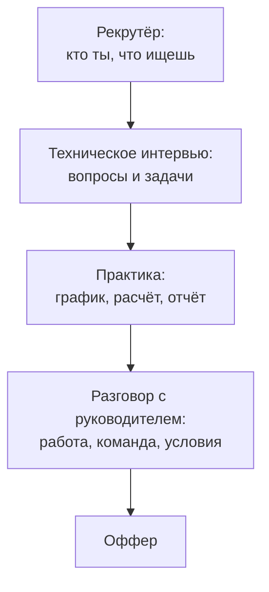

## Зачем это нужно

Я твой опытный коллега, и расскажу про своё первое собеседование. Я знал материал, но когда спросили «что такое p95», у меня во рту пересохло, и я выдал мешанину из трёх определений. Знать и уметь объяснить вслух, на время, под взглядом незнакомца это два разных навыка.

Урок тренирует **ответ вслух**: короткий, структурный, с цифрой. Ты пройдёшь пробное собеседование на роль инженера по нагрузочному тестированию: сорок один вопрос от простых фактов до задач (график, закон Литтла, отчёт), практическое задание и самооценку. Хороший ответ занимает тридцать секунд, три предложения и содержит цифру.

Шаг проекта: результатом станет файл самооценки `~/perf-lab/13-final/mock-perf.md`: какие вопросы ты отвечаешь уверенно, а какие повторить.

## Что нужно знать

Весь курс, но особенно: задержка и пропускная способность ([8.1](../08-perf-theory/01-latency-throughput.md)), очереди и закон Литтла ([8.2](../08-perf-theory/02-queues-littles-law.md)), виды тестов ([8.3](../08-perf-theory/03-test-types.md)), профиль и SLO ([8.4](../08-perf-theory/04-load-profile-slo.md)), Locust ([9.1](../09-locust/01-first-locustfile.md) - [9.5](../09-locust/05-distributed-generator.md)), k6 ([10.1](../10-k6/01-js-first-script.md) - [10.3](../10-k6/03-k6-prometheus.md)), узкие места ([11.1](../11-bottlenecks/01-method.md) - [11.5](../11-bottlenecks/05-cache-dependencies.md)), отчёт и ёмкость ([12.1](../12-process/01-report.md), [12.3](../12-process/03-capacity.md)). Если на каком-то блоке вопросов ты «плывёшь», вернись в этот урок и перечитай нужный.

## Картина целиком

Собеседование похоже на воронку. Этапы: рекрутёр, техническое интервью (вопросы и задачи вслух), иногда тестовое ([урок 13.2](02-take-home.md)), руководитель.



Вопросы проверяют, знаешь ли ты теорию и умеешь ли говорить. Практика проверяет, умеешь ли применять: прочитать график, посчитать, найти ошибку в отчёте. Теоретики теряются на задаче, а практики не умеют объяснить решение, поэтому тренируй оба режима.

## Теория

### Что слушает интервьюер

Идеального ответа интервьюер почти не ждёт. Он слушает **ход мысли** (как ты рассуждаешь): идёшь ли от симптома к причине, честен ли о границах знаний. Вопросы идут от простого к сложному. Простые («что такое p95») ищут пробелы в основе. Средние («как ты искал узкое место») проверяют опыт, пусть учебный. Сложные («что бы ты сделал, если…») смотрят, как ты думаешь, и там нормально не знать готового ответа.

> **Главное:** оценивают не только правильность, но и ход мысли.
{: .key}

Как же сделать свой ход мысли видимым?

### Структура ответа: три шага и цифра

Растерянный отвечает потоком и теряет нить. Структурный: в три шага. Первый: суть одним предложением, например «p95 это значение, ниже которого лежат 95% замеров». Второй: пример с цифрой. Запросы по 30 мс и пять из ста по 2 с дают среднее около 130 мс, а p95 покажет две секунды. Третий: зачем, «поэтому SLO формулируют по перцентилям».

На вопросы про действия нужна другая схема: цель, шаги по порядку, критерий конца. Например: «Нахожу ступень, где ломается, и смотрю, какой маршрут растёт. Потом проверяю, занят ресурс или ждёт. Гипотезу проверяю одним изменением и сравниваю до и после».

> **Прикинь сам:** тебя спросили «что такое throughput». Какие три шага ты проговоришь?
{: .predict}

Например: «Это сколько запросов система обрабатывает в секунду (суть). На моём стенде около 20 RPS до насыщения (цифра). Смотрят вместе с задержкой: на пределе она растёт, а пропускная способность встаёт (зачем)». Цифра в каждом ответе показывает, что ты работал руками, а не пересказываешь учебник.

> **Главное:** на вопрос о понятии отвечай «суть, пример с цифрой, зачем», на вопрос о действиях «цель, шаги, критерий конца».
{: .key}

Структура есть. Теперь вопрос времени.

### Как держать время

Ответ занимает 30-90 секунд: короче кажется, что ты не понимаешь, длиннее двух минут теряется нить. Если интервьюер молчит, он ждёт, добавишь ли что-то. Скажи «могу углубиться в X» и остановись. Скорость тренируется на простых вопросах. Попробуй.

<div class="viz" data-viz="final-speed-quiz" data-seconds="30" data-questions='[{"q":"Что такое p95?","a":"Значение, ниже которого лежат 95% замеров. Пример: из 100 запросов 95 быстрее этого числа, 5 медленнее. Нужен, потому что среднее прячет хвост."},{"q":"Чем latency отличается от throughput?","a":"Latency это время одного запроса, throughput это сколько запросов система обрабатывает в секунду. Пропускная способность может расти, а задержка тоже: на пределе растёт только задержка."},{"q":"Сформулируй закон Литтла.","a":"L = lambda x W: число запросов внутри системы равно скорости их прихода, умноженной на среднее время пребывания. 20 запросов в секунду по 0,5 с дают в среднем 10 запросов внутри."},{"q":"Зачем нужен smoke-тест?","a":"Быстрая проверка, что сценарий и стенд работают: один-два пользователя, минута. Дешёвая страховка перед большим прогоном."},{"q":"Чем soak-тест отличается от stress?","a":"Soak: умеренная нагрузка долго (часы), ищет утечки и деградацию. Stress: нагрузка растёт выше нормы, ищет предел и поведение при перегрузке."},{"q":"Что такое открытая и закрытая модель нагрузки?","a":"Закрытая: фиксированное число пользователей, новый запрос после ответа (Locust по умолчанию). Открытая: запросы приходят с заданной скоростью независимо от ответов (arrival rate в k6). Открытая честнее моделирует публичный сервис."},{"q":"Почему среднее время ответа обманчиво?","a":"Оно скрывает хвост: при быстрых запросах по 30 мс пять из ста по 2 секунды дают среднее лишь около 130 мс, но именно их видят пользователи. Смотри p95 и p99."},{"q":"Что делает threshold в k6?","a":"Условие пройдено или нет по метрике, например p(95)<300. Если нарушено, k6 завершается с ненулевым кодом, и CI видит провал."},{"q":"Что такое think time и зачем он?","a":"Пауза между действиями пользователя. Без неё сценарий бьёт запросами без передышки и нагружает сильнее, чем настоящие люди."},{"q":"Что такое coordinated omission?","a":"Генератор не отправляет новые запросы, пока ждёт ответ, и пропускает замеры в момент затора, поэтому занижает задержки. Помогает открытая модель."},{"q":"Назови первый шаг поиска узкого места.","a":"Найти ступень нагрузки, на которой метрика ушла за порог, и посмотреть, какой маршрут первым ухудшился."},{"q":"Почему тест должен идти на локальном стенде или с разрешения владельца?","a":"Чужую систему нагружать нельзя: это может нарушить работу и закон. Тестируют своё или с письменного согласия."}]'></div>

Вопросы выпадают случайно, таймер бежит на каждый ответ. Не успел или ошибся: отметь «не знал», итог покажет, что повторить.

> **Главное:** ответ занимает 30-90 секунд, а скорость тренируют вслух на простых вопросах.
{: .key}

Но что делать, когда ответа просто нет?

### Ответ «не знаю» и «не уверен»

Честное «не знаю» не катастрофа. Плохо замолчать или выдумывать уверенно. Хорошо сказать: **«не знаю точно, но вот как бы я рассуждал и проверил»**. Не помнишь термин: «Название не вспомню, но суть такая…». Не работал с этим: «Предположу, что…, проверил бы так…». Понял вопрос неверно: уточни «вы про X или про Y?». Не уверен в цифре: «Порядок такой, но точное значение проверил бы». Ошибся и заметил: «Поправлюсь: я сказал…, правильно…». Инженеру на работе постоянно приходится говорить «не знаю, проверю», и тот, кто делает это конструктивно, ценится выше всезнайки.

> **Главное:** на границе знаний говори «не знаю точно, но вот как бы проверил», не молчи и не выдумывай.
{: .key}

Теперь задачи, где надо говорить над картинкой.

### Как читать график вслух

Задача «прочитай график» просит описать картинку и сделать вывод. Проговаривай по порядку: что на осях, что происходит, где точка перелома, какой вывод и что проверил бы дальше.

<div class="viz" data-viz="chart" data-type="line" data-x="5,10,15,20,25,30" data-x-label="Нагрузка, RPS" data-y-label="Значение" data-explain="Классическая картина насыщения. Пропускная способность растёт вместе с нагрузкой до 20 RPS, потом выходит на потолок около 21. Задержка p95 до 20 RPS почти плоская, дальше уходит вверх: очередь растёт. Ошибки начинаются позже, когда ожидание превышает таймаут." data-series='[{"name":"Достигнуто, RPS","values":[5,10,15,20,21,21]},{"name":"p95, мс","values":[90,95,110,170,900,2800]},{"name":"Ошибки, %","values":[0,0,0,0,0.5,7]}]'></div>

Ответ: «По горизонтали нагрузка от 5 до 30 RPS, по вертикали три показателя. До 20 RPS достигнутая нагрузка идёт за заданной, p95 почти плоский: система справляется. С 20 до 25 достигнутая нагрузка встаёт на потолок около 21, а p95 растёт примерно в пять раз: это насыщение, запросы встают в очередь. На 30 появляются ошибки: ожидание превысило таймаут. Вывод: предел около 20 RPS. Дальше смотрю, какой ресурс насыщается: CPU, пул или зависимость». Здесь есть оси, перелом, вывод и следующий шаг, и в каждом предложении цифра.

С расчётами так же: главное не число, а ход. Проговаривай «дано, формула, подставляю, получаю, проверка на здравый смысл». Верный ход с ошибкой в арифметике поправим, а верное число без хода не отличить от угадывания.

> **Главное:** график и расчёт проговаривай по шагам с цифрой: ход важнее готового числа.
{: .key}

Осталось честно измерить, насколько ты готов.

### Самооценка: как честно измерить себя

Оцени каждый вопрос. Два балла: ответил вслух за 30-90 секунд, структурно, с цифрой. Один: путался, не уложился или без цифры, перечитай урок. Ноль: не смог, вернись в урок. Итог в процентах от максимума: ниже 60% повторяй материал, 60-80% нормально для junior, выше 80% ты готов. Записывай результат в `mock-perf.md`, чтобы через неделю сравнить.

> **Главное:** оценивай честно и повторяй блоки, где меньше 60%.
{: .key}

Вернёмся к распродаже: объяснить менеджеру «выдержим ли» за минуту, с цифрой, это тот же навык.

## Практика

### 1. Подготовь файл самооценки

```bash
mkdir -p ~/perf-lab/13-final
cd ~/perf-lab/13-final
cat > mock-perf.md <<'EOF'
# Самооценка: собеседование по нагрузочному тестированию

Шкала: 2 = уверенно за 30-90 с с цифрой, 1 = путался, 0 = не смог.

| Блок | Вопросы | Баллы | Что повторить |
| --- | --- | --- | --- |
| A. Основы | 1-6 | | |
| B. Виды тестов и профиль | 7-12 | | |
| C. Locust и k6 | 13-18 | | |
| D. Узкие места | 19-24 | | |
| E. Процесс и отчёт | 25-29 | | |
| F. Задачи | 30-34 | | |
| G. Поведенческие | 35-41 | | |
EOF
```

Каждую сессию добавляй строку с датой и итогом. Файл пригодится: ты увидишь динамику.

### 2. Режим «вслух и на время»

Поставь таймер на телефоне. Правила: читаешь вопрос из банка ниже, **закрываешь ответ**, говоришь вслух за 30-90 секунд, потом открываешь и сравниваешь. Записывай себя на диктофон: услышишь паразиты («ну», «как бы», «типа») и места, где теряешь нить. Первые разы это неприятно, но самый быстрый способ улучшить речь.

```bash
# Таймер на 60 секунд в терминале (звук по окончании)
sleep 60 && printf '\a время\n'
```

Команда `sleep 60` ждёт минуту, `printf '\a'` выдаёт звуковой сигнал терминала. `&&` запускает вторую часть, только если первая завершилась без ошибки.

### 3. Практическое задание вживую: прочитай отчёт

Возьми свой отчёт из урока 13.2 (`~/perf-lab/13-final/take-home/report.md`) и попроси знакомого, чтобы он выбрал **любую строку** и спросил: «Как ты это измерил?» Ответь за минуту, показав файл. Если не смог, значит, цифра в отчёте не подкреплена: допиши в отчёт ссылку на источник (файл с результатом или скриншот).

Второй вариант задания, если некому спросить: возьми сводную таблицу из `results/summary.txt` и без подглядывания проговори вслух по схеме «оси, что происходит, перелом, вывод, следующий шаг».

### 4. Пройди банк вопросов

Перейди к разделу ниже. Для каждого блока сначала проговори ответ вслух, потом сверься. Отмечай баллы в `mock-perf.md`. Не пытайся пройти все 41 вопрос за раз: в одну сессию бери один-два блока (около 20 вопросов), остальные оставь на повторение через день-два.

### 5. Сессия на время

Когда пройдёшь все блоки по разу, устрой «боевую» сессию: возьми случайные 10 вопросов (виджет выше выбирает случайно), отвечай по 30 секунд без пауз. Затем запиши итог в файл:

```bash
echo "$(date +%F): сессия на время, 10 вопросов, знал 7, слабое: закон Литтла, coordinated omission" >> ~/perf-lab/13-final/mock-perf.md
```

`$(date +%F)` подставляет дату в формате ГГГГ-ММ-ДД. Так ты видишь прогресс и понимаешь, на что тратить время повторения.

## Сломай и почини

Типичные провалы на собеседовании и как их чинить. Проверь себя: попробуй провалиться специально, чтобы запомнить, как это выглядит.

1. **Поток сознания.** Задай себе вопрос «Как найти узкое место?» и говори две минуты без плана. Запиши и послушай: где потерял нить? Почини схемой «цель, шаги по порядку, критерий конца» и перезапиши за 60 секунд.
2. **Ответ без цифры.** Ответь на «Что такое p95?» без единого числа. Теперь добавь пример «из 100 запросов 5 медленные» и сравни: насколько убедительнее?
3. **Угадывание вместо «не знаю».** Выбери вопрос, на который не знаешь ответ (например, про HTTP/3), и ответь «уверенно». Затем переделай по схеме «не знаю точно, но вот как бы проверил» и почувствуй разницу в тоне.
4. **Ответ на другой вопрос.** Попроси знакомого задать вопрос «в чём разница между нагрузкой и стрессом?» и поймать момент, когда ты отвечаешь на соседнее. Привычка переспросить «вы имеете в виду...?» исправляет это.

> Тренируй собеседование с нейросетью: попроси её быть интервьюером. Но оценивай себя сам по шкале 0-1-2 из урока, а ответы нейросети на те же вопросы сверяй с банком ниже, а не принимай на веру.
{: .ai}

## ИИ в помощь

Нейросеть может сыграть интервьюера и дать тренировку в любое время, но верить её оценке и эталонным ответам вслепую нельзя. Общие правила: [ИИ-помощник](../ai.md).

**Задача:** провести пробное собеседование.

```text
Ты технический интервьюер на позицию junior-инженера по нагрузочному тестированию. Я знаю: Locust, k6,
метрики p95 и закон Литтла, Prometheus, Grafana, разбор узких мест на учебном стенде. Задавай по одному вопросу
и жди моего ответа. После ответа скажи, что в нём было хорошего, чего не хватало (цифра, пример, зачем),
и задай уточняющий вопрос. Через 8 вопросов дай итог: сильные места и темы для повторения. Не подсказывай
ответ до моей попытки.
```
{: .wrap}

**Проверь ответ:** сверь «правильные» ответы с банком вопросов урока и с теорией. Типичные ошибки: слишком мягкая оценка («отличный ответ!») и неточности в формулах и числах, поэтому проси назвать, чего не хватило.

**Задача:** составить план повторения по итогам.

```text
Вот мои баллы по блокам вопросов (0, 1 или 2): <вставь таблицу>. Составь план повторения на неделю по дням,
по 40 минут в день. Для каждого дня: какие уроки курса перечитать и какие вопросы проговорить вслух.
```
{: .wrap}

**Проверь ответ:** сопоставь уроки с оглавлением курса: нейросеть может назвать несуществующие номера уроков. Типичная ошибка: план «выучить всё» без приоритета слабых блоков.

Не вставляй в тренировочные ответы данные реального работодателя.

## Словарик урока

| Термин | Простыми словами |
| --- | --- |
| Техническое интервью | Этап собеседования, где тебя спрашивают по теме работы и дают задачи. |
| Ход мысли | То, как ты рассуждаешь вслух: интервьюер оценивает его не меньше, чем результат. |
| Структура ответа | Порядок: суть, пример с цифрой, зачем нужно. |
| Тайм-бокс ответа | Ограничение по времени: 30-90 секунд на ответ. |
| Самооценка | Честная оценка собственных ответов по шкале 0-1-2. |
| Практическая задача | Вопрос, где надо применить знание: прочитать график, посчитать. |
| Красный флаг | Признак слабого ответа, на который интервьюер обращает внимание. |

## Вопросы с собеседований

Раздел для повторения: ответь вслух, потом открой ответ. Банк разделён на блоки от простого к сложному. Блоки A-B сдавай на скорость, блоки C-F с развёрнутым ходом мысли, блок G по схеме «ситуация, действие, результат». Баллы записывай в `mock-perf.md`.



## Проверено на версиях

Locust 2.46, k6 2.3, Prometheus 3.15, стенд «Магазин» из `project/shop`. Числа в задачах и примерах учебные. Октябрь 2026.

## Итог урока: ты умеешь

- [ ] Отвечать на технический вопрос по схеме «суть, пример с цифрой, зачем» за 30-90 секунд.
- [ ] Спокойно сказать «не знаю точно, но вот как бы проверил».
- [ ] Прочитать график вслух: оси, что происходит, перелом, вывод, следующий шаг.
- [ ] Решить расчётную задачу (закон Литтла, пул, профиль) с показом хода.
- [ ] Отличить признаки «ресурс занят» и «система ждёт» и назвать метрики для проверки.
- [ ] Объяснить каждую цифру в собственном отчёте.
- [ ] Оценить себя по шкале 0-1-2 и составить план повторения.
- [ ] Тренироваться на нейросети-интервьюере и проверять её оценки и ответы по банку вопросов.

Дальше: [урок 13.5. Пробное собеседование: инженер мониторинга](05-mock-monitoring.md).
