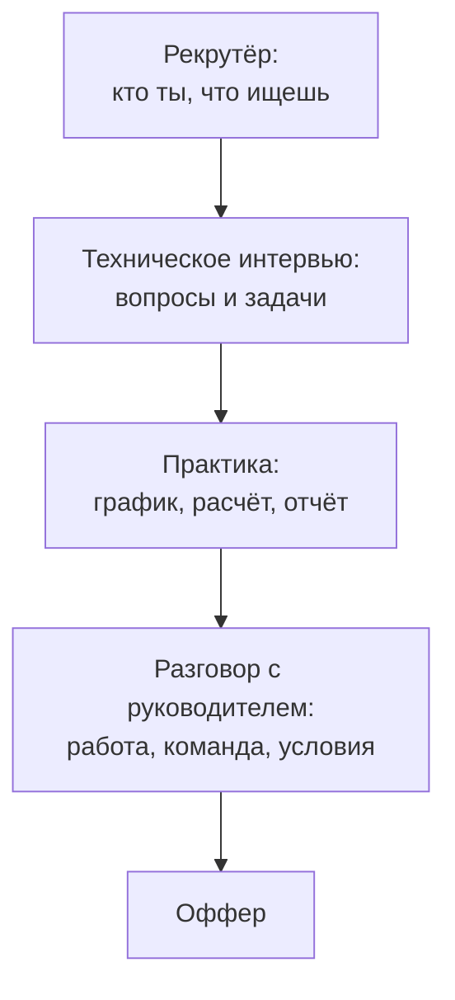

## Зачем это нужно

Знать и уметь объяснить это два разных навыка. На собеседовании ты не пишешь код в тишине, а говоришь вслух, на время, под взглядом незнакомого человека, и половина нужных слов вылетает из головы от волнения. Этот урок тренирует именно **ответ вслух**: короткий, структурный, с цифрой. Ты пройдёшь пробное собеседование на роль инженера по нагрузочному тестированию: банк из тридцати с лишним вопросов по блокам, от простых фактов до задач (прочитать график, посчитать по закону Литтла, разобрать отчёт), практическое задание и самооценку.

Работа с банком устроена как тренировка в зале: нагрузка растёт, а техника важнее веса. Если отвечаешь на вопрос расплывчато, но «в целом верно», тренировка не засчитана. Если отвечаешь за тридцать секунд тремя предложениями с цифрой, засчитана.

Шаг проекта: готовых файлов в `perf-lab` по этому уроку почти нет, результат другой: у тебя появится файл самооценки `~/perf-lab/13-final/mock-perf.md`, где отмечено, какие вопросы ты отвечаешь уверенно, а какие нужно повторить по урокам.

## Что нужно знать

Весь курс, но особенно: задержка и пропускная способность ([8.1](../08-perf-theory/01-latency-throughput.md)), очереди и закон Литтла ([8.2](../08-perf-theory/02-queues-littles-law.md)), виды тестов ([8.3](../08-perf-theory/03-test-types.md)), профиль и SLO ([8.4](../08-perf-theory/04-load-profile-slo.md)), Locust ([9.1](../09-locust/01-first-locustfile.md) - [9.5](../09-locust/05-distributed-generator.md)), k6 ([10.1](../10-k6/01-js-first-script.md) - [10.3](../10-k6/03-k6-prometheus.md)), узкие места ([11.1](../11-bottlenecks/01-method.md) - [11.5](../11-bottlenecks/05-cache-dependencies.md)), отчёт и ёмкость ([12.1](../12-process/01-report.md), [12.3](../12-process/03-capacity.md)). Если на каком-то блоке вопросов ты «плывёшь», вернись в этот урок и перечитай нужный.

## Картина целиком

Собеседование на техническую роль устроено как воронка из нескольких этапов. Раньше ты видел их из зала, теперь посмотришь из кресла кандидата. Этапы типичные: разговор с рекрутёром о тебе, техническое интервью (вопросы и задачи вслух), иногда тестовое задание (урок 13.2), разговор с руководителем о командной работе и условиях.



Что здесь видно: техническое интервью и практика это два разных режима. Вопросы проверяют, знаешь ли ты теорию и умеешь ли говорить. Практика проверяет, умеешь ли применять: прочитать график, посчитать, найти ошибку в отчёте. Тренироваться нужно в обоих режимах: многие сильные теоретики теряются на задаче, а практики не умеют объяснить своё решение.

## Теория

### Как устроено техническое интервью

Интервьюер задаёт вопросы по плану, но почти никогда не ждёт идеального ответа. Он слушает **ход мысли**: понимаешь ли ты, как устроена система, умеешь ли рассуждать от симптома к причине, честен ли ты о границах знаний. Поэтому, когда ты отвечаешь, ты помогаешь ему поставить оценку: чем яснее структура, тем проще ему тебя оценить в твою пользу.

Вопросы обычно идут от простого к сложному. Простые («что такое p95») проверяют, нет ли пробелов в основе. Средние («как ты искал узкое место») проверяют опыт, пусть учебный. Сложные («что бы ты сделал, если...») проверяют, как ты думаешь на ходу. На сложных нормально не знать готового ответа: интервьюеру важно, как ты рассуждаешь.

### Структура ответа: три шага и цифра

Растерянный кандидат отвечает потоком: говорит всё, что вспомнил, и теряет нить. Структурный отвечает по схеме, и интервьюер видит порядок в мыслях. Для большинства вопросов подходит схема из трёх шагов:

1. **Определение или суть в одно предложение.** «p95 это значение, ниже которого лежат 95% замеров».
2. **Пример или механизм с цифрой.** «Если из 100 запросов 5 медленные, среднее скажет 80 мс, а p95 покажет 2 секунды».
3. **Зачем это на практике или что путают.** «Поэтому SLO формулируют по перцентилям, а не по среднему».

На вопросы про действия («как бы ты искал узкое место») подходит другая схема: **цель, шаги по порядку, критерий конца**. «Сначала нахожу ступень, где ломается, затем смотрю, какой маршрут растёт, занят ресурс или ждёт, потом проверяю гипотезу одним изменением и сравниваю до и после».

Добавь привычку: **цифра в каждом ответе**. Цифра показывает, что ты работал руками, а не пересказываешь учебник: «на моём стенде предел был 12 RPS, после правки 30».

### Как держать время

Ответ на вопрос укладывается в 30-90 секунд. Короче 20 секунд кажется, что ты не понимаешь. Длиннее двух минут теряется нить, и интервьюер перебивает. Если интервьюер молчит после твоего ответа, это не знак, что ты ответил плохо: он обычно ждёт, добавишь ли что-то. Закончи фразой «если нужно, могу углубиться в X» и остановись. Следующий вопрос задаст он.

Тренировка скорости полезнее тренировки глубины: на простых вопросах нужна «мышечная память». Попробуй сам.

<div class="viz" data-viz="final-speed-quiz" data-seconds="30" data-questions='[{"q":"Что такое p95?","a":"Значение, ниже которого лежат 95% замеров. Пример: из 100 запросов 95 быстрее этого числа, 5 медленнее. Нужен, потому что среднее прячет хвост."},{"q":"Чем latency отличается от throughput?","a":"Latency это время одного запроса, throughput это сколько запросов система обрабатывает в секунду. Пропускная способность может расти, а задержка тоже: на пределе растёт только задержка."},{"q":"Сформулируй закон Литтла.","a":"L = lambda x W: число запросов внутри системы равно скорости их прихода, умноженной на среднее время пребывания. 20 запросов в секунду по 0,5 с дают в среднем 10 запросов внутри."},{"q":"Зачем нужен smoke-тест?","a":"Быстрая проверка, что сценарий и стенд работают: один-два пользователя, минута. Дешёвая страховка перед большим прогоном."},{"q":"Чем soak-тест отличается от stress?","a":"Soak: умеренная нагрузка долго (часы), ищет утечки и деградацию. Stress: нагрузка растёт выше нормы, ищет предел и поведение при перегрузке."},{"q":"Что такое открытая и закрытая модель нагрузки?","a":"Закрытая: фиксированное число пользователей, новый запрос после ответа (Locust по умолчанию). Открытая: запросы приходят с заданной скоростью независимо от ответов (arrival rate в k6). Открытая честнее моделирует публичный сервис."},{"q":"Почему среднее время ответа обманчиво?","a":"Оно скрывает хвост: 5% запросов по 2 секунды почти не двигают среднее, но их видят пользователи. Смотри p95 и p99."},{"q":"Что делает threshold в k6?","a":"Условие пройдено или нет по метрике, например p(95)<300. Если нарушено, k6 завершается с ненулевым кодом, и CI видит провал."},{"q":"Что такое think time и зачем он?","a":"Пауза между действиями пользователя. Без неё сценарий бьёт запросами без передышки и нагружает сильнее, чем настоящие люди."},{"q":"Что такое coordinated omission?","a":"Генератор не отправляет новые запросы, пока ждёт ответ, и пропускает замеры в момент затора, поэтому занижает задержки. Помогает открытая модель."},{"q":"Назови первый шаг поиска узкого места.","a":"Найти ступень нагрузки, на которой метрика ушла за порог, и посмотреть, какой маршрут первым ухудшился."},{"q":"Почему тест должен идти на локальном стенде или с разрешения владельца?","a":"Чужую систему нагружать нельзя: это может нарушить работу и закон. Тестируют своё или с письменного согласия."}]'></div>

Что здесь видно: вопросы выпадают в случайном порядке, таймер бежит на каждый ответ. Это формат «на скорость»: цель не идеальный ответ, а привычка отвечать за 30 секунд без «э-э». Если не успел или ответил неверно, отметь «не знал»: итог покажет, какие темы повторить.

### Ответ «не знаю» и «не уверен»

Честное «не знаю» не катастрофа, а нормальная часть собеседования. Но есть правильный и неправильный способ. Неправильный: замолчать или выдумывать. Правильный: **«не знаю точно, но вот как бы я рассуждал / проверил»**.

| Ситуация | Плохо | Хорошо |
| --- | --- | --- |
| Не помнишь термин | «Не знаю» и пауза | «Термин не вспомню, но суть такая: ...» |
| Не знаешь ответ вообще | Выдумываешь уверенно | «Не работал с этим; предположу, что..., проверил бы так: ...» |
| Понял вопрос неверно | Отвечаешь на другой вопрос | «Уточню: вы про X или про Y?» |
| Ответил и сомневаешься | Молчишь | «Не на 100% уверен в цифре, но порядок такой» |
| Ошибся и заметил | Делаешь вид | «Поправлюсь: я сказал..., правильно...» |

Принцип: интервьюер не ловит тебя на незнании, он смотрит, **как ты ведёшь себя на границе знаний**. Инженеру на работе постоянно приходится говорить «не знаю, проверю», и тот, кто делает это спокойно и конструктивно, ценится выше того, кто изображает всезнание.

### Как читать график вслух

Задачи «прочитай график» просят описать картинку и сделать вывод. Схема из четырёх шагов, которую удобно проговаривать: **что на осях, что происходит, где точка перелома, какой вывод и что проверил бы дальше**.

<div class="viz" data-viz="chart" data-type="line" data-x="5,10,15,20,25,30" data-x-label="Нагрузка, RPS" data-y-label="Значение" data-explain="Классическая картина насыщения. Пропускная способность растёт вместе с нагрузкой до 20 RPS, потом выходит на потолок около 21. Задержка p95 до 20 RPS почти плоская, дальше уходит вверх: очередь растёт. Ошибки начинаются позже, когда ожидание превышает таймаут." data-series='[{"name":"Достигнуто, RPS","values":[5,10,15,20,21,21]},{"name":"p95, мс","values":[90,95,110,170,900,2800]},{"name":"Ошибки, %","values":[0,0,0,0,0.5,7]}]'></div>

Как проговорить: «По горизонтали нагрузка от 5 до 30 RPS, по вертикали три показателя. До 20 RPS достигнутая нагрузка идёт за заданной, p95 растёт медленно: система справляется. С 20 до 25 RPS достигнутая нагрузка встаёт на потолок около 21, а p95 вырастает в пять раз: это насыщение, запросы встают в очередь. На 30 появляются ошибки: ожидание превысило таймаут. Вывод: предел около 20 RPS, дальше деградация. Дальше я бы посмотрел, какой ресурс насыщается: CPU, пул соединений или внешняя зависимость».

Что здесь видно: в проговоренном ответе есть оси, ход событий, точка перелома, вывод и следующий шаг. Каждое предложение несёт цифру. Именно так и стоит отвечать на задачи.

### Расчётные задачи: показывай ход

Если задача на расчёт (закон Литтла, пул, ёмкость), главное не число, а ход. Интервьюер не обязательно ждёт идеальной арифметики, но должен видеть, что формула выбрана верно, единицы согласованы и результат проверен на здравый смысл. Проговаривай: «Дано... Формула... Подставляю... Получаю... Проверка: порядок правдоподобен, потому что...». Если ошибся в арифметике, но ход верный, это поправимо; если число верное, а хода нет, интервьюер не может отличить знание от угадывания.

### Самооценка: как честно измерить себя

После пробной сессии оцени каждый вопрос по трёхуровневой шкале:

| Балл | Что значит | Что делать |
| --- | --- | --- |
| 2 | Ответил вслух за 30-90 секунд, структурно, с цифрой | Оставить, повторить через неделю |
| 1 | Знаю суть, но путался, не уложился или без цифры | Перечитать урок, потренировать вслух |
| 0 | Не смог ответить | Вернуться в урок, перечитать, объяснить вслух своими словами |

Итог в процентах от максимума: ниже 60% значит, что нужно повторять материал; 60-80% нормально для junior, подтяни слабые блоки; выше 80% ты готов, оставь время на практику и режим «на время». Записывай результат в `mock-perf.md`, чтобы через неделю сравнить.

## Практика

### 1. Подготовь файл самооценки

```bash
mkdir -p ~/perf-lab/13-final
cd ~/perf-lab/13-final
cat > mock-perf.md <<'EOF'
# Самооценка: собеседование по нагрузочному тестированию

Шкала: 2 = уверенно за 30-90 с с цифрой, 1 = путался, 0 = не смог.

| Блок | Вопросы | Баллы | Что повторить |
| --- | --- | --- | --- |
| A. Основы | 1-6 | | |
| B. Виды тестов и профиль | 7-12 | | |
| C. Locust и k6 | 13-18 | | |
| D. Узкие места | 19-24 | | |
| E. Процесс и отчёт | 25-29 | | |
| F. Задачи | 30-34 | | |
EOF
```

Каждую сессию добавляй строку с датой и итогом. Файл пригодится: ты увидишь динамику.

### 2. Режим «вслух и на время»

Поставь таймер на телефоне. Правила: читаешь вопрос из банка ниже, **закрываешь ответ**, говоришь вслух за 30-90 секунд, потом открываешь и сравниваешь. Записывай себя на диктофон: услышишь паразиты («ну», «как бы», «типа») и места, где теряешь нить. Первые разы это неприятно, но самый быстрый способ улучшить речь.

```bash
# Таймер на 60 секунд в терминале (звук по окончании)
sleep 60 && printf '\a время\n'
```

Команда `sleep 60` ждёт минуту, `printf '\a'` выдаёт звуковой сигнал терминала. `&&` запускает вторую часть, только если первая завершилась без ошибки.

### 3. Практическое задание вживую: прочитай отчёт

Возьми свой отчёт из урока 13.2 (`~/perf-lab/13-final/take-home/report.md`) и попроси знакомого, чтобы он выбрал **любую строку** и спросил: «Как ты это измерил?» Ответь за минуту, показав файл. Если не смог, значит, цифра в отчёте не подкреплена: допиши в отчёт ссылку на источник (файл с результатом или скриншот).

Второй вариант задания, если некому спросить: возьми сводную таблицу из `results/summary.txt` и без подглядывания проговори вслух по схеме «оси, что происходит, перелом, вывод, следующий шаг».

### 4. Пройди банк вопросов

Перейди к разделу ниже. Для каждого блока сначала проговори ответ вслух, потом сверься. Отмечай баллы в `mock-perf.md`. Не пытайся пройти все 34 вопроса за раз: два-три блока за сессию, остальное на следующий день.

### 5. Сессия на время

Когда пройдёшь все блоки по разу, устрой «боевую» сессию: возьми случайные 10 вопросов (виджет выше выбирает случайно), отвечай по 30 секунд без пауз. Затем запиши итог в файл:

```bash
echo "$(date +%F): сессия на время, 10 вопросов, знал 7, слабое: закон Литтла, coordinated omission" >> ~/perf-lab/13-final/mock-perf.md
```

`$(date +%F)` подставляет дату в формате ГГГГ-ММ-ДД. Так ты видишь прогресс и понимаешь, на что тратить время повторения.

## Сломай и почини

Типичные провалы на собеседовании и как их чинить. Проверь себя: попробуй провалиться специально, чтобы запомнить, как это выглядит.

1. **Поток сознания.** Задай себе вопрос «Как найти узкое место?» и говори две минуты без плана. Запиши и послушай: где потерял нить? Почини схемой «цель, шаги по порядку, критерий конца» и перезапиши за 60 секунд.
2. **Ответ без цифры.** Ответь на «Что такое p95?» без единого числа. Теперь добавь пример «из 100 запросов 5 медленные» и сравни: насколько убедительнее?
3. **Угадывание вместо «не знаю».** Выбери вопрос, на который не знаешь ответ (например, про HTTP/3), и ответь «уверенно». Затем переделай по схеме «не знаю точно, но вот как бы проверил» и почувствуй разницу в тоне.
4. **Ответ на другой вопрос.** Попроси знакомого задать вопрос «в чём разница между нагрузкой и стрессом?» и поймать момент, когда ты отвечаешь на соседнее. Привычка переспросить «вы имеете в виду...?» исправляет это.

## Словарик урока

| Термин | Простыми словами |
| --- | --- |
| Техническое интервью | Этап собеседования, где тебя спрашивают по теме работы и дают задачи. |
| Ход мысли | То, как ты рассуждаешь вслух: интервьюер оценивает его не меньше, чем результат. |
| Структура ответа | Порядок: суть, пример с цифрой, зачем нужно. |
| Тайм-бокс ответа | Ограничение по времени: 30-90 секунд на ответ. |
| Самооценка | Честная оценка собственных ответов по шкале 0-1-2. |
| Практическая задача | Вопрос, где надо применить знание: прочитать график, посчитать. |
| Красный флаг | Признак слабого ответа, на который интервьюер обращает внимание. |

## Вопросы с собеседований

Раздел для повторения: ответь вслух, потом открой ответ. Банк разделён на блоки от простого к сложному. Блок A-B сдавай на скорость, блоки C-F с развёрнутым ходом мысли. Баллы записывай в `mock-perf.md`.

### Блок A. Основы

### 1. [junior] [часто] В чём разница между задержкой и пропускной способностью?

<details markdown="1">
<summary>Ответ</summary>

Задержка (latency) это время одного запроса. Пропускная способность (throughput) это сколько запросов система обрабатывает в секунду. На низкой нагрузке пропускная способность растёт вместе с нагрузкой, задержка почти не меняется. На пределе пропускная способность выходит на потолок, а задержка растёт: запросы стоят в очереди.

**Что хотят услышать:** оба определения, связь через насыщение.

**Красный флаг:** считать их одним и тем же.

</details>

### 2. [junior] [часто] Что такое p95 и почему его используют вместо среднего?

<details markdown="1">
<summary>Ответ</summary>

p95 это значение, ниже которого лежат 95% замеров. Среднее прячет хвост: если 5 из 100 запросов идут по 2 секунды, среднее выглядит хорошо, а каждый двадцатый пользователь страдает. Поэтому SLO формулируют по p95 или p99.

**Что хотят услышать:** пример с цифрами, слово «хвост».

**Красный флаг:** «p95 это среднее по лучшим 95%».

</details>

### 3. [junior] Что такое RPS?

<details markdown="1">
<summary>Ответ</summary>

Requests per second: число запросов в секунду. Измеряет интенсивность нагрузки. Важно различать заданную и достигнутую нагрузку: если сервис не успевает, достигнутый RPS ниже заданного.

**Что хотят услышать:** «в секунду», разница между заданным и достигнутым.

**Красный флаг:** путать с числом пользователей.

</details>

### 4. [junior] Что такое насыщение (saturation)?

<details markdown="1">
<summary>Ответ</summary>

Состояние, когда ресурс (CPU, пул соединений, диск) занят почти полностью и не может принять больше работы. Признак: нагрузка растёт, а пропускная способность нет, задержка уходит вверх. Из-за насыщения график «хоккейная клюшка».

**Что хотят услышать:** признаки на графике и пример ресурса.

**Красный флаг:** «система просто тормозит».

</details>

### 5. [junior] Чем нагрузочное тестирование отличается от функционального?

<details markdown="1">
<summary>Ответ</summary>

Функциональное проверяет, что система делает правильно (результат). Нагрузочное проверяет, как быстро и стабильно она это делает при многих запросах. Функциональный тест один запрос и проверка ответа, нагрузочный много запросов и метрики времени и ошибок.

**Что хотят услышать:** «правильно» против «быстро и стабильно под нагрузкой».

**Красный флаг:** «это одно и то же, только больше запросов».

</details>

### 6. [на скорость] Что такое SLO?

<details markdown="1">
<summary>Ответ</summary>

Цель по качеству сервиса в числах: например, p95 меньше 300 мс и ошибок меньше 1%. По нему решают, прошёл ли тест.

**Что хотят услышать:** измеримая цель.

**Красный флаг:** «ориентир без цифр».

</details>

### Блок B. Виды тестов и профиль нагрузки

### 7. [junior] [часто] Перечисли виды нагрузочных тестов и зачем каждый.

<details markdown="1">
<summary>Ответ</summary>

Smoke: быстрая проверка, что всё работает. Load: ожидаемая нагрузка, проверка SLO. Stress: нагрузка выше нормы, поиск предела. Soak: умеренная нагрузка долго, поиск утечек. Spike: резкий скачок, проверка реакции на всплеск.

**Что хотят услышать:** пять видов и цель каждого.

**Красный флаг:** «load и stress одно и то же».

</details>

### 8. [junior] Как ты выбираешь нагрузку для теста?

<details markdown="1">
<summary>Ответ</summary>

Перевожу бизнес-условия в RPS: сессии в пиковый час делю на 3600, умножаю на пик внутри часа и запас на рост, затем на число операций в сессии. Допущения называю явно. Лучше брать реальные данные из логов или метрик, если они есть.

**Что хотят услышать:** расчёт, запас, допущения.

**Красный флаг:** «взял 100 пользователей».

</details>

### 9. [junior] Что такое think time?

<details markdown="1">
<summary>Ответ</summary>

Пауза между действиями пользователя. Реальный человек читает страницу, а не стреляет запросами подряд. Без think time нагрузка получается завышенной, а профиль неестественным.

**Что хотят услышать:** смысл паузы и влияние на нагрузку.

**Красный флаг:** «лишняя задержка, лучше убрать».

</details>

### 10. [middle] Открытая и закрытая модели нагрузки: в чём разница?

<details markdown="1">
<summary>Ответ</summary>

Закрытая: фиксированное число пользователей, каждый шлёт новый запрос после ответа. Если система замедлилась, поток запросов сам уменьшается. Открытая: запросы приходят с заданной скоростью независимо от ответов, как в публичном сервисе. При замедлении очередь копится. Открытая честнее для публичных систем, закрытая ближе к внутренним с ограниченным числом клиентов.

**Что хотят услышать:** обратная связь, пример, когда какую.

**Красный флаг:** не знать, что закрытая модель «скрывает» перегрузку.

</details>

### 11. [middle] Как ты определяешь длительность ступени и теста?

<details markdown="1">
<summary>Ответ</summary>

Ступень не меньше нескольких минут: надо пройти прогрев, а метрики собираются с шагом (скрейп 15 секунд, окно `rate` минута). Значимы последние минуты ступени. Для soak часы: утечки видны на длинной дистанции.

**Что хотят услышать:** прогрев и шаг метрик.

**Красный флаг:** «30 секунд хватит».

</details>

### 12. [на скорость] Зачем нужен smoke перед большим прогоном?

<details markdown="1">
<summary>Ответ</summary>

Проверить за минуту, что сценарий и стенд работают, прежде чем тратить час на большой прогон.

**Что хотят услышать:** дешёвая страховка.

**Красный флаг:** «лишний шаг».

</details>

### Блок C. Locust и k6

### 13. [junior] [часто] Как в Locust описывается поведение пользователя?

<details markdown="1">
<summary>Ответ</summary>

Классом, наследующим `HttpUser`, с задачами `@task` (методы, в которых вызывается `self.client.get/post`) и паузой `wait_time`. Веса задач задают долю операций. `on_start` выполняется при запуске пользователя (например, вход).

**Что хотят услышать:** `HttpUser`, `@task`, `wait_time`, `on_start`.

**Красный флаг:** «пишу цикл запросов в скрипте».

</details>

### 14. [junior] Как проверить в сценарии, что ответ правильный, а не просто 200?

<details markdown="1">
<summary>Ответ</summary>

В Locust: `catch_response=True` и явная пометка `r.failure(...)` при неверном теле или статусе. В k6: `check(res, {...})`. Иначе тест считает успехом пустую страницу или ответ с ошибкой в теле.

**Что хотят услышать:** проверка тела и статуса.

**Красный флаг:** «проверяю только статус 200».

</details>

### 15. [junior] Как запустить Locust без интерфейса и сохранить результат?

<details markdown="1">
<summary>Ответ</summary>

`locust -f locustfile.py --host URL --headless -u 10 -r 2 -t 5m --csv results/run`: 10 пользователей, прирост 2 в секунду, 5 минут, CSV-файлы с результатами.

**Что хотят услышать:** флаги `--headless`, `-u`, `-r`, `-t`, `--csv`.

**Красный флаг:** «только через браузер».

</details>

### 16. [middle] Что такое threshold в k6 и зачем?

<details markdown="1">
<summary>Ответ</summary>

Условие прохождения по метрике, например `http_req_duration: ['p(95)<300']`. Если нарушено, k6 завершается с ненулевым кодом, и CI видит провал. Это превращает тест из «посмотреть» в автоматическую проверку SLO.

**Что хотят услышать:** критерий проходит или нет, код выхода, CI.

**Красный флаг:** «просто вывод в консоль».

</details>

### 17. [middle] Locust или k6: когда что?

<details markdown="1">
<summary>Ответ</summary>

Locust: сценарии на Python, удобно, если команда пишет на Python, гибкие сложные пользовательские пути. k6: сценарии на JavaScript, лёгкий и быстрый генератор на Go, встроенные пороги, открытая модель (arrival rate), экспорт в Prometheus. Выбор зависит от команды, нагрузки и интеграции с CI.

**Что хотят услышать:** обоснованный выбор, не догма.

**Красный флаг:** «лучше тот, что я знаю, и не важно почему».

</details>

### 18. [middle] Как понять, что узкое место в генераторе нагрузки?

<details markdown="1">
<summary>Ответ</summary>

Смотрю загрузку CPU генератора: если близко к 100%, а RPS не растёт и у сервиса ресурсы свободны, то упёрлись в генератор. Проверяю несколькими процессами или воркерами (распределённый Locust): если RPS вырос, это был генератор.

**Что хотят услышать:** метрики генератора, проверка экспериментом.

**Красный флаг:** «если RPS не растёт, сервер слабый».

</details>

### Блок D. Узкие места

### 19. [junior] [часто] Как ты ищешь узкое место?

<details markdown="1">
<summary>Ответ</summary>

Нахожу ступень, где ломается; смотрю, какой маршрут первым ухудшился; определяю, ресурс занят (CPU) или система ждёт (пул, база, зависимость); смотрю конкретные метрики; проверяю гипотезу одним изменением и сравниваю до и после.

**Что хотят услышать:** порядок от дешёвых проверок к дорогим, эксперимент.

**Красный флаг:** «сразу лезу в код».

</details>

### 20. [middle] Задержка растёт, CPU низкий. Что это может быть?

<details markdown="1">
<summary>Ответ</summary>

Система ждёт, а не считает. Кандидаты: пул соединений к базе исчерпан, медленная внешняя зависимость (оплата), блокировки в базе, диск или сеть. Проверяю `shop_db_pool_waiting`, длительность запросов к зависимостям, `pg_stat_activity`.

**Что хотят услышать:** «ждёт», список кандидатов и метрик.

**Красный флаг:** «значит сервер слабый, добавить CPU».

</details>

### 21. [middle] Что такое N+1 и как его найти?

<details markdown="1">
<summary>Ответ</summary>

Один запрос за списком и ещё N запросов по одному на каждый элемент. На небольших данных не заметно, на больших база тонет в мелких запросах. Находят по числу запросов на один HTTP-запрос (`pg_stat_statements`, логи) и лечат JOIN или пакетной выборкой.

**Что хотят услышать:** суть и признак в метриках.

**Красный флаг:** не уметь отличить от медленного одного запроса.

</details>

### 22. [middle] Как ты ищешь утечку памяти?

<details markdown="1">
<summary>Ответ</summary>

Длинный soak-тест при постоянной нагрузке и график памяти процесса: рост без возврата означает утечку. Затем сужаю по маршрутам и смотрю профиль памяти. Отличаю от кэша, который растёт до предела и останавливается.

**Что хотят услышать:** длинный тест, форма графика, отличие от кэша.

**Красный флаг:** «по короткому прогону».

</details>

### 23. [middle] Почему нельзя менять несколько параметров за раз?

<details markdown="1">
<summary>Ответ</summary>

Не поймёшь, что помогло и не навредило ли что-то другое. Меняю одно, повторяю ту же ступень, сравниваю таблицу до и после. Исключение: несколько мер, которые заранее считаются одним пакетом.

**Что хотят услышать:** контролируемый эксперимент.

**Красный флаг:** «подкрутил всё, стало лучше».

</details>

### 24. [на скорость] Что показывает рост `shop_db_pool_waiting`?

<details markdown="1">
<summary>Ответ</summary>

Запросы стоят в очереди за соединением: пул исчерпан, узкое место в пуле или в том, кто долго держит соединения.

**Что хотят услышать:** очередь за соединением.

**Красный флаг:** «база упала».

</details>

### Блок E. Процесс и отчёт

### 25. [junior] [часто] Что должно быть в отчёте о нагрузочном тесте?

<details markdown="1">
<summary>Ответ</summary>

Вывод сверху (что выдерживает, где ломается и почему, что рекомендуем), цель и критерии, метод (профиль, ступени), результаты (таблица и график), узкое место с доказательствами, рекомендации, проверка исправления до и после, ограничения, как повторить.

**Что хотят услышать:** вывод первым, доказательства, ограничения.

**Красный флаг:** «графики и логи».

</details>

### 26. [middle] Как встроить нагрузочный тест в CI?

<details markdown="1">
<summary>Ответ</summary>

Короткий smoke или load-тест на каждый merge с порогами (threshold): провал блокирует выпуск. Долгие тесты по расписанию (ночью). Результаты сохраняю как артефакты и сравниваю с прошлым прогоном.

**Что хотят услышать:** пороги, разделение быстрых и долгих.

**Красный флаг:** «гоню часовой тест на каждый коммит».

</details>

### 27. [middle] Что такое ёмкость (capacity) и как её оценить?

<details markdown="1">
<summary>Ответ</summary>

Максимальная нагрузка, при которой система укладывается в SLO. Определяю ступенчатым тестом: последняя ступень до нарушения критерия. Запас: ожидаемая нагрузка с коэффициентом роста и пика, сравниваю с ёмкостью, считаю запас.

**Что хотят услышать:** критерий, ступенчатый тест, запас.

**Красный флаг:** «максимальный RPS, который удалось выжать».

</details>

### 28. [middle] Результат теста плохой, а сроки поджимают. Что делаешь?

<details markdown="1">
<summary>Ответ</summary>

Не скрываю. Сообщаю вывод с цифрами, показываю узкое место и варианты (быстрое смягчение и системное исправление) с оценкой эффекта и стоимости. Решение о сроках принимает владелец продукта, моя задача дать ему данные.

**Что хотят услышать:** честность, варианты, цифры.

**Красный флаг:** «подправил тест, чтобы прошёл».

</details>

### 29. [на скорость] Три предложения вывода отчёта: из чего состоят?

<details markdown="1">
<summary>Ответ</summary>

Что выдерживает, где и почему ломается, что рекомендуем и какой эффект.

**Что хотят услышать:** три части.

**Красный флаг:** «введение, цель, метод».

</details>

### Блок F. Задачи

### 30. [middle] Задача: в пуле 8 соединений, оплата отвечает за 0,4 с, заказов приходит 25 в секунду. Справится ли пул?

<details markdown="1">
<summary>Ответ</summary>

Соединение занято около 0,4 с, пул пропускает 8 / 0,4 = 20 заказов в секунду. Приходит 25, значит очередь растёт: пул перегружен. Нужно либо уменьшить время удержания (вынести оплату из транзакции), либо увеличить пул (с оглядкой на лимит базы), либо ограничить поток.

**Что хотят услышать:** формула, число, вывод, варианты.

**Красный флаг:** «увеличить пул вдвое» без расчёта.

</details>

### 31. [middle] Задача (закон Литтла): сервис обрабатывает 40 запросов в секунду, среднее время запроса 0,25 с. Сколько запросов в среднем внутри системы?

<details markdown="1">
<summary>Ответ</summary>

L = λ x W = 40 x 0,25 = 10 запросов. Если время вырастет до 1 с при той же нагрузке, внутри окажется 40: система не справится, если рабочих мест меньше.

**Что хотят услышать:** формула, число, смысл.

**Красный флаг:** не знать формулу.

</details>

### 32. [middle] Задача (график): RPS вышел на плато, p95 растёт, ошибок нет, CPU сервиса 30%. Что скажешь?

<details markdown="1">
<summary>Ответ</summary>

Насыщение не по CPU: система ждёт. Кандидаты: пул БД, внешняя зависимость, блокировки. Проверю `shop_db_pool_waiting`, длительность вызовов оплаты, активные запросы в базе. Ошибок нет, потому что ожидание ещё не дошло до таймаута.

**Что хотят услышать:** вывод из сочетания признаков, следующий шаг.

**Красный флаг:** «добавить CPU».

</details>

### 33. [middle] Задача (расчёт профиля): 6000 сессий в час, пик 1,5x, запас 2x, в сессии 4 запроса. Какой RPS?

<details markdown="1">
<summary>Ответ</summary>

Сессий в секунду: 6000 / 3600 x 1,5 x 2 = 5. Запросов: 5 x 4 = 20 RPS. Называю допущения (пик и запас) и предлагаю проверить по реальным логам.

**Что хотят услышать:** шаги вычисления, допущения.

**Красный флаг:** число без хода.

</details>

### 34. [middle] Задача (разбор отчёта): в отчёте «p95 стало лучше, поэтому исправление помогло», графика нет. Что скажешь?

<details markdown="1">
<summary>Ответ</summary>

Недоказуемо: нет цифр, условий и сравнения. Попрошу таблицу до и после при одинаковых условиях (ступени, длительность, конфигурация), разброс между прогонами, что именно изменено. Без этого нельзя исключить влияние шума или другого фактора.

**Что хотят услышать:** требование доказательств, различие «стало» и «доказано».

**Красный флаг:** «верю на слово».

</details>

## Проверено на версиях

Locust 2.46, k6 2.3, Prometheus 3.15, стенд «Магазин» из `project/shop`. Числа в задачах и примерах учебные. Октябрь 2026.

## Итог урока: ты умеешь

- [ ] Отвечать на технический вопрос по схеме «суть, пример с цифрой, зачем» за 30-90 секунд.
- [ ] Спокойно сказать «не знаю точно, но вот как бы проверил».
- [ ] Прочитать график вслух: оси, что происходит, перелом, вывод, следующий шаг.
- [ ] Решить расчётную задачу (закон Литтла, пул, профиль) с показом хода.
- [ ] Отличить признаки «ресурс занят» и «система ждёт» и назвать метрики для проверки.
- [ ] Объяснить каждую цифру в собственном отчёте.
- [ ] Оценить себя по шкале 0-1-2 и составить план повторения.

Дальше: [урок 13.5. Пробное собеседование: инженер мониторинга](05-mock-monitoring.md).
