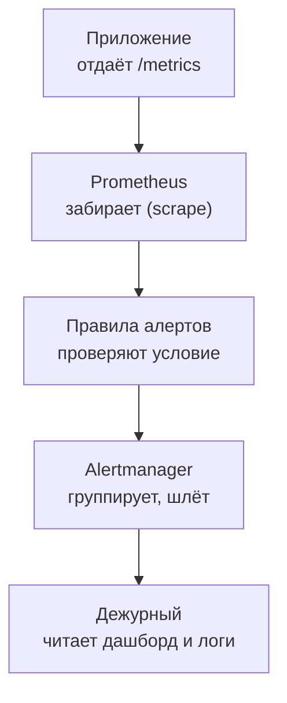

## Зачем это нужно

Я расскажу, как однажды на разборе меня спросили: «Алерт сработал в три ночи. Как ты поймёшь, что это не ложная тревога?» Я начал перечислять названия инструментов, а надо было идти от симптома к причине по приборам. С тех пор на такие вопросы я отвечаю маршрутом, а не списком.

Вторая роль, на которую ты можешь претендовать после курса, это **инженер мониторинга** (monitoring engineer, часто часть команды SRE): он настраивает сбор метрик, строит дашборды и пишет алерты, чтобы система была видна. На собеседовании на эту роль меньше говорят про генераторы нагрузки и больше про метрики, PromQL (язык запросов к метрикам, [урок 7.2](../07-observability/02-promql.md)), алерты и чтение картины инцидента. Тебе, нагрузочнику, это пригодится: в небольших командах нагрузку и мониторинг ведёт один человек, а результат теста всё равно читают по графикам. В уроке банк из 35 вопросов (двенадцать самых быстрых вынесены в тренажёр ниже), задачи на запросы и дашборд, практическое задание вживую и самооценка.

Шаг проекта: файл `~/perf-lab/13-final/mock-monitoring.md` с самооценкой и твоя шпаргалка запросов PromQL, которые ты пишешь по памяти.

## Что нужно знать

- Метрики, Prometheus и модель pull: [7.1](../07-observability/01-metrics-prometheus.md), PromQL: [7.2](../07-observability/02-promql.md), Grafana: [7.3](../07-observability/03-grafana.md), экспортеры: [7.4](../07-observability/04-exporters.md), логи Loki: [7.5](../07-observability/05-logs-loki.md), алерты: [7.6](../07-observability/06-alerts-incidents.md).
- Теория производительности: [8.1](../08-perf-theory/01-latency-throughput.md), [8.2](../08-perf-theory/02-queues-littles-law.md).
- Инцидент под нагрузкой и постмортем: [13.1](01-incident-under-load.md).
- Техника ответа вслух, «не знаю», самооценка: [13.4](04-mock-perf.md): прочитай «Теорию» оттуда, она общая.

## Картина целиком

Инженер мониторинга похож на диспетчера аэропорта: десятки сигналов, из которых надо быстро собрать картину. Но у диспетчера приборы готовые, а инженер сам решает, какие приборы поставить, и отвечает за то, чтобы они не врали. Главное качество здесь умение **идти от симптома к причине по приборам**. Интервьюер часто просит: «опиши по шагам путь от метрики до сообщения дежурному».



Метрики Prometheus забирает сам, приходя на `/metrics` (модель pull). Для коротких заданий, которые заканчиваются до его прихода, есть Pushgateway: приёмник, куда задание само отправляет метрики. В «Магазине» он не нужен. Пять звеньев, и каждое может сломаться. Приложение не отдаёт метрику, Prometheus не достучаться, правило ошиблось в условии, Alertmanager заглушил, человек не заметил. Хороший ответ на «что может пойти не так с алертингом» проходит по этой цепочке.

## Теория

### Чего ждёт интервьюер

Нанимающий проверяет три вещи. Знаешь ли ты **модель метрик**: типы (счётчик, измеритель, гистограмма) и метки (labels). Умеешь ли читать и писать запросы PromQL и объяснять их по частям. Способен ли рассуждать об алертах: что считать симптомом, какой порог, чтобы не будить людей зря и не пропустить беду.

Беседа идёт по плану: десять минут о тебе, двадцать вопросов по метрикам и Prometheus, десять задача на дашборд или запрос, десять про алерты и инциденты. Банк ниже следует тому же порядку. Технику ответа вслух, «не знаю» и самооценку мы разобрали в [13.4](04-mock-perf.md), здесь она та же.

> **Главное:** на интервью проверяют модель метрик, PromQL и рассуждения об алертах.
{: .key}

Начнём с рамки, без которой дашборд читать страшно.

### Как читать дашборд: RED и USE

Тебя просят «прочитай дашборд», и без рамки ты начнёшь метаться между панелями. Рамок две, и обе давно знакомы по [уроку 7.3](../07-observability/03-grafana.md). **RED** для сервиса: Rate (сколько запросов), Errors (сколько ошибок), Duration (сколько времени, p95). **USE** для ресурсов: Utilization (занятость), Saturation (очередь, ожидание), Errors.

Порядок такой. Сначала RED верхнего уровня: болит ли пользователь, то есть растут ли ошибки и задержка. Потом USE: какой ресурс перегружен. Попробуй сам.

<div class="viz" data-viz="obs-dashboard" data-scenario="payment" data-title="Дашборд: что сломалось"></div>

В сценарии «медленная оплата» по первым панелям причина не видна: p95 вырос, ошибок нет, ресурсы в норме, надо идти к панели оплаты. Переключай сценарии на странице [демо виджетов](../viz-demo.md) и каждый раз проговаривай: что болит у пользователя, какой ресурс виноват, чем подтвердить.

> **Прикинь сам:** p95 вырос с 0,3 до 2 с, доля ошибок 0%, CPU 30%. Что проверишь первым?
{: .predict}

Ресурс не перегружен, пользователь страдает, а значит, система чего-то ждёт: пул соединений (`shop_db_pool_waiting`) или внешний вызов оплаты. Осторожно: «CPU в норме, значит, всё хорошо» неверно, бывают задержки без загрузки процессора.

> **Главное:** сначала RED (болит ли пользователь), потом USE (какой ресурс виноват).
{: .key}

Рамка есть, теперь запросы, которые просят написать.

### Как писать PromQL вслух

Просят «напиши запрос», и главное не молчать. Говори по шагам: «Метрика такая, это счётчик, значит, беру `rate` за пять минут. Нужны ошибки, фильтрую по метке `status`. Суммирую по маршруту». Частые ошибки: `rate` от гистограммы без `histogram_quantile`; `sum` до `rate` (после перезапуска одного экземпляра сумма «проваливается», и `rate` принимает это за сброс: сначала `rate`, потом `sum`); забытое `by (le)` в квантиле. Проговаривание показывает, что ты понимаешь, а не вспоминаешь шаблон.

Учить запросы как стихи не надо: держи в голове четыре вопроса. «Сколько запросов и куда?», «Какая доля ломается?», «Насколько медленно?», «Кто стоит в очереди?» К каждому свой шаблон:

```text
# RPS по маршрутам
sum by (route) (rate(http_requests_total[5m]))

# Доля ошибок 5xx
sum(rate(http_requests_total{status=~"5.."}[5m])) / sum(rate(http_requests_total[5m]))

# p95 задержки
histogram_quantile(0.95, sum by (le) (rate(http_request_duration_seconds_bucket[5m])))

# Очередь за соединением БД
shop_db_pool_waiting
```

`rate(...[5m])` берёт счётчик за пять минут и делает скорость в секунду. `sum by (route)` складывает серии, оставляя метку `route`. Выражение `5..` в `status=~` ловит три символа, начинающиеся с пятёрки. В `histogram_quantile` корзины (бакеты) складываются по метке `le`, иначе квантиль считать не из чего.

> **Главное:** называй метрику, тип, функцию и фильтр по очереди, а не вспоминай запрос целиком.
{: .key}

Запросы есть, значит, можно решать, на какие из них вешать алерты.

### Алерты: симптом или причина

Тебя спросят: «Какие алерты ты поставишь на сервис?» Хороший ответ различает **симптомные** алерты (пользователь страдает: ошибки, задержка) и **причинные** (ресурс подходит к пределу: пул, диск, память). Симптомные будят человека, причинные чаще предупреждают днём. Пример на «Магазине»:

| Алерт | Тип | Условие | for | Реакция |
| --- | --- | --- | --- | --- |
| Доля 5xx выше 5% | симптом | `sum(rate(...{status=~"5.."}[5m])) / sum(rate(...[5m])) > 0.05` | 2 мин | Страница дежурному |
| p95 каталога выше 1 с | симптом | `histogram_quantile(...) > 1` | 5 мин | Страница |
| Очередь за пулом растёт | причина | `shop_db_pool_waiting > 0` | 1 мин | Сообщение в канал |
| Оплата медленнее 1 с | причина | p95 `shop_payment_duration_seconds` выше 1 с | 5 мин | Сообщение в канал |

Параметр `for` задаёт, сколько условие должно держаться, прежде чем алерт сработает. Очередь пула сама не «мигает», ей хватает минуты, а задержка и доля ошибок скачут, им нужно две-пять. Он убирает ложные срабатывания от коротких всплесков. Слишком длинный `for` задерживает обнаружение, слишком короткий превращает алерт в шум. Хороший алерт отвечает дежурному на четыре вопроса: что случилось, кого касается, куда смотреть, что делать (ссылка на инструкцию).

Осторожно: «много алертов значит надёжно». Много алертов дают усталость от алертов (alert fatigue): люди перестают реагировать. Пять осмысленных лучше пятидесяти шумных.

> **Главное:** будят людей симптомами, а причины идут днём и в канал.
{: .key}

Остаётся ловушка, на которой проверяют опыт.

### Кардинальность и три источника сигнала

Добавь метку `user_id` в счётчик запросов при миллионе пользователей, и Prometheus заведёт миллион серий и упрётся в память. **Кардинальность** (cardinality) это число уникальных сочетаний значений меток. Поэтому в метках держат ограниченные значения (`route`, `method`, `status`), а идентификаторы живут в логах и трассах.

Три источника дополняют друг друга. Метрики отвечают «сколько и когда» и годятся для алертов. Логи отвечают «что именно произошло» с конкретным запросом. Трассы показывают путь запроса через сервисы и время на каждом участке ([урок 7.7](../07-observability/07-traces.md)). Хороший ответ их связывает: по метрике видишь рост ошибок, по логам с `request_id` находишь запросы, а по `trace_id` из лога открываешь трейс.

> **Главное:** в метках только ограниченные значения, идентификаторы идут в логи и трассы.
{: .key}

Теперь самый частый вопрос: расскажи про инцидент.

### Как рассказывать про инцидент

«Расскажи про сбой, который ты разбирал»: у тебя есть материал из [урока 13.1](01-incident-under-load.md). Схема: что видели (симптом с цифрой), как нашли причину (метрики, потом логи), что сделали (сначала смягчение, потом исправление), чему научились (действия постмортема). Рассказывай без обвинений: «замедлилась оплата», а не «кто-то сломал». Это тоже проверка зрелости.

Распродажа близко, и я прошу тебя повторить эту схему вслух на своём инциденте, пока не уложишься в две минуты. Отдельно считай блок задач: если «плывёшь» в PromQL, вернись к [уроку 7.2](../07-observability/02-promql.md) и напиши десять запросов руками на живом Prometheus.

<div class="viz" data-viz="final-speed-quiz" data-seconds="40" data-questions='[{"q":"Назови типы метрик Prometheus.","a":"Counter (только растёт, например число запросов), gauge (может расти и падать, например память), histogram (распределение значений по бакетам, например время ответа), summary (квантили на стороне приложения)."},{"q":"Что делает rate?","a":"Берёт счётчик за окно и считает среднюю скорость роста в секунду. Пример: rate(http_requests_total[5m]) это запросов в секунду за пять минут."},{"q":"Что такое label и кардинальность?","a":"Label это пара ключ-значение, которая делит метрику на серии. Кардинальность это число уникальных серий. Идентификатор пользователя в метке даст миллионы серий и убьёт Prometheus."},{"q":"Pull или push в Prometheus?","a":"Pull: Prometheus сам приходит за метриками на /metrics с заданным интервалом (scrape). Push нужен для коротких заданий через Pushgateway."},{"q":"Как посчитать p95 из гистограммы?","a":"histogram_quantile(0.95, sum by (le) (rate(имя_bucket[5m])))."},{"q":"Что делает параметр for в алерте?","a":"Условие должно держаться заданное время, прежде чем алерт сработает. Убирает ложные срабатывания от коротких всплесков."},{"q":"Зачем Alertmanager, если алерты считает Prometheus?","a":"Alertmanager группирует, подавляет дубли, направляет в нужный канал, поддерживает тишину (silence) и маршрутизацию."},{"q":"Что такое RED?","a":"Rate, Errors, Duration: три показателя сервиса. Сколько запросов, сколько ошибок, сколько времени."},{"q":"Что такое USE?","a":"Utilization, Saturation, Errors: занятость, очередь и ошибки ресурса (CPU, диск, пул)."},{"q":"Что такое exporter?","a":"Программа, которая берёт метрики из системы, не умеющей отдавать их сама (ОС, база), и публикует в формате Prometheus на /metrics. Например node-exporter, postgres-exporter."},{"q":"Чем метрики отличаются от логов?","a":"Метрики это числа во времени: дёшево, для алертов и трендов. Логи это события с подробностями: дороже, для разбора конкретного случая."},{"q":"Что такое alert fatigue?","a":"Усталость от алертов: слишком много шума, люди перестают реагировать. Лечится меньшим числом осмысленных алертов."}]'></div>

Вопросы по мониторингу, таймер 40 секунд: ответы чуть длиннее, чем в нагрузочных.

## Практика

### 1. Файл самооценки

```bash
cd ~/perf-lab/13-final
cat > mock-monitoring.md <<'EOF'
# Самооценка: собеседование по мониторингу

Шкала: 2 = уверенно за 30-90 с с цифрой, 1 = путался, 0 = не смог.

| Блок | Вопросы | Баллы | Что повторить |
| --- | --- | --- | --- |
| A. Основы метрик | 1-6 | | |
| B. Prometheus и PromQL | 7-12 | | |
| C. Grafana и экспортеры | 13-17 | | |
| D. Логи и алерты | 18-23 | | |
| E. Инциденты и процесс | 24-27 | | |
| F. Задачи | 28-34 | | |
EOF
```

### 2. Шпаргалка запросов: напиши руками

Подними стенд с мониторингом (если не поднят) и открой Prometheus по адресу `http://localhost:9090`. Запусти нагрузку на минуту, чтобы были данные:

```bash
cd ~/load-tester/project/shop && docker compose --profile monitoring up -d --wait
source ~/perf-lab/.venv/bin/activate
locust -f ~/perf-lab/09-locust/locustfile.py --host http://localhost:8000 --headless -u 5 -r 1 -t 3m --only-summary
```

В это время вбей в Prometheus по очереди запросы из теории и убедись, что каждый возвращает данные. Затем **без подглядывания** напиши по памяти запросы для задач ниже и проверь. Сохрани рабочие в файл:

```bash
cat > ~/perf-lab/13-final/promql-cheatsheet.md <<'EOF'
# PromQL: рабочие запросы по стенду
- RPS по маршрутам: sum by (route) (rate(http_requests_total[5m]))
- Доля 5xx: sum(rate(http_requests_total{status=~"5.."}[5m])) / sum(rate(http_requests_total[5m]))
- p95 задержки: histogram_quantile(0.95, sum by (le) (rate(http_request_duration_seconds_bucket[5m])))
- Очередь за соединением: shop_db_pool_waiting
- Доля попаданий в кэш: sum(rate(shop_cache_requests_total{result="hit"}[5m])) / sum(rate(shop_cache_requests_total[5m]))
- Оплата, p95: histogram_quantile(0.95, sum by (le) (rate(shop_payment_duration_seconds_bucket[5m])))
EOF
```

Одиночные фигурные скобки в запросах Jekyll не мешают, а двойных здесь нет. **Как читать:** если запрос вернул «Empty query result», проверь имя метрики (автодополнение в Prometheus) и окно: за последние секунды данных может быть мало.

**Типичные ошибки:** `parse error: unexpected` значит пропущена скобка или кавычка; `many-to-many matching not allowed` значит при делении двух запросов метки не совпали (добавь `sum` с `by` или `on(...)`); квантиль выдаёт `NaN`, когда нет запросов в окне.

### 3. Практическое задание вживую: прочитай дашборд

Открой дашборд Grafana «Магазин: обзор (эталон)» (`http://localhost:3000`, вход без пароля). Включи вживую нагрузку и измени задержку оплаты (команда из 13.1: `curl -X POST ... /admin/config` с `delay_ms`). Затем без бумажки, вслух, как на собеседовании, проговори за 2 минуты: что болит у пользователя (RED), какой ресурс перегружен (USE), чем подтверждаешь, что сделал бы. Запиши себя на диктофон и прослушай.

```bash
# вернуть оплату в норму после упражнения
curl -s -X POST http://localhost:8001/admin/config -H 'content-type: application/json' -d '{"delay_ms": 50, "fail_rate": 0}'
```

### 4. Разбери плохой алерт

Задание: ниже описание алерта «из прошлой жизни». Найди проблемы и перепиши:

```text
Алерт «CPU высокий»: node_cpu загружен выше 70% в течение 10 секунд. Шлёт в личку всем 12 инженерам. Описание: «CPU».
```

Проблемы: условие причинное, а не симптом, без `for` нормального (10 секунд это шум), нет понятия «что делать», описание пустое, получатели все сразу. Исправление: основной алерт на симптом (доля 5xx или p95), CPU как предупреждение с `for: 15m` в канал, в аннотации ссылка на инструкцию и дашборд, маршрутизация на дежурного. Напиши свою версию в `mock-monitoring.md`.

### 5. Пройди банк вопросов

Дальше идёт банк. Проговаривай вслух, потом сверяйся. Отмечай баллы. Два-три блока за сессию.

### 6. Итоговая сессия

Через день-два сделай сессию на время: десять случайных вопросов виджетом, по 40 секунд, и запиши итог:

```bash
echo "$(date +%F): сессия на время, мониторинг, знал 8 из 10, слабое: кардинальность" >> ~/perf-lab/13-final/mock-monitoring.md
```

## Сломай и почини

1. **Молчаливый алерт.** Создай правило, которое никогда не срабатывает: в запросе опечатка в имени метрики (`http_request_total` вместо `http_requests_total`). Правило в Prometheus будет «здорово», алерта нет. Урок: алерт, который не срабатывает, не отличить от здоровой системы. Лечение: тест правила на заведомо плохих данных и алерт на отсутствие метрики (`absent(...)`).
2. **Ложные срабатывания.** Поставь порог p95 на 100 мс с `for: 0`. Запусти нагрузку: правило будет мигать при каждом всплеске. Подними `for` до 5 минут и сравни: шум пропал, обнаружение задержалось ровно на пять минут. Это и есть компромисс.
3. **Взрыв кардинальности.** В тетради посчитай: метрика с метками `route` (10 значений), `method` (3), `status` (5): до 150 серий, нормально. Добавь метку `user_id` (1000 пользователей): 150 000 серий. Объясни вслух, почему это плохо и где хранить идентификаторы.
4. **Путаница rate и значения.** Построй график `http_requests_total` без `rate`: счётчик растёт монотонно и ничего не говорит. Оберни в `rate(...[5m])` и сравни. Запомни: счётчик без `rate` смотрят редко.

> Сначала сам прочти график или ответ вслух по схеме урока, потом попроси нейросеть задать уточняющие вопросы интервьюера. Её эталонный ответ сверь с теорией курса и со своими запросами в Prometheus.
{: .ai}

## ИИ в помощь

Нейросеть хороша как тренажёр и проверяющий запросов PromQL, но эталонные ответы у неё бывают ошибочными. Общие правила: [ИИ-помощник](../ai.md).

**Задача:** провести пробное собеседование по мониторингу.

```text
Ты технический интервьюер на позицию junior-инженера по мониторингу. Я знаю: метрики и их типы, Prometheus и PromQL,
Grafana, Loki, алерты, SLO, кардинальность меток. Задавай по одному вопросу, потом давай разбор: что было верно,
чего не хватило, и одно уточнение. Включи две задачи на запрос PromQL и одну на чтение графика
(опиши график словами). После 8 вопросов дай итог по шкале 0-1-2 по каждому блоку.
```
{: .wrap}

**Проверь ответ:** все запросы из «правильных» ответов выполни в Prometheus на стенде. Типичные ошибки: `rate()` от значения, которое не счётчик, `histogram_quantile` без `by (le)`, придуманные имена метрик и устаревшее «Grafana 8» в описании интерфейса.

**Задача:** пересказать собственный разбор инцидента для собеседования.

```text
Вот краткий конспект моего разбора учебного инцидента: <вставь 5-8 строк: симптом, как нашёл, причина, исправление, урок>.
Задай мне вопросы, как скептичный интервьюер, чтобы найти пробелы. Не придумывай деталей, которых нет в конспекте,
и не называй причину за меня.
```
{: .wrap}

**Проверь ответ:** ответь на вопросы вслух, и если не нашлось ответа в твоих данных, вернись к уроку 13.1 и дополни конспект. Типичная ошибка: слишком общие вопросы без привязки к твоему случаю.

Данные реальных рабочих систем в тренировку не вставляй: на собеседовании о прошлой работе говори в общих чертах.

## Словарик урока

| Термин | Простыми словами |
| --- | --- |
| Инженер мониторинга | Специалист, который строит и поддерживает сбор метрик, дашборды и алерты. |
| RED | Три показателя сервиса: запросы, ошибки, время. |
| USE | Три показателя ресурса: занятость, очередь, ошибки. |
| Кардинальность | Число уникальных серий метрики; растёт с числом значений меток. |
| Симптомный алерт | Срабатывает, когда страдает пользователь (ошибки, задержка). |
| Причинный алерт | Срабатывает, когда ресурс подходит к пределу; предупреждает заранее. |
| `for` | Время, которое условие алерта должно держаться до срабатывания. |
| Alert fatigue | Усталость от шумных алертов, из-за которой их перестают замечать. |
| Тишина (silence) | Временное подавление алерта в Alertmanager, например на время работ. |
| Runbook | Инструкция дежурного для типового алерта. |

## Вопросы с собеседований

Раздел для повторения: ответь вслух, потом открой ответ. Блоки идут от простого к сложному; блок F это задачи. Баллы записывай в `mock-monitoring.md`.



## Проверено на версиях

Prometheus 3.15, Alertmanager 0.34, Grafana 13.2, Loki 3.7, стенд «Магазин» из `project/shop`. Запросы проверяй на своём стенде: имена метрик взяты из `project/shop/README.md`. Октябрь 2026.

## Итог урока: ты умеешь

- [ ] Отвечать на вопросы по метрикам, Prometheus и алертам вслух за 30-90 секунд.
- [ ] Читать дашборд по рамкам RED и USE и проговаривать вывод.
- [ ] Написать по памяти запросы: RPS, доля ошибок, p95, доля попаданий в кэш.
- [ ] Различать симптомные и причинные алерты и объяснять `for`.
- [ ] Объяснить кардинальность и почему идентификатор пользователя нельзя в метку.
- [ ] Рассказать про разбор инцидента без поиска виноватых.
- [ ] Оценить себя по шкале 0-1-2 и составить план повторения.
- [ ] Использовать нейросеть как интервьюера и проверять её запросы PromQL в Prometheus.

Ты прошёл курс. Дальше: возвращайся к слабым блокам, повторяй вслух, выполняй тестовые задания и откликайся на вакансии. Возвращайся на [главную страницу курса](../index.md).
