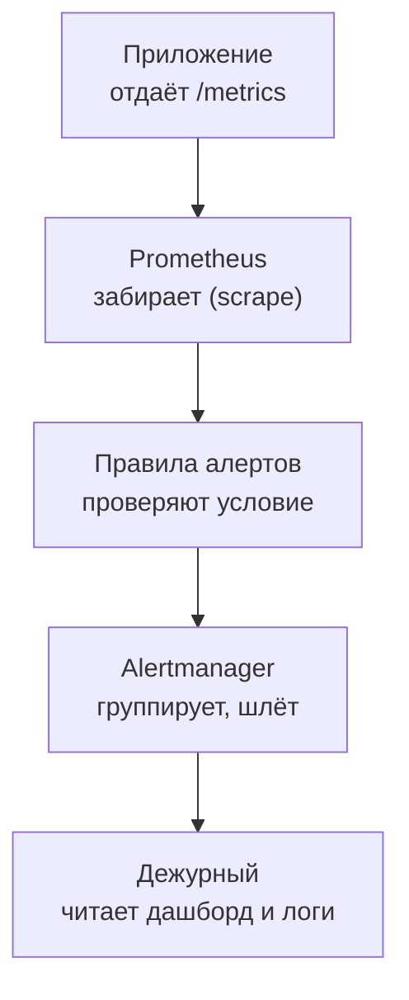

## Зачем это нужно

Вторая роль, на которую ты можешь претендовать после курса, это **инженер мониторинга** (monitoring engineer, часто часть команды SRE): человек, который следит, чтобы система была видна. Он настраивает сбор метрик, строит дашборды, пишет алерты, отвечает на вопросы «что сломалось и почему я узнал об этом первым». Собеседование на эту роль устроено иначе, чем на нагрузочного инженера: меньше про генераторы нагрузки, больше про метрики, PromQL, алерты и умение прочитать картину инцидента по панелям.

Урок как и предыдущий тренирует ответ вслух. Здесь тридцать с лишним вопросов по блокам: основы метрик, Prometheus и PromQL, Grafana и экспортеры, логи и алерты, затем задачи, где надо написать запрос, прочитать дашборд и разобрать неудачный алерт. Плюс практическое задание вживую и самооценка.

Шаг проекта: результат урока файл `~/perf-lab/13-final/mock-monitoring.md` с самооценкой и твой собственный «шпаргалочный» набор запросов PromQL, которые ты можешь написать по памяти.

## Что нужно знать

- Метрики, Prometheus и модель pull: [7.1](../07-observability/01-metrics-prometheus.md), PromQL: [7.2](../07-observability/02-promql.md), Grafana: [7.3](../07-observability/03-grafana.md), экспортеры: [7.4](../07-observability/04-exporters.md), логи Loki: [7.5](../07-observability/05-logs-loki.md), алерты: [7.6](../07-observability/06-alerts-incidents.md).
- Теория производительности: [8.1](../08-perf-theory/01-latency-throughput.md), [8.2](../08-perf-theory/02-queues-littles-law.md).
- Инцидент под нагрузкой и постмортем: [13.1](01-incident-under-load.md).
- Техника ответа вслух, «не знаю», самооценка: [13.4](04-mock-perf.md): прочитай «Теорию» оттуда, она общая.

## Картина целиком

Работа инженера мониторинга похожа на работу диспетчера аэропорта: десятки сигналов, из которых надо быстро собрать картину и сказать, что происходит и что делать. Главное качество не знание формул, а умение **двигаться от симптома к причине по приборам**. Аналогия ломается там, что у диспетчера приборы готовые, а инженер мониторинга сам решает, какие приборы поставить, и отвечает за то, чтобы они не врали.

Путь сигнала от приложения до человека на собеседовании полезно держать в голове целиком: интервьюер часто просит «опиши по шагам, что происходит от метрики до сообщения дежурному».



Цепочка из пяти звеньев, и в каждом может случиться поломка. Приложение может не отдавать метрику, Prometheus не достучаться, правило ошибиться в условии, Alertmanager заглушить, человек не заметить. Хороший ответ на «что может пойти не так с алертингом» проходит по этой цепочке.

## Теория

### Чего ждут от инженера мониторинга

Нанимающий хочет понять три вещи. Первое: понимаешь ли ты **модель метрик**: типы (счётчик, измеритель, гистограмма), метки (labels), почему нельзя ставить в метки пользовательский идентификатор (кардинальность). Второе: умеешь ли **читать и писать запросы** PromQL и объяснять их по частям. Третье: способен ли ты **рассуждать об алертах**: что считать симптомом, какой порог, чтобы не будить людей зря и не пропустить настоящую беду.

Типичная структура собеседования: десять минут о тебе, двадцать минут вопросов по метрикам и Prometheus, десять минут задача на чтение дашборда или запрос, десять минут про алерты и инциденты. Ниже банк следует тому же порядку.

### Метод для дашборда: RED и USE

Если тебя просят «прочитай дашборд», у тебя должна быть рамка, иначе будешь метаться между панелями. Две стандартные рамки:

- **RED** для сервисов, обслуживающих запросы: Rate (сколько запросов), Errors (сколько ошибок), Duration (сколько времени занимают, p95).
- **USE** для ресурсов: Utilization (занятость), Saturation (очередь, ожидание), Errors (ошибки).

Алгоритм чтения: сначала RED верхнего уровня, чтобы понять, **болит ли пользователь** (ошибки и задержка), затем USE, чтобы найти ресурс, который перегружен. Посмотри на живом примере, как выглядит картина при разных поломках, и потренируйся проговаривать её по рамке.

<div class="viz" data-viz="obs-dashboard" data-scenario="payment" data-title="Дашборд: что сломалось"></div>

Смотри: четыре панели с общим перекрестием; сценарий «медленная оплата» показывает, что по первым двум графикам причина не видна, нужно идти дальше к панели оплаты. Попробуй переключить сценарии на странице демо виджетов (`pool`, `ok`) и каждый раз проговаривай: что болит у пользователя, какой ресурс виноват, чем подтвердить. Именно такая речь нужна на собеседовании.

### Как отвечать на «напиши запрос»

Если интервьюер просит написать PromQL, не молчи и не торопись. Говори по шагам: «Метрика называется так, это счётчик, значит беру `rate` по окну пять минут; нужны только ошибки, фильтрую по метке `status`; суммирую по маршруту». Типичные ошибки, которых надо избегать: `rate` от гистограммы без `histogram_quantile`, `sum` до `rate` (в неверном порядке), забытое `by (le)` в квантиле. Проговаривание по шагам показывает, что ты понимаешь, а не вспоминаешь шаблон.

Базовые запросы стоит знать наизусть, они понадобятся в блоке задач:

```text
# RPS по маршрутам
sum by (route) (rate(http_requests_total[5m]))

# Доля ошибок 5xx
sum(rate(http_requests_total{status=~"5.."}[5m])) / sum(rate(http_requests_total[5m]))

# p95 задержки
histogram_quantile(0.95, sum by (le) (rate(http_request_duration_seconds_bucket[5m])))

# Очередь за соединением БД
shop_db_pool_waiting
```

Разбор. `rate(...[5m])` берёт счётчик за пять минут и делает из него скорость в секунду. `sum by (route)` складывает серии, оставляя только метку `route`. Регулярное выражение `5..` в `status=~` берёт статусы из трёх символов, начинающиеся с пятёрки. В `histogram_quantile` бакеты (корзины гистограммы) складываются по метке `le`, иначе квантиль считать не из чего. Вся нужная для собеседования магия укладывается в эти четыре шаблона.

### Алерты: симптом или причина

Классический вопрос на собеседовании: «какие алерты ты поставишь на сервис?» Хороший ответ различает **симптомные** алерты (пользователь страдает: ошибки, задержка) и **причинные** (ресурс подходит к пределу: пул, диск, память). Симптомные должны будить человека, причинные чаще предупреждают днём. Пример на «Магазине»:

| Алерт | Тип | Условие | for | Реакция |
| --- | --- | --- | --- | --- |
| Доля 5xx выше 5% | симптом | `sum(rate(...{status=~"5.."}[5m])) / sum(rate(...[5m])) > 0.05` | 2 мин | Страница дежурному |
| p95 каталога выше 1 с | симптом | `histogram_quantile(...) > 1` | 5 мин | Страница |
| Очередь за пулом растёт | причина | `shop_db_pool_waiting > 0` | 1 мин | Сообщение в канал |
| Оплата медленнее 1 с | причина | p95 `shop_payment_duration_seconds` выше 1 с | 5 мин | Сообщение в канал |

Параметр `for` задаёт, сколько времени условие должно держаться, прежде чем алерт сработает. Он убирает ложные срабатывания от коротких всплесков. Слишком длинный `for` задерживает обнаружение, слишком короткий превращает алерт в шум. Хороший алерт отвечает на четыре вопроса дежурного: что случилось, кого касается, куда смотреть, что делать (ссылка на инструкцию).

**Что путают:** «алертов много значит надёжно». Много алертов создают усталость от алертов (alert fatigue): люди перестают реагировать. Лучше пять осмысленных алертов, чем пятьдесят шумных.

### Кардинальность и стоимость метрик

Особенность, на которой проверяют понимание «на деле»: **кардинальность** (cardinality) это число уникальных сочетаний значений меток у метрики. Если ты добавил метку `user_id` в счётчик запросов, и пользователей миллион, Prometheus заведёт миллион серий и просто упрётся в память. Поэтому в метках держат значения с ограниченным набором: `route`, `method`, `status`, но не идентификаторы. Идентификаторы живут в логах и трассах. На собеседовании это показатель опыта: тот, кто проходил, знает эту ловушку.

### Логи, метрики, трассы

Три источника наблюдаемости дополняют друг друга. **Метрики** отвечают «сколько и как давно», они дёшевы и годятся для алертов. **Логи** отвечают «что именно произошло» по конкретному запросу, дороже, годятся для разбора. **Трассы** показывают путь одного запроса через сервисы и время на каждом участке. В курсе ты прошёл все три: метрики в Prometheus, логи в Loki и трассы (трейсы) в Tempo ([урок 7.7](../07-observability/07-traces.md)). Хороший ответ связывает их: по метрике видишь, что выросла доля ошибок, по логам с `request_id` находишь конкретные запросы и читаешь причину, а по `trace_id` из лога открываешь трейс и видишь, на каком участке ушло время.

### Как отвечать на инцидентные вопросы

Классическая формулировка: «Расскажи про сбой, который ты разбирал». У тебя есть готовый материал: инцидент из урока 13.1. Схема рассказа: **что видели** (симптом с цифрой), **как нашли причину** (по порядку: метрики, логи), **что сделали** (смягчение, затем исправление), **чему научились** (действия постмортема). Рассказ без обвинений: «замедлилась оплата», а не «кто-то сломал». Это тоже проверка зрелости.

### Самооценка и повторение

Используй ту же шкалу 0-1-2, что в [уроке 13.4](04-mock-perf.md): 2 = уверенно вслух за 30-90 секунд с цифрой, 1 = путался, 0 = не смог. Итог в процентах: ниже 60% повторяй материал, 60-80% нормально для junior, выше 80% готов. Отдельно считай блок задач: если «плывёшь» в запросах PromQL, повтори урок 7.2 и напиши десять запросов руками на живом Prometheus.

<div class="viz" data-viz="final-speed-quiz" data-seconds="40" data-questions='[{"q":"Назови типы метрик Prometheus.","a":"Counter (только растёт, например число запросов), gauge (может расти и падать, например память), histogram (распределение значений по бакетам, например время ответа), summary (квантили на стороне приложения)."},{"q":"Что делает rate?","a":"Берёт счётчик за окно и считает среднюю скорость роста в секунду. Пример: rate(http_requests_total[5m]) это запросов в секунду за пять минут."},{"q":"Что такое label и кардинальность?","a":"Label это пара ключ-значение, которая делит метрику на серии. Кардинальность это число уникальных серий. Идентификатор пользователя в метке даст миллионы серий и убьёт Prometheus."},{"q":"Pull или push в Prometheus?","a":"Pull: Prometheus сам приходит за метриками на /metrics с заданным интервалом (scrape). Push нужен для коротких заданий через Pushgateway."},{"q":"Как посчитать p95 из гистограммы?","a":"histogram_quantile(0.95, sum by (le) (rate(имя_bucket[5m])))."},{"q":"Что делает параметр for в алерте?","a":"Условие должно держаться заданное время, прежде чем алерт сработает. Убирает ложные срабатывания от коротких всплесков."},{"q":"Зачем Alertmanager, если алерты считает Prometheus?","a":"Alertmanager группирует, подавляет дубли, направляет в нужный канал, поддерживает тишину (silence) и маршрутизацию."},{"q":"Что такое RED?","a":"Rate, Errors, Duration: три показателя сервиса. Сколько запросов, сколько ошибок, сколько времени."},{"q":"Что такое USE?","a":"Utilization, Saturation, Errors: занятость, очередь и ошибки ресурса (CPU, диск, пул)."},{"q":"Что такое exporter?","a":"Программа, которая берёт метрики из системы, не умеющей отдавать их сама (ОС, база), и публикует в формате Prometheus на /metrics. Например node-exporter, postgres-exporter."},{"q":"Чем метрики отличаются от логов?","a":"Метрики это числа во времени: дёшево, для алертов и трендов. Логи это события с подробностями: дороже, для разбора конкретного случая."},{"q":"Что такое alert fatigue?","a":"Усталость от алертов: слишком много шума, люди перестают реагировать. Лечится меньшим числом осмысленных алертов."}]'></div>

Те же правила, что в уроке 13.4, но вопросы по мониторингу. Таймер 40 секунд: ответы чуть длиннее, чем в нагрузочных вопросах.

## Практика

### 1. Файл самооценки

```bash
cd ~/perf-lab/13-final
cat > mock-monitoring.md <<'EOF'
# Самооценка: собеседование по мониторингу

Шкала: 2 = уверенно за 30-90 с с цифрой, 1 = путался, 0 = не смог.

| Блок | Вопросы | Баллы | Что повторить |
| --- | --- | --- | --- |
| A. Основы метрик | 1-6 | | |
| B. Prometheus и PromQL | 7-12 | | |
| C. Grafana и экспортеры | 13-17 | | |
| D. Логи и алерты | 18-23 | | |
| E. Инциденты и процесс | 24-27 | | |
| F. Задачи | 28-34 | | |
EOF
```

### 2. Шпаргалка запросов: напиши руками

Подними стенд с мониторингом (если не поднят) и открой Prometheus по адресу `http://localhost:9090`. Запусти нагрузку на минуту, чтобы были данные:

```bash
cd ~/load-tester/project/shop && docker compose --profile monitoring up -d --wait
source ~/perf-lab/.venv/bin/activate
locust -f ~/perf-lab/09-locust/locustfile.py --host http://localhost:8000 --headless -u 5 -r 1 -t 3m --only-summary
```

В это время вбей в Prometheus по очереди запросы из теории и убедись, что каждый возвращает данные. Затем **без подглядывания** напиши по памяти запросы для задач ниже и проверь. Сохрани рабочие в файл:

```bash
cat > ~/perf-lab/13-final/promql-cheatsheet.md <<'EOF'
# PromQL: рабочие запросы по стенду
- RPS по маршрутам: sum by (route) (rate(http_requests_total[5m]))
- Доля 5xx: sum(rate(http_requests_total{status=~"5.."}[5m])) / sum(rate(http_requests_total[5m]))
- p95 задержки: histogram_quantile(0.95, sum by (le) (rate(http_request_duration_seconds_bucket[5m])))
- Очередь за соединением: shop_db_pool_waiting
- Доля попаданий в кэш: sum(rate(shop_cache_requests_total{result="hit"}[5m])) / sum(rate(shop_cache_requests_total[5m]))
- Оплата, p95: histogram_quantile(0.95, sum by (le) (rate(shop_payment_duration_seconds_bucket[5m])))
EOF
```

Одиночные фигурные скобки в запросах Jekyll не мешают, а двойных здесь нет. **Как читать:** если запрос вернул «Empty query result», проверь имя метрики (автодополнение в Prometheus) и окно: за последние секунды данных может быть мало.

**Типичные ошибки:** `parse error: unexpected` значит пропущена скобка или кавычка; `many-to-many matching not allowed` значит при делении двух запросов метки не совпали (добавь `sum` с `by` или `on(...)`); квантиль выдаёт `NaN`, когда нет запросов в окне.

### 3. Практическое задание вживую: прочитай дашборд

Открой дашборд Grafana «Магазин: обзор (эталон)» (`http://localhost:3000`, вход без пароля). Включи вживую нагрузку и измени задержку оплаты (команда из 13.1: `curl -X POST ... /admin/config` с `delay_ms`). Затем без бумажки, вслух, как на собеседовании, проговори за 2 минуты: что болит у пользователя (RED), какой ресурс перегружен (USE), чем подтверждаешь, что сделал бы. Запиши себя на диктофон и прослушай.

```bash
# вернуть оплату в норму после упражнения
curl -s -X POST http://localhost:8001/admin/config -H 'content-type: application/json' -d '{"delay_ms": 50, "fail_rate": 0}'
```

### 4. Разбери плохой алерт

Задание: ниже описание алерта «из прошлой жизни». Найди проблемы и перепиши:

```text
Алерт «CPU высокий»: node_cpu загружен выше 70% в течение 10 секунд. Шлёт в личку всем 12 инженерам. Описание: «CPU».
```

Проблемы: условие причинное, а не симптом, без `for` нормального (10 секунд это шум), нет понятия «что делать», описание пустое, получатели все сразу. Исправление: основной алерт на симптом (доля 5xx или p95), CPU как предупреждение с `for: 15m` в канал, в аннотации ссылка на инструкцию и дашборд, маршрутизация на дежурного. Напиши свою версию в `mock-monitoring.md`.

### 5. Пройди банк вопросов

Дальше идёт банк. Проговаривай вслух, потом сверяйся. Отмечай баллы. Два-три блока за сессию.

### 6. Итоговая сессия

Через день-два сделай сессию на время: десять случайных вопросов виджетом, по 40 секунд, и запиши итог:

```bash
echo "$(date +%F): сессия на время, мониторинг, знал 8 из 10, слабое: кардинальность" >> ~/perf-lab/13-final/mock-monitoring.md
```

## Сломай и почини

1. **Молчаливый алерт.** Создай правило, которое никогда не срабатывает: в запросе опечатка в имени метрики (`http_request_total` вместо `http_requests_total`). Правило в Prometheus будет «здорово», алерта нет. Урок: алерт, который не срабатывает, не отличить от здоровой системы. Лечение: тест правила на заведомо плохих данных и алерт на отсутствие метрики (`absent(...)`).
2. **Ложные срабатывания.** Поставь порог p95 на 100 мс с `for: 0`. Запусти нагрузку: правило будет мигать при каждом всплеске. Подними `for` до 5 минут и сравни: шум пропал, обнаружение задержалось ровно на пять минут. Это и есть компромисс.
3. **Взрыв кардинальности.** В тетради посчитай: метрика с метками `route` (10 значений), `method` (3), `status` (5): до 150 серий, нормально. Добавь метку `user_id` (1000 пользователей): 150 000 серий. Объясни вслух, почему это плохо и где хранить идентификаторы.
4. **Путаница rate и значения.** Построй график `http_requests_total` без `rate`: счётчик растёт монотонно и ничего не говорит. Оберни в `rate(...[5m])` и сравни. Запомни: счётчик без `rate` смотрят редко.

## Словарик урока

| Термин | Простыми словами |
| --- | --- |
| Инженер мониторинга | Специалист, который строит и поддерживает сбор метрик, дашборды и алерты. |
| RED | Три показателя сервиса: запросы, ошибки, время. |
| USE | Три показателя ресурса: занятость, очередь, ошибки. |
| Кардинальность | Число уникальных серий метрики; растёт с числом значений меток. |
| Симптомный алерт | Срабатывает, когда страдает пользователь (ошибки, задержка). |
| Причинный алерт | Срабатывает, когда ресурс подходит к пределу; предупреждает заранее. |
| `for` | Время, которое условие алерта должно держаться до срабатывания. |
| Alert fatigue | Усталость от шумных алертов, из-за которой их перестают замечать. |
| Тишина (silence) | Временное подавление алерта в Alertmanager, например на время работ. |
| Runbook | Инструкция дежурного для типового алерта. |

## Вопросы с собеседований

Раздел для повторения: ответь вслух, потом открой ответ. Блоки идут от простого к сложному; блок F это задачи. Баллы записывай в `mock-monitoring.md`.

### Блок A. Основы метрик

### 1. [junior] [часто] Какие типы метрик есть в Prometheus?

<details markdown="1">
<summary>Ответ</summary>

Counter (только растёт: запросы, ошибки), gauge (растёт и падает: память, очередь), histogram (распределение по бакетам: время ответа) и summary (квантили на стороне приложения). Для задержек обычно берут гистограмму, потому что её можно агрегировать по сервисам.

**Что хотят услышать:** четыре типа с примерами и применение.

**Красный флаг:** «метрики бывают числовые и текстовые».

</details>

### 2. [junior] [часто] Чем метрики отличаются от логов и трасс?

<details markdown="1">
<summary>Ответ</summary>

Метрики: числа во времени, дёшево, для алертов и трендов. Логи: события с деталями, для разбора конкретного случая. Трассы: путь одного запроса через сервисы со временем на каждом участке. Дополняют друг друга: по метрике вижу, что ошибки выросли, по логам с `request_id` читаю причину, по `trace_id` открываю трейс и вижу, где запрос потерял время.

**Что хотят услышать:** три источника и связка между ними.

**Красный флаг:** «логи заменяют метрики».

</details>

### 3. [junior] Что такое label?

<details markdown="1">
<summary>Ответ</summary>

Пара «ключ=значение», которая делит метрику на серии: `http_requests_total{route="/api/orders", status="200"}`. Позволяет фильтровать и группировать. Важно держать набор значений ограниченным.

**Что хотят услышать:** пример и осторожность с количеством значений.

**Красный флаг:** метка с идентификатором пользователя.

</details>

### 4. [junior] Что такое кардинальность и чем она опасна?

<details markdown="1">
<summary>Ответ</summary>

Число уникальных серий метрики. Если в метку попадают значения с неограниченным набором (id пользователя, адрес), серий становятся миллионы, Prometheus упирается в память и замедляется. Идентификаторы хранят в логах и трассах.

**Что хотят услышать:** пример и последствие.

**Красный флаг:** не знать понятия.

</details>

### 5. [junior] Pull или push: как Prometheus получает метрики?

<details markdown="1">
<summary>Ответ</summary>

Pull: Prometheus сам ходит за метриками на `/metrics` с интервалом (scrape interval). Плюс: сразу видно, что цель недоступна (метрика `up` равна 0). Push нужен для коротких заданий, которые не успеют быть опрошены (Pushgateway).

**Что хотят услышать:** модель pull и метрика `up`.

**Красный флаг:** «приложение само отправляет метрики».

</details>

### 6. [на скорость] Что такое scrape interval?

<details markdown="1">
<summary>Ответ</summary>

Как часто Prometheus забирает метрики: по умолчанию 15 секунд в нашем стенде. От него зависит, насколько мелкие события видны и какое окно брать для `rate`.

**Что хотят услышать:** период опроса и связь с окном.

**Красный флаг:** «секунд сколько хватит».

</details>

### Блок B. Prometheus и PromQL

### 7. [junior] [часто] Что делает функция rate и когда она нужна?

<details markdown="1">
<summary>Ответ</summary>

Берёт счётчик за окно и считает скорость роста в секунду. Нужна, потому что сам счётчик монотонно растёт и ничего не говорит. Пример: `rate(http_requests_total[5m])` даёт запросы в секунду за последние пять минут.

**Что хотят услышать:** смысл и пример.

**Красный флаг:** строить график счётчика без `rate`.

</details>

### 8. [junior] Как посчитать долю ошибок?

<details markdown="1">
<summary>Ответ</summary>

Делю скорость ошибочных запросов на скорость всех: `sum(rate(http_requests_total{status=~"5.."}[5m])) / sum(rate(http_requests_total[5m]))`. Регулярное выражение `5..` берёт статусы 5xx.

**Что хотят услышать:** деление двух `rate`, фильтр по статусу.

**Красный флаг:** делить счётчики без `rate`.

</details>

### 9. [middle] [часто] Как посчитать p95 задержки из гистограммы?

<details markdown="1">
<summary>Ответ</summary>

`histogram_quantile(0.95, sum by (le) (rate(http_request_duration_seconds_bucket[5m])))`. Сначала `rate` по бакетам, затем суммирование с сохранением метки `le`, затем квантиль. Точность зависит от границ бакетов: p95 не может быть точнее ширины бакета.

**Что хотят услышать:** порядок `rate`, `sum by (le)`, квантиль, ограничение точности.

**Красный флаг:** забыть `by (le)`.

</details>

### 10. [middle] Чем `sum by` отличается от `sum without`?

<details markdown="1">
<summary>Ответ</summary>

`sum by (route)` оставляет только перечисленные метки и складывает остальное. `sum without (instance)` убирает перечисленные и оставляет все остальные. Выбор зависит от того, что короче: перечислить нужное или лишнее.

**Что хотят услышать:** различие и пример.

**Красный флаг:** считать их синонимами.

</details>

### 11. [middle] Чем `rate` отличается от `irate` и `increase`?

<details markdown="1">
<summary>Ответ</summary>

`rate`: средняя скорость за окно, гладкая, подходит для алертов и графиков. `irate`: скорость по последним двум точкам, резкая, для быстрых колебаний. `increase`: прирост за окно (в штуках, а не в секунду).

**Что хотят услышать:** три функции и когда какая.

**Красный флаг:** использовать `irate` в алертах.

</details>

### 12. [на скорость] Что показывает метрика `up`?

<details markdown="1">
<summary>Ответ</summary>

1, если Prometheus успешно забрал метрики с цели, 0, если нет. Основа проверки «живы ли источники».

**Что хотят услышать:** смысл 0 и 1.

**Красный флаг:** «аптайм сервиса».

</details>

### Блок C. Grafana и экспортеры

### 13. [junior] Что такое экспортер и зачем он?

<details markdown="1">
<summary>Ответ</summary>

Программа, которая берёт данные из системы, не умеющей отдавать метрики Prometheus (ОС, база), и публикует их на `/metrics`. Примеры из стенда: node-exporter (хост), cAdvisor (контейнеры), postgres-exporter (база).

**Что хотят услышать:** назначение и примеры.

**Красный флаг:** «плагин Grafana».

</details>

### 14. [junior] Как выбрать, какие панели нужны на дашборде?

<details markdown="1">
<summary>Ответ</summary>

По RED для сервиса (запросы, ошибки, p95) и USE для ресурсов (CPU, память, пул БД). Сверху то, что болит у пользователя, ниже причины. Каждая панель отвечает на вопрос, а не просто «красиво».

**Что хотят услышать:** рамка и порядок.

**Красный флаг:** «все метрики, какие есть».

</details>

### 15. [middle] Чем опасно среднее на дашборде?

<details markdown="1">
<summary>Ответ</summary>

Прячет хвост: p95 может быть в разы хуже среднего. Для задержек показываю p50, p95, p99. Для ресурсов смотрю пики, а не только среднее по окну.

**Что хотят услышать:** пример, перцентили.

**Красный флаг:** «среднее достаточно».

</details>

### 16. [middle] Что значит «дашборд врёт»?

<details markdown="1">
<summary>Ответ</summary>

Бывает: окно `rate` слишком большое и сглаживает всплески; неверная единица на оси; агрегация скрывает выбросы; данные не успели прийти. Проверяю запрос панели, окно, единицы и сверяю с независимым источником (логи).

**Что хотят услышать:** список причин и проверка.

**Красный флаг:** «цифрам с дашборда верю всегда».

</details>

### 17. [на скорость] Что такое переменная дашборда?

<details markdown="1">
<summary>Ответ</summary>

Список значений (сервис, маршрут), которым переключается дашборд без правки запросов.

**Что хотят услышать:** переиспользование дашборда.

**Красный флаг:** «настройки интерфейса».

</details>

### Блок D. Логи и алерты

### 18. [junior] [часто] Какие алерты ты поставишь на веб-сервис?

<details markdown="1">
<summary>Ответ</summary>

Симптомные: доля 5xx выше порога и p95 выше SLO, с `for` несколько минут, будят дежурного. Причинные: очередь за пулом, оплата медленнее нормы, диск и память, уходят в канал. Плюс алерт на живость целей (`up`).

**Что хотят услышать:** разделение симптом и причина, `for`.

**Красный флаг:** «CPU выше 80%» как единственный алерт.

</details>

### 19. [junior] Что делает параметр `for`?

<details markdown="1">
<summary>Ответ</summary>

Условие должно держаться заданное время, прежде чем алерт сработает. Убирает ложные срабатывания от коротких всплесков, но задерживает обнаружение на это же время.

**Что хотят услышать:** компромисс.

**Красный флаг:** «не нужен».

</details>

### 20. [middle] Зачем нужен Alertmanager?

<details markdown="1">
<summary>Ответ</summary>

Группирует похожие алерты в одно сообщение, подавляет дубли, маршрутизирует по командам и каналам, поддерживает тишину и подавление (inhibition: не слать «сервис не отвечает», если уже сработал «сервер недоступен»).

**Что хотят услышать:** группировка, маршрутизация, тишина.

**Красный флаг:** «просто отправляет письма».

</details>

### 21. [middle] Что такое alert fatigue и как с ней бороться?

<details markdown="1">
<summary>Ответ</summary>

Усталость от слишком частых и бесполезных алертов: люди перестают реагировать, и настоящий пропускают. Борьба: убирать шум, оставлять алерты, требующие действия, группировать, настраивать `for`, ссылаться на инструкцию.

**Что хотят услышать:** признаки и меры.

**Красный флаг:** «больше алертов безопаснее».

</details>

### 22. [middle] Как ты ищешь причину по логам в Loki?

<details markdown="1">
<summary>Ответ</summary>

Сужаю по меткам (`{service="shop", level="ERROR"}`), по времени из метрики, потом по `request_id` смотрю цепочку одного запроса. Для всплеска считаю частоту сообщений. Из логов читаю точный текст ошибки, например про исчерпанный пул.

**Что хотят услышать:** метки, время, `request_id`.

**Красный флаг:** «открываю файл и читаю всё».

</details>

### 23. [на скорость] Что должно быть в описании хорошего алерта?

<details markdown="1">
<summary>Ответ</summary>

Что случилось, кого касается, куда смотреть (ссылка на дашборд), что делать (ссылка на инструкцию).

**Что хотят услышать:** четыре пункта.

**Красный флаг:** «название алерта».

</details>

### Блок E. Инциденты и процесс

### 24. [middle] [часто] Расскажи, как ты разбирал инцидент.

<details markdown="1">
<summary>Ответ</summary>

По схеме: что видели (симптом с цифрой), как нашли причину (метрики, логи), что сделали (смягчение, затем исправление), чему научились (действия постмортема с владельцами). Без поиска виноватых: «замедлилась оплата, пул исчерпался, нет алерта на очередь».

**Что хотят услышать:** хронология, цифры, действия, культура без обвинений.

**Красный флаг:** «нашёл виноватого».

</details>

### 25. [middle] С чего начнёшь, если ночью сработал алерт?

<details markdown="1">
<summary>Ответ</summary>

Оцениваю влияние на пользователя (RED), выбираю смягчение, если оно безопасно (откат, отключение функции), сообщаю статус, ищу причину по метрикам и логам. Причину не называю, пока она не подтверждена. Записываю хронологию по ходу.

**Что хотят услышать:** сначала влияние и смягчение, потом причина.

**Красный флаг:** «сразу лезу в код».

</details>

### 26. [middle] Что такое SLO и бюджет ошибок?

<details markdown="1">
<summary>Ответ</summary>

SLO это цель по качеству (например, 99,5% успешных запросов). Бюджет ошибок это допустимая доля сбоев (0,5%). Если бюджет израсходован, приоритет сдвигается к надёжности, а не новым функциям.

**Что хотят услышать:** связь с решениями.

**Красный флаг:** путать с SLA как с юридическим договором без пояснения.

</details>

### 27. [на скорость] Что такое runbook?

<details markdown="1">
<summary>Ответ</summary>

Инструкция дежурного для типового алерта: что значит, куда смотреть, что делать, кому эскалировать.

**Что хотят услышать:** практичность.

**Красный флаг:** «описание проекта».

</details>

### Блок F. Задачи

### 28. [middle] Задача: напиши запрос RPS по маршрутам за 5 минут.

<details markdown="1">
<summary>Ответ</summary>

`sum by (route) (rate(http_requests_total[5m]))`. Проговариваю: счётчик, значит `rate` по окну пять минут, суммирую по маршрутам.

**Что хотят услышать:** `rate`, `sum by`, пояснение по шагам.

**Красный флаг:** `sum` вместо `rate`.

</details>

### 29. [middle] Задача: напиши запрос доли попаданий в кэш.

<details markdown="1">
<summary>Ответ</summary>

`sum(rate(shop_cache_requests_total{result="hit"}[5m])) / sum(rate(shop_cache_requests_total[5m]))`. Если доля падает, кэш не помогает: проверяю ключи и время жизни.

**Что хотят услышать:** деление двух `rate`.

**Красный флаг:** брать значения счётчиков без `rate`.

</details>

### 30. [middle] Задача: p95 вырос, ошибок нет, RPS стал меньше. Что скажешь?

<details markdown="1">
<summary>Ответ</summary>

Признаки зависимости или очереди: запросы стоят и ждут, поэтому RPS падает. Проверю панель оплаты (`shop_payment_duration_seconds`), `shop_db_pool_waiting`, запросы в работе (`http_requests_in_progress`). Ошибок нет, потому что до таймаута не дошло.

**Что хотят услышать:** вывод из сочетания, список проверок.

**Красный флаг:** «добавить серверов».

</details>

### 31. [middle] Задача: при 20 RPS соединение занято 0,5 с, в пуле 5. Хватит ли пула?

<details markdown="1">
<summary>Ответ</summary>

Пропускная способность пула 5 / 0,5 = 10 в секунду. Приходит 20, значит нет: очередь растёт. Нужно уменьшить время удержания, увеличить пул (проверив лимит базы) или ограничить поток. Алерт поставлю на `shop_db_pool_waiting`.

**Что хотят услышать:** закон Литтла, число, варианты.

**Красный флаг:** «пул хватит, 5 больше 0,5».

</details>

### 32. [middle] Задача: алерт срабатывает каждые 10 минут и сам проходит. Что делаешь?

<details markdown="1">
<summary>Ответ</summary>

Смотрю график метрики за сутки: это настоящий всплеск или шум? Если шум, увеличиваю `for` и проверяю окно `rate`. Если настоящий, ищу причину периодичности (задание по расписанию, сборка мусора). Если алерт не требует действий, превращаю его в предупреждение или убираю.

**Что хотят услышать:** анализ данных, а не «заглушить».

**Красный флаг:** «просто отключу».

</details>

### 33. [middle] Задача: нужно измерять время запроса по пользователям. Предлагают метку `user_id`. Что ответишь?

<details markdown="1">
<summary>Ответ</summary>

Нет: кардинальность взорвётся (тысячи пользователей на десятки маршрутов дадут сотни тысяч серий). Для общей картины метрики по маршрутам, для конкретного пользователя логи с идентификатором или трассы. Если нужна сегментация, ввожу ограниченную метку вроде тарифа.

**Что хотят услышать:** расчёт серий, альтернатива.

**Красный флаг:** «добавить метку и всё».

</details>

### 34. [middle] Задача (разбор отчёта): отчёт показывает среднюю задержку 120 мс и вывод «всё хорошо». Что скажешь?

<details markdown="1">
<summary>Ответ</summary>

Среднее прячет хвост. Попрошу p95 и p99, распределение по маршрутам и ошибки. Если p95 около секунды, у каждого двадцатого пользователя плохо, хотя среднее красивое. Вывод по среднему недоказателен.

**Что хотят услышать:** перцентили, запрос данных.

**Красный флаг:** «среднее 120 мс, значит всё хорошо».

</details>

## Проверено на версиях

Prometheus 3.15, Alertmanager 0.34, Grafana 13.2, Loki 3.7, стенд «Магазин» из `project/shop`. Запросы проверяй на своём стенде: имена метрик взяты из `project/shop/README.md`. Октябрь 2026.

## Итог урока: ты умеешь

- [ ] Отвечать на вопросы по метрикам, Prometheus и алертам вслух за 30-90 секунд.
- [ ] Читать дашборд по рамкам RED и USE и проговаривать вывод.
- [ ] Написать по памяти запросы: RPS, доля ошибок, p95, доля попаданий в кэш.
- [ ] Различать симптомные и причинные алерты и объяснять `for`.
- [ ] Объяснить кардинальность и почему идентификатор пользователя нельзя в метку.
- [ ] Рассказать про разбор инцидента без поиска виноватых.
- [ ] Оценить себя по шкале 0-1-2 и составить план повторения.

Ты прошёл курс. Дальше: возвращайся к слабым блокам, повторяй вслух, выполняй тестовые задания и откликайся на вакансии. Возвращайся на [главную страницу курса](../course/index.md).
